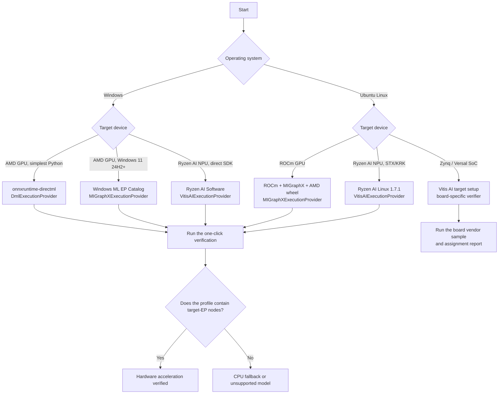
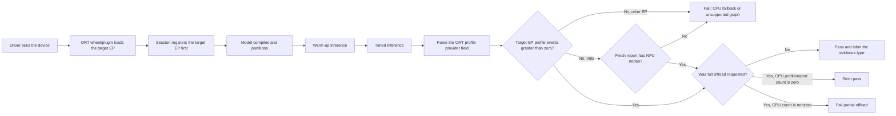

# ONNX Runtime + AMD: GPU and NPU

[简体中文](README.zh-CN.md) · [Repository index](../README.md)

| Item | Baseline |
|---|---|
| Last verified | `2026-07-17` against linked AMD, Microsoft, Canonical, ONNX Runtime, Docker Hub, and PyPI primary sources |
| Hosts | Windows and Ubuntu; support gates vary by GPU/NPU generation |
| Routes | DirectML, Windows ML MIGraphX, ROCm/MIGraphX, and Ryzen AI/Vitis AI |
| Entry point | [`provider_test.py`](provider_test.py) |
| Proof | Current-run node placement plus output sanity; CPU parity for the embedded GPU model or a custom model with `--compare-cpu` |
| Validation boundary | Script self-tests passed on Linux; final DirectML, Windows ML, MIGraphX, and Vitis AI proof requires matching hardware |

## 1. Choose a route

| Scenario | Recommended path | ONNX Runtime EP | Current status |
|---|---|---|---|
| Windows with a recent AMD GPU | DirectML for the simplest Python start; evaluate Windows ML for new applications | `DmlExecutionProvider` | DirectML remains supported but is in sustained engineering; Windows ML is Microsoft's new recommended direction |
| Windows 11 24H2+ with a supported AMD GPU | Dynamically acquire AMD MIGraphX through Windows ML | `MIGraphXExecutionProvider` | Available through Windows ML; the supplied verifier supports this path with `--windows-ml` |
| Ubuntu with an AMD GPU listed in the matching ONNX matrix | ROCm + MIGraphX + AMD wheel | `MIGraphXExecutionProvider` | **Primary Linux GPU path**; exact GPU, ROCm, Python, and wheel gates apply, and the old `ROCMExecutionProvider` is obsolete |
| Windows with a Ryzen AI NPU | Ryzen AI Software 1.7.1; Windows ML is also catalog-available | `VitisAIExecutionProvider` | PHX/HPT/STX/KRK; the supplied NPU verifier uses the Ryzen AI vendor environment (`--windows-ml` is GPU-only) |
| Ubuntu 24.04 with a Ryzen AI NPU | Ryzen AI for Linux 1.7.1 | `VitisAIExecutionProvider` | **STX/KRK only, kernel >= 6.10, Python 3.12** |
| Linux on AMD/Xilinx Adaptive SoCs | Vitis AI target image and runtime | `VitisAIExecutionProvider` | Embedded Linux path for Zynq and Versal |
| Native Windows ROCm Core SDK | **Not a current ORT MIGraphX Python path** | None | ROCm 7.14 adds broad Windows core support, but AMD's validated MIGraphX/ORT stack is currently Linux-only; use DirectML or Windows ML |

### Rules

1. **`ROCMExecutionProvider` was removed in ONNX Runtime 1.23.** ROCm 7.0 was the last AMD release carrying the old ROCm EP. New projects must use `MIGraphXExecutionProvider`.
2. `ort.get_available_providers()` only proves that an EP library can load. It **does not prove that any model node executes on that device**. The supplied script parses the current run's ORT profile. If the Ryzen AI Vitis EP does not emit provider-attributed profile events, it accepts only a **fresh, current-run** Vitis assignment report together with successful inference, and labels that weaker evidence accurately.
3. GPU and NPU use separate software stacks. ROCm/MIGraphX or DirectML target the GPU; Vitis AI/Ryzen AI targets the XDNA NPU. Installing ROCm does not enable the NPU, and installing an NPU driver does not enable GPU compute.

### Decision flow



---

## 2. Fundamentals

### 2.1 What is an ONNX Runtime Execution Provider?

ONNX Runtime reads the ONNX graph and assigns each node to a capable EP according to the ordered `providers` list. The first EP has the highest priority; `CPUExecutionProvider` is normally placed later as a fallback.

```python
providers = [
    "MIGraphXExecutionProvider",  # first choice
    "CPUExecutionProvider",      # fallback
]
```

| API or signal | What it proves | What it does not prove |
|---|---|---|
| `ort.get_available_providers()` | Which EPs the current wheel can load | Whether model nodes were placed on a GPU/NPU |
| `session.get_providers()` | Which EPs are registered for the session and their priority | The actual node-placement ratio |
| ORT verbose log | Initialization and node-placement details | It is awkward to automate and the format can change |
| `args.provider` on ORT `*_kernel_time` node events | Which EP executed those node kernels | Hardware utilization percentage |
| Vitis AI assignment report | CPU/NPU node counts and operator types | GPU EP placement |
| Task Manager / `amd-smi` / `xrt-smi` | Device activity and driver visibility | By themselves, they cannot attribute a specific ONNX node to the device |

### 2.2 GPU versus NPU

| Item | AMD GPU | AMD Ryzen AI NPU |
|---|---|---|
| Hardware architecture | RDNA/CDNA GPU | AMD XDNA NPU |
| Primary Linux stack | ROCm + MIGraphX | XRT + `amdxdna` + Ryzen AI/Vitis AI |
| Primary Windows stack | DirectML or Windows ML MIGraphX | Ryzen AI Software or Windows ML VitisAI |
| ORT EP | `MIGraphXExecutionProvider` / `DmlExecutionProvider` | `VitisAIExecutionProvider` |
| Typical precision | FP32, FP16, and hardware/EP-dependent BF16/INT8/FP8 | INT8 and BF16, subject to model and silicon generation |
| First load | MIGraphX compilation or tuning can be slow | Vitis AI compilation can take several minutes |
| Cache | MIGraphX cache / compiled artifacts | Vitis AI cache or ORT EP Context |

---

## 3. Version and support matrix

### 3.1 Snapshot verified on 2026-07-17

| Component | Verified current version | Notes |
|---|---:|---|
| Current ROCm Core SDK | 7.14.0 | Production release dated 2026-07-15; this is the first production release after the TheRock versioning discontinuity |
| ROCm 7.14 validated ONNX stack | ORT 1.23.2 + MIGraphX 2.16 | AMD currently limits this row to Linux, Python 3.12, and `gfx950`/`gfx942`; it is not a drop-in replacement for the broad 7.2.x recipes below |
| Audited AMD-hosted MIGraphX wheel route | ROCm 7.2.4 + ORT 1.23.2 | AMD's release-matched directory contains CPython 3.10 and 3.12 builds; this remains the newest broad, reproducible route enforced by the verifier |
| Official ROCm ORT Docker | ROCm 7.2.4 + ORT 1.23 + PyTorch 2.10.0 | These remain the newest published `rocm/onnxruntime` tags, for Ubuntu 22.04 and 24.04 |
| Consumer Radeon validation matrix | ROCm 7.2.1 + ORT 1.23.2 | The Radeon/Ryzen pages and the core ROCm pages update on different schedules |
| Latest upstream ONNX Runtime / PyPI MIGraphX package | 1.27.1 | Upstream release and PyPI wheel dated 2026-07-12; AMD has not published a matching broad ROCm compatibility row or `repo.radeon.com` release directory, so this guide does not substitute it into the audited route |
| Stable Ryzen AI Software | 1.7.1 | Windows and Ubuntu NPU support; the 1.8.0 beta is not recommended for production |
| Minimum Ryzen AI Windows NPU driver | 32.0.203.280 | Compatibility floor for Ryzen AI EP 1.7 |
| PyPI ONNX Runtime DirectML | 1.24.4 | Current x64 wheel; Python >= 3.11 |
| DirectML operator library in ORT | DirectML 1.15.2, ONNX opset up to 20 | Sustained engineering, with exceptions for some opset-20 operator configurations |
| Python packaging dependencies | pip 26.1.2; NumPy 2.5.1 latest | The guide uses current pip but deliberately pins NumPy 1.26.4 because AMD's Radeon 7.2.1 ORT wheel is documented as incompatible with NumPy 2.x; NumPy 2.5.1 also excludes the Python 3.10 route |
| Latest PyPI Windows ML artifacts | `wasdk-*` 2.3.0 + `onnxruntime-windowsml` 1.27.1 | They are independently serviced: the 2.3.0 projection requires ORT 1.25.2, while the newest public Windows App Runtime is 2.2.0; do not combine newest version numbers by hand |
| Reproducible Windows ML Python recipe in this guide | Windows App SDK / `wasdk-*` 2.1.3 + `onnxruntime-windowsml` 1.24.6.202605042033 | Exact dependency published by the 2.1.3 machine-learning wheel; do not mix `wasdk-*` and runtime versions |

> **Version rule:** "Latest" is not a compatibility guarantee. ROCm, MIGraphX, and the ORT MIGraphX wheel must come from a vendor-validated release set. Windows ML's two `wasdk-*` packages and Windows App Runtime must also share a release line, and the machine-learning projection's exact ORT dependency wins over the standalone ORT latest version. Do not install several `onnxruntime-*` distributions in one virtual environment.

> **Why Windows ML is pinned:** the unpinned PyPI projection is already 2.3.0 while Microsoft's public stable Windows App SDK download page currently lists 2.2.0 as its newest runtime. The 2.1.3 projection, exact ORT dependency, and 2.1.3 runtime used here are all still published and form one reproducible set. Do not replace these pins with `latest`.

### 3.2 Documentation skew

The generic ONNX Runtime Vitis AI page still describes Ryzen AI as Windows-only and Linux as Adaptive-SoC-only. Newer Ryzen AI Software 1.7.1 product documentation explicitly adds Ubuntu 24.04 NPU support for STX/KRK. Use the product-version documentation and release notes for Ryzen AI PCs, and use the Vitis AI target documentation for Zynq/Versal systems.

### 3.3 Audited artifact fingerprints

The verifier enforces these SHA-256 values. They were downloaded from the stated Microsoft PyPI or AMD HTTPS source and rehashed on 2026-07-17. A mismatch fails closed; it is not permission to bypass the check. Re-audit the new vendor artifact and update code/docs together.

| Artifact | SHA-256 |
|---|---|
| DirectML 1.24.4 CPython 3.12 x64 wheel | `f2ecb68b7b7b259d2ef3112ae760149f9b5a1e7c0fbb73d539da6250a648a614` |
| `DirectML.dll` inside that wheel | `b73972115320e906a49602f2027a3266622881b0d325ba685e0f165a9482a8d7` |
| AMD ROCm 7.2.1 MIGraphX 1.23.2 CPython 3.10 wheel | `07f485fbeb8fbd6a89fa42d24832b4e206057fca62654b0eb39eb1edf9d6e70a` |
| AMD ROCm 7.2.1 MIGraphX 1.23.2 CPython 3.12 wheel | `663bff4dc3f72582d69f12ad073eb5695dfb526d574376cc8e5b161c7d2f0f08` |
| MIGraphX provider SO inside both 7.2.1 wheels | `8079986332cdf12234635ed4f2b5abd1b49519f6592d6dfcd8afaf5000887b7b` |
| AMD ROCm 7.2.4 MIGraphX 1.23.2 CPython 3.10 wheel | `4886faab646a7ef12f33fb53f085208182fab8dac249ba199dc5d23f8bd128ec` |
| AMD ROCm 7.2.4 MIGraphX 1.23.2 CPython 3.12 wheel | `ee8edeb2ba6a8d99b3043b23e812423e6f10333b508e003fc77b0feda197449f` |
| MIGraphX provider SO inside both 7.2.4 wheels | `f3fb0b10996b2a2f94afc59edf6fab421bfa12842f09518339d1e0d8f3bd86c7` |
| AMD ROCm 7.14.0 MIGraphX 1.23.2 CPython 3.12 wheel | `67c32a5d8396c28da5efd3643c1ebcb55a03581aad089f7d99922ed5a51bc58b` |
| MIGraphX provider SO inside the 7.14.0 wheel | `447bb405de55dd7872a8e01a90405ff0f0397d5d562acc6f48711312971537c0` |

Windows ML is serviced dynamically, so the verifier instead requires certified catalog status and exact current MSIX `1.8.57.0`, in addition to the pinned Python distributions. The Windows App Runtime installer is accepted only with a valid Microsoft Authenticode signature.

---

## 4. Zero-rookie preflight

### 4.1 Windows: identify the GPU and NPU

Run in PowerShell:

```powershell
Get-CimInstance Win32_VideoController |
  Select-Object Name, DriverVersion, AdapterRAM

Get-PnpDevice -PresentOnly |
  Where-Object { $_.FriendlyName -match 'NPU|Neural|AMD' } |
  Format-Table -AutoSize

winver
```

Then open:

1. **Task Manager → Performance → GPU** and confirm the GPU name, driver, and DirectX 12 support.
2. **Task Manager → Performance → NPU**. A correctly installed Ryzen AI NPU driver should expose `NPU 0`.
3. On a machine with both an iGPU and dGPU, note the GPU numbering in Task Manager. DirectML `device_id=0` is not necessarily the fastest device.

### 4.2 Ubuntu: identify devices, OS, and permissions

```bash
cat /etc/os-release
uname -r
lspci -nnk | grep -EA3 'VGA|Display|3D|1022:17f0'
groups
ls -l /dev/kfd /dev/dri 2>/dev/null || true
```

After installing ROCm:

```bash
/opt/rocm/bin/rocminfo | grep -E 'Name:|Marketing Name:' | head -20
/opt/rocm/bin/amd-smi list
```

After installing Ryzen AI NPU/XRT:

```bash
source /opt/xilinx/xrt/setup.sh
xrt-smi examine
```

| Observation | Meaning |
|---|---|
| `/dev/kfd` and `/dev/dri/renderD*` | Linux GPU compute device nodes exist |
| `rocminfo` displays a `gfx...` agent | ROCm can see the GPU; the official hardware matrix must still list it |
| `1022:17f0` and `xrt-smi` show a Strix/Krackan NPU | Candidate for the Ryzen AI Linux NPU path |
| User is not in `render,video` | Common cause of `Permission denied`; log out or reboot after adding the groups |

---

## Part A — Ubuntu AMD GPU: ROCm + MIGraphX

## 5. Hardware and OS gates

AMD currently publishes three distinct ONNX Runtime tracks; the newest ROCm Core SDK version is not automatically the right ONNX package for every GPU:

1. **Current ROCm 7.14 track:** ORT 1.23.2 + MIGraphX 2.16, Linux x86-64, Python 3.12, and only `gfx950` (MI350X/MI355X) or `gfx942` (MI300X/MI325X). This guide's current recipe uses Ubuntu 24.04 so Python 3.12 comes from the distribution.
2. **Retained ROCm 7.2.4 track:** AMD's older release-matched ORT 1.23.2 wheels and Docker images remain available for CPython 3.10/3.12. Treat this as an audited compatibility route, not as the current ROCm production release; check the archived 7.2.4 hardware matrix and your AMD support policy before deployment.
3. **Radeon-focused ROCm 7.2.1 track:** AMD's current Radeon ONNX matrix still validates ORT 1.23.2 on selected Radeon 9000/7000 and Radeon PRO products, using Ubuntu 24.04.4 HWE 6.17 or Ubuntu 22.04.5 HWE 6.8.

Do not combine the driver, MIGraphX package, or wheel from different tracks.

Representative GPUs:

| Family | Representative models | Mandatory check |
|---|---|---|
| Instinct `gfx950` / `gfx942` | MI355X, MI350X, MI325X, MI300X | Current ROCm 7.14 AI Ecosystem ONNX matrix; use the exact GPU target reported by `rocminfo` |
| Other Instinct | MI300A, MI200 family, MI100 | The current 7.14 ONNX row does not list these targets; use only an explicitly supported archived route or a separately validated source build |
| Radeon PRO | AI PRO R9700/R9600D, W7900/W7800/W7700 families | Must appear in the Radeon-focused ONNX matrix; a core ROCm listing alone is insufficient for this rookie path |
| Radeon RDNA4 | RX 9070/9060 families | Usually restricted to specific Ubuntu/RHEL releases |
| Radeon RDNA3 | RX 7900/7800/7700 families | Use only SKUs explicitly listed by AMD |
| Unlisted GPU | Older Polaris/Vega/RDNA2 or another model | It might run, but it is not officially supported and must not be used for a production support commitment |

> An unlisted GPU appearing in `rocminfo` does not mean every prebuilt ROCm/MIGraphX library supports it. Enumeration may succeed while a prebuilt library later fails to launch a kernel.

**Ryzen APU iGPU caveat:** ROCm 7.14 adds core GPU support for several `gfx115x` Ryzen APUs, but its current AI Ecosystem ONNX row is limited to `gfx950/gfx942`. The separate Radeon 7.2.1 ONNX matrix also does not grant a Ryzen APU production row. Do not infer ONNX support from core ROCm enumeration. On a Ryzen AI laptop, DirectML is the broad Windows GPU path, while Vitis AI is the documented STX/KRK NPU path on Ubuntu.

## 6. Install the matching ROCm track

Before copying a block:

1. Confirm the exact GPU SKU, LLVM target, OS point release, and kernel in the matrix for the chosen track.
2. Choose exactly one track:
  - **Current Instinct track:** only `gfx950/gfx942`; use ROCm 7.14.0 and section 6.1.
  - **Retained older Instinct track:** use 7.2.4 only when its archived matrix and your support policy permit it; use section 6.2 or 6.3.
  - **Radeon-focused track:** only a discrete Radeon/Radeon PRO SKU listed in AMD's Radeon ONNX matrix; use 7.2.1 and section 6.4.
  - **Ryzen APU iGPU or another target:** stop unless AMD adds that exact target to an ONNX matrix.
3. **Do not overwrite an existing AMDGPU installation.** Follow the matching AMD uninstall procedure first. Radeon Software for Linux does not support an in-place upgrade.
4. With Secure Boot enabled, follow organizational policy for DKMS module signing; do not disable security controls merely to make the demo run.

The following routes install or replace GPU software and can require a reboot. Use only the route matching the exact hardware, release, and Ubuntu version.

### 6.1 Current ROCm 7.14.0 ONNX track — Ubuntu 24.04, `gfx950/gfx942` only

ROCm 7.14 uses the new TheRock packaging layout. Do not adapt the older `amdgpu-install_7.2.x` commands below. Open AMD's current [ROCm install selector](https://rocm.docs.amd.com/en/latest/install/rocm.html), select the exact GPU and Ubuntu 24.04, and complete its driver and repository prerequisites. For a package-manager installation, install exactly one architecture package after registering AMD's current repository:

```bash
# MI300X / MI325X only:
sudo apt install amdrocm7.14-gfx942

# OR MI350X / MI355X only (not both commands on a single-architecture host):
# sudo apt install amdrocm7.14-gfx950

sudo usermod -a -G render,video "$LOGNAME"
sudo reboot
```

After reboot, confirm the installed release and exact GPU target before continuing:

```bash
/opt/rocm/bin/hipconfig --version
/opt/rocm/bin/rocminfo | grep -E '^[[:space:]]*Name:[[:space:]]*gfx(942|950)$'
/opt/rocm/bin/amd-smi version
```

The `rocminfo` command must print the target corresponding to the selected GPU. A different `gfx` target is not eligible for the 7.14 ONNX wheel even if core ROCm supports it.

### 6.2 Retained ROCm 7.2.4 track — Ubuntu 24.04

This older block is retained for AMD's release-matched 7.2.4 ORT artifacts. It is not the current ROCm release.

```bash
wget --https-only -O amdgpu-install_7.2.4.70204-1_all.deb \
  https://repo.radeon.com/amdgpu-install/7.2.4/ubuntu/noble/amdgpu-install_7.2.4.70204-1_all.deb
sudo apt install ./amdgpu-install_7.2.4.70204-1_all.deb
sudo apt update

sudo apt install "linux-headers-$(uname -r)" "linux-modules-extra-$(uname -r)"
sudo apt install amdgpu-dkms

sudo apt install python3-setuptools python3-wheel
sudo usermod -a -G render,video "$LOGNAME"
sudo apt install rocm
sudo reboot
```

### 6.3 Retained ROCm 7.2.4 track — Ubuntu 22.04

```bash
wget --https-only -O amdgpu-install_7.2.4.70204-1_all.deb \
  https://repo.radeon.com/amdgpu-install/7.2.4/ubuntu/jammy/amdgpu-install_7.2.4.70204-1_all.deb
sudo apt install ./amdgpu-install_7.2.4.70204-1_all.deb
sudo apt update

sudo apt install "linux-headers-$(uname -r)" "linux-modules-extra-$(uname -r)"
sudo apt install amdgpu-dkms

sudo apt install python3-setuptools python3-wheel
sudo usermod -a -G render,video "$LOGNAME"
sudo apt install rocm
sudo reboot
```

### 6.4 Radeon-focused ONNX track — ROCm 7.2.1

This is the conservative, fully matrix-validated route for the discrete Radeon/Radeon PRO products listed on AMD's Radeon ONNX page. First install the HWE kernel required by that matrix, reboot, and verify the kernel before continuing.

Ubuntu 24.04.4:

```bash
sudo apt update
sudo apt-get install --install-recommends linux-generic-hwe-24.04
sudo reboot
```

After reboot, `uname -r` must report the supported 6.17 HWE line. Then run:

```bash
sudo apt update
sudo apt install -y python3-setuptools python3-wheel
wget --https-only -O amdgpu-install_7.2.1.70201-1_all.deb \
  https://repo.radeon.com/amdgpu-install/7.2.1/ubuntu/noble/amdgpu-install_7.2.1.70201-1_all.deb
sudo apt install ./amdgpu-install_7.2.1.70201-1_all.deb
sudo amdgpu-install -y --usecase=graphics,rocm
sudo usermod -a -G render,video "$LOGNAME"
sudo reboot
```

Ubuntu 22.04.5:

```bash
sudo apt update
sudo apt-get install --install-recommends linux-generic-hwe-22.04
sudo reboot
```

After reboot, `uname -r` must report the supported 6.8 HWE line. Then run:

```bash
sudo apt update
sudo apt install -y python3-setuptools python3-wheel
wget --https-only -O amdgpu-install_7.2.1.70201-1_all.deb \
  https://repo.radeon.com/amdgpu-install/7.2.1/ubuntu/jammy/amdgpu-install_7.2.1.70201-1_all.deb
sudo apt install ./amdgpu-install_7.2.1.70201-1_all.deb
sudo amdgpu-install -y --usecase=graphics,rocm
sudo usermod -a -G render,video "$LOGNAME"
sudo reboot
```

Verify after reboot:

```bash
groups
/opt/rocm/bin/rocminfo | head -80
/opt/rocm/bin/amd-smi list
cat /opt/rocm/.info/version
```

Expected results:

- The current user belongs to `render` and `video`.
- `rocminfo` lists at least one GPU agent.
- `amd-smi list` shows the expected GPU.
- The ROCm version matches the wheel repository you intend to use.

## 7. Install MIGraphX and the ORT wheel

### 7.1 MIGraphX runtime

For the **current ROCm 7.14** track, install AMD's exact MIGraphX 2.16 packages. The runtime package was checked to provide `/opt/rocm/bin/migraphx-driver` and to depend on the 7.14 runtime:

```bash
wget --https-only \
  https://rocm.frameworks.amd.com/deb-multi-arch/amdrocm-migraphx/pool/main/amdrocm-migraphx_2.16.0-3.py312_amd64.deb
wget --https-only \
  https://rocm.frameworks.amd.com/deb-multi-arch/amdrocm-migraphx/pool/main/amdrocm-migraphx-dev_2.16.0-3.py312_amd64.deb
sudo apt install -y \
  ./amdrocm-migraphx_2.16.0-3.py312_amd64.deb \
  ./amdrocm-migraphx-dev_2.16.0-3.py312_amd64.deb

/opt/rocm/bin/migraphx-driver --version
/opt/rocm/bin/migraphx-driver perf --test
dpkg-query -W -f='${Package} ${Version}\n' amdrocm-migraphx amdrocm-migraphx-dev
```

For either **7.2.x** track, use its release repository packages:

```bash
sudo apt update
sudo apt install -y migraphx

/opt/rocm/bin/migraphx-driver --version
/opt/rocm/bin/migraphx-driver perf --test
dpkg-query -W -f='${Package} ${Version}\n' migraphx half
```

`--test` is a documented built-in single-layer GEMM model, so no model filename is required. It compiles and runs a real MIGraphX performance test. On 7.2.x, the `half` library should arrive as a MIGraphX dependency; if the final `dpkg-query` says it is missing, run `sudo apt install -y half`. The current AMD 7.14 package recipe installs both runtime and development packages; on 7.2.x, `migraphx-dev` is needed only for development/source builds.

### 7.2 Create an isolated Python environment

AMD publishes three release-matched `onnxruntime_migraphx-1.23.2` routes used here: ROCm 7.14.0 is CPython 3.12-only and hardware-gated to `gfx950/gfx942`; the retained ROCm 7.2.4 and Radeon 7.2.1 repositories contain CPython 3.10 and 3.12 wheels. Use Ubuntu's native Python: 3.12 on Ubuntu 24.04, or 3.10 on Ubuntu 22.04 for a 7.2.x route. Do not add an unofficial Python repository merely for this demo.

Ubuntu 24.04:

```bash
sudo apt install -y python3.12 python3.12-venv
python3.12 -m venv .venv-amd-ort
```

Ubuntu 22.04:

```bash
sudo apt install -y python3.10 python3.10-venv
python3.10 -m venv .venv-amd-ort
```

Then activate the environment and install from the source matching the installed ROCm release. For the **current ROCm 7.14.0** track (`gfx950/gfx942`, Python 3.12 only):

```bash
source .venv-amd-ort/bin/activate
/opt/rocm/bin/hipconfig --version 2>&1 | grep -Eq '(^|[^0-9])7\.14(\.0)?([^0-9]|$)' || { echo "Installed ROCm is not 7.14.0" >&2; exit 1; }
python -m pip install --index-url https://pypi.org/simple "pip==26.1.2"
python -m pip install --index-url https://pypi.org/simple "numpy==1.26.4"
python -m pip install --index-url https://pypi.org/simple \
  "https://rocm.frameworks.amd.com/whl-multi-arch/onnxruntime-migraphx/onnxruntime_migraphx-1.23.2%2Brocm7.14.0-cp312-cp312-manylinux_2_27_x86_64.manylinux_2_28_x86_64.whl"
```

For the **retained ROCm 7.2.4** track:

```bash
source .venv-amd-ort/bin/activate
grep -Eq '(^|[^0-9])7\.2\.4([^0-9]|$)' /opt/rocm/.info/version || { echo "Installed ROCm is not 7.2.4" >&2; exit 1; }
python -m pip install --index-url https://pypi.org/simple "pip==26.1.2"
python -m pip install --index-url https://pypi.org/simple "numpy==1.26.4"
PYTAG="$(python -c 'import sys; print(f"cp{sys.version_info.major}{sys.version_info.minor}")')"
case "$PYTAG" in cp310|cp312) ;; *) echo "Unsupported Python ABI: $PYTAG" >&2; exit 1;; esac
python -m pip install --index-url https://pypi.org/simple \
  "https://repo.radeon.com/rocm/manylinux/rocm-rel-7.2.4/onnxruntime_migraphx-1.23.2-${PYTAG}-${PYTAG}-manylinux_2_27_x86_64.manylinux_2_28_x86_64.whl"
```

For the **Radeon-focused ROCm 7.2.1** track, use the same commands but the 7.2.1 repository:

```bash
source .venv-amd-ort/bin/activate
grep -Eq '(^|[^0-9])7\.2\.1([^0-9]|$)' /opt/rocm/.info/version || { echo "Installed ROCm is not 7.2.1" >&2; exit 1; }
python -m pip install --index-url https://pypi.org/simple "pip==26.1.2"
python -m pip install --index-url https://pypi.org/simple "numpy==1.26.4"
PYTAG="$(python -c 'import sys; print(f"cp{sys.version_info.major}{sys.version_info.minor}")')"
case "$PYTAG" in cp310|cp312) ;; *) echo "Unsupported Python ABI: $PYTAG" >&2; exit 1;; esac
python -m pip install --index-url https://pypi.org/simple \
  "https://repo.radeon.com/rocm/manylinux/rocm-rel-7.2.1/onnxruntime_migraphx-1.23.2-${PYTAG}-${PYTAG}-manylinux_2_27_x86_64.manylinux_2_28_x86_64.whl"
```

This is a newly created disposable venv. If `python -m pip list` already shows any `onnxruntime-*` distribution before installation, delete the venv and recreate it instead of uninstalling packages in place.

The direct AMD wheel URLs are deliberate. The 7.14 artifact comes from `rocm.frameworks.amd.com`; the 7.2.x artifacts come from their exact `repo.radeon.com` release directories. PyPI now has independently published same-named wheels, including 1.27.1, but AMD has not mapped those wheels to these release tracks. A `pip install ... -f` command no longer proves which build pip selected. The demo's `--bootstrap` path checks the selected AMD wheel against the SHA-256 audited on 2026-07-17 before installing it.

The explicit PyPI index prevents a personal pip mirror setting from silently changing dependency provenance. In a managed/offline environment, use only an organizational mirror whose artifacts and update policy have been independently validated.

Why pin NumPy 1.26.4? AMD's Radeon 7.2.1 ORT page explicitly warns that its wheel is incompatible with NumPy 2.x. This guide keeps one conservative dependency baseline across the three ORT 1.23.2 routes. Re-evaluate the pin only with hardware validation when AMD publishes a newer release-matched ORT stack.

Verify the wheel:

```bash
python -c "import onnxruntime as ort; print(ort.__version__); print(ort.get_available_providers())"
```

Expected providers include:

```text
['MIGraphXExecutionProvider', 'CPUExecutionProvider']
```

### 7.3 One-command GPU run

Run from the repository root:

```bash
python AMD/provider_test.py --target migraphx --strict-all
```

If the Python wheel is not installed, the script can install a wheel matching the installed ROCm release:

```bash
python AMD/provider_test.py \
  --target migraphx --bootstrap --strict-all
```

`--bootstrap` never installs a kernel driver. It only manages Python packages inside the active environment.

For safety, bootstrap requires an activated venv or non-base Conda environment, refuses to modify Ryzen AI/Windows ML vendor environments, checks x86-64 and the release-specific Python ABI, verifies MIGraphX and the installed ROCm release, and accepts only 7.2.1, 7.2.4, or 7.14.0. The 7.14 path additionally reads `rocminfo` and rejects any selected `--device-id` that is not `gfx942/gfx950` before downloading packages. Optional `--rocm-version` is only an assertion against the detected release. Bootstrap refuses to uninstall or rewrite an existing ORT distribution and downloads every required wheel before making a package change.

## 8. Ubuntu Docker fast path

Host prerequisites are the AMD kernel driver, `/dev/kfd`, `/dev/dri`, Docker Engine, and correct user permissions. The container carries the ROCm user-space libraries, MIGraphX, and ORT. Set `IMAGE` to the tag matching the host's validated track; do not use `latest`.

As of 2026-07-17, AMD has not published a ROCm 7.14 `rocm/onnxruntime` image. The newest official tags remain 7.2.4, so this Docker shortcut applies only to the 7.2.x tracks; use sections 6.1 and 7 for the current 7.14 path.

```bash
# ROCm core 7.2.4, Ubuntu 24.04:
IMAGE=rocm/onnxruntime:rocm7.2.4_ub24.04_ort1.23_torch2.10.0
# Radeon-focused ROCm 7.2.1, Ubuntu 24.04 (use this instead on that track):
# IMAGE=rocm/onnxruntime:rocm7.2.1_ub24.04_ort1.23_torch2.9.1

docker pull "$IMAGE"

docker run --rm -it \
  --device /dev/kfd \
  --device /dev/dri \
  --security-opt seccomp=unconfined \
  -v "$PWD:/workspace" \
  -w /workspace \
  "$IMAGE" \
  python3 AMD/provider_test.py --target migraphx --strict-all
```

Ubuntu 22.04 tags are `rocm7.2.4_ub22.04_ort1.23_torch2.10.0` for the core track and `rocm7.2.1_ub22.04_ort1.23_torch2.9.1` for the Radeon-focused track.

Verify inside the container:

```bash
rocminfo
/opt/rocm/bin/amd-smi list
```

---

## Part B — Windows AMD GPU

## 9. Simplest Python path: DirectML

### 9.1 Requirements

| Requirement | Minimum or guidance |
|---|---|
| OS | DirectML was introduced in Windows 10 version 1903; Windows 11 is recommended |
| GPU | DirectX 12 capable; DirectML broadly supports AMD GCN 1st Gen and newer |
| Driver | Latest stable AMD Adrenalin/PRO driver |
| Python | x64 Python 3.12 from python.org or winget; do not use Microsoft Store Python |
| Package | `onnxruntime-directml==1.24.4` for this verified snapshot |

### 9.2 Install

Run in PowerShell:

```powershell
winget install --id Python.Python.3.12 -e `
  --accept-package-agreements --accept-source-agreements
```

If this installed Python for the first time, close every PowerShell window and open a new one. Continue only when both checks succeed and the architecture is AMD64/x86-64:

```powershell
py -3.12 --version
py -3.12 -c "import platform; print(platform.machine())"
py -3.12 -m venv .venv-amd-dml
Set-ExecutionPolicy -Scope Process Bypass -Force
.\.venv-amd-dml\Scripts\Activate.ps1

python -m pip install --index-url https://pypi.org/simple "pip==26.1.2"
python -m pip install --index-url https://pypi.org/simple "numpy==1.26.4" "onnxruntime-directml==1.24.4"

python -c "import onnxruntime as ort; print(ort.get_available_providers())"
```

`numpy==1.26.4` is a conservative reproducibility pin shared with the audited AMD wheel path; it is not a DirectML hardware requirement. Revalidate before changing the pinned environment.

Expected:

```text
['DmlExecutionProvider', 'CPUExecutionProvider']
```

### 9.3 One-command run

```powershell
python AMD/provider_test.py --target dml --strict-all
```

On a multi-GPU machine:

```powershell
python AMD/provider_test.py --target dml --device-id 1 --strict-all
```

Run from the repository root. The demo applies the required DirectML settings and enumerates adapters through DXGI in the **same order DirectML uses**. It fails unless the selected `--device-id` has AMD PCI vendor ID `0x1002`.

Required session settings:

```python
options.enable_mem_pattern = False
options.execution_mode = onnxruntime.ExecutionMode.ORT_SEQUENTIAL
```

DirectML does not support ORT parallel execution or memory-pattern optimization. Do not call `Run` concurrently from several threads on one session. Use separate sessions for concurrency.

### 9.4 DirectML limitations

- DirectML is in sustained engineering. It remains supported, but new Windows development is moving to Windows ML.
- Current ORT documentation says DirectML 1.15.2 supports ONNX opset up to 20, except unsupported configurations such as 5-D GridSample 20 and DeformConv.
- Static input shapes generally improve constant folding, weight preprocessing, and GPU scheduling.
- `device_id=0` is the default DXGI adapter, not necessarily the fastest adapter.

## 10. New Windows path: Windows ML + AMD MIGraphX

Use this path for a new Windows 11 24H2+ application that benefits from system-managed EP downloads and updates. It requires more setup than a one-file DirectML experiment, but it is the strategic Windows direction.

### 10.1 Requirements and installation

| Item | Requirement |
|---|---|
| OS | Windows 11 24H2, build 26100 or newer, for dynamically acquired hardware EPs |
| Python | Windows ML generally supports 3.10–3.13 on x64/ARM64, but this audited AMD recipe is specifically x64 Python 3.12 and its pinned ORT requires Python >= 3.11; not Microsoft Store Python |
| Runtime | Windows App SDK Runtime matching the Python `wasdk-*` packages |
| AMD MIGraphX plugin | Acquired through the Windows ML EP Catalog; Microsoft's current table is highly driver-version-sensitive |
| AMD VitisAI plugin | Requires a Ryzen AI NPU driver; see Part C |

```powershell
winget install --id Python.Python.3.12 -e `
  --accept-package-agreements --accept-source-agreements
```

If winget installed Python for the first time, **close every PowerShell window and open a new PowerShell now**. Do not continue until both commands below succeed and report x64/AMD64 Python 3.12:

```powershell
py -3.12 --version
py -3.12 -c "import platform; print(platform.machine())"

py -3.12 -m venv .venv-winml
Set-ExecutionPolicy -Scope Process Bypass -Force
.\.venv-winml\Scripts\Activate.ps1

python -m pip install --index-url https://pypi.org/simple "pip==26.1.2"
python -m pip install --index-url https://pypi.org/simple `
  "numpy==1.26.4" `
  "wasdk-Microsoft.Windows.AI.MachineLearning[all]==2.1.3" `
  "wasdk-Microsoft.Windows.ApplicationModel.DynamicDependency.Bootstrap==2.1.3" `
  "onnxruntime-windowsml==1.24.6.202605042033"

winget install --id "Microsoft.VCRedist.2015+.x64" -e `
  --accept-package-agreements --accept-source-agreements

$runtimeInstaller = "$env:TEMP\windowsappruntimeinstall-2.1.3-x64.exe"
Invoke-WebRequest `
  https://aka.ms/windowsappsdk/2.1/2.1.3/windowsappruntimeinstall-x64.exe `
  -OutFile $runtimeInstaller

$signature = Get-AuthenticodeSignature -LiteralPath $runtimeInstaller
if ($signature.Status -ne 'Valid' -or $signature.SignerCertificate.Subject -notmatch 'Microsoft Corporation') {
  Remove-Item -LiteralPath $runtimeInstaller -Force -ErrorAction SilentlyContinue
  throw "Windows App Runtime installer signature is not a valid Microsoft signature."
}

try {
  $process = Start-Process $runtimeInstaller -ArgumentList "--quiet" -Wait -PassThru
  if ($process.ExitCode -ne 0) {
    throw "Windows App Runtime installer failed: 0x$('{0:X8}' -f $process.ExitCode)"
  }
} finally {
  Remove-Item -LiteralPath $runtimeInstaller -Force -ErrorAction SilentlyContinue
}
```

The machine-learning wheel itself requires the exact ORT build shown above; spelling it out makes pip's result auditable. The explicit 2.1.3 pins and signed 2.1.3 runtime installer are intentional: installing the latest `wasdk-*` wheel while retaining an older runtime is a common bootstrap failure. Verify before running:

```powershell
python -m pip list | findstr /i "wasdk onnxruntime-windowsml winrt-runtime"
```

Expected key versions are both `wasdk-*` packages at 2.1.3 and `onnxruntime-windowsml` at 1.24.6.202605042033. Stop and recreate the venv if pip reports a different ORT distribution or more than one `onnxruntime-*` distribution.

Then run the repository verifier from the repository root:

```powershell
python AMD/provider_test.py `
  --target migraphx --windows-ml --strict-all
```

The script keeps the Windows App Runtime bootstrap context alive, calls `ensure_ready_async().get()`, registers the downloaded plugin with `ort.register_execution_provider_library()`, selects its `OrtEpDevice`, and creates the session in the **same Python process**.

### 10.2 Python EP acquisition caveat

In Python, do **not** call `EnsureAndRegisterCertifiedAsync()` and assume it registers providers into Python's ORT environment. Current Microsoft guidance is:

1. Initialize the Windows App Runtime for the lifetime of the Python operation.
2. Call `find_all_providers()` and select the exact EP.
3. Call `ensure_ready_async().get()` and verify the returned status.
4. Register its `library_path` with `ort.register_execution_provider_library()` in that process.
5. Enumerate `ort.get_ep_devices()`, select the intended device, and add it with `SessionOptions.add_provider_for_devices()`.

The supplied script implements this sequence for AMD MIGraphX. Do not copy a fixed plugin DLL path; Windows ML owns and updates that path.

Current AMD EP names in Windows ML:

| AMD device | EP name |
|---|---|
| AMD GPU | `MIGraphXExecutionProvider` |
| AMD Ryzen AI NPU | `VitisAIExecutionProvider` |
| Generic DX12 GPU fallback | `DmlExecutionProvider` |

Current live-table gates on 2026-07-17:

| Plugin | Current catalog release | Driver gate |
|---|---|---|
| MIGraphX | MSIX 1.8.57.0 / GPU EP 7.2.2606.20 | AMD GPU driver **25.10.13.09 exactly**; not currently supported for GenAI scenarios |
| VitisAI | MSIX 1.8.63.0 / EP 2858 | Min Adrenalin 25.6.3 + NPU 32.00.0203.280; max Adrenalin 25.9.1 + NPU 32.00.0203.297 |

Only the current catalog version is supported. These values change through Windows Update D-week releases, so recheck the live table before installation or image freeze. A newer numerical driver is **not automatically compatible**.

> **Do not mix the two NPU tracks:** AMD's direct Ryzen AI 1.7.1 page links NPU drivers 32.0.203.280 and 32.0.203.314, but the current Windows ML VitisAI catalog row has a maximum of 32.00.0203.297. Driver .314 is therefore outside the current Windows ML VitisAI gate even though AMD lists it for the direct 1.7.1 SDK. The supplied NPU command uses the direct Ryzen AI environment, not `--windows-ml`.

### 10.3 Why native Windows ROCm is not this ORT path

ROCm 7.14 substantially expands the Windows Core SDK, so the older statement that Windows receives only a small HIP subset is no longer generally accurate. The narrower ONNX fact still matters: AMD's current MIGraphX 2.16 and ONNX Runtime 1.23.2 AI Ecosystem pages validate only Linux x86-64 on `gfx950/gfx942`, and the AMD ORT wheel is a manylinux artifact. Installing native Windows ROCm therefore does not make `MIGraphXExecutionProvider` appear in a normal Windows ORT Python wheel. Current Windows choices are:

- DirectML (`onnxruntime-directml`) for the simplest Python GPU path;
- Windows ML to acquire AMD's MIGraphX plugin;
- native Ubuntu ROCm/MIGraphX when the exact Linux matrix supports the workload.

### 10.4 WSL2 status: not a MIGraphX route

Do **not** use WSL2 for this MIGraphX demo. AMD's current ROCDXG WSL guide (Adrenalin 26.2.2 + ROCm 7.2.1) explicitly states that **MIGraphX is not currently supported by WSL**. An older, now-legacy 7.2 compatibility page listed ONNX Runtime 1.23.2, but that does not override the current limitation. The supplied verifier therefore rejects MIGraphX on a WSL kernel instead of presenting a false supported path.

Use one of these supported alternatives:

- native Ubuntu with the exact Part A matrix and release set;
- native Windows DirectML for the simplest AMD GPU route;
- Windows ML MIGraphX when the exact catalog driver gate is satisfied.

Ryzen AI 1.7.1 NPU documentation likewise describes native Windows and native Ubuntu 24.04 STX/KRK, not WSL NPU passthrough.

---

## Part C — Windows Ryzen AI NPU: Vitis AI

## 11. Supported scope

Ryzen AI Software 1.7 supports Phoenix (PHX), Hawk Point (HPT), Strix/Strix Halo (STX), and Krackan Point (KRK).

| Model type | PHX/HPT | STX/KRK |
|---|---:|---:|
| CNN INT8 | Yes | Yes |
| CNN BF16 | No | Yes |
| NLP/encoder BF16 | No | Yes |
| LLM through ONNX Runtime GenAI | No | Yes |

Recommended ONNX opset: **17**. Unsupported nodes are automatically partitioned to the CPU unless strict placement is requested and verified.

## 12. Install Ryzen AI Software 1.7.1

### 12.1 Prerequisites

| Dependency | Requirement |
|---|---|
| Windows | Windows 11 build >= 22621.3527 for the direct Ryzen AI 1.7.1 stack |
| NPU driver | 32.0.203.280 or newer; still verify compatibility with the exact EP release |
| Visual Studio | VS 2022 with Desktop Development with C++ for builds/custom ops; optional for the basic Python quicktest |
| CMake | >= 3.26 |
| Environment manager | Miniforge preferred |
| Supported NPU | Confirm in Ryzen AI release notes, not merely by the processor marketing name |

### 12.2 Driver and software

0. If Miniforge is not installed, download the official `Miniforge3-Windows-x86_64.exe`, install it to a path without spaces or special characters, and create the Start-menu **Miniforge Prompt** shortcut. Following AMD's prerequisite, add only that installation's `condabin` directory to the **System** `PATH`; do not add a different Conda installation. Close all terminals, open Miniforge Prompt, and require `where.exe conda` and `conda --version` to succeed. Do not substitute Microsoft Store Python.
1. In PowerShell, install CMake with this single command:

```powershell
winget install --id Kitware.CMake -e --accept-package-agreements --accept-source-agreements
```

Close and reopen Miniforge Prompt, then require this to report 3.26 or newer:

```powershell
cmake --version
```

Visual Studio 2022 with **Desktop development with C++** is optional for this basic quicktest, but required for AMD Quark custom-op/build workflows.

2. Download the production NPU driver from the official Ryzen AI installation page.
3. Extract the driver ZIP.
4. Open an **Administrator** terminal and run:

```powershell
.\npu_sw_installer.exe
```

5. Reboot if requested, then verify **Task Manager → Performance → NPU 0**. For this direct Ryzen AI 1.7.1 path, use one of its linked production drivers (32.0.203.280 or 32.0.203.314); do not combine the Ryzen AI 1.8 beta driver with this 1.7.1 stack. If instead targeting Windows ML VitisAI, return to section 10 and obey its narrower live driver range.
6. Download and run `ryzen-ai-lt-1.7.1.exe`.
7. Keep the default installation path unless deployment policy requires another location.
8. Let the installer create the default Conda environment `ryzen-ai-1.7.1`.

### 12.3 Vendor quicktest (STX/KRK)

AMD states that the unmodified vendor quicktest is expected to work on **STX/KRK or newer devices**. Open the Start-menu **Miniforge Prompt** (the Command Prompt shortcut, not PowerShell) and use cmd.exe syntax:

```bat
conda activate ryzen-ai-1.7.1
python -c "import onnxruntime as ort; print(ort.__version__); print(ort.get_available_providers())"
cd /d "%RYZEN_AI_INSTALLATION_PATH%\quicktest"
python quicktest.py
```

Stop if `VitisAIExecutionProvider` is absent; do not try to repair the vendor environment with pip.

Expected final line:

```text
Test Finished
```

Watch the NPU graph in Task Manager while the test runs.

On **PHX/HPT**, do not use an unmodified `quicktest.py`: AMD requires `target=X1`, `xlnx_enable_py3_round=0`, and the Phoenix `4x4.xclbin`. Skip directly to section 12.4; the repository verifier applies those options without modifying the vendor file.

### 12.4 One-command proof with profiling

From the repository root, while the Ryzen AI environment is active:

```powershell
python AMD/provider_test.py --target npu --strict-all
```

The script locates the vendor `quicktest/test_model.onnx`, detects PHX/HPT versus STX/KRK, creates the correct Vitis AI options, runs inference, and rejects a zero-NPU-node result.

> **Do not run `pip install onnxruntime` inside the Ryzen AI environment.** A generic CPU wheel can overwrite the vendor ORT files and remove `VitisAIExecutionProvider`.

## 13. Vitis AI provider options by generation

| Device | INT8 `target` | `xclbin` | Notes |
|---|---|---|---|
| STX/KRK and newer | `X2` by default; `X1` can be tested for specific models | Must **not** be set for the normal X2 flow | Supports the current INT8 compiler; BF16 is available |
| PHX/HPT | `X1` required | `...\xclbins\phoenix\4x4.xclbin` required | Current compatibility table supports CNN INT8 only |

Minimal STX/KRK example:

```python
import onnxruntime as ort

options = {
    "target": "X2",
    "cache_dir": r"C:\temp\my-vitis-cache",
    "cache_key": "my-model-v1",
    "enable_cache_file_io_in_mem": "0",
}

session = ort.InferenceSession(
    "model_int8.onnx",
    providers=[
        ("VitisAIExecutionProvider", options),
        "CPUExecutionProvider",
    ],
)
```

### BF16 and production deployment

- FP32 CNN/Transformer models can enter the BF16 compilation flow on supported STX/KRK devices.
- `config_file` controls BF16 compiler settings such as `optimize_level` and preferred data layout.
- AMD recommends precompiled BF16 models for C++ deployment; deployment EPs do not support every on-the-fly BF16 compilation scenario.
- First compilation can take minutes. Use the Vitis AI cache during development and ORT EP Context for final packaging.
- Delete or re-key caches after changing the Vitis AI EP or NPU driver. Caches are not portable across arbitrary versions.

### Generate an assignment report

PowerShell:

```powershell
$env:XLNX_ONNX_EP_REPORT_FILE = "vitisai_ep_report.json"
python your_inference.py
```

The report's `deviceStat` section shows `CPU` and `NPU` node counts. Set `enable_cache_file_io_in_mem=0` and inspect the configured cache directory.

---

## Part D — Ubuntu Ryzen AI NPU: Vitis AI

## 14. Current Linux support gate

Ryzen AI 1.7.1 is the first current product-documentation path in this guide that explicitly supports Ryzen NPU inference on Linux.

| Requirement | Current 1.7.1 value |
|---|---|
| Supported NPU families | STX and KRK |
| Distribution | Ubuntu 24.04 LTS |
| Kernel | >= 6.10 |
| Python | 3.12.x |
| RAM | 64 GB recommended |
| Models | CNN INT8/BF16, encoder NLP BF16, NPU-only LLM flow |
| EP | `VitisAIExecutionProvider` |

PHX/HPT are **not** listed in the current Linux support statement. Do not infer Linux support from the Windows matrix.

## 15. Install the Ubuntu NPU driver and Ryzen AI

### 15.1 Base packages

```bash
sudo apt update
sudo apt install -y software-properties-common
sudo add-apt-repository -y universe
sudo apt update
sudo apt install -y python3.12 python3.12-venv libboost-filesystem1.74.0 pciutils
uname -r
```

The official 1.7.1 page requires `libboost-filesystem1.74.0`; Ubuntu 24.04 publishes it in the `universe` component, which the commands above enable explicitly. Do not substitute a binary from another Ubuntu release.

Ubuntu 24.04 GA can have a kernel below 6.10. Move to a supported Ubuntu HWE/OEM kernel through an Ubuntu-supported mechanism, reboot, and recheck `uname -r` before installing XRT.

For a normal GA/HWE installation, Canonical's documented command is:

```bash
sudo apt-get update
sudo apt-get install --install-recommends linux-generic-hwe-24.04
sudo reboot
```

After reboot, run `uname -r` and continue only when it is >= 6.10. If `ubuntu-drivers list-oem` prints an OEM kernel track, keep the OEM-supported cadence and consult the PC vendor/Ubuntu documentation instead of switching tracks blindly.

### 15.2 Download and install XRT/NPU packages

Download `RAI_1.7.1_Linux_NPU_XRT.zip` from the official AMD Ryzen AI download page, accept the license, extract it, and run from the extracted directory:

```bash
sudo apt install --fix-broken -y ./xrt_202610.2.21.75_24.04-amd64-base.deb
sudo apt install --fix-broken -y ./xrt_202610.2.21.75_24.04-amd64-base-dev.deb
sudo apt install --fix-broken -y ./xrt_202610.2.21.75_24.04-amd64-npu.deb
sudo apt install --fix-broken -y ./xrt_plugin.2.21.260102.53.release_24.04-amd64-amdxdna.deb

export LD_LIBRARY_PATH=/lib/x86_64-linux-gnu:${LD_LIBRARY_PATH:-}
source /opt/xilinx/xrt/setup.sh
xrt-smi examine
```

The expected device name resembles `NPU Strix`; the exact BDF and name vary by machine.

### 15.3 Install the Ryzen AI 1.7.1 package

Download `ryzen_ai-1.7.1.tgz` from AMD, then run:

```bash
mkdir -p ryzen_ai-1.7.1
cp ryzen_ai-1.7.1.tgz ryzen_ai-1.7.1/
cd ryzen_ai-1.7.1
tar -xvzf ryzen_ai-1.7.1.tgz

./install_ryzen_ai.sh -a yes -p "$HOME/ryzen-ai-1.7.1/venv"
source "$HOME/ryzen-ai-1.7.1/venv/bin/activate"
echo "$RYZEN_AI_INSTALLATION_PATH"
python -c "import sys; assert sys.version_info[:2] == (3, 12), sys.version; print(sys.version)"
python -c "import onnxruntime as ort; print(ort.__version__); print(ort.get_available_providers())"
```

Linux uses the installer-created Python virtual environment. Ignore Windows-only Conda steps in examples. Stop if `VitisAIExecutionProvider` is absent; never install a generic ORT wheel into this environment.

### 15.4 Quicktest and one-command proof

```bash
export LD_LIBRARY_PATH=/lib/x86_64-linux-gnu:${LD_LIBRARY_PATH:-}
source /opt/xilinx/xrt/setup.sh
source "$HOME/ryzen-ai-1.7.1/venv/bin/activate"
cd "$HOME/ryzen-ai-1.7.1/venv/quicktest"
python quicktest.py

# Replace this value with the absolute path to this repository.
REPO_ROOT="/absolute/path/to/Tutorial-ONNX-Runtime-Execution-Providers-main"
cd "$REPO_ROOT"
python AMD/provider_test.py --target npu --strict-all
```

If the installation path differs, activate that environment and pass the quicktest model explicitly:

```bash
source /opt/xilinx/xrt/setup.sh
python AMD/provider_test.py \
  --target npu \
  --model /your/ryzen-ai/venv/quicktest/test_model.onnx \
  --strict-all
```

---

## Part E — Vitis AI on AMD Adaptive SoCs

## 16. Embedded Linux targets

| Host ISA | Vitis AI target | Example boards | OS |
|---|---|---|---|
| Arm Cortex-A53 | Zynq UltraScale+ MPSoC | ZCU102, ZCU104, KV260 | Linux |
| Arm Cortex-A72 | Versal AI Core/Premium | VCK190 | Linux |
| Arm Cortex-A72 | Versal AI Edge | VEK280 | Linux |

Workflow:

1. Start from the board-specific Vitis AI target image/BSP.
2. Follow the Vitis AI Target Setup instructions to install firmware, XRT, the DPU overlay, and the matching runtime package.
3. Install or use the prebuilt Vitis AI ONNX Runtime EP supplied for the target.
4. Quantize with AMD Quark or Vitis AI Quantizer for the target DPU.
5. Create the session with `VitisAIExecutionProvider` and CPU fallback.
6. Verify node assignment with Vitis AI logs/reports and device tools.

Do not use the x86-64 Ryzen AI installer or ROCm MIGraphX wheel on these Arm targets. The generic ONNX Runtime build page states that Linux `--use_vitisai` support is enabled for AMD Adaptive SoCs through this target workflow.

---

## Part F — One-click Python demo

## 17. Demo behavior

File: [provider_test.py](provider_test.py)

| Feature | Behavior |
|---|---|
| `--target auto` | Priority: Vitis AI NPU → MIGraphX GPU → DirectML GPU |
| `--target gpu` | Linux selects MIGraphX; a normal Windows pip environment selects DirectML |
| `--windows-ml` | Windows only: bootstraps the matching Windows App Runtime, verifies the pinned Python distributions and current MIGraphX MSIX 1.8.57.0, acquires/registers the plugin, and selects its AMD `OrtEpDevice` in the same process |
| `--target npu` | Requires the vendor-installed Vitis AI EP and never replaces it with a public wheel |
| `--bootstrap` | Requires a clean isolated environment; pins and hash-verifies the Python 3.12 Microsoft DirectML wheel or the exact AMD-hosted ROCm 7.2.1/7.2.4/7.14.0 wheel, enforces the 7.14 `gfx942/gfx950` gate, stages dependencies first, never installs drivers, and never uninstalls an existing ORT |
| Runtime provenance | Rechecks the installed DirectML/MIGraphX distribution version and provider DLL/SO hash; Windows ML rechecks all three pinned distribution versions |
| Default GPU model | Writes an integrity-checked embedded opset-17 Conv → Relu → GlobalAveragePool model; the separate `onnx` package is not required |
| Default NPU model | Uses the Ryzen AI vendor quicktest model, which is known to be NPU-compatible |
| Output sanity | Every warm-up/timed result must contain nonempty tensor outputs; floating/complex tensors must be finite; object/sequence/map outputs fail closed and require a model-specific runner |
| Numerical check | Always compares the generated GPU model with a separate CPU EP run; `--compare-cpu` enables the same check for a user model (`--rtol`/`--atol` are configurable) |
| Verification | Counts only current-run ORT `Node` events ending in `*_kernel_time` with provider attribution; Vitis may use a newly generated assignment report plus successful inference when attribution is absent |
| Failure policy | EP loaded but no target profile event (and no fresh Vitis NPU assignment evidence) results in a nonzero exit code |
| `--strict-all` | Sets ORT's `session.disable_cpu_ep_fallback=1` before session creation, then independently rejects CPU events/nodes in the profile or Vitis report |
| Evidence isolation | Every invocation uses a new artifact/cache directory, so stale Vitis reports and incompatible compiled caches cannot produce a false pass |
| `--unit-tests` | Runs the verifier's built-in deterministic safety/unit suite without AMD hardware, then exits |
| WSL | Rejects MIGraphX because AMD's current WSL guide marks it unsupported |
| Scope limit | Ryzen AI PC NPU only; the script deliberately rejects Arm Zynq/Versal Adaptive SoCs, which require board-specific models/options |

### 17.1 Command table

| Platform | Command |
|---|---|
| Windows AMD GPU, DirectML | `python AMD/provider_test.py --target dml --bootstrap --strict-all` |
| Windows AMD GPU, Windows ML MIGraphX | `python AMD/provider_test.py --target migraphx --windows-ml --strict-all` |
| Ubuntu AMD GPU | `python AMD/provider_test.py --target migraphx --bootstrap --strict-all` (detects 7.2.1, 7.2.4, or the hardware-gated 7.14.0 track) |
| Windows Ryzen AI NPU | `python AMD/provider_test.py --target npu --strict-all` |
| Ubuntu Ryzen AI NPU | `python AMD/provider_test.py --target npu --strict-all` |
| Existing custom model | Add `--model path/to/model.onnx` |
| Custom model + CPU parity | Add `--compare-cpu`; use model-appropriate `--rtol` and `--atol` if reduced precision is expected |
| Dynamic input | Add `--shape input_name=1,3,224,224` |
| Select the second GPU | Add `--device-id 1`; DirectML indexes DXGI adapters, Windows ML indexes AMD MIGraphX `OrtEpDevice` objects, and Linux MIGraphX follows the GPU-agent order reported by `rocminfo` |
| Allow partial CPU fallback | Omit `--strict-all`; at least one accelerator node is still required |
| Script-only CPU self-test | `python AMD/provider_test.py --target cpu` |
| Built-in unit tests | `python AMD/provider_test.py --unit-tests` |

A successful profile-backed accelerator run ends with:

```text
[PASS/通过] Runtime profile verified ... executed node event(s) on ...
```

On a Vitis build that does not expose provider attribution in its ORT profile, success is reported separately as successful inference plus the NPU count from the **fresh** assignment report. Assignment counts are unique graph nodes; profile counts are execution events repeated across warm-up/timed runs. They must not be compared as percentages.

If the provider appears only in `get_available_providers()` but has neither a profiled target event nor fresh Vitis NPU assignment evidence, the script deliberately exits with failure.

`--strict-all` first asks ORT to reject CPU EP placement during session creation, then rejects every CPU event/node exposed by the current ORT profile or Vitis report. It cannot prove facts omitted by all provider evidence channels. Likewise, a hardware-placement `PASS` for the vendor NPU model or an arbitrary custom model is not an application-accuracy certification. Use trusted test vectors or `--compare-cpu` before production use.

For DirectML, the script enumerates `IDXGIFactory::EnumAdapters`, verifies that `--device-id` exists, and requires the selected adapter's PCI vendor ID to be AMD (`0x1002`). This closes the mixed-vendor false-positive gap that a name-only WMI check cannot close.

Run evidence is stored under `~/.cache/amd-ort-oneclick/runs/` on Linux and the equivalent home directory on Windows, or under `AMD_ORT_DEMO_CACHE` when set. The Vitis cache is intentionally fresh per invocation, so an NPU check can compile for several minutes every time. This favors trustworthy installation proof over benchmark convenience. Delete old run directories after collecting evidence.

To inspect and then remove Linux run directories older than seven days:

```bash
find ~/.cache/amd-ort-oneclick/runs -mindepth 1 -maxdepth 1 -type d -mtime +7 -print
# After reviewing the printed paths, repeat the command with -exec rm -rf -- {} +
```

### 17.2 Run your own model

```bash
python AMD/provider_test.py \
  --target migraphx \
  --model /absolute/path/model.onnx \
  --shape images=1,3,224,224 \
  --compare-cpu
```

The generic input generator supports common numeric and Boolean tensor types. Every dynamic input requires an explicit, rank-correct `--shape`; unknown input names and attempts to change fixed dimensions are rejected before inference. Floating inputs use deterministic values and integer/Boolean inputs use zeros. `--compare-cpu` requires the CPU EP to support the whole model and its custom operators; failure in that separate reference session is not evidence that the accelerator failed. Models requiring token semantics, nonzero lengths, several correlated inputs, strings, custom operators, calibration data, or domain-specific accuracy metrics need a model-specific preprocessing/reference runner. The EP verification logic can still be reused.

---

## 18. Minimal provider code

### 18.1 Linux MIGraphX GPU

```python
import onnxruntime as ort

session = ort.InferenceSession(
    "model.onnx",
    providers=[
        ("MIGraphXExecutionProvider", {"device_id": "0"}),
        "CPUExecutionProvider",
    ],
)
```

Useful MIGraphX options:

| Option | Meaning |
|---|---|
| `device_id` | GPU index, default 0 |
| `migraphx_fp16_enable` | Enable FP16 conversion where supported |
| `migraphx_bf16_enable` | Enable BF16 conversion where supported |
| `migraphx_int8_enable` | Enable INT8; requires calibration settings |
| `migraphx_fp8_enable` | Enable FP8; hardware and model requirements apply |
| `migraphx_exhaustive_tune` | Longer compilation/tuning for a possible performance gain |
| `migraphx_mem_limit` | EP arena limit; total process GPU memory can be higher |

Do not enable reduced precision until accuracy has been measured against a trusted CPU/reference run.

### 18.2 Windows DirectML GPU

```python
import onnxruntime as ort

options = ort.SessionOptions()
options.enable_mem_pattern = False
options.execution_mode = ort.ExecutionMode.ORT_SEQUENTIAL

session = ort.InferenceSession(
    "model.onnx",
    sess_options=options,
    providers=[
        ("DmlExecutionProvider", {"device_id": "0"}),
        "CPUExecutionProvider",
    ],
)
```

### 18.3 Ryzen AI Vitis AI NPU

```python
import onnxruntime as ort

options = {
    "target": "X2",  # STX/KRK integer flow
    "cache_dir": "./vitis-cache",
    "cache_key": "model-v1",
    "enable_cache_file_io_in_mem": "0",
}

session = ort.InferenceSession(
    "model.onnx",
    providers=[
        ("VitisAIExecutionProvider", options),
        "CPUExecutionProvider",
    ],
)
```

### 18.4 Advanced: build ONNX Runtime with an AMD EP

Use a source build only when no released AMD/vendor package is available or a custom ORT feature is genuinely required. A source build increases the compatibility surface and does not replace the device driver/runtime.

The one-click verifier deliberately accepts only the release binary hashes audited by this guide. A custom source build will therefore fail its provenance gate even if the build is legitimate. Validate a source build with its own ORT provider tests plus the same profile-placement methodology; do not present it as the audited prebuilt stack.

#### Linux MIGraphX wheel

Prerequisites are matching ROCm and MIGraphX installations, a supported compiler/CMake/Python, and sufficient RAM and disk. Build from an ORT release tag that matches the deployment plan:

```bash
git clone --recursive https://github.com/microsoft/onnxruntime.git
cd onnxruntime
git checkout v1.23.2
git submodule update --init --recursive

./build.sh \
  --config Release \
  --parallel \
  --build_wheel \
  --use_migraphx \
  --migraphx_home /opt/rocm

python -m pip install build/Linux/Release/dist/*.whl
```

For a reusable C/C++ library, also add `--build_shared_lib`. Run applicable tests before packaging; do not use `--skip_tests` merely to hide an incompatibility.

#### Windows DirectML wheel

Run in a Visual Studio Developer PowerShell with a supported Windows SDK:

```powershell
git clone --recursive --branch v1.24.4 `
  https://github.com/microsoft/onnxruntime.git onnxruntime-dml-1.24.4
cd onnxruntime-dml-1.24.4
.\build.bat --config Release --parallel --use_dml --build_wheel
```

#### Windows Vitis AI build

This is not a replacement for the Ryzen AI installer and is not a rookie setup path. The upstream command is shown only for developers who already have the matching Ryzen AI/Vitis AI development dependencies and the exact ORT source revision required by that SDK:

```powershell
.\build.bat --use_vitisai --build_shared_lib --parallel --config Release --build_wheel
```

Do not run that command in the DirectML checkout above or on an arbitrary `main` branch. Obtain the supported ORT revision and dependency setup from the Ryzen AI release package/support channel first; if no exact revision is documented for the intended SDK, use the vendor-provided runtime rather than inventing a binary combination.

For Linux Adaptive SoCs, follow the board's Vitis AI target setup instead of treating the x86 ROCm build as interchangeable. Provider `.so`/`.dll` files must remain co-located with the matching ORT runtime. Never combine binaries from different builds.

---

## 19. Verification flow



### Hardware-side monitoring

| Platform | Command or UI | What to look for |
|---|---|---|
| Linux GPU | `/opt/rocm/bin/amd-smi monitor` or `/opt/rocm/bin/amd-smi metric` | GPU activity and VRAM during repeated inference |
| Linux GPU | `rocminfo` | Correct `gfx` target and device count |
| Windows GPU | Task Manager → GPU → Compute | Activity on the intended adapter |
| Windows/Linux NPU | Task Manager NPU / `xrt-smi examine` | NPU visibility and activity |
| Vitis AI | Assignment report | Nonzero NPU node count |

A tiny model can finish too quickly for a utilization graph. Repeat inference or use a real model, but keep profile-based node assignment as the primary correctness gate.

---

## 20. Performance guidance

| Recommendation | Why |
|---|---|
| Warm up before timing | The first session/run can compile kernels, allocate memory, and populate caches |
| Measure session creation separately | MIGraphX/Vitis AI compilation time is not steady-state inference latency |
| Use fixed shapes when practical | Better graph folding, memory planning, and DirectML/MIGraphX compilation |
| Reuse one session | Avoid repeated compilation and allocator setup |
| Version cache keys | Prevent stale artifacts after model, driver, or EP changes |
| Measure end-to-end and device-only time separately | NumPy CPU inputs/outputs include host-device transfer cost |
| Inspect CPU fallback | One unsupported operator can create expensive device boundaries |
| Establish an FP32 baseline before FP16/BF16/INT8 | Reduced precision can change accuracy and supported partitioning |
| Use I/O Binding only after correctness | It can eliminate copies, but provider/device memory management is more complex |
| Pin a validated production stack | Driver + ROCm/XRT + EP + ORT + Python ABI must remain compatible |

---

## 21. Troubleshooting

| Symptom or error | Likely cause | Fix |
|---|---|---|
| Only `CPUExecutionProvider` appears | Wrong ORT distribution or inactive vendor environment | Create a clean venv; install the exact DML/MIGraphX wheel or activate the Ryzen AI environment |
| Demo reports multiple `onnxruntime-*` distributions | Overlapping wheels share the same Python module files | Delete the environment and recreate it with exactly one runtime package; do not try to repair a vendor environment in place |
| `--bootstrap` refuses the environment | Base/system Python, a vendor environment, an existing ORT distribution, or unverifiable/mismatched ROCm was detected | Delete and recreate the dedicated disposable venv from the relevant section; bootstrap intentionally never repairs/uninstalls ORT in place |
| Demo reports an unaudited distribution or DLL/SO hash | A same-named PyPI wheel, modified binary, different release, or custom source build is installed | For the documented path, delete and recreate the environment from the direct vendor URL or `--bootstrap`; validate intentional source builds separately |
| `ROCMExecutionProvider` is missing on ORT 1.23+ | Expected removal | Migrate to `MIGraphXExecutionProvider` |
| MIGraphX provider shared library cannot load | ROCm/MIGraphX version mismatch or missing runtime library | `sudo apt install migraphx`; inspect the provider `.so` with `ldd`; align the wheel repository |
| `Permission denied` for `/dev/kfd` | User is not in `render,video` | Run `sudo usermod -a -G render,video $LOGNAME`, then log out or reboot |
| `hipErrorNoBinaryForGpu` / invalid device function | GPU architecture is absent or unsupported | Check the official GPU matrix; do not rely only on `rocminfo` visibility |
| Import fails after a NumPy upgrade | AMD wheel ABI mismatch | Use a clean venv and `numpy==1.26.4` for the currently documented wheel |
| DirectML uses the wrong GPU | `device_id=0` maps to another DXGI adapter | Check Task Manager; try `--device-id 1`; benchmark both |
| DirectML test rejects PCI vendor other than `0x1002` | The selected DXGI index is Intel/NVIDIA/Microsoft, not AMD | Use the adapter list printed by the script and pass the AMD index with `--device-id` |
| DirectML session rejects options | Parallel mode or memory pattern is enabled | Set sequential mode and disable memory pattern |
| Windows ML pip install fails on Python 3.10 | The pinned `onnxruntime-windowsml` dependency declares Python >= 3.11 even though Windows ML's general API range begins at 3.10 | Use the guide's Python 3.12 environment |
| Windows ML bootstrap fails or reports no MIGraphX catalog entry | `wasdk-*`/Windows App Runtime mismatch, Store Python, OS below 24H2, or incompatible AMD driver | Use the exact pinned 2.1.3/1.24.6.202605042033 recipe, python.org/winget Python, build >=26100, and the exact live-table driver |
| Vitis AI EP appears but all nodes use CPU | Unsupported operators/shapes/precision or wrong model generation | Use opset 17, inspect the supported-op table and assignment report, and quantize/compile correctly |
| PHX/HPT Vitis session fails | Missing `target=X1` or `4x4.xclbin` | Use generation-specific options and the vendor installation path |
| STX/KRK error mentions xclbin | A legacy option was carried forward | Remove `xclbin` for the current X2 flow |
| First NPU load takes minutes | Expected compilation | Enable caching and separate compilation time from inference time |
| NPU cache fails after an update | Cache/driver/EP incompatibility | Delete or version the cache and regenerate EP Context |
| Ubuntu cannot see the NPU | Kernel < 6.10, XRT/amdxdna absent, or unsupported PHX/HPT | Meet the exact 1.7.1 Linux gate and run `xrt-smi examine` |
| Docker cannot see the GPU | Device passthrough is missing | Add `--device /dev/kfd --device /dev/dri` and verify the host driver |
| EP is registered but demo exits with code 5 | No target-provider profile events and no fresh Vitis NPU assignment evidence | This is intentional fail-closed behavior; inspect unsupported nodes, current-run report, and logs |

### Advanced Linux library check

Locate and inspect the MIGraphX provider library without copying it into a global system directory:

```bash
provider_so="$(find "$VIRTUAL_ENV" -name 'libonnxruntime_providers_migraphx.so' -print -quit)"
if [[ -z "$provider_so" ]]; then
  echo "MIGraphX provider library was not found in $VIRTUAL_ENV" >&2
else
  echo "$provider_so"
  ldd "$provider_so" | grep 'not found' || true
fi
```

ORT recommends keeping provider shared libraries beside the matching ORT library. Do not globally mix `.so`/`.dll` files from different ORT installations.

---

## 22. Production checklist

- [ ] The hardware SKU is explicitly listed in the matching AMD support matrix.
- [ ] The OS build/kernel is exactly supported.
- [ ] Driver, ROCm/XRT, MIGraphX/Vitis AI, ORT, and Python ABI versions are pinned as one tested set.
- [ ] Only one `onnxruntime-*` distribution is installed in the environment.
- [ ] The target EP is first and CPU fallback policy is intentional.
- [ ] A profile/assignment report proves target-device node execution.
- [ ] Accuracy is compared with CPU/reference data before reduced precision is enabled.
- [ ] First-run compilation and steady-state latency are measured separately.
- [ ] Cache invalidation policy covers model, EP, and driver version changes.
- [ ] Unsupported operators and CPU/device boundaries are documented.
- [ ] Deployment licenses for AMD/Windows ML/Vitis AI packages are reviewed.
- [ ] CI runs at least one real target-device smoke test; provider-list-only tests are rejected.

---

## 23. References

| Topic | Official source |
|---|---|
| ORT EP build page | <https://onnxruntime.ai/docs/build/eps.html#amd-migraphx> |
| MIGraphX EP | <https://onnxruntime.ai/docs/execution-providers/MIGraphX-ExecutionProvider.html> |
| Removed ROCm EP notice | <https://onnxruntime.ai/docs/execution-providers/ROCm-ExecutionProvider.html> |
| Vitis AI EP | <https://onnxruntime.ai/docs/execution-providers/Vitis-AI-ExecutionProvider.html> |
| DirectML EP | <https://onnxruntime.ai/docs/execution-providers/DirectML-ExecutionProvider.html> |
| PyPI DirectML package | <https://pypi.org/project/onnxruntime-directml/> |
| ORT Python API | <https://onnxruntime.ai/docs/api/python/api_summary.html> |
| ROCm documentation | <https://rocm.docs.amd.com/en/latest/> |
| ROCm Linux installation | <https://rocm.docs.amd.com/projects/install-on-linux/en/latest/> |
| ROCm Linux system requirements | <https://rocm.docs.amd.com/projects/install-on-linux/en/latest/reference/system-requirements.html> |
| ROCm Docker | <https://rocm.docs.amd.com/projects/install-on-linux/en/latest/how-to/docker.html> |
| AMD ORT Docker tags | <https://hub.docker.com/r/rocm/onnxruntime/tags> |
| AMD ROCm wheel repository | <https://repo.radeon.com/rocm/manylinux/> |
| MIGraphX installation | <https://rocm.docs.amd.com/projects/AMDMIGraphX/en/latest/install/install-migraphx.html> |
| Radeon native-Linux support and ONNX matrix | <https://rocm.docs.amd.com/projects/radeon-ryzen/en/latest/docs/compatibility/compatibilityrad/native_linux/native_linux_compatibility.html> |
| Radeon 7.2.1 driver/ROCm installation | <https://rocm.docs.amd.com/projects/radeon-ryzen/en/latest/docs/install/installrad/native_linux/install-radeon.html> |
| Radeon MIGraphX + ONNX installation | <https://rocm.docs.amd.com/projects/radeon-ryzen/en/latest/docs/install/installrad/native_linux/install-onnx.html> |
| ROCm 7.14 release notes and compatibility | <https://rocm.docs.amd.com/en/latest/about/release-notes.html> · <https://rocm.docs.amd.com/en/latest/compatibility/compatibility-matrix.html> |
| ROCm 7.14 ONNX Runtime / MIGraphX install | <https://rocm.docs.amd.com/projects/ai-ecosystem/en/latest/inference/onnxruntime.html> · <https://rocm.docs.amd.com/projects/ai-ecosystem/en/latest/inference/migraphx.html> |
| Ryzen AI 1.7.1 documentation | <https://ryzenai.docs.amd.com/en/latest/> |
| Ryzen AI Windows installation | <https://ryzenai.docs.amd.com/en/latest/inst.html> |
| Ryzen AI Linux installation | <https://ryzenai.docs.amd.com/en/latest/linux.html> |
| Ryzen AI model deployment and options | <https://ryzenai.docs.amd.com/en/latest/modelrun.html> |
| Ryzen AI release notes | <https://ryzenai.docs.amd.com/en/latest/relnotes.html> |
| Ryzen AI supported operators | <https://ryzenai.docs.amd.com/en/latest/ops_support.html> |
| Windows ML overview | <https://learn.microsoft.com/en-us/windows/ai/new-windows-ml/overview> |
| Windows ML installation | <https://learn.microsoft.com/en-us/windows/ai/new-windows-ml/distributing-your-app?tabs=python> |
| Windows ML available EPs | <https://learn.microsoft.com/en-us/windows/ai/new-windows-ml/supported-execution-providers> |
| Windows ML EP acquisition | <https://learn.microsoft.com/en-us/windows/ai/new-windows-ml/initialize-execution-providers?tabs=python> |
| Windows ML EP registration | <https://learn.microsoft.com/en-us/windows/ai/new-windows-ml/register-execution-providers?tabs=python> |
| Windows App SDK runtime downloads | <https://learn.microsoft.com/en-us/windows/apps/windows-app-sdk/downloads> |
| Windows App Runtime installer options | <https://learn.microsoft.com/en-us/windows/apps/windows-app-sdk/deploy-unpackaged-apps> |
| PowerShell Authenticode verification | <https://learn.microsoft.com/en-us/powershell/module/microsoft.powershell.security/get-authenticodesignature> |
| PyWinRT Windows App Runtime bootstrap | <https://pywinrt.readthedocs.io/en/latest/api/winui3/index.html> |
| Windows ML Python package metadata | <https://pypi.org/project/wasdk-Microsoft.Windows.AI.MachineLearning/> |
| Official Miniforge installer | <https://github.com/conda-forge/miniforge#install> |
| Current Radeon WSL / ROCDXG guide and MIGraphX limitation | <https://rocm.docs.amd.com/projects/radeon-ryzen/en/latest/docs/install/installrad/wsl/howto_wsl.html> |
| Ubuntu HWE kernel | <https://ubuntu.com/kernel/lifecycle> |

> URLs and version matrices evolve quickly. Recheck the live compatibility page before upgrading a production image; never infer support solely from a higher version number.
