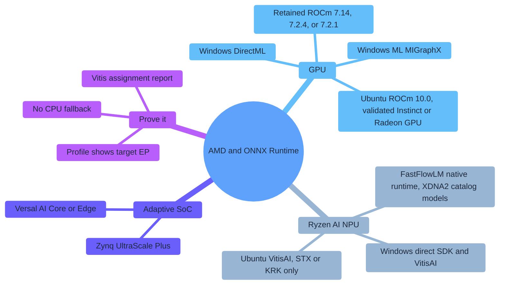
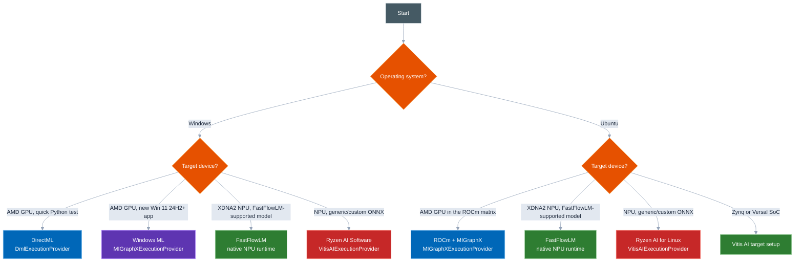
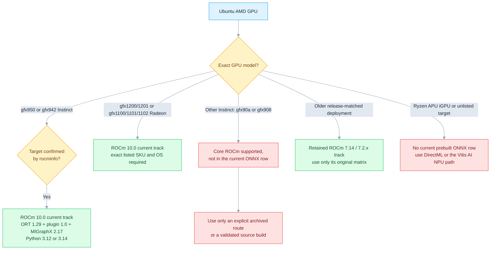
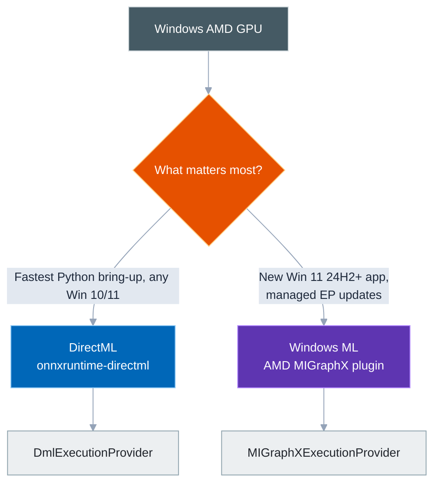
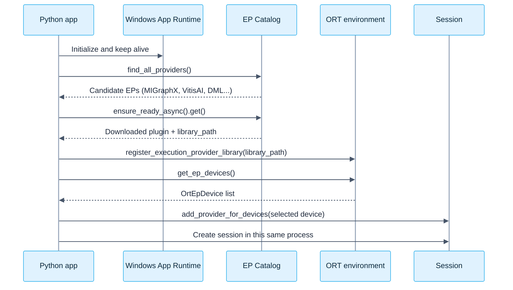
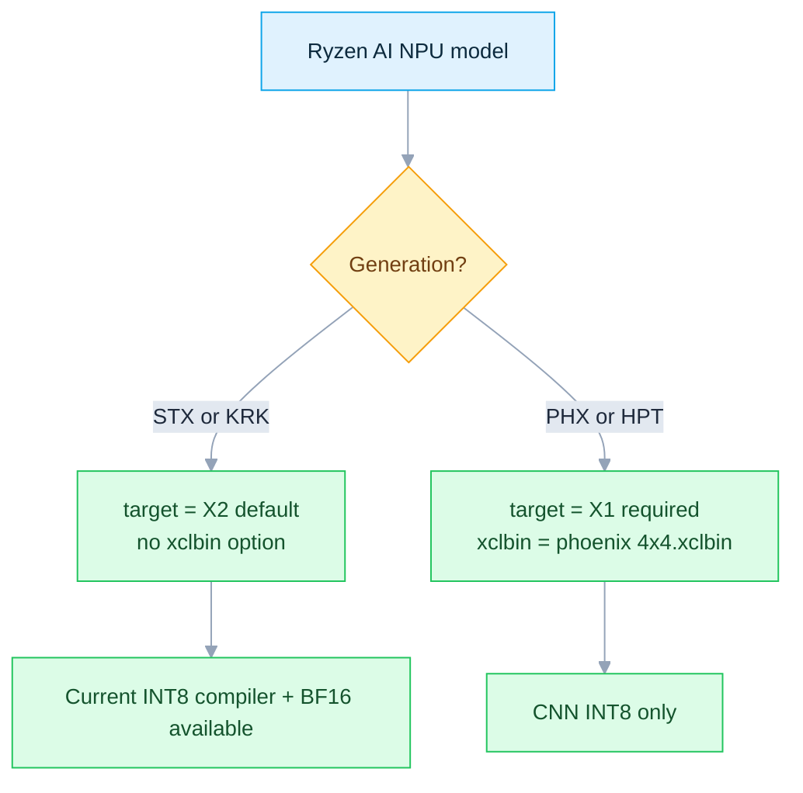
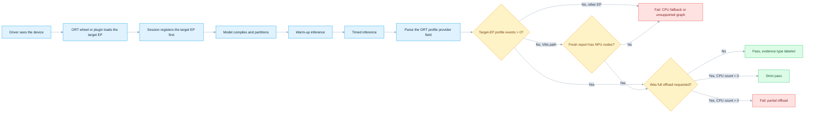
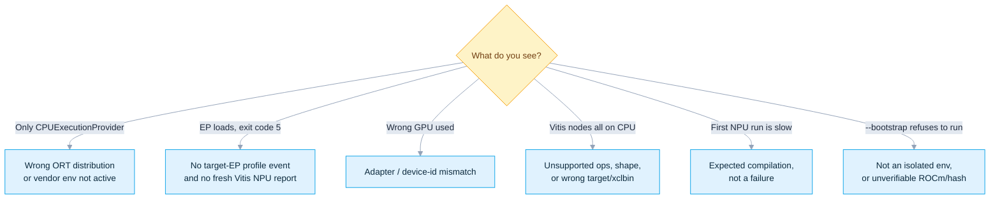

# ONNX Runtime + AMD: GPU and NPU

[简体中文](README.zh-CN.md) · [Repository index](../README.md) · [Official MIGraphX EP guide](https://onnxruntime.ai/docs/execution-providers/MIGraphX-ExecutionProvider.html)

ONNX Runtime reaches AMD hardware through four routes — **DirectML**, **Windows ML**, **ROCm/MIGraphX**, and **Ryzen AI/Vitis AI**. This guide helps you pick the right one. Its strict commands can prove target-EP execution through current-run node placement when they complete on matching hardware; the validation boundary below records what the repository audit did and did not execute.

FastFlowLM is a separate native runtime for its own supported-model catalog on XDNA2 Ryzen AI NPUs, not an ONNX Runtime EP. This guide identifies when that route fits the device, while keeping generic or custom ONNX validation on the Vitis AI path.

| Item | Baseline |
|---|---|
| Guidance last verified | `2026-09-01` against linked AMD, Microsoft, Canonical, ONNX Runtime, Docker Hub, and package-registry sources |
| FastFlowLM review | `v1.0.3` source/docs reviewed `2026-08-31`; native XDNA2 catalog-model route, separate from the audited ORT artifacts |
| Hosts | Windows and Ubuntu; exact gates vary by GPU/NPU generation |
| ORT routes | DirectML · Windows ML + MIGraphX · ROCm/MIGraphX · Ryzen AI/Vitis AI |
| Native NPU route | FastFlowLM for its supported models on XDNA2 Ryzen AI PCs; not an ORT EP |
| Entry point | [`provider_test.py`](provider_test.py) |
| Proof | Current-run node placement + output sanity; CPU parity for the built-in GPU model, or any model with `--compare-cpu` |
| Validation boundary | All 38 deterministic script tests passed on Windows; final DirectML/Windows ML/MIGraphX/Vitis AI proof needs matching hardware |

### Files

| File | Purpose |
|---|---|
| [`README.md`](README.md) · [`README.zh-CN.md`](README.zh-CN.md) | This guide (English / 简体中文) |
| [`provider_test.py`](provider_test.py) | One-command setup, optional bootstrap, and strict proof test |

| You are... | Start at |
|---|---|
| On Windows with an AMD GPU, want the fastest test | [§9 DirectML](#9-simplest-python-path-directml) |
| On Windows, building a new app for Win 11 24H2+ | [§10 Windows ML + MIGraphX](#10-new-windows-path-windows-ml--amd-migraphx) |
| On Ubuntu with an AMD GPU | [§6 Install the matching ROCm track](#6-install-the-matching-rocm-track) |
| On an XDNA2 Ryzen AI PC with a FastFlowLM-supported local model | [§1.1 FastFlowLM](#fastflowlm-xdna2) |
| On a Ryzen AI laptop with a generic or custom ONNX model, Windows | [§12 Install Ryzen AI Software](#12-install-ryzen-ai-software-180) |
| On a Ryzen AI laptop with a generic or custom ONNX model, Ubuntu | [§15 Install the Linux NPU driver](#15-install-the-ubuntu-npu-driver-and-ryzen-ai) |
| Targeting a Zynq/Versal board | [§16 Embedded Linux targets](#16-embedded-linux-targets) |
| Asking "why did my node land on CPU?" | [§19 Verification flow](#19-verification-flow) + [§21 Troubleshooting](#21-troubleshooting) |
| Still not sure | [§1 Choose a route](#1-choose-a-route) |

> [!IMPORTANT]
> A provider appearing in `ort.get_available_providers()` only proves the library **can load**. It never proves a model node **actually executed** on that device. Every check in this guide closes that gap with current-run profile or assignment evidence — see [§19](#19-verification-flow).

---

## Contents

- [The whole AMD picture](#the-whole-amd-picture)
- [1. Choose a route](#1-choose-a-route)
  - [1.1 FastFlowLM: native XDNA2 local-model route](#fastflowlm-xdna2)
- [2. Fundamentals](#2-fundamentals)
- [3. Version and support matrix](#3-version-and-support-matrix)
- [4. Zero-rookie preflight](#4-zero-rookie-preflight)
- [Part A — Ubuntu AMD GPU: ROCm + MIGraphX](#part-a--ubuntu-amd-gpu-rocm--migraphx)
  - [5. Hardware and OS gates](#5-hardware-and-os-gates)
  - [6. Install the matching ROCm track](#6-install-the-matching-rocm-track)
  - [7. Install MIGraphX and the ORT wheel](#7-install-migraphx-and-the-ort-wheel)
  - [8. Ubuntu Docker fast path](#8-ubuntu-docker-fast-path)
- [Part B — Windows AMD GPU](#part-b--windows-amd-gpu)
  - [9. Simplest Python path: DirectML](#9-simplest-python-path-directml)
  - [10. New Windows path: Windows ML + AMD MIGraphX](#10-new-windows-path-windows-ml--amd-migraphx)
- [Part C — Windows Ryzen AI NPU: Vitis AI](#part-c--windows-ryzen-ai-npu-vitis-ai)
  - [11. Supported scope](#11-supported-scope)
  - [12. Install Ryzen AI Software 1.8.0](#12-install-ryzen-ai-software-180)
  - [13. Vitis AI provider options by generation](#13-vitis-ai-provider-options-by-generation)
- [Part D — Ubuntu Ryzen AI NPU: Vitis AI](#part-d--ubuntu-ryzen-ai-npu-vitis-ai)
  - [14. Current Linux support gate](#14-current-linux-support-gate)
  - [15. Install the Ubuntu NPU driver and Ryzen AI](#15-install-the-ubuntu-npu-driver-and-ryzen-ai)
- [Part E — Vitis AI on AMD Adaptive SoCs](#part-e--vitis-ai-on-amd-adaptive-socs)
  - [16. Embedded Linux targets](#16-embedded-linux-targets)
- [Part F — One-click Python demo](#part-f--one-click-python-demo)
  - [17. Demo behavior](#17-demo-behavior)
  - [18. Minimal provider code](#18-minimal-provider-code)
  - [19. Verification flow](#19-verification-flow)
  - [20. Performance guidance](#20-performance-guidance)
  - [21. Troubleshooting](#21-troubleshooting)
  - [22. Production checklist](#22-production-checklist)
  - [23. References](#23-references)
- [Appendix: VSINPU is not an AMD provider](#appendix-vsinpu)

---

## The whole AMD picture


```mermaid
%%{init: {"theme":"base","themeVariables":{"primaryColor":"#dbeafe","primaryTextColor":"#1e293b","primaryBorderColor":"#3b82f6","secondaryColor":"#e0f2fe","secondaryTextColor":"#1e293b","tertiaryColor":"#f1f5f9","tertiaryTextColor":"#1e293b","lineColor":"#94a3b8"},"themeCSS":".mindmap-node text{fill:#1e293b !important;} .mindmap-node span{color:#1e293b !important;}"}}%%
mindmap
  root((AMD and ONNX Runtime))
    GPU
      Windows DirectML
      Windows ML MIGraphX
      Ubuntu ROCm 10.0, validated Instinct or Radeon GPU
      Retained ROCm 7.14, 7.2.4, or 7.2.1
    Ryzen AI NPU
      FastFlowLM native runtime, XDNA2 catalog models
      Windows direct SDK and VitisAI
      Ubuntu VitisAI, STX or KRK only
    Adaptive SoC
      Zynq UltraScale Plus
      Versal AI Core or Edge
    Prove it
      Profile shows target EP
      No CPU fallback
      Vitis assignment report
```

---

## 1. Choose a route


```mermaid
%%{init: {"theme":"base","themeVariables":{"fontSize":"14px","lineColor":"#94a3b8","edgeLabelBackground":"#e2e8f0","primaryTextColor":"#1e293b"}}}%%
flowchart TD
    A["Start"] --> B{"Operating system?"}
    B -->|Windows| C{"Target device?"}
    B -->|Ubuntu| D{"Target device?"}

    C -->|"AMD GPU, quick Python test"| E["DirectML<br/>DmlExecutionProvider"]
    C -->|"AMD GPU, new Win 11 24H2+ app"| F["Windows ML<br/>MIGraphXExecutionProvider"]
    C -->|"XDNA2 NPU, FastFlowLM-supported model"| G["FastFlowLM<br/>native NPU runtime"]
    C -->|"NPU, generic/custom ONNX"| K["Ryzen AI Software<br/>VitisAIExecutionProvider"]

    D -->|"AMD GPU in the ROCm matrix"| H["ROCm + MIGraphX<br/>MIGraphXExecutionProvider"]
    D -->|"XDNA2 NPU, FastFlowLM-supported model"| I["FastFlowLM<br/>native NPU runtime"]
    D -->|"NPU, generic/custom ONNX"| L["Ryzen AI for Linux<br/>VitisAIExecutionProvider"]
    D -->|"Zynq or Versal SoC"| J["Vitis AI target setup"]

    style A fill:#455a64,stroke:#cfd8dc,color:#ffffff
    style B fill:#e65100,stroke:#ffcc80,color:#ffffff
    style C fill:#e65100,stroke:#ffcc80,color:#ffffff
    style D fill:#e65100,stroke:#ffcc80,color:#ffffff
    style E fill:#0067b8,stroke:#8dc8f4,color:#ffffff
    style F fill:#5e35b1,stroke:#b388ff,color:#ffffff
    style G fill:#2e7d32,stroke:#a5d6a7,color:#ffffff
    style H fill:#0067b8,stroke:#8dc8f4,color:#ffffff
    style I fill:#2e7d32,stroke:#a5d6a7,color:#ffffff
    style J fill:#2e7d32,stroke:#a5d6a7,color:#ffffff
    style K fill:#c62828,stroke:#ff8a80,color:#ffffff
    style L fill:#c62828,stroke:#ff8a80,color:#ffffff
```

| Scenario | Route | ONNX Runtime EP | Status |
|---|---|---|---|
| Windows, recent AMD GPU | DirectML for the simplest Python start; evaluate Windows ML for new apps | `DmlExecutionProvider` | Supported, sustained engineering; Windows ML is Microsoft's new direction |
| Windows 11 24H2+, supported AMD GPU | Dynamically acquire AMD MIGraphX through Windows ML | `MIGraphXExecutionProvider` | Available via catalog; `--windows-ml` supports this path |
| Ubuntu, AMD GPU in the ONNX matrix | ROCm + MIGraphX + AMD wheel | `MIGraphXExecutionProvider` | **Primary Linux GPU path**; exact GPU/ROCm/Python/wheel gates apply |
| Windows or Linux, XDNA2 Ryzen AI PC, FastFlowLM-supported model | FastFlowLM native runtime | None — not an ORT EP | **Catalog-model route only**; its own XRT/HRX runtime and model engines; see §1.1 |
| Windows, Ryzen AI NPU, generic/custom ONNX | Ryzen AI Software 1.8.0; Windows ML is also catalog-available | `VitisAIExecutionProvider` | PHX/HPT/STX/KRK; `--windows-ml` is GPU-only, use the vendor env for NPU |
| Ubuntu 24.04, Ryzen AI NPU, generic/custom ONNX | Ryzen AI for Linux 1.8.0 | `VitisAIExecutionProvider` | **STX/KRK only, Python 3.12**; current XRT 2.25 package set |
| Linux, AMD/Xilinx Adaptive SoC | Vitis AI target image and runtime | `VitisAIExecutionProvider` | Embedded Linux path for Zynq and Versal |
| Native Windows ROCm Core SDK | Not a current ORT MIGraphX Python path | None | ROCm 7.14 grows Windows core support, but the validated MIGraphX/ORT stack stays Linux-only |

<a id="fastflowlm-xdna2"></a>
### 1.1 FastFlowLM: native XDNA2 local-model route

At the reviewed `v1.0.3` release, [FastFlowLM](https://fastflowlm.com/docs/) is an AMD ROCm-hosted native NPU runtime, not an ONNX Runtime provider. Its source selects XRT by default or HRX with an opt-in build flag, then loads native model engines. It uses its own supported model catalog and `flm pull`/`flm run` workflow; it is not documented as a general runner for arbitrary `.onnx` files. Version 1.0.3 changed Qwen3.5 and Qwen3.6-MoE weights from Q4_1 to Q4_K, so users upgrading those models must pull the weights again.

| Workload or device | Select | Why |
|---|---|---|
| A FastFlowLM-supported local LLM, VLM, ASR, embedding, or MoE model on XDNA2 | FastFlowLM | Native NPU engine, CLI, and OpenAI-compatible local server; no ORT EP is involved |
| A generic/custom ONNX graph or a need for node-level placement evidence | Ryzen AI/Vitis AI + `provider_test.py` | This guide's ORT profile and Vitis assignment-report proof applies here |
| Ryzen AI 7000/8000/200-series XDNA1 | Not FastFlowLM | FastFlowLM explicitly excludes XDNA1; use only a separately supported Vitis AI route, such as the Windows PHX/HPT path in §12 |

FastFlowLM currently documents XDNA2 support for Ryzen AI Max 300 (Strix Halo), Ryzen AI 300 (Strix Point and Kraken Point), Ryzen AI 400 (Gorgon Point), and, on Linux, Z2 Extreme. Those claims establish FastFlowLM eligibility only; they do not expand the Vitis AI ONNX support matrix.

| Platform | FastFlowLM gate | Readiness and run evidence |
|---|---|---|
| Windows | Windows 11, an XDNA2 Ryzen AI NPU, and NPU driver `>= 32.0.203.304` (`.311` recommended by FastFlowLM) | Run a supported catalog model, then inspect NPU activity in Task Manager |
| Linux | XDNA2, kernel `>= 7.0` with `amdxdna` or `amdxdna-dkms`, NPU firmware `>= 1.1.0.0`, XRT, and a sufficient memlock limit | Run `flm validate`, then `xrt-smi examine`, then run a supported catalog model |

```bash
# Use a FastFlowLM-supported model after its platform-specific installation.
flm run llama3.2:1b

# Optional local OpenAI-compatible server (default: http://127.0.0.1:52625/v1).
flm serve llama3.2:1b
```

> [!IMPORTANT]
> FastFlowLM evidence is runtime-specific, not ORT profile evidence. On Linux, `flm validate` checks the kernel-side setup, while `flm run` requires XRT to open the NPU; `xrt-smi examine` must see the device before a successful validation can be treated as runnable. A FastFlowLM model run and NPU activity do not prove ONNX node placement.

> [!WARNING]
> Treat FastFlowLM and the vendor Ryzen AI/Vitis AI environment as separately pinned NPU stacks. Do not mix their XRT/driver/runtime packages merely because both target XDNA. `provider_test.py` deliberately cannot validate FastFlowLM: it creates ONNX Runtime sessions and only accepts ORT execution-provider evidence.

> [!IMPORTANT]
> `ROCMExecutionProvider` was **removed in ONNX Runtime 1.23**. ROCm 7.0 was the last AMD release carrying it — new projects must use `MIGraphXExecutionProvider`.

> [!NOTE]
> GPU and NPU are separate stacks. ROCm/MIGraphX or DirectML target the GPU; Vitis AI/Ryzen AI targets the XDNA NPU for ONNX, while FastFlowLM targets XDNA2 through its separate native model runtime. Installing one never enables the other.

---

## 2. Fundamentals

ONNX Runtime assigns each graph node to the first capable EP in the `providers` list; `CPUExecutionProvider` is the usual fallback.

```python
providers = [
    "MIGraphXExecutionProvider",  # first choice
    "CPUExecutionProvider",      # fallback
]
```

| API or signal | Proves | Does not prove |
|---|---|---|
| `ort.get_available_providers()` | Which EPs the wheel can load | Node placement |
| `session.get_providers()` | Registered EPs and priority | Actual placement ratio |
| ORT verbose log | Init and node-placement detail | Hard to automate; format can change |
| `args.provider` on `*_kernel_time` events | Which EP ran those kernels | Utilization percentage |
| Vitis AI assignment report | CPU/NPU node counts and op types | GPU EP placement |
| Task Manager / `amd-smi` / `xrt-smi` | Device activity and driver visibility | Which ONNX node ran there |

| Item | AMD GPU | AMD Ryzen AI NPU |
|---|---|---|
| Hardware | RDNA/CDNA GPU | AMD XDNA NPU |
| Linux stack | ROCm + MIGraphX | XRT + `amdxdna` + Ryzen AI/Vitis AI |
| Windows stack | DirectML or Windows ML MIGraphX | Ryzen AI Software or Windows ML VitisAI |
| ORT EP | `MIGraphXExecutionProvider` / `DmlExecutionProvider` | `VitisAIExecutionProvider` |
| Typical precision | FP32, FP16, hardware-dependent BF16/INT8/FP8 | INT8, BF16 (model- and silicon-dependent) |
| First load | MIGraphX compile/tune can be slow | Vitis AI compile can take minutes |
| Cache | MIGraphX cache / compiled artifacts | Vitis AI cache or ORT EP Context |

---

## 3. Version and support matrix

### 3.1 Snapshot verified on 2026-08-31

| Component | Verified version | Notes |
|---|---:|---|
| Current ROCm Core SDK | 10.0.0 | Production release 2026-08-26; TheRock-based Linux and Windows core SDK |
| Current ROCm ONNX stack | ORT 1.29.0 + MIGraphX EP plugin 1.0.0 + MIGraphX 2.17 | Linux; Python 3.12/3.14; `gfx950`, `gfx942`, `gfx1200/1201`, `gfx1100/1101/1102` only |
| Retained ROCm 7.14 ONNX stack | monolithic ORT-MIGraphX 1.23.2 + MIGraphX 2.16 | Linux, Python 3.12, `gfx950`/`gfx942` only |
| Audited AMD-hosted legacy wheel routes | ROCm 7.2.4 or 7.2.1 + ORT 1.23.2 | CPython 3.10/3.12; retained for their release-matched hardware matrices |
| Official ROCm ORT Docker | ROCm 10.0 + ORT 1.29 + PyTorch 2.11.0 | Exact Ubuntu 22.04/24.04 tags for Python 3.11–3.14; mutable `latest` still points to the old 7.2.4 image |
| Consumer Radeon validation matrix | ROCm 7.2.1 + ORT 1.23.2 | Radeon/Ryzen pages update on a different schedule than core ROCm |
| Latest upstream ORT / PyPI MIGraphX package | 1.27.1 | Dated 2026-07-12; AMD has not published a matching ROCm row, so this guide keeps the audited route |
| Stable Ryzen AI Software | 1.8.0 | Current Windows and Linux installers; Linux supports STX/KRK NPU-only flow |
| Ryzen AI Windows NPU driver | 32.0.203.376 | Production driver documented for PHX/HPT/STX/STX Halo/KRK; direct SDK route, not the Windows ML catalog gate |
| FastFlowLM native NPU runtime | 1.0.3 | Separate XDNA2-only catalog-model route; its driver/XRT/HRX gates are not part of the ORT artifact verifier |
| PyPI ONNX Runtime DirectML | 1.24.4 | Current x64 wheel; Python >= 3.11 |
| DirectML operator library in ORT | DirectML 1.15.2, opset up to 20 | Sustained engineering, with some opset-20 exceptions |
| Python packaging | pip 26.2.1; NumPy 2.5.2 on ROCm 10, 1.26.4 on retained 7.x routes | AMD documents the older Radeon ORT wheel as incompatible with NumPy 2.x |
| Standalone PyPI Windows ML runtime | `onnxruntime-windowsml` 1.28.0.202607272323 | Newest standalone wheel; not a substitute for the projection tuple below |
| Reproducible Windows ML Python tuple | `wasdk-*` 2.3.0 + ORT 1.25.2.202605110140 + runtime 2.3.1 | Exact ORT dependency declared by the 2.3.0 projection; keep the release line together |

> [!IMPORTANT]
> "Latest" is not a compatibility guarantee. ROCm, MIGraphX, and the ORT MIGraphX wheel must come from one vendor-validated release set. Windows ML's two `wasdk-*` packages and the Windows App Runtime must share a release line, and the exact ORT dependency the projection declares wins over any standalone "latest" ORT. Never install more than one `onnxruntime-*` distribution in one environment.

> [!NOTE]
> **Why Windows ML does not use standalone ORT 1.28:** the 2.3.0 machine-learning projection declares ORT `1.25.2.202605110140` exactly, while Microsoft services the matching Windows App Runtime as patch 2.3.1. Those three values form the supported tuple; independently newer standalone wheels are not interchangeable.

### 3.2 Documentation skew

The generic ONNX Runtime Vitis AI page and AMD's product-version pages do not move in lockstep. AMD's Ryzen AI 1.8 product docs are authoritative for Ryzen PCs and include separate native Windows and native Linux installers. The 1.8 release notes state that model generation is not supported on Linux; models generated on Windows are compatible with Linux. FastFlowLM separately documents an XDNA2 native-runtime route on both systems. It does not change the Vitis AI ONNX matrix or turn FastFlowLM into an ORT EP.

### 3.3 Audited artifact fingerprints

> [!WARNING]
> The verifier enforces these SHA-256 values. Legacy wheel rows were downloaded and rehashed on 2026-07-17; ROCm 10 plugin rows were downloaded from AMD's stable repository and rehashed on 2026-08-31. A mismatch fails closed — it is not permission to bypass the check. Re-audit any changed vendor artifact and update code/docs together.

| Artifact | SHA-256 |
|---|---|
| DirectML 1.24.4 CPython 3.12 x64 wheel | `f2ecb68b7b7b259d2ef3112ae760149f9b5a1e7c0fbb73d539da6250a648a614` |
| `DirectML.dll` inside that wheel | `b73972115320e906a49602f2027a3266622881b0d325ba685e0f165a9482a8d7` |
| AMD ROCm 7.2.1 MIGraphX 1.23.2 CPython 3.10 wheel | `07f485fbeb8fbd6a89fa42d24832b4e206057fca62654b0eb39eb1edf9d6e70a` |
| AMD ROCm 7.2.1 MIGraphX 1.23.2 CPython 3.12 wheel | `663bff4dc3f72582d69f12ad073eb5695dfb526d574376cc8e5b161c7d2f0f08` |
| MIGraphX provider SO inside both 7.2.1 wheels | `8079986332cdf12234635ed4f2b5abd1b49519f6592d6dfcd8afaf5000887b7b` |
| AMD ROCm 7.2.4 MIGraphX 1.23.2 CPython 3.10 wheel | `4886faab646a7ef12f33fb53f085208182fab8dac249ba199dc5d23f8bd128ec` |
| AMD ROCm 7.2.4 MIGraphX 1.23.2 CPython 3.12 wheel | `ee8edeb2ba6a8d99b3043b23e812423e6f10333b508e003fc77b0feda197449f` |
| MIGraphX provider SO inside both 7.2.4 wheels | `f3fb0b10996b2a2f94afc59edf6fab421bfa12842f09518339d1e0d8f3bd86c7` |
| AMD ROCm 7.14.0 MIGraphX 1.23.2 CPython 3.12 wheel | `67c32a5d8396c28da5efd3643c1ebcb55a03581aad089f7d99922ed5a51bc58b` |
| MIGraphX provider SO inside the 7.14.0 wheel | `447bb405de55dd7872a8e01a90405ff0f0397d5d562acc6f48711312971537c0` |
| ROCm 10 MIGraphX plugin 1.0.0 CPython 3.12 wheel | `ba6942b0cb362a69579ad2e74da0430c4c842b965c6107225bb1a1a50b04d8e1` |
| `libmigraphx-ep.so` inside the CPython 3.12 plugin wheel | `28fa542ddc3871be7ac6e5648951b8690a4da857595a237a38d1c554af89bb5a` |
| ROCm 10 MIGraphX plugin 1.0.0 CPython 3.14 wheel | `67c00393988f020dbd32d1037013b8029c065eaab9fe967d709bfb28882ba7e6` |
| `libmigraphx-ep.so` inside the CPython 3.14 plugin wheel | `2d5933c6a67353a11b4d76882fd9e1d3c52bd4f7d6663a59c1651ace15faeef0` |

Windows ML is serviced dynamically, so the verifier instead requires certified catalog status, exact current MSIX `1.8.57.0`, the pinned Python distributions, and a valid Microsoft Authenticode signature on the Windows App Runtime installer.

---

## 4. Zero-rookie preflight

### 4.1 Windows: identify the GPU and NPU

```powershell
Get-CimInstance Win32_VideoController |
  Select-Object Name, DriverVersion, AdapterRAM

Get-PnpDevice -PresentOnly |
  Where-Object { $_.FriendlyName -match 'NPU|Neural|AMD' } |
  Format-Table -AutoSize

winver
```

Then check **Task Manager → Performance**: confirm the **GPU** name/driver/DX12 support, and confirm **NPU 0** appears for a correctly installed Ryzen AI driver. On an iGPU+dGPU machine, note the GPU numbering — DirectML `device_id=0` is not necessarily the fastest device.

### 4.2 Ubuntu: identify devices, OS, and permissions

```bash
cat /etc/os-release
uname -r
lspci -nnk | grep -EA3 'VGA|Display|3D|1022:17f0'
groups
ls -l /dev/kfd /dev/dri 2>/dev/null || true
```

After installing ROCm: `/opt/rocm/bin/rocminfo | grep -E 'Name:|Marketing Name:' | head -20` and `/opt/rocm/bin/amd-smi list`. After installing Ryzen AI NPU/XRT: `source /opt/xilinx/xrt/setup.sh && xrt-smi examine`.

| Observation | Meaning |
|---|---|
| `/dev/kfd` and `/dev/dri/renderD*` exist | Linux GPU compute device nodes exist |
| `rocminfo` shows a `gfx...` agent | ROCm sees the GPU; the official hardware matrix must still list it |
| `1022:17f0` + `xrt-smi` shows Strix/Krackan | Candidate for the Ryzen AI Linux NPU path |
| User not in `render,video` | Common `Permission denied` cause; log out or reboot after adding the groups |

---

## Part A — Ubuntu AMD GPU: ROCm + MIGraphX

## 5. Hardware and OS gates

AMD publishes one current ONNX Runtime track plus retained release-matched tracks. Core ROCm hardware support is broader than its prebuilt ONNX/MIGraphX support, so check the inference row rather than inferring support from the SDK alone:


```mermaid
%%{init: {"theme":"base","themeVariables":{"fontSize":"14px","lineColor":"#94a3b8","edgeLabelBackground":"#e2e8f0","primaryTextColor":"#1e293b"}}}%%
flowchart TD
    A["Ubuntu AMD GPU"] --> B{"Exact GPU model?"}
    B -->|"gfx950 or gfx942 Instinct"| C{"Target confirmed<br/>by rocminfo?"}
    C -->|Yes| D["ROCm 10.0 current track<br/>ORT 1.29 + plugin 1.0 + MIGraphX 2.17<br/>Python 3.12 or 3.14"]
    B -->|"gfx1200/1201 or gfx1100/1101/1102 Radeon"| G["ROCm 10.0 current track<br/>exact listed SKU and OS required"]
    B -->|"Other Instinct: gfx90a or gfx908"| E["Core ROCm supported,<br/>not in the current ONNX row"]
    E --> F["Use only an explicit archived route<br/>or a validated source build"]
    B -->|"Older release-matched deployment"| H["Retained ROCm 7.14 / 7.2.x track<br/>use only its original matrix"]
    B -->|"Ryzen APU iGPU or unlisted target"| I["No current prebuilt ONNX row<br/>use DirectML or the Vitis AI NPU path"]

    classDef step fill:#e0f2fe,stroke:#0ea5e9,color:#0c2a3d;
    classDef dec fill:#fef3c7,stroke:#f59e0b,color:#713f12;
    classDef good fill:#dcfce7,stroke:#22c55e,color:#14532d;
    classDef bad fill:#fee2e2,stroke:#ef4444,color:#7f1d1d;
    class A step;
    class B,C dec;
    class D,G,H good;
    class E,F,I bad;
```

Do not combine the driver, MIGraphX package, or wheel from different tracks.

| Family | Representative models | Mandatory check |
|---|---|---|
| Instinct `gfx950` / `gfx942` | MI355X, MI350X, MI325X, MI300X | Current ROCm 10 ONNX matrix; use the exact target `rocminfo` reports |
| Other Instinct | MI350P, MI300A, MI200 family, MI100 | Core SDK support does not put these in the current prebuilt ONNX row; use an explicit retained route or validated source build |
| Radeon `gfx1200` / `gfx1201` | Listed RX 9000 and Radeon AI PRO R9000 SKUs | Current ROCm 10 ONNX matrix; exact SKU and OS must also match |
| Radeon `gfx1100` / `gfx1101` / `gfx1102` | Listed RX 7000 and Radeon PRO W7000 SKUs | Current ROCm 10 ONNX matrix; exact SKU and OS must also match |
| Unlisted GPU | Older Polaris/Vega/RDNA2 or another model | Might run, but is not officially supported; do not use for a production commitment |

> [!NOTE]
> An unlisted GPU appearing in `rocminfo` does not mean every prebuilt ROCm/MIGraphX library supports it — enumeration can succeed while a kernel launch later fails.
>
> **Ryzen APU iGPU:** ROCm 10 adds core support for several `gfx115x` Ryzen APUs, but the current prebuilt ONNX row does not list `gfx115x`. On a Ryzen AI laptop, use DirectML for the GPU and Vitis AI for the documented NPU path unless AMD adds that exact iGPU to the ONNX matrix.

---

## 6. Install the matching ROCm track

| Before you install | Rule |
|---|---|
| Confirm the exact match | GPU SKU, LLVM target, OS point release, and kernel must all appear in the chosen track's matrix |
| Pick exactly one track | Use the flowchart in [§5](#5-hardware-and-os-gates) — never mix drivers/packages across tracks |
| Never overwrite an AMDGPU install | Run the matching AMD uninstall procedure first; Radeon Software for Linux has no in-place upgrade |
| Secure Boot enabled | Follow your org's DKMS module-signing policy — don't disable security controls just to run the demo |

> [!WARNING]
> Every route below installs or replaces GPU software and can require a reboot. Use only the route matching your exact hardware, release, and Ubuntu version.

### 6.1 Current ROCm 10.0.0 ONNX track

The current prebuilt ONNX path supports Linux with Python 3.12 or 3.14 on `gfx950`, `gfx942`, `gfx1200`, `gfx1201`, `gfx1100`, `gfx1101`, and `gfx1102`. First use AMD's [ROCm 10 install selector](https://rocm.docs.amd.com/en/docs-10.0.0/install/rocm.html) and [compatibility matrix](https://rocm.docs.amd.com/en/docs-10.0.0/compatibility/compatibility-matrix.html) to install a supported 31.50-series kernel driver and register the repository for your exact OS. Then install exactly one matching architecture package, for example:

```bash
# Set this only after rocminfo or the exact GPU specification confirms it.
GFX_TARGET=gfx950  # allowed ONNX targets: gfx950 gfx942 gfx1200 gfx1201 gfx1100 gfx1101 gfx1102
case "$GFX_TARGET" in
  gfx950|gfx942|gfx1200|gfx1201|gfx1100|gfx1101|gfx1102) ;;
  *) echo "Target is not in the ROCm 10 prebuilt ONNX matrix: $GFX_TARGET" >&2; exit 1 ;;
esac
sudo apt install "amdrocm10.0-${GFX_TARGET}"
sudo usermod -a -G render,video "$LOGNAME"
sudo reboot
```

Confirm the installed release and target after reboot:

```bash
/opt/rocm/bin/hipconfig --version
/opt/rocm/bin/rocminfo | grep -E '^[[:space:]]*Name:[[:space:]]*gfx(950|942|1200|1201|1100|1101|1102)$'
/opt/rocm/bin/amd-smi version
```

The target must be one of the seven values above and must correspond to an exact GPU/OS combination in AMD's matrix.

### 6.2 Retained ROCm 7.14.0 ONNX track — Ubuntu 24.04, `gfx950/gfx942` only

ROCm 7.14 uses the new TheRock packaging layout — do not adapt the older `amdgpu-install_7.2.x` commands below. Open AMD's current [ROCm install selector](https://rocm.docs.amd.com/en/latest/install/rocm.html), select your exact GPU and Ubuntu 24.04, and complete its driver/repository prerequisites. Then install exactly **one** architecture package:

```bash
# MI300X / MI325X only:
sudo apt install amdrocm7.14-gfx942

# OR MI350X / MI355X only (not both commands on a single-architecture host):
# sudo apt install amdrocm7.14-gfx950

sudo usermod -a -G render,video "$LOGNAME"
sudo reboot
```

Confirm the installed release and exact GPU target before continuing:

```bash
/opt/rocm/bin/hipconfig --version
/opt/rocm/bin/rocminfo | grep -E '^[[:space:]]*Name:[[:space:]]*gfx(942|950)$'
/opt/rocm/bin/amd-smi version
```

`rocminfo` must print the target matching your GPU. A different `gfx` target is not eligible for the 7.14 ONNX wheel even if core ROCm supports it.

### 6.3 Retained ROCm 7.2.4 track — Ubuntu 24.04

This older block is retained for AMD's release-matched 7.2.4 ORT artifacts. It is **not** the current ROCm release.

```bash
wget --https-only -O amdgpu-install_7.2.4.70204-1_all.deb \
  https://repo.radeon.com/amdgpu-install/7.2.4/ubuntu/noble/amdgpu-install_7.2.4.70204-1_all.deb
sudo apt install ./amdgpu-install_7.2.4.70204-1_all.deb
sudo apt update

sudo apt install "linux-headers-$(uname -r)" "linux-modules-extra-$(uname -r)"
sudo apt install amdgpu-dkms

sudo apt install python3-setuptools python3-wheel
sudo usermod -a -G render,video "$LOGNAME"
sudo apt install rocm
sudo reboot
```

### 6.4 Retained ROCm 7.2.4 track — Ubuntu 22.04

```bash
wget --https-only -O amdgpu-install_7.2.4.70204-1_all.deb \
  https://repo.radeon.com/amdgpu-install/7.2.4/ubuntu/jammy/amdgpu-install_7.2.4.70204-1_all.deb
sudo apt install ./amdgpu-install_7.2.4.70204-1_all.deb
sudo apt update

sudo apt install "linux-headers-$(uname -r)" "linux-modules-extra-$(uname -r)"
sudo apt install amdgpu-dkms

sudo apt install python3-setuptools python3-wheel
sudo usermod -a -G render,video "$LOGNAME"
sudo apt install rocm
sudo reboot
```

### 6.5 Retained Radeon-focused ONNX track — ROCm 7.2.1

The conservative, fully matrix-validated route for the discrete Radeon/Radeon PRO products on AMD's Radeon ONNX page. Install the HWE kernel the matrix requires, reboot, and verify the kernel before continuing.

**Ubuntu 24.04.4** (needs the 6.17 HWE line):

```bash
sudo apt update
sudo apt-get install --install-recommends linux-generic-hwe-24.04
sudo reboot
```

After reboot (`uname -r` must show 6.17 HWE):

```bash
sudo apt update
sudo apt install -y python3-setuptools python3-wheel
wget --https-only -O amdgpu-install_7.2.1.70201-1_all.deb \
  https://repo.radeon.com/amdgpu-install/7.2.1/ubuntu/noble/amdgpu-install_7.2.1.70201-1_all.deb
sudo apt install ./amdgpu-install_7.2.1.70201-1_all.deb
sudo amdgpu-install -y --usecase=graphics,rocm
sudo usermod -a -G render,video "$LOGNAME"
sudo reboot
```

**Ubuntu 22.04.5** (needs the 6.8 HWE line):

```bash
sudo apt update
sudo apt-get install --install-recommends linux-generic-hwe-22.04
sudo reboot
```

After reboot (`uname -r` must show 6.8 HWE):

```bash
sudo apt update
sudo apt install -y python3-setuptools python3-wheel
wget --https-only -O amdgpu-install_7.2.1.70201-1_all.deb \
  https://repo.radeon.com/amdgpu-install/7.2.1/ubuntu/jammy/amdgpu-install_7.2.1.70201-1_all.deb
sudo apt install ./amdgpu-install_7.2.1.70201-1_all.deb
sudo amdgpu-install -y --usecase=graphics,rocm
sudo usermod -a -G render,video "$LOGNAME"
sudo reboot
```

Verify after reboot:

```bash
groups
/opt/rocm/bin/rocminfo | head -80
/opt/rocm/bin/amd-smi list
cat /opt/rocm/.info/version
```

| Expected result | Check |
|---|---|
| User groups | Belongs to `render` and `video` |
| GPU visible | `rocminfo` lists at least one GPU agent |
| GPU visible | `amd-smi list` shows the expected GPU |
| Version match | ROCm version matches the wheel repository you intend to use |

---

## 7. Install MIGraphX and the ORT wheel

### 7.1 MIGraphX runtime

For **ROCm 10**, use AMD's stable Python indexes in §7.2. They install MIGraphX 2.17 and its runtime libraries inside the venv together with the ONNX Runtime EP plugin; do not combine that route with the retained system-wide MIGraphX 2.16/7.x packages below.

For retained **ROCm 7.14**, install AMD's exact MIGraphX 2.16 packages:

```bash
wget --https-only \
  https://rocm.frameworks.amd.com/deb-multi-arch/amdrocm-migraphx/pool/main/amdrocm-migraphx_2.16.0-3.py312_amd64.deb
wget --https-only \
  https://rocm.frameworks.amd.com/deb-multi-arch/amdrocm-migraphx/pool/main/amdrocm-migraphx-dev_2.16.0-3.py312_amd64.deb
sudo apt install -y \
  ./amdrocm-migraphx_2.16.0-3.py312_amd64.deb \
  ./amdrocm-migraphx-dev_2.16.0-3.py312_amd64.deb

/opt/rocm/bin/migraphx-driver --version
/opt/rocm/bin/migraphx-driver perf --test
dpkg-query -W -f='${Package} ${Version}\n' amdrocm-migraphx amdrocm-migraphx-dev
```

For either **7.2.x** track, use the release repository package instead:

```bash
sudo apt update
sudo apt install -y migraphx

/opt/rocm/bin/migraphx-driver --version
/opt/rocm/bin/migraphx-driver perf --test
dpkg-query -W -f='${Package} ${Version}\n' migraphx half
```

`--test` runs a documented built-in single-layer GEMM model, so no model file is required. On 7.2.x, `half` should arrive as a dependency; install it manually if the last `dpkg-query` shows it missing. `migraphx-dev` is needed only for development/source builds on 7.2.x.

### 7.2 Create an isolated Python environment

The current **ROCm 10** route uses base `onnxruntime==1.29.0`, `onnxruntime-ep-migraphx==1.0.0+rocm10.0.0`, and MIGraphX 2.17 as separate packages. AMD validates Python 3.12 and 3.14. The retained **7.14.0**, **7.2.4**, and **7.2.1** routes use monolithic `onnxruntime_migraphx-1.23.2` wheels. Use a Python version supplied by the selected supported OS; do not add an unofficial Python repository for this demo.

```bash
# Ubuntu 24.04 (ROCm 10 or retained 7.x)
sudo apt install -y python3.12 python3.12-venv
python3.12 -m venv .venv-amd-ort

# Ubuntu 22.04 (7.2.x tracks only)
sudo apt install -y python3.10 python3.10-venv
python3.10 -m venv .venv-amd-ort
```

Activate the environment and install from the source matching your installed ROCm release.

**Current ROCm 10.0.0** (seven supported targets listed in §6.1; Python 3.12 shown):

```bash
source .venv-amd-ort/bin/activate
/opt/rocm/bin/hipconfig --version 2>&1 | grep -Eq '(^|[^0-9])10\.0(\.0)?([^0-9]|$)' || { echo "Installed ROCm is not 10.0.0" >&2; exit 1; }
python -m pip install --index-url https://pypi.org/simple "pip==26.2.1"
python -m pip install --index-url https://pypi.org/simple \
  --extra-index-url https://stable.repo.amd.com/rocm/onnxruntime/whl-next/ \
  --extra-index-url https://stable.repo.amd.com/rocm/migraphx/whl-next/ \
  "numpy==2.5.2" \
  "migraphx==2.17.0+rocm10.0.0" \
  "migraphx-libs==2.17.0+rocm10.0.0" \
  "onnxruntime==1.29.0" \
  "onnxruntime-ep-migraphx==1.0.0+rocm10.0.0"

# AMD's documented packaging workaround: add the ORT SONAME link and loader paths.
SP="$(python -c 'import site; print(site.getsitepackages()[0])')"
ln -sf "$SP/onnxruntime/capi/libonnxruntime.so.1.29.0" \
  "$SP/onnxruntime/capi/libonnxruntime.so.1"
export LD_LIBRARY_PATH="$SP/onnxruntime/capi:$SP/migraphx_libs:${LD_LIBRARY_PATH:-}"

python -c "import migraphx, onnxruntime as ort, onnxruntime_ep_migraphx as ep; [ort.register_execution_provider_library(n, p) for n, p in zip(ep.get_ep_names(), ep.get_library_paths())]; print(ort.__version__); print(ort.get_available_providers())"
```

The output must show ORT 1.29.0 and include both `MIGraphXExecutionProvider` and `CPUExecutionProvider`. The registration step is mandatory for the plugin package. `provider_test.py` performs the same registration, SONAME setup, version checks, and plugin binary hash check automatically.

**Retained ROCm 7.14.0** (`gfx950/gfx942`, Python 3.12 only):

```bash
source .venv-amd-ort/bin/activate
/opt/rocm/bin/hipconfig --version 2>&1 | grep -Eq '(^|[^0-9])7\.14(\.0)?([^0-9]|$)' || { echo "Installed ROCm is not 7.14.0" >&2; exit 1; }
python -m pip install --index-url https://pypi.org/simple "pip==26.2.1"
python -m pip install --index-url https://pypi.org/simple "numpy==1.26.4"
python -m pip install --index-url https://pypi.org/simple \
  "https://rocm.frameworks.amd.com/whl-multi-arch/onnxruntime-migraphx/onnxruntime_migraphx-1.23.2%2Brocm7.14.0-cp312-cp312-manylinux_2_27_x86_64.manylinux_2_28_x86_64.whl"
```

**Retained ROCm 7.2.4**:

```bash
source .venv-amd-ort/bin/activate
grep -Eq '(^|[^0-9])7\.2\.4([^0-9]|$)' /opt/rocm/.info/version || { echo "Installed ROCm is not 7.2.4" >&2; exit 1; }
python -m pip install --index-url https://pypi.org/simple "pip==26.2.1"
python -m pip install --index-url https://pypi.org/simple "numpy==1.26.4"
PYTAG="$(python -c 'import sys; print(f"cp{sys.version_info.major}{sys.version_info.minor}")')"
case "$PYTAG" in cp310|cp312) ;; *) echo "Unsupported Python ABI: $PYTAG" >&2; exit 1;; esac
python -m pip install --index-url https://pypi.org/simple \
  "https://repo.radeon.com/rocm/manylinux/rocm-rel-7.2.4/onnxruntime_migraphx-1.23.2-${PYTAG}-${PYTAG}-manylinux_2_27_x86_64.manylinux_2_28_x86_64.whl"
```

**Radeon-focused ROCm 7.2.1** (same commands, 7.2.1 repository):

```bash
source .venv-amd-ort/bin/activate
grep -Eq '(^|[^0-9])7\.2\.1([^0-9]|$)' /opt/rocm/.info/version || { echo "Installed ROCm is not 7.2.1" >&2; exit 1; }
python -m pip install --index-url https://pypi.org/simple "pip==26.2.1"
python -m pip install --index-url https://pypi.org/simple "numpy==1.26.4"
PYTAG="$(python -c 'import sys; print(f"cp{sys.version_info.major}{sys.version_info.minor}")')"
case "$PYTAG" in cp310|cp312) ;; *) echo "Unsupported Python ABI: $PYTAG" >&2; exit 1;; esac
python -m pip install --index-url https://pypi.org/simple \
  "https://repo.radeon.com/rocm/manylinux/rocm-rel-7.2.1/onnxruntime_migraphx-1.23.2-${PYTAG}-${PYTAG}-manylinux_2_27_x86_64.manylinux_2_28_x86_64.whl"
```

> [!NOTE]
> This is a freshly created, disposable venv. If `python -m pip list` already shows any `onnxruntime-*` package before you install, delete the venv and recreate it — don't uninstall packages in place.
>
> The package sources are deliberate: ROCm 10 uses AMD's `stable.repo.amd.com` plugin and MIGraphX indexes; 7.14 uses `rocm.frameworks.amd.com`; 7.2.x uses exact `repo.radeon.com` release directories. PyPI's independently published `onnxruntime-migraphx` 1.27.1 is not a substitute for any of these release-matched stacks. `--bootstrap` hash-verifies the selected ORT artifact against [§3.3](#33-audited-artifact-fingerprints) before installing.
>
> ROCm 10 uses NumPy 2.5.2. NumPy remains pinned to `1.26.4` on the three retained ORT 1.23.2 routes because AMD's Radeon 7.2.1 page documents that older wheel as incompatible with NumPy 2.x.

Verify a retained monolithic wheel:

```bash
python -c "import onnxruntime as ort; print(ort.__version__); print(ort.get_available_providers())"
```

Expected: the list includes `MIGraphXExecutionProvider` and `CPUExecutionProvider`.

### 7.3 One-command GPU run

From the repository root, with the selected virtual environment active:

```bash
python AMD/provider_test.py --target migraphx --strict-all
```

If the wheel is not installed, let the script install one matching your installed ROCm release:

```bash
python AMD/provider_test.py --target migraphx --bootstrap --strict-all
```

> [!NOTE]
> `--bootstrap` never installs a kernel driver — it only manages Python packages in the active environment. It requires an activated venv or non-base Conda env, refuses to touch Ryzen AI/Windows ML vendor environments, checks x86-64 and the release-specific Python ABI, verifies the detected ROCm release, and never uninstalls an existing ORT. ROCm 10 accepts Python 3.12/3.14 and the seven targets in §6.1; ROCm 7.14 accepts Python 3.12 and `gfx942/gfx950`; retained 7.2.x accepts only its mapped CPython 3.10/3.12 artifacts.

---

## 8. Ubuntu Docker fast path

Host prerequisites: the AMD kernel driver, `/dev/kfd`, `/dev/dri`, Docker Engine, and correct user permissions. The container carries ROCm user-space libraries, MIGraphX, and ORT.

> [!IMPORTANT]
> Use an exact tag. Docker Hub's mutable `latest` still resolves to the older 7.2.4 image even though AMD published ROCm 7.14 and ROCm 10 tags later.

```bash
# Current ROCm 10, Ubuntu 24.04, Python 3.12:
IMAGE=rocm/onnxruntime:rocm10.0.0_ub24.04_ort1.29_torch2.11.0_py3.12
# Retained ROCm 7.14, Ubuntu 24.04, Python 3.12:
# IMAGE=rocm/onnxruntime:rocm7.14.0_ub24.04_ort1.23_torch2.10.0_py3.12
# Retained ROCm 7.2.4, Ubuntu 24.04:
# IMAGE=rocm/onnxruntime:rocm7.2.4_ub24.04_ort1.23_torch2.10.0

docker pull "$IMAGE"

docker run --rm -it \
  --device /dev/kfd \
  --device /dev/dri \
  --security-opt seccomp=unconfined \
  -v "$PWD:/workspace" \
  -w /workspace \
  "$IMAGE" \
  python3 AMD/provider_test.py --target migraphx --strict-all
```

Corresponding Ubuntu 22.04 tags exist for ROCm 10, 7.14, and 7.2.4. ROCm 10/7.14 tags are published for several Python versions, but this verifier follows AMD's ONNX compatibility rows: use Python 3.12 or 3.14 for ROCm 10 and Python 3.12 for 7.14. Verify inside the container with `rocminfo` and `/opt/rocm/bin/amd-smi list`.

---

## Part B — Windows AMD GPU


```mermaid
%%{init: {"theme":"base","themeVariables":{"fontSize":"14px","lineColor":"#94a3b8","edgeLabelBackground":"#e2e8f0","primaryTextColor":"#1e293b"}}}%%
flowchart TD
    A["Windows AMD GPU"] --> B{"What matters most?"}
    B -->|"Fastest Python bring-up, any Win 10/11"| C["DirectML<br/>onnxruntime-directml"]
    B -->|"New Win 11 24H2+ app,<br/>managed EP updates"| D["Windows ML<br/>AMD MIGraphX plugin"]
    C --> E["DmlExecutionProvider"]
    D --> F["MIGraphXExecutionProvider"]

    style A fill:#455a64,stroke:#cfd8dc,color:#ffffff
    style B fill:#e65100,stroke:#ffcc80,color:#ffffff
    style C fill:#0067b8,stroke:#8dc8f4,color:#ffffff
    style D fill:#5e35b1,stroke:#b388ff,color:#ffffff
    classDef leaf fill:#eceff1,stroke:#90a4ae,color:#20242b;
    class E,F leaf;
```

## 9. Simplest Python path: DirectML

| Requirement | Minimum / guidance |
|---|---|
| OS | Introduced in Windows 10 1903; Windows 11 recommended |
| GPU | DirectX 12 capable; broadly supports AMD GCN 1st Gen and newer |
| Driver | Latest stable AMD Adrenalin/PRO driver |
| Python | x64 Python 3.12 from python.org or winget — not Microsoft Store Python |
| Package | `onnxruntime-directml==1.24.4` for this verified snapshot |

```powershell
winget install --id Python.Python.3.12 -e `
  --accept-package-agreements --accept-source-agreements
```

If this installed Python for the first time, close every PowerShell window and reopen one. Continue only when both checks below succeed and report AMD64/x86-64:

```powershell
py -3.12 --version
py -3.12 -c "import platform; print(platform.machine())"
py -3.12 -m venv .venv-amd-dml
Set-ExecutionPolicy -Scope Process Bypass -Force
.\.venv-amd-dml\Scripts\Activate.ps1

python -m pip install --index-url https://pypi.org/simple "pip==26.2.1"
python -m pip install --index-url https://pypi.org/simple "numpy==1.26.4" "onnxruntime-directml==1.24.4"

python -c "import onnxruntime as ort; print(ort.get_available_providers())"
```

Expected: `['DmlExecutionProvider', 'CPUExecutionProvider']`. `numpy==1.26.4` is a reproducibility pin shared with the audited AMD wheel path, not a DirectML hardware requirement.

```powershell
python AMD/provider_test.py --target dml --strict-all

# On a multi-GPU machine:
python AMD/provider_test.py --target dml --device-id 1 --strict-all
```

The demo enumerates DXGI adapters in the same order DirectML uses, and fails unless the selected `--device-id` has AMD PCI vendor ID `0x1002`.

Required session settings (DirectML does not support ORT parallel execution or memory-pattern optimization — use separate sessions for concurrency):

```python
options.enable_mem_pattern = False
options.execution_mode = onnxruntime.ExecutionMode.ORT_SEQUENTIAL
```

| Limitation | Detail |
|---|---|
| Engineering status | Sustained engineering; new Windows development is moving to Windows ML |
| Opset ceiling | DirectML 1.15.2 supports up to opset 20, except unsupported configs like 5-D GridSample 20 and DeformConv |
| Shapes | Static input shapes generally improve folding, weight preprocessing, and scheduling |
| Adapter choice | `device_id=0` is the default DXGI adapter, not necessarily the fastest one |

---

## 10. New Windows path: Windows ML + AMD MIGraphX

Use this for a new Windows 11 24H2+ application that benefits from system-managed EP downloads and updates.

| Item | Requirement |
|---|---|
| OS | Windows 11 24H2, build 26100+ for dynamically acquired hardware EPs |
| Python | x64 Python 3.12 (this audited recipe); pinned ORT requires Python >= 3.11 — not Microsoft Store Python |
| Runtime | Windows App SDK Runtime matching the Python `wasdk-*` packages |
| AMD MIGraphX plugin | Acquired through the Windows ML EP Catalog |
| AMD VitisAI plugin | Requires a Ryzen AI NPU driver — see [Part C](#part-c--windows-ryzen-ai-npu-vitis-ai) |

```powershell
winget install --id Python.Python.3.12 -e `
  --accept-package-agreements --accept-source-agreements
```

If winget installed Python for the first time, **close every PowerShell window and reopen one now**. Continue only after both report x64/AMD64 Python 3.12:

```powershell
py -3.12 --version
py -3.12 -c "import platform; print(platform.machine())"

py -3.12 -m venv .venv-winml
Set-ExecutionPolicy -Scope Process Bypass -Force
.\.venv-winml\Scripts\Activate.ps1

python -m pip install --index-url https://pypi.org/simple "pip==26.2.1"
python -m pip install --index-url https://pypi.org/simple `
  "numpy==2.5.2" `
  "wasdk-Microsoft.Windows.AI.MachineLearning[all]==2.3.0" `
  "wasdk-Microsoft.Windows.ApplicationModel.DynamicDependency.Bootstrap==2.3.0" `
  "onnxruntime-windowsml==1.25.2.202605110140"

winget install --id "Microsoft.VCRedist.2015+.x64" -e `
  --accept-package-agreements --accept-source-agreements

$runtimeInstaller = "$env:TEMP\windowsappruntimeinstall-2.3.1-x64.exe"
Invoke-WebRequest `
  https://aka.ms/windowsappsdk/2.3/2.3.1/windowsappruntimeinstall-x64.exe `
  -OutFile $runtimeInstaller

$signature = Get-AuthenticodeSignature -LiteralPath $runtimeInstaller
if ($signature.Status -ne 'Valid' -or $signature.SignerCertificate.Subject -notmatch 'Microsoft Corporation') {
  Remove-Item -LiteralPath $runtimeInstaller -Force -ErrorAction SilentlyContinue
  throw "Windows App Runtime installer signature is not a valid Microsoft signature."
}

try {
  $process = Start-Process $runtimeInstaller -ArgumentList "--quiet" -Wait -PassThru
  if ($process.ExitCode -ne 0) {
    throw "Windows App Runtime installer failed: 0x$('{0:X8}' -f $process.ExitCode)"
  }
} finally {
  Remove-Item -LiteralPath $runtimeInstaller -Force -ErrorAction SilentlyContinue
}
```

Verify before running (both `wasdk-*` at `2.3.0`, ORT at `1.25.2.202605110140`; stop and recreate the venv on any mismatch):

```powershell
python -m pip list | findstr /i "wasdk onnxruntime-windowsml winrt-runtime"
```

Then run the verifier from the repository root:

```powershell
python AMD/provider_test.py `
  --target migraphx --windows-ml --strict-all
```

The script keeps the Windows App Runtime bootstrap context alive, calls `ensure_ready_async().get()`, registers the downloaded plugin with `ort.register_execution_provider_library()`, selects its `OrtEpDevice`, and creates the session in the **same Python process**.

### 10.1 How Python acquires the EP


```mermaid
%%{init: {"theme":"base","themeVariables":{"fontSize":"14px","actorBkg":"#e0f2fe","actorBorder":"#0ea5e9","actorTextColor":"#0c2a3d","actorLineColor":"#94a3b8","signalColor":"#475569","signalTextColor":"#1e293b","noteBkgColor":"#fef3c7","noteTextColor":"#713f12","noteBorderColor":"#f59e0b"}}}%%
sequenceDiagram
    participant App as Python app
    participant Boot as Windows App Runtime
    participant Cat as EP Catalog
    participant Env as ORT environment
    participant Sess as Session

    App->>Boot: Initialize and keep alive
    App->>Cat: find_all_providers()
    Cat-->>App: Candidate EPs (MIGraphX, VitisAI, DML...)
    App->>Cat: ensure_ready_async().get()
    Cat-->>App: Downloaded plugin + library_path
    App->>Env: register_execution_provider_library(library_path)
    App->>Env: get_ep_devices()
    Env-->>App: OrtEpDevice list
    App->>Sess: add_provider_for_devices(selected device)
    App->>Sess: Create session in this same process
```

> [!WARNING]
> Do **not** call `EnsureAndRegisterCertifiedAsync()` and assume it registers providers into Python's ORT environment — that pattern skips the steps above. Do not copy a fixed plugin DLL path either; Windows ML owns and updates it.

| AMD device | EP name |
|---|---|
| AMD GPU | `MIGraphXExecutionProvider` |
| AMD Ryzen AI NPU | `VitisAIExecutionProvider` |
| Generic DX12 GPU fallback | `DmlExecutionProvider` |

| Plugin | Current catalog release | Driver gate |
|---|---|---|
| MIGraphX | MSIX 1.8.57.0 / GPU EP 7.2.2606.20 | AMD GPU driver **25.10.13.09 exactly**; not currently supported for GenAI scenarios |
| VitisAI | MSIX 1.8.68.0 / EP 6059 | Min Adrenalin 25.6.3 + NPU 32.00.0203.280; max Adrenalin 25.9.1 + NPU 32.00.0203.297 |

> [!WARNING]
> These catalog values change through Windows Update D-week releases — recheck the live table before install or image freeze. A newer driver number is **not automatically compatible**.
>
> **Do not mix the two NPU tracks.** Direct Ryzen AI 1.8 documents production NPU driver `32.0.203.376`, but the Windows ML VitisAI catalog still caps at `32.00.0203.297`. Driver `.376` belongs to the direct 1.8 SDK route and is outside the catalog gate. The NPU commands in this guide use the direct Ryzen AI environment, not `--windows-ml`.

### 10.2 Why native Windows ROCm is not this path

ROCm 10 substantially expands Windows Core SDK support, but AMD's current MIGraphX 2.17 and ONNX Runtime 1.29 AI Ecosystem row still lists Linux for the prebuilt inference stack. The EP plugin wheel is a manylinux artifact. Native Windows ROCm therefore does not make `MIGraphXExecutionProvider` appear in a normal Windows ORT Python environment. Current Windows choices remain DirectML or Windows ML; use native Linux for the ROCm/MIGraphX plugin route.

> [!WARNING]
> **WSL2 is not a MIGraphX route.** AMD's current ROCDXG WSL guide explicitly states MIGraphX is **not supported** on WSL. An older, now-legacy 7.2 compatibility page listed ONNX Runtime 1.23.2, but it does not override this limitation — the verifier rejects MIGraphX on a WSL kernel. Use native Linux, native Windows DirectML, or Windows ML MIGraphX instead. Ryzen AI 1.8 NPU routes are native Windows and native Ubuntu, not WSL passthrough.

---

## Part C — Windows Ryzen AI NPU: Vitis AI

## 11. Supported scope

Ryzen AI Software 1.8 supports Phoenix (PHX), Hawk Point (HPT), Strix/Strix Halo (STX), and Krackan Point (KRK).

| Model type | PHX/HPT | STX/KRK |
|---|---:|---:|
| CNN INT8 | Yes | Yes |
| CNN BF16 | No | Yes |
| NLP/encoder BF16 | No | Yes |
| LLM through ONNX Runtime GenAI | No | Yes |

Recommended opset: **17**. Unsupported nodes auto-partition to CPU unless strict placement is requested and verified.

## 12. Install Ryzen AI Software 1.8.0

| Dependency | Requirement |
|---|---|
| Windows | Build >= 22621.3527 for the direct 1.8.0 stack |
| NPU driver | 32.0.203.376 production driver for PHX/HPT/STX/STX Halo/KRK |
| Visual Studio | VS 2022 + Desktop Development with C++ for builds/custom ops; optional for the basic quicktest |
| CMake | >= 3.26 |
| Environment manager | Miniforge preferred |
| Supported NPU | Confirm in release notes, not by processor marketing name alone |

0. If Miniforge is missing, install the official `Miniforge3-Windows-x86_64.exe` to a path without spaces/special characters, create the **Miniforge Prompt** shortcut, add only that install's `condabin` to the **System** `PATH`, then confirm `where.exe conda` and `conda --version` in a fresh terminal.
1. Install CMake and verify:

```powershell
winget install --id Kitware.CMake -e --accept-package-agreements --accept-source-agreements
```

```powershell
cmake --version   # expect >= 3.26 after reopening Miniforge Prompt
```

2. Download the production NPU driver from the official Ryzen AI page, extract it, then from an **Administrator** terminal:

```powershell
.\npu_sw_installer.exe
```

3. Reboot if requested; confirm **Task Manager → Performance → NPU 0** and driver `32.0.203.376`. This direct SDK driver is not compatible with the separately capped Windows ML VitisAI catalog route described in §10.
4. Download and run `ryzen-ai-1.8.0.exe`, keep the default path `C:\Program Files\RyzenAI\1.8.0`, and let it create the Conda environment `ryzen-ai-1.8.0`.

### 12.1 Vendor quicktest (STX/KRK)

Open the **Miniforge Prompt** (Command Prompt shortcut, not PowerShell), change to the repository root, and replace the example path below with its real location:

```bat
cd /d "C:\path\to\Tutorial-ONNX-Runtime-Execution-Providers-main"
conda activate ryzen-ai-1.8.0
python -c "import onnxruntime as ort; print(ort.__version__); print(ort.get_available_providers())"
pushd "%RYZEN_AI_INSTALLATION_PATH%\quicktest"
python quicktest.py
popd
```

Expected final line: `Test Finished`. `popd` returns to the repository root for §12.2. Stop if `VitisAIExecutionProvider` is absent — never repair the vendor environment with pip.

> [!NOTE]
> **PHX/HPT:** do not use an unmodified `quicktest.py`. AMD requires `target=X1`, `xlnx_enable_py3_round=0`, and the Phoenix `4x4.xclbin`. Skip to [§12.2](#122-one-command-proof-with-profiling) — the repository verifier applies those options without touching the vendor file.

### 12.2 One-command proof with profiling

Continue in the same Miniforge Prompt, now back at the repository root:

```powershell
python AMD/provider_test.py --target npu --strict-all
```

The script locates the vendor `quicktest/test_model.onnx`, detects PHX/HPT vs STX/KRK, creates the correct Vitis AI options, runs inference, and rejects a zero-NPU-node result.

> [!WARNING]
> Never run `pip install onnxruntime` inside the Ryzen AI environment — a generic CPU wheel can overwrite the vendor ORT files and remove `VitisAIExecutionProvider`.

## 13. Vitis AI provider options by generation


```mermaid
%%{init: {"theme":"base","themeVariables":{"fontSize":"14px","lineColor":"#94a3b8","edgeLabelBackground":"#e2e8f0","primaryTextColor":"#1e293b"}}}%%
flowchart TD
    A["Ryzen AI NPU model"] --> B{"Generation?"}
    B -->|STX or KRK| C["target = X2 default<br/>no xclbin option"]
    B -->|PHX or HPT| D["target = X1 required<br/>xclbin = phoenix 4x4.xclbin"]
    C --> E["Current INT8 compiler + BF16 available"]
    D --> F["CNN INT8 only"]

    classDef step fill:#e0f2fe,stroke:#0ea5e9,color:#0c2a3d;
    classDef dec fill:#fef3c7,stroke:#f59e0b,color:#713f12;
    classDef good fill:#dcfce7,stroke:#22c55e,color:#14532d;
    class A step;
    class B dec;
    class C,D,E,F good;
```

| Device | INT8 `target` | `xclbin` | Notes |
|---|---|---|---|
| STX/KRK and newer | `X2` by default; `X1` testable for specific models | Must **not** be set for the normal X2 flow | Current INT8 compiler; BF16 available |
| PHX/HPT | `X1` required | `...\xclbins\phoenix\4x4.xclbin` required | CNN INT8 only |

All keys below are read either directly by the open-source `VitisAIExecutionProvider` (the three
`ep_context_*` rows), or forwarded as-is to AMD's closed-source Vitis AI compiler (`vaip`) that the EP loads
at runtime — see [`vitisai_provider_factory.cc`](https://github.com/microsoft/onnxruntime/blob/main/onnxruntime/core/providers/vitisai/vitisai_provider_factory.cc) and [`vitisai_execution_provider.cc`](https://github.com/microsoft/onnxruntime/blob/main/onnxruntime/core/providers/vitisai/vitisai_execution_provider.cc) in the ONNX Runtime source.

| Option | Values | Meaning |
|---|---|---|
| `target` | `X1` / `X2` | Compiler target generation: `X2` for STX/KRK (default there), `X1` required for PHX/HPT |
| `xclbin` | path | PHX/HPT only: absolute path to the generation's `.xclbin` overlay; must be omitted for the X2 flow |
| `cache_dir` | path | Directory for the Vitis AI compiler cache; reusing it across runs skips recompilation |
| `cache_key` | string | Cache namespace/id; change it whenever the model or these options change |
| `enable_cache_file_io_in_mem` | `"0"` / `"1"` | `"0"` (recommended) writes the cache to disk under `cache_dir` so it can be inspected; `"1"` keeps it in memory only |
| `config_file` | path | JSON file controlling BF16 `optimize_level` and preferred data layout (STX/KRK BF16 flow) |
| `ep_context_enable` | `"0"` / `"1"` | Emit an ONNX Runtime **EPContext** model that embeds the pre-compiled Vitis AI graph, so the next load skips recompilation |
| `ep_context_embed_mode` | `"0"` / `"1"` | With EPContext enabled: `"1"` embeds the compiled binary directly inside the generated `.onnx`; omitted or `"0"` (default) keeps it as a separate sibling file |
| `ep_context_file_path` | path | Custom output path for the generated EPContext model; defaults to alongside the source model |
| `external_ep_library` | path | Advanced/internal: delegates VitisAI EP construction to another EP's factory library; not needed for normal model deployment |

> [!NOTE]
> `ep_context_*` are the same generic EPContext cache keys shared by several ORT execution providers
> (TensorRT, OpenVINO, QNN...). Every other key in this options dict is passed through unchanged to AMD's
> `vaip` compiler, so a newer Ryzen AI release may document additional model- or generation-specific tuning
> keys beyond this table — check the release notes for the Ryzen AI Software version you installed.

```python
import onnxruntime as ort

options = {
    # --- Compiler target: see the table above for STX/KRK vs PHX/HPT ---
    "target": "X2",                        # "X2" (STX/KRK, default) or "X1" (PHX/HPT, required there)
    # "xclbin": r"C:\...\xclbins\phoenix\4x4.xclbin",  # PHX/HPT only; omit entirely on the X2 flow

    # --- Compiler cache: skip recompilation on repeat runs of the same model ---
    "cache_dir": r"C:\temp\my-vitis-cache",
    "cache_key": "my-model-v1",            # bump this whenever the model or these options change
    "enable_cache_file_io_in_mem": "0",    # "0" = cache written to disk (inspectable); "1" = memory-only

    # --- Optional: BF16 compile tuning (STX/KRK only) ---
    # "config_file": r"C:\path\to\bf16_config.json",

    # --- Optional: EPContext cache (compile once, reload fast next time) ---
    # "ep_context_enable": "1",
    # "ep_context_embed_mode": "0",        # "1" embeds the compiled blob in the .onnx; "0" keeps a sibling file
    # "ep_context_file_path": r"C:\path\to\model_ctx.onnx",
}

session = ort.InferenceSession(
    "model_int8.onnx",
    providers=[
        ("VitisAIExecutionProvider", options),
        "CPUExecutionProvider",
    ],
)
```

| BF16 and production notes | Detail |
|---|---|
| Entry path | FP32 CNN/Transformer models can enter BF16 compilation on supported STX/KRK devices |
| Deployment | AMD recommends precompiled BF16 models for C++; not every on-the-fly BF16 scenario is supported |
| First compile | Can take minutes — use the Vitis AI cache in development, ORT EP Context for packaging |
| Cache hygiene | Delete or re-key caches after changing the Vitis AI EP or NPU driver; caches are not portable across versions |

Generate an assignment report:

```powershell
$env:XLNX_ONNX_EP_REPORT_FILE = "vitisai_ep_report.json"
python your_inference.py
```

The report's `deviceStat` section shows `CPU`/`NPU` node counts. Set `enable_cache_file_io_in_mem=0` and inspect the configured cache directory.

---

## Part D — Ubuntu Ryzen AI NPU: Vitis AI

## 14. Current Linux support gate

Ryzen AI 1.8.0 supports native Linux NPU inference on STX and KRK.

| Requirement | Current 1.8.0 value |
|---|---|
| Supported NPU families | STX and KRK |
| Distribution | Ubuntu 24.04 LTS |
| Python | 3.12.x |
| Models | CNN INT8/BF16, encoder NLP BF16, NPU-only LLM flow |
| EP | `VitisAIExecutionProvider` |
| Driver bundle | XRT 2.25.37 + amdxdna plugin 2.25.260102.56 |

> [!NOTE]
> PHX/HPT are **not** listed in the current Linux support statement. Do not infer Linux support from the Windows matrix. Ryzen AI 1.8 also does not support model generation on Linux; generate the model on Windows and deploy that output on Linux.

## 15. Install the Ubuntu NPU driver and Ryzen AI

### 15.1 Base packages

```bash
sudo apt update
sudo apt install -y software-properties-common
sudo add-apt-repository -y universe
sudo apt update
sudo apt install -y python3.12 python3.12-venv libboost-filesystem1.74.0 dkms pciutils
uname -r
```

`libboost-filesystem1.74.0` ships in Ubuntu 24.04's `universe` component, enabled above. AMD's 1.8 page does not declare a minimum kernel version; use a supported, fully updated Ubuntu 24.04 kernel and let DKMS build the packaged driver rather than carrying a superseded gate forward.

### 15.2 Download and install XRT/NPU packages

Download AMD's [`RAI_1.8_Linux_NPU_XRT.zip`](https://download.amd.com/opendownload/RyzenAI/Driver/RAI_1.8_Linux_NPU_XRT.zip), extract it, then run from that directory:

```bash
sudo apt install --fix-broken -y ./xrt_202620.2.25.37_24.04-amd64-base.deb
sudo apt install --fix-broken -y ./xrt_202620.2.25.37_24.04-amd64-base-dev.deb
sudo apt install --fix-broken -y ./xrt_202620.2.25.37_24.04-amd64-npu.deb
sudo apt install --fix-broken -y ./xrt_plugin.2.25.260102.56.release_24.04-amd64-amdxdna.deb

export LD_LIBRARY_PATH=/lib/x86_64-linux-gnu:${LD_LIBRARY_PATH:-}
source /opt/xilinx/xrt/setup.sh
xrt-smi examine
```

Expected device name resembles `NPU Strix` (exact BDF/name vary by machine).

### 15.3 Install the Ryzen AI 1.8.0 package

```bash
mkdir -p ryzen_ai-1.8.0
cp ryzen_ai-1.8.0.tgz ryzen_ai-1.8.0/
cd ryzen_ai-1.8.0
tar -xvzf ryzen_ai-1.8.0.tgz

./install_ryzen_ai.sh -a yes -p "$HOME/ryzen-ai-1.8.0/venv"
source "$HOME/ryzen-ai-1.8.0/venv/bin/activate"
echo "$RYZEN_AI_INSTALLATION_PATH"
export LD_LIBRARY_PATH="/lib/x86_64-linux-gnu:${RYZEN_AI_INSTALLATION_PATH}/onnxruntime/lib/:${LD_LIBRARY_PATH:-}"
python -c "import sys; assert sys.version_info[:2] == (3, 12), sys.version; print(sys.version)"
python -c "import onnxruntime as ort; print(ort.__version__); print(ort.get_available_providers())"
```

Linux uses the installer-created venv — ignore Windows-only Conda steps. Stop if `VitisAIExecutionProvider` is absent; never install a generic ORT wheel here.

### 15.4 Quicktest and one-command proof

```bash
export LD_LIBRARY_PATH=/lib/x86_64-linux-gnu:${LD_LIBRARY_PATH:-}
source /opt/xilinx/xrt/setup.sh
source "$HOME/ryzen-ai-1.8.0/venv/bin/activate"
export LD_LIBRARY_PATH="/lib/x86_64-linux-gnu:${RYZEN_AI_INSTALLATION_PATH}/onnxruntime/lib/:${LD_LIBRARY_PATH:-}"
cd "$HOME/ryzen-ai-1.8.0/venv/quicktest"
python quicktest.py

# Replace with the absolute path to this repository.
REPO_ROOT="/absolute/path/to/Tutorial-ONNX-Runtime-Execution-Providers-main"
cd "$REPO_ROOT"
python AMD/provider_test.py --target npu --strict-all
```

If the installation path differs, activate that environment and pass the model explicitly:

```bash
source /opt/xilinx/xrt/setup.sh
python AMD/provider_test.py \
  --target npu \
  --model /your/ryzen-ai/venv/quicktest/test_model.onnx \
  --strict-all
```

---

## Part E — Vitis AI on AMD Adaptive SoCs

## 16. Embedded Linux targets

| Host ISA | Vitis AI target | Example boards | OS |
|---|---|---|---|
| Arm Cortex-A53 | Zynq UltraScale+ MPSoC | ZCU102, ZCU104, KV260 | Linux |
| Arm Cortex-A72 | Versal AI Core/Premium | VCK190 | Linux |
| Arm Cortex-A72 | Versal AI Edge | VEK280 | Linux |


```mermaid
%%{init: {"theme":"base","themeVariables":{"fontSize":"14px","lineColor":"#94a3b8","edgeLabelBackground":"#e2e8f0","primaryTextColor":"#1e293b"}}}%%
flowchart LR
    A["1 Board target image / BSP"] --> B["2 Vitis AI Target Setup:<br/>firmware, XRT, DPU overlay, runtime"]
    B --> C["3 Vitis AI ONNX Runtime EP"]
    C --> D["4 Quantize with AMD Quark<br/>or Vitis AI Quantizer"]
    D --> E["5 Session with VitisAIExecutionProvider<br/>+ CPU fallback"]
    E --> F["6 Verify with Vitis AI logs,<br/>reports, device tools"]

    classDef step fill:#e0f2fe,stroke:#0ea5e9,color:#0c2a3d;
    class A,B,C,D,E,F step;
```

> [!WARNING]
> Do not use the x86-64 Ryzen AI installer or the ROCm MIGraphX wheel on these Arm targets. The generic ONNX Runtime build page confirms Linux `--use_vitisai` support for AMD Adaptive SoCs through this target workflow.

---

## Part F — One-click Python demo

## 17. Demo behavior

File: [provider_test.py](provider_test.py)

| Feature | Behavior |
|---|---|
| `--target auto` | Priority: Vitis AI NPU → MIGraphX GPU → DirectML GPU |
| `--target gpu` | Linux selects MIGraphX; a normal Windows pip environment selects DirectML |
| `--windows-ml` | Windows only: bootstraps the runtime, verifies pinned Python distributions and current MIGraphX MSIX 1.8.57.0, acquires/registers the plugin, selects its AMD `OrtEpDevice` in the same process |
| `--target npu` | Requires the vendor-installed Vitis AI EP; never replaces it with a public wheel |
| `--bootstrap` | Requires a clean isolated environment; pins and hash-verifies the DirectML wheel or the exact AMD ROCm 7.2.1/7.2.4/7.14.0 wheel; enforces the 7.14 `gfx942/gfx950` gate; never installs drivers or uninstalls an existing ORT |
| Runtime provenance | Rechecks the installed distribution version and provider DLL/SO hash; Windows ML rechecks all three pinned versions |
| Default GPU model | Integrity-checked embedded opset-17 Conv → Relu → GlobalAveragePool model; no separate `onnx` package needed |
| Default NPU model | The Ryzen AI vendor quicktest model, known NPU-compatible |
| Output sanity | Every result must have nonempty tensors; floats/complex must be finite; object/sequence/map outputs fail closed |
| Numerical check | Always compares the built-in GPU model with CPU EP; `--compare-cpu` enables the same for a user model (`--rtol`/`--atol` configurable) |
| Verification | Counts current-run ORT `*_kernel_time` `Node` events with provider attribution; Vitis may use a fresh assignment report + successful inference when attribution is absent |
| Failure policy | EP loaded but no target profile event (and no fresh Vitis evidence) → nonzero exit |
| `--strict-all` | Sets `session.disable_cpu_ep_fallback=1` before session creation, then independently rejects CPU events/nodes |
| Evidence isolation | Every invocation uses a new artifact/cache directory, so stale reports or caches cannot produce a false pass |
| `--unit-tests` | Runs the built-in deterministic safety/unit suite without AMD hardware, then exits |
| WSL | Rejects MIGraphX — AMD's current WSL guide marks it unsupported |
| Scope limit | ONNX Runtime only: Ryzen AI PC NPU only; rejects Arm Zynq/Versal Adaptive SoCs, which need board-specific models/options. It does not validate FastFlowLM. |

### 17.1 Command table

| Platform | Command |
|---|---|
| Windows AMD GPU, DirectML | `python AMD/provider_test.py --target dml --bootstrap --strict-all` |
| Windows AMD GPU, Windows ML MIGraphX | `python AMD/provider_test.py --target migraphx --windows-ml --strict-all` |
| Ubuntu AMD GPU | `python AMD/provider_test.py --target migraphx --bootstrap --strict-all` (auto-detects 7.2.1, 7.2.4, or gated 7.14.0) |
| Windows/Linux XDNA2 FastFlowLM catalog model | Install FastFlowLM for the platform, then `flm run llama3.2:1b`; use `flm validate` and `xrt-smi examine` on Linux, not `provider_test.py` |
| Windows Ryzen AI NPU | `python AMD/provider_test.py --target npu --strict-all` |
| Ubuntu Ryzen AI NPU | `python AMD/provider_test.py --target npu --strict-all` |
| Existing custom model | Add `--model path/to/model.onnx` |
| Custom model + CPU parity | Add `--compare-cpu`; set `--rtol`/`--atol` if reduced precision is expected |
| Dynamic input | Add `--shape input_name=1,3,224,224` |
| Select the second GPU | Add `--device-id 1` — DirectML indexes DXGI adapters, Windows ML indexes AMD `OrtEpDevice` objects, Linux MIGraphX follows `rocminfo` GPU-agent order |
| Allow partial CPU fallback | Omit `--strict-all`; at least one accelerator node is still required |
| Script-only CPU self-test | `python AMD/provider_test.py --target cpu` |
| Built-in unit tests | `python AMD/provider_test.py --unit-tests` |

A profile-backed accelerator pass ends with:

```text
[PASS/通过] Runtime profile verified ... executed node event(s) on ...
```

> [!NOTE]
> On a Vitis build without provider attribution, success is reported as "inference succeeded + fresh assignment report shows NPU nodes." Assignment counts are unique graph nodes; profile counts are repeated execution events — never compare them as percentages. A provider that only appears in `get_available_providers()`, with neither a profiled event nor fresh Vitis evidence, is treated as a failure by design.
>
> `--strict-all` first asks ORT to reject CPU placement at session creation, then independently rejects every CPU event/node the profile or Vitis report exposes. It cannot prove facts no evidence channel reports. A hardware-placement PASS is not an accuracy certification — use trusted test vectors or `--compare-cpu` before production.

Run evidence is stored under `~/.cache/amd-ort-oneclick/runs/` (Linux) or the equivalent Windows home directory, or under `AMD_ORT_DEMO_CACHE` when set. The Vitis cache is intentionally fresh per invocation, so an NPU check can take minutes every time — this favors trustworthy proof over benchmark convenience.

```bash
# Inspect, then remove Linux run directories older than 7 days:
find ~/.cache/amd-ort-oneclick/runs -mindepth 1 -maxdepth 1 -type d -mtime +7 -print
# After reviewing the printed paths, repeat with -exec rm -rf -- {} +
```

### 17.2 Run your own model

```bash
python AMD/provider_test.py \
  --target migraphx \
  --model /absolute/path/model.onnx \
  --shape images=1,3,224,224 \
  --compare-cpu
```

The generic input generator supports common numeric/Boolean tensors. Every dynamic input needs an explicit, rank-correct `--shape`; unknown input names and fixed-dimension changes are rejected before inference. Floating inputs use deterministic values; integer/Boolean inputs use zeros. Models needing token semantics, nonzero lengths, correlated inputs, strings, custom operators, calibration data, or domain accuracy metrics need a model-specific runner — the EP verification logic can still be reused.

---

## 18. Minimal provider code

### 18.1 Linux MIGraphX GPU

All keys below come straight from ONNX Runtime's [`migraphx_execution_provider_info.h`](https://github.com/microsoft/onnxruntime/blob/main/onnxruntime/core/providers/migraphx/migraphx_execution_provider_info.h) — every value in the options dict is a **string** (booleans are `"0"`/`"1"`), matching how the C++ parser reads `ProviderOptions`.

```python
import onnxruntime as ort

options = {
    # --- Device selection ---
    "device_id": "0",                       # ROCm GPU index (default "0"); validated against hipGetDeviceCount()

    # --- Reduced-precision compute: measure accuracy against CPU before shipping any of these ---
    "migraphx_fp16_enable": "0",             # "1" = convert eligible ops to FP16 (default "0")
    "migraphx_bf16_enable": "0",             # "1" = convert eligible ops to BF16 (default "0")
    "migraphx_fp8_enable": "0",              # "1" = convert eligible ops to FP8; hardware/model dependent (default "0")
    "migraphx_int8_enable": "0",             # "1" = enable INT8 (default "0"); pair with the two keys below unless the model is pre-quantized
    "migraphx_int8_calibration_table_name": "",          # Path/name of an INT8 calibration table file (used only when int8_enable="1")
    "migraphx_int8_use_native_calibration_table": "0",   # "1" = use MIGraphX's own calibration table format instead of ORT's (default "0")

    # --- Compile behavior and caching ---
    "migraphx_exhaustive_tune": "0",         # "1" = try more kernel configs at compile time for a possible speed gain; slower first compile (default "0")
    "migraphx_model_cache_dir": "",          # Directory that caches the compiled MIGraphX program across process runs (empty = no cache dir)

    # --- GPU memory arena ---
    "migraphx_mem_limit": str(2 * 1024**3),  # EP arena byte limit as a string; example = 2 GiB (default if unset: unbounded / SIZE_MAX)
    "migraphx_arena_extend_strategy": "kNextPowerOfTwo",  # "kNextPowerOfTwo" (default) or "kSameAsRequested"
}

session = ort.InferenceSession(
    "model.onnx",
    providers=[
        ("MIGraphXExecutionProvider", options),
        "CPUExecutionProvider",
    ],
)
```

| Option | Type | Meaning |
|---|---|---|
| `device_id` | int string | ROCm GPU index, default `"0"` |
| `migraphx_fp16_enable` | `"0"`/`"1"` | Enable FP16 conversion where supported (default `"0"`) |
| `migraphx_bf16_enable` | `"0"`/`"1"` | Enable BF16 conversion where supported (default `"0"`) |
| `migraphx_fp8_enable` | `"0"`/`"1"` | Enable FP8 conversion; hardware/model dependent (default `"0"`) |
| `migraphx_int8_enable` | `"0"`/`"1"` | Enable INT8; requires calibration unless the model is pre-quantized (default `"0"`) |
| `migraphx_int8_calibration_table_name` | path | INT8 calibration table file name/path (used only when INT8 is enabled) |
| `migraphx_int8_use_native_calibration_table` | `"0"`/`"1"` | Use MIGraphX's own calibration table format instead of ORT's (default `"0"`) |
| `migraphx_exhaustive_tune` | `"0"`/`"1"` | Try more kernel configs at compile time for a possible speed gain; slower first compile (default `"0"`) |
| `migraphx_model_cache_dir` | path | Directory that caches the compiled MIGraphX program across runs |
| `migraphx_mem_limit` | bytes (string) | EP GPU arena limit; default is unbounded (`SIZE_MAX`) |
| `migraphx_arena_extend_strategy` | `kNextPowerOfTwo` / `kSameAsRequested` | Arena growth policy (default `kNextPowerOfTwo`) |
| `migraphx_external_alloc`, `migraphx_external_free`, `migraphx_external_empty_cache` | pointer address (string) | Advanced: share an existing GPU allocator (e.g. from PyTorch) with MIGraphX via raw function-pointer addresses; leave unset for normal use |

> [!NOTE]
> Do not enable reduced precision until accuracy has been measured against a trusted CPU/reference run.

### 18.2 Windows DirectML GPU

```python
import onnxruntime as ort

options = ort.SessionOptions()
options.enable_mem_pattern = False
options.execution_mode = ort.ExecutionMode.ORT_SEQUENTIAL

session = ort.InferenceSession(
    "model.onnx",
    sess_options=options,
    providers=[
        ("DmlExecutionProvider", {"device_id": "0"}),
        "CPUExecutionProvider",
    ],
)
```

### 18.3 Ryzen AI Vitis AI NPU

See [§13](#13-vitis-ai-provider-options-by-generation) for the full `VitisAIExecutionProvider` option reference (target/xclbin by generation, caching, EPContext). Minimal example:

```python
import onnxruntime as ort

options = {
    "target": "X2",                      # "X2" (STX/KRK, default) or "X1" (PHX/HPT, required there — plus "xclbin")
    "cache_dir": "./vitis-cache",         # compiler cache directory, reused across runs
    "cache_key": "model-v1",              # bump when the model or options change
    "enable_cache_file_io_in_mem": "0",   # "0" = cache on disk (inspectable); "1" = memory-only
}

session = ort.InferenceSession(
    "model.onnx",
    providers=[
        ("VitisAIExecutionProvider", options),
        "CPUExecutionProvider",
    ],
)
```

### 18.4 Advanced: build ONNX Runtime with an AMD EP

Use a source build only when no released package fits, or a custom ORT feature is genuinely required — it increases the compatibility surface and does not replace the device driver/runtime.

> [!WARNING]
> The one-click verifier accepts only the release binary hashes audited by this guide, so a custom source build fails its provenance gate even if legitimate. Validate a source build with its own ORT provider tests plus the same profile-placement methodology — do not present it as the audited prebuilt stack.

**Linux MIGraphX wheel** (matching ROCm/MIGraphX, supported compiler/CMake/Python, sufficient RAM/disk):

```bash
git clone --recursive https://github.com/microsoft/onnxruntime.git
cd onnxruntime
git checkout v1.23.2
git submodule update --init --recursive

./build.sh \
  --config Release \
  --parallel \
  --build_wheel \
  --use_migraphx \
  --migraphx_home /opt/rocm

python -m pip install build/Linux/Release/dist/*.whl
```

Add `--build_shared_lib` for a reusable C/C++ library. Run applicable tests before packaging — don't use `--skip_tests` to hide an incompatibility.

**Windows DirectML wheel** (Visual Studio Developer PowerShell, supported Windows SDK):

```powershell
git clone --recursive --branch v1.24.4 `
  https://github.com/microsoft/onnxruntime.git onnxruntime-dml-1.24.4
cd onnxruntime-dml-1.24.4
.\build.bat --config Release --parallel --use_dml --build_wheel
```

**Windows Vitis AI build** — not a replacement for the Ryzen AI installer and not a rookie path. Only for developers who already have the matching Ryzen AI/Vitis AI dependencies and the exact ORT source revision that SDK requires:

```powershell
.\build.bat --use_vitisai --build_shared_lib --parallel --config Release --build_wheel
```

Do not run this in the DirectML checkout above or on an arbitrary `main` branch — get the supported ORT revision from the Ryzen AI release package/support channel first. For Linux Adaptive SoCs, follow the board's Vitis AI target setup instead of treating the x86 ROCm build as interchangeable. Provider `.so`/`.dll` files must stay co-located with the matching ORT runtime — never combine binaries from different builds.

---

## 19. Verification flow


```mermaid
%%{init: {"theme":"base","themeVariables":{"fontSize":"14px","lineColor":"#94a3b8","edgeLabelBackground":"#e2e8f0","primaryTextColor":"#1e293b"}}}%%
flowchart LR
    A["Driver sees the device"] --> B["ORT wheel or plugin loads the target EP"]
    B --> C["Session registers the target EP first"]
    C --> D["Model compiles and partitions"]
    D --> E["Warm-up inference"]
    E --> F["Timed inference"]
    F --> G["Parse the ORT profile provider field"]
    G --> H{"Target-EP profile events > 0?"}
    H -->|No, Vitis path| N{"Fresh report has NPU nodes?"}
    H -->|No, other EP| I["Fail: CPU fallback or unsupported graph"]
    N -->|No| I
    H -->|Yes| J{"Was full offload requested?"}
    N -->|Yes| J
    J -->|No| K["Pass, evidence type labeled"]
    J -->|"Yes, CPU count = 0"| L["Strict pass"]
    J -->|"Yes, CPU count > 0"| M["Fail: partial offload"]

    classDef step fill:#e0f2fe,stroke:#0ea5e9,color:#0c2a3d;
    classDef dec fill:#fef3c7,stroke:#f59e0b,color:#713f12;
    classDef good fill:#dcfce7,stroke:#22c55e,color:#14532d;
    classDef bad fill:#fee2e2,stroke:#ef4444,color:#7f1d1d;
    class A,B,C,D,E,F,G step;
    class H,J,N dec;
    class K,L good;
    class I,M bad;
```

| Platform | Command or UI | What to look for |
|---|---|---|
| Linux GPU | `/opt/rocm/bin/amd-smi monitor` or `metric` | GPU activity and VRAM during repeated inference |
| Linux GPU | `rocminfo` | Correct `gfx` target and device count |
| Windows GPU | Task Manager → GPU → Compute | Activity on the intended adapter |
| Windows/Linux NPU | Task Manager NPU / `xrt-smi examine` | NPU visibility and activity |
| Vitis AI | Assignment report | Nonzero NPU node count |

A tiny model can finish too fast for a utilization graph to register — repeat inference or use a real model, but keep profile-based node assignment as the primary correctness gate.

---

## 20. Performance guidance

| Recommendation | Why |
|---|---|
| Warm up before timing | First session/run can compile kernels, allocate memory, populate caches |
| Measure session creation separately | MIGraphX/Vitis AI compile time is not steady-state latency |
| Use fixed shapes when practical | Better folding, memory planning, and DirectML/MIGraphX compilation |
| Reuse one session | Avoid repeated compilation and allocator setup |
| Version cache keys | Prevent stale artifacts after model/driver/EP changes |
| Measure end-to-end and device-only time separately | NumPy CPU inputs/outputs include host-device transfer cost |
| Inspect CPU fallback | One unsupported operator can create expensive device boundaries |
| Establish an FP32 baseline first | Reduced precision can change accuracy and supported partitioning |
| Use I/O Binding only after correctness | Eliminates copies, but memory management is more complex |
| Pin a validated production stack | Driver + ROCm/XRT + EP + ORT + Python ABI must remain compatible |

---

## 21. Troubleshooting


```mermaid
%%{init: {"theme":"base","themeVariables":{"fontSize":"14px","lineColor":"#94a3b8","edgeLabelBackground":"#e2e8f0","primaryTextColor":"#1e293b"}}}%%
flowchart TD
    A{"What do you see?"}
    A -->|Only CPUExecutionProvider| B["Wrong ORT distribution<br/>or vendor env not active"]
    A -->|"EP loads, exit code 5"| C["No target-EP profile event<br/>and no fresh Vitis NPU report"]
    A -->|Wrong GPU used| D["Adapter / device-id mismatch"]
    A -->|Vitis nodes all on CPU| E["Unsupported ops, shape,<br/>or wrong target/xclbin"]
    A -->|First NPU run is slow| F["Expected compilation,<br/>not a failure"]
    A -->|"--bootstrap refuses to run"| G["Not an isolated env,<br/>or unverifiable ROCm/hash"]

    classDef dec fill:#fef3c7,stroke:#f59e0b,color:#713f12;
    classDef step fill:#e0f2fe,stroke:#0ea5e9,color:#0c2a3d;
    class A dec;
    class B,C,D,E,F,G step;
```

| Symptom or error | Likely cause | Fix |
|---|---|---|
| Only `CPUExecutionProvider` appears | Wrong ORT distribution/plugin or inactive vendor environment | Create a clean venv; install the exact DirectML package, ROCm 10 plugin stack, or retained 7.x wheel; otherwise activate Ryzen AI |
| Multiple competing ORT runtime distributions reported | Overlapping base runtimes share the same module files | Recreate the environment with one base runtime; ROCm 10's `onnxruntime-ep-migraphx` is a companion plugin, not another base runtime |
| `--bootstrap` refuses the environment | Base/system Python, a vendor env, an existing ORT, or unverifiable/mismatched ROCm | Delete and recreate the dedicated disposable venv; bootstrap never repairs/uninstalls ORT in place |
| Reports an unaudited distribution or hash | Same-named PyPI wheel, modified binary, different release, or custom source build | Recreate from the direct vendor URL or `--bootstrap`; validate intentional source builds separately |
| `ROCMExecutionProvider` missing on ORT 1.23+ | Expected removal | Migrate to `MIGraphXExecutionProvider` |
| MIGraphX provider library cannot load | ROCm/MIGraphX version mismatch or missing runtime library | On ROCm 10 align the two AMD indexes and loader paths; on retained 7.x install its matching MIGraphX package; inspect the provider `.so` with `ldd` |
| `Permission denied` for `/dev/kfd` | User not in `render,video` | `sudo usermod -a -G render,video $LOGNAME`, then log out or reboot |
| `hipErrorNoBinaryForGpu` / invalid device function | GPU architecture absent or unsupported | Check the official GPU matrix; don't rely only on `rocminfo` visibility |
| Import fails after a NumPy upgrade | AMD wheel ABI mismatch | Use NumPy 2.5.2 on ROCm 10; use 1.26.4 only with the retained ORT 1.23.2 wheels |
| DirectML uses the wrong GPU | `device_id=0` maps to another DXGI adapter | Check Task Manager; try `--device-id 1`; benchmark both |
| DirectML test rejects PCI vendor other than `0x1002` | Selected DXGI index is Intel/NVIDIA/Microsoft, not AMD | Use the printed adapter list; pass the AMD index with `--device-id` |
| DirectML session rejects options | Parallel mode or memory pattern enabled | Set sequential mode; disable memory pattern |
| Windows ML pip install fails on Python 3.10 | Pinned `onnxruntime-windowsml` declares Python >= 3.11 | Use the guide's Python 3.12 environment |
| Windows ML bootstrap fails / no MIGraphX catalog entry | `wasdk-*`/runtime mismatch, Store Python, OS below 24H2, or incompatible driver | Use the exact 2.3.0/1.25.2.202605110140/runtime-2.3.1 tuple, python.org/winget Python, build >=26100, exact live driver |
| Vitis AI EP present but all nodes on CPU | Unsupported ops/shapes/precision or wrong model generation | Use opset 17; check the supported-op table and assignment report; quantize/compile correctly |
| PHX/HPT Vitis session fails | Missing `target=X1` or `4x4.xclbin` | Use generation-specific options and the vendor install path |
| STX/KRK error mentions xclbin | Legacy option carried forward | Remove `xclbin` for the current X2 flow |
| First NPU load takes minutes | Expected compilation | Enable caching; separate compile time from inference time |
| NPU cache fails after an update | Cache/driver/EP incompatibility | Delete or version the cache; regenerate EP Context |
| Ubuntu cannot see the NPU | Wrong OS/platform, missing DKMS/XRT/amdxdna packages, or unsupported PHX/HPT | Use the exact Ryzen AI 1.8 Ubuntu package set; source XRT; run `xrt-smi examine` |
| FastFlowLM `flm validate` passes but `flm run` cannot open NPU device `0` | Kernel-side probe works, but XRT or its AMD XDNA plugin cannot open the NPU | Run `xrt-smi examine`; install/repair the FastFlowLM-required XRT and XDNA plugin for the distribution, then recheck the device before running a catalog model |
| Docker cannot see the GPU | Device passthrough missing | Add `--device /dev/kfd --device /dev/dri`; verify the host driver |
| EP registered but demo exits with code 5 | No target-provider profile events and no fresh Vitis NPU evidence | Intentional fail-closed behavior — inspect unsupported nodes, the current-run report, and logs |

**Advanced Linux library check** — locate and inspect the MIGraphX provider library without copying it to a global system directory:

```bash
provider_so="$(find "$VIRTUAL_ENV" \( -name 'libmigraphx-ep.so' -o -name 'libonnxruntime_providers_migraphx.so' \) -print -quit)"
if [[ -z "$provider_so" ]]; then
  echo "MIGraphX provider library was not found in $VIRTUAL_ENV" >&2
else
  echo "$provider_so"
  ldd "$provider_so" | grep 'not found' || true
fi
```

ORT recommends keeping provider shared libraries beside the matching ORT library — do not globally mix `.so`/`.dll` files from different ORT installations.

---

## 22. Production checklist

- [ ] The hardware SKU is explicitly listed in the matching AMD support matrix.
- [ ] The OS build/kernel is exactly supported.
- [ ] Driver, ROCm/XRT, MIGraphX/Vitis AI, ORT, and Python ABI are pinned as one tested set.
- [ ] Exactly one base ONNX Runtime distribution is installed; any EP plugin is its matching companion release, not another base runtime.
- [ ] The target EP is first, and CPU fallback policy is intentional.
- [ ] A profile/assignment report proves target-device node execution.
- [ ] Accuracy is compared with CPU/reference data before reduced precision is enabled.
- [ ] First-run compilation and steady-state latency are measured separately.
- [ ] Cache invalidation policy covers model, EP, and driver version changes.
- [ ] Unsupported operators and CPU/device boundaries are documented.
- [ ] Deployment licenses for AMD/Windows ML/Vitis AI packages are reviewed.
- [ ] CI runs at least one real target-device smoke test; provider-list-only tests are rejected.

---

## 23. References

| Topic | Official source |
|---|---|
| ORT EP build page | <https://onnxruntime.ai/docs/build/eps.html#amd-migraphx> |
| MIGraphX EP | <https://onnxruntime.ai/docs/execution-providers/MIGraphX-ExecutionProvider.html> |
| MIGraphX EP provider-options source | <https://github.com/microsoft/onnxruntime/blob/main/onnxruntime/core/providers/migraphx/migraphx_execution_provider_info.h> |
| Removed ROCm EP notice | <https://onnxruntime.ai/docs/execution-providers/ROCm-ExecutionProvider.html> |
| Vitis AI EP | <https://onnxruntime.ai/docs/execution-providers/Vitis-AI-ExecutionProvider.html> |
| VitisAI EP provider-options source | <https://github.com/microsoft/onnxruntime/blob/main/onnxruntime/core/providers/vitisai/vitisai_execution_provider.cc> |
| VSINPU EP source (not AMD — see appendix) | <https://github.com/microsoft/onnxruntime/tree/main/onnxruntime/core/providers/vsinpu> |
| DirectML EP | <https://onnxruntime.ai/docs/execution-providers/DirectML-ExecutionProvider.html> |
| PyPI DirectML package | <https://pypi.org/project/onnxruntime-directml/> |
| ORT Python API | <https://onnxruntime.ai/docs/api/python/api_summary.html> |
| ROCm documentation | <https://rocm.docs.amd.com/en/latest/> |
| ROCm Linux installation | <https://rocm.docs.amd.com/projects/install-on-linux/en/latest/> |
| ROCm Linux system requirements | <https://rocm.docs.amd.com/projects/install-on-linux/en/latest/reference/system-requirements.html> |
| ROCm Docker | <https://rocm.docs.amd.com/projects/install-on-linux/en/latest/how-to/docker.html> |
| AMD ORT Docker tags | <https://hub.docker.com/r/rocm/onnxruntime/tags> |
| AMD ROCm wheel repository | <https://repo.radeon.com/rocm/manylinux/> |
| MIGraphX installation | <https://rocm.docs.amd.com/projects/AMDMIGraphX/en/latest/install/install-migraphx.html> |
| Radeon native-Linux support and ONNX matrix | <https://rocm.docs.amd.com/projects/radeon-ryzen/en/latest/docs/compatibility/compatibilityrad/native_linux/native_linux_compatibility.html> |
| Radeon 7.2.1 driver/ROCm installation | <https://rocm.docs.amd.com/projects/radeon-ryzen/en/latest/docs/install/installrad/native_linux/install-radeon.html> |
| Radeon MIGraphX + ONNX installation | <https://rocm.docs.amd.com/projects/radeon-ryzen/en/latest/docs/install/installrad/native_linux/install-onnx.html> |
| ROCm 10 release notes and compatibility | <https://rocm.docs.amd.com/en/docs-10.0.0/about/release-notes.html> · <https://rocm.docs.amd.com/en/docs-10.0.0/compatibility/compatibility-matrix.html> |
| ROCm 10/7.14 ONNX Runtime and MIGraphX selector | <https://rocm.docs.amd.com/projects/ai-ecosystem/en/latest/inference/onnxruntime.html> · <https://rocm.docs.amd.com/projects/ai-ecosystem/en/latest/inference/migraphx.html> |
| Ryzen AI 1.8.0 documentation | <https://ryzenai.docs.amd.com/en/latest/> |
| Ryzen AI Windows installation | <https://ryzenai.docs.amd.com/en/latest/inst.html> |
| Ryzen AI Linux installation | <https://ryzenai.docs.amd.com/en/latest/linux.html> |
| Ryzen AI model deployment and options | <https://ryzenai.docs.amd.com/en/latest/modelrun.html> |
| Ryzen AI release notes | <https://ryzenai.docs.amd.com/en/latest/relnotes.html> |
| Ryzen AI supported operators | <https://ryzenai.docs.amd.com/en/latest/ops_support.html> |
| FastFlowLM overview and Windows setup | <https://fastflowlm.com/docs/> · <https://fastflowlm.com/docs/install_win/> |
| FastFlowLM Linux support and validation | <https://fastflowlm.com/docs/install_lin/> · <https://github.com/ROCm/FastFlowLM/blob/main/docs/linux-getting-started.md> |
| FastFlowLM source and releases | <https://github.com/ROCm/FastFlowLM> · <https://github.com/ROCm/FastFlowLM/releases> |
| Windows ML overview | <https://learn.microsoft.com/en-us/windows/ai/new-windows-ml/overview> |
| Windows ML installation | <https://learn.microsoft.com/en-us/windows/ai/new-windows-ml/distributing-your-app?tabs=python> |
| Windows ML available EPs | <https://learn.microsoft.com/en-us/windows/ai/new-windows-ml/supported-execution-providers> |
| Windows ML EP acquisition | <https://learn.microsoft.com/en-us/windows/ai/new-windows-ml/initialize-execution-providers?tabs=python> |
| Windows ML EP registration | <https://learn.microsoft.com/en-us/windows/ai/new-windows-ml/register-execution-providers?tabs=python> |
| Windows App SDK runtime downloads | <https://learn.microsoft.com/en-us/windows/apps/windows-app-sdk/downloads> |
| Windows App Runtime installer options | <https://learn.microsoft.com/en-us/windows/apps/windows-app-sdk/deploy-unpackaged-apps> |
| PowerShell Authenticode verification | <https://learn.microsoft.com/en-us/powershell/module/microsoft.powershell.security/get-authenticodesignature> |
| PyWinRT Windows App Runtime bootstrap | <https://pywinrt.readthedocs.io/en/latest/api/winui3/index.html> |
| Windows ML Python package metadata | <https://pypi.org/project/wasdk-Microsoft.Windows.AI.MachineLearning/> |
| Official Miniforge installer | <https://github.com/conda-forge/miniforge#install> |
| Current Radeon WSL / ROCDXG guide and MIGraphX limitation | <https://rocm.docs.amd.com/projects/radeon-ryzen/en/latest/docs/install/installrad/wsl/howto_wsl.html> |
| Ubuntu HWE kernel | <https://ubuntu.com/kernel/lifecycle> |

> URLs and version matrices evolve quickly. Recheck the live compatibility page before upgrading a production image; never infer support solely from a higher version number.

---

<a id="appendix-vsinpu"></a>
## Appendix: VSINPU is not an AMD provider

> [!WARNING]
> `VSINPUExecutionProvider` has **no connection to AMD**. It targets **VeriSilicon/Vivante** NPU IP (the
> "VSI" in the name), found in SoCs such as NXP i.MX 8/9 and Amlogic — never an AMD GPU or Ryzen AI NPU. It
> is documented here only because it was requested alongside MIGraphX and VitisAI, and "VSINPU" vs
> "VitisAI" is an easy name mix-up. Do not install or configure it expecting it to touch AMD hardware, and
> do not confuse its `vsinpu` source folder with the AMD `vitisai` folder covered in
> [Part C](#part-c--windows-ryzen-ai-npu-vitis-ai)/[Part D](#part-d--ubuntu-ryzen-ai-npu-vitis-ai) above.

| Item | Detail |
|---|---|
| Source | [`onnxruntime/core/providers/vsinpu`](https://github.com/microsoft/onnxruntime/tree/main/onnxruntime/core/providers/vsinpu) |
| Vendor | Vivante Corporation (VeriSilicon) — an unrelated third company, not AMD or Xilinx |
| Typical hardware | NXP i.MX 8/9-series SoCs, Amlogic SoCs, and other boards with a Vivante VIP9000-family NPU |
| ORT provider name | `VSINPUExecutionProvider` |
| Build flag | `--use_vsinpu` (source build only; ONNX Runtime does not publish a PyPI wheel for it) |

### Provider options

The public factory function, `CreateExecutionProviderFactory_VSINPU()`, takes **no arguments** — it always
constructs a default `VSINPUExecutionProviderInfo`. That struct declares exactly one field, and nothing in
the factory ever reads it from a provider-options map:

| Field | Type | Meaning |
|---|---|---|
| `device_id` | int | Declared in the C++ struct with default `0`, but not wired to any provider-options string key, C API parameter, or Python argument — it cannot currently be configured from outside the EP's own source code |

```python
import onnxruntime as ort

# No provider-options dict exists for this EP today — pass the bare provider name.
session = ort.InferenceSession(
    "model.onnx",
    providers=[
        "VSINPUExecutionProvider",
        "CPUExecutionProvider",
    ],
)
```

> [!NOTE]
> If you actually want an AMD Ryzen AI NPU, use `VitisAIExecutionProvider` from
> [Part C](#part-c--windows-ryzen-ai-npu-vitis-ai) (Windows) or [Part D](#part-d--ubuntu-ryzen-ai-npu-vitis-ai)
> (Ubuntu) instead — see [§13](#13-vitis-ai-provider-options-by-generation) for its full option reference.
