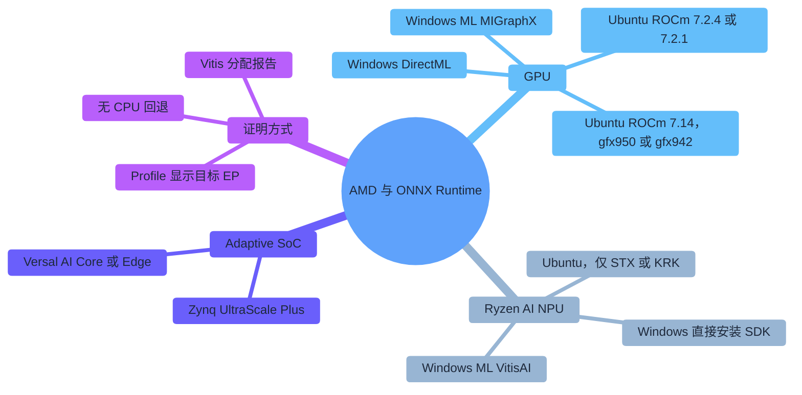
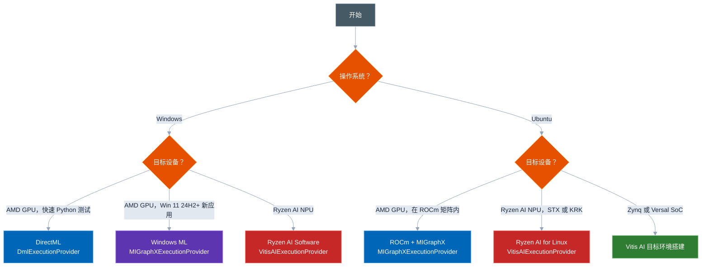
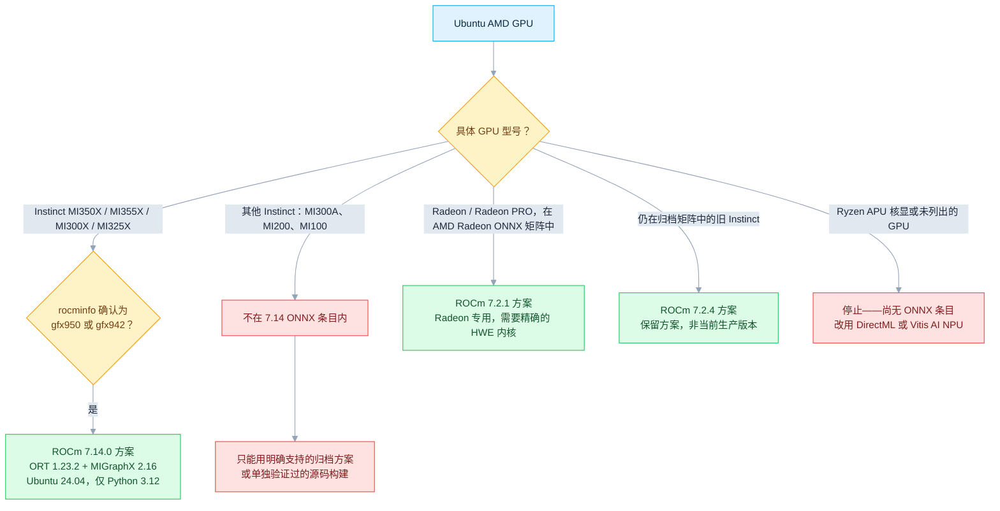
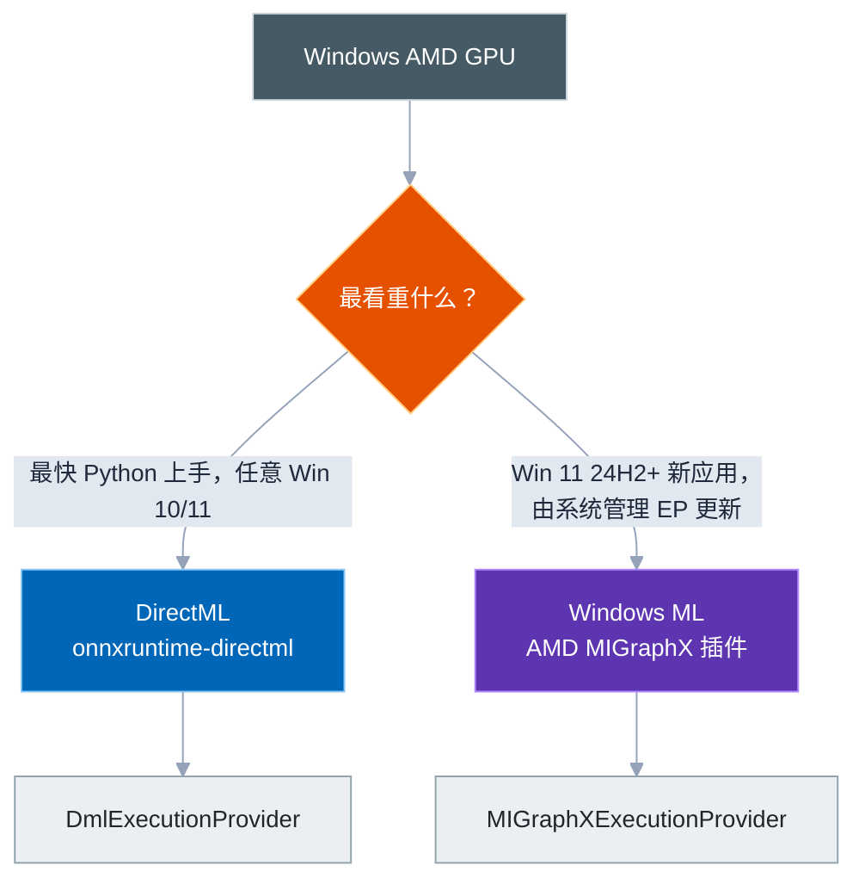
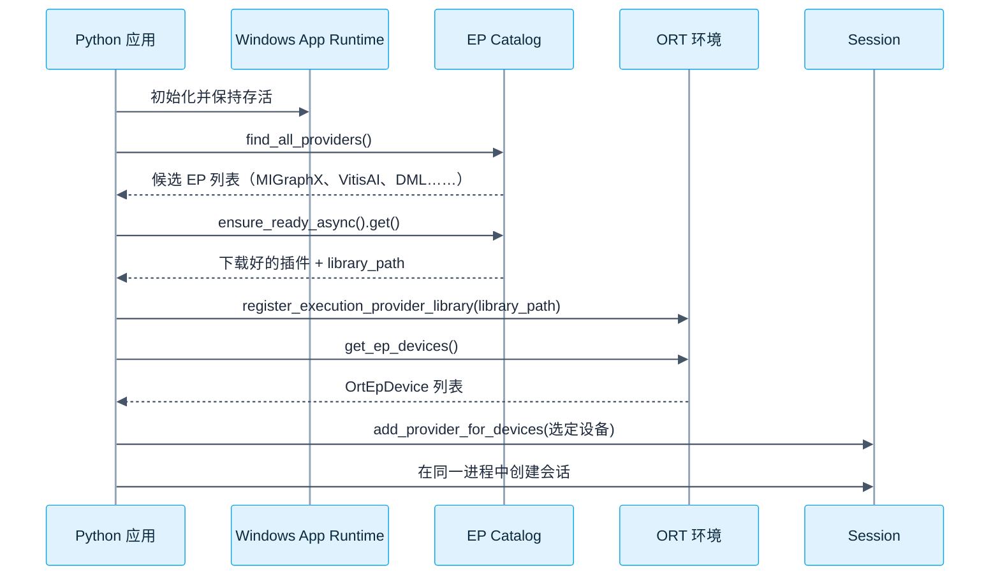
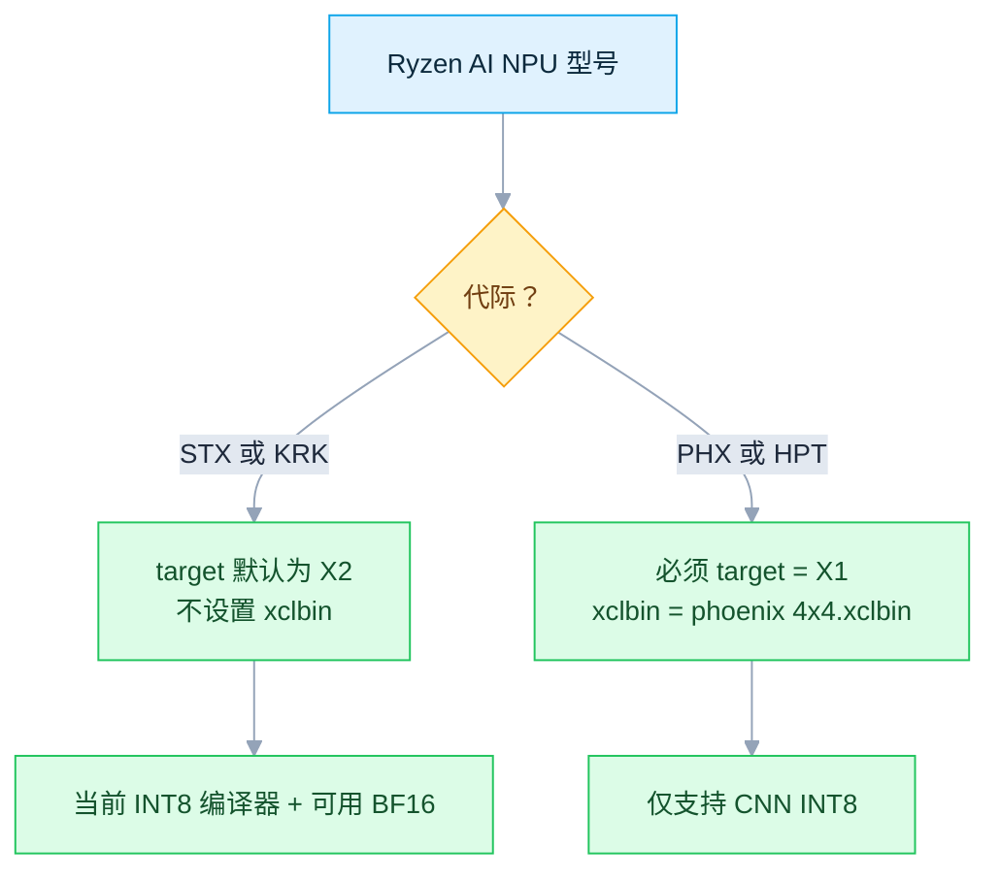
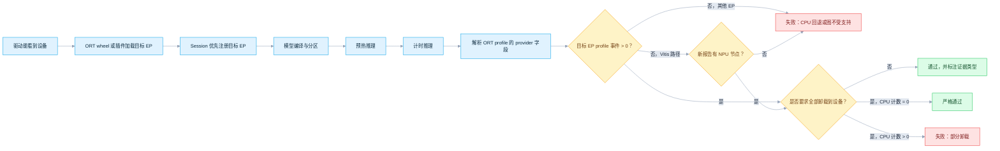
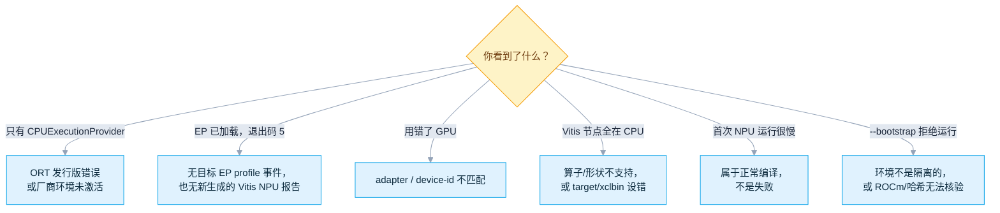

# ONNX Runtime + AMD：GPU 与 NPU

[English](README.md) · [仓库首页](../README.zh-CN.md) · [MIGraphX EP 官方指南](https://onnxruntime.ai/docs/execution-providers/MIGraphX-ExecutionProvider.html)

ONNX Runtime 通过四条路径接入 AMD 硬件——**DirectML**、**Windows ML**、**ROCm/MIGraphX** 和 **Ryzen AI/Vitis AI**。本指南先帮你选对路径，再用真实的节点分配结果*证明*它确实生效，而不只是 Provider 列表里多了一个名字。

| 项目 | 基线 |
|---|---|
| 最近验证 | `2026-07-17`；已与 AMD、Microsoft、Canonical、ONNX Runtime、Docker Hub 和 PyPI 官方资料核对 |
| 支持平台 | Windows 与 Ubuntu；具体要求随 GPU/NPU 代际变化 |
| 运行方式 | DirectML · Windows ML MIGraphX · ROCm/MIGraphX · Ryzen AI/Vitis AI |
| 验证脚本 | [`provider_test.py`](provider_test.py) |
| 验证内容 | 本次运行的节点分配 + 输出基本有效性；内置 GPU 模型或带 `--compare-cpu` 的自定义模型还会与 CPU 结果做数值对比 |
| 验证范围 | 脚本自检已在 Linux 上通过；DirectML、Windows ML、MIGraphX、Vitis AI 的最终验证仍需匹配的目标硬件 |

### 文件

| 文件 | 用途 |
|---|---|
| [`README.md`](README.md) · [`README.zh-CN.md`](README.zh-CN.md) | 本指南（English / 简体中文） |
| [`provider_test.py`](provider_test.py) | 一键安装、可选自举（bootstrap）与严格验证脚本 |

| 你的情况 | 从这里开始 |
|---|---|
| Windows + AMD GPU，想最快跑通 | [§9 DirectML](#9-最简单的-python-方案directml) |
| Windows，要为 Win 11 24H2+ 开发新应用 | [§10 Windows ML + MIGraphX](#10-windows-新方案windows-ml--amd-migraphx) |
| Ubuntu + AMD GPU | [§6 安装匹配的 ROCm 方案](#6-安装匹配的-rocm-方案) |
| Ryzen AI 笔记本，Windows | [§12 安装 Ryzen AI Software](#12-安装-ryzen-ai-software-171) |
| Ryzen AI 笔记本，Ubuntu | [§15 安装 Linux NPU 驱动](#15-安装-ubuntu-npu-驱动与-ryzen-ai) |
| 面向 Zynq/Versal 开发板 | [§16 嵌入式 Linux 目标](#16-嵌入式-linux-目标) |
| 想搞清楚"节点为什么落到了 CPU" | [§19 验证流程](#19-验证流程) + [§21 故障排查](#21-故障排查) |
| 还没想好选哪条路 | [§1 选择路线](#1-选择路线) |

> [!IMPORTANT]
> `ort.get_available_providers()` 中出现某个 Provider，只能说明库**能够加载**它，并不能证明模型节点**真的在该设备上执行过**。本指南的每一项检查都会用当次运行的 profile 或分配证据补上这个缺口——见 [§19](#19-验证流程)。

---

## 目录

- [AMD 全景图](#amd-全景图)
- [1. 选择路线](#1-选择路线)
- [2. 基础概念](#2-基础概念)
- [3. 版本与支持矩阵](#3-版本与支持矩阵)
- [4. 开始前检查](#4-开始前检查)
- [A 部分：Ubuntu AMD GPU（ROCm + MIGraphX）](#a-部分ubuntu-amd-gpurocm--migraphx)
  - [5. 硬件和操作系统要求](#5-硬件和操作系统要求)
  - [6. 安装匹配的 ROCm 方案](#6-安装匹配的-rocm-方案)
  - [7. 安装 MIGraphX 与 ORT wheel](#7-安装-migraphx-与-ort-wheel)
  - [8. Ubuntu Docker 快速方案](#8-ubuntu-docker-快速方案)
- [B 部分：Windows AMD GPU](#b-部分windows-amd-gpu)
  - [9. 最简单的 Python 方案：DirectML](#9-最简单的-python-方案directml)
  - [10. Windows 新方案：Windows ML + AMD MIGraphX](#10-windows-新方案windows-ml--amd-migraphx)
- [C 部分：Windows Ryzen AI NPU（Vitis AI）](#c-部分windows-ryzen-ai-npuvitis-ai)
  - [11. 支持范围](#11-支持范围)
  - [12. 安装 Ryzen AI Software 1.7.1](#12-安装-ryzen-ai-software-171)
  - [13. 按代际配置 Vitis AI Provider](#13-按代际配置-vitis-ai-provider)
- [D 部分：Ubuntu Ryzen AI NPU（Vitis AI）](#d-部分ubuntu-ryzen-ai-npuvitis-ai)
  - [14. 当前 Linux 支持要求](#14-当前-linux-支持要求)
  - [15. 安装 Ubuntu NPU 驱动与 Ryzen AI](#15-安装-ubuntu-npu-驱动与-ryzen-ai)
- [E 部分：AMD Adaptive SoC 上的 Vitis AI](#e-部分amd-adaptive-soc-上的-vitis-ai)
  - [16. 嵌入式 Linux 目标](#16-嵌入式-linux-目标)
- [F 部分：一键 Python 演示](#f-部分一键-python-演示)
  - [17. 验证脚本行为](#17-验证脚本行为)
  - [18. 最小 Provider 代码](#18-最小-provider-代码)
  - [19. 验证流程](#19-验证流程)
  - [20. 性能建议](#20-性能建议)
  - [21. 故障排查](#21-故障排查)
  - [22. 生产检查表](#22-生产检查表)
  - [23. 参考资料](#23-参考资料)
- [附录：VSINPU 并非 AMD Provider](#appendix-vsinpu)

---

## AMD 全景图



---

## 1. 选择路线



| 场景 | 推荐方案 | ONNX Runtime EP | 状态 |
|---|---|---|---|
| Windows，较新 AMD GPU | DirectML 最容易从 Python 上手；新应用也可评估 Windows ML | `DmlExecutionProvider` | 仍受支持，进入持续工程维护；Windows ML 是微软新的推荐方向 |
| Windows 11 24H2+，受支持 AMD GPU | 通过 Windows ML 动态获取 AMD MIGraphX | `MIGraphXExecutionProvider` | Catalog 已提供；`--windows-ml` 支持该路径 |
| Ubuntu，AMD GPU 在 ONNX 矩阵内 | ROCm + MIGraphX + AMD wheel | `MIGraphXExecutionProvider` | **Linux GPU 首选方案**；GPU/ROCm/Python/wheel 需精确匹配 |
| Windows，Ryzen AI NPU | Ryzen AI Software 1.7.1；Windows ML catalog 也可用 | `VitisAIExecutionProvider` | 支持 PHX/HPT/STX/KRK；`--windows-ml` 仅用于 GPU，NPU 请用厂商环境 |
| Ubuntu 24.04，Ryzen AI NPU | Ryzen AI for Linux 1.7.1 | `VitisAIExecutionProvider` | **仅 STX/KRK，内核 >= 6.10，Python 3.12** |
| Linux，AMD/Xilinx Adaptive SoC | Vitis AI 目标镜像与运行时 | `VitisAIExecutionProvider` | 面向 Zynq、Versal 的嵌入式 Linux 路径 |
| Windows 原生 ROCm Core SDK | 目前不是 ORT MIGraphX 的 Python 路径 | 无 | ROCm 7.14 扩展了 Windows core 支持，但已验证的 MIGraphX/ORT 组合仍仅限 Linux |

> [!IMPORTANT]
> **从 ONNX Runtime 1.23 起，`ROCMExecutionProvider` 已被移除。** ROCm 7.0 是最后一个包含它的 AMD 发行版——新项目必须改用 `MIGraphXExecutionProvider`。

> [!NOTE]
> GPU 和 NPU 是两套独立的软件栈。ROCm/MIGraphX 或 DirectML 面向 GPU；Vitis AI/Ryzen AI 面向 XDNA NPU。装好其中一个，另一个并不会自动可用。

---

## 2. 基础概念

ONNX Runtime 会把每个计算图节点分配给 `providers` 列表中第一个能处理它的 EP；`CPUExecutionProvider` 通常作为兜底。

```python
providers = [
    "MIGraphXExecutionProvider",  # 第一选择
    "CPUExecutionProvider",      # 兜底
]
```

| API / 信号 | 能证明 | 不能证明 |
|---|---|---|
| `ort.get_available_providers()` | wheel 能加载哪些 EP | 节点分配情况 |
| `session.get_providers()` | 已注册的 EP 及优先级 | 实际分配比例 |
| ORT verbose 日志 | 初始化与节点分配细节 | 难以自动化，格式可能变化 |
| `*_kernel_time` 事件里的 `args.provider` | 哪个 EP 执行了这些内核 | 利用率百分比 |
| Vitis AI 分配报告 | CPU/NPU 节点数与算子类型 | GPU EP 的分配情况 |
| Task Manager / `amd-smi` / `xrt-smi` | 设备活动与驱动可见性 | 具体哪个 ONNX 节点在该设备上跑 |

| 项目 | AMD GPU | AMD Ryzen AI NPU |
|---|---|---|
| 硬件 | RDNA/CDNA GPU | AMD XDNA NPU |
| Linux 软件栈 | ROCm + MIGraphX | XRT + `amdxdna` + Ryzen AI/Vitis AI |
| Windows 软件栈 | DirectML 或 Windows ML MIGraphX | Ryzen AI Software 或 Windows ML VitisAI |
| ORT EP | `MIGraphXExecutionProvider` / `DmlExecutionProvider` | `VitisAIExecutionProvider` |
| 常见精度 | FP32、FP16，视硬件支持 BF16/INT8/FP8 | INT8、BF16（视模型和芯片而定） |
| 首次加载 | MIGraphX 编译/调优可能较慢 | Vitis AI 编译可能需要数分钟 |
| 缓存 | MIGraphX cache / 编译产物 | Vitis AI cache 或 ORT EP Context |

---

## 3. 版本与支持矩阵

### 3.1 2026-07-17 版本快照

| 组件 | 已核验版本 | 说明 |
|---|---:|---|
| 当前 ROCm Core SDK | 7.14.0 | 2026-07-15 发布的生产版本；TheRock 版本号调整后的首个生产版本 |
| ROCm 7.14 已验证的 ONNX 组合 | ORT 1.23.2 + MIGraphX 2.16 | 仅 Linux、Python 3.12、`gfx950`/`gfx942`——不能直接套用下面 7.2.x 的方案 |
| 已核验的 AMD 官方 MIGraphX wheel 方案 | ROCm 7.2.4 + ORT 1.23.2 | CPython 3.10/3.12；本指南强制执行的、覆盖面最广且可复现的方案 |
| 官方 ROCm ORT Docker | ROCm 7.2.4 + ORT 1.23 + PyTorch 2.10.0 | 最新 `rocm/onnxruntime` 标签，支持 Ubuntu 22.04/24.04 |
| 消费级 Radeon 验证矩阵 | ROCm 7.2.1 + ORT 1.23.2 | Radeon/Ryzen 页面更新节奏与核心 ROCm 不同 |
| 最新上游 ORT / PyPI MIGraphX 包 | 1.27.1 | 2026-07-12 发布；AMD 尚未给出匹配的 ROCm 组合，本指南仍沿用已核验方案 |
| Ryzen AI Software 稳定版 | 1.7.1 | Windows + Ubuntu NPU；1.8.0 beta 不建议用于生产 |
| Ryzen AI Windows NPU 最低驱动 | 32.0.203.280 | Ryzen AI EP 1.7 的兼容下限 |
| PyPI ONNX Runtime DirectML | 1.24.4 | 当前 x64 wheel；要求 Python >= 3.11 |
| ORT 中的 DirectML 算子库 | DirectML 1.15.2，opset 最高 20 | 持续工程维护，部分 opset 20 配置例外 |
| Python 打包 | pip 26.1.2；NumPy 锁定 1.26.4 | AMD Radeon 7.2.1 ORT wheel 明确记录与 NumPy 2.x 不兼容 |
| 最新 PyPI Windows ML 组件 | `wasdk-*` 2.3.0 + `onnxruntime-windowsml` 1.27.1 | 两者独立发布——不要手工拼接各自的最新版本号 |
| 本指南可复现的 Windows ML Python 组合 | `wasdk-*` 2.1.3 + `onnxruntime-windowsml` 1.24.6.202605042033 | 2.1.3 wheel 发布时精确声明的依赖；两者必须配套使用 |

> [!IMPORTANT]
> "最新"不等于兼容。ROCm、MIGraphX 和 ORT MIGraphX wheel 必须来自同一套厂商验证过的发布组合。Windows ML 的两个 `wasdk-*` 包与 Windows App Runtime 也必须属于同一发布线，且 machine-learning projection 声明的精确 ORT 依赖，优先级高于任何独立的"最新" ORT。切勿在同一环境中安装一个以上的 `onnxruntime-*` 发行包。

> [!NOTE]
> **为什么 Windows ML 锁定在 2.1.3：** 不指定版本时，PyPI 会解析到 2.3.0，而微软官方稳定版 Windows App SDK 下载页目前最高仍只到 runtime 2.2.0。本指南采用的 2.1.3 projection、其精确的 ORT 依赖，以及 2.1.3 runtime，三者均仍可公开获取，构成一套可复现的组合——不要用"最新"替换这些锁定版本。

### 3.2 文档版本差异

ONNX Runtime 的通用 Vitis AI 页面仍把 Ryzen AI 描述为仅支持 Windows，Linux 仅限 Adaptive SoC。而 Ryzen AI Software 1.7.1 自己的产品文档已经为 STX/KRK 增加了 Ubuntu 24.04 NPU 支持。对 Ryzen AI PC，请以对应产品版本的文档为准；对 Zynq/Versal，请以 Vitis AI 目标端文档为准。

### 3.3 已核验的软件包指纹

> [!WARNING]
> 验证脚本会强制检查下列 SHA-256（于 2026-07-17 从对应 Microsoft PyPI 或 AMD HTTPS 来源下载并重新计算）。哈希不匹配时脚本直接失败——这不是绕过检查的许可。采用新的厂商软件包前，必须重新核验并同步更新代码与文档。

| Artifact | SHA-256 |
|---|---|
| DirectML 1.24.4 CPython 3.12 x64 wheel | `f2ecb68b7b7b259d2ef3112ae760149f9b5a1e7c0fbb73d539da6250a648a614` |
| 该 wheel 内的 `DirectML.dll` | `b73972115320e906a49602f2027a3266622881b0d325ba685e0f165a9482a8d7` |
| AMD ROCm 7.2.1 MIGraphX 1.23.2 CPython 3.10 wheel | `07f485fbeb8fbd6a89fa42d24832b4e206057fca62654b0eb39eb1edf9d6e70a` |
| AMD ROCm 7.2.1 MIGraphX 1.23.2 CPython 3.12 wheel | `663bff4dc3f72582d69f12ad073eb5695dfb526d574376cc8e5b161c7d2f0f08` |
| 两个 7.2.1 wheel 内的 MIGraphX provider SO | `8079986332cdf12234635ed4f2b5abd1b49519f6592d6dfcd8afaf5000887b7b` |
| AMD ROCm 7.2.4 MIGraphX 1.23.2 CPython 3.10 wheel | `4886faab646a7ef12f33fb53f085208182fab8dac249ba199dc5d23f8bd128ec` |
| AMD ROCm 7.2.4 MIGraphX 1.23.2 CPython 3.12 wheel | `ee8edeb2ba6a8d99b3043b23e812423e6f10333b508e003fc77b0feda197449f` |
| 两个 7.2.4 wheel 内的 MIGraphX provider SO | `f3fb0b10996b2a2f94afc59edf6fab421bfa12842f09518339d1e0d8f3bd86c7` |
| AMD ROCm 7.14.0 MIGraphX 1.23.2 CPython 3.12 wheel | `67c32a5d8396c28da5efd3643c1ebcb55a03581aad089f7d99922ed5a51bc58b` |
| 7.14.0 wheel 内的 MIGraphX provider SO | `447bb405de55dd7872a8e01a90405ff0f0397d5d562acc6f48711312971537c0` |

Windows ML 采用动态服务，因此验证脚本改为要求 catalog 状态为 Certified、当前 MSIX 版本精确等于 `1.8.57.0`、Python 发行包版本锁定，且 Windows App Runtime 安装器带有效的 Microsoft Authenticode 签名。

---

## 4. 开始前检查

### 4.1 Windows：识别 GPU 与 NPU

```powershell
Get-CimInstance Win32_VideoController |
  Select-Object Name, DriverVersion, AdapterRAM

Get-PnpDevice -PresentOnly |
  Where-Object { $_.FriendlyName -match 'NPU|Neural|AMD' } |
  Format-Table -AutoSize

winver
```

然后打开 **Task Manager → Performance**：确认 **GPU** 名称、驱动和 DX12 支持；确认正确安装 Ryzen AI 驱动后会出现 **NPU 0**。iGPU + dGPU 的机器要记住 GPU 编号——DirectML `device_id=0` 不一定是最快的那块。

### 4.2 Ubuntu：识别设备、系统与权限

```bash
cat /etc/os-release
uname -r
lspci -nnk | grep -EA3 'VGA|Display|3D|1022:17f0'
groups
ls -l /dev/kfd /dev/dri 2>/dev/null || true
```

安装 ROCm 后：`/opt/rocm/bin/rocminfo | grep -E 'Name:|Marketing Name:' | head -20` 和 `/opt/rocm/bin/amd-smi list`。安装 Ryzen AI NPU/XRT 后：`source /opt/xilinx/xrt/setup.sh && xrt-smi examine`。

| 观察结果 | 含义 |
|---|---|
| `/dev/kfd` 与 `/dev/dri/renderD*` 存在 | Linux GPU 计算设备节点存在 |
| `rocminfo` 显示 `gfx...` agent | ROCm 能看到 GPU；仍需对照官方硬件矩阵 |
| `1022:17f0` + `xrt-smi` 显示 Strix/Krackan | 可尝试 Ryzen AI Linux NPU 路径 |
| 用户不在 `render,video` 组 | 常见的 `Permission denied` 原因；加组后需注销或重启 |

---

## A 部分：Ubuntu AMD GPU（ROCm + MIGraphX）

## 5. 硬件和操作系统要求

AMD 目前提供三种不同的 ONNX Runtime 方案。最新的 ROCm Core SDK 不一定是每款 GPU 对应的 ONNX 软件包：



不要混用不同方案的驱动、MIGraphX 包或 wheel。

| 类别 | 代表型号 | 必须核对 |
|---|---|---|
| Instinct `gfx950` / `gfx942` | MI355X、MI350X、MI325X、MI300X | 当前 ROCm 7.14 AI Ecosystem ONNX 矩阵；以 `rocminfo` 报告的精确 target 为准 |
| 其他 Instinct | MI300A、MI200 系列、MI100 | 不在当前 7.14 ONNX 条目内；只能用明确支持的归档方案，或单独验证的源码构建 |
| Radeon PRO | AI PRO R9700/R9600D、W7900/W7800/W7700 系列 | 必须出现在 Radeon 专用 ONNX 矩阵中——仅在核心 ROCm 列表中不够 |
| Radeon RDNA4 | RX 9070/9060 系列 | 通常仅限特定 Ubuntu/RHEL 版本 |
| Radeon RDNA3 | RX 7900/7800/7700 系列 | 仅使用 AMD 明确列出的 SKU |
| 未列出的 GPU | 较旧的 Polaris/Vega/RDNA2 或其他型号 | 可能可以运行，但非官方支持，不能用于生产承诺 |

> [!NOTE]
> `rocminfo` 能看到某个未列出的 GPU，不代表所有预编译 ROCm/MIGraphX 库都支持它——枚举可以成功，但内核启动可能失败。
>
> **Ryzen APU 核显：** ROCm 7.14 为多款 `gfx115x` Ryzen APU 增加了核心 GPU 支持，但其 AI Ecosystem ONNX 条目仍仅限 `gfx950/gfx942`；Radeon 7.2.1 矩阵也未覆盖 Ryzen APU。Ryzen AI 笔记本的 GPU 请用 DirectML，NPU 请用文档明确支持的 STX/KRK Vitis AI 路径。

---

## 6. 安装匹配的 ROCm 方案

| 安装前 | 规则 |
|---|---|
| 精确核对 | GPU SKU、LLVM target、操作系统小版本和内核都必须出现在所选方案的矩阵中 |
| 只选一种方案 | 参照 [§5](#5-硬件和操作系统要求) 的流程图——不要跨方案混用驱动/软件包 |
| 不要覆盖已有 AMDGPU 安装 | 先执行对应的 AMD 卸载流程；Radeon Software for Linux 不支持原地升级 |
| 启用 Secure Boot 时 | 遵循组织的 DKMS 模块签名策略——不要仅为跑通演示而关闭安全控制 |

> [!WARNING]
> 以下每条路径都会安装或替换 GPU 软件，并可能需要重启。只使用与你的硬件、发行版和 Ubuntu 版本完全匹配的路径。

### 6.1 当前 ROCm 7.14.0 ONNX 方案——Ubuntu 24.04，仅 `gfx950/gfx942`

ROCm 7.14 使用新的 TheRock 打包方式——不要套用下面旧版的 `amdgpu-install_7.2.x` 命令。打开 AMD 当前的 [ROCm 安装选择器](https://rocm.docs.amd.com/en/latest/install/rocm.html)，选择你的 GPU 和 Ubuntu 24.04，完成其驱动/软件源准备步骤，然后只安装**一个**架构包：

```bash
# 仅 MI300X / MI325X：
sudo apt install amdrocm7.14-gfx942

# 或仅 MI350X / MI355X（单一架构主机不要同时执行两条命令）：
# sudo apt install amdrocm7.14-gfx950

sudo usermod -a -G render,video "$LOGNAME"
sudo reboot
```

继续前先确认已安装版本和精确 GPU target：

```bash
/opt/rocm/bin/hipconfig --version
/opt/rocm/bin/rocminfo | grep -E '^[[:space:]]*Name:[[:space:]]*gfx(942|950)$'
/opt/rocm/bin/amd-smi version
```

`rocminfo` 必须打印与你 GPU 匹配的 target。即使核心 ROCm 支持其他 `gfx` target，也不能用于 7.14 ONNX wheel。

### 6.2 保留的 ROCm 7.2.4 方案——Ubuntu 24.04

此旧版命令块仅为 AMD 匹配版本的 7.2.4 ORT artifact 保留，**不是**当前 ROCm 版本。

```bash
wget --https-only -O amdgpu-install_7.2.4.70204-1_all.deb \
  https://repo.radeon.com/amdgpu-install/7.2.4/ubuntu/noble/amdgpu-install_7.2.4.70204-1_all.deb
sudo apt install ./amdgpu-install_7.2.4.70204-1_all.deb
sudo apt update

sudo apt install "linux-headers-$(uname -r)" "linux-modules-extra-$(uname -r)"
sudo apt install amdgpu-dkms

sudo apt install python3-setuptools python3-wheel
sudo usermod -a -G render,video "$LOGNAME"
sudo apt install rocm
sudo reboot
```

### 6.3 保留的 ROCm 7.2.4 方案——Ubuntu 22.04

```bash
wget --https-only -O amdgpu-install_7.2.4.70204-1_all.deb \
  https://repo.radeon.com/amdgpu-install/7.2.4/ubuntu/jammy/amdgpu-install_7.2.4.70204-1_all.deb
sudo apt install ./amdgpu-install_7.2.4.70204-1_all.deb
sudo apt update

sudo apt install "linux-headers-$(uname -r)" "linux-modules-extra-$(uname -r)"
sudo apt install amdgpu-dkms

sudo apt install python3-setuptools python3-wheel
sudo usermod -a -G render,video "$LOGNAME"
sudo apt install rocm
sudo reboot
```

### 6.4 Radeon 专用 ONNX 方案——ROCm 7.2.1

面向 AMD Radeon ONNX 页面所列独立 Radeon/Radeon PRO 产品的保守、完整矩阵验证方案。先安装矩阵要求的 HWE 内核，重启并确认内核版本后再继续。

**Ubuntu 24.04.4**（需要 6.17 HWE 版本线）：

```bash
sudo apt update
sudo apt-get install --install-recommends linux-generic-hwe-24.04
sudo reboot
```

重启后（`uname -r` 必须显示 6.17 HWE）：

```bash
sudo apt update
sudo apt install -y python3-setuptools python3-wheel
wget --https-only -O amdgpu-install_7.2.1.70201-1_all.deb \
  https://repo.radeon.com/amdgpu-install/7.2.1/ubuntu/noble/amdgpu-install_7.2.1.70201-1_all.deb
sudo apt install ./amdgpu-install_7.2.1.70201-1_all.deb
sudo amdgpu-install -y --usecase=graphics,rocm
sudo usermod -a -G render,video "$LOGNAME"
sudo reboot
```

**Ubuntu 22.04.5**（需要 6.8 HWE 版本线）：

```bash
sudo apt update
sudo apt-get install --install-recommends linux-generic-hwe-22.04
sudo reboot
```

重启后（`uname -r` 必须显示 6.8 HWE）：

```bash
sudo apt update
sudo apt install -y python3-setuptools python3-wheel
wget --https-only -O amdgpu-install_7.2.1.70201-1_all.deb \
  https://repo.radeon.com/amdgpu-install/7.2.1/ubuntu/jammy/amdgpu-install_7.2.1.70201-1_all.deb
sudo apt install ./amdgpu-install_7.2.1.70201-1_all.deb
sudo amdgpu-install -y --usecase=graphics,rocm
sudo usermod -a -G render,video "$LOGNAME"
sudo reboot
```

重启后验证：

```bash
groups
/opt/rocm/bin/rocminfo | head -80
/opt/rocm/bin/amd-smi list
cat /opt/rocm/.info/version
```

| 预期结果 | 核对方式 |
|---|---|
| 用户组 | 属于 `render` 和 `video` |
| GPU 可见 | `rocminfo` 至少列出一个 GPU agent |
| GPU 可见 | `amd-smi list` 显示预期 GPU |
| 版本匹配 | ROCm 版本与准备使用的 wheel 仓库一致 |

---

## 7. 安装 MIGraphX 与 ORT wheel

### 7.1 MIGraphX 运行时

**ROCm 7.14** 需安装 AMD 指定版本的 MIGraphX 2.16 软件包：

```bash
wget --https-only \
  https://rocm.frameworks.amd.com/deb-multi-arch/amdrocm-migraphx/pool/main/amdrocm-migraphx_2.16.0-3.py312_amd64.deb
wget --https-only \
  https://rocm.frameworks.amd.com/deb-multi-arch/amdrocm-migraphx/pool/main/amdrocm-migraphx-dev_2.16.0-3.py312_amd64.deb
sudo apt install -y \
  ./amdrocm-migraphx_2.16.0-3.py312_amd64.deb \
  ./amdrocm-migraphx-dev_2.16.0-3.py312_amd64.deb

/opt/rocm/bin/migraphx-driver --version
/opt/rocm/bin/migraphx-driver perf --test
dpkg-query -W -f='${Package} ${Version}\n' amdrocm-migraphx amdrocm-migraphx-dev
```

任一 **7.2.x** 方案改用发行软件源中的包：

```bash
sudo apt update
sudo apt install -y migraphx

/opt/rocm/bin/migraphx-driver --version
/opt/rocm/bin/migraphx-driver perf --test
dpkg-query -W -f='${Package} ${Version}\n' migraphx half
```

`--test` 运行文档明确支持的内置单层 GEMM 模型，不需要模型文件。7.2.x 上 `half` 通常作为依赖自动安装；若 `dpkg-query` 显示缺失请手动安装。`migraphx-dev` 仅 7.2.x 开发/源码构建时需要。

### 7.2 创建隔离的 Python 环境

本指南使用三套与版本匹配的 `onnxruntime_migraphx-1.23.2` 方案：**7.14.0** 仅支持 CPython 3.12，且仅限 `gfx950/gfx942`；保留的 **7.2.4** 和 **Radeon 7.2.1** 仓库提供 CPython 3.10 和 3.12。使用 Ubuntu 自带的 Python——不要为本演示添加非官方 Python 源。

```bash
# Ubuntu 24.04
sudo apt install -y python3.12 python3.12-venv
python3.12 -m venv .venv-amd-ort

# Ubuntu 22.04（仅 7.2.x 方案）
sudo apt install -y python3.10 python3.10-venv
python3.10 -m venv .venv-amd-ort
```

激活环境后，根据已安装的 ROCm 版本选择完全匹配的来源。

**当前 ROCm 7.14.0**（`gfx950/gfx942`，仅 Python 3.12）：

```bash
source .venv-amd-ort/bin/activate
/opt/rocm/bin/hipconfig --version 2>&1 | grep -Eq '(^|[^0-9])7\.14(\.0)?([^0-9]|$)' || { echo "Installed ROCm is not 7.14.0" >&2; exit 1; }
python -m pip install --index-url https://pypi.org/simple "pip==26.1.2"
python -m pip install --index-url https://pypi.org/simple "numpy==1.26.4"
python -m pip install --index-url https://pypi.org/simple \
  "https://rocm.frameworks.amd.com/whl-multi-arch/onnxruntime-migraphx/onnxruntime_migraphx-1.23.2%2Brocm7.14.0-cp312-cp312-manylinux_2_27_x86_64.manylinux_2_28_x86_64.whl"
```

**保留的 ROCm 7.2.4**：

```bash
source .venv-amd-ort/bin/activate
grep -Eq '(^|[^0-9])7\.2\.4([^0-9]|$)' /opt/rocm/.info/version || { echo "Installed ROCm is not 7.2.4" >&2; exit 1; }
python -m pip install --index-url https://pypi.org/simple "pip==26.1.2"
python -m pip install --index-url https://pypi.org/simple "numpy==1.26.4"
PYTAG="$(python -c 'import sys; print(f"cp{sys.version_info.major}{sys.version_info.minor}")')"
case "$PYTAG" in cp310|cp312) ;; *) echo "Unsupported Python ABI: $PYTAG" >&2; exit 1;; esac
python -m pip install --index-url https://pypi.org/simple \
  "https://repo.radeon.com/rocm/manylinux/rocm-rel-7.2.4/onnxruntime_migraphx-1.23.2-${PYTAG}-${PYTAG}-manylinux_2_27_x86_64.manylinux_2_28_x86_64.whl"
```

**Radeon 专用 ROCm 7.2.1**（命令相同，改用 7.2.1 仓库）：

```bash
source .venv-amd-ort/bin/activate
grep -Eq '(^|[^0-9])7\.2\.1([^0-9]|$)' /opt/rocm/.info/version || { echo "Installed ROCm is not 7.2.1" >&2; exit 1; }
python -m pip install --index-url https://pypi.org/simple "pip==26.1.2"
python -m pip install --index-url https://pypi.org/simple "numpy==1.26.4"
PYTAG="$(python -c 'import sys; print(f"cp{sys.version_info.major}{sys.version_info.minor}")')"
case "$PYTAG" in cp310|cp312) ;; *) echo "Unsupported Python ABI: $PYTAG" >&2; exit 1;; esac
python -m pip install --index-url https://pypi.org/simple \
  "https://repo.radeon.com/rocm/manylinux/rocm-rel-7.2.1/onnxruntime_migraphx-1.23.2-${PYTAG}-${PYTAG}-manylinux_2_27_x86_64.manylinux_2_28_x86_64.whl"
```

> [!NOTE]
> 这是刚创建、可随时丢弃的 venv。如果安装前 `python -m pip list` 已显示任何 `onnxruntime-*` 包，请删除并重建 venv——不要原地卸载修复。
>
> 这里刻意使用 AMD wheel 的直接链接：7.14 来自 `rocm.frameworks.amd.com`，7.2.x 来自各自精确的 `repo.radeon.com` 发布目录。PyPI 现有独立发布的同名 wheel（包括 1.27.1），但 AMD 尚未把它们对应到这些方案，因此 `--bootstrap` 会在安装前，对照 [§3.3](#33-已核验的软件包指纹) 校验所选 wheel 的哈希。
>
> NumPy 锁定为 `1.26.4`，是因为 AMD Radeon 7.2.1 ORT 页面明确记录了与 NumPy 2.x 的不兼容；本指南在全部三条 ORT 1.23.2 路径上共用同一套保守基线。

验证 wheel：

```bash
python -c "import onnxruntime as ort; print(ort.__version__); print(ort.get_available_providers())"
```

预期：`['MIGraphXExecutionProvider', 'CPUExecutionProvider']`

### 7.3 一键运行 GPU 验证

```bash
python AMD/provider_test.py --target migraphx --strict-all
```

尚未安装 wheel 时，可让脚本安装匹配已装 ROCm 版本的 wheel：

```bash
python AMD/provider_test.py --target migraphx --bootstrap --strict-all
```

> [!NOTE]
> `--bootstrap` 永远不会安装内核驱动——只管理当前环境中的 Python 包。它要求已激活 venv 或非 base 的 Conda 环境，拒绝修改 Ryzen AI/Windows ML 厂商环境，检查 x86-64 与版本对应的 Python ABI，核验 MIGraphX 和已安装的 ROCm（只接受 7.2.1、7.2.4 或 7.14.0），并且从不卸载已有 ORT。7.14 路径还会读取 `rocminfo`，在下载前拒绝任何不是 `gfx942/gfx950` 的 `--device-id`。

---

## 8. Ubuntu Docker 快速方案

主机前提：AMD 内核驱动、`/dev/kfd`、`/dev/dri`、Docker Engine 与正确的用户权限。容器内已包含 ROCm 用户态库、MIGraphX 和 ORT。

> [!WARNING]
> 截至 2026-07-17，AMD 尚未发布 ROCm 7.14 的 `rocm/onnxruntime` 镜像——最新官方标签仍是 7.2.4。此快速方案只覆盖 7.2.x；7.14 请使用 [§6.1](#61-当前-rocm-7140-onnx-方案ubuntu-2404仅-gfx950gfx942) 和 [§7](#7-安装-migraphx-与-ort-wheel)。

```bash
# ROCm core 7.2.4，Ubuntu 24.04：
IMAGE=rocm/onnxruntime:rocm7.2.4_ub24.04_ort1.23_torch2.10.0
# Radeon 专用 ROCm 7.2.1，Ubuntu 24.04（该方案改用此镜像）：
# IMAGE=rocm/onnxruntime:rocm7.2.1_ub24.04_ort1.23_torch2.9.1

docker pull "$IMAGE"

docker run --rm -it \
  --device /dev/kfd \
  --device /dev/dri \
  --security-opt seccomp=unconfined \
  -v "$PWD:/workspace" \
  -w /workspace \
  "$IMAGE" \
  python3 AMD/provider_test.py --target migraphx --strict-all
```

Ubuntu 22.04 标签：`rocm7.2.4_ub22.04_ort1.23_torch2.10.0`（core）和 `rocm7.2.1_ub22.04_ort1.23_torch2.9.1`（Radeon）。容器内用 `rocminfo` 和 `/opt/rocm/bin/amd-smi list` 验证。

---

## B 部分：Windows AMD GPU



## 9. 最简单的 Python 方案：DirectML

| 要求 | 最低条件 / 建议 |
|---|---|
| OS | Windows 10 1903 引入；推荐 Windows 11 |
| GPU | 支持 DirectX 12；广泛支持 AMD GCN 第一代及更新产品 |
| 驱动 | 最新稳定版 AMD Adrenalin/PRO 驱动 |
| Python | python.org 或 winget 的 x64 Python 3.12——不要用 Microsoft Store Python |
| 软件包 | 本次核验固定为 `onnxruntime-directml==1.24.4` |

```powershell
winget install --id Python.Python.3.12 -e `
  --accept-package-agreements --accept-source-agreements
```

首次安装 Python 后需关闭所有 PowerShell 窗口并重新打开。两条检查都成功且显示 AMD64/x86-64 才能继续：

```powershell
py -3.12 --version
py -3.12 -c "import platform; print(platform.machine())"
py -3.12 -m venv .venv-amd-dml
Set-ExecutionPolicy -Scope Process Bypass -Force
.\.venv-amd-dml\Scripts\Activate.ps1

python -m pip install --index-url https://pypi.org/simple "pip==26.1.2"
python -m pip install --index-url https://pypi.org/simple "numpy==1.26.4" "onnxruntime-directml==1.24.4"

python -c "import onnxruntime as ort; print(ort.get_available_providers())"
```

预期：`['DmlExecutionProvider', 'CPUExecutionProvider']`。`numpy==1.26.4` 是与已核验 AMD wheel 方案共用的可复现性锁定，并非 DirectML 的硬件要求。

```powershell
python AMD/provider_test.py --target dml --strict-all

# 多 GPU 机器：
python AMD/provider_test.py --target dml --device-id 1 --strict-all
```

请从仓库根目录运行。演示脚本按 DirectML 使用的**相同顺序**枚举 DXGI adapter，并在所选 `--device-id` 的 AMD PCI vendor ID 不是 `0x1002` 时失败。

必需的 session 设置（DirectML 不支持 ORT 并行执行或内存模式优化——并发时请使用不同 session）：

```python
options.enable_mem_pattern = False
options.execution_mode = onnxruntime.ExecutionMode.ORT_SEQUENTIAL
```

| 限制 | 说明 |
|---|---|
| 工程状态 | 持续工程维护；新的 Windows 开发方向正转向 Windows ML |
| Opset 上限 | DirectML 1.15.2 最高支持 opset 20，个别配置例外（如 5-D GridSample 20、DeformConv） |
| 形状 | 静态输入形状通常有利于常量折叠、权重预处理和调度 |
| Adapter 选择 | `device_id=0` 是默认 DXGI adapter，不一定是最快的 |

---

## 10. Windows 新方案：Windows ML + AMD MIGraphX

适用于希望由系统管理 EP 下载与更新的 Windows 11 24H2+ 新应用。

| 项目 | 要求 |
|---|---|
| OS | 动态获取硬件 EP 需要 Windows 11 24H2、build 26100+ |
| Python | 本次核验为 x64 Python 3.12；锁定的 ORT 要求 Python >= 3.11——不要用 Microsoft Store Python |
| 运行时 | 与 Python `wasdk-*` 包匹配的 Windows App SDK Runtime |
| AMD MIGraphX 插件 | 通过 Windows ML EP Catalog 获取 |
| AMD VitisAI 插件 | 需要 Ryzen AI NPU 驱动——见 [C 部分](#c-部分windows-ryzen-ai-npuvitis-ai) |

```powershell
winget install --id Python.Python.3.12 -e `
  --accept-package-agreements --accept-source-agreements
```

若 winget 是首次安装 Python，**现在就关闭所有 PowerShell 窗口并重新打开**。两条检查都显示 x64/AMD64 Python 3.12 后才能继续：

```powershell
py -3.12 --version
py -3.12 -c "import platform; print(platform.machine())"

py -3.12 -m venv .venv-winml
Set-ExecutionPolicy -Scope Process Bypass -Force
.\.venv-winml\Scripts\Activate.ps1

python -m pip install --index-url https://pypi.org/simple "pip==26.1.2"
python -m pip install --index-url https://pypi.org/simple `
  "numpy==1.26.4" `
  "wasdk-Microsoft.Windows.AI.MachineLearning[all]==2.1.3" `
  "wasdk-Microsoft.Windows.ApplicationModel.DynamicDependency.Bootstrap==2.1.3" `
  "onnxruntime-windowsml==1.24.6.202605042033"

winget install --id "Microsoft.VCRedist.2015+.x64" -e `
  --accept-package-agreements --accept-source-agreements

$runtimeInstaller = "$env:TEMP\windowsappruntimeinstall-2.1.3-x64.exe"
Invoke-WebRequest `
  https://aka.ms/windowsappsdk/2.1/2.1.3/windowsappruntimeinstall-x64.exe `
  -OutFile $runtimeInstaller

$signature = Get-AuthenticodeSignature -LiteralPath $runtimeInstaller
if ($signature.Status -ne 'Valid' -or $signature.SignerCertificate.Subject -notmatch 'Microsoft Corporation') {
  Remove-Item -LiteralPath $runtimeInstaller -Force -ErrorAction SilentlyContinue
  throw "Windows App Runtime installer signature is not a valid Microsoft signature."
}

try {
  $process = Start-Process $runtimeInstaller -ArgumentList "--quiet" -Wait -PassThru
  if ($process.ExitCode -ne 0) {
    throw "Windows App Runtime installer failed: 0x$('{0:X8}' -f $process.ExitCode)"
  }
} finally {
  Remove-Item -LiteralPath $runtimeInstaller -Force -ErrorAction SilentlyContinue
}
```

运行前验证（两个 `wasdk-*` 都应为 `2.1.3`，ORT 为 `1.24.6.202605042033`；不匹配时停止并重建 venv）：

```powershell
python -m pip list | findstr /i "wasdk onnxruntime-windowsml winrt-runtime"
```

然后从仓库根目录运行验证脚本：

```powershell
python AMD/provider_test.py `
  --target migraphx --windows-ml --strict-all
```

脚本会在整个过程中保持 Windows App Runtime 的 bootstrap context 有效，调用 `ensure_ready_async().get()`，通过 `ort.register_execution_provider_library()` 注册下载的插件，选择其 `OrtEpDevice`，并在**同一个 Python 进程**中创建会话。

### 10.1 Python 如何获取 EP



> [!WARNING]
> **不要**调用 `EnsureAndRegisterCertifiedAsync()` 后就假设它已把 Provider 注册进 Python 的 ORT 环境——那种写法会跳过上面的步骤。也不要复制固定的插件 DLL 路径；该路径由 Windows ML 管理并可能变化。

| AMD 设备 | EP 名称 |
|---|---|
| AMD GPU | `MIGraphXExecutionProvider` |
| AMD Ryzen AI NPU | `VitisAIExecutionProvider` |
| 通用 DX12 GPU 回退 | `DmlExecutionProvider` |

| 插件 | 当前 catalog 版本 | 驱动要求 |
|---|---|---|
| MIGraphX | MSIX 1.8.57.0 / GPU EP 7.2.2606.20 | AMD GPU 驱动必须**精确为 25.10.13.09**；当前不支持 GenAI 场景 |
| VitisAI | MSIX 1.8.63.0 / EP 2858 | 最低 Adrenalin 25.6.3 + NPU 32.00.0203.280；最高 Adrenalin 25.9.1 + NPU 32.00.0203.297 |

> [!WARNING]
> 这些 catalog 数值会随 Windows Update D-week 版本变化——安装或冻结镜像前请重新核对实时表格。驱动版本号更大**不代表一定兼容**。
>
> **不要混用两条 NPU 路径。** AMD 直接安装的 Ryzen AI 1.7.1 页面提供 NPU 驱动 `32.0.203.280` 和 `32.0.203.314`，但 Windows ML VitisAI catalog 的上限是 `32.00.0203.297`。驱动 `.314` 对直接安装的 1.7.1 SDK 有效，却超出 Windows ML VitisAI 的兼容范围。本指南中的 NPU 命令使用的是 Ryzen AI 厂商环境，不是 `--windows-ml`。

### 10.2 为什么原生 Windows ROCm 走不通这条路

ROCm 7.14 大幅扩展了 Windows Core SDK 支持，但 AMD 的 MIGraphX 2.16 与 ONNX Runtime 1.23.2 AI Ecosystem 页面仍然只验证 Linux x86-64 的 `gfx950/gfx942`，AMD ORT wheel 也是 manylinux artifact。因此原生 Windows ROCm 不会让普通 Windows ORT Python wheel 出现 `MIGraphXExecutionProvider`。当前 Windows 的可选方案仍是：DirectML、Windows ML（获取 MIGraphX 插件），或原生 Ubuntu ROCm/MIGraphX。

> [!WARNING]
> **WSL2 不能用于 MIGraphX。** AMD 当前的 ROCDXG WSL 指南（Adrenalin 26.2.2 + ROCm 7.2.1）明确说明 MIGraphX 在 WSL 上**不受支持**。一份较旧、现已归入 legacy 的 7.2 兼容页面曾列出 ONNX Runtime 1.23.2，但并不能推翻这一限制——验证脚本会拒绝在 WSL 内核上运行 MIGraphX。请改用原生 Ubuntu、原生 Windows DirectML，或 Windows ML MIGraphX。Ryzen AI 1.7.1 NPU 文档同样只覆盖原生 Windows 与原生 Ubuntu 24.04 STX/KRK，不含 WSL 直通。

---

## C 部分：Windows Ryzen AI NPU（Vitis AI）

## 11. 支持范围

Ryzen AI Software 1.7 支持 Phoenix（PHX）、Hawk Point（HPT）、Strix/Strix Halo（STX）和 Krackan Point（KRK）。

| 模型类型 | PHX/HPT | STX/KRK |
|---|---:|---:|
| CNN INT8 | 是 | 是 |
| CNN BF16 | 否 | 是 |
| NLP/encoder BF16 | 否 | 是 |
| ONNX Runtime GenAI LLM | 否 | 是 |

推荐 opset：**17**。不受支持的节点会自动划分到 CPU，除非明确要求并核实严格分配。

## 12. 安装 Ryzen AI Software 1.7.1

| 依赖 | 要求 |
|---|---|
| Windows | 直接安装 1.7.1 需要 build >= 22621.3527 |
| NPU 驱动 | 32.0.203.280 及以上；仍需对照具体 EP 版本核实 |
| Visual Studio | 构建/自定义算子需要 VS 2022 + Desktop Development with C++；基础 quicktest 可不装 |
| CMake | >= 3.26 |
| 环境管理器 | 推荐 Miniforge |
| 支持的 NPU | 以 release notes 为准，不能只看处理器营销名称 |

0. 若未安装 Miniforge，下载官方 `Miniforge3-Windows-x86_64.exe`，安装到不含空格/特殊字符的路径，创建 **Miniforge Prompt** 快捷方式，只把该安装的 `condabin` 加入**系统** `PATH`，然后在新终端确认 `where.exe conda` 和 `conda --version`。
1. 安装并验证 CMake：

```powershell
winget install --id Kitware.CMake -e --accept-package-agreements --accept-source-agreements
```

```powershell
cmake --version   # 重新打开 Miniforge Prompt 后应 >= 3.26
```

2. 从 Ryzen AI 官方页面下载生产版 NPU 驱动并解压，然后在**管理员**终端中：

```powershell
.\npu_sw_installer.exe
```

3. 按提示重启；确认 **Task Manager → Performance → NPU 0**。使用官方链接的生产驱动（`32.0.203.280` 或 `32.0.203.314`）——不要把 Ryzen AI 1.8 beta 驱动和这套 1.7.1 环境混用。
4. 下载并运行 `ryzen-ai-lt-1.7.1.exe`，保留默认路径，让安装器创建 Conda 环境 `ryzen-ai-1.7.1`。

### 12.1 厂商 quicktest（STX/KRK）

打开 **Miniforge Prompt**（Command Prompt 快捷方式，不是 PowerShell）：

```bat
conda activate ryzen-ai-1.7.1
python -c "import onnxruntime as ort; print(ort.__version__); print(ort.get_available_providers())"
cd /d "%RYZEN_AI_INSTALLATION_PATH%\quicktest"
python quicktest.py
```

预期最后一行：`Test Finished`。若没有 `VitisAIExecutionProvider` 必须停止——禁止用 pip 修复厂商环境。

> [!NOTE]
> **PHX/HPT：** 不要直接运行未经修改的 `quicktest.py`。AMD 要求设置 `target=X1`、`xlnx_enable_py3_round=0` 和 Phoenix `4x4.xclbin`。请直接跳到 [§12.2](#122-自动化性能分析验证)——仓库验证脚本会自动应用这些选项，无需修改厂商文件。

### 12.2 自动化性能分析验证

```powershell
python AMD/provider_test.py --target npu --strict-all
```

脚本会定位厂商 `quicktest/test_model.onnx`，检测 PHX/HPT 还是 STX/KRK，创建正确的 Vitis AI 选项，执行推理，并拒绝 NPU 节点数为零的结果。

> [!WARNING]
> 不要在 Ryzen AI 环境中执行 `pip install onnxruntime`——通用 CPU wheel 可能覆盖厂商 ORT 文件，移除 `VitisAIExecutionProvider`。

## 13. 按代际配置 Vitis AI Provider



| 设备 | INT8 `target` | `xclbin` | 说明 |
|---|---|---|---|
| STX/KRK 及更新设备 | 默认 `X2`；特定模型可测试 `X1` | 正常 X2 流程**不要设置** | 当前 INT8 编译器；可用 BF16 |
| PHX/HPT | 必须 `X1` | 必须设置 `...\xclbins\phoenix\4x4.xclbin` | 仅支持 CNN INT8 |

下面这些配置项，要么由开源的 `VitisAIExecutionProvider` 直接读取（三个 `ep_context_*` 配置项），要么原样透传给
EP 运行时加载的 AMD 闭源 Vitis AI 编译器（`vaip`）——参见 ONNX Runtime 源码中的
[`vitisai_provider_factory.cc`](https://github.com/microsoft/onnxruntime/blob/main/onnxruntime/core/providers/vitisai/vitisai_provider_factory.cc)
与 [`vitisai_execution_provider.cc`](https://github.com/microsoft/onnxruntime/blob/main/onnxruntime/core/providers/vitisai/vitisai_execution_provider.cc)。

| 选项 | 取值 | 含义 |
|---|---|---|
| `target` | `X1` / `X2` | 编译目标代际：STX/KRK 用 `X2`（该代际默认值），PHX/HPT 必须用 `X1` |
| `xclbin` | 路径 | 仅 PHX/HPT：对应代际 `.xclbin` overlay 的绝对路径；X2 流程必须不设置 |
| `cache_dir` | 路径 | Vitis AI 编译器缓存目录；跨次运行复用可跳过重新编译 |
| `cache_key` | 字符串 | 缓存命名空间/标识；模型或这些选项变化时需要更换 |
| `enable_cache_file_io_in_mem` | `"0"` / `"1"` | `"0"`（推荐）把缓存写入 `cache_dir` 磁盘目录以便检查；`"1"` 仅保存在内存中 |
| `config_file` | 路径 | 控制 BF16 `optimize_level` 与首选数据布局的 JSON 文件（STX/KRK BF16 流程） |
| `ep_context_enable` | `"0"` / `"1"` | 生成内嵌预编译 Vitis AI 计算图的 ONNX Runtime **EPContext** 模型，下次加载可跳过重新编译 |
| `ep_context_embed_mode` | `"0"` / `"1"` | 启用 EPContext 后：`"1"` 把编译产物直接内嵌进生成的 `.onnx` 文件；不设置或 `"0"`（默认）则保存为独立的同名文件 |
| `ep_context_file_path` | 路径 | 生成的 EPContext 模型的自定义输出路径；默认与源模型放在一起 |
| `external_ep_library` | 路径 | 高级/内部选项：把 VitisAI EP 的构建委托给另一个 EP 的工厂库；正常部署模型不需要此项 |

> [!NOTE]
> `ep_context_*` 是多个 ORT Execution Provider（TensorRT、OpenVINO、QNN 等）共用的通用 EPContext 缓存配置项。
> 该选项字典中的其他配置项都会原样透传给 AMD 的 `vaip` 编译器，因此更新的 Ryzen AI 版本可能会记录本表之外的
> 模型或代际专属调优选项——请查阅所安装 Ryzen AI Software 版本的 release notes。

```python
import onnxruntime as ort

options = {
    # --- 编译目标：STX/KRK 与 PHX/HPT 的区别见上表 ---
    "target": "X2",                        # "X2"（STX/KRK，默认）或 "X1"（PHX/HPT，该代际必须）
    # "xclbin": r"C:\...\xclbins\phoenix\4x4.xclbin",  # 仅 PHX/HPT；X2 流程完全不要设置

    # --- 编译器缓存：同一模型重复运行时跳过重新编译 ---
    "cache_dir": r"C:\temp\my-vitis-cache",
    "cache_key": "my-model-v1",            # 模型或这些选项变化时更换此值
    "enable_cache_file_io_in_mem": "0",    # "0" = 缓存写入磁盘（可检查）；"1" = 仅内存

    # --- 可选：BF16 编译调优（仅 STX/KRK） ---
    # "config_file": r"C:\path\to\bf16_config.json",

    # --- 可选：EPContext 缓存（编译一次，下次快速加载） ---
    # "ep_context_enable": "1",
    # "ep_context_embed_mode": "0",        # "1" 把编译产物内嵌进 .onnx；"0" 保留为独立文件
    # "ep_context_file_path": r"C:\path\to\model_ctx.onnx",
}

session = ort.InferenceSession(
    "model_int8.onnx",
    providers=[
        ("VitisAIExecutionProvider", options),
        "CPUExecutionProvider",
    ],
)
```

| BF16 与生产要点 | 说明 |
|---|---|
| 适用范围 | 支持的 STX/KRK 设备上，FP32 CNN/Transformer 模型可进入 BF16 编译流程 |
| 部署 | AMD 建议 C++ 部署使用预编译 BF16 模型；并非所有实时 BF16 场景都受支持 |
| 首次编译 | 可能需要数分钟——开发阶段用 Vitis AI cache，打包阶段用 ORT EP Context |
| 缓存维护 | 更换 Vitis AI EP 或 NPU 驱动后需删除或更换 key；缓存不能跨版本通用 |

生成分配报告：

```powershell
$env:XLNX_ONNX_EP_REPORT_FILE = "vitisai_ep_report.json"
python your_inference.py
```

报告的 `deviceStat` 部分显示 `CPU`/`NPU` 节点数。设置 `enable_cache_file_io_in_mem=0` 并检查配置的缓存目录。

---

## D 部分：Ubuntu Ryzen AI NPU（Vitis AI）

## 14. 当前 Linux 支持要求

Ryzen AI 1.7.1 是本指南中第一个明确支持 Linux 上 Ryzen NPU 推理的产品文档。

| 要求 | 当前 1.7.1 条件 |
|---|---|
| 支持的 NPU 系列 | STX 和 KRK |
| 发行版 | Ubuntu 24.04 LTS |
| 内核 | >= 6.10 |
| Python | 3.12.x |
| 内存 | 推荐 64 GB |
| 模型 | CNN INT8/BF16、encoder NLP BF16、NPU-only LLM 流程 |
| EP | `VitisAIExecutionProvider` |

> [!NOTE]
> PHX/HPT **不在**当前 Linux 支持声明之列。不要用 Windows 矩阵推断 Linux 也支持。

## 15. 安装 Ubuntu NPU 驱动与 Ryzen AI

### 15.1 基础软件包

```bash
sudo apt update
sudo apt install -y software-properties-common
sudo add-apt-repository -y universe
sudo apt update
sudo apt install -y python3.12 python3.12-venv libboost-filesystem1.74.0 pciutils
uname -r
```

`libboost-filesystem1.74.0` 位于 Ubuntu 24.04 的 `universe` 组件中，上面的命令已启用它。若 GA 内核低于 6.10，需先升级到受支持的 HWE/OEM 内核并重启，再安装 XRT：

```bash
sudo apt-get update
sudo apt-get install --install-recommends linux-generic-hwe-24.04
sudo reboot
```

重启后 `uname -r` 必须 >= 6.10。若 `ubuntu-drivers list-oem` 显示 OEM 内核 track，请保持该节奏并参照厂商/Ubuntu 文档，不要自行切换 track。

### 15.2 下载并安装 XRT/NPU 软件包

从 AMD Ryzen AI 官方下载页获取 `RAI_1.7.1_Linux_NPU_XRT.zip`，解压后在该目录下执行：

```bash
sudo apt install --fix-broken -y ./xrt_202610.2.21.75_24.04-amd64-base.deb
sudo apt install --fix-broken -y ./xrt_202610.2.21.75_24.04-amd64-base-dev.deb
sudo apt install --fix-broken -y ./xrt_202610.2.21.75_24.04-amd64-npu.deb
sudo apt install --fix-broken -y ./xrt_plugin.2.21.260102.53.release_24.04-amd64-amdxdna.deb

export LD_LIBRARY_PATH=/lib/x86_64-linux-gnu:${LD_LIBRARY_PATH:-}
source /opt/xilinx/xrt/setup.sh
xrt-smi examine
```

预期设备名称类似 `NPU Strix`（具体 BDF/名称因机器而异）。

### 15.3 安装 Ryzen AI 1.7.1 软件包

```bash
mkdir -p ryzen_ai-1.7.1
cp ryzen_ai-1.7.1.tgz ryzen_ai-1.7.1/
cd ryzen_ai-1.7.1
tar -xvzf ryzen_ai-1.7.1.tgz

./install_ryzen_ai.sh -a yes -p "$HOME/ryzen-ai-1.7.1/venv"
source "$HOME/ryzen-ai-1.7.1/venv/bin/activate"
echo "$RYZEN_AI_INSTALLATION_PATH"
python -c "import sys; assert sys.version_info[:2] == (3, 12), sys.version; print(sys.version)"
python -c "import onnxruntime as ort; print(ort.__version__); print(ort.get_available_providers())"
```

Linux 使用安装器创建的 venv——跳过示例中 Windows-only 的 Conda 步骤。若没有 `VitisAIExecutionProvider` 必须停止；禁止在此环境安装通用 ORT wheel。

### 15.4 Quicktest 与一键验证

```bash
export LD_LIBRARY_PATH=/lib/x86_64-linux-gnu:${LD_LIBRARY_PATH:-}
source /opt/xilinx/xrt/setup.sh
source "$HOME/ryzen-ai-1.7.1/venv/bin/activate"
cd "$HOME/ryzen-ai-1.7.1/venv/quicktest"
python quicktest.py

# 替换为本仓库的绝对路径。
REPO_ROOT="/absolute/path/to/Tutorial-ONNX-Runtime-Execution-Providers-main"
cd "$REPO_ROOT"
python AMD/provider_test.py --target npu --strict-all
```

若安装路径不同，激活对应环境并显式传入模型路径：

```bash
source /opt/xilinx/xrt/setup.sh
python AMD/provider_test.py \
  --target npu \
  --model /your/ryzen-ai/venv/quicktest/test_model.onnx \
  --strict-all
```

---

## E 部分：AMD Adaptive SoC 上的 Vitis AI

## 16. 嵌入式 Linux 目标

| 主机 ISA | Vitis AI 目标 | 示例开发板 | 操作系统 |
|---|---|---|---|
| Arm Cortex-A53 | Zynq UltraScale+ MPSoC | ZCU102、ZCU104、KV260 | Linux |
| Arm Cortex-A72 | Versal AI Core/Premium | VCK190 | Linux |
| Arm Cortex-A72 | Versal AI Edge | VEK280 | Linux |


> [!WARNING]
> 不要在这些 Arm 目标上使用 x86-64 Ryzen AI 安装器或 ROCm MIGraphX wheel。ONNX Runtime 通用构建页确认，Linux `--use_vitisai` 是通过这套目标端工作流支持 AMD Adaptive SoC 的。

---

## F 部分：一键 Python 演示

## 17. 验证脚本行为

文件：[provider_test.py](provider_test.py)

| 功能 | 行为 |
|---|---|
| `--target auto` | 优先级：Vitis AI NPU → MIGraphX GPU → DirectML GPU |
| `--target gpu` | Linux 选择 MIGraphX；普通 Windows pip 环境选择 DirectML |
| `--windows-ml` | 仅 Windows：初始化运行时，校验锁定的 Python 发行包与当前 MIGraphX MSIX 1.8.57.0，获取并注册插件，在同一进程中选择其 AMD `OrtEpDevice` |
| `--target npu` | 要求厂商安装的 Vitis AI EP；绝不会用公共 wheel 替换它 |
| `--bootstrap` | 要求干净的隔离环境；锁定并哈希校验 DirectML wheel，或精确的 AMD ROCm 7.2.1/7.2.4/7.14.0 wheel；强制执行 7.14 的 `gfx942/gfx950` 要求；不安装驱动，也不卸载已有 ORT |
| 运行时来源 | 复核已安装发行版本和 provider DLL/SO 哈希；Windows ML 会复核全部三个锁定版本 |
| 默认 GPU 模型 | 经完整性校验的内置 opset-17 Conv → Relu → GlobalAveragePool 模型；无需单独安装 `onnx` |
| 默认 NPU 模型 | 已知兼容 NPU 的 Ryzen AI 厂商 quicktest 模型 |
| 输出基本检查 | 每个结果必须是非空张量；浮点/复数必须有限；object/sequence/map 输出直接判定失败 |
| 数值校验 | 内置 GPU 模型始终与 CPU EP 比较；`--compare-cpu` 可对用户模型启用同样检查（`--rtol`/`--atol` 可配置） |
| 验证方式 | 统计带 provider 归属、名称以 `*_kernel_time` 结尾的当次 ORT `Node` 事件；若 Vitis 缺少归属信息，可用新生成的分配报告 + 推理成功作为替代证据 |
| 失败策略 | EP 已加载但无目标 profile 事件（且无新生成的 Vitis 证据）→ 非零退出码 |
| `--strict-all` | 创建 session 前设置 `session.disable_cpu_ep_fallback=1`，随后再单独拒绝任何 CPU 事件/节点 |
| 证据隔离 | 每次调用都使用全新的产物/缓存目录，避免旧报告或缓存造成误判 |
| `--unit-tests` | 无需 AMD 硬件即可运行内置的确定性安全/单元测试，然后退出 |
| WSL | 拒绝 MIGraphX——AMD 当前 WSL 指南明确标注不支持 |
| 适用范围 | 仅限 Ryzen AI PC NPU；拒绝 Arm Zynq/Versal Adaptive SoC，那需要开发板专用模型/选项 |

### 17.1 命令表

| 平台 | 命令 |
|---|---|
| Windows AMD GPU，DirectML | `python AMD/provider_test.py --target dml --bootstrap --strict-all` |
| Windows AMD GPU，Windows ML MIGraphX | `python AMD/provider_test.py --target migraphx --windows-ml --strict-all` |
| Ubuntu AMD GPU | `python AMD/provider_test.py --target migraphx --bootstrap --strict-all`（自动检测 7.2.1、7.2.4 或有额外硬件要求的 7.14.0） |
| Windows Ryzen AI NPU | `python AMD/provider_test.py --target npu --strict-all` |
| Ubuntu Ryzen AI NPU | `python AMD/provider_test.py --target npu --strict-all` |
| 已有自定义模型 | 添加 `--model path/to/model.onnx` |
| 自定义模型 + CPU 一致性 | 添加 `--compare-cpu`；若预期低精度误差，设置合适的 `--rtol`/`--atol` |
| 动态输入 | 添加 `--shape input_name=1,3,224,224` |
| 选择第二块 GPU | 添加 `--device-id 1`——DirectML 按 DXGI adapter 编号，Windows ML 按 AMD `OrtEpDevice` 编号，Linux MIGraphX 按 `rocminfo` 的 GPU agent 顺序编号 |
| 允许部分 CPU 回退 | 省略 `--strict-all`；仍要求至少一个节点在加速器上执行 |
| 仅脚本自身的 CPU 自检 | `python AMD/provider_test.py --target cpu` |
| 内置单元测试 | `python AMD/provider_test.py --unit-tests` |

通过 profile 验证的加速运行会以此结尾：

```text
[PASS/通过] Runtime profile verified ... executed node event(s) on ...
```

> [!NOTE]
> 若某个 Vitis 构建不提供 provider 归属信息，成功会被报告为"推理成功 + 新生成的分配报告显示 NPU 节点"。分配报告统计的是唯一图节点，profile 统计的是重复出现的执行事件——不要把两者当百分比比较。如果某个 Provider 只出现在 `get_available_providers()` 里，既没有 profile 事件也没有新生成的 Vitis 证据，脚本会按设计判定为失败。
>
> `--strict-all` 先要求 ORT 在创建 session 时拒绝 CPU 分配，随后再独立拒绝 profile 或 Vitis 报告中暴露的每一个 CPU 事件/节点。它无法证明任何证据渠道都没有报告的事实。硬件分配验证通过，也不等于应用准确率已经合格——投入生产前请使用可信测试向量或启用 `--compare-cpu`。

运行记录保存在 Linux 的 `~/.cache/amd-ort-oneclick/runs/`（Windows 为对应用户目录），也可通过 `AMD_ORT_DEMO_CACHE` 指定位置。Vitis 缓存刻意每次调用都重新生成，因此每次 NPU 验证可能耗时数分钟——这是为了保证验证可信，而不是追求基准测试的便利。

```bash
# 查看并删除 7 天前的 Linux 运行记录目录：
find ~/.cache/amd-ort-oneclick/runs -mindepth 1 -maxdepth 1 -type d -mtime +7 -print
# 核对输出路径后，把命令末尾的 -print 换成 -exec rm -rf -- {} +
```

### 17.2 运行自己的模型

```bash
python AMD/provider_test.py \
  --target migraphx \
  --model /absolute/path/model.onnx \
  --shape images=1,3,224,224 \
  --compare-cpu
```

通用输入生成器支持常见的数值/Boolean 张量。每个动态输入都需要秩正确的显式 `--shape`；未知输入名和修改固定维度都会在推理前被拒绝。浮点输入使用确定性数值；整数/Boolean 输入使用零。涉及 token 语义、非零长度、相关联的多输入、字符串、自定义算子、校准数据或领域准确率指标的模型，需要专用的运行程序——EP 验证逻辑本身仍可复用。

---

## 18. 最小 Provider 代码

### 18.1 Linux MIGraphX GPU

以下配置项均直接来自 ONNX Runtime 的
[`migraphx_execution_provider_info.h`](https://github.com/microsoft/onnxruntime/blob/main/onnxruntime/core/providers/migraphx/migraphx_execution_provider_info.h)——
选项字典里的每个值都是**字符串**（布尔值用 `"0"`/`"1"` 表示），与 C++ 端解析 `ProviderOptions` 的方式一致。

```python
import onnxruntime as ort

options = {
    # --- 设备选择 ---
    "device_id": "0",                       # ROCm GPU 编号（默认 "0"）；会用 hipGetDeviceCount() 校验合法性

    # --- 降精度计算：启用前请先与 CPU 结果比对准确率 ---
    "migraphx_fp16_enable": "0",             # "1" = 把支持的算子转换为 FP16（默认 "0"）
    "migraphx_bf16_enable": "0",             # "1" = 把支持的算子转换为 BF16（默认 "0"）
    "migraphx_fp8_enable": "0",              # "1" = 把支持的算子转换为 FP8；视硬件/模型而定（默认 "0"）
    "migraphx_int8_enable": "0",             # "1" = 启用 INT8（默认 "0"）；模型未预先量化时需配合下面两项
    "migraphx_int8_calibration_table_name": "",          # INT8 校准表文件名/路径（仅在 int8_enable="1" 时生效）
    "migraphx_int8_use_native_calibration_table": "0",   # "1" = 使用 MIGraphX 自身的校准表格式而非 ORT 的（默认 "0"）

    # --- 编译行为与缓存 ---
    "migraphx_exhaustive_tune": "0",         # "1" = 编译时尝试更多内核配置，换取可能的性能提升；首次编译更慢（默认 "0"）
    "migraphx_model_cache_dir": "",          # 跨进程运行缓存已编译 MIGraphX 程序的目录（留空 = 不使用缓存目录）

    # --- GPU 显存 arena ---
    "migraphx_mem_limit": str(2 * 1024**3),  # EP arena 字节上限（字符串形式）；示例为 2 GiB（不设置时默认无限制 / SIZE_MAX）
    "migraphx_arena_extend_strategy": "kNextPowerOfTwo",  # "kNextPowerOfTwo"（默认）或 "kSameAsRequested"
}

session = ort.InferenceSession(
    "model.onnx",
    providers=[
        ("MIGraphXExecutionProvider", options),
        "CPUExecutionProvider",
    ],
)
```

| 选项 | 类型 | 含义 |
|---|---|---|
| `device_id` | 整数字符串 | ROCm GPU 编号，默认 `"0"` |
| `migraphx_fp16_enable` | `"0"`/`"1"` | 在支持的地方启用 FP16 转换（默认 `"0"`） |
| `migraphx_bf16_enable` | `"0"`/`"1"` | 在支持的地方启用 BF16 转换（默认 `"0"`） |
| `migraphx_fp8_enable` | `"0"`/`"1"` | 启用 FP8 转换；视硬件/模型而定（默认 `"0"`） |
| `migraphx_int8_enable` | `"0"`/`"1"` | 启用 INT8；模型未预先量化时需要校准（默认 `"0"`） |
| `migraphx_int8_calibration_table_name` | 路径 | INT8 校准表文件名/路径（仅在启用 INT8 时使用） |
| `migraphx_int8_use_native_calibration_table` | `"0"`/`"1"` | 使用 MIGraphX 自身的校准表格式而非 ORT 的（默认 `"0"`） |
| `migraphx_exhaustive_tune` | `"0"`/`"1"` | 编译时尝试更多内核配置，换取可能的性能提升；首次编译更慢（默认 `"0"`） |
| `migraphx_model_cache_dir` | 路径 | 跨次运行缓存已编译 MIGraphX 程序的目录 |
| `migraphx_mem_limit` | 字节数（字符串） | EP GPU arena 上限；默认无限制（`SIZE_MAX`） |
| `migraphx_arena_extend_strategy` | `kNextPowerOfTwo` / `kSameAsRequested` | Arena 增长策略（默认 `kNextPowerOfTwo`） |
| `migraphx_external_alloc`、`migraphx_external_free`、`migraphx_external_empty_cache` | 指针地址（字符串） | 高级选项：通过传入原始函数指针地址，让 MIGraphX 与外部框架（如 PyTorch）共享同一个 GPU 分配器；正常使用无需设置 |

> [!NOTE]
> 在用可信 CPU/参考结果验证准确率之前，不要启用降低精度模式。

### 18.2 Windows DirectML GPU

```python
import onnxruntime as ort

options = ort.SessionOptions()
options.enable_mem_pattern = False
options.execution_mode = ort.ExecutionMode.ORT_SEQUENTIAL

session = ort.InferenceSession(
    "model.onnx",
    sess_options=options,
    providers=[
        ("DmlExecutionProvider", {"device_id": "0"}),
        "CPUExecutionProvider",
    ],
)
```

### 18.3 Ryzen AI Vitis AI NPU

完整的 `VitisAIExecutionProvider` 选项参考（按代际区分的 target/xclbin、缓存、EPContext）见
[§13](#13-按代际配置-vitis-ai-provider)。最小示例：

```python
import onnxruntime as ort

options = {
    "target": "X2",                      # "X2"（STX/KRK，默认）或 "X1"（PHX/HPT，该代际必须，还需配合 "xclbin"）
    "cache_dir": "./vitis-cache",         # 编译器缓存目录，跨次运行复用
    "cache_key": "model-v1",              # 模型或选项变化时更换此值
    "enable_cache_file_io_in_mem": "0",   # "0" = 缓存写入磁盘（可检查）；"1" = 仅内存
}

session = ort.InferenceSession(
    "model.onnx",
    providers=[
        ("VitisAIExecutionProvider", options),
        "CPUExecutionProvider",
    ],
)
```

### 18.4 高级：从源码构建带 AMD EP 的 ONNX Runtime

仅当没有合适的官方发行包，或确实需要自定义 ORT 功能时才使用源码构建——它会扩大兼容性风险面，并不能替代设备驱动/运行时。

> [!WARNING]
> 一键验证脚本只接受本指南核验过的发行版二进制哈希，因此即便自定义源码构建本身没问题，也会在来源校验环节失败。请用该构建自身的 ORT provider 测试，加上同样的 profile 分配方法单独验证——不要把它当作本指南已核验的预构建组合来展示。

**Linux MIGraphX wheel**（需要匹配的 ROCm/MIGraphX、受支持的编译器/CMake/Python，以及足够的内存/磁盘）：

```bash
git clone --recursive https://github.com/microsoft/onnxruntime.git
cd onnxruntime
git checkout v1.23.2
git submodule update --init --recursive

./build.sh \
  --config Release \
  --parallel \
  --build_wheel \
  --use_migraphx \
  --migraphx_home /opt/rocm

python -m pip install build/Linux/Release/dist/*.whl
```

需要可复用的 C/C++ 库时加上 `--build_shared_lib`。打包前运行相关测试——不要用 `--skip_tests` 掩盖兼容性问题。

**Windows DirectML wheel**（Visual Studio Developer PowerShell，受支持的 Windows SDK）：

```powershell
git clone --recursive --branch v1.24.4 `
  https://github.com/microsoft/onnxruntime.git onnxruntime-dml-1.24.4
cd onnxruntime-dml-1.24.4
.\build.bat --config Release --parallel --use_dml --build_wheel
```

**Windows Vitis AI 构建**——不能替代 Ryzen AI 安装器，也不是新手路径。仅适合已具备匹配的 Ryzen AI/Vitis AI 依赖，并明确该 SDK 所需 ORT 源码版本的开发者：

```powershell
.\build.bat --use_vitisai --build_shared_lib --parallel --config Release --build_wheel
```

不要在上面的 DirectML 检出目录或任意 `main` 分支执行该命令——请先从 Ryzen AI 发行包或支持渠道获取受支持的 ORT 版本。Linux Adaptive SoC 应遵循开发板自身的 Vitis AI target setup，不能与 x86 ROCm 构建互换。Provider 的 `.so`/`.dll` 必须与匹配的 ORT 运行时放在一起——切勿混用不同构建的二进制文件。

---

## 19. 验证流程



| 平台 | 命令 / UI | 观察点 |
|---|---|---|
| Linux GPU | `/opt/rocm/bin/amd-smi monitor` 或 `metric` | 重复推理期间的 GPU 活动与显存 |
| Linux GPU | `rocminfo` | 正确的 `gfx` target 与设备数量 |
| Windows GPU | Task Manager → GPU → Compute | 目标 adapter 上的活动 |
| Windows/Linux NPU | Task Manager NPU / `xrt-smi examine` | NPU 可见性与活动 |
| Vitis AI | 分配报告 | 非零 NPU 节点数 |

小模型可能跑得太快，利用率曲线来不及显示——可重复推理或改用真实模型，但节点分配的 profile 证据始终是主要判定依据。

---

## 20. 性能建议

| 建议 | 原因 |
|---|---|
| 计时前先预热 | 首次 session 创建/运行可能要编译内核、分配内存、填充缓存 |
| 单独测量 session 创建时间 | MIGraphX/Vitis AI 的编译时间不是稳态推理延迟 |
| 条件允许时用固定形状 | 有利于折叠、内存规划和 DirectML/MIGraphX 编译 |
| 复用同一个 session | 避免重复编译和 allocator 初始化 |
| 缓存 key 加入版本信息 | 防止模型/驱动/EP 变更后误用旧产物 |
| 端到端与纯设备时间分开测量 | NumPy CPU 输入/输出包含主机-设备传输开销 |
| 检查 CPU 回退 | 一个不支持的算子就可能产生高成本的设备边界 |
| 先建立 FP32 基线 | 降低精度会影响准确率和可支持的分区 |
| 正确性确认后再用 I/O Binding | 能减少拷贝，但内存管理更复杂 |
| 锁定已验证的生产版本组合 | 驱动 + ROCm/XRT + EP + ORT + Python ABI 必须保持兼容 |

---

## 21. 故障排查



| 现象或错误 | 可能原因 | 处理方法 |
|---|---|---|
| 只出现 `CPUExecutionProvider` | ORT 发行版错误或厂商环境未激活 | 新建干净 venv；安装精确的 DML/MIGraphX wheel，或激活 Ryzen AI 环境 |
| 报告存在多个 `onnxruntime-*` 发行包 | 多个 wheel 共享同一批模块文件 | 删除环境并重建，只保留一个 runtime 包 |
| `--bootstrap` 拒绝当前环境 | Base/系统 Python、厂商环境、已有 ORT，或 ROCm 无法核验/不匹配 | 删除并重建专用的可丢弃 venv；bootstrap 从不原地修复/卸载 ORT |
| 报告未经核验的发行版或哈希 | 同名 PyPI wheel、被修改的二进制、不同发行版或自定义源码构建 | 用官方直链或 `--bootstrap` 重建；有意的源码构建请单独验证 |
| ORT 1.23+ 缺少 `ROCMExecutionProvider` | 预期内的移除 | 迁移到 `MIGraphXExecutionProvider` |
| MIGraphX provider 库无法加载 | ROCm/MIGraphX 版本不匹配或缺少运行时库 | `sudo apt install migraphx`；用 `ldd` 检查 provider `.so`；对齐 wheel 仓库 |
| `/dev/kfd` 报 `Permission denied` | 用户不在 `render,video` 组 | `sudo usermod -a -G render,video $LOGNAME`，然后注销或重启 |
| `hipErrorNoBinaryForGpu` / 无效设备函数 | GPU 架构缺失或不受支持 | 查官方 GPU 矩阵；不要只依赖 `rocminfo` 可见性 |
| NumPy 升级后导入失败 | AMD wheel ABI 不匹配 | 用干净 venv 并锁定当前 wheel 对应的 `numpy==1.26.4` |
| DirectML 用错了 GPU | `device_id=0` 映射到另一个 DXGI adapter | 检查 Task Manager；尝试 `--device-id 1`；分别测试 |
| DirectML 测试拒绝非 `0x1002` 的 PCI vendor | 所选 DXGI 索引是 Intel/NVIDIA/Microsoft，不是 AMD | 用打印出的 adapter 列表，通过 `--device-id` 传入 AMD 索引 |
| DirectML session 拒绝选项 | 启用了并行模式或内存模式 | 设为顺序模式；关闭内存模式 |
| Windows ML 在 Python 3.10 上 pip 安装失败 | 锁定的 `onnxruntime-windowsml` 要求 Python >= 3.11 | 使用本指南的 Python 3.12 环境 |
| Windows ML bootstrap 失败 / 无 MIGraphX catalog 条目 | `wasdk-*`/运行时不匹配、Store Python、系统低于 24H2，或驱动不兼容 | 使用精确的 2.1.3/1.24.6.202605042033 组合、python.org/winget Python、build >=26100、精确的实时驱动版本 |
| Vitis AI EP 存在但所有节点都在 CPU | 算子/形状/精度不支持，或模型代际错误 | 用 opset 17；检查支持算子表和分配报告；正确量化/编译 |
| PHX/HPT 上 Vitis session 失败 | 缺少 `target=X1` 或 `4x4.xclbin` | 使用对应代际的选项和厂商安装路径 |
| STX/KRK 报错提到 xclbin | 沿用了旧选项 | 当前 X2 流程应移除 `xclbin` |
| 首次 NPU 加载耗时数分钟 | 属于正常编译 | 启用缓存；分开衡量编译时间与推理时间 |
| 更新后 NPU 缓存失效 | 缓存/驱动/EP 不兼容 | 删除或更换缓存版本；重新生成 EP Context |
| Ubuntu 看不到 NPU | 内核 < 6.10、缺少 XRT/amdxdna，或用了不支持的 PHX/HPT | 满足精确的 1.7.1 Linux 要求；运行 `xrt-smi examine` |
| Docker 看不到 GPU | 缺少设备直通 | 添加 `--device /dev/kfd --device /dev/dri`；核实主机驱动 |
| EP 已注册但脚本以退出码 5 结束 | 无目标 provider profile 事件，也无新生成的 Vitis NPU 证据 | 属于设计上的失败——检查不支持的节点、当次报告和日志 |

**高级 Linux 库检查**——查找并检查 MIGraphX provider 库，不要复制到全局系统目录：

```bash
provider_so="$(find "$VIRTUAL_ENV" -name 'libonnxruntime_providers_migraphx.so' -print -quit)"
if [[ -z "$provider_so" ]]; then
  echo "MIGraphX provider library was not found in $VIRTUAL_ENV" >&2
else
  echo "$provider_so"
  ldd "$provider_so" | grep 'not found' || true
fi
```

ORT 建议把 provider 共享库与匹配的 ORT 库放在一起——不要在全局环境中混用不同 ORT 安装的 `.so`/`.dll`。

---

## 22. 生产检查表

- [ ] 硬件 SKU 明确列在对应的 AMD 支持矩阵中。
- [ ] OS build/内核版本精确受支持。
- [ ] 驱动、ROCm/XRT、MIGraphX/Vitis AI、ORT 与 Python ABI 已锁定为同一套经测试的组合。
- [ ] 环境中只安装了一个 `onnxruntime-*` 发行包。
- [ ] 目标 EP 排在首位，CPU 回退策略是有意为之。
- [ ] Profile/分配报告证明目标设备确实执行了节点。
- [ ] 启用低精度前已与 CPU/参考数据比对准确率。
- [ ] 首次编译耗时与稳态推理延迟已分开测量。
- [ ] 缓存失效策略覆盖模型、EP 和驱动版本变化。
- [ ] 已记录不受支持的算子及 CPU/设备边界。
- [ ] 已审阅 AMD/Windows ML/Vitis AI 软件包的部署许可。
- [ ] CI 至少运行一次真实目标设备的 smoke test；仅检查 provider 列表的测试不予通过。

---

## 23. 参考资料

| 主题 | 官方来源 |
|---|---|
| ORT EP 构建页 | <https://onnxruntime.ai/docs/build/eps.html#amd-migraphx> |
| MIGraphX EP | <https://onnxruntime.ai/docs/execution-providers/MIGraphX-ExecutionProvider.html> |
| MIGraphX EP provider-options 源码 | <https://github.com/microsoft/onnxruntime/blob/main/onnxruntime/core/providers/migraphx/migraphx_execution_provider_info.h> |
| 已移除的 ROCm EP 说明 | <https://onnxruntime.ai/docs/execution-providers/ROCm-ExecutionProvider.html> |
| Vitis AI EP | <https://onnxruntime.ai/docs/execution-providers/Vitis-AI-ExecutionProvider.html> |
| VitisAI EP provider-options 源码 | <https://github.com/microsoft/onnxruntime/blob/main/onnxruntime/core/providers/vitisai/vitisai_execution_provider.cc> |
| VSINPU EP 源码（非 AMD——见附录） | <https://github.com/microsoft/onnxruntime/tree/main/onnxruntime/core/providers/vsinpu> |
| DirectML EP | <https://onnxruntime.ai/docs/execution-providers/DirectML-ExecutionProvider.html> |
| PyPI DirectML 包 | <https://pypi.org/project/onnxruntime-directml/> |
| ORT Python API | <https://onnxruntime.ai/docs/api/python/api_summary.html> |
| ROCm 文档 | <https://rocm.docs.amd.com/en/latest/> |
| ROCm Linux 安装 | <https://rocm.docs.amd.com/projects/install-on-linux/en/latest/> |
| ROCm Linux 系统要求 | <https://rocm.docs.amd.com/projects/install-on-linux/en/latest/reference/system-requirements.html> |
| ROCm Docker | <https://rocm.docs.amd.com/projects/install-on-linux/en/latest/how-to/docker.html> |
| AMD ORT Docker 标签 | <https://hub.docker.com/r/rocm/onnxruntime/tags> |
| AMD ROCm wheel 仓库 | <https://repo.radeon.com/rocm/manylinux/> |
| MIGraphX 安装 | <https://rocm.docs.amd.com/projects/AMDMIGraphX/en/latest/install/install-migraphx.html> |
| Radeon 原生 Linux 支持与 ONNX 矩阵 | <https://rocm.docs.amd.com/projects/radeon-ryzen/en/latest/docs/compatibility/compatibilityrad/native_linux/native_linux_compatibility.html> |
| Radeon 7.2.1 驱动/ROCm 安装 | <https://rocm.docs.amd.com/projects/radeon-ryzen/en/latest/docs/install/installrad/native_linux/install-radeon.html> |
| Radeon MIGraphX + ONNX 安装 | <https://rocm.docs.amd.com/projects/radeon-ryzen/en/latest/docs/install/installrad/native_linux/install-onnx.html> |
| ROCm 7.14 release notes 与兼容矩阵 | <https://rocm.docs.amd.com/en/latest/about/release-notes.html> · <https://rocm.docs.amd.com/en/latest/compatibility/compatibility-matrix.html> |
| ROCm 7.14 ONNX Runtime / MIGraphX 安装 | <https://rocm.docs.amd.com/projects/ai-ecosystem/en/latest/inference/onnxruntime.html> · <https://rocm.docs.amd.com/projects/ai-ecosystem/en/latest/inference/migraphx.html> |
| Ryzen AI 1.7.1 文档 | <https://ryzenai.docs.amd.com/en/latest/> |
| Ryzen AI Windows 安装 | <https://ryzenai.docs.amd.com/en/latest/inst.html> |
| Ryzen AI Linux 安装 | <https://ryzenai.docs.amd.com/en/latest/linux.html> |
| Ryzen AI 模型部署与选项 | <https://ryzenai.docs.amd.com/en/latest/modelrun.html> |
| Ryzen AI release notes | <https://ryzenai.docs.amd.com/en/latest/relnotes.html> |
| Ryzen AI 支持算子 | <https://ryzenai.docs.amd.com/en/latest/ops_support.html> |
| Windows ML 概述 | <https://learn.microsoft.com/en-us/windows/ai/new-windows-ml/overview> |
| Windows ML 安装 | <https://learn.microsoft.com/en-us/windows/ai/new-windows-ml/distributing-your-app?tabs=python> |
| Windows ML 可用 EP | <https://learn.microsoft.com/en-us/windows/ai/new-windows-ml/supported-execution-providers> |
| Windows ML EP 获取 | <https://learn.microsoft.com/en-us/windows/ai/new-windows-ml/initialize-execution-providers?tabs=python> |
| Windows ML EP 注册 | <https://learn.microsoft.com/en-us/windows/ai/new-windows-ml/register-execution-providers?tabs=python> |
| Windows App SDK runtime 下载 | <https://learn.microsoft.com/en-us/windows/apps/windows-app-sdk/downloads> |
| Windows App Runtime installer 选项 | <https://learn.microsoft.com/en-us/windows/apps/windows-app-sdk/deploy-unpackaged-apps> |
| PowerShell Authenticode 验证 | <https://learn.microsoft.com/en-us/powershell/module/microsoft.powershell.security/get-authenticodesignature> |
| PyWinRT Windows App Runtime bootstrap | <https://pywinrt.readthedocs.io/en/latest/api/winui3/index.html> |
| Windows ML Python 包 metadata | <https://pypi.org/project/wasdk-Microsoft.Windows.AI.MachineLearning/> |
| 官方 Miniforge installer | <https://github.com/conda-forge/miniforge#install> |
| 当前 Radeon WSL / ROCDXG 指南与 MIGraphX 限制 | <https://rocm.docs.amd.com/projects/radeon-ryzen/en/latest/docs/install/installrad/wsl/howto_wsl.html> |
| Ubuntu HWE kernel | <https://ubuntu.com/kernel/lifecycle> |

> URL 与版本矩阵变化很快。升级生产镜像前请重新核对实时兼容页面；不要仅凭版本号更大就推断支持。

---

<a id="appendix-vsinpu"></a>
## 附录：VSINPU 并非 AMD Provider

> [!WARNING]
> `VSINPUExecutionProvider` 与 AMD **完全无关**。它面向的是 **VeriSilicon/Vivante**（芯原）NPU IP（名称中的
> "VSI" 即 Vivante Silicon IP），常见于 NXP i.MX 8/9、Amlogic 等 SoC——绝不是 AMD GPU 或 Ryzen AI NPU。收录
> 于此仅因为它与 MIGraphX、VitisAI 一起被一并提及，而“VSINPU”与“VitisAI”名称相近、容易混淆。不要指望安装
> 或配置它能用上 AMD 硬件，也不要把它的 `vsinpu` 源码目录，和上文
> [C 部分](#c-部分windows-ryzen-ai-npuvitis-ai)/[D 部分](#d-部分ubuntu-ryzen-ai-npuvitis-ai)介绍的 AMD
> `vitisai` 目录搞混。

| 项目 | 说明 |
|---|---|
| 源码 | [`onnxruntime/core/providers/vsinpu`](https://github.com/microsoft/onnxruntime/tree/main/onnxruntime/core/providers/vsinpu) |
| 厂商 | Vivante Corporation（芯原 VeriSilicon）——与 AMD、Xilinx 无关的第三方公司 |
| 常见硬件 | NXP i.MX 8/9 系列 SoC、Amlogic SoC，以及其他搭载 Vivante VIP9000 系列 NPU 的开发板 |
| ORT Provider 名称 | `VSINPUExecutionProvider` |
| 编译选项 | `--use_vsinpu`（仅源码构建；ONNX Runtime 未发布对应的 PyPI wheel） |

### Provider 选项

公开的工厂函数 `CreateExecutionProviderFactory_VSINPU()` **不接受任何参数**——它总是构造一个默认的
`VSINPUExecutionProviderInfo`。该结构体只声明了一个字段，且工厂函数从未从任何 provider-options map 中读取过它：

| 字段 | 类型 | 含义 |
|---|---|---|
| `device_id` | int | 在 C++ 结构体中声明，默认值为 `0`，但未关联任何 provider-options 字符串键、C API 参数或 Python 参数——目前无法从 EP 自身源码之外进行配置 |

```python
import onnxruntime as ort

# 目前该 EP 没有可用的 provider-options 字典——直接传入 Provider 名称即可。
session = ort.InferenceSession(
    "model.onnx",
    providers=[
        "VSINPUExecutionProvider",
        "CPUExecutionProvider",
    ],
)
```

> [!NOTE]
> 如果你要找的其实是 AMD Ryzen AI NPU，请改用 [C 部分](#c-部分windows-ryzen-ai-npuvitis-ai)（Windows）或
> [D 部分](#d-部分ubuntu-ryzen-ai-npuvitis-ai)（Ubuntu）中的 `VitisAIExecutionProvider`——完整选项参考见
> [§13](#13-按代际配置-vitis-ai-provider)。
