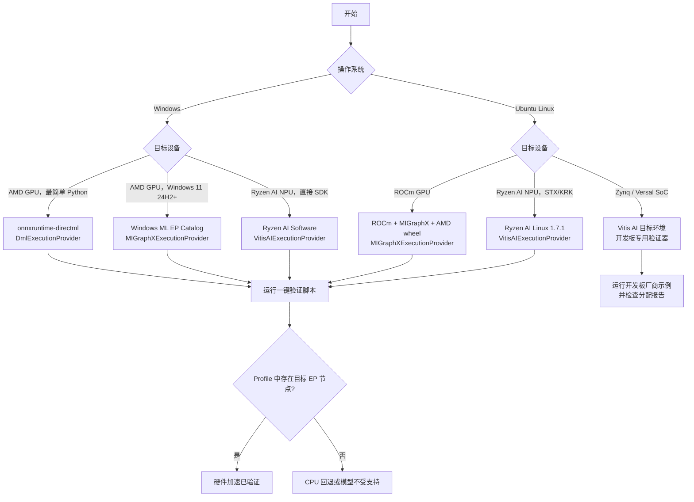
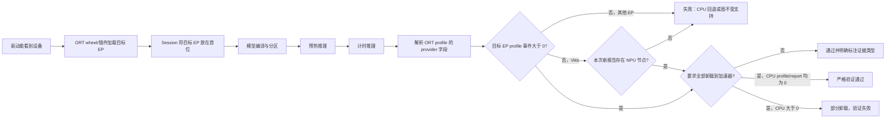

# ONNX Runtime 使用 AMD GPU / NPU 完整指南（Windows + Ubuntu）

[English](README.md) | **简体中文**

> **核查日期：** 2026-07-16  
> **目标：** 从零开始安装并选择正确的 ONNX Runtime 执行提供程序（Execution Provider，EP），并**证明**模型节点确实在 AMD GPU 或 AMD NPU 上执行，而不是静默回退到 CPU。

> **保证边界：** 截至核查日期，下文每个版本、URL、前置条件和命令均已对照 AMD、Microsoft、Canonical、ONNX Runtime 或 PyPI 的一手资料复核；脚本、CPU 自检和单元测试已在 Linux 实际执行。DirectML、Windows ML、MIGraphX 和 Vitis AI 的最终验证仍必须在匹配的真实目标设备上完成；文档不能模拟驱动，也不能认证官方矩阵未列出的 SKU。脚本 `PASS` 证明本次运行的节点放置和输出基本有效性；只有内嵌 GPU 模型，或对自定义模型使用 `--compare-cpu` 时，才会证明数值一致性。

---

## 0. 先读结论

| 场景 | 首选路径 | ONNX Runtime EP | 当前状态 |
|---|---|---|---|
| Windows，任意较新的 AMD GPU | Python 快速开始：DirectML；新应用可评估 Windows ML | `DmlExecutionProvider` | DirectML 仍可用但已进入持续工程维护；Windows ML 是微软的新推荐路径 |
| Windows 11 24H2+，受支持 AMD GPU | Windows ML 动态获取 AMD MIGraphX 插件 | `MIGraphXExecutionProvider` | 已由 Windows ML 提供；附带验证器通过 `--windows-ml` 支持此路径 |
| Ubuntu，受 ROCm 支持的 AMD GPU | ROCm + MIGraphX + AMD wheel | `MIGraphXExecutionProvider` | **Linux GPU 的主路径**；旧 `ROCMExecutionProvider` 已淘汰 |
| Windows，Ryzen AI NPU | Ryzen AI Software 1.7.1；Windows ML catalog 也提供插件 | `VitisAIExecutionProvider` | 支持 PHX/HPT/STX/KRK；附带 NPU 验证器使用 Ryzen AI 厂商环境（`--windows-ml` 仅用于 GPU） |
| Ubuntu 24.04，Ryzen AI NPU | Ryzen AI for Linux 1.7.1 | `VitisAIExecutionProvider` | **仅 STX/KRK，kernel >= 6.10，Python 3.12** |
| Linux，AMD/Xilinx Adaptive SoC | Vitis AI 目标镜像与运行时 | `VitisAIExecutionProvider` | Zynq/Versal 嵌入式 Linux 路径 |
| Windows 原生 HIP SDK | **不能直接作为 ORT MIGraphX 安装路径** | 无 | Windows HIP SDK 不包含 MIGraphX/MIOpen AI 库；应使用 DirectML 或 Windows ML |

### 三条最重要的事实

1. **`ROCMExecutionProvider` 已从 ONNX Runtime 1.23 起移除。** ROCm 7.0 是最后包含旧 ROCm EP 的 AMD 发行版；新项目必须迁移到 `MIGraphXExecutionProvider`。
2. `ort.get_available_providers()` 只证明 EP 库能够加载，**不证明任何模型节点在该设备执行**。附带脚本会解析本次运行生成的 ORT profile。若 Ryzen AI Vitis EP 不产生带 provider 归属的 profile 事件，脚本只接受“本次运行新生成的 Vitis 分配报告 + 推理成功”作为较弱证据，并准确标注其含义。
3. GPU 与 NPU 是两套不同的软件栈：ROCm/MIGraphX 或 DirectML 面向 GPU；Vitis AI/Ryzen AI 面向 XDNA NPU。安装 ROCm 不会自动启用 NPU，安装 NPU 驱动也不会自动启用 GPU。

---

## 1. 路径选择流程图



---

## 2. 基础概念

### 2.1 ONNX Runtime 的 EP 是什么？

ONNX Runtime 读取 ONNX 图后，按照 `providers` 列表顺序将每个节点分配给支持该节点的 EP。列表中的第一个 EP 优先级最高；后面的 `CPUExecutionProvider` 通常作为回退。

```python
providers = [
    "MIGraphXExecutionProvider",  # 第一选择
    "CPUExecutionProvider",      # 回退
]
```

| API / 信号 | 能证明什么 | 不能证明什么 |
|---|---|---|
| `ort.get_available_providers()` | 当前 wheel 能加载哪些 EP | 模型节点是否被放到 GPU/NPU |
| `session.get_providers()` | 会话注册了哪些 EP 及其优先级 | 实际节点分配比例 |
| ORT verbose log | 初始化和节点放置细节 | 不便自动判定，日志格式可能变化 |
| ORT `*_kernel_time` 节点事件的 `args.provider` | 执行这些 node kernel 的 EP | 硬件利用率百分比 |
| Vitis AI assignment report | CPU/NPU 节点数量与算子类型 | GPU EP 的节点分配 |
| Task Manager / `amd-smi` / `xrt-smi` | 设备活动和驱动可见性 | 单独不能证明某个 ONNX 节点属于该设备 |

### 2.2 GPU 与 NPU

| 项目 | AMD GPU | AMD Ryzen AI NPU |
|---|---|---|
| 硬件架构 | RDNA/CDNA GPU | AMD XDNA NPU |
| Linux 主要软件栈 | ROCm + MIGraphX | XRT + `amdxdna` + Ryzen AI/Vitis AI |
| Windows 主要软件栈 | DirectML 或 Windows ML MIGraphX | Ryzen AI Software 或 Windows ML VitisAI |
| ORT EP | `MIGraphXExecutionProvider` / `DmlExecutionProvider` | `VitisAIExecutionProvider` |
| 常见精度 | FP32、FP16、BF16/INT8/FP8（依硬件与 EP） | INT8、BF16；模型和芯片代际有限制 |
| 首次加载 | MIGraphX 编译或调优可能较慢 | Vitis AI 编译可能需要数分钟 |
| 缓存 | MIGraphX cache / compiled artifacts | Vitis AI cache 或 ORT EP Context |

---

## 3. 版本与支持矩阵

### 3.1 2026-07-16 版本快照

| 组件 | 当前已核查版本 | 说明 |
|---|---:|---|
| ROCm 生产文档 | 7.2.4 | ROCm 首页明确将 7.13 标为技术预览，生产环境继续使用 7.2.4 |
| ONNX Runtime MIGraphX wheel | 1.23.2 | AMD 7.2.4 wheel 目录提供 CPython 3.10/3.12 版本 |
| 官方 ROCm ORT Docker | ROCm 7.2.4 + ORT 1.23 + PyTorch 2.10.0 | Ubuntu 22.04/24.04 标签均可用 |
| 消费级 Radeon 验证矩阵 | ROCm 7.2.1 + ORT 1.23.2 | AMD Radeon/Ryzen 页面更新节奏与 ROCm core 页面不同 |
| MIGraphX 文档 | 2.15.0 | Linux |
| Ryzen AI Software 稳定版 | 1.7.1 | Windows + Ubuntu NPU；1.8.0 beta 不建议用于生产 |
| Ryzen AI Windows NPU 最低驱动 | 32.0.203.280 | Ryzen AI EP 1.7 兼容下限 |
| PyPI ONNX Runtime DirectML | 1.24.4 | 当前 x64 wheel；要求 Python >= 3.11 |
| ORT 中的 DirectML 算子库 | DirectML 1.15.2，最高 ONNX opset 20 | 已进入持续工程维护；部分 opset 20 算子存在例外 |
| 本指南可复现的 Windows ML Python 组合 | Windows App SDK / `wasdk-*` 2.1.3 + `onnxruntime-windowsml` 1.24.6.202605042033 | 这是 2.1.3 machine-learning wheel 发布的精确依赖；禁止混用 `wasdk-*` 与 runtime 版本 |

> **版本规则：** ROCm、MIGraphX 和 ORT MIGraphX wheel 必须来自彼此兼容的一组发行版。Windows ML 的两个 `wasdk-*` 包与 Windows App Runtime 也必须属于同一发行线。不要在同一虚拟环境中同时安装多个 `onnxruntime-*` 发行包。

> **为何固定 Windows ML 版本：** PyPI 未固定版本时当前已会解析到 2.3.0 projection，而微软公开的稳定 Windows App SDK 下载页当前最新 runtime 为 2.2.0。本指南使用的 2.1.3 projection、精确 ORT 依赖和 2.1.3 runtime 均仍公开发布，且构成一套可复现组合。不要把这些版本改成 `latest`。

### 3.2 文档版本差异

ONNX Runtime 的通用 Vitis AI 页面仍把 Ryzen AI 列为 Windows，把 Linux 列为 Adaptive SoC；但更新更晚的 **Ryzen AI Software 1.7.1 Linux Installation Instructions** 已明确支持 Ubuntu 24.04 上的 STX/KRK NPU。对于 Ryzen AI PC，应以对应 Ryzen AI 发行版文档和 release notes 为准；对于 Zynq/Versal，应以 Vitis AI 目标端文档为准。

### 3.3 已审计 artifact 指纹

验证器会强制下列 SHA-256。它们于 2026-07-16 从所述 Microsoft PyPI 或 AMD HTTPS 来源下载并重新计算。哈希不匹配时必须 fail closed，不能绕过检查；应重新审计新厂商 artifact，并同时更新代码和文档。

| Artifact | SHA-256 |
|---|---|
| DirectML 1.24.4 CPython 3.12 x64 wheel | `f2ecb68b7b7b259d2ef3112ae760149f9b5a1e7c0fbb73d539da6250a648a614` |
| 该 wheel 内的 `DirectML.dll` | `b73972115320e906a49602f2027a3266622881b0d325ba685e0f165a9482a8d7` |
| AMD ROCm 7.2.1 MIGraphX 1.23.2 CPython 3.10 wheel | `07f485fbeb8fbd6a89fa42d24832b4e206057fca62654b0eb39eb1edf9d6e70a` |
| AMD ROCm 7.2.1 MIGraphX 1.23.2 CPython 3.12 wheel | `663bff4dc3f72582d69f12ad073eb5695dfb526d574376cc8e5b161c7d2f0f08` |
| 两个 7.2.1 wheel 内的 MIGraphX provider SO | `8079986332cdf12234635ed4f2b5abd1b49519f6592d6dfcd8afaf5000887b7b` |
| AMD ROCm 7.2.4 MIGraphX 1.23.2 CPython 3.10 wheel | `4886faab646a7ef12f33fb53f085208182fab8dac249ba199dc5d23f8bd128ec` |
| AMD ROCm 7.2.4 MIGraphX 1.23.2 CPython 3.12 wheel | `ee8edeb2ba6a8d99b3043b23e812423e6f10333b508e003fc77b0feda197449f` |
| 两个 7.2.4 wheel 内的 MIGraphX provider SO | `f3fb0b10996b2a2f94afc59edf6fab421bfa12842f09518339d1e0d8f3bd86c7` |

Windows ML 采用动态服务，因此验证器改为要求 catalog 状态为 Certified、当前 MSIX 精确为 `1.8.57.0`，并检查固定 Python 发行包。Windows App Runtime 安装器只有在 Microsoft Authenticode 签名有效时才会被接受。

---

## 4. 零基础预检查

### 4.1 Windows：识别 GPU 和 NPU

在 PowerShell 中运行：

```powershell
Get-CimInstance Win32_VideoController |
  Select-Object Name, DriverVersion, AdapterRAM

Get-PnpDevice -PresentOnly |
  Where-Object { $_.FriendlyName -match 'NPU|Neural|AMD' } |
  Format-Table -AutoSize

winver
```

然后打开：

1. **Task Manager → Performance → GPU**：确认 GPU 名称、驱动和 DirectX 12。
2. **Task Manager → Performance → NPU**：Ryzen AI NPU 驱动正确时应出现 `NPU 0`。
3. 如果机器同时有 iGPU 与 dGPU，记住 Task Manager 中的 GPU 编号；DirectML 的 `device_id=0` 不一定是最快的设备。

### 4.2 Ubuntu：识别 GPU、NPU、OS 与权限

```bash
cat /etc/os-release
uname -r
lspci -nnk | grep -EA3 'VGA|Display|3D|1022:17f0'
groups
ls -l /dev/kfd /dev/dri 2>/dev/null || true
```

安装 ROCm 后运行：

```bash
/opt/rocm/bin/rocminfo | grep -E 'Name:|Marketing Name:' | head -20
/opt/rocm/bin/amd-smi list
```

安装 Ryzen AI NPU/XRT 后运行：

```bash
source /opt/xilinx/xrt/setup.sh
xrt-smi examine
```

| 观察结果 | 含义 |
|---|---|
| `/dev/kfd` + `/dev/dri/renderD*` | Linux GPU 计算设备节点存在 |
| `rocminfo` 显示 `gfx...` agent | ROCm 能看到 GPU；仍需检查官方硬件矩阵 |
| `1022:17f0` + `xrt-smi` 显示 NPU Strix/Krackan | 可尝试 Ryzen AI Linux NPU 路径 |
| 用户不在 `render,video` 组 | 常见 `Permission denied` 根因；加组后必须注销或重启 |

---

# A — Ubuntu AMD GPU：ROCm + MIGraphX

## 5. 硬件和 OS 门槛

AMD 当前发布两条不同的验证路线。ROCm **core** 7.2.4 矩阵支持 Ubuntu 24.04.4（kernel 6.8 GA 或 6.17 HWE）和 Ubuntu 22.04.5（kernel 5.15 GA 或 6.8 HWE），但必须遵守每款 GPU 的脚注。独立的 **Radeon ONNX Runtime** 矩阵则在部分 Radeon 9000/7000 与 Radeon PRO 型号上验证了 ORT 1.23.2 + ROCm 7.2.1，并要求 Ubuntu 24.04.4 HWE 6.17 或 Ubuntu 22.04.5 HWE 6.8。禁止把一条路线的驱动与另一条路线的 wheel 仓库混用。

部分代表性 GPU：

| 类别 | 代表型号 | 必须检查 |
|---|---|---|
| Instinct CDNA | MI100、MI200、MI300、MI325、MI350 | ROCm core system-requirements matrix |
| Radeon PRO | AI PRO R9700/R9600D、W7900/W7800/W7700 系列 | 必须出现在 Radeon ONNX 专用矩阵；仅列于 ROCm core 矩阵不足以采用本零基础路线 |
| Radeon RDNA4 | RX 9070/9060 系列 | 通常仅支持特定 Ubuntu/RHEL 版本 |
| Radeon RDNA3 | RX 7900/7800/7700 系列 | 仅使用 AMD 明确列出的 SKU |
| 未列出的 GPU | 旧 Polaris/Vega/RDNA2 或其他型号 | 不代表绝对不能运行，但不属于 AMD 官方支持，不能用于生产支持承诺 |

> `rocminfo` 能看到一个未列出的 GPU，不代表所有预编译 ROCm/MIGraphX 库都支持它。设备可能成功枚举，但在预编译库启动 kernel 时失败。

**Ryzen APU iGPU 注意事项：** 当前 ROCm 7.2.1 Ryzen APU 矩阵列出了 PyTorch 验证，却没有离散 Radeon 矩阵中的 ONNX Runtime 1.23.2 生产支持行。因此不能把 Radeon ONNX 支持泛化到每个 `gfx1150/gfx1151` APU iGPU。Ryzen AI 笔记本在 Windows 上的广泛 GPU 路径是 DirectML；Ubuntu 上有文档支持的 STX/KRK 加速路径则是 Vitis AI NPU。

## 6. 安装匹配的 ROCm 路线

复制命令块前：

1. 在 AMD 矩阵中确认精确 GPU SKU，并把 Ubuntu 更新到受支持的 point release（24.04.4 或 22.04.5）。
2. 只能选择一条路线：
  - **ROCm core / Instinct：** 对 core 矩阵允许的 Instinct SKU 使用 7.2.4，以及 6.1 或 6.2 节。
  - **Radeon 专用路线：** 仅适用于 AMD Radeon ONNX 矩阵明确列出的独立 Radeon/Radeon PRO；使用 7.2.1 和 6.3 节。
  - **Ryzen APU iGPU：** 到此停止；AMD 当前 APU 矩阵没有 ONNX Runtime 生产支持行。
3. **不要覆盖现有 AMDGPU 安装。** 必须先按对应 AMD 卸载流程清除旧安装；Radeon Software for Linux 不支持原地升级。
4. 启用 Secure Boot 时，应遵循组织的 DKMS 模块签名策略；不要仅为运行演示而关闭安全控制。

下列命令会安装/替换 kernel 驱动，因此必须重启。只能使用同时匹配所选路线和 Ubuntu 版本的命令块。

### 6.1 ROCm core 7.2.4 — Ubuntu 24.04

```bash
wget --https-only -O amdgpu-install_7.2.4.70204-1_all.deb \
  https://repo.radeon.com/amdgpu-install/7.2.4/ubuntu/noble/amdgpu-install_7.2.4.70204-1_all.deb
sudo apt install ./amdgpu-install_7.2.4.70204-1_all.deb
sudo apt update

sudo apt install "linux-headers-$(uname -r)" "linux-modules-extra-$(uname -r)"
sudo apt install amdgpu-dkms

sudo apt install python3-setuptools python3-wheel
sudo usermod -a -G render,video "$LOGNAME"
sudo apt install rocm
sudo reboot
```

### 6.2 ROCm core 7.2.4 — Ubuntu 22.04

```bash
wget --https-only -O amdgpu-install_7.2.4.70204-1_all.deb \
  https://repo.radeon.com/amdgpu-install/7.2.4/ubuntu/jammy/amdgpu-install_7.2.4.70204-1_all.deb
sudo apt install ./amdgpu-install_7.2.4.70204-1_all.deb
sudo apt update

sudo apt install "linux-headers-$(uname -r)" "linux-modules-extra-$(uname -r)"
sudo apt install amdgpu-dkms

sudo apt install python3-setuptools python3-wheel
sudo usermod -a -G render,video "$LOGNAME"
sudo apt install rocm
sudo reboot
```

### 6.3 Radeon ONNX 专用路线 — ROCm 7.2.1

这是 AMD Radeon ONNX 页面明确列出的独立 Radeon/Radeon PRO 产品的保守、完整矩阵验证路线。先安装矩阵要求的 HWE kernel，重启并确认 kernel 后再继续。

Ubuntu 24.04.4：

```bash
sudo apt update
sudo apt-get install --install-recommends linux-generic-hwe-24.04
sudo reboot
```

重启后，`uname -r` 必须显示受支持的 6.17 HWE 版本线；然后执行：

```bash
sudo apt update
sudo apt install -y python3-setuptools python3-wheel
wget --https-only -O amdgpu-install_7.2.1.70201-1_all.deb \
  https://repo.radeon.com/amdgpu-install/7.2.1/ubuntu/noble/amdgpu-install_7.2.1.70201-1_all.deb
sudo apt install ./amdgpu-install_7.2.1.70201-1_all.deb
sudo amdgpu-install -y --usecase=graphics,rocm
sudo usermod -a -G render,video "$LOGNAME"
sudo reboot
```

Ubuntu 22.04.5：

```bash
sudo apt update
sudo apt-get install --install-recommends linux-generic-hwe-22.04
sudo reboot
```

重启后，`uname -r` 必须显示受支持的 6.8 HWE 版本线；然后执行：

```bash
sudo apt update
sudo apt install -y python3-setuptools python3-wheel
wget --https-only -O amdgpu-install_7.2.1.70201-1_all.deb \
  https://repo.radeon.com/amdgpu-install/7.2.1/ubuntu/jammy/amdgpu-install_7.2.1.70201-1_all.deb
sudo apt install ./amdgpu-install_7.2.1.70201-1_all.deb
sudo amdgpu-install -y --usecase=graphics,rocm
sudo usermod -a -G render,video "$LOGNAME"
sudo reboot
```

重启后验证：

```bash
groups
/opt/rocm/bin/rocminfo | head -80
/opt/rocm/bin/amd-smi list
cat /opt/rocm/.info/version
```

预期：

- 当前用户属于 `render` 和 `video` 组。
- `rocminfo` 至少列出一个 GPU agent。
- `amd-smi list` 显示预期 GPU。
- ROCm 版本与准备安装的 wheel 仓库一致。

## 7. 安装 MIGraphX 与 ORT wheel

### 7.1 MIGraphX runtime

```bash
sudo apt update
sudo apt install -y migraphx

/opt/rocm/bin/migraphx-driver --version
/opt/rocm/bin/migraphx-driver perf --test
dpkg-query -W -f='${Package} ${Version}\n' migraphx half
```

`--test` 是文档明确支持的内建单层 GEMM 模型，因此不需要模型文件名；它会编译并执行真实 MIGraphX 性能测试。`half` 库通常作为 MIGraphX 依赖自动安装；若最后的 `dpkg-query` 显示缺失，请执行 `sudo apt install -y half`。只有开发/链接 MIGraphX 本身时才需要 `migraphx-dev`；普通 Python ORT 推理通常只需要 runtime 包。

### 7.2 创建隔离 Python 环境

本指南审计的两个仓库（ROCm 7.2.4 core 与 ROCm 7.2.1 Radeon）都提供 Linux x86-64 CPython 3.10 和 3.12 的 `onnxruntime_migraphx-1.23.2` wheel。应使用 Ubuntu 原生 Python：Ubuntu 24.04 使用 3.12，Ubuntu 22.04 使用 3.10。不要仅为本演示添加非官方 Python 仓库。

Ubuntu 24.04：

```bash
sudo apt install -y python3.12 python3.12-venv
python3.12 -m venv .venv-amd-ort
```

Ubuntu 22.04：

```bash
sudo apt install -y python3.10 python3.10-venv
python3.10 -m venv .venv-amd-ort
```

随后激活环境，并根据 `cat /opt/rocm/.info/version` 选择完全匹配的仓库。**ROCm core 7.2.4** 路线执行：

```bash
source .venv-amd-ort/bin/activate
grep -Eq '(^|[^0-9])7\.2\.4([^0-9]|$)' /opt/rocm/.info/version || { echo "Installed ROCm is not 7.2.4" >&2; exit 1; }
python -m pip install --index-url https://pypi.org/simple "pip==26.1.2"
python -m pip install --index-url https://pypi.org/simple "numpy==1.26.4"
PYTAG="$(python -c 'import sys; print(f"cp{sys.version_info.major}{sys.version_info.minor}")')"
case "$PYTAG" in cp310|cp312) ;; *) echo "Unsupported Python ABI: $PYTAG" >&2; exit 1;; esac
python -m pip install --index-url https://pypi.org/simple \
  "https://repo.radeon.com/rocm/manylinux/rocm-rel-7.2.4/onnxruntime_migraphx-1.23.2-${PYTAG}-${PYTAG}-manylinux_2_27_x86_64.manylinux_2_28_x86_64.whl"
```

**Radeon ROCm 7.2.1** 路线使用相同命令，但必须改用 7.2.1 仓库：

```bash
source .venv-amd-ort/bin/activate
grep -Eq '(^|[^0-9])7\.2\.1([^0-9]|$)' /opt/rocm/.info/version || { echo "Installed ROCm is not 7.2.1" >&2; exit 1; }
python -m pip install --index-url https://pypi.org/simple "pip==26.1.2"
python -m pip install --index-url https://pypi.org/simple "numpy==1.26.4"
PYTAG="$(python -c 'import sys; print(f"cp{sys.version_info.major}{sys.version_info.minor}")')"
case "$PYTAG" in cp310|cp312) ;; *) echo "Unsupported Python ABI: $PYTAG" >&2; exit 1;; esac
python -m pip install --index-url https://pypi.org/simple \
  "https://repo.radeon.com/rocm/manylinux/rocm-rel-7.2.1/onnxruntime_migraphx-1.23.2-${PYTAG}-${PYTAG}-manylinux_2_27_x86_64.manylinux_2_28_x86_64.whl"
```

这里使用的是刚创建、可随时删除的 venv。若安装前 `python -m pip list` 已显示任何 `onnxruntime-*` 发行包，应删除并重建 venv，不要原地卸载包。

这里刻意使用 `repo.radeon.com` 的 wheel 直链。PyPI 当前也存在同名、同版本的 `onnxruntime-migraphx` wheel，因此 `pip install ... -f repo.radeon.com` 已无法证明 pip 最终选择了哪个构建。演示脚本的 `--bootstrap` 路线还会在安装前检查所选 AMD wheel 是否匹配 2026-07-16 审计记录的 SHA-256。

显式 PyPI index 可防止个人 pip mirror 设置静默改变依赖来源。在受管或离线环境中，只能使用已独立验证 artifact 与更新策略的组织镜像。

为什么固定 NumPy 1.26.4？AMD 当前 Radeon ORT 安装页面警告其所引用 wheel 与 NumPy 2.x 不兼容。固定版本可避免已知 ABI 故障；迁移到更新的验证 wheel 时应重新评估该限制。

验证 wheel：

```bash
python -c "import onnxruntime as ort; print(ort.__version__); print(ort.get_available_providers())"
```

预期至少包含：

```text
['MIGraphXExecutionProvider', 'CPUExecutionProvider']
```

### 7.3 一键运行 GPU

从仓库根目录执行：

```bash
python AMD/amd_ort_hardware_test.py --target migraphx --strict-all
```

尚未安装 Python wheel 时，可让脚本安装**匹配已安装 ROCm 的 wheel**：

```bash
python AMD/amd_ort_hardware_test.py \
  --target migraphx --bootstrap --strict-all
```

`--bootstrap` 永远不会安装 kernel 驱动，只会管理当前 Python 环境中的包。

为保证安全，bootstrap 要求已激活 venv 或非 base Conda 环境；它会拒绝修改 Ryzen AI/Windows ML 厂商环境，检查 x86-64 与 Python ABI，验证 MIGraphX 和已安装 ROCm，并且只接受本指南记录的 7.2.1 与 7.2.4 两套发行组合。可选 `--rocm-version` 只用于断言检测到的版本。它不会卸载或原地覆盖已有 ORT；修改包之前会先完整下载所需 wheel。

## 8. Ubuntu Docker 快速路径

Host 前置条件：AMD kernel 驱动、`/dev/kfd`、`/dev/dri`、Docker Engine 和正确的用户权限。容器中携带 ROCm user-space 库、MIGraphX 与 ORT。必须把 `IMAGE` 设为与 host 验证路线匹配的标签；禁止使用 `latest`。

```bash
# ROCm core 7.2.4，Ubuntu 24.04：
IMAGE=rocm/onnxruntime:rocm7.2.4_ub24.04_ort1.23_torch2.10.0
# Radeon ROCm 7.2.1，Ubuntu 24.04（该路线改用此值）：
# IMAGE=rocm/onnxruntime:rocm7.2.1_ub24.04_ort1.23_torch2.9.1

docker pull "$IMAGE"

docker run --rm -it \
  --device /dev/kfd \
  --device /dev/dri \
  --security-opt seccomp=unconfined \
  -v "$PWD:/workspace" \
  -w /workspace \
  "$IMAGE" \
  python3 AMD/amd_ort_hardware_test.py --target migraphx --strict-all
```

Ubuntu 22.04 标签：core 路线使用 `rocm7.2.4_ub22.04_ort1.23_torch2.10.0`；Radeon 路线使用 `rocm7.2.1_ub22.04_ort1.23_torch2.9.1`。

容器内验证：

```bash
rocminfo
/opt/rocm/bin/amd-smi list
```

---

# B — Windows AMD GPU

## 9. 最简单 Python 路径：DirectML

### 9.1 要求

| 要求 | 最低条件 / 建议 |
|---|---|
| OS | DirectML 从 Windows 10 1903 引入；推荐 Windows 11 |
| GPU | 支持 DirectX 12；DirectML 广泛支持 AMD GCN 第一代及之后产品 |
| 驱动 | 最新稳定版 AMD Adrenalin/PRO 驱动 |
| Python | 使用 python.org 或 winget 的 x64 Python 3.12；禁止 Microsoft Store Python |
| 包 | 本次核查固定为 `onnxruntime-directml==1.24.4` |

### 9.2 安装

在 PowerShell 中：

```powershell
winget install --id Python.Python.3.12 -e `
  --accept-package-agreements --accept-source-agreements
```

若这是首次安装 Python，关闭所有 PowerShell 窗口并重新打开。只有下列检查都成功且架构为 AMD64/x86-64 后才能继续：

```powershell
py -3.12 --version
py -3.12 -c "import platform; print(platform.machine())"
py -3.12 -m venv .venv-amd-dml
Set-ExecutionPolicy -Scope Process Bypass -Force
.\.venv-amd-dml\Scripts\Activate.ps1

python -m pip install --index-url https://pypi.org/simple "pip==26.1.2"
python -m pip install --index-url https://pypi.org/simple "numpy==1.26.4" "onnxruntime-directml==1.24.4"

python -c "import onnxruntime as ort; print(ort.get_available_providers())"
```

`numpy==1.26.4` 是与本指南 AMD wheel 路线共用的保守可复现版本，并非 DirectML 硬件要求。修改固定环境前必须重新验证。

预期：

```text
['DmlExecutionProvider', 'CPUExecutionProvider']
```

### 9.3 一键运行

```powershell
python AMD/amd_ort_hardware_test.py --target dml --strict-all
```

多 GPU 机器：

```powershell
python AMD/amd_ort_hardware_test.py --target dml --device-id 1 --strict-all
```

必须从仓库根目录运行。演示脚本会应用 DirectML 必需设置，并按 DirectML 使用的**相同顺序**通过 DXGI 枚举 adapter；若 `--device-id` 对应设备的 AMD PCI vendor ID 不是 `0x1002`，脚本会失败。

必需 session 设置：

```python
options.enable_mem_pattern = False
options.execution_mode = onnxruntime.ExecutionMode.ORT_SEQUENTIAL
```

DirectML 不支持 ORT 并行执行或 memory-pattern optimization。不要在多个线程中并发调用同一个 session 的 `Run`；需要并发时应使用不同 session。

### 9.4 DirectML 限制

- DirectML 已进入持续工程维护；它仍受支持，但新的 Windows 开发方向正在转向 Windows ML。
- 当前 ORT 文档说明 DirectML 1.15.2 支持最高 ONNX opset 20，但 5-D GridSample 20 和 DeformConv 等配置除外。
- 静态输入形状通常能改善常量折叠、权重预处理和 GPU 调度。
- `device_id=0` 是默认 DXGI adapter，不一定是性能最高的 adapter。

## 10. 新 Windows 路径：Windows ML + AMD MIGraphX

对于新的 Windows 11 24H2+ 应用，如果希望系统管理 EP 下载和更新，应采用此路径。它比单文件 DirectML 实验设置更多，但属于 Windows 的战略方向。

### 10.1 要求与安装

| 项目 | 要求 |
|---|---|
| OS | 动态获取硬件 EP 需要 Windows 11 24H2、build 26100 或更新版本 |
| Python | Windows ML 通用范围为 x64/ARM64 Python 3.10–3.13，但本指南审计的 AMD 组合专门使用 x64 Python 3.12，且固定 ORT 要求 Python >= 3.11；不能使用 Microsoft Store Python |
| Runtime | 与 Python `wasdk-*` 包匹配的 Windows App SDK Runtime |
| AMD MIGraphX 插件 | 通过 Windows ML EP Catalog 获取；当前 Microsoft 表格对驱动版本非常敏感 |
| AMD VitisAI 插件 | 需要 Ryzen AI NPU 驱动；见 C 部分 |

```powershell
winget install --id Python.Python.3.12 -e `
  --accept-package-agreements --accept-source-agreements
```

如果 winget 是首次安装 Python，必须**关闭所有 PowerShell 窗口并重新打开 PowerShell**。只有下列两个命令均成功，且显示 x64/AMD64 Python 3.12 后才能继续：

```powershell
py -3.12 --version
py -3.12 -c "import platform; print(platform.machine())"

py -3.12 -m venv .venv-winml
Set-ExecutionPolicy -Scope Process Bypass -Force
.\.venv-winml\Scripts\Activate.ps1

python -m pip install --index-url https://pypi.org/simple "pip==26.1.2"
python -m pip install --index-url https://pypi.org/simple `
  "numpy==1.26.4" `
  "wasdk-Microsoft.Windows.AI.MachineLearning[all]==2.1.3" `
  "wasdk-Microsoft.Windows.ApplicationModel.DynamicDependency.Bootstrap==2.1.3" `
  "onnxruntime-windowsml==1.24.6.202605042033"

winget install --id "Microsoft.VCRedist.2015+.x64" -e `
  --accept-package-agreements --accept-source-agreements

$runtimeInstaller = "$env:TEMP\windowsappruntimeinstall-2.1.3-x64.exe"
Invoke-WebRequest `
  https://aka.ms/windowsappsdk/2.1/2.1.3/windowsappruntimeinstall-x64.exe `
  -OutFile $runtimeInstaller

$signature = Get-AuthenticodeSignature -LiteralPath $runtimeInstaller
if ($signature.Status -ne 'Valid' -or $signature.SignerCertificate.Subject -notmatch 'Microsoft Corporation') {
  Remove-Item -LiteralPath $runtimeInstaller -Force -ErrorAction SilentlyContinue
  throw "Windows App Runtime installer signature is not a valid Microsoft signature."
}

try {
  $process = Start-Process $runtimeInstaller -ArgumentList "--quiet" -Wait -PassThru
  if ($process.ExitCode -ne 0) {
    throw "Windows App Runtime installer failed: 0x$('{0:X8}' -f $process.ExitCode)"
  }
} finally {
  Remove-Item -LiteralPath $runtimeInstaller -Force -ErrorAction SilentlyContinue
}
```

Machine-learning wheel 本身就要求上面显示的精确 ORT build；显式写出该依赖便于审计。固定 2.1.3 并验证 2.1.3 runtime 安装器的微软签名是刻意设计：安装最新 `wasdk-*` wheel 却保留旧 runtime 是常见 bootstrap 故障。运行前检查：

```powershell
python -m pip list | findstr /i "wasdk onnxruntime-windowsml winrt-runtime"
```

关键预期版本：两个 `wasdk-*` 包均为 2.1.3，`onnxruntime-windowsml` 为 1.24.6.202605042033。若 pip 显示其他 ORT 发行包，或同时存在多个 `onnxruntime-*` 发行包，应停止并重建 venv。

随后从仓库根目录运行验证器：

```powershell
python AMD/amd_ort_hardware_test.py `
  --target migraphx --windows-ml --strict-all
```

脚本会保持 Windows App Runtime bootstrap context 有效，调用 `ensure_ready_async().get()`，通过 `ort.register_execution_provider_library()` 注册下载的插件，选择其 `OrtEpDevice`，并在**同一个 Python 进程**内创建 session。

### 10.2 Python EP 获取注意事项

在 Python 中，**不要**调用 `EnsureAndRegisterCertifiedAsync()` 后就假设 EP 已注册到 Python ORT 环境。当前 Microsoft 指南要求：

1. 在整个 Python 操作期间初始化并保持 Windows App Runtime。
2. 调用 `find_all_providers()` 并选择精确 EP。
3. 调用 `ensure_ready_async().get()` 并检查返回状态。
4. 在同一进程中通过 `ort.register_execution_provider_library()` 注册其 `library_path`。
5. 枚举 `ort.get_ep_devices()`，选择目标设备，并通过 `SessionOptions.add_provider_for_devices()` 添加。

附带脚本已为 AMD MIGraphX 实现此流程。不要复制固定插件 DLL 路径；该路径由 Windows ML 管理和更新。

当前 Windows ML AMD EP 名称：

| AMD 设备 | EP 名称 |
|---|---|
| AMD GPU | `MIGraphXExecutionProvider` |
| AMD Ryzen AI NPU | `VitisAIExecutionProvider` |
| 通用 DX12 GPU 回退 | `DmlExecutionProvider` |

截至 2026-07-16 的实时表格门槛：

| 插件 | 当前 catalog 版本 | 驱动门槛 |
|---|---|---|
| MIGraphX | MSIX 1.8.57.0 / GPU EP 7.2.2606.20 | AMD GPU 驱动必须**精确为 25.10.13.09**；当前不支持 GenAI 场景 |
| VitisAI | MSIX 1.8.63.0 / EP 2858 | 最低 Adrenalin 25.6.3 + NPU 32.00.0203.280；最高 Adrenalin 25.9.1 + NPU 32.00.0203.297 |

只有 catalog 表格中的当前版本受支持。这些值会随 Windows Update D-week 版本变化，因此安装或冻结镜像前必须重新核对实时表格。数字更大的新驱动**不等于自动兼容**。

> **禁止混用两条 NPU 路线：** AMD 的直接 Ryzen AI 1.7.1 页面链接 NPU 驱动 32.0.203.280 和 32.0.203.314，但当前 Windows ML VitisAI catalog 行的上限是 32.00.0203.297。因此，.314 虽可用于直接 1.7.1 SDK，却超出当前 Windows ML VitisAI 门槛。附带 NPU 命令使用直接 Ryzen AI 厂商环境，不使用 `--windows-ml`。

### 10.3 为什么 Windows HIP SDK 不是这条路径

Windows HIP SDK 只是 ROCm 的子集。AMD 组件表明确标注原生 HIP SDK 中不提供 MIOpen、MIGraphX 和 AI frameworks。仅安装 HIP SDK 不会让普通 ORT Python wheel 出现 `MIGraphXExecutionProvider`。原生 Windows 应选择：

- 最简单 Python GPU 路径：DirectML（`onnxruntime-directml`）；
- 通过 Windows ML 获取 AMD MIGraphX 插件；
- 仅当精确 Linux 矩阵支持该负载时使用原生 Ubuntu ROCm/MIGraphX。

### 10.4 WSL2 状态：不能作为 MIGraphX 路线

本演示**不能**使用 WSL2 MIGraphX。AMD 当前 ROCDXG WSL 指南（Adrenalin 26.2.2 + ROCm 7.2.1）明确写明：**WSL 当前不支持 MIGraphX**。旧的、现已归为 legacy 的 7.2 兼容页曾列出 ONNX Runtime 1.23.2，但它不能覆盖当前限制。附带验证器因此会拒绝 WSL kernel 上的 MIGraphX，而不是把不受支持的路线伪装成可用。

应选择以下受支持替代方案之一：

- 原生 Ubuntu，并严格使用 A 部分对应矩阵与发行组合；
- 原生 Windows DirectML，作为最简单 AMD GPU 路线；
- 满足 catalog 精确驱动门槛时使用 Windows ML MIGraphX。

Ryzen AI 1.7.1 NPU 文档同样只说明原生 Windows 与原生 Ubuntu 24.04 STX/KRK，并未说明 WSL NPU passthrough。

---

# C — Windows Ryzen AI NPU：Vitis AI

## 11. 支持范围

Ryzen AI Software 1.7 支持 Phoenix（PHX）、Hawk Point（HPT）、Strix/Strix Halo（STX）和 Krackan Point（KRK）。

| 模型类型 | PHX/HPT | STX/KRK |
|---|---:|---:|
| CNN INT8 | 是 | 是 |
| CNN BF16 | 否 | 是 |
| NLP/encoder BF16 | 否 | 是 |
| ONNX Runtime GenAI LLM | 否 | 是 |

推荐 ONNX opset：**17**。不受支持的节点会自动划分到 CPU，除非应用启用并验证严格放置策略。

## 12. 安装 Ryzen AI Software 1.7.1

### 12.1 前置要求

| 依赖 | 要求 |
|---|---|
| Windows | 直接使用 Ryzen AI 1.7.1 栈需要 Windows 11 build >= 22621.3527 |
| NPU 驱动 | 32.0.203.280 或更新版本；仍需核对精确 EP 版本的兼容范围 |
| Visual Studio | 构建或使用 custom op 时需要 VS 2022 + Desktop Development with C++；基础 Python quicktest 可不安装 |
| CMake | >= 3.26 |
| 环境管理器 | 推荐 Miniforge |
| 支持的 NPU | 必须在 Ryzen AI release notes 中确认，不能只依据处理器营销名称 |

### 12.2 驱动与软件

0. 若尚未安装 Miniforge，请下载官方 `Miniforge3-Windows-x86_64.exe`，安装到不含空格和特殊字符的路径，并创建开始菜单 **Miniforge Prompt** 快捷方式。按照 AMD 前置要求，只把该安装的 `condabin` 目录加入**系统** `PATH`；禁止加入另一套 Conda。关闭所有终端，打开 Miniforge Prompt，并确认 `where.exe conda` 与 `conda --version` 均成功。禁止用 Microsoft Store Python 替代。
1. 在 PowerShell 中用下列单行命令安装 CMake：

```powershell
winget install --id Kitware.CMake -e --accept-package-agreements --accept-source-agreements
```

关闭并重新打开 Miniforge Prompt，然后确认下列命令显示 3.26 或更新版本：

```powershell
cmake --version
```

基础 quicktest 可不安装 Visual Studio；AMD Quark custom-op/构建流程则要求 VS 2022 的 **Desktop development with C++** workload。

2. 从 Ryzen AI 官方安装页下载生产版 NPU 驱动。
3. 解压驱动 ZIP。
4. 打开**管理员**终端并运行：

```powershell
.\npu_sw_installer.exe
```

5. 根据提示重启，然后在 **Task Manager → Performance → NPU 0** 验证。对本直接 Ryzen AI 1.7.1 路线，使用其页面链接的生产驱动之一（32.0.203.280 或 32.0.203.314）；禁止把 Ryzen AI 1.8 beta 驱动与本软件栈混用。若目标改为 Windows ML VitisAI，必须返回第 10 节并遵守更窄的实时驱动范围。
6. 下载并运行 `ryzen-ai-lt-1.7.1.exe`。
7. 除非部署策略要求，否则保留默认安装路径。
8. 让安装器创建默认 Conda 环境 `ryzen-ai-1.7.1`。

### 12.3 厂商 quicktest（STX/KRK）

AMD 明确说明，未经修改的厂商 quicktest 预期适用于 **STX/KRK 或更新设备**。打开开始菜单中的 **Miniforge Prompt**（Command Prompt 快捷方式，不是 PowerShell），并使用 cmd.exe 语法：

```bat
conda activate ryzen-ai-1.7.1
python -c "import onnxruntime as ort; print(ort.__version__); print(ort.get_available_providers())"
cd /d "%RYZEN_AI_INSTALLATION_PATH%\quicktest"
python quicktest.py
```

若没有 `VitisAIExecutionProvider`，必须停止；禁止用 pip 原地修复厂商环境。

预期最后一行：

```text
Test Finished
```

测试期间观察 Task Manager 的 NPU 曲线。

在 **PHX/HPT** 上禁止直接运行未经修改的 `quicktest.py`：AMD 要求设置 `target=X1`、`xlnx_enable_py3_round=0` 和 Phoenix `4x4.xclbin`。直接跳到 12.4 节；仓库验证器会应用这些选项，无需修改厂商文件。

### 12.4 一键 profile 验证

在 Ryzen AI 环境已激活时，从仓库根目录运行：

```powershell
python AMD/amd_ort_hardware_test.py --target npu --strict-all
```

脚本会找到厂商 `quicktest/test_model.onnx`，检测 PHX/HPT 或 STX/KRK，创建正确的 Vitis AI 选项，执行推理，并拒绝 NPU 节点数为零的结果。

> **不要在 Ryzen AI 环境中执行 `pip install onnxruntime`。** 通用 CPU wheel 可能覆盖厂商 ORT 文件并移除 `VitisAIExecutionProvider`。

## 13. 不同代际的 Vitis AI provider options

| 设备 | INT8 `target` | `xclbin` | 说明 |
|---|---|---|---|
| STX/KRK 及更新设备 | 默认 `X2`；特定模型可测试 `X1` | 普通 X2 流程中**不得**设置 | 支持当前 INT8 compiler；可用 BF16 |
| PHX/HPT | 必须设为 `X1` | 必须设置 `...\xclbins\phoenix\4x4.xclbin` | 当前兼容矩阵仅支持 CNN INT8 |

STX/KRK 最小示例：

```python
import onnxruntime as ort

options = {
    "target": "X2",
    "cache_dir": r"C:\temp\my-vitis-cache",
    "cache_key": "my-model-v1",
    "enable_cache_file_io_in_mem": "0",
}

session = ort.InferenceSession(
    "model_int8.onnx",
    providers=[
        ("VitisAIExecutionProvider", options),
        "CPUExecutionProvider",
    ],
)
```

### BF16 与生产部署

- 在支持的 STX/KRK 设备上，FP32 CNN/Transformer 模型可进入 BF16 编译流程。
- `config_file` 控制 BF16 compiler 的 `optimize_level` 和首选数据布局等设置。
- AMD 建议 C++ 部署使用预编译 BF16 模型；deployment EP 并不支持所有运行时 BF16 编译场景。
- 首次编译可能需要数分钟。开发期使用 Vitis AI cache，最终打包建议使用 ORT EP Context。
- 更改 Vitis AI EP 或 NPU 驱动后，应删除缓存或更换 cache key；缓存不能跨任意版本复用。

### 生成 assignment report

PowerShell：

```powershell
$env:XLNX_ONNX_EP_REPORT_FILE = "vitisai_ep_report.json"
python your_inference.py
```

报告的 `deviceStat` 部分会显示 `CPU` 和 `NPU` 节点数。确保 `enable_cache_file_io_in_mem=0`，然后检查配置的 cache 目录。

---

# D — Ubuntu Ryzen AI NPU：Vitis AI

## 14. 当前 Linux 支持门槛

Ryzen AI 1.7.1 是本指南当前产品文档中第一条明确支持 Linux Ryzen NPU 推理的路径。

| 要求 | 当前 1.7.1 条件 |
|---|---|
| 支持的 NPU 系列 | STX 和 KRK |
| 发行版 | Ubuntu 24.04 LTS |
| Kernel | >= 6.10 |
| Python | 3.12.x |
| RAM | 推荐 64 GB |
| 模型 | CNN INT8/BF16、encoder NLP BF16、NPU-only LLM flow |
| EP | `VitisAIExecutionProvider` |

PHX/HPT **不在**当前 Linux 支持声明中。不能根据 Windows 矩阵推断 Linux 支持。

## 15. 安装 Ubuntu NPU 驱动与 Ryzen AI

### 15.1 基础包

```bash
sudo apt update
sudo apt install -y software-properties-common
sudo add-apt-repository -y universe
sudo apt update
sudo apt install -y python3.12 python3.12-venv libboost-filesystem1.74.0 pciutils
uname -r
```

官方 1.7.1 页面要求 `libboost-filesystem1.74.0`；Ubuntu 24.04 在 `universe` 组件中发布该包，上述命令会显式启用此组件。不要用其他 Ubuntu 版本的二进制包替代。

Ubuntu 24.04 GA kernel 可能低于 6.10。应通过 Ubuntu 支持的方式升级到受支持的 HWE/OEM kernel，重启并再次检查 `uname -r`，然后再安装 XRT。

普通 GA/HWE 安装可使用 Canonical 文档给出的命令：

```bash
sudo apt-get update
sudo apt-get install --install-recommends linux-generic-hwe-24.04
sudo reboot
```

重启后运行 `uname -r`，只有版本 >= 6.10 才能继续。若 `ubuntu-drivers list-oem` 输出 OEM kernel track，应保留 OEM 支持的更新节奏，并查阅电脑厂商/Ubuntu 文档，不要盲目切换 kernel track。

### 15.2 下载并安装 XRT/NPU 包

从 AMD Ryzen AI 官方下载页获取 `RAI_1.7.1_Linux_NPU_XRT.zip`，接受许可并解压，然后在解压目录运行：

```bash
sudo apt install --fix-broken -y ./xrt_202610.2.21.75_24.04-amd64-base.deb
sudo apt install --fix-broken -y ./xrt_202610.2.21.75_24.04-amd64-base-dev.deb
sudo apt install --fix-broken -y ./xrt_202610.2.21.75_24.04-amd64-npu.deb
sudo apt install --fix-broken -y ./xrt_plugin.2.21.260102.53.release_24.04-amd64-amdxdna.deb

export LD_LIBRARY_PATH=/lib/x86_64-linux-gnu:${LD_LIBRARY_PATH:-}
source /opt/xilinx/xrt/setup.sh
xrt-smi examine
```

预期设备名称类似 `NPU Strix`；具体 BDF 和名称因机器而异。

### 15.3 安装 Ryzen AI 1.7.1 包

从 AMD 下载 `ryzen_ai-1.7.1.tgz`，然后运行：

```bash
mkdir -p ryzen_ai-1.7.1
cp ryzen_ai-1.7.1.tgz ryzen_ai-1.7.1/
cd ryzen_ai-1.7.1
tar -xvzf ryzen_ai-1.7.1.tgz

./install_ryzen_ai.sh -a yes -p "$HOME/ryzen-ai-1.7.1/venv"
source "$HOME/ryzen-ai-1.7.1/venv/bin/activate"
echo "$RYZEN_AI_INSTALLATION_PATH"
python -c "import sys; assert sys.version_info[:2] == (3, 12), sys.version; print(sys.version)"
python -c "import onnxruntime as ort; print(ort.__version__); print(ort.get_available_providers())"
```

Linux 使用安装器创建的 Python virtual environment；示例中的 Windows-only Conda 步骤应跳过。若没有 `VitisAIExecutionProvider`，必须停止；禁止向该环境安装通用 ORT wheel。

### 15.4 Quicktest 与一键验证

```bash
export LD_LIBRARY_PATH=/lib/x86_64-linux-gnu:${LD_LIBRARY_PATH:-}
source /opt/xilinx/xrt/setup.sh
source "$HOME/ryzen-ai-1.7.1/venv/bin/activate"
cd "$HOME/ryzen-ai-1.7.1/venv/quicktest"
python quicktest.py

# 将下列值替换为包含本仓库 LICENSE 文件的绝对目录。
REPO_ROOT="/absolute/path/to/Speaker-Recognition-Identify-ONNX-main"
cd "$REPO_ROOT"
python AMD/amd_ort_hardware_test.py --target npu --strict-all
```

如果安装路径不同，激活对应环境并显式传入 quicktest 模型：

```bash
source /opt/xilinx/xrt/setup.sh
python AMD/amd_ort_hardware_test.py \
  --target npu \
  --model /your/ryzen-ai/venv/quicktest/test_model.onnx \
  --strict-all
```

---

# E — AMD Adaptive SoC 上的 Vitis AI

## 16. 嵌入式 Linux 目标

| Host ISA | Vitis AI 目标 | 示例开发板 | OS |
|---|---|---|---|
| Arm Cortex-A53 | Zynq UltraScale+ MPSoC | ZCU102、ZCU104、KV260 | Linux |
| Arm Cortex-A72 | Versal AI Core/Premium | VCK190 | Linux |
| Arm Cortex-A72 | Versal AI Edge | VEK280 | Linux |

流程：

1. 从开发板专用 Vitis AI target image/BSP 开始。
2. 按 Vitis AI Target Setup 安装固件、XRT、DPU overlay 和匹配的 runtime 包。
3. 安装或使用目标端提供的预编译 Vitis AI ONNX Runtime EP。
4. 使用 AMD Quark 或 Vitis AI Quantizer 针对目标 DPU 量化模型。
5. 使用 `VitisAIExecutionProvider` 和 CPU fallback 创建 session。
6. 通过 Vitis AI 日志、assignment report 和设备工具验证节点分配。

不要在这些 Arm 目标上使用 x86-64 Ryzen AI 安装器或 ROCm MIGraphX wheel。ONNX Runtime 通用构建页说明，Linux `--use_vitisai` 通过此目标端工作流支持 AMD Adaptive SoC。

---

# F — 一键 Python 演示

## 17. 演示脚本行为

文件：[amd_ort_hardware_test.py](amd_ort_hardware_test.py)

| 功能 | 行为 |
|---|---|
| `--target auto` | 优先级：Vitis AI NPU → MIGraphX GPU → DirectML GPU |
| `--target gpu` | Linux 选择 MIGraphX；普通 Windows pip 环境选择 DirectML |
| `--windows-ml` | 仅 Windows：在同一进程中初始化匹配 Runtime，验证固定 Python 发行包与当前 MIGraphX MSIX 1.8.57.0，获取/注册插件并选择 AMD `OrtEpDevice` |
| `--target npu` | 要求厂商安装的 Vitis AI EP；永远不会用公共 wheel 替换它 |
| `--bootstrap` | 要求干净隔离环境；固定并校验 Python 3.12 Microsoft DirectML wheel，或 AMD 官方直链 ROCm 7.2.1/7.2.4 wheel；先暂存依赖，不安装驱动，也不卸载已有 ORT |
| 运行时来源 | 再次检查已安装 DirectML/MIGraphX 发行版本与 provider DLL/SO 哈希；Windows ML 会复核三个固定发行包版本 |
| 默认 GPU 模型 | 写出内嵌且通过完整性校验的 opset-17 Conv → Relu → GlobalAveragePool 模型；不需要单独安装 `onnx` |
| 默认 NPU 模型 | 使用已知兼容 NPU 的 Ryzen AI 厂商 quicktest 模型 |
| 输出基本检查 | 每次 warm-up/计时结果都必须包含非空 tensor；浮点/复数 tensor 必须为有限值；object/sequence/map 输出会 fail closed，必须使用模型专用 runner |
| 数值校验 | 内嵌 GPU 模型始终与独立 CPU EP 比较；`--compare-cpu` 可对用户模型启用相同检查（可配置 `--rtol`/`--atol`） |
| 验证方式 | 只统计本次 ORT profile 中结尾为 `*_kernel_time` 且带 provider 归属的 `Node` 事件；若无归属信息，Vitis 可使用新生成分配报告 + 推理成功 |
| 失败策略 | EP 已加载，但没有目标 profile 事件（且没有本次新生成的 Vitis NPU 分配证据）时返回非零退出码 |
| `--strict-all` | 创建 session 前设置 ORT `session.disable_cpu_ep_fallback=1`，随后独立拒绝 profile 或 Vitis 报告中的 CPU event/node |
| 证据隔离 | 每次调用使用全新产物/cache 目录，因此旧 Vitis 报告和不兼容编译缓存不能造成假通过 |
| `--unit-tests` | 无需 AMD 硬件，运行验证器内置的确定性安全/单元测试后退出 |
| WSL | AMD 当前 WSL 指南标注 MIGraphX 不受支持，因此脚本会拒绝该路径 |
| 范围限制 | 仅 Ryzen AI PC NPU；脚本会拒绝 Arm Zynq/Versal Adaptive SoC，后者需要开发板专用模型/options |

### 17.1 命令表

| 平台 | 命令 |
|---|---|
| Windows AMD GPU，DirectML | `python AMD/amd_ort_hardware_test.py --target dml --bootstrap --strict-all` |
| Windows AMD GPU，Windows ML MIGraphX | `python AMD/amd_ort_hardware_test.py --target migraphx --windows-ml --strict-all` |
| Ubuntu AMD GPU | `python AMD/amd_ort_hardware_test.py --target migraphx --bootstrap --strict-all`（自动检测文档支持的 7.2.1 或 7.2.4 路线） |
| Windows Ryzen AI NPU | `python AMD/amd_ort_hardware_test.py --target npu --strict-all` |
| Ubuntu Ryzen AI NPU | `python AMD/amd_ort_hardware_test.py --target npu --strict-all` |
| 已有自定义模型 | 添加 `--model path/to/model.onnx` |
| 自定义模型 + CPU 一致性 | 添加 `--compare-cpu`；若预期低精度误差，请设置适合模型的 `--rtol` 与 `--atol` |
| 动态输入 | 添加 `--shape input_name=1,3,224,224` |
| 选择第二张 GPU | 添加 `--device-id 1`；DirectML 按 DXGI adapter 编号，而 `--windows-ml` 按脚本打印的 AMD MIGraphX `OrtEpDevice` 列表编号 |
| 允许部分 CPU fallback | 省略 `--strict-all`；仍要求至少一个加速器节点 |
| 仅验证脚本的 CPU 自检 | `python AMD/amd_ort_hardware_test.py --target cpu` |
| 内置单元测试 | `python AMD/amd_ort_hardware_test.py --unit-tests` |

通过 profile 验证的加速运行最后会出现：

```text
[PASS/通过] Runtime profile verified ... executed node event(s) on ...
```

若某个 Vitis build 的 ORT profile 不暴露 provider 归属，成功信息会单独说明“推理成功 + **本次新生成**分配报告中的 NPU 节点数”。分配报告计数是唯一图节点；profile 计数是随 warm-up/计时运行重复出现的执行事件，二者不能作为百分比直接比较。

如果程序只在 `get_available_providers()` 中列出 EP，却既没有目标 profile 事件，也没有本次新生成的 Vitis NPU 分配证据，脚本会刻意失败退出。

`--strict-all` 会先要求 ORT 在 session 创建阶段拒绝 CPU EP 放置，再拒绝本次 ORT profile 或 Vitis 报告暴露的每个 CPU event/node；它无法证明所有 provider 证据通道都未记录的事实。同样，厂商 NPU 模型或任意自定义模型通过“硬件放置”验证，并不等于应用准确率认证；生产前必须使用可信测试向量或 `--compare-cpu`。

对于 DirectML，脚本会枚举 `IDXGIFactory::EnumAdapters`、确认 `--device-id` 存在，并要求所选 adapter 的 PCI vendor ID 为 AMD（`0x1002`）。这能消除仅检查 WMI 名称时在混合厂商机器上的假阳性。

运行证据保存在 Linux 的 `~/.cache/amd-ort-oneclick/runs/`（Windows 为对应用户主目录），或由 `AMD_ORT_DEMO_CACHE` 指定。Vitis cache 刻意每次全新创建，因此每次 NPU 验证都可能编译数分钟；这是以可靠安装证明优先，而非追求 benchmark 便利。收集证据后可删除旧 run 目录。

Linux 上可先查看、再删除七天前的运行目录：

```bash
find ~/.cache/amd-ort-oneclick/runs -mindepth 1 -maxdepth 1 -type d -mtime +7 -print
# 核对输出路径后，再用 -exec rm -rf -- {} + 替换命令末尾的 -print
```

### 17.2 运行自己的模型

```bash
python AMD/amd_ort_hardware_test.py \
  --target migraphx \
  --model /absolute/path/model.onnx \
  --shape images=1,3,224,224 \
  --compare-cpu
```

通用输入生成器支持常见数值和 Boolean tensor 类型。每个动态输入都必须提供 rank 正确的显式 `--shape`；脚本会在推理前拒绝未知 input 名称和修改固定维度的尝试。浮点输入使用确定性数值，整数/Boolean 输入使用零。`--compare-cpu` 要求 CPU EP 支持整个模型及其 custom operator；独立 CPU reference session 失败，不代表加速器本身失败。需要 token 语义、非零长度、多个相关输入、字符串、custom operator、校准数据或领域准确率指标的模型，需要专用预处理/reference runner；仍可复用脚本中的 EP 验证逻辑。

---

## 18. 最小 provider 代码

### 18.1 Linux MIGraphX GPU

```python
import onnxruntime as ort

session = ort.InferenceSession(
    "model.onnx",
    providers=[
        ("MIGraphXExecutionProvider", {"device_id": "0"}),
        "CPUExecutionProvider",
    ],
)
```

常用 MIGraphX 选项：

| 选项 | 含义 |
|---|---|
| `device_id` | GPU 编号，默认 0 |
| `migraphx_fp16_enable` | 在受支持位置启用 FP16 转换 |
| `migraphx_bf16_enable` | 在受支持位置启用 BF16 转换 |
| `migraphx_int8_enable` | 启用 INT8；需要校准设置 |
| `migraphx_fp8_enable` | 启用 FP8；受硬件和模型要求限制 |
| `migraphx_exhaustive_tune` | 通过更长编译/调优换取潜在性能提升 |
| `migraphx_mem_limit` | EP arena 上限；进程总 GPU 内存可能更高 |

在使用可信 CPU/reference 结果测量精度之前，不要启用降低精度模式。

### 18.2 Windows DirectML GPU

```python
import onnxruntime as ort

options = ort.SessionOptions()
options.enable_mem_pattern = False
options.execution_mode = ort.ExecutionMode.ORT_SEQUENTIAL

session = ort.InferenceSession(
    "model.onnx",
    sess_options=options,
    providers=[
        ("DmlExecutionProvider", {"device_id": "0"}),
        "CPUExecutionProvider",
    ],
)
```

### 18.3 Ryzen AI Vitis AI NPU

```python
import onnxruntime as ort

options = {
    "target": "X2",  # STX/KRK integer flow
    "cache_dir": "./vitis-cache",
    "cache_key": "model-v1",
    "enable_cache_file_io_in_mem": "0",
}

session = ort.InferenceSession(
    "model.onnx",
    providers=[
        ("VitisAIExecutionProvider", options),
        "CPUExecutionProvider",
    ],
)
```

### 18.4 高级：从源码构建带 AMD EP 的 ONNX Runtime

只有在没有可用 AMD/厂商发布包，或确实需要自定义 ORT 功能时才应源码构建。源码构建会扩大兼容性风险面，而且不能代替设备驱动和 runtime。

一键验证器刻意只接受本指南审计过的发行版二进制哈希，因此合法的自定义源码构建也会在来源检查处失败。源码构建必须运行自身 ORT provider 测试，并采用同样的 profile 节点放置方法验证；不得把它标记为本指南审计的预构建软件栈。

#### Linux MIGraphX wheel

前置条件：相互匹配的 ROCm 与 MIGraphX、受支持的 compiler/CMake/Python，以及足够的 RAM 和磁盘空间。应从符合部署计划的 ORT release tag 构建：

```bash
git clone --recursive https://github.com/microsoft/onnxruntime.git
cd onnxruntime
git checkout v1.23.2
git submodule update --init --recursive

./build.sh \
  --config Release \
  --parallel \
  --build_wheel \
  --use_migraphx \
  --migraphx_home /opt/rocm

python -m pip install build/Linux/Release/dist/*.whl
```

构建可复用 C/C++ library 时还应添加 `--build_shared_lib`。打包前运行适用测试；不要用 `--skip_tests` 掩盖兼容性问题。

#### Windows DirectML wheel

在装有受支持 Windows SDK 的 Visual Studio Developer PowerShell 中运行：

```powershell
git clone --recursive --branch v1.24.4 `
  https://github.com/microsoft/onnxruntime.git onnxruntime-dml-1.24.4
cd onnxruntime-dml-1.24.4
.\build.bat --config Release --parallel --use_dml --build_wheel
```

#### Windows Vitis AI build

这不能替代 Ryzen AI installer，也不是零基础安装路径。下列 upstream 命令只适用于已经具备匹配 Ryzen AI/Vitis AI 开发依赖，并且使用该 SDK 要求的精确 ORT source revision 的开发者：

```powershell
.\build.bat --use_vitisai --build_shared_lib --parallel --config Release --build_wheel
```

不要在上面的 DirectML checkout 或任意 `main` branch 中运行该命令。必须先从 Ryzen AI release package/support channel 获取受支持的 ORT revision 与依赖设置；若目标 SDK 没有说明精确 revision，应使用厂商提供的 runtime，不要自行拼接二进制组合。

Linux Adaptive SoC 必须遵循开发板专用 Vitis AI target setup，不能视为与 x86 ROCm build 可互换。Provider `.so`/`.dll` 必须与匹配的 ORT runtime 放在一起；禁止混用不同构建的二进制文件。

---

## 19. 验证流程



### 硬件侧监控

| 平台 | 命令 / UI | 观察内容 |
|---|---|---|
| Linux GPU | `/opt/rocm/bin/amd-smi monitor` 或 `/opt/rocm/bin/amd-smi metric` | 重复推理期间的 GPU activity/VRAM |
| Linux GPU | `rocminfo` | 正确的 `gfx` target 和设备数 |
| Windows GPU | Task Manager → GPU → Compute | 目标 adapter 上的活动 |
| Windows/Linux NPU | Task Manager NPU / `xrt-smi examine` | NPU 可见性和活动 |
| Vitis AI | assignment report | 非零 NPU 节点数 |

小模型可能运行太快，利用率曲线来不及显示。可以重复推理或使用真实模型，但应始终以基于 profile 的节点分配作为正确性的主要判断依据。

---

## 20. 性能建议

| 建议 | 原因 |
|---|---|
| 计时前预热 | 第一次 session/run 可能编译 kernel、分配内存和填充缓存 |
| 单独测量 session 创建 | MIGraphX/Vitis AI 编译时间不是稳态推理延迟 |
| 实际允许时使用固定形状 | 改善图折叠、内存规划和 DirectML/MIGraphX 编译 |
| 复用同一个 session | 避免重复编译和 allocator 初始化 |
| 为 cache key 加版本 | 防止模型、驱动或 EP 改变后误用旧 artifact |
| 分别测量端到端和纯设备时间 | NumPy CPU 输入/输出包含 host-device 传输成本 |
| 检查 CPU fallback | 一个不支持的算子也可能制造昂贵的设备边界 |
| FP16/BF16/INT8 前先建立 FP32 baseline | 低精度会影响准确率和可支持的分区 |
| 正确性验证后再使用 I/O Binding | 它能减少复制，但 provider/device memory 管理更复杂 |
| 生产环境固定已验证的软件栈 | Driver + ROCm/XRT + EP + ORT + Python ABI 必须保持兼容 |

---

## 21. 故障排查

| 现象 / 错误 | 可能原因 | 处理方法 |
|---|---|---|
| 只有 `CPUExecutionProvider` | ORT 发行包错误或厂商环境未激活 | 创建干净 venv；安装精确 DML/MIGraphX wheel 或激活 Ryzen AI 环境 |
| 演示报告存在多个 `onnxruntime-*` 发行包 | 多个 wheel 共享并覆盖同一组 Python module 文件 | 删除并重建环境，且只安装一个 runtime 包；不要原地修复厂商环境 |
| `--bootstrap` 拒绝当前环境 | 检测到 base/system Python、厂商环境、已有 ORT 发行包，或无法验证/不匹配的 ROCm | 删除并按对应章节重建可随时丢弃的专用 venv；bootstrap 刻意不原地修复/卸载 ORT |
| 演示报告未审计发行包或 DLL/SO 哈希 | 安装了同名 PyPI wheel、被修改的二进制、其他发行版或自定义源码构建 | 对文档路线应删除并通过厂商直链或 `--bootstrap` 重建环境；有意的源码构建应另行验证 |
| ORT 1.23+ 中没有 `ROCMExecutionProvider` | 这是预期移除 | 迁移到 `MIGraphXExecutionProvider` |
| MIGraphX provider shared library 无法加载 | ROCm/MIGraphX 版本不匹配或缺少 runtime 库 | `sudo apt install migraphx`；对 provider `.so` 运行 `ldd`；对齐 wheel 仓库 |
| `/dev/kfd` 出现 `Permission denied` | 用户不在 `render,video` 组 | `sudo usermod -a -G render,video $LOGNAME`，然后注销或重启 |
| `hipErrorNoBinaryForGpu` / invalid device function | GPU 架构不在二进制中或不受支持 | 查看官方 GPU 矩阵；不能只依赖 `rocminfo` 可见性 |
| NumPy 升级后导入失败 | AMD wheel ABI 不匹配 | 使用干净 venv，并按当前文档 wheel 固定 `numpy==1.26.4` |
| DirectML 使用错误 GPU | `device_id=0` 映射到其他 DXGI adapter | 检查 Task Manager；尝试 `--device-id 1`；分别 benchmark |
| DirectML 测试拒绝非 `0x1002` PCI vendor | 所选 DXGI index 是 Intel/NVIDIA/Microsoft，而非 AMD | 根据脚本打印的 adapter 列表，用 `--device-id` 选择 AMD index |
| DirectML session 拒绝 options | 启用了并行模式或 memory pattern | 设置 sequential mode 并禁用 memory pattern |
| Windows ML 在 Python 3.10 上 pip 安装失败 | 固定的 `onnxruntime-windowsml` 依赖声明 Python >= 3.11，虽然 Windows ML 通用 API 范围从 3.10 开始 | 使用指南中的 Python 3.12 环境 |
| Windows ML bootstrap 失败或 catalog 没有 MIGraphX | `wasdk-*`/Windows App Runtime 不匹配、使用 Store Python、OS 低于 24H2 或 AMD 驱动不兼容 | 使用精确固定的 2.1.3/1.24.6.202605042033 组合、python.org/winget Python、build >=26100 与实时表格精确驱动 |
| Vitis AI EP 存在但所有节点在 CPU | 算子/形状/精度不支持，或模型代际错误 | 使用 opset 17；检查支持算子表与 assignment report；正确量化/编译 |
| PHX/HPT Vitis session 失败 | 缺少 `target=X1` 或 `4x4.xclbin` | 使用对应代际 options 和厂商安装路径 |
| STX/KRK 错误提到 xclbin | 沿用了旧 option | 当前 X2 流程应移除 `xclbin` |
| 第一次 NPU 加载需要数分钟 | 正常编译行为 | 启用缓存；分别记录编译与推理时间 |
| 更新后 NPU cache 失效 | Cache 与驱动/EP 不兼容 | 删除或版本化 cache；重新生成 EP Context |
| Ubuntu 看不到 NPU | Kernel < 6.10、XRT/amdxdna 未安装，或使用不支持的 PHX/HPT | 满足 1.7.1 Linux 精确门槛并运行 `xrt-smi examine` |
| Docker 看不到 GPU | 未透传设备 | 添加 `--device /dev/kfd --device /dev/dri` 并验证 host 驱动 |
| EP 已注册但演示退出码为 5 | 没有目标 provider profile 事件，也没有本次新生成的 Vitis NPU 分配证据 | 这是刻意的 fail-closed 行为；检查不支持节点、本次报告和日志 |

### 高级 Linux library 检查

查找并检查 MIGraphX provider library，不要把它复制到全局系统目录：

```bash
provider_so="$(find "$VIRTUAL_ENV" -name 'libonnxruntime_providers_migraphx.so' -print -quit)"
if [[ -z "$provider_so" ]]; then
  echo "MIGraphX provider library was not found in $VIRTUAL_ENV" >&2
else
  echo "$provider_so"
  ldd "$provider_so" | grep 'not found' || true
fi
```

ORT 建议把 provider shared library 放在与其匹配的 ORT library 旁边。不要在全局环境混用来自不同 ORT 安装的 `.so`/`.dll`。

---

## 22. 生产检查表

- [ ] 硬件 SKU 明确列在对应 AMD 支持矩阵中。
- [ ] OS build/kernel 精确受支持。
- [ ] Driver、ROCm/XRT、MIGraphX/Vitis AI、ORT 和 Python ABI 作为一个已测试集合固定版本。
- [ ] 环境中只安装一个 `onnxruntime-*` 发行包。
- [ ] 目标 EP 位于首位，CPU fallback 策略是有意设计的。
- [ ] Profile/assignment report 证明目标设备上确实有节点执行。
- [ ] 启用低精度前，与 CPU/reference 数据比较准确率。
- [ ] 分别测量首次编译与稳态推理延迟。
- [ ] Cache 失效策略覆盖模型、EP 和驱动版本变化。
- [ ] 已记录不支持的算子及 CPU/设备边界。
- [ ] 已审阅 AMD/Windows ML/Vitis AI 部署包许可。
- [ ] CI 至少运行一个真实目标设备 smoke test；仅检查 provider 列表的测试不予接受。

---

## 23. 官方资料

| 主题 | 官方来源 |
|---|---|
| ORT EP 构建页 | <https://onnxruntime.ai/docs/build/eps.html#amd-migraphx> |
| MIGraphX EP | <https://onnxruntime.ai/docs/execution-providers/MIGraphX-ExecutionProvider.html> |
| 已移除 ROCm EP 的说明 | <https://onnxruntime.ai/docs/execution-providers/ROCm-ExecutionProvider.html> |
| Vitis AI EP | <https://onnxruntime.ai/docs/execution-providers/Vitis-AI-ExecutionProvider.html> |
| DirectML EP | <https://onnxruntime.ai/docs/execution-providers/DirectML-ExecutionProvider.html> |
| PyPI DirectML 包 | <https://pypi.org/project/onnxruntime-directml/> |
| ORT Python API | <https://onnxruntime.ai/docs/api/python/api_summary.html> |
| ROCm 文档 | <https://rocm.docs.amd.com/en/latest/> |
| ROCm Linux 安装 | <https://rocm.docs.amd.com/projects/install-on-linux/en/latest/> |
| ROCm Linux 系统要求 | <https://rocm.docs.amd.com/projects/install-on-linux/en/latest/reference/system-requirements.html> |
| ROCm Docker | <https://rocm.docs.amd.com/projects/install-on-linux/en/latest/how-to/docker.html> |
| AMD ORT Docker 标签 | <https://hub.docker.com/r/rocm/onnxruntime/tags> |
| AMD ROCm wheel 仓库 | <https://repo.radeon.com/rocm/manylinux/> |
| MIGraphX 安装 | <https://rocm.docs.amd.com/projects/AMDMIGraphX/en/latest/install/install-migraphx.html> |
| Radeon 原生 Linux 支持与 ONNX 矩阵 | <https://rocm.docs.amd.com/projects/radeon-ryzen/en/latest/docs/compatibility/compatibilityrad/native_linux/native_linux_compatibility.html> |
| Radeon 7.2.1 驱动/ROCm 安装 | <https://rocm.docs.amd.com/projects/radeon-ryzen/en/latest/docs/install/installrad/native_linux/install-radeon.html> |
| Radeon MIGraphX + ONNX 安装 | <https://rocm.docs.amd.com/projects/radeon-ryzen/en/latest/docs/install/installrad/native_linux/install-onnx.html> |
| ROCm Windows HIP SDK 组件限制 | <https://rocm.docs.amd.com/projects/install-on-windows/en/latest/conceptual/component-support.html> |
| Ryzen AI 1.7.1 文档 | <https://ryzenai.docs.amd.com/en/latest/> |
| Ryzen AI Windows 安装 | <https://ryzenai.docs.amd.com/en/latest/inst.html> |
| Ryzen AI Linux 安装 | <https://ryzenai.docs.amd.com/en/latest/linux.html> |
| Ryzen AI 模型部署与 options | <https://ryzenai.docs.amd.com/en/latest/modelrun.html> |
| Ryzen AI release notes | <https://ryzenai.docs.amd.com/en/latest/relnotes.html> |
| Ryzen AI 支持算子 | <https://ryzenai.docs.amd.com/en/latest/ops_support.html> |
| Windows ML 概述 | <https://learn.microsoft.com/en-us/windows/ai/new-windows-ml/overview> |
| Windows ML 安装 | <https://learn.microsoft.com/en-us/windows/ai/new-windows-ml/distributing-your-app?tabs=python> |
| Windows ML 可用 EP | <https://learn.microsoft.com/en-us/windows/ai/new-windows-ml/supported-execution-providers> |
| Windows ML EP 获取 | <https://learn.microsoft.com/en-us/windows/ai/new-windows-ml/initialize-execution-providers?tabs=python> |
| Windows ML EP 注册 | <https://learn.microsoft.com/en-us/windows/ai/new-windows-ml/register-execution-providers?tabs=python> |
| Windows App SDK runtime 下载 | <https://learn.microsoft.com/en-us/windows/apps/windows-app-sdk/downloads> |
| Windows App Runtime installer options | <https://learn.microsoft.com/en-us/windows/apps/windows-app-sdk/deploy-unpackaged-apps> |
| PowerShell Authenticode 验证 | <https://learn.microsoft.com/en-us/powershell/module/microsoft.powershell.security/get-authenticodesignature> |
| PyWinRT Windows App Runtime bootstrap | <https://pywinrt.readthedocs.io/en/latest/api/winui3/index.html> |
| Windows ML Python 包 metadata | <https://pypi.org/project/wasdk-Microsoft.Windows.AI.MachineLearning/> |
| 官方 Miniforge installer | <https://github.com/conda-forge/miniforge#install> |
| 当前 Radeon WSL / ROCDXG 指南与 MIGraphX 限制 | <https://rocm.docs.amd.com/projects/radeon-ryzen/en/latest/docs/install/installrad/wsl/howto_wsl.html> |
| Ubuntu HWE kernel | <https://ubuntu.com/kernel/lifecycle> |

> URL 和版本矩阵变化很快。升级生产镜像前必须重新核对实时兼容页面，不能仅根据版本号更大就推断支持。
