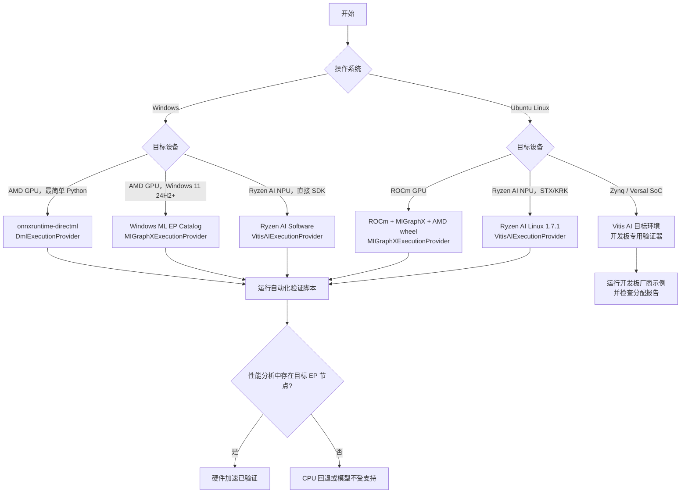
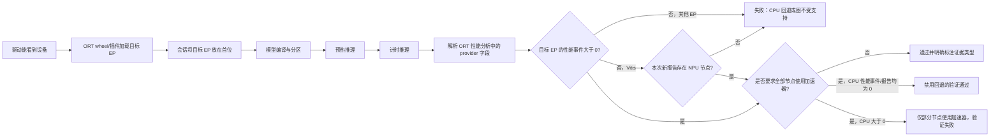

# ONNX Runtime + AMD：GPU 与 NPU

[English](README.md) · [仓库首页](../README.zh-CN.md)

| 项目 | 基线 |
|---|---|
| 最近验证 | `2026-07-17`；已与 AMD、Microsoft、Canonical、ONNX Runtime、Docker Hub 和 PyPI 官方资料核对 |
| 支持平台 | Windows、Ubuntu；具体支持范围因 GPU/NPU 代际而异 |
| 运行方式 | DirectML、Windows ML MIGraphX、ROCm/MIGraphX、Ryzen AI/Vitis AI |
| 验证脚本 | [`provider_test.py`](provider_test.py) |
| 验证内容 | 检查本次运行的节点分配和输出基本有效性；内置 GPU 模型或带 `--compare-cpu` 的自定义模型还会与 CPU 结果进行数值对比 |
| 验证范围 | 脚本自检已在 Linux 上通过；DirectML、Windows ML、MIGraphX 和 Vitis AI 仍需在匹配的目标硬件上完成最终验证 |

## 1. 选择运行方式

| 场景 | 推荐方案 | ONNX Runtime EP | 当前状态 |
|---|---|---|---|
| Windows，较新的 AMD GPU | 使用 DirectML 最容易从 Python 开始；新应用也可评估 Windows ML | `DmlExecutionProvider` | DirectML 仍可使用，但已进入持续工程维护；Windows ML 是微软面向新应用的推荐方案 |
| Windows 11 24H2+，受支持的 AMD GPU | 通过 Windows ML 动态获取 AMD MIGraphX 插件 | `MIGraphXExecutionProvider` | Windows ML 已提供该插件；验证脚本通过 `--windows-ml` 支持此方案 |
| Ubuntu，列入对应 ONNX 兼容矩阵的 AMD GPU | ROCm + MIGraphX + AMD wheel | `MIGraphXExecutionProvider` | **Linux GPU 的主要方案**；GPU、ROCm、Python 和 wheel 必须完全匹配，旧的 `ROCMExecutionProvider` 已移除 |
| Windows，Ryzen AI NPU | Ryzen AI Software 1.7.1；Windows ML catalog 也提供插件 | `VitisAIExecutionProvider` | 支持 PHX/HPT/STX/KRK；仓库的 NPU 验证脚本使用 Ryzen AI 厂商环境（`--windows-ml` 仅用于 GPU） |
| Ubuntu 24.04，Ryzen AI NPU | Ryzen AI for Linux 1.7.1 | `VitisAIExecutionProvider` | **仅 STX/KRK，kernel >= 6.10，Python 3.12** |
| Linux，AMD/Xilinx Adaptive SoC | Vitis AI 目标镜像与运行时 | `VitisAIExecutionProvider` | 面向 Zynq/Versal 的嵌入式 Linux 方案 |
| Windows 原生 ROCm Core SDK | **目前不能用于 ORT MIGraphX Python** | 无 | ROCm 7.14 已扩展 Windows Core 支持，但 AMD 当前验证的 MIGraphX/ORT 组合仅支持 Linux，因此 Windows 应使用 DirectML 或 Windows ML |

### 规则

1. **从 ONNX Runtime 1.23 起，`ROCMExecutionProvider` 已被移除。** ROCm 7.0 是最后一个包含旧 ROCm EP 的 AMD 发行版；新项目必须改用 `MIGraphXExecutionProvider`。
2. `ort.get_available_providers()` 只能说明 EP 库可以加载，**不能确认任何模型节点已经在目标设备上执行**。仓库脚本会解析本次运行生成的 ORT 性能分析记录。如果 Ryzen AI Vitis EP 不生成带 provider 归属的性能事件，脚本只接受“本次运行新生成的 Vitis 分配报告 + 推理成功”作为证据强度较低的替代结果，并明确说明这一点。
3. GPU 和 NPU 使用两套独立的软件环境：ROCm/MIGraphX 或 DirectML 面向 GPU，Vitis AI/Ryzen AI 面向 XDNA NPU。安装 ROCm 不会自动启用 NPU，反之亦然。

### 决策流程



---

## 2. 基础概念

### 2.1 ONNX Runtime 的 EP 是什么？

ONNX Runtime 读取 ONNX 图后，按照 `providers` 列表顺序将每个节点分配给支持该节点的 EP。列表中的第一个 EP 优先级最高；后面的 `CPUExecutionProvider` 通常作为回退。

```python
providers = [
    "MIGraphXExecutionProvider",  # 第一选择
    "CPUExecutionProvider",      # 回退
]
```

| API / 信号 | 可以确认 | 不能确认 |
|---|---|---|
| `ort.get_available_providers()` | 当前 wheel 能够加载哪些 EP | 模型节点是否已分配到 GPU/NPU |
| `session.get_providers()` | 会话注册了哪些 EP 及其优先级 | 实际节点分配比例 |
| ORT verbose log | 初始化和节点分配细节 | 不便自动判断，且日志格式可能变化 |
| ORT `*_kernel_time` 节点事件的 `args.provider` | 哪个 EP 执行了这些节点内核 | 硬件利用率百分比 |
| Vitis AI assignment report | CPU/NPU 节点数量与算子类型 | GPU EP 的节点分配 |
| Task Manager / `amd-smi` / `xrt-smi` | 设备活动情况和驱动可见性 | 仅凭这些信息无法确认某个 ONNX 节点由该设备执行 |

### 2.2 GPU 与 NPU

| 项目 | AMD GPU | AMD Ryzen AI NPU |
|---|---|---|
| 硬件架构 | RDNA/CDNA GPU | AMD XDNA NPU |
| Linux 主要软件环境 | ROCm + MIGraphX | XRT + `amdxdna` + Ryzen AI/Vitis AI |
| Windows 主要软件环境 | DirectML 或 Windows ML MIGraphX | Ryzen AI Software 或 Windows ML VitisAI |
| ORT EP | `MIGraphXExecutionProvider` / `DmlExecutionProvider` | `VitisAIExecutionProvider` |
| 常见精度 | FP32、FP16、BF16/INT8/FP8（取决于硬件和 EP） | INT8、BF16；受模型和芯片代际限制 |
| 首次加载 | MIGraphX 编译或调优可能较慢 | Vitis AI 编译可能需要数分钟 |
| 缓存 | MIGraphX cache / compiled artifacts | Vitis AI cache 或 ORT EP Context |

---

## 3. 版本与支持矩阵

### 3.1 2026-07-17 版本快照

| 组件 | 当前已核查版本 | 说明 |
|---|---:|---|
| 当前 ROCm Core SDK | 7.14.0 | 2026-07-15 发布的生产版本；这是 TheRock 版本号不连续调整后的首个生产版本 |
| ROCm 7.14 已验证的 ONNX 组合 | ORT 1.23.2 + MIGraphX 2.16 | AMD 当前仅支持 Linux、Python 3.12 和 `gfx950`/`gfx942`；不能直接用于下文支持范围更广的 7.2.x 方案 |
| 已核验的 AMD 官方 MIGraphX wheel 方案 | ROCm 7.2.4 + ORT 1.23.2 | AMD 的匹配版本目录提供 CPython 3.10/3.12 wheel；验证脚本仍保留这套覆盖范围较广且可复现的方案 |
| 官方 ROCm ORT Docker | ROCm 7.2.4 + ORT 1.23 + PyTorch 2.10.0 | 当前最新 `rocm/onnxruntime` 标签仍为这些版本，支持 Ubuntu 22.04/24.04 |
| 消费级 Radeon 验证矩阵 | ROCm 7.2.1 + ORT 1.23.2 | AMD Radeon/Ryzen 页面更新节奏与 ROCm core 页面不同 |
| 最新上游 ONNX Runtime / PyPI MIGraphX 包 | 1.27.1 | 上游版本和 PyPI wheel 于 2026-07-12 发布；AMD 尚未给出匹配且覆盖面广的 ROCm 兼容矩阵或 `repo.radeon.com` 发行目录，因此本指南不会用它替换已经核验的方案 |
| Ryzen AI Software 稳定版 | 1.7.1 | Windows + Ubuntu NPU；1.8.0 beta 不建议用于生产 |
| Ryzen AI Windows NPU 最低驱动 | 32.0.203.280 | Ryzen AI EP 1.7 兼容下限 |
| PyPI ONNX Runtime DirectML | 1.24.4 | 当前 x64 wheel；要求 Python >= 3.11 |
| ORT 中的 DirectML 算子库 | DirectML 1.15.2，最高 ONNX opset 20 | 已进入持续工程维护；部分 opset 20 算子存在例外 |
| Python 打包依赖 | pip 26.1.2；NumPy 最新为 2.5.1 | 本指南使用当前 pip，但 AMD 明确记录 Radeon 7.2.1 ORT wheel 与 NumPy 2.x 不兼容，因此仍锁定 NumPy 1.26.4；NumPy 2.5.1 也不支持 Python 3.10 方案 |
| 最新 PyPI Windows ML artifact | `wasdk-*` 2.3.0 + `onnxruntime-windowsml` 1.27.1 | 两者独立发布：2.3.0 projection 精确依赖 ORT 1.25.2，而公开最新 Windows App Runtime 是 2.2.0；禁止手工拼接各自最大版本号 |
| 本指南可复现的 Windows ML Python 组合 | Windows App SDK / `wasdk-*` 2.1.3 + `onnxruntime-windowsml` 1.24.6.202605042033 | 这是 2.1.3 machine-learning wheel 发布的精确依赖；禁止混用 `wasdk-*` 与 runtime 版本 |

> **版本规则：** “最新”不等于兼容。ROCm、MIGraphX 和 ORT MIGraphX wheel 必须来自厂商验证过的同一发布组合。Windows ML 的两个 `wasdk-*` 包与 Windows App Runtime 也必须属于同一发布线，而且 machine-learning projection 明确要求的 ORT 版本优先于独立 ORT 的最新版本。不要在同一虚拟环境中安装多个 `onnxruntime-*` 发行包。

> **为何锁定 Windows ML 版本：** 如果不指定版本，PyPI 当前会解析到 2.3.0 projection，而微软公开的稳定版 Windows App SDK 下载页目前只提供到 runtime 2.2.0。本指南采用的 2.1.3 projection、明确匹配的 ORT 依赖和 2.1.3 runtime 均仍可公开获取，并构成一套可复现的组合。不要将这些版本改为 `latest`。

### 3.2 文档版本差异

ONNX Runtime 的通用 Vitis AI 页面仍把 Ryzen AI 列为 Windows，把 Linux 列为 Adaptive SoC；但更新更晚的 **Ryzen AI Software 1.7.1 Linux Installation Instructions** 已明确支持 Ubuntu 24.04 上的 STX/KRK NPU。对于 Ryzen AI PC，应以对应 Ryzen AI 发行版文档和 release notes 为准；对于 Zynq/Versal，应以 Vitis AI 目标端文档为准。

### 3.3 已核验的软件包指纹

验证脚本会强制检查下列 SHA-256。它们于 2026-07-17 从表中所述的 Microsoft PyPI 或 AMD HTTPS 来源下载并重新计算。哈希不匹配时，脚本会直接失败且不允许绕过检查；采用新的厂商软件包前，应重新核验，并同时更新代码和文档。

| Artifact | SHA-256 |
|---|---|
| DirectML 1.24.4 CPython 3.12 x64 wheel | `f2ecb68b7b7b259d2ef3112ae760149f9b5a1e7c0fbb73d539da6250a648a614` |
| 该 wheel 内的 `DirectML.dll` | `b73972115320e906a49602f2027a3266622881b0d325ba685e0f165a9482a8d7` |
| AMD ROCm 7.2.1 MIGraphX 1.23.2 CPython 3.10 wheel | `07f485fbeb8fbd6a89fa42d24832b4e206057fca62654b0eb39eb1edf9d6e70a` |
| AMD ROCm 7.2.1 MIGraphX 1.23.2 CPython 3.12 wheel | `663bff4dc3f72582d69f12ad073eb5695dfb526d574376cc8e5b161c7d2f0f08` |
| 两个 7.2.1 wheel 内的 MIGraphX provider SO | `8079986332cdf12234635ed4f2b5abd1b49519f6592d6dfcd8afaf5000887b7b` |
| AMD ROCm 7.2.4 MIGraphX 1.23.2 CPython 3.10 wheel | `4886faab646a7ef12f33fb53f085208182fab8dac249ba199dc5d23f8bd128ec` |
| AMD ROCm 7.2.4 MIGraphX 1.23.2 CPython 3.12 wheel | `ee8edeb2ba6a8d99b3043b23e812423e6f10333b508e003fc77b0feda197449f` |
| 两个 7.2.4 wheel 内的 MIGraphX provider SO | `f3fb0b10996b2a2f94afc59edf6fab421bfa12842f09518339d1e0d8f3bd86c7` |
| AMD ROCm 7.14.0 MIGraphX 1.23.2 CPython 3.12 wheel | `67c32a5d8396c28da5efd3643c1ebcb55a03581aad089f7d99922ed5a51bc58b` |
| 7.14.0 wheel 内的 MIGraphX provider SO | `447bb405de55dd7872a8e01a90405ff0f0397d5d562acc6f48711312971537c0` |

Windows ML 采用动态服务，因此验证脚本会要求 catalog 状态为 Certified、当前 MSIX 版本必须精确为 `1.8.57.0`，并检查锁定版本的 Python 发行包。Windows App Runtime 安装器只有在 Microsoft Authenticode 签名有效时才会被接受。

---

## 4. 开始前检查

### 4.1 Windows：识别 GPU 和 NPU

在 PowerShell 中运行：

```powershell
Get-CimInstance Win32_VideoController |
  Select-Object Name, DriverVersion, AdapterRAM

Get-PnpDevice -PresentOnly |
  Where-Object { $_.FriendlyName -match 'NPU|Neural|AMD' } |
  Format-Table -AutoSize

winver
```

然后打开：

1. **Task Manager → Performance → GPU**：确认 GPU 名称、驱动和 DirectX 12。
2. **Task Manager → Performance → NPU**：Ryzen AI NPU 驱动正确时应出现 `NPU 0`。
3. 如果机器同时有 iGPU 与 dGPU，记住 Task Manager 中的 GPU 编号；DirectML 的 `device_id=0` 不一定是最快的设备。

### 4.2 Ubuntu：识别 GPU、NPU、OS 与权限

```bash
cat /etc/os-release
uname -r
lspci -nnk | grep -EA3 'VGA|Display|3D|1022:17f0'
groups
ls -l /dev/kfd /dev/dri 2>/dev/null || true
```

安装 ROCm 后运行：

```bash
/opt/rocm/bin/rocminfo | grep -E 'Name:|Marketing Name:' | head -20
/opt/rocm/bin/amd-smi list
```

安装 Ryzen AI NPU/XRT 后运行：

```bash
source /opt/xilinx/xrt/setup.sh
xrt-smi examine
```

| 观察结果 | 含义 |
|---|---|
| `/dev/kfd` + `/dev/dri/renderD*` | Linux GPU 计算设备节点存在 |
| `rocminfo` 显示 `gfx...` agent | ROCm 能看到 GPU；仍需检查官方硬件矩阵 |
| `1022:17f0` + `xrt-smi` 显示 NPU Strix/Krackan | 可以尝试 Ryzen AI Linux NPU 方案 |
| 用户不在 `render,video` 组 | 常见 `Permission denied` 根因；加组后必须注销或重启 |

---

## A 部分：Ubuntu AMD GPU（ROCm + MIGraphX）

## 5. 硬件和操作系统要求

AMD 当前提供三种不同的 ONNX Runtime 方案。最新的 ROCm Core SDK 并不一定适合每一款 GPU：

1. **当前 ROCm 7.14 方案：** 使用 ORT 1.23.2 + MIGraphX 2.16、Linux x86-64 和 Python 3.12，并且仅支持 `gfx950`（MI350X/MI355X）或 `gfx942`（MI300X/MI325X）。本指南采用 Ubuntu 24.04，以便直接使用系统自带的 Python 3.12。
2. **保留的 ROCm 7.2.4 方案：** AMD 仍提供与旧版本匹配的 ORT 1.23.2 CPython 3.10/3.12 wheel 和 Docker 镜像。这是一套已经核验的兼容方案，但不是当前的 ROCm 生产版本；部署前必须检查归档的 7.2.4 硬件兼容矩阵和 AMD 支持政策。
3. **Radeon 专用 ROCm 7.2.1 方案：** AMD 当前的 Radeon ONNX 矩阵仍在部分 Radeon 9000/7000 和 Radeon PRO 产品上验证 ORT 1.23.2，并要求 Ubuntu 24.04.4 HWE 6.17 或 Ubuntu 22.04.5 HWE 6.8。

不得混用不同方案的驱动、MIGraphX 包或 wheel。

部分代表性 GPU：

| 类别 | 代表型号 | 必须检查 |
|---|---|---|
| Instinct `gfx950` / `gfx942` | MI355X、MI350X、MI325X、MI300X | 当前 ROCm 7.14 AI Ecosystem ONNX 矩阵；必须使用 `rocminfo` 报告的精确 GPU target |
| 其他 Instinct | MI300A、MI200 系列、MI100 | 当前 7.14 ONNX 条目未列出这些 target；只能使用明确受支持的归档方案，或单独验证的源码构建 |
| Radeon PRO | AI PRO R9700/R9600D、W7900/W7800/W7700 系列 | 必须出现在 Radeon ONNX 专用矩阵中；仅列入 ROCm Core 矩阵，不足以采用本指南的入门方案 |
| Radeon RDNA4 | RX 9070/9060 系列 | 通常仅支持特定 Ubuntu/RHEL 版本 |
| Radeon RDNA3 | RX 7900/7800/7700 系列 | 仅使用 AMD 明确列出的 SKU |
| 未列出的 GPU | 旧 Polaris/Vega/RDNA2 或其他型号 | 不代表绝对不能运行，但不属于 AMD 官方支持，不能用于生产支持承诺 |

> `rocminfo` 能看到一个未列出的 GPU，不代表所有预编译 ROCm/MIGraphX 库都支持它。设备可能成功枚举，但在预编译库启动 kernel 时失败。

**Ryzen APU iGPU 注意事项：** ROCm 7.14 已为多个 `gfx115x` Ryzen APU 增加 Core GPU 支持，但当前 AI Ecosystem ONNX 条目仍仅限 `gfx950/gfx942`；独立的 Radeon 7.2.1 ONNX 矩阵也没有列出 Ryzen APU 的生产支持。Core ROCm 能够成功枚举设备，并不代表 ONNX 组合受支持。Ryzen AI 笔记本在 Windows 上可广泛使用的 GPU 方案是 DirectML；Ubuntu 上有文档支持的 STX/KRK 加速方案则是 Vitis AI NPU。

## 6. 安装匹配的 ROCm 组件

复制命令块前：

1. 在所选方案对应的 AMD 矩阵中，确认具体 GPU SKU、LLVM target、操作系统小版本和内核版本。
2. 只能选择一种方案：
  - **当前 Instinct 方案：** 仅适用于 `gfx950/gfx942`；使用 ROCm 7.14.0，并按第 6.1 节操作。
  - **保留的旧版 Instinct 方案：** 仅在归档矩阵和支持政策允许时使用 7.2.4；按第 6.2 或 6.3 节操作。
  - **Radeon 专用方案：** 仅适用于 AMD Radeon ONNX 矩阵明确列出的独立 Radeon/Radeon PRO；使用 7.2.1，并按第 6.4 节操作。
  - **Ryzen APU iGPU 或其他 target：** 除非 AMD 把该精确 target 加入 ONNX 矩阵，否则到此停止。
3. **不要覆盖现有 AMDGPU 安装。** 必须先按对应 AMD 卸载流程清除旧安装；Radeon Software for Linux 不支持原地升级。
4. 启用 Secure Boot 时，应遵循组织的 DKMS 模块签名策略；不要仅为运行演示而关闭安全控制。

以下操作会安装或替换 GPU 软件，并且可能需要重启。只能采用与具体硬件、发行版和 Ubuntu 版本完全匹配的方案。

### 6.1 当前 ROCm 7.14.0 ONNX 方案：Ubuntu 24.04，仅 `gfx950/gfx942`

ROCm 7.14 使用新的 TheRock 打包方式，不能套用下文旧版 `amdgpu-install_7.2.x` 命令。请打开 AMD 当前的 [ROCm 安装选择器](https://rocm.docs.amd.com/en/latest/install/rocm.html)，选择具体 GPU 和 Ubuntu 24.04，并完成其中列出的驱动与软件源准备步骤。采用软件包管理器安装时，注册 AMD 当前软件源后只能安装一个架构包：

```bash
# 仅 MI300X / MI325X：
sudo apt install amdrocm7.14-gfx942

# 或仅 MI350X / MI355X（单一架构主机不要同时执行两条安装命令）：
# sudo apt install amdrocm7.14-gfx950

sudo usermod -a -G render,video "$LOGNAME"
sudo reboot
```

重启后，继续前必须确认已安装版本和精确 GPU target：

```bash
/opt/rocm/bin/hipconfig --version
/opt/rocm/bin/rocminfo | grep -E '^[[:space:]]*Name:[[:space:]]*gfx(942|950)$'
/opt/rocm/bin/amd-smi version
```

`rocminfo` 必须打印与所选 GPU 对应的 target。即使 core ROCm 支持其他 `gfx` target，它们也不能使用 7.14 ONNX wheel。

### 6.2 保留的 ROCm 7.2.4 方案：Ubuntu 24.04

此旧版命令块仅为 AMD 匹配的 7.2.4 ORT artifact 保留；它不是当前 ROCm 版本。

```bash
wget --https-only -O amdgpu-install_7.2.4.70204-1_all.deb \
  https://repo.radeon.com/amdgpu-install/7.2.4/ubuntu/noble/amdgpu-install_7.2.4.70204-1_all.deb
sudo apt install ./amdgpu-install_7.2.4.70204-1_all.deb
sudo apt update

sudo apt install "linux-headers-$(uname -r)" "linux-modules-extra-$(uname -r)"
sudo apt install amdgpu-dkms

sudo apt install python3-setuptools python3-wheel
sudo usermod -a -G render,video "$LOGNAME"
sudo apt install rocm
sudo reboot
```

### 6.3 保留的 ROCm 7.2.4 方案：Ubuntu 22.04

```bash
wget --https-only -O amdgpu-install_7.2.4.70204-1_all.deb \
  https://repo.radeon.com/amdgpu-install/7.2.4/ubuntu/jammy/amdgpu-install_7.2.4.70204-1_all.deb
sudo apt install ./amdgpu-install_7.2.4.70204-1_all.deb
sudo apt update

sudo apt install "linux-headers-$(uname -r)" "linux-modules-extra-$(uname -r)"
sudo apt install amdgpu-dkms

sudo apt install python3-setuptools python3-wheel
sudo usermod -a -G render,video "$LOGNAME"
sudo apt install rocm
sudo reboot
```

### 6.4 Radeon ONNX 专用方案：ROCm 7.2.1

这是一套面向 AMD Radeon ONNX 页面明确列出的独立 Radeon/Radeon PRO 产品、较为保守的完整矩阵验证方案。请先安装矩阵要求的 HWE 内核，重启并确认内核版本后再继续。

Ubuntu 24.04.4：

```bash
sudo apt update
sudo apt-get install --install-recommends linux-generic-hwe-24.04
sudo reboot
```

重启后，`uname -r` 必须显示受支持的 6.17 HWE 版本线；然后执行：

```bash
sudo apt update
sudo apt install -y python3-setuptools python3-wheel
wget --https-only -O amdgpu-install_7.2.1.70201-1_all.deb \
  https://repo.radeon.com/amdgpu-install/7.2.1/ubuntu/noble/amdgpu-install_7.2.1.70201-1_all.deb
sudo apt install ./amdgpu-install_7.2.1.70201-1_all.deb
sudo amdgpu-install -y --usecase=graphics,rocm
sudo usermod -a -G render,video "$LOGNAME"
sudo reboot
```

Ubuntu 22.04.5：

```bash
sudo apt update
sudo apt-get install --install-recommends linux-generic-hwe-22.04
sudo reboot
```

重启后，`uname -r` 必须显示受支持的 6.8 HWE 版本线；然后执行：

```bash
sudo apt update
sudo apt install -y python3-setuptools python3-wheel
wget --https-only -O amdgpu-install_7.2.1.70201-1_all.deb \
  https://repo.radeon.com/amdgpu-install/7.2.1/ubuntu/jammy/amdgpu-install_7.2.1.70201-1_all.deb
sudo apt install ./amdgpu-install_7.2.1.70201-1_all.deb
sudo amdgpu-install -y --usecase=graphics,rocm
sudo usermod -a -G render,video "$LOGNAME"
sudo reboot
```

重启后验证：

```bash
groups
/opt/rocm/bin/rocminfo | head -80
/opt/rocm/bin/amd-smi list
cat /opt/rocm/.info/version
```

预期：

- 当前用户属于 `render` 和 `video` 组。
- `rocminfo` 至少列出一个 GPU agent。
- `amd-smi list` 显示预期 GPU。
- ROCm 版本与准备安装的 wheel 仓库一致。

## 7. 安装 MIGraphX 与 ORT wheel

### 7.1 MIGraphX 运行时

**当前 ROCm 7.14** 方案必须安装 AMD 指定版本的 MIGraphX 2.16 软件包。经核验，运行时软件包会提供 `/opt/rocm/bin/migraphx-driver`，并依赖 ROCm 7.14 运行时：

```bash
wget --https-only \
  https://rocm.frameworks.amd.com/deb-multi-arch/amdrocm-migraphx/pool/main/amdrocm-migraphx_2.16.0-3.py312_amd64.deb
wget --https-only \
  https://rocm.frameworks.amd.com/deb-multi-arch/amdrocm-migraphx/pool/main/amdrocm-migraphx-dev_2.16.0-3.py312_amd64.deb
sudo apt install -y \
  ./amdrocm-migraphx_2.16.0-3.py312_amd64.deb \
  ./amdrocm-migraphx-dev_2.16.0-3.py312_amd64.deb

/opt/rocm/bin/migraphx-driver --version
/opt/rocm/bin/migraphx-driver perf --test
dpkg-query -W -f='${Package} ${Version}\n' amdrocm-migraphx amdrocm-migraphx-dev
```

任一 **7.2.x** 方案都应使用对应发行软件源中的软件包：

```bash
sudo apt update
sudo apt install -y migraphx

/opt/rocm/bin/migraphx-driver --version
/opt/rocm/bin/migraphx-driver perf --test
dpkg-query -W -f='${Package} ${Version}\n' migraphx half
```

`--test` 是文档明确支持的内建单层 GEMM 模型，因此不需要模型文件名；它会编译并执行真实 MIGraphX 性能测试。7.2.x 的 `half` 库通常作为 MIGraphX 依赖自动安装；若最后的 `dpkg-query` 显示缺失，请执行 `sudo apt install -y half`。AMD 当前 7.14 包安装流程同时安装 runtime 与 development 包；7.2.x 只有开发或源码构建时才需要 `migraphx-dev`。

### 7.2 创建隔离 Python 环境

本指南使用三套与 AMD 发行版本匹配的 `onnxruntime_migraphx-1.23.2` 方案：ROCm 7.14.0 仅支持 CPython 3.12，并且只适用于 `gfx950/gfx942`；保留的 ROCm 7.2.4 和 Radeon 7.2.1 软件源提供 CPython 3.10/3.12 wheel。请使用 Ubuntu 自带的 Python：Ubuntu 24.04 使用 3.12，Ubuntu 22.04 的 7.2.x 方案使用 3.10。不要仅为本演示添加非官方 Python 软件源。

Ubuntu 24.04：

```bash
sudo apt install -y python3.12 python3.12-venv
python3.12 -m venv .venv-amd-ort
```

Ubuntu 22.04：

```bash
sudo apt install -y python3.10 python3.10-venv
python3.10 -m venv .venv-amd-ort
```

随后激活环境，并根据已安装 ROCm 版本选择完全匹配的来源。**当前 ROCm 7.14.0** 路线（仅 `gfx950/gfx942`、Python 3.12）执行：

```bash
source .venv-amd-ort/bin/activate
/opt/rocm/bin/hipconfig --version 2>&1 | grep -Eq '(^|[^0-9])7\.14(\.0)?([^0-9]|$)' || { echo "Installed ROCm is not 7.14.0" >&2; exit 1; }
python -m pip install --index-url https://pypi.org/simple "pip==26.1.2"
python -m pip install --index-url https://pypi.org/simple "numpy==1.26.4"
python -m pip install --index-url https://pypi.org/simple \
  "https://rocm.frameworks.amd.com/whl-multi-arch/onnxruntime-migraphx/onnxruntime_migraphx-1.23.2%2Brocm7.14.0-cp312-cp312-manylinux_2_27_x86_64.manylinux_2_28_x86_64.whl"
```

**保留的 ROCm 7.2.4** 路线执行：

```bash
source .venv-amd-ort/bin/activate
grep -Eq '(^|[^0-9])7\.2\.4([^0-9]|$)' /opt/rocm/.info/version || { echo "Installed ROCm is not 7.2.4" >&2; exit 1; }
python -m pip install --index-url https://pypi.org/simple "pip==26.1.2"
python -m pip install --index-url https://pypi.org/simple "numpy==1.26.4"
PYTAG="$(python -c 'import sys; print(f"cp{sys.version_info.major}{sys.version_info.minor}")')"
case "$PYTAG" in cp310|cp312) ;; *) echo "Unsupported Python ABI: $PYTAG" >&2; exit 1;; esac
python -m pip install --index-url https://pypi.org/simple \
  "https://repo.radeon.com/rocm/manylinux/rocm-rel-7.2.4/onnxruntime_migraphx-1.23.2-${PYTAG}-${PYTAG}-manylinux_2_27_x86_64.manylinux_2_28_x86_64.whl"
```

**Radeon ROCm 7.2.1** 路线使用相同命令，但必须改用 7.2.1 仓库：

```bash
source .venv-amd-ort/bin/activate
grep -Eq '(^|[^0-9])7\.2\.1([^0-9]|$)' /opt/rocm/.info/version || { echo "Installed ROCm is not 7.2.1" >&2; exit 1; }
python -m pip install --index-url https://pypi.org/simple "pip==26.1.2"
python -m pip install --index-url https://pypi.org/simple "numpy==1.26.4"
PYTAG="$(python -c 'import sys; print(f"cp{sys.version_info.major}{sys.version_info.minor}")')"
case "$PYTAG" in cp310|cp312) ;; *) echo "Unsupported Python ABI: $PYTAG" >&2; exit 1;; esac
python -m pip install --index-url https://pypi.org/simple \
  "https://repo.radeon.com/rocm/manylinux/rocm-rel-7.2.1/onnxruntime_migraphx-1.23.2-${PYTAG}-${PYTAG}-manylinux_2_27_x86_64.manylinux_2_28_x86_64.whl"
```

这里使用的是刚创建、可以随时删除的 venv。如果安装前 `python -m pip list` 已经显示任何 `onnxruntime-*` 发行包，请删除并重建 venv，不要尝试在原环境中卸载修复。

这里有意使用 AMD wheel 的直接链接：7.14 软件包来自 `rocm.frameworks.amd.com`，7.2.x 软件包来自准确的 `repo.radeon.com` 发布目录。PyPI 已有独立发布的同名 wheel，包括 1.27.1，但 AMD 尚未把它们对应到这些发行方案。使用 `pip install ... -f` 已无法确认 pip 最终选择了哪个构建。演示脚本的 `--bootstrap` 模式会在安装前检查所选 AMD wheel 是否匹配 2026-07-17 核验记录中的 SHA-256。

显式 PyPI index 可防止个人 pip mirror 设置静默改变依赖来源。在受管或离线环境中，只能使用已独立验证 artifact 与更新策略的组织镜像。

为什么锁定 NumPy 1.26.4？AMD Radeon 7.2.1 ORT 页面明确警告其 wheel 与 NumPy 2.x 不兼容。本指南让三套 ORT 1.23.2 方案共用一组保守的依赖版本。只有在 AMD 发布与新版 ORT 匹配的发行组合并完成硬件验证后，才应重新评估该锁定值。

验证 wheel：

```bash
python -c "import onnxruntime as ort; print(ort.__version__); print(ort.get_available_providers())"
```

预期至少包含：

```text
['MIGraphXExecutionProvider', 'CPUExecutionProvider']
```

### 7.3 自动安装并验证 GPU

从仓库根目录执行：

```bash
python AMD/provider_test.py --target migraphx --strict-all
```

尚未安装 Python wheel 时，可让脚本安装**匹配已安装 ROCm 的 wheel**：

```bash
python AMD/provider_test.py \
  --target migraphx --bootstrap --strict-all
```

`--bootstrap` 永远不会安装 kernel 驱动，只会管理当前 Python 环境中的包。

为保证安全，bootstrap 要求已激活 venv 或非 base Conda 环境；它会拒绝修改 Ryzen AI/Windows ML 厂商环境，检查 x86-64 与发行版对应 Python ABI，验证 MIGraphX 和已安装 ROCm，并且只接受 7.2.1、7.2.4 或 7.14.0。7.14 路线还会读取 `rocminfo`，并在下载前拒绝所选 `--device-id` 不是 `gfx942/gfx950` 的情况。可选 `--rocm-version` 只用于断言检测到的版本。它不会卸载或原地覆盖已有 ORT；修改包之前会先完整下载所需 wheel。

## 8. Ubuntu Docker 快速方案

主机需要具备 AMD 内核驱动、`/dev/kfd`、`/dev/dri`、Docker Engine 和正确的用户权限。容器中已经包含 ROCm 用户态库、MIGraphX 和 ORT。必须将 `IMAGE` 设置为与主机验证方案匹配的标签，不要使用 `latest`。

截至 2026-07-17，AMD 尚未发布 ROCm 7.14 的 `rocm/onnxruntime` 镜像，最新官方标签仍为 7.2.4。因此，这个 Docker 快速方案仅适用于 7.2.x；当前 7.14 方案应按第 6.1 节和第 7 节操作。

```bash
# ROCm core 7.2.4，Ubuntu 24.04：
IMAGE=rocm/onnxruntime:rocm7.2.4_ub24.04_ort1.23_torch2.10.0
# Radeon ROCm 7.2.1，Ubuntu 24.04（该路线改用此值）：
# IMAGE=rocm/onnxruntime:rocm7.2.1_ub24.04_ort1.23_torch2.9.1

docker pull "$IMAGE"

docker run --rm -it \
  --device /dev/kfd \
  --device /dev/dri \
  --security-opt seccomp=unconfined \
  -v "$PWD:/workspace" \
  -w /workspace \
  "$IMAGE" \
  python3 AMD/provider_test.py --target migraphx --strict-all
```

Ubuntu 22.04 标签：core 路线使用 `rocm7.2.4_ub22.04_ort1.23_torch2.10.0`；Radeon 路线使用 `rocm7.2.1_ub22.04_ort1.23_torch2.9.1`。

容器内验证：

```bash
rocminfo
/opt/rocm/bin/amd-smi list
```

---

## B 部分：Windows AMD GPU

## 9. 最简单的 Python 方案：DirectML

### 9.1 要求

| 要求 | 最低条件 / 建议 |
|---|---|
| OS | DirectML 从 Windows 10 1903 引入；推荐 Windows 11 |
| GPU | 支持 DirectX 12；DirectML 广泛支持 AMD GCN 第一代及之后产品 |
| 驱动 | 最新稳定版 AMD Adrenalin 或 Radeon PRO 驱动 |
| Python | 使用 python.org 或 winget 的 x64 Python 3.12；禁止 Microsoft Store Python |
| 软件包 | 本次核验锁定为 `onnxruntime-directml==1.24.4` |

### 9.2 安装

在 PowerShell 中：

```powershell
winget install --id Python.Python.3.12 -e `
  --accept-package-agreements --accept-source-agreements
```

若这是首次安装 Python，关闭所有 PowerShell 窗口并重新打开。只有下列检查都成功且架构为 AMD64/x86-64 后才能继续：

```powershell
py -3.12 --version
py -3.12 -c "import platform; print(platform.machine())"
py -3.12 -m venv .venv-amd-dml
Set-ExecutionPolicy -Scope Process Bypass -Force
.\.venv-amd-dml\Scripts\Activate.ps1

python -m pip install --index-url https://pypi.org/simple "pip==26.1.2"
python -m pip install --index-url https://pypi.org/simple "numpy==1.26.4" "onnxruntime-directml==1.24.4"

python -c "import onnxruntime as ort; print(ort.get_available_providers())"
```

`numpy==1.26.4` 是本指南各 AMD wheel 方案共用的保守可复现版本，并不是 DirectML 的硬件要求。修改锁定版本前必须重新验证。

预期：

```text
['DmlExecutionProvider', 'CPUExecutionProvider']
```

### 9.3 自动运行验证

```powershell
python AMD/provider_test.py --target dml --strict-all
```

多 GPU 机器：

```powershell
python AMD/provider_test.py --target dml --device-id 1 --strict-all
```

必须从仓库根目录运行。演示脚本会应用 DirectML 必需设置，并按 DirectML 使用的**相同顺序**通过 DXGI 枚举 adapter；若 `--device-id` 对应设备的 AMD PCI vendor ID 不是 `0x1002`，脚本会失败。

必需 session 设置：

```python
options.enable_mem_pattern = False
options.execution_mode = onnxruntime.ExecutionMode.ORT_SEQUENTIAL
```

DirectML 不支持 ORT 并行执行或 memory-pattern optimization。不要在多个线程中并发调用同一个 session 的 `Run`；需要并发时应使用不同 session。

### 9.4 DirectML 限制

- DirectML 已进入持续工程维护；它仍受支持，但新的 Windows 开发方向正在转向 Windows ML。
- 当前 ORT 文档说明 DirectML 1.15.2 支持最高 ONNX opset 20，但 5-D GridSample 20 和 DeformConv 等配置除外。
- 静态输入形状通常能改善常量折叠、权重预处理和 GPU 调度。
- `device_id=0` 是默认 DXGI adapter，不一定是性能最高的 adapter。

## 10. Windows 新方案：Windows ML + AMD MIGraphX

对于面向 Windows 11 24H2+ 的新应用，如果希望由系统管理 EP 的下载和更新，应采用这一方案。它的配置比单文件 DirectML 示例更复杂，但符合 Windows 平台后续的发展方向。

### 10.1 要求与安装

| 项目 | 要求 |
|---|---|
| OS | 动态获取硬件 EP 需要 Windows 11 24H2、build 26100 或更新版本 |
| Python | Windows ML 通常支持 x64/ARM64 Python 3.10–3.13，但本指南核验的 AMD 组合使用 x64 Python 3.12，而且锁定的 ORT 要求 Python >= 3.11；不能使用 Microsoft Store Python |
| 运行时 | 与 Python `wasdk-*` 包匹配的 Windows App SDK Runtime |
| AMD MIGraphX 插件 | 通过 Windows ML EP Catalog 获取；当前 Microsoft 表格对驱动版本非常敏感 |
| AMD VitisAI 插件 | 需要 Ryzen AI NPU 驱动；见 C 部分 |

```powershell
winget install --id Python.Python.3.12 -e `
  --accept-package-agreements --accept-source-agreements
```

如果 winget 是首次安装 Python，必须**关闭所有 PowerShell 窗口并重新打开 PowerShell**。只有下列两个命令均成功，且显示 x64/AMD64 Python 3.12 后才能继续：

```powershell
py -3.12 --version
py -3.12 -c "import platform; print(platform.machine())"

py -3.12 -m venv .venv-winml
Set-ExecutionPolicy -Scope Process Bypass -Force
.\.venv-winml\Scripts\Activate.ps1

python -m pip install --index-url https://pypi.org/simple "pip==26.1.2"
python -m pip install --index-url https://pypi.org/simple `
  "numpy==1.26.4" `
  "wasdk-Microsoft.Windows.AI.MachineLearning[all]==2.1.3" `
  "wasdk-Microsoft.Windows.ApplicationModel.DynamicDependency.Bootstrap==2.1.3" `
  "onnxruntime-windowsml==1.24.6.202605042033"

winget install --id "Microsoft.VCRedist.2015+.x64" -e `
  --accept-package-agreements --accept-source-agreements

$runtimeInstaller = "$env:TEMP\windowsappruntimeinstall-2.1.3-x64.exe"
Invoke-WebRequest `
  https://aka.ms/windowsappsdk/2.1/2.1.3/windowsappruntimeinstall-x64.exe `
  -OutFile $runtimeInstaller

$signature = Get-AuthenticodeSignature -LiteralPath $runtimeInstaller
if ($signature.Status -ne 'Valid' -or $signature.SignerCertificate.Subject -notmatch 'Microsoft Corporation') {
  Remove-Item -LiteralPath $runtimeInstaller -Force -ErrorAction SilentlyContinue
  throw "Windows App Runtime installer signature is not a valid Microsoft signature."
}

try {
  $process = Start-Process $runtimeInstaller -ArgumentList "--quiet" -Wait -PassThru
  if ($process.ExitCode -ne 0) {
    throw "Windows App Runtime installer failed: 0x$('{0:X8}' -f $process.ExitCode)"
  }
} finally {
  Remove-Item -LiteralPath $runtimeInstaller -Force -ErrorAction SilentlyContinue
}
```

Machine-learning wheel 本身就要求上面列出的准确 ORT build；明确写出该依赖有助于检查版本。这里有意锁定 2.1.3，并验证 2.1.3 runtime 安装器的 Microsoft 签名，因为安装最新版 `wasdk-*` wheel 却保留旧 runtime，是常见的初始化失败原因。运行前请检查：

```powershell
python -m pip list | findstr /i "wasdk onnxruntime-windowsml winrt-runtime"
```

关键版本应为：两个 `wasdk-*` 包都是 2.1.3，`onnxruntime-windowsml` 是 1.24.6.202605042033。如果 pip 显示其他 ORT 发行包，或环境中同时存在多个 `onnxruntime-*` 发行包，请停止操作，删除并重新创建 venv。

随后从仓库根目录运行验证器：

```powershell
python AMD/provider_test.py `
  --target migraphx --windows-ml --strict-all
```

脚本会在整个过程保持 Windows App Runtime 的 bootstrap context 有效，调用 `ensure_ready_async().get()`，通过 `ort.register_execution_provider_library()` 注册下载的插件，选择对应的 `OrtEpDevice`，并在**同一个 Python 进程**中创建会话。

### 10.2 Python EP 获取注意事项

在 Python 中，**不要**调用 `EnsureAndRegisterCertifiedAsync()` 后就假设 EP 已注册到 Python ORT 环境。当前 Microsoft 指南要求：

1. 在整个 Python 操作期间初始化并保持 Windows App Runtime。
2. 调用 `find_all_providers()` 并选择精确 EP。
3. 调用 `ensure_ready_async().get()` 并检查返回状态。
4. 在同一进程中通过 `ort.register_execution_provider_library()` 注册其 `library_path`。
5. 枚举 `ort.get_ep_devices()`，选择目标设备，并通过 `SessionOptions.add_provider_for_devices()` 添加。

仓库脚本已经为 AMD MIGraphX 实现了这套流程。不要复制固定的插件 DLL 路径，因为该路径由 Windows ML 管理并可能随更新变化。

当前 Windows ML AMD EP 名称：

| AMD 设备 | EP 名称 |
|---|---|
| AMD GPU | `MIGraphXExecutionProvider` |
| AMD Ryzen AI NPU | `VitisAIExecutionProvider` |
| 通用 DX12 GPU 回退 | `DmlExecutionProvider` |

截至 2026-07-17 的实时兼容要求：

| 插件 | 当前 catalog 版本 | 驱动要求 |
|---|---|---|
| MIGraphX | MSIX 1.8.57.0 / GPU EP 7.2.2606.20 | AMD GPU 驱动必须**精确为 25.10.13.09**；当前不支持 GenAI 场景 |
| VitisAI | MSIX 1.8.63.0 / EP 2858 | 最低 Adrenalin 25.6.3 + NPU 32.00.0203.280；最高 Adrenalin 25.9.1 + NPU 32.00.0203.297 |

只有 catalog 表格当前列出的版本受支持。这些值会随 Windows Update D-week 发布而变化，因此安装或冻结镜像前必须重新检查实时表格。驱动版本号更大，**并不代表一定兼容**。

> **不要混用两种 NPU 方案：** AMD 的 Ryzen AI 1.7.1 页面提供 NPU 驱动 32.0.203.280 和 32.0.203.314，但当前 Windows ML VitisAI catalog 的上限是 32.00.0203.297。因此，.314 虽然可用于直接安装的 1.7.1 SDK，却超出当前 Windows ML VitisAI 的兼容范围。仓库中的 NPU 命令使用 Ryzen AI 厂商环境，不使用 `--windows-ml`。

### 10.3 为什么 Windows 原生 ROCm 不能用于这套 ORT 方案

ROCm 7.14 已显著扩展 Windows Core SDK，因此“Windows 只获得很小的 HIP 子集”这一旧说法不再普遍准确。但更窄的 ONNX 事实仍然成立：AMD 当前 MIGraphX 2.16 与 ONNX Runtime 1.23.2 AI Ecosystem 页面仅验证 Linux x86-64 的 `gfx950/gfx942`，AMD ORT wheel 也是 manylinux artifact。因此安装 Windows 原生 ROCm 不会让普通 Windows ORT Python wheel 出现 `MIGraphXExecutionProvider`。当前 Windows 应选择：

- 最简单的 Python GPU 方案：DirectML（`onnxruntime-directml`）；
- 通过 Windows ML 获取 AMD MIGraphX 插件；
- 仅当精确 Linux 矩阵支持该负载时使用原生 Ubuntu ROCm/MIGraphX。

### 10.4 WSL2 状态：不能用于 MIGraphX

本演示**不能**使用 WSL2 MIGraphX。AMD 当前的 ROCDXG WSL 指南（Adrenalin 26.2.2 + ROCm 7.2.1）明确指出：**WSL 目前不支持 MIGraphX**。旧版、现已归入 legacy 的 7.2 兼容页面曾列出 ONNX Runtime 1.23.2，但不能推翻当前限制。因此，验证脚本会拒绝在 WSL 内核上运行 MIGraphX，而不会把不受支持的环境显示为可用。

请改用以下受支持的方案之一：

- 原生 Ubuntu，并使用 A 部分对应的兼容矩阵和发布组合；
- 原生 Windows DirectML，作为最简单的 AMD GPU 方案；
- 在满足 catalog 准确驱动要求时使用 Windows ML MIGraphX。

Ryzen AI 1.7.1 NPU 文档同样只说明原生 Windows 与原生 Ubuntu 24.04 STX/KRK，并未说明 WSL NPU passthrough。

---

## C 部分：Windows Ryzen AI NPU（Vitis AI）

## 11. 支持范围

Ryzen AI Software 1.7 支持 Phoenix（PHX）、Hawk Point（HPT）、Strix/Strix Halo（STX）和 Krackan Point（KRK）。

| 模型类型 | PHX/HPT | STX/KRK |
|---|---:|---:|
| CNN INT8 | 是 | 是 |
| CNN BF16 | 否 | 是 |
| NLP/encoder BF16 | 否 | 是 |
| ONNX Runtime GenAI LLM | 否 | 是 |

推荐使用 ONNX opset **17**。不受支持的节点会自动划分到 CPU，除非应用明确禁用 CPU 回退并检查节点分配结果。

## 12. 安装 Ryzen AI Software 1.7.1

### 12.1 前置条件

| 依赖 | 要求 |
|---|---|
| Windows | 直接使用 Ryzen AI 1.7.1 栈需要 Windows 11 build >= 22621.3527 |
| NPU 驱动 | 32.0.203.280 或更新版本；仍需确认与具体 EP 版本的兼容性 |
| Visual Studio | 构建或使用 custom op 时需要 VS 2022 + Desktop Development with C++；基础 Python quicktest 可不安装 |
| CMake | >= 3.26 |
| 环境管理器 | 推荐 Miniforge |
| 支持的 NPU | 必须在 Ryzen AI release notes 中确认，不能只依据处理器营销名称 |

### 12.2 驱动与软件

0. 如果尚未安装 Miniforge，请下载官方 `Miniforge3-Windows-x86_64.exe`，安装到不含空格和特殊字符的路径，并创建开始菜单中的 **Miniforge Prompt** 快捷方式。按照 AMD 的前置条件，只将这套安装的 `condabin` 目录加入**系统** `PATH`，不要再加入另一套 Conda。关闭所有终端后打开 Miniforge Prompt，并确认 `where.exe conda` 和 `conda --version` 都能正常运行。不要改用 Microsoft Store Python。
1. 在 PowerShell 中用下列单行命令安装 CMake：

```powershell
winget install --id Kitware.CMake -e --accept-package-agreements --accept-source-agreements
```

关闭并重新打开 Miniforge Prompt，然后确认下列命令显示 3.26 或更新版本：

```powershell
cmake --version
```

基础 quicktest 可不安装 Visual Studio；AMD Quark custom-op/构建流程则要求 VS 2022 的 **Desktop development with C++** workload。

2. 从 Ryzen AI 官方安装页下载生产版 NPU 驱动。
3. 解压驱动 ZIP。
4. 打开**管理员**终端并运行：

```powershell
.\npu_sw_installer.exe
```

5. 按提示重启，然后在 **Task Manager → Performance → NPU 0** 中检查设备。对于直接安装 Ryzen AI 1.7.1 的方案，请使用其页面提供的生产驱动之一（32.0.203.280 或 32.0.203.314）；不要将 Ryzen AI 1.8 beta 驱动与这套 1.7.1 环境混用。如果改用 Windows ML VitisAI，请返回第 10 节，并遵守范围更窄的实时驱动要求。
6. 下载并运行 `ryzen-ai-lt-1.7.1.exe`。
7. 除非部署策略要求，否则保留默认安装路径。
8. 让安装器创建默认 Conda 环境 `ryzen-ai-1.7.1`。

### 12.3 厂商 quicktest（STX/KRK）

AMD 明确说明，未经修改的厂商 quicktest 预期适用于 **STX/KRK 或更新设备**。打开开始菜单中的 **Miniforge Prompt**（Command Prompt 快捷方式，不是 PowerShell），并使用 cmd.exe 语法：

```bat
conda activate ryzen-ai-1.7.1
python -c "import onnxruntime as ort; print(ort.__version__); print(ort.get_available_providers())"
cd /d "%RYZEN_AI_INSTALLATION_PATH%\quicktest"
python quicktest.py
```

若没有 `VitisAIExecutionProvider`，必须停止；禁止用 pip 原地修复厂商环境。

预期最后一行：

```text
Test Finished
```

测试期间观察 Task Manager 的 NPU 曲线。

在 **PHX/HPT** 上禁止直接运行未经修改的 `quicktest.py`：AMD 要求设置 `target=X1`、`xlnx_enable_py3_round=0` 和 Phoenix `4x4.xclbin`。直接跳到 12.4 节；仓库验证器会应用这些选项，无需修改厂商文件。

### 12.4 自动化性能分析验证

在 Ryzen AI 环境已激活时，从仓库根目录运行：

```powershell
python AMD/provider_test.py --target npu --strict-all
```

脚本会找到厂商 `quicktest/test_model.onnx`，检测 PHX/HPT 或 STX/KRK，创建正确的 Vitis AI 选项，执行推理，并拒绝 NPU 节点数为零的结果。

> **不要在 Ryzen AI 环境中执行 `pip install onnxruntime`。** 通用 CPU wheel 可能覆盖厂商 ORT 文件并移除 `VitisAIExecutionProvider`。

## 13. 不同代际的 Vitis AI EP 选项

| 设备 | INT8 `target` | `xclbin` | 说明 |
|---|---|---|---|
| STX/KRK 及更新设备 | 默认 `X2`；特定模型可测试 `X1` | 普通 X2 流程中**不要设置** | 支持当前 INT8 compiler；可用 BF16 |
| PHX/HPT | 必须设为 `X1` | 必须设置 `...\xclbins\phoenix\4x4.xclbin` | 当前兼容矩阵仅支持 CNN INT8 |

STX/KRK 最小示例：

```python
import onnxruntime as ort

options = {
    "target": "X2",
    "cache_dir": r"C:\temp\my-vitis-cache",
    "cache_key": "my-model-v1",
    "enable_cache_file_io_in_mem": "0",
}

session = ort.InferenceSession(
    "model_int8.onnx",
    providers=[
        ("VitisAIExecutionProvider", options),
        "CPUExecutionProvider",
    ],
)
```

### BF16 与生产部署

- 在支持的 STX/KRK 设备上，FP32 CNN/Transformer 模型可进入 BF16 编译流程。
- `config_file` 控制 BF16 compiler 的 `optimize_level` 和首选数据布局等设置。
- AMD 建议 C++ 部署使用预编译 BF16 模型；deployment EP 并不支持所有运行时 BF16 编译场景。
- 首次编译可能需要数分钟。开发期使用 Vitis AI cache，最终打包建议使用 ORT EP Context。
- 更改 Vitis AI EP 或 NPU 驱动后，应删除缓存或更换 cache key；缓存不能跨任意版本复用。

### 生成节点分配报告

PowerShell：

```powershell
$env:XLNX_ONNX_EP_REPORT_FILE = "vitisai_ep_report.json"
python your_inference.py
```

报告的 `deviceStat` 部分会显示 `CPU` 和 `NPU` 节点数。确保 `enable_cache_file_io_in_mem=0`，然后检查配置的 cache 目录。

---

## D 部分：Ubuntu Ryzen AI NPU（Vitis AI）

## 14. 当前 Linux 支持要求

Ryzen AI 1.7.1 是当前产品文档中首个明确支持 Linux Ryzen NPU 推理的版本。

| 要求 | 当前 1.7.1 条件 |
|---|---|
| 支持的 NPU 系列 | STX 和 KRK |
| 发行版 | Ubuntu 24.04 LTS |
| Kernel | >= 6.10 |
| Python | 3.12.x |
| RAM | 推荐 64 GB |
| 模型 | CNN INT8/BF16、encoder NLP BF16、NPU-only LLM flow |
| EP | `VitisAIExecutionProvider` |

PHX/HPT **不在**当前 Linux 支持声明中。不能根据 Windows 兼容矩阵推断 Linux 也受支持。

## 15. 安装 Ubuntu NPU 驱动与 Ryzen AI

### 15.1 基础包

```bash
sudo apt update
sudo apt install -y software-properties-common
sudo add-apt-repository -y universe
sudo apt update
sudo apt install -y python3.12 python3.12-venv libboost-filesystem1.74.0 pciutils
uname -r
```

官方 1.7.1 页面要求 `libboost-filesystem1.74.0`；Ubuntu 24.04 在 `universe` 组件中发布该包，上述命令会显式启用此组件。不要用其他 Ubuntu 版本的二进制包替代。

Ubuntu 24.04 GA kernel 可能低于 6.10。应通过 Ubuntu 支持的方式升级到受支持的 HWE/OEM kernel，重启并再次检查 `uname -r`，然后再安装 XRT。

普通 GA/HWE 安装可使用 Canonical 文档给出的命令：

```bash
sudo apt-get update
sudo apt-get install --install-recommends linux-generic-hwe-24.04
sudo reboot
```

重启后运行 `uname -r`，只有版本 >= 6.10 才能继续。若 `ubuntu-drivers list-oem` 输出 OEM kernel track，应保留 OEM 支持的更新节奏，并查阅电脑厂商/Ubuntu 文档，不要盲目切换 kernel track。

### 15.2 下载并安装 XRT/NPU 包

从 AMD Ryzen AI 官方下载页获取 `RAI_1.7.1_Linux_NPU_XRT.zip`，接受许可并解压，然后在解压目录运行：

```bash
sudo apt install --fix-broken -y ./xrt_202610.2.21.75_24.04-amd64-base.deb
sudo apt install --fix-broken -y ./xrt_202610.2.21.75_24.04-amd64-base-dev.deb
sudo apt install --fix-broken -y ./xrt_202610.2.21.75_24.04-amd64-npu.deb
sudo apt install --fix-broken -y ./xrt_plugin.2.21.260102.53.release_24.04-amd64-amdxdna.deb

export LD_LIBRARY_PATH=/lib/x86_64-linux-gnu:${LD_LIBRARY_PATH:-}
source /opt/xilinx/xrt/setup.sh
xrt-smi examine
```

预期设备名称类似 `NPU Strix`；具体 BDF 和名称因机器而异。

### 15.3 安装 Ryzen AI 1.7.1 包

从 AMD 下载 `ryzen_ai-1.7.1.tgz`，然后运行：

```bash
mkdir -p ryzen_ai-1.7.1
cp ryzen_ai-1.7.1.tgz ryzen_ai-1.7.1/
cd ryzen_ai-1.7.1
tar -xvzf ryzen_ai-1.7.1.tgz

./install_ryzen_ai.sh -a yes -p "$HOME/ryzen-ai-1.7.1/venv"
source "$HOME/ryzen-ai-1.7.1/venv/bin/activate"
echo "$RYZEN_AI_INSTALLATION_PATH"
python -c "import sys; assert sys.version_info[:2] == (3, 12), sys.version; print(sys.version)"
python -c "import onnxruntime as ort; print(ort.__version__); print(ort.get_available_providers())"
```

Linux 使用安装器创建的 Python virtual environment；示例中的 Windows-only Conda 步骤应跳过。若没有 `VitisAIExecutionProvider`，必须停止；禁止向该环境安装通用 ORT wheel。

### 15.4 Quicktest 与自动化验证

```bash
export LD_LIBRARY_PATH=/lib/x86_64-linux-gnu:${LD_LIBRARY_PATH:-}
source /opt/xilinx/xrt/setup.sh
source "$HOME/ryzen-ai-1.7.1/venv/bin/activate"
cd "$HOME/ryzen-ai-1.7.1/venv/quicktest"
python quicktest.py

# 将下列值替换为本仓库的绝对路径。
REPO_ROOT="/absolute/path/to/Tutorial-ONNX-Runtime-Execution-Providers-main"
cd "$REPO_ROOT"
python AMD/provider_test.py --target npu --strict-all
```

如果安装路径不同，激活对应环境并显式传入 quicktest 模型：

```bash
source /opt/xilinx/xrt/setup.sh
python AMD/provider_test.py \
  --target npu \
  --model /your/ryzen-ai/venv/quicktest/test_model.onnx \
  --strict-all
```

---

## E 部分：AMD Adaptive SoC 上的 Vitis AI

## 16. 嵌入式 Linux 目标

| 主机 ISA | Vitis AI 目标 | 示例开发板 | 操作系统 |
|---|---|---|---|
| Arm Cortex-A53 | Zynq UltraScale+ MPSoC | ZCU102、ZCU104、KV260 | Linux |
| Arm Cortex-A72 | Versal AI Core/Premium | VCK190 | Linux |
| Arm Cortex-A72 | Versal AI Edge | VEK280 | Linux |

流程：

1. 从开发板专用的 Vitis AI 目标镜像/BSP 开始。
2. 按照 Vitis AI Target Setup 安装固件、XRT、DPU overlay 和匹配的运行时软件包。
3. 安装或使用目标端提供的预编译 Vitis AI ONNX Runtime EP。
4. 使用 AMD Quark 或 Vitis AI Quantizer 针对目标 DPU 量化模型。
5. 使用 `VitisAIExecutionProvider` 创建会话，并根据需要配置 CPU 回退。
6. 通过 Vitis AI 日志、节点分配报告和设备工具检查节点分配情况。

不要在这些 Arm 目标上使用 x86-64 Ryzen AI 安装器或 ROCm MIGraphX wheel。ONNX Runtime 通用构建页说明，Linux `--use_vitisai` 通过此目标端工作流支持 AMD Adaptive SoC。

---

## F 部分：自动化 Python 演示

## 17. 演示脚本行为

文件：[provider_test.py](provider_test.py)

| 功能 | 行为 |
|---|---|
| `--target auto` | 优先级：Vitis AI NPU → MIGraphX GPU → DirectML GPU |
| `--target gpu` | Linux 选择 MIGraphX；普通 Windows pip 环境选择 DirectML |
| `--windows-ml` | 仅 Windows：在同一进程中初始化匹配的运行时，检查锁定版本的 Python 发行包与当前 MIGraphX MSIX 1.8.57.0，获取并注册插件，然后选择 AMD `OrtEpDevice` |
| `--target npu` | 要求厂商安装的 Vitis AI EP；永远不会用公共 wheel 替换它 |
| `--bootstrap` | 要求干净的隔离环境；锁定并校验 Python 3.12 Microsoft DirectML wheel，或 AMD 官方直接链接的 ROCm 7.2.1/7.2.4/7.14.0 wheel；强制检查 7.14 的 `gfx942/gfx950` 要求，先暂存依赖，不安装驱动，也不卸载已有 ORT |
| 运行时来源 | 再次检查已安装的 DirectML/MIGraphX 发行版本和 EP DLL/SO 哈希；Windows ML 还会复核三个锁定发行包的版本 |
| 默认 GPU 模型 | 写出内嵌且通过完整性校验的 opset-17 Conv → Relu → GlobalAveragePool 模型；不需要单独安装 `onnx` |
| 默认 NPU 模型 | 使用已知兼容 NPU 的 Ryzen AI 厂商 quicktest 模型 |
| 输出基本检查 | 每次预热和计时结果都必须包含非空张量；浮点或复数张量中的值必须有限；遇到 object/sequence/map 输出时脚本会直接失败，必须改用模型专用的运行程序 |
| 数值校验 | 内嵌 GPU 模型始终与独立 CPU EP 比较；`--compare-cpu` 可对用户模型启用相同检查（可配置 `--rtol`/`--atol`） |
| 验证方式 | 只统计本次 ORT 性能分析中名称以 `*_kernel_time` 结尾、且带有 provider 归属的 `Node` 事件；如果没有归属信息，Vitis 可以使用“新生成的分配报告 + 推理成功”作为替代依据 |
| 失败策略 | EP 已加载，但没有目标 EP 的性能事件，而且也没有本次新生成的 Vitis NPU 分配记录时，返回非零退出码 |
| `--strict-all` | 创建会话前设置 ORT `session.disable_cpu_ep_fallback=1`，随后另外检查性能分析或 Vitis 报告，并拒绝任何 CPU 事件或节点 |
| 结果隔离 | 每次调用都使用全新的产物和缓存目录，因此旧 Vitis 报告或不兼容的编译缓存不会造成误判 |
| `--unit-tests` | 无需 AMD 硬件，运行验证脚本内置的确定性安全测试和单元测试后退出 |
| WSL | AMD 当前 WSL 指南明确说明 MIGraphX 不受支持，因此脚本会拒绝该环境 |
| 适用范围 | 仅支持 Ryzen AI PC NPU；脚本会拒绝 Arm Zynq/Versal Adaptive SoC，后者需要开发板专用模型和选项 |

### 17.1 命令表

| 平台 | 命令 |
|---|---|
| Windows AMD GPU，DirectML | `python AMD/provider_test.py --target dml --bootstrap --strict-all` |
| Windows AMD GPU，Windows ML MIGraphX | `python AMD/provider_test.py --target migraphx --windows-ml --strict-all` |
| Ubuntu AMD GPU | `python AMD/provider_test.py --target migraphx --bootstrap --strict-all`（自动检测 7.2.1、7.2.4，或有额外硬件要求的 7.14.0 方案） |
| Windows Ryzen AI NPU | `python AMD/provider_test.py --target npu --strict-all` |
| Ubuntu Ryzen AI NPU | `python AMD/provider_test.py --target npu --strict-all` |
| 已有自定义模型 | 添加 `--model path/to/model.onnx` |
| 自定义模型 + CPU 一致性 | 添加 `--compare-cpu`；若预期低精度误差，请设置适合模型的 `--rtol` 与 `--atol` |
| 动态输入 | 添加 `--shape input_name=1,3,224,224` |
| 选择第二张 GPU | 添加 `--device-id 1`；DirectML 按 DXGI adapter 编号，Windows ML 按 AMD MIGraphX `OrtEpDevice` 编号，Linux MIGraphX 按 `rocminfo` 报告的 GPU agent 顺序编号 |
| 允许部分 CPU 回退 | 省略 `--strict-all`；仍要求至少有一个节点在加速器上执行 |
| 仅验证脚本的 CPU 自检 | `python AMD/provider_test.py --target cpu` |
| 内置单元测试 | `python AMD/provider_test.py --unit-tests` |

通过性能分析验证的加速运行会在最后输出：

```text
[PASS/通过] Runtime profile verified ... executed node event(s) on ...
```

如果某个 Vitis 构建的 ORT 性能分析不提供 provider 归属，成功信息会明确说明依据是“推理成功 + **本次新生成**的分配报告中存在 NPU 节点”。分配报告统计的是计算图中的唯一节点，而性能分析统计的是在预热和计时过程中重复出现的执行事件，因此两者不能直接换算成百分比。

如果程序只在 `get_available_providers()` 中列出 EP，却既没有目标 EP 的性能事件，也没有本次新生成的 Vitis NPU 分配记录，脚本会按设计返回失败。

`--strict-all` 会先要求 ORT 在创建会话时拒绝将节点分配给 CPU EP，随后再检查本次 ORT 性能分析或 Vitis 报告，拒绝其中的每个 CPU 事件或节点。它无法确认未被这些记录渠道捕获的信息。同样，厂商 NPU 模型或任意自定义模型通过硬件节点分配验证，并不等于应用准确率已经合格；投入生产前必须使用可信的测试向量，或启用 `--compare-cpu`。

对于 DirectML，脚本会枚举 `IDXGIFactory::EnumAdapters`、确认 `--device-id` 存在，并要求所选 adapter 的 PCI vendor ID 为 AMD（`0x1002`）。这能消除仅检查 WMI 名称时在混合厂商机器上的假阳性。

运行记录保存在 Linux 的 `~/.cache/amd-ort-oneclick/runs/`（Windows 使用对应的用户目录），也可以通过 `AMD_ORT_DEMO_CACHE` 指定位置。Vitis 缓存有意在每次运行时重新创建，因此每次 NPU 验证都可能编译数分钟；这里优先保证安装验证可靠，而不是追求基准测试便利。收集所需记录后，可以删除旧的运行目录。

Linux 上可先查看、再删除七天前的运行目录：

```bash
find ~/.cache/amd-ort-oneclick/runs -mindepth 1 -maxdepth 1 -type d -mtime +7 -print
# 核对输出路径后，再用 -exec rm -rf -- {} + 替换命令末尾的 -print
```

### 17.2 运行自己的模型

```bash
python AMD/provider_test.py \
  --target migraphx \
  --model /absolute/path/model.onnx \
  --shape images=1,3,224,224 \
  --compare-cpu
```

通用输入生成器支持常见的数值和 Boolean 张量类型。每个动态输入都必须通过 `--shape` 提供秩正确的明确形状；脚本会在推理前拒绝未知的输入名称，也不允许修改固定维度。浮点输入使用确定性数值，整数和 Boolean 输入使用零。`--compare-cpu` 要求 CPU EP 支持整个模型及其自定义算子；独立的 CPU 参考会话失败，不代表加速器本身有问题。需要 token 语义、非零长度、多个相关输入、字符串、自定义算子、校准数据或领域准确率指标的模型，应编写专用的预处理和参考运行程序；脚本中的 EP 验证逻辑仍可复用。

---

## 18. 最小 EP 代码

### 18.1 Linux MIGraphX GPU

```python
import onnxruntime as ort

session = ort.InferenceSession(
    "model.onnx",
    providers=[
        ("MIGraphXExecutionProvider", {"device_id": "0"}),
        "CPUExecutionProvider",
    ],
)
```

常用 MIGraphX 选项：

| 选项 | 含义 |
|---|---|
| `device_id` | GPU 编号，默认 0 |
| `migraphx_fp16_enable` | 在受支持位置启用 FP16 转换 |
| `migraphx_bf16_enable` | 在受支持位置启用 BF16 转换 |
| `migraphx_int8_enable` | 启用 INT8；需要校准设置 |
| `migraphx_fp8_enable` | 启用 FP8；受硬件和模型要求限制 |
| `migraphx_exhaustive_tune` | 通过更长编译/调优换取潜在性能提升 |
| `migraphx_mem_limit` | EP arena 上限；进程总 GPU 内存可能更高 |

在使用可信 CPU/reference 结果测量精度之前，不要启用降低精度模式。

### 18.2 Windows DirectML GPU

```python
import onnxruntime as ort

options = ort.SessionOptions()
options.enable_mem_pattern = False
options.execution_mode = ort.ExecutionMode.ORT_SEQUENTIAL

session = ort.InferenceSession(
    "model.onnx",
    sess_options=options,
    providers=[
        ("DmlExecutionProvider", {"device_id": "0"}),
        "CPUExecutionProvider",
    ],
)
```

### 18.3 Ryzen AI Vitis AI NPU

```python
import onnxruntime as ort

options = {
    "target": "X2",  # STX/KRK integer flow
    "cache_dir": "./vitis-cache",
    "cache_key": "model-v1",
    "enable_cache_file_io_in_mem": "0",
}

session = ort.InferenceSession(
    "model.onnx",
    providers=[
        ("VitisAIExecutionProvider", options),
        "CPUExecutionProvider",
    ],
)
```

### 18.4 高级：从源码构建带 AMD EP 的 ONNX Runtime

只有在没有可用的 AMD/厂商发行包，或确实需要自定义 ORT 功能时，才应从源码构建。源码构建会增加兼容性风险，而且不能替代设备驱动和运行时。

自动化验证脚本有意只接受本指南核验过的发行版二进制哈希，因此即使自定义源码构建本身有效，也会在来源检查阶段失败。源码构建必须运行对应的 ORT EP 测试，并采用同样的性能分析和节点分配方法进行验证；不能将其标记为本指南已经核验的预构建版本组合。

#### Linux MIGraphX wheel

前置条件包括相互匹配的 ROCm 和 MIGraphX、受支持的编译器/CMake/Python，以及足够的内存和磁盘空间。应从符合部署计划的 ORT 版本标签构建：

```bash
git clone --recursive https://github.com/microsoft/onnxruntime.git
cd onnxruntime
git checkout v1.23.2
git submodule update --init --recursive

./build.sh \
  --config Release \
  --parallel \
  --build_wheel \
  --use_migraphx \
  --migraphx_home /opt/rocm

python -m pip install build/Linux/Release/dist/*.whl
```

构建可复用 C/C++ library 时还应添加 `--build_shared_lib`。打包前运行适用测试；不要用 `--skip_tests` 掩盖兼容性问题。

#### Windows DirectML wheel

在装有受支持 Windows SDK 的 Visual Studio Developer PowerShell 中运行：

```powershell
git clone --recursive --branch v1.24.4 `
  https://github.com/microsoft/onnxruntime.git onnxruntime-dml-1.24.4
cd onnxruntime-dml-1.24.4
.\build.bat --config Release --parallel --use_dml --build_wheel
```

#### Windows Vitis AI build

这不能替代 Ryzen AI 安装程序，也不适合作为入门安装方式。以下上游命令只适用于已经具备匹配的 Ryzen AI/Vitis AI 开发依赖，并使用该 SDK 指定 ORT 源码版本的开发者：

```powershell
.\build.bat --use_vitisai --build_shared_lib --parallel --config Release --build_wheel
```

不要在上面的 DirectML 源码目录或任意 `main` 分支中运行该命令。必须先从 Ryzen AI 发布包或支持渠道获取受支持的 ORT 版本和依赖设置；如果目标 SDK 没有说明准确的源码版本，应使用厂商提供的运行时，不要自行拼接二进制组合。

Linux Adaptive SoC 必须遵循开发板专用 Vitis AI target setup，不能视为与 x86 ROCm build 可互换。Provider `.so`/`.dll` 必须与匹配的 ORT runtime 放在一起；禁止混用不同构建的二进制文件。

---

## 19. 验证流程



### 硬件侧监控

| 平台 | 命令 / UI | 观察内容 |
|---|---|---|
| Linux GPU | `/opt/rocm/bin/amd-smi monitor` 或 `/opt/rocm/bin/amd-smi metric` | 重复推理期间的 GPU 活动和显存占用 |
| Linux GPU | `rocminfo` | 正确的 `gfx` target 和设备数 |
| Windows GPU | Task Manager → GPU → Compute | 目标适配器上的活动 |
| Windows/Linux NPU | Task Manager NPU / `xrt-smi examine` | NPU 可见性和活动 |
| Vitis AI | 节点分配报告 | 非零 NPU 节点数 |

小模型可能运行得太快，利用率曲线来不及显示。可以重复运行推理或改用真实模型，但判断执行设备时，仍应以性能分析中的节点分配为主要依据。

---

## 20. 性能建议

| 建议 | 原因 |
|---|---|
| 计时前预热 | 首次创建会话或运行推理时，可能需要编译内核、分配内存并填充缓存 |
| 单独测量会话创建时间 | MIGraphX/Vitis AI 的编译时间不属于稳态推理延迟 |
| 实际允许时使用固定形状 | 改善图折叠、内存规划和 DirectML/MIGraphX 编译 |
| 复用同一个 session | 避免重复编译和 allocator 初始化 |
| 在 cache key 中加入版本 | 防止模型、驱动或 EP 变化后误用旧产物 |
| 分别测量端到端时间和纯设备时间 | NumPy CPU 输入/输出包含主机与设备之间的数据传输开销 |
| 检查 CPU 回退 | 即使只有一个算子不受支持，也可能产生开销很大的设备边界 |
| FP16/BF16/INT8 前先建立 FP32 baseline | 低精度会影响准确率和可支持的分区 |
| 正确性验证后再使用 I/O Binding | 它能减少复制，但 provider/device memory 管理更复杂 |
| 生产环境锁定已经验证的版本组合 | 驱动 + ROCm/XRT + EP + ORT + Python ABI 必须保持兼容 |

---

## 21. 故障排查

| 现象 / 错误 | 可能原因 | 处理方法 |
|---|---|---|
| 只有 `CPUExecutionProvider` | ORT 发行包错误或厂商环境未激活 | 创建干净 venv；安装精确 DML/MIGraphX wheel 或激活 Ryzen AI 环境 |
| 演示报告存在多个 `onnxruntime-*` 发行包 | 多个 wheel 共享并覆盖同一组 Python module 文件 | 删除并重建环境，且只安装一个 runtime 包；不要原地修复厂商环境 |
| `--bootstrap` 拒绝当前环境 | 检测到 base/system Python、厂商环境、已有 ORT 发行包，或无法验证/不匹配的 ROCm | 删除并按对应章节重建可随时丢弃的专用 venv；bootstrap 刻意不原地修复/卸载 ORT |
| 演示报告发行包或 DLL/SO 哈希未经核验 | 安装了同名 PyPI wheel、被修改的二进制、其他发行版或自定义源码构建 | 按文档操作时，应删除环境并通过厂商直接链接或 `--bootstrap` 重建；有意使用的源码构建应另行验证 |
| ORT 1.23+ 中没有 `ROCMExecutionProvider` | 这是预期移除 | 迁移到 `MIGraphXExecutionProvider` |
| MIGraphX provider shared library 无法加载 | ROCm/MIGraphX 版本不匹配或缺少 runtime 库 | `sudo apt install migraphx`；对 provider `.so` 运行 `ldd`；对齐 wheel 仓库 |
| `/dev/kfd` 出现 `Permission denied` | 用户不在 `render,video` 组 | `sudo usermod -a -G render,video $LOGNAME`，然后注销或重启 |
| `hipErrorNoBinaryForGpu` / invalid device function | GPU 架构不在二进制中或不受支持 | 查看官方 GPU 矩阵；不能只依赖 `rocminfo` 可见性 |
| NumPy 升级后导入失败 | AMD wheel ABI 不匹配 | 使用干净 venv，并按当前文档 wheel 固定 `numpy==1.26.4` |
| DirectML 使用错误 GPU | `device_id=0` 映射到其他 DXGI adapter | 检查 Task Manager；尝试 `--device-id 1`；分别 benchmark |
| DirectML 测试拒绝非 `0x1002` PCI vendor | 所选 DXGI index 是 Intel/NVIDIA/Microsoft，而非 AMD | 根据脚本打印的 adapter 列表，用 `--device-id` 选择 AMD index |
| DirectML session 拒绝 options | 启用了并行模式或 memory pattern | 设置 sequential mode 并禁用 memory pattern |
| Windows ML 在 Python 3.10 上 pip 安装失败 | 固定的 `onnxruntime-windowsml` 依赖声明 Python >= 3.11，虽然 Windows ML 通用 API 范围从 3.10 开始 | 使用指南中的 Python 3.12 环境 |
| Windows ML bootstrap 失败或 catalog 没有 MIGraphX | `wasdk-*`/Windows App Runtime 不匹配、使用 Store Python、OS 低于 24H2 或 AMD 驱动不兼容 | 使用精确固定的 2.1.3/1.24.6.202605042033 组合、python.org/winget Python、build >=26100 与实时表格精确驱动 |
| Vitis AI EP 存在但所有节点在 CPU | 算子/形状/精度不支持，或模型代际错误 | 使用 opset 17；检查支持算子表与 assignment report；正确量化/编译 |
| PHX/HPT Vitis session 失败 | 缺少 `target=X1` 或 `4x4.xclbin` | 使用对应代际 options 和厂商安装路径 |
| STX/KRK 错误提到 xclbin | 沿用了旧 option | 当前 X2 流程应移除 `xclbin` |
| 第一次 NPU 加载需要数分钟 | 正常编译行为 | 启用缓存；分别记录编译与推理时间 |
| 更新后 NPU cache 失效 | Cache 与驱动/EP 不兼容 | 删除或版本化 cache；重新生成 EP Context |
| Ubuntu 看不到 NPU | 内核低于 6.10、未安装 XRT/amdxdna，或使用不受支持的 PHX/HPT | 满足 1.7.1 Linux 的准确要求，并运行 `xrt-smi examine` |
| Docker 看不到 GPU | 未将设备传入容器 | 添加 `--device /dev/kfd --device /dev/dri`，并验证主机驱动 |
| EP 已注册但演示退出码为 5 | 没有目标 EP 的性能事件，也没有本次新生成的 Vitis NPU 分配记录 | 这是按设计直接失败的结果；请检查不受支持的节点、本次报告和日志 |

### 高级 Linux library 检查

查找并检查 MIGraphX provider library，不要把它复制到全局系统目录：

```bash
provider_so="$(find "$VIRTUAL_ENV" -name 'libonnxruntime_providers_migraphx.so' -print -quit)"
if [[ -z "$provider_so" ]]; then
  echo "MIGraphX provider library was not found in $VIRTUAL_ENV" >&2
else
  echo "$provider_so"
  ldd "$provider_so" | grep 'not found' || true
fi
```

ORT 建议把 provider shared library 放在与其匹配的 ORT library 旁边。不要在全局环境混用来自不同 ORT 安装的 `.so`/`.dll`。

---

## 22. 生产检查表

- [ ] 硬件 SKU 明确列在对应 AMD 支持矩阵中。
- [ ] OS build/kernel 精确受支持。
- [ ] 将驱动、ROCm/XRT、MIGraphX/Vitis AI、ORT 和 Python ABI 作为一组经过测试的版本组合锁定。
- [ ] 环境中只安装一个 `onnxruntime-*` 发行包。
- [ ] 目标 EP 位于首位，CPU fallback 策略是有意设计的。
- [ ] 性能分析或节点分配报告确认目标设备确实执行了节点。
- [ ] 启用低精度前，与 CPU/reference 数据比较准确率。
- [ ] 分别测量首次编译与稳态推理延迟。
- [ ] Cache 失效策略覆盖模型、EP 和驱动版本变化。
- [ ] 已记录不支持的算子及 CPU/设备边界。
- [ ] 已审阅 AMD/Windows ML/Vitis AI 部署包许可。
- [ ] CI 至少运行一个真实目标设备 smoke test；仅检查 provider 列表的测试不予接受。

---

## 23. 参考资料

| 主题 | 官方来源 |
|---|---|
| ORT EP 构建页 | <https://onnxruntime.ai/docs/build/eps.html#amd-migraphx> |
| MIGraphX EP | <https://onnxruntime.ai/docs/execution-providers/MIGraphX-ExecutionProvider.html> |
| 已移除 ROCm EP 的说明 | <https://onnxruntime.ai/docs/execution-providers/ROCm-ExecutionProvider.html> |
| Vitis AI EP | <https://onnxruntime.ai/docs/execution-providers/Vitis-AI-ExecutionProvider.html> |
| DirectML EP | <https://onnxruntime.ai/docs/execution-providers/DirectML-ExecutionProvider.html> |
| PyPI DirectML 包 | <https://pypi.org/project/onnxruntime-directml/> |
| ORT Python API | <https://onnxruntime.ai/docs/api/python/api_summary.html> |
| ROCm 文档 | <https://rocm.docs.amd.com/en/latest/> |
| ROCm Linux 安装 | <https://rocm.docs.amd.com/projects/install-on-linux/en/latest/> |
| ROCm Linux 系统要求 | <https://rocm.docs.amd.com/projects/install-on-linux/en/latest/reference/system-requirements.html> |
| ROCm Docker | <https://rocm.docs.amd.com/projects/install-on-linux/en/latest/how-to/docker.html> |
| AMD ORT Docker 标签 | <https://hub.docker.com/r/rocm/onnxruntime/tags> |
| AMD ROCm wheel 仓库 | <https://repo.radeon.com/rocm/manylinux/> |
| MIGraphX 安装 | <https://rocm.docs.amd.com/projects/AMDMIGraphX/en/latest/install/install-migraphx.html> |
| Radeon 原生 Linux 支持与 ONNX 矩阵 | <https://rocm.docs.amd.com/projects/radeon-ryzen/en/latest/docs/compatibility/compatibilityrad/native_linux/native_linux_compatibility.html> |
| Radeon 7.2.1 驱动/ROCm 安装 | <https://rocm.docs.amd.com/projects/radeon-ryzen/en/latest/docs/install/installrad/native_linux/install-radeon.html> |
| Radeon MIGraphX + ONNX 安装 | <https://rocm.docs.amd.com/projects/radeon-ryzen/en/latest/docs/install/installrad/native_linux/install-onnx.html> |
| ROCm 7.14 release notes 与兼容矩阵 | <https://rocm.docs.amd.com/en/latest/about/release-notes.html> · <https://rocm.docs.amd.com/en/latest/compatibility/compatibility-matrix.html> |
| ROCm 7.14 ONNX Runtime / MIGraphX 安装 | <https://rocm.docs.amd.com/projects/ai-ecosystem/en/latest/inference/onnxruntime.html> · <https://rocm.docs.amd.com/projects/ai-ecosystem/en/latest/inference/migraphx.html> |
| Ryzen AI 1.7.1 文档 | <https://ryzenai.docs.amd.com/en/latest/> |
| Ryzen AI Windows 安装 | <https://ryzenai.docs.amd.com/en/latest/inst.html> |
| Ryzen AI Linux 安装 | <https://ryzenai.docs.amd.com/en/latest/linux.html> |
| Ryzen AI 模型部署与 options | <https://ryzenai.docs.amd.com/en/latest/modelrun.html> |
| Ryzen AI release notes | <https://ryzenai.docs.amd.com/en/latest/relnotes.html> |
| Ryzen AI 支持算子 | <https://ryzenai.docs.amd.com/en/latest/ops_support.html> |
| Windows ML 概述 | <https://learn.microsoft.com/en-us/windows/ai/new-windows-ml/overview> |
| Windows ML 安装 | <https://learn.microsoft.com/en-us/windows/ai/new-windows-ml/distributing-your-app?tabs=python> |
| Windows ML 可用 EP | <https://learn.microsoft.com/en-us/windows/ai/new-windows-ml/supported-execution-providers> |
| Windows ML EP 获取 | <https://learn.microsoft.com/en-us/windows/ai/new-windows-ml/initialize-execution-providers?tabs=python> |
| Windows ML EP 注册 | <https://learn.microsoft.com/en-us/windows/ai/new-windows-ml/register-execution-providers?tabs=python> |
| Windows App SDK runtime 下载 | <https://learn.microsoft.com/en-us/windows/apps/windows-app-sdk/downloads> |
| Windows App Runtime installer options | <https://learn.microsoft.com/en-us/windows/apps/windows-app-sdk/deploy-unpackaged-apps> |
| PowerShell Authenticode 验证 | <https://learn.microsoft.com/en-us/powershell/module/microsoft.powershell.security/get-authenticodesignature> |
| PyWinRT Windows App Runtime bootstrap | <https://pywinrt.readthedocs.io/en/latest/api/winui3/index.html> |
| Windows ML Python 包 metadata | <https://pypi.org/project/wasdk-Microsoft.Windows.AI.MachineLearning/> |
| 官方 Miniforge installer | <https://github.com/conda-forge/miniforge#install> |
| 当前 Radeon WSL / ROCDXG 指南与 MIGraphX 限制 | <https://rocm.docs.amd.com/projects/radeon-ryzen/en/latest/docs/install/installrad/wsl/howto_wsl.html> |
| Ubuntu HWE kernel | <https://ubuntu.com/kernel/lifecycle> |

> URL 和版本矩阵变化很快。升级生产镜像前必须重新核对实时兼容页面，不能仅根据版本号更大就推断支持。
