# ONNX Runtime + Apple CoreML: CPU, GPU, and Neural Engine

[Simplified Chinese](README.zh-CN.md) | [Repository index](../README.md) | [One-click proof](one_click.py)

**CoreML** is Apple's on-device inference engine. ONNX Runtime's **CoreML Execution Provider (EP)** converts the supported parts of an ONNX model into Apple's format so it can run on the **CPU, GPU, or Neural Engine (ANE)**. This folder *proves* that conversion really happens on a real Mac — not just that a provider *could* load.

```bash
# Apple Silicon Mac, macOS 14+  ->  60-second proof
python3 Apple/one_click.py
```

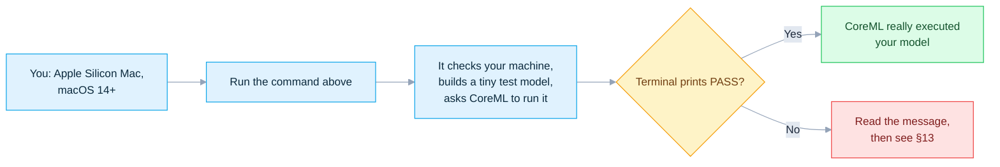

**Last verified:** `2026-07-17`, against released [`v1.27.0`](https://github.com/microsoft/onnxruntime/tree/v1.27.0) and source [`main@bf6aa006`](https://github.com/microsoft/onnxruntime/tree/bf6aa0063d1c178c4a4d33ed6770425834147e2a/onnxruntime/core/providers/coreml). Full version/hash pins are in [§14](#14-trace-the-source).

| You are… | Start at |
|---|---|
| On Apple Silicon and want proof now | [§5 Run the strict proof](#5-run-the-strict-proof) |
| Shipping an iPhone / iPad / macOS app | [§11 Ship to native Apple apps](#11-ship-to-native-apple-apps) |
| Asking "why did my node land on CPU?" | [§8 Operator support](#8-operator-support-and-partitions) + [§13 Troubleshoot](#13-troubleshoot-by-signal) |
| Not on a Mac | You can only *generate* models; CoreML executes on Apple hardware only |

> [!IMPORTANT]
> **Two different "CPU" — don't mix them up.**
> - **ORT CPU fallback** — CoreML *rejected* the node; ONNX Runtime's own CPU kernel ran it instead. The strict proof **forbids** this.
> - **Core ML's internal CPU** — CoreML *accepted* the node, but Apple's scheduler picked its CPU device. No software switch can forbid this.

## Contents

- [1. Pick your route](#1-pick-your-route)
- [2. The mental model](#2-the-mental-model)
- [3. Compatibility floors](#3-compatibility-floors)
- [4. Model format and compute units](#4-model-format-and-compute-units)
- [5. Run the strict proof](#5-run-the-strict-proof)
- [6. Read PASS correctly](#6-read-pass-correctly)
- [7. Configure the provider](#7-configure-the-provider)
- [8. Operator support and partitions](#8-operator-support-and-partitions)
- [9. Use the cache safely](#9-use-the-cache-safely)
- [10. Qualify your own model](#10-qualify-your-own-model)
- [11. Ship to native Apple apps](#11-ship-to-native-apple-apps)
- [12. Measure performance](#12-measure-performance)
- [13. Troubleshoot by signal](#13-troubleshoot-by-signal)
- [14. Trace the source](#14-trace-the-source)

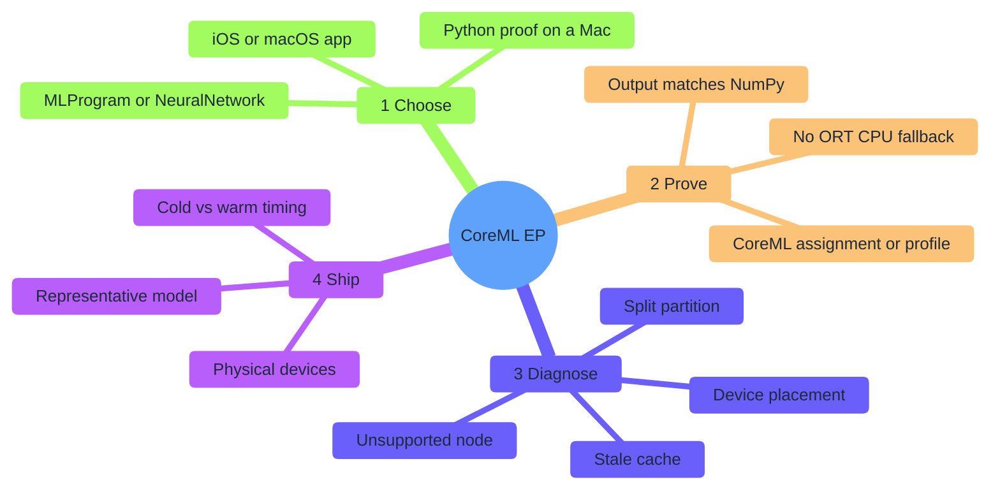

## 1. Pick your route

| Goal | Route | First action |
|---|---|---|
| Prove CoreML from Python on a Mac | Current `onnxruntime` macOS wheel | `python3 Apple/one_click.py` |
| Ship an iPhone / iPad app | `onnxruntime-c` or `onnxruntime-objc` CocoaPod | [§11](#11-ship-to-native-apple-apps) |
| Ship a macOS native app | Matching C/C++, Objective-C, C#, or Java build | [§7](#7-configure-the-provider) |
| React Native on Apple | `onnxruntime-react-native` | Verify its package + device separately |
| Shrink app size | Custom build with `--use_coreml` + reduced-op config | Extended-minimal or full build |
| Inspect conversion on Linux | Source build with CoreML stubs | Generate models only — cannot run Core ML |

The launcher creates `Apple/.venv-coreml`, installs exact versions, generates a local FP32 model, derives a content-based cache key, and runs one strict CoreML session. **No model download, no driver install.**

## 2. The mental model

Two systems make decisions at two different times. You only *prove* the first one.

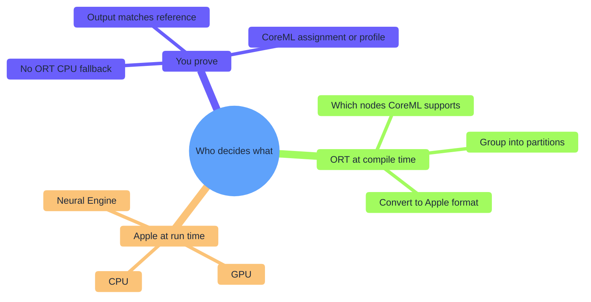

| Term | Plain meaning | Why it matters |
|---|---|---|
| Execution Provider (EP) | An ONNX Runtime backend | CoreML EP converts supported ONNX work to Apple's format |
| Partition | A block of adjacent nodes given to one backend | More partitions = more copies and Core ML calls |
| Model format | The Core ML representation ORT emits | `MLProgram` and `NeuralNetwork` support different ops |
| Compute units | Devices Apple *may* pick | A policy like CPU+ANE does **not** guarantee ANE runs |

CoreML EP is a **compiler-style** provider — not a per-operator "run this on the GPU" API:

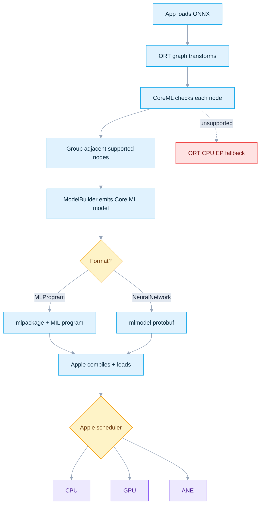

The strict proof rejects path `N`. ORT profiling stops at the CoreML boundary, so it **cannot** tell `K`/`L`/`M` apart by itself.

## 3. Compatibility floors

Read the floor for the route you ship — they are not the same number.

| Layer | Verified floor | Meaning |
|---|---|---|
| Public CoreML EP page | iOS 13 / macOS 10.15 | Historical Core ML 3 / NeuralNetwork text |
| Provider constructor (v1.27 + `main`) | **Core ML 5: iOS 15 / macOS 12** | Real source gate: `MINIMUM_COREML_VERSION == 5` |
| MLProgram | Core ML 5: iOS 15 / macOS 12 | Minimum representation version |
| `onnxruntime==1.27.0` wheel | macOS 14, arm64, CPython 3.11–3.14 | Floor for this folder's proof; **no Intel macOS file** |
| `MLComputePlan` | macOS 14.4 / iOS 17.4 + SDK header | Per-op preferred-device + cost logging |
| `FastPrediction` hint | Core ML 8: macOS 15 / iOS 18 + SDK header | Load-time specialization hint |

> [`host_utils.h`](https://github.com/microsoft/onnxruntime/blob/bf6aa0063d1c178c4a4d33ed6770425834147e2a/onnxruntime/core/providers/coreml/model/host_utils.h) still has Core ML 3 comments, but [`CoreMLExecutionProvider`](https://github.com/microsoft/onnxruntime/blob/bf6aa0063d1c178c4a4d33ed6770425834147e2a/onnxruntime/core/providers/coreml/coreml_execution_provider.cc) rejects runtime versions below Core ML 5. **The constructor is the real gate.**

**Python host checklist:**

| Requirement | Expected |
|---|---|
| Hardware / process | Apple Silicon `arm64` (not Rosetta) |
| OS | macOS 14 or newer |
| Python | 64-bit CPython 3.11–3.14, GIL enabled |
| First run | PyPI access + space for venv/cache |

```bash
uname -m                                   # arm64
sw_vers -productVersion                    # 14.x or newer
python3 -c 'import platform,struct,sysconfig; print(platform.machine(), struct.calcsize("P")*8, sysconfig.get_config_var("Py_GIL_DISABLED"))'
# expect: arm64 64 0   (or None for the last field)
```

## 4. Model format and compute units

**Format** — pick the Core ML representation ORT generates:

| Format | Value | Use when | Source limits |
|---|---|---|---|
| MLProgram | `MLProgram` | Default on modern Apple Silicon; broader coverage + compute-plan | Core ML 5+; serializes a model-package directory |
| NeuralNetwork | `NeuralNetwork` | Legacy lowering path or a qualified old integration | API default; still needs Core ML 5; serializes a protobuf |

> `NeuralNetwork` is the **provider** default; this tutorial deliberately defaults to **`MLProgram`**.

**Compute units** — the *set* of devices Apple may choose from (never a guarantee):

| CLI | Value | Apple may use | Never guaranteed |
|---|---|---|---|
| `all` | `ALL` | CPU, GPU, ANE | GPU or ANE selection |
| `cpu` | `CPUOnly` | Core ML CPU | Hardware acceleration |
| `cpu-gpu` | `CPUAndGPU` | CPU, GPU | GPU for every op |
| `cpu-ane` | `CPUAndNeuralEngine` | CPU, ANE | ANE-only execution |

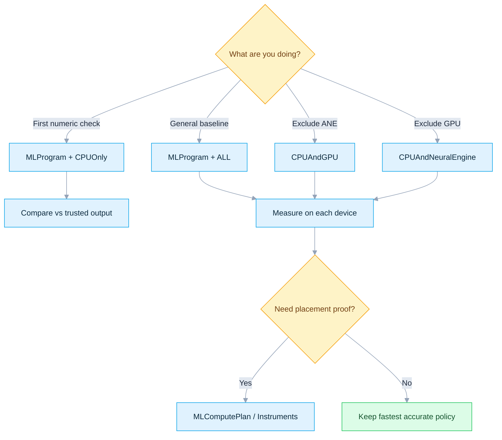

## 5. Run the strict proof

```bash
python3 Apple/one_click.py
```

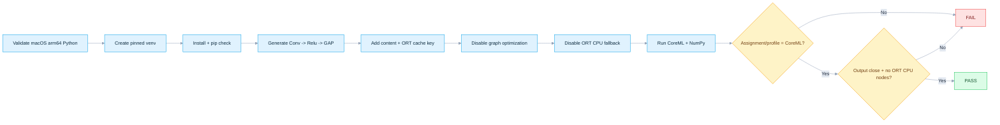

> **Why a Conv model?** `GetCapability()` drops partitions made *only* of trivial ops (`Identity`/`Reshape`/`Cast` can convert, yet still cost more to dispatch than to run). `Conv` guarantees one genuinely non-trivial partition.

| Goal | Command |
|---|---|
| Default strict proof | `python3 Apple/one_click.py` |
| Core ML CPU reference | `python3 Apple/one_click.py --compute-units cpu` |
| Legacy format | `python3 Apple/one_click.py --model-format neuralnetwork` |
| CPU + ANE policy | `python3 Apple/one_click.py --compute-units cpu-ane` |
| Placement log | `python3 Apple/one_click.py --profile-compute-plan` |
| No persistent cache | `python3 Apple/one_click.py --no-cache` |
| Rebuild venv | `python3 Apple/one_click.py --refresh` |

`--help` lists every flag. A few need extra conditions:

| Flag | Needs |
|---|---|
| `--profile-compute-plan` | `MLProgram` format + macOS 14.4+ |
| `--specialization fast-prediction` | macOS 15+ |
| `--allow-low-precision-gpu` | A GPU-capable `--compute-units` policy |

## 6. Read PASS correctly

| Signal | Proves | Does **not** prove |
|---|---|---|
| CoreML in available providers | The wheel exposes the EP | Any node was assigned |
| Strict session creates | No ORT CPU fallback needed | Which Apple device runs it |
| Assignment/profile names CoreML | ORT invoked a CoreML partition | ANE-only or GPU-only placement |
| No ORT CPU profile event | No profiled ORT CPU node ran | Core ML avoided its own CPU |
| Output matches NumPy | This graph is numerically sane | Your production model is accurate |
| Cache files exist | Artifacts persisted | A speedup is meaningful |

```text
PASS: CoreMLExecutionProvider executed the complete non-trivial partition with ONNX Runtime CPU EP fallback disabled.
```

With `--compute-units cpu` this is intentionally CoreML-on-CPU. For real CPU/GPU/ANE evidence under other policies, use `--profile-compute-plan` or Xcode Instruments.

## 7. Configure the provider

```python
from pathlib import Path
import onnxruntime as ort

options = ort.SessionOptions()
options.graph_optimization_level = ort.GraphOptimizationLevel.ORT_DISABLE_ALL
options.enable_profiling = True
options.add_session_config_entry("session.disable_cpu_ep_fallback", "1")

# Every CoreML provider option defined in the source
# (onnxruntime/core/providers/coreml/coreml_options.cc), listed together so you
# can copy this block and just change the values you need.
coreml_provider_options = {
    # Core ML representation ORT emits.
    #   "MLProgram"     -> modern MIL program (.mlpackage); needs Core ML 5+;
    #                      broader op coverage; required for ProfileComputePlan below.
    #   "NeuralNetwork" -> legacy protobuf layer format (.mlmodel); this is the
    #                      PROVIDER's own default when the key is omitted.
    "ModelFormat": "MLProgram",

    # Devices Apple's scheduler MAY use for this session - never a guarantee.
    #   "ALL"                -> CPU, GPU, ANE (default when the key is omitted)
    #   "CPUOnly"            -> Core ML's own CPU backend only (a numeric reference)
    #   "CPUAndGPU"          -> CPU + GPU, excludes the Neural Engine
    #   "CPUAndNeuralEngine" -> CPU + ANE, excludes the GPU
    "MLComputeUnits": "ALL",

    # "1" rejects candidate nodes with a dynamic input shape (same effect as the
    # legacy COREML_FLAG_ONLY_ALLOW_STATIC_INPUT_SHAPES bit). "0" is the default
    # and also allows dynamic shapes, at the cost of more CPU fallback.
    "RequireStaticInputShapes": "1",

    # "1" also evaluates nodes inside Loop/Scan/If subgraph bodies for CoreML.
    # "0" is the default; subgraphs are always left on ORT CPU.
    "EnableOnSubgraphs": "0",

    # Core ML 8 (macOS 15 / iOS 18+) load-time specialization hint; ignored on
    # older OS/SDKs.
    #   "Default"        -> Core ML picks its own strategy (default when omitted)
    #   "FastPrediction" -> optimizes for lower first-prediction latency; may
    #                       raise load time
    "SpecializationStrategy": "Default",

    # "1" logs the per-operator device placement + estimated cost. Only takes
    # effect when ModelFormat is "MLProgram" - CoreMLOptions::ProfileComputePlan()
    # ANDs this flag with CreateMLProgram(), so it is a silent no-op (not an
    # error) under "NeuralNetwork". "0" is the default.
    "ProfileComputePlan": "0",

    # "1" lets Core ML accumulate matmul/conv results at lower precision on the
    # GPU (sets MLModelConfiguration.allowLowPrecisionAccumulationOnGPU) -
    # trades accuracy for throughput. "0" is the default (full precision).
    "AllowLowPrecisionAccumulationOnGPU": "0",

    # Directory to persist the converted CoreML model for reuse across sessions.
    #   path -> reused if the cache key matches (see COREML_CACHE_KEY in §9)
    #   ""   -> default when the key is omitted; a temp dir is deleted when the
    #           session closes
    "ModelCacheDirectory": str(Path(".coreml-cache").resolve()),
}

providers = [("CoreMLExecutionProvider", coreml_provider_options)]

session = ort.InferenceSession("model.onnx", sess_options=options, providers=providers)
outputs = session.run(None, {session.get_inputs()[0].name: input_array})
```

| Option | Values | Source default | Behavior |
|---|---|---|---|
| `ModelFormat` | `NeuralNetwork`, `MLProgram` | `NeuralNetwork` | Protobuf-layer vs MIL-program lowering |
| `MLComputeUnits` | `ALL`, `CPUOnly`, `CPUAndGPU`, `CPUAndNeuralEngine` | `ALL` | Devices Apple may use |
| `RequireStaticInputShapes` | `0`, `1` | `0` | `1` rejects dynamic-input candidates |
| `EnableOnSubgraphs` | `0`, `1` | `0` | Check inside `Loop`/`Scan`/`If` bodies |
| `SpecializationStrategy` | `Default`, `FastPrediction` | unset (Core ML default) | Core ML 8 optimization hint when supported |
| `ProfileComputePlan` | `0`, `1` | `0` | Logs device + cost, but only takes effect when `ModelFormat=MLProgram` — silently ignored otherwise (`CoreMLOptions::ProfileComputePlan()` ANDs it with `CreateMLProgram()`) |
| `AllowLowPrecisionAccumulationOnGPU` | `0`, `1` | `0` | Sets the matching `MLModelConfiguration` property |
| `ModelCacheDirectory` | empty or path | empty | Empty = disposable; path = reuse |

> [!WARNING]
> Unknown keys and invalid enum strings **throw**. Booleans enable only on the exact string `"1"`.

| Gotcha | What to do |
|---|---|
| Optimized graphs can emit `FusedConv` (MLProgram-only); one with a residual input `Z` is **rejected** | Test every optimization level in production, not just `ORT_DISABLE_ALL` |
| A stale warning cites macOS 14.4 / iOS 17.4 for specialization | The real gate is **Core ML 8** (macOS 15 / iOS 18) — trust the code, not the warning text |

> [!NOTE]
> **A second, older configuration surface exists.**
> `coreml_provider_factory.h` also declares a `COREMLFlags` bit-flag `enum` consumed by the dedicated `OrtSessionOptionsAppendExecutionProvider_CoreML(options, coreml_flags)` C API call. It predates the string-keyed options above and cannot express `SpecializationStrategy`, `ProfileComputePlan`, `AllowLowPrecisionAccumulationOnGPU`, or `ModelCacheDirectory`. Prefer the options dictionary for new integrations — the table below is only for recognizing legacy flags in existing C/C++ code.

| Legacy flag | Bit value | Equivalent modern option |
|---|---|---|
| `COREML_FLAG_USE_NONE` | `0x000` | Every option left at its default (`MLComputeUnits=ALL`, `ModelFormat=NeuralNetwork`) |
| `COREML_FLAG_USE_CPU_ONLY` | `0x001` | `MLComputeUnits=CPUOnly` |
| `COREML_FLAG_ENABLE_ON_SUBGRAPH` | `0x002` | `EnableOnSubgraphs=1` |
| `COREML_FLAG_ONLY_ENABLE_DEVICE_WITH_ANE` | `0x004` | `MLComputeUnits=CPUAndNeuralEngine` |
| `COREML_FLAG_ONLY_ALLOW_STATIC_INPUT_SHAPES` | `0x008` | `RequireStaticInputShapes=1` |
| `COREML_FLAG_CREATE_MLPROGRAM` | `0x010` | `ModelFormat=MLProgram` |
| `COREML_FLAG_USE_CPU_AND_GPU` | `0x020` | `MLComputeUnits=CPUAndGPU` |

## 8. Operator support and partitions

An operator name alone is **not** a support contract — format, opset, dtype, rank, inferred shape, attributes, and constant inputs all vote. Only read the table below when a node is actually rejected; otherwise skip to [§13](#13-troubleshoot-by-signal).

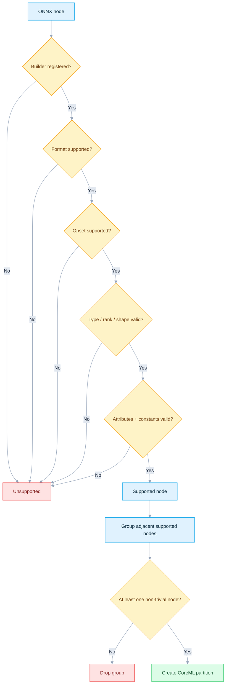

Trivial markers (kept only if a partition has real compute; an all-trivial group is dropped): `Identity`, `Cast`, `Flatten`, `Reshape`, `Squeeze`, `Transpose`, `Tile`, `Ceil`.

**High-risk operator checks (audited builders):**

| Pattern | Ground truth |
|---|---|
| General inputs | Shape must be known; general rank limit 5; `RequireStaticInputShapes=1` rejects dynamic inputs |
| `Conv` | 1D/2D only; constant bias; NeuralNetwork also needs constant weights; MLProgram allows runtime weights |
| `FusedConv` | MLProgram only; FP32/FP16; supported activation required; optional residual `Z` rejected |
| Pooling | Rank 4 / 2D; rejects `storage_order=1`, non-`[1,1]` dilation, MaxPool indices; NeuralNetwork rejects `ceil_mode=1` |
| `Gemm` | `B` and optional `C` constant; `transA=0`, `alpha=1`, `beta=1`; `C` shape restricted |
| `MatMul` | NeuralNetwork: constant `B`, 2D inputs; MLProgram: runtime `B`, N-D, but rejects exactly one 1D input |
| `Reshape` | Opset 5+; static data shape; non-empty constant shape input; output rank ≤ 5 |
| `Slice` / `Split` | Control inputs generally constant; empty/zero cases add checks |
| `Resize` | Many format-specific rank/mode/coordinate/axes/scale combos — read the builder |
| Dynamic empty input | Compile-time zero dim rejected; a runtime resolve to zero elements rejected too |

Triage with the generated tables, then confirm in the builder + verbose log:
[NeuralNetwork table](https://github.com/microsoft/onnxruntime/blob/bf6aa0063d1c178c4a4d33ed6770425834147e2a/tools/ci_build/github/apple/coreml_supported_neuralnetwork_ops.md) ·
[MLProgram table](https://github.com/microsoft/onnxruntime/blob/bf6aa0063d1c178c4a4d33ed6770425834147e2a/tools/ci_build/github/apple/coreml_supported_mlprogram_ops.md) ·
[Builder impls](https://github.com/microsoft/onnxruntime/tree/bf6aa0063d1c178c4a4d33ed6770425834147e2a/onnxruntime/core/providers/coreml/builders/impl)

## 9. Use the cache safely

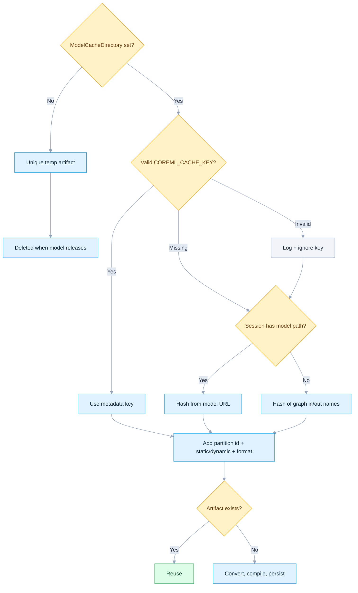

| Rule | Action |
|---|---|
| User key wins | Set metadata named exactly `COREML_CACHE_KEY` |
| Key validation | 1–64 alphanumeric chars; invalid metadata falls back to a generated identity |
| Path fallback ≠ content hash | Replacing a model at the same path can reuse stale artifacts |
| ORT never invalidates user keys | Change the key when bytes or converter/runtime version change |
| ORT never garbage-collects | Delete obsolete app cache entries yourself |
| Format + shape are in the path | MLProgram/NeuralNetwork and static/dynamic do not share one artifact |

The demo hashes the graph **plus** the pinned ORT version (48 hex chars), so either change invalidates old reuse.

```bash
find Apple/.coreml-cache -maxdepth 5 -print
python3 Apple/one_click.py --no-cache
rm -rf Apple/.coreml-cache   # only this tutorial's disposable cache
```

> One session-creation timing is **not** proof of reuse. Check the namespace and compare repeated controlled runs.

## 10. Qualify your own model

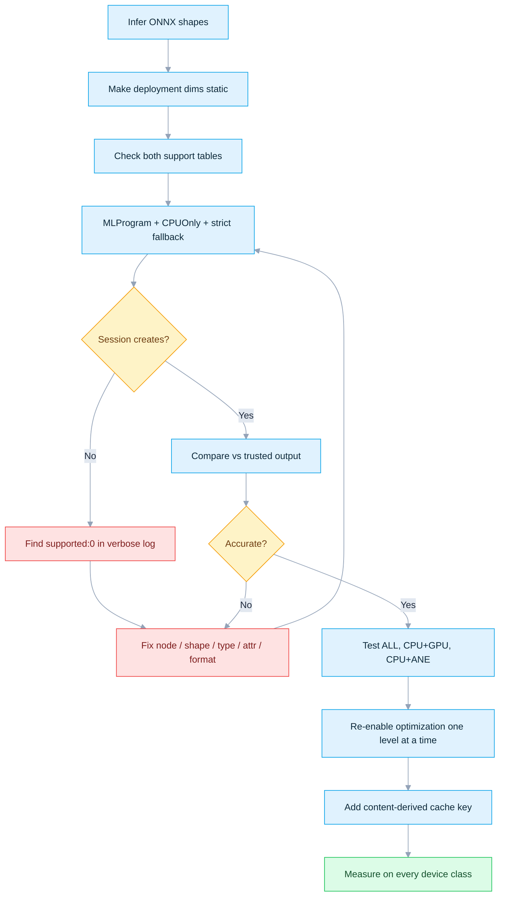

| Failure question | First evidence |
|---|---|
| Which node was rejected? | Verbose `supported: 0` line + its builder |
| Did the graph split? | CoreML partition-count warning |
| Did conversion change numerics? | Trusted framework/CPU output, task-specific tolerance |
| Did optimization change support? | Compare disabled/basic/extended/all levels |
| Will it work on the product device? | Physical devices, representative inputs, thermal states |

> The mobile usability checker estimates partitions from the generated tables. It is **preflight only** — it does not run Apple's compiler or scheduler.

## 11. Ship to native Apple apps

| Target | Official route | Boundary |
|---|---|---|
| iOS C/C++ | CocoaPod `onnxruntime-c` | Add model, append CoreML explicitly |
| iOS Objective-C | CocoaPod `onnxruntime-objc` | Prefer the V2 provider-options dictionary |
| React Native | `onnxruntime-react-native` | Qualify its iOS package + option surface |
| macOS native | Matching C/C++, Objective-C, C#, or Java build | Keep headers + library on one ORT release |
| Custom iOS/macOS | Source build with `--use_coreml` | Match deployment target to provider/format floors |

```ruby
use_frameworks!

# Choose one API.
pod 'onnxruntime-c'
# pod 'onnxruntime-objc'
```

Run `pod install`. **The Python wheel is not an iOS package.** A custom runtime needs `--use_coreml`: a *basic* minimal build rejects CoreML, so use a full build or `--minimal_build extended`. On Apple the provider links Foundation + CoreML; non-Apple builds link stubs and cannot predict.

| Rule | Reason |
|---|---|
| Test a physical iPhone/iPad | A simulator cannot prove ANE behavior |
| Append CoreML explicitly | Availability does not auto-assign a model |
| Keep package + headers + library on one release | Avoid ABI/API mismatch |
| Recheck after model or ORT updates | Builders, partitions, cache, numerics can change |

## 12. Measure performance

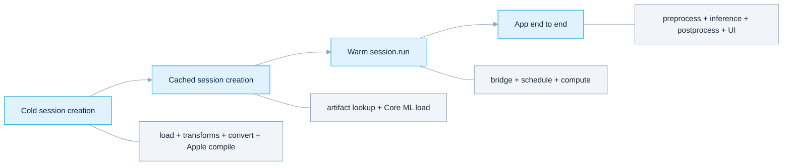

| Measurement | Report separately | Common noise |
|---|---|---|
| Cold creation | First launch after cache removal | Disk, compilation, OS background |
| Cached creation | Repeated load with verified artifact | OS filesystem + Core ML caches |
| Warm inference | Median + distribution after warmup | Scheduling, thermals, copies |
| End to end | User-visible workflow | Decode, pre/post-processing, UI |

- Prefer one large partition, static/bounded shapes, representative inputs, and physical devices.
- Compare `ALL` vs constrained policies on **both** latency and energy.
- Treat `FastPrediction` and low-precision GPU accumulation as experiments — recheck load time and accuracy.
- The smoke model proves configuration; it is **not** a benchmark.

## 13. Troubleshoot by signal

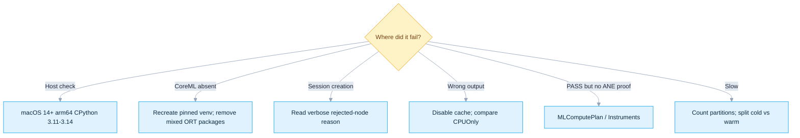

| Symptom | Likely cause | Action |
|---|---|---|
| Launcher rejects Linux/Windows | Core ML framework absent | Run on a Mac |
| Launcher rejects `x86_64` | Intel/Rosetta; ORT 1.27 has no Intel macOS wheel | Use native Apple Silicon Python |
| No matching wheel | Wrong OS/Python/arch/free-threaded build | Match the host checklist |
| CoreML provider absent | Wrong or mixed ORT distribution | Use the isolated pinned venv |
| Strict session fails | Unsupported node or all-trivial graph | Read verbose logs; inspect the builder |
| More than one partition | Unsupported node split supported regions | Find `supported: 0`; reduce crossings |
| NeuralNetwork fails after optimization | Optimizer produced MLProgram-only `FusedConv` | Lower optimization or use MLProgram |
| PASS but no ANE evidence | ORT sees only the partition boundary | Compute-plan logs or Instruments |
| Warning mentions 14.4 | Stale text; code guard is Core ML 8 | Use macOS 15+/iOS 18+ or default strategy |
| Wrong result after replacing model | Stale user-managed cache identity | Change key or clear the cache |
| Dynamic input becomes empty | Runtime zero-element guard | Avoid empty tensors or route elsewhere |

## 14. Trace the source

This guide pins every layer below so each claim above stays checkable:

| Evidence layer | Audited baseline | Qualifies |
|---|---|---|
| Runnable release | ONNX Runtime [`v1.27.0`](https://github.com/microsoft/onnxruntime/tree/v1.27.0) + [PyPI files](https://pypi.org/project/onnxruntime/1.27.0/) | Launcher + released CoreML behavior |
| Source snapshot | `main` @ [`bf6aa006`](https://github.com/microsoft/onnxruntime/tree/bf6aa0063d1c178c4a4d33ed6770425834147e2a/onnxruntime/core/providers/coreml) | Architecture, builders, options, tests |
| Pinned stack | `onnxruntime==1.27.0`, `onnx==1.22.0`; NumPy `2.4.6` (3.11) / `2.5.1` (3.12–3.14) | Reproducible desktop setup |
| Audit date | `2026-07-17` | Links, packages, source, CLI |
| Hardware boundary | Source/packages checked on Linux; Core ML **not** executed here | Final CPU/GPU/ANE proof needs an Apple device |

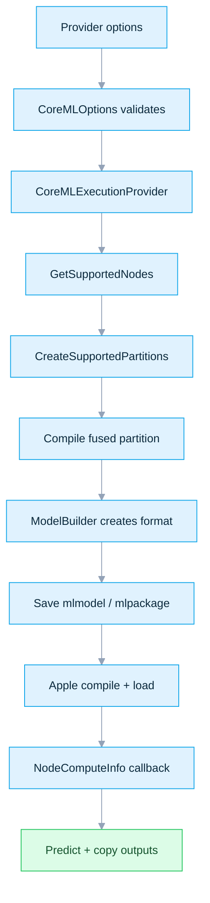

| Source | Ground truth |
|---|---|
| [`coreml_provider_factory.h`](https://github.com/microsoft/onnxruntime/blob/bf6aa0063d1c178c4a4d33ed6770425834147e2a/include/onnxruntime/core/providers/coreml/coreml_provider_factory.h) | Public flags, option names, cache contract |
| [`coreml_options.cc`](https://github.com/microsoft/onnxruntime/blob/bf6aa0063d1c178c4a4d33ed6770425834147e2a/onnxruntime/core/providers/coreml/coreml_options.cc) | Accepted values + parser behavior |
| [`coreml_options.h`](https://github.com/microsoft/onnxruntime/blob/bf6aa0063d1c178c4a4d33ed6770425834147e2a/onnxruntime/core/providers/coreml/coreml_options.h) | Option storage + accessors, incl. the `ProfileComputePlan` MLProgram-only gate |
| [`coreml_execution_provider.cc`](https://github.com/microsoft/onnxruntime/blob/bf6aa0063d1c178c4a4d33ed6770425834147e2a/onnxruntime/core/providers/coreml/coreml_execution_provider.cc) | Version gate, cache key, partitions, callbacks |
| [`helper.cc`](https://github.com/microsoft/onnxruntime/blob/bf6aa0063d1c178c4a4d33ed6770425834147e2a/onnxruntime/core/providers/coreml/builders/helper.cc) | Input/rank/shape checks + ANE detection |
| [`op_builder_factory.cc`](https://github.com/microsoft/onnxruntime/blob/bf6aa0063d1c178c4a4d33ed6770425834147e2a/onnxruntime/core/providers/coreml/builders/op_builder_factory.cc) | Operator-to-builder registry |
| [`base_op_builder.cc`](https://github.com/microsoft/onnxruntime/blob/bf6aa0063d1c178c4a4d33ed6770425834147e2a/onnxruntime/core/providers/coreml/builders/impl/base_op_builder.cc) | Common format/opset/input checks |
| [`model_builder.cc`](https://github.com/microsoft/onnxruntime/blob/bf6aa0063d1c178c4a4d33ed6770425834147e2a/onnxruntime/core/providers/coreml/builders/model_builder.cc) | Conversion, names, serialization, cache paths |
| [`model.mm`](https://github.com/microsoft/onnxruntime/blob/bf6aa0063d1c178c4a4d33ed6770425834147e2a/onnxruntime/core/providers/coreml/model/model.mm) | Compile/load, options, profiling, prediction |
| [`host_utils.h`](https://github.com/microsoft/onnxruntime/blob/bf6aa0063d1c178c4a4d33ed6770425834147e2a/onnxruntime/core/providers/coreml/model/host_utils.h) | OS/Core ML mapping + minimum |
| [`onnxruntime_providers_coreml.cmake`](https://github.com/microsoft/onnxruntime/blob/bf6aa0063d1c178c4a4d33ed6770425834147e2a/cmake/onnxruntime_providers_coreml.cmake) | Frameworks, stubs, minimal-build rule |
| [`py-macos.yml`](https://github.com/microsoft/onnxruntime/blob/bf6aa0063d1c178c4a4d33ed6770425834147e2a/tools/ci_build/github/azure-pipelines/templates/py-macos.yml) | Wheel uses `--use_coreml`; deployment target 14 |
| [`coreml_basic_test.cc`](https://github.com/microsoft/onnxruntime/blob/bf6aa0063d1c178c4a4d33ed6770425834147e2a/onnxruntime/test/providers/coreml/coreml_basic_test.cc) | Format, operator, partition, cache tests |
| [`dynamic_input_test.cc`](https://github.com/microsoft/onnxruntime/blob/bf6aa0063d1c178c4a4d33ed6770425834147e2a/onnxruntime/test/providers/coreml/dynamic_input_test.cc) | Dynamic + empty-input tests |
| [`ort_coreml_execution_provider.mm`](https://github.com/microsoft/onnxruntime/blob/bf6aa0063d1c178c4a4d33ed6770425834147e2a/objectivec/ort_coreml_execution_provider.mm) | Objective-C legacy + V2 bridges |

**Official references:**
[CoreML EP](https://onnxruntime.ai/docs/execution-providers/CoreML-ExecutionProvider.html) ·
[iOS install](https://onnxruntime.ai/docs/install/#install-on-ios) ·
[iOS build](https://onnxruntime.ai/docs/build/ios.html) ·
[Apple Core ML](https://developer.apple.com/documentation/coreml) ·
[MLComputePlan](https://developer.apple.com/documentation/coreml/mlcomputeplan) ·
[Specialization strategy](https://developer.apple.com/documentation/coreml/mloptimizationhints-swift.struct/specializationstrategy-swift.property)

> ONNX Runtime `main`, release binaries, generated support tables, and Apple SDK behavior evolve independently. Recheck all four before qualifying a production release.
