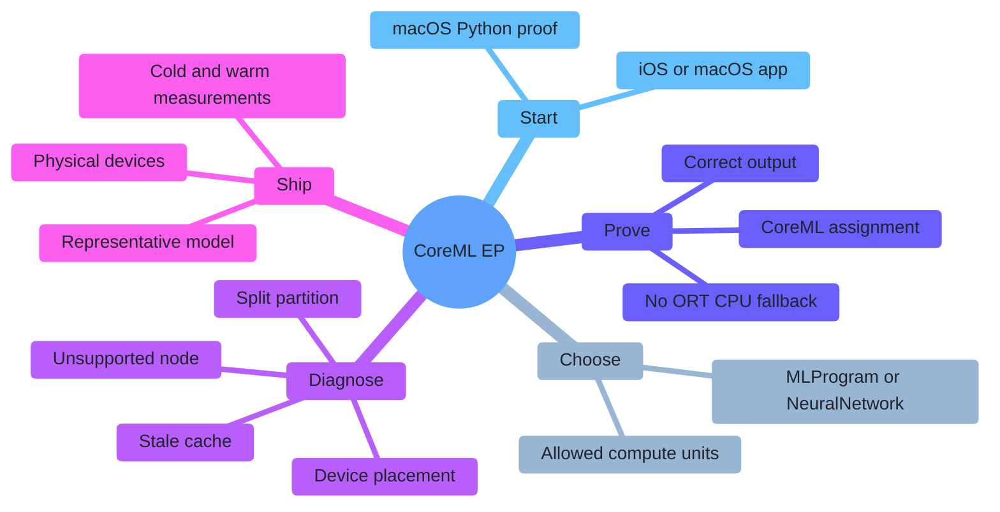
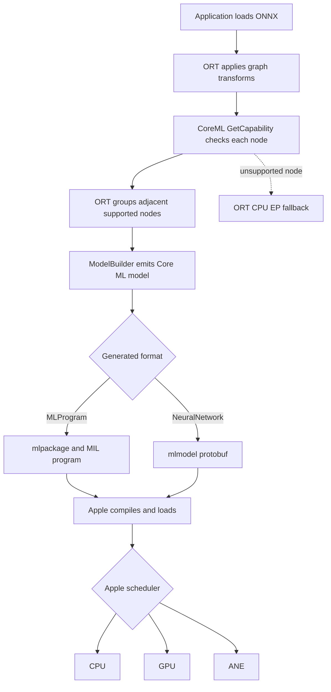
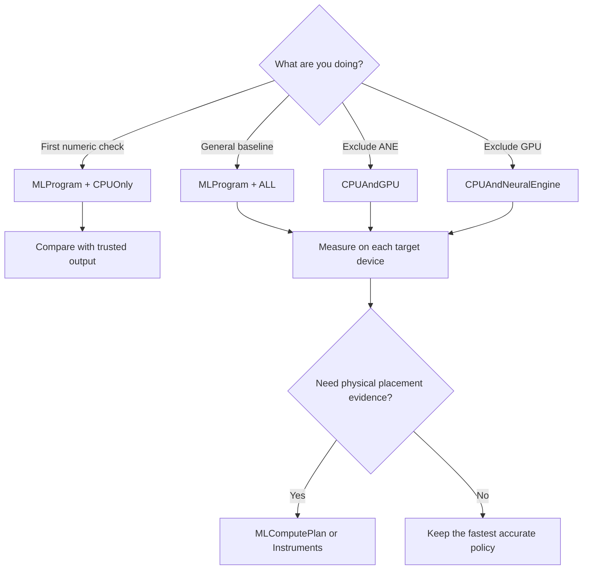
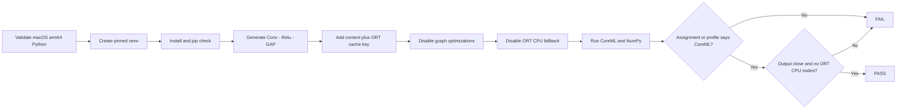
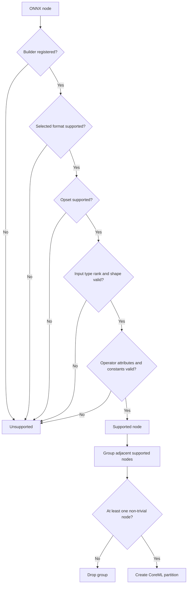
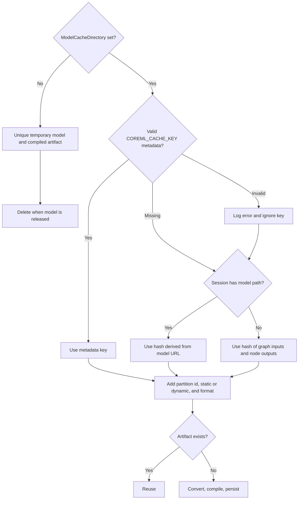
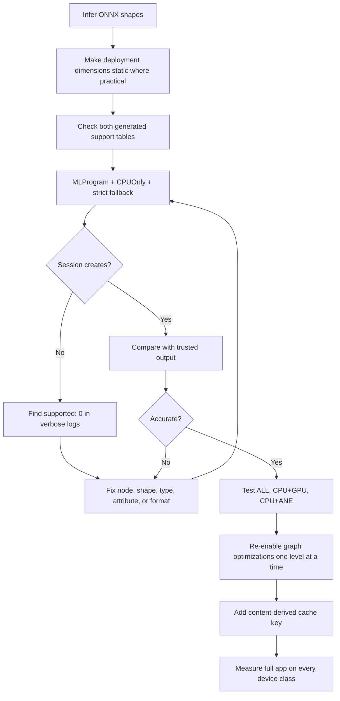
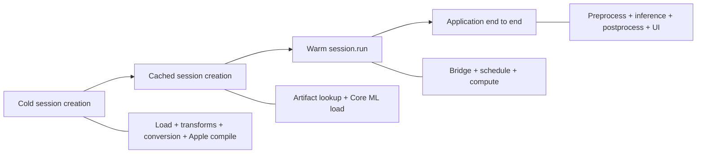
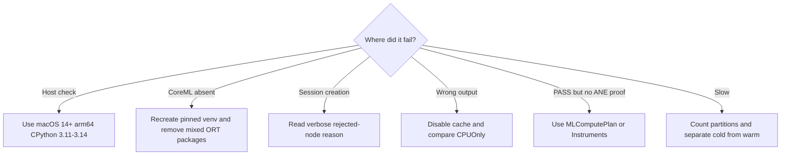
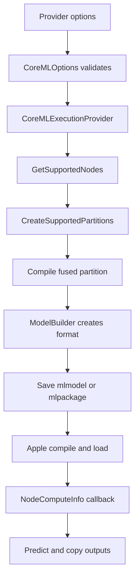

# ONNX Runtime + Apple CoreML: CPU, GPU, and Neural Engine

[Simplified Chinese](README.zh-CN.md) | [Repository index](../README.md) | [One-click proof](one_click.py)

| Evidence layer | Audited baseline | What it qualifies |
|---|---|---|
| Runnable release | ONNX Runtime [`v1.27.0`](https://github.com/microsoft/onnxruntime/tree/v1.27.0) and its [PyPI files](https://pypi.org/project/onnxruntime/1.27.0/) | The Python launcher and released CoreML behavior |
| Current source snapshot | ONNX Runtime `main` at [`bf6aa0063d1c178c4a4d33ed6770425834147e2a`](https://github.com/microsoft/onnxruntime/tree/bf6aa0063d1c178c4a4d33ed6770425834147e2a/onnxruntime/core/providers/coreml) | Current architecture, builders, options, and tests |
| Pinned Python stack | `onnxruntime==1.27.0`, `onnx==1.22.0`; NumPy `2.4.6` on Python 3.11 and `2.5.1` on Python 3.12-3.14 | Reproducible desktop setup |
| Audit date | `2026-07-17` | Links, packages, source, launcher syntax, and CLI |
| Hardware boundary | Source and package evidence were checked on Linux; Core ML execution was not run here | Final CPU/GPU/ANE qualification still requires an Apple target |

> [!IMPORTANT]
> Two CPU paths must not be confused. **ORT CPU fallback** means unsupported nodes stayed outside CoreML. **Core ML internal CPU execution** means CoreML accepted the partition, but Apple's scheduler selected CPU. The strict proof disables the first path; it cannot disable the second.

## Contents

- [1. Start with the right route](#1-start-with-the-right-route)
- [2. Learn the four CoreML EP concepts](#2-learn-the-four-coreml-ep-concepts)
- [3. Check compatibility](#3-check-compatibility)
- [4. Choose format and compute units](#4-choose-format-and-compute-units)
- [5. Run the strict macOS proof](#5-run-the-strict-macos-proof)
- [6. Read PASS correctly](#6-read-pass-correctly)
- [7. Configure the provider](#7-configure-the-provider)
- [8. Understand partitions and operator support](#8-understand-partitions-and-operator-support)
- [9. Use the cache safely](#9-use-the-cache-safely)
- [10. Qualify your own model](#10-qualify-your-own-model)
- [11. Integrate native Apple apps](#11-integrate-native-apple-apps)
- [12. Measure performance](#12-measure-performance)
- [13. Troubleshoot by signal](#13-troubleshoot-by-signal)
- [14. Trace the source](#14-trace-the-source)



## 1. Start with the right route

| Goal | Route | First action |
|---|---|---|
| Prove CoreML from Python on a Mac | Current `onnxruntime` macOS wheel | `python3 Apple/one_click.py` |
| Ship an iPhone/iPad app | `onnxruntime-c` or `onnxruntime-objc` CocoaPod | Follow [section 11](#11-integrate-native-apple-apps) |
| Ship a macOS native app | Matching C/C++, Objective-C, C#, or Java package/build | Use generic provider options in [section 7](#7-configure-the-provider) |
| Use React Native on Apple devices | `onnxruntime-react-native` | Verify the package and device route separately |
| Reduce app size | Custom ORT build with `--use_coreml` and a reduced operator config | Use an extended minimal or full build |
| Inspect conversion on Linux | Source build with CoreML stubs | Generate models only; Linux cannot run Apple Core ML |

Shortest desktop path:

```bash
python3 Apple/one_click.py
```

The launcher creates `Apple/.venv-coreml`, installs exact versions, generates a local FP32 model, creates a content-derived cache key, and runs a strict CoreML session. It downloads no model and installs no driver.

## 2. Learn the four CoreML EP concepts

| Term | Rookie definition | Why it matters |
|---|---|---|
| Execution Provider (EP) | An ONNX Runtime backend | CoreML EP converts supported ONNX work to Apple's format |
| Partition | Adjacent ONNX nodes assigned to one backend | More partitions can mean more copies and Core ML calls |
| Model format | The Core ML representation generated by ORT | `MLProgram` and `NeuralNetwork` have different support |
| Compute units | Devices Apple may schedule | A policy such as CPU+ANE does not guarantee ANE use |

CoreML EP is a compiler-style provider, not a public per-operator GPU or ANE API:



The strict proof rejects path `N`. ORT profiling stops at the CoreML boundary, so it does not identify `K`, `L`, or `M` by itself.

## 3. Check compatibility

Different layers publish different minimums. Apply the row for the route you actually ship.

| Layer | Verified floor | Meaning |
|---|---|---|
| Public CoreML EP page | iOS 13 / macOS 10.15 | Historical Core ML 3 and NeuralNetwork statement |
| Current and v1.27 provider constructor | Core ML 5: iOS 15 / macOS 12 | Effective source runtime floor: `MINIMUM_COREML_VERSION == 5` |
| MLProgram | Core ML 5: iOS 15 / macOS 12 | Minimum representation version |
| `onnxruntime==1.27.0` PyPI wheel | macOS 14, arm64, CPython 3.11-3.14 | Floor for this folder's Python proof; no Intel macOS file is published |
| `MLComputePlan` | macOS 14.4 / iOS 17.4 plus SDK header support | Per-operation preferred-device and estimated-cost logging |
| `FastPrediction` hint | Core ML 8: macOS 15 / iOS 18 plus SDK header support | Specialization hint used while loading the compiled model |

[`host_utils.h`](https://github.com/microsoft/onnxruntime/blob/bf6aa0063d1c178c4a4d33ed6770425834147e2a/onnxruntime/core/providers/coreml/model/host_utils.h) still contains historical Core ML 3 helper comments, but [`CoreMLExecutionProvider`](https://github.com/microsoft/onnxruntime/blob/bf6aa0063d1c178c4a4d33ed6770425834147e2a/onnxruntime/core/providers/coreml/coreml_execution_provider.cc) rejects runtime versions below 5. The constructor is the effective gate.

### Python host checklist

| Requirement | Expected |
|---|---|
| Hardware/process | Apple Silicon `arm64`, not Rosetta |
| OS | macOS 14 or newer |
| Python | 64-bit CPython 3.11-3.14 with the GIL enabled |
| First run | PyPI access and space for the venv/cache |

```bash
uname -m
sw_vers -productVersion
python3 -c 'import platform,struct,sysconfig; print(platform.machine(), struct.calcsize("P")*8, sysconfig.get_config_var("Py_GIL_DISABLED"))'
```

Expected essentials: `arm64`, `64`, and `0` or `None` for `Py_GIL_DISABLED`.

## 4. Choose format and compute units

### Model format

| Format | Provider value | Use it when | Source limits |
|---|---|---|---|
| MLProgram | `MLProgram` | Starting on current Apple Silicon; broader current builder coverage and compute-plan support | Core ML 5+; serializes a model-package directory |
| NeuralNetwork | `NeuralNetwork` | Testing the legacy lowering path or a qualified older integration | API default; current provider constructor still requires Core ML 5; serializes a NeuralNetwork model protobuf |

`NeuralNetwork` is the provider default. This tutorial deliberately defaults to `MLProgram`.

### Compute units

| CLI | Provider value | Apple may use | Not guaranteed |
|---|---|---|---|
| `all` | `ALL` | CPU, GPU, ANE | GPU or ANE selection |
| `cpu` | `CPUOnly` | Core ML CPU | Hardware acceleration |
| `cpu-gpu` | `CPUAndGPU` | CPU, GPU | GPU for every operation |
| `cpu-ane` | `CPUAndNeuralEngine` | CPU, ANE | ANE-only execution |



## 5. Run the strict macOS proof

From the repository root:

```bash
python3 Apple/one_click.py
```



Why a Conv model? Current `GetCapability()` drops partitions made only of operations marked trivial. A chain of `Identity`, `Reshape`, or `Cast` may be convertible but still stay on CPU because dispatch costs more than the work. Conv anchors a non-trivial partition.

| Goal | Command |
|---|---|
| Default strict proof | `python3 Apple/one_click.py` |
| Core ML CPU reference | `python3 Apple/one_click.py --compute-units cpu` |
| Legacy format | `python3 Apple/one_click.py --model-format neuralnetwork` |
| CPU + ANE policy | `python3 Apple/one_click.py --compute-units cpu-ane` |
| Placement log | `python3 Apple/one_click.py --profile-compute-plan` |
| No persistent cache | `python3 Apple/one_click.py --no-cache` |
| Rebuild venv | `python3 Apple/one_click.py --refresh` |

Use `--help` for all controls. The launcher enforces MLProgram and macOS 14.4+ for compute-plan profiling, macOS 15+ for `fast-prediction`, and GPU-capable compute units for low-precision GPU accumulation.

## 6. Read PASS correctly

| Signal | Proves | Does not prove |
|---|---|---|
| CoreML appears in available providers | The wheel exposes the EP | Any model node was assigned |
| Strict session creates | The smoke graph needs no ORT CPU fallback | Which Apple device runs it |
| Assignment or profile names CoreML | ORT invoked a CoreML partition | ANE-only or GPU-only placement |
| No ORT CPU profile event | No profiled ORT CPU node ran | Core ML avoided its own CPU path |
| Output matches NumPy | This graph is numerically sane within tolerance | Your production model is accurate |
| Cache files exist | Artifacts were persisted | A speedup is statistically meaningful |

Expected final line:

```text
PASS: CoreMLExecutionProvider executed the complete non-trivial partition with ONNX Runtime CPU EP fallback disabled.
```

With `--compute-units cpu`, this is intentionally CoreML-on-CPU. With other policies, use `--profile-compute-plan` or Xcode Instruments when the claim requires CPU/GPU/ANE evidence.

## 7. Configure the provider

### Strict Python pattern

```python
from pathlib import Path

import onnxruntime as ort

options = ort.SessionOptions()
options.graph_optimization_level = ort.GraphOptimizationLevel.ORT_DISABLE_ALL
options.enable_profiling = True
options.add_session_config_entry("session.disable_cpu_ep_fallback", "1")

providers = [
    (
        "CoreMLExecutionProvider",
        {
            "ModelFormat": "MLProgram",
            "MLComputeUnits": "ALL",
            "RequireStaticInputShapes": "1",
            "EnableOnSubgraphs": "0",
            "ModelCacheDirectory": str(Path(".coreml-cache").resolve()),
        },
    )
]

session = ort.InferenceSession("model.onnx", sess_options=options, providers=providers)
outputs = session.run(None, {session.get_inputs()[0].name: input_array})
```

### Complete option table

| Option | Accepted values | Source default | Effective behavior |
|---|---|---|---|
| `ModelFormat` | `NeuralNetwork`, `MLProgram` | `NeuralNetwork` | Selects protobuf-layer or MIL-program lowering |
| `MLComputeUnits` | `ALL`, `CPUOnly`, `CPUAndGPU`, `CPUAndNeuralEngine` | `ALL` | Restricts devices available to Apple |
| `RequireStaticInputShapes` | documented `0`, `1` | `0` | `1` rejects candidate nodes with dynamic inputs |
| `EnableOnSubgraphs` | documented `0`, `1` | `0` | Enables capability checks in `Loop`, `Scan`, or `If` bodies |
| `SpecializationStrategy` | `Default`, `FastPrediction` | unset, so Core ML default | Sets Core ML 8 optimization hints when runtime and build SDK support them |
| `ProfileComputePlan` | documented `0`, `1` | `0` | MLProgram only; logs preferred device and estimated cost on supported SDK/OS |
| `AllowLowPrecisionAccumulationOnGPU` | documented `0`, `1` | `0` | Sets the matching `MLModelConfiguration` property |
| `ModelCacheDirectory` | empty or path | empty | Empty uses disposable artifacts; path enables reuse |

Unknown keys and invalid enum strings throw. Boolean options are enabled only by the exact string `"1"`; use only the documented `0`/`1` values.

The demo disables graph optimization to keep `Conv -> Relu` stable in both formats. Production code should test each optimization level: optimized graphs can contain `FusedConv`, which is MLProgram-only, and a `FusedConv` with residual input `Z` is rejected.

One v1.27/current-source diagnostic is stale: specialization is guarded by Core ML 8 (macOS 15/iOS 18), but the fallback warning says macOS 14.4/iOS 17.4. Those lower versions belong to `MLComputePlan`; trust the code guard, not that warning text.

## 8. Understand partitions and operator support

An operator name alone is not a support contract. Format, opset, dtype, rank, inferred shape, attributes, and constant inputs all participate.



Trivial markers live in the builders. Current examples include `Identity`, `Cast`, `Flatten`, `Reshape`, `Squeeze`, `Transpose`, `Tile`, and `Ceil`. Trivial nodes can remain inside a partition anchored by real compute; an all-trivial group is dropped.

### High-risk operator checks

| Pattern | Ground truth in the audited builders |
|---|---|
| General inputs | Shape must be known; general rank limit is 5; `RequireStaticInputShapes=1` rejects dynamic inputs |
| `Conv` | 1D/2D only; bias must be constant; NeuralNetwork also requires constant weights; MLProgram permits runtime weights |
| `FusedConv` | MLProgram only; FP32/FP16; supported activation required; optional residual `Z` is rejected |
| Pooling | Rank 4 / 2D; `storage_order=1`, dilation other than `[1,1]`, and MaxPool indices output are rejected; NeuralNetwork rejects `ceil_mode=1` |
| `Gemm` | `B` and optional `C` must be constant; `transA=0`, `alpha=1`, `beta=1`; `C` shape is restricted |
| `MatMul` | NeuralNetwork requires constant `B` and 2D inputs; MLProgram allows runtime `B` and N-D inputs but rejects cases with exactly one 1D input |
| `Reshape` | Opset 5+; data shape must be static; shape input must be a non-empty constant; output rank at most 5 |
| `Slice` / `Split` | Control inputs generally must be constant; empty/zero cases have additional checks |
| `Resize` | Many format-specific combinations of rank, mode, coordinates, nearest mode, axes, and constant scales/sizes; inspect the builder |
| Dynamic empty input | A compile-time zero dimension is normally rejected; a dynamic input resolving to zero elements is rejected at run time |

Use the generated tables for triage, then the builder and verbose log for the final answer:

- [NeuralNetwork support table](https://github.com/microsoft/onnxruntime/blob/bf6aa0063d1c178c4a4d33ed6770425834147e2a/tools/ci_build/github/apple/coreml_supported_neuralnetwork_ops.md)
- [MLProgram support table](https://github.com/microsoft/onnxruntime/blob/bf6aa0063d1c178c4a4d33ed6770425834147e2a/tools/ci_build/github/apple/coreml_supported_mlprogram_ops.md)
- [Builder implementations](https://github.com/microsoft/onnxruntime/tree/bf6aa0063d1c178c4a4d33ed6770425834147e2a/onnxruntime/core/providers/coreml/builders/impl)

## 9. Use the cache safely



| Rule | Practical action |
|---|---|
| User key is preferred | Set metadata named exactly `COREML_CACHE_KEY` |
| Key validation | Use 1-64 alphanumeric characters; invalid metadata falls back to generated identity |
| Path fallback is not content hashing | Replacing a model at the same path can reuse stale artifacts |
| ORT does not invalidate user keys | Change the key when model bytes or converter/runtime version changes |
| ORT does not garbage-collect | Delete obsolete application cache entries deliberately |
| Format and shape policy are encoded in the artifact path | MLProgram/NeuralNetwork and static/dynamic variants do not share one artifact |

The demo hashes the generated graph together with the pinned ORT version and stores 48 hexadecimal characters. This avoids stale reuse when either changes.

```bash
find Apple/.coreml-cache -maxdepth 5 -print
python3 Apple/one_click.py --no-cache
rm -rf Apple/.coreml-cache  # Only this tutorial's disposable cache
```

Do not use one session-creation timing as proof of cache reuse. Check the namespace and compare repeated controlled runs.

## 10. Qualify your own model



| Failure question | First evidence to inspect |
|---|---|
| Which node was rejected? | Verbose `supported: 0` line and its builder |
| Did the graph split? | CoreML partition count warning |
| Did conversion change numerics? | Trusted framework/CPU output with task-specific tolerance |
| Did optimization change support? | Compare disabled/basic/extended/all graph optimization levels |
| Will it work on the product device? | Physical-device tests across representative inputs and thermal states |

The mobile usability checker estimates partitions from generated support tables. It is preflight only: it does not execute Apple's compiler or scheduler.

## 11. Integrate native Apple apps

| Target | Official route | Boundary |
|---|---|---|
| iOS C/C++ | CocoaPod `onnxruntime-c` | Add model and append CoreML explicitly |
| iOS Objective-C | CocoaPod `onnxruntime-objc` | Prefer the V2 provider-options dictionary |
| React Native | `onnxruntime-react-native` | Qualify its iOS package and option surface |
| macOS native | Matching C/C++, Objective-C, C#, or Java package/build | Keep headers and native library on one ORT release |
| Custom iOS/macOS | Source build with `--use_coreml` | Match deployment target to provider/format floors |

```ruby
use_frameworks!

# Choose one API.
pod 'onnxruntime-c'
# pod 'onnxruntime-objc'
```

Run `pod install`. The Python wheel is not an iOS package.

For a custom runtime, add `--use_coreml` to the official Apple build command. CoreML is rejected in a basic minimal build; use a full build or `--minimal_build extended`. On Apple, the provider links Foundation and CoreML. Non-Apple source builds use host/model stubs and cannot predict.

Qualification rules:

| Rule | Reason |
|---|---|
| Test a physical iPhone/iPad | A simulator cannot prove ANE behavior |
| Explicitly append CoreML | Availability does not assign a model automatically |
| Keep package, headers, and library on one release | Avoid ABI/API mismatch |
| Recheck after model or ORT updates | Builders, partitions, cache, and numerics can change |

## 12. Measure performance



| Measurement | Report separately | Common noise |
|---|---|---|
| Cold creation | First launch after cache removal | Disk, compilation, OS background work |
| Cached creation | Repeated load with verified artifact | OS filesystem and Core ML caches |
| Warm inference | Median and distribution after warmup | Scheduling, thermal state, copies |
| End to end | User-visible workflow | Decode, preprocessing, postprocessing, UI |

Prefer one large partition, static or bounded shapes where suitable, representative inputs, and physical devices. Compare `ALL` with constrained policies for both latency and energy. Treat `FastPrediction` and low-precision GPU accumulation as experiments with load-time and accuracy regression checks. The smoke model is a configuration proof, not a benchmark.

## 13. Troubleshoot by signal



| Symptom | Likely cause | Action |
|---|---|---|
| Launcher rejects Linux/Windows | Apple Core ML framework is absent | Run the proof on a target Mac |
| Launcher rejects `x86_64` | Intel/Rosetta process; ORT 1.27 has no Intel macOS wheel | Use native Apple Silicon Python |
| No matching wheel | Wrong OS, Python, architecture, or free-threaded build | Match the Python host checklist |
| CoreML provider absent | Wrong or mixed ORT distribution | Use the isolated pinned venv |
| Strict session fails | Unsupported node or all-trivial graph | Read verbose logs and inspect the builder |
| More than one partition | Unsupported node split supported regions | Find `supported: 0`; reduce crossings |
| NeuralNetwork fails after optimization | Optimizer produced MLProgram-only `FusedConv` | Lower optimization or use MLProgram, then revalidate |
| PASS but no ANE evidence | ORT sees only the CoreML partition boundary | Use compute plan logs (via `NSLog`) or Instruments |
| Fast specialization warning mentions 14.4 | Warning text is stale; code guard is Core ML 8 | Use macOS 15+/iOS 18+ or default strategy |
| Wrong result after replacing model | Stale user-managed cache identity | Change key or clear the application cache |
| Dynamic input becomes empty | Runtime zero-element guard | Avoid empty tensors or route that case elsewhere |

## 14. Trace the source



| Official source | Ground truth covered |
|---|---|
| [`coreml_provider_factory.h`](https://github.com/microsoft/onnxruntime/blob/bf6aa0063d1c178c4a4d33ed6770425834147e2a/include/onnxruntime/core/providers/coreml/coreml_provider_factory.h) | Public flags, option names, cache contract |
| [`coreml_options.cc`](https://github.com/microsoft/onnxruntime/blob/bf6aa0063d1c178c4a4d33ed6770425834147e2a/onnxruntime/core/providers/coreml/coreml_options.cc) | Accepted values and parser behavior |
| [`coreml_execution_provider.cc`](https://github.com/microsoft/onnxruntime/blob/bf6aa0063d1c178c4a4d33ed6770425834147e2a/onnxruntime/core/providers/coreml/coreml_execution_provider.cc) | Version gate, cache key, partitions, callbacks |
| [`helper.cc`](https://github.com/microsoft/onnxruntime/blob/bf6aa0063d1c178c4a4d33ed6770425834147e2a/onnxruntime/core/providers/coreml/builders/helper.cc) | Input/rank/shape checks and ANE detection |
| [`op_builder_factory.cc`](https://github.com/microsoft/onnxruntime/blob/bf6aa0063d1c178c4a4d33ed6770425834147e2a/onnxruntime/core/providers/coreml/builders/op_builder_factory.cc) | Operator-to-builder registry |
| [`base_op_builder.cc`](https://github.com/microsoft/onnxruntime/blob/bf6aa0063d1c178c4a4d33ed6770425834147e2a/onnxruntime/core/providers/coreml/builders/impl/base_op_builder.cc) | Common format, opset, and input checks |
| [`model_builder.cc`](https://github.com/microsoft/onnxruntime/blob/bf6aa0063d1c178c4a4d33ed6770425834147e2a/onnxruntime/core/providers/coreml/builders/model_builder.cc) | Conversion, names, boundaries, serialization, cache paths |
| [`model.mm`](https://github.com/microsoft/onnxruntime/blob/bf6aa0063d1c178c4a4d33ed6770425834147e2a/onnxruntime/core/providers/coreml/model/model.mm) | Compile/load, options, profiling, prediction, copies |
| [`host_utils.h`](https://github.com/microsoft/onnxruntime/blob/bf6aa0063d1c178c4a4d33ed6770425834147e2a/onnxruntime/core/providers/coreml/model/host_utils.h) | OS/Core ML mapping and minimum |
| [`onnxruntime_providers_coreml.cmake`](https://github.com/microsoft/onnxruntime/blob/bf6aa0063d1c178c4a4d33ed6770425834147e2a/cmake/onnxruntime_providers_coreml.cmake) | Frameworks, stubs, coremltools utilities, minimal-build rule |
| [`py-macos.yml`](https://github.com/microsoft/onnxruntime/blob/bf6aa0063d1c178c4a4d33ed6770425834147e2a/tools/ci_build/github/azure-pipelines/templates/py-macos.yml) | Standard macOS wheel uses `--use_coreml`; deployment target 14 |
| [`coreml_basic_test.cc`](https://github.com/microsoft/onnxruntime/blob/bf6aa0063d1c178c4a4d33ed6770425834147e2a/onnxruntime/test/providers/coreml/coreml_basic_test.cc) | Format, operator, partition, and cache tests |
| [`dynamic_input_test.cc`](https://github.com/microsoft/onnxruntime/blob/bf6aa0063d1c178c4a4d33ed6770425834147e2a/onnxruntime/test/providers/coreml/dynamic_input_test.cc) | Dynamic and empty-input tests |
| [`ort_coreml_execution_provider.mm`](https://github.com/microsoft/onnxruntime/blob/bf6aa0063d1c178c4a4d33ed6770425834147e2a/objectivec/ort_coreml_execution_provider.mm) | Objective-C legacy and V2 bridges |

### Official references

- [ONNX Runtime CoreML EP](https://onnxruntime.ai/docs/execution-providers/CoreML-ExecutionProvider.html)
- [ONNX Runtime iOS installation](https://onnxruntime.ai/docs/install/#install-on-ios)
- [ONNX Runtime iOS build guide](https://onnxruntime.ai/docs/build/ios.html)
- [Apple Core ML](https://developer.apple.com/documentation/coreml)
- [Apple MLComputePlan](https://developer.apple.com/documentation/coreml/mlcomputeplan)
- [Apple specialization strategy](https://developer.apple.com/documentation/coreml/mloptimizationhints-swift.struct/specializationstrategy-swift.property)

This guide pins its evidence because ONNX Runtime `main`, release binaries, generated support tables, and Apple SDK behavior evolve independently. Recheck all four before qualifying a production release.
