# ONNX Runtime + Apple CoreML：CPU、GPU 与神经网络引擎

[English](README.md) | [仓库首页](../README.zh-CN.md) | [一键严格验证脚本](one_click.py)

**CoreML** 是 Apple 的设备端推理引擎。ONNX Runtime 的 **CoreML Execution Provider（EP）** 会把 ONNX 模型中受支持的部分转换成 Apple 格式，让它能在 **CPU、GPU 或神经网络引擎（ANE）** 上运行。本目录用于在真实 Mac 上*证明*这一转换确实发生，而不仅仅是某个 Provider *能够*加载。

```bash
# Apple Silicon Mac、macOS 14+  ->  60 秒完成验证
python3 Apple/one_click.py
```

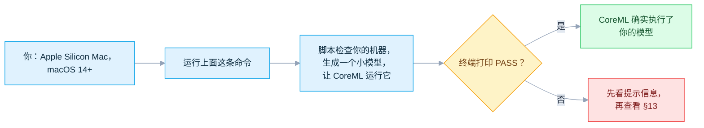

**最近一次核验：** `2026-07-17`，对照已发布的 [`v1.27.0`](https://github.com/microsoft/onnxruntime/tree/v1.27.0) 与源码 [`main@bf6aa006`](https://github.com/microsoft/onnxruntime/tree/bf6aa0063d1c178c4a4d33ed6770425834147e2a/onnxruntime/core/providers/coreml)。完整的版本与哈希核验见 [§14](#14-查阅源码)。

| 你的情况 | 从这里开始 |
|---|---|
| 手边有 Apple Silicon，想立刻验证 | [§5 运行严格验证](#5-运行严格验证) |
| 要发布 iPhone / iPad / macOS 应用 | [§11 部署到 Apple 原生应用](#11-部署到-apple-原生应用) |
| 想搞清楚"节点为什么落到了 CPU" | [§8 算子支持](#8-算子支持与分区) + [§13 按现象排查](#13-按现象排查) |
| 不在 Mac 上 | 只能*生成*模型；CoreML 只能在 Apple 硬件上执行 |

> [!IMPORTANT]
> **两种"CPU"，不要混淆。**
> - **ORT CPU 回退** —— CoreML *拒绝*了该节点，改由 ONNX Runtime 自己的 CPU 内核执行。严格验证**禁止**这种情况。
> - **Core ML 内部的 CPU** —— CoreML *接受*了该节点，但 Apple 的调度器选择了 CPU 设备。任何软件开关都**无法禁止**这种情况。

## 目录

- [1. 选择使用方式](#1-选择使用方式)
- [2. 建立正确的心智模型](#2-建立正确的心智模型)
- [3. 兼容性下限](#3-兼容性下限)
- [4. 模型格式与计算单元](#4-模型格式与计算单元)
- [5. 运行严格验证](#5-运行严格验证)
- [6. 正确理解 PASS](#6-正确理解-pass)
- [7. 配置 Provider](#7-配置-provider)
- [8. 算子支持与分区](#8-算子支持与分区)
- [9. 安全使用缓存](#9-安全使用缓存)
- [10. 验证自己的模型](#10-验证自己的模型)
- [11. 部署到 Apple 原生应用](#11-部署到-apple-原生应用)
- [12. 测量性能](#12-测量性能)
- [13. 按现象排查](#13-按现象排查)
- [14. 查阅源码](#14-查阅源码)

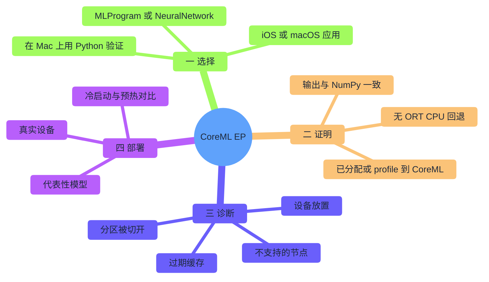

## 1. 选择使用方式

| 目标 | 方式 | 第一步 |
|---|---|---|
| 在 Mac 上用 Python 验证 CoreML | 当前 `onnxruntime` macOS wheel | `python3 Apple/one_click.py` |
| 发布 iPhone / iPad 应用 | `onnxruntime-c` 或 `onnxruntime-objc` CocoaPod | [§11](#11-部署到-apple-原生应用) |
| 发布 macOS 原生应用 | 匹配版本的 C/C++、Objective-C、C# 或 Java 构建 | [§7](#7-配置-provider) |
| 在 Apple 上用 React Native | `onnxruntime-react-native` | 单独验证软件包 + 设备 |
| 缩小应用体积 | 使用 `--use_coreml` + 精简算子配置自定义构建 | extended-minimal 或完整构建 |
| 在 Linux 上检查转换 | 使用 CoreML stub 的源码构建 | 仅能生成模型，无法运行 Core ML |

启动脚本会创建 `Apple/.venv-coreml`，安装指定版本依赖，生成本地 FP32 模型，按内容推导缓存 key，并运行一次严格的 CoreML 会话。**不下载模型，不安装驱动。**

## 2. 建立正确的心智模型

有两个系统在两个不同的时间点做决策，而你只需*证明*第一个。

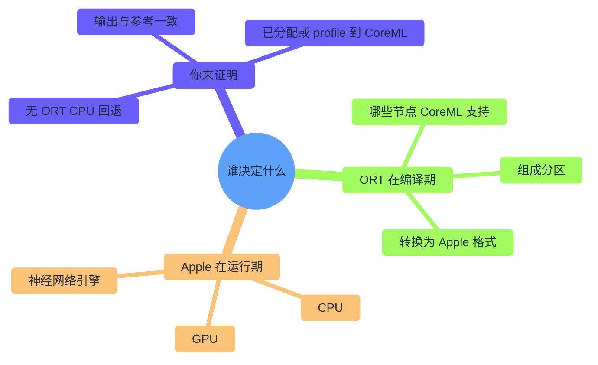

| 术语 | 通俗解释 | 为何重要 |
|---|---|---|
| Execution Provider（EP） | ONNX Runtime 的后端 | CoreML EP 把受支持的 ONNX 工作转换为 Apple 格式 |
| 分区 | 交给同一后端的一组相邻节点 | 分区越多 = 数据复制和 Core ML 调用越多 |
| 模型格式 | ORT 生成的 Core ML 表示 | `MLProgram` 与 `NeuralNetwork` 支持的算子不同 |
| 计算单元 | Apple *可以*选用的设备 | CPU+ANE 之类的策略**不**保证真的用到 ANE |

CoreML EP 是**编译型** Provider，而不是逐算子指定"在 GPU 上运行"的 API：

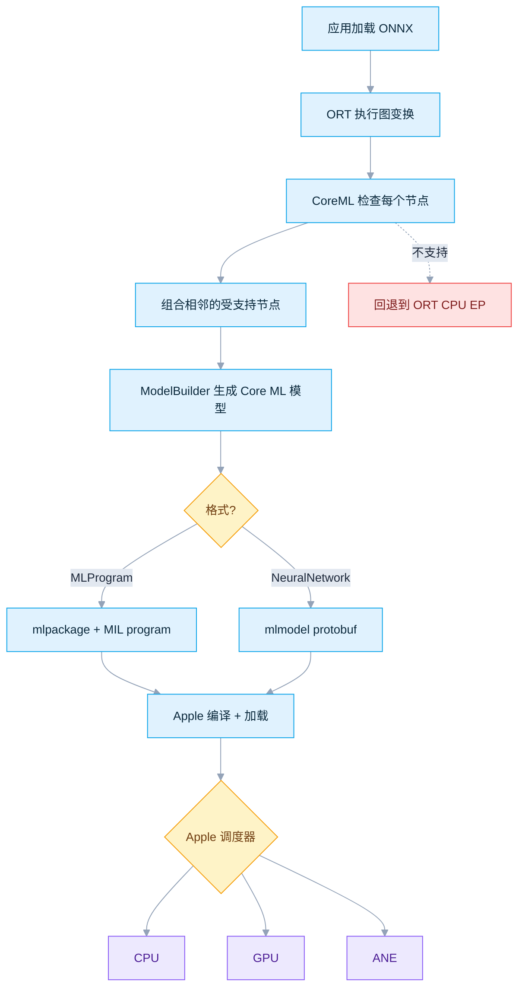

严格验证会拒绝路径 `N`。ORT 的 profile 只能看到 CoreML 分区的边界，**无法**仅凭自身区分 `K`/`L`/`M`。

## 3. 兼容性下限

不同软件层公布的最低版本并不相同。请以你实际部署的方式所对应的那一行为准。

| 软件层 | 已核验下限 | 含义 |
|---|---|---|
| CoreML EP 官方页面 | iOS 13 / macOS 10.15 | 页面保留的 Core ML 3 / NeuralNetwork 历史说明 |
| Provider 构造函数（v1.27 + `main`） | **Core ML 5：iOS 15 / macOS 12** | 源码真正的门槛：`MINIMUM_COREML_VERSION == 5` |
| MLProgram | Core ML 5：iOS 15 / macOS 12 | 该表示形式的最低版本 |
| `onnxruntime==1.27.0` wheel | macOS 14、arm64、CPython 3.11–3.14 | 本目录验证所需下限；**没有 Intel macOS 文件** |
| `MLComputePlan` | macOS 14.4 / iOS 17.4 + SDK header | 记录每个操作的首选设备 + 估算开销 |
| `FastPrediction` hint | Core ML 8：macOS 15 / iOS 18 + SDK header | 加载期的 specialization hint |

> [`host_utils.h`](https://github.com/microsoft/onnxruntime/blob/bf6aa0063d1c178c4a4d33ed6770425834147e2a/onnxruntime/core/providers/coreml/model/host_utils.h) 仍保留 Core ML 3 的注释，但 [`CoreMLExecutionProvider`](https://github.com/microsoft/onnxruntime/blob/bf6aa0063d1c178c4a4d33ed6770425834147e2a/onnxruntime/core/providers/coreml/coreml_execution_provider.cc) 会拒绝低于 Core ML 5 的运行时。**以构造函数为真正的门槛。**

**Python 主机检查：**

| 要求 | 预期 |
|---|---|
| 硬件 / 进程 | Apple Silicon `arm64`（非 Rosetta） |
| 系统 | macOS 14 或更新 |
| Python | 64 位、启用 GIL 的 CPython 3.11–3.14 |
| 首次运行 | 可访问 PyPI + 有空间存放 venv/缓存 |

```bash
uname -m                                   # arm64
sw_vers -productVersion                    # 14.x 或更新
python3 -c 'import platform,struct,sysconfig; print(platform.machine(), struct.calcsize("P")*8, sysconfig.get_config_var("Py_GIL_DISABLED"))'
# 预期：arm64 64 0  （最后一项也可能是 None）
```

## 4. 模型格式与计算单元

**格式** —— 选择 ORT 生成的 Core ML 表示：

| 格式 | 参数值 | 何时使用 | 源码限制 |
|---|---|---|---|
| MLProgram | `MLProgram` | 现代 Apple Silicon 上的默认；覆盖更广 + 支持 compute plan | 需 Core ML 5+；序列化为 model-package 目录 |
| NeuralNetwork | `NeuralNetwork` | 传统 lowering 路径或已验证的旧集成 | API 默认；仍需 Core ML 5；序列化为 protobuf |

> `NeuralNetwork` 是 **Provider** 默认值；本文有意默认使用 **`MLProgram`**。

**计算单元** —— Apple *可以*从中挑选的设备*集合*（从不保证）：

| CLI | 参数值 | Apple 可能使用 | 从不保证 |
|---|---|---|---|
| `all` | `ALL` | CPU、GPU、ANE | 一定选 GPU 或 ANE |
| `cpu` | `CPUOnly` | Core ML CPU | 硬件加速 |
| `cpu-gpu` | `CPUAndGPU` | CPU、GPU | 每个操作都在 GPU |
| `cpu-ane` | `CPUAndNeuralEngine` | CPU、ANE | 只用 ANE |

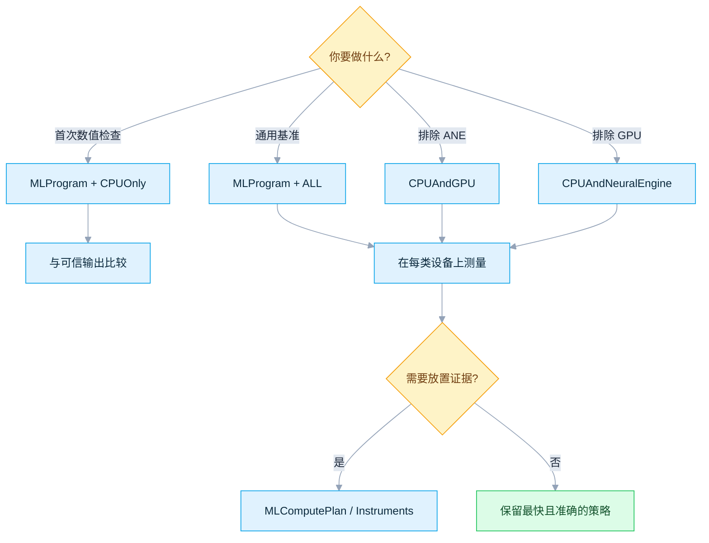

## 5. 运行严格验证

```bash
python3 Apple/one_click.py
```

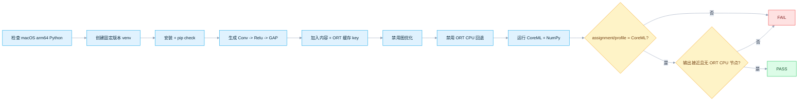

> **为什么用 Conv 模型？** `GetCapability()` 会丢弃*完全*由 trivial 算子组成的分区（`Identity`/`Reshape`/`Cast` 虽可转换，却因调度开销高于计算而仍留在 CPU）。`Conv` 能锚定一个真正 non-trivial 的分区。

| 目标 | 命令 |
|---|---|
| 默认严格验证 | `python3 Apple/one_click.py` |
| Core ML CPU 参考 | `python3 Apple/one_click.py --compute-units cpu` |
| 传统格式 | `python3 Apple/one_click.py --model-format neuralnetwork` |
| CPU + ANE 策略 | `python3 Apple/one_click.py --compute-units cpu-ane` |
| 设备放置日志 | `python3 Apple/one_click.py --profile-compute-plan` |
| 不持久化缓存 | `python3 Apple/one_click.py --no-cache` |
| 重建 venv | `python3 Apple/one_click.py --refresh` |

`--help` 会列出全部选项。少数选项需要额外条件：

| 选项 | 前提条件 |
|---|---|
| `--profile-compute-plan` | `MLProgram` 格式 + macOS 14.4+ |
| `--specialization fast-prediction` | macOS 15+ |
| `--allow-low-precision-gpu` | 支持 GPU 的 `--compute-units` 策略 |

## 6. 正确理解 PASS

| 信号 | 能证明 | **不能**证明 |
|---|---|---|
| 可用 Provider 列表含 CoreML | wheel 暴露了该 EP | 是否有节点被分配 |
| 严格会话创建成功 | 无需 ORT CPU 回退 | 由哪个 Apple 设备执行 |
| assignment/profile 出现 CoreML | ORT 调用了 CoreML 分区 | 是否只用 ANE 或只用 GPU |
| 无 ORT CPU profile 事件 | 没有 ORT CPU 节点被 profile 到 | Core ML 内部是否用了 CPU |
| 输出与 NumPy 一致 | 该图在容差内数值正确 | 你的生产模型是否准确 |
| 缓存文件存在 | 产物已持久化 | 加速是否具有统计意义 |

```text
PASS: CoreMLExecutionProvider executed the complete non-trivial partition with ONNX Runtime CPU EP fallback disabled.
```

使用 `--compute-units cpu` 时，本来就是 CoreML 在 CPU 上执行。其他策略下若要拿到真正的 CPU/GPU/ANE 证据，请用 `--profile-compute-plan` 或 Xcode Instruments。

## 7. 配置 Provider

```python
from pathlib import Path
import onnxruntime as ort

options = ort.SessionOptions()
options.graph_optimization_level = ort.GraphOptimizationLevel.ORT_DISABLE_ALL
options.enable_profiling = True
options.add_session_config_entry("session.disable_cpu_ep_fallback", "1")

# 源码（onnxruntime/core/providers/coreml/coreml_options.cc）定义的全部 CoreML
# Provider 选项，这里一次性列出，方便你直接复制这段代码，只需按需修改各项的值。
coreml_provider_options = {
    # ORT 生成的 Core ML 表示形式。
    #   "MLProgram"     -> 现代 MIL program（.mlpackage）；需要 Core ML 5+；
    #                      算子覆盖更广；是使用下面 ProfileComputePlan 的前提。
    #   "NeuralNetwork" -> 传统 protobuf layer 格式（.mlmodel）；省略该 key 时
    #                      这是 **Provider 自身**的默认值。
    "ModelFormat": "MLProgram",

    # Apple 调度器*可能*为本次会话选用的设备集合——从不是保证。
    #   "ALL"                 -> CPU、GPU、ANE（省略该 key 时的默认值）
    #   "CPUOnly"             -> 仅 Core ML 自身的 CPU 后端（适合做数值参考基准）
    #   "CPUAndGPU"           -> CPU + GPU，排除神经网络引擎
    #   "CPUAndNeuralEngine"  -> CPU + ANE，排除 GPU
    "MLComputeUnits": "ALL",

    # "1" 会拒绝输入 shape 是动态的候选节点（效果等同旧版
    # COREML_FLAG_ONLY_ALLOW_STATIC_INPUT_SHAPES 位标志）。"0" 是默认值，也
    # 允许动态 shape，但代价是更容易回退到 CPU。
    "RequireStaticInputShapes": "1",

    # "1" 会连 Loop/Scan/If 子图内部的节点也一并检查是否可转换给 CoreML。
    # "0" 是默认值；子图内的节点始终留在 ORT CPU 上执行。
    "EnableOnSubgraphs": "0",

    # Core ML 8（macOS 15 / iOS 18+）的加载期 specialization hint；更旧的
    # 系统/SDK 会忽略它。
    #   "Default"        -> 由 Core ML 自行选择策略（省略该 key 时的行为）
    #   "FastPrediction"  -> 为更低的首次预测延迟优化，可能增加加载耗时
    "SpecializationStrategy": "Default",

    # "1" 会记录每个算子被分配到的设备 + 预估开销。只有在 ModelFormat 为
    # "MLProgram" 时才会生效——CoreMLOptions::ProfileComputePlan() 会把这个
    # 开关和 CreateMLProgram() 做与运算，所以在 "NeuralNetwork" 下它会静默
    # 失效（不会报错）。"0" 是默认值。
    "ProfileComputePlan": "0",

    # "1" 允许 Core ML 在 GPU 上以更低精度累加 matmul/conv 的结果（对应设置
    # MLModelConfiguration.allowLowPrecisionAccumulationOnGPU）——用精度换
    # 吞吐量。"0" 是默认值（全精度累加）。
    "AllowLowPrecisionAccumulationOnGPU": "0",

    # 用于持久化保存转换后 CoreML 模型的目录，供下次复用。
    #   路径 -> 缓存 key 匹配时会被复用（key 的说明见 §9 中的 COREML_CACHE_KEY）
    #   ""   -> 省略该 key 时的默认值；写入临时目录，会话关闭后即删除
    "ModelCacheDirectory": str(Path(".coreml-cache").resolve()),
}

providers = [("CoreMLExecutionProvider", coreml_provider_options)]

session = ort.InferenceSession("model.onnx", sess_options=options, providers=providers)
outputs = session.run(None, {session.get_inputs()[0].name: input_array})
```

| 选项 | 可用值 | 源码默认 | 作用 |
|---|---|---|---|
| `ModelFormat` | `NeuralNetwork`、`MLProgram` | `NeuralNetwork` | protobuf layer 还是 MIL program lowering |
| `MLComputeUnits` | `ALL`、`CPUOnly`、`CPUAndGPU`、`CPUAndNeuralEngine` | `ALL` | Apple 可用的设备 |
| `RequireStaticInputShapes` | `0`、`1` | `0` | `1` 拒绝动态输入的候选节点 |
| `EnableOnSubgraphs` | `0`、`1` | `0` | 在 `Loop`/`Scan`/`If` 子图内检查 |
| `SpecializationStrategy` | `Default`、`FastPrediction` | 未设置（Core ML 默认） | 支持时设置 Core ML 8 optimization hint |
| `ProfileComputePlan` | `0`、`1` | `0` | 记录设备 + 开销，但只有 `ModelFormat=MLProgram` 时才生效——否则静默忽略（`CoreMLOptions::ProfileComputePlan()` 会把它和 `CreateMLProgram()` 做与运算） |
| `AllowLowPrecisionAccumulationOnGPU` | `0`、`1` | `0` | 设置对应的 `MLModelConfiguration` 属性 |
| `ModelCacheDirectory` | 空值或路径 | 空值 | 空 = 临时产物；路径 = 复用 |

> [!WARNING]
> 未知 key 和无效枚举字符串都会**抛错**。布尔选项只有值严格等于字符串 `"1"` 时才启用。

| 坑 | 应对方法 |
|---|---|
| 优化后的图可能产生仅 MLProgram 支持的 `FusedConv`；带残差输入 `Z` 的会被**拒绝** | 在生产环境中逐级测试每个优化级别，而不是只测 `ORT_DISABLE_ALL` |
| 有一条过期的 warning 把 specialization 门槛写成 macOS 14.4 / iOS 17.4 | 真正门槛是 **Core ML 8**（macOS 15 / iOS 18）——以代码为准，不要信 warning 文本 |

> [!NOTE]
> **还有一套更老的配置方式。**
> `coreml_provider_factory.h` 中还声明了一个 `COREMLFlags` 位标志 `enum`，由专用的 C API `OrtSessionOptionsAppendExecutionProvider_CoreML(options, coreml_flags)` 使用。它比上面这些字符串 key 选项出现得更早，无法表达 `SpecializationStrategy`、`ProfileComputePlan`、`AllowLowPrecisionAccumulationOnGPU` 或 `ModelCacheDirectory`。新集成请优先使用上面的选项字典——下表仅用于在现有 C/C++ 代码中识别这些旧版 flag。

| 旧版 flag | 位值 | 对应的现代选项 |
|---|---|---|
| `COREML_FLAG_USE_NONE` | `0x000` | 所有选项保持默认（`MLComputeUnits=ALL`、`ModelFormat=NeuralNetwork`） |
| `COREML_FLAG_USE_CPU_ONLY` | `0x001` | `MLComputeUnits=CPUOnly` |
| `COREML_FLAG_ENABLE_ON_SUBGRAPH` | `0x002` | `EnableOnSubgraphs=1` |
| `COREML_FLAG_ONLY_ENABLE_DEVICE_WITH_ANE` | `0x004` | `MLComputeUnits=CPUAndNeuralEngine` |
| `COREML_FLAG_ONLY_ALLOW_STATIC_INPUT_SHAPES` | `0x008` | `RequireStaticInputShapes=1` |
| `COREML_FLAG_CREATE_MLPROGRAM` | `0x010` | `ModelFormat=MLProgram` |
| `COREML_FLAG_USE_CPU_AND_GPU` | `0x020` | `MLComputeUnits=CPUAndGPU` |

## 8. 算子支持与分区

仅凭算子名称**不能**判断是否受支持——格式、opset、数据类型、rank、推断 shape、属性和常量输入都会参与投票。只有当某个节点真的被拒绝时才需要查下面这张表，否则请直接跳到 [§13](#13-按现象排查)。

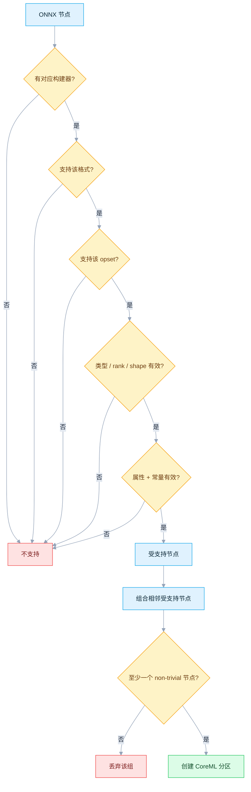

trivial 标记（只有分区中还有实际计算时才保留；全 trivial 的分组会被丢弃）：`Identity`、`Cast`、`Flatten`、`Reshape`、`Squeeze`、`Transpose`、`Tile`、`Ceil`。

**高风险算子检查（已核验构建器）：**

| 模式 | 实际限制 |
|---|---|
| 通用输入 | shape 必须已知；通用 rank 上限 5；`RequireStaticInputShapes=1` 拒绝动态输入 |
| `Conv` | 仅 1D/2D；bias 为常量；NeuralNetwork 还要求 weight 为常量；MLProgram 允许运行时 weight |
| `FusedConv` | 仅 MLProgram；FP32/FP16；需受支持的 activation；拒绝可选残差 `Z` |
| Pooling | rank 4 / 2D；拒绝 `storage_order=1`、非 `[1,1]` dilation、MaxPool indices；NeuralNetwork 拒绝 `ceil_mode=1` |
| `Gemm` | `B` 与可选 `C` 为常量；`transA=0`、`alpha=1`、`beta=1`；`C` shape 受限 |
| `MatMul` | NeuralNetwork：常量 `B`、2D 输入；MLProgram：运行时 `B`、N-D，但拒绝恰有一个 1D 输入 |
| `Reshape` | opset 5+；data shape 静态；shape 输入为非空常量；输出 rank ≤ 5 |
| `Slice` / `Split` | 控制输入通常为常量；空/零情况有额外检查 |
| `Resize` | rank、mode、坐标、axes、scale 有大量与格式相关的组合——请查构建器 |
| 动态空输入 | 编译期零维被拒绝；运行时解析为零元素也被拒绝 |

先用生成的支持表初筛，再到构建器 + verbose 日志中确认：
[NeuralNetwork 支持表](https://github.com/microsoft/onnxruntime/blob/bf6aa0063d1c178c4a4d33ed6770425834147e2a/tools/ci_build/github/apple/coreml_supported_neuralnetwork_ops.md) ·
[MLProgram 支持表](https://github.com/microsoft/onnxruntime/blob/bf6aa0063d1c178c4a4d33ed6770425834147e2a/tools/ci_build/github/apple/coreml_supported_mlprogram_ops.md) ·
[Builder 实现](https://github.com/microsoft/onnxruntime/tree/bf6aa0063d1c178c4a4d33ed6770425834147e2a/onnxruntime/core/providers/coreml/builders/impl)

## 9. 安全使用缓存

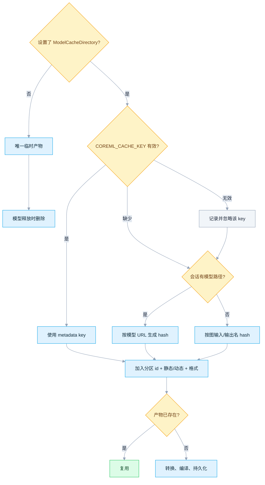

| 规则 | 做法 |
|---|---|
| 用户 key 优先 | 设置名称精确为 `COREML_CACHE_KEY` 的 metadata |
| Key 校验 | 1–64 个字母或数字；无效时回退到自动生成的标识 |
| 路径回退 ≠ 内容 hash | 在同一路径替换模型可能复用旧产物 |
| ORT 不会作废用户 key | 字节或 converter/runtime 版本变化时自行改 key |
| ORT 不会回收 | 自行删除过期的应用缓存 |
| 格式 + shape 已写入路径 | MLProgram/NeuralNetwork、静态/动态不共用产物 |

示例对图**加上**固定的 ORT 版本一起 hash（48 个十六进制字符），任一变化都会作废旧缓存。

```bash
find Apple/.coreml-cache -maxdepth 5 -print
python3 Apple/one_click.py --no-cache
rm -rf Apple/.coreml-cache   # 只删除本文示例的可丢弃缓存
```

> 单次会话创建耗时**不能**作为复用证据。请核对命名空间，并比较多次条件一致的运行。

## 10. 验证自己的模型

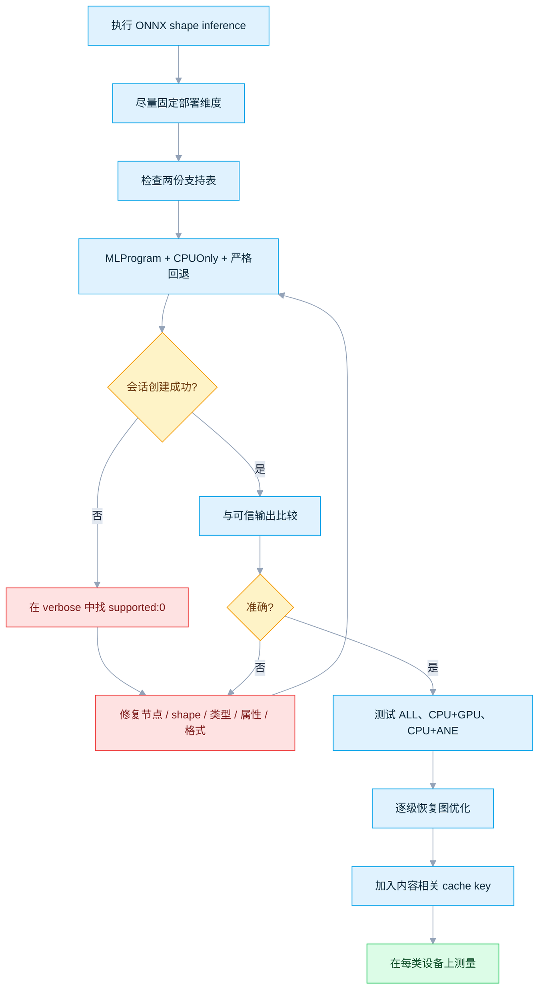

| 排查问题 | 首先检查 |
|---|---|
| 哪个节点被拒绝？ | verbose 的 `supported: 0` 行 + 对应构建器 |
| 图是否被切开？ | CoreML 分区数量 warning |
| 转换是否改变数值？ | 可信框架/CPU 输出，任务相关容差 |
| 优化是否改变支持？ | 比较 disabled/basic/extended/all 级别 |
| 产品设备上能用吗？ | 真实设备、代表性输入、不同温度状态 |

> mobile usability checker 会按生成的支持表估算分区。它**仅用于预检**，不会运行 Apple 的编译器或调度器。

## 11. 部署到 Apple 原生应用

| 目标 | 官方方式 | 注意事项 |
|---|---|---|
| iOS C/C++ | CocoaPod `onnxruntime-c` | 加入模型，显式启用 CoreML |
| iOS Objective-C | CocoaPod `onnxruntime-objc` | 优先用 V2 provider-options 字典 |
| React Native | `onnxruntime-react-native` | 单独验证 iOS 包 + 选项接口 |
| macOS 原生 | 匹配版本的 C/C++、Objective-C、C# 或 Java 构建 | header + library 保持同一 ORT release |
| 自定义 iOS/macOS | 使用 `--use_coreml` 源码构建 | deployment target 满足 Provider/格式下限 |

```ruby
use_frameworks!

# 二选一。
pod 'onnxruntime-c'
# pod 'onnxruntime-objc'
```

运行 `pod install`。**Python wheel 不是 iOS 软件包。** 自定义 runtime 需要加 `--use_coreml`：*basic* minimal build 会拒绝 CoreML，请改用完整构建或 `--minimal_build extended`。在 Apple 平台，Provider 会链接 Foundation + CoreML；非 Apple 平台只有 stub，无法执行预测。

| 规则 | 原因 |
|---|---|
| 在真实 iPhone/iPad 上测试 | 模拟器无法证明 ANE 行为 |
| 显式启用 CoreML | Provider 可用不代表模型会自动分配 |
| 软件包 + header + library 同一版本 | 避免 ABI/API 不匹配 |
| 模型或 ORT 更新后重测 | 构建器、分区、缓存、数值都可能变化 |

## 12. 测量性能

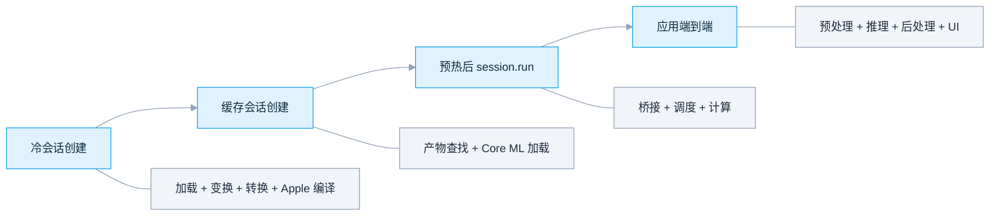

| 测量项 | 单独报告 | 常见噪声 |
|---|---|---|
| 冷启动创建 | 删缓存后首次启动 | 磁盘、编译、系统后台 |
| 缓存创建 | 确认产物后的重复加载 | 文件系统 + Core ML 系统缓存 |
| 预热后推理 | warmup 后的中位数 + 分布 | 调度、温度、数据复制 |
| 端到端 | 用户实际工作流 | 解码、前后处理、UI |

- 尽量合并成一个大分区，使用静态/有界 shape、代表性输入，并在真实设备上测。
- 同时比较 `ALL` 与受限策略在**延迟**和**能耗**两方面的表现。
- 把 `FastPrediction` 与低精度 GPU 累加当作实验：重新检查加载耗时与准确率。
- 冒烟模型只证明配置正确，**不是**性能基准。

## 13. 按现象排查

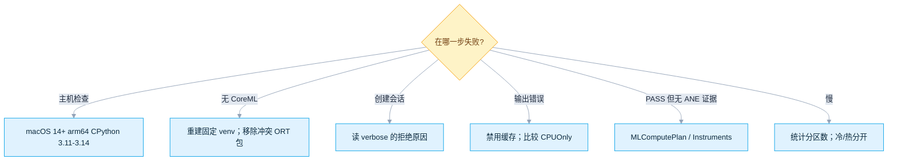

| 现象 | 可能原因 | 处理 |
|---|---|---|
| 脚本拒绝 Linux/Windows | 缺少 Core ML 框架 | 在 Mac 上运行 |
| 脚本拒绝 `x86_64` | Intel/Rosetta；ORT 1.27 无 Intel macOS wheel | 使用原生 Apple Silicon Python |
| 找不到匹配 wheel | OS/Python/架构/free-threaded 不对 | 对照主机检查 |
| 无 CoreML Provider | ORT 发行版错误或混装 | 使用隔离的固定 venv |
| 严格会话失败 | 不支持的节点或全 trivial 图 | 读 verbose；查构建器 |
| 出现多个分区 | 不支持的节点切开了受支持区域 | 找 `supported: 0`；减少跨界 |
| 优化后 NeuralNetwork 失败 | 优化器产生了仅 MLProgram 的 `FusedConv` | 降低优化或改用 MLProgram |
| PASS 但无 ANE 证据 | ORT 只能看到分区边界 | compute-plan 日志或 Instruments |
| warning 提到 14.4 | 文本过时；代码门槛是 Core ML 8 | 用 macOS 15+/iOS 18+ 或默认策略 |
| 替换模型后结果错误 | 用户管理的缓存标识过期 | 改 key 或清空缓存 |
| 动态输入变成空 | 运行时零元素保护 | 避免空张量或改走别的路径 |

## 14. 查阅源码

本文把下面每一层都固定了版本，让前面的每一条结论都可以核查：

| 核验依据 | 版本或环境 | 适用范围 |
|---|---|---|
| 可运行版本 | ONNX Runtime [`v1.27.0`](https://github.com/microsoft/onnxruntime/tree/v1.27.0) + [PyPI 文件](https://pypi.org/project/onnxruntime/1.27.0/) | 启动脚本 + 该版本已发布的 CoreML 行为 |
| 源码快照 | `main` @ [`bf6aa006`](https://github.com/microsoft/onnxruntime/tree/bf6aa0063d1c178c4a4d33ed6770425834147e2a/onnxruntime/core/providers/coreml) | 架构、构建器、配置项、测试 |
| 固定环境 | `onnxruntime==1.27.0`、`onnx==1.22.0`；NumPy `2.4.6`（3.11）/ `2.5.1`（3.12–3.14） | 可复现的桌面端环境 |
| 核验日期 | `2026-07-17` | 链接、软件包、源码、CLI |
| 硬件验证范围 | 源码/软件包已在 Linux 上检查；**未**实际运行 Core ML | CPU/GPU/ANE 的最终验证仍需 Apple 设备 |

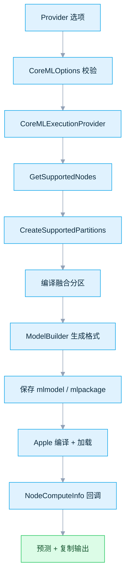

| 源码 | 涵盖内容 |
|---|---|
| [`coreml_provider_factory.h`](https://github.com/microsoft/onnxruntime/blob/bf6aa0063d1c178c4a4d33ed6770425834147e2a/include/onnxruntime/core/providers/coreml/coreml_provider_factory.h) | 公开 flag、选项名、缓存约定 |
| [`coreml_options.cc`](https://github.com/microsoft/onnxruntime/blob/bf6aa0063d1c178c4a4d33ed6770425834147e2a/onnxruntime/core/providers/coreml/coreml_options.cc) | 可用值 + 解析行为 |
| [`coreml_options.h`](https://github.com/microsoft/onnxruntime/blob/bf6aa0063d1c178c4a4d33ed6770425834147e2a/onnxruntime/core/providers/coreml/coreml_options.h) | 选项存储 + 访问器，含 `ProfileComputePlan` 的仅 MLProgram 与运算门控 |
| [`coreml_execution_provider.cc`](https://github.com/microsoft/onnxruntime/blob/bf6aa0063d1c178c4a4d33ed6770425834147e2a/onnxruntime/core/providers/coreml/coreml_execution_provider.cc) | 版本门槛、缓存 key、分区、回调 |
| [`helper.cc`](https://github.com/microsoft/onnxruntime/blob/bf6aa0063d1c178c4a4d33ed6770425834147e2a/onnxruntime/core/providers/coreml/builders/helper.cc) | 输入/rank/shape 检查 + ANE 检测 |
| [`op_builder_factory.cc`](https://github.com/microsoft/onnxruntime/blob/bf6aa0063d1c178c4a4d33ed6770425834147e2a/onnxruntime/core/providers/coreml/builders/op_builder_factory.cc) | 算子到构建器的注册表 |
| [`base_op_builder.cc`](https://github.com/microsoft/onnxruntime/blob/bf6aa0063d1c178c4a4d33ed6770425834147e2a/onnxruntime/core/providers/coreml/builders/impl/base_op_builder.cc) | 通用格式/opset/输入检查 |
| [`model_builder.cc`](https://github.com/microsoft/onnxruntime/blob/bf6aa0063d1c178c4a4d33ed6770425834147e2a/onnxruntime/core/providers/coreml/builders/model_builder.cc) | 转换、命名、序列化、缓存路径 |
| [`model.mm`](https://github.com/microsoft/onnxruntime/blob/bf6aa0063d1c178c4a4d33ed6770425834147e2a/onnxruntime/core/providers/coreml/model/model.mm) | 编译/加载、选项、profiling、预测 |
| [`host_utils.h`](https://github.com/microsoft/onnxruntime/blob/bf6aa0063d1c178c4a4d33ed6770425834147e2a/onnxruntime/core/providers/coreml/model/host_utils.h) | OS/Core ML 映射 + 最低版本 |
| [`onnxruntime_providers_coreml.cmake`](https://github.com/microsoft/onnxruntime/blob/bf6aa0063d1c178c4a4d33ed6770425834147e2a/cmake/onnxruntime_providers_coreml.cmake) | 框架、stub、minimal-build 规则 |
| [`py-macos.yml`](https://github.com/microsoft/onnxruntime/blob/bf6aa0063d1c178c4a4d33ed6770425834147e2a/tools/ci_build/github/azure-pipelines/templates/py-macos.yml) | wheel 使用 `--use_coreml`；deployment target 14 |
| [`coreml_basic_test.cc`](https://github.com/microsoft/onnxruntime/blob/bf6aa0063d1c178c4a4d33ed6770425834147e2a/onnxruntime/test/providers/coreml/coreml_basic_test.cc) | 格式、算子、分区、缓存测试 |
| [`dynamic_input_test.cc`](https://github.com/microsoft/onnxruntime/blob/bf6aa0063d1c178c4a4d33ed6770425834147e2a/onnxruntime/test/providers/coreml/dynamic_input_test.cc) | 动态 + 空输入测试 |
| [`ort_coreml_execution_provider.mm`](https://github.com/microsoft/onnxruntime/blob/bf6aa0063d1c178c4a4d33ed6770425834147e2a/objectivec/ort_coreml_execution_provider.mm) | Objective-C legacy + V2 桥接 |

**官方参考：**
[CoreML EP](https://onnxruntime.ai/docs/execution-providers/CoreML-ExecutionProvider.html) ·
[iOS 安装](https://onnxruntime.ai/docs/install/#install-on-ios) ·
[iOS 构建](https://onnxruntime.ai/docs/build/ios.html) ·
[Apple Core ML](https://developer.apple.com/documentation/coreml) ·
[MLComputePlan](https://developer.apple.com/documentation/coreml/mlcomputeplan) ·
[Specialization strategy](https://developer.apple.com/documentation/coreml/mloptimizationhints-swift.struct/specializationstrategy-swift.property)

> ONNX Runtime `main`、发布二进制、生成的支持表和 Apple SDK 行为各自独立演进。在验证生产版本前，请重新核对这四者。
