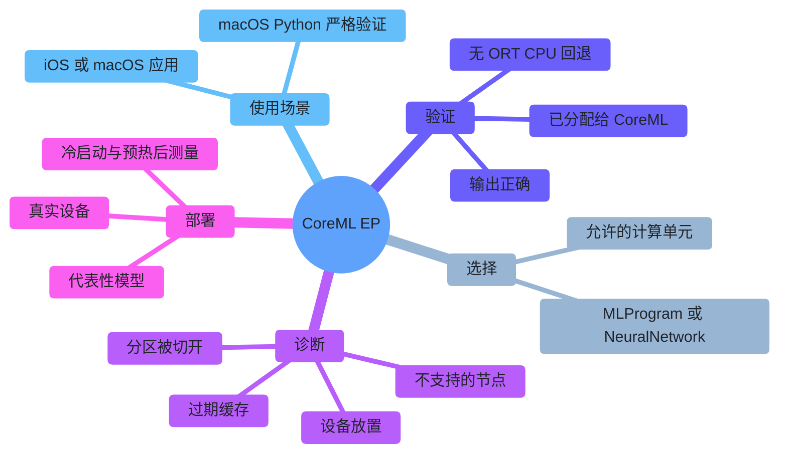
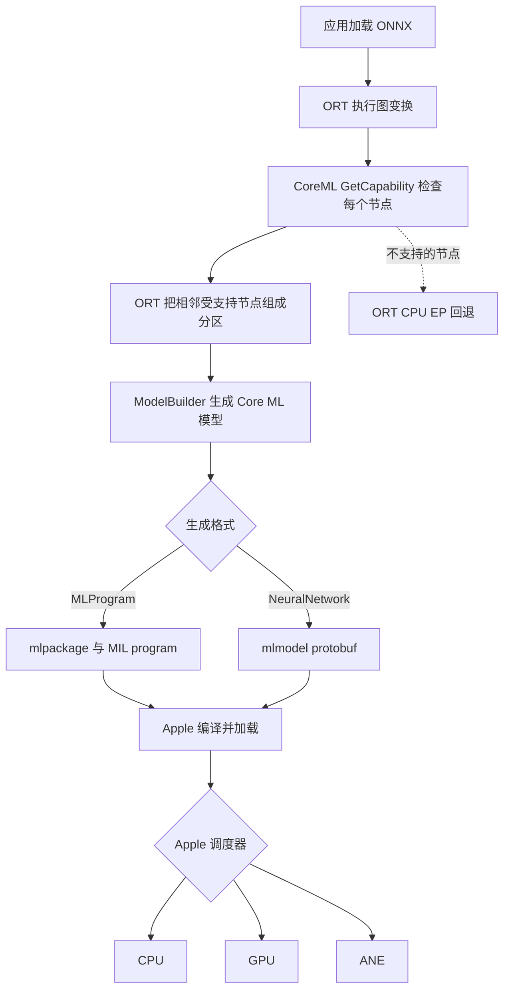
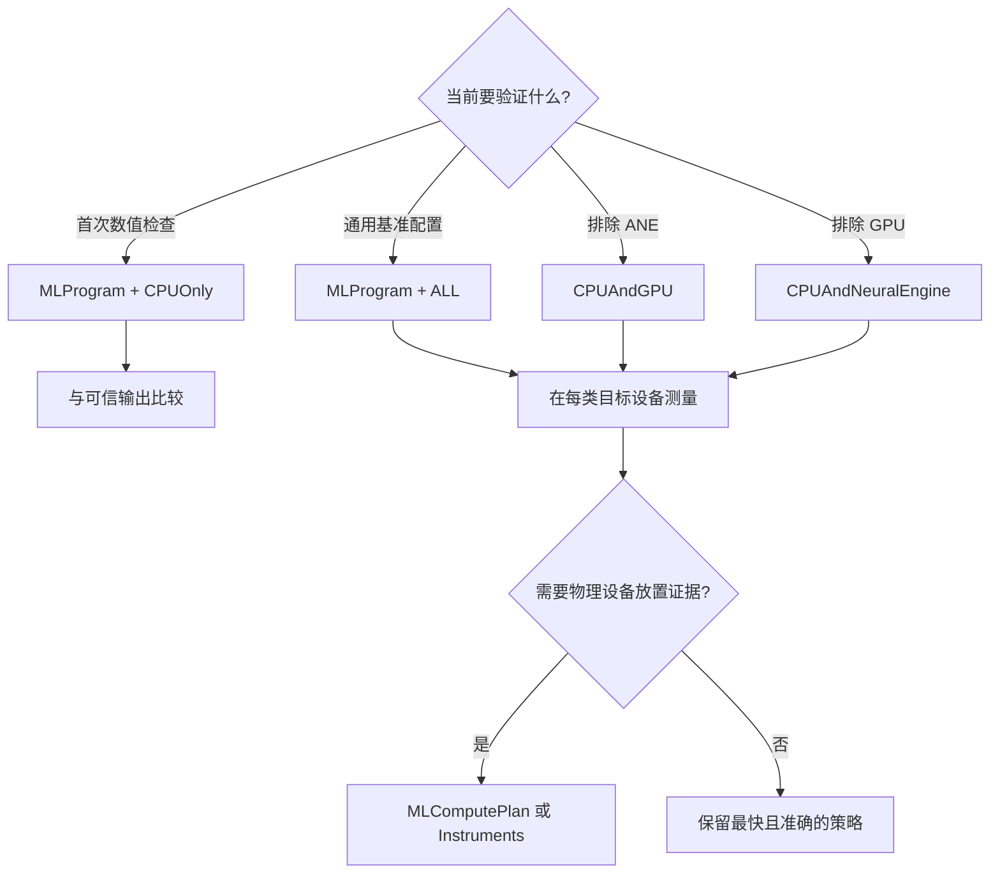
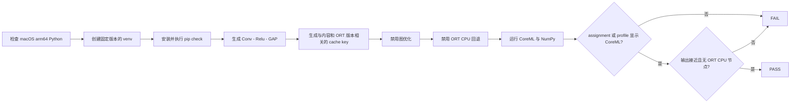
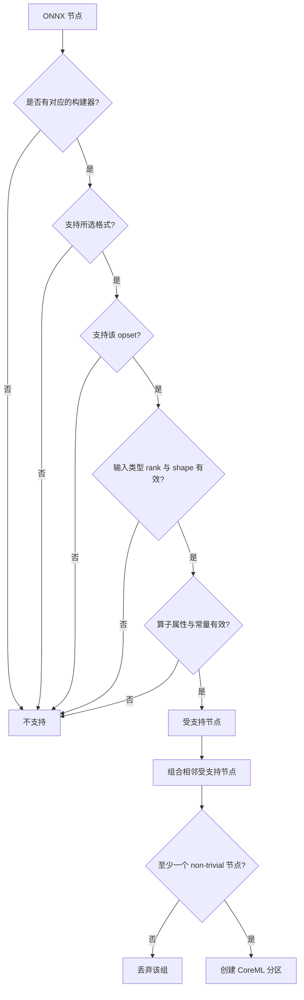
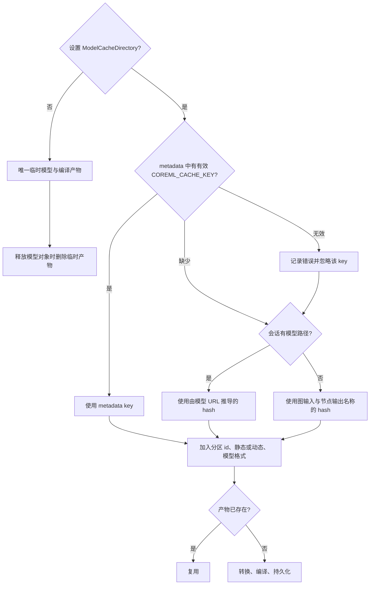
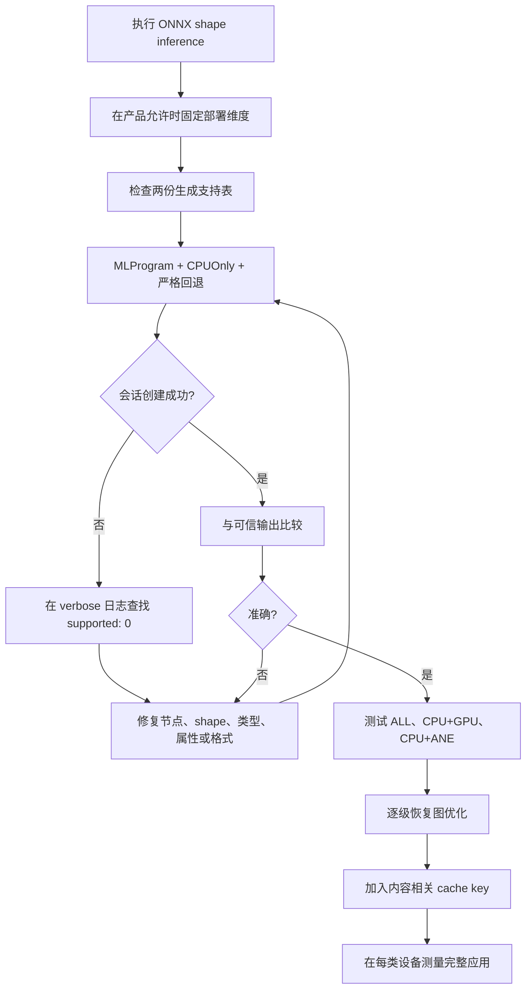
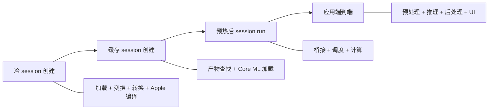
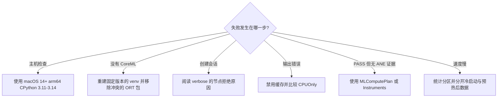
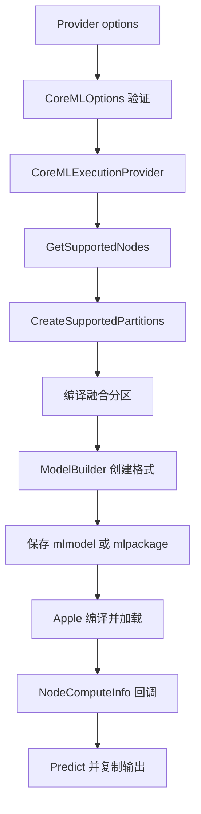

# ONNX Runtime + Apple CoreML：CPU、GPU 与神经网络引擎指南

[English](README.md) | [仓库首页](../README.zh-CN.md) | [一键严格验证脚本](one_click.py)

| 核验依据 | 版本或环境 | 适用范围 |
|---|---|---|
| 可运行版本 | ONNX Runtime [`v1.27.0`](https://github.com/microsoft/onnxruntime/tree/v1.27.0) 及其 [PyPI 文件](https://pypi.org/project/onnxruntime/1.27.0/) | Python 启动脚本和该版本已发布的 CoreML 行为 |
| 当前源码快照 | ONNX Runtime `main` 的 [`bf6aa0063d1c178c4a4d33ed6770425834147e2a`](https://github.com/microsoft/onnxruntime/tree/bf6aa0063d1c178c4a4d33ed6770425834147e2a/onnxruntime/core/providers/coreml) | 当前架构、构建器、配置项和测试 |
| 固定的 Python 环境 | `onnxruntime==1.27.0`、`onnx==1.22.0`；Python 3.11 使用 NumPy `2.4.6`，Python 3.12-3.14 使用 `2.5.1` | 可重复搭建的桌面端环境 |
| 核验日期 | `2026-07-17` | 链接、软件包、源码、启动脚本语法和 CLI |
| 硬件验证范围 | 源码和软件包已在 Linux 上检查，但没有实际运行 Core ML | CPU/GPU/ANE 的最终验证仍需在目标 Apple 设备上完成 |

> [!IMPORTANT]
> 务必区分两种使用 CPU 的情况。**回退到 ORT CPU EP**，表示不受支持的节点没有进入 CoreML，而是交给 ORT CPU EP 执行；**Core ML 内部使用 CPU**，则表示 CoreML 已接收该分区，只是 Apple 调度器最终选择了 CPU。严格验证可以禁止第一种情况，却无法禁止第二种情况。

## 目录

- [ONNX Runtime + Apple CoreML：CPU、GPU 与神经网络引擎指南](#onnx-runtime--apple-coremlcpugpu-与神经网络引擎指南)
  - [目录](#目录)
  - [1. 先选择合适的使用方式](#1-先选择合适的使用方式)
  - [2. 了解四个核心概念](#2-了解四个核心概念)
  - [3. 核对兼容性](#3-核对兼容性)
    - [Python 主机检查](#python-主机检查)
  - [4. 选择模型格式与计算单元](#4-选择模型格式与计算单元)
    - [模型格式](#模型格式)
    - [计算单元](#计算单元)
  - [5. 在 macOS 上运行严格验证](#5-在-macos-上运行严格验证)
  - [6. 如何理解 PASS 结果](#6-如何理解-pass-结果)
  - [7. 配置 Provider](#7-配置-provider)
    - [严格 Python 模式](#严格-python-模式)
    - [完整选项表](#完整选项表)
  - [8. 了解分区与算子支持](#8-了解分区与算子支持)
    - [高风险算子检查](#高风险算子检查)
  - [9. 安全使用缓存](#9-安全使用缓存)
  - [10. 验证自己的模型](#10-验证自己的模型)
  - [11. 集成 Apple 原生应用](#11-集成-apple-原生应用)
  - [12. 测量性能](#12-测量性能)
  - [13. 根据现象排查问题](#13-根据现象排查问题)
  - [14. 查阅官方源码](#14-查阅官方源码)
    - [官方参考资料](#官方参考资料)



## 1. 先选择合适的使用方式

| 目标 | 建议方式 | 第一步 |
|---|---|---|
| 在 Mac 上用 Python 验证 CoreML | 当前 `onnxruntime` macOS wheel | `python3 Apple/one_click.py` |
| 发布 iPhone/iPad 应用 | `onnxruntime-c` 或 `onnxruntime-objc` CocoaPod | 阅读[第 11 节](#11-集成-apple-原生应用) |
| 发布 macOS 原生应用 | 匹配版本的 C/C++、Objective-C、C# 或 Java 包/构建 | 使用[第 7 节](#7-配置-provider)的通用选项 |
| 在 Apple 设备上使用 React Native | `onnxruntime-react-native` | 单独验证 iOS 软件包和目标设备 |
| 缩小应用体积 | 使用 `--use_coreml` 和精简算子配置自定义构建 | 使用 extended minimal 或完整构建 |
| 在 Linux 上检查模型转换 | 使用 CoreML stub 的源码构建 | 只能生成模型；Linux 无法运行 Apple Core ML |

桌面端最快的验证方式：

```bash
python3 Apple/one_click.py
```

启动脚本会创建 `Apple/.venv-coreml`，安装指定版本的依赖，生成本地 FP32 模型，根据内容生成缓存 key，然后运行严格的 CoreML 会话。整个过程不会下载模型，也不会安装驱动。

## 2. 了解四个核心概念

| 术语 | 简单解释 | 重要性 |
|---|---|---|
| Execution Provider (EP) | ONNX Runtime 的后端 | CoreML EP 把受支持的 ONNX 工作转换为 Apple 格式 |
| 分区 | 分配给同一后端的一组相邻 ONNX 节点 | 分区越多，数据复制和 Core ML 调用通常越多 |
| 模型格式 | ORT 生成的 Core ML 表示 | `MLProgram` 与 `NeuralNetwork` 的支持范围不同 |
| 计算单元 | Apple 调度器可以使用的设备范围 | CPU+ANE 等策略只限制可选设备，并不保证实际使用 ANE |

CoreML EP 属于编译型 Provider，并不是一个让应用逐个算子指定 GPU 或 ANE 的公开 API：



严格验证会拒绝图中的 `N` 分支。ORT profile 只能看到 CoreML 分区的边界，无法仅凭自身判断实际执行设备是 `K`、`L` 还是 `M`。

## 3. 核对兼容性

不同软件层给出的最低版本并不相同。部署时，应以实际使用方式对应的要求为准。

| 软件层 | 已核验的最低版本 | 说明 |
|---|---|---|
| CoreML EP 官方页面 | iOS 13 / macOS 10.15 | 页面中保留的 Core ML 3 与 NeuralNetwork 历史说明 |
| 当前源码和 v1.27 Provider 构造函数 | Core ML 5：iOS 15 / macOS 12 | 源码实际采用的运行时最低版本：`MINIMUM_COREML_VERSION == 5` |
| MLProgram | Core ML 5：iOS 15 / macOS 12 | 使用这种模型表示形式所需的最低版本 |
| `onnxruntime==1.27.0` PyPI wheel | macOS 14、arm64、CPython 3.11-3.14 | 本目录 Python 验证所需的最低环境；PyPI 未提供 Intel macOS 文件 |
| `MLComputePlan` | macOS 14.4 / iOS 17.4，且构建 SDK 包含相应 header | 可记录每个操作的首选设备和估算开销 |
| `FastPrediction` hint | Core ML 8：macOS 15 / iOS 18，且构建 SDK 支持 | 加载已编译模型时使用 specialization hint |

[`host_utils.h`](https://github.com/microsoft/onnxruntime/blob/bf6aa0063d1c178c4a4d33ed6770425834147e2a/onnxruntime/core/providers/coreml/model/host_utils.h) 仍保留 Core ML 3 的历史 helper 注释，但 [`CoreMLExecutionProvider`](https://github.com/microsoft/onnxruntime/blob/bf6aa0063d1c178c4a4d33ed6770425834147e2a/onnxruntime/core/providers/coreml/coreml_execution_provider.cc) 会拒绝低于 Core ML 5 的运行时。实际部署应以构造函数中的最低版本检查为准。

### Python 主机检查

| 要求 | 预期 |
|---|---|
| 硬件和进程架构 | Apple Silicon `arm64`，不能通过 Rosetta 运行 |
| 系统 | macOS 14 或更新版本 |
| Python | 64 位、启用 GIL 的 CPython 3.11-3.14 |
| 首次运行 | 能够访问 PyPI，并有足够空间存放虚拟环境和缓存 |

```bash
uname -m
sw_vers -productVersion
python3 -c 'import platform,struct,sysconfig; print(platform.machine(), struct.calcsize("P")*8, sysconfig.get_config_var("Py_GIL_DISABLED"))'
```

关键输出应分别为 `arm64`、`64`，且 `Py_GIL_DISABLED` 的值为 `0` 或 `None`。

## 4. 选择模型格式与计算单元

### 模型格式

| 格式 | Provider 参数值 | 适用场景 | 源码限制 |
|---|---|---|---|
| MLProgram | `MLProgram` | 当前 Apple Silicon 上建议优先尝试；构建器支持范围更广，并支持 compute plan | 需要 Core ML 5+；序列化为 model-package 目录 |
| NeuralNetwork | `NeuralNetwork` | 验证传统 lowering 方式，或兼容已有的旧版集成 | API 默认值；当前 Provider 构造函数仍要求 Core ML 5；序列化为 NeuralNetwork model protobuf |

Provider 默认生成 `NeuralNetwork`；本文的示例则有意选择 `MLProgram` 作为默认格式。

### 计算单元

| CLI | Provider 参数值 | Apple 可以使用 | 无法保证 |
|---|---|---|---|
| `all` | `ALL` | CPU、GPU、ANE | 一定选择 GPU 或 ANE |
| `cpu` | `CPUOnly` | Core ML CPU | 硬件加速 |
| `cpu-gpu` | `CPUAndGPU` | CPU、GPU | 每个操作都在 GPU |
| `cpu-ane` | `CPUAndNeuralEngine` | CPU、ANE | 只使用 ANE |



## 5. 在 macOS 上运行严格验证

从仓库根目录执行：

```bash
python3 Apple/one_click.py
```



为什么选择 Conv？当前的 `GetCapability()` 会丢弃完全由 trivial 操作组成的分区。即使 `Identity`、`Reshape` 或 `Cast` 链可以转换，ORT 也可能认为调度开销高于计算开销，从而仍将它们留在 CPU 上。Conv 提供了足够的实际计算量，可以让分区被视为 non-trivial。

| 目标 | 命令 |
|---|---|
| 默认严格验证 | `python3 Apple/one_click.py` |
| Core ML CPU 参考 | `python3 Apple/one_click.py --compute-units cpu` |
| 传统格式 | `python3 Apple/one_click.py --model-format neuralnetwork` |
| CPU + ANE 策略 | `python3 Apple/one_click.py --compute-units cpu-ane` |
| 设备放置日志 | `python3 Apple/one_click.py --profile-compute-plan` |
| 不持久化缓存 | `python3 Apple/one_click.py --no-cache` |
| 重建 venv | `python3 Apple/one_click.py --refresh` |

使用 `--help` 可以查看全部选项。若启用 compute-plan profiling，必须使用 MLProgram 和 macOS 14.4+；`fast-prediction` 要求 macOS 15+；低精度 GPU 累加则要求所选计算单元包含 GPU。

## 6. 如何理解 PASS 结果

| 信号 | 可以确认 | 无法确认 |
|---|---|---|
| 可用 Provider 列表中包含 CoreML | 该 wheel 对外提供了 CoreML EP | 当前模型的节点是否已分配给它 |
| 严格会话创建成功 | 冒烟测试图不需要回退到 ORT CPU EP | Apple 最终选择了哪个计算设备 |
| assignment 或 profile 中出现 CoreML | ORT 调用了 CoreML 分区 | 是否只使用 ANE 或 GPU |
| 没有 ORT CPU profile 事件 | profile 中没有记录到 ORT CPU 节点 | Core ML 内部是否使用了 CPU |
| 输出与 NumPy 一致 | 该测试图的结果在容差范围内正确 | 生产模型的准确率是否合格 |
| 缓存目录中出现产物 | 转换或编译产物已写入磁盘 | 缓存是否带来了具有统计意义的性能提升 |

预期最终行：

```text
PASS: CoreMLExecutionProvider executed the complete non-trivial partition with ONNX Runtime CPU EP fallback disabled.
```

使用 `--compute-units cpu` 时，CoreML 本来就会在 CPU 上执行。对于其他计算单元策略，如果需要确认实际使用的是 CPU、GPU 还是 ANE，请使用 `--profile-compute-plan` 或 Xcode Instruments。

## 7. 配置 Provider

### 严格 Python 模式

```python
from pathlib import Path

import onnxruntime as ort

options = ort.SessionOptions()
options.graph_optimization_level = ort.GraphOptimizationLevel.ORT_DISABLE_ALL
options.enable_profiling = True
options.add_session_config_entry("session.disable_cpu_ep_fallback", "1")

providers = [
    (
        "CoreMLExecutionProvider",
        {
            "ModelFormat": "MLProgram",
            "MLComputeUnits": "ALL",
            "RequireStaticInputShapes": "1",
            "EnableOnSubgraphs": "0",
            "ModelCacheDirectory": str(Path(".coreml-cache").resolve()),
        },
    )
]

session = ort.InferenceSession("model.onnx", sess_options=options, providers=providers)
outputs = session.run(None, {session.get_inputs()[0].name: input_array})
```

### 完整选项表

| 选项 | 可用值 | 源码默认值 | 作用 |
|---|---|---|---|
| `ModelFormat` | `NeuralNetwork`、`MLProgram` | `NeuralNetwork` | 选择使用 protobuf layer 还是 MIL program 进行 lowering |
| `MLComputeUnits` | `ALL`、`CPUOnly`、`CPUAndGPU`、`CPUAndNeuralEngine` | `ALL` | 限制 Apple 调度器可以使用的设备 |
| `RequireStaticInputShapes` | 文档值 `0`、`1` | `0` | `1` 会拒绝动态输入的候选节点 |
| `EnableOnSubgraphs` | 文档值 `0`、`1` | `0` | 在 `Loop`、`Scan` 或 `If` 的子图中启用支持检查 |
| `SpecializationStrategy` | `Default`、`FastPrediction` | 未设置，即 Core ML 默认 | 运行时与构建 SDK 支持时设置 Core ML 8 optimization hint |
| `ProfileComputePlan` | 文档值 `0`、`1` | `0` | 仅适用于 MLProgram；在兼容的 SDK/OS 上记录首选设备和估算开销 |
| `AllowLowPrecisionAccumulationOnGPU` | 文档值 `0`、`1` | `0` | 设置对应 `MLModelConfiguration` 属性 |
| `ModelCacheDirectory` | 空值或路径 | 空值 | 留空时使用临时产物；指定路径后可以复用产物 |

未知 key 或无效的枚举字符串都会引发错误。布尔选项只有在值严格等于字符串 `"1"` 时才会启用；请只使用文档规定的 `0` 或 `1`。

示例会禁用图优化，以便 `Conv -> Relu` 在两种模型格式下都保持一致。生产代码需要逐一测试各个优化级别：优化后的计算图可能包含仅 MLProgram 支持的 `FusedConv`；如果 `FusedConv` 带有残差输入 `Z`，CoreML EP 会拒绝该节点。

v1.27 和当前源码中有一条已经过时的诊断信息：specialization 实际要求 Core ML 8（macOS 15/iOS 18），但 fallback warning 却写成 macOS 14.4/iOS 17.4。后一个版本要求属于 `MLComputePlan`。遇到这条提示时，应以代码中的版本检查为准，而不是 warning 文本。

## 8. 了解分区与算子支持

仅凭算子名称无法判断 CoreML EP 是否支持该节点。模型格式、opset、数据类型、rank、推断出的 shape、算子属性和常量输入都会影响最终判断。



是否属于 trivial 操作由各个构建器标记。目前的例子包括 `Identity`、`Cast`、`Flatten`、`Reshape`、`Squeeze`、`Transpose`、`Tile` 和 `Ceil`。如果分区中还有实际计算，trivial 节点可以保留在其中；如果整个分组都由 trivial 节点组成，则会被丢弃。

### 高风险算子检查

| 模式 | 已核验构建器中的实际限制 |
|---|---|
| 通用输入 | shape 必须已知；通用 rank 上限为 5；`RequireStaticInputShapes=1` 拒绝动态输入 |
| `Conv` | 仅 1D/2D；bias 必须为常量；NeuralNetwork 还要求 weight 为常量；MLProgram 允许运行时 weight |
| `FusedConv` | 仅支持 MLProgram；数据类型为 FP32/FP16；必须使用受支持的 activation；不接受可选残差输入 `Z` |
| Pooling | rank 4 / 2D；拒绝 `storage_order=1`、非 `[1,1]` dilation 和 MaxPool indices 输出；NeuralNetwork 拒绝 `ceil_mode=1` |
| `Gemm` | `B` 和可选 `C` 必须为常量；`transA=0`、`alpha=1`、`beta=1`；`C` shape 受限 |
| `MatMul` | NeuralNetwork 要求常量 `B` 和 2D 输入；MLProgram 允许运行时 `B` 与 N-D 输入，但拒绝恰有一个输入为 1D 的情况 |
| `Reshape` | opset 5+；data shape 必须静态；shape 输入必须是非空常量；输出 rank 不超过 5 |
| `Slice` / `Split` | 控制输入通常必须为常量；空值/零值还有额外检查 |
| `Resize` | rank、mode、坐标规则、nearest mode、axes 以及常量 scales/sizes 有大量与模型格式相关的组合限制；应查看对应构建器 |
| 动态空输入 | 编译时零维通常会被拒绝；动态输入在运行时解析为零元素也会被拒绝 |

可以先用自动生成的支持表初步筛选，再结合对应构建器和详细日志作出最终判断：

- [NeuralNetwork 支持表](https://github.com/microsoft/onnxruntime/blob/bf6aa0063d1c178c4a4d33ed6770425834147e2a/tools/ci_build/github/apple/coreml_supported_neuralnetwork_ops.md)
- [MLProgram 支持表](https://github.com/microsoft/onnxruntime/blob/bf6aa0063d1c178c4a4d33ed6770425834147e2a/tools/ci_build/github/apple/coreml_supported_mlprogram_ops.md)
- [Builder 实现](https://github.com/microsoft/onnxruntime/tree/bf6aa0063d1c178c4a4d33ed6770425834147e2a/onnxruntime/core/providers/coreml/builders/impl)

## 9. 安全使用缓存



| 规则 | 建议做法 |
|---|---|
| 用户 key 优先 | 设置名称精确为 `COREML_CACHE_KEY` 的 metadata |
| Key 校验 | 使用 1-64 个字母或数字；metadata 无效时，ORT 会改用自动生成的标识 |
| 根据路径生成的备用 key 不是内容 hash | 如果在同一路径替换模型，可能会错误复用旧产物 |
| ORT 不会自动更新用户 key | 模型内容或 converter/runtime 版本发生变化时，必须修改 key |
| ORT 不自动回收 | 主动删除应用不再需要的缓存条目 |
| 模型格式与 shape 策略会写入产物路径 | MLProgram 与 NeuralNetwork、static 与 dynamic 不会共用同一份产物 |

示例会同时对生成的计算图和固定的 ORT 版本计算 hash，并保留 48 个十六进制字符。两者中的任何一个发生变化，都会生成新的缓存标识，避免误用旧缓存。

```bash
find Apple/.coreml-cache -maxdepth 5 -print
python3 Apple/one_click.py --no-cache
rm -rf Apple/.coreml-cache  # 只删除本文示例生成的可丢弃缓存
```

不能只凭一次会话创建耗时就断定缓存已被复用。应先核对缓存命名空间，再比较多次条件一致的运行结果。

## 10. 验证自己的模型



| 要排查的问题 | 首先检查 |
|---|---|
| 哪个节点被拒绝？ | 详细日志中的 `supported: 0` 行，以及对应的构建器 |
| 图是否被切开？ | CoreML 分区数量 warning |
| 转换是否改变数值？ | 使用任务相关容差比较可信框架/CPU 输出 |
| 图优化是否改变支持？ | 比较 disabled/basic/extended/all 优化级别 |
| 产品设备是否可用？ | 真实设备、代表性输入与不同温度状态测试 |

mobile usability checker 会根据自动生成的支持表估算分区情况。它只能用于预检，并不会真正运行 Apple 编译器或调度器。

## 11. 集成 Apple 原生应用

| 目标 | 官方方式 | 注意事项 |
|---|---|---|
| iOS C/C++ | CocoaPod `onnxruntime-c` | 加入模型，并显式启用 CoreML |
| iOS Objective-C | CocoaPod `onnxruntime-objc` | 优先使用 V2 Provider-options 字典 |
| React Native | `onnxruntime-react-native` | 单独验证 iOS 包和选项接口 |
| macOS 原生 | 匹配版本的 C/C++、Objective-C、C# 或 Java 软件包/构建 | header 与 native library 必须来自同一 ORT release |
| 自定义 iOS/macOS | 使用 `--use_coreml` 从源码构建 | deployment target 必须满足 Provider 和模型格式的最低版本要求 |

```ruby
use_frameworks!

# 根据 API 二选一。
pod 'onnxruntime-c'
# pod 'onnxruntime-objc'
```

然后运行 `pod install`。Python wheel 不能用于部署 iOS 应用。

如需自定义 runtime，请在官方 Apple 构建命令中加入 `--use_coreml`。CoreML 不支持 basic minimal build，因此需要使用完整构建或 `--minimal_build extended`。在 Apple 平台构建时会链接 Foundation 和 CoreML；在非 Apple 平台从源码构建时只会使用 host/model stub，无法执行 prediction。

验证规则：

| 规则 | 原因 |
|---|---|
| 在真实 iPhone/iPad 上测试 | 模拟器无法确认 ANE 的实际行为 |
| 显式启用 CoreML | Provider 可用并不代表模型会自动分配给它 |
| 软件包、header 和 library 使用同一版本 | 避免 ABI/API 不匹配 |
| 模型或 ORT 更新后重新验证 | 构建器、分区、缓存和数值结果都可能发生变化 |

## 12. 测量性能



| 测量项 | 单独报告 | 常见噪声 |
|---|---|---|
| 冷启动创建会话 | 删除缓存后的首次启动 | 磁盘读写、编译、系统后台任务 |
| 使用缓存创建会话 | 确认已有产物后的重复加载 | 文件系统和 Core ML 系统缓存 |
| 预热后推理 | warmup 后的中位数和分布 | 调度、设备温度、数据复制 |
| 端到端 | 用户实际工作流 | 解码、预处理、后处理、UI |

应尽量让模型形成一个较大的分区；在条件允许时使用静态或有界 shape；并在真实设备上选用有代表性的输入。比较 `ALL` 与受限计算单元策略时，应同时记录延迟和能耗。`FastPrediction` 与低精度 GPU 累加都应视为试验性选项，测试时还要检查加载时间和准确率变化。冒烟测试模型只能验证配置，不能充当性能基准。

## 13. 根据现象排查问题



| 现象 | 可能原因 | 解决方法 |
|---|---|---|
| 启动脚本拒绝 Linux/Windows | 系统中没有 Apple Core ML framework | 在目标 Mac 上运行验证 |
| 启动脚本拒绝 `x86_64` | 当前是 Intel/Rosetta 进程；ORT 1.27 没有 Intel macOS wheel | 使用原生 Apple Silicon Python |
| 没有匹配 wheel | OS、Python、架构或 free-threaded 构建不匹配 | 对照 Python 主机检查表 |
| CoreML Provider 不存在 | 安装了错误的 ORT 发行包，或多个 ORT 包相互冲突 | 使用隔离且固定版本的 venv |
| 严格会话失败 | 存在不受支持的节点，或图中全部是 trivial 操作 | 查看详细日志和对应的构建器 |
| 出现多个分区 | 不受支持的节点把可支持区域切开 | 查找 `supported: 0`，尽量减少分区之间的数据传递 |
| NeuralNetwork 在优化后失败 | 优化器生成仅 MLProgram 支持的 `FusedConv` | 降低优化级别或改用 MLProgram，再验证 |
| PASS 但无 ANE 证据 | ORT 只能看到 CoreML 分区边界 | 查看 compute plan 的 `NSLog` 日志或使用 Instruments |
| Fast specialization warning 提到 14.4 | warning 文本已过时；代码实际检查的是 Core ML 8 | 使用 macOS 15+/iOS 18+，或改用默认策略 |
| 替换模型后结果错误 | 用户管理的缓存身份过期 | 修改 key 或清理应用缓存 |
| 动态输入变为空 | 触发了运行时的零元素保护 | 避免传入空 tensor，或为这种情况采用其他处理流程 |

## 14. 查阅官方源码



| 官方源码 | 可以核对的内容 |
|---|---|
| [`coreml_provider_factory.h`](https://github.com/microsoft/onnxruntime/blob/bf6aa0063d1c178c4a4d33ed6770425834147e2a/include/onnxruntime/core/providers/coreml/coreml_provider_factory.h) | 公开 flags、选项名称和缓存约定 |
| [`coreml_options.cc`](https://github.com/microsoft/onnxruntime/blob/bf6aa0063d1c178c4a4d33ed6770425834147e2a/onnxruntime/core/providers/coreml/coreml_options.cc) | 接受值与解析行为 |
| [`coreml_execution_provider.cc`](https://github.com/microsoft/onnxruntime/blob/bf6aa0063d1c178c4a4d33ed6770425834147e2a/onnxruntime/core/providers/coreml/coreml_execution_provider.cc) | 最低版本检查、cache key、分区和回调 |
| [`helper.cc`](https://github.com/microsoft/onnxruntime/blob/bf6aa0063d1c178c4a4d33ed6770425834147e2a/onnxruntime/core/providers/coreml/builders/helper.cc) | 输入/rank/shape 检查与 ANE 检测 |
| [`op_builder_factory.cc`](https://github.com/microsoft/onnxruntime/blob/bf6aa0063d1c178c4a4d33ed6770425834147e2a/onnxruntime/core/providers/coreml/builders/op_builder_factory.cc) | 算子到 builder 的注册表 |
| [`base_op_builder.cc`](https://github.com/microsoft/onnxruntime/blob/bf6aa0063d1c178c4a4d33ed6770425834147e2a/onnxruntime/core/providers/coreml/builders/impl/base_op_builder.cc) | 通用格式、opset、输入检查 |
| [`model_builder.cc`](https://github.com/microsoft/onnxruntime/blob/bf6aa0063d1c178c4a4d33ed6770425834147e2a/onnxruntime/core/providers/coreml/builders/model_builder.cc) | 转换、名称、边界、序列化、缓存路径 |
| [`model.mm`](https://github.com/microsoft/onnxruntime/blob/bf6aa0063d1c178c4a4d33ed6770425834147e2a/onnxruntime/core/providers/coreml/model/model.mm) | 编译/加载、选项、profiling、prediction、复制 |
| [`host_utils.h`](https://github.com/microsoft/onnxruntime/blob/bf6aa0063d1c178c4a4d33ed6770425834147e2a/onnxruntime/core/providers/coreml/model/host_utils.h) | OS/Core ML 映射与最低版本 |
| [`onnxruntime_providers_coreml.cmake`](https://github.com/microsoft/onnxruntime/blob/bf6aa0063d1c178c4a4d33ed6770425834147e2a/cmake/onnxruntime_providers_coreml.cmake) | framework、stub、coremltools 工具、minimal-build 规则 |
| [`py-macos.yml`](https://github.com/microsoft/onnxruntime/blob/bf6aa0063d1c178c4a4d33ed6770425834147e2a/tools/ci_build/github/azure-pipelines/templates/py-macos.yml) | 标准 macOS wheel 使用 `--use_coreml`；deployment target 14 |
| [`coreml_basic_test.cc`](https://github.com/microsoft/onnxruntime/blob/bf6aa0063d1c178c4a4d33ed6770425834147e2a/onnxruntime/test/providers/coreml/coreml_basic_test.cc) | 格式、算子、分区、缓存测试 |
| [`dynamic_input_test.cc`](https://github.com/microsoft/onnxruntime/blob/bf6aa0063d1c178c4a4d33ed6770425834147e2a/onnxruntime/test/providers/coreml/dynamic_input_test.cc) | 动态与空输入测试 |
| [`ort_coreml_execution_provider.mm`](https://github.com/microsoft/onnxruntime/blob/bf6aa0063d1c178c4a4d33ed6770425834147e2a/objectivec/ort_coreml_execution_provider.mm) | Objective-C 旧接口与 V2 bridge |

### 官方参考资料

- [ONNX Runtime CoreML EP](https://onnxruntime.ai/docs/execution-providers/CoreML-ExecutionProvider.html)
- [ONNX Runtime iOS 安装](https://onnxruntime.ai/docs/install/#install-on-ios)
- [ONNX Runtime iOS 构建指南](https://onnxruntime.ai/docs/build/ios.html)
- [Apple Core ML](https://developer.apple.com/documentation/coreml)
- [Apple MLComputePlan](https://developer.apple.com/documentation/coreml/mlcomputeplan)
- [Apple specialization strategy](https://developer.apple.com/documentation/coreml/mloptimizationhints-swift.struct/specializationstrategy-swift.property)

本文固定了核验所用的版本，因为 ONNX Runtime `main`、正式发布的二进制、自动生成的支持表和 Apple SDK 行为都可能独立变化。在验证生产版本之前，必须重新核对这四个方面。
