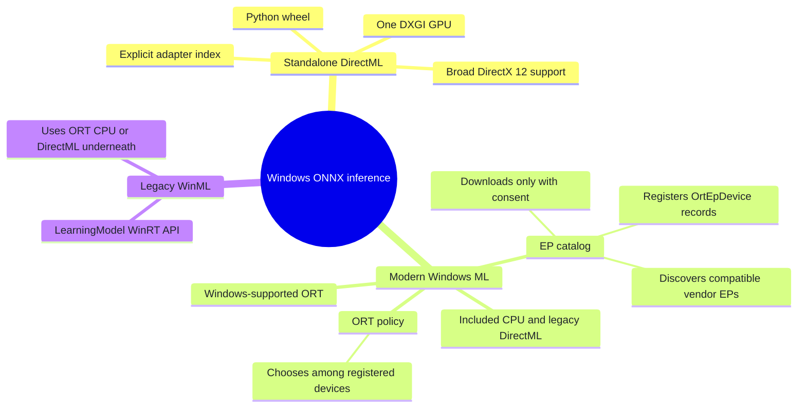
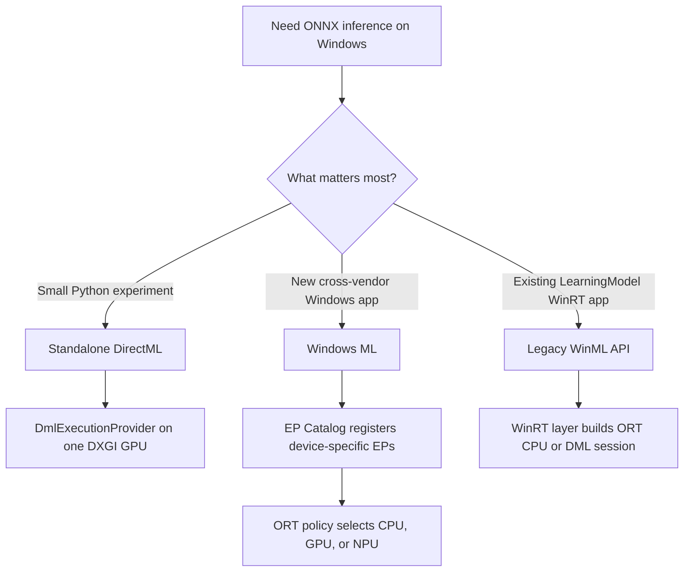
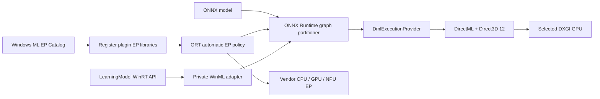
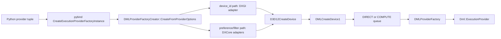
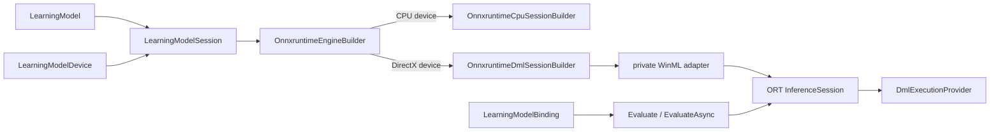

# ONNX Runtime + DirectML / Windows ML on Windows

[简体中文](README.zh-CN.md) · [Repository index](../README.md) · [Official DirectML EP guide](https://onnxruntime.ai/docs/execution-providers/DirectML-ExecutionProvider.html)

| Item | Baseline |
|---|---|
| Last verified | `2026-07-17` against official docs, PyPI metadata/files, and ONNX Runtime source |
| Audited source | ONNX Runtime `bf6aa0063d1c178c4a4d33ed6770425834147e2a` (`main` HEAD at `2026-07-17T04:49:55Z`) |
| Hosts | Native Windows; DirectML wheel: x64; Windows ML: x64 or ARM64 |
| Standalone route | `onnxruntime-directml==1.24.4`, `DmlExecutionProvider`, DirectX 12 GPU |
| Windows ML route | Windows App SDK `2.1.3` projection + exact `onnxruntime-windowsml==1.24.6.202605042033` |
| Strategic status | DirectML remains supported in sustained engineering; Microsoft recommends Windows ML for new Windows deployments |
| Entry point | [`one_click.py`](one_click.py) |
| Proof | CPU parity + recorded graph assignment + current-run profile + default ORT CPU EP fallback disabled |
| Validation boundary | Helper tests and CPython 3.12 dependency resolution passed on Linux for DirectML x64 and Windows ML x64/ARM64; final DirectML/catalog execution requires a matching Windows target |

### Files

| File | Purpose |
|---|---|
| [`README.md`](README.md) | Complete English setup and source guide |
| [`README.zh-CN.md`](README.zh-CN.md) | Complete Simplified Chinese guide |
| [`one_click.py`](one_click.py) | One-command environment setup and strict proof test |
| [`requirements-directml.txt`](requirements-directml.txt) | Standalone DirectML environment |
| [`requirements-winml.txt`](requirements-winml.txt) | Windows ML catalog environment |

> [!IMPORTANT]
> There is no `WinMLExecutionProvider`. Standalone DirectML is an ORT execution provider named `DmlExecutionProvider`. Windows ML is a Windows-supported ONNX Runtime distribution plus an execution-provider catalog and automatic selection layer. The catalog registers real EP names such as `DmlExecutionProvider`, `QNNExecutionProvider`, `VitisAIExecutionProvider`, `MIGraphXExecutionProvider`, or vendor-specific providers.
>
> This tutorial's `windowsml` command requires Windows 11 24H2 (build 26100)+ because it qualifies the dynamically acquired catalog route. Windows ML's included CPU and legacy DirectML EPs are available on every OS version supported by the matching Windows App SDK.

### 60-second mental model



---

## 1. Choose the route

| Goal | Route | Use it when | Main constraint |
|---|---|---|---|
| Fastest Python GPU bring-up | **Standalone DirectML** | You need one broad DirectX 12 GPU backend and explicit adapter selection | Sustained engineering; current PyPI wheel is Windows x64 only |
| New Windows application | **Windows ML** | You want Windows-managed vendor EP discovery, acquisition, updates, and ORT automatic device policy | Dynamically acquired hardware EPs require Windows 11 24H2 (build 26100)+ |
| WinRT media/tensor API | **Legacy WinML API** | Existing code uses `LearningModel`, `VideoFrame`, and `LearningModelBinding` | This is an API layer over ORT CPU/DML, not another EP |
| Maximum vendor control | Vendor EP directly | Deployment already owns a CUDA, QNN, OpenVINO, MIGraphX, or Vitis AI stack | More packaging and compatibility work |



**Recommended learning order:**

1. Run standalone DirectML on the default adapter.
2. Qualify every intended DirectML adapter explicitly with `--device-id`.
3. Run Windows ML with only an already-installed provider.
4. Permit catalog downloads with `--allow-download`, then qualify the selected vendor EP.
5. Repeat the same assignment, fallback, and accuracy checks with the production model.

---

## 2. Understand the names and layers

| Name | What it is | What it is not |
|---|---|---|
| **Direct3D 12** | Windows GPU/compute device, resource, queue, command-list, and fence API | A neural-network graph runtime |
| **DirectML** | Low-level DirectX 12 machine-learning operator and graph library | ONNX Runtime itself |
| **DirectML EP** | ORT adapter that maps supported ONNX work to DirectML | A vendor-specific driver |
| **Legacy WinML** | `Windows.AI.MachineLearning` / `Microsoft.AI.MachineLearning` WinRT object model built over ORT | An EP named WinML |
| **Modern Windows ML** | Windows-supported ORT distribution, EP catalog, model tooling, and selection policy | The old `LearningModel` layer alone |
| **Plugin EP** | Public ORT C ABI for a separately shipped provider library | A particular CPU/GPU/NPU |
| **Driver** | Vendor software implementing DirectX 12 or a hardware-specific EP interface | Something installed by the ONNX model |



The source layout reflects those layers:

- [`onnxruntime/core/providers/dml`](https://github.com/microsoft/onnxruntime/tree/bf6aa0063d1c178c4a4d33ed6770425834147e2a/onnxruntime/core/providers/dml) is the real DirectML EP.
- [`onnxruntime/core/providers/winml`](https://github.com/microsoft/onnxruntime/tree/bf6aa0063d1c178c4a4d33ed6770425834147e2a/onnxruntime/core/providers/winml) contains only the `OrtGetWinMLAdapter` export surface. Its own header explicitly says it is **not a true execution provider**.
- [`winml`](https://github.com/microsoft/onnxruntime/tree/bf6aa0063d1c178c4a4d33ed6770425834147e2a/winml) contains the legacy WinRT `LearningModel` implementation, private adapter, image conversion, engine, and tests.
- Modern Windows ML catalog APIs are serviced through the Windows App SDK. They use ORT's public plugin-device and automatic-selection APIs, not a hidden `WinMLExecutionProvider`.

---

## 3. Check requirements and versions

### 3.1 Standalone DirectML

| Requirement | Tutorial baseline | Why |
|---|---|---|
| OS | Windows 10 1903 (build 18362)+; Windows 11 recommended | DirectML entered Windows in 1903 |
| GPU | DirectX 12 capable | DML creates a D3D12 device for the chosen adapter |
| Examples from Microsoft | NVIDIA Kepler+, AMD GCN 1st Gen+, Intel Haswell graphics+, Qualcomm Adreno 600+ | Broad compatibility, not a promise that every model is fast |
| Driver | Current stable OEM or GPU-vendor driver | D3D12 and DirectML capability comes from the driver |
| Process | x64 CPython 3.12 | Current PyPI DirectML wheel has `win_amd64` files only |
| Runtime | `onnxruntime-directml==1.24.4` | Latest published stable DirectML Python distribution in this audit |

The official released contract reports DirectML `1.15.2`, ONNX opset support through 20, and exceptions including 5-D `GridSample` 20 and `DeformConv`. The audited `main` source already contains newer operator-version code, but that does not retroactively expand the released 1.24.4 wheel's support contract.

### 3.2 Windows ML catalog route

| Requirement | Tutorial baseline | Why |
|---|---|---|
| Tutorial route OS | Windows 11 24H2, build 26100+ | The launcher intentionally qualifies dynamically acquired hardware EPs |
| Wider platform scope | Any OS supported by the matching Windows App SDK | Included ORT CPU and DirectML require no catalog download; this launcher does not test that reduced route |
| Architecture | x64 or ARM64 | Windows ML publishes both architectures |
| Python | CPython 3.12 | One common, audited wheel ABI across this guide |
| Windows App Runtime | `2.1.3` | Must match both `wasdk-*` projections |
| ML projection | `wasdk-Microsoft.Windows.AI.MachineLearning[all]==2.1.3` | Exposes `ExecutionProviderCatalog` to Python |
| Bootstrap projection | `wasdk-Microsoft.Windows.ApplicationModel.DynamicDependency.Bootstrap==2.1.3` | Activates the matching App Runtime for unpackaged Python |
| ORT distribution | `onnxruntime-windowsml==1.24.6.202605042033` | Exact dependency declared by the 2.1.3 ML projection |
| NumPy | `2.4.6` | Compatible CPython 3.12 wheels exist for both Windows x64 and ARM64; NumPy 1.26.4 has no Windows ARM64 wheel |

The exact PyPI relationships on the audit date are:

| Package line | Exact ORT relationship | Meaning |
|---|---|---|
| This guide: `wasdk-*==2.1.3` | ML projection requires `onnxruntime-windowsml==1.24.6.202605042033` | Audited tuple used by the launcher |
| Newer projection: `wasdk-*==2.3.0` | ML projection requires `onnxruntime-windowsml==1.25.2.202605110140` | A different complete tuple, not an in-place ORT upgrade |
| Latest standalone Windows ML wheel | `onnxruntime-windowsml==1.27.1.202607110137` | Newer than both projection-pinned builds; do not mix it into either tuple |

The ML projection declares an exact ORT build, and the installed Windows App Runtime must share its release line. This guide keeps the audited 2.1.3 tuple until a newer complete tuple is hardware-qualified.

### 3.3 One ORT distribution per environment

Every distribution below installs the same Python package named `onnxruntime`:

- `onnxruntime`
- `onnxruntime-directml`
- `onnxruntime-gpu`
- `onnxruntime-openvino`
- `onnxruntime-windowsml`

Installing two together can overwrite Python files and native DLLs without a useful resolver error. The launcher creates `.venv-directml` and `.venv-windowsml` separately, verifies the import owner, checks exact top-level versions, and runs `pip check` before inference.

---

## 4. Run the shortest path

### 4.1 Install Python and the Visual C++ runtime

Open PowerShell:

```powershell
winget install --id Python.Python.3.12 -e `
  --accept-package-agreements --accept-source-agreements

winget install --id Microsoft.VCRedist.2015+.x64 -e `
  --accept-package-agreements --accept-source-agreements
```

Use the ARM64 Visual C++ redistributable for a native ARM64 Windows ML process. Close the terminal after a first Python installation, open a new one, and verify:

```powershell
py -3.12 --version
py -3.12 -c "import platform, struct; print(platform.machine(), struct.calcsize('P') * 8)"
```

Expected: Python 3.12, the intended architecture, and `64`.

### 4.2 Standalone DirectML, one command

From the repository root:

```powershell
py -3.12 DirectML\one_click.py directml
```

For another GPU shown in the launcher's DXGI list:

```powershell
py -3.12 DirectML\one_click.py directml --device-id 1
```

`device_id` follows `IDXGIFactory::EnumAdapters` order. Adapter 0 is usually the display/default GPU, not necessarily the fastest GPU. The launcher prints every adapter in that same order, including name, PCI vendor/device IDs, dedicated memory, and the selected marker.

### 4.3 Windows ML, one command after the App Runtime exists

The Python bootstrap uses `ON_NO_MATCH_SHOW_UI`, so Windows may offer to install a missing matching runtime. For a controlled x64 setup, preinstall and verify Microsoft's signed 2.1.3 installer:

```powershell
$installer = "$env:TEMP\windowsappruntimeinstall-2.1.3-x64.exe"
Invoke-WebRequest `
  https://aka.ms/windowsappsdk/2.1/2.1.3/windowsappruntimeinstall-x64.exe `
  -OutFile $installer

$signature = Get-AuthenticodeSignature -LiteralPath $installer
if ($signature.Status -ne 'Valid' -or
    $signature.SignerCertificate.Subject -notmatch 'Microsoft Corporation') {
  Remove-Item $installer -Force -ErrorAction SilentlyContinue
  throw 'Windows App Runtime installer signature is not a valid Microsoft signature.'
}

try {
  $process = Start-Process $installer -ArgumentList '--quiet' -Wait -PassThru
  if ($process.ExitCode -ne 0) { throw "Installer failed: $($process.ExitCode)" }
} finally {
  Remove-Item $installer -Force -ErrorAction SilentlyContinue
}
```

For native ARM64 Python, use the ARM64 installer from the official [Windows App SDK deployment guide](https://learn.microsoft.com/windows/apps/windows-app-sdk/deploy-unpackaged-apps) for the same 2.1.3 release, or let the bootstrap UI install the matching runtime. Do not run the x64 installer block above and call the ARM64 path validated.

Then run:

```powershell
py -3.12 DirectML\one_click.py windowsml --allow-download
```

If `--policy` is omitted, the launcher uses `max-performance` (`MAX_PERFORMANCE`), not ORT's CPU-preferring `DEFAULT` policy.

Useful qualification variants:

```powershell
# Prefer a GPU among every registered catalog EP.
py -3.12 DirectML\one_click.py windowsml --policy prefer-gpu --allow-download

# Prepare only the exact catalog provider, then use the policy to select its device.
py -3.12 DirectML\one_click.py windowsml `
  --provider DmlExecutionProvider --policy prefer-gpu --allow-download

# Rebuild a route's disposable environment.
py -3.12 DirectML\one_click.py directml --refresh
```

Without `--allow-download`, the launcher skips a `NotPresent` catalog entry unless the same EP already exposes an `OrtEpDevice` in this ORT process, which requires no acquisition. Managed machines may also block Microsoft Store or Windows Update package acquisition; that is an administrator policy issue, not an ONNX model issue.

| Catalog state | Meaning | Launcher action |
|---|---|---|
| `NotPresent` | EP package is not installed | Skip/fail unless `--allow-download`, except when ORT already exposes the same EP device |
| `NotReady` | Installed, but absent from this app's dependency graph | Call `ensure_ready_async()`; no new download is normally needed |
| `Ready` | Installed and in the app's dependency graph | Reuse an existing ORT device or register the returned library path |

---

## 5. What the one-click proof actually does

The launcher is a qualification test, not a provider-list demo:

1. Rejects non-Windows, 32-bit, unsupported OS, wrong Python, and Microsoft Store alias hosts.
2. Creates one route-specific virtual environment and installs the pinned manifest.
3. Rejects multiple ORT distributions or the wrong owner of the `onnxruntime` import.
4. Generates an offline static FP32 ONNX graph with two `MatMul`, two `Add`, and one `Relu` node.
5. Runs a separate `CPUExecutionProvider` reference.
6. Selects a DXGI adapter for DirectML, or applies the official Python sample's `winrt/msvcp140.dll` collision workaround inside `.venv-windowsml`, then prepares and explicitly registers certified catalog libraries in the same Python ORT process.
7. Enables all graph optimizations, disables memory patterns, forces sequential execution, records graph assignment, enables profiling, and sets `session.disable_cpu_ep_fallback=1`.
8. Creates the target session, disables runtime fallback, executes warm-up and timed runs, and compares output to CPU.
9. Rejects any `CPUExecutionProvider` assignment/profile event, or a target assignment with no matching current-run profile event.
10. Unregisters catalog plugins while the Windows App SDK bootstrap context is still alive.

### Read a PASS correctly

| Route | A PASS proves | It does not prove |
|---|---|---|
| Standalone DirectML | The graph was assigned to `DmlExecutionProvider`, a current-run DML event was profiled, and the explicitly indexed DXGI adapter backed the DML session | Production-model support, speed, or accuracy outside the smoke input |
| Windows ML | A registered catalog EP owned the graph and produced a current-run event without default ORT CPU EP nodes | A unique GPU/NPU identity when one EP name exposes several device classes; a vendor CPU EP can pass because assignment/profile records identify the EP name, not its exact device |
| Both | Output matched an independent CPU reference within `rtol=1e-3`, `atol=1e-4` | Bitwise equality or a hardware benchmark |

Two similarly named controls close different gaps:

| Control | Scope | Failure it prevents |
|---|---|---|
| `session.disable_cpu_ep_fallback=1` | C++ graph initialization | Nodes silently assigned to the default Microsoft `CPUExecutionProvider` |
| `session.disable_fallback()` | Python wrapper after session creation | Retrying a failed run by recreating the session with fallback providers |

### Why use assignment and profiling together?

| Evidence | Strength | Gap closed by the other check |
|---|---|---|
| `get_available_providers()` | The binary can expose/load an EP | Says nothing about this model's placement |
| Session provider list | EP registration and priority | CPU can still execute unsupported nodes |
| Graph assignment record | ORT assigned a subgraph to the EP | Does not alone prove this run reached a profiled kernel event |
| Current-run profile | A node event was attributed to that EP | Assignment record gives direct partition context |
| CPU reference comparison | Output is numerically sane | Does not identify the execution device |
| Default ORT CPU fallback disabled | Unsupported placement fails closed | Assignment/profile make the pass auditable |

A successful DirectML run resembles:

```text
Route              : directml
ONNX Runtime       : 1.24.4
DXGI adapters:
  - 0: Intel(R) Graphics, vendor=0x8086, ...
  - 1: NVIDIA GeForce ..., vendor=0x10DE, ... [selected]
Session providers   : ['DmlExecutionProvider', 'CPUExecutionProvider']
Graph assignment    : {'DmlExecutionProvider': ...}
Profiled providers  : {'DmlExecutionProvider': ...}
Max |target-CPU|    : ...

PASS: DmlExecutionProvider executed ... profiled node event(s) with ORT CPU fallback disabled.
```

`CPUExecutionProvider` may still appear in the session list because ORT implicitly registers it before checking the no-fallback rule. The pass requires zero nodes/events attributed to that EP. This does not rule out a vendor EP that itself targets a CPU device. DML graph fusion can also turn five ONNX nodes into one runtime node, so the profile event count is not expected to equal five.

---

## 6. DirectML source deep dive

This section follows the audited source revision from Python configuration to D3D12 execution.

### 6.1 Registration and factory creation



The public Python route reaches [`CreateExecutionProviderFactoryInstance`](https://github.com/microsoft/onnxruntime/blob/bf6aa0063d1c178c4a4d33ed6770425834147e2a/onnxruntime/python/onnxruntime_pybind_state.cc), then [`DMLProviderFactoryCreator`](https://github.com/microsoft/onnxruntime/blob/bf6aa0063d1c178c4a4d33ed6770425834147e2a/onnxruntime/core/providers/dml/dml_provider_factory.cc).

The audited `main` parser accepts:

| Key | Values | Behavior |
|---|---|---|
| `device_id` | Non-empty integer text | Uses the legacy DXGI adapter-index path; it takes precedence over preference/filter |
| `disable_metacommands` | `true`, `True`, `false`, `False` | Adds `DML_EXECUTION_FLAG_DISABLE_META_COMMANDS` when true |
| `performance_preference` | `default`, `high_performance`, `minimum_power` | Sorts compatible DXCore adapters |
| `device_filter` | `gpu`; also `npu` / `any` when NPU enumeration is compiled | Filters DXCore adapters before selecting the first sorted result |

The one-click standalone route intentionally uses only `device_id`, the stable released Python contract documented for 1.24.4. Newer DXCore filter support in `main` should not be assumed present in every older wheel. For new NPU deployments, Windows ML plus the hardware vendor's EP is usually a clearer support boundary than generic DML NPU enumeration.

The DXGI path rejects the software adapter, creates a D3D12 device at feature level 11.0, then creates an `IDMLDevice` through `DMLCreateDevice1` with DML feature level 5.0. The newer DXCore path enumerates `D3D12_GENERIC_ML` or core-compute adapters, identifies GPU/NPU type, sorts by power/performance preference, and creates the first matching D3D12 device.

The factory chooses a `COMPUTE` queue when the device's maximum feature level is at most `D3D_FEATURE_LEVEL_1_0_CORE`; otherwise it chooses `DIRECT`. A caller-supplied `IDMLDevice` and command queue must have the same parent D3D12 device; only `DIRECT` or `COMPUTE` queues are accepted. The session retains strong references to both.

### 6.2 Session constraints and memory

DirectML resources are D3D12 buffers, not ordinary byte-addressable CPU allocations. That drives two public constraints:

```python
options.enable_mem_pattern = False
options.execution_mode = ort.ExecutionMode.ORT_SEQUENTIAL
```

Current `InferenceSession::RegisterExecutionProvider` can auto-correct these settings for DML and log the change. The public DirectML contract and legacy WinML adapter still require callers to set them correctly, so explicit configuration is the portable choice. Do not call `Run` concurrently from multiple threads on one DML session; use separate sessions if concurrency is required.

[`ExecutionProviderImpl`](https://github.com/microsoft/onnxruntime/blob/bf6aa0063d1c178c4a4d33ed6770425834147e2a/onnxruntime/core/providers/dml/DmlExecutionProvider/src/ExecutionProvider.cpp) owns:

- an `ID3D12Device` and `IDMLDevice`;
- a GPU [`BucketizedBufferAllocator`](https://github.com/microsoft/onnxruntime/blob/bf6aa0063d1c178c4a4d33ed6770425834147e2a/onnxruntime/core/providers/dml/DmlExecutionProvider/src/BucketizedBufferAllocator.cpp) with DML `OrtMemoryInfo`;
- upload/readback paths and a CPU-input allocator;
- a [`DataTransfer`](https://github.com/microsoft/onnxruntime/tree/bf6aa0063d1c178c4a4d33ed6770425834147e2a/onnxruntime/core/providers/dml/DmlExecutionProvider/src) that copies CPU-to-GPU, GPU-to-CPU, and GPU buffers;
- an execution context shared by Python I/O binding on the same D3D12 device when available.

The C API can wrap a caller-owned D3D12 resource as a DML allocation or recover the `ID3D12Resource` behind a DML allocation. Those APIs are for native zero-copy integration; normal NumPy feeds still cross the CPU/GPU boundary.

### 6.3 Capability, fallback, and partitioning

[`ExecutionProviderImpl::GetCapability`](https://github.com/microsoft/onnxruntime/blob/bf6aa0063d1c178c4a4d33ed6770425834147e2a/onnxruntime/core/providers/dml/DmlExecutionProvider/src/ExecutionProvider.cpp) does more than check an operator name:

1. `kernel_lookup.LookUpKernel(node)` must find a DML registration.
2. An operator-specific `supportQuery` may reject an attribute/shape combination.
3. The node's tensor types must fit the actual device's data-type mask.
4. ORT's CPU-preferred analysis can keep shape/cheap nodes on CPU when moving them would be worse.
5. Accepted nodes become `ComputeCapability` records for ORT's graph partitioner.

The device-type mask is important: DML registers kernels up front, but the selected hardware might not implement every type. Rejecting at capability time permits normal CPU fallback instead of failing much later during operator creation. This tutorial turns that fallback into a session-creation failure because its smoke graph is expected to be fully supported.

After initial assignment, [`GraphPartitioner.cpp`](https://github.com/microsoft/onnxruntime/blob/bf6aa0063d1c178c4a4d33ed6770425834147e2a/onnxruntime/core/providers/dml/DmlExecutionProvider/src/GraphPartitioner.cpp) and the DML graph transformers merge compatible nodes. Static input/output shapes, required constant inputs, supported edge types, and safe partition boundaries allow multiple nodes to become one DirectML graph. Models containing ONNX subgraphs receive more conservative splitting because implicit inputs and shared initializers complicate partition ownership.

### 6.4 Graph compilation and execution

[`DmlGraphFusionTransformer`](https://github.com/microsoft/onnxruntime/blob/bf6aa0063d1c178c4a4d33ed6770425834147e2a/onnxruntime/core/providers/dml/DmlExecutionProvider/src/DmlGraphFusionTransformer.cpp) builds static fused partitions. [`DmlRuntimeGraphFusionTransformer`](https://github.com/microsoft/onnxruntime/blob/bf6aa0063d1c178c4a4d33ed6770425834147e2a/onnxruntime/core/providers/dml/DmlExecutionProvider/src/DmlRuntimeGraphFusionTransformer.cpp) supports the graph-capture path. [`DmlGraphFusionHelper`](https://github.com/microsoft/onnxruntime/blob/bf6aa0063d1c178c4a4d33ed6770425834147e2a/onnxruntime/core/providers/dml/DmlExecutionProvider/src/DmlGraphFusionHelper.cpp) translates graph edges/operators, calls `IDMLDevice1::CompileGraph`, allocates persistent/temporary resources, builds binding tables, and records reusable command lists.

The normal execution chain is:


[`CommandQueue`](https://github.com/microsoft/onnxruntime/blob/bf6aa0063d1c178c4a4d33ed6770425834147e2a/onnxruntime/core/providers/dml/DmlExecutionProvider/src/CommandQueue.cpp) increments and signals a fence after each submission. Objects needed by asynchronous GPU work are queued with the fence value and released only after completion. `OnRunEnd` flushes pending work without blocking, allowing CPU work to overlap the GPU. `Sync()` flushes and waits for all outstanding work.

Advanced graph capture uses `ep.dml.enable_graph_capture=1`. The first user-visible `Run` may perform several internal runs for allocation and capture; after the EP reports capture complete, later calls replay the saved command lists. Bindings and resource addresses must remain valid for the captured graph's lifetime. The one-click qualification test deliberately leaves capture off because it validates ordinary execution, not stable-address I/O binding.

---

## 7. WinML source deep dive: legacy and modern

### 7.1 Why `core/providers/winml` looks empty

[`winml_provider_factory.h`](https://github.com/microsoft/onnxruntime/blob/bf6aa0063d1c178c4a4d33ed6770425834147e2a/include/onnxruntime/core/providers/winml/winml_provider_factory.h) says the WinML "provider factory" is not a true EP. [`symbols.txt`](https://github.com/microsoft/onnxruntime/blob/bf6aa0063d1c178c4a4d33ed6770425834147e2a/onnxruntime/core/providers/winml/symbols.txt) exports only `OrtGetWinMLAdapter`. The directory is an export bridge so the separate WinML layer can reach private adapter APIs.

### 7.2 Legacy `LearningModel` path

The real legacy implementation under [`winml/`](https://github.com/microsoft/onnxruntime/tree/bf6aa0063d1c178c4a4d33ed6770425834147e2a/winml) follows this flow:



Key details from source:

- [`LearningModelDevice`](https://github.com/microsoft/onnxruntime/blob/bf6aa0063d1c178c4a4d33ed6770425834147e2a/winml/lib/Api/LearningModelDevice.cpp) maps `Cpu`, `DirectX`, `DirectXHighPerformance`, and `DirectXMinPower` to cached D3D resources or CPU state. It can also wrap a caller's Direct3D 11 device or D3D12 queue.
- [`LearningModelSession`](https://github.com/microsoft/onnxruntime/blob/bf6aa0063d1c178c4a4d33ed6770425834147e2a/winml/lib/Api/LearningModelSession.cpp) obtains the optimized model, configures the engine builder from the device, creates the engine, loads the detached ORT model, initializes, and exposes sync/async evaluation.
- [`OnnxruntimeDmlSessionBuilder`](https://github.com/microsoft/onnxruntime/blob/bf6aa0063d1c178c4a4d33ed6770425834147e2a/winml/lib/Api.Ort/OnnxruntimeDmlSessionBuilder.cpp) enables all graph optimizations, disables memory patterns, appends DML with the caller's D3D12 device/queue, appends CPU fallback, initializes the session, then flushes DML setup work.
- [`winml_adapter_session.cpp`](https://github.com/microsoft/onnxruntime/blob/bf6aa0063d1c178c4a4d33ed6770425834147e2a/winml/adapter/winml_adapter_session.cpp) creates an uninitialized `InferenceSession`, loads an already-parsed `OrtModel` without reparsing, exposes the provider handle, and initializes later.
- [`winml_adapter_c_api.h`](https://github.com/microsoft/onnxruntime/blob/bf6aa0063d1c178c4a4d33ed6770425834147e2a/winml/adapter/winml_adapter_c_api.h) explicitly marks that adapter contract private and unsupported for direct application use.

### 7.3 Modern Windows ML Python path used by this tutorial

Modern Windows ML does not drive inference through `LearningModelSession` in this Python demo. It performs:

1. Activate the matching Windows App Runtime with the dynamic-dependency bootstrap.
2. Enumerate `ExecutionProviderCatalog.get_default().find_all_providers()`.
3. Inspect certification and readiness; call `ensure_ready_async().get()` only when preparation is needed and downloads are allowed.
4. Register the provider's current `library_path` with `ort.register_execution_provider_library()`.
5. Let `ort.get_ep_devices()` expose the provider's `OrtEpDevice` entries.
6. Set `SessionOptions.set_provider_selection_policy(...)` or append a chosen device explicitly.
7. Create a normal `ort.InferenceSession`.

The explicit library registration in step 4 is Python-specific. Microsoft's one-call `EnsureAndRegisterCertifiedAsync()` and `RegisterCertifiedAsync()` APIs work for native/.NET ORT environments but **do not register into Python's ORT environment**.

ORT's [`ProviderPolicyContext`](https://github.com/microsoft/onnxruntime/blob/bf6aa0063d1c178c4a4d33ed6770425834147e2a/onnxruntime/core/session/provider_policy_context.cc) implements the built-in policies. In this source revision:

| Python policy | Internal behavior |
|---|---|
| `DEFAULT` | Prefer CPU |
| `PREFER_CPU` | Prefer CPU |
| `PREFER_NPU`, `MAX_EFFICIENCY`, `MIN_OVERALL_POWER` | Select the first NPU if present, then add CPU fallback |
| `PREFER_GPU`, `MAX_PERFORMANCE` | Select the first GPU if present, then add CPU fallback |

A policy chooses among **registered** EP devices. It neither downloads a provider nor makes an incompatible model supported. With `session.disable_cpu_ep_fallback=1`, ORT removes its default Microsoft CPU device and rejects default-CPU graph placement. A vendor CPU EP can still be selected, so treat the Windows ML PASS as proof of the catalog EP path unless the application also records the selected `OrtEpDevice` identity. The catalog manages acquisition/registration; ORT policy chooses; capability analysis partitions; assignment/profile verify the EP path.

---

## 8. Use the APIs in your application

### 8.1 DirectML qualification session

```python
import onnxruntime as ort

options = ort.SessionOptions()
options.enable_mem_pattern = False
options.execution_mode = ort.ExecutionMode.ORT_SEQUENTIAL
options.add_session_config_entry("session.disable_cpu_ep_fallback", "1")
options.add_session_config_entry("session.record_ep_graph_assignment_info", "1")

session = ort.InferenceSession(
    "model.onnx",
    sess_options=options,
    providers=[("DmlExecutionProvider", {"device_id": "0"})],
)
session.disable_fallback()

for assignment in session.get_provider_graph_assignment_info():
    print(assignment.ep_name, [(node.name, node.op_type) for node in assignment.get_nodes()])
```

For production, decide fallback deliberately. If partial CPU execution is acceptable, remove `session.disable_cpu_ep_fallback`, append `CPUExecutionProvider`, profile the production model, and disclose the partitioning. Do not call a partially offloaded result "full GPU execution."

### 8.2 Windows ML policy session

The catalog/bootstrap objects and registered libraries must remain alive through session use. Python must register each catalog `library_path` in the same ORT process. This skeleton skips downloads until the application grants consent:

```python
import gc

import winui3.microsoft.windows.applicationmodel.dynamicdependency.bootstrap as bootstrap

allow_download = False

with bootstrap.initialize(options=bootstrap.InitializeOptions.ON_NO_MATCH_SHOW_UI):
    import onnxruntime as ort
    import winui3.microsoft.windows.ai.machinelearning as winml

    registered = []
    session = None
    catalog = winml.ExecutionProviderCatalog.get_default()
    try:
        for provider in catalog.find_all_providers():
            if provider.certification != winml.ExecutionProviderCertification.CERTIFIED:
                continue
            if (
                provider.ready_state == winml.ExecutionProviderReadyState.NOT_PRESENT
                and not allow_download
            ):
                continue

            result = provider.ensure_ready_async().get()
            if result.status != winml.ExecutionProviderReadyResultState.SUCCESS:
                continue
            if provider.name in {device.ep_name for device in ort.get_ep_devices()}:
                continue
            if provider.library_path:
                ort.register_execution_provider_library(provider.name, provider.library_path)
                registered.append(provider.name)

        options = ort.SessionOptions()
        options.set_provider_selection_policy(
            ort.OrtExecutionProviderDevicePolicy.MAX_PERFORMANCE
        )
        session = ort.InferenceSession("model.onnx", sess_options=options)
        # Use the session while the bootstrap context and providers are alive.
    finally:
        session = None
        gc.collect()
        for name in reversed(registered):
            ort.unregister_execution_provider_library(name)
```

Production code should inspect certification/readiness, avoid downloads without user/admin policy, handle each provider error independently, and unregister only after all sessions and provider-owned objects are destroyed. [`one_click.py`](one_click.py) implements the stricter lifecycle and proof checks.

The official Python sample removes the `msvcp140.dll` copy bundled under `winrt-runtime` before importing Windows ML because it can conflict with other native libraries. This launcher performs that mutation only in its route-specific disposable `.venv-windowsml`; it never edits the system Visual C++ Runtime.

---

## 9. Model and performance guidance

| Topic | Guidance |
|---|---|
| Shapes | Prefer known/static dimensions. They improve ORT inference, constant folding, DML graph fusion, weight preprocessing, and first-run predictability. |
| Dynamic dimensions | Use free-dimension overrides when deployment shapes are known; otherwise expect less fusion and more first-run work. |
| Opset | Keep the standalone released-wheel qualification at opset 20 or below; this demo uses opset 17. |
| Precision | Start with FP32, then validate FP16/INT8/QDQ accuracy on each target EP. Hardware and driver support differ. |
| Transfers | Tiny models are often dominated by NumPy-to-GPU and GPU-to-CPU copies. Use realistic batches and I/O binding before drawing performance conclusions. |
| Warm-up | Session creation and first inference can compile graphs, preprocess weights, allocate persistent resources, and populate caches. Measure them separately. |
| Metacommands | Driver-specific optimized paths can improve speed. Disable them only to diagnose correctness/driver issues, then compare on the production model. |
| Concurrency | One DML session is sequential. Use independent sessions for concurrent `Run` calls and measure memory pressure. |
| Graph capture | Advanced stable-shape/stable-address optimization. Qualify ordinary execution first, then test capture with I/O binding and explicit synchronization. |
| Windows ML | A vendor EP selected by Windows ML may beat broad DirectML. Benchmark the selected EP, not the policy name. |

The generated graph is intentionally too small to benchmark hardware. Its latency is printed only to catch gross stalls and to show that timing excludes session creation after warm-up.

---

## 10. Troubleshooting

| Symptom | Meaning | Action |
|---|---|---|
| `The ... route requires native Windows` | Linux, WSL, or another OS started the launcher | Run from native Windows; WSL does not expose this DirectML Python route |
| Wrong Python / 32-bit failure | Wheel ABI cannot match | Install 64-bit CPython 3.12 and start with `py -3.12` |
| `DmlExecutionProvider` absent | Wrong ORT distribution or damaged venv | Run `... directml --refresh`; do not install another ORT package into that venv |
| DXGI adapter index missing | `--device-id` is outside enumeration | Use an index printed by the launcher |
| D3D12 device creation fails | Adapter/driver lacks working DirectX 12 support, or software adapter was selected | Update OEM/vendor driver; choose a hardware adapter |
| Session creation reports CPU fallback disabled | Some smoke-graph work was not accepted by the requested EP | Repair runtime/driver first; for a custom model, inspect unsupported operators/types/shapes |
| Windows App Runtime initialization fails | Missing or mismatched App Runtime | Install signed 2.1.3 runtime matching both `wasdk-*` packages |
| Empty Windows ML catalog | OS/build, Windows Update, catalog service, or organizational policy issue | Confirm build 26100+, updates, Store/catalog access, and admin policy |
| Provider is `NotPresent` | Compatible catalog entry exists but package is absent | Rerun with `--allow-download` if policy permits |
| `ensure_ready_async` fails | Driver/hardware/package requirement is not satisfied | Read its diagnostic text; update the exact OEM/vendor driver and Windows |
| Catalog library registration fails | App Runtime/ORT/plugin ABI mismatch or stale process state | Recreate the route venv, reboot after runtime updates, and keep one release tuple |
| `CPUExecutionProvider` is selected and proof fails | `DEFAULT` prefers CPU, or no usable requested device was registered | Use `prefer-gpu`/`prefer-npu`, prepare a compatible provider, or explicitly name it |
| Windows ML passes but the hardware class is unclear | The selected vendor EP exposes CPU plus GPU/NPU devices; EP-name evidence cannot distinguish them | Explicitly select/log the intended `OrtEpDevice`, then repeat assignment, profile, and parity checks |
| Target assigned but no target profile event | Run did not produce matching execution evidence | Treat as failure; do not infer acceleration from registration |
| Numerical mismatch | Precision, driver, or operator issue | Reproduce with FP32/static shapes, update driver, and minimize the model |
| Device removed / TDR | GPU reset, timeout, memory pressure, or driver defect | Reduce workload, inspect Event Viewer, update driver, and test without metacommands |

Useful diagnostics:

```powershell
winver
Get-CimInstance Win32_VideoController | Select-Object Name, DriverVersion, AdapterRAM
py -3.12 DirectML\one_click.py directml --refresh
py -3.12 DirectML\one_click.py windowsml --provider DmlExecutionProvider --allow-download
```

---

## 11. Source map and primary references

### Claim-to-source audit

| Claim | Primary evidence | Audit result |
|---|---|---|
| DirectML is sustained engineering; released contract is DirectML 1.15.2 through opset 20 with named exceptions | [Official DirectML EP guide](https://onnxruntime.ai/docs/execution-providers/DirectML-ExecutionProvider.html) | Confirmed; newer `main` code is not treated as a released-wheel promise |
| `device_id` is DXGI order; DML requires sequential execution and no memory pattern | [`dml_provider_factory.h`](https://github.com/microsoft/onnxruntime/blob/bf6aa0063d1c178c4a4d33ed6770425834147e2a/include/onnxruntime/core/providers/dml/dml_provider_factory.h) + [`inference_session.cc`](https://github.com/microsoft/onnxruntime/blob/bf6aa0063d1c178c4a4d33ed6770425834147e2a/onnxruntime/core/session/inference_session.cc) | Confirmed |
| DML capability depends on kernel registration, support query, device data types, and CPU-preferred analysis | [`ExecutionProvider.cpp`](https://github.com/microsoft/onnxruntime/blob/bf6aa0063d1c178c4a4d33ed6770425834147e2a/onnxruntime/core/providers/dml/DmlExecutionProvider/src/ExecutionProvider.cpp) | Confirmed |
| There is no true `WinMLExecutionProvider` | [`winml_provider_factory.h`](https://github.com/microsoft/onnxruntime/blob/bf6aa0063d1c178c4a4d33ed6770425834147e2a/include/onnxruntime/core/providers/winml/winml_provider_factory.h) + [`symbols.txt`](https://github.com/microsoft/onnxruntime/blob/bf6aa0063d1c178c4a4d33ed6770425834147e2a/onnxruntime/core/providers/winml/symbols.txt) | Confirmed; only the private adapter bridge is exported |
| Python must register each catalog `library_path`; one-call registration targets another ORT environment | [Install EPs](https://learn.microsoft.com/windows/ai/new-windows-ml/initialize-execution-providers) + [Register EPs](https://learn.microsoft.com/windows/ai/new-windows-ml/register-execution-providers) | Confirmed for the pinned Python projection |
| Built-in policies map to CPU-, NPU-, or GPU-oriented selectors with CPU fallback | [`provider_policy_context.cc`](https://github.com/microsoft/onnxruntime/blob/bf6aa0063d1c178c4a4d33ed6770425834147e2a/onnxruntime/core/session/provider_policy_context.cc) | Confirmed; EP-name proof is not exact silicon proof |
| Package versions and architectures in section 3 exist as pinned | [DirectML PyPI](https://pypi.org/project/onnxruntime-directml/1.24.4/) + [Windows ML projection PyPI](https://pypi.org/project/wasdk-Microsoft.Windows.AI.MachineLearning/2.1.3/) | Confirmed from metadata and wheel filenames |

### ONNX Runtime source, audited commit

| Area | File |
|---|---|
| Public DML C API and device options | [`dml_provider_factory.h`](https://github.com/microsoft/onnxruntime/blob/bf6aa0063d1c178c4a4d33ed6770425834147e2a/include/onnxruntime/core/providers/dml/dml_provider_factory.h) |
| Adapter enumeration, D3D/DML creation, provider options | [`dml_provider_factory.cc`](https://github.com/microsoft/onnxruntime/blob/bf6aa0063d1c178c4a4d33ed6770425834147e2a/onnxruntime/core/providers/dml/dml_provider_factory.cc) |
| EP capability, allocators, data transfer, run lifecycle | [`ExecutionProvider.cpp`](https://github.com/microsoft/onnxruntime/blob/bf6aa0063d1c178c4a4d33ed6770425834147e2a/onnxruntime/core/providers/dml/DmlExecutionProvider/src/ExecutionProvider.cpp) |
| DML graph partition merging | [`GraphPartitioner.cpp`](https://github.com/microsoft/onnxruntime/blob/bf6aa0063d1c178c4a4d33ed6770425834147e2a/onnxruntime/core/providers/dml/DmlExecutionProvider/src/GraphPartitioner.cpp) |
| Command recording and submission | [`DmlCommandRecorder.cpp`](https://github.com/microsoft/onnxruntime/blob/bf6aa0063d1c178c4a4d33ed6770425834147e2a/onnxruntime/core/providers/dml/DmlExecutionProvider/src/DmlCommandRecorder.cpp) |
| Queue and fence lifetime | [`CommandQueue.cpp`](https://github.com/microsoft/onnxruntime/blob/bf6aa0063d1c178c4a4d33ed6770425834147e2a/onnxruntime/core/providers/dml/DmlExecutionProvider/src/CommandQueue.cpp) |
| DML session config keys | [`dml_session_options_config_keys.h`](https://github.com/microsoft/onnxruntime/blob/bf6aa0063d1c178c4a4d33ed6770425834147e2a/onnxruntime/core/providers/dml/dml_session_options_config_keys.h) |
| Built-in DML Plugin-EP adapter | [`ep_factory_dml.cc`](https://github.com/microsoft/onnxruntime/blob/bf6aa0063d1c178c4a4d33ed6770425834147e2a/onnxruntime/core/session/plugin_ep/ep_factory_dml.cc) |
| Automatic EP policy implementation | [`provider_policy_context.cc`](https://github.com/microsoft/onnxruntime/blob/bf6aa0063d1c178c4a4d33ed6770425834147e2a/onnxruntime/core/session/provider_policy_context.cc) |
| WinML export is not a true EP | [`winml_provider_factory.h`](https://github.com/microsoft/onnxruntime/blob/bf6aa0063d1c178c4a4d33ed6770425834147e2a/include/onnxruntime/core/providers/winml/winml_provider_factory.h) |
| Legacy private session adapter | [`winml_adapter_session.cpp`](https://github.com/microsoft/onnxruntime/blob/bf6aa0063d1c178c4a4d33ed6770425834147e2a/winml/adapter/winml_adapter_session.cpp) |
| Legacy DML session builder | [`OnnxruntimeDmlSessionBuilder.cpp`](https://github.com/microsoft/onnxruntime/blob/bf6aa0063d1c178c4a4d33ed6770425834147e2a/winml/lib/Api.Ort/OnnxruntimeDmlSessionBuilder.cpp) |
| Legacy WinRT session object | [`LearningModelSession.cpp`](https://github.com/microsoft/onnxruntime/blob/bf6aa0063d1c178c4a4d33ed6770425834147e2a/winml/lib/Api/LearningModelSession.cpp) |

### Official documentation

- [DirectML Execution Provider](https://onnxruntime.ai/docs/execution-providers/DirectML-ExecutionProvider.html)
- [Install ONNX Runtime / Windows ML](https://onnxruntime.ai/docs/install/#cccwinml-installs)
- [ONNX Runtime on Windows](https://onnxruntime.ai/docs/get-started/with-windows.html)
- [What is Windows ML?](https://learn.microsoft.com/windows/ai/new-windows-ml/overview)
- [Windows ML walkthrough](https://learn.microsoft.com/windows/ai/new-windows-ml/tutorial)
- [Install Windows ML EPs](https://learn.microsoft.com/windows/ai/new-windows-ml/initialize-execution-providers)
- [Register Windows ML EPs](https://learn.microsoft.com/windows/ai/new-windows-ml/register-execution-providers)
- [Supported Windows ML EPs](https://learn.microsoft.com/windows/ai/new-windows-ml/supported-execution-providers)
- [Windows ML catalog vs. bring-your-own EPs](https://learn.microsoft.com/windows/ai/new-windows-ml/windows-ml-eps-vs-bring-your-own)
- [Windows ML samples](https://github.com/microsoft/WindowsAppSDK-Samples/tree/main/Samples/WindowsML)
- [DirectML API documentation](https://learn.microsoft.com/windows/ai/directml/dml)

---

## 12. Validation boundary

This folder was prepared on Linux, so no claim is made that a Windows GPU/NPU executed during this edit. The following checks did run:

- Python helper tests for profile parsing, strict assignment rules, policy mapping, and package-name normalization;
- Python bytecode compilation of [`one_click.py`](one_click.py);
- complete dependency resolution to CPython 3.12 Windows wheels: DirectML x64 plus Windows ML x64 and ARM64;
- source-path and API audit against the pinned ONNX Runtime commit, Microsoft Learn, and official Windows ML samples;
- PyPI metadata/file audit for exact versions and architectures, plus direct inspection of the pinned 2.1.3 projection's Python type stubs;
- syntax parsing of every Python example and all six Mermaid diagrams in each README;
- HTTP availability of the pinned x64 App Runtime installer. Authenticode verification still belongs on Windows and is enforced by the shown PowerShell block.

Run the appropriate one-click command on the target Windows device before treating the route as qualified. A pass applies only to the generated smoke model, selected adapter/provider, current driver, and current package tuple. Repeat the proof with the production model and representative inputs.