# ONNX Runtime on Windows: DirectML & Windows ML

[简体中文](README.zh-CN.md) · [Repository index](../README.md) · [Official DirectML EP guide](https://onnxruntime.ai/docs/execution-providers/DirectML-ExecutionProvider.html)

**DirectML** is Microsoft's GPU compute library for Windows. ONNX Runtime's DirectML EP runs your model on any DirectX 12 GPU through it. **Windows ML** goes one step further: a Windows-supported ORT build that also *finds and picks* the best vendor EP for you — GPU, NPU, or CPU. This folder *proves* both really execute on real hardware, not just that a provider loaded.

> [!IMPORTANT]
> **There is no `WinMLExecutionProvider`.**
> - **Standalone DirectML** = one real provider, `DmlExecutionProvider`, on a DirectX 12 GPU.
> - **Windows ML** = a Windows-supported ORT build **plus** an *EP catalog* that registers real vendor EPs (`DmlExecutionProvider`, `QNNExecutionProvider`, `VitisAIExecutionProvider`, …) and a policy that auto-picks one.

| You are here for… | Go to |
|---|---|
| The 60-second overview | [§1 Pick your route](#1-pick-your-route) |
| Plain-English terms | [§2 Names you'll meet](#2-names-youll-meet) |
| Running the proof right now | [§4 Run it](#4-run-it) |
| What "PASS" actually proves | [§5 Read a PASS correctly](#5-read-a-pass-correctly) |
| Wiring the EP into your own app | [§8 Use it in your app](#8-use-it-in-your-app) |
| How it works internally | [§6](#6-inside-directml) / [§7](#7-inside-windows-ml) — optional deep dive |
| Something failed | [§10 Troubleshooting](#10-troubleshooting) |

| Baseline | Value |
|---|---|
| Last verified | `2026-07-18`, against official docs, PyPI, and ONNX Runtime source |
| Audited source | ONNX Runtime [`bf6aa006`](https://github.com/microsoft/onnxruntime/tree/bf6aa0063d1c178c4a4d33ed6770425834147e2a) (`main` HEAD) |
| Standalone route | `onnxruntime-directml==1.24.4` · `DmlExecutionProvider` · DirectX 12 GPU · x64 |
| Windows ML route | Windows App SDK `2.1.3` + `onnxruntime-windowsml==1.24.6.202605042033` · x64 or ARM64 |
| Entry point | [`one_click.py`](one_click.py) |
| Proof | CPU parity + graph assignment + current-run profile + default CPU EP fallback disabled |
| Validation boundary | Prepared on Linux; final DirectML/catalog execution needs a matching Windows target |

### Files

| File | Purpose |
|---|---|
| [`README.md`](README.md) · [`README.zh-CN.md`](README.zh-CN.md) | This guide (English / 简体中文) |
| [`one_click.py`](one_click.py) | One-command setup and strict proof test |
| [`requirements-directml.txt`](requirements-directml.txt) | Standalone DirectML environment |
| [`requirements-winml.txt`](requirements-winml.txt) | Windows ML catalog environment |

### Contents

- [1. Pick your route](#1-pick-your-route)
- [2. Names you'll meet](#2-names-youll-meet)
- [3. Check requirements](#3-check-requirements)
- [4. Run it](#4-run-it)
- [5. Read a PASS correctly](#5-read-a-pass-correctly)
- [6. Inside DirectML](#6-inside-directml)
- [7. Inside Windows ML](#7-inside-windows-ml)
- [8. Use it in your app](#8-use-it-in-your-app)
- [9. Model and performance tips](#9-model-and-performance-tips)
- [10. Troubleshooting](#10-troubleshooting)
- [11. Source map](#11-source-map)
- [12. Validation boundary](#12-validation-boundary)

### The whole picture

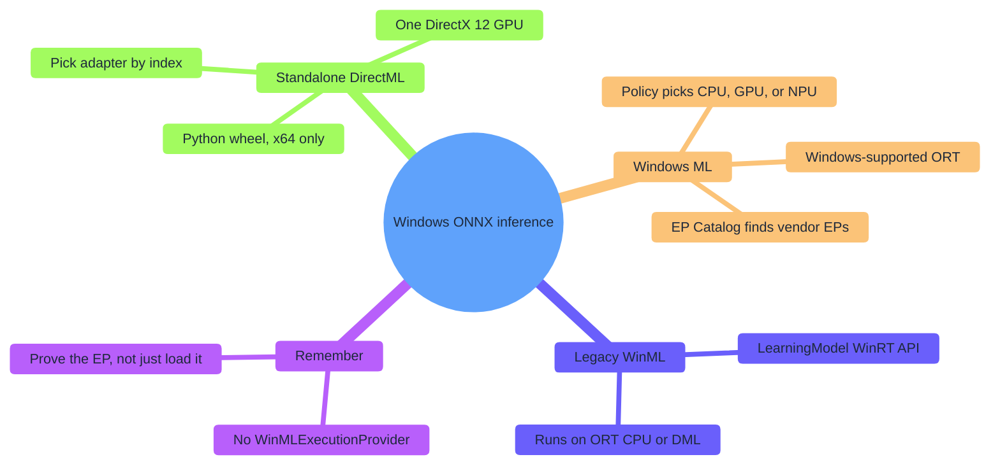

---

## 1. Pick your route

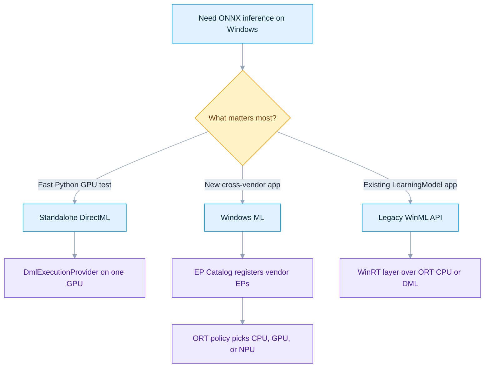

| Goal | Route | Use it when | Main limit |
|---|---|---|---|
| Fastest Python GPU bring-up | **Standalone DirectML** | You want one broad DirectX 12 GPU backend with explicit adapter choice | Windows x64 wheel only |
| New Windows application | **Windows ML** | You want Windows to discover, update, and auto-pick vendor EPs | Dynamic EP downloads need Windows 11 24H2 (build 26100)+ |
| Existing WinRT media/tensor app | **Legacy WinML API** | Your code already uses `LearningModel`, `VideoFrame`, `LearningModelBinding` | It's an API layer over ORT CPU/DML, not another EP |
| Full vendor control | Vendor EP directly | You already manage a CUDA, QNN, OpenVINO, MIGraphX, or Vitis AI stack | More packaging and compatibility work |

**Learning order:** DirectML on the default adapter → qualify each adapter with `--device-id` → Windows ML with an already-installed provider → allow catalog downloads → repeat every check on your production model.

---

## 2. Names you'll meet

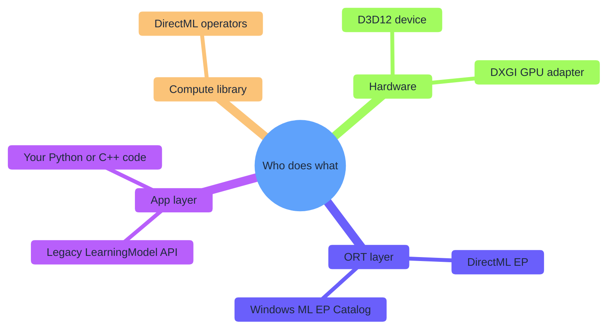

| Name | Plain meaning | What it is *not* |
|---|---|---|
| **Direct3D 12** | Windows GPU device, queue, and command API | A neural-network runtime |
| **DirectML** | Low-level DirectX 12 ML operator library | ONNX Runtime itself |
| **DirectML EP** | ORT adapter mapping ONNX work to DirectML | A vendor driver |
| **Legacy WinML** | `Windows.AI.MachineLearning` WinRT object model over ORT | An EP named WinML |
| **Modern Windows ML** | Windows-supported ORT + EP catalog + selection policy | The old `LearningModel` layer alone |
| **Plugin EP** | Public ORT C ABI for a separately shipped provider | A specific CPU/GPU/NPU |
| **Driver** | Vendor software implementing DirectX 12 or an EP | Anything the ONNX model installs |

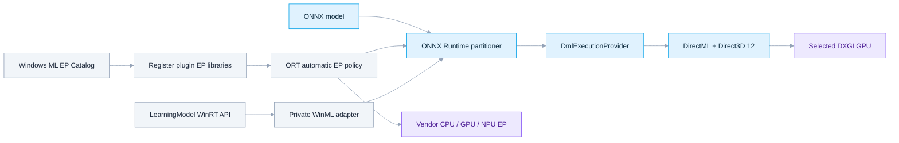

The source layout matches these layers: [`providers/dml`](https://github.com/microsoft/onnxruntime/tree/bf6aa0063d1c178c4a4d33ed6770425834147e2a/onnxruntime/core/providers/dml) is the real DirectML EP; [`providers/winml`](https://github.com/microsoft/onnxruntime/tree/bf6aa0063d1c178c4a4d33ed6770425834147e2a/onnxruntime/core/providers/winml) only exports the `OrtGetWinMLAdapter` bridge and says it is **not a true EP**; [`winml`](https://github.com/microsoft/onnxruntime/tree/bf6aa0063d1c178c4a4d33ed6770425834147e2a/winml) holds the legacy `LearningModel` implementation.

---

## 3. Check requirements

### 3.1 Standalone DirectML

| Requirement | Baseline | Why |
|---|---|---|
| OS | Windows 10 1903 (build 18362)+; Windows 11 recommended | DirectML entered Windows in 1903 |
| GPU | DirectX 12 capable | DML creates a D3D12 device for the adapter |
| Driver | Current stable OEM / GPU-vendor driver | D3D12 and DirectML come from the driver |
| Process | x64 CPython 3.12 | Current PyPI wheel ships `win_amd64` files only |
| Runtime | `onnxruntime-directml==1.24.4` | Latest published stable DirectML wheel |
| Pinned extras | `numpy==1.26.4`, `onnx==1.22.0` | Matches [`requirements-directml.txt`](requirements-directml.txt) |

> The released 1.24.4 contract reports DirectML `1.15.2` and ONNX opset support through 20 (with exceptions such as 5-D `GridSample` 20 and `DeformConv`). Newer operator code in `main` does not expand that released wheel's support.

### 3.2 Windows ML catalog route

| Requirement | Baseline | Why |
|---|---|---|
| OS (this route) | Windows 11 24H2, build 26100+ | The launcher qualifies dynamically acquired hardware EPs |
| Architecture | x64 or ARM64 | Windows ML publishes both |
| Python | CPython 3.12 | One audited wheel ABI across this guide |
| Windows App Runtime | `2.1.3` | Must match both `wasdk-*` projections |
| ML projection | `wasdk-Microsoft.Windows.AI.MachineLearning[all]==2.1.3` | Exposes `ExecutionProviderCatalog` to Python |
| Bootstrap projection | `wasdk-Microsoft.Windows.ApplicationModel.DynamicDependency.Bootstrap==2.1.3` | Activates the App Runtime for unpackaged Python |
| ORT distribution | `onnxruntime-windowsml==1.24.6.202605042033` | Exact dependency of the 2.1.3 ML projection |
| Pinned extras | `numpy==2.4.6`, `onnx==1.22.0` | Matches [`requirements-winml.txt`](requirements-winml.txt); NumPy has CPython 3.12 wheels for both x64 and ARM64 |

**Keep the tuple together.** The projection pins one exact ORT build; the installed App Runtime must share its release line.

| Package line | Requires ORT | Meaning |
|---|---|---|
| `wasdk-*==2.1.3` (this guide) | `onnxruntime-windowsml==1.24.6.202605042033` | The audited tuple |
| `wasdk-*==2.3.0` | `onnxruntime-windowsml==1.25.2.202605110140` | A different complete tuple |
| Latest standalone wheel | `onnxruntime-windowsml==1.27.1.202607110137` | Newer than both; do not mix in |

### 3.3 One ORT distribution per environment

`onnxruntime`, `onnxruntime-directml`, `onnxruntime-gpu`, `onnxruntime-openvino`, and `onnxruntime-windowsml` all install the **same** `onnxruntime` package and can overwrite each other's files. The launcher isolates `.venv-directml` and `.venv-windowsml`, checks the import owner, verifies exact versions, and runs `pip check` before inference.

---

## 4. Run it

### 4.1 Install Python and the Visual C++ runtime

```powershell
winget install --id Python.Python.3.12 -e --accept-package-agreements --accept-source-agreements
winget install --id Microsoft.VCRedist.2015+.x64 -e --accept-package-agreements --accept-source-agreements
```

Use the ARM64 VC++ redistributable for a native ARM64 Windows ML process. Reopen the terminal after a first Python install, then verify:

```powershell
py -3.12 --version
py -3.12 -c "import platform, struct; print(platform.machine(), struct.calcsize('P') * 8)"
```

Expected: Python 3.12, the intended architecture, and `64`.

### 4.2 Standalone DirectML

```powershell
py -3.12 DirectML\one_click.py directml                # default adapter
py -3.12 DirectML\one_click.py directml --device-id 1  # another GPU
```

`device_id` follows `IDXGIFactory::EnumAdapters` order. Adapter 0 is usually the display GPU, not necessarily the fastest. The launcher prints every adapter (name, PCI IDs, dedicated memory, selected marker) in that order.

### 4.3 Windows ML

Preinstall Microsoft's signed 2.1.3 App Runtime first, verifying the signature before running it:

```powershell
$installer = "$env:TEMP\windowsappruntimeinstall-2.1.3-x64.exe"
Invoke-WebRequest https://aka.ms/windowsappsdk/2.1/2.1.3/windowsappruntimeinstall-x64.exe -OutFile $installer
$sig = Get-AuthenticodeSignature -LiteralPath $installer
if ($sig.Status -ne 'Valid' -or $sig.SignerCertificate.Subject -notmatch 'Microsoft Corporation') {
  Remove-Item $installer -Force -ErrorAction SilentlyContinue
  throw 'Windows App Runtime installer signature is not a valid Microsoft signature.'
}
try {
  $p = Start-Process $installer -ArgumentList '--quiet' -Wait -PassThru
  if ($p.ExitCode -ne 0) { throw "Installer failed: $($p.ExitCode)" }
} finally { Remove-Item $installer -Force -ErrorAction SilentlyContinue }
```

Use the ARM64 installer for native ARM64 Python. Then run:

```powershell
py -3.12 DirectML\one_click.py windowsml --allow-download            # default policy: max-performance
py -3.12 DirectML\one_click.py windowsml --policy prefer-gpu --allow-download
py -3.12 DirectML\one_click.py windowsml --provider DmlExecutionProvider --policy prefer-gpu --allow-download
py -3.12 DirectML\one_click.py directml --refresh                    # rebuild a route's venv
```

Without `--allow-download`, the launcher skips a `NotPresent` catalog entry unless the same EP already exposes an `OrtEpDevice` in this process.

| Catalog state | Meaning | Launcher action |
|---|---|---|
| `NotPresent` | EP package not installed | Skip/fail unless `--allow-download` (or ORT already exposes the EP) |
| `NotReady` | Installed, not in this app's dependency graph | Call `ensure_ready_async()`; usually no download |
| `Ready` | Installed and in the dependency graph | Reuse the ORT device or register the library path |

### 4.4 CLI reference

| Flag | Default | Meaning |
|---|---|---|
| `route` | `directml` | `directml` or `windowsml` |
| `--device-id` | `0` | DirectML DXGI adapter index (standalone only) |
| `--policy` | `max-performance` | Windows ML policy: `default`, `prefer-cpu`, `prefer-npu`, `prefer-gpu`, `max-performance`, `max-efficiency`, `min-power` |
| `--provider` | none | Prepare only this exact Windows ML catalog provider |
| `--allow-download` | off | Let Windows ML acquire a catalog provider that isn't installed |
| `--warmups` | `3` | Warm-up runs before timing |
| `--runs` | `20` | Timed runs |
| `--refresh` | off | Rebuild the route's virtual environment |

---

## 5. Read a PASS correctly

The launcher is a **qualification test**, not a provider-list demo.

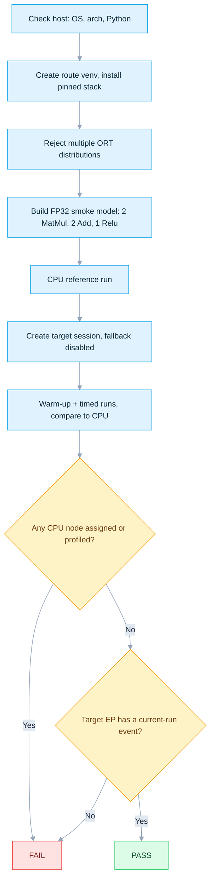

| Route | A PASS proves | It does **not** prove |
|---|---|---|
| Standalone DirectML | Graph assigned to `DmlExecutionProvider`, a current-run DML event was profiled, and the indexed DXGI adapter backed the session | Production-model support, speed, or accuracy beyond the smoke input |
| Windows ML | A registered catalog EP owned the graph and produced a current-run event with no default ORT CPU nodes | A unique GPU/NPU identity; a vendor **CPU** EP can also pass because records name the EP, not its silicon |
| Both | Output matched an independent CPU reference within `rtol=1e-3`, `atol=1e-4` | Bitwise equality or a hardware benchmark |

Two similarly named controls close different gaps:

| Control | Scope | Failure it prevents |
|---|---|---|
| `session.disable_cpu_ep_fallback=1` | C++ graph initialization | Nodes silently assigned to the default Microsoft `CPUExecutionProvider` |
| `session.disable_fallback()` | Python wrapper after session creation | Retrying a failed run by recreating the session with fallback providers |

**Why assignment *and* profiling?** Each alone is weak; together they are auditable.

| Evidence | Proves | Gap the other closes |
|---|---|---|
| `get_available_providers()` | The binary can load the EP | Nothing about placement |
| Session provider list | Registration and priority | CPU can still run unsupported nodes |
| Graph assignment record | ORT assigned a subgraph to the EP | Not that a kernel actually ran |
| Current-run profile | A node event was attributed to the EP | Needs assignment for partition context |
| CPU reference | Output is numerically sane | Cannot identify the device |
| CPU fallback disabled | Unsupported placement fails closed | Assignment/profile make it auditable |

A DirectML PASS looks like:

```text
Route              : directml
ONNX Runtime       : 1.24.4
DXGI adapters:
  - 0: Intel(R) Graphics, vendor=0x8086, ...
  - 1: NVIDIA GeForce ..., vendor=0x10DE, ... [selected]
Session providers   : ['DmlExecutionProvider', 'CPUExecutionProvider']
Graph assignment    : {'DmlExecutionProvider': ...}
Profiled providers  : {'DmlExecutionProvider': ...}
Max |target-CPU|    : ...

PASS: DmlExecutionProvider executed ... profiled node event(s) with ORT CPU fallback disabled.
```

`CPUExecutionProvider` may still appear in the session list (ORT registers it before the no-fallback check); the pass requires **zero** nodes/events attributed to it. DML fusion can turn five ONNX nodes into one runtime node, so the event count need not equal five.

---

## 6. Inside DirectML

> *Optional deep dive — skip to [§8 Use it in your app](#8-use-it-in-your-app) if you just want to use the EP.*

### 6.1 Registration and factory

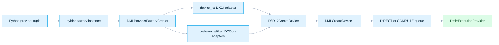

| Provider option | Values | Default | Behavior |
|---|---|---|---|
| `device_id` | Non-empty base-10 integer text, e.g. `"0"` | unset | Legacy DXGI adapter index (`IDXGIFactory::EnumAdapters` order). **Takes full precedence**: when set, `performance_preference` and `device_filter` below are never even parsed. |
| `performance_preference` | `default`, `high_performance`, `minimum_power` | `default` | Only consulted when `device_id` is absent. Sorts DXCore adapters (`minimum_power` prefers battery-friendly silicon such as an NPU or integrated GPU first). |
| `device_filter` | `gpu`; also `npu` and `any` in NPU-enumeration builds | `gpu` | Only consulted when `device_id` is absent. Narrows DXCore adapters to the requested hardware class before the highest-priority one is chosen. |
| `disable_metacommands` | `true` / `True` / `false` / `False` | `false` | Parsed independently of the other three. `true` adds `DML_EXECUTION_FLAG_DISABLE_META_COMMANDS`, forcing DirectML's portable kernels instead of vendor-optimized metacommands — a targeted way to rule out a driver metacommand bug. |

The one-click DirectML route uses only `device_id`, the stable released contract for 1.24.4. The DXGI path rejects the software adapter, creates a D3D12 device at feature level 11.0, then an `IDMLDevice` via `DMLCreateDevice1` (DML FL 5.0). It picks a `COMPUTE` queue when the max feature level is `≤ D3D_FEATURE_LEVEL_1_0_CORE`, otherwise `DIRECT`.

DML also reads five EP-specific keys from `SessionOptions.add_session_config_entry(key, value)` (source: [`dml_session_options_config_keys.h`](https://github.com/microsoft/onnxruntime/blob/bf6aa0063d1c178c4a4d33ed6770425834147e2a/onnxruntime/core/providers/dml/dml_session_options_config_keys.h)). These are session-wide, not per-provider, so set them on `SessionOptions` **before** the DML EP is appended — the provider factory reads them at that moment and later changes have no effect.

| Session config key | Values | Default | Behavior |
|---|---|---|---|
| `ep.dml.disable_graph_fusion` | `0` / `1` | `0` | `1` stops ORT from fusing eligible DML subgraphs into one compiled graph (see [§6.3](#63-capability-fallback-and-partitioning)); every op then dispatches individually. Fusion is also auto-disabled whenever `SessionOptions.optimized_model_filepath` is set, regardless of this key. |
| `ep.dml.enable_graph_serialization` | `true` / `false` | `false` | `true` dumps each fused DML partition to a `Partition_<N>.bin` file next to the model and round-trips it through (de)serialization — a debugging aid for inspecting the exact graph DirectML compiles. |
| `ep.dml.enable_graph_capture` | `0` / `1` | `0` | `1` lets ORT record the D3D12 command list(s) once and replay them on later `Run()` calls, skipping CPU re-dispatch. Requires static shapes/bindings and the whole graph on the DML EP; see [§6.4](#64-compilation-and-execution). |
| `ep.dml.enable_cpu_sync_spinning` | `0` / `1` | `0` | `1` busy-spins the CPU while waiting for the GPU fence instead of blocking on a Win32 event — lower wake-up latency at the cost of a fully-loaded CPU core. Good for latency-critical interactive workloads; leave off for background/batch work. |
| `ep.dml.disable_memory_arena` | `0` / `1` | `0` | `1` disables the pooling buffer allocator so every DML allocation becomes a fresh committed D3D12 resource. Avoids the arena holding onto GPU memory between allocations, at the cost of more allocation overhead — useful when VRAM is tight or you are diagnosing memory usage. |

[§8.1](#81-directml-qualification-session) shows every one of these nine options set together with inline comments.

### 6.2 Session constraints

DirectML resources are D3D12 buffers, so two settings are required (the launcher sets them explicitly, which is the portable choice):

```python
options.enable_mem_pattern = False
options.execution_mode = ort.ExecutionMode.ORT_SEQUENTIAL
```

Do not call `Run` concurrently on one DML session; use separate sessions for concurrency.

### 6.3 Capability, fallback, and partitioning

A node is accepted only when every check below passes; otherwise it falls back to CPU. This tutorial turns that fallback into a session-creation failure because the smoke graph is fully supported.

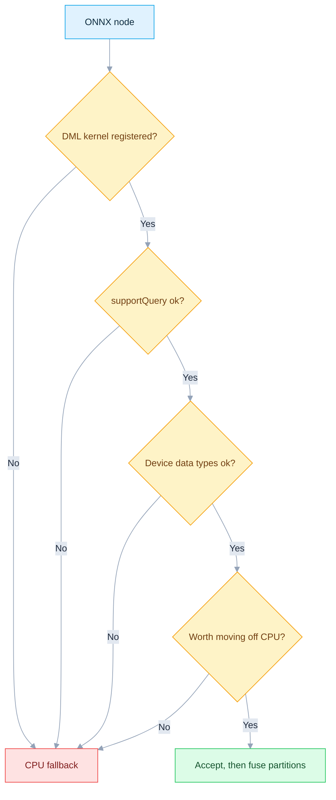

Static shapes, constant required inputs, and supported edge types let the graph transformers merge many nodes into one DirectML graph. Models with ONNX subgraphs split more conservatively.

### 6.4 Compilation and execution


The queue signals a fence after each submission and releases GPU-held objects only after completion. `OnRunEnd` flushes without blocking so CPU and GPU overlap; `Sync()` flushes and waits. Advanced graph capture (`ep.dml.enable_graph_capture=1`) replays saved command lists after the first runs; the one-click test leaves it off.

---

## 7. Inside Windows ML

> *Optional deep dive — skip to [§8 Use it in your app](#8-use-it-in-your-app) if you just want to use the EP.*

### 7.1 Why `core/providers/winml` looks empty

Its header says the "provider factory" is **not a true EP**, and [`symbols.txt`](https://github.com/microsoft/onnxruntime/blob/bf6aa0063d1c178c4a4d33ed6770425834147e2a/onnxruntime/core/providers/winml/symbols.txt) exports only `OrtGetWinMLAdapter`. The directory is a bridge to private adapter APIs.

### 7.2 Legacy `LearningModel` path

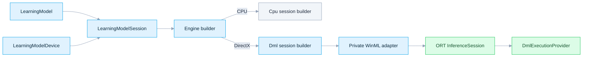

The DML session builder enables all optimizations, disables memory patterns, appends DML with the caller's D3D12 device/queue, adds CPU fallback, and initializes. The adapter contract is explicitly private.

### 7.3 Modern Windows ML (this tutorial's Python path)

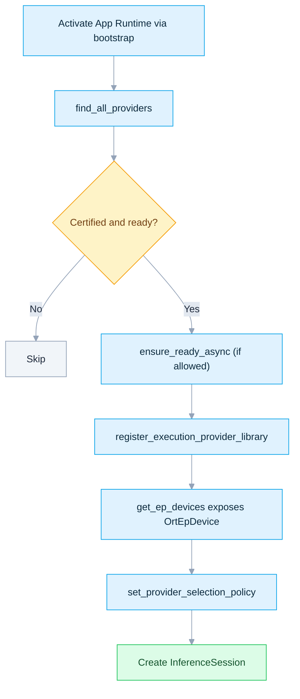

Registering each catalog `library_path` is **Python-specific**. Microsoft's one-call `EnsureAndRegisterCertifiedAsync()` targets native/.NET ORT, not Python's ORT environment.

| Python policy | Internal behavior |
|---|---|
| `DEFAULT`, `PREFER_CPU` | Prefer CPU |
| `PREFER_NPU`, `MAX_EFFICIENCY`, `MIN_OVERALL_POWER` | First NPU if present, then CPU fallback |
| `PREFER_GPU`, `MAX_PERFORMANCE` | First GPU if present, then CPU fallback |

A policy chooses among **registered** devices; it never downloads a provider or makes an incompatible model supported. With `disable_cpu_ep_fallback=1`, ORT drops its default CPU device — but a **vendor** CPU EP can still be selected, so log the chosen `OrtEpDevice` if you need exact silicon proof.

---

## 8. Use it in your app

### 8.1 DirectML qualification session

```python
import onnxruntime as ort

options = ort.SessionOptions()
options.enable_mem_pattern = False  # required by DML (see §6.2)
options.execution_mode = ort.ExecutionMode.ORT_SEQUENTIAL  # required by DML (see §6.2)

# Strict-qualification entries (general ORT keys, not DML-specific)
options.add_session_config_entry("session.disable_cpu_ep_fallback", "1")
options.add_session_config_entry("session.record_ep_graph_assignment_info", "1")

# DML-specific session config keys (`ep.dml.*`, see §6.1). All five must be set
# before the DML EP is appended below — the provider factory reads them then.
options.add_session_config_entry("ep.dml.disable_graph_fusion", "0")           # "1" = one DML kernel per op (debug)
options.add_session_config_entry("ep.dml.enable_graph_serialization", "false")  # "true" = dump Partition_<N>.bin
options.add_session_config_entry("ep.dml.enable_graph_capture", "0")           # "1" = record once, replay every Run()
options.add_session_config_entry("ep.dml.enable_cpu_sync_spinning", "0")       # "1" = busy-spin for the GPU fence
options.add_session_config_entry("ep.dml.disable_memory_arena", "0")          # "1" = skip the pooling allocator

session = ort.InferenceSession(
    "model.onnx",
    sess_options=options,
    providers=[
        (
            "DmlExecutionProvider",
            {
                "device_id": "0",  # DXGI adapter index; set -> ignores the two keys below
                # "performance_preference": "high_performance",  # default | high_performance | minimum_power
                # "device_filter": "gpu",                        # gpu | npu | any (only if device_id unset)
                "disable_metacommands": "false",  # "true" forces portable kernels, skipping vendor metacommands
            },
        )
    ],
)
session.disable_fallback()

for a in session.get_provider_graph_assignment_info():
    print(a.ep_name, [(n.name, n.op_type) for n in a.get_nodes()])
```

For production, decide fallback deliberately. If partial CPU execution is acceptable, drop `disable_cpu_ep_fallback`, append `CPUExecutionProvider`, and profile — but do not call a partially offloaded result "full GPU execution."

### 8.2 Windows ML policy session

The catalog/bootstrap objects and registered libraries must stay alive through session use. This skeleton avoids downloads until the app grants consent.

```python
import gc
import winui3.microsoft.windows.applicationmodel.dynamicdependency.bootstrap as bootstrap

allow_download = False

with bootstrap.initialize(options=bootstrap.InitializeOptions.ON_NO_MATCH_SHOW_UI):
    import onnxruntime as ort
    import winui3.microsoft.windows.ai.machinelearning as winml

    registered, session = [], None
    catalog = winml.ExecutionProviderCatalog.get_default()
    try:
        for provider in catalog.find_all_providers():
            if provider.certification != winml.ExecutionProviderCertification.CERTIFIED:
                continue
            if provider.ready_state == winml.ExecutionProviderReadyState.NOT_PRESENT and not allow_download:
                continue
            if provider.ensure_ready_async().get().status != winml.ExecutionProviderReadyResultState.SUCCESS:
                continue
            if provider.name in {d.ep_name for d in ort.get_ep_devices()}:
                continue
            if provider.library_path:
                ort.register_execution_provider_library(provider.name, provider.library_path)
                registered.append(provider.name)

        options = ort.SessionOptions()
        options.set_provider_selection_policy(ort.OrtExecutionProviderDevicePolicy.MAX_PERFORMANCE)
        session = ort.InferenceSession("model.onnx", sess_options=options)
        # Use the session while the bootstrap context and providers are alive.
    finally:
        session = None
        gc.collect()
        for name in reversed(registered):
            ort.unregister_execution_provider_library(name)
```

The official Python sample removes the `msvcp140.dll` bundled under `winrt-runtime` before importing Windows ML. The launcher does this only inside its disposable `.venv-windowsml`; it never edits the system VC++ runtime. [`one_click.py`](one_click.py) implements the full lifecycle and strict checks.

---

## 9. Model and performance tips

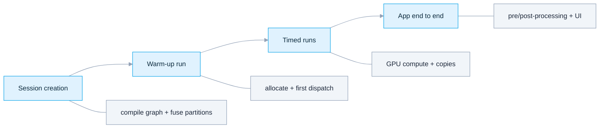

| Topic | Guidance |
|---|---|
| Shapes | Prefer static dimensions — better inference, constant folding, DML fusion, and predictable first runs |
| Dynamic dims | Use free-dimension overrides when deployment shapes are known; otherwise expect less fusion |
| Opset | Keep released-wheel qualification at opset 20 or below; this demo uses 17 |
| Precision | Start FP32, then validate FP16/INT8/QDQ per target EP |
| Transfers | Tiny models are dominated by NumPy↔GPU copies; use realistic batches and I/O binding |
| Warm-up | Session creation and first inference compile graphs and allocate resources; measure them separately |
| Metacommands | Driver-optimized paths help; disable only to diagnose, then re-compare |
| Concurrency | One DML session is sequential; use independent sessions for concurrent `Run` |
| Windows ML | Benchmark the *selected* EP, not the policy name |

The generated graph is intentionally too small to benchmark hardware; its latency only catches gross stalls.

---

## 10. Troubleshooting

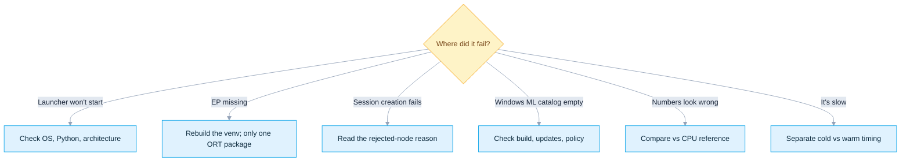

| Symptom | Meaning | Action |
|---|---|---|
| `The ... route requires native Windows` | Started on Linux/WSL/other OS | Run on native Windows; WSL has no DirectML Python route |
| Wrong Python / 32-bit failure | Wheel ABI cannot match | Install 64-bit CPython 3.12; start with `py -3.12` |
| `DmlExecutionProvider` absent | Wrong ORT distribution or damaged venv | `... directml --refresh`; never add another ORT package |
| DXGI index missing | `--device-id` outside enumeration | Use an index the launcher printed |
| D3D12 device creation fails | Adapter/driver lacks working DX12, or software adapter chosen | Update the driver; choose a hardware adapter |
| Session reports CPU fallback disabled | Some smoke work was not accepted by the EP | Repair runtime/driver; for a custom model, inspect unsupported ops/types/shapes |
| App Runtime init fails | Missing/mismatched App Runtime | Install signed 2.1.3 matching both `wasdk-*` packages |
| Empty Windows ML catalog | OS build, Windows Update, catalog service, or policy | Confirm build 26100+, updates, Store/catalog access, admin policy |
| Provider is `NotPresent` | Compatible entry exists but package absent | Rerun with `--allow-download` if policy permits |
| `ensure_ready_async` fails | Driver/hardware/package requirement unmet | Read its diagnostic; update the exact OEM/vendor driver |
| Library registration fails | App Runtime/ORT/plugin ABI mismatch | Recreate the venv, reboot after updates, keep one tuple |
| `CPUExecutionProvider` selected, proof fails | `DEFAULT` prefers CPU, or no usable device registered | Use `prefer-gpu`/`prefer-npu`, prepare a provider, or name it |
| Windows ML passes but hardware class unclear | The EP exposes CPU plus GPU/NPU; EP-name evidence cannot tell them apart | Select/log the intended `OrtEpDevice`, then repeat the checks |
| Numerical mismatch | Precision, driver, or operator issue | Reproduce with FP32/static shapes, update driver, minimize the model |
| Device removed / TDR | GPU reset, timeout, memory pressure, or driver defect | Reduce workload, check Event Viewer, update driver, test without metacommands |

```powershell
winver
Get-CimInstance Win32_VideoController | Select-Object Name, DriverVersion, AdapterRAM
py -3.12 DirectML\one_click.py directml --refresh
py -3.12 DirectML\one_click.py windowsml --provider DmlExecutionProvider --allow-download
```

---

## 11. Source map

### Claim-to-source audit

| Claim | Primary evidence | Result |
|---|---|---|
| DirectML is sustained engineering; released contract is DirectML 1.15.2 through opset 20 | [Official DirectML EP guide](https://onnxruntime.ai/docs/execution-providers/DirectML-ExecutionProvider.html) | Confirmed |
| `device_id` is DXGI order; DML needs sequential execution and no memory pattern | [`dml_provider_factory.h`](https://github.com/microsoft/onnxruntime/blob/bf6aa0063d1c178c4a4d33ed6770425834147e2a/include/onnxruntime/core/providers/dml/dml_provider_factory.h) + [`inference_session.cc`](https://github.com/microsoft/onnxruntime/blob/bf6aa0063d1c178c4a4d33ed6770425834147e2a/onnxruntime/core/session/inference_session.cc) | Confirmed |
| DML takes exactly 4 provider options (`device_id`, `performance_preference`, `device_filter`, `disable_metacommands`) plus 5 `ep.dml.*` session config keys — no others exist | [`dml_provider_factory.cc`](https://github.com/microsoft/onnxruntime/blob/bf6aa0063d1c178c4a4d33ed6770425834147e2a/onnxruntime/core/providers/dml/dml_provider_factory.cc) + [`dml_session_options_config_keys.h`](https://github.com/microsoft/onnxruntime/blob/bf6aa0063d1c178c4a4d33ed6770425834147e2a/onnxruntime/core/providers/dml/dml_session_options_config_keys.h) | Confirmed |
| Capability depends on kernel registration, support query, device data types, and CPU-preferred analysis | [`ExecutionProvider.cpp`](https://github.com/microsoft/onnxruntime/blob/bf6aa0063d1c178c4a4d33ed6770425834147e2a/onnxruntime/core/providers/dml/DmlExecutionProvider/src/ExecutionProvider.cpp) | Confirmed |
| There is no true `WinMLExecutionProvider` | [`winml_provider_factory.h`](https://github.com/microsoft/onnxruntime/blob/bf6aa0063d1c178c4a4d33ed6770425834147e2a/include/onnxruntime/core/providers/winml/winml_provider_factory.h) + [`symbols.txt`](https://github.com/microsoft/onnxruntime/blob/bf6aa0063d1c178c4a4d33ed6770425834147e2a/onnxruntime/core/providers/winml/symbols.txt) | Confirmed |
| Python must register each catalog `library_path` | [Install EPs](https://learn.microsoft.com/windows/ai/new-windows-ml/initialize-execution-providers) + [Register EPs](https://learn.microsoft.com/windows/ai/new-windows-ml/register-execution-providers) | Confirmed |
| Built-in policies map to CPU/NPU/GPU selectors with CPU fallback | [`provider_policy_context.cc`](https://github.com/microsoft/onnxruntime/blob/bf6aa0063d1c178c4a4d33ed6770425834147e2a/onnxruntime/core/session/provider_policy_context.cc) | Confirmed |
| Pinned versions/architectures exist | [DirectML PyPI](https://pypi.org/project/onnxruntime-directml/1.24.4/) + [Windows ML projection PyPI](https://pypi.org/project/wasdk-Microsoft.Windows.AI.MachineLearning/2.1.3/) | Confirmed |

### ONNX Runtime source (audited commit)

| Area | File |
|---|---|
| Public DML C API and options | [`dml_provider_factory.h`](https://github.com/microsoft/onnxruntime/blob/bf6aa0063d1c178c4a4d33ed6770425834147e2a/include/onnxruntime/core/providers/dml/dml_provider_factory.h) |
| Adapter enumeration, D3D/DML creation | [`dml_provider_factory.cc`](https://github.com/microsoft/onnxruntime/blob/bf6aa0063d1c178c4a4d33ed6770425834147e2a/onnxruntime/core/providers/dml/dml_provider_factory.cc) |
| DML-specific session config keys | [`dml_session_options_config_keys.h`](https://github.com/microsoft/onnxruntime/blob/bf6aa0063d1c178c4a4d33ed6770425834147e2a/onnxruntime/core/providers/dml/dml_session_options_config_keys.h) |
| Capability, allocators, run lifecycle | [`ExecutionProvider.cpp`](https://github.com/microsoft/onnxruntime/blob/bf6aa0063d1c178c4a4d33ed6770425834147e2a/onnxruntime/core/providers/dml/DmlExecutionProvider/src/ExecutionProvider.cpp) |
| Graph partition merging | [`GraphPartitioner.cpp`](https://github.com/microsoft/onnxruntime/blob/bf6aa0063d1c178c4a4d33ed6770425834147e2a/onnxruntime/core/providers/dml/DmlExecutionProvider/src/GraphPartitioner.cpp) |
| Command recording and submission | [`DmlCommandRecorder.cpp`](https://github.com/microsoft/onnxruntime/blob/bf6aa0063d1c178c4a4d33ed6770425834147e2a/onnxruntime/core/providers/dml/DmlExecutionProvider/src/DmlCommandRecorder.cpp) |
| Queue and fence lifetime | [`CommandQueue.cpp`](https://github.com/microsoft/onnxruntime/blob/bf6aa0063d1c178c4a4d33ed6770425834147e2a/onnxruntime/core/providers/dml/DmlExecutionProvider/src/CommandQueue.cpp) |
| Automatic EP policy | [`provider_policy_context.cc`](https://github.com/microsoft/onnxruntime/blob/bf6aa0063d1c178c4a4d33ed6770425834147e2a/onnxruntime/core/session/provider_policy_context.cc) |
| WinML export is not a true EP | [`winml_provider_factory.h`](https://github.com/microsoft/onnxruntime/blob/bf6aa0063d1c178c4a4d33ed6770425834147e2a/include/onnxruntime/core/providers/winml/winml_provider_factory.h) |
| Legacy DML session builder | [`OnnxruntimeDmlSessionBuilder.cpp`](https://github.com/microsoft/onnxruntime/blob/bf6aa0063d1c178c4a4d33ed6770425834147e2a/winml/lib/Api.Ort/OnnxruntimeDmlSessionBuilder.cpp) |

### Official documentation

- [DirectML Execution Provider](https://onnxruntime.ai/docs/execution-providers/DirectML-ExecutionProvider.html) · [Install ORT / Windows ML](https://onnxruntime.ai/docs/install/#cccwinml-installs) · [ORT on Windows](https://onnxruntime.ai/docs/get-started/with-windows.html)
- [What is Windows ML?](https://learn.microsoft.com/windows/ai/new-windows-ml/overview) · [Walkthrough](https://learn.microsoft.com/windows/ai/new-windows-ml/tutorial) · [Install EPs](https://learn.microsoft.com/windows/ai/new-windows-ml/initialize-execution-providers) · [Register EPs](https://learn.microsoft.com/windows/ai/new-windows-ml/register-execution-providers)
- [Supported EPs](https://learn.microsoft.com/windows/ai/new-windows-ml/supported-execution-providers) · [Catalog vs. bring-your-own](https://learn.microsoft.com/windows/ai/new-windows-ml/windows-ml-eps-vs-bring-your-own) · [Windows ML samples](https://github.com/microsoft/WindowsAppSDK-Samples/tree/main/Samples/WindowsML) · [DirectML API](https://learn.microsoft.com/windows/ai/directml/dml)

---

## 12. Validation boundary

Prepared on Linux — no Windows GPU/NPU executed during this edit. What did run: helper tests (profile parsing, strict assignment, policy mapping, package-name normalization); `one_click.py` bytecode compilation; full CPython 3.12 dependency resolution for DirectML x64 and Windows ML x64/ARM64; source/API audit against the pinned commit and Microsoft Learn; PyPI metadata/file audit; syntax parsing of every Python example and Mermaid diagram; HTTP availability of the pinned x64 App Runtime installer.

Run the matching one-click command on the target Windows device before treating a route as qualified. A pass applies only to the generated smoke model, selected adapter/provider, current driver, and current package tuple. Repeat the proof with your production model and representative inputs.
