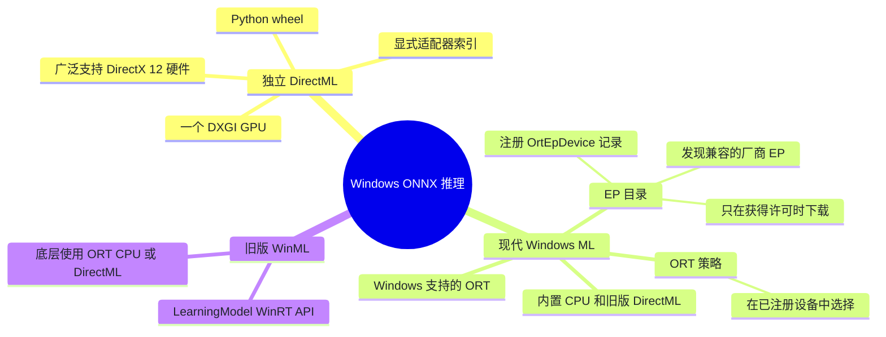
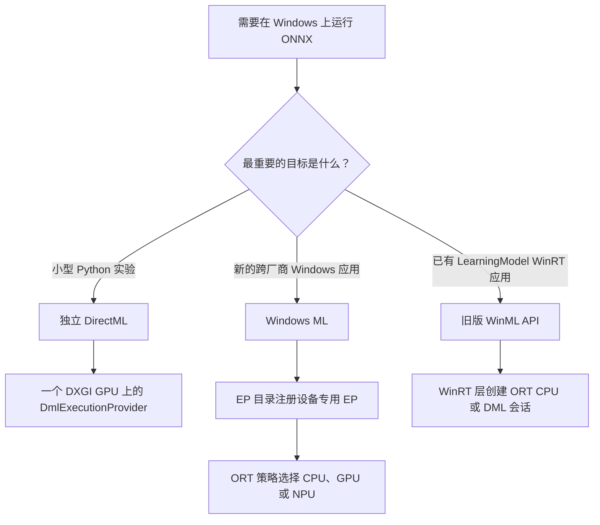
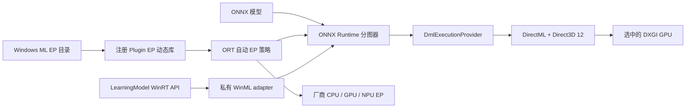
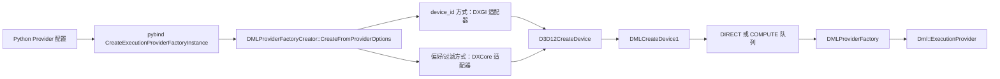
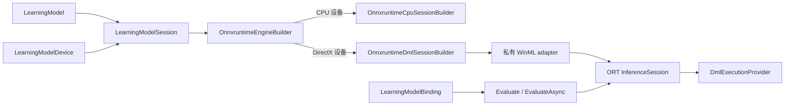

# 在 Windows 上使用 ONNX Runtime + DirectML / Windows ML

[English](README.md) · [仓库首页](../README.zh-CN.md) · [DirectML EP 官方指南](https://onnxruntime.ai/docs/execution-providers/DirectML-ExecutionProvider.html)

| 项目 | 本文采用的版本或环境 |
|---|---|
| 最近核验 | `2026-07-17`；已核对官方文档、PyPI 元数据和文件，以及 ONNX Runtime 源码 |
| 核验源码 | ONNX Runtime `bf6aa0063d1c178c4a4d33ed6770425834147e2a`（`2026-07-17T04:49:55Z` 时的 `main` HEAD） |
| 运行环境 | 原生 Windows；DirectML wheel 仅支持 x64，Windows ML 支持 x64 或 ARM64 |
| 独立 DirectML 方案 | `onnxruntime-directml==1.24.4`、`DmlExecutionProvider`、DirectX 12 GPU |
| Windows ML 方案 | Windows App SDK `2.1.3` Python 投影包（语言绑定），以及精确匹配的 `onnxruntime-windowsml==1.24.6.202605042033` |
| 维护状态 | DirectML 仍受支持，但目前处于持续工程维护阶段；微软建议新的 Windows 部署优先使用 Windows ML |
| 入口 | [`one_click.py`](one_click.py) |
| 验证方式 | 与 CPU 结果对比，记录计算图分配和当前运行的 profile，并禁止回退到默认 ORT CPU EP |
| 已验证范围 | 辅助测试以及面向 CPython 3.12 的 DirectML x64、Windows ML x64/ARM64 依赖解析已在 Linux 上通过；DirectML 和 EP 目录中的 Provider 仍需在匹配的 Windows 设备上实际运行 |

### 文件

| 文件 | 用途 |
|---|---|
| [`README.md`](README.md) | 完整英文配置与源码指南 |
| [`README.zh-CN.md`](README.zh-CN.md) | 本中文指南 |
| [`one_click.py`](one_click.py) | 用一条命令搭建环境并执行严格验证 |
| [`requirements-directml.txt`](requirements-directml.txt) | 独立 DirectML 环境 |
| [`requirements-winml.txt`](requirements-winml.txt) | Windows ML EP 目录环境 |

> [!IMPORTANT]
> 不存在名为 `WinMLExecutionProvider` 的 EP。独立 DirectML 使用的是 ORT 中名为 `DmlExecutionProvider` 的执行提供程序。Windows ML 则由 Windows 支持的 ONNX Runtime 发行版、EP 目录和自动选择机制共同组成。EP 目录实际注册的是 `DmlExecutionProvider`、`QNNExecutionProvider`、`VitisAIExecutionProvider`、`MIGraphXExecutionProvider` 或其他厂商 EP。
>
> 本文的 `windowsml` 命令要求 Windows 11 24H2（build 26100）或更新版本，因为它会验证从 EP 目录动态获取硬件 Provider 的完整流程。Windows ML 内置的 CPU 和旧版 DirectML EP 不需要经过目录下载，可以在对应 Windows App SDK 支持的所有系统版本上使用。

### 60 秒概览



---

## 1. 选择合适的方案

| 目标 | 建议方案 | 适用场景 | 主要限制 |
|---|---|---|---|
| 尽快完成 Python GPU 验证 | **独立 DirectML** | 需要通用的 DirectX 12 GPU 后端，并且希望显式选择适配器 | 处于持续工程维护阶段；当前 PyPI wheel 仅支持 Windows x64 |
| 新的 Windows 应用 | **Windows ML** | 希望由 Windows 发现、获取、更新厂商 EP，并使用 ORT 自动设备策略 | 动态获取的硬件 EP 需要 Windows 11 24H2（build 26100）或更新版本 |
| 使用 WinRT 媒体/张量 API | **旧版 WinML API** | 现有代码已使用 `LearningModel`、`VideoFrame` 和 `LearningModelBinding` | 它只是 ORT CPU/DML 之上的 API 层，并不是另一个 EP |
| 完全掌控厂商软件栈 | 直接使用厂商 EP | 部署环境已经自行管理 CUDA、QNN、OpenVINO、MIGraphX 或 Vitis AI | 需要自行处理更多打包和兼容性问题 |



**建议按以下顺序上手：**

1. 在默认适配器上运行独立 DirectML。
2. 使用 `--device-id` 逐一验证计划部署的 DirectML 适配器。
3. 先让 Windows ML 只使用已经安装的 Provider。
4. 增加 `--allow-download`，允许从 EP 目录下载软件包，再严格验证选中的厂商 EP。
5. 使用生产模型重新检查节点分配、CPU 回退和精度。

---

## 2. 了解各个名称和软件层

| 名称 | 是什么 | 不是什么 |
|---|---|---|
| **Direct3D 12** | Windows GPU/计算设备、资源、队列、命令列表和 fence API | 神经网络计算图运行时 |
| **DirectML** | 面向 DirectX 12 的底层机器学习算子和图执行库 | ONNX Runtime 本身 |
| **DirectML EP** | 将受支持的 ONNX 计算映射到 DirectML 的 ORT 适配层 | 厂商专用驱动 |
| **旧版 WinML** | 构建在 ORT 上的 `Windows.AI.MachineLearning` / `Microsoft.AI.MachineLearning` WinRT 对象模型 | 名为 WinML 的 EP |
| **现代 Windows ML** | Windows 支持的 ORT 发行版、EP 目录、模型工具和选择策略 | 只有旧版 `LearningModel` 层 |
| **Plugin EP** | 独立 Provider 动态库使用的公开 ORT C ABI | 某个固定 CPU/GPU/NPU |
| **驱动** | 实现 DirectX 12 或硬件专用 EP 接口的厂商软件 | 由 ONNX 模型自动安装的软件 |



源码目录同样反映了这些层次：

- [`onnxruntime/core/providers/dml`](https://github.com/microsoft/onnxruntime/tree/bf6aa0063d1c178c4a4d33ed6770425834147e2a/onnxruntime/core/providers/dml) 才是真正的 DirectML EP。
- [`onnxruntime/core/providers/winml`](https://github.com/microsoft/onnxruntime/tree/bf6aa0063d1c178c4a4d33ed6770425834147e2a/onnxruntime/core/providers/winml) 只保留 `OrtGetWinMLAdapter` 导出接口。其头文件明确说明它**并不是真正的执行提供程序**。
- [`winml`](https://github.com/microsoft/onnxruntime/tree/bf6aa0063d1c178c4a4d33ed6770425834147e2a/winml) 包含旧版 WinRT `LearningModel` 实现、私有 adapter、图像转换、engine 和测试代码。
- 现代 Windows ML 的 EP 目录由 Windows App SDK 提供。它使用 ORT 公开的插件设备和自动选择 API，而不是某个隐藏的 `WinMLExecutionProvider`。

---

## 3. 核对系统要求和版本

### 3.1 独立 DirectML

| 要求 | 本文基线 | 原因 |
|---|---|---|
| 系统 | Windows 10 1903（build 18362）+；推荐 Windows 11 | DirectML 从 1903 开始进入 Windows |
| GPU | 支持 DirectX 12 | DML 会为选中的适配器创建 D3D12 设备 |
| 微软列举的示例 | NVIDIA Kepler+、AMD GCN 第一代+、Intel Haswell 核显+、Qualcomm Adreno 600+ | 说明覆盖面广，不代表每个模型都很快 |
| 驱动 | 当前稳定 OEM 或 GPU 厂商驱动 | D3D12 和 DirectML 能力来自驱动 |
| 进程 | x64 CPython 3.12 | 当前 PyPI DirectML 只有 `win_amd64` 文件 |
| Runtime | `onnxruntime-directml==1.24.4` | 核验时最新的稳定 DirectML Python 发行版 |

官方发布信息注明 DirectML 版本为 `1.15.2`，支持到 ONNX opset 20，并列出了 5-D `GridSample` 20 和 `DeformConv` 等例外。本文核验的 `main` 源码已经包含更新的算子版本代码，但这些变化不会自动扩大 1.24.4 wheel 已承诺的支持范围。

### 3.2 Windows ML EP 目录方案

| 要求 | 本文基线 | 原因 |
|---|---|---|
| 本文完整验证所需系统 | Windows 11 24H2，build 26100+ | 启动脚本会验证动态获取硬件 EP 的完整流程 |
| Windows ML 的更广平台范围 | 对应 Windows App SDK 支持的任意系统 | 内置 ORT CPU 和 DirectML 无需从目录下载；本文脚本不测试这种简化用法 |
| 架构 | x64 或 ARM64 | Windows ML 同时发布这两种架构 |
| Python | CPython 3.12 | 本文统一核验的 wheel ABI |
| Windows App Runtime | `2.1.3` | 必须与两个 `wasdk-*` Python 投影包保持一致 |
| ML 投影包 | `wasdk-Microsoft.Windows.AI.MachineLearning[all]==2.1.3` | 向 Python 提供 `ExecutionProviderCatalog` |
| Bootstrap 投影包 | `wasdk-Microsoft.Windows.ApplicationModel.DynamicDependency.Bootstrap==2.1.3` | 为未打包的 Python 程序激活匹配的 App Runtime |
| ORT 发行版 | `onnxruntime-windowsml==1.24.6.202605042033` | ML 投影包 2.1.3 声明的精确依赖 |
| NumPy | `2.4.6` | 同时提供 CPython 3.12 Windows x64 与 ARM64 wheel；NumPy 1.26.4 没有 Windows ARM64 wheel |

核验当天，PyPI 上的精确依赖关系如下：

| 包发布线 | 精确 ORT 关系 | 含义 |
|---|---|---|
| 本文使用：`wasdk-*==2.1.3` | ML 投影包要求 `onnxruntime-windowsml==1.24.6.202605042033` | 启动脚本采用并经过核验的组合 |
| 更新的投影包：`wasdk-*==2.3.0` | ML 投影包要求 `onnxruntime-windowsml==1.25.2.202605110140` | 这是另一套完整组合，不能只升级其中的 ORT |
| 最新的独立 Windows ML wheel | `onnxruntime-windowsml==1.27.1.202607110137` | 比上述两套投影包所固定的版本都新，不能混入其中任意一套组合 |

ML 投影包会指定准确的 ORT build，已安装的 Windows App Runtime 也必须来自同一发布系列。本文继续使用已经核验的 2.1.3 组合，直到更新的完整组合通过硬件验证。

### 3.3 每个环境只能有一个 ORT 发行包

下面每个发行包都会安装同名 Python 包 `onnxruntime`：

- `onnxruntime`
- `onnxruntime-directml`
- `onnxruntime-gpu`
- `onnxruntime-openvino`
- `onnxruntime-windowsml`

同时安装两个发行包，可能会直接相互覆盖 Python 文件和原生 DLL，依赖解析器也不一定会给出有用的错误信息。启动脚本会分别创建 `.venv-directml` 和 `.venv-windowsml`，确认 `onnxruntime` 实际来自哪个发行包，核对准确版本，并在推理前运行 `pip check`。

---

## 4. 用最少步骤运行

### 4.1 安装 Python 和 Visual C++ Runtime

打开 PowerShell：

```powershell
winget install --id Python.Python.3.12 -e `
  --accept-package-agreements --accept-source-agreements

winget install --id Microsoft.VCRedist.2015+.x64 -e `
  --accept-package-agreements --accept-source-agreements
```

如果使用原生 ARM64 Windows ML 进程，请安装 ARM64 版 Visual C++ Redistributable。首次安装 Python 后，请关闭当前终端并重新打开，然后执行以下检查：

```powershell
py -3.12 --version
py -3.12 -c "import platform, struct; print(platform.machine(), struct.calcsize('P') * 8)"
```

输出应包含 Python 3.12、目标架构和 `64`。

### 4.2 独立 DirectML，一条命令

在仓库根目录运行：

```powershell
py -3.12 DirectML\one_click.py directml
```

如需选择启动脚本列出的其他 GPU：

```powershell
py -3.12 DirectML\one_click.py directml --device-id 1
```

`device_id` 遵循 `IDXGIFactory::EnumAdapters` 的枚举顺序。适配器 0 通常是负责显示的默认 GPU，但不一定是性能最高的 GPU。启动脚本会按同一顺序列出每个适配器的名称、PCI 厂商/设备 ID、专用显存，并标出当前选择。

### 4.3 安装 App Runtime 后，一条命令运行 Windows ML

Python bootstrap 使用 `ON_NO_MATCH_SHOW_UI`，因此缺少匹配的 Runtime 时，Windows 可能会弹出安装提示。若要搭建便于核验的 x64 环境，可以预先安装 2.1.3，并验证安装程序确实由微软签名：

```powershell
$installer = "$env:TEMP\windowsappruntimeinstall-2.1.3-x64.exe"
Invoke-WebRequest `
  https://aka.ms/windowsappsdk/2.1/2.1.3/windowsappruntimeinstall-x64.exe `
  -OutFile $installer

$signature = Get-AuthenticodeSignature -LiteralPath $installer
if ($signature.Status -ne 'Valid' -or
    $signature.SignerCertificate.Subject -notmatch 'Microsoft Corporation') {
  Remove-Item $installer -Force -ErrorAction SilentlyContinue
  throw 'Windows App Runtime 安装器没有有效的微软签名。'
}

try {
  $process = Start-Process $installer -ArgumentList '--quiet' -Wait -PassThru
  if ($process.ExitCode -ne 0) { throw "安装器失败：$($process.ExitCode)" }
} finally {
  Remove-Item $installer -Force -ErrorAction SilentlyContinue
}
```

原生 ARM64 Python 应按照官方 [Windows App SDK 部署指南](https://learn.microsoft.com/windows/apps/windows-app-sdk/deploy-unpackaged-apps)获取同一 2.1.3 发布系列的 ARM64 安装程序，或通过 bootstrap 界面安装匹配的 Runtime。上面的 x64 安装命令不能用于验证 ARM64 环境。

然后运行：

```powershell
py -3.12 DirectML\one_click.py windowsml --allow-download
```

未指定 `--policy` 时，启动脚本默认使用 `max-performance`（`MAX_PERFORMANCE`），而不是 ORT 中优先选择 CPU 的 `DEFAULT` 策略。

常用验证方式：

```powershell
# 在所有已注册的 EP 目录 Provider 中优先选择 GPU。
py -3.12 DirectML\one_click.py windowsml --policy prefer-gpu --allow-download

# 只准备指定的 EP 目录 Provider，再由策略选择其设备。
py -3.12 DirectML\one_click.py windowsml `
  --provider DmlExecutionProvider --policy prefer-gpu --allow-download

# 重建独立 DirectML 的临时环境。
py -3.12 DirectML\one_click.py directml --refresh
```

未指定 `--allow-download` 时，启动脚本会跳过状态为 `NotPresent` 的目录项。不过，如果当前 ORT 进程已经为同名 EP 提供了 `OrtEpDevice`，就可以直接复用，无需下载新软件包。企业设备还可能通过管理策略禁止 Microsoft Store 或 Windows Update 下载软件包；这属于系统管理策略问题，与 ONNX 模型无关。

| 目录状态 | 含义 | 启动脚本的处理方式 |
|---|---|---|
| `NotPresent` | EP 包尚未安装 | 未指定 `--allow-download` 时跳过/失败；如果 ORT 已暴露同名 EP 设备则直接复用 |
| `NotReady` | 已安装，但尚未加入本应用的依赖图 | 调用 `ensure_ready_async()`；通常不需要重新下载 |
| `Ready` | 已安装且已加入应用依赖图 | 复用现有 ORT 设备，或注册返回的动态库路径 |

---

## 5. 一键严格验证具体做了什么

这个脚本用于严格验证实际执行情况，并不只是打印 Provider 列表：

1. 拒绝非 Windows、32 位、系统版本过低、Python 不匹配和 Microsoft Store alias 主机。
2. 为所选方案创建独立虚拟环境，并安装固定版本的依赖。
3. 如果发现多个 ORT 发行包，或 `onnxruntime` 实际来自错误的发行包，则立即退出。
4. 离线生成一个静态 FP32 ONNX 图：两个 `MatMul`、两个 `Add`、一个 `Relu`。
5. 用独立 `CPUExecutionProvider` 生成参考结果。
6. 对独立 DirectML 选择 DXGI 适配器；对于 Windows ML，则在 `.venv-windowsml` 中执行官方 Python 示例提供的 `winrt/msvcp140.dll` 冲突规避操作，然后在同一个 Python ORT 进程中准备并显式注册经过认证的 EP 目录动态库。
7. 开启全部图优化、禁用内存模式、强制顺序执行、记录计算图分配、开启 profile，并设置 `session.disable_cpu_ep_fallback=1`。
8. 创建目标会话，禁用运行时回退，执行预热和计时，并将结果与 CPU 参考值比较。
9. 如果发现任何 `CPUExecutionProvider` 节点分配/profile 事件，或者虽然有目标 EP 分配、当前运行却没有对应事件，则判定失败。
10. 在 Windows App SDK bootstrap 上下文仍然有效时，注销从 EP 目录注册的插件。

### 正确理解 PASS

| 方案 | PASS 可以确认 | PASS 无法确认 |
|---|---|---|
| 独立 DirectML | 计算图已分配给 `DmlExecutionProvider`，当前运行产生了 DML profile 事件，并且 DML 会话使用了显式指定索引的 DXGI 适配器 | 生产模型是否受支持、实际性能，以及冒烟测试输入之外的精度 |
| Windows ML | 已注册的 EP 目录 Provider 获得了计算图并产生当前运行事件，而且没有节点交给默认 ORT CPU EP | 如果同一个 EP 名称提供多类设备，则无法唯一确定具体 GPU/NPU；厂商 CPU EP 也可能通过，因为分配和 profile 只记录 EP 名称，不记录准确设备 |
| 两种方案 | 输出在 `rtol=1e-3`、`atol=1e-4` 范围内与独立 CPU 参考结果一致 | 位级一致性或硬件性能 |

两个名称相似的开关解决不同问题：

| 开关 | 作用范围 | 防止的问题 |
|---|---|---|
| `session.disable_cpu_ep_fallback=1` | C++ 计算图初始化 | 节点静默分配给默认微软 `CPUExecutionProvider` |
| `session.disable_fallback()` | 会话创建后的 Python 包装层 | 运行失败后用 fallback Provider 重建会话并重试 |

### 为什么要同时检查分配记录和 profile？

| 证据 | 可以确认 | 还缺少什么 |
|---|---|---|
| `get_available_providers()` | 二进制能够提供或加载该 EP | 无法说明当前模型的节点分配情况 |
| 会话 Provider 列表 | EP 注册和优先级 | 不支持的节点仍可能由 CPU 执行 |
| 计算图分配记录 | ORT 已将子图分配给该 EP | 单独无法确认当前运行是否真的产生了对应内核事件 |
| 当前运行的 profile | 节点事件归属于该 EP | 仍需分配记录提供明确的分图上下文 |
| CPU 参考结果 | 数值结果基本正确 | 不能识别执行设备 |
| 禁用默认 ORT CPU 回退 | 不受支持的节点分配会直接失败 | 仍需分配/profile 信息确认目标 EP 的执行情况 |

成功的 DirectML 输出大致如下：

```text
Route              : directml
ONNX Runtime       : 1.24.4
DXGI adapters:
  - 0: Intel(R) Graphics, vendor=0x8086, ...
  - 1: NVIDIA GeForce ..., vendor=0x10DE, ... [selected]
Session providers   : ['DmlExecutionProvider', 'CPUExecutionProvider']
Graph assignment    : {'DmlExecutionProvider': ...}
Profiled providers  : {'DmlExecutionProvider': ...}
Max |target-CPU|    : ...

PASS: DmlExecutionProvider executed ... profiled node event(s) with ORT CPU fallback disabled.
```

ORT 会先隐式注册 `CPUExecutionProvider`，再检查禁止回退的配置，因此它仍可能出现在会话 Provider 列表中。只有当分配给该 EP 的节点数和事件数都为零时，验证才会通过。即便如此，也不能排除某个厂商 EP 自身选择了 CPU 设备。DML 图融合还可能把五个 ONNX 节点合并成一个运行时节点，因此 profile 事件数不需要等于五。

---

## 6. DirectML 源码实现

下面沿着本文核验版本的源码，从 Python 配置一直追踪到 D3D12 执行。

### 6.1 注册与工厂创建



公开的 Python API 会先进入 [`CreateExecutionProviderFactoryInstance`](https://github.com/microsoft/onnxruntime/blob/bf6aa0063d1c178c4a4d33ed6770425834147e2a/onnxruntime/python/onnxruntime_pybind_state.cc)，再调用 [`DMLProviderFactoryCreator`](https://github.com/microsoft/onnxruntime/blob/bf6aa0063d1c178c4a4d33ed6770425834147e2a/onnxruntime/core/providers/dml/dml_provider_factory.cc)。

本文核验的 `main` 会解析以下选项：

| Key | 值 | 行为 |
|---|---|---|
| `device_id` | 非空整数字符串 | 使用旧版 DXGI 适配器索引方式；优先级高于偏好/过滤配置 |
| `disable_metacommands` | `true`、`True`、`false`、`False` | 为 true 时增加 `DML_EXECUTION_FLAG_DISABLE_META_COMMANDS` |
| `performance_preference` | `default`、`high_performance`、`minimum_power` | 对兼容 DXCore 适配器排序 |
| `device_filter` | `gpu`；编译了 NPU 枚举时还支持 `npu` / `any` | 先过滤 DXCore 适配器，再选择排序第一项 |

一键脚本的独立 DirectML 方案只使用 `device_id`，因为这是 1.24.4 已发布并正式记录的稳定 Python 接口。不能假设 `main` 中较新的 DXCore 过滤功能也存在于所有旧版 wheel 中。对于新的 NPU 部署，通常应通过 Windows ML 选择硬件厂商提供的 EP；与依赖通用 DML NPU 枚举相比，这种方式的支持范围更明确。

DXGI 方式会拒绝软件适配器，先以 feature level 11.0 创建 D3D12 设备，再通过 `DMLCreateDevice1` 和 DML feature level 5.0 创建 `IDMLDevice`。较新的 DXCore 方式会枚举 `D3D12_GENERIC_ML` 或 core-compute 适配器，识别 GPU/NPU 类型，按功耗或性能偏好排序，然后创建第一个匹配的设备。

设备支持的最高 feature level 不超过 `D3D_FEATURE_LEVEL_1_0_CORE` 时，工厂选择 `COMPUTE` 队列；否则选择 `DIRECT`。调用方传入的 `IDMLDevice` 与命令队列必须属于同一个 D3D12 设备，只允许 `DIRECT` 或 `COMPUTE` 队列；会话会持有二者的强引用。

### 6.2 会话限制与内存

DirectML 资源是 D3D12 buffer，不是普通可按字节寻址的 CPU 分配，因此有两个公开限制：

```python
options.enable_mem_pattern = False
options.execution_mode = ort.ExecutionMode.ORT_SEQUENTIAL
```

当前的 `InferenceSession::RegisterExecutionProvider` 可以自动修正 DML 的这两项配置并记录日志。不过，DirectML 的公开要求和旧版 WinML adapter 仍要求调用方正确设置，因此显式配置的兼容性更好。不要从多个线程并发调用同一个 DML 会话的 `Run`；如需并发，请创建多个独立会话。

[`ExecutionProviderImpl`](https://github.com/microsoft/onnxruntime/blob/bf6aa0063d1c178c4a4d33ed6770425834147e2a/onnxruntime/core/providers/dml/DmlExecutionProvider/src/ExecutionProvider.cpp) 持有：

- `ID3D12Device` 和 `IDMLDevice`；
- 带 DML `OrtMemoryInfo` 的 GPU [`BucketizedBufferAllocator`](https://github.com/microsoft/onnxruntime/blob/bf6aa0063d1c178c4a4d33ed6770425834147e2a/onnxruntime/core/providers/dml/DmlExecutionProvider/src/BucketizedBufferAllocator.cpp)；
- upload/readback 数据通道和 CPU 输入分配器；
- 在 CPU 到 GPU、GPU 到 CPU 和 GPU buffer 之间复制的 [`DataTransfer`](https://github.com/microsoft/onnxruntime/tree/bf6aa0063d1c178c4a4d33ed6770425834147e2a/onnxruntime/core/providers/dml/DmlExecutionProvider/src)；
- 在条件允许时，由同一 D3D12 设备上的 Python I/O binding 共享的执行上下文。

C API 可以把调用方持有的 D3D12 资源封装为 DML 分配，也可以获取 DML 分配背后的 `ID3D12Resource`。这些接口用于原生零拷贝集成；普通 NumPy 输入仍然需要在 CPU 与 GPU 之间传输。

### 6.3 能力判断、回退与分图

[`ExecutionProviderImpl::GetCapability`](https://github.com/microsoft/onnxruntime/blob/bf6aa0063d1c178c4a4d33ed6770425834147e2a/onnxruntime/core/providers/dml/DmlExecutionProvider/src/ExecutionProvider.cpp) 不只是检查算子名称：

1. `kernel_lookup.LookUpKernel(node)` 必须找到 DML 注册。
2. 算子专用 `supportQuery` 可能拒绝某种属性/形状组合。
3. 节点张量类型必须位于当前设备的数据类型 mask 中。
4. ORT CPU-preferred 分析可能让 shape/轻量节点留在 CPU，避免得不偿失的传输。
5. 接受的节点成为 ORT 分图器使用的 `ComputeCapability` 记录。

设备类型 mask 很重要：DML 会预先注册内核，但所选硬件可能不支持所有数据类型。在 capability 检查阶段拒绝节点，可以让普通模式回退到 CPU，而不是拖到创建算子时才失败。本文的冒烟测试图应当完全受支持，因此严格模式会把这种回退直接变成会话创建失败。

完成初始分配后，[`GraphPartitioner.cpp`](https://github.com/microsoft/onnxruntime/blob/bf6aa0063d1c178c4a4d33ed6770425834147e2a/onnxruntime/core/providers/dml/DmlExecutionProvider/src/GraphPartitioner.cpp) 和 DML 图变换器会合并兼容节点。当输入和输出 shape 静态、必需输入为常量、边类型受支持且分区边界安全时，多个节点可以合并成一个 DirectML 图。对于包含 ONNX 子图的模型，分区会更保守，因为隐式输入和共享 initializer 会让所有权关系更复杂。

### 6.4 图编译与执行

[`DmlGraphFusionTransformer`](https://github.com/microsoft/onnxruntime/blob/bf6aa0063d1c178c4a4d33ed6770425834147e2a/onnxruntime/core/providers/dml/DmlExecutionProvider/src/DmlGraphFusionTransformer.cpp) 负责创建静态融合分区，[`DmlRuntimeGraphFusionTransformer`](https://github.com/microsoft/onnxruntime/blob/bf6aa0063d1c178c4a4d33ed6770425834147e2a/onnxruntime/core/providers/dml/DmlExecutionProvider/src/DmlRuntimeGraphFusionTransformer.cpp) 则用于 graph capture。[`DmlGraphFusionHelper`](https://github.com/microsoft/onnxruntime/blob/bf6aa0063d1c178c4a4d33ed6770425834147e2a/onnxruntime/core/providers/dml/DmlExecutionProvider/src/DmlGraphFusionHelper.cpp) 会转换图边和算子、调用 `IDMLDevice1::CompileGraph`、分配持久资源和临时资源、创建 binding table，并记录可复用的命令列表。

普通执行链：


[`CommandQueue`](https://github.com/microsoft/onnxruntime/blob/bf6aa0063d1c178c4a4d33ed6770425834147e2a/onnxruntime/core/providers/dml/DmlExecutionProvider/src/CommandQueue.cpp) 每次提交后都会递增 fence 值并发送信号。异步 GPU 工作所需的对象会连同对应 fence 值一起排队，只有任务完成后才会释放。`OnRunEnd` 会提交待执行工作，但不会阻塞，因此 CPU 与 GPU 可以重叠执行；`Sync()` 才会提交并等待所有工作完成。

高级 graph capture 通过 `ep.dml.enable_graph_capture=1` 启用。用户第一次调用 `Run` 时，内部可能会执行多次，以完成资源分配和捕获。EP 报告捕获完成后，后续调用会重放已保存的命令列表。绑定和资源地址在捕获图的整个生命周期内都必须保持有效。一键严格验证会关闭 capture，因为它检查的是普通执行方式，而不是要求固定地址的 I/O binding。

---

## 7. WinML 源码实现：旧版与现代版

### 7.1 为什么 `core/providers/winml` 几乎是空的

[`winml_provider_factory.h`](https://github.com/microsoft/onnxruntime/blob/bf6aa0063d1c178c4a4d33ed6770425834147e2a/include/onnxruntime/core/providers/winml/winml_provider_factory.h) 明确说明 WinML 的“provider factory”并不是真正的 EP。[`symbols.txt`](https://github.com/microsoft/onnxruntime/blob/bf6aa0063d1c178c4a4d33ed6770425834147e2a/onnxruntime/core/providers/winml/symbols.txt) 只导出 `OrtGetWinMLAdapter`。这个目录只是一个导出桥梁，让独立的 WinML 层能够访问私有 adapter API。

### 7.2 旧版 `LearningModel` 实现

[`winml/`](https://github.com/microsoft/onnxruntime/tree/bf6aa0063d1c178c4a4d33ed6770425834147e2a/winml) 中的旧版实现按以下流程工作：



源码关键点：

- [`LearningModelDevice`](https://github.com/microsoft/onnxruntime/blob/bf6aa0063d1c178c4a4d33ed6770425834147e2a/winml/lib/Api/LearningModelDevice.cpp) 把 `Cpu`、`DirectX`、`DirectXHighPerformance` 和 `DirectXMinPower` 映射到缓存的 D3D 资源或 CPU 状态，也能包装调用方提供的 Direct3D 11 设备或 D3D12 队列。
- [`LearningModelSession`](https://github.com/microsoft/onnxruntime/blob/bf6aa0063d1c178c4a4d33ed6770425834147e2a/winml/lib/Api/LearningModelSession.cpp) 获取优化后的模型，根据设备配置 engine builder，创建 engine，载入已经分离的 ORT model，完成初始化，然后提供同步和异步求值接口。
- [`OnnxruntimeDmlSessionBuilder`](https://github.com/microsoft/onnxruntime/blob/bf6aa0063d1c178c4a4d33ed6770425834147e2a/winml/lib/Api.Ort/OnnxruntimeDmlSessionBuilder.cpp) 开启全部图优化、禁用内存模式，使用调用方提供的 D3D12 设备和队列附加 DML，再添加 CPU 回退、初始化会话，并提交 DML 初始化工作。
- [`winml_adapter_session.cpp`](https://github.com/microsoft/onnxruntime/blob/bf6aa0063d1c178c4a4d33ed6770425834147e2a/winml/adapter/winml_adapter_session.cpp) 创建尚未初始化的 `InferenceSession`，直接载入已解析的 `OrtModel`，无需再次解析；随后提供 Provider handle，并在最后完成初始化。
- [`winml_adapter_c_api.h`](https://github.com/microsoft/onnxruntime/blob/bf6aa0063d1c178c4a4d33ed6770425834147e2a/winml/adapter/winml_adapter_c_api.h) 明确说明该 adapter 属于私有接口，不支持应用直接调用。

### 7.3 本文使用的现代 Windows ML Python 方案

本文的 Python 示例不会通过 `LearningModelSession` 调用现代 Windows ML，而是按以下步骤执行：

1. 用 dynamic-dependency bootstrap 激活匹配的 Windows App Runtime。
2. 枚举 `ExecutionProviderCatalog.get_default().find_all_providers()`。
3. 检查认证状态和 ready 状态；只有确实需要准备，并且允许下载时，才调用 `ensure_ready_async().get()`。
4. 使用 `ort.register_execution_provider_library()` 注册 Provider 当前的 `library_path`。
5. 通过 `ort.get_ep_devices()` 获取该 Provider 的 `OrtEpDevice`。
6. 设置 `SessionOptions.set_provider_selection_policy(...)`，或显式添加选中的设备。
7. 创建普通 `ort.InferenceSession`。

第 4 步必须显式注册动态库，这是 Python 环境的特殊要求。微软提供的 `EnsureAndRegisterCertifiedAsync()` 和 `RegisterCertifiedAsync()` 可用于原生或 .NET ORT 环境，但**不会把 Provider 注册到 Python 使用的 ORT 环境中**。

ORT 的 [`ProviderPolicyContext`](https://github.com/microsoft/onnxruntime/blob/bf6aa0063d1c178c4a4d33ed6770425834147e2a/onnxruntime/core/session/provider_policy_context.cc) 实现内置策略。这个源码版本中的映射为：

| Python 策略 | 内部行为 |
|---|---|
| `DEFAULT` | 优先 CPU |
| `PREFER_CPU` | 优先 CPU |
| `PREFER_NPU`、`MAX_EFFICIENCY`、`MIN_OVERALL_POWER` | 如果存在 NPU，则选择第一个 NPU，然后添加 CPU 回退 |
| `PREFER_GPU`、`MAX_PERFORMANCE` | 如果存在 GPU，则选择第一个 GPU，然后添加 CPU 回退 |

策略只会从**已经注册**的 EP 设备中进行选择。它不会下载 Provider，也无法让原本不兼容的模型获得支持。设置 `session.disable_cpu_ep_fallback=1` 后，ORT 会移除微软默认的 CPU 设备，并禁止将节点分配给默认 CPU EP；但厂商提供的 CPU EP 仍有可能被选中。因此，如果应用没有同时记录所选 `OrtEpDevice` 的身份，Windows ML 的 PASS 只能说明 EP 目录中的某个 Provider 已执行，不能唯一确定具体硬件。整个流程中，EP 目录负责发现、准备和注册 Provider，ORT policy 负责选择设备，capability 检查负责分图，最后由节点分配记录和 profile 验证实际执行情况。

---

## 8. 在应用中使用 API

### 8.1 DirectML 严格验证会话

```python
import onnxruntime as ort

options = ort.SessionOptions()
options.enable_mem_pattern = False
options.execution_mode = ort.ExecutionMode.ORT_SEQUENTIAL
options.add_session_config_entry("session.disable_cpu_ep_fallback", "1")
options.add_session_config_entry("session.record_ep_graph_assignment_info", "1")

session = ort.InferenceSession(
    "model.onnx",
    sess_options=options,
    providers=[("DmlExecutionProvider", {"device_id": "0"})],
)
session.disable_fallback()

for assignment in session.get_provider_graph_assignment_info():
    print(assignment.ep_name, [(node.name, node.op_type) for node in assignment.get_nodes()])
```

生产环境必须明确决定是否允许 CPU 回退。如果可以接受部分节点由 CPU 执行，请移除 `session.disable_cpu_ep_fallback`，添加 `CPUExecutionProvider`，对生产模型运行 profile，并如实说明分图结果。只有部分计算卸载到 GPU 时，不能称为“完整 GPU 执行”。

### 8.2 Windows ML 策略会话

在会话使用期间，EP 目录对象、bootstrap 对象和已注册的动态库都必须保持有效。Python 必须在同一个 ORT 进程中逐一注册目录返回的 `library_path`。下面的代码在应用明确授权之前不会下载任何软件包：

```python
import gc

import winui3.microsoft.windows.applicationmodel.dynamicdependency.bootstrap as bootstrap

allow_download = False

with bootstrap.initialize(options=bootstrap.InitializeOptions.ON_NO_MATCH_SHOW_UI):
    import onnxruntime as ort
    import winui3.microsoft.windows.ai.machinelearning as winml

    registered = []
    session = None
    catalog = winml.ExecutionProviderCatalog.get_default()
    try:
        for provider in catalog.find_all_providers():
            if provider.certification != winml.ExecutionProviderCertification.CERTIFIED:
                continue
            if (
                provider.ready_state == winml.ExecutionProviderReadyState.NOT_PRESENT
                and not allow_download
            ):
                continue

            result = provider.ensure_ready_async().get()
            if result.status != winml.ExecutionProviderReadyResultState.SUCCESS:
                continue
            if provider.name in {device.ep_name for device in ort.get_ep_devices()}:
                continue
            if provider.library_path:
                ort.register_execution_provider_library(provider.name, provider.library_path)
                registered.append(provider.name)

        options = ort.SessionOptions()
        options.set_provider_selection_policy(
            ort.OrtExecutionProviderDevicePolicy.MAX_PERFORMANCE
        )
        session = ort.InferenceSession("model.onnx", sess_options=options)
        # 只能在 bootstrap 上下文和 Provider 仍然有效时使用会话。
    finally:
        session = None
        gc.collect()
        for name in reversed(registered):
            ort.unregister_execution_provider_library(name)
```

生产代码应检查认证状态和 ready 状态；未经用户授权或管理员策略允许，不得下载软件包；每个 Provider 的错误都要单独处理；只有在所有会话和 Provider 对象销毁后，才能注销动态库。[`one_click.py`](one_click.py) 实现了更严格的生命周期与执行验证。

官方 Python 示例会在导入 Windows ML 前删除 `winrt-runtime` 自带的 `msvcp140.dll`，因为该副本可能与其他原生库冲突。启动脚本只会修改专门为 Windows ML 创建、可以随时删除的 `.venv-windowsml`，不会改动系统中的 Visual C++ Runtime。

---

## 9. 模型与性能建议

| 主题 | 建议 |
|---|---|
| Shape | 优先使用已知或静态维度，这有助于 ORT shape inference、常量折叠、DML 图融合、权重预处理，也能让首次运行的开销更可预测。 |
| 动态维度 | 如果部署时的 shape 已知，可使用 free-dimension override；否则可能减少融合，并增加首次运行的工作量。 |
| Opset | 验证已发布的独立 DirectML wheel 时，应使用 opset 20 或更低版本；本文示例使用 opset 17。 |
| 精度 | 先使用 FP32，再逐台目标设备验证 FP16/INT8/QDQ 精度；硬件与驱动支持不同。 |
| 数据传输 | 小模型的耗时往往主要来自 NumPy 到 GPU、再从 GPU 回到 CPU 的复制。在评估性能前，应使用真实 batch 和 I/O binding。 |
| 预热 | 创建会话和首次推理时，可能会编译计算图、预处理权重、分配持久资源并填充缓存，因此应与稳定运行后的耗时分开测量。 |
| Metacommand | 驱动专用的优化方式可能提升速度。只有在排查正确性或驱动问题时才应禁用，并且要用生产模型重新比较。 |
| 并发 | 单个 DML 会话顺序执行。并发 `Run` 使用独立会话，并测量显存压力。 |
| Graph capture | 这是面向固定 shape 和固定地址的高级优化。应先验证普通执行，再结合 I/O binding 和显式同步测试 capture。 |
| Windows ML | Windows ML 选中的厂商 EP 可能比通用 DirectML 更快。性能测试应针对实际选中的 EP，而不是 policy 名称。 |

脚本生成的计算图非常小，不能用作硬件性能基准。输出延迟只是为了发现明显卡顿，同时表明计时发生在会话创建和预热之后。

---

## 10. 故障排查

| 现象 | 可能原因 | 解决方法 |
|---|---|---|
| `The ... route requires native Windows` | 从 Linux、WSL 或其他系统启动 | 使用原生 Windows；WSL 不支持这种 DirectML Python 用法 |
| Python/32 位错误 | wheel ABI 不匹配 | 安装 64 位 CPython 3.12，并使用 `py -3.12` 启动 |
| 缺少 `DmlExecutionProvider` | ORT 发行包错误或 venv 损坏 | 运行 `... directml --refresh`；不要向该 venv 安装其他 ORT 包 |
| DXGI 索引不存在 | `--device-id` 超出枚举范围 | 使用启动脚本列出的索引 |
| 创建 D3D12 设备失败 | 适配器/驱动没有可用 DirectX 12，或选中了软件适配器 | 更新 OEM/厂商驱动，选择硬件适配器 |
| 创建会话时提示已禁用 CPU 回退 | 冒烟测试图中有节点未被目标 EP 接受 | 先修复 Runtime 或驱动；对于自定义模型，则检查不受支持的算子、类型和 shape |
| Windows App Runtime 初始化失败 | Runtime 缺失或版本不匹配 | 安装与两个 `wasdk-*` 匹配且有微软签名的 2.1.3 Runtime |
| Windows ML 目录为空 | 系统 build、Windows Update、目录服务或组织策略问题 | 确认 build 26100+、系统更新、Store/目录访问和管理员策略 |
| Provider 为 `NotPresent` | 有兼容目录项，但包尚未安装 | 策略允许时增加 `--allow-download` |
| `ensure_ready_async` 失败 | 驱动/硬件/包要求不满足 | 阅读 diagnostic text，更新精确 OEM/厂商驱动和 Windows |
| 注册 EP 目录动态库失败 | App Runtime、ORT 与插件 ABI 不匹配，或进程仍保留旧状态 | 重建对应 venv；更新 Runtime 后重启，并确保所有组件来自同一发布组合 |
| 选中 `CPUExecutionProvider`，严格测试失败 | `DEFAULT` 优先 CPU，或没有注册符合要求的设备 | 使用 `prefer-gpu`/`prefer-npu`，准备兼容 Provider，或明确指定名称 |
| Windows ML 通过，但硬件类别不明确 | 选中的厂商 EP 同时暴露 CPU 与 GPU/NPU；EP 名称证据无法区分 | 显式选择并记录目标 `OrtEpDevice`，再重复分配、profile 和结果对比检查 |
| 有目标 EP 分配，却没有对应 profile 事件 | 当前运行没有产生匹配的执行证据 | 应判定失败；不能因为 Provider 已注册就推断模型已获得加速 |
| 数值不一致 | 精度、驱动或算子问题 | 用 FP32/静态形状复现，更新驱动并最小化模型 |
| 设备移除 / TDR | GPU reset、超时、显存压力或驱动缺陷 | 减少工作量、检查 Event Viewer、更新驱动并测试禁用 metacommand |

常用诊断：

```powershell
winver
Get-CimInstance Win32_VideoController | Select-Object Name, DriverVersion, AdapterRAM
py -3.12 DirectML\one_click.py directml --refresh
py -3.12 DirectML\one_click.py windowsml --provider DmlExecutionProvider --allow-download
```

---

## 11. 源码地图与主要参考

### 结论与主要依据

| 结论 | 主要依据 | 核验结果 |
|---|---|---|
| DirectML 处于持续工程维护阶段；已发布信息注明 DirectML 1.15.2、支持到 opset 20，并列出明确例外 | [DirectML EP 官方指南](https://onnxruntime.ai/docs/execution-providers/DirectML-ExecutionProvider.html) | 已确认；不会将较新的 `main` 源码视为旧 wheel 的兼容性承诺 |
| `device_id` 使用 DXGI 顺序；DML 要求顺序执行并关闭内存模式 | [`dml_provider_factory.h`](https://github.com/microsoft/onnxruntime/blob/bf6aa0063d1c178c4a4d33ed6770425834147e2a/include/onnxruntime/core/providers/dml/dml_provider_factory.h) + [`inference_session.cc`](https://github.com/microsoft/onnxruntime/blob/bf6aa0063d1c178c4a4d33ed6770425834147e2a/onnxruntime/core/session/inference_session.cc) | 已确认 |
| DML capability 取决于内核注册、support query、设备数据类型和 CPU-preferred 分析 | [`ExecutionProvider.cpp`](https://github.com/microsoft/onnxruntime/blob/bf6aa0063d1c178c4a4d33ed6770425834147e2a/onnxruntime/core/providers/dml/DmlExecutionProvider/src/ExecutionProvider.cpp) | 已确认 |
| 不存在真正的 `WinMLExecutionProvider` | [`winml_provider_factory.h`](https://github.com/microsoft/onnxruntime/blob/bf6aa0063d1c178c4a4d33ed6770425834147e2a/include/onnxruntime/core/providers/winml/winml_provider_factory.h) + [`symbols.txt`](https://github.com/microsoft/onnxruntime/blob/bf6aa0063d1c178c4a4d33ed6770425834147e2a/onnxruntime/core/providers/winml/symbols.txt) | 已确认；这里只导出私有 adapter 桥 |
| Python 必须逐个注册 EP 目录返回的 `library_path`；一键注册 API 面向另一个 ORT 环境 | [安装 EP](https://learn.microsoft.com/windows/ai/new-windows-ml/initialize-execution-providers) + [注册 EP](https://learn.microsoft.com/windows/ai/new-windows-ml/register-execution-providers) | 已对本文固定版本的 Python 投影包确认 |
| 内置 policy 映射到 CPU、NPU 或 GPU 选择器，并带 CPU fallback | [`provider_policy_context.cc`](https://github.com/microsoft/onnxruntime/blob/bf6aa0063d1c178c4a4d33ed6770425834147e2a/onnxruntime/core/session/provider_policy_context.cc) | 已确认；EP 名称证据不等于精确硬件证据 |
| 第 3 节指定的软件包版本和架构确实存在 | [DirectML PyPI](https://pypi.org/project/onnxruntime-directml/1.24.4/) + [Windows ML 投影包 PyPI](https://pypi.org/project/wasdk-Microsoft.Windows.AI.MachineLearning/2.1.3/) | 已从元数据和 wheel 文件名确认 |

### ONNX Runtime 源码（核验提交）

| 区域 | 文件 |
|---|---|
| DML 公开 C API 与设备选项 | [`dml_provider_factory.h`](https://github.com/microsoft/onnxruntime/blob/bf6aa0063d1c178c4a4d33ed6770425834147e2a/include/onnxruntime/core/providers/dml/dml_provider_factory.h) |
| 适配器枚举、D3D/DML 创建、Provider 选项 | [`dml_provider_factory.cc`](https://github.com/microsoft/onnxruntime/blob/bf6aa0063d1c178c4a4d33ed6770425834147e2a/onnxruntime/core/providers/dml/dml_provider_factory.cc) |
| EP capability、分配器、数据传输、run 生命周期 | [`ExecutionProvider.cpp`](https://github.com/microsoft/onnxruntime/blob/bf6aa0063d1c178c4a4d33ed6770425834147e2a/onnxruntime/core/providers/dml/DmlExecutionProvider/src/ExecutionProvider.cpp) |
| DML 图分区合并 | [`GraphPartitioner.cpp`](https://github.com/microsoft/onnxruntime/blob/bf6aa0063d1c178c4a4d33ed6770425834147e2a/onnxruntime/core/providers/dml/DmlExecutionProvider/src/GraphPartitioner.cpp) |
| 命令记录与提交 | [`DmlCommandRecorder.cpp`](https://github.com/microsoft/onnxruntime/blob/bf6aa0063d1c178c4a4d33ed6770425834147e2a/onnxruntime/core/providers/dml/DmlExecutionProvider/src/DmlCommandRecorder.cpp) |
| 队列与 fence 生命周期 | [`CommandQueue.cpp`](https://github.com/microsoft/onnxruntime/blob/bf6aa0063d1c178c4a4d33ed6770425834147e2a/onnxruntime/core/providers/dml/DmlExecutionProvider/src/CommandQueue.cpp) |
| DML 会话配置 key | [`dml_session_options_config_keys.h`](https://github.com/microsoft/onnxruntime/blob/bf6aa0063d1c178c4a4d33ed6770425834147e2a/onnxruntime/core/providers/dml/dml_session_options_config_keys.h) |
| 内置 DML Plugin-EP 适配器 | [`ep_factory_dml.cc`](https://github.com/microsoft/onnxruntime/blob/bf6aa0063d1c178c4a4d33ed6770425834147e2a/onnxruntime/core/session/plugin_ep/ep_factory_dml.cc) |
| 自动 EP 策略实现 | [`provider_policy_context.cc`](https://github.com/microsoft/onnxruntime/blob/bf6aa0063d1c178c4a4d33ed6770425834147e2a/onnxruntime/core/session/provider_policy_context.cc) |
| WinML 导出不是真正 EP | [`winml_provider_factory.h`](https://github.com/microsoft/onnxruntime/blob/bf6aa0063d1c178c4a4d33ed6770425834147e2a/include/onnxruntime/core/providers/winml/winml_provider_factory.h) |
| 旧版私有会话 adapter | [`winml_adapter_session.cpp`](https://github.com/microsoft/onnxruntime/blob/bf6aa0063d1c178c4a4d33ed6770425834147e2a/winml/adapter/winml_adapter_session.cpp) |
| 旧版 DML 会话 builder | [`OnnxruntimeDmlSessionBuilder.cpp`](https://github.com/microsoft/onnxruntime/blob/bf6aa0063d1c178c4a4d33ed6770425834147e2a/winml/lib/Api.Ort/OnnxruntimeDmlSessionBuilder.cpp) |
| 旧版 WinRT 会话对象 | [`LearningModelSession.cpp`](https://github.com/microsoft/onnxruntime/blob/bf6aa0063d1c178c4a4d33ed6770425834147e2a/winml/lib/Api/LearningModelSession.cpp) |

### 官方文档

- [DirectML Execution Provider](https://onnxruntime.ai/docs/execution-providers/DirectML-ExecutionProvider.html)
- [安装 ONNX Runtime / Windows ML](https://onnxruntime.ai/docs/install/#cccwinml-installs)
- [Windows 上的 ONNX Runtime](https://onnxruntime.ai/docs/get-started/with-windows.html)
- [什么是 Windows ML？](https://learn.microsoft.com/windows/ai/new-windows-ml/overview)
- [Windows ML walkthrough](https://learn.microsoft.com/windows/ai/new-windows-ml/tutorial)
- [安装 Windows ML EP](https://learn.microsoft.com/windows/ai/new-windows-ml/initialize-execution-providers)
- [注册 Windows ML EP](https://learn.microsoft.com/windows/ai/new-windows-ml/register-execution-providers)
- [Windows ML 支持的 EP](https://learn.microsoft.com/windows/ai/new-windows-ml/supported-execution-providers)
- [Windows ML 目录与自带 EP 对比](https://learn.microsoft.com/windows/ai/new-windows-ml/windows-ml-eps-vs-bring-your-own)
- [Windows ML 示例](https://github.com/microsoft/WindowsAppSDK-Samples/tree/main/Samples/WindowsML)
- [DirectML API 文档](https://learn.microsoft.com/windows/ai/directml/dml)

---

## 12. 本文的验证范围

本文和相关辅助检查是在 Linux 上完成的，因此不包含 Windows GPU/NPU 的实际执行。已经完成的检查包括：

- profile 解析、严格分配规则、策略映射和包名规范化的 Python 辅助测试；
- [`one_click.py`](one_click.py) 的 Python 字节码编译；
- 面向 CPython 3.12 Windows wheel 的完整依赖解析：DirectML x64，以及 Windows ML x64 与 ARM64；
- 对固定 ONNX Runtime 提交、Microsoft Learn 和官方 Windows ML 示例进行源码路径与 API 核验；
- 核对指定版本和架构的 PyPI 元数据与文件，并直接检查 2.1.3 投影包的 Python 类型 stub；
- 两份 README 中全部 Python 示例和各六个 Mermaid 图的语法解析；
- 检查指定 x64 App Runtime 安装程序能否通过 HTTP 获取。Authenticode 签名仍需在 Windows 上验证，文中的 PowerShell 命令会强制执行该检查。

必须先在目标 Windows 设备上运行相应的一键命令，才能确认该方案通过验证。一次 PASS 只适用于脚本生成的冒烟测试模型、当时选中的适配器或 Provider、当前驱动和当前软件包组合。生产模型和有代表性的输入必须重新执行同样的验证。
