# 在 Windows 上使用 ONNX Runtime：DirectML 与 Windows ML

[English](README.md) · [仓库首页](../README.zh-CN.md) · [DirectML EP 官方指南](https://onnxruntime.ai/docs/execution-providers/DirectML-ExecutionProvider.html)

**DirectML** 是微软面向 Windows 的 GPU 计算库。ONNX Runtime 的 DirectML EP 借助它，把你的模型跑在任意一块 DirectX 12 GPU 上。**Windows ML** 更进一步：它是 Windows 官方支持的 ORT 发行版，还会替你*自动发现并挑选*最合适的厂商 EP —— GPU、NPU 或 CPU。本目录用来*证明*这两条路线真的跑在了真实硬件上，而不只是"加载成功"。

> [!IMPORTANT]
> **不存在 `WinMLExecutionProvider`。**
> - **独立 DirectML** = 一个真实的 Provider，名叫 `DmlExecutionProvider`，运行在某块 DirectX 12 GPU 上。
> - **Windows ML** = Windows 支持的 ORT 发行版，**外加**一个 *EP 目录*：它会注册真实的厂商 EP（`DmlExecutionProvider`、`QNNExecutionProvider`、`VitisAIExecutionProvider` 等），再由策略自动选一个。

| 你想做什么… | 去这里 |
|---|---|
| 60 秒看懂全局 | [§1 选择你的方案](#1-选择你的方案) |
| 搞清楚这些术语 | [§2 你会遇到的名词](#2-你会遇到的名词) |
| 现在就跑一遍验证 | [§4 运行](#4-运行) |
| "PASS" 到底证明了什么 | [§5 正确理解 PASS](#5-正确理解-pass) |
| 把 EP 接入自己的应用 | [§8 在你的应用中使用](#8-在你的应用中使用) |
| 想了解内部原理 | [§6](#6-directml-内部原理) / [§7](#7-windows-ml-内部原理) —— 选读的深入内容 |
| 遇到了问题 | [§10 故障排查](#10-故障排查) |

| 基线 | 取值 |
|---|---|
| 最近核验 | `2026-07-18`，已核对官方文档、PyPI 和 ONNX Runtime 源码 |
| 核验源码 | ONNX Runtime [`bf6aa006`](https://github.com/microsoft/onnxruntime/tree/bf6aa0063d1c178c4a4d33ed6770425834147e2a)（`main` HEAD） |
| 独立方案 | `onnxruntime-directml==1.24.4` · `DmlExecutionProvider` · DirectX 12 GPU · x64 |
| Windows ML 方案 | Windows App SDK `2.1.3` + `onnxruntime-windowsml==1.24.6.202605042033` · x64 或 ARM64 |
| 入口 | [`one_click.py`](one_click.py) |
| 验证方式 | 与 CPU 结果一致 + 图分配记录 + 当前运行 profile + 禁用默认 CPU EP 回退 |
| 验证范围 | 在 Linux 上准备；DirectML/目录 Provider 的最终执行仍需匹配的 Windows 设备 |

### 文件

| 文件 | 用途 |
|---|---|
| [`README.md`](README.md) · [`README.zh-CN.md`](README.zh-CN.md) | 本指南（English / 简体中文） |
| [`one_click.py`](one_click.py) | 一条命令完成配置并严格验证 |
| [`requirements-directml.txt`](requirements-directml.txt) | 独立 DirectML 环境 |
| [`requirements-winml.txt`](requirements-winml.txt) | Windows ML 目录环境 |

### 目录

- [1. 选择你的方案](#1-选择你的方案)
- [2. 你会遇到的名词](#2-你会遇到的名词)
- [3. 检查前置条件](#3-检查前置条件)
- [4. 运行](#4-运行)
- [5. 正确理解 PASS](#5-正确理解-pass)
- [6. DirectML 内部原理](#6-directml-内部原理)
- [7. Windows ML 内部原理](#7-windows-ml-内部原理)
- [8. 在你的应用中使用](#8-在你的应用中使用)
- [9. 模型与性能建议](#9-模型与性能建议)
- [10. 故障排查](#10-故障排查)
- [11. 源码地图](#11-源码地图)
- [12. 验证范围](#12-验证范围)

### 全局概览

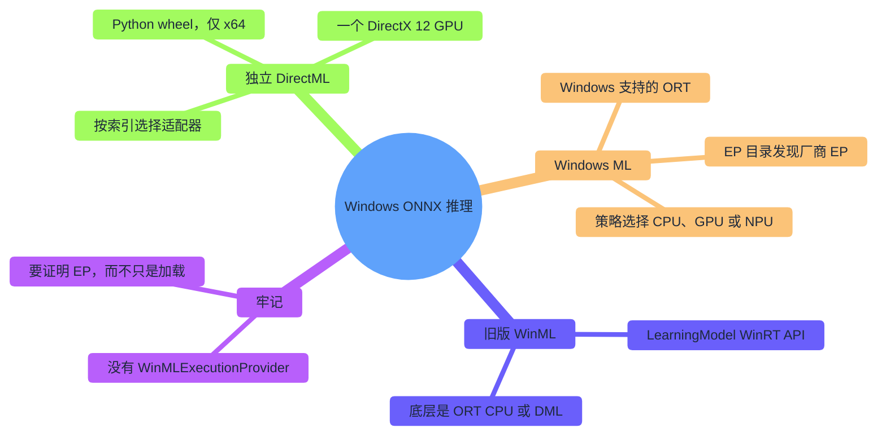

---

## 1. 选择你的方案

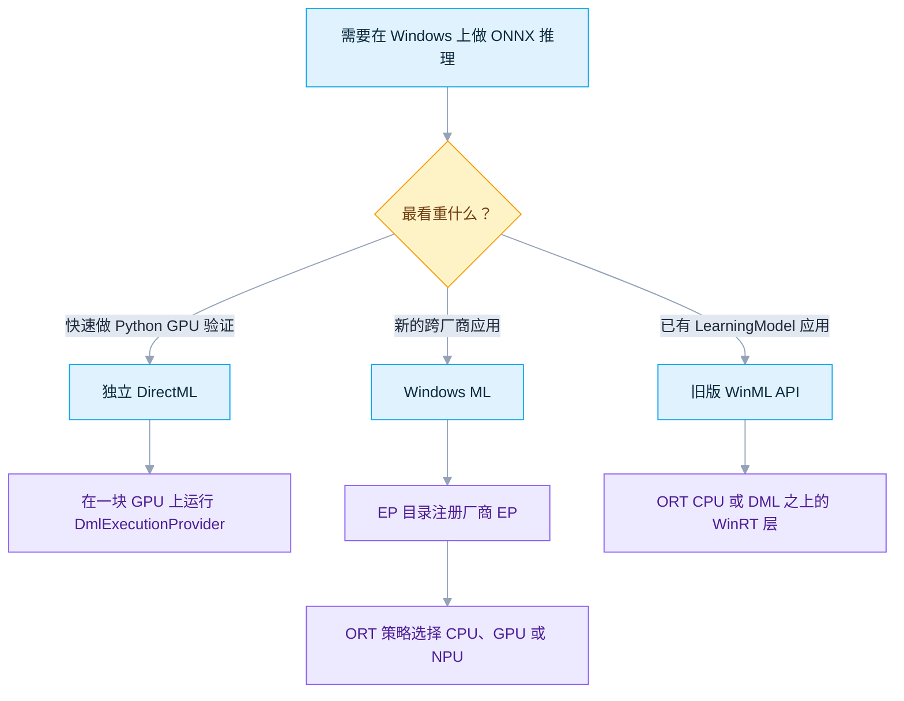

| 目标 | 方案 | 适用场景 | 主要限制 |
|---|---|---|---|
| 最快完成 Python GPU 验证 | **独立 DirectML** | 需要一个通用的 DirectX 12 GPU 后端，并显式选择适配器 | 仅有 Windows x64 wheel |
| 新的 Windows 应用 | **Windows ML** | 希望由 Windows 负责发现、更新并自动选择厂商 EP | 动态获取的 EP 需要 Windows 11 24H2（build 26100）+ |
| 已有 WinRT 媒体/张量应用 | **旧版 WinML API** | 代码已使用 `LearningModel`、`VideoFrame`、`LearningModelBinding` | 它是 ORT CPU/DML 之上的 API 层，不是另一个 EP |
| 完全掌控厂商软件栈 | 直接使用厂商 EP | 已经自行管理 CUDA、QNN、OpenVINO、MIGraphX 或 Vitis AI | 需要更多打包和兼容性工作 |

**建议的学习顺序：** 在默认适配器上运行 DirectML → 用 `--device-id` 逐一验证每个适配器 → 先用已安装的 Provider 运行 Windows ML → 允许目录下载 → 在生产模型上重复所有检查。

---

## 2. 你会遇到的名词

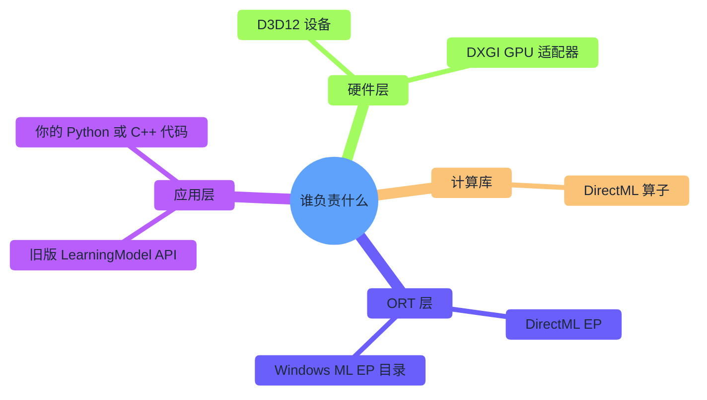

| 名词 | 通俗含义 | 它*不是*什么 |
|---|---|---|
| **Direct3D 12** | Windows GPU 设备、队列和命令 API | 神经网络运行时 |
| **DirectML** | 底层 DirectX 12 机器学习算子库 | ONNX Runtime 本身 |
| **DirectML EP** | 把 ONNX 计算映射到 DirectML 的 ORT 适配层 | 厂商驱动 |
| **旧版 WinML** | ORT 之上的 `Windows.AI.MachineLearning` WinRT 对象模型 | 名为 WinML 的 EP |
| **现代 Windows ML** | Windows 支持的 ORT + EP 目录 + 选择策略 | 仅指旧版 `LearningModel` 层 |
| **Plugin EP** | 面向独立 Provider 的公开 ORT C ABI | 某个固定的 CPU/GPU/NPU |
| **驱动** | 实现 DirectX 12 或 EP 接口的厂商软件 | 由 ONNX 模型安装的任何东西 |

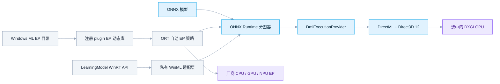

源码目录也对应这些层次：[`providers/dml`](https://github.com/microsoft/onnxruntime/tree/bf6aa0063d1c178c4a4d33ed6770425834147e2a/onnxruntime/core/providers/dml) 才是真正的 DirectML EP；[`providers/winml`](https://github.com/microsoft/onnxruntime/tree/bf6aa0063d1c178c4a4d33ed6770425834147e2a/onnxruntime/core/providers/winml) 只导出 `OrtGetWinMLAdapter` 桥接，并声明它**不是真正的 EP**；[`winml`](https://github.com/microsoft/onnxruntime/tree/bf6aa0063d1c178c4a4d33ed6770425834147e2a/winml) 才是旧版 `LearningModel` 的实现。

---

## 3. 检查前置条件

### 3.1 独立 DirectML

| 要求 | 基线 | 原因 |
|---|---|---|
| 系统 | Windows 10 1903（build 18362）+；推荐 Windows 11 | DirectML 从 1903 起进入 Windows |
| GPU | 支持 DirectX 12 | DML 会为适配器创建 D3D12 设备 |
| 驱动 | 当前稳定的 OEM / GPU 厂商驱动 | D3D12 和 DirectML 能力来自驱动 |
| 进程 | x64 CPython 3.12 | 当前 PyPI wheel 只有 `win_amd64` 文件 |
| Runtime | `onnxruntime-directml==1.24.4` | 最新发布的稳定 DirectML wheel |
| 附加固定版本 | `numpy==1.26.4`、`onnx==1.22.0` | 对应 [`requirements-directml.txt`](requirements-directml.txt) |

> 已发布的 1.24.4 版本信息注明 DirectML `1.15.2`、支持到 ONNX opset 20（例外如 5-D `GridSample` 20 和 `DeformConv`）。`main` 中较新的算子代码不会扩大该已发布 wheel 的支持范围。

### 3.2 Windows ML 目录方案

| 要求 | 基线 | 原因 |
|---|---|---|
| 系统（本方案） | Windows 11 24H2，build 26100+ | 启动脚本会验证动态获取硬件 EP 的流程 |
| 架构 | x64 或 ARM64 | Windows ML 同时发布两种架构 |
| Python | CPython 3.12 | 本指南统一核验的 wheel ABI |
| Windows App Runtime | `2.1.3` | 必须与两个 `wasdk-*` 投影包一致 |
| ML 投影包 | `wasdk-Microsoft.Windows.AI.MachineLearning[all]==2.1.3` | 向 Python 提供 `ExecutionProviderCatalog` |
| Bootstrap 投影包 | `wasdk-Microsoft.Windows.ApplicationModel.DynamicDependency.Bootstrap==2.1.3` | 为未打包的 Python 激活 App Runtime |
| ORT 发行版 | `onnxruntime-windowsml==1.24.6.202605042033` | 2.1.3 ML 投影包的精确依赖 |
| 附加固定版本 | `numpy==2.4.6`、`onnx==1.22.0` | 对应 [`requirements-winml.txt`](requirements-winml.txt)；NumPy 在 x64 与 ARM64 均有 CPython 3.12 wheel |

**保持整套版本一致。** 投影包会固定一个精确的 ORT build，已安装的 App Runtime 也必须来自同一发布系列。

| 包发布线 | 依赖的 ORT | 含义 |
|---|---|---|
| `wasdk-*==2.1.3`（本指南） | `onnxruntime-windowsml==1.24.6.202605042033` | 经过核验的组合 |
| `wasdk-*==2.3.0` | `onnxruntime-windowsml==1.25.2.202605110140` | 另一套完整组合 |
| 最新独立 wheel | `onnxruntime-windowsml==1.27.1.202607110137` | 比上述两者都新；不要混入 |

### 3.3 每个环境只能有一个 ORT 发行版

`onnxruntime`、`onnxruntime-directml`、`onnxruntime-gpu`、`onnxruntime-openvino` 和 `onnxruntime-windowsml` 都安装**同一个** `onnxruntime` 包，会互相覆盖文件。启动脚本会隔离 `.venv-directml` 和 `.venv-windowsml`，检查导入归属、核对精确版本，并在推理前运行 `pip check`。

---

## 4. 运行

### 4.1 安装 Python 和 Visual C++ Runtime

```powershell
winget install --id Python.Python.3.12 -e --accept-package-agreements --accept-source-agreements
winget install --id Microsoft.VCRedist.2015+.x64 -e --accept-package-agreements --accept-source-agreements
```

原生 ARM64 Windows ML 进程请安装 ARM64 版 VC++ Redistributable。首次安装 Python 后重开终端，然后验证：

```powershell
py -3.12 --version
py -3.12 -c "import platform, struct; print(platform.machine(), struct.calcsize('P') * 8)"
```

期望输出：Python 3.12、目标架构和 `64`。

### 4.2 独立 DirectML

```powershell
py -3.12 DirectML\one_click.py directml                # 默认适配器
py -3.12 DirectML\one_click.py directml --device-id 1  # 另一个 GPU
```

`device_id` 遵循 `IDXGIFactory::EnumAdapters` 顺序。适配器 0 通常是显示 GPU，不一定最快。启动脚本会按该顺序打印每个适配器（名称、PCI ID、专用显存、选中标记）。

### 4.3 Windows ML

先安装微软签名的 2.1.3 App Runtime，并在运行前验证签名：

```powershell
$installer = "$env:TEMP\windowsappruntimeinstall-2.1.3-x64.exe"
Invoke-WebRequest https://aka.ms/windowsappsdk/2.1/2.1.3/windowsappruntimeinstall-x64.exe -OutFile $installer
$sig = Get-AuthenticodeSignature -LiteralPath $installer
if ($sig.Status -ne 'Valid' -or $sig.SignerCertificate.Subject -notmatch 'Microsoft Corporation') {
  Remove-Item $installer -Force -ErrorAction SilentlyContinue
  throw 'Windows App Runtime 安装器没有有效的微软签名。'
}
try {
  $p = Start-Process $installer -ArgumentList '--quiet' -Wait -PassThru
  if ($p.ExitCode -ne 0) { throw "安装器失败：$($p.ExitCode)" }
} finally { Remove-Item $installer -Force -ErrorAction SilentlyContinue }
```

原生 ARM64 Python 请使用 ARM64 安装器。然后运行：

```powershell
py -3.12 DirectML\one_click.py windowsml --allow-download            # 默认策略：max-performance
py -3.12 DirectML\one_click.py windowsml --policy prefer-gpu --allow-download
py -3.12 DirectML\one_click.py windowsml --provider DmlExecutionProvider --policy prefer-gpu --allow-download
py -3.12 DirectML\one_click.py directml --refresh                    # 重建某方案的 venv
```

未指定 `--allow-download` 时，除非当前进程中同名 EP 已暴露 `OrtEpDevice`，否则启动脚本会跳过 `NotPresent` 的目录项。

| 目录状态 | 含义 | 启动脚本处理 |
|---|---|---|
| `NotPresent` | EP 包未安装 | 跳过/失败，除非加 `--allow-download`（或 ORT 已暴露该 EP） |
| `NotReady` | 已安装，但不在本应用依赖图中 | 调用 `ensure_ready_async()`；通常无需下载 |
| `Ready` | 已安装且在依赖图中 | 复用 ORT 设备或注册动态库路径 |

### 4.4 命令行参数参考

| 参数 | 默认值 | 含义 |
|---|---|---|
| `route` | `directml` | `directml` 或 `windowsml` |
| `--device-id` | `0` | DirectML 的 DXGI 适配器索引（仅独立方案） |
| `--policy` | `max-performance` | Windows ML 策略：`default`、`prefer-cpu`、`prefer-npu`、`prefer-gpu`、`max-performance`、`max-efficiency`、`min-power` |
| `--provider` | 无 | 只准备这一个指定的 Windows ML 目录 Provider |
| `--allow-download` | 关闭 | 允许 Windows ML 获取尚未安装的目录 Provider |
| `--warmups` | `3` | 计时前的预热运行次数 |
| `--runs` | `20` | 计时运行次数 |
| `--refresh` | 关闭 | 重建该方案的虚拟环境 |

---

## 5. 正确理解 PASS

启动脚本是**严格验证测试**，不是列举 Provider 的演示。

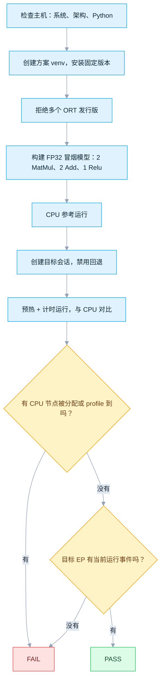

| 方案 | PASS 能证明 | PASS **不能**证明 |
|---|---|---|
| 独立 DirectML | 图分配给 `DmlExecutionProvider`，当前运行 profile 到 DML 事件，且指定索引的 DXGI 适配器承载了会话 | 生产模型是否受支持、性能，或冒烟输入之外的精度 |
| Windows ML | 已注册的目录 EP 拥有该图并产生当前运行事件，且没有默认 ORT CPU 节点 | 唯一的 GPU/NPU 身份；厂商 **CPU** EP 也可能通过，因为记录只标注 EP 名称，而非具体硬件 |
| 两者 | 输出在 `rtol=1e-3`、`atol=1e-4` 内与独立 CPU 参考一致 | 逐位一致或硬件性能基准 |

两个名称相近的开关解决不同问题：

| 开关 | 作用范围 | 防止的问题 |
|---|---|---|
| `session.disable_cpu_ep_fallback=1` | C++ 图初始化 | 节点被静默分配给默认微软 `CPUExecutionProvider` |
| `session.disable_fallback()` | 会话创建后的 Python 包装层 | 运行失败后用回退 Provider 重建会话重试 |

**为什么要同时看分配*和* profile？** 单独看都很弱，合起来才可审计。

| 证据 | 能证明 | 需要另一项补齐的缺口 |
|---|---|---|
| `get_available_providers()` | 二进制能加载该 EP | 无法说明节点分配 |
| 会话 Provider 列表 | 注册和优先级 | CPU 仍可运行不支持的节点 |
| 图分配记录 | ORT 把子图分配给该 EP | 不代表内核真的运行了 |
| 当前运行 profile | 节点事件归属该 EP | 需要分配记录提供分图上下文 |
| CPU 参考 | 输出数值合理 | 无法识别执行设备 |
| 禁用 CPU 回退 | 不受支持的分配会直接失败 | 由分配/profile 让结果可审计 |

DirectML 的 PASS 大致如下：

```text
Route              : directml
ONNX Runtime       : 1.24.4
DXGI adapters:
  - 0: Intel(R) Graphics, vendor=0x8086, ...
  - 1: NVIDIA GeForce ..., vendor=0x10DE, ... [selected]
Session providers   : ['DmlExecutionProvider', 'CPUExecutionProvider']
Graph assignment    : {'DmlExecutionProvider': ...}
Profiled providers  : {'DmlExecutionProvider': ...}
Max |target-CPU|    : ...

PASS: DmlExecutionProvider executed ... profiled node event(s) with ORT CPU fallback disabled.
```

`CPUExecutionProvider` 仍可能出现在会话列表中（ORT 在检查禁止回退前就注册了它）；通过的条件是归属它的节点/事件数为**零**。DML 融合可能把五个 ONNX 节点合并成一个运行时节点，因此事件数不必等于五。

---

## 6. DirectML 内部原理

> *选读的深入内容 —— 只想使用 EP 的话可以跳到 [§8 在你的应用中使用](#8-在你的应用中使用)。*

### 6.1 注册与工厂

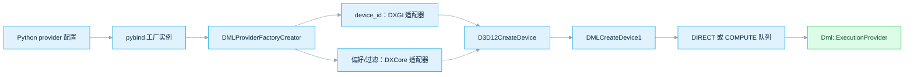

| Provider 选项 | 取值 | 默认值 | 行为 |
|---|---|---|---|
| `device_id` | 非空十进制整数字符串，例如 `"0"` | 未设置 | 旧版 DXGI 适配器索引（`IDXGIFactory::EnumAdapters` 顺序）。**具有完全优先权**：一旦设置，下面的 `performance_preference` 和 `device_filter` 根本不会被解析。 |
| `performance_preference` | `default`、`high_performance`、`minimum_power` | `default` | 仅在未设置 `device_id` 时生效。对 DXCore 适配器排序（`minimum_power` 会优先选择更省电的硬件，例如 NPU 或核显）。 |
| `device_filter` | `gpu`；在支持 NPU 枚举的编译版本中还有 `npu`、`any` | `gpu` | 仅在未设置 `device_id` 时生效。先把 DXCore 适配器过滤到指定硬件类别，再选出其中优先级最高的一个。 |
| `disable_metacommands` | `true` / `True` / `false` / `False` | `false` | 与前三项独立解析。设为 `true` 会附加 `DML_EXECUTION_FLAG_DISABLE_META_COMMANDS`，强制 DirectML 使用通用内核而非厂商优化的 metacommand——可用来定点排查驱动 metacommand 的问题。 |

一键 DirectML 方案只用 `device_id`——这是 1.24.4 已发布的稳定接口。DXGI 路径会拒绝软件适配器，先以 feature level 11.0 创建 D3D12 设备，再通过 `DMLCreateDevice1`（DML FL 5.0）创建 `IDMLDevice`。当最高 feature level `≤ D3D_FEATURE_LEVEL_1_0_CORE` 时选 `COMPUTE` 队列，否则选 `DIRECT`。

DML 还会从 `SessionOptions.add_session_config_entry(key, value)` 读取五个专属配置键（来源：[`dml_session_options_config_keys.h`](https://github.com/microsoft/onnxruntime/blob/bf6aa0063d1c178c4a4d33ed6770425834147e2a/onnxruntime/core/providers/dml/dml_session_options_config_keys.h)）。这些是会话级设置而非按 Provider 设置，请在**追加 DML EP 之前**设置到 `SessionOptions` 上——Provider 工厂会在那一刻读取它们，之后再改就不起作用了。

| 会话配置键 | 取值 | 默认值 | 行为 |
|---|---|---|---|
| `ep.dml.disable_graph_fusion` | `0` / `1` | `0` | 设为 `1` 会阻止 ORT 把符合条件的 DML 子图融合成一个已编译图（参见 [§6.3](#63-能力判断回退与分图)）；之后每个算子都单独派发。只要设置了 `SessionOptions.optimized_model_filepath`，无论这个键的值是什么，融合都会自动关闭。 |
| `ep.dml.enable_graph_serialization` | `true` / `false` | `false` | 设为 `true` 会把每个融合后的 DML 分区导出成模型旁边的 `Partition_<N>.bin` 文件，并经过（反）序列化往返——便于调试 DirectML 实际编译出的图。 |
| `ep.dml.enable_graph_capture` | `0` / `1` | `0` | 设为 `1` 后 ORT 只录制一次 D3D12 命令列表，之后的 `Run()` 直接重放，跳过 CPU 端重新派发。需要静态形状/绑定，且整张图都在 DML EP 上；参见 [§6.4](#64-编译与执行)。 |
| `ep.dml.enable_cpu_sync_spinning` | `0` / `1` | `0` | 设为 `1` 后 CPU 会忙等（自旋）GPU fence，而不是阻塞在 Win32 事件上——唤醒延迟更低，代价是占满一个 CPU 核心。适合延迟敏感的交互式工作负载；后台/批处理场景建议保持关闭。 |
| `ep.dml.disable_memory_arena` | `0` / `1` | `0` | 设为 `1` 会禁用池化缓冲区分配器，让每次 DML 分配都变成一次全新的 committed D3D12 资源。可以避免 arena 占着 GPU 显存不放，代价是分配开销更高——适合显存紧张或正在排查显存占用的场景。 |

[§8.1](#81-directml-严格验证会话) 展示了把这九项配置全部设置在一起并附带行内注释的写法。

### 6.2 会话限制

DirectML 资源是 D3D12 buffer，因此必须设置两项（启动脚本显式设置，兼容性最好）：

```python
options.enable_mem_pattern = False
options.execution_mode = ort.ExecutionMode.ORT_SEQUENTIAL
```

不要在同一个 DML 会话上并发调用 `Run`；需要并发就用多个独立会话。

### 6.3 能力判断、回退与分图

只有下面每一步都通过，节点才会被接受，否则回退到 CPU。本教程把这种回退变成会话创建失败，因为冒烟图应完全受支持。

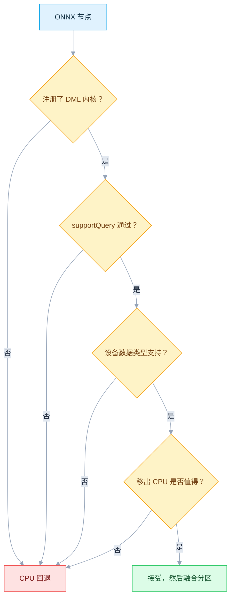

静态形状、常量必需输入和受支持的边类型，能让图变换器把多个节点合并成一个 DirectML 图。含 ONNX 子图的模型会更保守地拆分。

### 6.4 编译与执行


队列每次提交后都会发送 fence 信号，只有任务完成才释放 GPU 持有的对象。`OnRunEnd` 不阻塞地提交，使 CPU 与 GPU 重叠；`Sync()` 才提交并等待。高级 graph capture（`ep.dml.enable_graph_capture=1`）在最初几次运行后重放已保存的命令列表；一键测试不启用它。

---

## 7. Windows ML 内部原理

> *选读的深入内容 —— 只想使用 EP 的话可以跳到 [§8 在你的应用中使用](#8-在你的应用中使用)。*

### 7.1 为什么 `core/providers/winml` 几乎是空的

其头文件声明这个"provider factory"**不是真正的 EP**，[`symbols.txt`](https://github.com/microsoft/onnxruntime/blob/bf6aa0063d1c178c4a4d33ed6770425834147e2a/onnxruntime/core/providers/winml/symbols.txt) 只导出 `OrtGetWinMLAdapter`。这个目录只是通往私有 adapter API 的桥梁。

### 7.2 旧版 `LearningModel` 路径

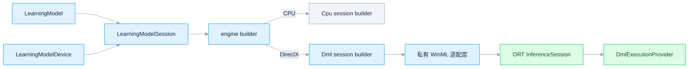

DML session builder 会开启全部优化、禁用内存模式、用调用方的 D3D12 设备/队列附加 DML、再加 CPU 回退并初始化。该 adapter 接口明确是私有的。

### 7.3 现代 Windows ML（本教程的 Python 路径）

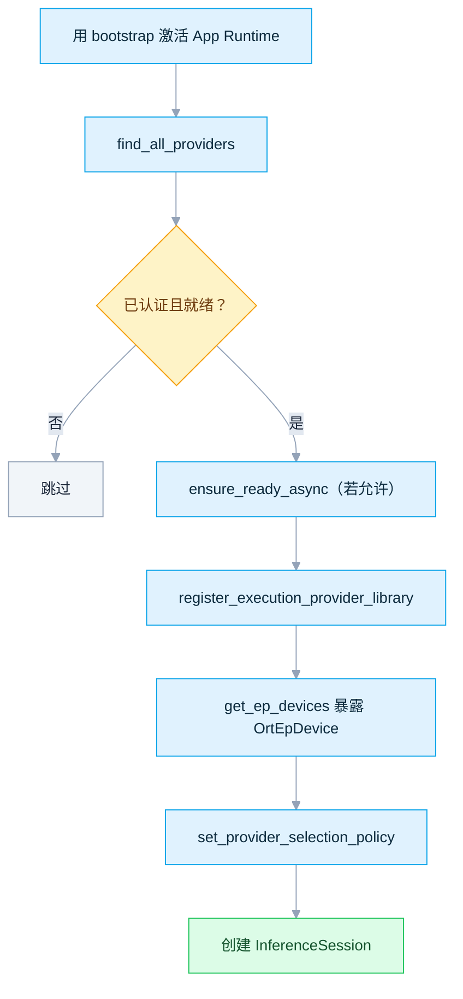

逐个注册目录 `library_path` 是 **Python 专有**的。微软的一键式 `EnsureAndRegisterCertifiedAsync()` 面向原生/.NET ORT，而非 Python 的 ORT 环境。

| Python 策略 | 内部行为 |
|---|---|
| `DEFAULT`、`PREFER_CPU` | 优先 CPU |
| `PREFER_NPU`、`MAX_EFFICIENCY`、`MIN_OVERALL_POWER` | 有 NPU 则先选 NPU，再加 CPU 回退 |
| `PREFER_GPU`、`MAX_PERFORMANCE` | 有 GPU 则先选 GPU，再加 CPU 回退 |

策略只在**已注册**的设备中选择；它不会下载 Provider，也无法让不兼容的模型变得受支持。设 `disable_cpu_ep_fallback=1` 后，ORT 会移除默认 CPU 设备——但厂商的 **CPU** EP 仍可能被选中，因此若需精确硬件证据，请记录所选的 `OrtEpDevice`。

---

## 8. 在你的应用中使用

### 8.1 DirectML 严格验证会话

```python
import onnxruntime as ort

options = ort.SessionOptions()
options.enable_mem_pattern = False  # DML 要求（见 §6.2）
options.execution_mode = ort.ExecutionMode.ORT_SEQUENTIAL  # DML 要求（见 §6.2）

# 严格验证用的配置项（通用 ORT 键，非 DML 专属）
options.add_session_config_entry("session.disable_cpu_ep_fallback", "1")
options.add_session_config_entry("session.record_ep_graph_assignment_info", "1")

# DML 专属会话配置键（`ep.dml.*`，见 §6.1）。这五项都必须在下面追加
# DML EP 之前设置好——Provider 工厂会在那一刻读取它们。
options.add_session_config_entry("ep.dml.disable_graph_fusion", "0")           # "1" = 每个算子各自一个 DML 内核（调试用）
options.add_session_config_entry("ep.dml.enable_graph_serialization", "false")  # "true" = 导出 Partition_<N>.bin
options.add_session_config_entry("ep.dml.enable_graph_capture", "0")           # "1" = 只录制一次，之后每次 Run() 都重放
options.add_session_config_entry("ep.dml.enable_cpu_sync_spinning", "0")       # "1" = 忙等 GPU fence
options.add_session_config_entry("ep.dml.disable_memory_arena", "0")          # "1" = 跳过池化分配器

session = ort.InferenceSession(
    "model.onnx",
    sess_options=options,
    providers=[
        (
            "DmlExecutionProvider",
            {
                "device_id": "0",  # DXGI 适配器索引；一旦设置会忽略下面两项
                # "performance_preference": "high_performance",  # default | high_performance | minimum_power
                # "device_filter": "gpu",                        # gpu | npu | any（仅在未设置 device_id 时生效）
                "disable_metacommands": "false",  # "true" 强制使用通用内核，跳过厂商 metacommand
            },
        )
    ],
)
session.disable_fallback()

for a in session.get_provider_graph_assignment_info():
    print(a.ep_name, [(n.name, n.op_type) for n in a.get_nodes()])
```

生产环境要明确决定是否回退。若可以接受部分 CPU 执行，就去掉 `disable_cpu_ep_fallback`、追加 `CPUExecutionProvider` 并做 profile——但部分卸载的结果不能叫"完整 GPU 执行"。

### 8.2 Windows ML 策略会话

在会话使用期间，目录/bootstrap 对象和已注册的动态库都必须保持存活。下面的骨架在应用授权前不下载任何东西。

```python
import gc
import winui3.microsoft.windows.applicationmodel.dynamicdependency.bootstrap as bootstrap

allow_download = False

with bootstrap.initialize(options=bootstrap.InitializeOptions.ON_NO_MATCH_SHOW_UI):
    import onnxruntime as ort
    import winui3.microsoft.windows.ai.machinelearning as winml

    registered, session = [], None
    catalog = winml.ExecutionProviderCatalog.get_default()
    try:
        for provider in catalog.find_all_providers():
            if provider.certification != winml.ExecutionProviderCertification.CERTIFIED:
                continue
            if provider.ready_state == winml.ExecutionProviderReadyState.NOT_PRESENT and not allow_download:
                continue
            if provider.ensure_ready_async().get().status != winml.ExecutionProviderReadyResultState.SUCCESS:
                continue
            if provider.name in {d.ep_name for d in ort.get_ep_devices()}:
                continue
            if provider.library_path:
                ort.register_execution_provider_library(provider.name, provider.library_path)
                registered.append(provider.name)

        options = ort.SessionOptions()
        options.set_provider_selection_policy(ort.OrtExecutionProviderDevicePolicy.MAX_PERFORMANCE)
        session = ort.InferenceSession("model.onnx", sess_options=options)
        # 只能在 bootstrap 上下文和 Provider 存活时使用会话。
    finally:
        session = None
        gc.collect()
        for name in reversed(registered):
            ort.unregister_execution_provider_library(name)
```

官方 Python 示例会在导入 Windows ML 前删除 `winrt-runtime` 自带的 `msvcp140.dll`。启动脚本只在可丢弃的 `.venv-windowsml` 中这么做，绝不改动系统 VC++ Runtime。[`one_click.py`](one_click.py) 实现了完整生命周期和严格检查。

---

## 9. 模型与性能建议

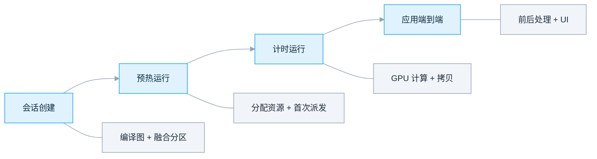

| 主题 | 建议 |
|---|---|
| 形状 | 优先静态维度——更利于 shape inference、常量折叠、DML 融合和可预测的首次运行 |
| 动态维度 | 部署形状已知时用 free-dimension override；否则融合会减少 |
| Opset | 已发布 wheel 验证保持 opset 20 或更低；本示例用 17 |
| 精度 | 先 FP32，再逐 EP 验证 FP16/INT8/QDQ |
| 数据传输 | 小模型主要耗在 NumPy↔GPU 复制上；用真实 batch 和 I/O binding |
| 预热 | 会话创建和首次推理会编译图、分配资源；单独测量 |
| Metacommand | 驱动优化路径有帮助；仅为排查时禁用，然后重新对比 |
| 并发 | 单个 DML 会话顺序执行；并发 `Run` 用独立会话 |
| Windows ML | 对*实际选中*的 EP 做基准，而非 policy 名称 |

生成的图故意太小，无法作为硬件基准；它的延迟只用于发现明显卡顿。

---

## 10. 故障排查

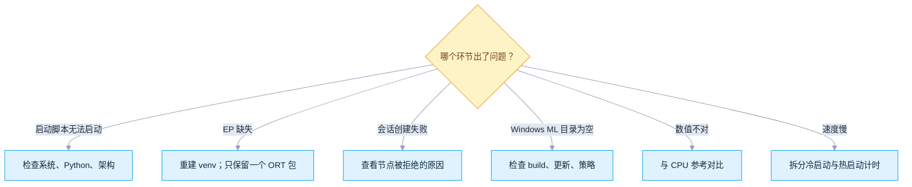

| 现象 | 含义 | 解决 |
|---|---|---|
| `The ... route requires native Windows` | 在 Linux/WSL/其他系统启动 | 用原生 Windows；WSL 没有 DirectML Python 路径 |
| Python/32 位错误 | wheel ABI 不匹配 | 安装 64 位 CPython 3.12，用 `py -3.12` 启动 |
| 缺少 `DmlExecutionProvider` | ORT 发行版错误或 venv 损坏 | `... directml --refresh`；不要再装其他 ORT 包 |
| DXGI 索引不存在 | `--device-id` 超出枚举 | 用启动脚本打印的索引 |
| 创建 D3D12 设备失败 | 适配器/驱动无可用 DX12，或选中软件适配器 | 更新驱动；选择硬件适配器 |
| 会话提示已禁用 CPU 回退 | 部分冒烟计算未被 EP 接受 | 修复 runtime/驱动；自定义模型则检查不支持的算子/类型/形状 |
| App Runtime 初始化失败 | Runtime 缺失/不匹配 | 安装与两个 `wasdk-*` 匹配且已签名的 2.1.3 |
| Windows ML 目录为空 | 系统 build、Windows Update、目录服务或策略 | 确认 build 26100+、更新、Store/目录访问、管理员策略 |
| Provider 为 `NotPresent` | 有兼容项但包未安装 | 策略允许时加 `--allow-download` |
| `ensure_ready_async` 失败 | 驱动/硬件/包要求不满足 | 阅读其诊断；更新精确 OEM/厂商驱动 |
| 注册动态库失败 | App Runtime/ORT/插件 ABI 不匹配 | 重建 venv，更新后重启，保持同一组合 |
| 选中 `CPUExecutionProvider`，验证失败 | `DEFAULT` 优先 CPU，或没有可用设备被注册 | 用 `prefer-gpu`/`prefer-npu`，准备 Provider，或指定名称 |
| Windows ML 通过但硬件类别不明 | 该 EP 同时暴露 CPU 与 GPU/NPU；EP 名称无法区分 | 选择并记录目标 `OrtEpDevice`，再重复检查 |
| 数值不一致 | 精度、驱动或算子问题 | 用 FP32/静态形状复现，更新驱动，最小化模型 |
| 设备移除 / TDR | GPU reset、超时、显存压力或驱动缺陷 | 减少工作量，检查 Event Viewer，更新驱动，禁用 metacommand 测试 |

```powershell
winver
Get-CimInstance Win32_VideoController | Select-Object Name, DriverVersion, AdapterRAM
py -3.12 DirectML\one_click.py directml --refresh
py -3.12 DirectML\one_click.py windowsml --provider DmlExecutionProvider --allow-download
```

---

## 11. 源码地图

### 结论与依据

| 结论 | 主要依据 | 结果 |
|---|---|---|
| DirectML 处于持续工程维护；已发布信息为 DirectML 1.15.2、支持到 opset 20 | [DirectML EP 官方指南](https://onnxruntime.ai/docs/execution-providers/DirectML-ExecutionProvider.html) | 已确认 |
| `device_id` 是 DXGI 顺序；DML 需要顺序执行且关闭内存模式 | [`dml_provider_factory.h`](https://github.com/microsoft/onnxruntime/blob/bf6aa0063d1c178c4a4d33ed6770425834147e2a/include/onnxruntime/core/providers/dml/dml_provider_factory.h) + [`inference_session.cc`](https://github.com/microsoft/onnxruntime/blob/bf6aa0063d1c178c4a4d33ed6770425834147e2a/onnxruntime/core/session/inference_session.cc) | 已确认 |
| DML 恰好有 4 个 Provider 选项（`device_id`、`performance_preference`、`device_filter`、`disable_metacommands`）外加 5 个 `ep.dml.*` 会话配置键——不存在其他选项 | [`dml_provider_factory.cc`](https://github.com/microsoft/onnxruntime/blob/bf6aa0063d1c178c4a4d33ed6770425834147e2a/onnxruntime/core/providers/dml/dml_provider_factory.cc) + [`dml_session_options_config_keys.h`](https://github.com/microsoft/onnxruntime/blob/bf6aa0063d1c178c4a4d33ed6770425834147e2a/onnxruntime/core/providers/dml/dml_session_options_config_keys.h) | 已确认 |
| 能力取决于内核注册、support query、设备数据类型和 CPU-preferred 分析 | [`ExecutionProvider.cpp`](https://github.com/microsoft/onnxruntime/blob/bf6aa0063d1c178c4a4d33ed6770425834147e2a/onnxruntime/core/providers/dml/DmlExecutionProvider/src/ExecutionProvider.cpp) | 已确认 |
| 不存在真正的 `WinMLExecutionProvider` | [`winml_provider_factory.h`](https://github.com/microsoft/onnxruntime/blob/bf6aa0063d1c178c4a4d33ed6770425834147e2a/include/onnxruntime/core/providers/winml/winml_provider_factory.h) + [`symbols.txt`](https://github.com/microsoft/onnxruntime/blob/bf6aa0063d1c178c4a4d33ed6770425834147e2a/onnxruntime/core/providers/winml/symbols.txt) | 已确认 |
| Python 必须逐个注册目录 `library_path` | [安装 EP](https://learn.microsoft.com/windows/ai/new-windows-ml/initialize-execution-providers) + [注册 EP](https://learn.microsoft.com/windows/ai/new-windows-ml/register-execution-providers) | 已确认 |
| 内置策略映射到 CPU/NPU/GPU 选择器并带 CPU 回退 | [`provider_policy_context.cc`](https://github.com/microsoft/onnxruntime/blob/bf6aa0063d1c178c4a4d33ed6770425834147e2a/onnxruntime/core/session/provider_policy_context.cc) | 已确认 |
| 固定的版本/架构确实存在 | [DirectML PyPI](https://pypi.org/project/onnxruntime-directml/1.24.4/) + [Windows ML 投影包 PyPI](https://pypi.org/project/wasdk-Microsoft.Windows.AI.MachineLearning/2.1.3/) | 已确认 |

### ONNX Runtime 源码（核验提交）

| 区域 | 文件 |
|---|---|
| DML 公开 C API 与选项 | [`dml_provider_factory.h`](https://github.com/microsoft/onnxruntime/blob/bf6aa0063d1c178c4a4d33ed6770425834147e2a/include/onnxruntime/core/providers/dml/dml_provider_factory.h) |
| 适配器枚举、D3D/DML 创建 | [`dml_provider_factory.cc`](https://github.com/microsoft/onnxruntime/blob/bf6aa0063d1c178c4a4d33ed6770425834147e2a/onnxruntime/core/providers/dml/dml_provider_factory.cc) |
| DML 专属会话配置键 | [`dml_session_options_config_keys.h`](https://github.com/microsoft/onnxruntime/blob/bf6aa0063d1c178c4a4d33ed6770425834147e2a/onnxruntime/core/providers/dml/dml_session_options_config_keys.h) |
| 能力、分配器、run 生命周期 | [`ExecutionProvider.cpp`](https://github.com/microsoft/onnxruntime/blob/bf6aa0063d1c178c4a4d33ed6770425834147e2a/onnxruntime/core/providers/dml/DmlExecutionProvider/src/ExecutionProvider.cpp) |
| 图分区合并 | [`GraphPartitioner.cpp`](https://github.com/microsoft/onnxruntime/blob/bf6aa0063d1c178c4a4d33ed6770425834147e2a/onnxruntime/core/providers/dml/DmlExecutionProvider/src/GraphPartitioner.cpp) |
| 命令记录与提交 | [`DmlCommandRecorder.cpp`](https://github.com/microsoft/onnxruntime/blob/bf6aa0063d1c178c4a4d33ed6770425834147e2a/onnxruntime/core/providers/dml/DmlExecutionProvider/src/DmlCommandRecorder.cpp) |
| 队列与 fence 生命周期 | [`CommandQueue.cpp`](https://github.com/microsoft/onnxruntime/blob/bf6aa0063d1c178c4a4d33ed6770425834147e2a/onnxruntime/core/providers/dml/DmlExecutionProvider/src/CommandQueue.cpp) |
| 自动 EP 策略 | [`provider_policy_context.cc`](https://github.com/microsoft/onnxruntime/blob/bf6aa0063d1c178c4a4d33ed6770425834147e2a/onnxruntime/core/session/provider_policy_context.cc) |
| WinML 导出不是真正 EP | [`winml_provider_factory.h`](https://github.com/microsoft/onnxruntime/blob/bf6aa0063d1c178c4a4d33ed6770425834147e2a/include/onnxruntime/core/providers/winml/winml_provider_factory.h) |
| 旧版 DML session builder | [`OnnxruntimeDmlSessionBuilder.cpp`](https://github.com/microsoft/onnxruntime/blob/bf6aa0063d1c178c4a4d33ed6770425834147e2a/winml/lib/Api.Ort/OnnxruntimeDmlSessionBuilder.cpp) |

### 官方文档

- [DirectML Execution Provider](https://onnxruntime.ai/docs/execution-providers/DirectML-ExecutionProvider.html) · [安装 ORT / Windows ML](https://onnxruntime.ai/docs/install/#cccwinml-installs) · [Windows 上的 ORT](https://onnxruntime.ai/docs/get-started/with-windows.html)
- [什么是 Windows ML？](https://learn.microsoft.com/windows/ai/new-windows-ml/overview) · [Walkthrough](https://learn.microsoft.com/windows/ai/new-windows-ml/tutorial) · [安装 EP](https://learn.microsoft.com/windows/ai/new-windows-ml/initialize-execution-providers) · [注册 EP](https://learn.microsoft.com/windows/ai/new-windows-ml/register-execution-providers)
- [支持的 EP](https://learn.microsoft.com/windows/ai/new-windows-ml/supported-execution-providers) · [目录 vs 自带 EP](https://learn.microsoft.com/windows/ai/new-windows-ml/windows-ml-eps-vs-bring-your-own) · [Windows ML 示例](https://github.com/microsoft/WindowsAppSDK-Samples/tree/main/Samples/WindowsML) · [DirectML API](https://learn.microsoft.com/windows/ai/directml/dml)

---

## 12. 验证范围

本文在 Linux 上准备——本次编辑没有 Windows GPU/NPU 实际执行。已经运行的检查：辅助测试（profile 解析、严格分配、策略映射、包名规范化）；`one_click.py` 字节码编译；面向 CPython 3.12 的完整依赖解析（DirectML x64 与 Windows ML x64/ARM64）；对固定提交与 Microsoft Learn 的源码/API 核验；PyPI 元数据/文件核验；全部 Python 示例与 Mermaid 图的语法解析；固定 x64 App Runtime 安装器的 HTTP 可用性。

在目标 Windows 设备上运行相应的一键命令后，才能认定该方案通过验证。一次 PASS 只适用于生成的冒烟模型、所选适配器/Provider、当前驱动和当前软件包组合。请用生产模型和有代表性的输入重新验证。
