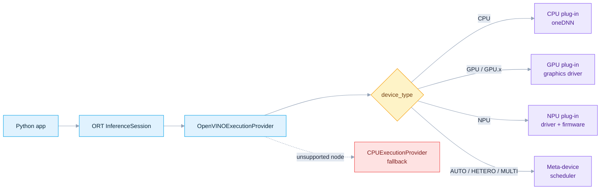
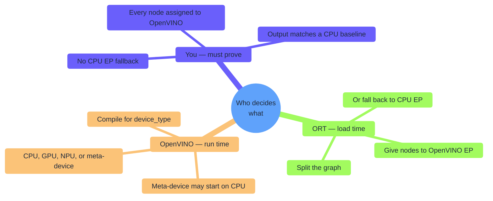
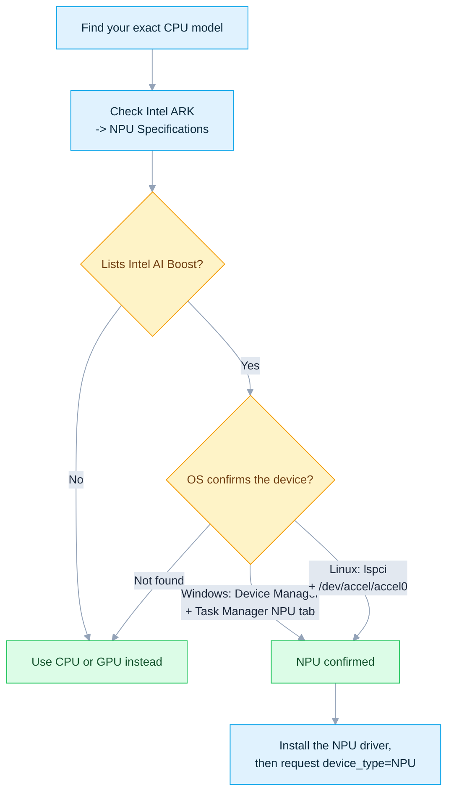
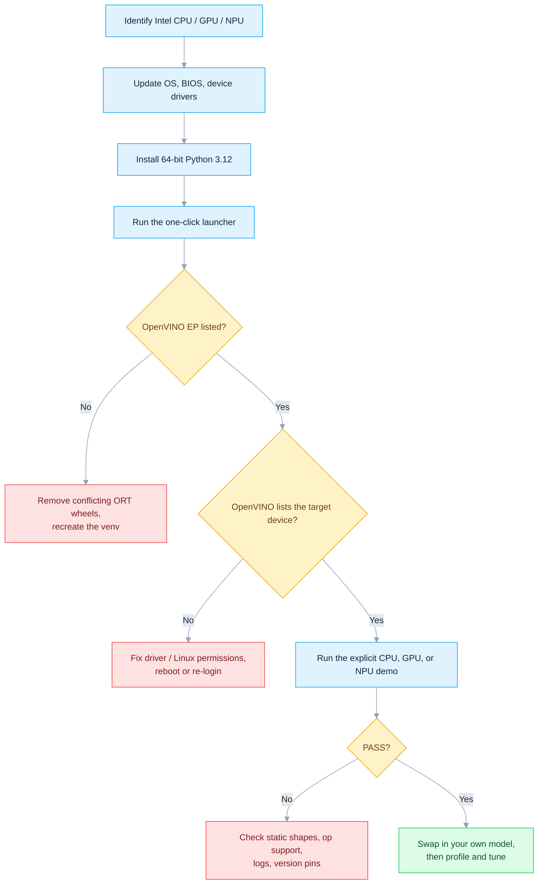
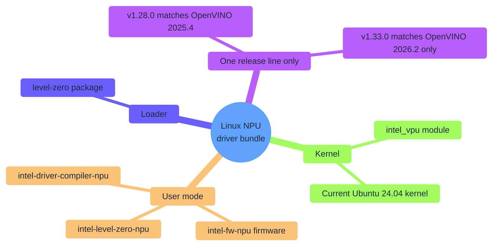
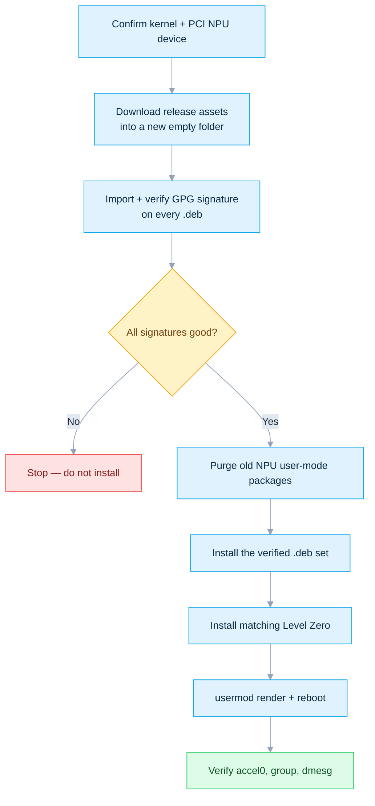

# ONNX Runtime + Intel OpenVINO: CPU, GPU, and NPU

[简体中文](README.zh-CN.md) · [Repository index](../README.md) · [Audited EP 5.9 source](https://github.com/intel/onnxruntime/tree/v5.9/onnxruntime/core/providers/openvino)

**OpenVINO** is Intel's inference toolkit. ONNX Runtime's **OpenVINO Execution Provider (EP)** compiles the supported parts of an ONNX model for **Intel CPU, GPU, or NPU**. This folder *proves* that compilation and execution really happen — not just that the provider loads.

```bash
# Ubuntu — 60-second CPU proof
./Intel/run_demo.sh --device CPU
```
```bat
:: Windows — 60-second CPU proof
Intel\run_demo.bat --device CPU
```

| You are… | Start at |
|---|---|
| New to this EP, want it working now | [§3 Run the shortest path](#3-run-the-shortest-path) |
| On Windows, need GPU/NPU drivers | [§4 Windows 11 setup](#4-windows-11-setup) |
| On Ubuntu, need GPU/NPU drivers | [§5 Ubuntu 24.04 setup](#5-ubuntu-2404-setup) |
| Not sure this PC has an NPU | [§2 Choose a device](#2-choose-a-device) |
| Writing your own inference code | [§8 Use the EP in your own program](#8-use-the-ep-in-your-own-program) |
| Something failed | [§10 Troubleshoot](#10-troubleshoot) |

| Item | Baseline |
|---|---|
| Last verified | `2026-07-17`, against official release pages and published PyPI files |
| Hosts | Windows 11 and Ubuntu x86-64 |
| Pinned runtime | `onnxruntime-openvino==1.24.1` + OpenVINO `2025.4.1` (EP 5.9) |
| Upstream status | EP 5.9 is the latest ORT integration; standalone OpenVINO `2026.2.1` is newer and **not** a compatible replacement |
| Targets | Intel CPU, integrated/discrete GPU, integrated NPU, explicit meta-devices |
| Entry points | `run_demo.bat` · `run_demo.sh` · [`provider_test.py`](provider_test.py) |
| Validated on hardware | Ubuntu `CPU`, `GPU`, `GPU.0`, `GPU.1` |
| Checked, not hardware-run | Windows (static audit); NPU (source-verified only) |

> [!IMPORTANT]
> `onnxruntime.get_device()` does **not** reliably report the real Intel target. Always set `device_type` explicitly, read this folder's own device list, and inspect the graph-assignment result. `openvino.Core().available_devices` is fine on Windows or in a **separate** Linux diagnostic venv — never install standalone `openvino` into this Linux EP environment.

## Contents

- [1. Understand the stack](#1-understand-the-stack)
- [2. Choose a device](#2-choose-a-device)
- [3. Run the shortest path](#3-run-the-shortest-path)
- [4. Windows 11 setup](#4-windows-11-setup)
- [5. Ubuntu 24.04 setup](#5-ubuntu-2404-setup)
- [6. Install the Python stack](#6-install-the-python-stack)
- [7. Run the one-click demo](#7-run-the-one-click-demo)
- [8. Use the EP in your own program](#8-use-the-ep-in-your-own-program)
- [9. Prove the accelerator executed](#9-prove-the-accelerator-executed)
- [10. Troubleshoot](#10-troubleshoot)
- [11. Production checklist](#11-production-checklist)
- [12. References](#12-references)

---

## 1. Understand the stack

An ONNX app never talks to Intel hardware directly. ONNX Runtime (ORT) partitions the graph; the OpenVINO EP compiles the supported part for the device you request.



Two different systems decide two different things — most confusion comes from mixing them up:



| Term | Meaning | Install here? |
|---|---|---|
| **ONNX** | Portable model/graph file (`.onnx`) | Only the `onnx` package, to build the demo model |
| **ONNX Runtime (ORT)** | Loads the graph, dispatches it to execution providers | `onnxruntime-openvino` — **not** plain `onnxruntime` |
| **Execution Provider (EP)** | Backend for one accelerator family | `OpenVINOExecutionProvider` ships inside that wheel |
| **OpenVINO Runtime** | Compiler + CPU/GPU/NPU plug-ins the EP calls | Bundled in the Linux wheel; installed separately on Windows |
| **Driver** | OS-to-hardware layer | CPU: OS updates only. GPU/NPU: current Intel/OEM driver |
| **Intel NPU / AI Boost** | Low-power AI accelerator in some Core Ultra chips | Physical hardware — no package can add it |
| **oneAPI** | Intel's developer-tool family | Not required for this prebuilt Python workflow |

---

## 2. Choose a device

| Target | Typical hardware | Best first use | Driver work | Model advice |
|---|---|---|---|---|
| `CPU` | Any supported x86-64 Atom/Core/Xeon | Easiest bring-up; broadest op + dynamic-shape support | OS updates only | FP32 first; INT8/BF16/FP16 gains depend on the CPU |
| `GPU` | HD/UHD/Iris/Iris Xe/Arc/Flex/Max | Parallel vision/audio/LLM work, often FP16 | Current graphics driver (Windows) / compute runtime (Linux) | Prefer static/bounded shapes; FP16 or INT8 where accuracy permits |
| `GPU.0`, `GPU.1` | Multiple Intel GPUs | Select one enumerated GPU explicitly | Same as `GPU` | `GPU` aliases `GPU.0` — query IDs, never assume iGPU/dGPU order |
| `NPU` | Core Ultra integrated NPU (Intel AI Boost) | Sustained, power-efficient AI-PC workloads | NPU driver is mandatory | **Static shapes**; FP16 or supported INT8/QDQ |
| `AUTO:GPU,NPU,CPU` | Any combination above | Portable deployment | Drivers for every listed device | Does not prove which device ran — test explicitly first |
| `HETERO:GPU,CPU` | Two or more devices | Push unsupported ops to another device | Drivers for all listed devices | Better compatibility; cross-device transfer can cost speed |
| `MULTI:GPU,CPU` | Two or more devices | Parallel requests / throughput | Drivers for all listed devices | Rarely reduces one request's latency |

### Compatibility baseline

| Item | Recommended | Official scope |
|---|---|---|
| Architecture | x86-64 / AMD64 | Wheels used here are x86-64 only |
| Python | **CPython 3.12, 64-bit** | 1.24.1 ships only `cp311`/`cp312`/`cp313`; no 3.10 or 3.14 wheel |
| Windows | Windows 11 64-bit, fully updated | Wheel metadata says Windows 10+; current NPU support targets Windows 11 |
| Ubuntu | **24.04 LTS 64-bit** | CPU/GPU docs cover 20.04/22.04/24.04; Linux NPU releases target 24.04 |
| NPU kernel | Current Ubuntu 24.04 HWE/OEM kernel | OpenVINO 2025.4 needs 6.8+; NPU driver v1.28.0 was validated on 6.14.0-36 |

> [!NOTE]
> PyPI classifiers for `onnxruntime-openvino 1.24.1` mention Python 3.14, but the release only ships `cp311`/`cp312`/`cp313` wheels for `win_amd64` and `manylinux_2_28_x86_64`. Trust the published files, not the classifiers.

### Does this PC even have an NPU?

Search your exact CPU model on [Intel ARK](https://ark.intel.com/) and open **NPU Specifications**.



No NPU hardware means `NPU` can never appear — that's expected; use `CPU`/`GPU`. OpenVINO 2025.4's bare `AUTO` also excludes NPU by default, so NPU must always be requested explicitly.

---

## 3. Run the shortest path



Only need CPU? Skip straight to [§6 Install the Python stack](#6-install-the-python-stack).

---

## 4. Windows 11 setup

| Step | Action |
|---|---|
| Update OS | **Settings → Windows Update → Check for updates**, including optional driver updates |
| Update BIOS/firmware | Get the latest from your PC maker; enable any iGPU/NPU/AI-acceleration BIOS switch |
| Reboot | Required before the driver installs below |

Laptops: prefer the **OEM** driver first (platform power/firmware integration); try Intel's generic package only if the OEM one is stale.

**CPU** — no separate driver; OS + chipset/BIOS updates are enough.

**GPU driver** — pick one route:

| Route | Best for | Link |
|---|---|---|
| PC/OEM support page | Laptops, managed workstations | Manufacturer's site |
| Intel Driver & Support Assistant | Automatic detection | [Intel DSA](https://www.intel.com/content/www/us/en/support/detect.html) |
| Intel generic Arc/Iris Xe package | Stale OEM package, or a discrete Arc card | [Arc & Iris Xe driver](https://www.intel.com/content/www/us/en/download/785597/intel-arc-iris-xe-graphics-windows.html) |

Verify: **Device Manager → Display adapters** shows the Intel GPU with **no warning icon**; check the version under **Properties → Driver**.

**NPU driver:**

1. Confirm the chip has Intel AI Boost.
2. Prefer the PC maker's page; pick the driver tested for your exact model.
3. Confirm it names your processor, Windows build, and OpenVINO generation — don't reuse a version number from an old post.
4. Install, reboot.
5. Check **Device Manager** and **Task Manager → Performance → NPU** for warning icons.

> [!WARNING]
> Intel's generic Windows NPU download ([link](https://www.intel.com/content/www/us/en/download/794734/intel-npu-driver-windows.html)) is currently `32.0.100.4778` and advertises **OpenVINO 2026.2** — not this guide's pinned **2025.4.1**. Backward compatibility is undocumented, so this pairing is **not validated here**. Use an OEM driver whose notes cover OpenVINO 2025.4, or upgrade the whole ORT/OpenVINO stack together. Never upgrade only the driver and assume NPU success.

**Python:**

1. Install **64-bit Python 3.12** from [python.org](https://www.python.org/downloads/) or Microsoft Store.
2. python.org installer: check **Add python.exe to PATH** and install the Python Launcher.
3. In a **new** Command Prompt:

```bat
py -3.12 --version
py -3.12 -c "import struct; print(struct.calcsize('P') * 8)"
```

Expect `Python 3.12.x` and `64`.

---

## 5. Ubuntu 24.04 setup

**Base system:**

```bash
sudo apt update
sudo apt install -y python3 python3-venv python3-pip pciutils curl wget gnupg
```

This installs only what the tutorial needs — it is not a full distro upgrade. Check `apt list --upgradable` separately; reboot only if a kernel/firmware/driver update requires it.

```bash
uname -r
lspci -nn | grep -Ei 'VGA|Display|3D|NPU|VPU|AI Boost'
```

**CPU** — no extra driver needed; go straight to Python.

**GPU compute runtime** — OpenVINO's GPU plug-in needs Intel's OpenCL/Level Zero runtime.

| Route | Advantage | Risk |
|---|---|---|
| Distro/Intel graphics repository | APT manages updates | Repo setup changes over time and by GPU generation |
| Latest compute-runtime release packages | Exact, auditable | More manual; fetch every listed dependency |

1. Open the current [OpenVINO Intel GPU configuration](https://docs.openvino.ai/2025/get-started/install-openvino/configurations/configurations-intel-gpu.html) and [Intel client GPU guide](https://dgpu-docs.intel.com/driver/client/overview.html) — configure the repo for **your** Ubuntu release and GPU generation.
2. Install:

```bash
sudo apt update
sudo apt install -y ocl-icd-libopencl1 intel-opencl-icd intel-level-zero-gpu level-zero clinfo
sudo usermod -aG render "$USER"
```

| Package | Role |
|---|---|
| `ocl-icd-libopencl1` | OpenCL loader |
| `intel-opencl-icd` | Intel OpenCL GPU driver |
| `level-zero` | Generic Level Zero loader (Intel repo) |
| `intel-level-zero-gpu` | Intel Level Zero GPU driver |

Some channels rename the last two `libze-intel-gpu1` / `libze1` — that is a naming difference, not extra packages to mix blindly. Use one coherent repository or one full compute-runtime release's checksummed set.

3. Sign out/in (or reboot), then verify:

```bash
groups
ls -l /dev/dri/renderD* 2>/dev/null
clinfo -l
```

Arc discrete GPUs want a modern kernel (OpenVINO 2025.4 docs: 6.2+ minimum; prefer whatever the current driver release specifies). Skip old DKMS stacks unless the exact device/kernel combo's official docs require one.

### NPU driver — the whole bundle must match

The Linux NPU stack is a kernel module + firmware + Level Zero loader + NPU user-mode driver + compiler. Treat one [release](https://github.com/intel/linux-npu-driver/releases) as a single versioned bundle — never mix pieces from different releases.



| This tutorial's runtime | Matching NPU release | Ubuntu | Why |
|---|---|---|---|
| OpenVINO 2025.4.1 | **v1.28.0** | 24.04 only | Closest documented generation match |
| Latest Linux NPU driver | Check its own release table | Usually 24.04 | May target OpenVINO 2026.x — upgrade the whole stack together |
| Ubuntu 22.04 | v1.26.0 (last line mentioning 22.04) | Legacy | Prefer 24.04 for a fresh NPU setup |

As of this audit, the newest Linux NPU release is **v1.33.0** (validated with OpenVINO 2026.2 + Level Zero 1.27.0) — it is **not** a drop-in replacement for the pinned v1.28.0 here.



1. Confirm the kernel/module and PCI device:

```bash
uname -r
lspci -nn | grep -Ei 'NPU|VPU|AI Boost'
modinfo intel_vpu 2>/dev/null | head
```

2. Download the Ubuntu 24.04 asset from the chosen release ([v1.28.0](https://github.com/intel/linux-npu-driver/releases/tag/v1.28.0)) into a **new, empty** directory, then verify every package's signature before touching the installed driver:

```bash
rm -rf ~/intel-npu-driver-v1.28.0
mkdir -m 700 ~/intel-npu-driver-v1.28.0
cd ~/intel-npu-driver-v1.28.0
wget https://github.com/intel/linux-npu-driver/releases/download/v1.28.0/linux-npu-driver-v1.28.0.20251218-20347000698-ubuntu2404.tar.gz
tar -xf linux-npu-driver-v1.28.0.20251218-20347000698-ubuntu2404.tar.gz

curl https://keys.openpgp.org/vks/v1/by-fingerprint/EA267657A608300C296B8F8AD52C9665A4077678 | gpg --import
shopt -s nullglob
DEB_PACKAGES=(./*.deb)
((${#DEB_PACKAGES[@]} > 0)) || { echo "No Debian packages found" >&2; exit 1; }
for PACKAGE in "${DEB_PACKAGES[@]}"; do
    SIGNATURE="$PACKAGE.asc"
    [[ -f "$SIGNATURE" ]] || { echo "Missing signature: $SIGNATURE" >&2; exit 1; }
    gpg --verify "$SIGNATURE" "$PACKAGE" || exit 1
done
```

The fingerprint must read `EA267657A608300C296B8F8AD52C9665A4077678`, matching the release page. Every package needs a **good signature** — a "key not trusted" note is fine, a bad or missing signature is not; stop if that happens.

3. Purge the old NPU packages exactly as the release instructs, then install the verified set:

```bash
sudo dpkg --purge --force-remove-reinstreq intel-driver-compiler-npu intel-fw-npu intel-level-zero-npu intel-level-zero-npu-dbgsym
sudo apt update
sudo apt install -y libtbb12
sudo dpkg -i ./*.deb
```

"Package was not installed" messages are harmless; any package configuration, dependency, or signature error is not — resolve it before continuing.

4. v1.28.0 was validated with **Level Zero v1.24.2**; install it only if missing:

```bash
if ! dpkg-query -W -f='${db:Status-Status}\n' level-zero 2>/dev/null | grep -qx installed; then
    wget https://github.com/oneapi-src/level-zero/releases/download/v1.24.2/level-zero_1.24.2+u24.04_amd64.deb
    sudo dpkg -i level-zero_1.24.2+u24.04_amd64.deb
fi
dpkg-query -W -f='${Package} ${Version} ${db:Status-Status}\n' level-zero
```

If your Intel GPU/NPU repository already manages `level-zero`, this leaves it unchanged — just compare the printed version against the release notes rather than mixing or downgrading loaders.

5. Record versions, grant non-root access, reboot:

```bash
dpkg-query -W -f='${Package} ${Version}\n' intel-driver-compiler-npu intel-fw-npu intel-level-zero-npu level-zero
sudo usermod -aG render "$USER"
sudo reboot
```

6. Verify after reboot:

```bash
ls -lah /dev/accel/accel0
id -nG | tr ' ' '\n' | grep '^render$'
lsmod | grep intel_vpu
sudo dmesg | grep -Ei 'intel_vpu|ivpu|firmware' | tail -n 50
```

Expect permissions like `crw-rw---- root render`. If not, use the release's udev rule — never a permanent `chmod 666`.

> [!NOTE]
> A newer NPU driver release is not automatically "tested together" with your pinned EP/OpenVINO. Keep EP, OpenVINO runtime, NPU compiler/UMD, firmware, and Level Zero on one matched generation.

---

## 6. Install the Python stack

> [!IMPORTANT]
> `onnxruntime-openvino 1.24.1` (EP 5.9) is still the newest release, paired with OpenVINO **2025.4.1**. The standalone `openvino` project has moved on to 2026.2.1, but Intel has not shipped a matching `onnxruntime-openvino`. Installing `openvino==2026.2.1` or running `pip install -U openvino` here is **not** an upgrade path — wait for a new EP release that names its ORT/OpenVINO pair.

| Component | Pinned | Why |
|---|---:|---|
| `onnxruntime-openvino` | 1.24.1 | Intel OpenVINO EP 5.9 wheel |
| OpenVINO | 2025.4.1 | Runtime EP 5.9 was built against; bundled on Linux, separate install on Windows |
| Python | CPython 3.11–3.13 (3.12 recommended) | Only versions actually published |
| `onnx` | 1.22.0 | Builds/checks the offline demo graph |
| `numpy` | 2.4.6 (Py 3.11) / 2.5.1 (Py 3.12–3.13) | Newest line compatible with each Python; NumPy 2.5 dropped 3.11 |

These are exact top-level pins, not a hash-locked lockfile — transitive dependencies resolve normally, and both launchers run `pip check` first.

| EP release | ORT package | OpenVINO |
|---:|---:|---:|
| 5.9 | 1.24.1 | 2025.4.1 |
| 5.8 | 1.23.0 | 2025.3.0 |
| 5.7 | 1.22.0 | 2025.1.0 |

Never bump the Windows `openvino` wheel alone while leaving `onnxruntime-openvino` behind.

**Windows:**

```bat
if exist .venv rmdir /s /q .venv
py -3.12 -m venv .venv
.venv\Scripts\activate
python -m pip install -r requirements.txt
```

Windows also needs pinned `openvino==2025.4.1`. The demo calls Intel's `add_openvino_libs_to_path()` before creating any session.

**Ubuntu:**

```bash
rm -rf .venv
python3 -m venv .venv
source .venv/bin/activate
python -m pip install -r requirements.txt
```

The Linux wheel already bundles native OpenVINO 2025.4.1 — `requirements.txt` installs the separate `openvino` wheel **only on Windows**. Installing both on Linux was reproduced to break with unresolved native symbols; the launcher rebuilds a contaminated venv and the demo refuses that combination. Need `Core().available_devices` on Linux? Put `openvino` in a **different** venv.

> [!CAUTION]
> Install exactly **one** ONNX Runtime wheel per venv. `onnxruntime`, `onnxruntime-gpu`, `onnxruntime-directml`, and `onnxruntime-openvino` all import as `onnxruntime` and can silently overwrite each other.

**Verify before inference:**

```bash
python -c "import onnxruntime as ort; print(ort.__version__); print(ort.get_available_providers())"
# Optional, Windows or a separate Linux diagnostic venv only:
python -c "from openvino import Core; print(Core().available_devices)"
```

Expected minimum:

```text
1.24.1
['OpenVINOExecutionProvider', 'CPUExecutionProvider', ...]
['CPU', 'GPU.0', 'NPU']   # Example only; depends on your hardware/drivers
```

| Output | Proves | Does **not** prove |
|---|---|---|
| ORT lists `OpenVINOExecutionProvider` | Correct wheel/provider loaded | GPU/NPU driver works |
| Device list shows `GPU.0` | GPU plug-in + driver enumerate it | Your model fully runs there |
| Device list shows `NPU` | NPU hardware/driver/permissions visible | A dynamic/unsupported model compiles |
| OpenVINO listed first in session | EP registered at top priority | Every node actually ran there |
| `Graph assignment: OpenVINOExecutionProvider (5/5 nodes...)` | Every resolved smoke-graph node ran on OpenVINO, fallback disabled | Which physical device a meta-device picked |

On this Linux EP-only venv, the optional second command reporting no standalone `openvino` module is expected — the demo enumerates devices through the bundled binding instead, sets `session.disable_cpu_ep_fallback=1`, records graph assignment, and asserts all five demo nodes ran on `OpenVINOExecutionProvider`.

---

## 7. Run the one-click demo

The demo is self-contained: it builds a tiny static FP32 model locally (`MatMul` → `Add` → `Relu`, no download), enumerates devices through the bundled OpenVINO binding, creates a strict session (no ORT or NPU→CPU fallback), checks all five node assignments, compares against ORT CPU (tight tolerance on CPU, FP16-appropriate tolerance on GPU/NPU), and reports warmed latency. Direct-device and `AUTO` runs get a per-device compiled-model cache; `HETERO`/`MULTI` do not.

| OS | Command |
|---|---|
| Windows | `run_demo.bat` |
| Ubuntu | `chmod +x run_demo.sh && ./run_demo.sh` |
| Ubuntu, specific interpreter | `PYTHON_BIN=python3.12 ./run_demo.sh` |

The launcher creates/repairs `.venv`, installs the pinned stack once, and defaults to a strict `CPU` run. Qualify every physical device explicitly:

| Device | Windows | Ubuntu |
|---|---|---|
| CPU | `run_demo.bat --device CPU` | `./run_demo.sh --device CPU` |
| First GPU | `run_demo.bat --device GPU` | `./run_demo.sh --device GPU` |
| Specific GPU | `run_demo.bat --device GPU.1` | `./run_demo.sh --device GPU.1` |
| NPU | `run_demo.bat --device NPU` | `./run_demo.sh --device NPU` |
| AUTO, after the above pass | `run_demo.bat --device AUTO:GPU,NPU,CPU` | `./run_demo.sh --device AUTO:GPU,NPU,CPU` |

List only devices you actually have — e.g. `AUTO:GPU,CPU` with no NPU. Bare `AUTO` is rejected on purpose: it was reproduced dumping the whole graph on ORT `CPUExecutionProvider`, and OpenVINO's own `AUTO` starts on CPU while excluding NPU from its 2025.4 default priority. `AUTO:...` proves portability, **not** which physical device ran.

A passing run ends like:

```text
ORT providers     : ['OpenVINOExecutionProvider', 'CPUExecutionProvider']
OpenVINO Runtime  : 2025.4.1 (...)
Device query      : ONNX Runtime OpenVINO device API
Intel devices     : ['CPU', 'GPU.0', 'NPU']
Requested target  : NPU
Resolved target   : NPU
Session providers : ['OpenVINOExecutionProvider', 'CPUExecutionProvider']
Graph assignment  : OpenVINOExecutionProvider (5/5 nodes: ...)
Validation limits : rtol=0.01, atol=0.005
Median latency    : ... ms
PASS: all five demo nodes were assigned to OpenVINO EP and output is valid.
```

`CPUExecutionProvider` still appears in the session list (ORT always registers it), but the strict option fails session creation if this graph ever assigns a node to it — the assignment line is the second, auditable check. GPU/NPU use a wider FP16-aware tolerance than CPU. First run is slower (graph compilation); the printed timing is a smoke-test diagnostic, not a benchmark.

---

## 8. Use the EP in your own program

Since ORT 1.23 / OpenVINO 2025.3, `load_config` JSON is the preferred way to reach any native OpenVINO property. The top-level `precision`/`num_streams`/`cache_dir` (and other) keys used below remain fully supported in this classic registration path — see the exhaustive [provider option reference table](#provider-option-reference-table) further down for the full, source-audited list of keys, defaults, and valid values.

```python
import json
import platform

if platform.system() == "Windows":
    import onnxruntime.tools.add_openvino_win_libs as utils
    utils.add_openvino_libs_to_path()

import onnxruntime as ort

config = {
    "GPU": {
        "PERFORMANCE_HINT": "LATENCY",
        "CACHE_DIR": "./openvino_cache",
        "INFERENCE_PRECISION_HINT": "f16",
    }
}
provider_options = {
    "device_type": "GPU",
    "load_config": json.dumps(config),
}

session_options = ort.SessionOptions()
session_options.graph_optimization_level = ort.GraphOptimizationLevel.ORT_DISABLE_ALL
# Qualification mode: fail if any graph node would use ORT CPU fallback.
session_options.add_session_config_entry("session.disable_cpu_ep_fallback", "1")
# Audit mode: populate session.get_provider_graph_assignment_info().
session_options.add_session_config_entry("session.record_ep_graph_assignment_info", "1")

session = ort.InferenceSession(
    "model.onnx",
    sess_options=session_options,
    providers=[("OpenVINOExecutionProvider", provider_options)],
)
outputs = session.run(None, {session.get_inputs()[0].name: input_numpy})
for assignment in session.get_provider_graph_assignment_info():
    print(assignment.ep_name, [(node.name, node.op_type) for node in assignment.get_nodes()])
```

Only disable CPU fallback once you expect full device support. After qualifying, production may re-enable `CPUExecutionProvider` as an explicit, profiled fallback — don't call that "full-device execution." OpenVINO's own docs often recommend disabling ORT's graph optimization so OpenVINO fuses the original graph itself; benchmark both settings.

### Recommended starting options

| Goal | `device_type` | `load_config` idea | Note |
|---|---|---|---|
| CPU low latency | `CPU` | `{"CPU":{"PERFORMANCE_HINT":"LATENCY","NUM_STREAMS":"1"}}` | Let OpenVINO pick thread count first |
| CPU throughput | `CPU` | `{"CPU":{"PERFORMANCE_HINT":"THROUGHPUT"}}` | Needs parallel requests to pay off |
| GPU low latency | `GPU` | `{"GPU":{"PERFORMANCE_HINT":"LATENCY","INFERENCE_PRECISION_HINT":"f16"}}` | Validate accuracy; add a cache dir |
| GPU max accuracy | `GPU` | `{"GPU":{"EXECUTION_MODE_HINT":"ACCURACY"}}` | Don't combine with a precision hint |
| NPU | `NPU` | `{"NPU":{"PERFORMANCE_HINT":"LATENCY","CACHE_DIR":"./cache"}}` | Static shapes required |
| NPU, QDQ model | `NPU` | add `"NPU_QDQ_OPTIMIZATION":"YES"` | Only for suitable quantized graphs |
| Portable | `AUTO:GPU,NPU,CPU` | `{"AUTO":{"PERFORMANCE_HINT":"LATENCY"}}` | Pass explicit tests first; doesn't name one physical device |

### All available provider options (fully commented reference)

Every key below comes straight from the audited v5.9 source ([`contexts.h`](https://github.com/intel/onnxruntime/blob/v5.9/onnxruntime/core/providers/openvino/contexts.h)'s `ProviderInfo::valid_provider_keys`, cross-checked against `ParseProviderInfo` in [`openvino_provider_factory.cc`](https://github.com/intel/onnxruntime/blob/v5.9/onnxruntime/core/providers/openvino/openvino_provider_factory.cc)). Passing any other key throws `Invalid provider_option key` when the session is created. Copy the block below and uncomment only what you need — every line is independently optional.

Independently re-verified 2026-07-18 against the live [microsoft/onnxruntime `main` branch](https://github.com/microsoft/onnxruntime/tree/main/onnxruntime/core/providers/openvino): the same 16 keys, defaults, and enforcement rules are unchanged from EP 5.9 — including the `num_streams` meta-device restriction (`EnableStreams` in `basic_backend.cc`, throws under `AUTO`/`MULTI`/`HETERO` if not `1`, silently ignored on `NPU`) and the `disable_dynamic_shapes`/`enable_causallm` NPU interaction (`ParseProviderInfo` in `openvino_provider_factory.cc`).

```python
import json

# Every key below is optional; this shows ALL keys the classic registration path
# (providers=[("OpenVINOExecutionProvider", provider_options)]) accepts. Uncomment
# only the ones you need.
provider_options = {
    # --- Device selection ---------------------------------------------------
    "device_type": "GPU",                # CPU | GPU | GPU.0 | GPU.1 | NPU | AUTO |
                                          # AUTO:GPU,NPU,CPU | HETERO:GPU,CPU | MULTI:GPU,CPU.
                                          # Falls back to a build-time default (commonly CPU) if
                                          # omitted -- always set this explicitly.
    # "device_id": "GPU",                # DEPRECATED: only "CPU"/"GPU"/"NPU", no ".0"/".1" suffix.
                                          # Use "device_type" instead (the EP logs a warning here).
    # "device_luid": "12345,67890",       # Comma-separated LUIDs, matched positionally against the
                                          # device list resolved from "device_type". Disambiguates two
                                          # otherwise-identical GPUs/NPUs. Meaningless for CPU.

    # --- Precision / accuracy -------------------------------------------------
    "precision": "FP16",                 # CPU: FP32|ACCURACY (default FP32).
                                          # GPU: FP16|FP32|ACCURACY (default FP16).
                                          # NPU: FP16|ACCURACY (default FP16).
                                          # ACCURACY keeps the model's own precision on any device.

    # --- Compiled-model cache ---------------------------------------------------
    "cache_dir": "./openvino_cache",     # Folder for OpenVINO's compiled-blob cache. A later run with
                                          # the same model + device + config loads the cached blob
                                          # instead of recompiling. Omit to disable caching.

    # --- CPU thread tuning -------------------------------------------------------
    # "num_of_threads": "4",             # CPU inference thread count. Digit-only string; non-digit
                                          # input throws. "0" falls back to 1 with a warning.

    # --- Scheduling when several models share a device ----------------------------
    # "model_priority": "DEFAULT",       # LOW | MEDIUM | HIGH | DEFAULT. Invalid values log a
                                          # warning and fall back to DEFAULT.
    # "num_streams": "1",                # Parallel inference streams for device_type. Non-positive
                                          # falls back to 1 with a warning. Must stay "1" under
                                          # AUTO/MULTI/HETERO (throws otherwise); ignored on NPU.

    # --- GPU-only --------------------------------------------------------------
    # "enable_opencl_throttling": "True",  # "true"/"True"/"false"/"False" only (case-sensitive,
                                            # no "1"/"0"). Lowers host CPU usage while the GPU is
                                            # busy, at some GPU latency/throughput cost.

    # --- NPU / quantized-model options --------------------------------------------
    # "enable_qdq_optimizer": "True",    # Same boolean format. Prunes QuantizeLinear/
                                          # DequantizeLinear pairs for faster NPU inference of
                                          # quantized (QDQ) graphs (also helps GPU int16 handling).
    # "disable_dynamic_shapes": "True",  # Same boolean format. Specializes a dynamic ONNX graph to
                                          # the static shape seen at run time. Default false on
                                          # CPU/GPU; the EP forces this true on NPU unless
                                          # enable_causallm is also true.
    # "enable_causallm": "True",         # Same boolean format. Enables ORT GenAI's stateful
                                          # Causal-LM compilation pass (KV-cache-in/out -> OpenVINO
                                          # stateful model); also re-enables dynamic shapes on NPU.

    # --- Shape / layout overrides -----------------------------------------------
    # "reshape_input": "input_ids[1,128]",   # Pins (or bounds) one or more dynamic inputs to a
                                              # concrete shape; comma-separate several tensors. A
                                              # dimension may be a range like "1..128". Usually
                                              # required for NPU.
    # "layout": "input_ids[NC],logits[NC]",  # Declares the axis order per input/output tensor,
                                              # comma-separated, e.g. "data[NCHW],output[NC]".

    # --- Advanced native interop --------------------------------------------------
    # "context": "0x7f2a4c001000",       # Hex string of an OpenCL cl_context pointer, for GPU
                                          # IO-Buffer / remote-tensor zero-copy. Native C/C++
                                          # interop only -- irrelevant from plain Python.

    # --- Anything else: load_config (preferred since ORT 1.23 / OpenVINO 2025.3) ---
    "load_config": json.dumps({
        "GPU": {"PERFORMANCE_HINT": "LATENCY"},
    }),
}
```

### Provider option reference table

| Key | Values / format | Default | Notes |
|---|---|---|---|
| `device_type` | `CPU`, `GPU`, `GPU.0`, `GPU.1`, `NPU`, `AUTO`, `AUTO:GPU,NPU,CPU`, `HETERO:GPU,CPU`, `MULTI:GPU,CPU` | Build-time default (commonly `CPU`) | Central device/meta-device selector — see [§2](#2-choose-a-device); always set this explicitly |
| `device_id` | `CPU`, `GPU`, or `NPU` only | — | **Deprecated** (the EP logs a warning); use `device_type` + `precision` instead |
| `device_luid` | Comma-separated LUID list | — | Disambiguates identical GPUs/NPUs; matched positionally to `device_type`'s resolved device list |
| `precision` | Device-dependent — see the table below | Device-dependent | `ACCURACY` keeps the model's own precision on any device |
| `cache_dir` | Filesystem path | Caching disabled | Enables OpenVINO's compiled-blob cache |
| `load_config` | JSON string keyed by `CPU`/`GPU`/`NPU`/`AUTO`/`HETERO`/`MULTI` | `{}` | Preferred way to set any native OpenVINO property; unknown device keys are skipped with a warning, not a hard failure |
| `context` | Hex string of a `void*` (OpenCL `cl_context`) | `nullptr` | GPU IO-Buffer / remote-tensor zero-copy; native interop only |
| `num_of_threads` | Digit-only string (base-10, non-negative) | `0` (let OpenVINO decide) | Non-digit input throws; `"0"` falls back to `1` with a warning |
| `model_priority` | `LOW`, `MEDIUM`, `HIGH`, `DEFAULT` | `DEFAULT` | Falls back to `DEFAULT` with a warning on an invalid value |
| `num_streams` | Positive integer string | `1` | Non-positive falls back to `1` with a warning; must stay `1` under `AUTO`/`MULTI`/`HETERO` (throws otherwise); ignored on `NPU` |
| `enable_opencl_throttling` | `"true"`, `"True"`, `"false"`, or `"False"` (case-sensitive; no `1`/`0`) | `false` | GPU only |
| `enable_qdq_optimizer` | Same boolean format | `false` | Prunes QDQ nodes for faster NPU (and GPU int16) inference of quantized graphs |
| `enable_causallm` | Same boolean format | `false` | Enables ORT GenAI's stateful Causal-LM compilation pass; also re-enables dynamic shapes on NPU |
| `disable_dynamic_shapes` | Same boolean format | `false` on CPU/GPU; forced `true` on `NPU` unless `enable_causallm` is also `true` | Specializes a dynamic ONNX graph to a static run-time shape |
| `reshape_input` | `name[dims]`, comma-separated; a dimension may be a range like `1..10` | — | Pins/bounds dynamic inputs; commonly required for NPU |
| `layout` | `name[NCHW]`, comma-separated | — | Declares tensor axis order per input/output |

`precision` defaults and valid values by resolved device:

| Resolved device | Valid `precision` values | Default when unset |
|---|---|---|
| `CPU` | `FP32`, `ACCURACY` | `FP32` |
| `GPU` / `GPU.x` | `FP16`, `FP32`, `ACCURACY` | `FP16` |
| `NPU` | `FP16`, `ACCURACY` | `FP16` |
| `HETERO:`/`MULTI:`/`AUTO:`/`BATCH:` meta-devices | `FP16`, `FP32`, `ACCURACY` | None forced (optional) |

`load_config` accepts JSON strings, numbers, booleans, and nested objects (≤8 levels); each OpenVINO property decides the valid type. Use `EXECUTION_MODE_HINT` **or** `INFERENCE_PRECISION_HINT`, never both. Check the [EP option docs](https://onnxruntime.ai/docs/execution-providers/OpenVINO-ExecutionProvider.html#configuration-options) for the full native-property list.

> [!NOTE]
> This guide's registration style — `providers=[("OpenVINOExecutionProvider", provider_options)]`, matching [`provider_test.py`](provider_test.py) — is ONNX Runtime's **classic** registration path, and every key above is fully supported there (verified directly against `ParseProviderInfo` in the v5.9 source). ONNX Runtime also has a newer, ORT-wide **explicit EP/device-selection API** (`SessionOptionsAppendExecutionProvider_V2` with `OrtEpDevice` handles). Under that newer path only, OpenVINO's factory rejects `device_type`, `device_id`, `device_luid`, `context`, and `disable_dynamic_shapes` outright, and requires `cache_dir`, `precision`, `num_of_threads`, `num_streams`, `model_priority`, `enable_opencl_throttling`, and `enable_qdq_optimizer` to be set through `load_config` instead — device selection there comes from the discovered `OrtEpDevice` list plus optional `ov_device`/`ov_meta_device` keys. If you only use the classic dict-based registration shown throughout this guide, none of that applies to you.

### Dynamic model on NPU

Current NPU docs require static shapes. If your ONNX file is dynamic but each run uses one known shape, pin it explicitly:

```python
provider_options = {
    "device_type": "NPU",
    "reshape_input": "input_ids[1,128]",
}
```

Match every dynamic input's real name/rank. The parser also documents range-bound syntax, but that isn't proof the 2025.4 NPU plug-in supports dynamic shapes natively (not hardware-tested here) — fixed-shape export is the safe rookie baseline.

---

## 9. Prove the accelerator executed

"It didn't crash" is not proof. Climb this ladder:

| # | Check | Result you want |
|---:|---|---|
| 1 | `ort.get_available_providers()` | Contains `OpenVINOExecutionProvider` |
| 2 | The demo's device query (or `Core().available_devices` where safe) | Shows your explicit target |
| 3 | Explicit-target session + `session.disable_cpu_ep_fallback=1` | Builds; no ORT CPU nodes, no NPU→CPU fallback |
| 4 | `get_provider_graph_assignment_info()` | Every expected node reports `OpenVINOExecutionProvider` |
| 5 | Compare output vs CPU | Within an FP16/INT8-appropriate tolerance |
| 6 | ORT profiling | OpenVINO owns the partition; no CPU node events under strict mode |
| 7 | OS telemetry | Task Manager / Linux GPU-NPU tools show activity |
| 8 | Warmed benchmark | Repeatable latency/throughput, sane cache behavior |

```python
options = ort.SessionOptions()
options.enable_profiling = True
options.graph_optimization_level = ort.GraphOptimizationLevel.ORT_DISABLE_ALL
options.add_session_config_entry("session.disable_cpu_ep_fallback", "1")
session = ort.InferenceSession(
    "model.onnx",
    sess_options=options,
    providers=[("OpenVINOExecutionProvider", {"device_type": "GPU"})],
)
session.run(None, feeds)
print(session.end_profiling())
```

Check the profile JSON's `provider` fields. OpenVINO may legitimately use host CPU internally — that's different from ORT assigning a graph node to `CPUExecutionProvider`. For an intentionally mixed production session, drop the strict setting, allow listed CPU fallback, and use profiling to quantify it.

---

## 10. Troubleshoot

| Symptom | Likely cause | Fix |
|---|---|---|
| `OpenVINOExecutionProvider` missing | A plain/conflicting ORT wheel won the shared import | Delete `.venv`; reinstall only `onnxruntime-openvino` |
| Windows `DLL load failed` | Missing/mismatched OpenVINO DLLs, or helper called too late | Install exact `openvino==2025.4.1`; call `add_openvino_libs_to_path()` before the session |
| Linux `undefined symbol` on provider `.so` | Standalone `openvino` mixed with bundled EP libs, or `LD_LIBRARY_PATH` pollution | Delete `.venv`; install only the Linux EP requirements; drop custom OpenVINO paths |
| Demo lists only `['CPU']` | GPU/NPU compute driver absent | Complete the driver section, reboot/re-login |
| GPU not listed, display works | OpenCL/Level Zero runtime missing | Install `intel-opencl-icd` + matching Level Zero; run `clinfo -l` |
| Linux GPU `Permission denied` | User not in `render`, or stale session groups | `sudo usermod -aG render "$USER"`, then fully log out/in or reboot |
| `/dev/accel/accel0` missing | No NPU, disabled BIOS switch, missing module/firmware | Check SKU/BIOS, kernel, `intel_vpu`, driver release |
| NPU device present, OpenVINO omits it | UMD/compiler/Level Zero mismatch or permissions | Check `ls -lah`, `groups`, packages, `dmesg` |
| NPU compile fails | Driver/runtime mismatch, or dynamic/unsupported model | Run the static demo first; align versions; export static shapes |
| Windows NPU fails after Intel's current generic driver | That driver targets OpenVINO 2026.2, not this guide's 2025.4.1 | Use an OEM driver documented for 2025.4, or upgrade the whole stack together |
| Bare `AUTO` rejected | Can't qualify a physical target; reproduced falling back to CPU | Qualify `GPU`/`NPU` explicitly, then use `AUTO:GPU,CPU`-style lists |
| Non-strict app runs, only CPU busy | `AUTO` picked CPU, or ORT fell back | Request `GPU`/`NPU` explicitly; enable strict mode + profiling |
| `GPU.1` fails | Enumeration order differs from assumption | Read the demo's device list; never assume dGPU index |
| First run very slow | Graph/kernel compilation | Enable `CACHE_DIR`; warm up before timing |
| Accelerator slower than CPU | Tiny model, transfer/compile overhead, fallback, wrong precision | Use a real workload, warm-up, static shapes; inspect partitioning |
| Accuracy changed | FP16/BF16/INT8 or different reduction order | Compare to FP32 with task tolerances; try `EXECUTION_MODE_HINT=ACCURACY` |
| `pip` finds no matching distribution | 32-bit/unsupported Python, wrong architecture | Use x86-64 CPython 3.11–3.13 — no 3.10/3.14/ARM wheel |
| NPU stops responding after a bad model | Driver recovery issue | Reboot/update the driver; confirm support before retrying |

### Collect diagnostics

**Windows PowerShell:**

```powershell
$PY = ".\.venv\Scripts\python.exe"
& $PY -c "import platform,sys; print(platform.platform()); print(sys.version)"
& $PY -m pip list | Select-String "onnx|openvino|numpy"
& $PY -m pip check
& $PY -c "import onnxruntime as o; print(o.get_available_providers()); print(o.get_build_info())"
& $PY -c "from openvino import Core; print(Core().available_devices)"
& $PY provider_test.py --device CPU --runs 1 --warmups 0
Get-PnpDevice | Where-Object {$_.FriendlyName -match 'Intel|NPU|AI Boost'}
```

**Ubuntu:**

```bash
uname -a
cat /etc/os-release
lspci -nn | grep -Ei 'VGA|Display|3D|NPU|VPU|AI Boost'
groups
ls -lah /dev/dri/renderD* /dev/accel/accel0 2>/dev/null
clinfo -l 2>/dev/null || true
dpkg -l | grep -E 'intel-(opencl|level-zero|driver-compiler|fw)|level-zero|libze'
.venv/bin/python -m pip list | grep -E 'onnx|openvino|numpy'
.venv/bin/python -m pip check
.venv/bin/python -c "import onnxruntime as o; print(o.get_available_providers()); print(o.get_build_info())"
.venv/bin/python provider_test.py --device CPU --runs 1 --warmups 0
# Query Core only from a separate OpenVINO diagnostic venv — never install it here.
sudo dmesg | grep -Ei 'intel_vpu|ivpu|drm|firmware' | tail -n 100
```

Strip usernames/paths before sharing logs.

---

## 11. Production checklist

- [ ] Pin a tested ORT ↔ OpenVINO version pair.
- [ ] Package exactly one ONNX Runtime distribution.
- [ ] Keep GPU/NPU drivers in a tested deployment matrix; never silently auto-upgrade one layer in production.
- [ ] Use explicit `device_type` plus `session.disable_cpu_ep_fallback=1` during full-device qualification.
- [ ] Add an explicit `AUTO:<devices>` list only after every intended physical device passes alone.
- [ ] Export a concrete static shape for NPU; use bounded dynamic shapes only where the CPU/GPU path is documented and tested to support them.
- [ ] Validate numerical accuracy against CPU/reference data, not just one random tensor.
- [ ] Profile graph partitioning and investigate large CPU-fallback islands.
- [ ] Benchmark first-ever, first-with-cache, warmed latency, and sustained throughput separately.
- [ ] Enable and persist `CACHE_DIR`; invalidate it when model, runtime, driver, device, or properties change.
- [ ] Use representative input transfer and pre/post-processing in end-to-end benchmarks.
- [ ] Never run production inference as root just to bypass Linux permissions.
- [ ] Record OS, BIOS, kernel, GPU/NPU driver, Python, ORT, OpenVINO, model hash, precision, and provider options.

---

## 12. References

| Topic | Source |
|---|---|
| ORT OpenVINO EP install/options/devices | [ONNX Runtime OpenVINO EP documentation](https://onnxruntime.ai/docs/execution-providers/OpenVINO-ExecutionProvider.html) |
| Audited EP implementation | [Intel ONNX Runtime v5.9 OpenVINO provider source](https://github.com/intel/onnxruntime/tree/v5.9/onnxruntime/core/providers/openvino) |
| Canonical upstream source (re-verified 2026-07-18, identical option set to EP 5.9) | [microsoft/onnxruntime OpenVINO EP source (`main` branch)](https://github.com/microsoft/onnxruntime/tree/main/onnxruntime/core/providers/openvino) |
| Binary version pair + Windows DLL setup | [Intel ONNX Runtime OpenVINO EP releases](https://github.com/intel/onnxruntime/releases) |
| Actual 1.24.1 wheel files | [PyPI JSON file inventory](https://pypi.org/pypi/onnxruntime-openvino/1.24.1/json) |
| Newer standalone OpenVINO release (not the EP pin) | [OpenVINO releases](https://github.com/openvinotoolkit/openvino/releases) |
| Demo helper package releases | [ONNX on PyPI](https://pypi.org/project/onnx/) · [NumPy on PyPI](https://pypi.org/project/numpy/) |
| OpenVINO system requirements | [OpenVINO 2025 system requirements](https://docs.openvino.ai/2025/about-openvino/release-notes-openvino/system-requirements.html) |
| Intel GPU OS configuration | [OpenVINO Intel GPU configuration](https://docs.openvino.ai/2025/get-started/install-openvino/configurations/configurations-intel-gpu.html) |
| Intel GPU compute packages | [Intel compute-runtime releases](https://github.com/intel/compute-runtime/releases) |
| AUTO candidate/startup behavior | [OpenVINO 2025.4 automatic device selection](https://docs.openvino.ai/2025/openvino-workflow/running-inference/inference-devices-and-modes/auto-device-selection.html) |
| NPU features/limitations | [OpenVINO NPU device documentation](https://docs.openvino.ai/2025/openvino-workflow/running-inference/inference-devices-and-modes/npu-device.html) |
| Linux NPU stack used here | [Intel Linux NPU driver v1.28.0](https://github.com/intel/linux-npu-driver/releases/tag/v1.28.0) |
| Windows NPU driver | [Intel NPU Driver for Windows](https://www.intel.com/content/www/us/en/download/794734/intel-npu-driver-windows.html) |
| Identify NPU hardware | [Intel: check whether a processor has an NPU](https://www.intel.com/content/www/us/en/support/articles/000097597/processors.html) |
| ORT Python provider semantics | [ONNX Runtime Python API](https://onnxruntime.ai/docs/api/python/api_summary.html) |
| Bundled OpenVINO device query | [v5.9 Python binding](https://github.com/intel/onnxruntime/blob/v5.9/onnxruntime/python/onnxruntime_pybind_state.cc#L1567-L1574) |
| Direct EP graph-assignment records | [v5.9 Python binding](https://github.com/intel/onnxruntime/blob/v5.9/onnxruntime/python/onnxruntime_pybind_state.cc#L2724-L2745) |
| Strict CPU EP fallback switch | [v5.9 session option definition](https://github.com/intel/onnxruntime/blob/v5.9/include/onnxruntime/core/session/onnxruntime_session_options_config_keys.h#L267-L280) |

> **Freshness rule:** check Intel's latest EP release before the standalone OpenVINO release — a newer standalone version never supersedes the EP's own pin. When a new `onnxruntime-openvino` ships, update both pins together, confirm the actual PyPI files (not only classifiers), then revalidate CPU/GPU/NPU drivers and rerun strict explicit-device tests. Update `onnx`/`numpy` separately, only after their Python/wheel range resolves and the smoke test passes.
