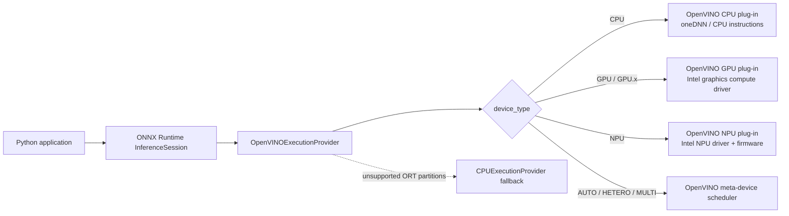
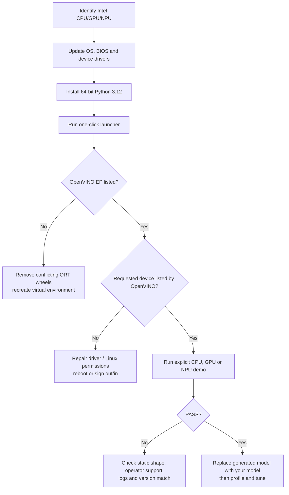

# ONNX Runtime + Intel OpenVINO: CPU, GPU, and NPU

[简体中文](README.zh-CN.md) · [Repository index](../README.md) · [Audited EP 5.9 source](https://github.com/intel/onnxruntime/tree/v5.9/onnxruntime/core/providers/openvino)

| Item | Baseline |
|---|---|
| Last verified | `2026-07-17` against official release pages and the published PyPI files |
| Hosts | Windows 11 and Ubuntu x86-64 |
| Runtime | `onnxruntime-openvino==1.24.1` + OpenVINO `2025.4.1` (EP 5.9) |
| Upstream status | EP 5.9 is still the latest ORT integration; standalone OpenVINO `2026.2.1` is newer and is **not** a compatible replacement |
| Targets | Intel CPU, integrated/discrete GPU, integrated NPU, and explicit meta-devices |
| Entry points | `run_demo.bat`, `run_demo.sh`, and [`provider_test.py`](provider_test.py) |
| Validation boundary | Ubuntu `CPU`, `GPU`, `GPU.0`, and `GPU.1` passed on hardware; Windows was statically audited; NPU setup was source-verified and requires target-machine proof |

---

## 1. Understand the stack

An ONNX application does not call Intel hardware directly. ONNX Runtime partitions the graph, then the OpenVINO Execution Provider (EP) compiles supported subgraphs through the matching OpenVINO device plug-in and driver.



### Terms

| Term | Meaning | What to install here |
|---|---|---|
| **ONNX** | Portable model file/graph format (`.onnx`) | Python `onnx` package only for the self-generating demo |
| **ONNX Runtime (ORT)** | Loads the graph and dispatches it to execution providers | `onnxruntime-openvino`, **not** plain `onnxruntime` |
| **Execution Provider (EP)** | ORT backend for one acceleration stack | `OpenVINOExecutionProvider` is inside the special wheel |
| **OpenVINO Runtime** | Intel compiler/runtime and CPU/GPU/NPU plug-ins used by the EP | Bundled in Linux wheel; matching `openvino` wheel is additionally required on Windows |
| **Driver** | OS-to-hardware layer | CPU: OS only; GPU/NPU: current Intel/OEM driver |
| **Intel NPU / Intel AI Boost** | Low-power AI accelerator integrated in supported Intel Core Ultra systems | It is physical hardware, not something software can add |
| **oneAPI** | Intel developer-tool family | Not required for this prebuilt Python workflow |

---

## 2. Choose a device

| Target | Typical hardware | Best first use | Driver work | Model advice |
|---|---|---|---|---|
| `CPU` | Supported x86-64 Intel Atom/Core/Xeon families | Easiest bring-up, broadest operator and dynamic-shape coverage | Usually none beyond OS updates | FP32 is the safest start; INT8/BF16/FP16 gains depend on CPU |
| `GPU` | Intel HD/UHD/Iris/Iris Xe/Arc/Flex/Max | Parallel vision/audio/LLM work, often FP16 | Current Intel graphics driver / Linux compute runtime | Prefer static/bounded shapes; FP16 or INT8 where accuracy permits |
| `GPU.0`, `GPU.1` | Multiple Intel GPUs | Select one enumerated GPU explicitly | Same as GPU | `GPU` aliases `GPU.0`; query IDs instead of assuming which is iGPU/dGPU |
| `NPU` | Intel Core Ultra integrated NPU (Intel AI Boost) | Sustained, power-efficient AI PC workloads | NPU driver is mandatory | Use **static shapes**; FP16 or supported INT8/QDQ models |
| `AUTO:GPU,NPU,CPU` | Any combination above | Portable deployment and automatic selection | Drivers for every listed device | Does not prove which device ran; test explicit devices first |
| `HETERO:GPU,CPU` | Two or more devices | Split unsupported operations across devices | Drivers for all listed devices | Useful for compatibility, but transfers can reduce speed |
| `MULTI:GPU,CPU` | Two or more devices | Parallel requests / throughput | Drivers for all listed devices | Loads the model on multiple devices and distributes requests; it does not normally reduce one request's latency |

> [!IMPORTANT]
> `onnxruntime.get_device()` is **not** a reliable Intel target check. Use the device list printed by this folder's demo (queried from the OpenVINO runtime bundled in the ORT wheel), explicitly request `device_type`, and inspect its graph-assignment result. `openvino.Core().available_devices` is also valid on Windows or in a **separate** Linux diagnostic environment; do not install the standalone `openvino` wheel into this Linux EP environment.

### Compatibility baseline

| Item | Recommended rookie baseline | Official scope relevant to this stack |
|---|---|---|
| Architecture | x86-64 / AMD64 | The `onnxruntime-openvino` wheels used here are x86-64 |
| Python | **CPython 3.12 64-bit** | The actual 1.24.1 files are CPython 3.11, 3.12, and 3.13 wheels only; no 3.10 or 3.14 wheel is published |
| Windows | Windows 11 64-bit, fully updated | Wheel metadata says Windows 10+, but current NPU support is Windows 11 |
| Ubuntu | **Ubuntu 24.04 LTS 64-bit** | CPU/GPU docs cover 20.04/22.04/24.04; current Linux NPU release packages target 24.04 |
| NPU kernel | Current Ubuntu 24.04 HWE/OEM kernel | OpenVINO 2025.4 lists Ubuntu 24.04 kernel 6.8+; NPU driver v1.28.0 was validated on 6.14.0-36 |

> [!NOTE]
> PyPI metadata/classifiers for `onnxruntime-openvino 1.24.1` mention Python 3.14, but the release contains only `cp311`, `cp312`, and `cp313` wheels for `win_amd64` and `manylinux_2_28_x86_64`. Installation support is determined by published files, not classifiers.

### Does this PC actually contain an NPU?

1. Find the exact processor model.
2. Search it on [Intel ARK](https://ark.intel.com/) and open **NPU Specifications**.
3. Look for **Intel AI Boost**. Core Ultra branding commonly indicates an NPU, but verify the exact SKU.
4. On Windows, Task Manager may show an **NPU** performance page and Device Manager should show an Intel AI Boost/NPU device after its driver is installed.
5. On Linux, `lspci -nn | grep -Ei 'NPU|VPU|AI Boost'` is a useful hint; `/dev/accel/accel0` is the decisive driver-node check.

No NPU hardware means `NPU` can never appear. Use `CPU` or `GPU` instead. OpenVINO 2025.4 excludes NPU from bare `AUTO` priority, so NPU must be requested explicitly.

---

## 3. Run the shortest path



If only CPU is needed, skip the GPU/NPU driver sections and go directly to [Section 6](#6-install-the-python-stack).

---

## 4. Windows 11 setup

### 4.1 Update Windows, BIOS, and firmware

1. Run **Settings → Windows Update → Check for updates**, including relevant optional driver updates.
2. Install the latest BIOS/firmware from the PC manufacturer. Ensure integrated graphics and NPU/AI acceleration are enabled if the BIOS exposes such switches.
3. Reboot.

For laptops, prefer the OEM driver first because it may include platform-specific power/firmware integration. Intel's generic package is the next troubleshooting option.

### 4.2 CPU

No separate OpenVINO CPU driver is required. A current Windows installation and chipset/BIOS updates are sufficient.

### 4.3 Intel GPU driver

Choose one route:

| Route | When to use | Link |
|---|---|---|
| PC/OEM support page | Recommended first for a laptop or managed workstation | Manufacturer's support site |
| Intel Driver & Support Assistant | Simple automatic detection/update | [Intel DSA](https://www.intel.com/content/www/us/en/support/detect.html) |
| Intel generic Arc/Iris Xe package | OEM package is stale or a discrete Arc card is installed | [Intel Arc & Iris Xe driver](https://www.intel.com/content/www/us/en/download/785597/intel-arc-iris-xe-graphics-windows.html) |

Install, reboot, then verify:

1. Open **Device Manager → Display adapters**.
2. Confirm the Intel adapter has no warning icon.
3. Open **Properties → Driver** and record the version/date.

### 4.4 Intel NPU driver

1. Confirm the processor has Intel AI Boost.
2. Prefer the PC manufacturer's support page and choose the NPU driver tested for that exact model.
3. Confirm the download supports the exact processor, Windows build, and OpenVINO generation. Do not copy a version number from an old blog.
4. Install and reboot.
5. Check **Device Manager** and **Task Manager → Performance → NPU**. There must be no warning icon.

> [!WARNING]
> Driver/OpenVINO compatibility matters most on NPU. As of this audit, Intel's mutable [generic Windows NPU download](https://www.intel.com/content/www/us/en/download/794734/intel-npu-driver-windows.html) is `32.0.100.4778` and explicitly advertises **OpenVINO 2026.2**, not the pinned 2025.4.1 runtime. Backward compatibility is not documented, so this guide does **not** call that combination validated. Use an OEM driver whose release notes cover OpenVINO 2025.4, or move the complete ORT/OpenVINO stack to a release family validated by the current driver. Do not independently upgrade only the driver/runtime layer and assume NPU success.

### 4.5 Install Python

1. Install **Python 3.12 64-bit** from [python.org](https://www.python.org/downloads/) or Microsoft Store.
2. If using python.org, select **Add python.exe to PATH** and install the Python Launcher.
3. Open a **new** Command Prompt and run:

```bat
py -3.12 --version
py -3.12 -c "import struct; print(struct.calcsize('P') * 8)"
```

Expected: Python 3.12.x and `64`.

---

## 5. Ubuntu 24.04 setup

### 5.1 Update the base system

```bash
sudo apt update
sudo apt install -y python3 python3-venv python3-pip pciutils curl wget gnupg
```

This is the minimum tutorial setup; it does not perform an unattended full distribution upgrade. Review normal OS updates separately with `apt list --upgradable`. Reboot only after a kernel, firmware, or hardware-driver update requires it.

Inspect the current system:

```bash
uname -r
lspci -nn | grep -Ei 'VGA|Display|3D|NPU|VPU|AI Boost'
```

### 5.2 CPU

No extra CPU driver is normally needed. Continue to the Python installation.

### 5.3 Intel GPU compute runtime

The OpenVINO GPU plug-in needs Intel's OpenCL/Level Zero compute runtime. The official OpenVINO configuration page currently gives two valid routes:

| Route | Advantage | Risk/maintenance |
|---|---|---|
| Distribution/Intel graphics repository | Updates and dependencies are managed by APT | Repository setup varies over time and by GPU generation |
| Packages from the latest compute-runtime release | Exact, auditable release | More manual; download all dependencies listed by that release |

**Recommended process (do not blindly paste a year-old repository URL):**

1. Open the current [OpenVINO GPU configuration](https://docs.openvino.ai/2025/get-started/install-openvino/configurations/configurations-intel-gpu.html) and [Intel client GPU guide](https://dgpu-docs.intel.com/driver/client/overview.html).
2. Configure the repository for **your Ubuntu release and GPU generation**.
3. Install the official package set:

```bash
sudo apt update
sudo apt install -y ocl-icd-libopencl1 intel-opencl-icd intel-level-zero-gpu level-zero clinfo
sudo usermod -aG render "$USER"
```

The package roles are different: `ocl-icd-libopencl1` is the OpenCL loader, `intel-opencl-icd` is Intel's OpenCL GPU driver, `level-zero` is the generic Level Zero loader in Intel's repository, and `intel-level-zero-gpu` is Intel's Level Zero GPU driver. Current direct compute-runtime releases and some distribution repositories call that last driver `libze-intel-gpu1`; some repositories call the generic loader `libze1`. These are alternative channel/package names, not extra packages to mix blindly. Use one coherent repository or the complete package set and checksums from one compute-runtime release.

4. Sign out and back in (or reboot), then verify:

```bash
groups
ls -l /dev/dri/renderD* 2>/dev/null
clinfo -l
```

For Arc discrete GPU, Intel currently recommends a modern supported kernel (6.2+ at minimum in the OpenVINO 2025.4 page; use the newer kernel specified by the current driver release). Do not install an old DKMS stack unless the official instructions for that exact device/kernel require it.

### 5.4 Intel NPU driver — version alignment is mandatory

The Linux NPU stack contains a kernel module, firmware, Level Zero loader, NPU user-mode driver, and compiler. Treat the [Intel Linux NPU driver release page](https://github.com/intel/linux-npu-driver/releases) as one versioned bundle.

| Runtime in this tutorial | Closely aligned NPU release | Ubuntu status | Why |
|---|---|---|---|
| OpenVINO 2025.4.1 | Linux NPU driver **v1.28.0** was validated with OpenVINO 2025.4 | Ubuntu 24.04 only | Closest documented generation match |
| Latest Linux NPU driver | Check its release table | Usually Ubuntu 24.04 | Newer releases may target OpenVINO 2026.x; upgrade the entire ORT/OpenVINO stack together |
| Ubuntu 22.04 | v1.26.0 was the last release line mentioning 22.04 | Legacy for current driver releases | Prefer Ubuntu 24.04 for a fresh NPU setup |

As of the 2026-07-17 audit, the latest Linux NPU release is **v1.33.0**, validated with OpenVINO 2026.2 and Level Zero 1.27.0. It is not a drop-in replacement for v1.28.0 in this pinned tutorial.

**Safe install pattern:**

1. Confirm the kernel/module and PCI device:

```bash
uname -r
lspci -nn | grep -Ei 'NPU|VPU|AI Boost'
modinfo intel_vpu 2>/dev/null | head
```

2. Open the chosen release (for this pinned stack, [v1.28.0](https://github.com/intel/linux-npu-driver/releases/tag/v1.28.0)). For its Ubuntu 24.04 asset, download into a **new empty directory** and verify every signed Debian package before changing the installed driver:

```bash
rm -rf ~/intel-npu-driver-v1.28.0
mkdir -m 700 ~/intel-npu-driver-v1.28.0
cd ~/intel-npu-driver-v1.28.0
wget https://github.com/intel/linux-npu-driver/releases/download/v1.28.0/linux-npu-driver-v1.28.0.20251218-20347000698-ubuntu2404.tar.gz
tar -xf linux-npu-driver-v1.28.0.20251218-20347000698-ubuntu2404.tar.gz

curl https://keys.openpgp.org/vks/v1/by-fingerprint/EA267657A608300C296B8F8AD52C9665A4077678 | gpg --import
shopt -s nullglob
DEB_PACKAGES=(./*.deb)
((${#DEB_PACKAGES[@]} > 0)) || { echo "No Debian packages found" >&2; exit 1; }
for PACKAGE in "${DEB_PACKAGES[@]}"; do
    SIGNATURE="$PACKAGE.asc"
    [[ -f "$SIGNATURE" ]] || { echo "Missing signature: $SIGNATURE" >&2; exit 1; }
    gpg --verify "$SIGNATURE" "$PACKAGE" || exit 1
done
```

The key fingerprint must be `EA267657A608300C296B8F8AD52C9665A4077678`, matching the release page. Every package must report a **good signature**. A warning that the signing key is not personally trusted is different from a bad signature; stop if a signature is bad or missing.

3. Purge the previous NPU user-mode packages exactly as the release instructs, then install the verified v1.28.0 set:

```bash
sudo dpkg --purge --force-remove-reinstreq intel-driver-compiler-npu intel-fw-npu intel-level-zero-npu intel-level-zero-npu-dbgsym
sudo apt update
sudo apt install -y libtbb12
sudo dpkg -i ./*.deb
```

Messages saying an old package was not installed are harmless. Any package configuration, dependency, or signature error is not—stop and resolve it before continuing.

4. v1.28.0 was validated with **Level Zero v1.24.2**. The release says to install this package when `level-zero` is absent:

```bash
if ! dpkg-query -W -f='${db:Status-Status}\n' level-zero 2>/dev/null | grep -qx installed; then
    wget https://github.com/oneapi-src/level-zero/releases/download/v1.24.2/level-zero_1.24.2+u24.04_amd64.deb
    sudo dpkg -i level-zero_1.24.2+u24.04_amd64.deb
fi
dpkg-query -W -f='${Package} ${Version} ${db:Status-Status}\n' level-zero
```

If `level-zero` is already deliberately managed by the selected Intel GPU/NPU repository, the conditional leaves it unchanged. Compare its printed version with the release note rather than blindly mixing or downgrading loaders.

5. Record the installed versions, grant non-root access, and reboot:

```bash
dpkg-query -W -f='${Package} ${Version}\n' intel-driver-compiler-npu intel-fw-npu intel-level-zero-npu level-zero
sudo usermod -aG render "$USER"
sudo reboot
```

6. Verify after reboot:

```bash
ls -lah /dev/accel/accel0
id -nG | tr ' ' '\n' | grep '^render$'
lsmod | grep intel_vpu
sudo dmesg | grep -Ei 'intel_vpu|ivpu|firmware' | tail -n 50
```

Expected device permissions resemble `crw-rw---- root render`. If they do not, use the udev rule from the selected NPU release—not a random permanent `chmod 666` workaround.

> [!NOTE]
> Current mainline Intel NPU releases may be newer than the stack pinned here. “Newest everything” is not the same as “tested together.” Beginners should keep the EP, OpenVINO runtime, NPU compiler/UMD, firmware, and Level Zero generation aligned.

---

## 6. Install the Python stack

### What “latest” means here

As of this audit, `onnxruntime-openvino 1.24.1` (EP 5.9) remains the newest published OpenVINO EP wheel and is explicitly paired with OpenVINO 2025.4.1. The standalone `openvino` project has advanced to 2026.2.1, but Intel has not published an `onnxruntime-openvino` release paired with that runtime. Substituting `openvino==2026.2.1` or running `pip install -U openvino` in this EP environment is therefore **not** an upgrade path. Wait for a new Intel EP release that names a new ORT/OpenVINO pair.

### Why these exact packages?

| Component | Pinned value | Reason |
|---|---:|---|
| `onnxruntime-openvino` | 1.24.1 | Intel OpenVINO EP 5.9 wheel |
| OpenVINO | 2025.4.1 | Runtime used to build EP 5.9; bundled by the Linux EP wheel and separately installed on Windows |
| Python | CPython 3.11–3.13 (3.12 recommended) | Exact published Windows/Linux x86-64 wheel set; no 3.10 or 3.14 artifact |
| `onnx` | 1.22.0 | Generates and checks the offline demo graph; pinned to a wheel usable by all three Python versions |
| `numpy` | 2.4.6 on Python 3.11; 2.5.1 on Python 3.12–3.13 | Uses the newest compatible stable line; NumPy 2.5 dropped Python 3.11 |

These are exact top-level pins selected by environment markers, not a hash-locked supply-chain lockfile. Compatible transitive dependencies are resolved from each package's metadata, and both launchers run `pip check` before inference.

The official compatibility history is:

| Intel EP release | ORT package | OpenVINO |
|---:|---:|---:|
| 5.9 | 1.24.1 | 2025.4.1 |
| 5.8 | 1.23.0 | 2025.3.0 |
| 5.7 | 1.22.0 | 2025.1.0 |

Never independently upgrade the Windows `openvino` wheel while leaving `onnxruntime-openvino` pinned.

### Windows — manual commands

From this tutorial folder:

```bat
if exist .venv rmdir /s /q .venv
py -3.12 -m venv .venv
.venv\Scripts\activate
python -m pip install -r requirements.txt
```

Windows needs the separately pinned `openvino==2025.4.1`. The demo calls Intel's official `onnxruntime.tools.add_openvino_win_libs.add_openvino_libs_to_path()` before creating the session/loading the provider's dependent DLLs.

### Ubuntu — manual commands

```bash
rm -rf .venv
python3 -m venv .venv
source .venv/bin/activate
python -m pip install -r requirements.txt
```

The Linux `onnxruntime-openvino 1.24.1` wheel already contains native OpenVINO 2025.4.1 libraries. `requirements.txt` intentionally installs the separate `openvino` wheel **only on Windows**. Installing both Linux distributions was reproduced to fail with unresolved native symbols, depending on import order. The launcher therefore recreates a contaminated environment, and the demo rejects this combination before importing ONNX Runtime. If standalone `Core().available_devices` diagnostics are needed on Linux, put `openvino` in a different virtual environment.

> [!CAUTION]
> Install exactly **one ONNX Runtime wheel** in a virtual environment. `onnxruntime`, `onnxruntime-gpu`, `onnxruntime-directml`, and `onnxruntime-openvino` all provide the same `onnxruntime` import and can overwrite each other.

### Verify before inference

```bash
python -c "import onnxruntime as ort; print(ort.__version__); print(ort.get_available_providers())"
# Optional standalone check: Windows, or a separate Linux diagnostic environment only.
python -c "from openvino import Core; print(Core().available_devices)"
```

Expected minimum:

```text
1.24.1
['OpenVINOExecutionProvider', 'CPUExecutionProvider', ...]
['CPU', 'GPU.0', 'NPU']   # Example only; actual devices depend on hardware/drivers
```

On the tutorial's clean Linux EP-only environment, the optional second command reports that the standalone `openvino` module is absent; this is intentional. The demo safely enumerates devices through the bundled wheel's OpenVINO binding instead. It also sets `session.disable_cpu_ep_fallback=1` and records EP graph assignment. Session creation fails if any node in this fully supported smoke graph is assigned to ORT's CPU EP; for NPU, the OpenVINO EP consumes the same setting to prevent its internal NPU-to-CPU fallback. The script then directly asserts that all five named nodes belong to `OpenVINOExecutionProvider`.

Interpret the two lists correctly:

| Output | Proves | Does **not** prove |
|---|---|---|
| ORT lists `OpenVINOExecutionProvider` | Correct ORT wheel/provider library loaded | GPU or NPU driver works |
| Demo/OpenVINO lists `GPU.0` | Intel GPU plug-in and driver can enumerate a GPU | Your ONNX model is fully supported on it |
| Demo/OpenVINO lists `NPU` | NPU hardware/driver/permissions are visible | A dynamic or unsupported model can compile |
| Session lists OpenVINO first | EP was registered at highest priority | Every node ran there; unsupported partitions may fall back |
| Demo reports `Graph assignment: OpenVINOExecutionProvider (5/5 nodes...)` | Every resolved node in this smoke graph was assigned to OpenVINO EP, with ORT/NPU CPU fallback disabled | Which physical device an OpenVINO meta-device selected, or whether OpenVINO used host-side CPU work internally |

---

## 7. One-click Python demo

The demo is deliberately self-contained:

- creates a small static FP32 ONNX model locally—no network model download;
- uses only common `MatMul`, `Add`, and `Relu` operations suitable for CPU/GPU/NPU;
- enumerates OpenVINO devices through the exact runtime bundled/loaded by the ORT wheel, without adding a conflicting Linux package;
- explicitly creates an `OpenVINOExecutionProvider` session, disables ORT and NPU-to-CPU graph fallback, and directly checks all five graph assignments;
- compares output against ORT CPU using a tight CPU tolerance or an FP16-appropriate GPU/NPU tolerance, then reports diagnostic warmed latency;
- enables a device-specific compiled-model cache for direct CPU/GPU/NPU and AUTO tests (the HETERO/MULTI demo path does not set one).

### Windows: run from Command Prompt

```bat
run_demo.bat
```

### Ubuntu

```bash
chmod +x run_demo.sh
./run_demo.sh
```

If `python3` points to an unsupported version but a supported interpreter is installed, select it explicitly, for example: `PYTHON_BIN=python3.12 ./run_demo.sh`.

The launcher creates or repairs `.venv`, installs the pinned top-level stack once, verifies dependencies, and runs the strict `CPU` test by default. Later runs reuse a matching environment without reinstalling packages. Qualify each physical device explicitly:

| Device | Windows | Ubuntu |
|---|---|---|
| CPU | `run_demo.bat --device CPU` | `./run_demo.sh --device CPU` |
| First Intel GPU | `run_demo.bat --device GPU` | `./run_demo.sh --device GPU` |
| Specific enumerated GPU | `run_demo.bat --device GPU.1` | `./run_demo.sh --device GPU.1` |
| Intel NPU | `run_demo.bat --device NPU` | `./run_demo.sh --device NPU` |
| AUTO after qualification | `run_demo.bat --device AUTO:GPU,NPU,CPU` | `./run_demo.sh --device AUTO:GPU,NPU,CPU` |

Only list devices that are installed and intended; for example, use `AUTO:GPU,CPU` on a machine without NPU. Bare `AUTO` is intentionally rejected by this audit demo: with the pinned wheel it was reproduced assigning the whole smoke graph to ORT `CPUExecutionProvider`, while OpenVINO's own AUTO behavior also uses startup CPU inference and excludes NPU from its default 2025.4 priority list. `AUTO:...` is a portability test, **not proof of which physical device ran**.

A successful run ends like:

```text
ORT providers     : ['OpenVINOExecutionProvider', 'CPUExecutionProvider']
OpenVINO Runtime  : 2025.4.1 (...)
Device query      : ONNX Runtime OpenVINO device API
Intel devices     : ['CPU', 'GPU.0', 'NPU']
Requested target  : NPU
Resolved target   : NPU
Session providers : ['OpenVINOExecutionProvider', 'CPUExecutionProvider']
Graph assignment  : OpenVINOExecutionProvider (5/5 nodes: ...)
Validation limits : rtol=0.01, atol=0.005
Median latency    : ... ms
PASS: all five demo nodes were assigned to OpenVINO EP and output is valid.
```

ORT still reports `CPUExecutionProvider` in the session list because it registers a default CPU EP, but the strict session option makes initialization fail if this smoke graph assigns any node to it. The direct assignment record supplies a second, auditable check. GPU/NPU commonly use FP16 internally, so their comparison tolerance is intentionally wider than CPU's; it remains small enough to catch a grossly incorrect output. First startup may be much slower because OpenVINO compiles the graph. The printed timing is a smoke-test diagnostic, not a CPU-vs-accelerator benchmark; the tiny model is too small for performance conclusions.

---

## 8. Use the EP in your own Python program

### Minimal, future-facing configuration

Since ORT 1.23/OpenVINO 2025.3, prefer `load_config` JSON over deprecated top-level `precision`, `num_streams`, `cache_dir`, and related options.

```python
import json
import platform

if platform.system() == "Windows":
    import onnxruntime.tools.add_openvino_win_libs as utils
    utils.add_openvino_libs_to_path()

import onnxruntime as ort

config = {
    "GPU": {
        "PERFORMANCE_HINT": "LATENCY",
        "CACHE_DIR": "./openvino_cache",
        "INFERENCE_PRECISION_HINT": "f16",
    }
}
provider_options = {
    "device_type": "GPU",
    "load_config": json.dumps(config),
}

session_options = ort.SessionOptions()
session_options.graph_optimization_level = ort.GraphOptimizationLevel.ORT_DISABLE_ALL
# Qualification mode: fail if any graph node would use ORT CPU fallback.
session_options.add_session_config_entry("session.disable_cpu_ep_fallback", "1")
# Audit mode: populate session.get_provider_graph_assignment_info().
session_options.add_session_config_entry("session.record_ep_graph_assignment_info", "1")

session = ort.InferenceSession(
    "model.onnx",
    sess_options=session_options,
    providers=[("OpenVINOExecutionProvider", provider_options)],
)
outputs = session.run(None, {session.get_inputs()[0].name: input_numpy})
for assignment in session.get_provider_graph_assignment_info():
    print(assignment.ep_name, [(node.name, node.op_type) for node in assignment.get_nodes()])
```

The strict session setting is appropriate only when the model is expected to be fully supported on the requested target. After qualification, a production application may deliberately remove that setting and append `CPUExecutionProvider` to allow unsupported partitions to fall back; profile and disclose that behavior instead of calling it full-device execution. The OpenVINO EP documentation recommends disabling ORT high-level graph optimization in many cases so OpenVINO receives the original graph and can perform its own hardware-aware fusion. Benchmark both optimization settings for a production model.

### Recommended starting options

| Goal | `device_type` | `load_config` idea | Notes |
|---|---|---|---|
| CPU low latency | `CPU` | `{"CPU":{"PERFORMANCE_HINT":"LATENCY","NUM_STREAMS":"1"}}` | Let OpenVINO choose thread count first |
| CPU throughput | `CPU` | `{"CPU":{"PERFORMANCE_HINT":"THROUGHPUT"}}` | Submit parallel requests to benefit |
| GPU low latency | `GPU` | `{"GPU":{"PERFORMANCE_HINT":"LATENCY","INFERENCE_PRECISION_HINT":"f16"}}` | Validate accuracy; add cache |
| GPU maximum accuracy | `GPU` | `{"GPU":{"EXECUTION_MODE_HINT":"ACCURACY"}}` | Do not combine execution-mode and precision hints |
| NPU | `NPU` | `{"NPU":{"PERFORMANCE_HINT":"LATENCY","CACHE_DIR":"./cache"}}` | Static shape required by current NPU plug-in docs |
| NPU QDQ model | `NPU` | Add `"NPU_QDQ_OPTIMIZATION":"YES"` | Use only for suitable quantized QDQ graphs |
| Portable selection | `AUTO:GPU,NPU,CPU` | `{"AUTO":{"PERFORMANCE_HINT":"LATENCY"}}` | Explicit tests should pass first; AUTO may use CPU during startup and does not identify one physical target |

### Common provider options (not exhaustive)

| Option | Status in ORT 1.24 | Purpose / values |
|---|---|---|
| `device_type` | Current | `CPU`, `GPU`, `GPU.0`, `GPU.1`, `NPU`, `AUTO:...`, `HETERO:...`, `MULTI:...` |
| `load_config` | **Preferred** | JSON string of OpenVINO properties by device |
| `disable_dynamic_shapes` | Parsed, but not an effective free toggle in pinned v5.9 | The EP overwrites it according to its device path: CPU/GPU retain dynamic handling; direct NPU uses runtime static specialization unless the causal-LLM path is active |
| `reshape_input` | Current | Supplies a concrete fixed shape or parser-supported bounds; use concrete fixed shapes for NPU qualification |
| `layout` | Current | Declares layouts such as `input[NCHW],output[NC]` |
| `device_id` | Deprecated | Use `device_type="GPU.1"` instead |
| `precision` | Deprecated | Migrate to `INFERENCE_PRECISION_HINT` or `EXECUTION_MODE_HINT` in `load_config` |
| `num_of_threads` | Deprecated | Migrate to `INFERENCE_NUM_THREADS` |
| `num_streams` | Deprecated | Migrate to `NUM_STREAMS` |
| `cache_dir` | Deprecated | Migrate to `CACHE_DIR` |
| `enable_qdq_optimizer` | Deprecated | Migrate to NPU `NPU_QDQ_OPTIMIZATION` |
| `model_priority` | Deprecated | Migrate to `MODEL_PRIORITY` |

The pinned parser accepts JSON strings, numbers, booleans, and nested objects (up to eight levels); the specific OpenVINO property determines the valid type/value. Official examples often use strings. Use either `EXECUTION_MODE_HINT` **or** `INFERENCE_PRECISION_HINT`, not both. Advanced accepted options also include `device_luid`, `context`, `enable_causallm`, and `enable_opencl_throttling`; they are intentionally not beginner defaults. Consult the [current EP option documentation](https://onnxruntime.ai/docs/execution-providers/OpenVINO-ExecutionProvider.html#configuration-options) and the matching v5.9 source before adding them.

### Dynamic model on NPU

Current OpenVINO NPU documentation says only static shapes are supported. Export a fixed-shape ONNX model whenever possible. If the ONNX file is dynamic but every inference will use one known shape, the EP can be given a **concrete fixed** specialization, for example:

```python
provider_options = {
    "device_type": "NPU",
    "reshape_input": "input_ids[1,128]",
}
```

The exact syntax must match every dynamic input and the model's real input name/rank. Although the EP parser documents range-bound syntax, that is not proof of native dynamic-shape support in the 2025.4 NPU plug-in and was not hardware-validated here. Do not recommend bounds as a rookie NPU path; fixed-shape export is the ground-truth baseline.

---

## 9. How to prove the accelerator really executed work

A correct validation ladder is stronger than “the script did not crash.”

| Level | Check | Result wanted |
|---:|---|---|
| 1 | `ort.get_available_providers()` | Contains `OpenVINOExecutionProvider` |
| 2 | Demo's bundled device query (or `Core().available_devices` where safely available) | Contains the explicit target (`GPU.0`/`NPU`) |
| 3 | Create an explicit-target session with `session.disable_cpu_ep_fallback=1` | Session construction succeeds; no ORT CPU-assigned nodes and no OpenVINO NPU-to-CPU fallback |
| 4 | Enable assignment recording and call `get_provider_graph_assignment_info()` | Every expected resolved node reports `OpenVINOExecutionProvider` |
| 5 | Compare output with CPU | Within a tolerance suitable for FP16/INT8 |
| 6 | Enable ORT profiling | OpenVINO EP owns the expected graph partition; no `CPUExecutionProvider` node events in strict qualification |
| 7 | Observe OS telemetry | Windows Task Manager or Linux GPU/NPU tools show activity |
| 8 | Benchmark warmed workload | Repeatable latency/throughput and cache behavior |

For profiling:

```python
options = ort.SessionOptions()
options.enable_profiling = True
options.graph_optimization_level = ort.GraphOptimizationLevel.ORT_DISABLE_ALL
options.add_session_config_entry("session.disable_cpu_ep_fallback", "1")
session = ort.InferenceSession(
    "model.onnx",
    sess_options=options,
    providers=[("OpenVINOExecutionProvider", {"device_type": "GPU"})],
)
session.run(None, feeds)
print(session.end_profiling())
```

Inspect the JSON's `provider` entries. OpenVINO itself may legitimately use host CPU work, which is different from ORT assigning graph nodes to `CPUExecutionProvider`. For an intentionally mixed production session, remove the strict setting, list CPU fallback, and use profiling to quantify every fallback partition.

---

## 10. Troubleshooting

| Symptom | Likely cause | Fix |
|---|---|---|
| `OpenVINOExecutionProvider` absent | Plain/conflicting ORT wheel won the shared import | Delete `.venv`, recreate it, install only `onnxruntime-openvino` |
| Windows `DLL load failed`, OpenVINO provider cannot load | Missing/mismatched OpenVINO DLLs or helper called too late | Install exact `openvino==2025.4.1`; call `add_openvino_libs_to_path()` before creating an OpenVINO session |
| Linux provider `.so` cannot load / `undefined symbol` | Standalone `openvino` mixed with the bundled EP libraries, or global `LD_LIBRARY_PATH` pollution | Delete `.venv`; install only the Linux EP wheel requirements; remove custom OpenVINO paths. Never copy provider `.so` files globally |
| Demo lists only `['CPU']` | GPU/NPU compute driver absent | Complete the relevant driver section and reboot/sign in again |
| GPU not listed, but display works | Display driver exists but OpenCL/Level Zero compute runtime is missing | Install `intel-opencl-icd` and matching Level Zero GPU package; run `clinfo -l` |
| Linux GPU `Permission denied` | User not in `render` or session has old groups | `sudo usermod -aG render "$USER"`, then fully sign out/in or reboot |
| `/dev/accel/accel0` missing | No NPU, disabled BIOS device, kernel module/firmware missing | Verify SKU/BIOS, kernel, `intel_vpu`, and selected driver release |
| NPU device exists but OpenVINO omits it | UMD/compiler/Level Zero mismatch or permissions | Check `ls -lah`, `groups`, driver packages, release-matched loader, and `dmesg` |
| NPU compile fails for demo/model | Driver/runtime mismatch or unsupported/dynamic model | First run this static demo; align versions; export static shape; check NPU-supported topology/operators |
| Windows NPU fails after installing Intel's current generic driver | Current generic package advertises OpenVINO 2026.2, while this folder pins 2025.4.1 | Use an OEM driver documented for 2025.4, or upgrade ORT/OpenVINO as one validated release family; do not guess backward compatibility |
| Bare `AUTO` is rejected by the demo | It cannot qualify a physical target and was reproduced using ORT CPU fallback | Qualify `GPU`/`NPU` explicitly; then use an explicit list such as `AUTO:GPU,CPU` |
| A non-strict application succeeds but only CPU is busy | AUTO selected CPU or ORT graph fallback occurred | Request `GPU`/`NPU` explicitly; enable strict qualification and inspect profiling |
| `GPU.1` fails | Actual enumeration differs | Read the demo's `Intel devices` line (or query `Core` in a safe environment); never assume dGPU index |
| First run is extremely slow | Model/kernel compilation | Enable `CACHE_DIR`, retain cache, warm up before timing |
| Accelerator slower than CPU | Tiny model, transfer/compile overhead, unsupported partitions, wrong precision | Use representative workload, warm-up, static shapes, inspect partitioning, compare latency vs throughput correctly |
| Accuracy changes | FP16/BF16/INT8 or different reduction order | Compare to FP32 with task-level tolerances; use `EXECUTION_MODE_HINT=ACCURACY` or FP32 where supported |
| `pip` reports no matching distribution | 32-bit Python, unsupported Python, unsupported architecture/platform | Use x86-64 CPython 3.11, 3.12, or 3.13; this release has no 3.10/3.14/ARM wheel |
| NPU stops responding after a failed model | Driver recovery issue | Reboot/update the matched driver; validate support before repeatedly compiling the failing graph |

### Collect a useful diagnostic bundle

**Windows PowerShell:**

```powershell
$PY = ".\.venv\Scripts\python.exe"
& $PY -c "import platform,sys; print(platform.platform()); print(sys.version)"
& $PY -m pip list | Select-String "onnx|openvino|numpy"
& $PY -m pip check
& $PY -c "import onnxruntime as o; print(o.get_available_providers()); print(o.get_build_info())"
& $PY -c "from openvino import Core; print(Core().available_devices)"
& $PY provider_test.py --device CPU --runs 1 --warmups 0
Get-PnpDevice | Where-Object {$_.FriendlyName -match 'Intel|NPU|AI Boost'}
```

**Ubuntu:**

```bash
uname -a
cat /etc/os-release
lspci -nn | grep -Ei 'VGA|Display|3D|NPU|VPU|AI Boost'
groups
ls -lah /dev/dri/renderD* /dev/accel/accel0 2>/dev/null
clinfo -l 2>/dev/null || true
dpkg -l | grep -E 'intel-(opencl|level-zero|driver-compiler|fw)|level-zero|libze'
.venv/bin/python -m pip list | grep -E 'onnx|openvino|numpy'
.venv/bin/python -m pip check
.venv/bin/python -c "import onnxruntime as o; print(o.get_available_providers()); print(o.get_build_info())"
.venv/bin/python provider_test.py --device CPU --runs 1 --warmups 0
# Query Core only from a separate OpenVINO diagnostic venv; never install it into this EP venv.
sudo dmesg | grep -Ei 'intel_vpu|ivpu|drm|firmware' | tail -n 100
```

Remove usernames/paths before posting logs publicly.

---

## 11. Production checklist

- [ ] Pin a tested ORT ↔ OpenVINO version pair.
- [ ] Package exactly one ONNX Runtime distribution.
- [ ] Keep GPU/NPU drivers in a tested deployment matrix; do not silently auto-upgrade one layer in production.
- [ ] Use explicit `device_type` plus `session.disable_cpu_ep_fallback=1` during full-device qualification.
- [ ] Add an explicit `AUTO:<devices>` list only after every intended physical device passes; do not treat AUTO as physical-device proof.
- [ ] Export a concrete static shape for NPU; use bounded dynamic shapes only where the selected CPU/GPU path is documented and tested to support them.
- [ ] Validate numerical accuracy against CPU/reference data—not only one random tensor.
- [ ] Profile graph partitioning and investigate large CPU fallback islands.
- [ ] Benchmark first-ever, first-with-cache, warmed latency, and sustained throughput separately.
- [ ] Enable and persist `CACHE_DIR`; invalidate it when model, runtime, driver, device, or relevant properties change.
- [ ] Use representative input transfer/pre/post-processing in end-to-end benchmarks.
- [ ] Do not run production inference as root just to bypass Linux permissions.
- [ ] Record OS, BIOS, kernel, GPU/NPU driver, Python, ORT, OpenVINO, model hash, precision, and provider options.

---

## 12. References

This guide uses release-specific official sources. Mutable driver repositories must still be checked against the exact hardware and OS before installation.

| Topic | Authoritative source |
|---|---|
| ORT OpenVINO EP install/options/devices | [ONNX Runtime OpenVINO EP documentation](https://onnxruntime.ai/docs/execution-providers/OpenVINO-ExecutionProvider.html) |
| Audited EP implementation | [Intel ONNX Runtime v5.9 OpenVINO provider source](https://github.com/intel/onnxruntime/tree/v5.9/onnxruntime/core/providers/openvino) |
| Binary version pair and Windows DLL setup | [Intel ONNX Runtime OpenVINO EP releases](https://github.com/intel/onnxruntime/releases) |
| Actual 1.24.1 wheel files | [PyPI JSON file inventory](https://pypi.org/pypi/onnxruntime-openvino/1.24.1/json) |
| Newer standalone OpenVINO release (not the EP pin) | [OpenVINO releases](https://github.com/openvinotoolkit/openvino/releases) |
| Demo helper package releases | [ONNX on PyPI](https://pypi.org/project/onnx/) · [NumPy on PyPI](https://pypi.org/project/numpy/) |
| OpenVINO system requirements | [OpenVINO 2025 system requirements](https://docs.openvino.ai/2025/about-openvino/release-notes-openvino/system-requirements.html) |
| Intel GPU OS configuration | [OpenVINO Intel GPU configuration](https://docs.openvino.ai/2025/get-started/install-openvino/configurations/configurations-intel-gpu.html) |
| Intel GPU compute packages | [Intel compute-runtime releases](https://github.com/intel/compute-runtime/releases) |
| AUTO candidate/startup behavior | [OpenVINO 2025.4 automatic device selection](https://docs.openvino.ai/2025/openvino-workflow/running-inference/inference-devices-and-modes/auto-device-selection.html) |
| NPU features/limitations | [OpenVINO NPU device documentation](https://docs.openvino.ai/2025/openvino-workflow/running-inference/inference-devices-and-modes/npu-device.html) |
| Linux NPU stack used here | [Intel Linux NPU driver v1.28.0](https://github.com/intel/linux-npu-driver/releases/tag/v1.28.0) |
| Windows NPU driver | [Intel NPU Driver for Windows](https://www.intel.com/content/www/us/en/download/794734/intel-npu-driver-windows.html) |
| Identify NPU hardware | [Intel: check whether a processor has an NPU](https://www.intel.com/content/www/us/en/support/articles/000097597/processors.html) |
| ORT Python provider semantics | [ONNX Runtime Python API](https://onnxruntime.ai/docs/api/python/api_summary.html) |
| Bundled OpenVINO device query | [v5.9 Python binding](https://github.com/intel/onnxruntime/blob/v5.9/onnxruntime/python/onnxruntime_pybind_state.cc#L1567-L1574) |
| Direct EP graph-assignment records | [v5.9 Python binding](https://github.com/intel/onnxruntime/blob/v5.9/onnxruntime/python/onnxruntime_pybind_state.cc#L2724-L2745) |
| Strict CPU EP fallback switch | [v5.9 session option definition](https://github.com/intel/onnxruntime/blob/v5.9/include/onnxruntime/core/session/onnxruntime_session_options_config_keys.h#L267-L280) |

**Freshness rule:** check Intel's latest EP release before the standalone OpenVINO release. A higher standalone OpenVINO version does not supersede the version paired by the EP. When a new `onnxruntime-openvino` release appears, read its Intel release note, update the ORT and OpenVINO pins **together**, inspect the actual PyPI filenames (not only classifiers), then revalidate CPU/GPU/NPU drivers and rerun strict explicit-device tests. Update helper packages such as `onnx` and `numpy` separately only after their Python/wheel range resolves and the smoke test passes.
