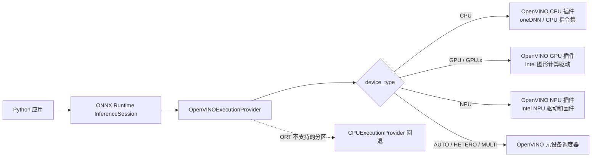
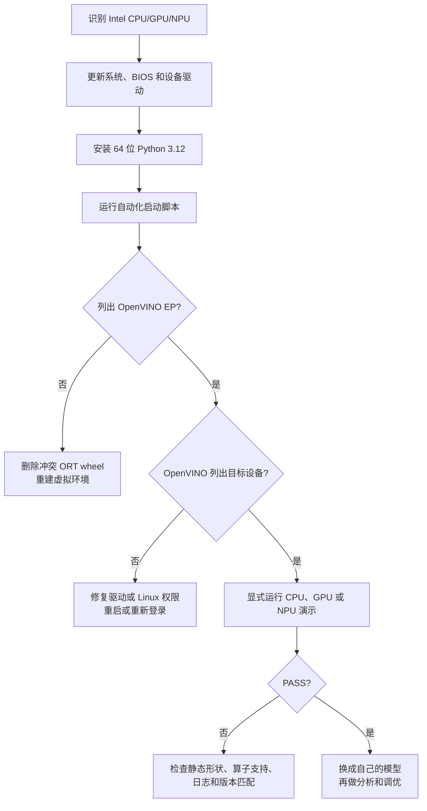

# ONNX Runtime + Intel OpenVINO：CPU、GPU 与 NPU

[English](README.md) · [仓库首页](../README.zh-CN.md) · [已审计 EP 5.9 源码](https://github.com/intel/onnxruntime/tree/v5.9/onnxruntime/core/providers/openvino)

| 项目 | 基线 |
|---|---|
| 最近验证 | `2026-07-17`；已核对官方发布页和 PyPI 实际发布文件 |
| 支持平台 | Windows 11、Ubuntu x86-64 |
| 版本组合 | `onnxruntime-openvino==1.24.1` + OpenVINO `2025.4.1`（EP 5.9） |
| 上游状态 | EP 5.9 仍是最新 ORT 集成；独立 OpenVINO `2026.2.1` 虽更新，但**不能**作为兼容替代品 |
| 目标设备 | Intel CPU、集成或独立 GPU、内置 NPU，以及显式指定的 Meta-device |
| 运行入口 | `run_demo.bat`、`run_demo.sh`、[`provider_test.py`](provider_test.py) |
| 验证范围 | Ubuntu 上的 `CPU`、`GPU`、`GPU.0` 和 `GPU.1` 已通过真机测试；Windows 已完成静态检查；NPU 步骤已按官方资料核验，但仍需在目标机器上实际运行 |

---

## 1. 了解软件组成

ONNX 应用不会直接操作 Intel 硬件。ONNX Runtime 先划分计算图，再由 OpenVINO 执行提供程序（EP）通过匹配的设备插件和驱动编译受支持的子图。



### 术语

| 术语 | 含义 | 本教程中需要安装的内容 |
|---|---|---|
| **ONNX** | 可移植的模型和计算图文件格式（`.onnx`） | 仅在自动生成离线演示模型时需要 Python `onnx` 包 |
| **ONNX Runtime（ORT）** | 加载模型，并把节点分发给执行提供程序 | 安装 `onnxruntime-openvino`，**不是**普通 `onnxruntime` |
| **执行提供程序（EP）** | ORT 面向特定加速方案的后端 | 该 wheel 已内置 `OpenVINOExecutionProvider` |
| **OpenVINO Runtime** | EP 使用的 Intel 编译器、运行时和 CPU/GPU/NPU 插件 | Linux wheel 自带；Windows 还需安装完全匹配的 `openvino` wheel |
| **驱动** | 操作系统与硬件之间的软件层 | CPU 通常只需保持系统更新；GPU/NPU 必须安装当前的 Intel/OEM 驱动 |
| **Intel NPU / Intel AI Boost** | 部分 Intel Core Ultra 处理器内置的低功耗 AI 加速器 | 这是物理硬件，无法通过安装软件获得 |
| **oneAPI** | Intel 开发工具家族 | 使用本教程预编译 Python 包时不需要 |

---

## 2. 选择设备

| 目标 | 常见硬件 | 最适合先做什么 | 驱动工作 | 模型建议 |
|---|---|---|---|---|
| `CPU` | Intel 官方支持的 x86-64 Atom/Core/Xeon 系列 | 最容易上手，算子支持最全面，动态形状处理也最灵活 | 通常只需更新系统和相关驱动 | FP32 是最稳妥的起点；INT8/BF16/FP16 的收益取决于具体 CPU |
| `GPU` | Intel HD/UHD/Iris/Iris Xe/Arc/Flex/Max | 适合并行处理视觉、音频和 LLM 任务，通常使用 FP16 | Windows 使用 Intel 图形驱动；Linux 使用计算运行时 | 优先采用静态或有界形状；精度满足要求时可使用 FP16/INT8 |
| `GPU.0`、`GPU.1` | 多块 Intel GPU | 明确选择已枚举的一块 GPU | 与 GPU 相同 | `GPU` 是 `GPU.0` 别名；必须查询 ID，不能猜测核显/独显顺序 |
| `NPU` | Intel Core Ultra 内置 NPU（Intel AI Boost） | 适合长时间运行、重视低功耗的 AI PC 任务 | 必须安装 NPU 驱动 | 使用**静态形状**；采用 FP16 或受支持的 INT8/QDQ 模型 |
| `AUTO:GPU,NPU,CPU` | 上述设备的任意组合 | 自动选择设备，适合可移植部署 | 所有列出的设备都需要相应驱动 | 无法确认最终使用了哪台设备；应先逐一进行显式测试 |
| `HETERO:GPU,CPU` | 至少两个设备 | 将不受支持的算子分配到其他设备 | 所有目标设备都需要相应驱动 | 有利于提高兼容性，但设备间数据传输可能降低性能 |
| `MULTI:GPU,CPU` | 至少两个设备 | 并行请求、提高吞吐 | 所有目标设备的驱动 | 在多设备加载模型并分配不同请求，通常不会降低单个请求延迟 |

> [!IMPORTANT]
> `onnxruntime.get_device()` **无法**可靠判断实际使用的 Intel 目标设备。应查看本目录演示输出的设备列表（它会直接查询 ORT wheel 加载或内置的 OpenVINO 运行时），显式设置 `device_type`，并检查计算图分配结果。在 Windows 或**独立的** Linux 诊断环境中，也可以使用 `openvino.Core().available_devices`；不要在本 Linux EP 环境中安装独立的 `openvino` wheel。

### 兼容性基线

| 项目 | 新手推荐 | 与本组合有关的官方范围 |
|---|---|---|
| 架构 | x86-64 / AMD64 | 本教程使用的 `onnxruntime-openvino` wheel 是 x86-64 |
| Python | **64 位 CPython 3.12** | 1.24.1 实际只发布 CPython 3.11、3.12、3.13 wheel；没有 3.10 或 3.14 wheel |
| Windows | 已安装全部更新的 64 位 Windows 11 | wheel 元数据声明支持 Windows 10+，但当前 NPU 支持主要面向 Windows 11 |
| Ubuntu | **Ubuntu 24.04 LTS 64 位** | CPU/GPU 文档覆盖 20.04/22.04/24.04；当前 Linux NPU 官方发布包面向 24.04 |
| NPU 内核 | 当前 Ubuntu 24.04 HWE/OEM 内核 | OpenVINO 2025.4 对 Ubuntu 24.04 的基线为 6.8+；NPU 驱动 v1.28.0 验证的是 6.14.0-36 |

> [!NOTE]
> `onnxruntime-openvino 1.24.1` 的 PyPI 元数据和分类器虽然列出了 Python 3.14，但实际只发布了面向 `win_amd64` 和 `manylinux_2_28_x86_64` 的 `cp311`、`cp312`、`cp313` wheel。能否安装取决于实际发布文件，而不是分类器中的说明。

### 这台电脑真的有 NPU 吗？

1. 查出准确的处理器型号。
2. 在 [Intel ARK](https://ark.intel.com/) 搜索型号，打开 **NPU Specifications（NPU 规格）**。
3. 查找 **Intel AI Boost**。Core Ultra 通常带 NPU，但仍需核对具体 SKU。
4. Windows 安装驱动后，任务管理器可能显示 **NPU** 性能页，设备管理器应出现 Intel AI Boost/NPU 且无警告图标。
5. Linux 可以先运行 `lspci -nn | grep -Ei 'NPU|VPU|AI Boost'`；确认是否存在 `/dev/accel/accel0`，才是检查驱动设备节点的关键步骤。

如果机器没有 NPU 硬件，`NPU` 永远不会出现，请使用 `CPU` 或 `GPU`。OpenVINO 2025.4 的裸 `AUTO` 默认优先列表排除 NPU，因此必须显式请求 NPU。

---

## 3. 最快开始验证



如果只使用 CPU，可以跳过 GPU/NPU 驱动章节，直接前往[第 6 节](#6-安装-python-环境)。

---

## 4. Windows 11 配置

### 4.1 更新 Windows、BIOS 和固件

1. 打开 **设置 → Windows 更新 → 检查更新**，同时检查相关的可选驱动更新。
2. 从电脑制造商处获取最新的 BIOS 和固件。如果 BIOS 中提供集成显卡或 NPU/AI 加速选项，请确保已经启用。
3. 重启电脑。

笔记本电脑应优先使用 OEM 驱动，因为其中可能包含针对具体平台的电源管理和固件集成。只有在 OEM 驱动版本过旧时，再尝试 Intel 通用驱动。

### 4.2 CPU

OpenVINO CPU 不需要单独安装驱动。保持 Windows、芯片组驱动和 BIOS 为最新版本即可。

### 4.3 Intel GPU 驱动

任选一条路线：

| 路线 | 何时使用 | 入口 |
|---|---|---|
| 电脑/OEM 支持页 | 笔记本或受管工作站首选 | 设备制造商支持网站 |
| Intel Driver & Support Assistant | 希望自动识别并更新 | [Intel DSA](https://www.intel.com/content/www/us/en/support/detect.html) |
| Intel 通用 Arc/Iris Xe 包 | OEM 包太旧，或安装了独立 Arc 显卡 | [Intel Arc 与 Iris Xe 驱动](https://www.intel.com/content/www/us/en/download/785597/intel-arc-iris-xe-graphics-windows.html) |

安装后重启，再验证：

1. 打开 **设备管理器 → 显示适配器**。
2. Intel 适配器不能有黄色警告图标。
3. 打开 **属性 → 驱动程序**，记录版本和日期。

### 4.4 Intel NPU 驱动

1. 先确认处理器确有 Intel AI Boost。
2. 优先从电脑制造商的支持页面下载，并选择针对具体机型测试过的 NPU 驱动。
3. 确认驱动支持当前处理器、Windows 版本和 OpenVINO 版本线。不要照搬旧博客中的版本号。
4. 安装并重启。
5. 检查 **设备管理器** 与 **任务管理器 → 性能 → NPU**，不能有警告图标。

> [!WARNING]
> NPU 对驱动与 OpenVINO 的版本兼容尤其敏感。截至本次核验，Intel 的[通用 Windows NPU 下载页](https://www.intel.com/content/www/us/en/download/794734/intel-npu-driver-windows.html)提供 `32.0.100.4778`，并明确面向 **OpenVINO 2026.2**，而不是本文锁定的 2025.4.1。官方没有说明它是否向后兼容，因此不能把这组混合版本视为已经验证。请使用发布说明明确覆盖 OpenVINO 2025.4 的 OEM 驱动，或者将完整的 ORT/OpenVINO 环境迁移到当前驱动已经验证的版本线；不要只升级驱动或运行时中的一部分，就假设 NPU 一定能够正常工作。

### 4.5 安装 Python

1. 从 [python.org](https://www.python.org/downloads/) 或 Microsoft Store 安装 **64 位 Python 3.12**。
2. 使用 python.org 安装器时，勾选 **Add python.exe to PATH**，并安装 Python Launcher。
3. 打开一个**新的**命令提示符，运行：

```bat
py -3.12 --version
py -3.12 -c "import struct; print(struct.calcsize('P') * 8)"
```

预期输出 Python 3.12.x 和 `64`。

---

## 5. Ubuntu 24.04 配置

### 5.1 更新基础系统

```bash
sudo apt update
sudo apt install -y python3 python3-venv python3-pip pciutils curl wget gnupg
```

以上命令只安装本教程需要的最小依赖，不会自动执行完整的发行版升级。请另行使用 `apt list --upgradable` 检查常规系统更新。只有在内核、固件或硬件驱动更新明确要求时才需要重启。

检查当前系统：

```bash
uname -r
lspci -nn | grep -Ei 'VGA|Display|3D|NPU|VPU|AI Boost'
```

### 5.2 CPU

CPU 通常不需要额外驱动，可继续安装 Python 软件栈。

### 5.3 Intel GPU 计算运行时

OpenVINO GPU 插件需要 Intel OpenCL/Level Zero 计算运行时。OpenVINO 官方配置页目前提供两种有效的安装方式：

| 安装方式 | 优点 | 风险与维护 |
|---|---|---|
| 发行版/Intel 图形软件仓库 | APT 管理更新和依赖 | 仓库设置会随时间、Ubuntu 和 GPU 世代变化 |
| 最新 compute-runtime 发布页中的包 | 精确、可审计 | 更手动；必须下载该发布列出的全部依赖 |

**推荐步骤（不要直接照搬几年前的软件源 URL）：**

1. 打开当前 [OpenVINO Intel GPU 配置](https://docs.openvino.ai/2025/get-started/install-openvino/configurations/configurations-intel-gpu.html) 和 [Intel 客户端 GPU 指南](https://dgpu-docs.intel.com/driver/client/overview.html)。
2. 按**本机 Ubuntu 版本和 GPU 世代**配置软件源。
3. 安装官方包组：

```bash
sudo apt update
sudo apt install -y ocl-icd-libopencl1 intel-opencl-icd intel-level-zero-gpu level-zero clinfo
sudo usermod -aG render "$USER"
```

这些包的职责不同：`ocl-icd-libopencl1` 是 OpenCL 加载器，`intel-opencl-icd` 是 Intel OpenCL GPU 驱动，Intel 仓库中的 `level-zero` 是通用 Level Zero 加载器，`intel-level-zero-gpu` 是 Intel Level Zero GPU 驱动。当前 compute-runtime 直接发布包和部分发行版仓库把最后一个驱动称为 `libze-intel-gpu1`；部分仓库把通用加载器称为 `libze1`。它们是不同渠道中的替代包名，不是应盲目混装的额外组件。应使用一个完整软件仓库，或同一次 compute-runtime 发布中的完整包组和校验和。

4. 注销并重新登录（或重启），再验证：

```bash
groups
ls -l /dev/dri/renderD* 2>/dev/null
clinfo -l
```

Arc 独立 GPU 需要现代内核。OpenVINO 2025.4 页面至少建议 6.2+，实际应采用当前驱动发布指定的更新内核。除非该设备/内核的官方说明明确要求，否则不要安装陈旧 DKMS 栈。

### 5.4 Intel NPU 驱动——必须整体对齐版本

Linux NPU 栈包含内核模块、固件、Level Zero 加载器、NPU 用户态驱动与编译器。应把 [Intel Linux NPU 驱动发布页](https://github.com/intel/linux-npu-driver/releases)中的一次发布视为一个整体。

| 本教程运行时 | 接近匹配的 NPU 发布 | Ubuntu 状态 | 原因 |
|---|---|---|---|
| OpenVINO 2025.4.1 | Linux NPU 驱动 **v1.28.0** 经 OpenVINO 2025.4 验证 | 仅 Ubuntu 24.04 | 这是官方文档中记录的最接近版本组合 |
| 最新 Linux NPU 驱动 | 查看该发布的版本表 | 通常 Ubuntu 24.04 | 新版本可能面向 OpenVINO 2026.x；应整体升级 ORT/OpenVINO |
| Ubuntu 22.04 | v1.26.0 是最后仍提及 22.04 的发布线 | 对当前驱动版本而言已经过时 | 新安装 NPU 时推荐使用 Ubuntu 24.04 |

截至 2026-07-17 核验，最新的 Linux NPU 版本为 **v1.33.0**，其验证组合是 OpenVINO 2026.2 和 Level Zero 1.27.0。它不能直接替代本教程锁定的 v1.28.0。

**安全安装方式：**

1. 确认内核模块与 PCI 设备：

```bash
uname -r
lspci -nn | grep -Ei 'NPU|VPU|AI Boost'
modinfo intel_vpu 2>/dev/null | head
```

2. 打开所选发布页（本文锁定组合对应 [v1.28.0](https://github.com/intel/linux-npu-driver/releases/tag/v1.28.0)）。把 Ubuntu 24.04 资产下载到一个**全新空目录**，并在修改已安装驱动前验证每个 Debian 包的签名：

```bash
rm -rf ~/intel-npu-driver-v1.28.0
mkdir -m 700 ~/intel-npu-driver-v1.28.0
cd ~/intel-npu-driver-v1.28.0
wget https://github.com/intel/linux-npu-driver/releases/download/v1.28.0/linux-npu-driver-v1.28.0.20251218-20347000698-ubuntu2404.tar.gz
tar -xf linux-npu-driver-v1.28.0.20251218-20347000698-ubuntu2404.tar.gz

curl https://keys.openpgp.org/vks/v1/by-fingerprint/EA267657A608300C296B8F8AD52C9665A4077678 | gpg --import
shopt -s nullglob
DEB_PACKAGES=(./*.deb)
((${#DEB_PACKAGES[@]} > 0)) || { echo "未找到 Debian 包" >&2; exit 1; }
for PACKAGE in "${DEB_PACKAGES[@]}"; do
    SIGNATURE="$PACKAGE.asc"
    [[ -f "$SIGNATURE" ]] || { echo "缺少签名：$SIGNATURE" >&2; exit 1; }
    gpg --verify "$SIGNATURE" "$PACKAGE" || exit 1
done
```

密钥指纹必须是 `EA267657A608300C296B8F8AD52C9665A4077678`，与发布页一致。每个包都必须显示**签名正确**。提示“本人尚未信任此密钥”不等于签名错误；如果签名错误或缺失，必须停止。

3. 严格按发布页清除旧 NPU 用户态包，再安装已经验证的 v1.28.0 包组：

```bash
sudo dpkg --purge --force-remove-reinstreq intel-driver-compiler-npu intel-fw-npu intel-level-zero-npu intel-level-zero-npu-dbgsym
sudo apt update
sudo apt install -y libtbb12
sudo dpkg -i ./*.deb
```

提示某个旧包原本未安装是正常的；但包配置、依赖或签名错误绝不能忽略，必须先解决再继续。

4. v1.28.0 的验证组合使用 **Level Zero v1.24.2**。发布页要求系统缺少 `level-zero` 时安装此包：

```bash
if ! dpkg-query -W -f='${db:Status-Status}\n' level-zero 2>/dev/null | grep -qx installed; then
    wget https://github.com/oneapi-src/level-zero/releases/download/v1.24.2/level-zero_1.24.2+u24.04_amd64.deb
    sudo dpkg -i level-zero_1.24.2+u24.04_amd64.deb
fi
dpkg-query -W -f='${Package} ${Version} ${db:Status-Status}\n' level-zero
```

如果 `level-zero` 已经由所选 Intel GPU/NPU 软件仓库有意管理，上述条件语句不会修改它。应对照发布说明检查输出版本，不要盲目混装或降级加载器。

5. 记录已安装版本、授予普通用户权限并重启：

```bash
dpkg-query -W -f='${Package} ${Version}\n' intel-driver-compiler-npu intel-fw-npu intel-level-zero-npu level-zero
sudo usermod -aG render "$USER"
sudo reboot
```

6. 重启后验证：

```bash
ls -lah /dev/accel/accel0
id -nG | tr ' ' '\n' | grep '^render$'
lsmod | grep intel_vpu
sudo dmesg | grep -Ei 'intel_vpu|ivpu|firmware' | tail -n 50
```

预期设备权限类似 `crw-rw---- root render`。若不符合，请使用所选 NPU 发布页给出的 udev 规则，而不要用不安全的永久 `chmod 666` 绕过权限。

> [!NOTE]
> Intel NPU 主线驱动可能已经比本教程采用的版本更新，但“全部安装最新版”不等于“这些版本已经一起测试过”。初次配置时，应让 EP、OpenVINO Runtime、NPU 编译器/UMD、固件和 Level Zero 保持在同一版本线。

---

## 6. 安装 Python 环境

### 如何理解本文所说的“最新”

截至本次核验，`onnxruntime-openvino 1.24.1`（EP 5.9）仍是最新发布的 OpenVINO EP wheel，并明确配套 OpenVINO 2025.4.1。独立的 `openvino` 项目虽然已经更新到 2026.2.1，但 Intel 尚未发布与该运行时匹配的 `onnxruntime-openvino`。因此，在当前 EP 环境中改装 `openvino==2026.2.1` 或运行 `pip install -U openvino` **并不是正确的升级方式**。应等待 Intel 发布明确指定新 ORT/OpenVINO 组合的 EP。

### 为什么锁定这些包？

| 组件 | 锁定值 | 原因 |
|---|---:|---|
| `onnxruntime-openvino` | 1.24.1 | Intel OpenVINO EP 5.9 wheel |
| OpenVINO | 2025.4.1 | EP 5.9 的构建运行时；Linux EP wheel 内置，Windows 单独安装 |
| Python | CPython 3.11–3.13（推荐 3.12） | 实际发布的 Windows/Linux x86-64 wheel；没有 3.10 或 3.14 文件 |
| `onnx` | 1.22.0 | 生成和检查离线演示图；此版本的 wheel 可供上述三个 Python 版本使用 |
| `numpy` | Python 3.11 使用 2.4.6；Python 3.12–3.13 使用 2.5.1 | 使用各 Python 版本兼容的最新稳定分支；NumPy 2.5 已停止支持 Python 3.11 |

上表锁定的是通过环境标记选择的顶层软件包，并不是带哈希、精确到文件内容的供应链 lockfile。兼容的间接依赖仍会按照各软件包的元数据解析；两个启动脚本都会在推理前运行 `pip check`。

官方兼容历史：

| Intel EP 发布 | ORT 包 | OpenVINO |
|---:|---:|---:|
| 5.9 | 1.24.1 | 2025.4.1 |
| 5.8 | 1.23.0 | 2025.3.0 |
| 5.7 | 1.22.0 | 2025.1.0 |

不要只升级 Windows 的 `openvino` wheel，而让 `onnxruntime-openvino` 停留在旧版本。

### Windows——手动命令

在本教程目录中运行：

```bat
if exist .venv rmdir /s /q .venv
py -3.12 -m venv .venv
.venv\Scripts\activate
python -m pip install -r requirements.txt
```

Windows 还需要安装锁定版本的 `openvino==2025.4.1`。演示代码会在创建会话和加载 EP 依赖的 DLL 之前，调用 Intel 官方的 `onnxruntime.tools.add_openvino_win_libs.add_openvino_libs_to_path()`。

### Ubuntu——手动命令

```bash
rm -rf .venv
python3 -m venv .venv
source .venv/bin/activate
python -m pip install -r requirements.txt
```

Linux 的 `onnxruntime-openvino 1.24.1` wheel 已经包含原生 OpenVINO 2025.4.1 库，因此 `requirements.txt` 有意只在 **Windows** 上安装独立的 `openvino` wheel。实际测试表明，在 Linux 中同时安装这两种发行包，会因导入顺序不同而出现原生符号无法解析的问题。启动脚本会重建这类受污染的环境，演示程序也会在导入 ONNX Runtime 前拒绝该组合。如需使用 `Core().available_devices` 单独诊断，请把 `openvino` 安装到另一个 Linux 虚拟环境中。

> [!CAUTION]
> 一个虚拟环境中只能安装**一种 ONNX Runtime wheel**。`onnxruntime`、`onnxruntime-gpu`、`onnxruntime-directml` 和 `onnxruntime-openvino` 导入后都叫 `onnxruntime`，混装后可能相互覆盖。

### 推理前验证

```bash
python -c "import onnxruntime as ort; print(ort.__version__); print(ort.get_available_providers())"
# 可选独立检查：仅用于 Windows，或独立的 Linux OpenVINO 诊断环境。
python -c "from openvino import Core; print(Core().available_devices)"
```

最低预期：

```text
1.24.1
['OpenVINOExecutionProvider', 'CPUExecutionProvider', ...]
['CPU', 'GPU.0', 'NPU']   # 仅为示例；实际列表由硬件和驱动决定
```

在本教程干净的 Linux EP 专用环境中，可选的第二条命令会提示不存在独立的 `openvino` 模块，这是预期行为。演示程序会改用 wheel 内置的 OpenVINO 绑定枚举设备，同时设置 `session.disable_cpu_ep_fallback=1` 并记录 EP 的计算图分配。如果这个完全受支持的演示图有任何节点分配给 ORT CPU EP，会话创建就会失败；对于 NPU，OpenVINO EP 也会读取同一设置，并禁止内部 NPU→CPU 回退。随后，脚本还会直接确认五个命名节点都属于 `OpenVINOExecutionProvider`。

请按下面的方式解读两张列表：

| 输出 | 可以确认 | 不能确认 |
|---|---|---|
| ORT 列出 `OpenVINOExecutionProvider` | ORT wheel 和 EP 库已正确加载 | GPU 或 NPU 驱动是否可用 |
| 演示/OpenVINO 列出 `GPU.0` | Intel GPU 插件和驱动可以枚举该 GPU | 当前 ONNX 模型能否完全在 GPU 上运行 |
| 演示/OpenVINO 列出 `NPU` | NPU 硬件、驱动和权限均可见 | 动态模型或不受支持的模型是否一定能够编译 |
| 会话把 OpenVINO 放在首位 | EP 已按最高优先级注册 | 每个节点是否都在设备上执行；不受支持的分区仍可能回退 |
| 演示报告 `Graph assignment: OpenVINOExecutionProvider (5/5 nodes...)` | 冒烟图中每个已解析节点都分配给 OpenVINO EP，且 ORT/NPU CPU 回退均已禁用 | OpenVINO Meta-device 最终选择了哪台物理设备，或 OpenVINO 内部是否使用主机 CPU 完成辅助工作 |

---

## 7. 自动化 Python 演示

演示程序完全自包含：

- 本地创建一个静态 FP32 ONNX 模型，不下载模型；
- 只用 CPU/GPU/NPU 都常见的 `MatMul`、`Add`、`Relu`；
- 通过 ORT wheel 实际内置或加载的 OpenVINO 运行时枚举设备，不额外安装可能冲突的 Linux 包；
- 显式创建 `OpenVINOExecutionProvider` 会话，禁用 ORT 与 NPU→CPU 图回退，并直接检查五个节点的分配；
- 与 ORT CPU 结果比较：CPU 使用更严格的误差范围，GPU/NPU 使用适合 FP16 的误差范围，然后报告预热后的诊断延迟；
- 为直接 CPU/GPU/NPU 与 AUTO 测试启用按设备区分的编译模型缓存（HETERO/MULTI 演示路径不设置缓存）。

### Windows：从命令提示符运行

```bat
run_demo.bat
```

### Ubuntu

```bash
chmod +x run_demo.sh
./run_demo.sh
```

如果 `python3` 指向不受支持的版本，但系统已安装受支持解释器，可显式选择，例如：`PYTHON_BIN=python3.12 ./run_demo.sh`。

启动脚本会创建或修复 `.venv`，安装锁定版本的顶层依赖，检查依赖关系，并默认运行禁用回退的 `CPU` 测试。环境版本匹配时，后续运行不会重复安装。请逐一验证每台物理设备：

| 设备 | Windows | Ubuntu |
|---|---|---|
| CPU | `run_demo.bat --device CPU` | `./run_demo.sh --device CPU` |
| 第一块 Intel GPU | `run_demo.bat --device GPU` | `./run_demo.sh --device GPU` |
| 指定已枚举 GPU | `run_demo.bat --device GPU.1` | `./run_demo.sh --device GPU.1` |
| Intel NPU | `run_demo.bat --device NPU` | `./run_demo.sh --device NPU` |
| 完成显式验证后的 AUTO | `run_demo.bat --device AUTO:GPU,NPU,CPU` | `./run_demo.sh --device AUTO:GPU,NPU,CPU` |

只列出已经安装且确实需要的设备；没有 NPU 的机器应使用 `AUTO:GPU,CPU`。本演示有意拒绝不带设备列表的 `AUTO`：实际测试中，锁定版本的 wheel 会把整个演示图分配给 ORT `CPUExecutionProvider`；OpenVINO 自身的 AUTO 机制也会先使用 CPU 启动推理，而且 2025.4 的默认优先列表不包含 NPU。`AUTO:...` 只能用于测试可移植性，**不能确认最终使用了哪台物理设备**。

成功输出结尾类似：

```text
ORT providers     : ['OpenVINOExecutionProvider', 'CPUExecutionProvider']
OpenVINO Runtime  : 2025.4.1 (...)
Device query      : ONNX Runtime OpenVINO device API
Intel devices     : ['CPU', 'GPU.0', 'NPU']
Requested target  : NPU
Resolved target   : NPU
Session providers : ['OpenVINOExecutionProvider', 'CPUExecutionProvider']
Graph assignment  : OpenVINOExecutionProvider (5/5 nodes: ...)
Validation limits : rtol=0.01, atol=0.005
Median latency    : ... ms
PASS: all five demo nodes were assigned to OpenVINO EP and output is valid.
```

会话列表中仍会显示 `CPUExecutionProvider`，因为 ORT 会注册默认的 CPU EP；但只要演示图中有任何节点分配给它，禁用回退的会话就会初始化失败，而直接读取节点分配记录又提供了第二项检查。GPU/NPU 内部通常使用 FP16，因此允许的数值误差有意设置得比 CPU 更宽，但仍足以发现明显错误。首次启动可能较慢，因为 OpenVINO 需要编译计算图。输出的时间只用于冒烟诊断，不是 CPU 与加速器之间的性能比较；这个小模型不足以得出性能结论。

---

## 8. 在自己的 Python 程序中使用 EP

### 最小、面向未来的配置

从 ORT 1.23/OpenVINO 2025.3 起，优先使用 `load_config` JSON，而不是已弃用的顶层 `precision`、`num_streams`、`cache_dir` 等选项。

```python
import json
import platform

if platform.system() == "Windows":
    import onnxruntime.tools.add_openvino_win_libs as utils
    utils.add_openvino_libs_to_path()

import onnxruntime as ort

config = {
    "GPU": {
        "PERFORMANCE_HINT": "LATENCY",
        "CACHE_DIR": "./openvino_cache",
        "INFERENCE_PRECISION_HINT": "f16",
    }
}
provider_options = {
    "device_type": "GPU",
    "load_config": json.dumps(config),
}

session_options = ort.SessionOptions()
session_options.graph_optimization_level = ort.GraphOptimizationLevel.ORT_DISABLE_ALL
# 禁用回退的验证模式：任何图节点需要 ORT CPU 回退都会直接失败。
session_options.add_session_config_entry("session.disable_cpu_ep_fallback", "1")
# 审计模式：填充 session.get_provider_graph_assignment_info()。
session_options.add_session_config_entry("session.record_ep_graph_assignment_info", "1")

session = ort.InferenceSession(
    "model.onnx",
    sess_options=session_options,
    providers=[("OpenVINOExecutionProvider", provider_options)],
)
outputs = session.run(None, {session.get_inputs()[0].name: input_numpy})
for assignment in session.get_provider_graph_assignment_info():
    print(assignment.ep_name, [(node.name, node.op_type) for node in assignment.get_nodes()])
```

只有在模型预计能被目标设备完整支持时，才适合禁用 CPU 回退。完成显式设备验证后，生产应用可以根据可用性要求移除此设置，并追加 `CPUExecutionProvider`，允许不受支持的分区回退；但必须分析并说明这种行为，不能再声称计算全部由目标设备执行。OpenVINO EP 官方文档建议在许多场景中关闭 ORT 高层计算图优化，让 OpenVINO 获得原始计算图并执行硬件感知融合；生产模型仍应分别测试两种优化设置。

### 推荐起始选项

| 目标 | `device_type` | `load_config` 示例思路 | 说明 |
|---|---|---|---|
| CPU 低延迟 | `CPU` | `{"CPU":{"PERFORMANCE_HINT":"LATENCY","NUM_STREAMS":"1"}}` | 先让 OpenVINO 自动选择线程数 |
| CPU 吞吐 | `CPU` | `{"CPU":{"PERFORMANCE_HINT":"THROUGHPUT"}}` | 需要提交并行请求才能受益 |
| GPU 低延迟 | `GPU` | `{"GPU":{"PERFORMANCE_HINT":"LATENCY","INFERENCE_PRECISION_HINT":"f16"}}` | 验证精度并添加缓存 |
| GPU 最高精度 | `GPU` | `{"GPU":{"EXECUTION_MODE_HINT":"ACCURACY"}}` | 不要同时使用执行模式与精度提示 |
| NPU | `NPU` | `{"NPU":{"PERFORMANCE_HINT":"LATENCY","CACHE_DIR":"./cache"}}` | 当前 NPU 插件文档要求静态形状 |
| NPU QDQ 模型 | `NPU` | 增加 `"NPU_QDQ_OPTIMIZATION":"YES"` | 仅用于合适的量化 QDQ 计算图 |
| 可移植自动选择 | `AUTO:GPU,NPU,CPU` | `{"AUTO":{"PERFORMANCE_HINT":"LATENCY"}}` | 先通过显式测试；AUTO 启动时可能用 CPU，且不能标识唯一物理目标 |

### 常用提供程序选项（非完整清单）

| 选项 | ORT 1.24 状态 | 用途/取值 |
|---|---|---|
| `device_type` | 当前使用 | `CPU`、`GPU`、`GPU.0`、`GPU.1`、`NPU`、`AUTO:...`、`HETERO:...`、`MULTI:...` |
| `load_config` | **首选** | 按设备组织 OpenVINO 属性的 JSON 字符串 |
| `disable_dynamic_shapes` | 会解析，但在锁定 v5.9 中不是可自由控制的有效开关 | EP 会按设备路径覆盖它：CPU/GPU 保留动态处理；直接 NPU 路径会使用运行时静态特化，因果 LLM 路径除外 |
| `reshape_input` | 当前使用 | 可指定具体的固定形状或解析器支持的边界；验证 NPU 时应使用明确的固定形状 |
| `layout` | 当前使用 | 声明 `input[NCHW],output[NC]` 等布局 |
| `device_id` | 已弃用 | 改用 `device_type="GPU.1"` |
| `precision` | 已弃用 | 改用 `load_config` 中的 `INFERENCE_PRECISION_HINT` 或 `EXECUTION_MODE_HINT` |
| `num_of_threads` | 已弃用 | 改用 `INFERENCE_NUM_THREADS` |
| `num_streams` | 已弃用 | 改用 `NUM_STREAMS` |
| `cache_dir` | 已弃用 | 改用 `CACHE_DIR` |
| `enable_qdq_optimizer` | 已弃用 | 改用 NPU 的 `NPU_QDQ_OPTIMIZATION` |
| `model_priority` | 已弃用 | 改用 `MODEL_PRIORITY` |

锁定版本的解析器接受 JSON 字符串、数字、布尔值和最多八层嵌套对象；具体 OpenVINO 属性决定合法类型和值，官方示例经常使用字符串。`EXECUTION_MODE_HINT` 与 `INFERENCE_PRECISION_HINT` 二选一，不要同时设置。其他已接受的高级选项还包括 `device_luid`、`context`、`enable_causallm`、`enable_opencl_throttling`，本文有意不把它们作为新手默认项。添加前请查询[当前 EP 选项文档](https://onnxruntime.ai/docs/execution-providers/OpenVINO-ExecutionProvider.html#configuration-options)和匹配的 v5.9 源码。

### NPU 上的动态模型

当前 OpenVINO NPU 文档明确写着只支持静态形状。应尽量导出固定形状 ONNX。如果 ONNX 文件是动态的，但每次推理只使用一个已知形状，可给 EP 一个**具体固定**特化，例如：

```python
provider_options = {
    "device_type": "NPU",
    "reshape_input": "input_ids[1,128]",
}
```

该语法必须覆盖每个动态输入，并与实际输入名称和维度一致。虽然 EP 解析器文档描述了范围边界语法，但这并不表示 2025.4 NPU 插件原生支持动态形状，而且本文也没有在 NPU 硬件上验证这种范围。初次配置 NPU 时不要采用边界范围；导出固定形状模型才是可靠的起点。

---

## 9. 如何确认加速器确实执行了计算

不能仅凭“脚本没有报错”就判定验证成功。

| 层级 | 检查 | 期望结果 |
|---:|---|---|
| 1 | `ort.get_available_providers()` | 包含 `OpenVINOExecutionProvider` |
| 2 | 演示的内置设备查询（或在安全环境中查看 `Core().available_devices`） | 包含显式目标（`GPU.0`/`NPU`） |
| 3 | 用显式目标和 `session.disable_cpu_ep_fallback=1` 创建会话 | 构建成功；没有 ORT CPU 节点分配，也没有 OpenVINO NPU→CPU 回退 |
| 4 | 启用分配记录并调用 `get_provider_graph_assignment_info()` | 每个预期的已解析节点都报告 `OpenVINOExecutionProvider` |
| 5 | 与 CPU 输出比较 | 在 FP16/INT8 合理误差内 |
| 6 | 启用 ORT 性能分析 | OpenVINO EP 获得预期的计算图分区；禁用回退的验证中没有 `CPUExecutionProvider` 节点事件 |
| 7 | 观察系统遥测 | Windows 任务管理器或 Linux GPU/NPU 工具显示活动 |
| 8 | 对预热后的真实负载计时 | 延迟/吞吐稳定，缓存行为正确 |

性能分析示例：

```python
options = ort.SessionOptions()
options.enable_profiling = True
options.graph_optimization_level = ort.GraphOptimizationLevel.ORT_DISABLE_ALL
options.add_session_config_entry("session.disable_cpu_ep_fallback", "1")
session = ort.InferenceSession(
    "model.onnx",
    sess_options=options,
    providers=[("OpenVINOExecutionProvider", {"device_type": "GPU"})],
)
session.run(None, feeds)
print(session.end_profiling())
```

检查 JSON 中的 `provider` 字段。OpenVINO 在内部合理使用主机 CPU，与 ORT 将计算图节点分配给 `CPUExecutionProvider` 是两回事。对于有意混合执行的生产会话，可以移除禁用回退的设置、明确列出 CPU 回退，再通过性能分析量化每个回退分区。

---

## 10. 故障排查

| 现象 | 常见原因 | 解决方式 |
|---|---|---|
| 没有 `OpenVINOExecutionProvider` | 普通或冲突 ORT wheel 覆盖了同名导入 | 删除 `.venv`，重建后只装 `onnxruntime-openvino` |
| Windows `DLL load failed`、无法加载 OpenVINO provider | OpenVINO DLL 缺失/版本不匹配，或辅助函数调用太晚 | 安装准确的 `openvino==2025.4.1`；创建 OpenVINO 会话前调用 `add_openvino_libs_to_path()` |
| Linux 无法加载 provider `.so` / `undefined symbol` | 独立 `openvino` 与 EP 内置库混装，或全局 `LD_LIBRARY_PATH` 污染 | 删除 `.venv`；只安装 Linux EP requirements；移除自定义 OpenVINO 路径；绝不要把 provider `.so` 复制到系统目录 |
| 演示只列出 `['CPU']` | GPU/NPU 计算驱动未安装 | 完成相应驱动章节，然后重启/重新登录 |
| 能显示桌面，但 OpenVINO 不列 GPU | 只有显示驱动，缺少 OpenCL/Level Zero 计算运行时 | 安装 `intel-opencl-icd` 和匹配的 Level Zero GPU 包；运行 `clinfo -l` |
| Linux GPU `Permission denied` | 用户不在 `render` 组，或当前登录会话未刷新组 | `sudo usermod -aG render "$USER"` 后完整注销登录或重启 |
| 没有 `/dev/accel/accel0` | 无 NPU、BIOS 禁用、内核模块/固件缺失 | 核对 SKU/BIOS、内核、`intel_vpu` 与所选驱动发布 |
| NPU 节点存在但 OpenVINO 不列 NPU | UMD/编译器/Level Zero 不匹配或权限问题 | 检查 `ls -lah`、`groups`、驱动包、匹配加载器和 `dmesg` |
| NPU 编译演示或模型失败 | 驱动/运行时不匹配，或模型动态/不支持 | 先跑本文静态演示；对齐版本；导出静态形状；核对 NPU 拓扑/算子支持 |
| 安装 Intel 当前通用驱动后 Windows NPU 失败 | 当前通用包宣传 OpenVINO 2026.2，而本文锁定 2025.4.1 | 使用明确覆盖 2025.4 的 OEM 驱动，或把 ORT/OpenVINO 作为一个已验证发布族整体升级；不要猜测向后兼容性 |
| 演示拒绝裸 `AUTO` | 它无法验证物理目标，且实测会使用 ORT CPU 回退 | 先显式验证 `GPU`/`NPU`，再用 `AUTO:GPU,CPU` 等明确列表 |
| 允许回退的应用运行成功，但只有 CPU 忙碌 | AUTO 选择了 CPU，或发生 ORT 计算图回退 | 显式请求 `GPU`/`NPU`，禁用 CPU 回退并检查性能分析记录 |
| `GPU.1` 失败 | 实际枚举顺序不同 | 查看演示的 `Intel devices` 行（或在安全环境中查询 `Core`），不要猜独显编号 |
| 首次运行特别慢 | 模型或内核编译 | 启用 `CACHE_DIR`，保留缓存，计时前预热 |
| 加速器比 CPU 慢 | 模型太小、传输/编译开销、回退、精度错误 | 用真实负载、预热、静态形状；检查分区；正确区分延迟与吞吐 |
| 精度变化 | FP16/BF16/INT8 或规约顺序不同 | 用任务级容差与 FP32 比较；必要时设 `EXECUTION_MODE_HINT=ACCURACY` 或 FP32 |
| `pip` 找不到可用版本 | 32 位 Python、不支持的 Python、架构或平台 | 使用 x86-64 CPython 3.11、3.12 或 3.13；此发布没有 3.10/3.14/ARM wheel |
| 模型失败后 NPU 无响应 | 驱动恢复问题 | 重启/更新匹配驱动；确认支持后再反复编译失败模型 |

### 收集有用的诊断信息

**Windows PowerShell：**

```powershell
$PY = ".\.venv\Scripts\python.exe"
& $PY -c "import platform,sys; print(platform.platform()); print(sys.version)"
& $PY -m pip list | Select-String "onnx|openvino|numpy"
& $PY -m pip check
& $PY -c "import onnxruntime as o; print(o.get_available_providers()); print(o.get_build_info())"
& $PY -c "from openvino import Core; print(Core().available_devices)"
& $PY provider_test.py --device CPU --runs 1 --warmups 0
Get-PnpDevice | Where-Object {$_.FriendlyName -match 'Intel|NPU|AI Boost'}
```

**Ubuntu：**

```bash
uname -a
cat /etc/os-release
lspci -nn | grep -Ei 'VGA|Display|3D|NPU|VPU|AI Boost'
groups
ls -lah /dev/dri/renderD* /dev/accel/accel0 2>/dev/null
clinfo -l 2>/dev/null || true
dpkg -l | grep -E 'intel-(opencl|level-zero|driver-compiler|fw)|level-zero|libze'
.venv/bin/python -m pip list | grep -E 'onnx|openvino|numpy'
.venv/bin/python -m pip check
.venv/bin/python -c "import onnxruntime as o; print(o.get_available_providers()); print(o.get_build_info())"
.venv/bin/python provider_test.py --device CPU --runs 1 --warmups 0
# 只能在独立 OpenVINO 诊断 venv 查询 Core；绝不要装进本 EP venv。
sudo dmesg | grep -Ei 'intel_vpu|ivpu|drm|firmware' | tail -n 100
```

公开日志前请删除用户名和私人路径。

---

## 11. 生产部署清单

- [ ] 锁定经过测试的 ORT ↔ OpenVINO 版本对。
- [ ] 环境中只打包一种 ONNX Runtime 分发。
- [ ] 把 GPU/NPU 驱动纳入部署测试矩阵；生产环境不要只静默升级某一层。
- [ ] 验证完整设备执行时，使用显式 `device_type` 和 `session.disable_cpu_ep_fallback=1`。
- [ ] 所有物理设备分别通过后，才加入明确的 `AUTO:<devices>` 列表；不能把 AUTO 当作具体物理设备的执行依据。
- [ ] NPU 导出具体静态形状；只有所选 CPU/GPU 路径明确记录并经过测试时才使用有界动态形状。
- [ ] 用真实验证数据对照 CPU/参考实现检查精度，而不是只测一个随机张量。
- [ ] 分析计算图分区，调查较大的 CPU 回退区域。
- [ ] 分别测试首次运行、命中缓存后的首次运行、预热延迟与持续吞吐。
- [ ] 启用并持久化 `CACHE_DIR`；模型、运行时、驱动、设备或关键属性改变后使缓存失效。
- [ ] 端到端测试应包含真实输入传输与前后处理。
- [ ] 不要为了绕过 Linux 权限而用 root 运行生产推理。
- [ ] 记录 OS、BIOS、内核、GPU/NPU 驱动、Python、ORT、OpenVINO、模型哈希、精度和 provider 选项。

---

## 12. 参考资料

本文使用与发布版本对应的官方来源。安装前仍必须按准确硬件和操作系统核对会变化的驱动仓库。

| 主题 | 权威来源 |
|---|---|
| ORT OpenVINO EP 安装、选项与设备 | [ONNX Runtime OpenVINO EP 文档](https://onnxruntime.ai/docs/execution-providers/OpenVINO-ExecutionProvider.html) |
| 已审计 EP 实现源码 | [Intel ONNX Runtime v5.9 OpenVINO provider 源码](https://github.com/intel/onnxruntime/tree/v5.9/onnxruntime/core/providers/openvino) |
| 二进制版本匹配与 Windows DLL 配置 | [Intel ONNX Runtime OpenVINO EP 发布](https://github.com/intel/onnxruntime/releases) |
| 1.24.1 实际 wheel 文件 | [PyPI JSON 文件清单](https://pypi.org/pypi/onnxruntime-openvino/1.24.1/json) |
| 更新的独立 OpenVINO 发布（并非 EP 锁定值） | [OpenVINO 发布](https://github.com/openvinotoolkit/openvino/releases) |
| 演示辅助包发布 | [PyPI 上的 ONNX](https://pypi.org/project/onnx/) · [PyPI 上的 NumPy](https://pypi.org/project/numpy/) |
| OpenVINO 系统要求 | [OpenVINO 2025 系统要求](https://docs.openvino.ai/2025/about-openvino/release-notes-openvino/system-requirements.html) |
| Intel GPU 系统配置 | [OpenVINO Intel GPU 配置](https://docs.openvino.ai/2025/get-started/install-openvino/configurations/configurations-intel-gpu.html) |
| Intel GPU 计算包 | [Intel compute-runtime 发布](https://github.com/intel/compute-runtime/releases) |
| AUTO 候选和启动行为 | [OpenVINO 2025.4 自动设备选择](https://docs.openvino.ai/2025/openvino-workflow/running-inference/inference-devices-and-modes/auto-device-selection.html) |
| NPU 功能与限制 | [OpenVINO NPU 设备文档](https://docs.openvino.ai/2025/openvino-workflow/running-inference/inference-devices-and-modes/npu-device.html) |
| 本文使用的 Linux NPU 栈 | [Intel Linux NPU 驱动 v1.28.0](https://github.com/intel/linux-npu-driver/releases/tag/v1.28.0) |
| Windows NPU 驱动 | [Intel Windows NPU 驱动](https://www.intel.com/content/www/us/en/download/794734/intel-npu-driver-windows.html) |
| 识别 NPU 硬件 | [Intel：如何检查处理器是否有 NPU](https://www.intel.com/content/www/us/en/support/articles/000097597/processors.html) |
| ORT Python provider 语义 | [ONNX Runtime Python API](https://onnxruntime.ai/docs/api/python/api_summary.html) |
| 内置 OpenVINO 设备查询 | [v5.9 Python 绑定](https://github.com/intel/onnxruntime/blob/v5.9/onnxruntime/python/onnxruntime_pybind_state.cc#L1567-L1574) |
| 直接 EP 计算图分配记录 | [v5.9 Python 绑定](https://github.com/intel/onnxruntime/blob/v5.9/onnxruntime/python/onnxruntime_pybind_state.cc#L2724-L2745) |
| 严格 CPU EP 回退开关 | [v5.9 会话选项定义](https://github.com/intel/onnxruntime/blob/v5.9/include/onnxruntime/core/session/onnxruntime_session_options_config_keys.h#L267-L280) |

**时效说明：** 应先检查 Intel 最新的 EP 发布，再检查独立 OpenVINO 项目的发布情况。版本更高的独立 OpenVINO 不能取代 EP 明确配套的版本。新版 `onnxruntime-openvino` 发布后，应先阅读 Intel 发布说明，同时更新 ORT 和 OpenVINO 的锁定值，检查 PyPI 实际发布的文件名（不能只看分类器），再重新验证 CPU/GPU/NPU 驱动并运行显式设备测试。`onnx`、`numpy` 等辅助包只能在确认 Python/wheel 组合能够正常解析且冒烟测试通过后单独更新。
