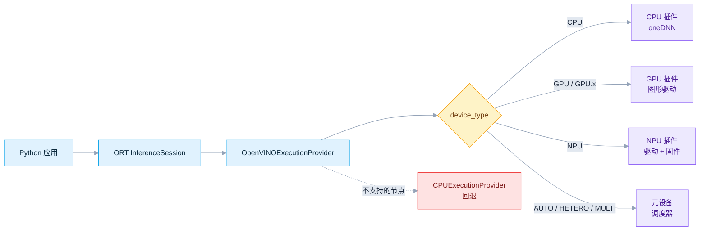
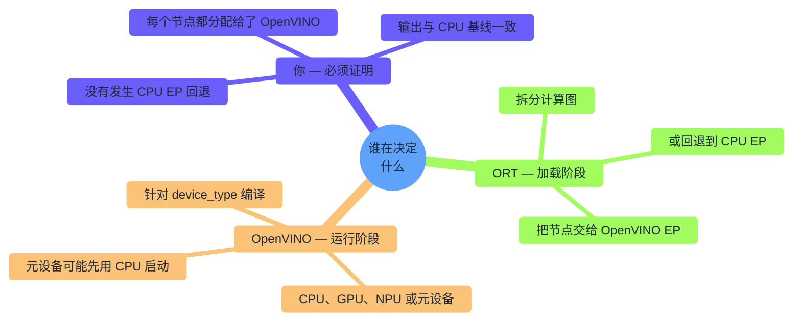
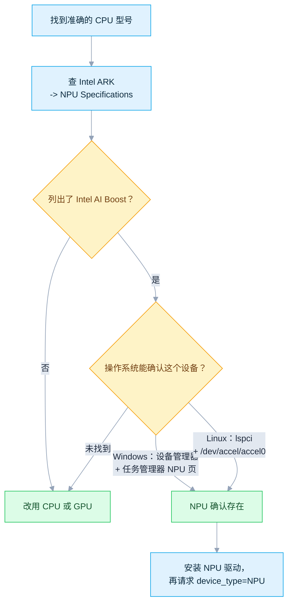
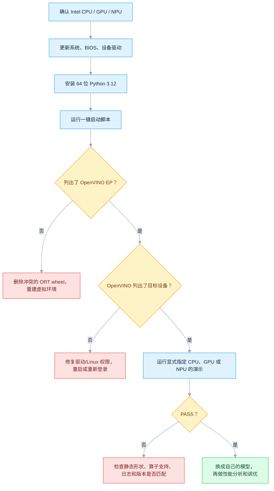
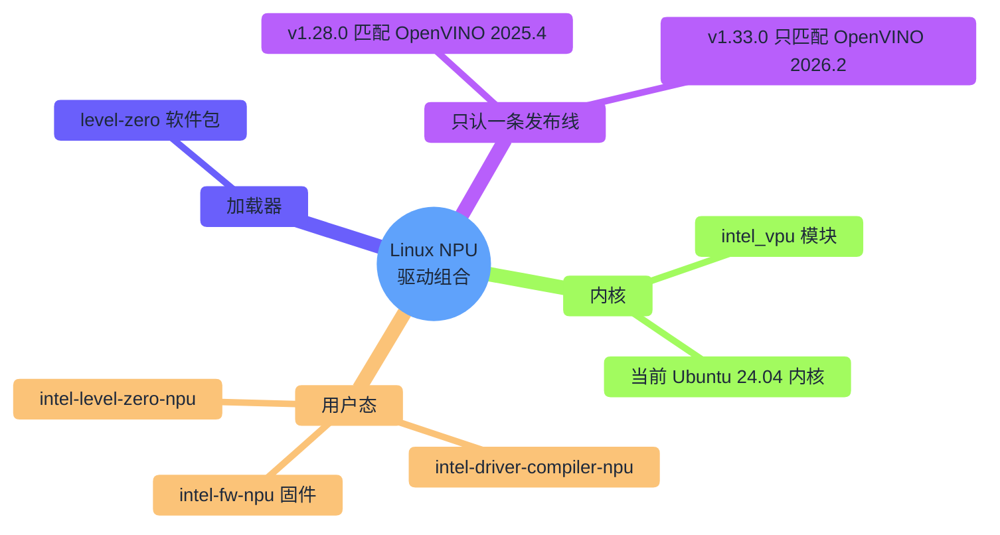
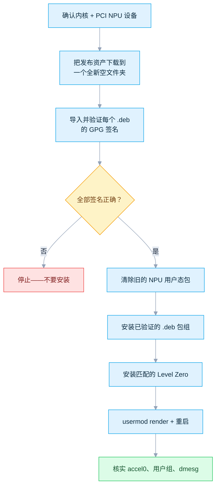

# ONNX Runtime + Intel OpenVINO：CPU、GPU 与 NPU

[English](README.md) · [仓库首页](../README.zh-CN.md) · [已审计 EP 5.9 源码](https://github.com/intel/onnxruntime/tree/v5.9/onnxruntime/core/providers/openvino)

**OpenVINO** 是 Intel 的推理工具套件。ONNX Runtime 的 **OpenVINO 执行提供程序（EP）** 会把 ONNX 模型中受支持的部分编译到 **Intel CPU、GPU 或 NPU** 上执行。本目录用来*证明*编译和执行确实发生——而不仅仅是 Provider 能够加载。

```bash
# Ubuntu —— 60 秒完成 CPU 验证
./Intel/run_demo.sh --device CPU
```
```bat
:: Windows —— 60 秒完成 CPU 验证
Intel\run_demo.bat --device CPU
```

| 你的情况 | 从这里开始 |
|---|---|
| 刚接触这个 EP，想先跑通 | [§3 最快上手路径](#3-最快上手路径) |
| 在 Windows 上，需要 GPU/NPU 驱动 | [§4 Windows 11 配置](#4-windows-11-配置) |
| 在 Ubuntu 上，需要 GPU/NPU 驱动 | [§5 Ubuntu 24.04 配置](#5-ubuntu-2404-配置) |
| 不确定这台电脑有没有 NPU | [§2 选择设备](#2-选择设备) |
| 要在自己的代码里调用推理 | [§8 在自己的 Python 程序中使用 EP](#8-在自己的-python-程序中使用-ep) |
| 遇到报错 | [§10 故障排查](#10-故障排查) |

| 项目 | 基线 |
|---|---|
| 最近验证 | `2026-07-17`，已核对官方发布页和已发布的 PyPI 文件 |
| 支持平台 | Windows 11 与 Ubuntu x86-64 |
| 锁定运行时 | `onnxruntime-openvino==1.24.1` + OpenVINO `2025.4.1`（EP 5.9） |
| 上游状态 | EP 5.9 仍是最新的 ORT 集成版本；独立的 OpenVINO `2026.2.1` 更新，但**不能**作为兼容替代品 |
| 目标设备 | Intel CPU、集成/独立 GPU、集成 NPU，以及显式指定的元设备 |
| 运行入口 | `run_demo.bat` · `run_demo.sh` · [`provider_test.py`](provider_test.py) |
| 已在真机验证 | Ubuntu 上的 `CPU`、`GPU`、`GPU.0`、`GPU.1` |
| 仅完成核查，未在真机运行 | Windows（静态核查）；NPU（仅完成源码核验） |

> [!IMPORTANT]
> `onnxruntime.get_device()` **不能**可靠反映实际使用的 Intel 目标设备。请始终显式设置 `device_type`，查看本目录演示打印的设备列表，并检查计算图分配结果。`openvino.Core().available_devices` 在 Windows 上，或在**独立**的 Linux 诊断虚拟环境中都可以使用；切勿把独立的 `openvino` 安装进本 Linux EP 环境。

## 目录

- [1. 了解整体架构](#1-了解整体架构)
- [2. 选择设备](#2-选择设备)
- [3. 最快上手路径](#3-最快上手路径)
- [4. Windows 11 配置](#4-windows-11-配置)
- [5. Ubuntu 24.04 配置](#5-ubuntu-2404-配置)
- [6. 安装 Python 环境](#6-安装-python-环境)
- [7. 运行一键演示](#7-运行一键演示)
- [8. 在自己的 Python 程序中使用 EP](#8-在自己的-python-程序中使用-ep)
- [9. 证明加速器确实执行了计算](#9-证明加速器确实执行了计算)
- [10. 故障排查](#10-故障排查)
- [11. 生产部署清单](#11-生产部署清单)
- [12. 参考资料](#12-参考资料)

---

## 1. 了解整体架构

ONNX 应用不会直接调用 Intel 硬件。ONNX Runtime（ORT）先划分计算图，再由 OpenVINO EP 针对你请求的设备编译受支持的部分。



两套不同的系统分别决定不同的事情——大多数困惑都源于把它们混为一谈：



| 术语 | 含义 | 这里需要安装吗？ |
|---|---|---|
| **ONNX** | 可移植的模型/计算图文件（`.onnx`） | 只需要 `onnx` 包，用来生成演示模型 |
| **ONNX Runtime（ORT）** | 加载计算图，并派发给各个执行提供程序 | `onnxruntime-openvino`——**不是**普通的 `onnxruntime` |
| **执行提供程序（EP）** | 面向某一加速方案的后端 | `OpenVINOExecutionProvider` 内置于该 wheel |
| **OpenVINO Runtime** | EP 调用的编译器与 CPU/GPU/NPU 插件 | Linux wheel 已内置；Windows 需要单独安装 |
| **驱动** | 操作系统到硬件的桥梁 | CPU：仅需系统更新。GPU/NPU：当前的 Intel/OEM 驱动 |
| **Intel NPU / AI Boost** | 部分 Core Ultra 芯片内置的低功耗 AI 加速器 | 物理硬件——任何软件包都无法添加它 |
| **oneAPI** | Intel 的开发者工具家族 | 使用本教程预编译的 Python 流程时不需要 |

---

## 2. 选择设备

| 目标 | 常见硬件 | 最适合先做什么 | 驱动工作 | 模型建议 |
|---|---|---|---|---|
| `CPU` | 任意受支持的 x86-64 Atom/Core/Xeon | 最容易上手；算子和动态形状支持最全 | 仅需系统更新 | 先用 FP32；INT8/BF16/FP16 的收益取决于具体 CPU |
| `GPU` | HD/UHD/Iris/Iris Xe/Arc/Flex/Max | 并行的视觉/音频/LLM 任务，常用 FP16 | Windows 用当前图形驱动 / Linux 用计算运行时 | 优先使用静态或有界形状；精度允许时用 FP16 或 INT8 |
| `GPU.0`、`GPU.1` | 多块 Intel GPU | 显式选择某一块已枚举的 GPU | 与 GPU 相同 | `GPU` 是 `GPU.0` 的别名——查询 ID，不要假设核显/独显顺序 |
| `NPU` | Core Ultra 内置 NPU（Intel AI Boost） | 长时间运行、注重能效的 AI PC 任务 | 必须安装 NPU 驱动 | **静态形状**；FP16 或受支持的 INT8/QDQ |
| `AUTO:GPU,NPU,CPU` | 上述任意组合 | 可移植部署 | 需要列出的每个设备都有驱动 | 无法证明最终用了哪个设备——先显式测试 |
| `HETERO:GPU,CPU` | 两个或以上设备 | 把不支持的算子分配给其他设备 | 所有列出设备的驱动 | 兼容性更好；跨设备传输可能拖慢速度 |
| `MULTI:GPU,CPU` | 两个或以上设备 | 并行请求/吞吐量 | 所有列出设备的驱动 | 通常不会降低单次请求的延迟 |

### 兼容性基线

| 项目 | 推荐配置 | 官方范围 |
|---|---|---|
| 架构 | x86-64 / AMD64 | 本教程使用的 wheel 仅支持 x86-64 |
| Python | **CPython 3.12，64 位** | 1.24.1 只发布了 `cp311`/`cp312`/`cp313`；没有 3.10 或 3.14 wheel |
| Windows | Windows 11 64 位，已装全部更新 | wheel 元数据写的是 Windows 10+；但当前 NPU 支持面向 Windows 11 |
| Ubuntu | **24.04 LTS 64 位** | CPU/GPU 文档覆盖 20.04/22.04/24.04；Linux NPU 发布包面向 24.04 |
| NPU 内核 | 当前 Ubuntu 24.04 HWE/OEM 内核 | OpenVINO 2025.4 要求 6.8+；NPU 驱动 v1.28.0 在 6.14.0-36 上验证过 |

> [!NOTE]
> `onnxruntime-openvino 1.24.1` 的 PyPI 分类器提到了 Python 3.14，但该发布实际只为 `win_amd64` 和 `manylinux_2_28_x86_64` 提供了 `cp311`/`cp312`/`cp313` wheel。请以实际发布的文件为准，而不是分类器。

### 这台电脑到底有没有 NPU？

在 [Intel ARK](https://ark.intel.com/) 上搜索你的准确处理器型号，打开 **NPU Specifications（NPU 规格）**。



没有 NPU 硬件时，`NPU` 永远不会出现——这是正常的，改用 `CPU`/`GPU` 即可。OpenVINO 2025.4 的裸 `AUTO` 默认也排除 NPU，因此必须显式请求 NPU。

---

## 3. 最快上手路径



只需要 CPU？直接跳到 [§6 安装 Python 环境](#6-安装-python-环境)。

---

## 4. Windows 11 配置

| 步骤 | 操作 |
|---|---|
| 更新系统 | **设置 → Windows 更新 → 检查更新**，包括相关的可选驱动更新 |
| 更新 BIOS/固件 | 从电脑厂商获取最新版本；如果 BIOS 有集显/NPU/AI 加速开关，请启用 |
| 重启 | 安装下面的驱动前必须重启 |

笔记本电脑：优先使用 **OEM** 驱动（通常包含平台相关的电源/固件集成）；只有在 OEM 驱动过旧时才尝试 Intel 通用包。

**CPU**——不需要单独驱动；系统和芯片组/BIOS 更新已经足够。

**GPU 驱动**——任选一条路线：

| 路线 | 适用场景 | 链接 |
|---|---|---|
| 电脑/OEM 支持页 | 笔记本、受管理的工作站 | 制造商官网 |
| Intel Driver & Support Assistant | 自动检测 | [Intel DSA](https://www.intel.com/content/www/us/en/support/detect.html) |
| Intel 通用 Arc/Iris Xe 驱动包 | OEM 包过旧，或安装了独立 Arc 显卡 | [Arc 与 Iris Xe 驱动](https://www.intel.com/content/www/us/en/download/785597/intel-arc-iris-xe-graphics-windows.html) |

验证：**设备管理器 → 显示适配器** 中 Intel 适配器**没有警告图标**；在 **属性 → 驱动程序** 中查看版本号。

**NPU 驱动：**

1. 确认芯片带有 Intel AI Boost。
2. 优先使用电脑厂商的支持页面，选择针对你机型测试过的 NPU 驱动。
3. 确认驱动写明支持你的处理器、Windows 版本和 OpenVINO 版本线——不要照搬旧文章里的版本号。
4. 安装并重启。
5. 检查**设备管理器**和**任务管理器 → 性能 → NPU**，确保没有警告图标。

> [!WARNING]
> Intel 的通用 Windows NPU 下载页（[链接](https://www.intel.com/content/www/us/en/download/794734/intel-npu-driver-windows.html)）目前提供 `32.0.100.4778`，并宣传搭配 **OpenVINO 2026.2**——而不是本文锁定的 **2025.4.1**。官方没有说明是否向后兼容，因此本文**不会**把这一组合视为已验证。请使用发布说明明确覆盖 OpenVINO 2025.4 的 OEM 驱动，或者把整个 ORT/OpenVINO 技术栈一起升级。切勿只升级驱动就假定 NPU 一定能用。

**Python：**

1. 从 [python.org](https://www.python.org/downloads/) 或 Microsoft Store 安装 **64 位 Python 3.12**。
2. 使用 python.org 安装器时，勾选 **Add python.exe to PATH**，并安装 Python Launcher。
3. 打开一个**新的**命令提示符：

```bat
py -3.12 --version
py -3.12 -c "import struct; print(struct.calcsize('P') * 8)"
```

预期输出 `Python 3.12.x` 和 `64`。

---

## 5. Ubuntu 24.04 配置

**基础系统：**

```bash
sudo apt update
sudo apt install -y python3 python3-venv python3-pip pciutils curl wget gnupg
```

这只安装本教程需要的内容——不是完整的发行版升级。请另外用 `apt list --upgradable` 检查常规更新；只有在内核、固件或驱动更新要求时才需要重启。

```bash
uname -r
lspci -nn | grep -Ei 'VGA|Display|3D|NPU|VPU|AI Boost'
```

**CPU**——不需要额外驱动，直接进行 Python 安装。

**GPU 计算运行时**——OpenVINO 的 GPU 插件需要 Intel 的 OpenCL/Level Zero 计算运行时。

| 路线 | 优点 | 风险 |
|---|---|---|
| 发行版/Intel 图形软件仓库 | APT 负责管理更新 | 仓库设置会随时间和 GPU 世代变化 |
| 最新 compute-runtime 发布包 | 精确、可审计 | 更手动；需下载该发布列出的全部依赖 |

1. 打开当前的 [OpenVINO Intel GPU 配置](https://docs.openvino.ai/2025/get-started/install-openvino/configurations/configurations-intel-gpu.html) 和 [Intel 客户端 GPU 指南](https://dgpu-docs.intel.com/driver/client/overview.html)——按**你的** Ubuntu 版本和 GPU 世代配置软件源。
2. 安装：

```bash
sudo apt update
sudo apt install -y ocl-icd-libopencl1 intel-opencl-icd intel-level-zero-gpu level-zero clinfo
sudo usermod -aG render "$USER"
```

| 软件包 | 作用 |
|---|---|
| `ocl-icd-libopencl1` | OpenCL 加载器 |
| `intel-opencl-icd` | Intel OpenCL GPU 驱动 |
| `level-zero` | Intel 仓库中的通用 Level Zero 加载器 |
| `intel-level-zero-gpu` | Intel Level Zero GPU 驱动 |

部分渠道把后两者改名为 `libze-intel-gpu1` / `libze1`——这只是命名差异，不是需要额外混装的软件包。请使用一个连贯的软件仓库，或者同一次 compute-runtime 发布中带校验和的完整包组。

3. 注销重新登录（或重启），然后验证：

```bash
groups
ls -l /dev/dri/renderD* 2>/dev/null
clinfo -l
```

Arc 独立 GPU 需要较新的内核（OpenVINO 2025.4 文档要求至少 6.2+；优先使用当前驱动发布指定的更新内核）。除非该设备/内核组合的官方说明明确要求，否则不要安装旧的 DKMS 方案。

### NPU 驱动——整套版本必须匹配

Linux 的 NPU 技术栈 = 内核模块 + 固件 + Level Zero 加载器 + NPU 用户态驱动 + 编译器。请把某一个[发布版本](https://github.com/intel/linux-npu-driver/releases)当作一个不可拆分的整体——不要混用不同发布中的组件。



| 本教程的运行时 | 匹配的 NPU 发布版本 | Ubuntu | 原因 |
|---|---|---|---|
| OpenVINO 2025.4.1 | **v1.28.0** | 仅 24.04 | 官方文档中最接近的世代匹配 |
| 最新 Linux NPU 驱动 | 查看它自己的发布版本表 | 通常 24.04 | 可能面向 OpenVINO 2026.x——要整套一起升级 |
| Ubuntu 22.04 | v1.26.0（最后一个提到 22.04 的发布线） | 已过时 | 全新安装建议用 24.04 |

截至本次核验，最新的 Linux NPU 发布版本是 **v1.33.0**（与 OpenVINO 2026.2 + Level Zero 1.27.0 搭配验证）——它**不能**直接替代本文锁定的 v1.28.0。



1. 确认内核/模块和 PCI 设备：

```bash
uname -r
lspci -nn | grep -Ei 'NPU|VPU|AI Boost'
modinfo intel_vpu 2>/dev/null | head
```

2. 把所选发布版本（[v1.28.0](https://github.com/intel/linux-npu-driver/releases/tag/v1.28.0)）中 Ubuntu 24.04 的资产下载到一个**全新的空**目录，然后在改动已安装驱动之前验证每个包的签名：

```bash
rm -rf ~/intel-npu-driver-v1.28.0
mkdir -m 700 ~/intel-npu-driver-v1.28.0
cd ~/intel-npu-driver-v1.28.0
wget https://github.com/intel/linux-npu-driver/releases/download/v1.28.0/linux-npu-driver-v1.28.0.20251218-20347000698-ubuntu2404.tar.gz
tar -xf linux-npu-driver-v1.28.0.20251218-20347000698-ubuntu2404.tar.gz

curl https://keys.openpgp.org/vks/v1/by-fingerprint/EA267657A608300C296B8F8AD52C9665A4077678 | gpg --import
shopt -s nullglob
DEB_PACKAGES=(./*.deb)
((${#DEB_PACKAGES[@]} > 0)) || { echo "未找到 Debian 包" >&2; exit 1; }
for PACKAGE in "${DEB_PACKAGES[@]}"; do
    SIGNATURE="$PACKAGE.asc"
    [[ -f "$SIGNATURE" ]] || { echo "缺少签名：$SIGNATURE" >&2; exit 1; }
    gpg --verify "$SIGNATURE" "$PACKAGE" || exit 1
done
```

指纹必须是 `EA267657A608300C296B8F8AD52C9665A4077678`，与发布页面一致。每个包都必须显示**签名正确**——提示"尚未信任此密钥"没关系，但签名错误或缺失就不行；出现这种情况请停止。

3. 按发布说明清除旧的 NPU 包，再安装已验证的包组：

```bash
sudo dpkg --purge --force-remove-reinstreq intel-driver-compiler-npu intel-fw-npu intel-level-zero-npu intel-level-zero-npu-dbgsym
sudo apt update
sudo apt install -y libtbb12
sudo dpkg -i ./*.deb
```

提示"某个旧包本来就没装"是正常的；但任何包配置、依赖或签名错误都不正常——必须先解决再继续。

4. v1.28.0 搭配 **Level Zero v1.24.2** 验证过；仅在缺失时才安装：

```bash
if ! dpkg-query -W -f='${db:Status-Status}\n' level-zero 2>/dev/null | grep -qx installed; then
    wget https://github.com/oneapi-src/level-zero/releases/download/v1.24.2/level-zero_1.24.2+u24.04_amd64.deb
    sudo dpkg -i level-zero_1.24.2+u24.04_amd64.deb
fi
dpkg-query -W -f='${Package} ${Version} ${db:Status-Status}\n' level-zero
```

如果你的 Intel GPU/NPU 软件源已经在管理 `level-zero`，这一步不会改动它——只需对照发布说明核对打印出的版本号，不要随意混装或降级加载器。

5. 记录版本号，授予非 root 权限，重启：

```bash
dpkg-query -W -f='${Package} ${Version}\n' intel-driver-compiler-npu intel-fw-npu intel-level-zero-npu level-zero
sudo usermod -aG render "$USER"
sudo reboot
```

6. 重启后验证：

```bash
ls -lah /dev/accel/accel0
id -nG | tr ' ' '\n' | grep '^render$'
lsmod | grep intel_vpu
sudo dmesg | grep -Ei 'intel_vpu|ivpu|firmware' | tail -n 50
```

预期权限类似 `crw-rw---- root render`。如果不是，请使用该发布版本提供的 udev 规则——不要用永久性的 `chmod 666` 来绕过权限。

> [!NOTE]
> 更新的 NPU 驱动发布版本不代表已经和你锁定的 EP/OpenVINO “一起测试过”。请让 EP、OpenVINO Runtime、NPU 编译器/UMD、固件和 Level Zero 保持在同一个匹配的世代。

---

## 6. 安装 Python 环境

> [!IMPORTANT]
> `onnxruntime-openvino 1.24.1`（EP 5.9）仍是目前最新的发布版本，搭配 OpenVINO **2025.4.1**。独立的 `openvino` 项目已经推进到 2026.2.1，但 Intel 尚未发布与之匹配的 `onnxruntime-openvino`。在这里安装 `openvino==2026.2.1` 或运行 `pip install -U openvino` **不是**升级路径——请等待 Intel 发布明确指定新 ORT/OpenVINO 组合的 EP 版本。

| 组件 | 锁定版本 | 原因 |
|---|---:|---|
| `onnxruntime-openvino` | 1.24.1 | Intel OpenVINO EP 5.9 wheel |
| OpenVINO | 2025.4.1 | EP 5.9 编译所依据的运行时；Linux 已内置，Windows 需单独安装 |
| Python | CPython 3.11–3.13（推荐 3.12） | 实际发布的版本只有这些 |
| `onnx` | 1.22.0 | 用于生成/检查离线演示计算图 |
| `numpy` | Python 3.11 用 2.4.6；Python 3.12–3.13 用 2.5.1 | 各 Python 版本能用的最新稳定分支；NumPy 2.5 已不支持 3.11 |

这些是精确的顶层版本锁定，不是带哈希的锁定文件——间接依赖按正常方式解析，两个启动脚本都会先运行 `pip check`。

| EP 发布版本 | ORT 包 | OpenVINO |
|---:|---:|---:|
| 5.9 | 1.24.1 | 2025.4.1 |
| 5.8 | 1.23.0 | 2025.3.0 |
| 5.7 | 1.22.0 | 2025.1.0 |

不要只升级 Windows 上的 `openvino` wheel，却让 `onnxruntime-openvino` 停留在旧版本。

**Windows：**

```bat
if exist .venv rmdir /s /q .venv
py -3.12 -m venv .venv
.venv\Scripts\activate
python -m pip install -r requirements.txt
```

Windows 还需要单独锁定的 `openvino==2025.4.1`。演示程序会在创建任何会话之前调用 Intel 的 `add_openvino_libs_to_path()`。

**Ubuntu：**

```bash
rm -rf .venv
python3 -m venv .venv
source .venv/bin/activate
python -m pip install -r requirements.txt
```

Linux wheel 已经内置了原生的 OpenVINO 2025.4.1 库——`requirements.txt` 有意只在 **Windows** 上安装独立的 `openvino` wheel。经过验证，在 Linux 上同时安装两者会因为未解析的原生符号而出错；启动脚本会重建被污染的虚拟环境，演示程序也会拒绝这种组合。需要在 Linux 上使用 `Core().available_devices`？请把 `openvino` 装进**另一个**虚拟环境。

> [!CAUTION]
> 每个虚拟环境只能安装**一个** ONNX Runtime wheel。`onnxruntime`、`onnxruntime-gpu`、`onnxruntime-directml` 和 `onnxruntime-openvino` 导入时都叫 `onnxruntime`，可能会互相覆盖。

**推理前先验证：**

```bash
python -c "import onnxruntime as ort; print(ort.__version__); print(ort.get_available_providers())"
# 可选：仅限 Windows，或独立的 Linux 诊断虚拟环境。
python -c "from openvino import Core; print(Core().available_devices)"
```

最低预期输出：

```text
1.24.1
['OpenVINOExecutionProvider', 'CPUExecutionProvider', ...]
['CPU', 'GPU.0', 'NPU']   # 仅为示例；实际取决于你的硬件/驱动
```

| 输出 | 能够证明 | 不能证明 |
|---|---|---|
| ORT 列出 `OpenVINOExecutionProvider` | 加载了正确的 wheel/provider | GPU/NPU 驱动能正常工作 |
| 设备列表显示 `GPU.0` | GPU 插件+驱动能枚举到它 | 你的模型能完全在上面运行 |
| 设备列表显示 `NPU` | NPU 硬件/驱动/权限均可见 | 动态或不支持的模型能编译成功 |
| 会话里 OpenVINO 排在最前 | EP 被注册为最高优先级 | 每个节点真的都在那里运行 |
| `Graph assignment: OpenVINOExecutionProvider (5/5 nodes...)` | 冒烟图里每个已解析节点都跑在 OpenVINO 上，且回退已禁用 | 元设备最终选择了哪个物理设备 |

在这个只装了 Linux EP 的虚拟环境里，第二条可选命令报告没有独立的 `openvino` 模块是预期行为——演示程序会改用内置绑定来枚举设备，设置 `session.disable_cpu_ep_fallback=1`，记录计算图分配，并断言全部五个演示节点都跑在 `OpenVINOExecutionProvider` 上。

---

## 7. 运行一键演示

该演示完全自包含：本地生成一个很小的静态 FP32 模型（`MatMul` → `Add` → `Relu`，不下载任何文件），通过内置的 OpenVINO 绑定枚举设备，创建严格会话（禁用 ORT 和 NPU→CPU 回退），检查全部五个节点的分配情况，与 ORT CPU 结果比较（CPU 用更严格的误差范围，GPU/NPU 用适合 FP16 的误差范围），并报告预热后的延迟。直接指定设备和 `AUTO` 的运行会启用按设备区分的编译缓存；`HETERO`/`MULTI` 不会。

| 操作系统 | 命令 |
|---|---|
| Windows | `run_demo.bat` |
| Ubuntu | `chmod +x run_demo.sh && ./run_demo.sh` |
| Ubuntu，指定解释器 | `PYTHON_BIN=python3.12 ./run_demo.sh` |

启动脚本会创建或修复 `.venv`，只安装一次锁定版本的依赖，默认执行严格的 `CPU` 测试。请逐个显式验证每台物理设备：

| 设备 | Windows | Ubuntu |
|---|---|---|
| CPU | `run_demo.bat --device CPU` | `./run_demo.sh --device CPU` |
| 第一块 GPU | `run_demo.bat --device GPU` | `./run_demo.sh --device GPU` |
| 指定 GPU | `run_demo.bat --device GPU.1` | `./run_demo.sh --device GPU.1` |
| NPU | `run_demo.bat --device NPU` | `./run_demo.sh --device NPU` |
| 上述都通过后再用 AUTO | `run_demo.bat --device AUTO:GPU,NPU,CPU` | `./run_demo.sh --device AUTO:GPU,NPU,CPU` |

只列出你实际拥有的设备——例如没有 NPU 的机器用 `AUTO:GPU,CPU`。裸 `AUTO` 会被有意拒绝：经验证，锁定版本的 wheel 会把整个计算图都分配给 ORT 的 `CPUExecutionProvider`，而且 OpenVINO 自己的 `AUTO` 也会以 CPU 启动，并且默认排除 NPU（2025.4 版本）。`AUTO:...` 只能证明可移植性，**不能证明最终用了哪个物理设备**。

成功运行的结尾类似：

```text
ORT providers     : ['OpenVINOExecutionProvider', 'CPUExecutionProvider']
OpenVINO Runtime  : 2025.4.1 (...)
Device query      : ONNX Runtime OpenVINO device API
Intel devices     : ['CPU', 'GPU.0', 'NPU']
Requested target  : NPU
Resolved target   : NPU
Session providers : ['OpenVINOExecutionProvider', 'CPUExecutionProvider']
Graph assignment  : OpenVINOExecutionProvider (5/5 nodes: ...)
Validation limits : rtol=0.01, atol=0.005
Median latency    : ... ms
PASS: all five demo nodes were assigned to OpenVINO EP and output is valid.
```

会话列表里仍会出现 `CPUExecutionProvider`（ORT 总会注册默认 CPU EP），但只要这张图有任何节点被分配给它，严格选项就会让会话创建失败——分配记录提供了第二重、可审计的检查。GPU/NPU 使用比 CPU 更宽松的 FP16 误差范围。首次运行会更慢（需要编译计算图）；打印出的时间只是冒烟诊断，不是基准测试。

---

## 8. 在自己的 Python 程序中使用 EP

从 ORT 1.23 / OpenVINO 2025.3 起，`load_config` JSON 是设置任何原生 OpenVINO 属性的首选方式。下面用到的顶层选项 `precision`/`num_streams`/`cache_dir`（以及其他选项）在这条经典注册路径下仍然完全受支持——完整的、经过源码核对的选项、默认值和合法取值清单见后文的 [provider 选项参考表](#provider-选项参考表)。

```python
import json
import platform

if platform.system() == "Windows":
    import onnxruntime.tools.add_openvino_win_libs as utils
    utils.add_openvino_libs_to_path()

import onnxruntime as ort

config = {
    "GPU": {
        "PERFORMANCE_HINT": "LATENCY",
        "CACHE_DIR": "./openvino_cache",
        "INFERENCE_PRECISION_HINT": "f16",
    }
}
provider_options = {
    "device_type": "GPU",
    "load_config": json.dumps(config),
}

session_options = ort.SessionOptions()
session_options.graph_optimization_level = ort.GraphOptimizationLevel.ORT_DISABLE_ALL
# 禁用回退的验证模式：任何图节点需要 ORT CPU 回退都会直接失败。
session_options.add_session_config_entry("session.disable_cpu_ep_fallback", "1")
# 审计模式：填充 session.get_provider_graph_assignment_info()。
session_options.add_session_config_entry("session.record_ep_graph_assignment_info", "1")

session = ort.InferenceSession(
    "model.onnx",
    sess_options=session_options,
    providers=[("OpenVINOExecutionProvider", provider_options)],
)
outputs = session.run(None, {session.get_inputs()[0].name: input_numpy})
for assignment in session.get_provider_graph_assignment_info():
    print(assignment.ep_name, [(node.name, node.op_type) for node in assignment.get_nodes()])
```

只有在预期模型能被目标设备完全支持时，才适合禁用 CPU 回退。完成验证后，生产程序可以重新启用 `CPUExecutionProvider` 作为一个明确、经过性能分析的回退——但不要把这称为“完整设备执行”。OpenVINO 官方文档在很多场景下建议禁用 ORT 的计算图优化，让 OpenVINO 自己融合原始计算图；两种设置都应该做基准测试。

### 推荐的起始选项

| 目标 | `device_type` | `load_config` 思路 | 说明 |
|---|---|---|---|
| CPU 低延迟 | `CPU` | `{"CPU":{"PERFORMANCE_HINT":"LATENCY","NUM_STREAMS":"1"}}` | 先让 OpenVINO 自己选择线程数 |
| CPU 吞吐量 | `CPU` | `{"CPU":{"PERFORMANCE_HINT":"THROUGHPUT"}}` | 需要并行请求才能受益 |
| GPU 低延迟 | `GPU` | `{"GPU":{"PERFORMANCE_HINT":"LATENCY","INFERENCE_PRECISION_HINT":"f16"}}` | 验证精度；加上缓存目录 |
| GPU 最高精度 | `GPU` | `{"GPU":{"EXECUTION_MODE_HINT":"ACCURACY"}}` | 不要和精度提示同时使用 |
| NPU | `NPU` | `{"NPU":{"PERFORMANCE_HINT":"LATENCY","CACHE_DIR":"./cache"}}` | 需要静态形状 |
| NPU，QDQ 模型 | `NPU` | 追加 `"NPU_QDQ_OPTIMIZATION":"YES"` | 仅适合合适的量化 QDQ 计算图 |
| 可移植方案 | `AUTO:GPU,NPU,CPU` | `{"AUTO":{"PERFORMANCE_HINT":"LATENCY"}}` | 先通过显式测试；不能指明具体某个物理设备 |

### 全部可用的 provider 选项（完整注释参考）

下面每一个键都直接取自经过审计的 v5.9 源码（[`contexts.h`](https://github.com/intel/onnxruntime/blob/v5.9/onnxruntime/core/providers/openvino/contexts.h) 中的 `ProviderInfo::valid_provider_keys`，并已对照 [`openvino_provider_factory.cc`](https://github.com/intel/onnxruntime/blob/v5.9/onnxruntime/core/providers/openvino/openvino_provider_factory.cc) 里的 `ParseProviderInfo` 核实过）。传入清单之外的键会在创建会话时直接抛出 `Invalid provider_option key`。复制下面这段代码，只取消注释你需要的部分即可——每一行都是独立可选的。

已于 2026-07-18 独立对照实时的 [microsoft/onnxruntime `main` 分支](https://github.com/microsoft/onnxruntime/tree/main/onnxruntime/core/providers/openvino) 重新核实:同样的 16 个键、默认值与强制规则与 EP 5.9 完全一致——包括 `num_streams` 的元设备限制(`basic_backend.cc` 中的 `EnableStreams`:在 `AUTO`/`MULTI`/`HETERO` 下非 `1` 会抛出异常,在 `NPU` 上则静默忽略)以及 `disable_dynamic_shapes`/`enable_causallm` 在 NPU 上的交互规则(`openvino_provider_factory.cc` 中的 `ParseProviderInfo`)。

```python
import json

# 下面每一个键都是可选的；这个示例展示了经典注册方式
# （providers=[("OpenVINOExecutionProvider", provider_options)]）支持的全部键。
# 只取消注释你需要的那几行即可。
provider_options = {
    # --- 设备选择 ---------------------------------------------------------
    "device_type": "GPU",                # CPU | GPU | GPU.0 | GPU.1 | NPU | AUTO |
                                          # AUTO:GPU,NPU,CPU | HETERO:GPU,CPU | MULTI:GPU,CPU。
                                          # 省略时回退到编译期默认值（通常是 CPU）——
                                          # 请始终显式设置这个选项。
    # "device_id": "GPU",                # 已弃用：只能是 "CPU"/"GPU"/"NPU"，不支持 ".0"/".1" 后缀。
                                          # 请改用 "device_type"（设置这个选项会触发一条警告日志）。
    # "device_luid": "12345,67890",       # 逗号分隔的 LUID 列表，会按顺序与 "device_type"
                                          # 解析出的设备列表匹配，用来区分两块型号相同的
                                          # GPU/NPU。对 CPU 没有意义。

    # --- 精度 / 准确度 -------------------------------------------------------
    "precision": "FP16",                 # CPU：FP32|ACCURACY（默认 FP32）。
                                          # GPU：FP16|FP32|ACCURACY（默认 FP16）。
                                          # NPU：FP16|ACCURACY（默认 FP16）。
                                          # ACCURACY 会在任意设备上保留模型自身的精度。

    # --- 编译模型缓存 ---------------------------------------------------------
    "cache_dir": "./openvino_cache",     # OpenVINO 编译产物（blob）缓存目录。之后使用相同的
                                          # 模型 + 设备 + 配置运行时会直接加载缓存的 blob，
                                          # 而不用重新编译。省略则不启用缓存。

    # --- CPU 线程调优 -----------------------------------------------------------
    # "num_of_threads": "4",             # CPU 推理线程数。只能是纯数字字符串；非数字会直接
                                          # 抛出异常。"0" 会回退为 1 并打印警告。

    # --- 多个模型共用同一设备时的调度 ----------------------------------------------
    # "model_priority": "DEFAULT",       # LOW | MEDIUM | HIGH | DEFAULT。无效值会打印警告并
                                          # 回退为 DEFAULT。
    # "num_streams": "1",                # device_type 上的并行推理流数量。非正数会回退为 1
                                          # 并打印警告。在 AUTO/MULTI/HETERO 下必须保持 "1"
                                          # （否则会抛出异常）；在 NPU 上会被静默忽略。

    # --- 仅限 GPU ------------------------------------------------------------
    # "enable_opencl_throttling": "True",  # 只能是 "true"/"True"/"false"/"False"（区分大小写，
                                            # 不支持 "1"/"0"）。会降低 GPU 繁忙时的主机 CPU
                                            # 占用，但会损失一些 GPU 延迟/吞吐量。

    # --- NPU / 量化模型选项 --------------------------------------------------------
    # "enable_qdq_optimizer": "True",    # 布尔格式同上。裁剪 QuantizeLinear/DequantizeLinear
                                          # 节点对，加快量化（QDQ）计算图在 NPU 上的推理速度
                                          # （也有助于 GPU 的 int16 处理）。
    # "disable_dynamic_shapes": "True",  # 布尔格式同上。把动态 ONNX 计算图按运行时看到的
                                          # 形状特化为静态形状。CPU/GPU 上默认是 false；
                                          # 在 NPU 上 EP 会强制设为 true，除非 enable_causallm
                                          # 也为 true。
    # "enable_causallm": "True",         # 布尔格式同上。启用 ORT GenAI 的有状态 Causal-LM
                                          # 编译流程（把 KV 缓存输入/输出的计算图转换成
                                          # OpenVINO 的有状态模型）；同时会在 NPU 上重新
                                          # 启用动态形状。

    # --- 形状 / 布局覆盖 -----------------------------------------------------------
    # "reshape_input": "input_ids[1,128]",   # 把一个或多个动态输入固定（或限定范围）为具体
                                              # 形状；多个张量用逗号分隔。某一维可以是像
                                              # "1..128" 这样的范围。NPU 上通常必须设置。
    # "layout": "input_ids[NC],logits[NC]",  # 声明每个输入/输出张量的轴顺序，逗号分隔，
                                              # 例如 "data[NCHW],output[NC]"。

    # --- 进阶原生互操作 --------------------------------------------------------------
    # "context": "0x7f2a4c001000",       # OpenCL cl_context 指针的十六进制字符串，用于 GPU
                                          # IO-Buffer / 远程张量零拷贝。仅用于原生 C/C++
                                          # 互操作场景——纯 Python 中用不到。

    # --- 其他属性：使用 load_config（自 ORT 1.23 / OpenVINO 2025.3 起首选）-----------
    "load_config": json.dumps({
        "GPU": {"PERFORMANCE_HINT": "LATENCY"},
    }),
}
```

### provider 选项参考表

| 键 | 取值 / 格式 | 默认值 | 说明 |
|---|---|---|---|
| `device_type` | `CPU`、`GPU`、`GPU.0`、`GPU.1`、`NPU`、`AUTO`、`AUTO:GPU,NPU,CPU`、`HETERO:GPU,CPU`、`MULTI:GPU,CPU` | 编译期默认值（通常是 `CPU`） | 核心的设备/元设备选择器——见[§2](#2-选择设备)；请始终显式设置 |
| `device_id` | 只能是 `CPU`、`GPU` 或 `NPU` | — | **已弃用**（EP 会打印警告日志）；改用 `device_type` + `precision` |
| `device_luid` | 逗号分隔的 LUID 列表 | — | 用来区分型号相同的 GPU/NPU；按顺序与 `device_type` 解析出的设备列表匹配 |
| `precision` | 因设备而异——见下表 | 因设备而异 | `ACCURACY` 会在任意设备上保留模型自身的精度 |
| `cache_dir` | 文件系统路径 | 不启用缓存 | 启用 OpenVINO 的编译产物缓存 |
| `load_config` | 以 `CPU`/`GPU`/`NPU`/`AUTO`/`HETERO`/`MULTI` 为键的 JSON 字符串 | `{}` | 设置任意原生 OpenVINO 属性的首选方式；未知的设备键会被跳过并打印警告，而不是直接报错 |
| `context` | `void*` 的十六进制字符串（OpenCL `cl_context`） | `nullptr` | 用于 GPU IO-Buffer / 远程张量零拷贝；仅限原生互操作 |
| `num_of_threads` | 纯数字字符串（十进制、非负） | `0`（交由 OpenVINO 决定） | 非数字输入会直接抛出异常；`"0"` 会回退为 `1` 并打印警告 |
| `model_priority` | `LOW`、`MEDIUM`、`HIGH`、`DEFAULT` | `DEFAULT` | 无效值会打印警告并回退为 `DEFAULT` |
| `num_streams` | 正整数字符串 | `1` | 非正数会回退为 `1` 并打印警告；在 `AUTO`/`MULTI`/`HETERO` 下必须保持 `1`（否则抛出异常）；在 `NPU` 上被忽略 |
| `enable_opencl_throttling` | `"true"`、`"True"`、`"false"` 或 `"False"`（区分大小写；不支持 `1`/`0`） | `false` | 仅限 GPU |
| `enable_qdq_optimizer` | 布尔格式同上 | `false` | 裁剪 QDQ 节点，加快量化计算图在 NPU（以及 GPU int16）上的推理速度 |
| `enable_causallm` | 布尔格式同上 | `false` | 启用 ORT GenAI 的有状态 Causal-LM 编译流程；同时会在 NPU 上重新启用动态形状 |
| `disable_dynamic_shapes` | 布尔格式同上 | CPU/GPU 上为 `false`；`NPU` 上强制为 `true`，除非 `enable_causallm` 也为 `true` | 把动态 ONNX 计算图特化为运行时看到的静态形状 |
| `reshape_input` | `name[dims]`，逗号分隔；某一维可以是像 `1..10` 这样的范围 | — | 固定/限定动态输入；NPU 上通常必须设置 |
| `layout` | `name[NCHW]`，逗号分隔 | — | 声明每个输入/输出的张量轴顺序 |

按解析后的设备划分，`precision` 的默认值和合法取值：

| 解析后的设备 | 合法的 `precision` 取值 | 未设置时的默认值 |
|---|---|---|
| `CPU` | `FP32`、`ACCURACY` | `FP32` |
| `GPU` / `GPU.x` | `FP16`、`FP32`、`ACCURACY` | `FP16` |
| `NPU` | `FP16`、`ACCURACY` | `FP16` |
| `HETERO:`/`MULTI:`/`AUTO:`/`BATCH:` 元设备 | `FP16`、`FP32`、`ACCURACY` | 不强制（可选） |

`load_config` 接受 JSON 字符串、数字、布尔值和嵌套对象（最多 8 层）；具体哪种类型有效由对应的 OpenVINO 属性决定。`EXECUTION_MODE_HINT` 和 `INFERENCE_PRECISION_HINT` 二选一，不要同时使用。完整的原生属性列表见 [EP 选项文档](https://onnxruntime.ai/docs/execution-providers/OpenVINO-ExecutionProvider.html#configuration-options)。

> [!NOTE]
> 本文用到的注册方式——`providers=[("OpenVINOExecutionProvider", provider_options)]`，与 [`provider_test.py`](provider_test.py) 一致——是 ONNX Runtime 的**经典**注册路径，上表中的每一个键在这条路径下都完全受支持（已直接对照 v5.9 源码中的 `ParseProviderInfo` 验证过）。ONNX Runtime 还有一套更新的、面向整个 ORT 的**显式 EP/设备选择 API**（使用 `OrtEpDevice` 句柄的 `SessionOptionsAppendExecutionProvider_V2`）。只有在那条更新的路径下，OpenVINO 的工厂函数才会直接拒绝 `device_type`、`device_id`、`device_luid`、`context` 和 `disable_dynamic_shapes`，并且要求把 `cache_dir`、`precision`、`num_of_threads`、`num_streams`、`model_priority`、`enable_opencl_throttling` 和 `enable_qdq_optimizer` 都改成通过 `load_config` 设置——那条路径下的设备选择来自发现到的 `OrtEpDevice` 列表，加上可选的 `ov_device`/`ov_meta_device` 键。如果你只使用本文始终展示的经典字典式注册方式，以上这些都与你无关。

### NPU 上的动态模型

当前 NPU 文档要求使用静态形状。如果你的 ONNX 文件是动态的，但每次推理都用同一个已知形状，可以显式固定它：

```python
provider_options = {
    "device_type": "NPU",
    "reshape_input": "input_ids[1,128]",
}
```

必须覆盖每一个动态输入，并与真实输入名称/维度一致。解析器虽然也支持范围边界语法，但这并不代表 2025.4 版 NPU 插件原生支持动态形状（本文没有在硬件上验证这一点）——固定形状导出才是新手可靠的基线做法。

---

## 9. 证明加速器确实执行了计算

“脚本没报错”不是证据。请按这个阶梯逐级验证：

| # | 检查项 | 期望结果 |
|---:|---|---|
| 1 | `ort.get_available_providers()` | 包含 `OpenVINOExecutionProvider` |
| 2 | 演示程序的设备查询（或在安全的地方用 `Core().available_devices`） | 显示你显式请求的目标 |
| 3 | 用显式目标 + `session.disable_cpu_ep_fallback=1` 创建会话 | 创建成功；没有 ORT CPU 节点，也没有 NPU→CPU 回退 |
| 4 | 调用 `get_provider_graph_assignment_info()` | 每个预期节点都报告 `OpenVINOExecutionProvider` |
| 5 | 与 CPU 结果比较 | 落在适合 FP16/INT8 的误差范围内 |
| 6 | 启用 ORT 性能分析 | OpenVINO 拥有该分区；严格模式下没有 CPU 节点事件 |
| 7 | 观察系统遥测 | 任务管理器 / Linux GPU-NPU 工具显示有活动 |
| 8 | 预热后做基准测试 | 延迟/吞吐量可重复，缓存行为正常 |

```python
options = ort.SessionOptions()
options.enable_profiling = True
options.graph_optimization_level = ort.GraphOptimizationLevel.ORT_DISABLE_ALL
options.add_session_config_entry("session.disable_cpu_ep_fallback", "1")
session = ort.InferenceSession(
    "model.onnx",
    sess_options=options,
    providers=[("OpenVINOExecutionProvider", {"device_type": "GPU"})],
)
session.run(None, feeds)
print(session.end_profiling())
```

检查性能分析 JSON 中的 `provider` 字段。OpenVINO 内部合理使用主机 CPU 是一回事，ORT 把计算图节点分配给 `CPUExecutionProvider` 是另一回事。对于有意混合执行的生产会话，可以去掉严格选项，明确允许 CPU 回退，再用性能分析量化它。

---

## 10. 故障排查

| 现象 | 可能原因 | 解决办法 |
|---|---|---|
| 没有 `OpenVINOExecutionProvider` | 普通/冲突的 ORT wheel 抢占了共享导入 | 删除 `.venv`；只重新安装 `onnxruntime-openvino` |
| Windows `DLL load failed` | OpenVINO DLL 缺失/版本不匹配，或辅助函数调用太晚 | 安装精确版本 `openvino==2025.4.1`；在创建会话前调用 `add_openvino_libs_to_path()` |
| Linux provider `.so` 报 `undefined symbol` | 独立 `openvino` 与内置 EP 库混装，或 `LD_LIBRARY_PATH` 被污染 | 删除 `.venv`；只安装 Linux EP 的依赖；移除自定义 OpenVINO 路径 |
| 演示只列出 `['CPU']` | 缺少 GPU/NPU 计算驱动 | 完成对应驱动章节，重启或重新登录 |
| 没列出 GPU，但显示正常 | 缺少 OpenCL/Level Zero 运行时 | 安装 `intel-opencl-icd` 和匹配的 Level Zero；运行 `clinfo -l` |
| Linux GPU `Permission denied` | 用户不在 `render` 组，或会话组信息未刷新 | `sudo usermod -aG render "$USER"`，然后完整注销登录或重启 |
| 没有 `/dev/accel/accel0` | 无 NPU、BIOS 未启用、模块/固件缺失 | 核对 SKU/BIOS、内核、`intel_vpu` 和所选驱动发布版本 |
| NPU 设备存在，但 OpenVINO 不列出它 | UMD/编译器/Level Zero 不匹配，或权限问题 | 检查 `ls -lah`、`groups`、软件包和 `dmesg` |
| NPU 编译失败 | 驱动/运行时不匹配，或模型是动态/不支持的 | 先运行静态演示；对齐版本；导出静态形状 |
| 安装 Intel 当前通用驱动后 Windows NPU 失败 | 该驱动面向 OpenVINO 2026.2，而本文锁定 2025.4.1 | 使用明确覆盖 2025.4 的 OEM 驱动，或整套一起升级 |
| 裸 `AUTO` 被拒绝 | 无法确认物理目标；经验证会回退到 CPU | 先显式验证 `GPU`/`NPU`，再用 `AUTO:GPU,CPU` 这类明确列表 |
| 非严格模式能跑，但只有 CPU 在忙 | `AUTO` 选择了 CPU，或发生了 ORT 回退 | 显式请求 `GPU`/`NPU`；启用严格模式并检查性能分析 |
| `GPU.1` 报错 | 实际枚举顺序和假设不同 | 查看演示打印的设备列表；不要假设独显编号 |
| 首次运行很慢 | 计算图/内核正在编译 | 启用 `CACHE_DIR`；计时前先预热 |
| 加速器比 CPU 慢 | 模型太小、传输/编译开销、发生回退、精度不对 | 用真实负载、预热、静态形状；检查分区情况 |
| 精度发生变化 | FP16/BF16/INT8 或规约顺序不同 | 用任务级误差范围对比 FP32；可尝试 `EXECUTION_MODE_HINT=ACCURACY` |
| `pip` 找不到匹配的发行版 | 32 位/不支持的 Python，或架构不对 | 使用 x86-64 CPython 3.11–3.13——没有 3.10/3.14/ARM wheel |
| 某个模型编译失败后 NPU 无响应 | 驱动恢复出现问题 | 重启/更新驱动；确认支持后再重试 |

### 收集诊断信息

**Windows PowerShell：**

```powershell
$PY = ".\.venv\Scripts\python.exe"
& $PY -c "import platform,sys; print(platform.platform()); print(sys.version)"
& $PY -m pip list | Select-String "onnx|openvino|numpy"
& $PY -m pip check
& $PY -c "import onnxruntime as o; print(o.get_available_providers()); print(o.get_build_info())"
& $PY -c "from openvino import Core; print(Core().available_devices)"
& $PY provider_test.py --device CPU --runs 1 --warmups 0
Get-PnpDevice | Where-Object {$_.FriendlyName -match 'Intel|NPU|AI Boost'}
```

**Ubuntu：**

```bash
uname -a
cat /etc/os-release
lspci -nn | grep -Ei 'VGA|Display|3D|NPU|VPU|AI Boost'
groups
ls -lah /dev/dri/renderD* /dev/accel/accel0 2>/dev/null
clinfo -l 2>/dev/null || true
dpkg -l | grep -E 'intel-(opencl|level-zero|driver-compiler|fw)|level-zero|libze'
.venv/bin/python -m pip list | grep -E 'onnx|openvino|numpy'
.venv/bin/python -m pip check
.venv/bin/python -c "import onnxruntime as o; print(o.get_available_providers()); print(o.get_build_info())"
.venv/bin/python provider_test.py --device CPU --runs 1 --warmups 0
# 只能在独立的 OpenVINO 诊断虚拟环境中查询 Core——绝不要装进这个 EP 环境。
sudo dmesg | grep -Ei 'intel_vpu|ivpu|drm|firmware' | tail -n 100
```

公开分享日志前，请先去掉用户名和路径信息。

---

## 11. 生产部署清单

- [ ] 锁定一组经过测试的 ORT ↔ OpenVINO 版本组合。
- [ ] 只打包一种 ONNX Runtime 发行版。
- [ ] 把 GPU/NPU 驱动纳入测试过的部署矩阵；生产环境中不要悄悄单独升级某一层。
- [ ] 在完整设备验证阶段使用显式 `device_type` 加 `session.disable_cpu_ep_fallback=1`。
- [ ] 只有在每个目标物理设备都单独通过后，才添加显式的 `AUTO:<devices>` 列表。
- [ ] 为 NPU 导出具体的静态形状；只有在 CPU/GPU 路径已文档化并测试支持时，才使用有界的动态形状。
- [ ] 用 CPU/参考数据验证数值精度，而不只是一个随机张量。
- [ ] 分析计算图分区情况，排查大块的 CPU 回退区域。
- [ ] 分别对首次运行、首次带缓存运行、预热后延迟和持续吞吐量做基准测试。
- [ ] 启用并持久化 `CACHE_DIR`；模型、运行时、驱动、设备或相关属性变化时使其失效。
- [ ] 端到端基准测试中使用有代表性的输入传输和前后处理。
- [ ] 不要为了绕开 Linux 权限就用 root 运行生产推理。
- [ ] 记录操作系统、BIOS、内核、GPU/NPU 驱动、Python、ORT、OpenVINO、模型哈希、精度和 provider 选项。

---

## 12. 参考资料

| 主题 | 来源 |
|---|---|
| ORT OpenVINO EP 安装/选项/设备 | [ONNX Runtime OpenVINO EP 文档](https://onnxruntime.ai/docs/execution-providers/OpenVINO-ExecutionProvider.html) |
| 已审计的 EP 实现 | [Intel ONNX Runtime v5.9 OpenVINO provider 源码](https://github.com/intel/onnxruntime/tree/v5.9/onnxruntime/core/providers/openvino) |
| 官方上游源码(已于 2026-07-18 重新核实,选项集合与 EP 5.9 完全一致) | [microsoft/onnxruntime OpenVINO EP 源码(`main` 分支)](https://github.com/microsoft/onnxruntime/tree/main/onnxruntime/core/providers/openvino) |
| 版本配对与 Windows DLL 设置 | [Intel ONNX Runtime OpenVINO EP 发布](https://github.com/intel/onnxruntime/releases) |
| 实际的 1.24.1 wheel 文件 | [PyPI JSON 文件清单](https://pypi.org/pypi/onnxruntime-openvino/1.24.1/json) |
| 更新的独立 OpenVINO 发布（非 EP 锁定版本） | [OpenVINO 发布](https://github.com/openvinotoolkit/openvino/releases) |
| 演示所需的辅助包发布 | [PyPI 上的 ONNX](https://pypi.org/project/onnx/) · [PyPI 上的 NumPy](https://pypi.org/project/numpy/) |
| OpenVINO 系统要求 | [OpenVINO 2025 系统要求](https://docs.openvino.ai/2025/about-openvino/release-notes-openvino/system-requirements.html) |
| Intel GPU 系统配置 | [OpenVINO Intel GPU 配置](https://docs.openvino.ai/2025/get-started/install-openvino/configurations/configurations-intel-gpu.html) |
| Intel GPU 计算相关包 | [Intel compute-runtime 发布](https://github.com/intel/compute-runtime/releases) |
| AUTO 候选与启动行为 | [OpenVINO 2025.4 自动设备选择](https://docs.openvino.ai/2025/openvino-workflow/running-inference/inference-devices-and-modes/auto-device-selection.html) |
| NPU 功能与限制 | [OpenVINO NPU 设备文档](https://docs.openvino.ai/2025/openvino-workflow/running-inference/inference-devices-and-modes/npu-device.html) |
| 本文使用的 Linux NPU 技术栈 | [Intel Linux NPU driver v1.28.0](https://github.com/intel/linux-npu-driver/releases/tag/v1.28.0) |
| Windows NPU 驱动 | [Intel NPU Driver for Windows](https://www.intel.com/content/www/us/en/download/794734/intel-npu-driver-windows.html) |
| 识别 NPU 硬件 | [Intel：检查处理器是否带 NPU](https://www.intel.com/content/www/us/en/support/articles/000097597/processors.html) |
| ORT Python provider 语义 | [ONNX Runtime Python API](https://onnxruntime.ai/docs/api/python/api_summary.html) |
| 内置 OpenVINO 设备查询 | [v5.9 Python 绑定](https://github.com/intel/onnxruntime/blob/v5.9/onnxruntime/python/onnxruntime_pybind_state.cc#L1567-L1574) |
| 直接的 EP 计算图分配记录 | [v5.9 Python 绑定](https://github.com/intel/onnxruntime/blob/v5.9/onnxruntime/python/onnxruntime_pybind_state.cc#L2724-L2745) |
| 严格 CPU EP 回退开关 | [v5.9 会话选项定义](https://github.com/intel/onnxruntime/blob/v5.9/include/onnxruntime/core/session/onnxruntime_session_options_config_keys.h#L267-L280) |

> **保持更新的原则：** 先看 Intel 最新的 EP 发布，再看独立 OpenVINO 的发布——更新的独立版本并不会取代 EP 自己锁定的版本。出现新的 `onnxruntime-openvino` 时，请把 ORT 和 OpenVINO 的锁定版本一起更新，核对实际的 PyPI 文件（而不只是分类器），然后重新验证 CPU/GPU/NPU 驱动，并重跑严格的显式设备测试。`onnx`/`numpy` 应该单独更新，且只在它们的 Python/wheel 范围能正常解析、冒烟测试通过之后才更新。
