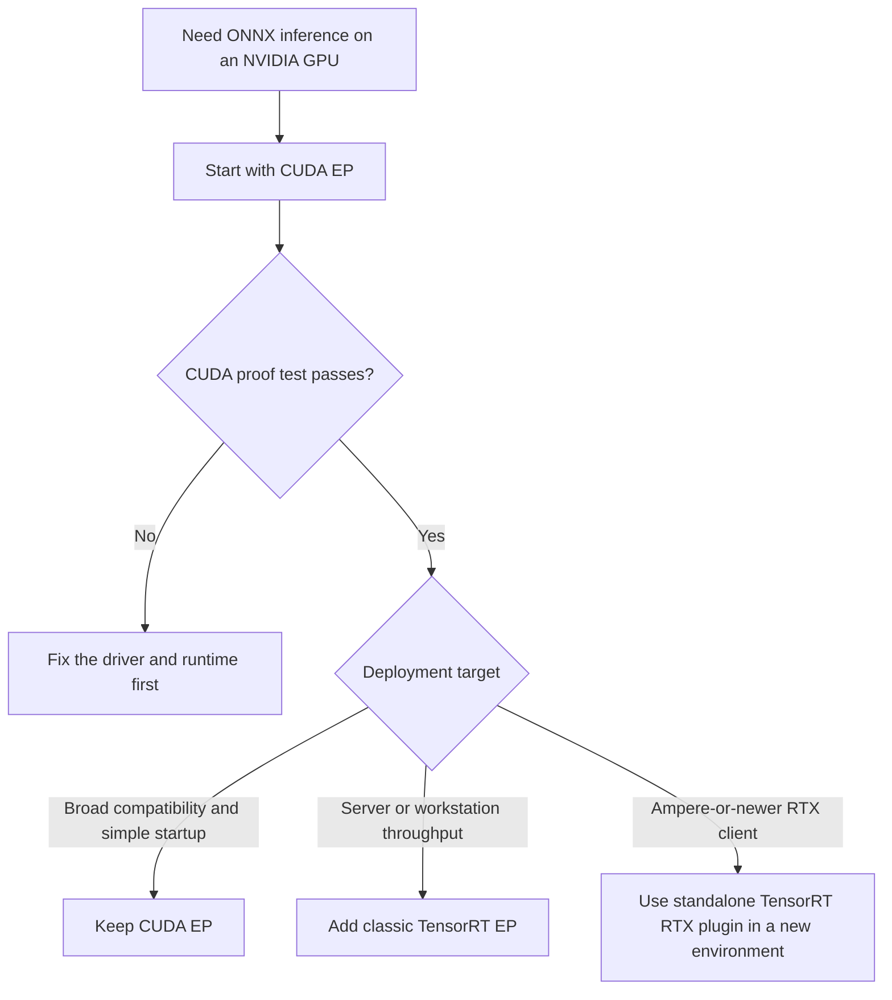
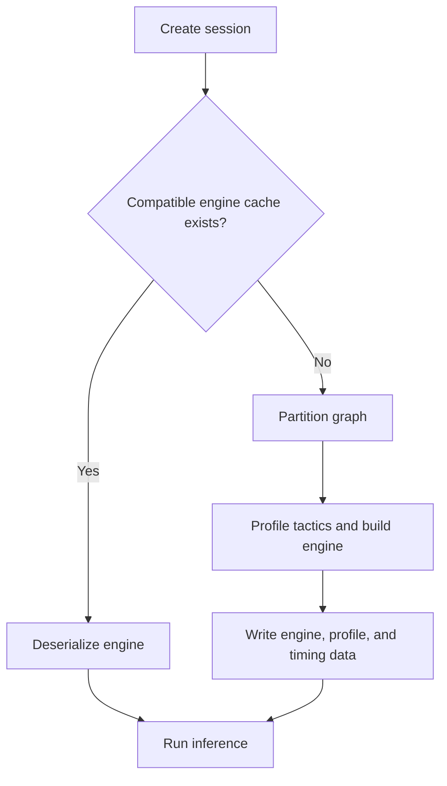
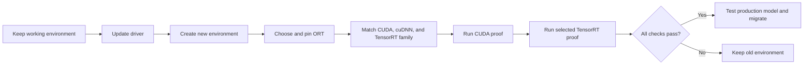

# ONNX Runtime + NVIDIA: CUDA and TensorRT

[简体中文](README.zh-CN.md) · [Repository index](../README.md)

| Item | Baseline |
|---|---|
| Metadata reviewed | `2026-07-17` |
| Validation scope | Upstream release/package metadata and compatibility contracts; GPU execution was not rerun on this host |
| Hosts | Windows 10/11 x64 and Ubuntu 22.04/24.04 x86-64 |
| Routes | `CUDAExecutionProvider`, classic `TensorrtExecutionProvider`, and the standalone `nv_tensorrt_rtx` plugin |
| Runtime | PyPI ONNX Runtime 1.27.0, CUDA 13.3 Update 1, cuDNN 9.24.0.43, TensorRT 10.14.1.48, plugin 0.3.0 |
| Upstream watch | ONNX Runtime 1.27.1 is tagged, but its Python core packages are not published on PyPI as of the review date |
| Entry point | [`provider_test.py`](provider_test.py) |
| Proof | CPU parity, fail-closed fallback policy, and current-run provider profile events |

**Hardware-validation status:** the refreshed CUDA 13.3/cuDNN 9.24 combination was not executed locally because the available GPU predates this guide's Turing floor. Package resolution and documented ABI compatibility are checked below, but they are not substitutes for running the strict proof on the target GPU.

### Files

| File | Purpose |
|---|---|
| `README.md` | This complete English guide |
| `README.zh-CN.md` | Complete Simplified Chinese guide |
| `provider_test.py` | Shared strict proof test for all three routes |
| `requirements-cuda.txt` | Pinned CUDA EP environment |
| `requirements-tensorrt.txt` | Pinned classic TensorRT EP environment |
| `requirements-tensorrt-rtx.txt` | Pinned standalone TensorRT RTX plugin environment |

## 1. Choose a route



| Route | Best fit | Core package | First-session cost | Main portability rule |
|---|---|---|---:|---|
| **CUDA EP** | Default choice and widest NVIDIA operator coverage | `onnxruntime-gpu` | Low | Reusable within a compatible CUDA family |
| **Classic TensorRT EP** | Server/workstation workloads where throughput justifies engine building | `onnxruntime-gpu` plus matching TensorRT | Seconds to minutes | Engine depends on model, ORT/TRT/CUDA, GPU, precision, options, and shape profiles |
| **TensorRT RTX plugin** | Client applications on supported Ampere-or-newer RTX PCs | `onnxruntime` plus standalone plugin | AOT/JIT compilation on first use | Separate package, API, options, context format, and runtime cache |

Start with CUDA even when TensorRT is the final goal. Do not assume TensorRT is faster: benchmark the production model, real shapes, transfers, warm-up, startup policy, and accuracy mode.

## 2. Check compatibility

### 2.1 Pinned combinations

| Goal | ONNX Runtime | NVIDIA user-space components | Python | GPU floor | Driver |
|---|---|---|---:|---|---:|
| CUDA EP | `onnxruntime-gpu==1.27.0` | Selected `cuda-toolkit==13.3.1` components + `nvidia-cudnn-cu13==9.24.0.43` | 3.11–3.14 x64 | Turing, compute capability 7.5+ | R580+ compatibility; R610+ preferred |
| Classic TensorRT EP | Same CUDA core | Above + TensorRT **10.14.1.48** | 3.11–3.13 x64 | TensorRT-supported Turing+ | R580+ compatibility; R610+ preferred |
| TensorRT RTX plugin, default | `onnxruntime==1.27.0` + plugin `0.3.0` | CUDA 13 variant; TensorRT RTX 1.5 runtime bundled | 3.11–3.14 x64 | Ampere-or-newer **RTX**, normally GeForce RTX 30+ | R580+ |
| TensorRT RTX plugin, CUDA 12 variant | `onnxruntime==1.27.0` + `onnxruntime-ep-nv-tensorrt-rtx-cu12==0.3.0` | CUDA 12 variant; TensorRT RTX 1.5 bundled | 3.11–3.14 x64 | Ampere-or-newer RTX | Ampere/Ada 555.85+; Blackwell 570.00+ |

This guide covers native Windows 10/11 x64 and Ubuntu 22.04/24.04 x86-64. Jetson requires JetPack-specific packages and is outside this desktop guide. The CUDA and classic TensorRT rows were compatibility-reviewed but not GPU-executed during this refresh.

### 2.2 GPU architecture gate

| Architecture | Compute capability | CUDA 13 / classic TensorRT baseline | TensorRT RTX plugin |
|---|---:|---|---|
| Maxwell, Pascal, Volta | Below 7.5 | **No**; select an intentionally older ORT/CUDA stack | No |
| Turing: RTX 20, GTX 16, T4 | 7.5 | Yes | No; the plugin package requires Ampere+ RTX |
| Ampere, Ada, Blackwell | 8.x–12.x | Yes | RTX models only, normally GeForce RTX 30+ |

CUDA 13 removed pre-Turing targets from the compiler and key libraries, and ORT's CUDA 13 build starts at `sm_75`. A new driver cannot restore device code absent from user-space libraries.

### 2.3 One ORT core package per environment

The distributions below all expose a Python module named `onnxruntime`. Never mix core distributions in one virtual environment.

| Use case | Install | Do not co-install |
|---|---|---|
| CUDA or classic TensorRT | `onnxruntime-gpu` | Any other package that supplies the `onnxruntime` module |
| Standalone TensorRT RTX plugin | `onnxruntime` + plugin | `onnxruntime-gpu` |

Create a different environment for the standalone plugin. Classic TensorRT may share the CUDA environment after CUDA passes.

### 2.4 Important package-index correction

Do **not** substitute this command for the pinned files:

```text
onnxruntime-gpu[cuda,cudnn]==1.27.0
```

ORT 1.27 metadata still references most CUDA 13 components through retired `nvidia-*-cu13` distribution names. NVIDIA moved those components to un-suffixed distributions and left the old names as `0.0.1` migration placeholders, so the extra no longer resolves as of the metadata review date. The repository instead uses NVIDIA's current `cuda-toolkit==13.3.1` component meta-package.

`ort.preload_dlls(directory="")` discovers the current wheels from their `site-packages/nvidia/...` layout. During the package-name transition, `ort.print_debug_info()` may still report old distribution names as absent. Failed native-library loads and the strict profile test are decisive.

### 2.5 Why these pins

- ONNX Runtime 1.27.1 is the latest upstream tag, but neither `onnxruntime` nor `onnxruntime-gpu` 1.27.1 is published on PyPI as of the review date. Version 1.27.0 remains the latest installable Python core.
- The ORT 1.27.0 GPU wheel was built with CUDA 13.0 and cuDNN 9.14.0.64; CUDA 12 is deprecated in its release notes. Build versions describe the minimum ABI, not a requirement to freeze every compatible minor runtime.
- `cuda-toolkit==13.3.1` supplies the current CUDA 13.3 Update 1 components under NVIDIA's un-suffixed package names. CUDA 13 maintains binary compatibility across minor releases.
- cuDNN 9.24.0 is binary backward-compatible with applications built against earlier cuDNN 9 minors. Its support matrix covers CUDA 13.0 through 13.3 and recommends CUDA 13.3 for tuned performance.
- R580 is the CUDA 13 minor-compatibility floor. New CUDA 13.3 features or PTX generated by CUDA 13.3 NVRTC can require a newer driver, so R610+ is the conservative choice for the refreshed runtime; the strict proof remains decisive.
- ORT 1.27's classic provider build uses TensorRT 10.14.1.48. The current unpinned `tensorrt-cu13` is 11.1.0.106, which is not a drop-in replacement for `nvinfer` major 10. TensorRT 10.14's package accepts CUDA runtime 13.x (`>=13,<14`).
- TensorRT 10.14 bindings publish x86-64 wheels through CPython 3.13, not 3.14.
- The plugin meta-package defaults to CUDA 13, bundles TensorRT RTX 1.5 runtime libraries, and recommends the registration name `nv_tensorrt_rtx`.
- ORT 1.27 targets the ONNX 1.21 specification. This repository uses `onnx==1.22.0` only to author a smoke model explicitly saved as IR 10 and opset 17.

## 3. Prepare the host

### 3.1 Inspect the hardware and operating system

On Windows, open **Device Manager → Display adapters**, record the exact NVIDIA GPU, and run:

```powershell
nvidia-smi
```

On Ubuntu:

```bash
lspci | grep -i nvidia
uname -m
cat /etc/os-release
```

Look up the exact model in NVIDIA's [CUDA GPU list](https://developer.nvidia.com/cuda-gpus). The expected architecture for this guide is `x86_64`.

### 3.2 Install the NVIDIA driver

#### Windows 10/11

1. Install a current Studio or Game Ready driver from [NVIDIA Driver Downloads](https://www.nvidia.com/Download/index.aspx) or the NVIDIA App.
2. Restart Windows.
3. Install the current [Microsoft Visual C++ x64 Redistributable](https://aka.ms/vs/17/release/vc_redist.x64.exe).
4. Open a new PowerShell and confirm that `nvidia-smi` reports branch 580 or newer.

A full CUDA Toolkit is not required for the recommended Python inference route. On laptops, connect AC power and select the high-performance GPU if Windows chooses the integrated GPU.

#### Ubuntu 22.04/24.04

Use Ubuntu's signed packages first, especially with Secure Boot:

```bash
sudo apt update
sudo apt install -y ubuntu-drivers-common
ubuntu-drivers devices
sudo ubuntu-drivers install
sudo reboot
```

After reboot:

```bash
nvidia-smi
nvidia-smi --query-gpu=name,driver_version,memory.total --format=csv,noheader
```

Complete MOK enrollment in the blue firmware screen if Secure Boot requests it. Do not mix Ubuntu package drivers with NVIDIA `.run` drivers. Avoid broad purge commands unless a diagnosed mixed installation requires targeted cleanup.

### 3.3 Understand version commands

| Command | Proves | Does not prove |
|---|---|---|
| `nvidia-smi` | Driver loaded, GPU visible, maximum CUDA level accepted by the driver | CUDA Toolkit installed |
| `nvcc --version` | A development Toolkit compiler is selected on `PATH` | ORT can load CUDA/cuDNN |
| `ort.get_available_providers()` | The installed ORT build exposes a built-in EP | Native dependencies load, a session initializes, or nodes execute there |
| Repository profile proof | The requested EP actually executed graph nodes | Production-model performance |

### 3.4 Install Python and create a virtual environment

Use 64-bit Python 3.12 or 3.13 when starting fresh. Ubuntu 22.04's default Python 3.10 is too old for ORT 1.27; install Python 3.11+ separately or use Conda without replacing the system Python.

Windows PowerShell:

```powershell
cd path\to\Tutorial-ONNX-Runtime-Execution-Providers
py -3.12 -m venv .venv-cuda
.\.venv-cuda\Scripts\Activate.ps1
python -m pip install --upgrade pip
```

If activation is blocked, run `Set-ExecutionPolicy -Scope CurrentUser RemoteSigned` once, reopen PowerShell, and activate again.

Ubuntu:

```bash
cd /path/to/Tutorial-ONNX-Runtime-Execution-Providers
sudo apt install -y python3-venv zlib1g
python3 -m venv .venv-cuda
source .venv-cuda/bin/activate
python -m pip install --upgrade pip
```

<a id="cuda-ep"></a>
## 4. Route A — CUDA EP

CUDA EP is the safest general-purpose starting point. The pinned Python route installs user-space CUDA and cuDNN libraries in the virtual environment; it does not install a kernel/display driver, compiler, headers, Visual Studio, or GCC.

### 4.1 Install the pinned environment

From the repository root:

```bash
python -m pip uninstall -y onnxruntime onnxruntime-gpu
python -m pip install -r NVIDIA/requirements-cuda.txt
python -m pip check
```

The environment contains:

| Package | Pin | Purpose |
|---|---:|---|
| `onnxruntime-gpu` | `1.27.0` | Latest PyPI ORT CUDA 13 core and built-in CUDA/classic-TensorRT providers |
| selected `cuda-toolkit` extras | `13.3.1` | Binary-compatible CUDA 13.3 cuBLAS, runtime, cuFFT, cuRAND, nvJitLink, and NVRTC |
| `nvidia-cudnn-cu13` | `9.24.0.43` | Backward-compatible cuDNN 9 runtime supported with CUDA 13.3 |
| `onnx` | `1.22.0` | Smoke-model authoring only |

### 4.2 Verify exposure, loading, and real execution

Preflight:

```bash
python -c "import onnxruntime as ort; ort.preload_dlls(directory=''); print(ort.__version__); print(ort.get_available_providers()); ort.print_debug_info()"
```

Strict proof:

```bash
python NVIDIA/provider_test.py --provider cuda
```

The test generates a static FP32 ONNX graph, computes an independent NumPy reference, creates a CUDA-only session with CPU graph fallback and ORT runtime fallback disabled, compares outputs, parses the current profile, and fails unless `CUDAExecutionProvider` executed graph work. Success ends in `PASS`.

### 4.3 Strict application configuration

```python
import onnxruntime as ort

ort.preload_dlls(directory="")

providers = [
	(
		"CUDAExecutionProvider",
		{
			"device_id": 0,
			"do_copy_in_default_stream": True,
		},
	),
]

options = ort.SessionOptions()
options.add_session_config_entry("session.disable_cpu_ep_fallback", "1")
session = ort.InferenceSession(
	"model.onnx",
	sess_options=options,
	providers=providers,
	enable_fallback=False,
)
print("Session providers:", session.get_providers())
outputs = session.run(None, {session.get_inputs()[0].name: input_array})
```

This configuration is intentionally fail-closed. A production application may explicitly add another fallback provider, but that is an availability policy—not proof of all-NVIDIA execution.

### 4.4 Safe CUDA options

Start with defaults, change one option at a time, and benchmark the production model.

| Option | Starting value | Meaning |
|---|---:|---|
| `device_id` | `0` | Zero-based GPU index |
| `do_copy_in_default_stream` | `1` | Recommended copy synchronization behavior |
| `gpu_mem_limit` | Effectively unlimited | Limits the ORT CUDA arena, not every CUDA allocation |
| `arena_extend_strategy` | `kNextPowerOfTwo` | Arena growth policy |
| `cudnn_conv_algo_search` | `EXHAUSTIVE` | Searches convolution algorithms; first run can be slower |
| `cudnn_conv_use_max_workspace` | `1` | Can improve convolution speed while increasing peak memory |
| `use_tf32` | `1` | Faster Ampere+ FP32 matrix math with reduced mantissa precision |
| `prefer_nhwc` | `0` | Model-dependent convolution optimization |
| `enable_cuda_graph` | `0` | Advanced; requires stable shapes and addresses plus I/O Binding |

Do not copy a fixed memory limit from another GPU. Do not enable CUDA Graph until ordinary inference is correct.

### 4.5 Optional full CUDA Toolkit and cuDNN

Skip this for Python-only inference. Install a full Toolkit only for `nvcc`, samples, profilers, C++ development, source builds, or system-wide native applications.

Ubuntu package-manager example; use `ubuntu2204` on Ubuntu 22.04:

```bash
distro="ubuntu2404"
arch="x86_64"
wget "https://developer.download.nvidia.com/compute/cuda/repos/${distro}/${arch}/cuda-keyring_1.1-1_all.deb"
sudo dpkg -i cuda-keyring_1.1-1_all.deb
sudo apt update
sudo apt install -y cuda-toolkit-13-3 zlib1g
sudo apt install -y cudnn9-cuda-13
```

If development tools need a shell path:

```bash
cat >> ~/.bashrc <<'EOF'
export CUDA_HOME=/usr/local/cuda
export PATH="$CUDA_HOME/bin${PATH:+:$PATH}"
EOF
source ~/.bashrc
nvcc --version
```

APT libraries are registered with the system loader; `LD_LIBRARY_PATH` is normally unnecessary. For a nonstandard runfile/tar installation, prepend exactly one matching library directory instead of accumulating incompatible versions.

On Windows, download CUDA 13.3 Update 1 from the [CUDA Toolkit Archive](https://developer.nvidia.com/cuda-toolkit-archive), install a current standalone NVIDIA driver, install matching cuDNN 9 only when needed, and verify both `nvcc --version` and `nvidia-smi` in a new terminal. CUDA 13.1 and newer no longer bundle a Windows display driver. Modern CUDA does not need the obsolete `libnvvp` path.

### 4.6 CUDA troubleshooting

| Symptom | Likely cause | Correct action |
|---|---|---|
| `nvidia-smi` missing or failing | Driver absent, kernel module not loaded, or Secure Boot rejection | Fix the driver before Python |
| Driver below branch R580 | CUDA 13 runtime is newer than the driver family | Upgrade the driver or deliberately select a supported CUDA 12 stack |
| R580 driver fails in an NVRTC/PTX path | CUDA 13.3-generated PTX or a newer feature exceeds minor-compatibility mode | Upgrade to R610+ or restore a CUDA 13.0 runtime set, then rerun the strict proof |
| Only CPU provider appears | Wrong ORT core, native libraries failed, or GPU is pre-Turing | Recreate the venv, install the pinned set, verify `sm_75+`, run debug info |
| `libcudnn.so.9` / `cudnn64_9.dll` missing | cuDNN wheel absent or undiscoverable | Reinstall CUDA requirements and call `preload_dlls(directory="")` |
| `libcublas.so.13` / CUDA DLL missing | Runtime wheel missing or stale paths win | Reinstall the pinned set and remove mismatched paths from this process |
| Unsupported model IR version | Exporter wrote a newer IR than ORT supports | Upgrade ORT or export a compatible IR/opset |
| Out of memory | Model/input, another process, or workspace exceeds VRAM | Inspect `nvidia-smi`, reduce batch/shape, then tune arena/workspace |
| Small FP differences | TF32 or reduction-order differences | Validate with tolerances; disable TF32 only when required |
| Tiny demo is slower on GPU | Transfers and launch overhead dominate | Warm up and benchmark the real workload; later consider I/O Binding |
| WSL sees no GPU | Windows host driver or WSL configuration issue | Install the WSL-capable driver on Windows; never install a Linux kernel driver inside WSL |

<a id="tensorrt-ep"></a>
## 5. Route B — classic TensorRT EP

Classic `TensorrtExecutionProvider` partitions the graph, compiles supported subgraphs into TensorRT engines, and sends remaining NVIDIA-supported work to CUDA. Complete the CUDA proof first. This route is not the standalone RTX plugin.

### 5.1 Install the exact TensorRT family

Use Python 3.11–3.13. Activate the CUDA environment that already passed, then run:

```bash
python -m pip uninstall -y onnxruntime onnxruntime-gpu tensorrt tensorrt-cu12 tensorrt-cu13
python -m pip install --upgrade pip
python -m pip install -r NVIDIA/requirements-tensorrt.txt
python -m pip check
```

Never run an unpinned TensorRT upgrade in this environment. ORT 1.27 loads TensorRT major-10 libraries; TensorRT 11 is not compatible with that ABI.

Verify:

```bash
python -c "import tensorrt as trt; import onnxruntime as ort; ort.preload_dlls(directory=''); print('TensorRT:', trt.__version__); print('ORT:', ort.__version__); print(ort.get_available_providers())"
```

Expected essentials are TensorRT `10.14.1.48`, ORT `1.27.0`, `TensorrtExecutionProvider`, and `CUDAExecutionProvider`.

### 5.2 Run the strict proof

```bash
python NVIDIA/provider_test.py --provider tensorrt
```

The first run can be much slower because it builds an engine. The test uses TensorRT → CUDA priority, disables CPU and automatic fallback, writes engine/timing caches under the current user's cache directory, compares with NumPy, and requires profiled TensorRT work.

After FP32 passes, optionally evaluate internal FP16 with representative accuracy criteria:

```bash
python NVIDIA/provider_test.py --provider tensorrt --fp16
```

### 5.3 Correct application configuration

```python
from pathlib import Path

import tensorrt  # Load pip-managed TensorRT 10 libraries before ORT.
import onnxruntime as ort

ort.preload_dlls(directory="")

cache_dir = Path.home() / ".cache" / "my_app" / "tensorrt"
cache_dir.mkdir(parents=True, exist_ok=True)

trt_options = {
	"device_id": 0,
	"trt_engine_cache_enable": True,
	"trt_engine_cache_path": str(cache_dir),
	"trt_engine_cache_prefix": "my_model_v1",
	"trt_timing_cache_enable": True,
	"trt_timing_cache_path": str(cache_dir),
	"trt_force_timing_cache": False,
	"trt_max_workspace_size": 2 * 1024**3,
	"trt_fp16_enable": False,
	"trt_bf16_enable": False,
	"trt_int8_enable": False,
	"trt_dla_enable": False,
	"trt_sparsity_enable": False,
	"trt_cuda_graph_enable": False,
}

providers = [
	("TensorrtExecutionProvider", trt_options),
	("CUDAExecutionProvider", {"device_id": 0}),
]

options = ort.SessionOptions()
options.add_session_config_entry("session.disable_cpu_ep_fallback", "1")
session = ort.InferenceSession(
	"model.onnx",
	sess_options=options,
	providers=providers,
	enable_fallback=False,
)
print("Session providers:", session.get_providers())
outputs = session.run(None, {session.get_inputs()[0].name: input_array})
```

CUDA execution for unsupported TensorRT subgraphs remains NVIDIA execution and is visible in the profile. CPU graph assignment fails in this strict configuration.

### 5.4 Safe TensorRT options

| Option | ORT 1.27 default | Starting policy | Notes |
|---|---:|---:|---|
| `device_id` | `0` | Intended GPU index | Zero-based CUDA device |
| `trt_max_workspace_size` | `0`, up to available device memory | Explicit 1–2 GiB, then tune | Prevents an unconstrained initial builder policy |
| `trt_fp16_enable` | `False` | `False` | Enable after FP32 and task-level accuracy checks |
| `trt_bf16_enable` | `False` | `False` | Ampere+ and model-dependent |
| `trt_int8_enable` | `False` | `False` | Requires QDQ or a valid calibration workflow |
| `trt_engine_cache_enable` | `False` | `True` for stable production inputs | Skips compatible rebuilds |
| `trt_engine_cache_path` | Working directory | App-specific writable directory | Do not mix unrelated models/settings |
| `trt_engine_cache_prefix` | Empty | Stable model/version identifier | Avoids ambiguous cache names |
| `trt_timing_cache_enable` | `False` | `True` | Reuses tactic timing data |
| `trt_force_timing_cache` | `False` | `False` | Never force a mismatched cache by default |
| `trt_builder_optimization_level` | `3` | `3` | Lower builds faster but may reduce runtime speed |
| `trt_auxiliary_streams` | `-1` heuristic | Keep default | Use `0` when minimizing memory matters more |
| `trt_sparsity_enable` | `False` | `False` | Does not prune dense weights automatically |
| `trt_dla_enable` | `False` | `False` | Desktop RTX GPUs do not have DLA |
| `trt_cuda_graph_enable` | `False` | `False` | Advanced static-shape/address workflow |
| `trt_dump_subgraphs` | `False` | Diagnosis only | Dumps parser subgraphs for `trtexec` inspection |
| `trt_dump_ep_context_model` | `False` | `False` | Advanced packaging feature |

Unsafe beginner defaults include a copied 64 GiB workspace, forced timing-cache reuse, unconditional DLA, sparsity, or context dumping.

### 5.5 Dynamic input profiles

For an input named `images` with shape `[batch, 3, height, width]`:

```python
trt_options.update(
	{
		"trt_profile_min_shapes": "images:1x3x224x224",
		"trt_profile_opt_shapes": "images:4x3x512x512",
		"trt_profile_max_shapes": "images:8x3x1024x1024",
	}
)
```

Use exact ONNX input names, provide min/opt/max together, include every dynamic input, satisfy $min \le opt \le max$ for every dimension, keep ranges narrow, and reuse the same profile options with the corresponding engine cache.

### 5.6 Cache lifecycle



| Artifact | Benefit | Portability |
|---|---|---|
| Timing cache | Speeds tactic selection during builds | Prefer the same GPU model; same compute capability may work |
| Engine cache | Skips most engine construction | Normally tied to model, options, ORT/TRT/CUDA, and GPU |
| EP context model | Packages a reference to or copy of compiled context | Advanced artifact with strict compatibility and security rules |

Delete stale engine/profile/timing data after changing graph or weights, input names, model version, ORT, TensorRT, CUDA major, GPU architecture, precision, workspace, dynamic profiles, plugin libraries, or partitioning options. `trt_engine_hw_compatible=1` can broaden Ampere+ reuse at a possible performance cost; it does not make engines universally portable. Do not commit hardware-specific caches as universal models.

### 5.7 Optional native TensorRT installation

The pinned pip route is sufficient for this repository. Install native TensorRT only for C++ headers, libraries, or `trtexec`, and never expose a different TensorRT major to the same process.

On Ubuntu, download the TensorRT **10.14.1** local repository package matching Ubuntu, x86-64, and CUDA 13, then use its actual filename:

```bash
sudo dpkg -i nv-tensorrt-local-repo-*.deb
sudo cp /var/nv-tensorrt-local-repo-*/*-keyring.gpg /usr/share/keyrings/
sudo apt update
sudo apt install -y tensorrt
dpkg-query -W 'tensorrt*' 'libnvinfer*'
command -v trtexec && trtexec --version
```

The first `.deb` only registers a repository; `apt install tensorrt` performs the installation.

On Windows, extract the matching TensorRT 10.14.1 CUDA 13 ZIP to a versioned directory, add its `lib` and `bin` directories to the user `Path`, open a new PowerShell, and run `trtexec.exe --version`. Do not copy random DLLs into system directories.

### 5.8 Classic TensorRT troubleshooting

| Symptom | Likely cause | Correct action |
|---|---|---|
| CUDA passes but TensorRT EP is absent | TensorRT 10 libraries missing or undiscoverable | Install the exact pin, import `tensorrt` before ORT, inspect loader paths |
| `libnvinfer.so.10` / `nvinfer_10.dll` missing | Wrong or incomplete runtime | Reinstall 10.14.1; never rename a TensorRT 11 library |
| `tensorrt.__version__` is 11.x | Unpinned upgrade replaced major 10 | Recreate or repair with `10.14.1.48.post1` |
| First session takes minutes | Expected tactic profiling and engine construction | Keep app-specific engine and timing caches |
| Every process rebuilds | Cache unwritable, options/model/profile changed, or shape is outside range | Fix permissions and stabilize model/options/profiles |
| Profile contains only CUDA | TensorRT rejected or received no supported subgraph | Enable info logs and temporary subgraph dumping; inspect with `trtexec` |
| Dynamic profile error | Wrong input name/rank or incomplete profile set | Inspect real input metadata and supply all three profiles |
| DLA error on desktop | DLA enabled on unsupported hardware | Keep `trt_dla_enable=0` |
| Engine build runs out of memory | Workspace, model, profile, or other processes exceed VRAM | Reduce workspace/batch/ranges and close other GPU workloads |
| Accuracy changes in lower precision | Expected FP16/BF16 behavior | Return to FP32 and validate representative task metrics |

<a id="tensorrt-rtx"></a>
## 6. Route C — standalone TensorRT RTX EP ABI plugin

The plugin targets client applications on modern RTX PCs. It is not classic `TensorrtExecutionProvider`. Its core package, dynamic registration API, EP device discovery, provider options, context format, and runtime cache are different. The similarly named built-in `NvTensorRTRTXExecutionProvider` is deprecated.

Plugin 0.3.0 is marked Alpha on PyPI. Pin it, validate the production model, and preserve the working environment. The generated ORT page may still say package-manager installation is coming soon; NVIDIA's plugin release and live package metadata are newer for this route.

### 6.1 Create a separate environment and install

Windows:

```powershell
py -3.12 -m venv .venv-trt-rtx
.\.venv-trt-rtx\Scripts\Activate.ps1
python -m pip install --upgrade pip
```

Ubuntu:

```bash
python3 -m venv .venv-trt-rtx
source .venv-trt-rtx/bin/activate
python -m pip install --upgrade pip
```

Install the default CUDA 13 variant:

```bash
python -m pip uninstall -y onnxruntime onnxruntime-gpu
python -m pip install -r NVIDIA/requirements-tensorrt-rtx.txt
python -m pip check
```

The wheel bundles the TensorRT RTX runtime and EP library but not the NVIDIA kernel/display driver. A full CUDA Toolkit and TensorRT RTX SDK are needed only when building from source.

Optional CUDA 12 variant:

```bash
python -m pip install "onnxruntime==1.27.0" "onnxruntime-ep-nv-tensorrt-rtx-cu12==0.3.0" "onnx==1.22.0"
```

Do not install CUDA 12 and CUDA 13 variants together. `-cu12` is part of the package name, not the version. Although CUDA 12's generic driver floor is branch 525, plugin 0.3.0 requires at least 555.85 for Ampere/Ada and 570.00 for Blackwell; prefer a current production driver.

### 6.2 Register the plugin and discover devices

`get_available_providers()` alone is not the discovery mechanism for a dynamic EP ABI plugin. Register it, then inspect `get_ep_devices()`:

```python
import onnxruntime as ort
import onnxruntime_ep_nv_tensorrt_rtx as trt_ep

name = trt_ep.get_ep_name()
ort.register_execution_provider_library(name, trt_ep.get_library_path())
try:
	devices = [device for device in ort.get_ep_devices() if device.ep_name == name]
	print("Plugin:", name)
	print("Compatible devices:", len(devices))
	for index, device in enumerate(devices):
		print(
			index,
			device.ep_options.get("device_id", index),
			device.ep_vendor,
			device.device.vendor,
			device.device.metadata,
		)
finally:
	ort.unregister_execution_provider_library(name)
```

The helper currently recommends `nv_tensorrt_rtx`. Registration names are application-supplied and become the EP device/profile name. Spelling alone does not prove whether a standalone or deprecated built-in implementation is active.

### 6.3 Run the strict proof

```bash
python NVIDIA/provider_test.py --provider nv_tensorrt_rtx
```

The test registers the plugin, selects a compatible EP device, disables CUDA Graph for a safe smoke test, disables CPU graph fallback, checks NumPy parity, parses the profile, and requires plugin node execution. Registration without profiled work is not a pass.

### 6.4 Correct application code and cleanup

```python
import gc
import traceback
from pathlib import Path

import onnxruntime as ort
import onnxruntime_ep_nv_tensorrt_rtx as trt_ep

cache_dir = Path.home() / ".cache" / "my_app" / "trt_rtx"
cache_dir.mkdir(parents=True, exist_ok=True)

registration_name = trt_ep.get_ep_name()
ort.register_execution_provider_library(
	registration_name,
	trt_ep.get_library_path(),
)

session = None
pending_error = None
try:
	devices = [
		device
		for device in ort.get_ep_devices()
		if device.ep_name == registration_name
	]
	if not devices:
		raise RuntimeError("No compatible TensorRT RTX EP device was found")

	devices_by_id = {
		int(device.ep_options.get("device_id", index)): device
		for index, device in enumerate(devices)
	}
	device_id = 0
	if device_id not in devices_by_id:
		raise RuntimeError(f"Available device IDs: {sorted(devices_by_id)}")

	session_options = ort.SessionOptions()
	session_options.add_session_config_entry(
		"session.disable_cpu_ep_fallback", "1"
	)
	session_options.add_provider_for_devices(
		[devices_by_id[device_id]],
		{
			"enable_cuda_graph": "0",
			"nv_runtime_cache_path": str(cache_dir),
		},
	)

	session = ort.InferenceSession(
		"model.onnx",
		sess_options=session_options,
		enable_fallback=False,
	)
	outputs = session.run(
		None,
		{session.get_inputs()[0].name: input_array},
	)
except BaseException as exc:
	pending_error = exc
	traceback.clear_frames(exc.__traceback__)
	raise
finally:
	del session
	gc.collect()
	try:
		ort.unregister_execution_provider_library(registration_name)
	except Exception:
		if pending_error is None:
			raise
```

Destroy every session using the plugin before unregistering the library. Error tracebacks can retain session references, so clear completed frames on failure. Long-running applications can register once at startup and unregister only during final shutdown.

### 6.5 Safe plugin options

Provider option values are strings. Accepted boolean forms include `0`/`1`, `false`/`true`, and `False`/`True`.

| Option | Start with | Meaning |
|---|---:|---|
| `device_id` | Enumerated EP device | Prefer discovery over guessing an ordinal |
| `has_user_compute_stream` / `user_compute_stream` | `0` / unset | Advanced interop; stream value is a native CUDA stream address |
| `enable_cuda_graph` | `0` while validating | Enable only for stable shapes, addresses, and repeated execution |
| `nv_max_workspace_size` | `0` automatic | Set a byte limit only for a measured memory requirement |
| `nv_dump_subgraphs` | `0` | Temporary parser/partition diagnosis |
| `nv_detailed_build_log` | `0` | Temporary compilation diagnosis |
| `nv_runtime_cache_path` | App-specific writable path | Reuses target-specific JIT kernels |
| `nv_profile_min_shapes` | Empty/automatic | Set with opt/max for controlled dynamic shapes |
| `nv_profile_opt_shapes` | Empty/automatic | Most representative shape |
| `nv_profile_max_shapes` | Empty/automatic | Largest supported shape |
| `nv_multi_profile_enable` | `0` | Enable only for multiple explicit profiles |
| `nv_use_external_data_initializer` | `1` | Use external-data initializer path when applicable |
| `nv_weight_streaming_budget` | `0`, disabled | `-1` automatic; `1` minimum VRAM; bytes, binary `B/K/M/G`, or resident percentage |
| `nv_max_shared_mem_size` | `0` automatic | Cap kernel shared memory only for a measured constraint |
| `nv_op_types_to_exclude` | Empty | Comma-separated ONNX op types left to another EP |

For weight streaming, bare `0` uniquely means disabled; `0B` and `0%` enable minimum-VRAM mode. `1M` means $2^{20}$ resident bytes. Begin disabled and measure VRAM, build time, and steady-state latency before changing it.

EP-context output uses generic ORT session entries—not invented `nv_*` options: `ep.context_enable`, `ep.context_file_path`, and `ep.context_embed_mode`. Plugin 0.3.0 rejects unknown provider options.

### 6.6 Dynamic shapes

```python
session_options.add_provider_for_devices(
	[devices[0]],
	{
		"enable_cuda_graph": "0",
		"nv_profile_min_shapes": "images:1x3x224x224",
		"nv_profile_opt_shapes": "images:4x3x512x512",
		"nv_profile_max_shapes": "images:8x3x1024x1024",
	},
)
```

Use exact input names, provide all three profiles, include every dynamic input, enforce $min \le opt \le max$, keep ranges narrow, and disable CUDA Graph when shapes or bound addresses vary.

### 6.7 EP context and runtime cache


- An **EP context model** stores a TensorRT RTX-specific compiled representation; it is not a universal replacement for the original model.
- The target **JIT** specializes it for the exact GPU.
- The **runtime cache** stores generated kernels, not the original graph and weights.

Basic compilation:

```python
session_options = ort.SessionOptions()
session_options.add_provider_for_devices([devices[0]], {"enable_cuda_graph": "0"})
compiler = ort.ModelCompiler(session_options, "model.onnx")
compiler.compile_to_file("model_ctx.onnx")
```

Keep the original model and rebuild context/cache artifacts after incompatible plugin, runtime, model, or target changes. For models larger than 2 GiB, use external EP-context data instead of embedding a huge blob in protobuf.

### 6.8 TensorRT RTX troubleshooting

| Symptom | Likely cause | Correct action |
|---|---|---|
| Plugin helper import fails | Plugin absent from the active environment | Check `python -m pip show` and recreate the venv |
| Registration reports missing DLL/SO | Incomplete wheel, blocked file, missing MSVC runtime, or loader conflict | Reinstall cleanly; install VC++ runtime on Windows; inspect the loader error |
| No compatible EP devices | Pre-Ampere GPU, old driver, unsupported OS/architecture, or wrong CUDA variant | Verify RTX model, driver, x64 OS, and cu13/cu12 choice |
| `onnxruntime-gpu` is installed | Wrong core package for the standalone plugin | Remove it and install ordinary `onnxruntime==1.27.0` |
| No plugin node is profiled | Graph was not accepted or plugin received no work | Enable detailed logs/subgraph dump and start with static FP32 |
| First session is slow | Expected JIT/context compilation | Configure an app-specific runtime cache and test another clean process |
| CUDA Graph fails when inputs change | Captured addresses or shapes changed | Disable it or use stable I/O Binding buffers |
| Cache stops helping after upgrade | Context/runtime compatibility changed | Remove only that application's old cache and rebuild |
| Unregister fails or crashes | A live session still references the plugin | Destroy sessions/bindings, clear retained references, then unregister |

## 7. Understand the proof

Run from the repository root:

| Route | Command |
|---|---|
| CUDA | `python NVIDIA/provider_test.py --provider cuda` |
| Classic TensorRT | `python NVIDIA/provider_test.py --provider tensorrt` |
| Classic TensorRT FP16 experiment | `python NVIDIA/provider_test.py --provider tensorrt --fp16` |
| TensorRT RTX plugin | `python NVIDIA/provider_test.py --provider nv_tensorrt_rtx` |

Useful common arguments include `--device-id`, `--warmups`, `--runs`, `--cache-dir`, `--workspace-mb`, and `--verbose`.

The proof layers answer different questions:

1. `get_available_providers()` shows built-in capabilities exposed by the installed ORT build.
2. `session.get_providers()` shows providers registered for that session.
3. Profile node events prove where graph work actually executed.

The repository test enforces layer 3, uses independent NumPy math as the oracle, disables ORT automatic fallback, disables CPU graph fallback, and rejects unexpected providers. For classic TensorRT, CUDA is the only allowed secondary EP. A provider name in a list is not execution proof.

## 8. Upgrade safely



Record `python --version`, `pip freeze`, `nvidia-smi`, provider lists, profile evidence, and production model/options. Never upgrade CUDA, cuDNN, TensorRT, ORT, and the application in-place at the same time. Delete relevant engine, timing, runtime, and EP-context caches after incompatible changes.

## 9. References

- [ONNX Runtime 1.27.0 Python release](https://github.com/microsoft/onnxruntime/releases/tag/v1.27.0)
- [ONNX Runtime 1.27.1 upstream patch release](https://github.com/microsoft/onnxruntime/releases/tag/v1.27.1)
- [ONNX Runtime 1.27.0 PyPI metadata](https://pypi.org/pypi/onnxruntime-gpu/1.27.0/json)
- [ORT 1.27 GPU build variables](https://github.com/microsoft/onnxruntime/blob/v1.27.0/tools/ci_build/github/azure-pipelines/templates/common-variables.yml)
- [ONNX Runtime installation](https://onnxruntime.ai/docs/install/)
- [ORT model compatibility](https://onnxruntime.ai/docs/reference/compatibility.html)
- [CUDA EP documentation](https://onnxruntime.ai/docs/execution-providers/CUDA-ExecutionProvider.html)
- [Classic TensorRT EP documentation](https://onnxruntime.ai/docs/execution-providers/TensorRT-ExecutionProvider.html)
- [TensorRT RTX EP documentation](https://onnxruntime.ai/docs/execution-providers/TensorRTRTX-ExecutionProvider.html)
- [ONNX Runtime plugin EP libraries](https://onnxruntime.ai/docs/execution-providers/plugin-ep-libraries/)
- [Standalone TensorRT RTX EP ABI repository](https://github.com/NVIDIA/TensorRT-RTX-EP-ABI)
- [Plugin 0.3.0 release](https://github.com/NVIDIA/TensorRT-RTX-EP-ABI/releases/tag/v0.3.0)
- [Plugin 0.3.0 CUDA 13 wheel metadata](https://pypi.org/pypi/onnxruntime-ep-nv-tensorrt-rtx-cu13/0.3.0/json)
- [CUDA Toolkit 13.3.1 Python metadata](https://pypi.org/pypi/cuda-toolkit/13.3.1/json)
- [CUDA Toolkit 13.3 release notes](https://docs.nvidia.com/cuda/cuda-toolkit-release-notes/)
- [cuDNN CUDA 13 9.24.0.43 metadata](https://pypi.org/pypi/nvidia-cudnn-cu13/9.24.0.43/json)
- [cuDNN support matrix](https://docs.nvidia.com/deeplearning/cudnn/backend/latest/reference/support-matrix.html)
- [cuDNN API compatibility](https://docs.nvidia.com/deeplearning/cudnn/backend/latest/developer/forward-compatibility.html)
- [TensorRT CUDA 13 10.14.1.48.post1 metadata](https://pypi.org/pypi/tensorrt-cu13/10.14.1.48.post1/json)
- [NVIDIA CUDA GPU list](https://developer.nvidia.com/cuda-gpus)
- [NVIDIA CUDA compatibility](https://docs.nvidia.com/deploy/cuda-compatibility/minor-version-compatibility.html)
- [CUDA installation for Windows](https://docs.nvidia.com/cuda/cuda-installation-guide-microsoft-windows/)
- [CUDA installation for Linux](https://docs.nvidia.com/cuda/cuda-installation-guide-linux/)
- [NVIDIA cuDNN installation](https://docs.nvidia.com/deeplearning/cudnn/installation/latest/)
- [NVIDIA TensorRT installation](https://docs.nvidia.com/deeplearning/tensorrt/latest/installing-tensorrt/installing.html)
- [NVIDIA TensorRT support matrix](https://docs.nvidia.com/deeplearning/tensorrt/latest/getting-started/support-matrix.html)
- [TensorRT RTX prerequisites](https://docs.nvidia.com/deeplearning/tensorrt-rtx/latest/installing-tensorrt-rtx/prerequisites.html)
- [TensorRT RTX support matrix](https://docs.nvidia.com/deeplearning/tensorrt-rtx/latest/getting-started/support-matrix.html)
