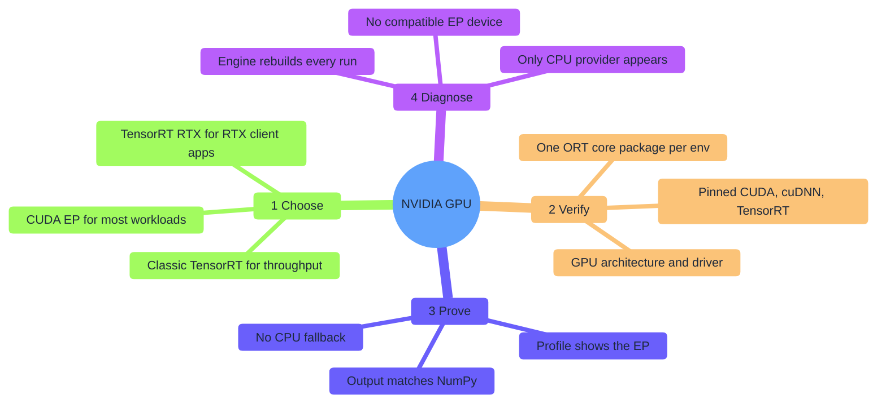
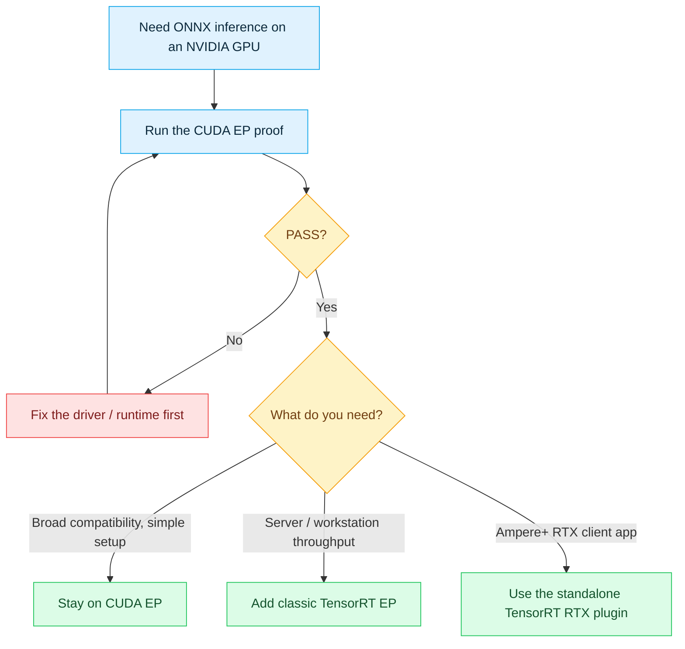
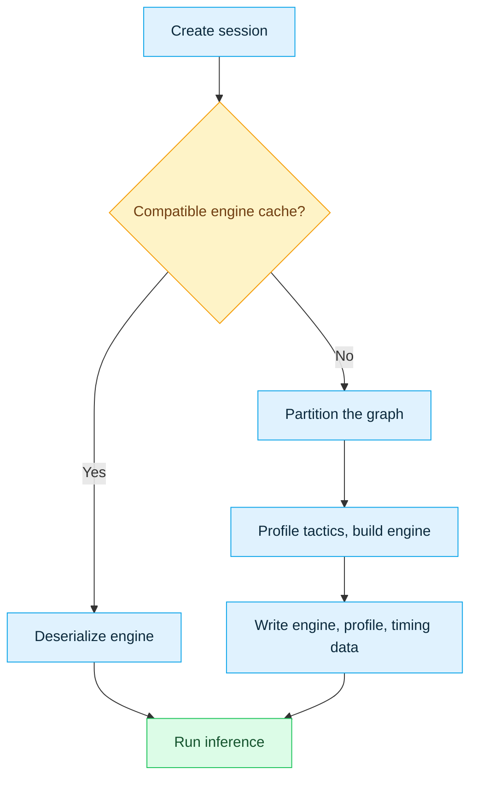
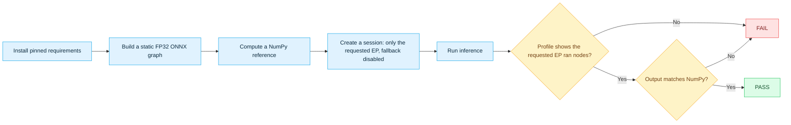
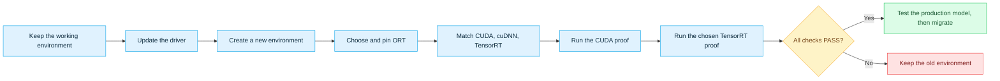

# ONNX Runtime + NVIDIA: CUDA and TensorRT

[简体中文](README.zh-CN.md) · [Repository index](../README.md)

Run ONNX models on an NVIDIA GPU through **CUDA**, **classic TensorRT**, or the newer **TensorRT RTX** plugin — and *prove* the GPU actually executed the graph, not just that a provider loaded.

```bash
# Fastest path: CUDA EP on Windows 10/11 x64 or Ubuntu 22.04/24.04 x86-64
python -m pip install -r NVIDIA/requirements-cuda.txt
python NVIDIA/provider_test.py --provider cuda
```

| You are… | Go to |
|---|---|
| Not sure which route fits | [§1 Choose your route](#1-choose-your-route) |
| Not sure your GPU/driver qualifies | [§2 Check compatibility](#2-check-compatibility) |
| Ready to install and run the proof | [§4 CUDA](#cuda-ep) · [§5 classic TensorRT](#tensorrt-ep) · [§6 TensorRT RTX](#tensorrt-rtx) |
| Something failed | Every route ends with its own troubleshooting table |
| Wondering what "PASS" really proves | [§7 Understand the proof](#7-understand-the-proof) |

| Item | Baseline |
|---|---|
| Metadata reviewed | `2026-07-17` |
| Hosts | Windows 10/11 x64 · Ubuntu 22.04/24.04 x86-64 |
| Routes | `CUDAExecutionProvider` · classic `TensorrtExecutionProvider` · standalone `nv_tensorrt_rtx` plugin |
| Pinned runtime | ORT `1.27.0` (PyPI) · CUDA `13.3 Update 1` · cuDNN `9.24.0.43` · TensorRT `10.14.1.48` · plugin `0.3.0` |
| Upstream watch | ORT `1.27.1` is tagged, but its Python packages are not on PyPI as of the review date |
| Entry point | [`provider_test.py`](provider_test.py) |
| Proof | CPU-numeric parity + fail-closed fallback policy + current-run profile evidence |

> [!NOTE]
> The refreshed CUDA 13.3 / cuDNN 9.24 stack was **not re-executed on real GPU hardware** for this review — the available host predates this guide's Turing floor. Package resolution and documented ABI compatibility were checked; only the strict proof on your own target GPU is decisive.

### Files

| File | Purpose |
|---|---|
| [`README.md`](README.md) | This guide |
| [`README.zh-CN.md`](README.zh-CN.md) | Simplified Chinese translation |
| [`provider_test.py`](provider_test.py) | Shared strict proof for all three routes |
| [`requirements-cuda.txt`](requirements-cuda.txt) | Pinned CUDA EP environment |
| [`requirements-tensorrt.txt`](requirements-tensorrt.txt) | Pinned classic TensorRT EP environment |
| [`requirements-tensorrt-rtx.txt`](requirements-tensorrt-rtx.txt) | Pinned standalone TensorRT RTX plugin environment |

## Contents

- [1. Choose your route](#1-choose-your-route)
- [2. Check compatibility](#2-check-compatibility)
- [3. Prepare the host](#3-prepare-the-host)
- [4. Route A — CUDA EP](#cuda-ep)
- [5. Route B — classic TensorRT EP](#tensorrt-ep)
- [6. Route C — standalone TensorRT RTX plugin](#tensorrt-rtx)
- [7. Understand the proof](#7-understand-the-proof)
- [8. Upgrade safely](#8-upgrade-safely)
- [9. References](#9-references)



## 1. Choose your route



| Route | Best fit | Core package | First-session cost | Portability |
|---|---|---|---:|---|
| **CUDA EP** | Default choice, widest NVIDIA coverage | `onnxruntime-gpu` | Low | Reusable within a compatible CUDA family |
| **Classic TensorRT EP** | Server/workstation throughput | `onnxruntime-gpu` + matching TensorRT | Seconds–minutes | Engine is tied to model, ORT/TRT/CUDA, GPU, precision, options, and shapes |
| **TensorRT RTX plugin** | Client apps on Ampere+ RTX PCs | `onnxruntime` + standalone plugin | AOT/JIT compile on first use | Own package, API, options, context format, and runtime cache |

Always validate CUDA first, even if TensorRT is the end goal — TensorRT is not automatically faster. Benchmark with your real model, shapes, transfers, warm-up, and precision mode before deciding.

## 2. Check compatibility

### 2.1 Pinned combinations

| Goal | ONNX Runtime | NVIDIA components | Python | GPU floor | Driver |
|---|---|---|---:|---|---:|
| CUDA EP | `onnxruntime-gpu==1.27.0` | `cuda-toolkit==13.3.1` extras + `nvidia-cudnn-cu13==9.24.0.43` | 3.11–3.14 x64 | Turing, CC 7.5+ | R580+ (R610+ preferred) |
| Classic TensorRT EP | Same CUDA core | Above + TensorRT **10.14.1.48** | 3.11–3.13 x64 | TensorRT-supported Turing+ | R580+ (R610+ preferred) |
| TensorRT RTX, default | `onnxruntime==1.27.0` + plugin `0.3.0` | CUDA 13 variant; TensorRT RTX 1.5 runtime bundled | 3.11–3.14 x64 | Ampere+ RTX (usually RTX 30+) | R580+ |
| TensorRT RTX, CUDA 12 variant | `onnxruntime==1.27.0` + `onnxruntime-ep-nv-tensorrt-rtx-cu12==0.3.0` | CUDA 12 variant; TensorRT RTX 1.5 bundled | 3.11–3.14 x64 | Ampere+ RTX | Ampere/Ada 555.85+; Blackwell 570.00+ |

This guide targets native Windows 10/11 x64 and Ubuntu 22.04/24.04 x86-64. Jetson needs JetPack-specific packages and is out of scope. Only the CUDA and classic TensorRT rows were re-checked this refresh, and only against compatibility metadata — not GPU execution.

### 2.2 GPU architecture gate

| Architecture | Compute capability | CUDA 13 / classic TensorRT | TensorRT RTX plugin |
|---|---:|---|---|
| Maxwell, Pascal, Volta | Below 7.5 | **No** — needs a deliberately older ORT/CUDA stack | No |
| Turing: RTX 20, GTX 16, T4 | 7.5 | Yes | No — plugin requires Ampere+ RTX |
| Ampere, Ada, Blackwell | 8.x–12.x | Yes | RTX models only, usually GeForce RTX 30+ |

CUDA 13 dropped pre-Turing device code from its compiler and libraries. A newer driver alone cannot bring back code the runtime no longer ships.

### 2.3 One ORT core package per environment

`onnxruntime-gpu`, plain `onnxruntime`, and other GPU-flavored distributions all expose the same `onnxruntime` Python module — never install two of them in one environment.

| Use case | Install | Never co-install |
|---|---|---|
| CUDA or classic TensorRT | `onnxruntime-gpu` | Any other package exposing the `onnxruntime` module |
| Standalone TensorRT RTX plugin | `onnxruntime` + plugin | `onnxruntime-gpu` |

> [!TIP]
> Give the standalone plugin its own virtual environment. Classic TensorRT can share the CUDA environment once CUDA already passes.

### 2.4 A package-index trap to avoid

> [!WARNING]
> Do not substitute `onnxruntime-gpu[cuda,cudnn]==1.27.0` for the pinned requirements files. ORT 1.27's metadata still points at retired `nvidia-*-cu13` package names; NVIDIA replaced them with un-suffixed packages and left the old names as empty `0.0.1` placeholders, so that extra fails to resolve as of the review date. This repository installs NVIDIA's current `cuda-toolkit==13.3.1` meta-package instead.

`ort.preload_dlls(directory="")` finds the wheels' own `site-packages/nvidia/...` layout regardless of this naming churn. During the transition, `ort.print_debug_info()` may still list old package names as "missing" — trust a failed native-library load or the strict proof test, not that log line.

### 2.5 Why these pins

| Pin | Why |
|---|---|
| ORT `1.27.0`, not `1.27.1` | `1.27.1` is tagged upstream, but neither `onnxruntime` nor `onnxruntime-gpu` 1.27.1 is on PyPI as of the review date |
| `cuda-toolkit==13.3.1` | Current CUDA 13.3 Update 1 components under NVIDIA's new package names; CUDA 13 keeps binary compatibility across minor releases |
| `nvidia-cudnn-cu13==9.24.0.43` | Backward-compatible with the cuDNN 9.14.0.64 the ORT 1.27.0 wheel was built against; its support matrix covers CUDA 13.0–13.3 |
| Driver R580+, R610+ preferred | R580 is CUDA 13's minor-compatibility floor; CUDA 13.3-generated PTX or newer features can need R610+ |
| TensorRT `10.14.1.48` | Matches the TensorRT major-10 ABI the ORT 1.27 classic provider was built against; unpinned `tensorrt-cu13` (11.1.0.106) is an incompatible major version |
| TensorRT wheel: CPython ≤ 3.13 | TensorRT 10.14's x86-64 bindings do not publish a 3.14 wheel |
| Plugin `0.3.0` | Defaults to CUDA 13, bundles the TensorRT RTX 1.5 runtime, and recommends registration name `nv_tensorrt_rtx` |
| `onnx==1.22.0` | Used only to author the smoke model, saved explicitly as IR 10 / opset 17 for the ONNX 1.21 spec ORT 1.27 targets |

## 3. Prepare the host

### 3.1 Confirm hardware and OS

```powershell
# Windows: also check Device Manager -> Display adapters for the exact model
nvidia-smi
```

```bash
# Ubuntu
lspci | grep -i nvidia
uname -m
cat /etc/os-release
```

Look up your exact model on NVIDIA's [CUDA GPU list](https://developer.nvidia.com/cuda-gpus). Expected architecture: `x86_64`.

### 3.2 Install the NVIDIA driver

**Windows 10/11**

1. Install a current Studio or Game Ready driver from [NVIDIA Driver Downloads](https://www.nvidia.com/Download/index.aspx) or the NVIDIA App.
2. Restart Windows.
3. Install the current [VC++ x64 Redistributable](https://aka.ms/vs/17/release/vc_redist.x64.exe).
4. Open a new PowerShell — `nvidia-smi` should report branch 580 or newer.

A full CUDA Toolkit is **not** required for Python inference. On a laptop, stay on AC power and pick the high-performance GPU if Windows defaults to the integrated one.

**Ubuntu 22.04/24.04**

```bash
sudo apt update
sudo apt install -y ubuntu-drivers-common
ubuntu-drivers devices
sudo ubuntu-drivers install
sudo reboot
```

```bash
nvidia-smi
nvidia-smi --query-gpu=name,driver_version,memory.total --format=csv,noheader
```

Complete MOK enrollment in the blue firmware screen if Secure Boot asks for it. Do not mix Ubuntu's signed driver packages with NVIDIA `.run` installers.

### 3.3 What each command actually proves

| Command | Proves | Does not prove |
|---|---|---|
| `nvidia-smi` | Driver loaded, GPU visible, max CUDA level the driver accepts | CUDA Toolkit installed |
| `nvcc --version` | A dev Toolkit compiler is on `PATH` | ORT can load CUDA/cuDNN |
| `ort.get_available_providers()` | The installed ORT build exposes an EP | Dependencies load, a session inits, or nodes execute there |
| This repo's proof test | The requested EP actually executed graph nodes | Your production model's performance |

### 3.4 Install Python and create a virtual environment

Use 64-bit Python 3.12 or 3.13. Ubuntu 22.04's default Python 3.10 is too old — install 3.11+ separately (or Conda) without touching the system Python.

```powershell
# Windows PowerShell
cd path\to\Tutorial-ONNX-Runtime-Execution-Providers
py -3.12 -m venv .venv-cuda
.\.venv-cuda\Scripts\Activate.ps1
python -m pip install --upgrade pip
```

If activation is blocked, run `Set-ExecutionPolicy -Scope CurrentUser RemoteSigned` once, reopen PowerShell, then retry.

```bash
# Ubuntu
cd /path/to/Tutorial-ONNX-Runtime-Execution-Providers
sudo apt install -y python3-venv zlib1g
python3 -m venv .venv-cuda
source .venv-cuda/bin/activate
python -m pip install --upgrade pip
```

<a id="cuda-ep"></a>
## 4. Route A — CUDA EP

The safest general-purpose starting point. This pinned route installs CUDA/cuDNN user-space libraries **inside the virtual environment only** — no kernel/display driver, compiler, headers, Visual Studio, or GCC.

### 4.1 Install

```bash
python -m pip uninstall -y onnxruntime onnxruntime-gpu
python -m pip install -r NVIDIA/requirements-cuda.txt
python -m pip check
```

| Package | Pin | Purpose |
|---|---:|---|
| `onnxruntime-gpu` | `1.27.0` | ORT CUDA 13 core, with built-in CUDA and classic-TensorRT providers |
| `cuda-toolkit` extras | `13.3.1` | Binary-compatible cuBLAS, runtime, cuFFT, cuRAND, nvJitLink, NVRTC |
| `nvidia-cudnn-cu13` | `9.24.0.43` | Backward-compatible cuDNN 9 runtime for CUDA 13.3 |
| `onnx` | `1.22.0` | Smoke-model authoring only |

### 4.2 Verify and run the strict proof

```bash
# Preflight: confirm the wheel and its native libraries
python -c "import onnxruntime as ort; ort.preload_dlls(directory=''); print(ort.__version__); print(ort.get_available_providers()); ort.print_debug_info()"
```

```bash
# Strict proof (see §7 for exactly what this checks)
python NVIDIA/provider_test.py --provider cuda
```

Success ends in `PASS`.

### 4.3 Strict application configuration

```python
import onnxruntime as ort

ort.preload_dlls(directory="")

providers = [
    (
        "CUDAExecutionProvider",
        {
            "device_id": 0,
            "do_copy_in_default_stream": True,
        },
    ),
]

options = ort.SessionOptions()
options.add_session_config_entry("session.disable_cpu_ep_fallback", "1")
session = ort.InferenceSession(
    "model.onnx",
    sess_options=options,
    providers=providers,
    enable_fallback=False,
)
print("Session providers:", session.get_providers())
outputs = session.run(None, {session.get_inputs()[0].name: input_array})
```

This configuration fails closed on purpose. A production app may add another fallback EP for availability, but that changes the policy — it is not proof of all-NVIDIA execution.

### 4.4 Safe starting options

This table covers every option exposed by upstream [`CUDAExecutionProviderInfo`](https://github.com/microsoft/onnxruntime/tree/main/onnxruntime/core/providers/cuda/cuda_execution_provider_info.h). Change one option at a time and benchmark your real model.

| Option | Start value | Meaning |
|---|---:|---|
| `device_id` | `0` | Zero-based GPU index |
| `has_user_compute_stream` | `0` | Set to `1` together with `user_compute_stream` to reuse an existing CUDA stream instead of one ORT creates |
| `user_compute_stream` | unset | Advanced interop: address of a native CUDA stream ORT should compute on; the caller keeps ownership |
| `do_copy_in_default_stream` | `1` | Recommended copy synchronization |
| `gpu_mem_limit` | Unlimited | Limits only the ORT CUDA arena, not every CUDA allocation |
| `arena_extend_strategy` | `kNextPowerOfTwo` | Arena growth policy; the alternative is `kSameAsRequested` |
| `gpu_external_alloc` / `gpu_external_free` / `gpu_external_empty_cache` | unset | Advanced: share a caller-owned CUDA allocator (e.g. PyTorch's caching allocator) instead of ORT's own arena; set all three together as raw function-pointer addresses |
| `cudnn_conv_algo_search` | `EXHAUSTIVE` | Slower first run, searches conv algorithms; alternatives are `HEURISTIC` and `DEFAULT` |
| `cudnn_conv_use_max_workspace` | `1` | Can speed up convs; raises peak memory |
| `cudnn_conv1d_pad_to_nc1d` | `0` | Conv1D input `[N,C,D]` pads to `[N,C,D,1]` by default; set `1` to pad to `[N,C,1,D]` instead |
| `enable_cudnn` | `1` | Master switch for cuDNN-backed kernels; set `0` to make ops that need cuDNN fail fast instead of loading the library |
| `use_tf32` | `1` | Faster Ampere+ FP32 math, less mantissa precision |
| `prefer_nhwc` | `0` | Model-dependent conv layout |
| `use_ep_level_unified_stream` | `0` | Advanced: share one CUDA stream across the whole EP instead of one per thread |
| `fuse_conv_bias` | `0` | Enables cuDNN Frontend kernel fusion for Conv+Bias; adds a JIT-compile cost on first use |
| `sdpa_kernel` | `0` | Bitmask that pins which fused-attention backend `Attention`/`MultiHeadAttention`/`GroupQueryAttention` may use — see the table below |
| `tunable_op_enable` | `0` | Enables ORT's TunableOp kernel-selection framework |
| `tunable_op_tuning_enable` | `0` | Also profiles and picks the fastest tunable kernel on first use (needs `tunable_op_enable=1`) |
| `tunable_op_max_tuning_duration_ms` | `0` (no limit) | Caps how long tuning may run per op |
| `enable_cuda_graph` | `0` | Needs stable shapes/addresses + I/O Binding |
| `enable_skip_layer_norm_strict_mode` | `0` | **Deprecated** — accepted for backward compatibility but ignored; SkipLayerNorm already always accumulates in FP32 |

`sdpa_kernel` is a bitmask — bits can be OR-ed together, and any positive value disables the automatic "prefer cuDNN SDPA on SM ≥ 90" heuristic and pins exactly the listed backends:

| Bit | Backend |
|---:|---|
| `0` | Default — automatic heuristic selection |
| `1` | Flash Attention |
| `2` | Memory Efficient Attention |
| `4` | TensorRT fused attention |
| `8` | cuDNN Flash Attention (SDPA) |
| `16` | Unfused math fallback (always available; cannot actually be disabled) |
| `32` | TensorRT flash attention |
| `64` | TensorRT cross attention |
| `256` | Lean Attention (only in builds compiled with it) |

Do not reuse another GPU's fixed memory limit. Do not enable CUDA Graph until plain inference is already correct.

<details>
<summary>Optional: full CUDA Toolkit and cuDNN (skip for Python-only inference)</summary>

Install only for `nvcc`, samples, a profiler, C++ development, source builds, or system-wide native apps.

```bash
# Ubuntu; use ubuntu2204 on 22.04
distro="ubuntu2404"
arch="x86_64"
wget "https://developer.download.nvidia.com/compute/cuda/repos/${distro}/${arch}/cuda-keyring_1.1-1_all.deb"
sudo dpkg -i cuda-keyring_1.1-1_all.deb
sudo apt update
sudo apt install -y cuda-toolkit-13-3 zlib1g
sudo apt install -y cudnn9-cuda-13
```

```bash
cat >> ~/.bashrc <<'EOF'
export CUDA_HOME=/usr/local/cuda
export PATH="$CUDA_HOME/bin${PATH:+:$PATH}"
EOF
source ~/.bashrc
nvcc --version
```

APT registers libraries with the system loader, so `LD_LIBRARY_PATH` is normally unnecessary. For a non-standard runfile/tar install, prepend exactly one matching library directory — never stack incompatible versions.

On Windows, download CUDA 13.3 Update 1 from the [CUDA Toolkit Archive](https://developer.nvidia.com/cuda-toolkit-archive), install the driver separately, add matching cuDNN 9 only if needed, then verify `nvcc --version` and `nvidia-smi` in a new terminal. CUDA 13.1+ no longer bundles a Windows display driver.

</details>

### 4.5 Troubleshooting

| Symptom | Likely cause | Fix |
|---|---|---|
| `nvidia-smi` missing or failing | Driver absent, kernel module not loaded, or Secure Boot rejection | Fix the driver before touching Python |
| Driver below branch R580 | CUDA 13 runtime is newer than the driver family | Upgrade the driver, or deliberately use a supported CUDA 12 stack |
| R580 driver fails in an NVRTC/PTX path | CUDA 13.3 PTX/features exceed minor-compatibility mode | Upgrade to R610+, or roll back to CUDA 13.0 and rerun the proof |
| Only CPU provider appears | Wrong core package, native load failure, or pre-Turing GPU | Rebuild the venv, reinstall the pinned set, confirm `sm_75+`, check debug info |
| `libcudnn.so.9` / `cudnn64_9.dll` missing | cuDNN wheel absent or undiscoverable | Reinstall requirements, call `preload_dlls(directory="")` |
| `libcublas.so.13` / CUDA DLL missing | Runtime wheel missing, or stale paths win | Reinstall the pinned set; remove mismatched paths from this process |
| Unsupported model IR version | Exporter wrote a newer IR than ORT supports | Upgrade ORT, or export a compatible IR/opset |
| Out of memory | Model/input, another process, or workspace exceeds VRAM | Check `nvidia-smi`, reduce batch/shape, tune arena/workspace |
| Small FP differences | TF32 or reduction-order differences | Validate with tolerances; disable TF32 only if required |
| Tiny demo is slower on GPU | Transfer and launch overhead dominates | Warm up and benchmark the real workload; consider I/O Binding |
| WSL sees no GPU | Windows host driver or WSL config issue | Install the WSL-capable driver on Windows; never install a Linux kernel driver inside WSL |

<a id="tensorrt-ep"></a>
## 5. Route B — classic TensorRT EP

`TensorrtExecutionProvider` partitions the graph, compiles supported subgraphs into TensorRT engines, and sends the rest to CUDA. Pass the CUDA proof first — this is not the standalone RTX plugin.

### 5.1 Install the exact TensorRT family

```bash
# Python 3.11-3.13, in the CUDA environment that already passed
python -m pip uninstall -y onnxruntime onnxruntime-gpu tensorrt tensorrt-cu12 tensorrt-cu13
python -m pip install --upgrade pip
python -m pip install -r NVIDIA/requirements-tensorrt.txt
python -m pip check
```

> [!WARNING]
> Never run an unpinned TensorRT upgrade in this environment. ORT 1.27 loads TensorRT major-10 libraries, and TensorRT 11 is not compatible with that ABI.

```bash
python -c "import tensorrt as trt; import onnxruntime as ort; ort.preload_dlls(directory=''); print('TensorRT:', trt.__version__); print('ORT:', ort.__version__); print(ort.get_available_providers())"
```

Expect TensorRT `10.14.1.48`, ORT `1.27.0`, and both `TensorrtExecutionProvider` and `CUDAExecutionProvider`.

### 5.2 Run the strict proof

```bash
python NVIDIA/provider_test.py --provider tensorrt
```

The first run is slower — it builds an engine. After FP32 passes, optionally check internal FP16 against representative accuracy criteria:

```bash
python NVIDIA/provider_test.py --provider tensorrt --fp16
```

### 5.3 Correct application configuration

```python
from pathlib import Path

import tensorrt  # Load pip-managed TensorRT 10 libraries before ORT.
import onnxruntime as ort

ort.preload_dlls(directory="")

cache_dir = Path.home() / ".cache" / "my_app" / "tensorrt"
cache_dir.mkdir(parents=True, exist_ok=True)

trt_options = {
    "device_id": 0,
    "trt_engine_cache_enable": True,
    "trt_engine_cache_path": str(cache_dir),
    "trt_engine_cache_prefix": "my_model_v1",
    "trt_timing_cache_enable": True,
    "trt_timing_cache_path": str(cache_dir),
    "trt_force_timing_cache": False,
    "trt_max_workspace_size": 2 * 1024**3,
    "trt_fp16_enable": False,
    "trt_bf16_enable": False,
    "trt_int8_enable": False,
    "trt_dla_enable": False,
    "trt_sparsity_enable": False,
    "trt_cuda_graph_enable": False,
}

providers = [
    ("TensorrtExecutionProvider", trt_options),
    ("CUDAExecutionProvider", {"device_id": 0}),
]

options = ort.SessionOptions()
options.add_session_config_entry("session.disable_cpu_ep_fallback", "1")
session = ort.InferenceSession(
    "model.onnx",
    sess_options=options,
    providers=providers,
    enable_fallback=False,
)
print("Session providers:", session.get_providers())
outputs = session.run(None, {session.get_inputs()[0].name: input_array})
```

Subgraphs TensorRT does not accept still run on CUDA — that is still NVIDIA execution and shows in the profile. Any node landing on CPU fails this strict configuration.

### 5.4 Safe starting options

This table covers every option exposed by upstream [`TensorrtExecutionProviderInfo`](https://github.com/microsoft/onnxruntime/tree/main/onnxruntime/core/providers/tensorrt/tensorrt_execution_provider_info.h) / [`OrtTensorRTProviderOptionsV2`](https://github.com/microsoft/onnxruntime/tree/main/include/onnxruntime/core/providers/tensorrt/tensorrt_provider_options.h).

| Option | ORT 1.27 default | Start with | Notes |
|---|---:|---:|---|
| `device_id` | `0` | Target GPU index | CUDA devices are zero-based |
| `has_user_compute_stream` / `user_compute_stream` | `0` / unset | Leave unset | Advanced interop; reuse an existing native CUDA stream instead of one ORT creates |
| `trt_max_partition_iterations` | `1000` | `1000` | Caps how many iterations the TensorRT parser spends partitioning the graph into subgraphs |
| `trt_min_subgraph_size` | `1` | `1` | Smallest subgraph size (node count) TensorRT will accept; raise it to keep tiny subgraphs on CUDA/CPU instead |
| `trt_max_workspace_size` | `0` (up to all device memory) | Explicit 1–2 GiB, then tune | Avoids an unconstrained first build |
| `trt_fp16_enable` | `False` | `False` | Enable after FP32 + accuracy checks pass |
| `trt_bf16_enable` | `False` | `False` | Ampere+ and model-dependent |
| `trt_int8_enable` | `False` | `False` | Needs QDQ or a valid calibration flow |
| `trt_int8_calibration_table_name` | Empty | Empty | Calibration table filename; required when `trt_int8_enable=1` and no QDQ nodes are present |
| `trt_int8_use_native_calibration_table` | `False` | `False` | Reuse a TensorRT-native calibration table instead of ORT's own format |
| `trt_dla_enable` | `False` | `False` | Desktop RTX has no DLA |
| `trt_dla_core` | `0` | `0` | Which DLA core to target when `trt_dla_enable=1` (Jetson/embedded only) |
| `trt_engine_cache_enable` | `False` | `True` once inputs stabilize | Skips repeat builds |
| `trt_engine_cache_path` | Working directory | App-specific writable directory | Do not mix unrelated models |
| `trt_engine_cache_prefix` | Empty | Stable model/version id | Avoids ambiguous cache names |
| `trt_engine_decryption_enable` | `False` | `False` | Decrypt an encrypted engine cache through `trt_engine_decryption_lib_path` before loading |
| `trt_engine_decryption_lib_path` | Empty | Empty | Path to the decryption shared library, only used when `trt_engine_decryption_enable=1` |
| `trt_force_sequential_engine_build` | `False` | `False` | Build engines one at a time instead of in parallel; use only to work around a builder crash/race |
| `trt_context_memory_sharing_enable` | `False` | `False` | Lets multiple TensorRT subgraphs share one scratch allocation instead of allocating separately |
| `trt_layer_norm_fp32_fallback` | `False` | `False` | Forces the Pow/Reduce ops inside LayerNorm to FP32 to avoid FP16 overflow on some models |
| `trt_timing_cache_enable` | `False` | `True` | Reuses tactic timing |
| `trt_timing_cache_path` | Falls back to `trt_engine_cache_path` | Leave unset unless you need a separate location | The timing cache is far more portable across models than the engine cache |
| `trt_force_timing_cache` | `False` | `False` | Never force a mismatched cache |
| `trt_detailed_build_log` | `False` | `True` while diagnosing | Adds per-tactic build timing to the log; verbose, disable once builds are stable |
| `trt_build_heuristics_enable` | `False` | `False` | Trades some engine performance for a faster build using heuristics instead of full tactic search |
| `trt_sparsity_enable` | `False` | `False` | Does not auto-prune dense weights |
| `trt_builder_optimization_level` | `3` | `3` | Lower = faster build, maybe slower run |
| `trt_auxiliary_streams` | `-1` heuristic | Keep default | `0` minimizes memory instead |
| `trt_tactic_sources` | All available | Keep default | Add/remove tactic sources, e.g. `"-CUDNN,+CUBLAS"`; keys: `CUBLAS`, `CUBLAS_LT`, `CUDNN`, `EDGE_MASK_CONVOLUTIONS` |
| `trt_extra_plugin_lib_paths` | Empty | Empty unless using custom TensorRT plugins | Extra shared-library paths TensorRT should load as plugins |
| `trt_cuda_graph_enable` | `False` | `False` | Advanced; needs fixed shapes/addresses |
| `trt_preview_features` | Empty | Empty | Comma-separated preview feature keys, e.g. `ALIASED_PLUGIN_IO_10_03` |
| `trt_dump_subgraphs` | `False` | Diagnosis only | Dumps parser subgraphs for `trtexec` |
| `trt_dump_ep_context_model` | `False` | `False` | Advanced packaging feature |
| `trt_ep_context_file_path` | Empty | A path or filename when `trt_dump_ep_context_model=1` | Where the EP-context model gets written |
| `trt_ep_context_embed_mode` | `0` | `0` (engine cache path) | `1` embeds the engine binary directly in the context model instead of pointing at the cache path |
| `trt_weight_stripped_engine_enable` | `False` | `False` | Builds a smaller engine without weights; needs `trt_onnx_model_folder_path` to refit at load time |
| `trt_onnx_model_folder_path` | Empty | Required only with weight-stripped engines | Folder holding the full-weight ONNX model, relative to the working directory |
| `trt_onnx_bytestream` / `trt_onnx_bytestream_size` | unset | Advanced: in-memory ONNX loading only | Pass the original weight-bearing ONNX model as an in-memory byte stream instead of a file path |
| `trt_external_data_bytestream` / `trt_external_data_bytestream_size` | unset | Advanced: in-memory ONNX loading only | Pass external-data weights as an in-memory byte stream that overrides the ones in the ONNX model |
| `trt_engine_hw_compatible` | `False` | `False` | Enable hardware-compatible engines (wider Ampere+ reuse, at a performance cost — see §5.6) |
| `trt_op_types_to_exclude` | Empty | Empty | Comma-separated ONNX op types to always leave for another EP (e.g. CUDA) instead of TensorRT |
| `trt_load_user_initializer` | `False` | `False` | Keeps initializers in memory instead of writing them to disk during engine building |
| `trt_profile_min_shapes` / `trt_profile_max_shapes` / `trt_profile_opt_shapes` | Empty/automatic | — | Dynamic input-shape profiles; covered separately in §5.5 below |

A copied 64 GiB workspace, forced timing-cache reuse, or unconditional DLA/sparsity are not safe beginner defaults.

### 5.5 Dynamic input profiles

```python
trt_options.update(
    {
        "trt_profile_min_shapes": "images:1x3x224x224",
        "trt_profile_opt_shapes": "images:4x3x512x512",
        "trt_profile_max_shapes": "images:8x3x1024x1024",
    }
)
```

Use the exact ONNX input name, provide min/opt/max together, cover every dynamic input, and keep $min \le opt \le max$ per dimension. Keep ranges narrow, and reuse the same profile whenever you reuse the engine cache.

### 5.6 Cache lifecycle



| Artifact | Benefit | Portability |
|---|---|---|
| Timing cache | Faster tactic selection during builds | Best on the same GPU model; same compute capability may work |
| Engine cache | Skips most engine construction | Tied to model, options, ORT/TRT/CUDA, and GPU |
| EP context model | Packages a reference to compiled context | Advanced; strict compatibility and security rules |

Delete stale engine/profile/timing data after any change to the graph, weights, input names, model version, ORT/TensorRT/CUDA, GPU architecture, precision, workspace, profiles, or partitioning options. `trt_engine_hw_compatible=1` widens Ampere+ reuse at a performance cost — it does not make an engine universally portable. Never commit a hardware-specific cache as a general-purpose model.

<details>
<summary>Optional: native TensorRT install (for C++ headers, libraries, or trtexec)</summary>

The pinned pip route above is enough for this repository. Never expose a different TensorRT major to the same process.

```bash
# Ubuntu: use the actual downloaded filename
sudo dpkg -i nv-tensorrt-local-repo-*.deb
sudo cp /var/nv-tensorrt-local-repo-*/*-keyring.gpg /usr/share/keyrings/
sudo apt update
sudo apt install -y tensorrt
dpkg-query -W 'tensorrt*' 'libnvinfer*'
command -v trtexec && trtexec --version
```

The first `.deb` only registers a repository; `apt install tensorrt` does the real installation.

On Windows, extract the matching TensorRT 10.14.1 CUDA 13 ZIP to a versioned directory, add its `lib` and `bin` to the user `Path`, then run `trtexec.exe --version` in a new PowerShell. Do not copy random DLLs into system directories.

</details>

### 5.7 Troubleshooting

| Symptom | Likely cause | Fix |
|---|---|---|
| CUDA passes, TensorRT EP absent | TensorRT 10 libraries missing/undiscoverable | Install the exact pin; `import tensorrt` before ORT; check loader paths |
| `libnvinfer.so.10` / `nvinfer_10.dll` missing | Wrong or incomplete runtime | Reinstall 10.14.1; never rename a TensorRT 11 library |
| `tensorrt.__version__` is 11.x | An unpinned upgrade replaced major 10 | Recreate/repair with `10.14.1.48.post1` |
| First session takes minutes | Normal tactic profiling + engine build | Keep an app-specific engine/timing cache |
| Every process rebuilds | Cache unwritable, or model/options/profile/shape changed | Fix permissions; stabilize model, options, profiles |
| Profile shows only CUDA | TensorRT rejected the graph or found no supported subgraph | Enable info logs + temporary subgraph dump; inspect with `trtexec` |
| Dynamic profile error | Wrong input name/rank, or incomplete profile set | Check real input metadata; supply all three profiles |
| DLA error on desktop | DLA enabled on unsupported hardware | Keep `trt_dla_enable=0` |
| Engine build runs out of memory | Workspace, model, profile, or other processes exceed VRAM | Reduce workspace/batch/ranges; close other GPU workloads |
| Accuracy changes at lower precision | Expected FP16/BF16 behavior | Return to FP32; validate with representative metrics |

<a id="tensorrt-rtx"></a>
## 6. Route C — standalone TensorRT RTX plugin

Targets modern RTX client apps. It is a **different** core package, registration API, device-discovery model, option set, context format, and runtime cache than classic TensorRT — the similarly named built-in `NvTensorRTRTXExecutionProvider` is deprecated.

> [!WARNING]
> Plugin `0.3.0` is Alpha on PyPI. Pin it, validate your production model, and keep the working environment until the new one proves out.

### 6.1 Create a separate environment and install

```powershell
# Windows
py -3.12 -m venv .venv-trt-rtx
.\.venv-trt-rtx\Scripts\Activate.ps1
python -m pip install --upgrade pip
```

```bash
# Ubuntu
python3 -m venv .venv-trt-rtx
source .venv-trt-rtx/bin/activate
python -m pip install --upgrade pip
```

```bash
# Default CUDA 13 variant
python -m pip uninstall -y onnxruntime onnxruntime-gpu
python -m pip install -r NVIDIA/requirements-tensorrt-rtx.txt
python -m pip check
```

The wheel bundles the TensorRT RTX runtime and EP library — not the NVIDIA kernel/display driver. A full CUDA Toolkit and TensorRT RTX SDK are needed only to build from source.

```bash
# Optional CUDA 12 variant — never install alongside the CUDA 13 variant
python -m pip install "onnxruntime==1.27.0" "onnxruntime-ep-nv-tensorrt-rtx-cu12==0.3.0" "onnx==1.22.0"
```

> [!WARNING]
> `-cu12` is part of the package name, not a version pin. CUDA 12's generic driver floor is 525, but plugin `0.3.0` needs 555.85+ on Ampere/Ada or 570.00+ on Blackwell — use a current production driver.

### 6.2 Register the plugin and discover devices

`get_available_providers()` does not discover a dynamic plugin. Register the library first, then inspect `get_ep_devices()`:

```python
import onnxruntime as ort
import onnxruntime_ep_nv_tensorrt_rtx as trt_ep

name = trt_ep.get_ep_name()
ort.register_execution_provider_library(name, trt_ep.get_library_path())
try:
    devices = [device for device in ort.get_ep_devices() if device.ep_name == name]
    print("Plugin:", name)
    print("Compatible devices:", len(devices))
    for index, device in enumerate(devices):
        print(
            index,
            device.ep_options.get("device_id", index),
            device.ep_vendor,
            device.device.vendor,
            device.device.metadata,
        )
finally:
    ort.unregister_execution_provider_library(name)
```

The helper currently recommends registration name `nv_tensorrt_rtx`. Registration names are application-chosen; the spelling alone does not prove whether the standalone plugin or the deprecated built-in EP is active.

### 6.3 Run the strict proof

```bash
python NVIDIA/provider_test.py --provider nv_tensorrt_rtx
```

Registering the plugin without any profiled node execution does not count as a pass.

### 6.4 Correct application code and cleanup

```python
import gc
import traceback
from pathlib import Path

import onnxruntime as ort
import onnxruntime_ep_nv_tensorrt_rtx as trt_ep

cache_dir = Path.home() / ".cache" / "my_app" / "trt_rtx"
cache_dir.mkdir(parents=True, exist_ok=True)

registration_name = trt_ep.get_ep_name()
ort.register_execution_provider_library(
    registration_name,
    trt_ep.get_library_path(),
)

session = None
pending_error = None
try:
    devices = [
        device
        for device in ort.get_ep_devices()
        if device.ep_name == registration_name
    ]
    if not devices:
        raise RuntimeError("No compatible TensorRT RTX EP device was found")

    devices_by_id = {
        int(device.ep_options.get("device_id", index)): device
        for index, device in enumerate(devices)
    }
    device_id = 0
    if device_id not in devices_by_id:
        raise RuntimeError(f"Available device IDs: {sorted(devices_by_id)}")

    session_options = ort.SessionOptions()
    session_options.add_session_config_entry(
        "session.disable_cpu_ep_fallback", "1"
    )
    session_options.add_provider_for_devices(
        [devices_by_id[device_id]],
        {
            "enable_cuda_graph": "0",
            "nv_runtime_cache_path": str(cache_dir),
        },
    )

    session = ort.InferenceSession(
        "model.onnx",
        sess_options=session_options,
        enable_fallback=False,
    )
    outputs = session.run(
        None,
        {session.get_inputs()[0].name: input_array},
    )
except BaseException as exc:
    pending_error = exc
    traceback.clear_frames(exc.__traceback__)
    raise
finally:
    del session
    gc.collect()
    try:
        ort.unregister_execution_provider_library(registration_name)
    except Exception:
        if pending_error is None:
            raise
```

Destroy every session that uses the plugin before unregistering its library — a held traceback can keep a session alive longer than expected, so failed paths clear their frames first. Long-running apps can register once at startup and unregister only at final shutdown.

### 6.5 Safe starting options

Provider-option values are strings; booleans accept `0`/`1`, `false`/`true`, or `False`/`True`.

| Option | Start with | Meaning |
|---|---:|---|
| `device_id` | An enumerated EP device | Use discovery results, do not guess an ordinal |
| `has_user_compute_stream` / `user_compute_stream` | `0` / unset | Advanced interop; value is a native CUDA stream address |
| `user_aux_stream_array` | unset | Advanced: array of native CUDA stream addresses for TensorRT's auxiliary streams; pairs with `nv_length_aux_stream_array` |
| `nv_length_aux_stream_array` | `-1` heuristic | Number of auxiliary TensorRT streams per inference stream, and the length of `user_aux_stream_array` when it is set; `0` minimizes memory |
| `enable_cuda_graph` | `0` while validating | Only for stable shapes, addresses, repeated runs |
| `nv_max_workspace_size` | `0` automatic | Cap only after measuring a real requirement |
| `nv_dump_subgraphs` | `0` | Temporary parser/partition diagnosis |
| `nv_detailed_build_log` | `0` | Temporary compile diagnosis |
| `nv_runtime_cache_path` | App-specific writable path | Reuses target-GPU JIT kernels |
| `nv_profile_min_shapes` | Empty/automatic | Pair with opt/max for dynamic shapes |
| `nv_profile_opt_shapes` | Empty/automatic | Most representative shape |
| `nv_profile_max_shapes` | Empty/automatic | Largest supported shape |
| `nv_multi_profile_enable` | `0` | Enable only with multiple explicit profiles |
| `nv_use_external_data_initializer` | `1` | Use external-data initializers when applicable |
| `nv_weight_streaming_budget` | `0` disabled | See note below |
| `nv_max_shared_mem_size` | `0` automatic | Cap only after measuring a real constraint |
| `nv_op_types_to_exclude` | Empty | Comma-separated ONNX op types left to another EP |

> `nv_weight_streaming_budget`: bare `0` uniquely means disabled; `0B`/`0%` enable minimum-VRAM mode; `1M` means $2^{20}$ resident bytes. Start disabled and measure VRAM, build time, and steady-state latency before changing it.
>
> EP-context output uses ORT's generic session entries — `ep.context_enable`, `ep.context_file_path`, `ep.context_embed_mode` — not invented `nv_*` options. Plugin `0.3.0` rejects unknown provider options.
>
> `user_aux_stream_array` and `nv_length_aux_stream_array` mirror the classic TensorRT EP's auxiliary-stream controls. They were confirmed from the in-tree (deprecated) `NvTensorRTRTXExecutionProvider` source, which shares its `nv_*` naming convention with the standalone plugin this guide targets — validate any option this guide has not already exercised through `provider_test.py` before depending on it in production.

### 6.6 Dynamic shapes

```python
session_options.add_provider_for_devices(
    [devices[0]],
    {
        "enable_cuda_graph": "0",
        "nv_profile_min_shapes": "images:1x3x224x224",
        "nv_profile_opt_shapes": "images:4x3x512x512",
        "nv_profile_max_shapes": "images:8x3x1024x1024",
    },
)
```

Use exact input names, all three profiles, every dynamic input, and $min \le opt \le max$ per dimension. Disable CUDA Graph whenever shapes or bound addresses can change.

### 6.7 EP context and runtime cache


An EP context model is a TensorRT RTX-specific compiled representation, not a universal replacement for the original model. JIT specializes it for the exact GPU. The runtime cache stores generated kernels only — not the graph or weights.

```python
session_options = ort.SessionOptions()
session_options.add_provider_for_devices([devices[0]], {"enable_cuda_graph": "0"})
compiler = ort.ModelCompiler(session_options, "model.onnx")
compiler.compile_to_file("model_ctx.onnx")
```

Keep the original model. Rebuild context/cache artifacts after any incompatible plugin, runtime, model, or target change. For models over 2 GiB, use external EP-context data instead of embedding a large blob in protobuf.

### 6.8 Troubleshooting

| Symptom | Likely cause | Fix |
|---|---|---|
| Plugin helper import fails | Plugin not installed in the active environment | Check `python -m pip show`; recreate the venv |
| Registration reports missing DLL/SO | Incomplete wheel, blocked file, missing VC++ runtime, loader conflict | Reinstall cleanly; install VC++ runtime on Windows; inspect the loader error |
| No compatible EP devices | Pre-Ampere GPU, old driver, wrong OS/arch, or wrong CUDA variant | Verify RTX model, driver, x64 OS, and cu13/cu12 choice |
| `onnxruntime-gpu` is installed | Wrong core package for the standalone plugin | Remove it; install plain `onnxruntime==1.27.0` |
| No plugin node is profiled | Graph rejected, or plugin received no work | Enable detailed logs/subgraph dump; start from static FP32 |
| First session is slow | Expected JIT/context compilation | Configure an app-specific runtime cache; retest in a clean process |
| CUDA Graph errors when inputs change | Captured addresses/shapes changed | Disable it, or use address-stable I/O Binding |
| Cache stops helping after an upgrade | Context/runtime compatibility changed | Clear only that app's old cache and rebuild |
| Unregister fails or crashes | A live session still references the plugin | Destroy sessions/bindings, clear references, then unregister |

## 7. Understand the proof



| Route | Command |
|---|---|
| CUDA | `python NVIDIA/provider_test.py --provider cuda` |
| Classic TensorRT | `python NVIDIA/provider_test.py --provider tensorrt` |
| Classic TensorRT, FP16 experiment | `python NVIDIA/provider_test.py --provider tensorrt --fp16` |
| TensorRT RTX plugin | `python NVIDIA/provider_test.py --provider nv_tensorrt_rtx` |

Useful flags: `--device-id`, `--warmups`, `--runs`, `--cache-dir`, `--workspace-mb`, `--verbose`.

Three layers answer three different questions — a name appearing in a list is never execution proof:

| Layer | Answers | Does not answer |
|---|---|---|
| `get_available_providers()` | Which EPs the installed ORT build can load | Whether any node ran there |
| `session.get_providers()` | Which EPs are registered for this session | The real node-placement ratio |
| Profile node events | Which EP actually executed graph work | Production-model performance |

This repository's test enforces the third layer: an independent NumPy oracle, ORT automatic fallback disabled, CPU graph fallback disabled, and unexpected providers rejected. Classic TensorRT allows only CUDA as its secondary EP.

## 8. Upgrade safely



Record `python --version`, `pip freeze`, `nvidia-smi`, provider lists, and profile evidence before you start. Never upgrade CUDA, cuDNN, TensorRT, ORT, and the application in place at the same time. Delete stale engine, timing, runtime, and EP-context caches after any incompatible change.

## 9. References

- [ONNX Runtime 1.27.0 Python release](https://github.com/microsoft/onnxruntime/releases/tag/v1.27.0)
- [ONNX Runtime 1.27.1 upstream patch release](https://github.com/microsoft/onnxruntime/releases/tag/v1.27.1)
- [ONNX Runtime 1.27.0 PyPI metadata](https://pypi.org/pypi/onnxruntime-gpu/1.27.0/json)
- [ORT 1.27 GPU build variables](https://github.com/microsoft/onnxruntime/blob/v1.27.0/tools/ci_build/github/azure-pipelines/templates/common-variables.yml)
- [ONNX Runtime installation](https://onnxruntime.ai/docs/install/)
- [ORT model compatibility](https://onnxruntime.ai/docs/reference/compatibility.html)
- [CUDA EP documentation](https://onnxruntime.ai/docs/execution-providers/CUDA-ExecutionProvider.html)
- [Classic TensorRT EP documentation](https://onnxruntime.ai/docs/execution-providers/TensorRT-ExecutionProvider.html)
- [TensorRT RTX EP documentation](https://onnxruntime.ai/docs/execution-providers/TensorRTRTX-ExecutionProvider.html)
- [ONNX Runtime CUDA EP source (`onnxruntime/core/providers/cuda`)](https://github.com/microsoft/onnxruntime/tree/main/onnxruntime/core/providers/cuda)
- [ONNX Runtime classic TensorRT EP source (`onnxruntime/core/providers/tensorrt`)](https://github.com/microsoft/onnxruntime/tree/main/onnxruntime/core/providers/tensorrt)
- [ONNX Runtime in-tree NvTensorRTRTX EP source (`onnxruntime/core/providers/nv_tensorrt_rtx`) — deprecated built-in EP, naming reference only](https://github.com/microsoft/onnxruntime/tree/main/onnxruntime/core/providers/nv_tensorrt_rtx)
- [ONNX Runtime plugin EP libraries](https://onnxruntime.ai/docs/execution-providers/plugin-ep-libraries/)
- [Standalone TensorRT RTX EP ABI repository](https://github.com/NVIDIA/TensorRT-RTX-EP-ABI)
- [Plugin 0.3.0 release](https://github.com/NVIDIA/TensorRT-RTX-EP-ABI/releases/tag/v0.3.0)
- [Plugin 0.3.0 CUDA 13 wheel metadata](https://pypi.org/pypi/onnxruntime-ep-nv-tensorrt-rtx-cu13/0.3.0/json)
- [CUDA Toolkit 13.3.1 Python metadata](https://pypi.org/pypi/cuda-toolkit/13.3.1/json)
- [CUDA Toolkit 13.3 release notes](https://docs.nvidia.com/cuda/cuda-toolkit-release-notes/)
- [cuDNN CUDA 13 9.24.0.43 metadata](https://pypi.org/pypi/nvidia-cudnn-cu13/9.24.0.43/json)
- [cuDNN support matrix](https://docs.nvidia.com/deeplearning/cudnn/backend/latest/reference/support-matrix.html)
- [cuDNN API compatibility](https://docs.nvidia.com/deeplearning/cudnn/backend/latest/developer/forward-compatibility.html)
- [TensorRT CUDA 13 10.14.1.48.post1 metadata](https://pypi.org/pypi/tensorrt-cu13/10.14.1.48.post1/json)
- [NVIDIA CUDA GPU list](https://developer.nvidia.com/cuda-gpus)
- [NVIDIA CUDA compatibility](https://docs.nvidia.com/deploy/cuda-compatibility/minor-version-compatibility.html)
- [CUDA installation for Windows](https://docs.nvidia.com/cuda/cuda-installation-guide-microsoft-windows/)
- [CUDA installation for Linux](https://docs.nvidia.com/cuda/cuda-installation-guide-linux/)
- [NVIDIA cuDNN installation](https://docs.nvidia.com/deeplearning/cudnn/installation/latest/)
- [NVIDIA TensorRT installation](https://docs.nvidia.com/deeplearning/tensorrt/latest/installing-tensorrt/installing.html)
- [NVIDIA TensorRT support matrix](https://docs.nvidia.com/deeplearning/tensorrt/latest/getting-started/support-matrix.html)
- [TensorRT RTX prerequisites](https://docs.nvidia.com/deeplearning/tensorrt-rtx/latest/installing-tensorrt-rtx/prerequisites.html)
- [TensorRT RTX support matrix](https://docs.nvidia.com/deeplearning/tensorrt-rtx/latest/getting-started/support-matrix.html)
