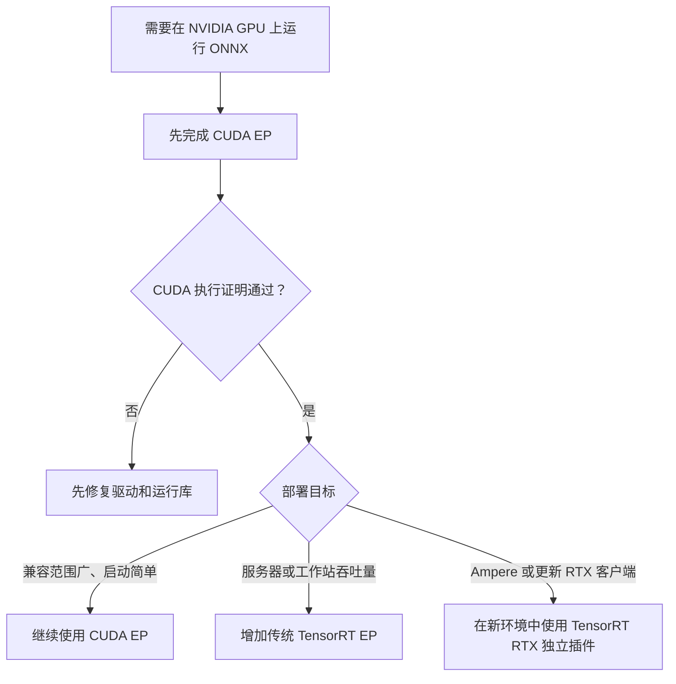
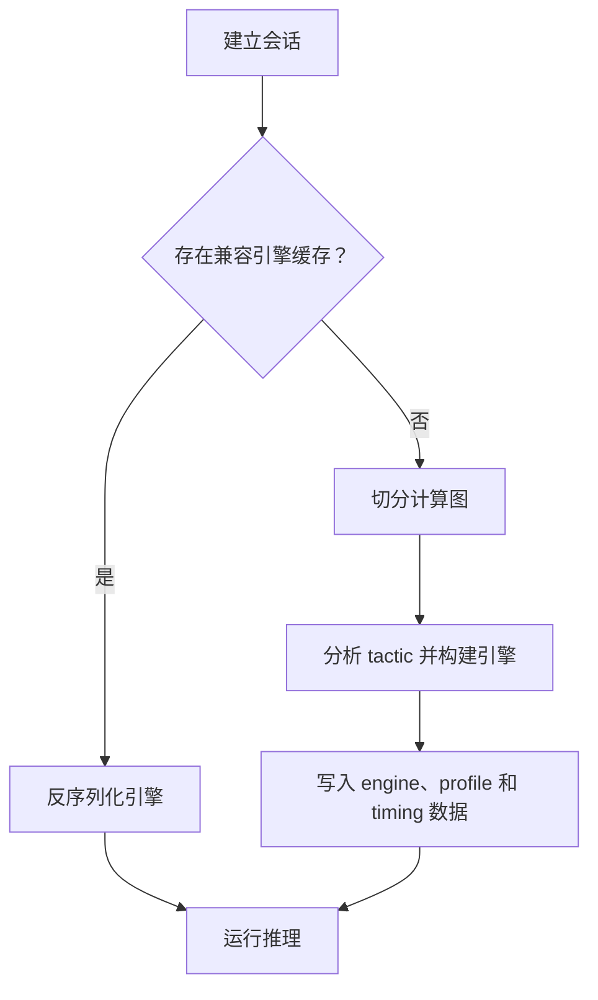
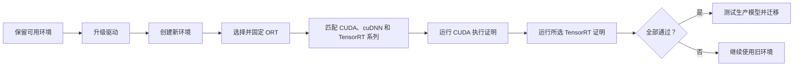

# ONNX Runtime + NVIDIA：CUDA 与 TensorRT

[English](README.md) · [仓库首页](../README.zh-CN.md)

| 项目 | 基线 |
|---|---|
| 元数据核对 | `2026-07-17` |
| 验证范围 | 上游发布/包元数据与兼容性约定；本机未重新执行 GPU 验证 |
| 主机 | Windows 10/11 x64、Ubuntu 22.04/24.04 x86-64 |
| 路线 | `CUDAExecutionProvider`、传统 `TensorrtExecutionProvider`、独立 `nv_tensorrt_rtx` 插件 |
| Runtime | PyPI ONNX Runtime 1.27.0、CUDA 13.3 Update 1、cuDNN 9.24.0.43、TensorRT 10.14.1.48、插件 0.3.0 |
| 上游动态 | ONNX Runtime 1.27.1 已发布 tag，但截至核对日期，PyPI 尚无对应 Python 核心包 |
| 验证入口 | [`provider_test.py`](provider_test.py) |
| 证明范围 | CPU 数值一致性、Fail-closed 回退策略与本次运行的 Provider Profile 事件 |

**硬件验证状态：**可用主机的 GPU 早于本指南要求的 Turing 下限，因此本次没有在本机执行更新后的 CUDA 13.3/cuDNN 9.24 组合。下文已核对依赖解析和官方 ABI 兼容性，但它们不能替代在目标 GPU 上运行严格证明。

### 文件

| 文件 | 用途 |
|---|---|
| `README.md` | 完整英文指南 |
| `README.zh-CN.md` | 本完整简体中文指南 |
| `provider_test.py` | 三条路线共用的严格执行证明测试 |
| `requirements-cuda.txt` | 固定版本 CUDA EP 环境 |
| `requirements-tensorrt.txt` | 固定版本传统 TensorRT EP 环境 |
| `requirements-tensorrt-rtx.txt` | 固定版本 TensorRT RTX 独立插件环境 |

## 1. 选择路线



| 路线 | 最适合 | 核心包 | 首次会话成本 | 主要可移植性规则 |
|---|---|---|---:|---|
| **CUDA EP** | 通用首选，NVIDIA 算子覆盖最广 | `onnxruntime-gpu` | 低 | 可在兼容 CUDA 系列内复用 |
| **传统 TensorRT EP** | 能接受引擎构建时间、追求吞吐量的服务器/工作站 | `onnxruntime-gpu` + 匹配 TensorRT | 数秒到数分钟 | 引擎取决于模型、ORT/TRT/CUDA、GPU、精度、选项和 shape profile |
| **TensorRT RTX 插件** | 支持的 Ampere 或更新 RTX 客户端电脑 | `onnxruntime` + 独立插件 | 首次 AOT/JIT 编译 | 使用独立包、API、选项、context 格式和 runtime cache |

即使最终使用 TensorRT，也必须先完成 CUDA。TensorRT 不一定自动更快；必须用生产模型、真实 shape、数据传输、预热、启动策略和精度模式实测。

## 2. 检查兼容性

### 2.1 固定组合

| 目标 | ONNX Runtime | NVIDIA 用户态组件 | Python | GPU 下限 | 驱动 |
|---|---|---|---:|---|---:|
| CUDA EP | `onnxruntime-gpu==1.27.0` | 选定的 `cuda-toolkit==13.3.1` 组件 + `nvidia-cudnn-cu13==9.24.0.43` | 3.11–3.14 x64 | Turing，计算能力 7.5+ | R580+ 兼容模式；建议 R610+ |
| 传统 TensorRT EP | 同一 CUDA 核心 | 上述组件 + TensorRT **10.14.1.48** | 3.11–3.13 x64 | TensorRT 支持的 Turing+ | R580+ 兼容模式；建议 R610+ |
| TensorRT RTX 默认插件 | `onnxruntime==1.27.0` + 插件 `0.3.0` | CUDA 13 变体；内置 TensorRT RTX 1.5 运行库 | 3.11–3.14 x64 | Ampere 或更新 **RTX**，通常 GeForce RTX 30+ | R580+ |
| TensorRT RTX CUDA 12 插件 | `onnxruntime==1.27.0` + `onnxruntime-ep-nv-tensorrt-rtx-cu12==0.3.0` | CUDA 12 变体；内置 TensorRT RTX 1.5 | 3.11–3.14 x64 | Ampere 或更新 RTX | Ampere/Ada 555.85+；Blackwell 570.00+ |

本指南覆盖原生 Windows 10/11 x64 与 Ubuntu 22.04/24.04 x86-64。Jetson 必须使用 JetPack 对应的软件包，不属于本桌面教程范围。本次只对 CUDA 与传统 TensorRT 两行进行了兼容性核对，没有执行 GPU 测试。

### 2.2 GPU 架构门槛

| 架构 | 计算能力 | CUDA 13 / 传统 TensorRT 基线 | TensorRT RTX 插件 |
|---|---:|---|---|
| Maxwell、Pascal、Volta | 低于 7.5 | **不支持**；需要专门选择旧版 ORT/CUDA 栈 | 不支持 |
| Turing：RTX 20、GTX 16、T4 | 7.5 | 支持 | 不支持；插件包要求 Ampere+ RTX |
| Ampere、Ada、Blackwell | 8.x–12.x | 支持 | 仅 RTX 型号，通常 GeForce RTX 30+ |

CUDA 13 编译器和关键库已经移除 Turing 之前的目标，ORT CUDA 13 构建从 `sm_75` 开始。仅升级驱动无法恢复用户态库已经不再提供的设备代码。

### 2.3 每个环境只能有一个 ORT 核心包

以下发行包都会提供名为 `onnxruntime` 的 Python 模块。一个虚拟环境中绝不能混装多个核心发行包。

| 场景 | 安装 | 不要同时安装 |
|---|---|---|
| CUDA 或传统 TensorRT | `onnxruntime-gpu` | 任何其他提供 `onnxruntime` 模块的包 |
| TensorRT RTX 独立插件 | `onnxruntime` + 插件 | `onnxruntime-gpu` |

独立插件必须使用另一个环境。传统 TensorRT 可在 CUDA 已通过的同一环境中安装。

### 2.4 重要的包索引更正

不要用下面命令替换仓库的固定依赖文件：

```text
onnxruntime-gpu[cuda,cudnn]==1.27.0
```

ORT 1.27 元数据仍通过已迁移的 `nvidia-*-cu13` 发行包名引用多数 CUDA 13 组件。NVIDIA 后来把这些组件移动到无后缀发行包，并把旧名称保留为 `0.0.1` 迁移占位包，因此截至元数据核对日期该 extra 已无法解析。本仓库改用 NVIDIA 当前的 `cuda-toolkit==13.3.1` 组件元包。

`ort.preload_dlls(directory="")` 会从 `site-packages/nvidia/...` 目录发现当前 wheel。包名迁移期间，`ort.print_debug_info()` 可能仍把旧发行包名显示为缺失；应以原生动态库加载错误和严格 profile 测试为最终判断。

### 2.5 为什么固定这些版本

- ONNX Runtime 1.27.1 是最新上游 tag，但截至核对日期，PyPI 尚未发布 `onnxruntime` 或 `onnxruntime-gpu` 1.27.1；1.27.0 仍是可安装的最新 Python 核心版本。
- ORT 1.27.0 GPU wheel 使用 CUDA 13.0 与 cuDNN 9.14.0.64 构建；发布说明已将 CUDA 12 标记为弃用。构建版本描述最低 ABI，并不要求冻结所有兼容的次版本运行库。
- `cuda-toolkit==13.3.1` 按 NVIDIA 当前的无后缀包名提供 CUDA 13.3 Update 1 组件。CUDA 13 在同一主版本的次版本之间保持二进制兼容。
- cuDNN 9.24.0 对使用更早 cuDNN 9 次版本构建的应用保持二进制向后兼容。其支持矩阵覆盖 CUDA 13.0–13.3，并建议使用 CUDA 13.3 以获得已调优性能。
- R580 是 CUDA 13 次版本兼容模式的驱动下限。CUDA 13.3 新功能或 CUDA 13.3 NVRTC 生成的 PTX 可能需要更新驱动，因此 R610+ 是更新后运行库的保守选择；严格证明仍是最终判断。
- ORT 1.27 传统 provider 构建使用 TensorRT 10.14.1.48。当前不固定版本的 `tensorrt-cu13` 是 11.1.0.106，不能直接替代 `nvinfer` 主版本 10。TensorRT 10.14 包接受 CUDA 13.x runtime（`>=13,<14`）。
- TensorRT 10.14 x86-64 binding wheel 只发布到 CPython 3.13，没有 3.14。
- 插件元包默认使用 CUDA 13，内置 TensorRT RTX 1.5 运行库，并建议注册名 `nv_tensorrt_rtx`。
- ORT 1.27 面向 ONNX 1.21 规范。本仓库只把 `onnx==1.22.0` 用作冒烟模型创作工具，并显式保存为 IR 10、opset 17。

## 3. 准备主机

### 3.1 检查硬件和操作系统

Windows 打开 **设备管理器 → 显示适配器**，记录准确 NVIDIA GPU 型号，然后运行：

```powershell
nvidia-smi
```

Ubuntu：

```bash
lspci | grep -i nvidia
uname -m
cat /etc/os-release
```

在 NVIDIA [CUDA GPU 列表](https://developer.nvidia.com/cuda-gpus)核对准确型号。本指南预期架构为 `x86_64`。

### 3.2 安装 NVIDIA 驱动

#### Windows 10/11

1. 从 [NVIDIA 驱动下载](https://www.nvidia.com/Download/index.aspx) 或 NVIDIA App 安装当前 Studio Driver 或 Game Ready Driver。
2. 重启 Windows。
3. 安装当前 [Microsoft Visual C++ x64 Redistributable](https://aka.ms/vs/17/release/vc_redist.x64.exe)。
4. 新开 PowerShell，确认 `nvidia-smi` 显示 580 或更新分支。

推荐 Python 推理路线不需要完整 CUDA Toolkit。笔记本应连接电源；若 Windows 选择集成显卡，请指定高性能 GPU。

#### Ubuntu 22.04/24.04

优先使用 Ubuntu 签名驱动包，尤其是启用 Secure Boot 时：

```bash
sudo apt update
sudo apt install -y ubuntu-drivers-common
ubuntu-drivers devices
sudo ubuntu-drivers install
sudo reboot
```

重启后：

```bash
nvidia-smi
nvidia-smi --query-gpu=name,driver_version,memory.total --format=csv,noheader
```

若 Secure Boot 要求 MOK，请在蓝色固件界面完成注册。不要混用 Ubuntu 包驱动与 NVIDIA `.run` 驱动；除非已经确认混合安装冲突，否则不要执行大范围 purge。

### 3.3 理解版本命令

| 命令 | 能证明 | 不能证明 |
|---|---|---|
| `nvidia-smi` | 驱动已加载、GPU 可见、驱动支持的最高 CUDA 级别 | 已安装 CUDA Toolkit |
| `nvcc --version` | `PATH` 中已选择开发 Toolkit 编译器 | ORT 能加载 CUDA/cuDNN |
| `ort.get_available_providers()` | 当前 ORT 构建暴露某个内置 EP | 原生依赖可加载、会话能建立或节点已执行 |
| 仓库 profile 证明 | 请求的 EP 确实执行了图节点 | 生产模型性能 |

### 3.4 安装 Python 并创建虚拟环境

新环境建议使用 64 位 Python 3.12 或 3.13。Ubuntu 22.04 默认 Python 3.10 太旧；请单独安装 Python 3.11+ 或使用 Conda，不要替换系统 Python。

Windows PowerShell：

```powershell
cd path\to\Tutorial-ONNX-Runtime-Execution-Providers
py -3.12 -m venv .venv-cuda
.\.venv-cuda\Scripts\Activate.ps1
python -m pip install --upgrade pip
```

若激活脚本被阻止，只执行一次 `Set-ExecutionPolicy -Scope CurrentUser RemoteSigned`，重开 PowerShell 后再激活。

Ubuntu：

```bash
cd /path/to/Tutorial-ONNX-Runtime-Execution-Providers
sudo apt install -y python3-venv zlib1g
python3 -m venv .venv-cuda
source .venv-cuda/bin/activate
python -m pip install --upgrade pip
```

<a id="cuda-ep"></a>
## 4. 路线 A — CUDA EP

CUDA EP 是最安全的通用起点。固定版本 Python 路线把 CUDA 用户态组件和 cuDNN 安装到虚拟环境，不会安装内核/显示驱动、编译器、头文件、Visual Studio 或 GCC。

### 4.1 安装固定依赖

在仓库根目录运行：

```bash
python -m pip uninstall -y onnxruntime onnxruntime-gpu
python -m pip install -r NVIDIA/requirements-cuda.txt
python -m pip check
```

环境包含：

| 包 | 固定版本 | 用途 |
|---|---:|---|
| `onnxruntime-gpu` | `1.27.0` | PyPI 最新 ORT CUDA 13 核心及内置 CUDA/传统 TensorRT provider |
| 选定的 `cuda-toolkit` extra | `13.3.1` | 二进制兼容的 CUDA 13.3 cuBLAS、runtime、cuFFT、cuRAND、nvJitLink、NVRTC |
| `nvidia-cudnn-cu13` | `9.24.0.43` | 支持 CUDA 13.3、二进制向后兼容的 cuDNN 9 runtime |
| `onnx` | `1.22.0` | 仅用于创作冒烟模型 |

### 4.2 验证暴露、加载和真实执行

预检查：

```bash
python -c "import onnxruntime as ort; ort.preload_dlls(directory=''); print(ort.__version__); print(ort.get_available_providers()); ort.print_debug_info()"
```

严格执行证明：

```bash
python NVIDIA/provider_test.py --provider cuda
```

测试会生成静态 FP32 ONNX 图、用独立 NumPy 计算参考值、建立 CUDA-only 会话、关闭 CPU 图回退与 ORT 自动回退、比较输出并解析本次 profile；只有 `CUDAExecutionProvider` 确实执行图节点才会以 `PASS` 结束。

### 4.3 严格应用配置

```python
import onnxruntime as ort

ort.preload_dlls(directory="")

providers = [
    (
        "CUDAExecutionProvider",
        {
            "device_id": 0,
            "do_copy_in_default_stream": True,
        },
    ),
]

options = ort.SessionOptions()
options.add_session_config_entry("session.disable_cpu_ep_fallback", "1")
session = ort.InferenceSession(
    "model.onnx",
    sess_options=options,
    providers=providers,
    enable_fallback=False,
)
print("Session providers:", session.get_providers())
outputs = session.run(None, {session.get_inputs()[0].name: input_array})
```

该配置采用 fail-closed 策略。生产应用可以主动加入其他 fallback provider，但那属于可用性策略，不能证明全 NVIDIA 执行。

### 4.4 安全 CUDA 选项

先使用默认值，每次只改一项，并用生产模型实测。

| 选项 | 起始值 | 含义 |
|---|---:|---|
| `device_id` | `0` | 从 0 开始的 GPU 索引 |
| `do_copy_in_default_stream` | `1` | 推荐的拷贝同步方式 |
| `gpu_mem_limit` | 实际无限制 | 只限制 ORT CUDA arena，不限制所有 CUDA 分配 |
| `arena_extend_strategy` | `kNextPowerOfTwo` | arena 增长策略 |
| `cudnn_conv_algo_search` | `EXHAUSTIVE` | 搜索卷积算法；首次运行可能较慢 |
| `cudnn_conv_use_max_workspace` | `1` | 可能提升卷积速度，也会增加峰值显存 |
| `use_tf32` | `1` | Ampere+ 上更快的 FP32 矩阵运算，尾数精度降低 |
| `prefer_nhwc` | `0` | 依赖具体卷积模型 |
| `enable_cuda_graph` | `0` | 高级功能；要求稳定 shape、固定地址和 I/O Binding |

不要照抄其他 GPU 的固定显存限制。普通推理未正确前不要开启 CUDA Graph。

### 4.5 可选完整 CUDA Toolkit 与 cuDNN

只做 Python 推理应跳过本节。只有需要 `nvcc`、samples、profiler、C++ 开发、源码构建或系统级原生应用时才安装完整 Toolkit。

Ubuntu 软件包示例；Ubuntu 22.04 把 `ubuntu2404` 改为 `ubuntu2204`：

```bash
distro="ubuntu2404"
arch="x86_64"
wget "https://developer.download.nvidia.com/compute/cuda/repos/${distro}/${arch}/cuda-keyring_1.1-1_all.deb"
sudo dpkg -i cuda-keyring_1.1-1_all.deb
sudo apt update
sudo apt install -y cuda-toolkit-13-3 zlib1g
sudo apt install -y cudnn9-cuda-13
```

开发工具需要 shell 路径时：

```bash
cat >> ~/.bashrc <<'EOF'
export CUDA_HOME=/usr/local/cuda
export PATH="$CUDA_HOME/bin${PATH:+:$PATH}"
EOF
source ~/.bashrc
nvcc --version
```

APT 动态库会注册到系统加载器，通常不需要 `LD_LIBRARY_PATH`。非标准 runfile/tar 安装只应前置一个匹配库目录，不能不断累积不兼容版本。

Windows 从 [CUDA Toolkit Archive](https://developer.nvidia.com/cuda-toolkit-archive)下载 CUDA 13.3 Update 1，单独安装当前 NVIDIA 驱动，只在需要时安装匹配 cuDNN 9，并在新终端验证 `nvcc --version` 与 `nvidia-smi`。CUDA 13.1 及更新版本不再内置 Windows 显示驱动。现代 CUDA 不需要旧 `libnvvp` 路径。

### 4.6 CUDA 故障排查

| 现象 | 常见原因 | 正确处理 |
|---|---|---|
| `nvidia-smi` 不存在或失败 | 驱动缺失、内核模块未加载或 Secure Boot 拒绝 | 先修复驱动，再排查 Python |
| 驱动低于 R580 分支 | CUDA 13 运行库比驱动系列新 | 升级驱动，或有计划地选择受支持 CUDA 12 栈 |
| R580 驱动在 NVRTC/PTX 路径失败 | CUDA 13.3 生成的 PTX 或新功能超出次版本兼容模式 | 升级到 R610+，或恢复 CUDA 13.0 运行库组合，然后重跑严格证明 |
| EP 列表只有 CPU | 核心包错误、原生库加载失败或 GPU 早于 Turing | 重建 venv、安装固定依赖、核对 `sm_75+`、运行 debug info |
| 缺少 `libcudnn.so.9` / `cudnn64_9.dll` | cuDNN wheel 缺失或不可发现 | 重装 CUDA 依赖并调用 `preload_dlls(directory="")` |
| 缺少 `libcublas.so.13` / CUDA DLL | 运行库 wheel 缺失或旧路径优先 | 重装固定依赖，从当前进程移除错误路径 |
| 模型 IR 版本不受支持 | 导出器写入比 ORT 更新的 IR | 升级 ORT 或导出兼容 IR/opset |
| 显存不足 | 模型/输入、其他进程或 workspace 超限 | 查 `nvidia-smi`，减小 batch/shape，再调 arena/workspace |
| 存在微小 FP 误差 | TF32 或浮点归约顺序不同 | 使用容差；只有确有要求时关闭 TF32 |
| 小模型 GPU 更慢 | 传输和启动开销占主导 | 预热并测试真实负载，再考虑 I/O Binding |
| WSL 看不到 GPU | Windows 主机驱动或 WSL 配置问题 | 在 Windows 安装支持 WSL 的驱动；不要在 WSL 内安装 Linux 内核驱动 |

<a id="tensorrt-ep"></a>
## 5. 路线 B — 传统 TensorRT EP

传统 `TensorrtExecutionProvider` 会切分计算图，把支持的子图编译成 TensorRT 引擎，其余 NVIDIA 支持的工作交给 CUDA。必须先完成 CUDA 执行证明。它不是 TensorRT RTX 独立插件。

### 5.1 安装准确 TensorRT 系列

使用 Python 3.11–3.13，激活已经通过 CUDA 的环境：

```bash
python -m pip uninstall -y onnxruntime onnxruntime-gpu tensorrt tensorrt-cu12 tensorrt-cu13
python -m pip install --upgrade pip
python -m pip install -r NVIDIA/requirements-tensorrt.txt
python -m pip check
```

本环境绝不能执行无版本 TensorRT 升级。ORT 1.27 加载 TensorRT 主版本 10 动态库；TensorRT 11 与该 ABI 不兼容。

检查：

```bash
python -c "import tensorrt as trt; import onnxruntime as ort; ort.preload_dlls(directory=''); print('TensorRT:', trt.__version__); print('ORT:', ort.__version__); print(ort.get_available_providers())"
```

关键预期项：TensorRT `10.14.1.48`、ORT `1.27.0`、`TensorrtExecutionProvider` 与 `CUDAExecutionProvider`。

### 5.2 运行严格执行证明

```bash
python NVIDIA/provider_test.py --provider tensorrt
```

首次运行构建引擎，明显较慢属于正常现象。测试使用 TensorRT → CUDA 优先级，关闭 CPU 和自动回退，把 engine/timing cache 写入当前用户缓存目录，以 NumPy 核对数值，并要求 profile 中存在 TensorRT 节点。

FP32 通过后，才使用代表性精度标准评估内部 FP16：

```bash
python NVIDIA/provider_test.py --provider tensorrt --fp16
```

### 5.3 正确应用配置

```python
from pathlib import Path

import tensorrt  # 在 ORT 前加载 pip 管理的 TensorRT 10 动态库。
import onnxruntime as ort

ort.preload_dlls(directory="")

cache_dir = Path.home() / ".cache" / "my_app" / "tensorrt"
cache_dir.mkdir(parents=True, exist_ok=True)

trt_options = {
    "device_id": 0,
    "trt_engine_cache_enable": True,
    "trt_engine_cache_path": str(cache_dir),
    "trt_engine_cache_prefix": "my_model_v1",
    "trt_timing_cache_enable": True,
    "trt_timing_cache_path": str(cache_dir),
    "trt_force_timing_cache": False,
    "trt_max_workspace_size": 2 * 1024**3,
    "trt_fp16_enable": False,
    "trt_bf16_enable": False,
    "trt_int8_enable": False,
    "trt_dla_enable": False,
    "trt_sparsity_enable": False,
    "trt_cuda_graph_enable": False,
}

providers = [
    ("TensorrtExecutionProvider", trt_options),
    ("CUDAExecutionProvider", {"device_id": 0}),
]

options = ort.SessionOptions()
options.add_session_config_entry("session.disable_cpu_ep_fallback", "1")
session = ort.InferenceSession(
    "model.onnx",
    sess_options=options,
    providers=providers,
    enable_fallback=False,
)
print("Session providers:", session.get_providers())
outputs = session.run(None, {session.get_inputs()[0].name: input_array})
```

TensorRT 未接受的子图由 CUDA 执行仍属于 NVIDIA 执行，并会出现在 profile 中；任何 CPU 图分配都会使该严格配置失败。

### 5.4 安全 TensorRT 选项

| 选项 | ORT 1.27 默认值 | 起始策略 | 说明 |
|---|---:|---:|---|
| `device_id` | `0` | 目标 GPU 索引 | CUDA 设备从 0 编号 |
| `trt_max_workspace_size` | `0`，最多可用设备内存 | 显式 1–2 GiB 后实测 | 避免初始 builder 策略不受约束 |
| `trt_fp16_enable` | `False` | `False` | FP32 与业务精度通过后再开 |
| `trt_bf16_enable` | `False` | `False` | 依赖 Ampere+ 和模型 |
| `trt_int8_enable` | `False` | `False` | 需要 QDQ 或有效校准流程 |
| `trt_engine_cache_enable` | `False` | 稳定生产输入为 `True` | 避免兼容引擎重复构建 |
| `trt_engine_cache_path` | 当前目录 | 应用专属可写目录 | 不要混放无关模型/配置 |
| `trt_engine_cache_prefix` | 空 | 稳定模型/版本标识 | 避免缓存名含义不清 |
| `trt_timing_cache_enable` | `False` | `True` | 复用 tactic timing |
| `trt_force_timing_cache` | `False` | `False` | 默认绝不强制不匹配缓存 |
| `trt_builder_optimization_level` | `3` | `3` | 较低值构建更快但可能降低运行速度 |
| `trt_auxiliary_streams` | `-1` heuristic | 保持默认 | 更重视省显存时可设 `0` |
| `trt_sparsity_enable` | `False` | `False` | 不会自动剪枝稠密权重 |
| `trt_dla_enable` | `False` | `False` | 普通桌面 RTX 没有 DLA |
| `trt_cuda_graph_enable` | `False` | `False` | 高级固定 shape/地址工作流 |
| `trt_dump_subgraphs` | `False` | 仅诊断 | 导出 parser 子图供 `trtexec` 检查 |
| `trt_dump_ep_context_model` | `False` | `False` | 高级部署打包功能 |

照抄 64 GiB workspace、强制 timing cache、无条件 DLA、稀疏或 context dump 都不是安全的新手默认值。

### 5.5 动态输入 profile

输入名为 `images`，shape 为 `[batch, 3, height, width]`：

```python
trt_options.update(
    {
        "trt_profile_min_shapes": "images:1x3x224x224",
        "trt_profile_opt_shapes": "images:4x3x512x512",
        "trt_profile_max_shapes": "images:8x3x1024x1024",
    }
)
```

必须使用准确 ONNX 输入名；min/opt/max 一起提供；每个动态输入都出现在三条配置中；每一维满足 $min \le opt \le max$；范围只覆盖业务所需；复用引擎缓存时继续使用相同 profile。

### 5.6 缓存生命周期



| 产物 | 收益 | 可移植性 |
|---|---|---|
| Timing cache | 加快构建时 tactic 选择 | 首选同型号 GPU；相同计算能力可能可用 |
| Engine cache | 跳过大部分引擎构建 | 通常绑定模型、选项、ORT/TRT/CUDA 和 GPU |
| EP context 模型 | 引用或包含已编译 context | 有严格兼容和安全规则的高级产物 |

图/权重、输入名、模型版本、ORT、TensorRT、CUDA 主版本、GPU 架构、精度、workspace、动态 profile、插件库或切图选项变化后，应删除旧 engine/profile/timing 数据。`trt_engine_hw_compatible=1` 可扩大 Ampere+ 复用范围但可能降低性能，不能让引擎普遍可移植。不要把硬件相关缓存当作通用模型提交。

### 5.7 可选原生 TensorRT

本仓库固定 pip 路线已经足够。只有需要 C++ 头文件、动态库或 `trtexec` 时才安装原生 TensorRT；同一进程绝不能看到另一个 TensorRT 主版本。

Ubuntu 下载匹配系统、x86-64、CUDA 13 的 TensorRT **10.14.1** 本地软件源包，并使用实际文件名：

```bash
sudo dpkg -i nv-tensorrt-local-repo-*.deb
sudo cp /var/nv-tensorrt-local-repo-*/*-keyring.gpg /usr/share/keyrings/
sudo apt update
sudo apt install -y tensorrt
dpkg-query -W 'tensorrt*' 'libnvinfer*'
command -v trtexec && trtexec --version
```

第一个 `.deb` 只注册软件源；真正安装由 `apt install tensorrt` 完成。

Windows 把匹配 CUDA 13 的 TensorRT 10.14.1 ZIP 解压到版本化目录，将 `lib` 和 `bin` 加入用户 `Path`，新开 PowerShell 运行 `trtexec.exe --version`。不要把随机 DLL 复制到系统目录。

### 5.8 传统 TensorRT 故障排查

| 现象 | 常见原因 | 正确处理 |
|---|---|---|
| CUDA 通过但 TensorRT EP 不存在 | TensorRT 10 库缺失或不可发现 | 安装准确固定版本，先导入 `tensorrt`，检查加载路径 |
| 缺少 `libnvinfer.so.10` / `nvinfer_10.dll` | 运行库错误或不完整 | 重装 10.14.1；绝不能重命名 TensorRT 11 动态库 |
| `tensorrt.__version__` 为 11.x | 无版本升级替换了主版本 10 | 用 `10.14.1.48.post1` 重建或修复环境 |
| 首次会话耗时数分钟 | 正常 tactic 分析和引擎构建 | 保留应用专属 engine/timing cache |
| 每个进程都重建 | 缓存不可写、模型/选项/profile 变化或 shape 越界 | 修复权限并固定模型、选项和 profile |
| Profile 只有 CUDA | TensorRT 拒绝计算图或没有支持子图 | 开 info 日志和临时子图 dump，用 `trtexec` 检查 |
| 动态 profile 报错 | 输入名/rank 错误或三组配置不完整 | 检查真实输入元数据并提供全部三项 |
| 桌面 GPU 报 DLA 错误 | 在不支持的硬件上开启 DLA | 保持 `trt_dla_enable=0` |
| 构建显存不足 | workspace、模型、profile 或其他进程超出 VRAM | 减小 workspace/batch/range 并关闭其他 GPU 负载 |
| 低精度准确率变化 | FP16/BF16 的正常影响 | 回到 FP32，再按代表性任务指标验证 |

<a id="tensorrt-rtx"></a>
## 6. 路线 C — TensorRT RTX EP ABI 独立插件

该插件面向现代 RTX PC 客户端应用，不是传统 `TensorrtExecutionProvider`。它使用不同的核心包、动态注册 API、EP 设备发现、provider 选项、context 格式和 runtime cache。名称相近的内置 `NvTensorRTRTXExecutionProvider` 已弃用。

插件 0.3.0 在 PyPI 标为 Alpha。必须固定版本、验证生产模型并保留可用环境。自动生成的 ORT 页面可能仍说包管理器安装“即将提供”；本路线应以 NVIDIA 插件发布页和实时包元数据为准。

### 6.1 创建独立环境并安装

Windows：

```powershell
py -3.12 -m venv .venv-trt-rtx
.\.venv-trt-rtx\Scripts\Activate.ps1
python -m pip install --upgrade pip
```

Ubuntu：

```bash
python3 -m venv .venv-trt-rtx
source .venv-trt-rtx/bin/activate
python -m pip install --upgrade pip
```

安装默认 CUDA 13 变体：

```bash
python -m pip uninstall -y onnxruntime onnxruntime-gpu
python -m pip install -r NVIDIA/requirements-tensorrt-rtx.txt
python -m pip check
```

wheel 内置 TensorRT RTX 运行库与 EP 动态库，但不安装 NVIDIA 内核/显示驱动。只有源码构建时才需要完整 CUDA Toolkit 与 TensorRT RTX SDK。

可选 CUDA 12 变体：

```bash
python -m pip install "onnxruntime==1.27.0" "onnxruntime-ep-nv-tensorrt-rtx-cu12==0.3.0" "onnx==1.22.0"
```

CUDA 12 和 CUDA 13 变体不能同时安装；`-cu12` 是包名的一部分，不是版本号。CUDA 12 通用驱动下限虽为 525，但插件 0.3.0 对 Ampere/Ada 至少要求 555.85、Blackwell 至少 570.00；应优先使用当前生产驱动。

### 6.2 注册插件并发现设备

动态 EP ABI 插件不能只看 `get_available_providers()`。应先注册，再检查 `get_ep_devices()`：

```python
import onnxruntime as ort
import onnxruntime_ep_nv_tensorrt_rtx as trt_ep

name = trt_ep.get_ep_name()
ort.register_execution_provider_library(name, trt_ep.get_library_path())
try:
    devices = [device for device in ort.get_ep_devices() if device.ep_name == name]
    print("Plugin:", name)
    print("Compatible devices:", len(devices))
    for index, device in enumerate(devices):
        print(
            index,
            device.ep_options.get("device_id", index),
            device.ep_vendor,
            device.device.vendor,
            device.device.metadata,
        )
finally:
    ort.unregister_execution_provider_library(name)
```

辅助模块当前建议名称 `nv_tensorrt_rtx`。注册名由应用提供，并成为 EP device/profile 名称。仅凭拼写不能证明使用的是独立插件还是已弃用内置实现。

### 6.3 运行严格执行证明

```bash
python NVIDIA/provider_test.py --provider nv_tensorrt_rtx
```

测试会注册插件、选择兼容 EP 设备、为安全冒烟测试关闭 CUDA Graph、关闭 CPU 图回退、用 NumPy 核对结果并解析 profile。只注册成功但没有插件节点执行不能算通过。

### 6.4 正确应用代码与清理

```python
import gc
import traceback
from pathlib import Path

import onnxruntime as ort
import onnxruntime_ep_nv_tensorrt_rtx as trt_ep

cache_dir = Path.home() / ".cache" / "my_app" / "trt_rtx"
cache_dir.mkdir(parents=True, exist_ok=True)

registration_name = trt_ep.get_ep_name()
ort.register_execution_provider_library(
    registration_name,
    trt_ep.get_library_path(),
)

session = None
pending_error = None
try:
    devices = [
        device
        for device in ort.get_ep_devices()
        if device.ep_name == registration_name
    ]
    if not devices:
        raise RuntimeError("No compatible TensorRT RTX EP device was found")

    devices_by_id = {
        int(device.ep_options.get("device_id", index)): device
        for index, device in enumerate(devices)
    }
    device_id = 0
    if device_id not in devices_by_id:
        raise RuntimeError(f"Available device IDs: {sorted(devices_by_id)}")

    session_options = ort.SessionOptions()
    session_options.add_session_config_entry(
        "session.disable_cpu_ep_fallback", "1"
    )
    session_options.add_provider_for_devices(
        [devices_by_id[device_id]],
        {
            "enable_cuda_graph": "0",
            "nv_runtime_cache_path": str(cache_dir),
        },
    )

    session = ort.InferenceSession(
        "model.onnx",
        sess_options=session_options,
        enable_fallback=False,
    )
    outputs = session.run(
        None,
        {session.get_inputs()[0].name: input_array},
    )
except BaseException as exc:
    pending_error = exc
    traceback.clear_frames(exc.__traceback__)
    raise
finally:
    del session
    gc.collect()
    try:
        ort.unregister_execution_provider_library(registration_name)
    except Exception:
        if pending_error is None:
            raise
```

注销动态库前必须销毁所有使用插件的会话。错误 traceback 可能保留会话引用，因此失败路径应清理已完成 frame。长期应用可在启动时注册一次，只在最终退出时注销。

### 6.5 安全插件选项

provider option 值使用字符串；布尔值可写 `0`/`1`、`false`/`true` 或 `False`/`True`。

| 选项 | 起始值 | 含义 |
|---|---:|---|
| `device_id` | 已枚举 EP 设备 | 优先发现设备，不要猜 ordinal |
| `has_user_compute_stream` / `user_compute_stream` | `0` / 未设置 | 高级互操作；stream 是原生 CUDA stream 地址 |
| `enable_cuda_graph` | 验证时 `0` | 只有 shape、地址和重复执行稳定后才开启 |
| `nv_max_workspace_size` | `0` 自动 | 只有明确测得显存要求时才设字节上限 |
| `nv_dump_subgraphs` | `0` | 临时 parser/切图诊断 |
| `nv_detailed_build_log` | `0` | 临时编译诊断 |
| `nv_runtime_cache_path` | 应用专属可写路径 | 复用目标 GPU JIT kernel |
| `nv_profile_min_shapes` | 空/自动 | 与 opt/max 一起控制动态 shape |
| `nv_profile_opt_shapes` | 空/自动 | 最具代表性的 shape |
| `nv_profile_max_shapes` | 空/自动 | 最大支持 shape |
| `nv_multi_profile_enable` | `0` | 只有多个显式 profile 时开启 |
| `nv_use_external_data_initializer` | `1` | 适用时使用外部数据 initializer 路径 |
| `nv_weight_streaming_budget` | `0`，关闭 | `-1` 自动；`1` 最低显存；bytes、二进制 `B/K/M/G` 或常驻百分比 |
| `nv_max_shared_mem_size` | `0` 自动 | 只有确认约束时才限制 kernel 共享内存 |
| `nv_op_types_to_exclude` | 空 | 逗号分隔、刻意留给其他 EP 的 ONNX 算子类型 |

权重流式传输中，只有裸 `0` 表示关闭；`0B` 与 `0%` 会启用最低显存模式。`1M` 表示 $2^{20}$ 常驻字节。初始应关闭，实测显存、构建时间和稳定延迟后再修改。

EP context 输出使用 ORT 通用 session entry，而不是杜撰的 `nv_*` 选项：`ep.context_enable`、`ep.context_file_path`、`ep.context_embed_mode`。插件 0.3.0 会拒绝未知 provider option。

### 6.6 动态 shape

```python
session_options.add_provider_for_devices(
    [devices[0]],
    {
        "enable_cuda_graph": "0",
        "nv_profile_min_shapes": "images:1x3x224x224",
        "nv_profile_opt_shapes": "images:4x3x512x512",
        "nv_profile_max_shapes": "images:8x3x1024x1024",
    },
)
```

使用准确输入名；三组 profile 一起提供；包含每个动态输入；满足 $min \le opt \le max$；范围保持最小；shape 或绑定地址变化时关闭 CUDA Graph。

### 6.7 EP context 与 runtime cache


- **EP context 模型**保存 TensorRT RTX 专用编译表示，不能普遍替代原始模型；
- 目标端 **JIT** 会针对准确 GPU 特化；
- **Runtime cache** 保存生成的 kernel，不保存原始图和权重。

基础编译：

```python
session_options = ort.SessionOptions()
session_options.add_provider_for_devices([devices[0]], {"enable_cuda_graph": "0"})
compiler = ort.ModelCompiler(session_options, "model.onnx")
compiler.compile_to_file("model_ctx.onnx")
```

应保留原始模型；插件、运行库、模型或目标发生不兼容变化后重建 context/cache。模型超过 2 GiB 时使用外部 EP-context 数据，不要把巨大二进制嵌入 protobuf。

### 6.8 TensorRT RTX 故障排查

| 现象 | 常见原因 | 正确处理 |
|---|---|---|
| 无法导入插件辅助模块 | 当前环境未安装插件 | 检查 `python -m pip show`，必要时重建 venv |
| 注册时报缺少 DLL/SO | wheel 不完整、文件被拦截、缺 MSVC 运行库或加载冲突 | 干净重装；Windows 安装 VC++ 运行库；查看加载错误 |
| 没有兼容 EP 设备 | GPU 早于 Ampere、驱动旧、系统/架构不支持或 CUDA 变体错误 | 核对 RTX 型号、驱动、x64 与 cu13/cu12 选择 |
| 已安装 `onnxruntime-gpu` | 独立插件使用了错误核心包 | 删除它，安装普通 `onnxruntime==1.27.0` |
| Profile 没有插件节点 | 图未被接受或插件没有获得工作 | 开详细日志/子图 dump，并从静态 FP32 开始 |
| 首次会话很慢 | 正常 JIT/context 编译 | 配置应用专属 runtime cache，再测另一个干净进程 |
| 输入变化触发 CUDA Graph 错误 | 捕获后的地址或 shape 变化 | 关闭 CUDA Graph，或使用稳定 I/O Binding 缓冲区 |
| 升级后缓存不再生效 | context/runtime 兼容性变化 | 只清除该应用旧缓存并重建 |
| 注销失败或崩溃 | 活动会话仍引用插件 | 销毁 session/binding，清理保留引用后再注销 |

## 7. 理解验证结果

从仓库根目录运行：

| 路线 | 命令 |
|---|---|
| CUDA | `python NVIDIA/provider_test.py --provider cuda` |
| 传统 TensorRT | `python NVIDIA/provider_test.py --provider tensorrt` |
| 传统 TensorRT FP16 实验 | `python NVIDIA/provider_test.py --provider tensorrt --fp16` |
| TensorRT RTX 插件 | `python NVIDIA/provider_test.py --provider nv_tensorrt_rtx` |

常用通用参数包括 `--device-id`、`--warmups`、`--runs`、`--cache-dir`、`--workspace-mb` 和 `--verbose`。

三层检查回答不同问题：

1. `get_available_providers()` 说明当前 ORT 构建暴露哪些内置能力；
2. `session.get_providers()` 说明本会话注册了哪些 provider；
3. profile 节点事件证明计算图实际在哪里执行。

仓库测试强制检查第 3 层，以独立 NumPy 数学为参考，关闭 ORT 自动回退和 CPU 图回退，并拒绝非预期 provider。传统 TensorRT 只允许 CUDA 作为第二 EP。EP 名称出现在列表中不是执行证明。

## 8. 安全升级



保存 `python --version`、`pip freeze`、`nvidia-smi`、provider 列表、profile 证据和生产模型选项。绝不能同时在生产环境中原地升级 CUDA、cuDNN、TensorRT、ORT 和应用。不兼容内容变化后，删除对应 engine、timing、runtime 与 EP-context 缓存。

## 9. 参考资料

- [ONNX Runtime 1.27.0 Python 发布](https://github.com/microsoft/onnxruntime/releases/tag/v1.27.0)
- [ONNX Runtime 1.27.1 上游补丁发布](https://github.com/microsoft/onnxruntime/releases/tag/v1.27.1)
- [ONNX Runtime 1.27.0 PyPI 元数据](https://pypi.org/pypi/onnxruntime-gpu/1.27.0/json)
- [ORT 1.27 GPU 构建变量](https://github.com/microsoft/onnxruntime/blob/v1.27.0/tools/ci_build/github/azure-pipelines/templates/common-variables.yml)
- [ONNX Runtime 安装](https://onnxruntime.ai/docs/install/)
- [ORT 模型兼容性](https://onnxruntime.ai/docs/reference/compatibility.html)
- [CUDA EP 文档](https://onnxruntime.ai/docs/execution-providers/CUDA-ExecutionProvider.html)
- [传统 TensorRT EP 文档](https://onnxruntime.ai/docs/execution-providers/TensorRT-ExecutionProvider.html)
- [TensorRT RTX EP 文档](https://onnxruntime.ai/docs/execution-providers/TensorRTRTX-ExecutionProvider.html)
- [ONNX Runtime 插件 EP 动态库](https://onnxruntime.ai/docs/execution-providers/plugin-ep-libraries/)
- [TensorRT RTX EP ABI 独立插件仓库](https://github.com/NVIDIA/TensorRT-RTX-EP-ABI)
- [插件 0.3.0 发布](https://github.com/NVIDIA/TensorRT-RTX-EP-ABI/releases/tag/v0.3.0)
- [插件 0.3.0 CUDA 13 wheel 元数据](https://pypi.org/pypi/onnxruntime-ep-nv-tensorrt-rtx-cu13/0.3.0/json)
- [CUDA Toolkit 13.3.1 Python 元数据](https://pypi.org/pypi/cuda-toolkit/13.3.1/json)
- [CUDA Toolkit 13.3 发布说明](https://docs.nvidia.com/cuda/cuda-toolkit-release-notes/)
- [cuDNN CUDA 13 9.24.0.43 元数据](https://pypi.org/pypi/nvidia-cudnn-cu13/9.24.0.43/json)
- [cuDNN 支持矩阵](https://docs.nvidia.com/deeplearning/cudnn/backend/latest/reference/support-matrix.html)
- [cuDNN API 兼容性](https://docs.nvidia.com/deeplearning/cudnn/backend/latest/developer/forward-compatibility.html)
- [TensorRT CUDA 13 10.14.1.48.post1 元数据](https://pypi.org/pypi/tensorrt-cu13/10.14.1.48.post1/json)
- [NVIDIA CUDA GPU 列表](https://developer.nvidia.com/cuda-gpus)
- [NVIDIA CUDA 兼容性](https://docs.nvidia.com/deploy/cuda-compatibility/minor-version-compatibility.html)
- [Windows CUDA 安装](https://docs.nvidia.com/cuda/cuda-installation-guide-microsoft-windows/)
- [Linux CUDA 安装](https://docs.nvidia.com/cuda/cuda-installation-guide-linux/)
- [NVIDIA cuDNN 安装](https://docs.nvidia.com/deeplearning/cudnn/installation/latest/)
- [NVIDIA TensorRT 安装](https://docs.nvidia.com/deeplearning/tensorrt/latest/installing-tensorrt/installing.html)
- [NVIDIA TensorRT 支持矩阵](https://docs.nvidia.com/deeplearning/tensorrt/latest/getting-started/support-matrix.html)
- [TensorRT RTX 前置要求](https://docs.nvidia.com/deeplearning/tensorrt-rtx/latest/installing-tensorrt-rtx/prerequisites.html)
- [TensorRT RTX 支持矩阵](https://docs.nvidia.com/deeplearning/tensorrt-rtx/latest/getting-started/support-matrix.html)
