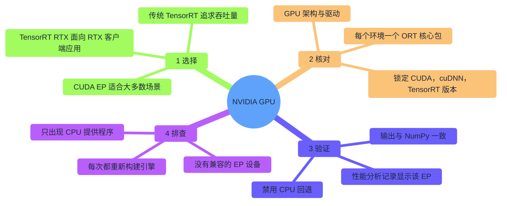
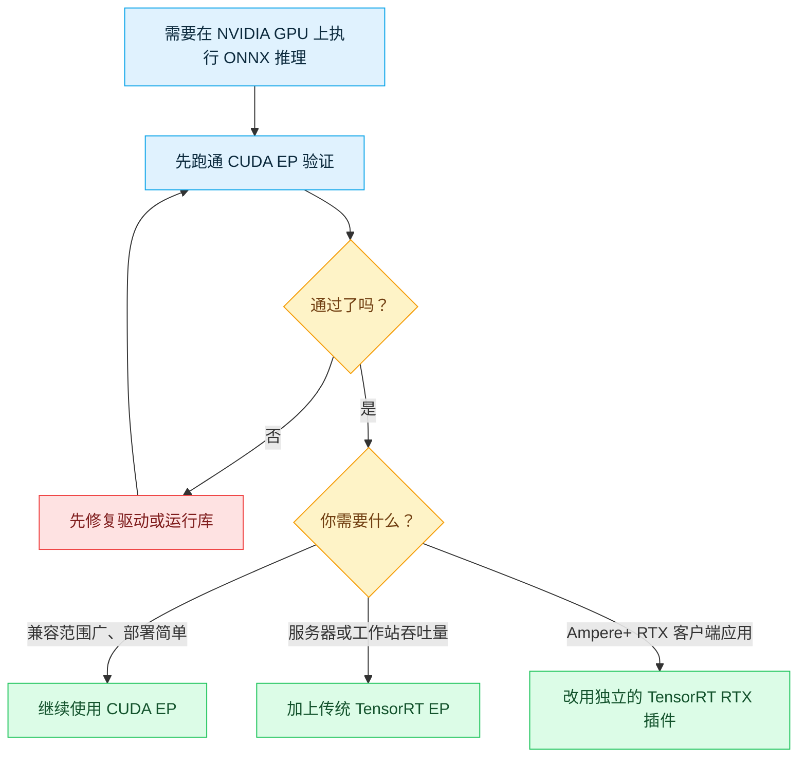
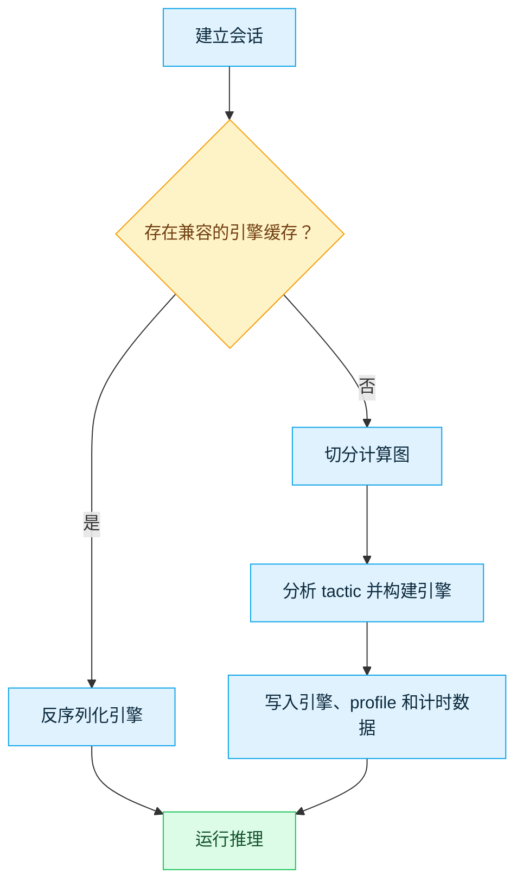
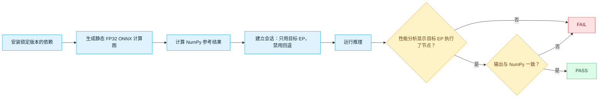

# ONNX Runtime + NVIDIA：CUDA 与 TensorRT

[English](README.md) · [仓库首页](../README.md)

通过 **CUDA**、**传统 TensorRT** 或更新的 **TensorRT RTX** 插件，在 NVIDIA GPU 上运行 ONNX 模型——并且*证明* GPU 真正执行了计算图，而不只是提供程序加载成功。

```bash
# 最快路径：在 Windows 10/11 x64 或 Ubuntu 22.04/24.04 x86-64 上验证 CUDA EP
python -m pip install -r NVIDIA/requirements-cuda.txt
python NVIDIA/provider_test.py --provider cuda
```

| 你的情况 | 前往 |
|---|---|
| 不确定该选哪种方案 | [§1 选择运行方式](#1-选择运行方式) |
| 不确定自己的 GPU / 驱动是否达标 | [§2 检查兼容性](#2-检查兼容性) |
| 准备安装并运行验证 | [§4 CUDA](#cuda-ep) · [§5 传统 TensorRT](#tensorrt-ep) · [§6 TensorRT RTX](#tensorrt-rtx) |
| 遇到了问题 | 每种方案末尾都有专属的故障排查表 |
| 想搞清楚 `PASS` 到底证明了什么 | [§7 解读验证结果](#7-解读验证结果) |

| 项目 | 基线 |
|---|---|
| 资料核验日期 | `2026-07-17` |
| 支持平台 | Windows 10/11 x64 · Ubuntu 22.04/24.04 x86-64 |
| 运行方式 | `CUDAExecutionProvider` · 传统 `TensorrtExecutionProvider` · 独立 `nv_tensorrt_rtx` 插件 |
| 锁定版本 | ORT `1.27.0`（PyPI）· CUDA `13.3 Update 1` · cuDNN `9.24.0.43` · TensorRT `10.14.1.48` · 插件 `0.3.0` |
| 上游动态 | ORT `1.27.1` 已打上版本标签，但截至核验日期 PyPI 尚未提供其 Python 核心包 |
| 验证脚本 | [`provider_test.py`](provider_test.py) |
| 验证方式 | 与 CPU 结果的数值一致性 + 禁用回退的失败策略 + 本次运行的性能分析证据 |

> [!NOTE]
> 本次核验**没有在真实 GPU 硬件上重新跑通**更新后的 CUDA 13.3 / cuDNN 9.24 组合——当前可用主机的架构早于本指南要求的 Turing 门槛。已核对依赖解析结果和官方 ABI 兼容性声明，但只有在你自己的目标 GPU 上跑通严格验证才是最终定论。

### 文件说明

| 文件 | 用途 |
|---|---|
| [`README.md`](README.md) | 英文完整指南 |
| [`README.zh-CN.md`](README.zh-CN.md) | 本简体中文翻译 |
| [`provider_test.py`](provider_test.py) | 三种运行方式共用的严格验证脚本 |
| [`requirements-cuda.txt`](requirements-cuda.txt) | 锁定版本的 CUDA EP 环境依赖 |
| [`requirements-tensorrt.txt`](requirements-tensorrt.txt) | 锁定版本的传统 TensorRT EP 环境依赖 |
| [`requirements-tensorrt-rtx.txt`](requirements-tensorrt-rtx.txt) | 锁定版本的独立 TensorRT RTX 插件环境依赖 |

## 目录

- [1. 选择运行方式](#1-选择运行方式)
- [2. 检查兼容性](#2-检查兼容性)
- [3. 准备主机](#3-准备主机)
- [4. 方案 A：CUDA EP](#cuda-ep)
- [5. 方案 B：传统 TensorRT EP](#tensorrt-ep)
- [6. 方案 C：独立的 TensorRT RTX 插件](#tensorrt-rtx)
- [7. 解读验证结果](#7-解读验证结果)
- [8. 安全升级](#8-安全升级)
- [9. 参考资料](#9-参考资料)



## 1. 选择运行方式



| 运行方式 | 适用场景 | 核心包 | 首次运行开销 | 可移植性 |
|---|---|---|---:|---|
| **CUDA EP** | 默认首选，NVIDIA 算子覆盖最广 | `onnxruntime-gpu` | 低 | 可在兼容的 CUDA 系列内复用 |
| **传统 TensorRT EP** | 服务器 / 工作站追求吞吐量 | `onnxruntime-gpu` + 匹配版本的 TensorRT | 数秒到数分钟 | 引擎与模型、ORT/TRT/CUDA、GPU、精度、选项和输入形状绑定 |
| **TensorRT RTX 插件** | Ampere 及更新 RTX 客户端应用 | `onnxruntime` + 独立插件 | 首次使用需要 AOT/JIT 编译 | 拥有自己的软件包、API、选项、context 格式和 runtime cache |

即使最终目标是 TensorRT，也请先跑通 CUDA 验证——TensorRT 不一定更快。请用你的真实模型、输入形状、数据传输、预热过程和精度模式实测后再做决定。

## 2. 检查兼容性

### 2.1 锁定版本组合

| 目标 | ONNX Runtime | NVIDIA 组件 | Python | GPU 门槛 | 驱动 |
|---|---|---|---:|---|---:|
| CUDA EP | `onnxruntime-gpu==1.27.0` | `cuda-toolkit==13.3.1` 组件 + `nvidia-cudnn-cu13==9.24.0.43` | 3.11–3.14 x64 | Turing，计算能力 7.5+ | R580+（推荐 R610+） |
| 传统 TensorRT EP | 同一 CUDA 核心 | 以上组件 + TensorRT **10.14.1.48** | 3.11–3.13 x64 | TensorRT 支持的 Turing+ | R580+（推荐 R610+） |
| TensorRT RTX，默认 | `onnxruntime==1.27.0` + 插件 `0.3.0` | CUDA 13 变体；内置 TensorRT RTX 1.5 运行库 | 3.11–3.14 x64 | Ampere+ RTX（通常 RTX 30 系及以上） | R580+ |
| TensorRT RTX，CUDA 12 变体 | `onnxruntime==1.27.0` + `onnxruntime-ep-nv-tensorrt-rtx-cu12==0.3.0` | CUDA 12 变体；内置 TensorRT RTX 1.5 | 3.11–3.14 x64 | Ampere+ RTX | Ampere/Ada 555.85+；Blackwell 570.00+ |

本指南面向原生 Windows 10/11 x64 与 Ubuntu 22.04/24.04 x86-64；Jetson 需要 JetPack 专属软件包，不在范围内。本次只重新核对了 CUDA 与传统 TensorRT 两行的兼容性资料，并未重新执行 GPU 测试。

### 2.2 GPU 架构门槛

| 架构 | 计算能力 | CUDA 13 / 传统 TensorRT | TensorRT RTX 插件 |
|---|---:|---|---|
| Maxwell、Pascal、Volta | 低于 7.5 | **不支持**——需要专门选用更旧的 ORT/CUDA 组合 | 不支持 |
| Turing：RTX 20、GTX 16、T4 | 7.5 | 支持 | 不支持——插件要求 Ampere+ RTX |
| Ampere、Ada、Blackwell | 8.x–12.x | 支持 | 仅限 RTX 型号，通常 RTX 30 系及以上 |

CUDA 13 已经从编译器和关键库中移除了 Turing 之前架构的设备代码，仅升级驱动无法找回运行库不再提供的内容。

### 2.3 每个环境只能有一个 ORT 核心包

`onnxruntime-gpu`、普通的 `onnxruntime` 以及其他 GPU 版本的发行包都会提供同一个 `onnxruntime` Python 模块——切勿在同一个环境中安装两个。

| 场景 | 安装 | 切勿同时安装 |
|---|---|---|
| CUDA 或传统 TensorRT | `onnxruntime-gpu` | 任何其他提供 `onnxruntime` 模块的包 |
| 独立的 TensorRT RTX 插件 | `onnxruntime` + 插件 | `onnxruntime-gpu` |

> [!TIP]
> 给独立插件单独准备一个虚拟环境。传统 TensorRT 可以在 CUDA 验证通过后复用同一个 CUDA 环境。

### 2.4 一个要避开的包索引陷阱

> [!WARNING]
> 不要用 `onnxruntime-gpu[cuda,cudnn]==1.27.0` 替换仓库锁定版本的依赖文件。ORT 1.27 的元数据仍然指向已经废弃的 `nvidia-*-cu13` 包名；NVIDIA 已经把这些组件迁移到不带后缀的新包名，旧包名如今只是空的 `0.0.1` 占位包，因此截至核验日期，这个 extra 根本无法正常安装。本仓库改用 NVIDIA 当前的 `cuda-toolkit==13.3.1` 元包。

无论包名如何变化，`ort.preload_dlls(directory="")` 都能找到 wheel 自带的 `site-packages/nvidia/...` 目录结构。在包名迁移期间，`ort.print_debug_info()` 仍可能把旧包名标记为"缺失"——请以原生库能否真正加载、以及严格验证测试的结果为准，而不是这条日志。

### 2.5 为什么锁定这些版本

| 锁定项 | 原因 |
|---|---|
| ORT `1.27.0`，而非 `1.27.1` | `1.27.1` 已在上游打上标签，但截至核验日期，`onnxruntime` 和 `onnxruntime-gpu` 均未在 PyPI 发布 1.27.1 |
| `cuda-toolkit==13.3.1` | 以 NVIDIA 新的无后缀包名提供当前的 CUDA 13.3 Update 1 组件；CUDA 13 在各次版本间保持二进制兼容 |
| `nvidia-cudnn-cu13==9.24.0.43` | 与 ORT 1.27.0 wheel 构建时所用的 cuDNN 9.14.0.64 保持二进制向后兼容；其支持矩阵覆盖 CUDA 13.0–13.3 |
| 驱动 R580+，推荐 R610+ | R580 是 CUDA 13 次版本兼容模式的门槛；CUDA 13.3 生成的 PTX 或新特性可能需要 R610+ |
| TensorRT `10.14.1.48` | 与 ORT 1.27 传统 provider 构建时所用的 TensorRT 主版本 10 ABI 匹配；不锁定版本的 `tensorrt-cu13`（11.1.0.106）是不兼容的主版本 |
| TensorRT wheel：CPython ≤ 3.13 | TensorRT 10.14 的 x86-64 绑定没有发布 3.14 版本的 wheel |
| 插件 `0.3.0` | 默认使用 CUDA 13，内置 TensorRT RTX 1.5 运行库，并建议注册名 `nv_tensorrt_rtx` |
| `onnx==1.22.0` | 仅用于生成冒烟模型，明确保存为 IR 10 / opset 17，对应 ORT 1.27 面向的 ONNX 1.21 规范 |

## 3. 准备主机

### 3.1 确认硬件与操作系统

```powershell
# Windows：同时在"设备管理器 → 显示适配器"中核对准确型号
nvidia-smi
```

```bash
# Ubuntu
lspci | grep -i nvidia
uname -m
cat /etc/os-release
```

在 NVIDIA 的 [CUDA GPU 列表](https://developer.nvidia.com/cuda-gpus)中核对你的准确型号。预期架构为 `x86_64`。

### 3.2 安装 NVIDIA 驱动

**Windows 10/11**

1. 从 [NVIDIA 驱动下载页面](https://www.nvidia.com/Download/index.aspx)或 NVIDIA App 安装当前的 Studio 或 Game Ready 驱动。
2. 重启 Windows。
3. 安装当前的 [VC++ x64 Redistributable](https://aka.ms/vs/17/release/vc_redist.x64.exe)。
4. 打开新的 PowerShell——`nvidia-smi` 应显示 580 或更新的分支版本。

Python 推理路线**不需要**完整的 CUDA Toolkit。笔记本电脑请接好电源，并在 Windows 默认选择核显时手动切换为独立显卡。

**Ubuntu 22.04/24.04**

```bash
sudo apt update
sudo apt install -y ubuntu-drivers-common
ubuntu-drivers devices
sudo ubuntu-drivers install
sudo reboot
```

```bash
nvidia-smi
nvidia-smi --query-gpu=name,driver_version,memory.total --format=csv,noheader
```

如果 Secure Boot 弹出提示，请在蓝色固件界面完成 MOK 注册。不要把 Ubuntu 自带的签名驱动包和 NVIDIA 的 `.run` 安装包混用。

### 3.3 每条命令到底能证明什么

| 命令 | 能证明 | 不能证明 |
|---|---|---|
| `nvidia-smi` | 驱动已加载、GPU 可见、驱动支持的最高 CUDA 级别 | 已安装 CUDA Toolkit |
| `nvcc --version` | `PATH` 中选中了某个开发版 Toolkit 编译器 | ORT 能加载 CUDA/cuDNN |
| `ort.get_available_providers()` | 当前 ORT 构建暴露了某个 EP | 依赖已加载、会话能建立、或节点真的在那里执行 |
| 本仓库的验证脚本 | 请求的 EP 确实执行了计算图节点 | 你的生产模型的实际性能 |

### 3.4 安装 Python 并创建虚拟环境

请使用 64 位 Python 3.12 或 3.13。Ubuntu 22.04 自带的 Python 3.10 版本太旧——请单独安装 3.11+（或使用 Conda），不要替换系统自带的 Python。

```powershell
# Windows PowerShell
cd path\to\Tutorial-ONNX-Runtime-Execution-Providers
py -3.12 -m venv .venv-cuda
.\.venv-cuda\Scripts\Activate.ps1
python -m pip install --upgrade pip
```

如果激活脚本被阻止，先执行一次 `Set-ExecutionPolicy -Scope CurrentUser RemoteSigned`，重新打开 PowerShell 后再试。

```bash
# Ubuntu
cd /path/to/Tutorial-ONNX-Runtime-Execution-Providers
sudo apt install -y python3-venv zlib1g
python3 -m venv .venv-cuda
source .venv-cuda/bin/activate
python -m pip install --upgrade pip
```

<a id="cuda-ep"></a>
## 4. 方案 A：CUDA EP

最稳妥的通用起点。这套锁定版本的 Python 方案**只会把** CUDA/cuDNN 的用户态库安装到虚拟环境内——不会安装内核/显示驱动、编译器、头文件、Visual Studio 或 GCC。

### 4.1 安装

```bash
python -m pip uninstall -y onnxruntime onnxruntime-gpu
python -m pip install -r NVIDIA/requirements-cuda.txt
python -m pip check
```

| 包 | 锁定版本 | 用途 |
|---|---:|---|
| `onnxruntime-gpu` | `1.27.0` | ORT CUDA 13 核心，内置 CUDA 和传统 TensorRT provider |
| `cuda-toolkit` 组件 | `13.3.1` | 二进制兼容的 cuBLAS、runtime、cuFFT、cuRAND、nvJitLink、NVRTC |
| `nvidia-cudnn-cu13` | `9.24.0.43` | 面向 CUDA 13.3、向后兼容的 cuDNN 9 运行库 |
| `onnx` | `1.22.0` | 仅用于生成冒烟模型 |

### 4.2 验证并运行严格验证

```bash
# 预检查：确认 wheel 及其原生库
python -c "import onnxruntime as ort; ort.preload_dlls(directory=''); print(ort.__version__); print(ort.get_available_providers()); ort.print_debug_info()"
```

```bash
# 严格验证（具体核查内容见 §7）
python NVIDIA/provider_test.py --provider cuda
```

成功时会以 `PASS` 结尾。

### 4.3 禁用回退的应用配置

```python
import onnxruntime as ort

ort.preload_dlls(directory="")

providers = [
    (
        "CUDAExecutionProvider",
        {
            "device_id": 0,
            "do_copy_in_default_stream": True,
        },
    ),
]

options = ort.SessionOptions()
options.add_session_config_entry("session.disable_cpu_ep_fallback", "1")
session = ort.InferenceSession(
    "model.onnx",
    sess_options=options,
    providers=providers,
    enable_fallback=False,
)
print("Session providers:", session.get_providers())
outputs = session.run(None, {session.get_inputs()[0].name: input_array})
```

这套配置刻意做到了"宁可失败也不将就"。生产应用可以再加一个备用 EP 以提高可用性，但那只是可用性策略的选择，并不能证明所有计算都在 NVIDIA 硬件上完成。

### 4.4 安全的起始选项

本表涵盖上游 [`CUDAExecutionProviderInfo`](https://github.com/microsoft/onnxruntime/tree/main/onnxruntime/core/providers/cuda/cuda_execution_provider_info.h) 暴露的每一个选项。请一次只调整一个选项，并用你的真实模型验证效果。

| 选项 | 起始值 | 含义 |
|---|---:|---|
| `device_id` | `0` | 从 0 开始的 GPU 索引 |
| `has_user_compute_stream` | `0` | 需要和 `user_compute_stream` 一起设为 `1`，复用已有 CUDA stream 而不是让 ORT 自建 |
| `user_compute_stream` | 未设置 | 高级互操作场景：ORT 应在其上计算的原生 CUDA stream 地址；所有权仍归调用方 |
| `do_copy_in_default_stream` | `1` | 推荐的拷贝同步方式 |
| `gpu_mem_limit` | 实际无上限 | 只限制 ORT CUDA arena，不限制全部 CUDA 显存分配 |
| `arena_extend_strategy` | `kNextPowerOfTwo` | arena 增长策略；另一个可选值是 `kSameAsRequested` |
| `gpu_external_alloc` / `gpu_external_free` / `gpu_external_empty_cache` | 未设置 | 高级选项：共享调用方自有的 CUDA 分配器（例如 PyTorch 的缓存分配器），而不是 ORT 自己的 arena；三者需要作为原始函数指针地址一起设置 |
| `cudnn_conv_algo_search` | `EXHAUSTIVE` | 首次运行较慢，会搜索卷积算法；另外两个可选值是 `HEURISTIC` 和 `DEFAULT` |
| `cudnn_conv_use_max_workspace` | `1` | 可能提升卷积速度，同时增加峰值显存占用 |
| `cudnn_conv1d_pad_to_nc1d` | `0` | Conv1D 输入 `[N,C,D]` 默认 pad 成 `[N,C,D,1]`；设为 `1` 则改为 pad 成 `[N,C,1,D]` |
| `enable_cudnn` | `1` | cuDNN 相关内核的总开关；设为 `0` 会让需要 cuDNN 的算子直接快速失败，而不会加载该库 |
| `use_tf32` | `1` | Ampere+ 上更快的 FP32 运算，尾数精度略降 |
| `prefer_nhwc` | `0` | 是否有收益取决于具体卷积模型 |
| `use_ep_level_unified_stream` | `0` | 高级选项：让整个 EP 共用一条 CUDA stream，而不是每个线程各一条 |
| `fuse_conv_bias` | `0` | 启用 cuDNN Frontend 内核融合处理 Conv+Bias；首次使用会有 JIT 编译开销 |
| `sdpa_kernel` | `0` | 位掩码，用来锁定 `Attention`/`MultiHeadAttention`/`GroupQueryAttention` 可以使用哪些融合注意力后端——见下表 |
| `tunable_op_enable` | `0` | 启用 ORT 的 TunableOp 内核选择框架 |
| `tunable_op_tuning_enable` | `0` | 首次使用时额外对可调内核做性能分析并挑选最快版本（需要 `tunable_op_enable=1`） |
| `tunable_op_max_tuning_duration_ms` | `0`（不限制） | 限制每个算子调优的最长耗时 |
| `enable_cuda_graph` | `0` | 需要稳定的输入形状/地址，并配合 I/O Binding |
| `enable_skip_layer_norm_strict_mode` | `0` | **已废弃**——为了向后兼容而接受，但会被忽略；SkipLayerNorm 本来就始终以 FP32 累加 |

`sdpa_kernel` 是一个位掩码——各个值可以按位或组合；只要取正值，就会关闭“在 SM ≥ 90 上自动优先选用 cuDNN SDPA”的启发式逻辑，并精确锁定所列出的后端：

| 位值 | 后端 |
|---:|---|
| `0` | 默认——按启发式自动选择 |
| `1` | Flash Attention |
| `2` | Memory Efficient Attention |
| `4` | TensorRT 融合注意力 |
| `8` | cuDNN Flash Attention（SDPA） |
| `16` | 未融合的数学回退实现（始终可用，实际上无法关闭） |
| `32` | TensorRT flash attention |
| `64` | TensorRT cross attention |
| `256` | Lean Attention（仅在编译时启用该特性的构建中可用） |

不要照搬别的 GPU 上用过的固定显存上限。在普通推理都还没跑正确之前，不要开启 CUDA Graph。

<details>
<summary>可选：完整 CUDA Toolkit 与 cuDNN（仅做 Python 推理可跳过）</summary>

只有需要 `nvcc`、示例代码、性能分析器、C++ 开发或源码构建、系统级原生应用时才安装完整 Toolkit。

```bash
# Ubuntu；22.04 请把 ubuntu2404 改成 ubuntu2204
distro="ubuntu2404"
arch="x86_64"
wget "https://developer.download.nvidia.com/compute/cuda/repos/${distro}/${arch}/cuda-keyring_1.1-1_all.deb"
sudo dpkg -i cuda-keyring_1.1-1_all.deb
sudo apt update
sudo apt install -y cuda-toolkit-13-3 zlib1g
sudo apt install -y cudnn9-cuda-13
```

```bash
cat >> ~/.bashrc <<'EOF'
export CUDA_HOME=/usr/local/cuda
export PATH="$CUDA_HOME/bin${PATH:+:$PATH}"
EOF
source ~/.bashrc
nvcc --version
```

APT 安装的库会注册到系统加载器，通常不需要设置 `LD_LIBRARY_PATH`。如果是非标准的 runfile/tar 安装，只需前置一个匹配的库目录——不要叠加多个不兼容的版本。

Windows 用户请从 [CUDA Toolkit Archive](https://developer.nvidia.com/cuda-toolkit-archive) 下载 CUDA 13.3 Update 1，单独安装驱动，仅在需要时安装匹配的 cuDNN 9，然后在新终端里验证 `nvcc --version` 和 `nvidia-smi`。CUDA 13.1 及更新版本不再附带 Windows 显示驱动。

</details>

### 4.5 故障排查

| 现象 | 常见原因 | 处理方法 |
|---|---|---|
| `nvidia-smi` 缺失或报错 | 驱动缺失、内核模块未加载，或被 Secure Boot 拒绝 | 先修好驱动，再排查 Python |
| 驱动低于 R580 分支 | CUDA 13 运行库比驱动系列更新 | 升级驱动，或有意选用受支持的 CUDA 12 组合 |
| R580 驱动在 NVRTC/PTX 路径报错 | CUDA 13.3 生成的 PTX 或新特性超出了次版本兼容范围 | 升级到 R610+，或回退到 CUDA 13.0 后重新验证 |
| 只出现 CPU 提供程序 | 核心包装错、原生库加载失败，或 GPU 架构早于 Turing | 重建虚拟环境、重装锁定依赖、确认 `sm_75+`、查看 debug info |
| 缺少 `libcudnn.so.9` / `cudnn64_9.dll` | cuDNN wheel 缺失或无法被发现 | 重装依赖，并调用 `preload_dlls(directory="")` |
| 缺少 `libcublas.so.13` / CUDA DLL | 运行库 wheel 缺失，或旧路径优先级更高 | 重装锁定依赖，清理本进程中冲突的路径 |
| 模型 IR 版本不受支持 | 导出器写入的 IR 版本比 ORT 支持的更新 | 升级 ORT，或导出兼容的 IR/opset |
| 显存不足 | 模型/输入、其他进程，或 workspace 超出显存 | 查看 `nvidia-smi`，缩小 batch/shape，再调整 arena/workspace |
| 出现微小的浮点误差 | TF32 或归约顺序不同导致 | 用容差验证；只有确有需要才关闭 TF32 |
| 小模型在 GPU 上反而更慢 | 数据传输和启动开销占主导 | 先预热，再用真实负载测试；可考虑 I/O Binding |
| WSL 里看不到 GPU | Windows 主机驱动或 WSL 配置问题 | 在 Windows 上安装支持 WSL 的驱动；切勿在 WSL 内部安装 Linux 内核驱动 |

<a id="tensorrt-ep"></a>
## 5. 方案 B：传统 TensorRT EP

`TensorrtExecutionProvider` 会切分计算图，把支持的子图编译成 TensorRT 引擎，其余部分交给 CUDA 执行。请先跑通 CUDA 验证——这不是独立的 RTX 插件。

### 5.1 安装匹配版本的 TensorRT

```bash
# Python 3.11-3.13，在已经通过验证的 CUDA 环境中执行
python -m pip uninstall -y onnxruntime onnxruntime-gpu tensorrt tensorrt-cu12 tensorrt-cu13
python -m pip install --upgrade pip
python -m pip install -r NVIDIA/requirements-tensorrt.txt
python -m pip check
```

> [!WARNING]
> 切勿在此环境中执行不限定版本的 TensorRT 升级。ORT 1.27 加载的是 TensorRT 主版本 10 的库，TensorRT 11 与该 ABI 不兼容。

```bash
python -c "import tensorrt as trt; import onnxruntime as ort; ort.preload_dlls(directory=''); print('TensorRT:', trt.__version__); print('ORT:', ort.__version__); print(ort.get_available_providers())"
```

预期看到 TensorRT `10.14.1.48`、ORT `1.27.0`，以及 `TensorrtExecutionProvider` 和 `CUDAExecutionProvider` 同时出现。

### 5.2 运行严格验证

```bash
python NVIDIA/provider_test.py --provider tensorrt
```

首次运行会明显更慢——因为要构建引擎。FP32 通过之后，可以按代表性精度标准再检查内部 FP16：

```bash
python NVIDIA/provider_test.py --provider tensorrt --fp16
```

### 5.3 正确的应用配置

```python
from pathlib import Path

import tensorrt  # 必须在 ORT 之前加载 pip 管理的 TensorRT 10 库。
import onnxruntime as ort

ort.preload_dlls(directory="")

cache_dir = Path.home() / ".cache" / "my_app" / "tensorrt"
cache_dir.mkdir(parents=True, exist_ok=True)

trt_options = {
    "device_id": 0,
    "trt_engine_cache_enable": True,
    "trt_engine_cache_path": str(cache_dir),
    "trt_engine_cache_prefix": "my_model_v1",
    "trt_timing_cache_enable": True,
    "trt_timing_cache_path": str(cache_dir),
    "trt_force_timing_cache": False,
    "trt_max_workspace_size": 2 * 1024**3,
    "trt_fp16_enable": False,
    "trt_bf16_enable": False,
    "trt_int8_enable": False,
    "trt_dla_enable": False,
    "trt_sparsity_enable": False,
    "trt_cuda_graph_enable": False,
}

providers = [
    ("TensorrtExecutionProvider", trt_options),
    ("CUDAExecutionProvider", {"device_id": 0}),
]

options = ort.SessionOptions()
options.add_session_config_entry("session.disable_cpu_ep_fallback", "1")
session = ort.InferenceSession(
    "model.onnx",
    sess_options=options,
    providers=providers,
    enable_fallback=False,
)
print("Session providers:", session.get_providers())
outputs = session.run(None, {session.get_inputs()[0].name: input_array})
```

TensorRT 未接受的子图仍会交给 CUDA 执行，这依然是 NVIDIA 硬件在计算，并会体现在性能分析记录里；但只要有节点落到 CPU 上，这套严格配置就会直接失败。

### 5.4 安全的起始选项

本表涵盖上游 [`TensorrtExecutionProviderInfo`](https://github.com/microsoft/onnxruntime/tree/main/onnxruntime/core/providers/tensorrt/tensorrt_execution_provider_info.h) / [`OrtTensorRTProviderOptionsV2`](https://github.com/microsoft/onnxruntime/tree/main/include/onnxruntime/core/providers/tensorrt/tensorrt_provider_options.h) 暴露的每一个选项。

| 选项 | ORT 1.27 默认值 | 起始建议 | 说明 |
|---|---:|---:|---|
| `device_id` | `0` | 目标 GPU 索引 | CUDA 设备从 0 开始编号 |
| `has_user_compute_stream` / `user_compute_stream` | `0` / 未设置 | 保持未设置 | 高级互操作场景；复用已有原生 CUDA stream 而不是让 ORT 自建 |
| `trt_max_partition_iterations` | `1000` | `1000` | 限制 TensorRT parser 切分计算图的最大迭代次数 |
| `trt_min_subgraph_size` | `1` | `1` | TensorRT 愿意接受的最小子图节点数；调大可以把很小的子图留给 CUDA/CPU |
| `trt_max_workspace_size` | `0`（最多可用全部显存） | 先明确设为 1–2 GiB，再调 | 避免首次构建时策略完全不受限 |
| `trt_fp16_enable` | `False` | `False` | FP32 且精度验证通过后再开启 |
| `trt_bf16_enable` | `False` | `False` | 依赖 Ampere+ 架构和具体模型 |
| `trt_int8_enable` | `False` | `False` | 需要 QDQ 或一套有效的校准流程 |
| `trt_int8_calibration_table_name` | 空 | 空 | 校准表文件名；当 `trt_int8_enable=1` 且模型没有 QDQ 节点时需要提供 |
| `trt_int8_use_native_calibration_table` | `False` | `False` | 复用 TensorRT 原生格式的校准表，而不是 ORT 自己的格式 |
| `trt_dla_enable` | `False` | `False` | 桌面级 RTX 没有 DLA |
| `trt_dla_core` | `0` | `0` | `trt_dla_enable=1` 时使用哪个 DLA 核心（仅 Jetson/嵌入式设备） |
| `trt_engine_cache_enable` | `False` | 输入稳定后设为 `True` | 省去重复构建 |
| `trt_engine_cache_path` | 当前目录 | 应用专属的可写目录 | 不要与无关模型混放 |
| `trt_engine_cache_prefix` | 空 | 稳定的模型/版本标识 | 避免缓存名称含义不清 |
| `trt_engine_decryption_enable` | `False` | `False` | 加载前先用 `trt_engine_decryption_lib_path` 解密引擎缓存 |
| `trt_engine_decryption_lib_path` | 空 | 空 | 解密动态库路径，仅在 `trt_engine_decryption_enable=1` 时使用 |
| `trt_force_sequential_engine_build` | `False` | `False` | 串行而非并行构建引擎；仅用于规避 builder 的崩溃/竞态问题 |
| `trt_context_memory_sharing_enable` | `False` | `False` | 让多个 TensorRT 子图共用一块临时显存，而不是各自分配 |
| `trt_layer_norm_fp32_fallback` | `False` | `False` | 强制 LayerNorm 内部的 Pow/Reduce 算子使用 FP32，避免部分模型在 FP16 下溢出 |
| `trt_timing_cache_enable` | `False` | `True` | 复用 tactic 计时数据 |
| `trt_timing_cache_path` | 回退使用 `trt_engine_cache_path` | 除非需要单独存放，否则不设置 | 计时缓存比引擎缓存更容易跨模型复用 |
| `trt_force_timing_cache` | `False` | `False` | 切勿强制使用不匹配的缓存 |
| `trt_detailed_build_log` | `False` | 排查问题时设为 `True` | 会在日志中加入每个 tactic 的构建耗时；信息量大，构建稳定后应关闭 |
| `trt_build_heuristics_enable` | `False` | `False` | 用启发式代替完整 tactic 搜索，以更快构建换取可能更低的引擎性能 |
| `trt_sparsity_enable` | `False` | `False` | 不会自动剪枝稠密权重 |
| `trt_builder_optimization_level` | `3` | `3` | 数值越低构建越快，但运行可能变慢 |
| `trt_auxiliary_streams` | `-1`（启发式） | 保持默认 | 更看重省显存时可设为 `0` |
| `trt_tactic_sources` | 全部可用 | 保持默认 | 通过加号/减号增减 tactic 来源，例如 `"-CUDNN,+CUBLAS"`；可选键：`CUBLAS`、`CUBLAS_LT`、`CUDNN`、`EDGE_MASK_CONVOLUTIONS` |
| `trt_extra_plugin_lib_paths` | 空 | 除非使用自定义 TensorRT 插件，否则留空 | TensorRT 需要加载的额外插件动态库路径 |
| `trt_cuda_graph_enable` | `False` | `False` | 高级功能，需要输入形状/地址固定 |
| `trt_preview_features` | 空 | 空 | 逗号分隔的预览特性键名，例如 `ALIASED_PLUGIN_IO_10_03` |
| `trt_dump_subgraphs` | `False` | 仅用于诊断 | 导出 parser 子图供 `trtexec` 检查 |
| `trt_dump_ep_context_model` | `False` | `False` | 高级打包功能 |
| `trt_ep_context_file_path` | 空 | `trt_dump_ep_context_model=1` 时提供路径或文件名 | EP context 模型的写入位置 |
| `trt_ep_context_embed_mode` | `0` | `0`（引擎缓存路径） | 设为 `1` 会把引擎二进制直接嵌入 context 模型，而不是指向缓存路径 |
| `trt_weight_stripped_engine_enable` | `False` | `False` | 构建不含权重的精简引擎；需要 `trt_onnx_model_folder_path` 才能在加载时 refit |
| `trt_onnx_model_folder_path` | 空 | 仅在使用权重精简引擎时需要 | 存放完整权重 ONNX 模型的文件夹，相对于当前工作目录 |
| `trt_onnx_bytestream` / `trt_onnx_bytestream_size` | 未设置 | 仅限内存态加载 ONNX 的高级场景 | 把包含权重的原始 ONNX 模型以内存字节流形式传入，而不是文件路径 |
| `trt_external_data_bytestream` / `trt_external_data_bytestream_size` | 未设置 | 仅限内存态加载 ONNX 的高级场景 | 以内存字节流形式传入外部数据权重，覆盖 ONNX 模型里自带的权重 |
| `trt_engine_hw_compatible` | `False` | `False` | 启用硬件兼容引擎（可在更多 Ampere+ 设备间复用，但有性能代价——见 §5.6） |
| `trt_op_types_to_exclude` | 空 | 空 | 逗号分隔的 ONNX 算子类型，始终交给其他 EP（例如 CUDA）而不是 TensorRT |
| `trt_load_user_initializer` | `False` | `False` | 构建引擎时把 initializer 留在内存中，而不是写入磁盘 |
| `trt_profile_min_shapes` / `trt_profile_max_shapes` / `trt_profile_opt_shapes` | 空/自动 | — | 动态输入形状 profile；详见下方 §5.5 |

照搬 64 GiB 的 workspace、强制复用不匹配的 timing cache，或无条件开启 DLA/稀疏计算，都不适合作为新手的默认配置。

### 5.5 动态输入范围

```python
trt_options.update(
    {
        "trt_profile_min_shapes": "images:1x3x224x224",
        "trt_profile_opt_shapes": "images:4x3x512x512",
        "trt_profile_max_shapes": "images:8x3x1024x1024",
    }
)
```

请使用准确的 ONNX 输入名，同时提供 min/opt/max 三项，覆盖每一个动态输入，并让每个维度都满足 $min \le opt \le max$。范围应尽量收窄；只要复用引擎缓存，就要继续使用同一套 profile。

### 5.6 缓存生命周期



| 产物 | 收益 | 可移植性 |
|---|---|---|
| Timing cache | 加快构建时的 tactic 选择 | 同型号 GPU 上效果最好；计算能力相同的 GPU 也可能适用 |
| 引擎缓存 | 省去大部分引擎构建过程 | 与模型、选项、ORT/TRT/CUDA 版本和 GPU 绑定 |
| EP context 模型 | 打包一份已编译 context 的引用 | 高级用法，有严格的兼容性和安全要求 |

只要计算图、权重、输入名、模型版本、ORT/TensorRT/CUDA 版本、GPU 架构、精度、workspace、profile 或切分选项发生变化，就要删除旧的引擎/profile/计时数据。`trt_engine_hw_compatible=1` 能扩大在 Ampere+ 设备间的复用范围，但会有性能代价，也不能让引擎变得普遍可移植。切勿把与硬件绑定的缓存当作通用模型提交。

<details>
<summary>可选：原生 TensorRT 安装（用于 C++ 头文件、库文件或 trtexec）</summary>

本仓库锁定版本的 pip 方案已经足够。切勿让同一进程中出现另一个 TensorRT 主版本。

```bash
# Ubuntu：请使用实际下载到的文件名
sudo dpkg -i nv-tensorrt-local-repo-*.deb
sudo cp /var/nv-tensorrt-local-repo-*/*-keyring.gpg /usr/share/keyrings/
sudo apt update
sudo apt install -y tensorrt
dpkg-query -W 'tensorrt*' 'libnvinfer*'
command -v trtexec && trtexec --version
```

第一个 `.deb` 只是注册软件源，真正的安装由 `apt install tensorrt` 完成。

Windows 用户请把匹配的 TensorRT 10.14.1 CUDA 13 压缩包解压到带版本号的目录，将其 `lib` 和 `bin` 加入用户 `Path`，然后在新的 PowerShell 中运行 `trtexec.exe --version`。不要把随意的 DLL 复制进系统目录。

</details>

### 5.7 故障排查

| 现象 | 常见原因 | 处理方法 |
|---|---|---|
| CUDA 通过，但 TensorRT EP 不存在 | TensorRT 10 库缺失或无法被发现 | 安装准确的锁定版本；在 ORT 之前 `import tensorrt`；检查加载路径 |
| 缺少 `libnvinfer.so.10` / `nvinfer_10.dll` | 运行库版本错误或不完整 | 重装 10.14.1；切勿通过改名把 TensorRT 11 的库冒充进去 |
| `tensorrt.__version__` 显示 11.x | 不限版本的升级替换了主版本 10 | 用 `10.14.1.48.post1` 重建或修复环境 |
| 首次建立会话耗时数分钟 | 属于正常的 tactic 分析和引擎构建过程 | 保留应用专属的引擎/计时缓存 |
| 每个进程都要重新构建 | 缓存不可写，或模型/选项/profile/shape 发生了变化 | 修复权限；固定模型、选项和 profile |
| 性能分析记录里只有 CUDA | TensorRT 拒绝了整张图，或没有找到可支持的子图 | 打开 info 日志和临时子图导出；用 `trtexec` 检查 |
| 动态 profile 报错 | 输入名/rank 错误，或 profile 三项不全 | 核对真实的输入元数据；补全 min/opt/max 三项 |
| 桌面机上报 DLA 错误 | 在不支持的硬件上启用了 DLA | 保持 `trt_dla_enable=0` |
| 构建引擎时显存不足 | workspace、模型、profile 或其他进程占用了显存 | 缩小 workspace/batch/范围；关闭其他 GPU 负载 |
| 低精度下准确率发生变化 | FP16/BF16 的预期行为 | 回到 FP32，用有代表性的指标验证 |

<a id="tensorrt-rtx"></a>
## 6. 方案 C：独立的 TensorRT RTX 插件

面向现代 RTX 客户端应用。它使用**另一套**核心包、注册 API、设备发现机制、选项集合、context 格式和 runtime cache——名称相近的内置 `NvTensorRTRTXExecutionProvider` 已经被弃用。

> [!WARNING]
> 插件 `0.3.0` 在 PyPI 上标记为 Alpha。请锁定版本、用生产模型验证，并在新环境证明可用之前保留旧的可用环境。

### 6.1 创建独立环境并安装

```powershell
# Windows
py -3.12 -m venv .venv-trt-rtx
.\.venv-trt-rtx\Scripts\Activate.ps1
python -m pip install --upgrade pip
```

```bash
# Ubuntu
python3 -m venv .venv-trt-rtx
source .venv-trt-rtx/bin/activate
python -m pip install --upgrade pip
```

```bash
# 默认的 CUDA 13 变体
python -m pip uninstall -y onnxruntime onnxruntime-gpu
python -m pip install -r NVIDIA/requirements-tensorrt-rtx.txt
python -m pip check
```

该 wheel 内置了 TensorRT RTX 运行库和 EP 库——但不包含 NVIDIA 的内核/显示驱动。只有从源码构建时才需要完整的 CUDA Toolkit 和 TensorRT RTX SDK。

```bash
# 可选的 CUDA 12 变体——切勿与 CUDA 13 变体同时安装
python -m pip install "onnxruntime==1.27.0" "onnxruntime-ep-nv-tensorrt-rtx-cu12==0.3.0" "onnx==1.22.0"
```

> [!WARNING]
> `-cu12` 是包名的一部分，不是版本号。CUDA 12 通用的驱动门槛是 525，但插件 `0.3.0` 在 Ampere/Ada 上需要 555.85+，在 Blackwell 上需要 570.00+——请使用当前的生产级驱动。

### 6.2 注册插件并发现设备

`get_available_providers()` 无法发现动态加载的插件。请先注册库，再查看 `get_ep_devices()`：

```python
import onnxruntime as ort
import onnxruntime_ep_nv_tensorrt_rtx as trt_ep

name = trt_ep.get_ep_name()
ort.register_execution_provider_library(name, trt_ep.get_library_path())
try:
    devices = [device for device in ort.get_ep_devices() if device.ep_name == name]
    print("Plugin:", name)
    print("Compatible devices:", len(devices))
    for index, device in enumerate(devices):
        print(
            index,
            device.ep_options.get("device_id", index),
            device.ep_vendor,
            device.device.vendor,
            device.device.metadata,
        )
finally:
    ort.unregister_execution_provider_library(name)
```

辅助模块目前建议使用注册名 `nv_tensorrt_rtx`。注册名由应用自行指定，名称本身并不能证明当前用的是独立插件，还是已经弃用的内置实现。

### 6.3 运行严格验证

```bash
python NVIDIA/provider_test.py --provider nv_tensorrt_rtx
```

只完成注册、却没有任何节点被实际分析执行，不算通过。

### 6.4 正确的应用代码与清理

```python
import gc
import traceback
from pathlib import Path

import onnxruntime as ort
import onnxruntime_ep_nv_tensorrt_rtx as trt_ep

cache_dir = Path.home() / ".cache" / "my_app" / "trt_rtx"
cache_dir.mkdir(parents=True, exist_ok=True)

registration_name = trt_ep.get_ep_name()
ort.register_execution_provider_library(
    registration_name,
    trt_ep.get_library_path(),
)

session = None
pending_error = None
try:
    devices = [
        device
        for device in ort.get_ep_devices()
        if device.ep_name == registration_name
    ]
    if not devices:
        raise RuntimeError("No compatible TensorRT RTX EP device was found")

    devices_by_id = {
        int(device.ep_options.get("device_id", index)): device
        for index, device in enumerate(devices)
    }
    device_id = 0
    if device_id not in devices_by_id:
        raise RuntimeError(f"Available device IDs: {sorted(devices_by_id)}")

    session_options = ort.SessionOptions()
    session_options.add_session_config_entry(
        "session.disable_cpu_ep_fallback", "1"
    )
    session_options.add_provider_for_devices(
        [devices_by_id[device_id]],
        {
            "enable_cuda_graph": "0",
            "nv_runtime_cache_path": str(cache_dir),
        },
    )

    session = ort.InferenceSession(
        "model.onnx",
        sess_options=session_options,
        enable_fallback=False,
    )
    outputs = session.run(
        None,
        {session.get_inputs()[0].name: input_array},
    )
except BaseException as exc:
    pending_error = exc
    traceback.clear_frames(exc.__traceback__)
    raise
finally:
    del session
    gc.collect()
    try:
        ort.unregister_execution_provider_library(registration_name)
    except Exception:
        if pending_error is None:
            raise
```

注销库之前，必须先销毁所有使用该插件的会话——被保留下来的 traceback 可能让会话存活得比预期更久，因此失败路径要先清理调用帧。长期运行的应用可以在启动时只注册一次，直到最终退出时才注销。

### 6.5 安全的起始选项

Provider 选项的值都是字符串；布尔值可以写成 `0`/`1`、`false`/`true` 或 `False`/`True`。

| 选项 | 起始值 | 含义 |
|---|---:|---|
| `device_id` | 通过发现得到的 EP 设备 | 用发现结果选择，不要凭空猜测序号 |
| `has_user_compute_stream` / `user_compute_stream` | `0` / 不设置 | 高级互操作场景；取值是原生 CUDA stream 地址 |
| `user_aux_stream_array` | 不设置 | 高级选项：TensorRT 辅助 stream 使用的原生 CUDA stream 地址数组；与 `nv_length_aux_stream_array` 搭配使用 |
| `nv_length_aux_stream_array` | `-1`（启发式） | 每条推理 stream 允许使用的 TensorRT 辅助 stream 数量，同时也是设置了 `user_aux_stream_array` 时该数组的长度；`0` 可将显存占用降到最低 |
| `enable_cuda_graph` | 验证阶段设为 `0` | 只有输入形状/地址稳定且会重复执行时才开启 |
| `nv_max_workspace_size` | `0`（自动） | 只有在实测出真实需求后才设置上限 |
| `nv_dump_subgraphs` | `0` | 临时的 parser/切分诊断 |
| `nv_detailed_build_log` | `0` | 临时的编译诊断 |
| `nv_runtime_cache_path` | 应用专属的可写路径 | 复用针对目标 GPU 生成的 JIT kernel |
| `nv_profile_min_shapes` | 空/自动 | 与 opt/max 搭配，控制动态输入形状 |
| `nv_profile_opt_shapes` | 空/自动 | 最具代表性的输入形状 |
| `nv_profile_max_shapes` | 空/自动 | 支持的最大输入形状 |
| `nv_multi_profile_enable` | `0` | 只有存在多个显式 profile 时才开启 |
| `nv_use_external_data_initializer` | `1` | 适用时使用外部数据 initializer |
| `nv_weight_streaming_budget` | `0`（关闭） | 见下方说明 |
| `nv_max_shared_mem_size` | `0`（自动） | 只有确认了真实约束后才设置上限 |
| `nv_op_types_to_exclude` | 空 | 逗号分隔，留给其他 EP 处理的 ONNX 算子类型 |

> `nv_weight_streaming_budget`：单独的 `0` 表示关闭；`0B`/`0%` 会开启最低显存模式；`1M` 表示 $2^{20}$ 常驻字节。请先保持关闭，实测显存占用、构建时间和稳定运行延迟后再调整。
>
> EP context 的输出使用 ORT 通用的 session 配置项——`ep.context_enable`、`ep.context_file_path`、`ep.context_embed_mode`——而不是自造的 `nv_*` 选项。插件 `0.3.0` 会拒绝无法识别的 provider 选项。
>
> `user_aux_stream_array` 和 `nv_length_aux_stream_array` 对应传统 TensorRT EP 的辅助 stream 控制项。这两项是从仓库内（已废弃的）`NvTensorRTRTXExecutionProvider` 源码中核实得到的——该实现与本指南实际使用的独立插件共用同一套 `nv_*` 命名习惯；对于本指南尚未通过 `provider_test.py` 验证过的选项，生产环境使用前请自行确认。

### 6.6 动态输入形状

```python
session_options.add_provider_for_devices(
    [devices[0]],
    {
        "enable_cuda_graph": "0",
        "nv_profile_min_shapes": "images:1x3x224x224",
        "nv_profile_opt_shapes": "images:4x3x512x512",
        "nv_profile_max_shapes": "images:8x3x1024x1024",
    },
)
```

请使用准确的输入名，提供全部三组 profile，覆盖每一个动态输入，并保证每个维度都满足 $min \le opt \le max$。只要输入形状或绑定地址可能变化，就要关闭 CUDA Graph。

### 6.7 EP context 与 runtime cache


EP context 模型是 TensorRT RTX 专属的编译产物，不能通用替代原始模型；JIT 会针对目标 GPU 做专属优化；runtime cache 只保存生成的 kernel，不保存计算图和权重本身。

```python
session_options = ort.SessionOptions()
session_options.add_provider_for_devices([devices[0]], {"enable_cuda_graph": "0"})
compiler = ort.ModelCompiler(session_options, "model.onnx")
compiler.compile_to_file("model_ctx.onnx")
```

请始终保留原始模型。插件、运行库、模型或目标设备只要出现不兼容的变化，就要重新生成 context/cache。模型超过 2 GiB 时，请使用外部 EP-context 数据，不要把大体积内容直接嵌入 protobuf。

### 6.8 故障排查

| 现象 | 常见原因 | 处理方法 |
|---|---|---|
| 无法导入插件辅助模块 | 当前环境未安装插件 | 检查 `python -m pip show`；必要时重建虚拟环境 |
| 注册时报缺少 DLL/SO | wheel 不完整、文件被拦截、缺少 VC++ 运行库，或加载冲突 | 干净地重装；Windows 上装好 VC++ 运行库；检查加载错误详情 |
| 没有兼容的 EP 设备 | GPU 早于 Ampere、驱动过旧、系统/架构不支持，或选错了 CUDA 变体 | 核对 RTX 型号、驱动版本、x64 系统，以及 cu13/cu12 的选择 |
| 已安装 `onnxruntime-gpu` | 给独立插件用错了核心包 | 卸载它，改装普通的 `onnxruntime==1.27.0` |
| 没有插件节点被分析到 | 计算图被拒绝，或插件根本没分到任何工作 | 打开详细日志/子图导出；从静态 FP32 模型开始排查 |
| 首次建立会话很慢 | 属于正常的 JIT/context 编译过程 | 配置应用专属的 runtime cache；在干净进程中重新测试 |
| 输入变化时 CUDA Graph 报错 | 捕获时的地址或形状发生了变化 | 关闭 CUDA Graph，或改用地址稳定的 I/O Binding |
| 升级后缓存不再起作用 | context/runtime 的兼容性发生了变化 | 只清理该应用的旧缓存并重新生成 |
| 注销失败或崩溃 | 仍有存活的会话在引用插件 | 先销毁 session/binding、清除引用，再注销 |

## 7. 解读验证结果



| 运行方式 | 命令 |
|---|---|
| CUDA | `python NVIDIA/provider_test.py --provider cuda` |
| 传统 TensorRT | `python NVIDIA/provider_test.py --provider tensorrt` |
| 传统 TensorRT，FP16 实验 | `python NVIDIA/provider_test.py --provider tensorrt --fp16` |
| TensorRT RTX 插件 | `python NVIDIA/provider_test.py --provider nv_tensorrt_rtx` |

常用参数：`--device-id`、`--warmups`、`--runs`、`--cache-dir`、`--workspace-mb`、`--verbose`。

下面三层各自回答不同的问题——某个名字出现在列表里，从来都不等于它真正执行过计算：

| 层级 | 能回答 | 不能回答 |
|---|---|---|
| `get_available_providers()` | 当前 ORT 构建能加载哪些 EP | 是否真的有节点在那里执行过 |
| `session.get_providers()` | 本次会话注册了哪些 EP | 节点实际的分配比例 |
| 性能分析中的节点事件 | 到底是哪个 EP 真正执行了计算 | 生产模型的实际性能 |

本仓库的验证脚本强制检查第三层：使用独立的 NumPy 结果作为基准、关闭 ORT 的自动回退、关闭 CPU 图回退，并拒绝任何非预期的 provider。传统 TensorRT 只允许把 CUDA 作为唯一的备用 EP。

## 8. 安全升级


开始之前先记录 `python --version`、`pip freeze`、`nvidia-smi`、provider 列表和性能分析证据。不要同时原地升级 CUDA、cuDNN、TensorRT、ORT 和应用本身。任何不兼容的变化之后，都要删除过时的引擎、计时、runtime 和 EP-context 缓存。

## 9. 参考资料

- [ONNX Runtime 1.27.0 Python 发布](https://github.com/microsoft/onnxruntime/releases/tag/v1.27.0)
- [ONNX Runtime 1.27.1 上游补丁发布](https://github.com/microsoft/onnxruntime/releases/tag/v1.27.1)
- [ONNX Runtime 1.27.0 PyPI 元数据](https://pypi.org/pypi/onnxruntime-gpu/1.27.0/json)
- [ORT 1.27 GPU 构建变量](https://github.com/microsoft/onnxruntime/blob/v1.27.0/tools/ci_build/github/azure-pipelines/templates/common-variables.yml)
- [ONNX Runtime 安装文档](https://onnxruntime.ai/docs/install/)
- [ORT 模型兼容性](https://onnxruntime.ai/docs/reference/compatibility.html)
- [CUDA EP 文档](https://onnxruntime.ai/docs/execution-providers/CUDA-ExecutionProvider.html)
- [传统 TensorRT EP 文档](https://onnxruntime.ai/docs/execution-providers/TensorRT-ExecutionProvider.html)
- [TensorRT RTX EP 文档](https://onnxruntime.ai/docs/execution-providers/TensorRTRTX-ExecutionProvider.html)
- [ONNX Runtime CUDA EP 源码（`onnxruntime/core/providers/cuda`）](https://github.com/microsoft/onnxruntime/tree/main/onnxruntime/core/providers/cuda)
- [ONNX Runtime 传统 TensorRT EP 源码（`onnxruntime/core/providers/tensorrt`）](https://github.com/microsoft/onnxruntime/tree/main/onnxruntime/core/providers/tensorrt)
- [ONNX Runtime 仓库内 NvTensorRTRTX EP 源码（`onnxruntime/core/providers/nv_tensorrt_rtx`，已废弃的内置实现，仅作命名参考）](https://github.com/microsoft/onnxruntime/tree/main/onnxruntime/core/providers/nv_tensorrt_rtx)
- [ONNX Runtime 插件 EP 库](https://onnxruntime.ai/docs/execution-providers/plugin-ep-libraries/)
- [独立 TensorRT RTX EP ABI 仓库](https://github.com/NVIDIA/TensorRT-RTX-EP-ABI)
- [插件 0.3.0 发布说明](https://github.com/NVIDIA/TensorRT-RTX-EP-ABI/releases/tag/v0.3.0)
- [插件 0.3.0 CUDA 13 wheel 元数据](https://pypi.org/pypi/onnxruntime-ep-nv-tensorrt-rtx-cu13/0.3.0/json)
- [CUDA Toolkit 13.3.1 Python 元数据](https://pypi.org/pypi/cuda-toolkit/13.3.1/json)
- [CUDA Toolkit 13.3 发布说明](https://docs.nvidia.com/cuda/cuda-toolkit-release-notes/)
- [cuDNN CUDA 13 9.24.0.43 元数据](https://pypi.org/pypi/nvidia-cudnn-cu13/9.24.0.43/json)
- [cuDNN 支持矩阵](https://docs.nvidia.com/deeplearning/cudnn/backend/latest/reference/support-matrix.html)
- [cuDNN API 兼容性](https://docs.nvidia.com/deeplearning/cudnn/backend/latest/developer/forward-compatibility.html)
- [TensorRT CUDA 13 10.14.1.48.post1 元数据](https://pypi.org/pypi/tensorrt-cu13/10.14.1.48.post1/json)
- [NVIDIA CUDA GPU 列表](https://developer.nvidia.com/cuda-gpus)
- [NVIDIA CUDA 兼容性](https://docs.nvidia.com/deploy/cuda-compatibility/minor-version-compatibility.html)
- [Windows 版 CUDA 安装指南](https://docs.nvidia.com/cuda/cuda-installation-guide-microsoft-windows/)
- [Linux 版 CUDA 安装指南](https://docs.nvidia.com/cuda/cuda-installation-guide-linux/)
- [NVIDIA cuDNN 安装指南](https://docs.nvidia.com/deeplearning/cudnn/installation/latest/)
- [NVIDIA TensorRT 安装指南](https://docs.nvidia.com/deeplearning/tensorrt/latest/installing-tensorrt/installing.html)
- [NVIDIA TensorRT 支持矩阵](https://docs.nvidia.com/deeplearning/tensorrt/latest/getting-started/support-matrix.html)
- [TensorRT RTX 前置条件](https://docs.nvidia.com/deeplearning/tensorrt-rtx/latest/installing-tensorrt-rtx/prerequisites.html)
- [TensorRT RTX 支持矩阵](https://docs.nvidia.com/deeplearning/tensorrt-rtx/latest/getting-started/support-matrix.html)
