# ONNX Runtime Plugin EP: A Beginner's Guide (Source-Audited)

**A Plugin EP is a *doorway*, not a *destination*.** It is ONNX Runtime's public C ABI for **loading, discovering, selecting, and packaging** execution providers (EPs). It is not a GPU or NPU, and there is no generic compute backend called `PluginExecutionProvider`.

> **One-line answer:** Plugin EP exposes a brand-new EP, or modernizes how an existing one ships. It delivers — it never computes.

### How to read this guide

Three phases. Read them in order the first time, then jump back to any box later.

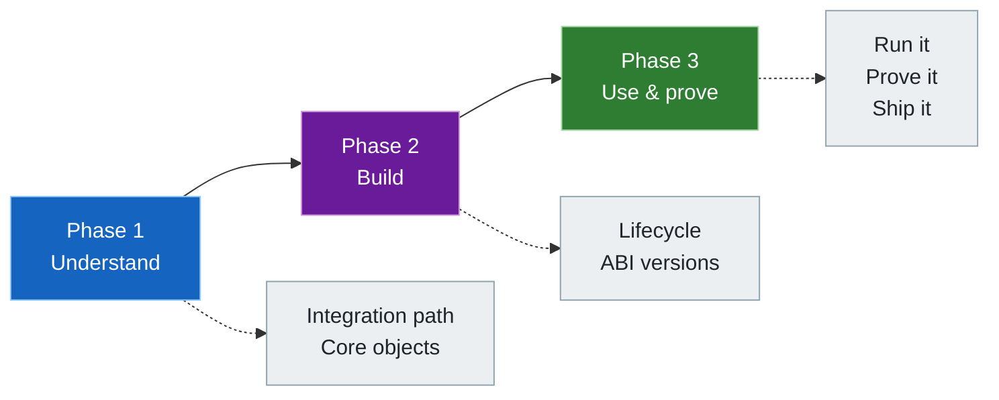

**Audit baseline:** ONNX Runtime `main` at commit [`bf6aa00`](https://github.com/microsoft/onnxruntime/commit/bf6aa0063d1c178c4a4d33ed6770425834147e2a), checked on 2026-07-17. That tree reports `ORT_VERSION=1.29.0` and `ORT_API_VERSION=29`; it is a development snapshot, not a released-package contract. Runnable guides elsewhere in this repository stay pinned to their tested package versions.

Every claim below is tagged so you know how much to trust it:

| Tag | What it means for you |
|---|---|
| **Contract** | Guaranteed by a public header or the official Plugin EP docs — safe to rely on |
| **Source snapshot** | True at the pinned commit, but an implementation detail that can change |
| **Repository route** | Package-specific behavior this tutorial actually tested |

[简体中文](README.zh-CN.md) · [Official Plugin EP documentation](https://onnxruntime.ai/docs/execution-providers/plugin-ep-libraries/)

---

## Contents

**Phase 1 · Understand the model**
- [Start here](#start-here) — three questions that untangle every confusion
- [Choose an integration path](#choose-an-integration-path) — internal, provider bridge, or pure plugin
- [Know the core objects](#know-the-core-objects) — who creates what, who owns it

**Phase 2 · Build your EP**
- [Follow the lifecycle](#follow-the-lifecycle) — registration through execution and safe teardown
- [Choose an execution model](#choose-an-execution-model) — compile subgraphs, register kernels, or both
- [Handle ABI versions](#handle-abi-versions) — the two directions of compatibility

**Phase 3 · Use and prove it**
- [Use from an application](#use-from-an-application) — register, select, run
- [Prove execution](#prove-execution) — five levels of evidence
- [Build, test, and package](#build-test-and-package) — ship it without surprises
- [Repository routes and evidence](#repository-routes-and-evidence) — what this repo already verified

---

## Start here

Three independent choices control everything here. Mixed up, Plugin EP feels confusing. Kept apart, it clicks.

### The whole guide on one screen

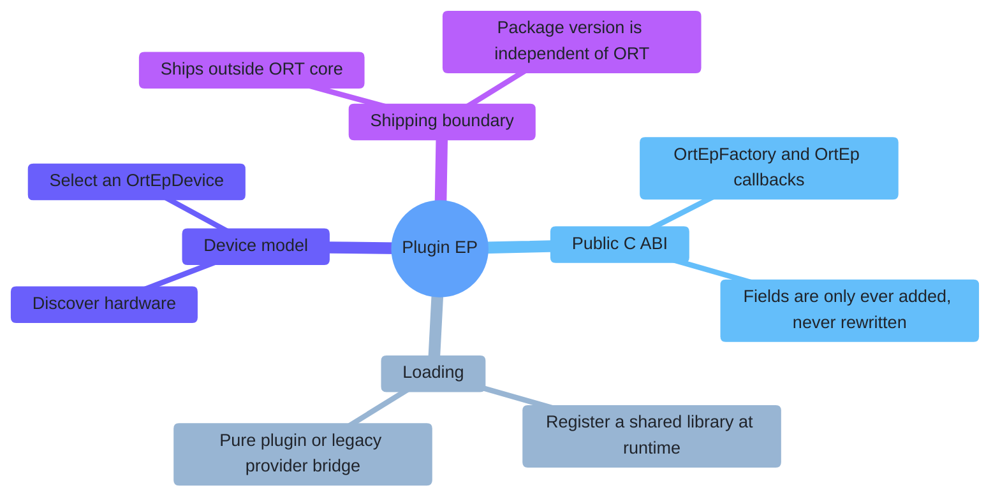

### Three dimensions, three answers

Every question about Plugin EP fits exactly one bucket below. A change in one rarely forces a change in the others.

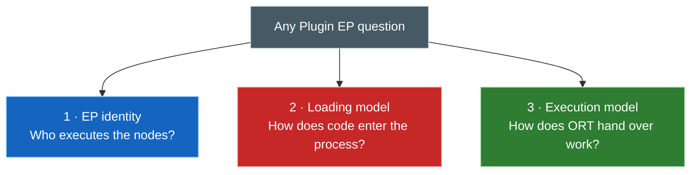

| Dimension | The question it answers | Examples |
|---|---|---|
| **1 · EP identity** | Who claims and executes graph nodes? | CUDA EP, QNN EP, WebGPU EP, a new vendor EP |
| **2 · Loading model** | How does EP code enter the process? | Built in, provider bridge library, pure Plugin EP library |
| **3 · Execution model** | How does ORT hand work to the EP? | Compile fused subgraphs, register operator kernels, or both |

> Moving CUDA EP into a Plugin EP package changes its loading, discovery, selection, and distribution. It does **not** change which CUDA operators it covers.

---

## Choose an integration path

The shared `EpLibrary` abstraction has three source-level paths.

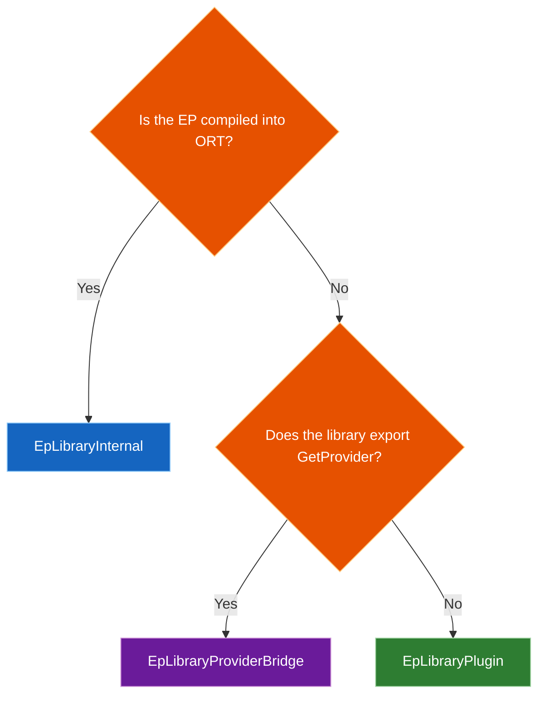

| Path | Recognized by | Session creates EP via | Examples (pinned source) | Best fit |
|---|---|---|---|---|
| **Internal** | Registered by ORT itself | Direct internal factory | CPU; DML (`USE_DML`); WebGPU (`USE_WEBGPU && !ORT_USE_EP_API_ADAPTERS`) | ORT core builds |
| **Provider bridge** | Library exports `GetProvider` + the two factory symbols | Legacy `Provider::CreateIExecutionProvider()` | CUDA, OpenVINO, QNN, MIGraphX, Vitis AI, TensorRT RTX | Modernizing an existing EP |
| **Pure plugin** | Library exports the two factory symbols, no `GetProvider` | `OrtEpFactory::CreateEp()`, wrapped as `OrtEp` | Native WebGPU, standalone CUDA plugin, sample plugins | New or fully decoupled EP |

The loader probes for `GetProvider` — your application never chooses a path flag. CUDA appears in both rows above because those are two distinct delivery routes for the same EP identity.

### Required pure-plugin exports

```cpp
OrtStatus* CreateEpFactories(
    const char* registration_name,
    const OrtApiBase* ort_api_base,
    const OrtLogger* default_logger,
    OrtEpFactory** factories,
    size_t max_factories,
    size_t* num_factories);

OrtStatus* ReleaseEpFactory(OrtEpFactory* factory);
```

| Rule | Why |
|---|---|
| Exact C symbol names | ORT resolves `CreateEpFactories` and `ReleaseEpFactory` by name |
| Public host boundary only | The library gets versioned API tables from `OrtApiBase` |
| No C++ exception may escape | Catch it and return `OrtStatus*` instead |
| Internal code can still be reused | Only the **runtime ABI boundary** must stay public-C-compatible |

---

## Know the core objects

Different objects, different owners. Get this map right once and lifetime bugs disappear.

### Object and ownership map

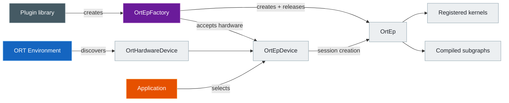

| Object | Created by | Owner / lifetime | Job |
|---|---|---|---|
| `OrtHardwareDevice` | ORT discovery, or a permitted virtual-device factory | Environment | Describes one physical or virtual CPU/GPU/NPU |
| `OrtEpFactory` | Plugin's `CreateEpFactories()` | Library registration; freed by `ReleaseEpFactory()` | Names the EP, accepts devices, shares resources, creates `OrtEp` |
| `OrtEpDevice` | Factory calls `OrtEpApi::CreateEpDevice()`; ORT takes ownership | Environment registration | Pairs **one factory** with **one hardware device** |
| `OrtEp` | `OrtEpFactory::CreateEp()` | Session; freed by `OrtEpFactory::ReleaseEp()` | Claims and executes nodes for that session |
| `OrtNodeComputeInfo` | A compiling `OrtEp` | Held by ORT for the session; EP releases in a batch | Create-state, compute, and release callbacks per compiled graph |
| `OrtKernelRegistry` | Kernel-based EP | EP-owned; ORT copies the registrations | Per-operator kernel creation and implementation |

> An `OrtEpDevice` is a selectable **EP + hardware pairing** — not device memory, not an allocator.

### Three names, three jobs

Three different people choose three different names. Only one pair must match.

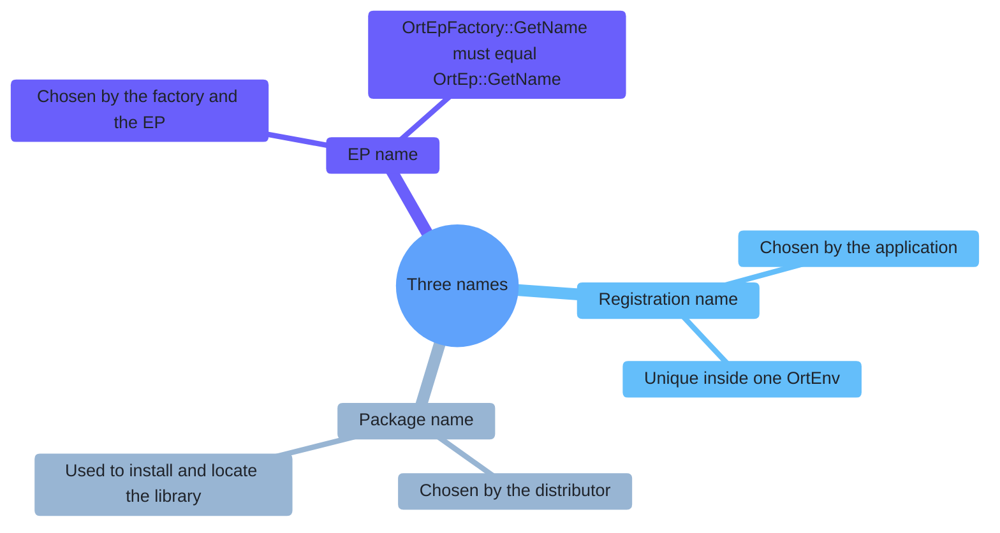

| Name | Chosen by | Used for | Must match? |
|---|---|---|---|
| Registration name | Application | Key inside one `OrtEnv`; unregistering the library | Unique per environment |
| EP name | Factory / EP implementation | Device filtering, session provider identity, node assignment | `OrtEpFactory::GetName()` **=** `OrtEp::GetName()` |
| Package name | Distributor | Installing and locating the shared library | No required match with either name |

> `onnxruntime-ep-webgpu` may be a package name. It is not automatically the EP name or the registration name.

### What the runtime checks

| Point | What's checked | Don't assume |
|---|---|---|
| Registration | Duplicate registration name is rejected | A package name is a valid EP name |
| Explicit device selection | Same EP name **and** the same factory pointer | Same text name from different factories is enough |
| Initial pure `OrtEp` sanity check | `ort_version_supported >= 22`; `GetName` pointer and string are non-null | The full callback table or name equality is validated up front |
| Callback use | Checked only when that path actually runs | Session construction catches every bad optional callback |

The official contract still requires matching factory and EP names. Don't rely on a late runtime failure to catch a mismatch.

---

## Follow the lifecycle

### Registration through execution

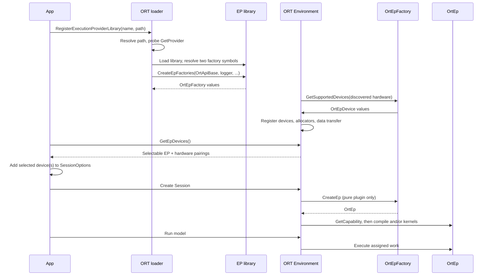

Internal and provider-bridge paths create an internal `IExecutionProvider` directly at session creation. Only a pure plugin goes through `CreateEp()` and ORT's internal `PluginExecutionProvider` adapter.

### Source-snapshot facts

| Topic | Pinned behavior | Stability |
|---|---|---|
| Relative library path | Resolved against `GetRuntimePath()`, not the process working directory | Source snapshot |
| Factory output capacity | Loader currently supplies 4 slots | Source snapshot |
| Device output capacity | Environment currently supplies 8 slots per factory | Source snapshot |
| Virtual devices | A `.virtual`-suffixed registration name temporarily sets `allow_virtual_devices=1` | Source snapshot |
| Minimal build | Registration, devices, and `GetEpApi()` return `ORT_NOT_IMPLEMENTED` | Build capability |
| Multi-device factory | One `OrtEp` receives every selected device and must coordinate them | Contract |
| Cross-device partitioning | Expose one factory per device, each with a unique EP name | Contract |

### Destruction state machine

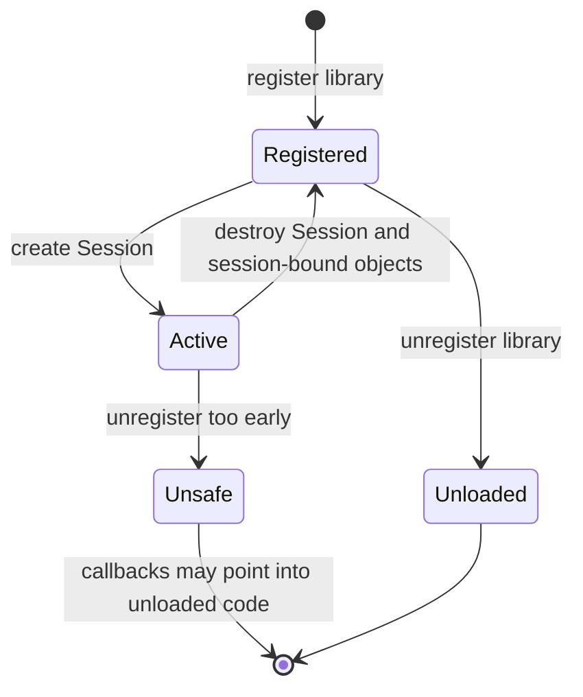

| Order | Normal cleanup step |
|---:|---|
| 1 | Release `RunOptions`, `IOBinding`, outputs, other session-bound objects |
| 2 | Destroy the session — compiled EPs release `OrtNodeComputeInfo`, then the factory releases `OrtEp` |
| 3 | Call `UnregisterExecutionProviderLibrary(registration_name)` |
| 4 | ORT unregisters data transfer, internal-factory entries, devices, shared allocators |
| 5 | ORT clears `OrtEpDevice` values, calls `ReleaseEpFactory`, then unloads the shared library |

> The precondition sits on the **caller**: release every session before unregistering the library. The loader does not reference-count live sessions for you. At environment destruction, ORT clears shared allocators before unloading remaining EP libraries, because allocator deleters may call plugin code.

---

## Choose an execution model

Two ways to report which nodes an EP supports. Pick one, or mix both.

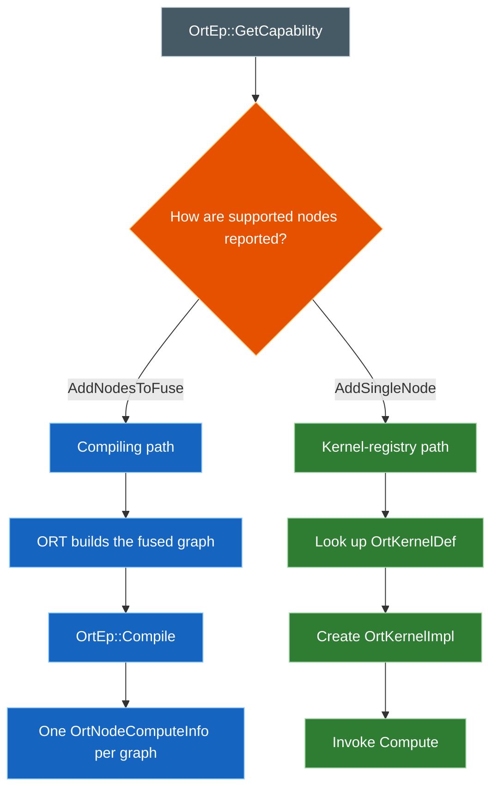

| | Compiling EP | Kernel-registry EP | Mixed EP |
|---|---|---|---|
| Stable since | 1.23 | 1.24 | 1.24+ |
| Reports capability via | `EpGraphSupportInfo_AddNodesToFuse()` | `EpGraphSupportInfo_AddSingleNode()` after kernel lookup | Both, by node/group |
| Runtime object | `OrtNodeComputeInfo` per fused graph | `OrtKernelDef` + create function + `OrtKernelImpl` | Both |
| `Compile` | Required | May be null | Handles fused groups only |
| Typical fit | Backend compiler, graph accelerator, EPContext | Existing operator-kernel library | Gradual migration, specialized fused ops |

### Ownership and lifetime rules

| Item | Rule |
|---|---|
| `OrtGraph` passed to `GetCapability()` / `Compile()` | Temporary — copy anything you need later |
| `OrtNodeComputeInfo` | EP allocates; ORT holds it for the session; EP releases via `ReleaseNodeComputeInfos()` |
| EPContext node returned by `Compile()` | ORT takes ownership |
| Registry from `GetKernelRegistry()` | Must stay valid for the EP's lifetime; ORT copies its registrations |
| If / Loop / Scan | 1.24 `OrtEpApi` helpers build control-flow kernels with session access |

> The official TensorRT Plugin EP example implements both `Compile` and `GetKernelRegistry` — the two models can combine.

---

## Handle ABI versions

Two independent directions. Get either one backwards and either an old runtime crashes on a new plugin, or a new runtime assumes too much from an old one.

### Two directions of compatibility

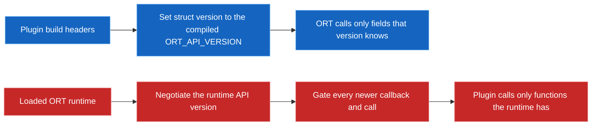

| Direction | Correct guard | Common mistake |
|---|---|---|
| ORT calls plugin callback structs | Set `ort_version_supported` to the header version used to compile the plugin | Lowering it to pretend the runtime is older |
| Plugin calls `OrtApi` / `OrtEpApi` | Detect the loaded runtime version, enforce a minimum, gate newer calls | Calling `GetApi(ORT_API_VERSION)` and assuming an older runtime has that table |

The pure CUDA and WebGPU plugins call `ApiInit(ort_api_base, ORT_PLUGIN_EP_MIN_ORT_VERSION)`; CUDA also gates optional callbacks by the negotiated runtime version. `ort_version_supported` alone does not perform that negotiation.

### Version map at the pinned snapshot

Each release only **adds** surface — it never rewrites what came before.


| ORT API | Public surface added | Note |
|---:|---|---|
| 1.22 | Library register/unregister; hardware/EP-device discovery and selection; base factory/EP fields | Foundation |
| 1.23 | Graph inspection, `GetCapability`, `Compile`, `OrtNodeComputeInfo`, allocators, transfer, streams, layout, run hooks, compiled-model compatibility | Compiling EP path |
| 1.24 | Kernel registry, If/Loop/Scan helpers, virtual devices, external resources, custom-op domains, incompatibility details | `Compile` becomes optional for registry-only EPs |
| 1.25 | EP profiler and events, operator-schema queries, `OrtEp::Sync`, graphics interop | Last append to `OrtEpApi` in this snapshot |
| 1.26 | Resource budgets, graph capture/replay callbacks | Added to `OrtEp`, not `OrtEpApi` |
| 1.27 | Session-init completion, default memory device, captured-graph release | Latest `OrtEp` callbacks here |
| 1.28 | `OrtEpFactory::SelectBestModelCandidate`; core API adds `KernelContext_GetSyncStream` | Latest `OrtEpFactory` callback here |
| 1.29 dev tree | API reports 29; no finalized `OrtApi`/`OrtEpApi`/`OrtEp`/`OrtEpFactory` additions yet | Don't infer a released contract from `main` |

`OrtEpApi` itself ends at a version-25 slot assertion in this source, so "Plugin EP API version" is not one single table — later capability also rides on callback structs and the core `OrtApi`.

> [!IMPORTANT]
> The `main` header, a released ORT package, and a vendor plugin package are three separately versioned things. Compiling successfully proves nothing about runtime compatibility.

---

## Use from an application

The API exists from ORT 1.22 — but follow the plugin package's own declared minimum version and runtime check.

```python
import onnxruntime as ort
import vendor_plugin_ep

registration_name = "my_plugin_registration"
library_path = vendor_plugin_ep.get_library_path()
ep_names = vendor_plugin_ep.get_ep_names()
if not ep_names:
    raise RuntimeError("The plugin package did not report an EP name")
ep_name = ep_names[0]

ort.register_execution_provider_library(registration_name, library_path)
session = None
try:
    devices = [d for d in ort.get_ep_devices() if d.ep_name == ep_name]
    if not devices:
        raise RuntimeError(f"Plugin loaded, but no compatible {ep_name} device was found")

    options = ort.SessionOptions()
    options.add_session_config_entry("session.disable_cpu_ep_fallback", "1")
    options.add_provider_for_devices([devices[0]], {})

    session = ort.InferenceSession("model.onnx", sess_options=options)
    # Run fixed inputs, compare outputs, collect assignment/profile evidence.
finally:
    del session
    ort.unregister_execution_provider_library(registration_name)
```

This follows the official Python example's API names and teardown order.

| Common trap | Do this instead |
|---|---|
| Assume registration name equals EP name | Read the package's own name helpers and filter `get_ep_devices()` |
| Use `get_available_providers()` as the plugin directory | Register first, then use `get_ep_devices()` |
| Pass devices from different factories together | Multiple devices must share the exact same factory |
| Pass a relative library path | Prefer `get_library_path()`, which returns an absolute path |
| Treat session creation as proof of execution | Disable CPU fallback, run, compare output, check assignment/profile |
| Load an unknown plugin package | A plugin is native in-process code — load only trusted artifacts |

Automatic selection via `SessionOptionsSetEpSelectionPolicy()` picks a device. It does not prove the chosen EP covers the whole model.

---

## Prove execution

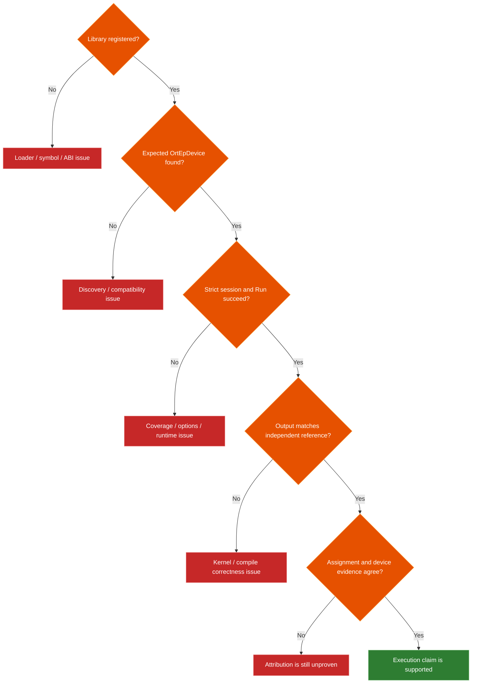

| Level | Evidence | What it proves |
|---:|---|---|
| 1 | Registration succeeds | Library loaded; required symbols and factory creation worked |
| 2 | Expected `OrtEpDevice` appears | Factory accepted a discovered or permitted virtual device |
| 3 | CPU fallback disabled; session and `Run` succeed | ORT did not silently assign unsupported work to CPU fallback |
| 4 | Output matches an independent CPU/NumPy reference | Numerical behavior is correct within a declared tolerance |
| 5 | Assignment/profile names the EP; vendor trace shows device work | ORT assignment and target-hardware activity support the claim |

From API 1.24, C/C++ can set `session.record_ep_graph_assignment_info=1` and query `Session_GetEpGraphAssignmentInfo()`. From 1.25, an `OrtEpProfilerImpl` may merge plugin device events into the ORT timeline. Latency or utilization alone is only a supporting signal.

---

## Build, test, and package


| Area | Required baseline | Official/source anchor |
|---|---|---|
| ABI entry | Public headers; two C exports; no C++ exception crosses the boundary | Development guide; WebGPU/CUDA entry points |
| Struct setup | Zero-initialize; set compiled `ORT_API_VERSION`; populate only supported callbacks | Public header and samples |
| Identity | Factory and EP names match; version string is SemVer | Development guide |
| Discovery | Return only genuinely compatible devices; return none when unsupported | `GetSupportedDevices()` contract |
| Graph data | Don't retain temporary `OrtGraph` / node data without copying | `Compile()` header notes |
| Resources | Design allocator, transfer, stream, custom-domain, and unload lifetimes together | Factory API and environment cleanup |
| Plugin tests | Own callback, error, no-device, bad-version, repeat-load, and cleanup tests | Official testing guidance |
| ORT operator tests | Build `onnxruntime_provider_test`; configure `ORT_UNIT_TEST_MAIN_DYNAMIC_PLUGIN_EP_CONFIG_JSON` | Official testing guidance |
| Model tests | Strict no-fallback run; check output and assignment | Official guidance favors model tests |
| Version CI | Gate minimum supported and target runtime versions | CUDA/WebGPU `ApiInit` pattern |
| Package contents | Plugin library and its dependencies only — no bundled ORT core library | Official packaging guidance |
| Package helpers | `get_library_path()`, `get_ep_names()`, optionally `get_ep_name()` | Official PyPI guidance |
| Package dependency | Document and validate the compatible ORT version range | Official packaging guidance |

---

## Repository routes and evidence

### Routes exercised here

| Route | Loading class | Relation to the classic EP | Strict test |
|---|---|---|---|
| AMD Windows ML MIGraphX | Provider bridge | Existing MIGraphX backend, now via factory/device discovery | [AMD/provider_test.py](../AMD/provider_test.py) |
| Qualcomm QNN 2.x | Provider bridge | QNN CPU/GPU/HTP backends decoupled from one ORT package | [Qualcomm/one_click.py](../Qualcomm/one_click.py) |
| NVIDIA TensorRT RTX | Provider bridge | Distinct product from the classic TensorRT EP; same loading model | [NVIDIA/provider_test.py](../NVIDIA/provider_test.py) |
| Native WebGPU | Pure plugin | Native ORT host and package; not the browser `onnxruntime-web` API | [native_webgpu_validator.py](../WebGPU/onnxruntime-web-demo/native_webgpu_validator.py) |

> Upstream also ships a standalone CUDA Plugin EP. That does not replace this repository's built-in `CUDAExecutionProvider` route — keep package, dependency, and validation claims separate.

### Pinned source ledger

All links below point to the audited commit, not moving `main`.

| Source | Claim verified |
|---|---|
| [`onnxruntime_ep_c_api.h`](https://github.com/microsoft/onnxruntime/blob/bf6aa0063d1c178c4a4d33ed6770425834147e2a/include/onnxruntime/core/session/onnxruntime_ep_c_api.h) | Public structs, ownership notes, callback versions, 4/8 capacities, 1.28 factory tail |
| [`onnxruntime_c_api.h`](https://github.com/microsoft/onnxruntime/blob/bf6aa0063d1c178c4a4d33ed6770425834147e2a/include/onnxruntime/core/session/onnxruntime_c_api.h) / [`.cc`](https://github.com/microsoft/onnxruntime/blob/bf6aa0063d1c178c4a4d33ed6770425834147e2a/onnxruntime/core/session/onnxruntime_c_api.cc) | Registration contract, core API version, append-only slot assertions, minimal-build stubs |
| [`utils.cc`](https://github.com/microsoft/onnxruntime/blob/bf6aa0063d1c178c4a4d33ed6770425834147e2a/onnxruntime/core/session/utils.cc) | Relative path base, `GetProvider` probe, same-name + same-factory selection |
| [`ep_library_plugin.cc`](https://github.com/microsoft/onnxruntime/blob/bf6aa0063d1c178c4a4d33ed6770425834147e2a/onnxruntime/core/session/plugin_ep/ep_library_plugin.cc) | Required symbols, factory creation/release, dynamic unload |
| [`environment.cc`](https://github.com/microsoft/onnxruntime/blob/bf6aa0063d1c178c4a4d33ed6770425834147e2a/onnxruntime/core/session/environment.cc) | Duplicate names, devices, virtual mode, allocators/transfers, unregister order |
| [`ep_library_internal.cc`](https://github.com/microsoft/onnxruntime/blob/bf6aa0063d1c178c4a4d33ed6770425834147e2a/onnxruntime/core/session/plugin_ep/ep_library_internal.cc) / [`ep_library_provider_bridge.cc`](https://github.com/microsoft/onnxruntime/blob/bf6aa0063d1c178c4a4d33ed6770425834147e2a/onnxruntime/core/session/plugin_ep/ep_library_provider_bridge.cc) | Internal provider list, legacy bridge adaptation |
| [`ep_plugin_provider_interfaces.cc`](https://github.com/microsoft/onnxruntime/blob/bf6aa0063d1c178c4a4d33ed6770425834147e2a/onnxruntime/core/session/plugin_ep/ep_plugin_provider_interfaces.cc) | Pure-plugin adapter, sanity checks, capability, compile, release ordering |
| [`ep_kernel_registration.cc`](https://github.com/microsoft/onnxruntime/blob/bf6aa0063d1c178c4a4d33ed6770425834147e2a/onnxruntime/core/session/plugin_ep/ep_kernel_registration.cc) / [`ep_api.cc`](https://github.com/microsoft/onnxruntime/blob/bf6aa0063d1c178c4a4d33ed6770425834147e2a/onnxruntime/core/session/plugin_ep/ep_api.cc) | Registry copy, control-flow helpers, `OrtEpApi` version slots |
| [`example_plugin_ep`](https://github.com/microsoft/onnxruntime/tree/bf6aa0063d1c178c4a4d33ed6770425834147e2a/onnxruntime/test/autoep/library/example_plugin_ep) / [`example_plugin_ep_kernel_registry`](https://github.com/microsoft/onnxruntime/tree/bf6aa0063d1c178c4a4d33ed6770425834147e2a/onnxruntime/test/autoep/library/example_plugin_ep_kernel_registry) | Reference compile and kernel-registry implementations |
| [`cuda/plugin`](https://github.com/microsoft/onnxruntime/tree/bf6aa0063d1c178c4a4d33ed6770425834147e2a/onnxruntime/core/providers/cuda/plugin) / [`webgpu/ep/api.cc`](https://github.com/microsoft/onnxruntime/blob/bf6aa0063d1c178c4a4d33ed6770425834147e2a/onnxruntime/core/providers/webgpu/ep/api.cc) | Pure plugin entry points and runtime-version negotiation |

Official references: [Usage](https://onnxruntime.ai/docs/execution-providers/plugin-ep-libraries/usage.html) · [Development](https://onnxruntime.ai/docs/execution-providers/plugin-ep-libraries/development.html) · [Testing](https://onnxruntime.ai/docs/execution-providers/plugin-ep-libraries/testing.html) · [Packaging](https://onnxruntime.ai/docs/execution-providers/plugin-ep-libraries/packaging.html)
