# ONNX Runtime Plugin EP：新手友好、源码核验指南

**Plugin EP 是一扇"门"，不是"目的地"。** 它是 ONNX Runtime 提供的公开 C ABI，负责**加载、发现、选择、打包**执行提供程序（EP）。它不是 GPU 或 NPU，也不存在名为 `PluginExecutionProvider` 的通用计算后端。

> **一句话总结：** Plugin EP 可以让全新 EP 亮相，也可以让老 EP 换一种方式发布。它只负责"交付"，从不负责"计算"。

### 如何阅读本指南

全文分三个阶段。第一次请按顺序阅读，之后可以直接跳到需要的部分。

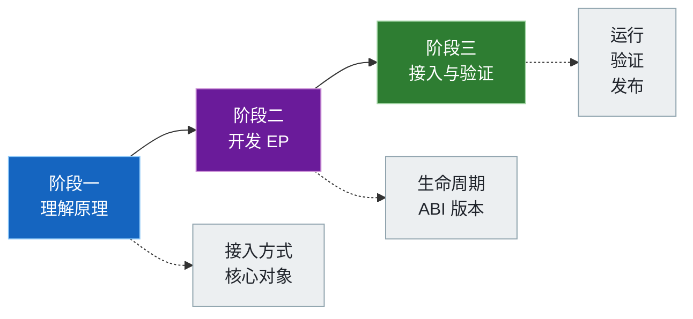

**核验版本：** 本文以 ONNX Runtime `main` 分支 [`bf6aa00`](https://github.com/microsoft/onnxruntime/commit/bf6aa0063d1c178c4a4d33ed6770425834147e2a) 提交为准，核验于 2026-07-17。该开发分支报告 `ORT_VERSION=1.29.0`、`ORT_API_VERSION=29`，这是开发快照，不是正式发布包的兼容性承诺。仓库中其他可运行的指南仍以各自实测过的软件包版本为准。

下文每条结论都标注了可信度：

| 标签 | 含义 |
|---|---|
| **公开约定** | 由公开头文件或官方文档明确规定，可以放心依赖 |
| **源码实现** | 在核验的提交中成立，但属于可能变化的实现细节 |
| **仓库实测** | 本仓库已用相应软件包实际运行验证过的行为 |

[English](README.md) · [Plugin EP 官方文档](https://onnxruntime.ai/docs/execution-providers/plugin-ep-libraries/)

---

## 目录

**阶段一 · 了解工作机制**
- [先厘清三个问题](#先厘清三个问题) —— 区分 EP 身份、加载方式和执行方式
- [选择接入方式](#选择接入方式) —— 内置、provider bridge，还是纯插件
- [核心对象与所有权](#核心对象与所有权) —— 谁负责创建，谁负责释放

**阶段二 · 构建 EP**
- [了解完整生命周期](#了解完整生命周期) —— 从注册、执行到安全清理
- [选择执行方式](#选择执行方式) —— 编译子图、注册内核，或两者兼用
- [处理 ABI 版本兼容](#处理-abi-版本兼容) —— 分清两个兼容方向

**阶段三 · 接入与验证**
- [在应用中接入](#在应用中接入) —— 注册、选择、运行三步法
- [确认 EP 是否实际执行](#确认-ep-是否实际执行) —— 五级证据链
- [开发、测试与打包](#开发测试与打包) —— 完整检查后再发布
- [本仓库已验证的实现](#本仓库已验证的实现) —— 本仓库已经核验了什么

---

## 先厘清三个问题

三个彼此独立的问题决定了一切。混在一起想，Plugin EP 会显得很绕；分开想，立刻就清楚了。

### 整体结构

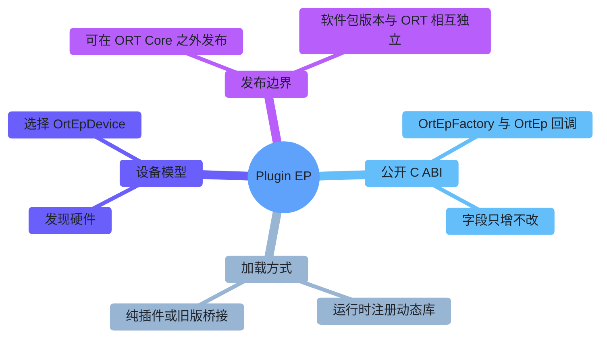

### 三个问题分别回答什么

关于 Plugin EP 的任何疑问，都能归到下面三类之一。改动其中一类，通常不会波及另外两类。

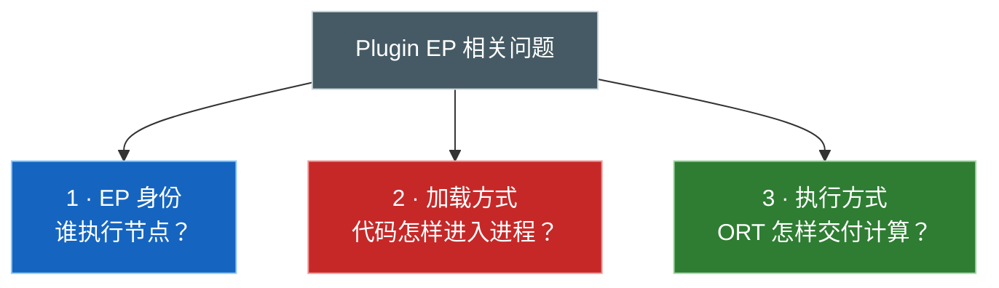

| 问题 | 需要确认的内容 | 例子 |
|---|---|---|
| **1 · EP 身份** | 谁声明并执行图节点？ | CUDA EP、QNN EP、WebGPU EP、厂商新 EP |
| **2 · 加载方式** | EP 代码怎样进入进程？ | 内置、provider bridge 动态库、纯 Plugin EP 动态库 |
| **3 · 执行方式** | ORT 怎样把计算交给 EP？ | 编译融合子图、注册算子内核，或两者混用 |

> 把 CUDA EP 改成 Plugin EP 打包，会改变它的加载、发现、选择和发布方式，但**不会**改变它支持哪些 CUDA 算子。

---

## 选择接入方式

源码通过统一的 `EpLibrary` 抽象，提供三种接入方式。

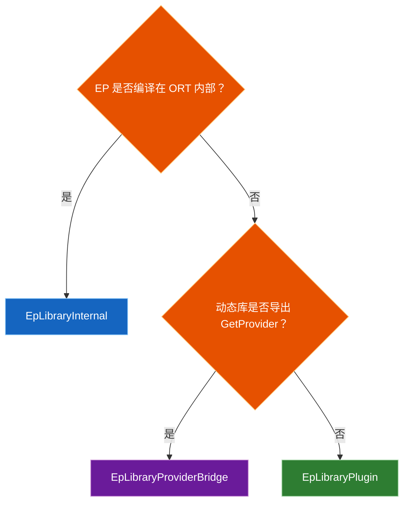

| 接入方式 | 识别方式 | 会话如何创建 EP | 例子（核验源码） | 适用场景 |
|---|---|---|---|---|
| **Internal** | 由 ORT 自行注册 | 直接调用内部工厂 | CPU；`USE_DML` 下的 DML；`USE_WEBGPU && !ORT_USE_EP_API_ADAPTERS` 下的 WebGPU | ORT Core 构建 |
| **Provider bridge** | 动态库同时导出 `GetProvider` 和两个工厂符号 | 调用旧接口 `Provider::CreateIExecutionProvider()` | CUDA、OpenVINO、QNN、MIGraphX、Vitis AI、TensorRT RTX | 改造现有 EP |
| **Pure plugin** | 动态库导出两个工厂符号，没有 `GetProvider` | 调用 `OrtEpFactory::CreateEp()`，再封装成 `OrtEp` | 原生 WebGPU、独立 CUDA plugin、示例插件 | 全新或完全解耦的 EP |

Loader 只检测动态库是否导出 `GetProvider`，应用不需要额外指定类型。CUDA 同时出现在前两行，是因为它们是同一个 EP 的两条不同发布路线。

### 纯插件必须导出的符号

```cpp
OrtStatus* CreateEpFactories(
    const char* registration_name,
    const OrtApiBase* ort_api_base,
    const OrtLogger* default_logger,
    OrtEpFactory** factories,
    size_t max_factories,
    size_t* num_factories);

OrtStatus* ReleaseEpFactory(OrtEpFactory* factory);
```

| 规则 | 原因 |
|---|---|
| C 符号名必须完全一致 | ORT 按名称解析 `CreateEpFactories` 和 `ReleaseEpFactory` |
| 只经过公开的宿主边界交互 | 动态库从 `OrtApiBase` 获取带版本的 API 表 |
| C++ 异常不能越过边界 | 必须捕获异常，返回 `OrtStatus*` |
| 内部实现仍可复用 | 只有**运行时 ABI 边界**需要保持公开 C 兼容 |

---

## 核心对象与所有权

不同对象由不同角色创建。把这张关系图记牢，生命周期相关的 bug 基本就不会再犯。

### 对象及其所有权

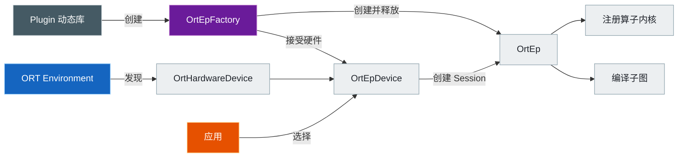

| 对象 | 由谁创建 | 所有者 / 生命周期 | 作用 |
|---|---|---|---|
| `OrtHardwareDevice` | ORT 发现，或获准创建虚拟设备的工厂 | Environment | 描述一个物理或虚拟的 CPU/GPU/NPU |
| `OrtEpFactory` | 插件的 `CreateEpFactories()` | 动态库注册期间存活；由 `ReleaseEpFactory()` 释放 | 命名 EP、接受设备、共享资源、创建 `OrtEp` |
| `OrtEpDevice` | 工厂调用 `OrtEpApi::CreateEpDevice()`，随后由 ORT 接管 | Environment 注册期间 | 把**一个工厂**和**一个硬件设备**配成一对 |
| `OrtEp` | `OrtEpFactory::CreateEp()` | 随 Session 存活；由 `OrtEpFactory::ReleaseEp()` 释放 | 在该会话中声明并执行节点 |
| `OrtNodeComputeInfo` | 编译型 `OrtEp` | 会话期间由 ORT 持有；EP 批量释放 | 每张编译图的 create-state、compute、release 回调 |
| `OrtKernelRegistry` | 基于内核的 EP | EP 持有；ORT 会复制其中的注册项 | 定义各算子的内核创建与实现 |

> `OrtEpDevice` 代表一组可供选择的 **EP + 硬件配对**，既不是设备内存，也不是内存分配器。

### 三种名称各司其职

三个不同的角色，各自选定一个名称。只有其中一对**必须**一致。

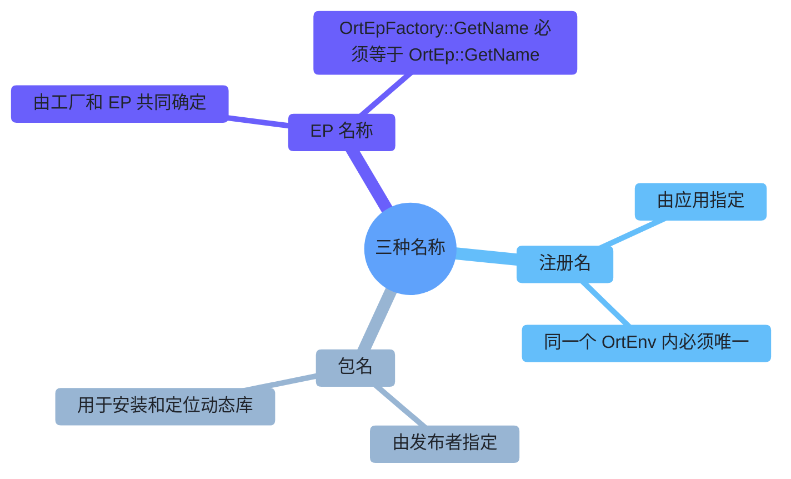

| 名称 | 由谁指定 | 用途 | 一致性要求 |
|---|---|---|---|
| 注册名 | 应用 | 作为一个 `OrtEnv` 内的键；用于卸载动态库 | 同一环境内唯一 |
| EP 名称 | 工厂 / EP 实现 | 筛选设备、标识会话 Provider、记录节点分配 | `OrtEpFactory::GetName()` **等于** `OrtEp::GetName()` |
| 包名 | 发布者 | 安装并定位动态库 | 不要求与前两者一致 |

> `onnxruntime-ep-webgpu` 可能只是一个包名，它不会自动成为 EP 名称或注册名。

### 运行时会检查什么

| 时机 | 实际检查内容 | 不能假设 |
|---|---|---|
| 注册动态库 | 拒绝重复的注册名 | 包名一定是有效的 EP 名称 |
| 显式选择设备 | EP 名称相同，**且**工厂指针也相同 | 名称相同、工厂不同也可以混用 |
| 纯 `OrtEp` 初始检查 | `ort_version_supported >= 22`；`GetName` 指针和返回字符串非空 | 此时已验证完整回调表或名称一致性 |
| 实际调用回调 | 只在用到该流程时才检查 | 创建会话就能提前发现所有可选回调的问题 |

官方约定仍要求工厂名称与 EP 名称一致，不要等运行时后期报错才发现两者不匹配。

---

## 了解完整生命周期

### 从注册到执行的完整流程

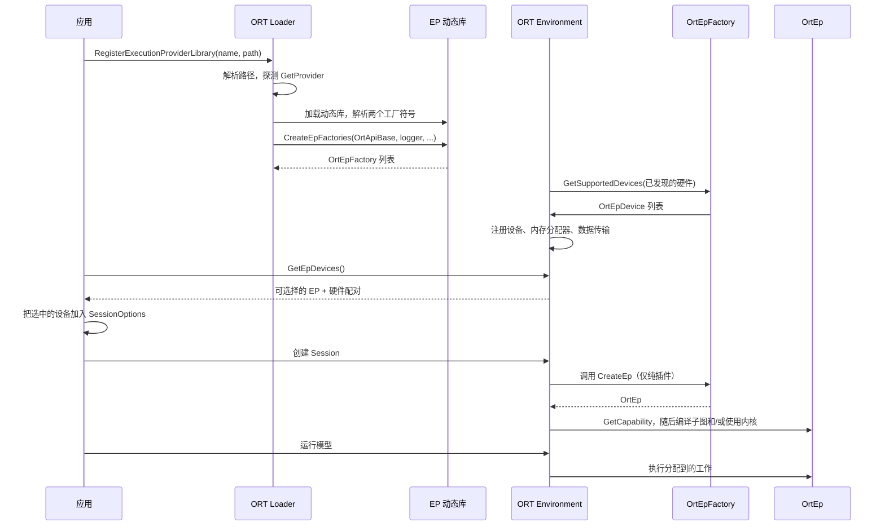

Internal 和 provider bridge 在创建会话时会直接生成内部 `IExecutionProvider`。只有纯插件才会调用 `CreateEp()`，并通过 ORT 内部的 `PluginExecutionProvider` 适配器接入。

### 本文核验版本中的实现细节

| 主题 | 当前实现 | 稳定性 |
|---|---|---|
| 相对动态库路径 | 相对于 `GetRuntimePath()`，而不是进程工作目录 | 源码实现 |
| 工厂输出容量 | Loader 目前提供 4 个槽位 | 源码实现 |
| 设备输出容量 | Environment 目前为每个工厂提供 8 个槽位 | 源码实现 |
| 虚拟设备 | 注册名以 `.virtual` 结尾时，临时设置 `allow_virtual_devices=1` | 源码实现 |
| Minimal build | 注册、设备和 `GetEpApi()` 都返回 `ORT_NOT_IMPLEMENTED` | 取决于构建配置 |
| 多设备工厂 | 一个 `OrtEp` 接收所有被选设备，并自行协调 | 公开约定 |
| 跨设备分图 | 每个设备各自一个工厂，且 EP 名称唯一 | 公开约定 |

### 销毁状态机

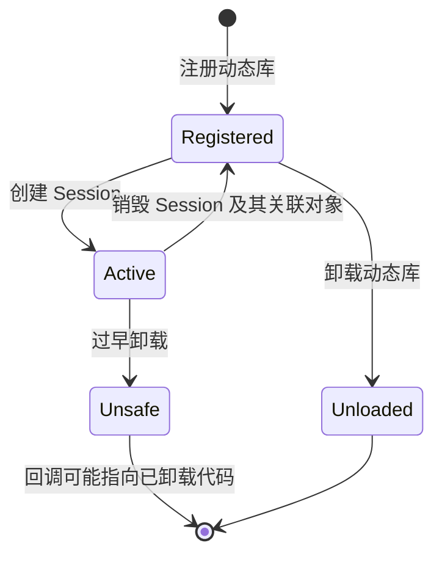

| 顺序 | 正常的清理步骤 |
|---:|---|
| 1 | 释放 `RunOptions`、`IOBinding`、输出及其他会话相关对象 |
| 2 | 销毁会话——编译型 EP 先释放 `OrtNodeComputeInfo`，再由工厂释放 `OrtEp` |
| 3 | 调用 `UnregisterExecutionProviderLibrary(registration_name)` |
| 4 | ORT 注销数据传输、内部工厂条目、设备、共享内存分配器 |
| 5 | ORT 清理 `OrtEpDevice`，调用 `ReleaseEpFactory`，最后卸载动态库 |

> 前提条件由**调用方**保证：卸载动态库前必须先释放所有相关会话。Loader 不会替你对存活会话做引用计数。Environment 销毁时，ORT 会先清理共享内存分配器再卸载剩余 EP 动态库，因为分配器的 deleter 可能仍会调用插件代码。

---

## 选择执行方式

汇报"EP 支持哪些节点"有两种方式，可以只选一种，也可以混用。

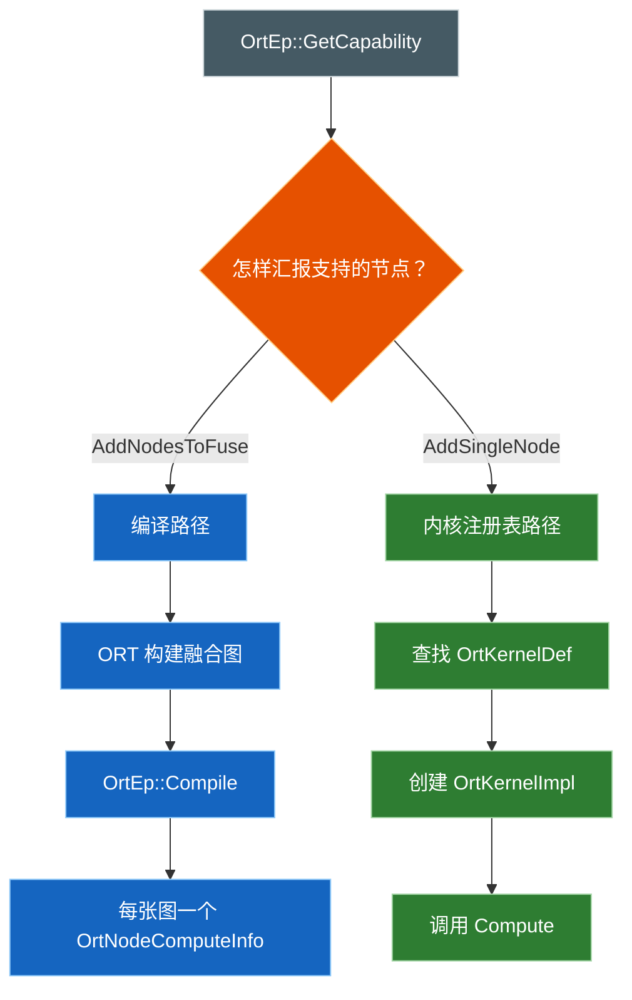

| | 编译型 EP | 内核注册表 EP | 混合 EP |
|---|---|---|---|
| 稳定始于 | 1.23 | 1.24 | 1.24+ |
| 如何汇报能力 | `EpGraphSupportInfo_AddNodesToFuse()` | 查找内核后调用 `EpGraphSupportInfo_AddSingleNode()` | 按节点/分组混用 |
| 运行时对象 | 每张融合图一个 `OrtNodeComputeInfo` | `OrtKernelDef` + 创建函数 + `OrtKernelImpl` | 两者都有 |
| `Compile` | 必须实现 | 可以为空 | 只处理融合分组 |
| 典型场景 | 后端编译器、图加速器、EPContext | 已有的逐算子内核库 | 渐进迁移、专用融合算子 |

### 所有权与生命周期规则

| 对象 | 规则 |
|---|---|
| 传给 `GetCapability()` / `Compile()` 的 `OrtGraph` | 只在调用期间有效——需要的信息要提前复制 |
| `OrtNodeComputeInfo` | EP 分配；会话期间由 ORT 持有；EP 在 `ReleaseNodeComputeInfos()` 中释放 |
| `Compile()` 返回的 EPContext 节点 | 由 ORT 接管所有权 |
| `GetKernelRegistry()` 返回的 registry | 必须在 EP 整个生命周期内有效；ORT 会复制其中的注册项 |
| If / Loop / Scan | 1.24 版 `OrtEpApi` helper 可以创建能访问会话内部信息的控制流内核 |

> 官方 TensorRT Plugin EP 示例同时实现了 `Compile` 和 `GetKernelRegistry`，说明这两种模型可以组合使用。

---

## 处理 ABI 版本兼容

两个方向彼此独立，任何一个搞反，要么旧 runtime 加载新插件会崩溃，要么新 runtime 对旧插件想当然。

### 需要分别处理的两个方向

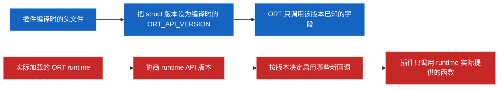

| 方向 | 正确做法 | 常见错误 |
|---|---|---|
| ORT 调用插件的回调 struct | 把 `ort_version_supported` 设为编译插件时使用的头文件版本 | 故意调低该值，假装 runtime 更旧 |
| 插件调用 `OrtApi` / `OrtEpApi` | 检测实际加载的 runtime 版本，设置最低要求，按版本启用新调用 | 直接调用 `GetApi(ORT_API_VERSION)`，假设旧 runtime 也有这张表 |

纯 CUDA 和 WebGPU 插件都调用 `ApiInit(ort_api_base, ORT_PLUGIN_EP_MIN_ORT_VERSION)`；CUDA 还会按协商到的 runtime 版本决定是否启用可选回调。仅凭 `ort_version_supported` 并不能完成这种协商。

### 本文核验版本的 API 演进

每个新版本只会**追加**能力，绝不会改写已有内容。


| ORT API | 新增的公开能力 | 说明 |
|---:|---|---|
| 1.22 | 动态库注册/卸载；硬件与 EP 设备的发现和选择；基础 factory/EP 字段 | 打基础 |
| 1.23 | 图读取、`GetCapability`、`Compile`、`OrtNodeComputeInfo`、分配器、数据传输、stream、layout、run hook、编译模型兼容性 | 支持编译型 EP |
| 1.24 | 内核注册表、If/Loop/Scan helper、虚拟设备、外部资源、自定义 op domain、不兼容详情 | 只用注册表的 EP 可以不实现 `Compile` |
| 1.25 | EP profiler 与事件、算子 schema 查询、`OrtEp::Sync`、图形互操作 | 本核验版本中 `OrtEpApi` 的最后一次追加 |
| 1.26 | 资源预算、图捕获/重放回调 | 加在 `OrtEp` 上，不在 `OrtEpApi` 里 |
| 1.27 | Session 初始化完成通知、默认内存设备、释放已捕获的图 | 本核验版本中最新的 `OrtEp` 回调 |
| 1.28 | `OrtEpFactory::SelectBestModelCandidate`；核心 API 新增 `KernelContext_GetSyncStream` | 本核验版本中最新的 `OrtEpFactory` 回调 |
| 1.29 开发分支 | 版本号报 29，但本次核验未见最终定型的 `OrtApi`/`OrtEpApi`/`OrtEp`/`OrtEpFactory` 新增项 | 不要据此推断已发布的兼容承诺 |

`OrtEpApi` 函数表本身在版本 25 处有槽位断言收尾，所以 "Plugin EP API 版本" 并非单张表——后续能力还会体现在回调 struct 和核心 `OrtApi` 里。

> [!IMPORTANT]
> `main` 的头文件、正式发布的 ORT 包、厂商插件包，是三个各自独立定版本的产物。编译成功，不代表运行时一定兼容。

---

## 在应用中接入

这组 API 从 ORT 1.22 起就存在，但请以插件包自己声明的最低版本和运行时检查为准。

```python
import onnxruntime as ort
import vendor_plugin_ep

registration_name = "my_plugin_registration"
library_path = vendor_plugin_ep.get_library_path()
ep_names = vendor_plugin_ep.get_ep_names()
if not ep_names:
    raise RuntimeError("插件包没有报告 EP 名称")
ep_name = ep_names[0]

ort.register_execution_provider_library(registration_name, library_path)
session = None
try:
    devices = [d for d in ort.get_ep_devices() if d.ep_name == ep_name]
    if not devices:
        raise RuntimeError(f"插件已加载，但没有找到兼容的 {ep_name} 设备")

    options = ort.SessionOptions()
    options.add_session_config_entry("session.disable_cpu_ep_fallback", "1")
    options.add_provider_for_devices([devices[0]], {})

    session = ort.InferenceSession("model.onnx", sess_options=options)
    # 用固定输入运行，比较输出，收集节点分配/profile 证据。
finally:
    del session
    ort.unregister_execution_provider_library(registration_name)
```

这段代码沿用了官方 Python 示例的 API 名称和清理顺序。

| 常见误区 | 应当这样做 |
|---|---|
| 以为注册名就是 EP 名称 | 读取软件包自带的名称 helper，再筛选 `get_ep_devices()` |
| 把 `get_available_providers()` 当作插件目录 | 先注册，再调用 `get_ep_devices()` |
| 把不同工厂的设备混在一起用 | 多个设备必须来自同一个工厂 |
| 传入相对路径的动态库 | 优先使用返回绝对路径的 `get_library_path()` |
| 把会话创建成功当成执行证明 | 禁用 CPU 回退、实际运行、比较输出、检查节点分配 |
| 加载来路不明的插件 | 插件是进程内运行的原生代码，只加载可信来源 |

`SessionOptionsSetEpSelectionPolicy()` 的自动选择只负责挑设备，不能证明所选 EP 覆盖了整个模型。

---

## 确认 EP 是否实际执行

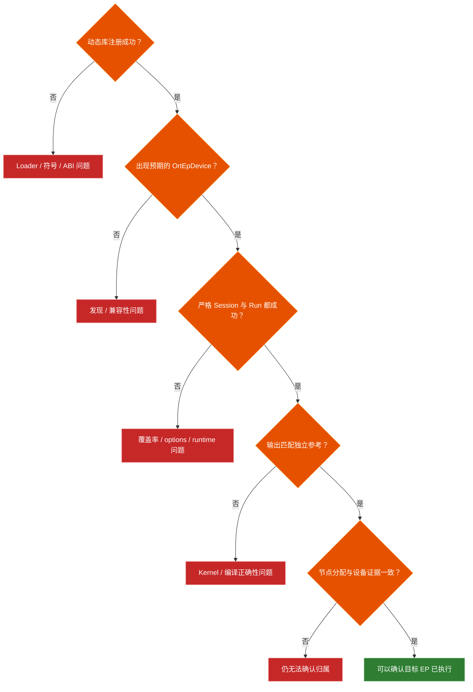

| 层级 | 证据 | 能证明什么 |
|---:|---|---|
| 1 | 注册成功 | 动态库已加载，必需符号和工厂创建都正常 |
| 2 | 出现预期的 `OrtEpDevice` | 工厂接受了一个已发现或获准的虚拟设备 |
| 3 | 禁用 CPU 回退后，Session 和 `Run` 都成功 | ORT 没有偷偷把不支持的部分交给 CPU 回退 |
| 4 | 输出匹配独立的 CPU/NumPy 参考实现 | 数值结果在声明的容差内正确 |
| 5 | 节点分配/profile 指名该 EP；厂商 trace 显示设备确实在工作 | ORT 的分配信息和目标硬件活动共同支持这一结论 |

从 API 1.24 起，C/C++ 可以设置 `session.record_ep_graph_assignment_info=1`，再查询 `Session_GetEpGraphAssignmentInfo()`。从 1.25 起，`OrtEpProfilerImpl` 可以把插件设备事件并入 ORT 时间线。延迟或利用率只能作为辅助信号，不是证据。

---

## 开发、测试与打包


| 方面 | 最低要求 | 官方/源码依据 |
|---|---|---|
| ABI 入口 | 公开头文件；两个 C 导出；C++ 异常不越过边界 | Development 文档；WebGPU/CUDA 入口 |
| Struct 初始化 | 先清零；设置编译时的 `ORT_API_VERSION`；只填已支持的回调 | 公开头文件与示例 |
| 身份 | 工厂名称与 EP 名称一致；版本号遵循 SemVer | Development 文档 |
| 设备发现 | 只返回真正兼容的设备；不支持就返回空 | `GetSupportedDevices()` 约定 |
| 图数据 | 不保留临时的 `OrtGraph`/节点数据，需要就先复制 | `Compile()` 头文件注释 |
| 资源管理 | 统一规划分配器、数据传输、stream、自定义 domain 和卸载的生命周期 | Factory API 与环境清理逻辑 |
| 插件测试 | 覆盖回调、错误、无设备、错误版本、重复加载、清理 | 官方测试指南 |
| ORT 算子测试 | 构建 `onnxruntime_provider_test`；配置 `ORT_UNIT_TEST_MAIN_DYNAMIC_PLUGIN_EP_CONFIG_JSON` | 官方测试指南 |
| 模型测试 | 严格无回退运行；检查输出和节点分配 | 官方指南推荐模型级测试 |
| 版本 CI | 同时把关最低支持版本和目标 runtime 版本 | CUDA/WebGPU 的 `ApiInit` 模式 |
| 软件包内容 | 只打包插件动态库及其依赖，不要附带一份 ORT Core | 官方打包指南 |
| 包 helper | `get_library_path()`、`get_ep_names()`，可选 `get_ep_name()` | 官方 PyPI 建议 |
| 软件包依赖 | 记录并验证兼容的 ORT 版本范围 | 官方打包指南 |

---

## 本仓库已验证的实现

### 本仓库采用的实现

| 实现 | 加载方式 | 与传统 EP 的关系 | 严格测试 |
|---|---|---|---|
| AMD Windows ML MIGraphX | Provider bridge | 现有 MIGraphX 后端，现在走工厂/设备发现 | [AMD/provider_test.py](../AMD/provider_test.py) |
| Qualcomm QNN 2.x | Provider bridge | QNN CPU/GPU/HTP 后端脱离单一 ORT 包 | [Qualcomm/one_click.py](../Qualcomm/one_click.py) |
| NVIDIA TensorRT RTX | Provider bridge | 与经典 TensorRT EP 是不同产品，加载方式相同 | [NVIDIA/provider_test.py](../NVIDIA/provider_test.py) |
| 原生 WebGPU | Pure plugin | 原生 ORT 宿主与软件包，不是浏览器版 `onnxruntime-web` API | [native_webgpu_validator.py](../WebGPU/onnxruntime-web-demo/native_webgpu_validator.py) |

> 上游还有一个独立的纯 CUDA Plugin EP，但这不代表本仓库内置的 `CUDAExecutionProvider` 路线已被取代——软件包、依赖、验证结论都要分开看待。

### 源码核验表

以下链接全部指向核验时的固定提交，而不是随时变化的 `main`。

| 源码 | 核验结论 |
|---|---|
| [`onnxruntime_ep_c_api.h`](https://github.com/microsoft/onnxruntime/blob/bf6aa0063d1c178c4a4d33ed6770425834147e2a/include/onnxruntime/core/session/onnxruntime_ep_c_api.h) | 公开 struct、所有权说明、回调版本、4/8 容量、1.28 factory 尾字段 |
| [`onnxruntime_c_api.h`](https://github.com/microsoft/onnxruntime/blob/bf6aa0063d1c178c4a4d33ed6770425834147e2a/include/onnxruntime/core/session/onnxruntime_c_api.h) / [`.cc`](https://github.com/microsoft/onnxruntime/blob/bf6aa0063d1c178c4a4d33ed6770425834147e2a/onnxruntime/core/session/onnxruntime_c_api.cc) | 注册约定、核心 API 版本、只追加的槽位断言、minimal-build 桩代码 |
| [`utils.cc`](https://github.com/microsoft/onnxruntime/blob/bf6aa0063d1c178c4a4d33ed6770425834147e2a/onnxruntime/core/session/utils.cc) | 相对路径基准、`GetProvider` 探测、同名且同工厂的选择要求 |
| [`ep_library_plugin.cc`](https://github.com/microsoft/onnxruntime/blob/bf6aa0063d1c178c4a4d33ed6770425834147e2a/onnxruntime/core/session/plugin_ep/ep_library_plugin.cc) | 必需符号、工厂创建/释放、动态卸载 |
| [`environment.cc`](https://github.com/microsoft/onnxruntime/blob/bf6aa0063d1c178c4a4d33ed6770425834147e2a/onnxruntime/core/session/environment.cc) | 重复名称、设备、虚拟模式、分配器/数据传输、卸载顺序 |
| [`ep_library_internal.cc`](https://github.com/microsoft/onnxruntime/blob/bf6aa0063d1c178c4a4d33ed6770425834147e2a/onnxruntime/core/session/plugin_ep/ep_library_internal.cc) / [`ep_library_provider_bridge.cc`](https://github.com/microsoft/onnxruntime/blob/bf6aa0063d1c178c4a4d33ed6770425834147e2a/onnxruntime/core/session/plugin_ep/ep_library_provider_bridge.cc) | 内置 Provider 列表、旧版桥接适配 |
| [`ep_plugin_provider_interfaces.cc`](https://github.com/microsoft/onnxruntime/blob/bf6aa0063d1c178c4a4d33ed6770425834147e2a/onnxruntime/core/session/plugin_ep/ep_plugin_provider_interfaces.cc) | 纯插件适配器、初始检查、能力、编译与释放顺序 |
| [`ep_kernel_registration.cc`](https://github.com/microsoft/onnxruntime/blob/bf6aa0063d1c178c4a4d33ed6770425834147e2a/onnxruntime/core/session/plugin_ep/ep_kernel_registration.cc) / [`ep_api.cc`](https://github.com/microsoft/onnxruntime/blob/bf6aa0063d1c178c4a4d33ed6770425834147e2a/onnxruntime/core/session/plugin_ep/ep_api.cc) | Registry 复制、控制流 helper、`OrtEpApi` 版本槽位 |
| [`example_plugin_ep`](https://github.com/microsoft/onnxruntime/tree/bf6aa0063d1c178c4a4d33ed6770425834147e2a/onnxruntime/test/autoep/library/example_plugin_ep) / [`example_plugin_ep_kernel_registry`](https://github.com/microsoft/onnxruntime/tree/bf6aa0063d1c178c4a4d33ed6770425834147e2a/onnxruntime/test/autoep/library/example_plugin_ep_kernel_registry) | 编译型与内核注册表的参考实现 |
| [`cuda/plugin`](https://github.com/microsoft/onnxruntime/tree/bf6aa0063d1c178c4a4d33ed6770425834147e2a/onnxruntime/core/providers/cuda/plugin) / [`webgpu/ep/api.cc`](https://github.com/microsoft/onnxruntime/blob/bf6aa0063d1c178c4a4d33ed6770425834147e2a/onnxruntime/core/providers/webgpu/ep/api.cc) | 纯插件入口点、runtime 版本协商 |

官方参考：[Usage](https://onnxruntime.ai/docs/execution-providers/plugin-ep-libraries/usage.html) · [Development](https://onnxruntime.ai/docs/execution-providers/plugin-ep-libraries/development.html) · [Testing](https://onnxruntime.ai/docs/execution-providers/plugin-ep-libraries/testing.html) · [Packaging](https://onnxruntime.ai/docs/execution-providers/plugin-ep-libraries/packaging.html)
