# ONNX Runtime Plugin EP：源码核验与开发指南

**先明确一点：Plugin EP 是加载和交付 EP 的机制，不是计算后端。** ONNX Runtime（ORT）通过这套公开的 C ABI 和运行时模型来**加载、发现、选择和打包**执行提供程序（EP）。Plugin EP 本身既不是 GPU/NPU，也不存在一个名为 `PluginExecutionProvider` 的通用计算后端。

> **简而言之：** Plugin EP 既可以接入在 ORT 源码仓库之外开发的新 EP，也可以改进现有 EP 的发布方式。它负责加载与交付，真正执行计算的仍然是具体 EP。

### 如何阅读本指南

本文分为三个阶段。第一次阅读时建议按顺序了解整个流程；熟悉后，可以直接跳到需要查阅的部分。

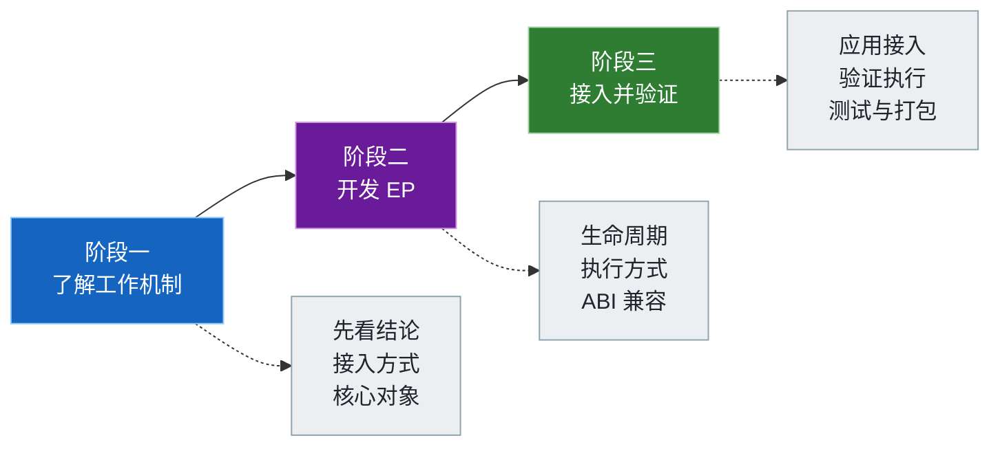

**核验版本：** 本文以 ONNX Runtime `main` 的 [`bf6aa00`](https://github.com/microsoft/onnxruntime/commit/bf6aa0063d1c178c4a4d33ed6770425834147e2a) 提交为准，核验日期为 2026-07-17。该开发分支报告 `ORT_VERSION=1.29.0`、`ORT_API_VERSION=29`，但这并不代表已发布软件包的兼容性承诺。仓库中可实际运行的其他指南，仍以各自经过测试的软件包版本为准。

文中使用以下标签说明结论的依据：

| 标签 | 含义 |
|---|---|
| **公开约定** | 由公开头文件或 Plugin EP 官方文档明确规定，可以作为兼容性依据 |
| **源码实现** | 在本文核验的提交中成立，但属于可能变化的实现细节 |
| **仓库实测** | 本仓库已使用相应软件包实际运行并验证过的行为 |

[English](README.md) · [Plugin EP 官方文档](https://onnxruntime.ai/docs/execution-providers/plugin-ep-libraries/)

---

## 目录

**阶段一 · 了解工作机制**
- [先厘清三个问题](#先厘清三个问题) —— 区分 EP 身份、加载方式和执行方式
- [选择接入方式](#选择接入方式) —— 内置、provider bridge，还是纯插件
- [核心对象与所有权](#核心对象与所有权) —— 谁负责创建，谁负责释放

**阶段二 · 构建 EP**
- [了解完整生命周期](#了解完整生命周期) —— 从注册、执行到安全清理
- [选择执行方式](#选择执行方式) —— 编译子图、注册内核，或两者兼用
- [处理 ABI 版本兼容](#处理-abi-版本兼容) —— 分清两个兼容方向

**阶段三 · 接入与验证**
- [在应用中接入](#在应用中接入) —— 注册、选择、运行三步法
- [确认 EP 是否实际执行](#确认-ep-是否实际执行) —— 逐级收集五类证据
- [开发、测试与打包](#开发测试与打包) —— 完整检查后再发布
- [本仓库已验证的实现](#本仓库已验证的实现) —— 本仓库已经核验了什么

---

## 先厘清三个问题

理解 Plugin EP 的关键，是把**三个彼此独立的问题**分开：具体由哪个 EP 执行、EP 代码如何进入进程，以及 ORT 如何把计算交给 EP。先看整体结构，再分别说明这三个方面。

### 整体结构

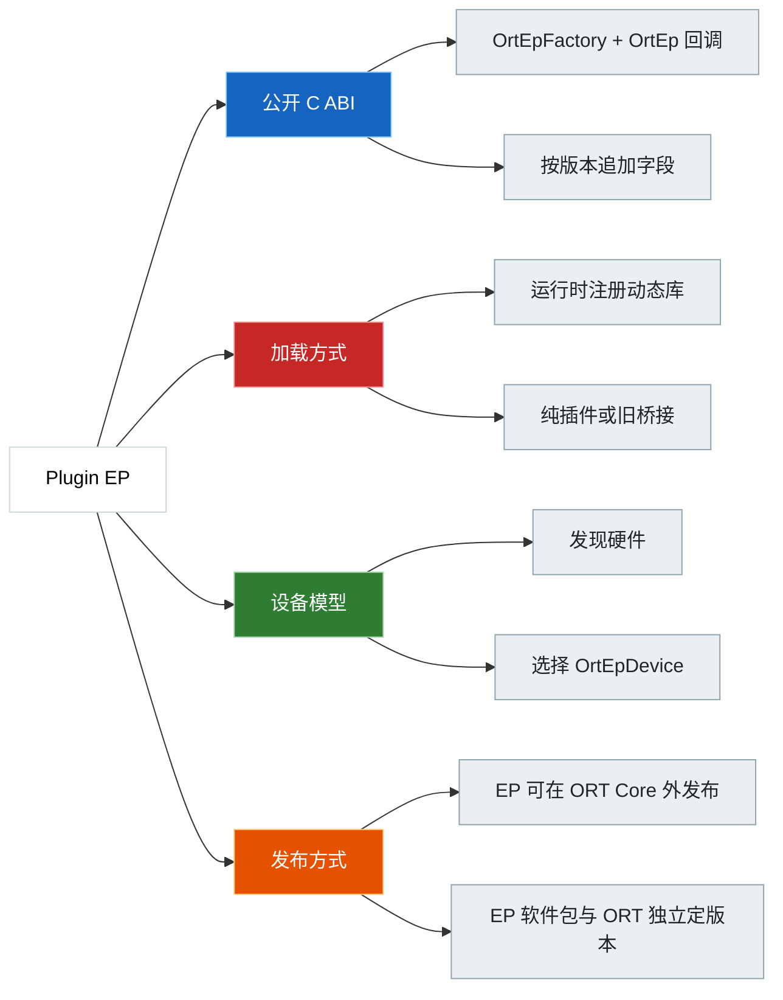

### 三个问题分别回答什么

排查问题时，先判断它属于以下哪一类。通常只改变其中一项，并不会影响另外两项。

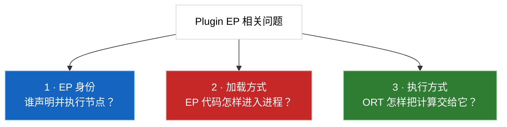

| 问题 | 需要确认的内容 | 例子 |
|---|---|---|
| **1 · EP 身份** | 谁声明并执行图节点？ | CUDA EP、QNN EP、WebGPU EP、厂商新 EP |
| **2 · 加载方式** | EP 代码怎样进入进程？ | 内置、provider bridge 动态库、纯 Plugin EP 动态库 |
| **3 · 执行方式** | ORT 怎样把计算交给 EP？ | 编译融合子图、注册算子内核，或两者混用 |

> **为什么要区分：** 将 CUDA EP 从 ORT wheel 移到 Plugin EP 软件包，会改变它的加载、发现、选择、ABI 和发布方式，却**不会**自动改变 CUDA 的算子支持范围或模型语义。

---

## 选择接入方式

源码通过统一的 `EpLibrary` 抽象支持三种接入方式。

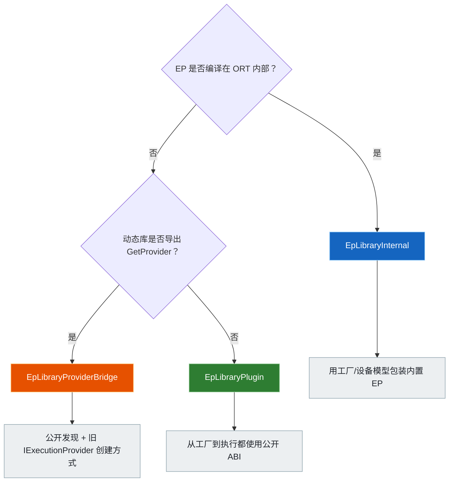

| 接入方式 | ORT 如何识别 | 如何创建会话 EP | 核验源码中的例子 | 适用场景 |
|---|---|---|---|---|
| **Internal** | 由 ORT 自行注册 | 直接调用内部工厂 | CPU；启用 `USE_DML` 时的 DML；满足 `USE_WEBGPU && !ORT_USE_EP_API_ADAPTERS` 时的 WebGPU | ORT Core 构建 |
| **Provider bridge** | 动态库同时导出 `GetProvider` 和两个工厂符号 | 调用旧接口 `Provider::CreateIExecutionProvider()` | CUDA、OpenVINO、QNN、MIGraphX、Vitis AI、TensorRT RTX | 分阶段改造现有 EP |
| **Pure plugin** | 动态库导出两个工厂符号，但没有 `GetProvider` | 调用 `OrtEpFactory::CreateEp()`，再封装 `OrtEp` | 原生 WebGPU、独立 CUDA plugin、示例插件 | 新 EP 或与 ORT Core 完全解耦的 EP |

Loader 会检查动态库是否导出 `GetProvider`，据此选择相应的加载方式；应用无需额外指定类型。源码中同时存在 CUDA bridge 和 pure-plugin 实现，是因为它们代表两种不同的发布方式。

### 纯插件必须导出的符号

```cpp
OrtStatus* CreateEpFactories(
    const char* registration_name,
    const OrtApiBase* ort_api_base,
    const OrtLogger* default_logger,
    OrtEpFactory** factories,
    size_t max_factories,
    size_t* num_factories);

OrtStatus* ReleaseEpFactory(OrtEpFactory* factory);
```

| 公开要求 | 具体含义 |
|---|---|
| 必须导出名称完全一致的 C 符号 | ORT 会解析 `CreateEpFactories` 和 `ReleaseEpFactory` |
| 宿主交互使用公开 API | 动态库从 `OrtApiBase` 获取带版本的 API 表 |
| C++ 异常不能越过 ABI 边界 | 插件必须捕获异常并返回 `OrtStatus*` |
| 构建时可以复用内部实现 | 需要保持公开 C 兼容的是**运行时 ABI 边界**，并非每个实现文件 |

---

## 核心对象与所有权

### 对象及其所有权

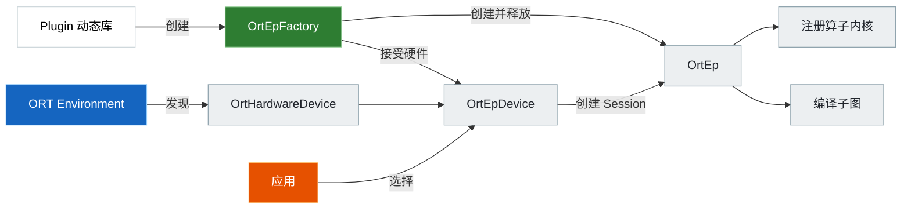

| 对象 | 由谁创建 | 生命周期和所有者 | 作用 |
|---|---|---|---|
| `OrtHardwareDevice` | 由 ORT 发现，或由获准创建虚拟设备的工厂创建 | Environment | 描述物理或虚拟 CPU/GPU/NPU |
| `OrtEpFactory` | 插件的 `CreateEpFactories()` | 动态库注册期间有效；由 `ReleaseEpFactory()` 释放 | 声明 EP 名称、接受设备、提供共享资源并创建 `OrtEp` |
| `OrtEpDevice` | 工厂调用 `OrtEpApi::CreateEpDevice()`，随后由 ORT 接管 | Environment 注册期间 | 将**一个工厂**与**一个硬件设备**配对，并携带 metadata 和默认 options |
| `OrtEp` | `OrtEpFactory::CreateEp()` | 随 Session 存活；由 `OrtEpFactory::ReleaseEp()` 释放 | 在该会话中声明并执行节点 |
| `OrtNodeComputeInfo` | 编译型 `OrtEp` | 会话存续期间由 ORT 持有，最后由 EP 批量释放 | 为一张编译图定义 create-state、compute 和 release-state 回调 |
| `OrtKernelRegistry` | 基于内核的 EP | 原始 registry 由 EP 持有；本文核验的源码版本会把注册项复制到 ORT | 定义各算子内核的创建回调和实现回调 |

`OrtEpDevice` 表示一组可供选择的 **EP + 硬件配对**，既不是设备内存，也不是内存分配器。

### 三种名称各司其职

这三个名称容易混淆，但它们由不同角色为不同用途选定。只有其中一对**必须**完全一致。

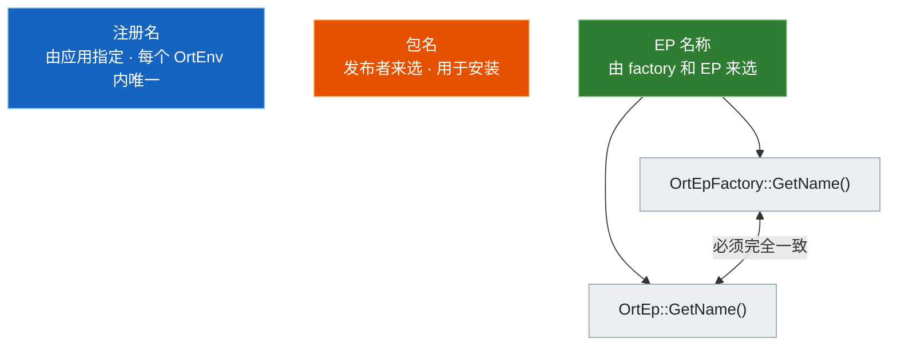

| 名称 | 由谁指定 | 用途 | 一致性要求 |
|---|---|---|---|
| 注册名 | 应用 | 作为一个 `OrtEnv` 内的键，也用于卸载动态库 | 在该 Environment 中必须唯一 |
| EP 名称 | 工厂 / EP 实现 | 筛选设备、标识会话 Provider、记录节点分配 | `OrtEpFactory::GetName()` 与 `OrtEp::GetName()` **必须一致** |
| 包名 | 发布者 | 安装并定位动态库 | 不要求等于前两者 |

`onnxruntime-ep-webgpu` 可以是包名，但它不会自动成为 EP 名称或注册名。

### 运行时会检查什么

| 时机 | 本次核验源码中的检查 | 不能据此认为 |
|---|---|---|
| 注册动态库 | 拒绝重复的注册名 | 软件包名称一定是有效的 EP 名称 |
| 显式选择设备 | 所有设备的 EP 名称必须相同，工厂指针也必须完全相同 | 不同工厂只要名称相同就可以混用 |
| 纯 `OrtEp` 初始检查 | `ort_version_supported >= 22`；`GetName` 指针及返回字符串均非空 | 此时已经验证了完整回调表，或已检查工厂与 EP 名称一致 |
| 实际调用回调 | 只有执行到相应流程时，才检查该流程所需的回调 | 创建会话时一定能提前发现所有可选回调错误 |

官方约定仍要求工厂名称与 EP 名称一致。不要等到运行时后期报错，才发现两者不匹配。

---

## 了解完整生命周期

### 从注册到执行的完整流程

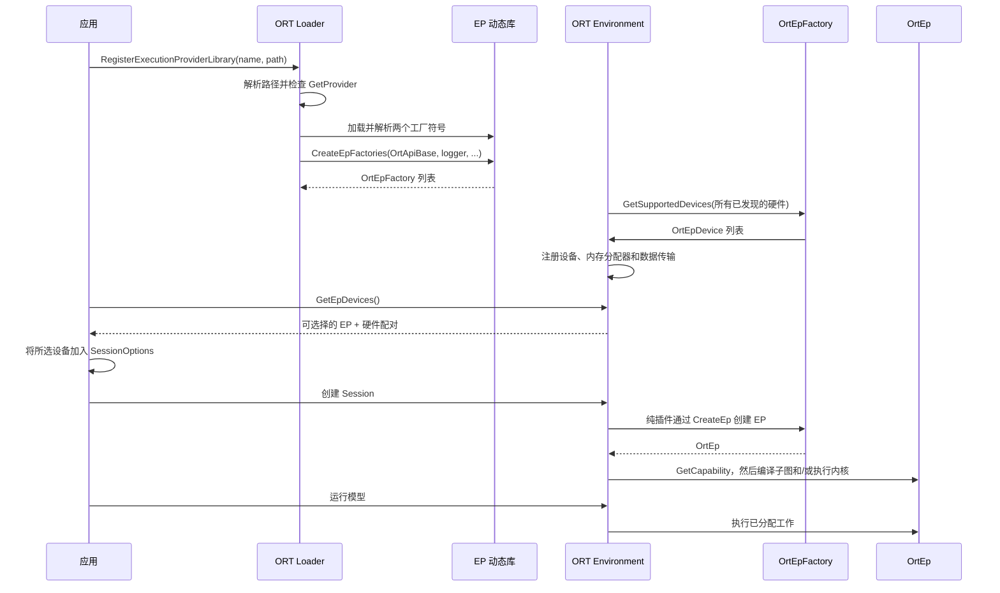

创建会话时，Internal 和 provider bridge 会直接创建内部 `IExecutionProvider`。只有纯插件会调用 `CreateEp()`，并通过 ORT 内部的 `PluginExecutionProvider` 适配器接入。

### 本文核验版本中的实现细节

| 主题 | 当前实现 | 是否属于稳定约定 |
|---|---|---|
| 相对动态库路径 | 使用 `GetRuntimePath() / relative_path`；相对路径以 ORT 运行库目录为基准，而不是进程工作目录 | **源码实现**；软件包 helper 最好返回绝对路径 |
| 工厂输出容量 | Loader 当前提供 4 个槽位 | **源码实现**，插件不能把它当作固定常量 |
| 设备输出容量 | Environment 当前为每个工厂提供 8 个槽位 | **源码实现**，插件不能把它当作固定常量 |
| 虚拟设备 | 注册名以 `.virtual` 结尾时，ORT 会临时设置 `allow_virtual_devices=1` | **源码实现**；可用于交叉编译，但不能说明本机存在对应硬件 |
| Minimal build | 注册、设备、V2 append 和 `GetEpApi()` 不可用，或返回 `ORT_NOT_IMPLEMENTED` | 取决于构建配置 |
| 多设备工厂 | 一个 `OrtEp` 接收所有被选设备，并负责协调它们 | **公开约定** |
| 由 ORT 跨设备分图 | 提供多个工厂；每个工厂只支持一个设备，并使用唯一的 EP 名称 | **公开约定** |

### 销毁状态机

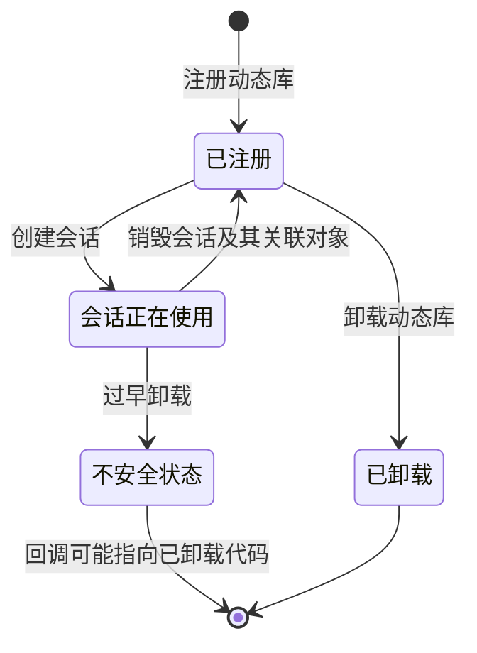

公开 API 要求调用方自行保证：**卸载动态库之前，必须先释放所有使用该库的会话**。Loader 不会检查是否还有活跃会话，也不会为了保护应用而对动态库进行引用计数。

| 顺序 | 正常的清理步骤 |
|---:|---|
| 1 | 释放 `RunOptions`、`IOBinding`、输出以及其他与会话关联的对象 |
| 2 | 销毁会话；编译型 EP 先释放 `OrtNodeComputeInfo`，随后由工厂释放 `OrtEp` |
| 3 | 调用 `UnregisterExecutionProviderLibrary(registration_name)` |
| 4 | ORT 注销数据传输、内部工厂查询项、设备和共享内存分配器 |
| 5 | ORT 清理 `OrtEpDevice`，调用 `ReleaseEpFactory`，最后再卸载动态库 |

Environment 销毁时，ORT 会先清理共享内存分配器，再卸载剩余的 EP 动态库，因为内存分配器的 deleter 可能仍会调用插件代码。

---

## 选择执行方式

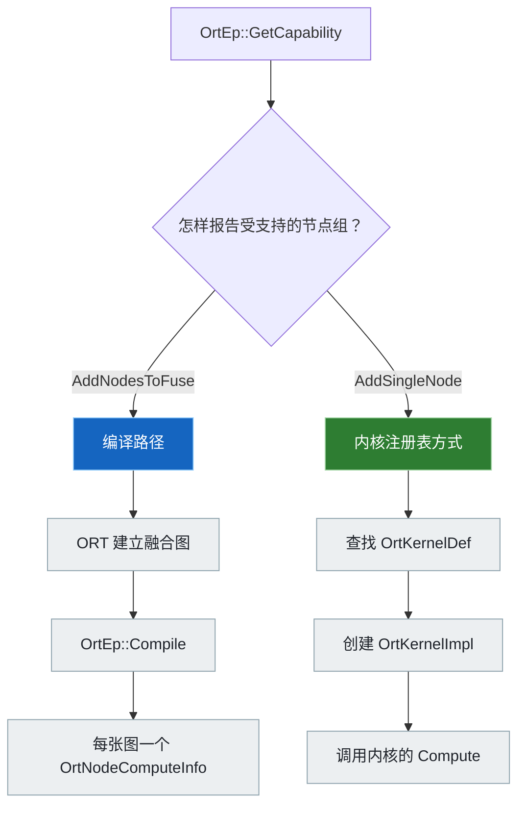

| 对比项 | 编译型 EP | 基于内核注册表的 EP | 混合 EP |
|---|---|---|---|
| 稳定执行接口始于 | 1.23 | 1.24 | 1.24+ |
| 如何报告支持范围 | `EpGraphSupportInfo_AddNodesToFuse()` | 查找内核后调用 `EpGraphSupportInfo_AddSingleNode()` | 根据节点或分组混用两者 |
| 运行时对象 | 每张融合图一个 `OrtNodeComputeInfo` | `OrtKernelDef` + 创建函数 + `OrtKernelImpl` | 两者都有 |
| `Compile` | 必须实现 | 可以为空 | 只处理融合分组 |
| 典型用途 | 后端编译器、图加速器、EPContext | 已有的逐算子内核库 | 渐进式迁移或专用融合算子 |

### 所有权与生命周期规则

| 对象 | 规则 |
|---|---|
| 传给 `GetCapability()` / `Compile()` 的 `OrtGraph` | 只在调用期间有效；如果后续还要使用其中的名称或信息，必须提前复制 |
| `OrtNodeComputeInfo` | 由 EP 分配；会话存续期间由 ORT 持有；最终由 EP 在 `ReleaseNodeComputeInfos()` 中释放 |
| `Compile()` 返回的 EPContext node | ORT 接管所有权 |
| `GetKernelRegistry()` 返回的 registry | 在 EP 的整个生命周期内都必须有效；本文核验的 ORT 源码会复制其中的注册项 |
| If / Loop / Scan | 公开的 1.24 `OrtEpApi` helper 可以创建访问 ORT 会话内部信息的控制流内核 |

官方 TensorRT Plugin EP 示例同时提供 `Compile` 和 `GetKernelRegistry`，说明这两种执行方式可以组合使用。

---

## 处理 ABI 版本兼容

### 需要分别处理的两个方向

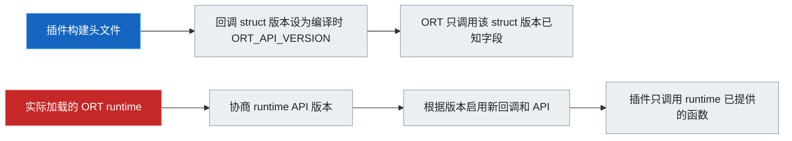

| 调用方向 | 正确做法 | 常见错误 |
|---|---|---|
| ORT 调用插件的回调 struct | 将 `ort_version_supported` / `version` 设为**编译插件时使用的头文件版本** | 为了假装兼容旧 runtime 而故意调低该值 |
| 插件调用 `OrtApi` / `OrtEpApi` | 检测**实际加载的 runtime 版本**，检查最低要求，并按版本决定能否调用新接口 | 直接调用 `GetApi(ORT_API_VERSION)`，并假设旧 runtime 也提供同一张表 |

纯 CUDA 和 WebGPU 插件都使用 `ApiInit(ort_api_base, ORT_PLUGIN_EP_MIN_ORT_VERSION)`。CUDA 还会根据协商得到的 runtime 版本决定是否启用可选回调。`ort_version_supported` 并不负责这部分版本协商。

### 本文核验版本的 API 演进

ORT 的新版本会在已有接口之后**追加**内容，不会改写原有字段。下面的时间线表示各项能力从哪个版本开始提供。


| ORT API | 新增或扩展的公开接口 | 说明 |
|---:|---|---|
| 1.22 | 动态库注册/卸载；hardware/EP device 发现与选择；基础 factory/EP 字段 | 奠定基础；图执行回调从 1.23 起稳定 |
| 1.23 | 图读取、`GetCapability`、`Compile`、`OrtNodeComputeInfo`、allocator、transfer、stream、layout、run hook、编译模型兼容信息 | 支持编译型 EP |
| 1.24 | Kernel registry、If/Loop/Scan helper、虚拟设备、外部资源、自定义 op domain、设备不兼容详情 | 支持基于内核注册表的 EP；仅使用 registry 的 EP 可以不实现 `Compile` |
| 1.25 | EP profiler 与事件、算子 schema 查询、`OrtEp::Sync`、图形互操作 | 当前 `OrtEpApi` 函数表的最后一次追加 |
| 1.26 | 资源预算与图捕获/重放回调 | 主要加入 `OrtEp` 及相关类型，不在 `OrtEpApi` 中 |
| 1.27 | Session 初始化结束、默认 memory device、释放已捕获图 | 本文核验版本中最新的 `OrtEp` 回调 |
| 1.28 | `OrtEpFactory::SelectBestModelCandidate`；Core `OrtApi` 增加 `KernelContext_GetSyncStream` 和实验函数的稳定查询入口 | 本文核验版本中最新的 `OrtEpFactory` 回调 |
| 1.29 开发分支 | 头文件报告 API 29，但本文核验的源码还没有最终确定的 1.29 `OrtApi`、`OrtEpApi`、`OrtEp` 或 `OrtEpFactory` 新增项 | 不能根据 `main` 推断已发布的 1.29 兼容性约定 |

在本文核验的源码中，`OrtEpApi` 函数表最后一个槽位断言对应版本 25。此后的 Plugin EP 能力还可能通过回调 struct 或核心 `OrtApi` 提供，因此不能把“Plugin EP API 版本”理解为一张独立函数表的版本。

> [!IMPORTANT]
> `main` 分支的头文件、正式发布的 ORT 软件包和厂商插件包是三个独立定版本的产物。编译成功并不代表运行时一定兼容。

---

## 在应用中接入

这组 API 从 ORT 1.22 开始提供，但具体插件可能要求更高的 patch 或 minor 版本。应以插件软件包声明的最低版本和运行时检查结果为准。

```python
import onnxruntime as ort
import vendor_plugin_ep

registration_name = "my_plugin_registration"
library_path = vendor_plugin_ep.get_library_path()
ep_names = vendor_plugin_ep.get_ep_names()
if not ep_names:
    raise RuntimeError("插件包没有报告 EP 名称")
ep_name = ep_names[0]

ort.register_execution_provider_library(registration_name, library_path)
session = None
try:
    devices = [device for device in ort.get_ep_devices() if device.ep_name == ep_name]
    if not devices:
        raise RuntimeError(f"插件已装载，但没有发现兼容的 {ep_name} 设备")

    options = ort.SessionOptions()
    options.add_session_config_entry("session.disable_cpu_ep_fallback", "1")
    options.add_provider_for_devices([devices[0]], {})

    session = ort.InferenceSession("model.onnx", sess_options=options)
    # 使用固定输入运行，比较输出，并收集节点分配和 profile 证据。
finally:
    del session
    ort.unregister_execution_provider_library(registration_name)
```

这段代码采用了官方 Python 示例中的 API 名称和清理顺序。

| 常见误区 | 应当这样做 |
|---|---|
| 假设注册名就是 EP 名称 | 读取软件包 helper 返回的名称，再筛选 `get_ep_devices()` |
| 把 `get_available_providers()` 当成动态设备目录 | 先注册，再使用 `get_ep_devices()` |
| 传入所有同名设备 | 先选择一个；如需传入多个设备，它们必须来自同一个工厂 |
| 按工作目录拼接相对路径 | 优先使用返回绝对路径的 `get_library_path()` |
| 认为会话创建成功就代表 EP 已执行 | 禁止 CPU 回退，实际运行模型并比较输出，再检查节点分配和 profile |
| 加载来源不明的插件 | 插件是在进程内运行的原生代码，只能加载来自可信来源的产物 |

自动选择可以通过 `SessionOptionsSetEpSelectionPolicy()` 或自定义 delegate 实现。它只负责决定使用哪个设备，并不能确认所选 EP 是否支持整个模型。

---

## 确认 EP 是否实际执行

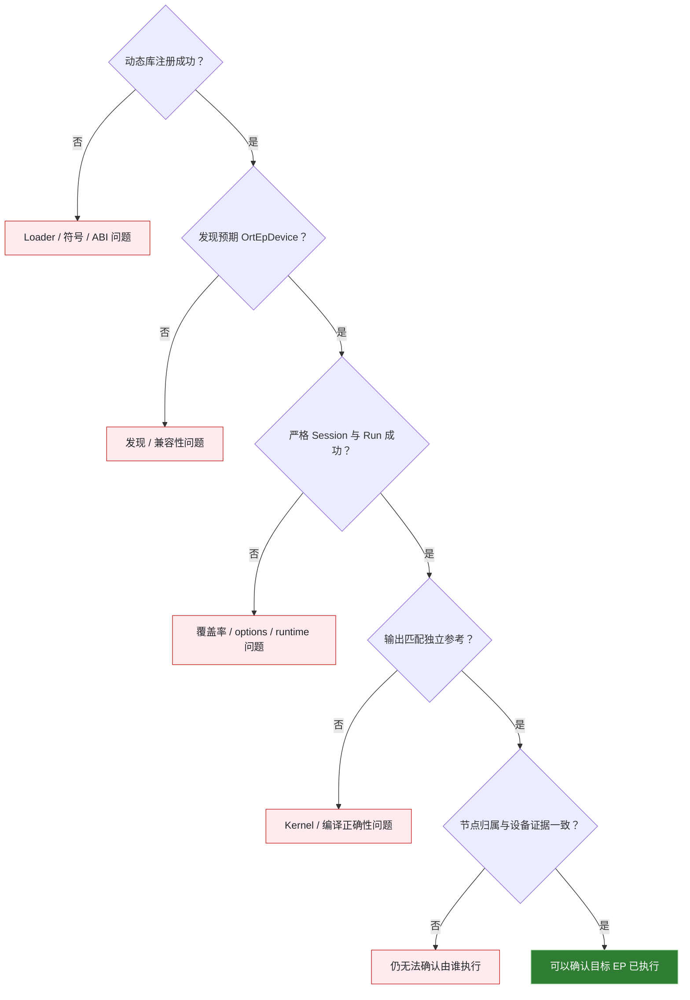

| 层级 | 证据 | 可以确认什么 |
|---:|---|---|
| 1 | 注册成功 | 动态库已加载，必需符号能够解析，工厂也已成功创建 |
| 2 | 出现预期的 `OrtEpDevice` | 工厂接受了已发现的设备，或获准创建的虚拟设备 |
| 3 | 禁止 CPU 回退后，会话和 `Run` 均成功 | ORT 没有把 EP 不支持的计算图节点静默交给 CPU |
| 4 | 输出匹配独立 CPU/NumPy 参考 | 数值行为在已声明容差内正确 |
| 5 | 节点分配/profile 指向目标 EP，厂商 trace 也显示目标设备活跃 | ORT 的节点分配和目标硬件活动相互印证，可以确认实际执行情况 |

在 C/C++ 中，从 API 1.24 起可以设置 `session.record_ep_graph_assignment_info=1`，再查询 `Session_GetEpGraphAssignmentInfo()`。ORT profile 也能记录节点事件归属。从 1.25 起，`OrtEpProfilerImpl` 可以把插件设备事件合并到 ORT timeline 中。延迟或设备利用率只能作为辅助证据，不能单独确认由哪个 EP 执行。

---

## 开发、测试与打包


| 检查项 | 最低要求 | 参考来源 |
|---|---|---|
| ABI 入口 | 公开头文件、两个 C 导出、不让 C++ 异常越界 | Development 文档；WebGPU/CUDA 入口 |
| Struct 初始化 | 先清零；设置编译时的 `ORT_API_VERSION`；只填写当前版本支持的回调 | 公开头文件与示例 |
| 身份 | 工厂与 EP 名称一致；版本字符串遵循 SemVer | Development 文档 |
| 设备发现 | 只返回确实兼容的设备；没有支持设备时返回空 | `GetSupportedDevices()` 公开约定 |
| 图信息 | 不保留临时 `OrtGraph` 或节点数据；如需后续使用，必须先复制 | `Compile()` 头文件注释 |
| 资源 | 统一规划内存分配器、数据传输、stream、自定义 domain 和卸载时机 | Factory API 与 Environment 清理代码 |
| 插件测试 | 自行覆盖回调、错误、无设备、错误版本、重复装载和清理 | 官方 Testing 文档 |
| ORT 算子测试 | 构建 `onnxruntime_provider_test`；设置 `ORT_UNIT_TEST_MAIN_DYNAMIC_PLUGIN_EP_CONFIG_JSON` | 官方 Testing 文档 |
| 模型测试 | 相关完整模型；严格无回退执行；检查输出和节点归属 | 官方推荐高层模型测试 |
| 版本 CI | 最低支持 runtime + 目标 runtime；门控新 API | CUDA/WebGPU `ApiInit` 模式 |
| 软件包内容 | 插件动态库及其依赖；不要额外捆绑一份 ORT Core 动态库 | 官方 Packaging 文档 |
| 包 helper | `get_library_path()`、`get_ep_names()`，可选 `get_ep_name()` | 官方 PyPI 建议 |
| 软件包依赖 | 通常应避免强制依赖某一种 ORT 发行包；无论如何都要记录并验证兼容的 ORT 版本范围 | 官方 Packaging 文档；厂商包可以采用更严格的 metadata |

官方测试指南目前要求各 EP 自行负责集成测试和模型覆盖测试，尚未提供完整的 ABI 一致性测试工具集。

---

## 本仓库已验证的实现

### 本仓库采用的实现

| 仓库中的实现 | 上游源码中的加载类别 | 与传统 EP 的关系 | 严格测试 |
|---|---|---|---|
| AMD Windows ML MIGraphX | Provider bridge | 通过工厂和设备发现机制对外提供现有 MIGraphX 后端 | [AMD/provider_test.py](../AMD/provider_test.py) |
| Qualcomm QNN 2.x | Provider bridge | 把 QNN CPU/GPU/HTP 后端从一体式 ORT 包中解耦 | [Qualcomm/one_click.py](../Qualcomm/one_click.py) |
| NVIDIA TensorRT RTX | Provider bridge | 与经典 TensorRT EP 是不同产品，但使用相同的 Plugin EP 加载机制 | [NVIDIA/provider_test.py](../NVIDIA/provider_test.py) |
| 原生 WebGPU | Pure plugin | 使用原生 ORT 宿主和包；不是浏览器 `onnxruntime-web` API | [native_webgpu_validator.py](../WebGPU/onnxruntime-web-demo/native_webgpu_validator.py) |

上游源码还包含独立的纯 CUDA Plugin EP。这并不表示本仓库目前使用的内置 `CUDAExecutionProvider` 已被取代。两种实现的软件包、依赖和验证结论都需要分别管理。

### 源码核验表

以下链接全部指向本文核验的固定提交，而不是随时可能变化的 `main` 分支。

| 源码 | 核验的结论 |
|---|---|
| [`onnxruntime_ep_c_api.h`](https://github.com/microsoft/onnxruntime/blob/bf6aa0063d1c178c4a4d33ed6770425834147e2a/include/onnxruntime/core/session/onnxruntime_ep_c_api.h) | 公开 struct、所有权注释、回调版本、当前 4/8 容量、1.28 factory 尾字段 |
| [`onnxruntime_c_api.h`](https://github.com/microsoft/onnxruntime/blob/bf6aa0063d1c178c4a4d33ed6770425834147e2a/include/onnxruntime/core/session/onnxruntime_c_api.h) 与 [`onnxruntime_c_api.cc`](https://github.com/microsoft/onnxruntime/blob/bf6aa0063d1c178c4a4d33ed6770425834147e2a/onnxruntime/core/session/onnxruntime_c_api.cc) | 注册约定、Core API 版本、只追加槽位断言和 minimal-build stub |
| [`utils.cc`](https://github.com/microsoft/onnxruntime/blob/bf6aa0063d1c178c4a4d33ed6770425834147e2a/onnxruntime/core/session/utils.cc) | 相对路径基准、`GetProvider` 探测、同名且同 factory 的选择要求 |
| [`ep_library_plugin.cc`](https://github.com/microsoft/onnxruntime/blob/bf6aa0063d1c178c4a4d33ed6770425834147e2a/onnxruntime/core/session/plugin_ep/ep_library_plugin.cc) | 必需符号、factory 创建/释放、动态卸载 |
| [`environment.cc`](https://github.com/microsoft/onnxruntime/blob/bf6aa0063d1c178c4a4d33ed6770425834147e2a/onnxruntime/core/session/environment.cc) | 重复名称、设备、虚拟模式、内存分配器/数据传输和卸载顺序 |
| [`ep_library_internal.cc`](https://github.com/microsoft/onnxruntime/blob/bf6aa0063d1c178c4a4d33ed6770425834147e2a/onnxruntime/core/session/plugin_ep/ep_library_internal.cc) 与 [`ep_library_provider_bridge.cc`](https://github.com/microsoft/onnxruntime/blob/bf6aa0063d1c178c4a4d33ed6770425834147e2a/onnxruntime/core/session/plugin_ep/ep_library_provider_bridge.cc) | 内置 Provider 列表与旧桥接适配 |
| [`ep_plugin_provider_interfaces.cc`](https://github.com/microsoft/onnxruntime/blob/bf6aa0063d1c178c4a4d33ed6770425834147e2a/onnxruntime/core/session/plugin_ep/ep_plugin_provider_interfaces.cc) | 纯插件适配器、初始检查、能力、编译与释放顺序 |
| [`ep_kernel_registration.cc`](https://github.com/microsoft/onnxruntime/blob/bf6aa0063d1c178c4a4d33ed6770425834147e2a/onnxruntime/core/session/plugin_ep/ep_kernel_registration.cc) 与 [`ep_api.cc`](https://github.com/microsoft/onnxruntime/blob/bf6aa0063d1c178c4a4d33ed6770425834147e2a/onnxruntime/core/session/plugin_ep/ep_api.cc) | Registry 复制、控制流 helper、`OrtEpApi` 版本槽 |
| [`example_plugin_ep`](https://github.com/microsoft/onnxruntime/tree/bf6aa0063d1c178c4a4d33ed6770425834147e2a/onnxruntime/test/autoep/library/example_plugin_ep) 与 [`example_plugin_ep_kernel_registry`](https://github.com/microsoft/onnxruntime/tree/bf6aa0063d1c178c4a4d33ed6770425834147e2a/onnxruntime/test/autoep/library/example_plugin_ep_kernel_registry) | 编译型和 kernel-registry 参考实现 |
| [`cuda/plugin`](https://github.com/microsoft/onnxruntime/tree/bf6aa0063d1c178c4a4d33ed6770425834147e2a/onnxruntime/core/providers/cuda/plugin) 与 [`webgpu/ep/api.cc`](https://github.com/microsoft/onnxruntime/blob/bf6aa0063d1c178c4a4d33ed6770425834147e2a/onnxruntime/core/providers/webgpu/ep/api.cc) | 纯插件入口与 runtime 版本协商 |

官方参考：[Usage](https://onnxruntime.ai/docs/execution-providers/plugin-ep-libraries/usage.html) · [Development](https://onnxruntime.ai/docs/execution-providers/plugin-ep-libraries/development.html) · [Testing](https://onnxruntime.ai/docs/execution-providers/plugin-ep-libraries/testing.html) · [Packaging](https://onnxruntime.ai/docs/execution-providers/plugin-ep-libraries/packaging.html)
