# ONNX Runtime Plugin EP：新手友好、源码核验指南

**Plugin EP 是一扇"门"，不是"目的地"。** 它是 ONNX Runtime 提供的公开 C 应用程序二进制接口（**ABI**），负责**加载、发现、选择、打包**执行提供程序（EP）。Plugin EP 机制本身不是 GPU、NPU，也不是名为 `PluginExecutionProvider` 的通用计算后端；通过它加载的具体 `OrtEp` 才会编译或执行其支持的模型运算。

> **一句话总结：** Plugin EP 规定具体 EP 如何接入 ONNX Runtime；计算能力由加载后的 EP 提供，而不是由加载机制本身提供。

### 如何阅读本指南

全文分三个阶段。第一次请按顺序阅读，之后可以直接跳到需要的部分。

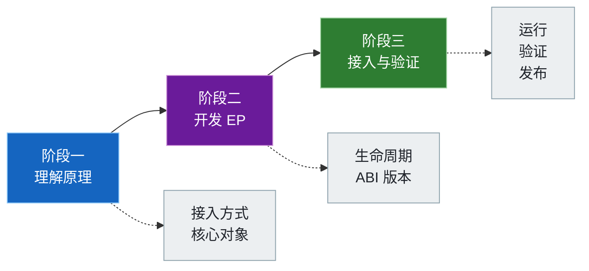
```mermaid
flowchart LR
    U["阶段一<br/>理解原理"] --> B["阶段二<br/>开发 EP"] --> P["阶段三<br/>接入与验证"]
    U -.-> Ux["接入方式<br/>核心对象"]
    B -.-> Bx["生命周期<br/>ABI 版本"]
    P -.-> Px["运行<br/>验证<br/>发布"]

    class U blue
    class B purple
    class P green
    class Ux,Bx,Px leaf
    classDef blue fill:#1565c0,stroke:#90caf9,color:#ffffff
    classDef purple fill:#6a1b9a,stroke:#ce93d8,color:#ffffff
    classDef green fill:#2e7d32,stroke:#a5d6a7,color:#ffffff
    classDef leaf fill:#eceff1,stroke:#90a4ae,color:#20242b
```

**核验版本：** 本文以正式发布的 ONNX Runtime [`v1.29.0`、提交 `2e2543f`](https://github.com/microsoft/onnxruntime/commit/2e2543fbe9fae542f921d47a72d21d5a4ef0b710) 为准，源码与文档核验于 2026-09-01。下文的软件包路线已于 2026-08-30 在 Windows 11 + RTX 5060 Ti 上，用普通 `onnxruntime==1.29.0` 与 NVIDIA 独立 TensorRT RTX EP `0.4.0` 实际执行；本次文档更新保留该硬件记录，并未重新运行。本文会分别标明源码约定与软件包行为。

下文每条结论都标注了可信度：

| 标签 | 含义 |
|---|---|
| **公开约定** | 由公开头文件或官方文档明确规定，可以放心依赖 |
| **源码实现** | 在锁定的 `v1.29.0` 发布源码中成立，但后续版本仍可能改变该实现细节 |
| **仓库实测** | 本仓库已用相应软件包实际运行验证过的行为 |

[English](README.md) · [Plugin EP 官方文档](https://onnxruntime.ai/docs/execution-providers/plugin-ep-libraries/)

---

## 目录

**阶段一 · 了解工作机制**
- [先厘清三个问题](#先厘清三个问题) —— 区分 EP 身份、加载方式和执行方式
- [选择接入方式](#选择接入方式) —— 内置、provider bridge，还是纯插件
- [核心对象与所有权](#核心对象与所有权) —— 谁负责创建，谁负责释放

**阶段二 · 构建 EP**
- [了解完整生命周期](#了解完整生命周期) —— 从注册、执行到安全清理
- [选择执行方式](#选择执行方式) —— 编译子图、注册内核，或两者兼用
- [处理 ABI 版本兼容](#处理-abi-版本兼容) —— 分清两个兼容方向

**阶段三 · 接入与验证**
- [在应用中接入](#在应用中接入) —— 注册、选择、运行三步法
- [确认 EP 是否实际执行](#确认-ep-是否实际执行) —— 五级证据链
- [开发、测试与打包](#开发测试与打包) —— 完整检查后再发布
- [本仓库已验证的实现](#本仓库已验证的实现) —— 本仓库已经核验了什么

---

## 先厘清三个问题

三个彼此独立的问题决定了一切。混在一起想，Plugin EP 会显得很绕；分开想，立刻就清楚了。

### 整体结构

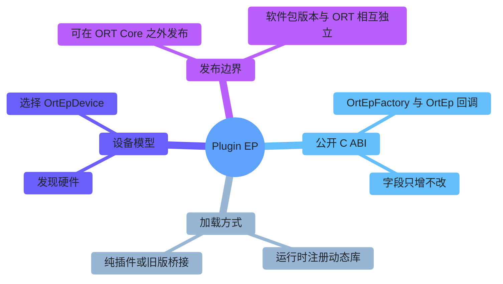
```mermaid
%%{init: {"theme":"base","themeVariables":{"primaryColor":"#dbeafe","primaryTextColor":"#20242b","secondaryColor":"#e0f2fe","secondaryTextColor":"#20242b","tertiaryColor":"#f1f5f9","tertiaryTextColor":"#20242b","lineColor":"#64748b"}}}%%
mindmap
  root((Plugin EP))
    公开 C ABI
      OrtEpFactory 与 OrtEp 回调
      字段只增不改
    加载方式
      运行时注册动态库
      纯插件或旧版桥接
    设备模型
      发现硬件
      选择 OrtEpDevice
    发布边界
      可在 ORT Core 之外发布
      软件包版本与 ORT 相互独立
```

### 三个问题分别回答什么

关于 Plugin EP 的任何疑问，都能归到下面三类之一。改动其中一类，通常不会波及另外两类。

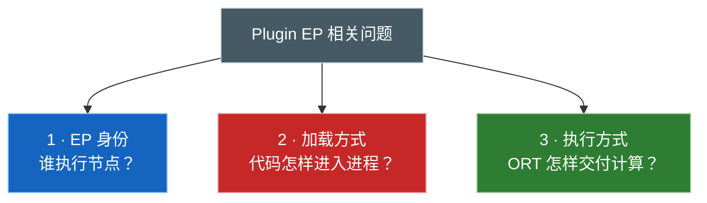
```mermaid
flowchart TD
    Q["Plugin EP 相关问题"] --> ID["1 · EP 身份<br/>谁执行节点？"]
    Q --> LO["2 · 加载方式<br/>代码怎样进入进程？"]
    Q --> EX["3 · 执行方式<br/>ORT 怎样交付计算？"]

    class Q slate
    class ID blue
    class LO red
    class EX green
    classDef slate fill:#455a64,stroke:#cfd8dc,color:#ffffff
    classDef blue fill:#1565c0,stroke:#90caf9,color:#ffffff
    classDef red fill:#c62828,stroke:#ef9a9a,color:#ffffff
    classDef green fill:#2e7d32,stroke:#a5d6a7,color:#ffffff
```

| 问题 | 需要确认的内容 | 例子 |
|---|---|---|
| **1 · EP 身份** | 谁声明并执行图节点？ | CUDA EP、QNN EP、WebGPU EP、厂商新 EP |
| **2 · 加载方式** | EP 代码怎样进入进程？ | 内置、provider bridge 动态库、纯 Plugin EP 动态库 |
| **3 · 执行方式** | ORT 怎样把计算交给 EP？ | 编译融合子图、注册算子内核，或两者混用 |

> 把 CUDA EP 改成 Plugin EP 打包，会改变它的加载、发现、选择和发布方式，但**不会**改变它支持哪些 CUDA 算子。

---

## 选择接入方式

源码通过统一的 `EpLibrary` 抽象，提供三种接入方式。

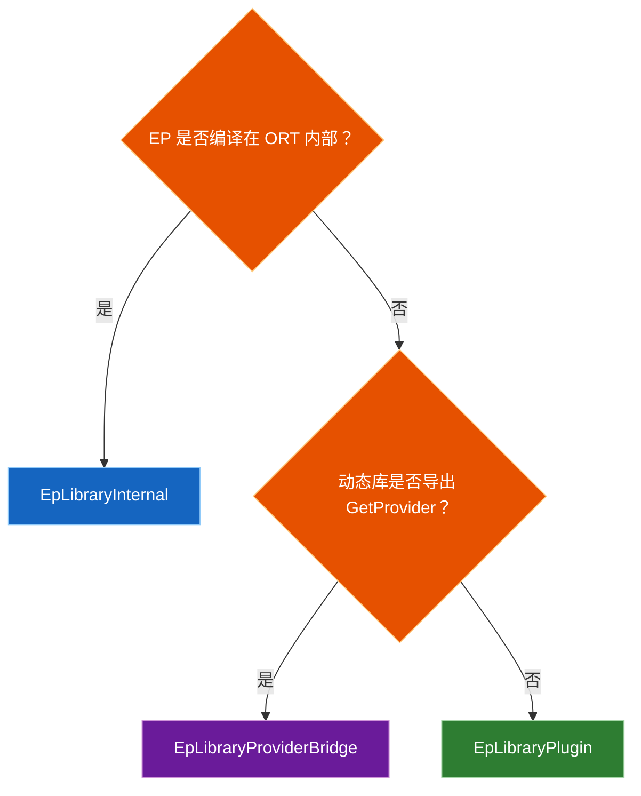
```mermaid
flowchart TD
    Q{"EP 是否编译在 ORT 内部？"} -->|是| I["EpLibraryInternal"]
    Q -->|否| G{"动态库是否导出 GetProvider？"}
    G -->|是| B["EpLibraryProviderBridge"]
    G -->|否| P["EpLibraryPlugin"]

    class Q,G orange
    class I blue
    class B purple
    class P green
    classDef orange fill:#e65100,stroke:#ffcc80,color:#ffffff
    classDef blue fill:#1565c0,stroke:#90caf9,color:#ffffff
    classDef purple fill:#6a1b9a,stroke:#ce93d8,color:#ffffff
    classDef green fill:#2e7d32,stroke:#a5d6a7,color:#ffffff
```

| 接入方式 | 识别方式 | 会话如何创建 EP | 例子（核验源码/软件包） | 适用场景 |
|---|---|---|---|---|
| **Internal** | 由 ORT 自行注册 | 直接调用内部工厂 | CPU；`USE_DML` 下的 DML；`USE_WEBGPU && !ORT_USE_EP_API_ADAPTERS` 下的 WebGPU | ORT Core 构建 |
| **Provider bridge** | 动态库同时导出 `GetProvider` 和两个工厂符号 | 调用旧接口 `Provider::CreateIExecutionProvider()` | CUDA、OpenVINO、QNN、MIGraphX、Vitis AI | 改造现有 EP |
| **Pure plugin** | 动态库导出两个工厂符号，没有 `GetProvider` | 调用 `OrtEpFactory::CreateEp()`，再封装成 `OrtEp` | TensorRT RTX 0.4、原生 WebGPU、独立 CUDA plugin、示例插件 | 全新或完全解耦的 EP |

Loader 只检测动态库是否导出 `GetProvider`，应用不需要额外指定类型。CUDA 同时出现在前两行，是因为它们是同一个 EP 的两条不同发布路线。

### 纯插件必须导出的符号

```cpp
OrtStatus* CreateEpFactories(
    const char* registration_name,
    const OrtApiBase* ort_api_base,
    const OrtLogger* default_logger,
    OrtEpFactory** factories,
    size_t max_factories,
    size_t* num_factories);

OrtStatus* ReleaseEpFactory(OrtEpFactory* factory);
```

| 规则 | 原因 |
|---|---|
| C 符号名必须完全一致 | ORT 按名称解析 `CreateEpFactories` 和 `ReleaseEpFactory` |
| 只经过公开的宿主边界交互 | 动态库从 `OrtApiBase` 获取带版本的 API 表 |
| C++ 异常不能越过边界 | 必须捕获异常，返回 `OrtStatus*` |
| 内部实现仍可复用 | 只有**运行时 ABI 边界**需要保持公开 C 兼容 |

---

## 核心对象与所有权

不同对象由不同角色创建。把这张关系图记牢，生命周期相关的 bug 基本就不会再犯。

### 对象及其所有权

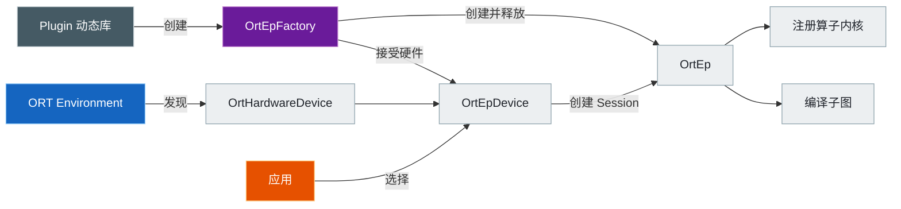
```mermaid
flowchart LR
    LIB["Plugin 动态库"] -->|创建| F["OrtEpFactory"]
    ORT["ORT Environment"] -->|发现| H["OrtHardwareDevice"]
    F -->|接受硬件| D["OrtEpDevice"]
    H --> D
    APP["应用"] -->|选择| D
    D -->|创建 Session| E["OrtEp"]
    F -->|创建并释放| E
    E --> C["编译子图"]
    E --> K["注册算子内核"]

    class LIB slate
    class ORT blue
    class APP orange
    class F purple
    class H,D,E,C,K leaf
    classDef slate fill:#455a64,stroke:#cfd8dc,color:#ffffff
    classDef blue fill:#1565c0,stroke:#90caf9,color:#ffffff
    classDef orange fill:#e65100,stroke:#ffcc80,color:#ffffff
    classDef purple fill:#6a1b9a,stroke:#ce93d8,color:#ffffff
    classDef leaf fill:#eceff1,stroke:#90a4ae,color:#20242b
```

| 对象 | 由谁创建 | 所有者 / 生命周期 | 作用 |
|---|---|---|---|
| `OrtHardwareDevice` | ORT 发现，或获准创建虚拟设备的工厂 | Environment | 描述一个物理或虚拟的 CPU/GPU/NPU |
| `OrtEpFactory` | 插件的 `CreateEpFactories()` | 动态库注册期间存活；由 `ReleaseEpFactory()` 释放 | 命名 EP、接受设备、共享资源、创建 `OrtEp` |
| `OrtEpDevice` | 工厂调用 `OrtEpApi::CreateEpDevice()`，随后由 ORT 接管 | Environment 注册期间 | 把**一个工厂**和**一个硬件设备**配成一对 |
| `OrtEp` | `OrtEpFactory::CreateEp()` | 随 Session 存活；由 `OrtEpFactory::ReleaseEp()` 释放 | 在该会话中声明并执行节点 |
| `OrtNodeComputeInfo` | 编译型 `OrtEp` | 会话期间由 ORT 持有；EP 批量释放 | 每张编译图的 create-state、compute、release 回调 |
| `OrtKernelRegistry` | 基于内核的 EP | EP 持有；ORT 会复制其中的注册项 | 定义各算子的内核创建与实现 |

> `OrtEpDevice` 代表一组可供选择的 **EP + 硬件配对**，既不是设备内存，也不是内存分配器。

### 三种名称各司其职

三个不同的角色，各自选定一个名称。只有其中一对**必须**一致。

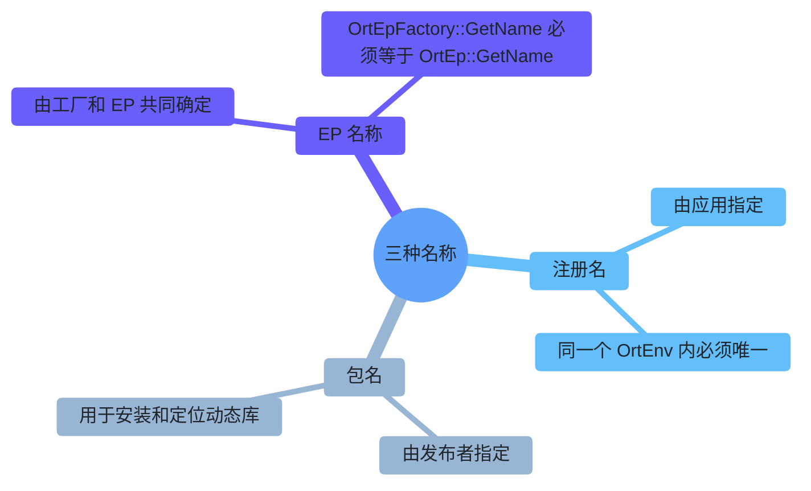
```mermaid
%%{init: {"theme":"base","themeVariables":{"primaryColor":"#dbeafe","primaryTextColor":"#20242b","secondaryColor":"#e0f2fe","secondaryTextColor":"#20242b","tertiaryColor":"#f1f5f9","tertiaryTextColor":"#20242b","lineColor":"#64748b"}}}%%
mindmap
  root((三种名称))
    注册名
      由应用指定
      同一个 OrtEnv 内必须唯一
    包名
      由发布者指定
      用于安装和定位动态库
    EP 名称
      由工厂和 EP 共同确定
      OrtEpFactory::GetName 必须等于 OrtEp::GetName
```

| 名称 | 由谁指定 | 用途 | 一致性要求 |
|---|---|---|---|
| 注册名 | 应用 | 作为一个 `OrtEnv` 内的键；用于卸载动态库 | 同一环境内唯一 |
| EP 名称 | 工厂 / EP 实现 | 筛选设备、标识会话 Provider、记录节点分配 | `OrtEpFactory::GetName()` **等于** `OrtEp::GetName()` |
| 包名 | 发布者 | 安装并定位动态库 | 不要求与前两者一致 |

> `onnxruntime-ep-webgpu` 可能只是一个包名，它不会自动成为 EP 名称或注册名。

### 运行时会检查什么

| 时机 | 实际检查内容 | 不能假设 |
|---|---|---|
| 注册动态库 | 拒绝重复的注册名 | 包名一定是有效的 EP 名称 |
| 显式选择设备 | EP 名称相同，**且**工厂指针也相同 | 名称相同、工厂不同也可以混用 |
| 纯 `OrtEp` 初始检查 | `ort_version_supported >= 22`；`GetName` 指针和返回字符串非空 | 此时已验证完整回调表或名称一致性 |
| 实际调用回调 | 只在用到该流程时才检查 | 创建会话就能提前发现所有可选回调的问题 |

官方约定仍要求工厂名称与 EP 名称一致，不要等运行时后期报错才发现两者不匹配。

---

## 了解完整生命周期

### 从注册到执行的完整流程

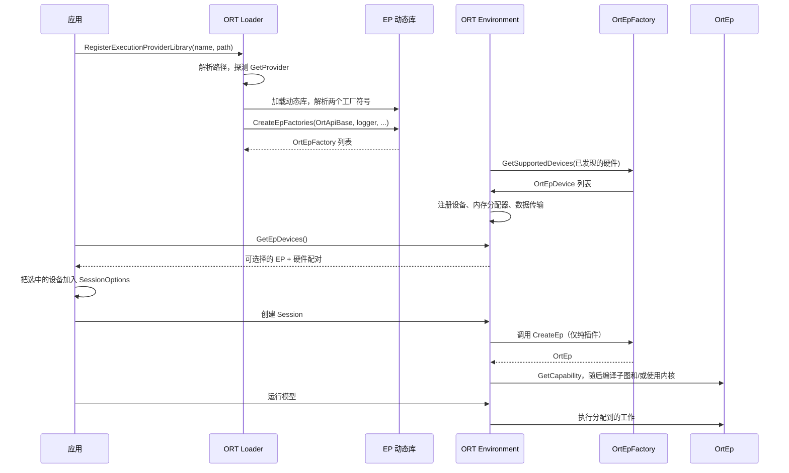
```mermaid
sequenceDiagram
    participant App as 应用
    participant Loader as ORT Loader
    participant Lib as EP 动态库
    participant Env as ORT Environment
    participant Factory as OrtEpFactory
    participant EP as OrtEp

    App->>Loader: RegisterExecutionProviderLibrary(name, path)
    Loader->>Loader: 解析路径，探测 GetProvider
    Loader->>Lib: 加载动态库，解析两个工厂符号
    Loader->>Lib: CreateEpFactories(OrtApiBase, logger, ...)
    Lib-->>Loader: OrtEpFactory 列表
    Env->>Factory: GetSupportedDevices(已发现的硬件)
    Factory->>Env: OrtEpDevice 列表
    Env->>Env: 注册设备、内存分配器、数据传输
    App->>Env: GetEpDevices()
    Env-->>App: 可选择的 EP + 硬件配对

    App->>App: 把选中的设备加入 SessionOptions
    App->>Env: 创建 Session
    Env->>Factory: 调用 CreateEp（仅纯插件）
    Factory-->>Env: OrtEp
    Env->>EP: GetCapability，随后编译子图和/或使用内核
    App->>Env: 运行模型
    Env->>EP: 执行分配到的工作
```

Internal 和 provider bridge 在创建会话时会直接生成内部 `IExecutionProvider`。只有纯插件才会调用 `CreateEp()`，并通过 ORT 内部的 `PluginExecutionProvider` 适配器接入。

### 本文核验版本中的实现细节

| 主题 | 当前实现 | 稳定性 |
|---|---|---|
| 相对动态库路径 | 相对于 `GetRuntimePath()`，而不是进程工作目录 | 源码实现 |
| 工厂输出容量 | Loader 目前提供 4 个槽位 | 源码实现 |
| 设备输出容量 | Environment 目前为每个工厂提供 8 个槽位 | 源码实现 |
| 虚拟设备 | 注册名以 `.virtual` 结尾时，临时设置 `allow_virtual_devices=1` | 源码实现 |
| Minimal build | 注册、设备和 `GetEpApi()` 都返回 `ORT_NOT_IMPLEMENTED` | 取决于构建配置 |
| 多设备工厂 | 一个 `OrtEp` 接收所有被选设备，并自行协调 | 公开约定 |
| 跨设备分图 | 每个设备各自一个工厂，且 EP 名称唯一 | 公开约定 |

### 销毁状态机

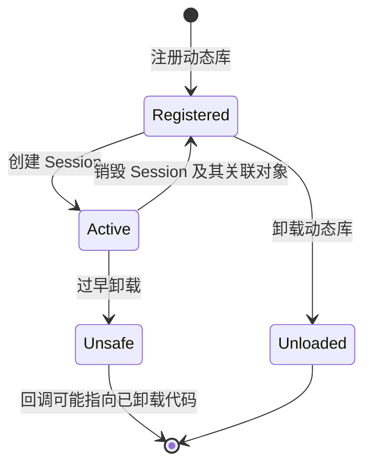
```mermaid
stateDiagram-v2
    [*] --> Registered: 注册动态库
    Registered --> Active: 创建 Session
    Active --> Registered: 销毁 Session 及其关联对象
    Registered --> Unloaded: 卸载动态库
    Active --> Unsafe: 过早卸载
    Unsafe --> [*]: 回调可能指向已卸载代码
    Unloaded --> [*]
```

| 顺序 | 正常的清理步骤 |
|---:|---|
| 1 | 释放 `RunOptions`、`IOBinding`、输出及其他会话相关对象 |
| 2 | 销毁会话——编译型 EP 先释放 `OrtNodeComputeInfo`，再由工厂释放 `OrtEp` |
| 3 | 调用 `UnregisterExecutionProviderLibrary(registration_name)` |
| 4 | ORT 注销数据传输、内部工厂条目、设备、共享内存分配器 |
| 5 | ORT 清理 `OrtEpDevice`，调用 `ReleaseEpFactory`，最后卸载动态库 |

> 前提条件由**调用方**保证：卸载动态库前必须先释放所有相关会话。Loader 不会替你对存活会话做引用计数。Environment 销毁时，ORT 会先清理共享内存分配器再卸载剩余 EP 动态库，因为分配器的 deleter 可能仍会调用插件代码。

---

## 选择执行方式

汇报"EP 支持哪些节点"有两种方式，可以只选一种，也可以混用。

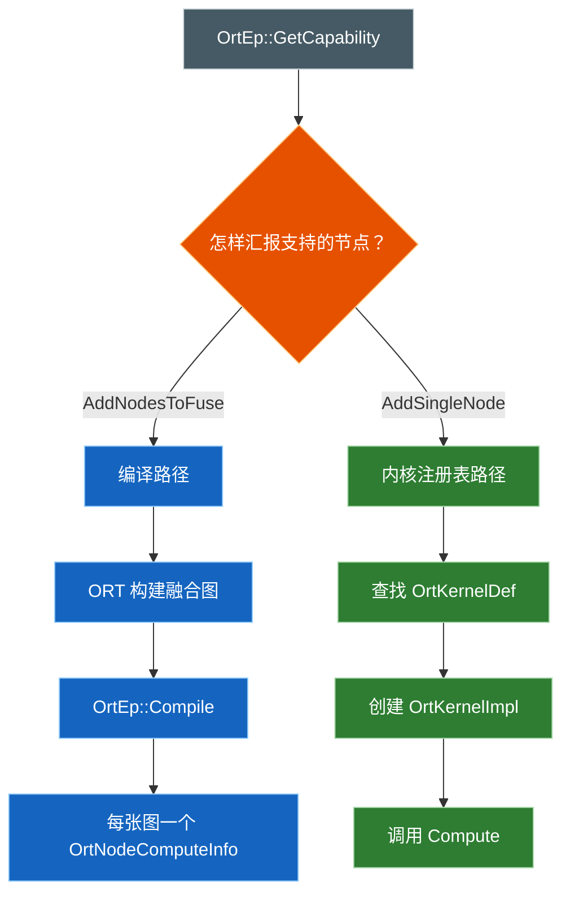
```mermaid
flowchart TD
    G["OrtEp::GetCapability"] --> Q{"怎样汇报支持的节点？"}
    Q -->|"AddNodesToFuse"| C["编译路径"]
    Q -->|"AddSingleNode"| K["内核注册表路径"]
    C --> C1["ORT 构建融合图"]
    C1 --> C2["OrtEp::Compile"]
    C2 --> C3["每张图一个 OrtNodeComputeInfo"]
    K --> K1["查找 OrtKernelDef"]
    K1 --> K2["创建 OrtKernelImpl"]
    K2 --> K3["调用 Compute"]

    class G slate
    class Q orange
    class C,C1,C2,C3 blue
    class K,K1,K2,K3 green
    classDef slate fill:#455a64,stroke:#cfd8dc,color:#ffffff
    classDef orange fill:#e65100,stroke:#ffcc80,color:#ffffff
    classDef blue fill:#1565c0,stroke:#90caf9,color:#ffffff
    classDef green fill:#2e7d32,stroke:#a5d6a7,color:#ffffff
```

| | 编译型 EP | 内核注册表 EP | 混合 EP |
|---|---|---|---|
| 稳定始于 | 1.23 | 1.24 | 1.24+ |
| 如何汇报能力 | `EpGraphSupportInfo_AddNodesToFuse()` | 查找内核后调用 `EpGraphSupportInfo_AddSingleNode()` | 按节点/分组混用 |
| 运行时对象 | 每张融合图一个 `OrtNodeComputeInfo` | `OrtKernelDef` + 创建函数 + `OrtKernelImpl` | 两者都有 |
| `Compile` | 必须实现 | 可以为空 | 只处理融合分组 |
| 典型场景 | 后端编译器、图加速器、EPContext | 已有的逐算子内核库 | 渐进迁移、专用融合算子 |

### 所有权与生命周期规则

| 对象 | 规则 |
|---|---|
| 传给 `GetCapability()` / `Compile()` 的 `OrtGraph` | 只在调用期间有效——需要的信息要提前复制 |
| `OrtNodeComputeInfo` | EP 分配；会话期间由 ORT 持有；EP 在 `ReleaseNodeComputeInfos()` 中释放 |
| `Compile()` 返回的 EPContext 节点 | 由 ORT 接管所有权 |
| `GetKernelRegistry()` 返回的 registry | 必须在 EP 整个生命周期内有效；ORT 会复制其中的注册项 |
| If / Loop / Scan | 1.24 版 `OrtEpApi` helper 可以创建能访问会话内部信息的控制流内核 |

> 官方 TensorRT Plugin EP 示例同时实现了 `Compile` 和 `GetKernelRegistry`，说明这两种模型可以组合使用。

---

## 处理 ABI 版本兼容

两个方向彼此独立，任何一个搞反，要么旧 runtime 加载新插件会崩溃，要么新 runtime 对旧插件想当然。

### 需要分别处理的两个方向

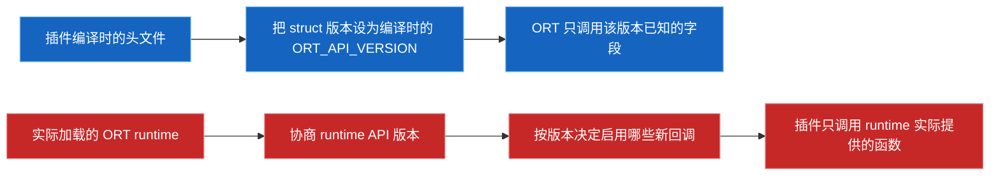
```mermaid
flowchart LR
    H["插件编译时的头文件"] --> S["把 struct 版本设为编译时的 ORT_API_VERSION"]
    S --> O["ORT 只调用该版本已知的字段"]

    R["实际加载的 ORT runtime"] --> A["协商 runtime API 版本"]
    A --> Gt["按版本决定启用哪些新回调"]
    Gt --> P["插件只调用 runtime 实际提供的函数"]

    class H,S,O blue
    class R,A,Gt,P red
    classDef blue fill:#1565c0,stroke:#90caf9,color:#ffffff
    classDef red fill:#c62828,stroke:#ef9a9a,color:#ffffff
```

| 方向 | 正确做法 | 常见错误 |
|---|---|---|
| ORT 调用插件的回调 struct | 把 `ort_version_supported` 设为编译插件时使用的头文件版本 | 故意调低该值，假装 runtime 更旧 |
| 插件调用 `OrtApi` / `OrtEpApi` | 检测实际加载的 runtime 版本，设置最低要求，按版本启用新调用 | 直接调用 `GetApi(ORT_API_VERSION)`，假设旧 runtime 也有这张表 |

纯 CUDA 和 WebGPU 插件都调用 `ApiInit(ort_api_base, ORT_PLUGIN_EP_MIN_ORT_VERSION)`；CUDA 还会按协商到的 runtime 版本决定是否启用可选回调。仅凭 `ort_version_supported` 并不能完成这种协商。

### 锁定正式版本的 API 演进

每个新版本只会**追加**能力，绝不会改写已有内容。


```mermaid
flowchart LR
    V22["1.22<br/>注册 + 发现"] --> V23["1.23<br/>编译型 EP"] --> V24["1.24<br/>内核注册表"] --> V25["1.25<br/>Profiler + Sync"] --> V26["1.26<br/>图捕获/重放"] --> V27["1.27<br/>Session 初始化钩子"] --> V28["1.28<br/>SelectBestModelCandidate"] --> V29["1.29<br/>Weightless 支持"]

    class V22,V25,V26,V27,V28,V29 leaf
    class V23 blue
    class V24 green
    classDef leaf fill:#eceff1,stroke:#90a4ae,color:#20242b
    classDef blue fill:#1565c0,stroke:#90caf9,color:#ffffff
    classDef green fill:#2e7d32,stroke:#a5d6a7,color:#ffffff
```

| ORT API | 新增的公开能力 | 说明 |
|---:|---|---|
| 1.22 | 动态库注册/卸载；硬件与 EP 设备的发现和选择；基础 factory/EP 字段 | 打基础 |
| 1.23 | 图读取、`GetCapability`、`Compile`、`OrtNodeComputeInfo`、分配器、数据传输、stream、layout、run hook、编译模型兼容性 | 支持编译型 EP |
| 1.24 | 内核注册表、If/Loop/Scan helper、虚拟设备、外部资源、自定义 op domain、不兼容详情 | 只用注册表的 EP 可以不实现 `Compile` |
| 1.25 | EP profiler 与事件、算子 schema 查询、`OrtEp::Sync`、图形互操作 | Profiling 与同步能力 |
| 1.26 | 资源预算、图捕获/重放回调 | 加在 `OrtEp` 上，不在 `OrtEpApi` 里 |
| 1.27 | Session 初始化完成通知、默认内存设备、释放已捕获的图 | Session 与图捕获生命周期扩展 |
| 1.28 | `OrtEpFactory::SelectBestModelCandidate`；核心 API 新增 `KernelContext_GetSyncStream` | 模型包候选版本选择 |
| 1.29 | `OrtEpApi::SessionOptionsGetWeightlessSourceModelBuffer`、`OrtWeightlessSupport`、`OrtEp::GetWeightlessSupport` | 正式定型的 weightless 模型支持 |

“Plugin EP API 版本”并不只对应一张函数表。ORT 1.29 的能力分布在核心 `OrtApi`、`OrtEpApi` 与带版本的 factory/EP/回调 struct 中。每个已实现 struct 都要正确设置 `ort_version_supported`，插件调用新 API 前还必须按实际协商到的 runtime 版本进行检查。

> [!IMPORTANT]
> `main` 的头文件、正式发布的 ORT 包、厂商插件包，是三个各自独立定版本的产物。编译成功，不代表运行时一定兼容。

---

## 在应用中接入

这组 API 从 ORT 1.22 起就存在，但请以插件包自己声明的最低版本和运行时检查为准。

```python
import onnxruntime as ort
import vendor_plugin_ep

registration_name = "my_plugin_registration"
library_path = vendor_plugin_ep.get_library_path()
if hasattr(vendor_plugin_ep, "get_ep_names"):
  ep_names = vendor_plugin_ep.get_ep_names()
elif hasattr(vendor_plugin_ep, "get_ep_name"):
  ep_names = [vendor_plugin_ep.get_ep_name()]
else:
  raise RuntimeError("插件包没有 EP 名称 helper")
if not ep_names:
    raise RuntimeError("插件包没有报告 EP 名称")
ep_name = ep_names[0]

ort.register_execution_provider_library(registration_name, library_path)
session = None
try:
    devices = [d for d in ort.get_ep_devices() if d.ep_name == ep_name]
    if not devices:
        raise RuntimeError(f"插件已加载，但没有找到兼容的 {ep_name} 设备")

    options = ort.SessionOptions()
    options.add_session_config_entry("session.disable_cpu_ep_fallback", "1")
    options.add_provider_for_devices([devices[0]], {})

    session = ort.InferenceSession("model.onnx", sess_options=options)
    # 用固定输入运行，比较输出，收集节点分配/profile 证据。
finally:
    del session
    ort.unregister_execution_provider_library(registration_name)
```

这段代码遵循 Plugin EP 的注册、发现、选择与清理流程。Python 包 helper 的命名属于打包约定，不属于 ORT C ABI；请支持所安装软件包实际记录的 helper 形式。

| 常见误区 | 应当这样做 |
|---|---|
| 以为注册名就是 EP 名称 | 读取软件包自带的名称 helper，再筛选 `get_ep_devices()` |
| 把 `get_available_providers()` 当作插件目录 | 先注册，再调用 `get_ep_devices()` |
| 把不同工厂的设备混在一起用 | 多个设备必须来自同一个工厂 |
| 传入相对路径的动态库 | 优先使用返回绝对路径的 `get_library_path()` |
| 把会话创建成功当成执行证明 | 禁用 CPU 回退、实际运行、比较输出、检查节点分配 |
| 加载来路不明的插件 | 插件是进程内运行的原生代码，只加载可信来源 |

`SessionOptionsSetEpSelectionPolicy()` 的自动选择只负责挑设备，不能证明所选 EP 覆盖了整个模型。

---

## 确认 EP 是否实际执行

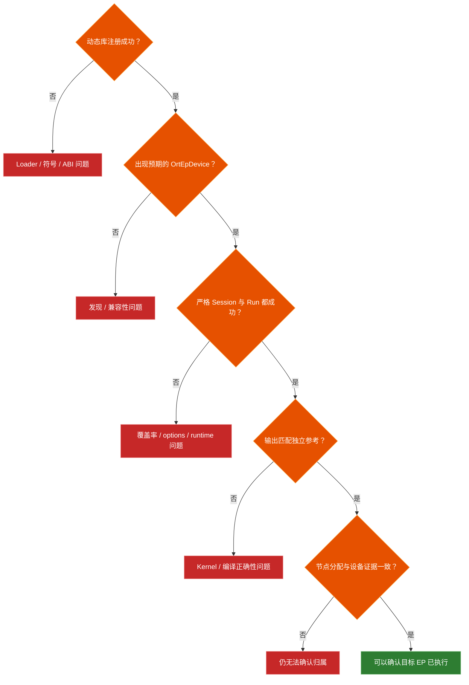
```mermaid
flowchart TD
    A{"动态库注册成功？"} -->|否| A0["Loader / 符号 / ABI 问题"]
    A -->|是| B{"出现预期的 OrtEpDevice？"}
    B -->|否| B0["发现 / 兼容性问题"]
    B -->|是| C{"严格 Session 与 Run 都成功？"}
    C -->|否| C0["覆盖率 / options / runtime 问题"]
    C -->|是| D{"输出匹配独立参考？"}
    D -->|否| D0["Kernel / 编译正确性问题"]
    D -->|是| E{"节点分配与设备证据一致？"}
    E -->|否| E0["仍无法确认归属"]
    E -->|是| PASS["可以确认目标 EP 已执行"]

    class A,B,C,D,E orange
    class A0,B0,C0,D0,E0 red
    class PASS green
    classDef orange fill:#e65100,stroke:#ffcc80,color:#ffffff
    classDef red fill:#c62828,stroke:#ef9a9a,color:#ffffff
    classDef green fill:#2e7d32,stroke:#a5d6a7,color:#ffffff
```

| 层级 | 证据 | 能证明什么 |
|---:|---|---|
| 1 | 注册成功 | 动态库已加载，必需符号和工厂创建都正常 |
| 2 | 出现预期的 `OrtEpDevice` | 工厂接受了一个已发现或获准的虚拟设备 |
| 3 | 禁用 CPU 回退后，Session 和 `Run` 都成功 | ORT 没有偷偷把不支持的部分交给 CPU 回退 |
| 4 | 输出匹配独立的 CPU/NumPy 参考实现 | 数值结果在声明的容差内正确 |
| 5 | 节点分配/profile 指名该 EP；厂商 trace 显示设备确实在工作 | ORT 的分配信息和目标硬件活动共同支持这一结论 |

从 API 1.24 起，C/C++ 可以设置 `session.record_ep_graph_assignment_info=1`，再查询 `Session_GetEpGraphAssignmentInfo()`。从 1.25 起，`OrtEpProfilerImpl` 可以把插件设备事件并入 ORT 时间线。延迟或利用率只能作为辅助信号，不是证据。

---

## 开发、测试与打包


```mermaid
flowchart LR
    U["回调单元测试"] --> O["onnxruntime_provider_test"] --> M["严格模型测试"] --> N["数值比较"] --> A["节点分配 + profile"] --> V["最低 + 目标 ORT"] --> L["并发 + 泄漏检查"]

    class U,O,M,N,A,V,L leaf
    classDef leaf fill:#eceff1,stroke:#90a4ae,color:#20242b
```

| 方面 | 最低要求 | 官方/源码依据 |
|---|---|---|
| ABI 入口 | 公开头文件；两个 C 导出；C++ 异常不越过边界 | Development 文档；WebGPU/CUDA 入口 |
| Struct 初始化 | 先清零；设置编译时的 `ORT_API_VERSION`；只填已支持的回调 | 公开头文件与示例 |
| 身份 | 工厂名称与 EP 名称一致；版本号遵循 SemVer | Development 文档 |
| 设备发现 | 只返回真正兼容的设备；不支持就返回空 | `GetSupportedDevices()` 约定 |
| 图数据 | 不保留临时的 `OrtGraph`/节点数据，需要就先复制 | `Compile()` 头文件注释 |
| 资源管理 | 统一规划分配器、数据传输、stream、自定义 domain 和卸载的生命周期 | Factory API 与环境清理逻辑 |
| 插件测试 | 覆盖回调、错误、无设备、错误版本、重复加载、清理 | 官方测试指南 |
| ORT 算子测试 | 构建 `onnxruntime_provider_test`；配置 `ORT_UNIT_TEST_MAIN_DYNAMIC_PLUGIN_EP_CONFIG_JSON` | 官方测试指南 |
| 模型测试 | 严格无回退运行；检查输出和节点分配 | 官方指南推荐模型级测试 |
| 版本 CI | 同时把关最低支持版本和目标 runtime 版本 | CUDA/WebGPU 的 `ApiInit` 模式 |
| 软件包内容 | 只打包插件动态库及其依赖，不要附带一份 ORT Core | 官方打包指南 |
| 包 helper | `get_library_path()`，再配合 `get_ep_names()` 或单 EP 的 `get_ep_name()` | 打包约定；helper 名称不属于 ORT ABI |
| 软件包依赖 | 记录并验证兼容的 ORT 版本范围 | 官方打包指南 |

---

## 本仓库已验证的实现

### 本仓库采用的实现

| 实现 | 加载方式 | 与传统 EP 的关系 | 严格测试 |
|---|---|---|---|
| AMD Windows ML MIGraphX | Provider bridge | 现有 MIGraphX 后端，现在走工厂/设备发现 | [AMD/provider_test.py](../AMD/provider_test.py) |
| Qualcomm QNN 2.x | Provider bridge | QNN CPU/GPU/HTP 后端脱离单一 ORT 包 | [Qualcomm/one_click.py](../Qualcomm/one_click.py) |
| NVIDIA TensorRT RTX 0.4 | Pure plugin | 独立 EP ABI 产品，与经典 TensorRT 不同；不导出 `GetProvider` | [NVIDIA/provider_test.py](../NVIDIA/provider_test.py) |
| 原生 WebGPU | Pure plugin | 原生 ORT 宿主与软件包，不是浏览器版 `onnxruntime-web` API | [native_webgpu_validator.py](../WebGPU/onnxruntime-web-demo/native_webgpu_validator.py) |

> 上游还有一个独立的纯 CUDA Plugin EP，但这不代表本仓库内置的 `CUDAExecutionProvider` 路线已被取代——软件包、依赖、验证结论都要分开看待。

### 已验证的 TensorRT RTX 0.4 软件包路线

独立软件包已在 Windows 11、RTX 5060 Ti（Blackwell，计算能力 12.0）、驱动 616.56 上执行。它的 DLL 只导出 `CreateEpFactories` 与 `ReleaseEpFactory`，因此 ORT 1.29 通过 `EpLibraryPlugin` 加载它，而不是 `EpLibraryProviderBridge`。

该插件必须放在只安装普通 ORT 的独立环境中，不能与 `onnxruntime-gpu` 共存：

```powershell
conda create -n python_313_trt_rtx python=3.13 pip -y
D:\Anaconda\envs\python_313_trt_rtx\python.exe -m pip install `
  "onnxruntime==1.29.0" `
  "onnxruntime-ep-nv-tensorrt-rtx==0.4.0" `
  "onnx==1.22.0"
```

```python
import gc
from pathlib import Path

import onnxruntime as ort
import onnxruntime_ep_nv_tensorrt_rtx as trt_ep

registration_name = trt_ep.get_ep_name()
ort.register_execution_provider_library(
  registration_name, trt_ep.get_library_path()
)
session = None
try:
  devices = [
    device
    for device in ort.get_ep_devices()
    if device.ep_name == registration_name
  ]
  if not devices:
    raise RuntimeError("没有兼容的 TensorRT RTX 设备")

  cache = Path.home() / ".cache" / "my_app" / "trt_rtx"
  cache.mkdir(parents=True, exist_ok=True)
  options = ort.SessionOptions()
  options.add_session_config_entry("session.disable_cpu_ep_fallback", "1")
  options.add_provider_for_devices(
    [devices[0]],
    {"enable_cuda_graph": "0", "nv_runtime_cache_path": str(cache)},
  )
  session = ort.InferenceSession(
    "model.onnx", sess_options=options, enable_fallback=False
  )
  outputs = session.run(None, feeds)
finally:
  del session
  gc.collect()
  ort.unregister_execution_provider_library(registration_name)
```

`get_available_providers()` 不是动态插件的发现 API；注册前只显示宿主内置 provider 属于正常现象。从仓库根目录运行严格命令 `python NVIDIA/provider_test.py --provider nv_tensorrt_rtx`，得到 23 个插件 profiling 冒烟事件，且没有节点落到 CPU。仓库伪 LLM 基准把完整计算图编译为 1 个插件事件；开启 TensorRT RTX CUDA Graph 后，在该主机上完成 200 次缓存测量，中位延迟为 0.211 ms。方法与边界请参阅 [NVIDIA 指南](../NVIDIA/README.zh-CN.md#71-伪小型-llm-基准测试)。

### 正式发布源码核验表

以下 ORT 链接全部指向不可变的 `v1.29.0` 发布提交，而不是随时变化的 `main`。

| 源码 | 核验结论 |
|---|---|
| [`onnxruntime_ep_c_api.h`](https://github.com/microsoft/onnxruntime/blob/2e2543fbe9fae542f921d47a72d21d5a4ef0b710/include/onnxruntime/core/session/onnxruntime_ep_c_api.h) | 公开 struct、所有权、回调版本、4/8 容量与正式定型的 1.29 weightless 支持 |
| [`onnxruntime_c_api.h`](https://github.com/microsoft/onnxruntime/blob/2e2543fbe9fae542f921d47a72d21d5a4ef0b710/include/onnxruntime/core/session/onnxruntime_c_api.h) / [`.cc`](https://github.com/microsoft/onnxruntime/blob/2e2543fbe9fae542f921d47a72d21d5a4ef0b710/onnxruntime/core/session/onnxruntime_c_api.cc) | 注册约定、API 版本、只追加的槽位、minimal-build 桩代码 |
| [`utils.cc`](https://github.com/microsoft/onnxruntime/blob/2e2543fbe9fae542f921d47a72d21d5a4ef0b710/onnxruntime/core/session/utils.cc) | 相对路径基准、`GetProvider` 探测、同名且同工厂的选择要求 |
| [`ep_library_plugin.cc`](https://github.com/microsoft/onnxruntime/blob/2e2543fbe9fae542f921d47a72d21d5a4ef0b710/onnxruntime/core/session/plugin_ep/ep_library_plugin.cc) | 必需导出、加载失败清理、工厂释放与动态卸载 |
| [`environment.cc`](https://github.com/microsoft/onnxruntime/blob/2e2543fbe9fae542f921d47a72d21d5a4ef0b710/onnxruntime/core/session/environment.cc) | 重复名称、设备、虚拟模式、分配器/数据传输、卸载顺序 |
| [`ep_library_internal.cc`](https://github.com/microsoft/onnxruntime/blob/2e2543fbe9fae542f921d47a72d21d5a4ef0b710/onnxruntime/core/session/plugin_ep/ep_library_internal.cc) / [`ep_library_provider_bridge.cc`](https://github.com/microsoft/onnxruntime/blob/2e2543fbe9fae542f921d47a72d21d5a4ef0b710/onnxruntime/core/session/plugin_ep/ep_library_provider_bridge.cc) | 内置 Provider 列表与旧版桥接适配 |
| [`ep_plugin_provider_interfaces.cc`](https://github.com/microsoft/onnxruntime/blob/2e2543fbe9fae542f921d47a72d21d5a4ef0b710/onnxruntime/core/session/plugin_ep/ep_plugin_provider_interfaces.cc) | 纯插件适配器、初始检查、能力、编译与释放顺序 |
| [`ep_kernel_registration.cc`](https://github.com/microsoft/onnxruntime/blob/2e2543fbe9fae542f921d47a72d21d5a4ef0b710/onnxruntime/core/session/plugin_ep/ep_kernel_registration.cc) / [`ep_api.cc`](https://github.com/microsoft/onnxruntime/blob/2e2543fbe9fae542f921d47a72d21d5a4ef0b710/onnxruntime/core/session/plugin_ep/ep_api.cc) | Registry 复制、控制流 helper 与 `OrtEpApi` 版本槽位 |
| [`example_plugin_ep`](https://github.com/microsoft/onnxruntime/tree/2e2543fbe9fae542f921d47a72d21d5a4ef0b710/onnxruntime/test/autoep/library/example_plugin_ep) / [`example_plugin_ep_kernel_registry`](https://github.com/microsoft/onnxruntime/tree/2e2543fbe9fae542f921d47a72d21d5a4ef0b710/onnxruntime/test/autoep/library/example_plugin_ep_kernel_registry) | 编译型与内核注册表的参考实现 |
| [`cuda/plugin`](https://github.com/microsoft/onnxruntime/tree/2e2543fbe9fae542f921d47a72d21d5a4ef0b710/onnxruntime/core/providers/cuda/plugin) / [`webgpu/ep/api.cc`](https://github.com/microsoft/onnxruntime/blob/2e2543fbe9fae542f921d47a72d21d5a4ef0b710/onnxruntime/core/providers/webgpu/ep/api.cc) | 纯插件入口点与 runtime 版本协商 |
| [TensorRT RTX 0.4 导出](https://github.com/NVIDIA/TensorRT-RTX-EP-ABI/blob/v0.4.0/src/tensorrt_rtx_execution_provider.def) / [Python helper](https://github.com/NVIDIA/TensorRT-RTX-EP-ABI/blob/v0.4.0/python/onnxruntime_ep_nv_tensorrt_rtx/__init__.py) | 纯插件分类、打包库路径、单数/复数 EP 名称 helper |

官方参考：[Usage](https://onnxruntime.ai/docs/execution-providers/plugin-ep-libraries/usage.html) · [Development](https://onnxruntime.ai/docs/execution-providers/plugin-ep-libraries/development.html) · [Testing](https://onnxruntime.ai/docs/execution-providers/plugin-ep-libraries/testing.html) · [Packaging](https://onnxruntime.ai/docs/execution-providers/plugin-ep-libraries/packaging.html)
