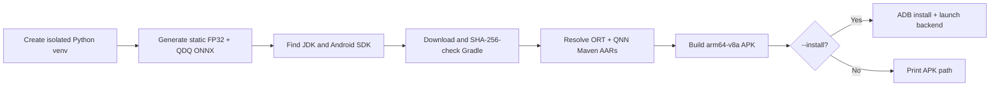

# ONNX Runtime + Qualcomm QNN Android Demo

[简体中文](README.zh-CN.md) · [Repository index](../../README.md) · [Full guide](../README.md)

| Item | Baseline |
|---|---|
| Last audited | `2026-07-17` |
| App | Kotlin, `arm64-v8a`, Android API 27+ |
| Runtime | ONNX Runtime 1.26.0, QNN plugin 2.4.0, QNN runtime 2.48.0 |
| Build | SDK 35, AGP 8.7.3, Gradle 8.9, JDK 17–22 |
| Entry point | [`build_demo.py`](build_demo.py) |
| Evidence boundary | APK build/inspection and strict HTP execution passed on Android SM8550; GPU returned `PLATFORM_NOT_SUPPORTED` on that device |

## Contents

> [!TIP]
> **New here?** This map shows the whole demo guide at a glance. Skim it, then follow the sections in order.

- [1. Install prerequisites](#1-install-prerequisites)
- [2. Choose a backend](#2-choose-a-backend)
- [3. Build and install](#3-build-and-install)
- [4. Understand the proof](#4-understand-the-proof)
- [5. Check the device](#5-check-the-device)
- [6. File map](#6-file-map)
- [7. Diagnose](#7-diagnose)

## 1. Install prerequisites

On the development computer, install:

- 64-bit CPython 3.11–3.14;
- Android SDK Platform 35 and Platform-Tools;
- JDK/JBR 17–22 (Android Studio's bundled JBR is suitable);
- internet access for the first Python, Gradle, and Maven downloads.

For `--install`, connect one authorized physical Snapdragon Android device. The launcher rejects emulators, non-`arm64-v8a` devices, and Android API levels below 27 before installation.

## 2. Choose a backend

| Backend | Hardware | Model | Requirement |
|---|---|---|---|
| QNN CPU | Arm CPU reference backend | Static FP32 | Matching QAIRT SDK containing `libQnnCpu.so` |
| QNN GPU | Adreno GPU | Static FP32 | Optional device/driver capability probe; packaging `libQnnGpu.so` does not prove execution support |
| QNN HTP/NPU | Hexagon HTP | Static QDQ | Recommended baseline; Snapdragon ARM64 device, API 27+ |

| Goal | Command |
|---|---|
| Build APK | `python build_demo.py` |
| Build, install, launch, test HTP | `python build_demo.py --install --backend htp` |
| Try GPU where the vendor stack supports it | `python build_demo.py --install --backend gpu` |
| Enable and test QNN CPU | `python build_demo.py --qnn-sdk /path/to/QAIRT/2.48.40 --install --backend cpu` |

Run these commands inside `Qualcomm/AndroidDemo`. From the repository root, prefix the script with `Qualcomm/AndroidDemo/`.

Use `python build_demo.py --help` for Android SDK, JDK, Gradle, device-serial, and offline overrides. ADB comes from the selected Android SDK; there is no separate ADB-path option.

### Read the result

| Result | Meaning |
|---|---|
| APK path / Gradle `BUILD SUCCESSFUL` | The pinned artifacts assembled; no accelerator ran |
| App `READY` | The plugin registered and exposed a QNN device; no model ran yet |
| App `PASS · QNN ...` | The selected backend ran the strict smoke graph with ORT CPU fallback disabled and matched the CPU reference |

## 3. Build and install



| Step | Action | Result |
|---:|---|---|
| 1 | Select a backend and command | Model/backend pair is explicit |
| 2 | Run `build_demo.py` | Private model environment and Gradle distribution are prepared |
| 3 | Let Gradle resolve the pinned AARs | ABI-compatible ORT/QNN stack is packaged |
| 4 | Add `--install` for a connected device | APK installs and launches through ADB |
| 5 | Read the app result and Logcat | Backend proof is explicit |

Before creating its private model environment, the launcher uses only the Python standard library. A machine-wide Gradle installation is not required.

The first run downloads Python wheels, Gradle, and large native AARs and can take several minutes. `--offline` succeeds only after all required artifacts are cached.

The `2026-07-17` APK contained only `arm64-v8a`, the three pinned runtime components, QNN GPU/HTP/System/Prepare, HTP v68/v69/v73/v75/v79/v81 stub/skel libraries, and both smoke models. It did not package QNN CPU, `libcdsprpc.so`, Android `libc++`, or the linker.

### Version evidence

QNN EP 2.4.0 was built against ORT 1.26.0 and QAIRT 2.48.40; its source Android test requests that line and falls back to the public QNN runtime 2.48.0 artifact. The same release still lists ORT Android 1.24.3 plus QNN runtime 2.45.0 in its published-package table, but that older tuple failed QNN interface negotiation with plugin 2.4.0 on the audited SM8550. This demo therefore keeps the source-build-aligned tuple and requires per-device qualification.

### Physical-device result

On `2026-07-17`, the HTP route repeatedly passed on a Nubia NX711J, Snapdragon 8 Gen 2 (`SM8550`, HTP v73), Android API 35: CPU fallback disabled, 20 measured runs, observed medians of 0.18–0.27 ms, and maximum error 0.0163526 versus ORT CPU. The tiny graph is not a benchmark. The GPU probe on the same device failed cleanly with `QNN_COMMON_ERROR_PLATFORM_NOT_SUPPORTED`. Use HTP there. Qualcomm's public QNN GPU article covers Snapdragon X Windows, while upstream QNN GPU tests skip ARM64; Android GPU support must be established device by device.

## 4. Understand the proof

| Step | Runtime check |
|---:|---|
| 1 | Set `ADSP_LIBRARY_PATH` to the app's extracted native-library directory |
| 2 | Register `libonnxruntime_providers_qnn.so` with the Java plugin API |
| 3 | Enumerate QNN `OrtEpDevice` objects |
| 4 | Generate an independent ORT CPU reference |
| 5 | Create `backend_type=cpu|gpu|htp` with `session.disable_cpu_ep_fallback=1` |
| 6 | Run warm-up and measured iterations |
| 7 | Compare QNN output with the CPU reference |
| 8 | Destroy tensors, results, and sessions before unloading the plugin |

| Rule | Behavior |
|---|---|
| HTP model | Uses the static QDQ graph |
| GPU / optional QNN CPU model | Uses the static FP32 graph |
| Optional QNN CPU | `--qnn-sdk` copies QAIRT's ARM64 `libQnnCpu.so`; without it, the CPU button is disabled |
| Android 12+ FastRPC | Manifest requests visibility of device-owned `libcdsprpc.so` with `required=false` |
| APK boundary | The project does not copy `libcdsprpc.so`, Android framework libraries, or the system linker |

On some OEM builds, including the audited SM8550, `READY` lists a CPU-class **QNN EP registration device**. The opt-in is needed there for the plugin to expose a handle; it is not CPU graph assignment. The explicit `backend_type` selects HTP/GPU/CPU, and the strict `PASS` is the execution proof.

## 5. Check the device

| Requirement | Check |
|---|---|
| Physical device | Snapdragon Android phone or tablet; emulators are not qualification targets |
| ABI | `arm64-v8a` |
| HTP OS floor | Android API 27+ |
| Firmware | Current OEM release |
| One-click install | USB debugging and working ADB authorization |

The launcher's preflight prints the detected ABI, API, and SoC. OEM properties do not always contain the word Qualcomm, so an uncertain SoC identity produces a warning; the strict QNN session remains the final hardware gate.

## 6. File map

| Path | Purpose |
|---|---|
| `app/src/main/java/.../MainActivity.kt` | UI, plugin registration, strict sessions, validation, cleanup |
| `app/src/main/AndroidManifest.xml` | Launcher activity and `libcdsprpc.so` visibility request |
| `app/build.gradle.kts` | Pinned ORT/QNN dependencies and `arm64-v8a` packaging |
| `prepare_models.py` | Calls the shared FP32/QDQ generator |
| `build_demo.py` | Cross-platform model/build/install launcher |
| `requirements-models.txt` | Isolated model-tool pins |

## 7. Diagnose

```bash
adb shell getprop ro.soc.model
adb shell getprop ro.product.cpu.abi
adb logcat -c
adb shell am start -n io.github.ortqnn.demo/.MainActivity --es backend htp
adb logcat | grep -iE "onnxruntime|qnn|fastrpc|cdsp"
```

In Windows PowerShell, replace the final pipeline with:

```powershell
adb logcat | Select-String -Pattern "onnxruntime|qnn|fastrpc|cdsp"
```

Use the [full guide](../README.md) for quantization, context caching, version compatibility, and the complete troubleshooting matrix.
