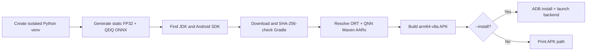

# Qualcomm QNN Android CPU / GPU / HTP Demo

[English full guide](../README.md) | [简体中文完整指南](../README.zh-CN.md) | [Repository index](../../README.md)

This is a complete `arm64-v8a` Kotlin application for local ONNX Runtime inference through the current ABI-compatible Qualcomm QNN plugin. It has three backend actions:

- **QNN CPU** — optional reference backend, enabled when a matching QAIRT SDK supplies `libQnnCpu.so`;
- **QNN GPU** — Adreno floating-point execution;
- **QNN HTP/NPU** — static QDQ execution on Hexagon HTP.

## Verified build baseline

| Component | Version |
|---|---:|
| ONNX Runtime Android core | 1.26.0 |
| Qualcomm QNN plugin AAR | 2.4.0 |
| Qualcomm QNN runtime AAR | 2.48.0 |
| Compile / target SDK | 35 / 35 |
| Minimum SDK | 27 |
| Android Gradle Plugin | 8.7.3 |
| Gradle | 8.9, official SHA-256 checked by the launcher |
| JDK | 17–22 |

A real debug APK build passed on 2026-07-16. The built APK contained ORT core/JNI, the QNN plugin, QNN GPU/HTP/System/Prepare libraries, and v68/v69/v73/v75/v79/v81 HTP stub/skel families.

## One command

Build only:

```bash
python build_demo.py
```

Build, install, launch, and immediately test HTP:

```bash
python build_demo.py --install --backend htp
```

GPU:

```bash
python build_demo.py --install --backend gpu
```

Optional QNN CPU reference backend:

```bash
python build_demo.py --qnn-sdk /path/to/QAIRT/2.48.40 \
  --install --backend cpu
```

Run `python build_demo.py --help` for SDK/JDK/ADB/device overrides and offline mode.

## What the launcher does



The launcher is Python-stdlib-only before it creates its private model environment. It does not require a machine-wide Gradle installation.

## Runtime proof design

1. Set `ADSP_LIBRARY_PATH` to the application's extracted native-library directory before initializing ORT.
2. Register `libonnxruntime_providers_qnn.so` with the Java plugin API.
3. Enumerate QNN `OrtEpDevice` objects.
4. Generate a CPU reference with a separate ORT CPU session.
5. Create the target session with `backend_type=cpu|gpu|htp` and `session.disable_cpu_ep_fallback=1`.
6. Run warm-up and measured iterations.
7. Compare QNN output with the independent CPU reference.
8. Destroy tensors/results/sessions before unloading the plugin.

The HTP button uses a static QDQ graph. GPU and optional QNN CPU use a static FP32 graph.

## Why QNN CPU is optional

QNN EP 2.4.0 release packages intentionally omit the CPU reference library. `build_demo.py --qnn-sdk PATH` locates the Android ARM64 `libQnnCpu.so` in QAIRT, copies it into the app's `jniLibs`, and enables the CPU button. Without it, the button is visibly disabled rather than failing misleadingly.

## Android 12 and FastRPC

The manifest declares the device-owned `libcdsprpc.so` with `required=false`. Android 12+ hides vendor non-NDK libraries unless applications request them. The project does **not** copy `libcdsprpc.so`, Android framework libraries, or the system linker into the APK.

## Project map

| Path | Purpose |
|---|---|
| `app/src/main/java/.../MainActivity.kt` | UI, plugin registration, strict backend sessions, validation, cleanup |
| `app/src/main/AndroidManifest.xml` | Launcher activity and `libcdsprpc.so` visibility request |
| `app/build.gradle.kts` | Pinned ORT/QNN dependencies and `arm64-v8a` packaging |
| `prepare_models.py` | Calls the shared FP32/QDQ generator |
| `build_demo.py` | Cross-platform one-click model/build/install launcher |
| `requirements-models.txt` | Isolated model-tool pins |

## Device requirements

- physical Snapdragon Android device;
- `arm64-v8a`;
- API 27+ for HTP;
- current OEM firmware;
- USB debugging for one-click installation.

An emulator or non-Qualcomm device is not a valid QNN accelerator test.

## Diagnostics

```bash
adb shell getprop ro.soc.model
adb shell getprop ro.product.cpu.abi
adb logcat -c
adb shell am start -n io.github.ortqnn.demo/.MainActivity --es backend htp
adb logcat | grep -iE "onnxruntime|qnn|fastrpc|cdsp"
```

See the full bilingual guides for model quantization, context caching, version compatibility, and the complete troubleshooting matrix.
