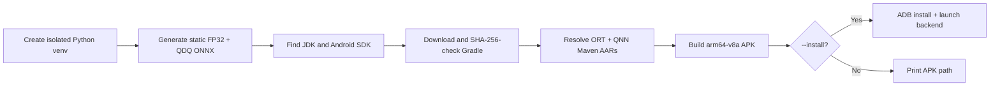

# ONNX Runtime + Qualcomm QNN Android Demo

[简体中文](README.zh-CN.md) · [Repository index](../../README.md) · [Full guide](../README.md)

| Item | Baseline |
|---|---|
| Last audited | `2026-09-01` |
| App | Kotlin, `arm64-v8a`, Android API 27+ |
| Runtime | ONNX Runtime 1.29.0, QNN plugin 2.5.0, QNN runtime 2.49.0 |
| Build | SDK 35, AGP 8.7.3, Gradle 8.9, JDK 17–22 |
| Entry point | [`build_demo.py`](build_demo.py) |
| Evidence boundary | The current AARs/POMs resolve and their published checksums and contents were inspected; this host lacks JDK and SDK 35, so the current APK and hardware path were not run. The retained SM8550 result is explicitly historical (2.4/2.48) |

## Contents

> [!TIP]
> **New here?** This map shows the whole demo guide at a glance. Skim it, then follow the sections in order.

- [1. Install prerequisites](#1-install-prerequisites)
- [2. Choose a backend](#2-choose-a-backend)
- [3. Build and install](#3-build-and-install)
- [4. Understand the proof](#4-understand-the-proof)
- [5. Check the device](#5-check-the-device)
- [6. File map](#6-file-map)
- [7. Diagnose](#7-diagnose)

## 1. Install prerequisites

On the development computer, install:

- 64-bit CPython 3.11–3.14;
- Android SDK Platform 35 and Platform-Tools;
- JDK/JBR 17–22 (Android Studio's bundled JBR is suitable);
- internet access for the first Python, Gradle, and Maven downloads.

For `--install`, connect one authorized physical Snapdragon Android device. The launcher rejects emulators, non-`arm64-v8a` devices, and Android API levels below 27 before installation.

## 2. Choose a backend

| Backend | Hardware | Model | Requirement |
|---|---|---|---|
| QNN CPU | Arm CPU reference backend | Static FP32 | Matching QAIRT SDK containing `libQnnCpu.so` |
| QNN GPU | Adreno GPU | Static FP32 | Optional device/driver capability probe; packaging `libQnnGpu.so` does not prove execution support |
| QNN HTP/NPU | Hexagon HTP | Static QDQ | Recommended baseline; Snapdragon ARM64 device, API 27+ |

| Goal | Command |
|---|---|
| Build APK | `python build_demo.py` |
| Build, install, launch, test HTP | `python build_demo.py --install --backend htp` |
| Try GPU where the vendor stack supports it | `python build_demo.py --install --backend gpu` |
| Enable and test QNN CPU | `python build_demo.py --qnn-sdk /path/to/QAIRT/2.49.40 --install --backend cpu` |

Run these commands inside `Qualcomm/AndroidDemo`. From the repository root, prefix the script with `Qualcomm/AndroidDemo/`.

Use `python build_demo.py --help` for Android SDK, JDK, Gradle, device-serial, and offline overrides. ADB comes from the selected Android SDK; there is no separate ADB-path option.

### Read the result

| Result | Meaning |
|---|---|
| APK path / Gradle `BUILD SUCCESSFUL` | The pinned artifacts assembled; no accelerator ran |
| App `READY` | The plugin registered and exposed a QNN device; no model ran yet |
| App `PASS · QNN ...` | The profile attributed nodes to QNN, contained no ORT CPU node, and output matched the CPU reference; GPU/HTP also hard-disable fallback |

## 3. Build and install


```mermaid
flowchart LR
    A[Create isolated Python venv] --> B[Generate static FP32 + QDQ ONNX]
    B --> C[Find JDK and Android SDK]
    C --> D[Download and SHA-256-check Gradle]
    D --> E[Resolve ORT + QNN Maven AARs]
    E --> F[Build arm64-v8a APK]
    F --> G{--install?}
    G -->|Yes| H[ADB install + launch backend]
    G -->|No| I[Print APK path]
```

| Step | Action | Result |
|---:|---|---|
| 1 | Select a backend and command | Model/backend pair is explicit |
| 2 | Run `build_demo.py` | Private model environment and Gradle distribution are prepared |
| 3 | Let Gradle resolve the pinned AARs | ABI-compatible ORT/QNN stack is packaged |
| 4 | Add `--install` for a connected device | APK installs and launches through ADB |
| 5 | Read the app result and Logcat | Backend proof is explicit |

Before creating its private model environment, the launcher uses only the Python standard library. A machine-wide Gradle installation is not required.

The first run downloads Python wheels, Gradle, and large native AARs and can take several minutes. `--offline` succeeds only after all required artifacts are cached.

The current Maven artifacts were downloaded and matched their published SHA-1 sidecars. ORT 1.29.0 contains its four Android ABIs; the QNN 2.5.0 plugin and QNN 2.49.0 runtime are `arm64-v8a` only. The runtime AAR contains 19 QNN GPU/HTP/System/DSP and v68/v69/v73/v75/v79/v81 stub/skel libraries, but no QNN CPU backend.

The historical `2026-07-17` APK used ORT 1.26.0, plugin 2.4.0, and runtime 2.48.0. It was 83.4 MiB and contained only `arm64-v8a`, QNN GPU/HTP/System/Prepare, HTP v68/v69/v73/v75/v79/v81 stub/skel libraries, and both smoke models. It did not package QNN CPU, `libcdsprpc.so`, Android `libc++`, or the linker.

### Version evidence

QNN EP 2.5.0 declares compatibility with ORT 1.24.1 or newer and was compiled with ORT 1.26.0 against QAIRT 2.49.40. Its tagged Android table validates ORT 1.26.0 and QNN runtime 2.49.40. This project instead selects ORT 1.29.0, still inside the declared plugin ABI range, and QNN runtime 2.49.0, the latest version actually published to Maven Central. Maven Central does not publish a `2.49.40` runtime coordinate. The project tuple is therefore the latest public composition, not upstream's exact tested composition, and it still requires per-device qualification.

QNN 2.5.0 also fixes Android NPU discovery for untrusted apps: the standalone plugin now checks `ro.soc.manufacturer` instead of probing SELinux-blocked `/dev/fastrpc-cdsp*` paths.

### Physical-device result

On `2026-07-17`, using ORT 1.26.0, QNN plugin 2.4.0, and QNN runtime 2.48.0, the HTP route repeatedly passed on a Nubia NX711J, Snapdragon 8 Gen 2 (`SM8550`, HTP v73), Android API 35: CPU fallback disabled, 20 measured runs, observed medians of 0.18–0.27 ms, and maximum error 0.0163526 versus ORT CPU. The tiny graph is not a benchmark, and this result must not be attributed to the current 2.5/2.49 stack. The GPU probe on the same device failed cleanly with `QNN_COMMON_ERROR_PLATFORM_NOT_SUPPORTED`. Use HTP there. Qualcomm's public QNN GPU article covers Snapdragon X Windows, while upstream QNN GPU tests skip ARM64; Android GPU support must be established device by device.

## 4. Understand the proof

| Step | Runtime check |
|---:|---|
| 1 | Set `ADSP_LIBRARY_PATH` to the app's extracted native-library directory |
| 2 | Register `libonnxruntime_providers_qnn.so` with the Java plugin API |
| 3 | Enumerate QNN `OrtEpDevice` objects |
| 4 | Generate an independent ORT CPU reference |
| 5 | Create `backend_type=cpu|gpu|htp`; profile every route, and hard-disable CPU fallback for GPU/HTP |
| 6 | Run warm-up and measured iterations |
| 7 | Compare QNN output with the CPU reference |
| 8 | Destroy tensors, results, and sessions before unloading the plugin |

| Rule | Behavior |
|---|---|
| HTP model | Uses the static QDQ graph |
| GPU / optional QNN CPU model | Uses the static FP32 graph |
| Optional QNN CPU | `--qnn-sdk` copies QAIRT's Android ARM64 `libQnnCpu.so` to `app/src/main/jniLibs/arm64-v8a`. Later builds reuse that file even when `--qnn-sdk` is omitted, and the launcher cannot verify its QAIRT version. When changing the SDK, plugin, or runtime, delete the copied file or rerun with the intended QAIRT 2.49.40 root. The CPU button is disabled only when no copied library is present. |
| Android 12+ FastRPC | Manifest requests visibility of device-owned `libcdsprpc.so` with `required=false` |
| APK boundary | The project does not copy `libcdsprpc.so`, Android framework libraries, or the system linker |

On some OEM builds, including the audited SM8550, `READY` lists a CPU-class **QNN EP registration device**. The opt-in is needed there for the plugin to expose a handle; it is not CPU graph assignment. The explicit `backend_type` selects HTP/GPU/CPU. A `PASS` requires QNN-attributed profile events and zero ORT CPU events; GPU/HTP additionally hard-disable fallback. QNN 2.5 rejects the hard-disable flag when QNN CPU itself is loaded.

## 5. Check the device

| Requirement | Check |
|---|---|
| Physical device | Snapdragon Android phone or tablet; emulators are not qualification targets |
| ABI | `arm64-v8a` |
| HTP OS floor | Android API 27+ |
| Firmware | Current OEM release |
| One-click install | USB debugging and working ADB authorization |

The launcher's preflight prints the detected ABI, API, and SoC. OEM properties do not always contain the word Qualcomm, so an uncertain SoC identity produces a warning; the strict QNN session remains the final hardware gate.

## 6. File map

| Path | Purpose |
|---|---|
| `app/src/main/java/.../MainActivity.kt` | UI, plugin registration, strict sessions, validation, cleanup |
| `app/src/main/AndroidManifest.xml` | Launcher activity and `libcdsprpc.so` visibility request |
| `app/build.gradle.kts` | Pinned ORT/QNN dependencies and `arm64-v8a` packaging |
| `prepare_models.py` | Calls the shared FP32/QDQ generator |
| `build_demo.py` | Cross-platform model/build/install launcher |
| `requirements-models.txt` | Isolated model-tool pins |

## 7. Diagnose

```bash
adb shell getprop ro.soc.model
adb shell getprop ro.product.cpu.abi
adb logcat -c
adb shell am start -n io.github.ortqnn.demo/.MainActivity --es backend htp
adb logcat | grep -iE "onnxruntime|qnn|fastrpc|cdsp"
```

In Windows PowerShell, replace the final pipeline with:

```powershell
adb logcat | Select-String -Pattern "onnxruntime|qnn|fastrpc|cdsp"
```

Use the [full guide](../README.md) for quantization, context caching, version compatibility, and the complete troubleshooting matrix.
