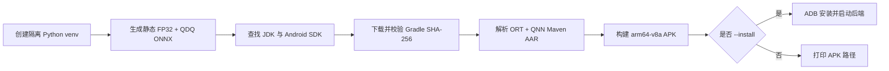

# ONNX Runtime + Qualcomm QNN Android 演示

[English](README.md) · [仓库首页](../../README.zh-CN.md) · [完整指南](../README.zh-CN.md)

| 项目 | 基线 |
|---|---|
| 最近核验 | `2026-07-17` |
| Android 应用 | Kotlin、`arm64-v8a`、Android API 27+ |
| 运行时 | ONNX Runtime 1.26.0、QNN 插件 2.4.0、QNN Runtime 2.48.0 |
| 构建 | SDK 35、AGP 8.7.3、Gradle 8.9、JDK 17–22 |
| 运行入口 | [`build_demo.py`](build_demo.py) |
| 验证范围 | 已完成 APK 构建与内容检查，并在 Android SM8550 真机上通过禁用 CPU 回退的 HTP 测试；该设备的 GPU 返回 `PLATFORM_NOT_SUPPORTED` |

## 目录

> [!TIP]
> **初次阅读？** 可先通过下面的目录了解本指南的内容，再按章节顺序操作。

- [1. 准备开发环境](#1-准备开发环境)
- [2. 选择后端](#2-选择后端)
- [3. 构建并安装应用](#3-构建并安装应用)
- [4. 验证过程与判定依据](#4-验证过程与判定依据)
- [5. 检查设备](#5-检查设备)
- [6. 文件说明](#6-文件说明)
- [7. 诊断](#7-诊断)

## 1. 准备开发环境

开发电脑需要具备：

- 64 位 CPython 3.11–3.14；
- Android SDK Platform 35 与 Platform-Tools；
- JDK/JBR 17–22（Android Studio 自带的 JBR 即可）；
- 可访问网络，以便首次下载 Python、Gradle 和 Maven 依赖。

使用 `--install` 时，请只连接一台已完成 ADB 授权的 Snapdragon Android 真机。安装前，启动脚本会拒绝模拟器、非 `arm64-v8a` 设备以及 Android API 低于 27 的设备。

## 2. 选择后端

| 后端 | 硬件 | 模型 | 要求 |
|---|---|---|---|
| QNN CPU | Arm CPU 参考后端 | 静态 FP32 | 匹配且包含 `libQnnCpu.so` 的 QAIRT SDK |
| QNN GPU | Adreno GPU | 静态 FP32 | 用于按需检测设备和驱动能力；APK 中包含 `libQnnGpu.so` 并不代表该设备能够执行 GPU 推理 |
| QNN HTP/NPU | Hexagon HTP | 静态 QDQ | 建议优先验证；需要 Snapdragon ARM64 设备和 Android API 27+ |

| 目标 | 命令 |
|---|---|
| 构建 APK | `python build_demo.py` |
| 构建并安装应用，然后启动 HTP 测试 | `python build_demo.py --install --backend htp` |
| 设备厂商的软件栈支持时，尝试 GPU | `python build_demo.py --install --backend gpu` |
| 启用并测试 QNN CPU | `python build_demo.py --qnn-sdk /path/to/QAIRT/2.48.40 --install --backend cpu` |

以上命令默认从 `Qualcomm/AndroidDemo` 目录执行。如果当前位于仓库根目录，请在脚本名称前加上 `Qualcomm/AndroidDemo/`。

有关 Android SDK、JDK、Gradle、设备序列号和离线模式的参数，请运行 `python build_demo.py --help` 查看。脚本使用所选 Android SDK 自带的 ADB，不单独提供 ADB 路径参数。

### 如何判断结果

| 结果 | 含义 |
|---|---|
| 输出 APK 路径 / Gradle 显示 `BUILD SUCCESSFUL` | 指定版本的依赖已成功打包，但尚未在加速器上运行模型 |
| 应用显示 `READY` | 插件已注册并检测到 QNN 设备，但尚未运行模型 |
| 应用显示 `PASS · QNN ...` | 所选后端已在禁用 ORT CPU 回退的会话中运行冒烟模型，且输出与 CPU 参考结果一致 |

## 3. 构建并安装应用



| 步骤 | 操作 | 结果 |
|---:|---|---|
| 1 | 选择后端和对应命令 | 确认要测试的模型与后端组合 |
| 2 | 运行 `build_demo.py` | 创建专用的模型生成环境并准备 Gradle |
| 3 | 由 Gradle 解析锁定版本的 AAR | 将 ABI 兼容的 ORT/QNN 组件打入 APK |
| 4 | 连接设备并添加 `--install` | 通过 ADB 安装并启动应用 |
| 5 | 查看应用结果和 Logcat | 确认所选后端是否通过验证 |

在创建专用的模型生成环境之前，启动脚本只使用 Python 标准库，因此开发电脑无需预先全局安装 Gradle。

首次运行需要下载 Python wheel、Gradle 和体积较大的原生 AAR，可能耗时数分钟。只有在所有依赖均已缓存后，`--offline` 模式才能正常使用。

在 `2026-07-17` 的核验中，APK 仅包含 `arm64-v8a` 架构、三个锁定版本的运行时组件、QNN GPU/HTP/System/Prepare、HTP v68/v69/v73/v75/v79/v81 Stub/Skel，以及两个冒烟模型；其中不含 QNN CPU、`libcdsprpc.so`、Android `libc++` 或系统 Linker。

### 版本选择依据

QNN EP 2.4.0 基于 ORT 1.26.0 和 QAIRT 2.48.40 构建。其源码中的 Android 测试也采用这一版本线；当 Maven 中没有与 SDK 完全对应的版本时，则使用公开发布的 QNN Runtime 2.48.0。同一版本的公开软件包表仍列出 ORT Android 1.24.3 与 QNN Runtime 2.45.0，但在本次 SM8550 核验中，这组旧版本无法与 Plugin 2.4.0 完成 QNN Interface 协商。因此，本演示采用与源码构建一致的版本组合，并要求在每类目标设备上分别验证。

### 真机验证结果

`2026-07-17`，HTP 路线在 Nubia NX711J 真机上多次通过测试。该设备搭载 Snapdragon 8 Gen 2（`SM8550`、HTP v73），运行 Android API 35。测试禁用了 CPU 回退，完成 20 次计时运行，测得中位延迟为 0.18–0.27 ms，与 ORT CPU 结果相比的最大误差为 0.0163526。这个小模型只用于验证执行路径，不能作为性能基准。同一设备的 GPU 检测返回 `QNN_COMMON_ERROR_PLATFORM_NOT_SUPPORTED`，因此应使用 HTP。Qualcomm 公开的 QNN GPU 文章针对 Snapdragon X Windows，上游 QNN GPU 测试也会跳过 ARM64；Android 上能否使用 QNN GPU，必须逐台设备验证。

## 4. 验证过程与判定依据

| 步骤 | 运行时检查 |
|---:|---|
| 1 | 把 `ADSP_LIBRARY_PATH` 设为应用解压后的原生库目录 |
| 2 | 通过 Java 插件 API 注册 `libonnxruntime_providers_qnn.so` |
| 3 | 枚举 QNN `OrtEpDevice` 对象 |
| 4 | 通过独立的 ORT CPU 会话生成参考结果 |
| 5 | 使用 `backend_type=cpu|gpu|htp` 和 `session.disable_cpu_ep_fallback=1` 创建会话 |
| 6 | 执行预热和正式计时 |
| 7 | 对比 QNN 输出与 CPU 参考 |
| 8 | 卸载插件前销毁所有 Tensor、Result 和 Session |

| 规则 | 行为 |
|---|---|
| HTP 模型 | 使用静态 QDQ 计算图 |
| GPU / 可选 QNN CPU 模型 | 使用静态 FP32 计算图 |
| 可选 QNN CPU | `--qnn-sdk` 会复制 QAIRT ARM64 版本的 `libQnnCpu.so`；未提供该参数时，应用会禁用 CPU 按钮 |
| Android 12+ FastRPC | Manifest 通过 `required=false` 声明需要访问设备自带的 `libcdsprpc.so` |
| APK 内容边界 | 工程不会复制 `libcdsprpc.so`、Android Framework 库或系统 Linker |

部分 OEM 系统（包括本次核验使用的 SM8550）会在 `READY` 状态中列出类型为 CPU 的 **QNN EP 注册设备**。在这些系统上，必须启用该设备，插件才会提供可用的 Handle；但这不表示计算图被分配给了 CPU。实际后端由 `backend_type` 明确选择为 HTP、GPU 或 CPU，只有通过禁用 CPU 回退的 `PASS` 测试，才能证明所选后端确实完成了执行。

## 5. 检查设备

| 要求 | 检查 |
|---|---|
| 真机 | Snapdragon Android 手机或平板；模拟器不能用于验证硬件执行 |
| ABI | `arm64-v8a` |
| HTP 系统要求 | Android API 27+ |
| 固件 | 使用当前 OEM 发布的版本 |
| 安装条件 | 启用 USB 调试并完成 ADB 授权 |

启动脚本会在预检查阶段打印检测到的 ABI、API 和 SoC。部分 OEM 属性中不一定会明确出现 Qualcomm 字样，因此无法确认 SoC 时，脚本只会给出警告，不会直接终止。最终仍以禁用 CPU 回退的 QNN 会话能否成功运行为准。

## 6. 文件说明

| 路径 | 用途 |
|---|---|
| `app/src/main/java/.../MainActivity.kt` | 界面、插件注册、禁用回退的会话、结果验证与资源清理 |
| `app/src/main/AndroidManifest.xml` | 启动 Activity，并声明需要访问 `libcdsprpc.so` |
| `app/build.gradle.kts` | 锁定 ORT/QNN 依赖版本，并配置 `arm64-v8a` 打包 |
| `prepare_models.py` | 调用共用的 FP32/QDQ 模型生成器 |
| `build_demo.py` | 跨平台的模型生成、构建、安装与启动脚本 |
| `requirements-models.txt` | 专用模型工具环境的版本清单 |

## 7. 诊断

```bash
adb shell getprop ro.soc.model
adb shell getprop ro.product.cpu.abi
adb logcat -c
adb shell am start -n io.github.ortqnn.demo/.MainActivity --es backend htp
adb logcat | grep -iE "onnxruntime|qnn|fastrpc|cdsp"
```

Windows PowerShell 中请把最后一条管道替换为：

```powershell
adb logcat | Select-String -Pattern "onnxruntime|qnn|fastrpc|cdsp"
```

有关量化、Context Cache、版本兼容性和完整的故障排查表，请参阅[完整指南](../README.zh-CN.md)。
