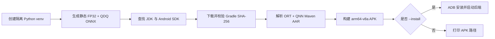

# ONNX Runtime + Qualcomm QNN Android 演示

[English](README.md) · [仓库首页](../../README.zh-CN.md) · [完整指南](../README.zh-CN.md)

| 项目 | 基线 |
|---|---|
| 最后审计 | `2026-07-17` |
| 应用 | Kotlin、`arm64-v8a`、Android API 27+ |
| Runtime | ONNX Runtime 1.26.0、QNN 插件 2.4.0、QNN Runtime 2.48.0 |
| 构建 | SDK 35、AGP 8.7.3、Gradle 8.9、JDK 17–22 |
| 验证入口 | [`build_demo.py`](build_demo.py) |
| 证据边界 | 已通过 APK 构建/内容检查，并在 Android SM8550 上通过严格 HTP；该设备 GPU 返回 `PLATFORM_NOT_SUPPORTED` |

## 目录

> [!TIP]
> **第一次使用？** 下面的目录展示了整份演示指南的结构。先快速浏览，再按顺序阅读各节。

- [1. 安装前置条件](#1-安装前置条件)
- [2. 选择后端](#2-选择后端)
- [3. 构建与安装](#3-构建与安装)
- [4. 理解验证](#4-理解验证)
- [5. 检查设备](#5-检查设备)
- [6. 文件地图](#6-文件地图)
- [7. 诊断](#7-诊断)

## 1. 安装前置条件

开发电脑需要安装：

- 64 位 CPython 3.11–3.14；
- Android SDK Platform 35 与 Platform-Tools；
- JDK/JBR 17–22（Android Studio 自带的 JBR 即可）；
- 首次下载 Python、Gradle 与 Maven 依赖所需的网络。

使用 `--install` 时，只连接一台已授权的 Snapdragon Android 真机。启动器会在安装前拒绝模拟器、非 `arm64-v8a` 设备以及低于 Android API 27 的设备。

## 2. 选择后端

| 后端 | 硬件 | 模型 | 要求 |
|---|---|---|---|
| QNN CPU | Arm CPU 参考后端 | 静态 FP32 | 匹配且包含 `libQnnCpu.so` 的 QAIRT SDK |
| QNN GPU | Adreno GPU | 静态 FP32 | 可选设备/驱动能力探测；APK 包含 `libQnnGpu.so` 不代表设备可执行 |
| QNN HTP/NPU | Hexagon HTP | 静态 QDQ | 推荐基线；Snapdragon ARM64 设备、API 27+ |

| 目标 | 命令 |
|---|---|
| 构建 APK | `python build_demo.py` |
| 构建、安装、启动并测试 HTP | `python build_demo.py --install --backend htp` |
| 在 Vendor 软件栈支持时尝试 GPU | `python build_demo.py --install --backend gpu` |
| 启用并测试 QNN CPU | `python build_demo.py --qnn-sdk /path/to/QAIRT/2.48.40 --install --backend cpu` |

以上命令默认在 `Qualcomm/AndroidDemo` 内执行；若位于仓库根目录，请在脚本前加 `Qualcomm/AndroidDemo/`。

Android SDK、JDK、Gradle、设备序列号和离线参数见 `python build_demo.py --help`。ADB 来自所选 Android SDK，没有独立的 ADB 路径参数。

### 正确理解结果

| 结果 | 含义 |
|---|---|
| APK 路径 / Gradle `BUILD SUCCESSFUL` | 固定依赖成功打包；加速器尚未运行 |
| 应用显示 `READY` | 插件已注册并暴露 QNN 设备；模型尚未运行 |
| 应用显示 `PASS · QNN ...` | 所选后端在禁用 ORT CPU 回退的严格 Session 中运行了冒烟图，并匹配 CPU 参考结果 |

## 3. 构建与安装



| 步骤 | 操作 | 结果 |
|---:|---|---|
| 1 | 选择后端与命令 | 模型和后端组合明确 |
| 2 | 运行 `build_demo.py` | 准备私有模型环境与 Gradle 发行包 |
| 3 | 让 Gradle 解析固定 AAR | 打包 ABI 兼容 ORT/QNN 软件栈 |
| 4 | 为已连接设备添加 `--install` | 通过 ADB 安装并启动 APK |
| 5 | 查看应用结果与 Logcat | 后端证明明确 |

创建私有模型环境之前，启动器只使用 Python 标准库；不需要机器级 Gradle 安装。

首次运行会下载 Python Wheel、Gradle 与较大的 Native AAR，可能需要数分钟。只有所有依赖都已缓存后，`--offline` 才能成功。

`2026-07-17` APK 只包含 `arm64-v8a`、三个固定 Runtime 组件、QNN GPU/HTP/System/Prepare、HTP v68/v69/v73/v75/v79/v81 Stub/Skel 与两个冒烟模型；不包含 QNN CPU、`libcdsprpc.so`、Android `libc++` 或 Linker。

### 版本证据

QNN EP 2.4.0 使用 ORT 1.26.0 与 QAIRT 2.48.40 构建；其源码 Android 测试请求该版本线，并在 Maven 没有精确 SDK 版本时回退到公开的 QNN Runtime 2.48.0。同一 Release 的公开软件包表仍写 ORT Android 1.24.3 + QNN Runtime 2.45.0，但该旧组合在本次 SM8550 审计中无法同 Plugin 2.4.0 完成 QNN Interface 协商。本演示因此保留与源码构建一致的组合，并要求逐设备验证。

### 真机结果

`2026-07-17`，HTP 路线在 Nubia NX711J、Snapdragon 8 Gen 2（`SM8550`、HTP v73）、Android API 35 上反复通过：禁止 CPU 回退、20 次计时、观测 Median 0.18–0.27 ms、相对 ORT CPU 最大误差 0.0163526。这个小图不是 Benchmark。同一设备的 GPU 探测以 `QNN_COMMON_ERROR_PLATFORM_NOT_SUPPORTED` 正确失败，应在该设备使用 HTP。Qualcomm 公开 QNN GPU 文章面向 Snapdragon X Windows，上游 QNN GPU 测试也跳过 ARM64；Android GPU 必须逐设备确认。

## 4. 理解验证

| 步骤 | Runtime 检查 |
|---:|---|
| 1 | 把 `ADSP_LIBRARY_PATH` 设为应用解压后的原生库目录 |
| 2 | 通过 Java 插件 API 注册 `libonnxruntime_providers_qnn.so` |
| 3 | 枚举 QNN `OrtEpDevice` 对象 |
| 4 | 生成独立 ORT CPU 参考结果 |
| 5 | 使用 `backend_type=cpu|gpu|htp` 与 `session.disable_cpu_ep_fallback=1` 创建 Session |
| 6 | 执行预热与计时迭代 |
| 7 | 对比 QNN 输出与 CPU 参考 |
| 8 | 卸载插件前销毁 Tensor、Result 与 Session |

| 规则 | 行为 |
|---|---|
| HTP 模型 | 使用静态 QDQ Graph |
| GPU / 可选 QNN CPU 模型 | 使用静态 FP32 Graph |
| 可选 QNN CPU | `--qnn-sdk` 复制 QAIRT ARM64 `libQnnCpu.so`；未提供时禁用 CPU 按钮 |
| Android 12+ FastRPC | Manifest 以 `required=false` 请求设备自带 `libcdsprpc.so` 可见性 |
| APK 边界 | 工程不复制 `libcdsprpc.so`、Android Framework 库或系统 Linker |

部分 OEM Build（包括本次审计的 SM8550）会在 `READY` 中列出 CPU-Class 的 **QNN EP 注册设备**。该设备需要此 Opt-in 才能让插件暴露 Handle；它不是 CPU Graph Assignment。显式 `backend_type` 选择 HTP/GPU/CPU，严格 `PASS` 才是执行证明。

## 5. 检查设备

| 要求 | 检查 |
|---|---|
| 真机 | Snapdragon Android 手机或平板；模拟器不能用于资格验证 |
| ABI | `arm64-v8a` |
| HTP 系统下限 | Android API 27+ |
| 固件 | 当前 OEM 版本 |
| 一键安装 | 启用 USB 调试并完成 ADB 授权 |

启动器的预检会打印 ABI、API 与 SoC。部分 OEM 属性不会明确包含 Qualcomm 字样，因此无法确认 SoC 身份时只警告，不直接拒绝；最终硬件门槛仍是严格 QNN Session。

## 6. 文件地图

| 路径 | 用途 |
|---|---|
| `app/src/main/java/.../MainActivity.kt` | UI、插件注册、严格 Session、验证与清理 |
| `app/src/main/AndroidManifest.xml` | 启动 Activity 与 `libcdsprpc.so` 可见性请求 |
| `app/build.gradle.kts` | 固定 ORT/QNN 依赖与 `arm64-v8a` 打包 |
| `prepare_models.py` | 调用共享 FP32/QDQ 生成器 |
| `build_demo.py` | 跨平台模型/构建/安装启动器 |
| `requirements-models.txt` | 隔离的模型工具固定版本 |

## 7. 诊断

```bash
adb shell getprop ro.soc.model
adb shell getprop ro.product.cpu.abi
adb logcat -c
adb shell am start -n io.github.ortqnn.demo/.MainActivity --es backend htp
adb logcat | grep -iE "onnxruntime|qnn|fastrpc|cdsp"
```

Windows PowerShell 中请把最后一条管道替换为：

```powershell
adb logcat | Select-String -Pattern "onnxruntime|qnn|fastrpc|cdsp"
```

量化、Context Cache、版本兼容性与完整故障表见[完整指南](../README.zh-CN.md)。
