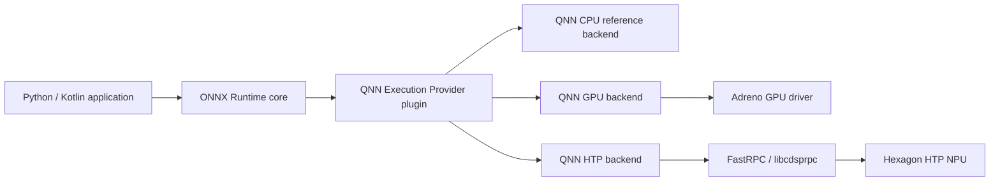
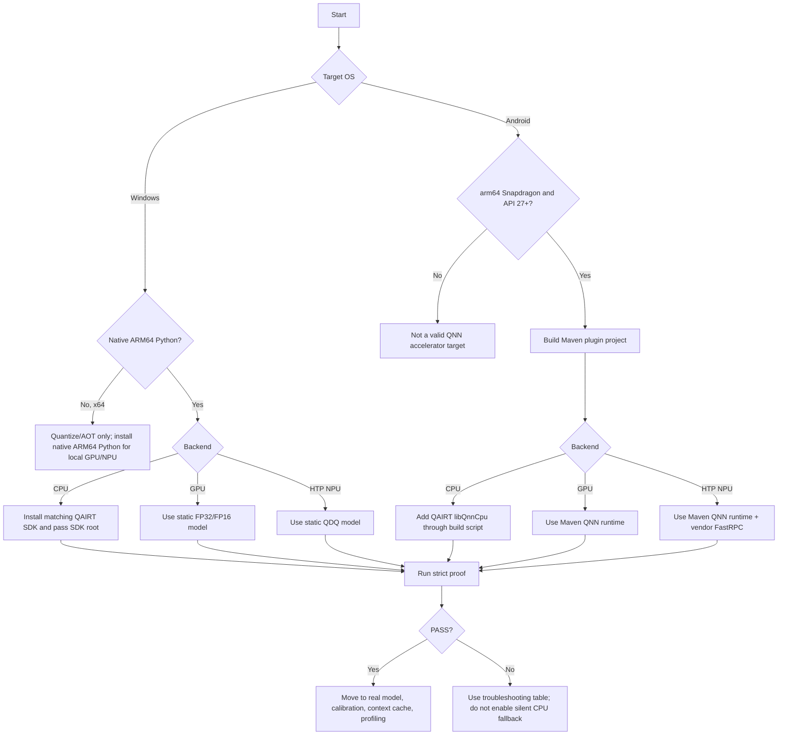

# ONNX Runtime + Qualcomm QNN: CPU, GPU, and HTP

[简体中文](README.zh-CN.md) · [Repository index](../README.md) · [Android demo](AndroidDemo/README.md)

| Item | Baseline |
|---|---|
| Last audited | `2026-07-17` |
| Execution targets | Native Windows ARM64 on Snapdragon and physical Snapdragon Android ARM64 devices |
| Desktop stack | ONNX Runtime 1.26.0, QNN plugin EP 2.4.0, QAIRT/QNN SDK 2.48.40 |
| Android project stack | ORT Android 1.26.0, QNN plugin AAR 2.4.0, QNN runtime AAR 2.48.0, API 27+, `arm64-v8a` |
| Entry points | [`one_click.py`](one_click.py) and [`AndroidDemo/build_demo.py`](AndroidDemo/build_demo.py) |
| Evidence boundary | The exact stack passed the Linux x64 HTP simulator, built an inspected 83.4 MiB APK, and passed HTP on Android SM8550; Windows hardware and Android GPU remain target-dependent |

## Contents

> [!TIP]
> **New here?** This map shows the whole guide at a glance. Skim it, then jump to your platform: Part A (Windows), Part B (Android), or Part C (your own model).

- [1. Choose a route](#1-choose-a-route)
- [2. Understand the stack](#2-understand-the-stack)
- [3. Choose a backend](#3-choose-a-backend)
- [4. Choose a platform](#4-choose-a-platform)
- [5. Check compatibility](#5-check-compatibility)
- [6. Understand plugin generations](#6-understand-plugin-generations)
- [7. Follow the decision flow](#7-follow-the-decision-flow)
- **[Part A — Windows zero-to-QNN](#part-a--windows-zero-to-qnn)**
  - [8. Windows prerequisites](#8-windows-prerequisites)
  - [9. Windows one-click proof](#9-windows-one-click-proof)
  - [10. What a desktop PASS proves](#10-what-a-desktop-pass-proves)
  - [11. Manual Python anatomy](#11-manual-python-anatomy)
- **[Part B — Android zero-to-QNN](#part-b--android-zero-to-qnn)**
  - [12. What not to do from the old tutorial](#12-what-not-to-do-from-the-old-tutorial)
  - [13. Android prerequisites](#13-android-prerequisites)
  - [14. Check the connected Android device](#14-check-the-connected-android-device)
  - [15. Android dependency layout](#15-android-dependency-layout)
  - [16. One-click Android build and install](#16-one-click-android-build-and-install)
  - [17. Android Studio route](#17-android-studio-route)
  - [18. What the Android project does correctly](#18-what-the-android-project-does-correctly)
  - [19. Android PASS interpretation](#19-android-pass-interpretation)
  - [20. HTP architecture notes](#20-htp-architecture-notes)
- **[Part C — Bring your own model](#part-c--bring-your-own-model)**
  - [21. Model readiness checklist](#21-model-readiness-checklist)
  - [22. Make dynamic dimensions fixed](#22-make-dynamic-dimensions-fixed)
  - [23. Quantize for HTP](#23-quantize-for-htp)
  - [24. Use Qualcomm AI Hub before buying every device](#24-use-qualcomm-ai-hub-before-buying-every-device)
  - [25. Useful QNN provider/session options](#25-useful-qnn-providersession-options)
  - [26. Context binary workflow](#26-context-binary-workflow)
  - [27. Performance methodology](#27-performance-methodology)
- **[Part D — Troubleshooting](#part-d--troubleshooting)**
  - [28. Troubleshooting](#28-troubleshooting)
  - [29. Diagnostics commands](#29-diagnostics-commands)
  - [30. Security, licensing, and deployment rules](#30-security-licensing-and-deployment-rules)
  - [31. What current blogs and field guides add](#31-what-current-blogs-and-field-guides-add)
  - [32. References](#32-references)

## 1. Choose a route

| Start here | Purpose |
|---|---|
| [One-click Python demo](one_click.py) | Creates an isolated pinned environment and strictly proves local QNN graph execution |
| [Android project](AndroidDemo/README.md) | Kotlin application with a verified HTP route, optional CPU/GPU probes, and a one-click build/install launcher |
| [Pinned Python stack](requirements.txt) | ORT core 1.26.0 + QNN plugin 2.4.0 |

On a native Windows ARM64 Snapdragon PC:

```powershell
cd Qualcomm
python one_click.py htp
python one_click.py gpu
```

On a development computer with a Snapdragon Android device attached:

```bash
python Qualcomm/AndroidDemo/build_demo.py --install --backend htp
```

QNN CPU is a reference backend and is intentionally omitted from the QNN 2.4 release package. Install matching QAIRT and pass `--qnn-sdk PATH` when CPU-backend verification is required.

### Read the result correctly

| Result | What it proves |
|---|---|
| APK path / Gradle `BUILD SUCCESSFUL` | The Android project and pinned artifacts assembled; no accelerator ran |
| Android app `READY` | The plugin registered and exposed at least one QNN device; no model ran yet |
| `PASS: QNN ...` / `PASS · QNN ...` | The selected backend created a strict no-ORT-CPU-fallback session, ran the smoke graph, and matched the CPU reference |

Only the final `PASS` on the intended physical machine is hardware-execution evidence. The tiny smoke graph is a configuration test, not a performance result.

### Outcomes

Starting from no QNN knowledge, this guide lets you:

1. Understand the difference between **QNN CPU**, **QNN GPU**, and **QNN HTP/NPU**.
2. Run a strict one-click Python proof on a local Snapdragon Windows PC.
3. Build, install, and run a complete Android application on a local Snapdragon phone/tablet.
4. Generate both static FP32 and QNN-compatible QDQ models locally.
5. Detect CPU fallback instead of mistaking “provider available” for acceleration.
6. Prepare a real model for production, then add context caching and profiling.

The demos use only a deterministic synthetic network. They do not download a model or upload data.

## 2. Understand the stack



ONNX Runtime partitions or compiles the ONNX graph. QNN EP converts the accepted graph into a QNN graph. One QNN backend executes that graph. **QNN is one EP with multiple backends; it is not three ONNX Runtime EP names.**

## 3. Choose a backend

| Tutorial name | QNN option | Hardware | Preferred model | Purpose | Important limitation |
|---|---|---|---|---|---|
| QNN CPU | `backend_type=cpu` | Arm/x64 CPU | Static FP32 | QNN integration/reference testing | It is a reference backend, not the normal optimized ORT CPU EP; the 2.4 release packages intentionally omit `QnnCpu` |
| QNN GPU | `backend_type=gpu` | Qualcomm Adreno GPU | Static FP16 or FP32; supported weight-only quantization | Floating-point acceleration and some LLM workloads | Requires a supported Adreno device/driver; operator coverage differs from HTP |
| QNN NPU | `backend_type=htp` | Hexagon HTP | Static QDQ, usually uint8/uint8 or uint16/uint8 | Best performance-per-watt for supported neural networks | Quantization and static shapes are the portable production path |
| ORT CPU EP | `CPUExecutionProvider` | Any supported CPU | FP32/other ORT types | Reference output and fallback | This is **not** QNN CPU |

For real CPU production inference, benchmark ORT CPU EP/XNNPACK as well. QNN CPU exists mainly to verify QNN graph conversion without an accelerator.

## 4. Choose a platform

| Host/device | QNN CPU | QNN GPU | QNN HTP/NPU | Correct use |
|---|---:|---:|---:|---|
| Windows 11 ARM64 on Snapdragon | SDK library required | Local inference | Local inference | Run the Python demo natively with ARM64 Python |
| Windows x64, including x64 Python emulated on WoA | SDK reference backend | No local Adreno route in the release matrix | No local NPU execution; AOT preparation only | Quantize/prepare/context-compile, then deploy to ARM64 |
| Android ARM64 on Snapdragon, API 27+ | Optional SDK library | Device/driver-dependent probe; not the beginner baseline | Local inference; physically verified on SM8550 | Start with HTP; try GPU only when the device's QNN GPU stack is documented/supported |
| Android emulator or non-Snapdragon device | Not a valid qualification target | Not available | Not available | Use ORT CPU/NNAPI for unrelated testing |
| Qualcomm Linux ARM64 | Supported by plugin releases | Platform-dependent | Local inference | Supported upstream, but outside this Windows/Android tutorial |

### Hard rule

A Snapdragon chip in the computer is not enough if the **process** is x64. Local Windows NPU/GPU inference requires the native Windows ARM64 package and native ARM64 Python/application.

## 5. Check compatibility

| Layer | Pinned version | Where it comes from | Why it is pinned |
|---|---:|---|---|
| ONNX model tooling | 1.22.0 | PyPI | Windows ARM64 wheels are available; tested here with the ORT 1.26 QNN quantizer; fixes malformed-model converter crashes reported for 1.21 |
| ONNX Runtime desktop core | 1.26.0 | PyPI | QNN EP 2.4.0 was compiled and tested with it |
| QNN plugin EP | 2.4.0 | `onnxruntime-qnn` / `com.qualcomm.qti:onnxruntime-android-qnn` | Current ABI-compatible plugin release |
| QAIRT SDK | 2.48.40 | Qualcomm Package Manager | Official QNN EP 2.4.0 build/test SDK |
| Android ORT core | 1.26.0 | Maven Central | Matches the tag's source-build core and passed physical SM8550 HTP execution |
| Android QNN runtime | 2.48.0 | Maven Central | Public artifact in the source build's QAIRT 2.48 line; passed physical SM8550 HTP execution |
| Python | CPython 3.11–3.14, 64-bit | python.org | PyPI publishes QNN 2.4.0 wheels for these versions |
| Android ABI | `arm64-v8a` | Android device | Only Android architecture in the QNN plugin release matrix |
| Android minimum | API 27 | App setting | Upstream minimum for HTP |
| Build toolchain | AGP 8.7.3 / Gradle 8.9 / JDK 17–22 | Android/Gradle | Reproducible demo build |

The Android version evidence is internally inconsistent upstream. The QNN 2.4.0 tag builds against ORT 1.26.0 and QAIRT 2.48.40, and its source Android test requests that line (falling back to the public QNN runtime 2.48.0 artifact). Its published-package table still names ORT Android 1.24.3 plus QNN runtime 2.45.0. On the same SM8550 test device, that older tuple built but both HTP and GPU failed QNN interface negotiation with the 2.4.0 plugin. Do not use that old table as a drop-in runtime recipe. This project keeps the source-build-aligned 1.26.0/2.48.0 tuple, which passed strict HTP execution; still qualify every production device family.

The tagged provider page still says Python 3.11.x, while the actual 2.4.0 PyPI release publishes CPython 3.11, 3.12, 3.13, and 3.14 wheels. The launchers follow the package metadata; CPython 3.12 is the least-surprising choice for a new setup.

Do not independently “upgrade just one DLL/AAR.” The backend API, stub/skel, firmware, plugin, and context binary are compatibility-sensitive.

## 6. Understand plugin generations

There are two packaging generations on the internet:

| Characteristic | Classic provider bridge | Plugin QNN EP 2.x used here |
|---|---|---|
| Source home | Microsoft ONNX Runtime tree | Qualcomm-maintained `onnxruntime/onnxruntime-qnn` repository |
| Python install | `onnxruntime-qnn==1.x` | `onnxruntime` + `onnxruntime-qnn==2.x` |
| Registration | Provider is already in that ORT build | Application explicitly registers the plugin library |
| Android | Microsoft all-in-one QNN AAR/custom ORT build | ORT core AAR + Qualcomm plugin AAR + QNN runtime AAR |
| Future direction | Versions below 2.0 are deprecated upstream | Current route |

Never install/combine both generations in one process. In particular, do not mix:

- `com.microsoft.onnxruntime:onnxruntime-android-qnn` (all-in-one classic route), and
- `com.microsoft.onnxruntime:onnxruntime-android` + `com.qualcomm.qti:onnxruntime-android-qnn` (plugin route).

This tutorial uses the second line consistently.

## 7. Follow the decision flow



---

## Part A — Windows zero-to-QNN

## 8. Windows prerequisites

### 8.1 Required hardware and OS

- A Windows 11 ARM64 Snapdragon PC for local Adreno GPU or HTP/NPU inference.
- Current Windows Update and OEM firmware/driver packages.
- At least 2 GB free disk space for Python, packages, and caches.
- Internet access for the first setup.

Examples include Snapdragon X-class Windows PCs. Older supported Snapdragon Windows devices depend on their OEM driver/QNN compatibility.

### 8.2 Check the machine and Python architecture

In PowerShell:

```powershell
systeminfo | Select-String "System Type"
python -c "import platform,struct; print(platform.machine(), struct.calcsize('P')*8)"
```

Expected for local GPU/NPU inference:

```text
ARM64 64
```

If Python prints `AMD64`, it is an emulated x64 process. It can prepare models, but it is the wrong process for local QNN GPU/HTP execution.

### 8.3 Install native ARM64 Python

1. Download 64-bit **Windows ARM64** CPython 3.12 or 3.13 from [python.org Windows downloads](https://www.python.org/downloads/windows/).
2. Enable **Add python.exe to PATH** in the installer.
3. Open a new PowerShell window.
4. Run the architecture check again.

Do not install the x64 build by mistake.

### 8.4 Update the Qualcomm driver path first

1. Open **Settings → Windows Update**.
2. Install regular and optional OEM driver updates.
3. Reboot.
4. Check Device Manager for the Qualcomm NPU/accelerator and Adreno display device.

The Python wheel ships user-mode QNN libraries; it does not replace the OEM kernel/firmware stack.

## 9. Windows one-click proof

From the repository root:

```powershell
cd Qualcomm
python one_click.py htp
```

The first run creates `Qualcomm/.venv-qnn`, installs the pinned stack, generates a static QDQ model, registers the QNN plugin, and runs a strict target session.

ONNX 1.22 now provides native Windows ARM64 wheels, so this synthetic model can be generated in the ARM64 environment. For a real model, Qualcomm's documented workflow still recommends doing quantization on x64 when the larger model toolchain is easier or an ARM64 dependency is unavailable, then deploying the resulting static QDQ model to ARM64.

Run every backend:

```powershell
python one_click.py htp
python one_click.py gpu
python one_click.py cpu --qnn-sdk "C:\Qualcomm\AIStack\QAIRT\2.48.40"
```

`npu` is accepted as an alias for `htp`:

```powershell
python one_click.py npu
```

Useful options:

| Option | Meaning |
|---|---|
| `--runs 100` | Number of measured inferences |
| `--warmups 10` | Warm-up count before timing |
| `--performance-mode sustained_high_performance` | HTP power policy |
| `--qnn-sdk PATH` | Locate the optional QNN CPU backend |
| `--backend-path FILE` | Use an explicit backend library |
| `--refresh` | Reinstall the pinned environment |
| `--verbose` | Print a Python traceback after failure |

### 9.1 Why QNN CPU needs the SDK

QNN EP 2.4.0 intentionally does not ship `QnnCpu.dll`/`libQnnCpu.so`. To test it:

1. Create a Qualcomm account.
2. Install [Qualcomm Package Manager](https://qpm.qualcomm.com/).
3. Install Qualcomm AI Runtime/QAIRT 2.48.40.
4. Pass its root to `--qnn-sdk`.

GPU and HTP libraries are already in the normal plugin package; do not overwrite them with arbitrary SDK versions.

## 10. What a desktop PASS proves

The test does **not** pass merely because a provider name exists.

| Gate | What the script does |
|---|---|
| Package integrity | Pins ORT, ONNX, QNN plugin, and SymPy in an isolated environment |
| Correct plugin API | Calls `register_execution_provider_library()` and enumerates `OrtEpDevice` objects |
| Correct hardware class | Chooses CPU/GPU/NPU device type matching the requested backend |
| Correct model | FP32 for CPU/GPU, QDQ for HTP, all dimensions static |
| No silent fallback | Sets `session.disable_cpu_ep_fallback=1` |
| Graph execution evidence | Reads graph-assignment information when available and parses the ORT profile |
| Numerical validity | Compares QNN output to an independent ORT CPU session |
| Safe plugin unload | Destroys sessions before unregistering the plugin |

Expected final line:

```text
PASS: QNN HTP executed ... with ORT CPU fallback disabled.
```

The tiny graph is a configuration proof, not a meaningful performance benchmark.

## 11. Manual Python anatomy

The one-click script implements the plugin lifecycle required by QNN 2.x:

```python
import onnxruntime as ort
import onnxruntime_qnn as qnn

ort.register_execution_provider_library(
    "QNNExecutionProvider", qnn.get_library_path()
)
qnn_devices = [
    device for device in ort.get_ep_devices()
    if device.ep_name == "QNNExecutionProvider"
]

options = ort.SessionOptions()
options.add_session_config_entry("session.disable_cpu_ep_fallback", "1")
options.add_provider_for_devices(
    qnn_devices,
    {"backend_path": qnn.get_qnn_htp_path()},
)
session = ort.InferenceSession("model.qdq.onnx", sess_options=options)

# Destroy every dependent session before unregistering.
del session
ort.unregister_execution_provider_library("QNNExecutionProvider")
```

The demo additionally selects the exact hardware type and validates assignment/profile events.

---

## Part B — Android zero-to-QNN

## 12. What not to do from the old tutorial

The old page copied many `/system/lib64` and `/vendor/lib64` files into both APK assets and JNI folders. Do **not** use that pattern.

| Old action | Why it is wrong for a modern app | Replacement in this project |
|---|---|---|
| Pull Android framework libraries such as `libc++.so`, `libbase.so`, `libutils.so`, and the linker | Device/OS-specific ABI, linker namespace, security, update, and licensing risks | Use platform libraries from the device; never package them |
| Put `.so` files in both assets and `jniLibs` | Duplicate APK size and ambiguous loading | Maven AARs package ABI libraries once |
| Pull `libcdsprpc.so` into the APK | It is an OEM/vendor interface tied to the device | Declare `<uses-native-library android:name="libcdsprpc.so">` |
| Guess and copy one HTP skel manually | Easy to mismatch SoC, firmware, and runtime | Let the pinned QNN runtime AAR provide its backend/stub/skel set and let QNN detect the device |
| Mix SDK 2.36 libraries with arbitrary ORT | Backend API mismatch | Pin one tested stack |
| Treat successful session creation with CPU fallback as NPU proof | Unsupported nodes may run on ORT CPU | Disable CPU fallback in the target session |

## 13. Android prerequisites

### Development computer

- Windows, Linux, or macOS with Android Studio.
- Android SDK Platform 35 and Platform-Tools.
- JDK/JBR 17–22 (Android Studio includes one).
- 64-bit CPython 3.11–3.14 for generating the demo ONNX assets.
- Roughly 3 GB free for Gradle/Maven caches.
- Internet access on the first run; `--offline` works only after all Python, Gradle, and Maven artifacts are cached.

### Target device

- Real `arm64-v8a` Android device with a supported Qualcomm Snapdragon SoC.
- Android API 27 or newer for HTP.
- Current OEM firmware.
- Developer options and USB debugging enabled.

An Android emulator cannot prove Adreno/HTP execution.

## 14. Check the connected Android device

Connect USB, accept the authorization dialog, then run:

```bash
adb devices
adb shell getprop ro.product.cpu.abi
adb shell getprop ro.build.version.sdk
adb shell getprop ro.soc.manufacturer
adb shell getprop ro.soc.model
adb shell getprop ro.kernel.qemu
adb shell ls -l /vendor/lib64/libcdsprpc.so  # diagnostic; OEM paths can differ
```

Expected essentials:

- state is `device`, not `unauthorized`;
- ABI is `arm64-v8a`;
- API is >= 27;
- `ro.kernel.qemu` is not `1`;
- a Qualcomm/Snapdragon SoC is reported;
- FastRPC exists for HTP-capable firmware.

The launcher checks authorization, ABI, API level, and emulator status before installation. It prints a warning rather than rejecting a device when OEM properties do not clearly name Qualcomm; the strict QNN session is the final hardware gate. Do not pull `libcdsprpc.so`; it remains an OEM-owned device library.

## 15. Android dependency layout

The supplied project uses the current plugin composition:

| Gradle dependency/runtime item | Role | Packaged where |
|---|---|---|
| `com.microsoft.onnxruntime:onnxruntime-android:1.26.0` | ORT Java API, JNI, core runtime | APK native libs/classes |
| `com.qualcomm.qti:onnxruntime-android-qnn:2.4.0` | ABI-compatible QNN EP plugin and Kotlin helper | APK native libs/classes |
| `com.qualcomm.qti:qnn-runtime:2.48.0` | GPU/HTP/System/prepare/stub/skel QNN runtime | APK native libs |
| Device `libcdsprpc.so` | FastRPC transport into HTP | OEM `/vendor`, exposed by manifest |
| SDK `libQnnCpu.so` (optional) | QNN CPU reference backend | Copied by the build launcher into `jniLibs/arm64-v8a` |

The QNN runtime AAR is large because it supports several HTP generations. A debug APK near 80–90 MiB is expected. The `2026-07-17` audit produced an 83.4 MiB APK containing only `arm64-v8a`: ORT core/JNI, the QNN plugin, QNN GPU/HTP/System/Prepare, and HTP v68/v69/v73/v75/v79/v81 stub/skel libraries. It contained no QNN CPU backend, `libcdsprpc.so`, Android `libc++`, or linker.

These three dependencies are explicit: the QNN plugin AAR's published POM does not pull ORT core or QNN runtime transitively. Do not omit one or add the classic Microsoft all-in-one QNN AAR.

## 16. One-click Android build and install

From the repository root:

```bash
python Qualcomm/AndroidDemo/build_demo.py
```

The launcher:

1. creates `AndroidDemo/.venv-models`;
2. installs only the pinned model-generation packages;
3. generates static FP32 and QDQ model assets;
4. finds Android SDK and JDK;
5. downloads Gradle 8.9 to the user cache with the official SHA-256 check;
6. resolves the three Maven artifacts;
7. builds an `arm64-v8a` debug APK.

The first run downloads Python wheels, Gradle, and large native AARs and can take several minutes. A repeated run reuses valid environments and caches. With `--install`, the launcher now rejects an emulator, a non-`arm64-v8a` target, or API below 27 before installing the APK.

Build, install, and immediately run HTP:

```bash
python Qualcomm/AndroidDemo/build_demo.py --install --backend htp
```

Other backends:

```bash
# Optional probe: QNN GPU is not available on every Android device/driver.
python Qualcomm/AndroidDemo/build_demo.py --install --backend gpu
python Qualcomm/AndroidDemo/build_demo.py --qnn-sdk /path/to/QAIRT/2.48.40 \
  --install --backend cpu
```

HTP is the Android baseline. During this audit, HTP repeatedly passed on a Nubia NX711J with Snapdragon 8 Gen 2 (`SM8550`, HTP v73), Android API 35: strict fallback disabled, 20 measured runs, observed medians of 0.18–0.27 ms, and maximum error 0.0163526 versus ORT CPU. The timing spread is another reason not to benchmark this tiny graph. On that same device, `libQnnGpu.so` returned `QNN_COMMON_ERROR_PLATFORM_NOT_SUPPORTED`; the older 2.45 runtime also failed interface negotiation. This is a supported failure of the strict probe, not a reason to enable CPU fallback. Qualcomm's public GPU blog is a Snapdragon X Windows preview, and upstream QNN GPU unit tests skip ARM64, so do not assume that packaging `libQnnGpu.so` means a phone can execute it.

Windows PowerShell uses the same Python script; replace Unix paths with Windows paths.

Important launcher options:

| Option | Purpose |
|---|---|
| `--install` | Run `adb install -r` and launch the app |
| `--backend cpu|gpu|htp` | Automatically start a backend after launch |
| `--device SERIAL` | Select one device when several are connected |
| `--qnn-sdk PATH` | Package the optional Android `libQnnCpu.so` |
| `--android-sdk PATH` | Override Android SDK discovery |
| `--java-home PATH` | Override JDK/JBR discovery |
| `--gradle PATH` | Use an existing Gradle 8.9 install |
| `--offline` | Forbid downloads; require complete caches |
| `--clean` | Clean before building |

Generated APK:

```text
Qualcomm/AndroidDemo/app/build/outputs/apk/debug/app-debug.apk
```

## 17. Android Studio route

1. First run `python build_demo.py` once so the ONNX assets exist.
2. Open `Qualcomm/AndroidDemo` in Android Studio.
3. Let Gradle sync.
4. Select the physical Snapdragon device.
5. Press **Run**.
6. Tap **Run QNN NPU / HTP** first; use **Try QNN GPU** only as a device/driver capability probe.
7. For the CPU button, rebuild once with `--qnn-sdk`.

## 18. What the Android project does correctly

| Requirement | Implementation |
|---|---|
| Android 12 vendor library visibility | Manifest requests `libcdsprpc.so` with `required=false` |
| HTP library discovery | Sets `ADSP_LIBRARY_PATH` to `ApplicationInfo.nativeLibraryDir` before ORT initialization |
| Native library extraction | Gradle uses legacy JNI packaging so QNN can discover files by path |
| Plugin lifecycle | Registers `libonnxruntime_providers_qnn.so`, then filters `environment.epDevices` |
| Backend selection | Sends `backend_type=cpu`, `gpu`, or `htp` |
| HTP model | Uses the generated static QDQ graph |
| GPU/CPU model | Uses the generated static FP32 graph |
| Fallback protection | Target session sets `session.disable_cpu_ep_fallback=1` |
| Numerical validation | Runs a separate ORT CPU reference and checks maximum absolute error |
| Resource cleanup | Uses Kotlin `use` for tensors, results, options, and sessions; unloads only after worker termination |

On some Android OEM builds, including the audited SM8550 device, `READY` reports a QNN EP registration device with `type=CPU`. The app intentionally enables this ARM64 registration handle because the plugin exposed no device without it on that target. It does **not** mean the graph ran on CPU: `backend_type=htp|gpu|cpu` selects the backend, and only the strict run result is execution evidence.

## 19. Android PASS interpretation

The app reports:

```text
PASS · QNN HTP / NPU backend
session.disable_cpu_ep_fallback=1
...
max |QNN−CPU|=...
```

Because the complete test graph is supported and ORT CPU fallback is disabled, session creation/run fails instead of silently assigning unsupported nodes to ORT CPU. Together with the explicit `backend_type`, successful execution and numerical comparison provide a strict proof for this smoke graph. They do not certify operator coverage or performance for another model.

For native logs:

```bash
adb logcat | grep -iE "onnxruntime|qnn|fastrpc|cdsp"
```

On Windows without `grep`, use:

```powershell
adb logcat | Select-String -Pattern "onnxruntime|qnn|fastrpc|cdsp"
```

## 20. HTP architecture notes

The app does not hard-code `htp_arch`; the runtime detects the device. That is safer than selecting a skel from a marketing name.

| Common mobile generation | Typical HTP architecture | Runtime artifact family |
|---|---:|---|
| Snapdragon 8 Gen 1 | v69 | `libQnnHtpV69*` |
| Snapdragon 8 Gen 2 | v73 | `libQnnHtpV73*` |
| Snapdragon 8 Gen 3 | v75 | `libQnnHtpV75*` |
| Snapdragon 8 Elite (SM8750) | v79 | `libQnnHtpV79*` |
| Snapdragon 8 Elite Gen 5 (SM8850) | v81 | `libQnnHtpV81*` |

Treat this as orientation, not a substitute for Qualcomm's exact SoC table. Firmware and SDK compatibility matter as much as the architecture number.

---

## Part C — Bring your own model

## 21. Model readiness checklist

| Check | CPU | GPU | HTP/NPU |
|---|---:|---:|---:|
| All input dimensions fixed | Required | Required | Required |
| Supported ONNX operators only | Required | Required | Required |
| FP32 model | Yes | Yes | Usually quantize; limited FP paths are hardware/op-dependent |
| FP16 model | Backend-dependent | Recommended where accurate | Supported for selected ops/platforms, not the most portable route |
| Canonical QDQ model | Optional | Some quantized modes | Recommended production route |
| Representative calibration | N/A | If quantized | Essential |
| Control flow (`If`, `Loop`) | Generally unsupported by QNN EP | Generally unsupported | Generally unsupported |

Consult the current [QNN supported operator table](https://github.com/onnxruntime/onnxruntime-qnn/blob/v2.4.0/docs/execution_providers/QNN-ExecutionProvider.md#supported-onnx-operators) and the QAIRT operator documentation; data-type support is backend-specific.

## 22. Make dynamic dimensions fixed

QNN EP rejects dynamic tensor shapes. Use ONNX Runtime's helper where possible:

```bash
python -m onnxruntime.tools.make_dynamic_shape_fixed \
  --dim_param batch_size --dim_value 1 \
  input.onnx fixed.onnx
```

Repeat for every symbolic dimension, or re-export the model with fixed shapes. Inspect it with Netron or ONNX shape inference afterward.

## 23. Quantize for HTP

The repository's `smoke_model.py` demonstrates the canonical API sequence:

1. `qnn_preprocess_model()`;
2. a `CalibrationDataReader`;
3. `get_qnn_qdq_config()`;
4. `quantize()` with QNN settings.

For a real model:

- use representative, correctly preprocessed samples;
- never use random calibration data as a production shortcut;
- start with uint8 activations/uint8 weights;
- try uint16 activations for sensitive regions;
- evaluate task accuracy, not only tensor error;
- perform quantization on Windows/Linux x64 if ONNX tooling is easier there;
- deploy the static QDQ model to Windows ARM64/Android ARM64.

The [official QNN quantization section](https://onnxruntime.ai/docs/execution-providers/QNN-ExecutionProvider.html#running-a-model-with-qnn-eps-htp-backend-python) and [QNN plugin documentation](https://github.com/onnxruntime/onnxruntime-qnn/blob/v2.4.0/docs/execution_providers/QNN-ExecutionProvider.md) remain authoritative.

## 24. Use Qualcomm AI Hub before buying every device

[Qualcomm AI Hub](https://aihub.qualcomm.com/) can profile/compile/test models on hosted Qualcomm hardware. It is useful for:

- checking whether the intended SoC supports the graph;
- comparing quantization choices;
- measuring device latency and peak memory;
- obtaining optimized artifacts for supported workflows.

Still run the final artifact in the actual application. Host preprocessing, I/O, thermal state, firmware, and threading affect end-to-end behavior.

## 25. Useful QNN provider/session options

| Option | Scope | Typical value | Notes |
|---|---|---|---|
| `backend_type` | Provider | `cpu`, `gpu`, `htp` | Prefer this for portable Android code |
| `backend_path` | Provider | helper-returned DLL/SO path | Mutually exclusive with `backend_type`; useful for Python/SDK override |
| `htp_performance_mode` | Provider | `burst`, `sustained_high_performance`, `balanced` | `burst` is good for a short proof, not always for sustained thermals |
| `htp_graph_finalization_optimization_mode` | Provider | `0`–`3` | Higher values trade longer preparation for more optimization |
| `offload_graph_io_quantization` | Provider | `0` or `1` | Strict demo uses `0` so Q/DQ stays in QNN graph |
| `enable_htp_fp16_precision` | Provider | `0` or `1` | Allows FP32 model execution in FP16 where supported |
| `profiling_level` | Provider | `basic`, `detailed`, `optrace` | HTP profiling; `optrace` requires newer QAIRT |
| `profiling_file_path` | Provider | writable CSV path | Android must use app-owned storage |
| `session.disable_cpu_ep_fallback` | Session | `1` | Qualification gate; fail instead of silently running ORT CPU |
| `ep.context_enable` | Session | `1` | Generate an EPContext/context cache model |
| `ep.context_file_path` | Session | writable `.onnx` path | Never point to read-only Android assets |
| `ep.context_embed_mode` | Session | `0` or `1` | Embed context or store a separate binary |

## 26. Context binary workflow

QNN graph conversion/finalization can make first session creation expensive. A context binary stores the compiled QNN context.


Rules:

1. Generate with the intended backend and target compatibility options.
2. Store output in a writable directory.
3. Record the QNN EP, QAIRT, SoC/HTP architecture, and model hash.
4. Regenerate after changing model, quantization, backend, major runtime, or target compatibility.
5. Test on every supported device family.
6. Keep the external `.bin` beside its wrapper ONNX if embed mode is disabled.

Qualcomm AI Hub documents an NPU context binary as SoC-specific and NPU-only, but operating-system agnostic. A compatible wrapper can therefore move across Android, Linux, and Windows for the same target SoC; it is not a universally portable ONNX model and still needs runtime/firmware qualification.

## 27. Performance methodology

- Exclude session creation/compilation from steady-state inference timing.
- Warm up before measuring.
- Measure at least median, tail latency, power, memory, and task accuracy.
- Fix input shapes and preprocessing.
- Compare FP32 GPU, QDQ HTP, and an optimized CPU baseline.
- Measure sustained runs; `burst` can throttle.
- Profile complete application latency, not only `session.run()`.
- Re-test after firmware/driver/QNN updates.

---

## Part D — Troubleshooting

## 28. Troubleshooting

| Symptom | Likely cause | Correct action |
|---|---|---|
| `Windows x64 ... AOT only` | x64 Python/process | Install native ARM64 Python and recreate the environment |
| `QNN plugin ... exposed no devices` | Unsupported device, stale OEM driver, wrong architecture, or plugin load problem | Update firmware/driver; verify Snapdragon and ARM64 process; inspect QNN paths |
| `Could not find QnnCpu` / CPU button disabled | CPU reference backend is intentionally absent from release packages | Install matching QAIRT and pass `--qnn-sdk` |
| Windows error 193 / “not a valid Win32 application” | ARM64/x64 DLL mismatch | Use one architecture consistently |
| `No module named onnxruntime_qnn` | Wrong environment or failed install | Run the one-click launcher without `--worker`; use `--refresh` |
| Duplicate ORT packages/import owners | Installed `onnxruntime-qnn` 1.x or several ORT wheels together | Delete the venv and let the launcher install the pinned 2.x plugin stack |
| `Only one of backend_type and backend_path` | Both options were supplied | Set exactly one |
| HTP rejects FP32 graph | Model is not QDQ or unsupported FP path | Quantize with QNN QDQ configuration |
| Dynamic tensor error | Symbolic/dynamic input or output | Fix every dimension and re-run shape inference |
| Unsupported node / strict session creation fails | QNN backend cannot own the full graph | Rewrite/quantize the op, use another backend, or intentionally allow and measure fallback outside qualification |
| Android `UnsatisfiedLinkError` for QNN | Mixed AAR generations, missing runtime AAR, or incompatible ABI | Use exactly the three dependencies in the supplied project |
| Android cannot access `libcdsprpc.so` | Missing manifest request on Android 12+, non-Snapdragon device, or OEM restriction | Keep the provided manifest; update OEM firmware; do not copy the system library |
| HTP skel/stub/FastRPC error | Runtime libraries do not match firmware/SoC | Use a compatible QNN runtime or update firmware; do not select a random skel |
| `ADSP_LIBRARY_PATH` warning/failure | Set too late or to the wrong directory | Set it to `applicationInfo.nativeLibraryDir` before ORT/plugin initialization |
| Android duplicate native library/class error | Mixed all-in-one Microsoft QNN AAR and Qualcomm plugin route | Keep only the plugin composition in this project |
| Android `READY` shows QNN registration `type=CPU` | OEM/ORT hardware discovery exposes the plugin through a CPU-class registration handle | This is not graph assignment; check explicit `backend_type` and require the strict backend `PASS` |
| Android GPU reports `QNN_COMMON_ERROR_PLATFORM_NOT_SUPPORTED` | The device/vendor GPU stack does not expose a compatible QNN GPU platform | Use HTP on that device; do not enable CPU fallback just to make the GPU probe pass |
| QNN reports `Unable to find a valid interface` | Plugin and QNN runtime libraries are from incompatible API lines | Restore the pinned runtime tuple; do not substitute the stale 2.45 Maven table for plugin 2.4.0 |
| APK is roughly 80–90 MiB | QNN runtime packages several HTP generations | Expected for this proof app; inspect the actual APK and optimize only after defining target devices and licensing |
| Gradle checksum mismatch | Interrupted/corrupted Gradle transfer | Retry; the launcher resumes and never bypasses SHA-256 verification |
| Context model stops loading after update | Context/QNN/SoC incompatibility | Regenerate the context from the original ONNX model |
| First HTP run later returns engine/SSR error | HTP subsystem restart | Destroy and recreate the ORT session as upstream recommends |
| Provider listed but speed is CPU-like | Provider availability was mistaken for graph assignment, or graph is too small | Use strict proof/profile; benchmark a realistic graph after warm-up |
| Accuracy regression after quantization | Bad calibration or too-low precision in sensitive tensors | Use representative data and mixed uint8/uint16 overrides |
| Performance degrades over time | Thermal/power throttling | Use sustained tests and appropriate performance mode |

## 29. Diagnostics commands

### Windows

```powershell
python -c "import platform; print(platform.machine())"
python -c "import onnxruntime as o, onnxruntime_qnn as q; print(o.__version__, q.__version__); print(q.get_library_path()); print(q.get_qnn_gpu_path()); print(q.get_qnn_htp_path())"
python one_click.py htp --verbose
```

### Android

```bash
adb shell getprop ro.soc.model
adb shell getprop ro.product.cpu.abi
adb shell dumpsys package io.github.ortqnn.demo | grep -i native
adb logcat -c
adb shell am start -n io.github.ortqnn.demo/.MainActivity --es backend htp
adb logcat | grep -iE "onnxruntime|qnn|fastrpc|cdsp"
```

## 30. Security, licensing, and deployment rules

- Review and accept every applicable Qualcomm term before redistribution. The public `qnn-runtime` 2.48.0 POM declares the Qualcomm AI Hub Model License; Maven availability alone is not a redistribution grant.
- Do not extract framework/vendor libraries from one phone and ship them to another.
- Do not commit Qualcomm SDK binaries into this repository.
- Keep models and external context binaries integrity-checked.
- Treat model inputs/outputs as application data; this demo performs local inference only.
- Review QNN/ORT telemetry/privacy notices for the package and platform you distribute.
- Use release signing and normal Android supply-chain controls for production.

## 31. What current blogs and field guides add

The audit order is: versioned release/source documentation, package metadata, Android platform documentation, Qualcomm engineering posts, then third-party field guides. Field reports help explain operational choices but do not override a tagged compatibility statement.

| Field source | Practical lesson incorporated here | Scope warning |
|---|---|---|
| [Qualcomm: first ONNX Runtime Plugin EP](https://www.qualcomm.com/developer/blog/2026/05/qualcomm-launches-the-first-onnx-runtime-plugin-execution-provider) (2026-05-21) | QNN 2.x is a separately versioned shared-library plugin; register it explicitly and update it independently of ORT core | Describes architecture, not a complete app recipe |
| [Qualcomm: QNN EP GPU backend](https://www.qualcomm.com/developer/blog/2025/05/unlocking-power-of-qualcomm-qnn-execution-provider-gpu-backend-onnx-runtime) (2025-05-19) | Backend choice is exclusive within one QNN session; disable CPU fallback to prove complete Adreno assignment; GPU depends on the platform graphics/OpenCL driver | Snapdragon X Windows preview, not proof that an Android device supports QNN GPU |
| [Ultralytics QNN deployment guide](https://docs.ultralytics.com/integrations/qnn/) | Representative calibration, precompiled context ONNX, warm-up, end-to-end timing, and thermal-state caveats matter; HTP mappings now include v79/v81 | YOLO-specific convenience tooling and benchmark numbers are not universal |
| [Qualcomm AI Hub compilation examples](https://workbench.aihub.qualcomm.com/docs/hub/compile_examples.html) | A QNN context binary is device-specific but OS-agnostic; precompiled QNN ONNX simplifies deployment across Android/Linux/Windows; preserve relative `.bin` paths | Hosted compilation has its own account, artifact, and licensing workflow |
| [Edge Impulse Android QNN acceleration](https://docs.edgeimpulse.com/tutorials/topics/android/qnn-acceleration) | Real devices, INT8, `ADSP_LIBRARY_PATH`, the Android vendor-library declaration, Logcat, sustained timing, and operator coverage are practical necessities | This is a **TFLite delegate**, not ORT QNN EP; its manual SDK-copy recipe must not replace this project's Maven/plugin composition |

This is why the supplied demos use strict no-fallback sessions, representative-production warnings, warm-up, app-owned native paths, a real device requirement, and a versioned plugin stack.

## 32. References

| Topic | Source |
|---|---|
| Microsoft QNN EP overview and classic provider options | [ONNX Runtime QNN Execution Provider](https://onnxruntime.ai/docs/execution-providers/QNN-ExecutionProvider.html) |
| Microsoft QNN provider implementation requested by this tutorial | [microsoft/onnxruntime QNN source](https://github.com/microsoft/onnxruntime/tree/main/onnxruntime/core/providers/qnn) |
| Current plugin QNN EP | [onnxruntime/onnxruntime-qnn](https://github.com/onnxruntime/onnxruntime-qnn) |
| Qualcomm plugin architecture blog | [First ONNX Runtime Plugin EP](https://www.qualcomm.com/developer/blog/2026/05/qualcomm-launches-the-first-onnx-runtime-plugin-execution-provider) |
| Qualcomm GPU backend field guide | [QNN EP GPU backend](https://www.qualcomm.com/developer/blog/2025/05/unlocking-power-of-qualcomm-qnn-execution-provider-gpu-backend-onnx-runtime) |
| Exact 2.4.0 release compatibility | [QNN EP v2.4.0 release](https://github.com/onnxruntime/onnxruntime-qnn/releases/tag/v2.4.0) |
| Exact 2.4.0 provider options and Android validation pair | [QNN EP v2.4.0 documentation](https://github.com/onnxruntime/onnxruntime-qnn/blob/v2.4.0/docs/execution_providers/QNN-ExecutionProvider.md) |
| Plugin usage lifecycle | [ONNX Runtime plugin EP usage](https://onnxruntime.ai/docs/execution-providers/plugin-ep-libraries/usage.html) |
| QNN EP build instructions | [Plugin build guide](https://github.com/onnxruntime/onnxruntime-qnn/blob/v2.4.0/docs/execution_providers/build.md) |
| QAIRT download | [Qualcomm Package Manager](https://qpm.qualcomm.com/) |
| QAIRT public documentation | [Qualcomm AI Runtime docs](https://docs.qualcomm.com/bundle/publicresource/topics/80-63442-10/QNN_general_overview.html) |
| Hosted hardware profiling | [Qualcomm AI Hub](https://aihub.qualcomm.com/) |
| AI Hub compilation and precompiled QNN ONNX | [Compiling models](https://workbench.aihub.qualcomm.com/docs/hub/compile_examples.html) |
| Fix dynamic ONNX dimensions | [ORT fixed-shape helper](https://onnxruntime.ai/docs/tutorials/mobile/helpers/make-dynamic-shape-fixed.html) |
| Quantization concepts | [ONNX Runtime quantization](https://onnxruntime.ai/docs/performance/model-optimizations/quantization.html) |
| QNN 2.4.0 Python wheel metadata | [PyPI `onnxruntime-qnn` 2.4.0](https://pypi.org/project/onnxruntime-qnn/2.4.0/) |
| ONNX 1.22.0 model-tool wheels | [PyPI `onnx` 1.22.0](https://pypi.org/project/onnx/1.22.0/) |
| Android vendor-library visibility | [Android `<uses-native-library>`](https://developer.android.com/guide/topics/manifest/uses-native-library-element) |
| Android 12 behavior rationale | [Vendor-supplied native libraries](https://developer.android.com/about/versions/12/behavior-changes-12#uses-native-library) |
| Published Android plugin | [Qualcomm QNN plugin AAR](https://central.sonatype.com/artifact/com.qualcomm.qti/onnxruntime-android-qnn/2.4.0) |
| Published Android QNN runtime | [Qualcomm QNN runtime AAR](https://central.sonatype.com/artifact/com.qualcomm.qti/qnn-runtime/2.48.0) |
| Official C/C++ sample | [ORT QNN MobileNet example](https://github.com/microsoft/onnxruntime-inference-examples/tree/main/c_cxx/QNN_EP/mobilenetv2_classification) |
| Production-oriented vision example | [Ultralytics QNN guide](https://docs.ultralytics.com/integrations/qnn/) |

When a blog conflicts with the versioned release notes, provider source, or device documentation, follow the versioned official source.
