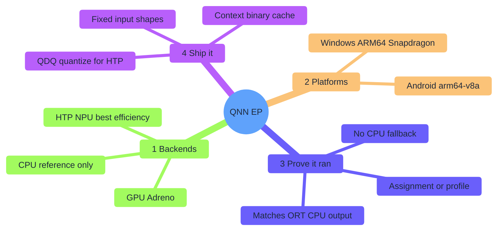
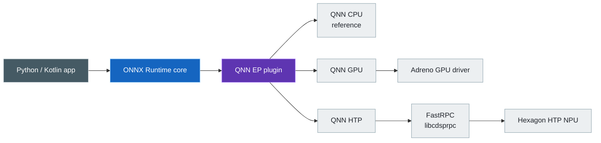
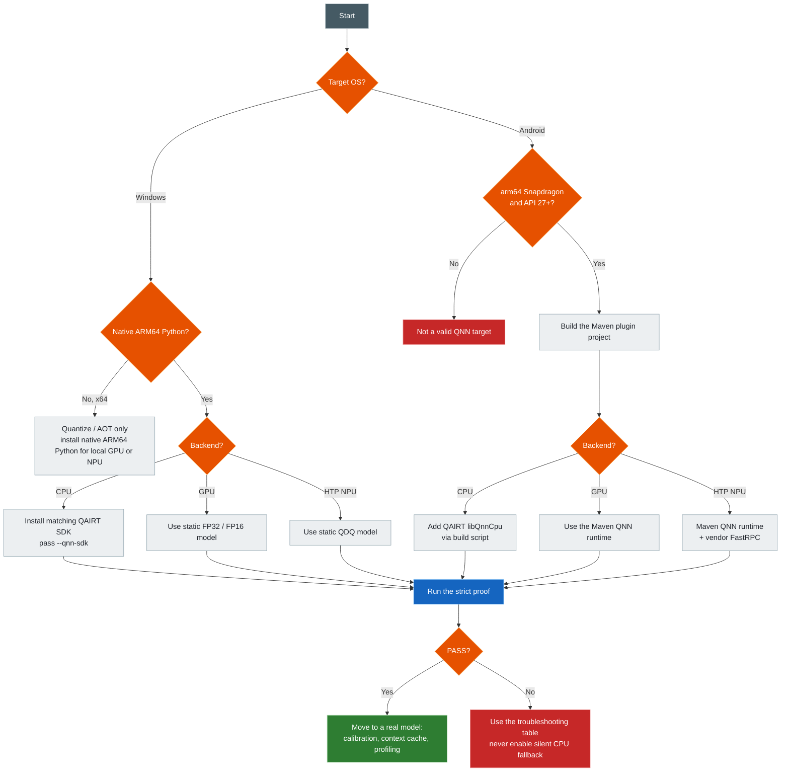
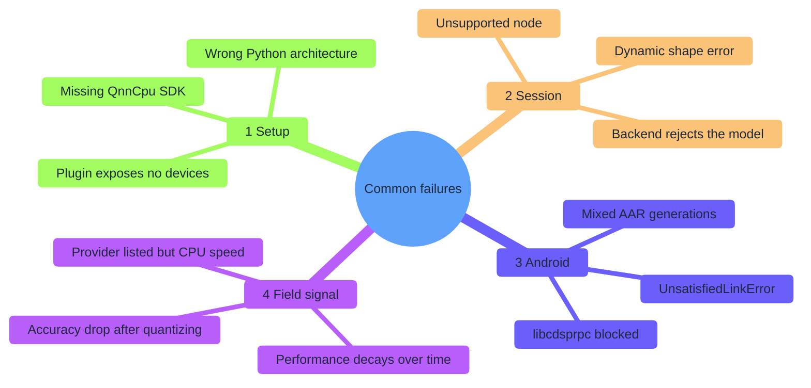

# ONNX Runtime + Qualcomm QNN: CPU, GPU, and HTP

[简体中文](README.zh-CN.md) · [Repository index](../README.md) · [Android demo](AndroidDemo/README.md)

ONNX Runtime's **QNN Execution Provider** runs your model on Snapdragon silicon: the Hexagon **NPU**, the Adreno **GPU**, or a CPU reference path. This guide takes you from zero to a **strict, no-fallback proof** on real Windows and Android hardware — not just "the provider loaded."

| Item | Baseline |
|---|---|
| Last audited | `2026-07-17` |
| Execution targets | Native Windows ARM64 on Snapdragon and physical Snapdragon Android ARM64 devices |
| Desktop stack | ONNX Runtime 1.26.0, QNN plugin EP 2.4.0, QAIRT/QNN SDK 2.48.40 |
| Android project stack | ORT Android 1.26.0, QNN plugin AAR 2.4.0, QNN runtime AAR 2.48.0, API 27+, `arm64-v8a` |
| Entry points | [`one_click.py`](one_click.py) and [`AndroidDemo/build_demo.py`](AndroidDemo/build_demo.py) |
| Evidence boundary | The exact stack passed the Linux x64 HTP simulator, built an inspected 83.4 MiB APK, and passed HTP on Android SM8550; Windows hardware and Android GPU remain target-dependent |

## Contents

> [!TIP]
> **New here?** Skim the map below, then jump to your platform: Part A (Windows), Part B (Android), or Part C (your own model).

- [Guide map](#guide-map)
- [1. Choose a route](#1-choose-a-route)
- [2. Understand the stack](#2-understand-the-stack)
- [3. Choose a backend](#3-choose-a-backend)
- [4. Choose a platform](#4-choose-a-platform)
- [5. Check compatibility](#5-check-compatibility)
- [6. Understand plugin generations](#6-understand-plugin-generations)
- [7. Follow the decision flow](#7-follow-the-decision-flow)
- **[Part A — Windows zero-to-QNN](#part-a--windows-zero-to-qnn)**
  - [8. Windows prerequisites](#8-windows-prerequisites)
  - [9. Windows one-click proof](#9-windows-one-click-proof)
  - [10. What a desktop PASS proves](#10-what-a-desktop-pass-proves)
  - [11. Manual Python anatomy](#11-manual-python-anatomy)
- **[Part B — Android zero-to-QNN](#part-b--android-zero-to-qnn)**
  - [12. What not to do from the old tutorial](#12-what-not-to-do-from-the-old-tutorial)
  - [13. Android prerequisites](#13-android-prerequisites)
  - [14. Check the connected Android device](#14-check-the-connected-android-device)
  - [15. Android dependency layout](#15-android-dependency-layout)
  - [16. One-click Android build and install](#16-one-click-android-build-and-install)
  - [17. Android Studio route](#17-android-studio-route)
  - [18. What the Android project does correctly](#18-what-the-android-project-does-correctly)
  - [19. Android PASS interpretation](#19-android-pass-interpretation)
  - [20. HTP architecture notes](#20-htp-architecture-notes)
- **[Part C — Bring your own model](#part-c--bring-your-own-model)**
  - [21. Model readiness checklist](#21-model-readiness-checklist)
  - [22. Make dynamic dimensions fixed](#22-make-dynamic-dimensions-fixed)
  - [23. Quantize for HTP](#23-quantize-for-htp)
  - [24. Use Qualcomm AI Hub before buying every device](#24-use-qualcomm-ai-hub-before-buying-every-device)
  - [25. Useful QNN provider/session options](#25-useful-qnn-providersession-options)
  - [26. Context binary workflow](#26-context-binary-workflow)
  - [27. Performance methodology](#27-performance-methodology)
- **[Part D — Troubleshooting](#part-d--troubleshooting)**
  - [Troubleshooting map](#troubleshooting-map)
  - [28. Troubleshooting](#28-troubleshooting)
  - [29. Diagnostics commands](#29-diagnostics-commands)
  - [30. Security, licensing, and deployment rules](#30-security-licensing-and-deployment-rules)
  - [31. What current blogs and field guides add](#31-what-current-blogs-and-field-guides-add)
  - [32. References](#32-references)

## Guide map

QNN is **one execution provider with three backend choices** — not three separate EPs. Everything below builds on that idea.



## 1. Choose a route

| You are… | Start at |
|---|---|
| New to QNN, want proof fast | [§9 Windows one-click proof](#9-windows-one-click-proof) or [§16 Android build](#16-one-click-android-build-and-install) |
| On a Snapdragon Windows PC | Part A |
| Holding a Snapdragon Android phone/tablet | Part B |
| Bringing your own model | Part C |
| Something failed | Part D |

| Start here | Purpose |
|---|---|
| [One-click Python demo](one_click.py) | Creates an isolated pinned environment and strictly proves local QNN graph execution |
| [Android project](AndroidDemo/README.md) | Kotlin application with a verified HTP route, optional CPU/GPU probes, and a one-click build/install launcher |
| [Pinned Python stack](requirements.txt) | ORT core 1.26.0 + QNN plugin 2.4.0 |

On a native Windows ARM64 Snapdragon PC:

```powershell
cd Qualcomm
python one_click.py htp
python one_click.py gpu
```

On a development computer with a Snapdragon Android device attached:

```bash
python Qualcomm/AndroidDemo/build_demo.py --install --backend htp
```

> [!NOTE]
> QNN CPU is a reference backend and is intentionally omitted from the QNN 2.4 release package. Install matching QAIRT and pass `--qnn-sdk PATH` when you need to verify it.

### Read the result correctly

| Result | What it proves |
|---|---|
| APK path / Gradle `BUILD SUCCESSFUL` | The Android project and pinned artifacts assembled; no accelerator ran |
| Android app `READY` | The plugin registered and exposed at least one QNN device; no model ran yet |
| `PASS: QNN ...` / `PASS · QNN ...` | The selected backend created a strict no-ORT-CPU-fallback session, ran the smoke graph, and matched the CPU reference |

Only the final `PASS` on your target machine is hardware-execution evidence. The smoke graph is a configuration test, not a performance result.

By the end of this guide you can tell QNN CPU, GPU, and HTP apart, run a strict proof on Windows and Android, quantize your own model for HTP, and catch silent CPU fallback before it fools you. The demos use only a deterministic synthetic network — no model download, no data upload.

## 2. Understand the stack



ONNX Runtime partitions the graph and hands the accepted part to the QNN EP, which converts it into a QNN graph for one backend to execute.

> [!IMPORTANT]
> QNN is **one execution provider with multiple backends** — it is not three separate ONNX Runtime EP names.

## 3. Choose a backend

| Tutorial name | QNN option | Hardware | Preferred model | Purpose | Important limitation |
|---|---|---|---|---|---|
| QNN CPU | `backend_type=cpu` | Arm/x64 CPU | Static FP32 | QNN integration/reference testing | It is a reference backend, not the normal optimized ORT CPU EP; the 2.4 release packages intentionally omit `QnnCpu` |
| QNN GPU | `backend_type=gpu` | Qualcomm Adreno GPU | Static FP16 or FP32; supported weight-only quantization | Floating-point acceleration and some LLM workloads | Requires a supported Adreno device/driver; operator coverage differs from HTP |
| QNN NPU | `backend_type=htp` | Hexagon HTP | Static QDQ, usually uint8/uint8 or uint16/uint8 | Best performance-per-watt for supported neural networks | Quantization and static shapes are the portable production path |
| ORT CPU EP | `CPUExecutionProvider` | Any supported CPU | FP32/other ORT types | Reference output and fallback | This is **not** QNN CPU |

> [!TIP]
> For real CPU production inference, benchmark ORT CPU EP/XNNPACK too. QNN CPU mainly verifies QNN graph conversion without an accelerator.

## 4. Choose a platform

| Host/device | QNN CPU | QNN GPU | QNN HTP/NPU | Correct use |
|---|---:|---:|---:|---|
| Windows 11 ARM64 on Snapdragon | SDK library required | Local inference | Local inference | Run the Python demo natively with ARM64 Python |
| Windows x64, including x64 Python emulated on WoA | SDK reference backend | No local Adreno route in the release matrix | No local NPU execution; AOT preparation only | Quantize/prepare/context-compile, then deploy to ARM64 |
| Android ARM64 on Snapdragon, API 27+ | Optional SDK library | Device/driver-dependent probe; not the beginner baseline | Local inference; physically verified on SM8550 | Start with HTP; try GPU only when the device's QNN GPU stack is documented/supported |
| Android emulator or non-Snapdragon device | Not a valid qualification target | Not available | Not available | Use ORT CPU/NNAPI for unrelated testing |
| Qualcomm Linux ARM64 | Supported by plugin releases | Platform-dependent | Local inference | Supported upstream, but outside this Windows/Android tutorial |

> [!IMPORTANT]
> A Snapdragon chip in the computer is not enough if the **process** is x64. Local Windows NPU/GPU inference requires the native Windows ARM64 package and native ARM64 Python/application.

## 5. Check compatibility

| Layer | Pinned version | Where it comes from | Why it is pinned |
|---|---:|---|---|
| ONNX model tooling | 1.22.0 | PyPI | Windows ARM64 wheels are available; tested here with the ORT 1.26 QNN quantizer; fixes malformed-model converter crashes reported for 1.21 |
| ONNX Runtime desktop core | 1.26.0 | PyPI | QNN EP 2.4.0 was compiled and tested with it |
| QNN plugin EP | 2.4.0 | `onnxruntime-qnn` / `com.qualcomm.qti:onnxruntime-android-qnn` | Current ABI-compatible plugin release |
| QAIRT SDK | 2.48.40 | Qualcomm Package Manager | Official QNN EP 2.4.0 build/test SDK |
| Android ORT core | 1.26.0 | Maven Central | Matches the tag's source-build core and passed physical SM8550 HTP execution |
| Android QNN runtime | 2.48.0 | Maven Central | Public artifact in the source build's QAIRT 2.48 line; passed physical SM8550 HTP execution |
| Python | CPython 3.11–3.14, 64-bit | python.org | PyPI publishes QNN 2.4.0 wheels for these versions |
| Android ABI | `arm64-v8a` | Android device | Only Android architecture in the QNN plugin release matrix |
| Android minimum | API 27 | App setting | Upstream minimum for HTP |
| Build toolchain | AGP 8.7.3 / Gradle 8.9 / JDK 17–22 | Android/Gradle | Reproducible demo build |

> [!WARNING]
> Upstream's own **published** package table disagrees with its **source build**. On the same SM8550 device, the old published tuple built an APK but failed QNN interface negotiation for both HTP and GPU with plugin 2.4.0.

| Table | ORT Android | QNN runtime | SM8550 result |
|---|---|---|---|
| Upstream published package table | 1.24.3 | 2.45.0 | HTP and GPU failed interface negotiation |
| This tutorial (source-build aligned) | 1.26.0 | 2.48.0 | HTP passed strict execution |

This guide keeps the tested 1.26.0/2.48.0 tuple. Still qualify every production device family yourself, and never upgrade a single DLL/AAR in isolation — backend API, stub/skel, firmware, plugin, and context binary are all compatibility-sensitive.

The 2.4.0 provider page still lists Python 3.11.x, but PyPI actually ships 3.11, 3.12, 3.13, and 3.14 wheels. CPython 3.12 is the least-surprising pick for a new setup.

## 6. Understand plugin generations

| Characteristic | Classic provider bridge | Plugin QNN EP 2.x used here |
|---|---|---|
| Source home | Microsoft ONNX Runtime tree | Qualcomm-maintained `onnxruntime/onnxruntime-qnn` repository |
| Python install | `onnxruntime-qnn==1.x` | `onnxruntime` + `onnxruntime-qnn==2.x` |
| Registration | Provider is already in that ORT build | Application explicitly registers the plugin library |
| Android | Microsoft all-in-one QNN AAR/custom ORT build | ORT core AAR + Qualcomm plugin AAR + QNN runtime AAR |
| Future direction | Versions below 2.0 are deprecated upstream | Current route |

> [!WARNING]
> Never install or combine both generations in one process. Do not mix `com.microsoft.onnxruntime:onnxruntime-android-qnn` (classic, all-in-one) with `com.microsoft.onnxruntime:onnxruntime-android` + `com.qualcomm.qti:onnxruntime-android-qnn` (plugin route). This tutorial uses the plugin route consistently.

## 7. Follow the decision flow



---

## Part A — Windows zero-to-QNN

## 8. Windows prerequisites

### 8.1 Required hardware and OS

| Requirement | Detail |
|---|---|
| PC | Windows 11 ARM64 Snapdragon (for example, a Snapdragon X-class PC) |
| Updates | Current Windows Update + OEM firmware/driver packages |
| Disk | At least 2 GB free for Python, packages, and caches |
| Network | Needed for the first setup |

Older Snapdragon Windows devices depend on their OEM driver/QNN compatibility.

### 8.2 Check the machine and Python architecture

In PowerShell:

```powershell
systeminfo | Select-String "System Type"
python -c "import platform,struct; print(platform.machine(), struct.calcsize('P')*8)"
```

Expected for local GPU/NPU inference:

```text
ARM64 64
```

> [!WARNING]
> If Python prints `AMD64`, it is an emulated x64 process. It can prepare models, but it is the wrong process for local QNN GPU/HTP execution.

### 8.3 Install native ARM64 Python

1. Download 64-bit **Windows ARM64** CPython 3.12 or 3.13 from [python.org Windows downloads](https://www.python.org/downloads/windows/).
2. Enable **Add python.exe to PATH** in the installer.
3. Open a new PowerShell window.
4. Run the architecture check again.

Do not install the x64 build by mistake.

### 8.4 Update the Qualcomm driver path first

1. Open **Settings → Windows Update**.
2. Install regular and optional OEM driver updates.
3. Reboot.
4. Check Device Manager for the Qualcomm NPU/accelerator and Adreno display device.

The Python wheel ships user-mode QNN libraries; it does not replace the OEM kernel/firmware stack.

## 9. Windows one-click proof

From the repository root:

```powershell
cd Qualcomm
python one_click.py htp
```

The first run creates `Qualcomm/.venv-qnn`, installs the pinned stack, generates a static QDQ model, registers the QNN plugin, and runs a strict target session.

> [!NOTE]
> ONNX 1.22 ships native Windows ARM64 wheels, so this synthetic model can be generated in the ARM64 environment. For a real model, Qualcomm's documented workflow still recommends quantizing on x64 when the larger toolchain is easier there, then deploying the resulting static QDQ model to ARM64.

Run every backend:

```powershell
python one_click.py htp
python one_click.py gpu
python one_click.py cpu --qnn-sdk "C:\Qualcomm\AIStack\QAIRT\2.48.40"
```

`npu` is accepted as an alias for `htp`:

```powershell
python one_click.py npu
```

| Option | Meaning |
|---|---|
| `--runs 100` | Number of measured inferences |
| `--warmups 10` | Warm-up count before timing |
| `--performance-mode sustained_high_performance` | HTP power policy |
| `--qnn-sdk PATH` | Locate the optional QNN CPU backend |
| `--backend-path FILE` | Use an explicit backend library |
| `--refresh` | Reinstall the pinned environment |
| `--verbose` | Print a Python traceback after failure |

### 9.1 Why QNN CPU needs the SDK

QNN EP 2.4.0 intentionally does not ship `QnnCpu.dll`/`libQnnCpu.so`. To test it:

1. Create a Qualcomm account.
2. Install [Qualcomm Package Manager](https://qpm.qualcomm.com/).
3. Install Qualcomm AI Runtime/QAIRT 2.48.40.
4. Pass its root to `--qnn-sdk`.

GPU and HTP libraries already ship in the normal plugin package — do not overwrite them with an arbitrary SDK version.

## 10. What a desktop PASS proves

A provider name existing in the list is not proof of anything. The script gates on:

| Gate | What the script does |
|---|---|
| Package integrity | Pins ORT, ONNX, QNN plugin, and SymPy in an isolated environment |
| Correct plugin API | Calls `register_execution_provider_library()` and enumerates `OrtEpDevice` objects |
| Correct hardware class | Chooses CPU/GPU/NPU device type matching the requested backend |
| Correct model | FP32 for CPU/GPU, QDQ for HTP, all dimensions static |
| No silent fallback | Sets `session.disable_cpu_ep_fallback=1` |
| Graph execution evidence | Reads graph-assignment information when available and parses the ORT profile |
| Numerical validity | Compares QNN output to an independent ORT CPU session |
| Safe plugin unload | Destroys sessions before unregistering the plugin |

Expected final line:

```text
PASS: QNN HTP executed ... with ORT CPU fallback disabled.
```

The tiny graph is a configuration proof, not a meaningful performance benchmark.

## 11. Manual Python anatomy

The one-click script implements the plugin lifecycle required by QNN 2.x:

```python
import onnxruntime as ort
import onnxruntime_qnn as qnn

ort.register_execution_provider_library(
    "QNNExecutionProvider", qnn.get_library_path()
)
qnn_devices = [
    device for device in ort.get_ep_devices()
    if device.ep_name == "QNNExecutionProvider"
]

options = ort.SessionOptions()
options.add_session_config_entry("session.disable_cpu_ep_fallback", "1")
options.add_provider_for_devices(
    qnn_devices,
    {"backend_path": qnn.get_qnn_htp_path()},
)
session = ort.InferenceSession("model.qdq.onnx", sess_options=options)

# Destroy every dependent session before unregistering.
del session
ort.unregister_execution_provider_library("QNNExecutionProvider")
```

The demo additionally selects the exact hardware type and validates assignment/profile events.

> [!TIP]
> [§25](#25-useful-qnn-providersession-options) lists every provider option, session/run configuration entry, and EP dynamic option this API accepts — sourced directly from the upstream QNN EP implementation.

---

## Part B — Android zero-to-QNN

## 12. What not to do from the old tutorial

The old page copied many `/system/lib64` and `/vendor/lib64` files into both APK assets and JNI folders. Do **not** use that pattern.

| Old action | Why it is wrong for a modern app | Replacement in this project |
|---|---|---|
| Pull Android framework libraries such as `libc++.so`, `libbase.so`, `libutils.so`, and the linker | Device/OS-specific ABI, linker namespace, security, update, and licensing risks | Use platform libraries from the device; never package them |
| Put `.so` files in both assets and `jniLibs` | Duplicate APK size and ambiguous loading | Maven AARs package ABI libraries once |
| Pull `libcdsprpc.so` into the APK | It is an OEM/vendor interface tied to the device | Declare `<uses-native-library android:name="libcdsprpc.so">` |
| Guess and copy one HTP skel manually | Easy to mismatch SoC, firmware, and runtime | Let the pinned QNN runtime AAR provide its backend/stub/skel set and let QNN detect the device |
| Mix SDK 2.36 libraries with arbitrary ORT | Backend API mismatch | Pin one tested stack |
| Treat successful session creation with CPU fallback as NPU proof | Unsupported nodes may run on ORT CPU | Disable CPU fallback in the target session |

## 13. Android prerequisites

| Where | Requirement |
|---|---|
| Development computer | Windows, Linux, or macOS with Android Studio |
| Development computer | Android SDK Platform 35 and Platform-Tools |
| Development computer | JDK/JBR 17–22 (Android Studio includes one) |
| Development computer | 64-bit CPython 3.11–3.14 to generate the demo ONNX assets |
| Development computer | Roughly 3 GB free for Gradle/Maven caches |
| Development computer | Internet on the first run; `--offline` works only once everything is cached |
| Target device | Real `arm64-v8a` Android device with a supported Qualcomm Snapdragon SoC |
| Target device | Android API 27 or newer for HTP |
| Target device | Current OEM firmware |
| Target device | Developer options and USB debugging enabled |

> [!NOTE]
> An Android emulator cannot prove Adreno/HTP execution.

## 14. Check the connected Android device

Connect USB, accept the authorization dialog, then run:

```bash
adb devices
adb shell getprop ro.product.cpu.abi
adb shell getprop ro.build.version.sdk
adb shell getprop ro.soc.manufacturer
adb shell getprop ro.soc.model
adb shell getprop ro.kernel.qemu
adb shell ls -l /vendor/lib64/libcdsprpc.so  # diagnostic; OEM paths can differ
```

| Check | Expected |
|---|---|
| Device state | `device`, not `unauthorized` |
| ABI | `arm64-v8a` |
| API level | `>= 27` |
| `ro.kernel.qemu` | not `1` |
| SoC | A Qualcomm/Snapdragon chip is reported |
| FastRPC | Present for HTP-capable firmware |

The launcher checks authorization, ABI, API level, and emulator status before installation. It warns rather than rejects a device when OEM properties don't clearly name Qualcomm; the strict QNN session is the final gate.

> [!WARNING]
> Do not pull `libcdsprpc.so`; it remains an OEM-owned device library.

## 15. Android dependency layout

| Gradle dependency/runtime item | Role | Packaged where |
|---|---|---|
| `com.microsoft.onnxruntime:onnxruntime-android:1.26.0` | ORT Java API, JNI, core runtime | APK native libs/classes |
| `com.qualcomm.qti:onnxruntime-android-qnn:2.4.0` | ABI-compatible QNN EP plugin and Kotlin helper | APK native libs/classes |
| `com.qualcomm.qti:qnn-runtime:2.48.0` | GPU/HTP/System/prepare/stub/skel QNN runtime | APK native libs |
| Device `libcdsprpc.so` | FastRPC transport into HTP | OEM `/vendor`, exposed by manifest |
| SDK `libQnnCpu.so` (optional) | QNN CPU reference backend | Copied by the build launcher into `jniLibs/arm64-v8a` |

The QNN runtime AAR supports several HTP generations, so a debug APK near 80–90 MiB is expected. The `2026-07-17` audit produced an 83.4 MiB APK (`arm64-v8a` only): ORT core/JNI, QNN plugin, QNN GPU/HTP/System/Prepare, and HTP v68/v69/v73/v75/v79/v81 stub/skel — no QNN CPU backend, `libcdsprpc.so`, Android `libc++`, or linker.

> [!IMPORTANT]
> All three dependencies must be declared explicitly — the QNN plugin AAR's POM does not pull in ORT core or the QNN runtime transitively. Don't omit one, and don't add the classic Microsoft all-in-one QNN AAR.

## 16. One-click Android build and install

From the repository root:

```bash
python Qualcomm/AndroidDemo/build_demo.py
```

The launcher:

1. creates `AndroidDemo/.venv-models`;
2. installs only the pinned model-generation packages;
3. generates static FP32 and QDQ model assets;
4. finds Android SDK and JDK;
5. downloads Gradle 8.9 to the user cache with the official SHA-256 check;
6. resolves the three Maven artifacts;
7. builds an `arm64-v8a` debug APK.

The first run downloads Python wheels, Gradle, and large native AARs and can take a while; repeated runs reuse cached environments. With `--install`, the launcher rejects an emulator, a non-`arm64-v8a` target, or API below 27 before installing.

Build, install, and immediately run HTP:

```bash
python Qualcomm/AndroidDemo/build_demo.py --install --backend htp
```

Other backends:

```bash
# Optional probe: QNN GPU is not available on every Android device/driver.
python Qualcomm/AndroidDemo/build_demo.py --install --backend gpu
python Qualcomm/AndroidDemo/build_demo.py --qnn-sdk /path/to/QAIRT/2.48.40 \
  --install --backend cpu
```

HTP is the Android baseline. Audited device: Nubia NX711J, Snapdragon 8 Gen 2 (`SM8550`, HTP v73), Android API 35.

| Signal | Result |
|---|---|
| HTP strict run | `PASS`, fallback disabled, 20 measured runs, median 0.18–0.27 ms, max error vs ORT CPU `0.0163526` |
| GPU probe | `QNN_COMMON_ERROR_PLATFORM_NOT_SUPPORTED` (the older 2.45 runtime also failed interface negotiation) |

> [!NOTE]
> A failed GPU probe is a supported outcome, not a reason to enable CPU fallback. Qualcomm's public GPU blog targets Snapdragon X **Windows**, and upstream QNN GPU unit tests skip ARM64 — packaging `libQnnGpu.so` does not mean a phone can execute it.

Windows PowerShell uses the same Python script; replace Unix paths with Windows paths.

| Option | Purpose |
|---|---|
| `--install` | Run `adb install -r` and launch the app |
| `--backend cpu|gpu|htp` | Automatically start a backend after launch |
| `--device SERIAL` | Select one device when several are connected |
| `--qnn-sdk PATH` | Package the optional Android `libQnnCpu.so` |
| `--android-sdk PATH` | Override Android SDK discovery |
| `--java-home PATH` | Override JDK/JBR discovery |
| `--gradle PATH` | Use an existing Gradle 8.9 install |
| `--offline` | Forbid downloads; require complete caches |
| `--clean` | Clean before building |

Generated APK:

```text
Qualcomm/AndroidDemo/app/build/outputs/apk/debug/app-debug.apk
```

## 17. Android Studio route

1. First run `python build_demo.py` once so the ONNX assets exist.
2. Open `Qualcomm/AndroidDemo` in Android Studio.
3. Let Gradle sync.
4. Select the physical Snapdragon device.
5. Press **Run**.
6. Tap **Run QNN NPU / HTP** first; use **Try QNN GPU** only as a device/driver capability probe.
7. For the CPU button, rebuild once with `--qnn-sdk`.

## 18. What the Android project does correctly

| Requirement | Implementation |
|---|---|
| Android 12 vendor library visibility | Manifest requests `libcdsprpc.so` with `required=false` |
| HTP library discovery | Sets `ADSP_LIBRARY_PATH` to `ApplicationInfo.nativeLibraryDir` before ORT initialization |
| Native library extraction | Gradle uses legacy JNI packaging so QNN can discover files by path |
| Plugin lifecycle | Registers `libonnxruntime_providers_qnn.so`, then filters `environment.epDevices` |
| Backend selection | Sends `backend_type=cpu`, `gpu`, or `htp` |
| HTP model | Uses the generated static QDQ graph |
| GPU/CPU model | Uses the generated static FP32 graph |
| Fallback protection | Target session sets `session.disable_cpu_ep_fallback=1` |
| Numerical validation | Runs a separate ORT CPU reference and checks maximum absolute error |
| Resource cleanup | Uses Kotlin `use` for tensors, results, options, and sessions; unloads only after worker termination |

> [!NOTE]
> Some OEM builds (including the audited SM8550 device) show a `READY` registration device with `type=CPU`. That is not graph assignment — `backend_type` selects the backend, and only the strict `PASS` is execution evidence.

## 19. Android PASS interpretation

The app reports:

```text
PASS · QNN HTP / NPU backend
session.disable_cpu_ep_fallback=1
...
max |QNN−CPU|=...
```

Because ORT CPU fallback is disabled and the whole test graph is supported, session creation/run would fail instead of silently assigning unsupported nodes to ORT CPU. Combined with the explicit `backend_type`, this is strict proof for this smoke graph — it does not certify operator coverage or performance for another model.

For native logs:

```bash
adb logcat | grep -iE "onnxruntime|qnn|fastrpc|cdsp"
```

On Windows without `grep`, use:

```powershell
adb logcat | Select-String -Pattern "onnxruntime|qnn|fastrpc|cdsp"
```

## 20. HTP architecture notes

The app never hard-codes `htp_arch` — the runtime detects the device, which is safer than guessing a skel from a marketing name.

| Common mobile generation | Typical HTP architecture | Runtime artifact family |
|---|---:|---|
| Snapdragon 8 Gen 1 | v69 | `libQnnHtpV69*` |
| Snapdragon 8 Gen 2 | v73 | `libQnnHtpV73*` |
| Snapdragon 8 Gen 3 | v75 | `libQnnHtpV75*` |
| Snapdragon 8 Elite (SM8750) | v79 | `libQnnHtpV79*` |
| Snapdragon 8 Elite Gen 5 (SM8850) | v81 | `libQnnHtpV81*` |

Treat this as orientation, not a substitute for Qualcomm's exact SoC table — firmware and SDK compatibility matter as much as the architecture number.

---

## Part C — Bring your own model

## 21. Model readiness checklist

| Check | CPU | GPU | HTP/NPU |
|---|---:|---:|---:|
| All input dimensions fixed | Required | Required | Required |
| Supported ONNX operators only | Required | Required | Required |
| FP32 model | Yes | Yes | Usually quantize; limited FP paths are hardware/op-dependent |
| FP16 model | Backend-dependent | Recommended where accurate | Supported for selected ops/platforms, not the most portable route |
| Canonical QDQ model | Optional | Some quantized modes | Recommended production route |
| Representative calibration | N/A | If quantized | Essential |
| Control flow (`If`, `Loop`) | Generally unsupported by QNN EP | Generally unsupported | Generally unsupported |

Consult the current [QNN supported operator table](https://github.com/onnxruntime/onnxruntime-qnn/blob/v2.4.0/docs/execution_providers/QNN-ExecutionProvider.md#supported-onnx-operators) and the QAIRT operator documentation; data-type support is backend-specific.

## 22. Make dynamic dimensions fixed

QNN EP rejects dynamic tensor shapes. Use ONNX Runtime's helper where possible:

```bash
python -m onnxruntime.tools.make_dynamic_shape_fixed \
  --dim_param batch_size --dim_value 1 \
  input.onnx fixed.onnx
```

Repeat for every symbolic dimension, or re-export the model with fixed shapes, then inspect it with Netron or ONNX shape inference.

## 23. Quantize for HTP

The repository's `smoke_model.py` demonstrates the canonical API sequence:

1. `qnn_preprocess_model()`;
2. a `CalibrationDataReader`;
3. `get_qnn_qdq_config()`;
4. `quantize()` with QNN settings.

For a real model:

- use representative, correctly preprocessed samples;
- never use random calibration data as a production shortcut;
- start with uint8 activations/uint8 weights;
- try uint16 activations for sensitive regions;
- evaluate task accuracy, not only tensor error;
- perform quantization on Windows/Linux x64 if ONNX tooling is easier there;
- deploy the static QDQ model to Windows ARM64/Android ARM64.

The [official QNN quantization section](https://onnxruntime.ai/docs/execution-providers/QNN-ExecutionProvider.html#running-a-model-with-qnn-eps-htp-backend-python) and [QNN plugin documentation](https://github.com/onnxruntime/onnxruntime-qnn/blob/v2.4.0/docs/execution_providers/QNN-ExecutionProvider.md) remain authoritative.

## 24. Use Qualcomm AI Hub before buying every device

[Qualcomm AI Hub](https://aihub.qualcomm.com/) can profile/compile/test models on hosted Qualcomm hardware:

- check whether the intended SoC supports the graph;
- compare quantization choices;
- measure device latency and peak memory;
- obtain optimized artifacts for supported workflows.

Still run the final artifact in your actual application — host preprocessing, I/O, thermal state, firmware, and threading affect end-to-end behavior.

## 25. Useful QNN provider/session options

QNN exposes configuration through **four different mechanisms**, each with its own scope and its own API call. The tables below list every key implemented in the upstream `QNNExecutionProvider`, read directly from [`qnn_execution_provider.cc`](https://github.com/microsoft/onnxruntime/blob/main/onnxruntime/core/providers/qnn/qnn_execution_provider.cc) and [`qnn_execution_provider.h`](https://github.com/microsoft/onnxruntime/blob/main/onnxruntime/core/providers/qnn/qnn_execution_provider.h) in the Microsoft ONNX Runtime repository. Treat the versioned [QNN EP v2.4.0 documentation](https://github.com/onnxruntime/onnxruntime-qnn/blob/v2.4.0/docs/execution_providers/QNN-ExecutionProvider.md) as the final word for the exact plugin build pinned in [§5](#5-check-compatibility) — a source-tree option can postdate a specific packaged release.

| Mechanism | Set with | Scope |
|---|---|---|
| Provider options | the string map passed when adding `QNNExecutionProvider` — either `add_provider_for_devices(devices, options)` (used in [§11](#11-manual-python-anatomy)) or the classic `providers=[("QNNExecutionProvider", options)]` list | Fixed for the life of that QNN backend/session |
| Session configuration | `session_options.add_session_config_entry(key, value)` | Fixed for the life of the session |
| Run configuration | `run_options.add_run_config_entry(key, value)` | One `session.run()` call, HTP/DSP backends only |
| EP dynamic options | `session.set_ep_dynamic_options({key: value, ...})` (C API: `OrtApi::SessionSetEpDynamicOptions`) | Changeable at any time, even between `run()` calls |

> [!NOTE]
> Both registration paths in the row above end up in the same place: ORT copies your `provider_options` dict into ordinary session config entries under the prefix `ep.qnnexecutionprovider.<key>` (see `OrtSessionOptions::GetProviderOptionPrefix()` in [`abi_session_options.cc`](https://github.com/microsoft/onnxruntime/blob/main/onnxruntime/core/session/abi_session_options.cc)), and QNN EP reads that same prefix back out when it builds the provider (see `CreateProvider(const OrtSessionOptions&, ...)` in [`qnn_provider_factory.cc`](https://github.com/microsoft/onnxruntime/blob/main/onnxruntime/core/providers/qnn/qnn_provider_factory.cc)). So every key in the Provider options table below can equivalently be set — or overridden at the last moment, since config entries win over the dict — with `session_options.add_session_config_entry("ep.qnnexecutionprovider.<key>", "<value>")` called before session creation. Useful when you already built the `provider_options` dict earlier and just need to tweak one flag right before `InferenceSession(...)`.

### 25.1 Provider options

| Category | Key | Values | Default | What it configures |
|---|---|---|---|---|
| Backend | `backend_type` | `cpu`, `gpu`, `htp`, `saver`, `ir` | none set → falls back to `htp` with a warning | Picks the backend by name and resolves it to the matching default library (`QnnCpu`, `QnnGpu`, `QnnHtp`, `QnnSaver`, `QnnIr`). Mutually exclusive with `backend_path` — setting both throws. This tutorial's `one_click.py` also accepts `npu` as a friendly CLI alias for `htp`; that alias is not itself a QNN EP value. |
| Backend | `backend_path` | file path to a backend library | unset | Loads an explicit backend library instead of resolving one from `backend_type`. Useful for a custom-built or non-standard install location. |
| Debug/serializer | `qnn_saver_path` | path to the QNN Saver library | unset (Saver disabled) | Wraps every QNN API call so it can be replayed/inspected later. A Qualcomm debugging aid, not for production inference. |
| Debug/serializer | `dump_qnn_ir_dlc` | `0`, `1` | `0` | When `1`, serializes the compiled QNN graph to a `.dlc` IR file for offline inspection with Qualcomm tooling. |
| Debug/serializer | `dump_qnn_ir_dlc_dir` | writable directory | empty | Destination folder for the `.dlc` dump. Ignored unless `dump_qnn_ir_dlc=1`. |
| Debug/serializer | `qnn_ir_backend_path` | file path | the default `QnnIr` library | Overrides which IR backend library performs the `.dlc` dump. |
| Profiling | `profiling_level` | `off`, `basic`, `detailed`, `optrace` | `off` | Turns on QNN's internal profiler. `optrace` needs a newer QAIRT and produces the most detail. |
| Profiling | `profiling_file_path` | writable file path | empty | Where QNN writes the profiling event log. On Android this must be an app-private path. |
| HTP performance | `htp_performance_mode` | `burst`, `balanced`, `default`, `high_performance`, `high_power_saver`, `low_balanced`, `low_power_saver`, `power_saver`, `extreme_power_saver`, `sustained_high_performance` | `default` | Sets the process-wide power/performance policy for the HTP. `burst` also forces maximum RPC polling for the lowest latency, at the cost of power draw. |
| HTP performance | `rpc_control_latency` | microseconds (integer) | `0` (driver decides) | Tunes the FastRPC wake-up latency vs. idle-power trade-off between the CPU and the HTP. |
| HTP graph | `htp_graph_finalization_optimization_mode` | `0`–`3` | `0` | Higher numbers spend more time finalizing the QNN graph for a potentially faster result — worthwhile for a model you plan to cache as a context binary ([§26](#26-context-binary-workflow)). |
| HTP graph | `vtcm_mb` | integer MB | `0` (backend default) | Requests a specific VTCM (fast scratch memory) size for the HTP graph. Values `<= 0` are ignored. |
| HTP graph | `enable_htp_spill_fill_buffer` | `0`, `1` | `0` | Lets multiple cached QNN contexts share HTP memory via a spill-fill buffer. Requires the QNN System library and context-cache mode; unsupported on Windows x86_64. |
| HTP graph | `enable_vtcm_backup_buffer_sharing` | `0`, `1` | `0` | Shares one VTCM backup buffer across sessions that share EP contexts. Needs QNN API 2.26 or newer — older SDKs log a warning and ignore it. |
| HTP graph | `extended_udma` | `0`, `1` | `0` | Turns on the HTP's extended (64-bit) UDMA transfer mode; only meaningful on HTP hardware/firmware that supports it. |
| Precision | `enable_htp_fp16_precision` | `0`, `1` | **`1`** | Lets an FP32 graph compute in FP16 on HTP where the op supports it. Because this ships *enabled by default*, set it to `0` explicitly whenever you need to rule out FP16 rounding while debugging accuracy. |
| Precision | `htp_bf16_enable` | `0`, `1` | `0` | Enables BF16 execution on HTP. Requires `soc_model` to also be set to `88` or higher, or QNN EP claims zero nodes. |
| Device targeting | `device_id` | integer, `0` or higher | `0` | Selects which QNN-visible device index to bind to on multi-device hosts. |
| Device targeting | `htp_arch` | `0` (auto), `68`, `69`, `73`, `75`, `79`, `81` | `0` | Forces a specific HTP architecture instead of letting QNN detect the device's HTP version. Leave at `0` unless you have a specific compatibility reason (see [§20](#20-htp-architecture-notes)). |
| Device targeting | `soc_model` | Qualcomm SoC model ID (integer) | `0` (unknown) | Declares the target SoC explicitly; some features (like `htp_bf16_enable`) gate on this value. |
| Device targeting | `op_packages` | `OpType:PackagePath:InterfaceSymbolName[:Target]`, comma-separated for multiple entries | empty | Registers custom QNN op packages (hand-written ops built against the QNN SDK) so QNN EP can call them. |
| Memory & I/O | `offload_graph_io_quantization` | `0`, `1` | **`1`** | Lets ORT run the graph's boundary Quantize/Dequantize nodes on another EP (e.g., CPU) instead of inside the QNN graph. Set to `0` for a strict all-QNN proof — this repo's demos always use `0`. QNN EP also auto-forces it to `0` (and logs about it) whenever `session.disable_cpu_ep_fallback=1`, since the two options otherwise conflict. |
| Memory & I/O | `enable_htp_shared_memory_allocator` | `0`, `1` | `0` | Lets ORT allocate tensors directly in HTP/RPC shared memory to avoid extra copies. Requires the device's `libcdsprpc` (rpcmem) library to be loadable. |
| Memory & I/O | `disable_file_mapped_weights` | `0`, `1` | `0` (file-mapped weights enabled where supported) | Turns *off* memory-mapped weight loading. That feature only exists on Windows ARM64 with QNN API 2.32 or newer, and is auto-disabled whenever `ep.context_embed_mode=1`. |
| Diagnostics | `dump_json_qnn_graph` | `0`, `1` | `0` | Writes the compiled QNN graph structure to a JSON file for inspection. |
| Diagnostics | `json_qnn_graph_dir` | writable directory | empty | Destination folder for the JSON graph dump; ignored unless `dump_json_qnn_graph=1`. |
| Context priority | `qnn_context_priority` | `low`, `normal`, `normal_high`, `high` | `normal` | QNN execution priority for this context relative to other QNN clients on the device. An unrecognized value silently falls back to an internal "undefined" priority — double-check spelling. |
| Compatibility | `skip_qnn_version_check` | `0`, `1` | `0` | Skips ORT's QNN API interface-version compatibility check so you can experiment with a QNN library ORT wasn't tested against. Advanced, at-your-own-risk. |

### 25.2 Session configuration entries

Set with `session_options.add_session_config_entry(key, value)` before session creation.

| Key | Values | Default | What it configures |
|---|---|---|---|
| `session.disable_cpu_ep_fallback` | `0`, `1` | `0` | Forbids ORT from silently routing unsupported nodes to CPU EP — session creation/inference fails instead. This repo's strict proofs always set it to `1`. |
| `ep.context_enable` | `0`, `1` | `0` | Compiles the model once and writes an EPContext ONNX wrapper you can reload for fast future session creation ([§26](#26-context-binary-workflow)). |
| `ep.context_file_path` | writable `.onnx` path | `<original_file_name>_ctx.onnx` | Where to write the EPContext model. Never point this at a read-only Android asset path. |
| `ep.context_embed_mode` | `0`, `1` | `0` (separate file next to the EPContext ONNX) | `1` embeds the compiled QNN context binary directly inside the EPContext ONNX file instead. |
| `ep.context_node_name_prefix` | any string | empty | Distinguishes EPContext node names when you split one model into several pieces (a workaround for QNN context PD memory limits) so the generated node names don't collide. |
| `ep.share_ep_contexts` | `0`, `1` | `0` | Lets multiple sessions in the same process reuse one compiled QNN context/backend manager — saves memory and load time when a model was split into several EPContext pieces. |
| `ep.stop_share_ep_contexts` | `0`, `1` | `0` | Marks the current session as the last one allowed to reuse the shared QNN context; the shared resources are released afterward. |

### 25.3 Run configuration entries

Set with `run_options.add_run_config_entry(key, value)`. These apply only to HTP/DSP backends, and only for the one `session.run()` call made with that `RunOptions` object.

| Key | Values | Default | What it configures |
|---|---|---|---|
| `qnn.htp_perf_mode` | same values as `htp_performance_mode` | unchanged | Switches the HTP performance mode immediately before this run — for example, jump to `burst` only for one latency-critical call. |
| `qnn.htp_perf_mode_post_run` | same values as `htp_performance_mode` | unchanged | Switches the HTP performance mode right after this run finishes — for example, drop back to `power_saver` once the burst call is done. |
| `qnn.rpc_control_latency` | microseconds | unchanged | Per-run override of `rpc_control_latency`. |
| `qnn.lora_config` | path/string understood by QNN | unset | Applies a LoRA adapter configuration to the QNN context for this run — swap adapters at runtime without recompiling the graph. |

### 25.4 EP dynamic options

Set with `session.set_ep_dynamic_options({...})` (C API: `OrtApi::SessionSetEpDynamicOptions`). Unlike run options, these can change at any point in the session's lifetime, not only right before/after a `run()` call.

| Key | Values | Default | What it configures |
|---|---|---|---|
| `ep.dynamic.workload_type` | `Default`, `Efficient` | `Default` | Tells the OS scheduler this session's workload is background/efficiency-oriented (`Efficient`, lower QNN context priority) versus normal-priority (`Default`). |
| `ep.dynamic.qnn_htp_performance_mode` | same values as `htp_performance_mode` | `default` | Same performance-mode switch as the run option above, but callable independent of `run()` timing. |

### 25.5 Putting it together

```python
import onnxruntime as ort
import onnxruntime_qnn as qnn

ort.register_execution_provider_library("QNNExecutionProvider", qnn.get_library_path())
qnn_devices = [d for d in ort.get_ep_devices() if d.ep_name == "QNNExecutionProvider"]

# 1) Provider options: fixed for the life of this QNN backend (see §25.1).
provider_options = {
    "backend_path": qnn.get_qnn_htp_path(),
    "htp_performance_mode": "burst",                   # power/perf policy while this process runs
    "htp_graph_finalization_optimization_mode": "3",   # spend more prep time for a faster compiled graph
    "enable_htp_fp16_precision": "0",                  # QNN EP default is "1" (FP16 math); force "0" for pure FP32
    "offload_graph_io_quantization": "0",               # QNN EP default is "1"; "0" keeps Q/DQ fully inside QNN
    "vtcm_mb": "8",                                     # request 8 MB of fast HTP scratch memory
}

# 2) Session configuration: fixed for the life of the session (see §25.2).
options = ort.SessionOptions()
options.add_session_config_entry("session.disable_cpu_ep_fallback", "1")   # fail loudly, never silent-fallback
options.add_session_config_entry("ep.context_enable", "1")                  # cache the compiled QNN context...
options.add_session_config_entry("ep.context_file_path", "model.ctx.onnx")  # ...into this EPContext ONNX wrapper
options.add_provider_for_devices(qnn_devices, provider_options)

session = ort.InferenceSession("model.qdq.onnx", sess_options=options)

# 3) Run configuration: applies to ONE session.run() call, HTP/DSP only (see §25.3).
run_options = ort.RunOptions()
run_options.add_run_config_entry("qnn.htp_perf_mode", "burst")                # max performance for this call...
run_options.add_run_config_entry("qnn.htp_perf_mode_post_run", "power_saver")  # ...then relax right after
outputs = session.run(None, {"input": my_input}, run_options=run_options)

# 4) EP dynamic options: can change at any time, even between calls (see §25.4).
session.set_ep_dynamic_options({"ep.dynamic.workload_type": "Efficient"})  # now a low-priority background workload

# Destroy every dependent session before unregistering.
del session
ort.unregister_execution_provider_library("QNNExecutionProvider")
```

## 26. Context binary workflow

QNN graph conversion/finalization can make first session creation expensive. A context binary stores the compiled QNN context.


Rules:

1. Generate with the intended backend and target compatibility options.
2. Store output in a writable directory.
3. Record the QNN EP, QAIRT, SoC/HTP architecture, and model hash.
4. Regenerate after changing model, quantization, backend, major runtime, or target compatibility.
5. Test on every supported device family.
6. Keep the external `.bin` beside its wrapper ONNX if embed mode is disabled.

> [!NOTE]
> Qualcomm AI Hub documents an NPU context binary as SoC-specific and NPU-only, but operating-system agnostic. A compatible wrapper can move across Android, Linux, and Windows for the same target SoC — it is still not a universally portable ONNX model, and still needs runtime/firmware qualification.

## 27. Performance methodology

- Exclude session creation/compilation from steady-state inference timing.
- Warm up before measuring.
- Measure at least median, tail latency, power, memory, and task accuracy.
- Fix input shapes and preprocessing.
- Compare FP32 GPU, QDQ HTP, and an optimized CPU baseline.
- Measure sustained runs; `burst` can throttle.
- Profile complete application latency, not only `session.run()`.
- Re-test after firmware/driver/QNN updates.

---

## Part D — Troubleshooting

## Troubleshooting map



## 28. Troubleshooting

| Symptom | Likely cause | Correct action |
|---|---|---|
| `Windows x64 ... AOT only` | x64 Python/process | Install native ARM64 Python and recreate the environment |
| `QNN plugin ... exposed no devices` | Unsupported device, stale OEM driver, wrong architecture, or plugin load problem | Update firmware/driver; verify Snapdragon and ARM64 process; inspect QNN paths |
| `Could not find QnnCpu` / CPU button disabled | CPU reference backend is intentionally absent from release packages | Install matching QAIRT and pass `--qnn-sdk` |
| Windows error 193 / "not a valid Win32 application" | ARM64/x64 DLL mismatch | Use one architecture consistently |
| `No module named onnxruntime_qnn` | Wrong environment or failed install | Run the one-click launcher without `--worker`; use `--refresh` |
| Duplicate ORT packages/import owners | Installed `onnxruntime-qnn` 1.x or several ORT wheels together | Delete the venv and let the launcher install the pinned 2.x plugin stack |
| `Only one of backend_type and backend_path` | Both options were supplied | Set exactly one |
| HTP rejects FP32 graph | Model is not QDQ or unsupported FP path | Quantize with QNN QDQ configuration |
| Dynamic tensor error | Symbolic/dynamic input or output | Fix every dimension and re-run shape inference |
| Unsupported node / strict session creation fails | QNN backend cannot own the full graph | Rewrite/quantize the op, use another backend, or intentionally allow and measure fallback outside qualification |
| Android `UnsatisfiedLinkError` for QNN | Mixed AAR generations, missing runtime AAR, or incompatible ABI | Use exactly the three dependencies in the supplied project |
| Android cannot access `libcdsprpc.so` | Missing manifest request on Android 12+, non-Snapdragon device, or OEM restriction | Keep the provided manifest; update OEM firmware; do not copy the system library |
| HTP skel/stub/FastRPC error | Runtime libraries do not match firmware/SoC | Use a compatible QNN runtime or update firmware; do not select a random skel |
| `ADSP_LIBRARY_PATH` warning/failure | Set too late or to the wrong directory | Set it to `applicationInfo.nativeLibraryDir` before ORT/plugin initialization |
| Android duplicate native library/class error | Mixed all-in-one Microsoft QNN AAR and Qualcomm plugin route | Keep only the plugin composition in this project |
| Android `READY` shows QNN registration `type=CPU` | OEM/ORT hardware discovery exposes the plugin through a CPU-class registration handle | This is not graph assignment; check explicit `backend_type` and require the strict backend `PASS` |
| Android GPU reports `QNN_COMMON_ERROR_PLATFORM_NOT_SUPPORTED` | The device/vendor GPU stack does not expose a compatible QNN GPU platform | Use HTP on that device; do not enable CPU fallback just to make the GPU probe pass |
| QNN reports `Unable to find a valid interface` | Plugin and QNN runtime libraries are from incompatible API lines | Restore the pinned runtime tuple; do not substitute the stale 2.45 Maven table for plugin 2.4.0 |
| APK is roughly 80–90 MiB | QNN runtime packages several HTP generations | Expected for this proof app; inspect the actual APK and optimize only after defining target devices and licensing |
| Gradle checksum mismatch | Interrupted/corrupted Gradle transfer | Retry; the launcher resumes and never bypasses SHA-256 verification |
| Context model stops loading after update | Context/QNN/SoC incompatibility | Regenerate the context from the original ONNX model |
| First HTP run later returns engine/SSR error | HTP subsystem restart | Destroy and recreate the ORT session as upstream recommends |
| Provider listed but speed is CPU-like | Provider availability was mistaken for graph assignment, or graph is too small | Use strict proof/profile; benchmark a realistic graph after warm-up |
| Accuracy regression after quantization | Bad calibration or too-low precision in sensitive tensors | Use representative data and mixed uint8/uint16 overrides |
| Performance degrades over time | Thermal/power throttling | Use sustained tests and appropriate performance mode |

## 29. Diagnostics commands

### Windows

```powershell
python -c "import platform; print(platform.machine())"
python -c "import onnxruntime as o, onnxruntime_qnn as q; print(o.__version__, q.__version__); print(q.get_library_path()); print(q.get_qnn_gpu_path()); print(q.get_qnn_htp_path())"
python one_click.py htp --verbose
```

### Android

```bash
adb shell getprop ro.soc.model
adb shell getprop ro.product.cpu.abi
adb shell dumpsys package io.github.ortqnn.demo | grep -i native
adb logcat -c
adb shell am start -n io.github.ortqnn.demo/.MainActivity --es backend htp
adb logcat | grep -iE "onnxruntime|qnn|fastrpc|cdsp"
```

## 30. Security, licensing, and deployment rules

> [!CAUTION]
> Review and accept every applicable Qualcomm term before redistribution. The public `qnn-runtime` 2.48.0 POM declares the Qualcomm AI Hub Model License; Maven availability alone is not a redistribution grant.

- Do not extract framework/vendor libraries from one phone and ship them to another.
- Do not commit Qualcomm SDK binaries into this repository.
- Keep models and external context binaries integrity-checked.
- Treat model inputs/outputs as application data; this demo performs local inference only.
- Review QNN/ORT telemetry/privacy notices for the package and platform you distribute.
- Use release signing and normal Android supply-chain controls for production.

## 31. What current blogs and field guides add

Priority order when sources disagree: versioned release/source documentation, package metadata, Android platform documentation, Qualcomm engineering posts, then third-party field guides.

| Field source | Practical lesson incorporated here | Scope warning |
|---|---|---|
| [Qualcomm: first ONNX Runtime Plugin EP](https://www.qualcomm.com/developer/blog/2026/05/qualcomm-launches-the-first-onnx-runtime-plugin-execution-provider) (2026-05-21) | QNN 2.x is a separately versioned shared-library plugin; register it explicitly and update it independently of ORT core | Describes architecture, not a complete app recipe |
| [Qualcomm: QNN EP GPU backend](https://www.qualcomm.com/developer/blog/2025/05/unlocking-power-of-qualcomm-qnn-execution-provider-gpu-backend-onnx-runtime) (2025-05-19) | Backend choice is exclusive within one QNN session; disable CPU fallback to prove complete Adreno assignment; GPU depends on the platform graphics/OpenCL driver | Snapdragon X Windows preview, not proof that an Android device supports QNN GPU |
| [Ultralytics QNN deployment guide](https://docs.ultralytics.com/integrations/qnn/) | Representative calibration, precompiled context ONNX, warm-up, end-to-end timing, and thermal-state caveats matter; HTP mappings now include v79/v81 | YOLO-specific convenience tooling and benchmark numbers are not universal |
| [Qualcomm AI Hub compilation examples](https://workbench.aihub.qualcomm.com/docs/hub/compile_examples.html) | A QNN context binary is device-specific but OS-agnostic; precompiled QNN ONNX simplifies deployment across Android/Linux/Windows; preserve relative `.bin` paths | Hosted compilation has its own account, artifact, and licensing workflow |
| [Edge Impulse Android QNN acceleration](https://docs.edgeimpulse.com/tutorials/topics/android/qnn-acceleration) | Real devices, INT8, `ADSP_LIBRARY_PATH`, the Android vendor-library declaration, Logcat, sustained timing, and operator coverage are practical necessities | This is a **TFLite delegate**, not ORT QNN EP; its manual SDK-copy recipe must not replace this project's Maven/plugin composition |

This is why the supplied demos use strict no-fallback sessions, representative-production warnings, warm-up, app-owned native paths, a real device requirement, and a versioned plugin stack.

## 32. References

| Topic | Source |
|---|---|
| Microsoft QNN EP overview and classic provider options | [ONNX Runtime QNN Execution Provider](https://onnxruntime.ai/docs/execution-providers/QNN-ExecutionProvider.html) |
| Microsoft QNN provider implementation requested by this tutorial | [microsoft/onnxruntime QNN source](https://github.com/microsoft/onnxruntime/tree/main/onnxruntime/core/providers/qnn) |
| Exact QNN provider-option keys audited for §25 | [`qnn_execution_provider.cc`](https://github.com/microsoft/onnxruntime/blob/main/onnxruntime/core/providers/qnn/qnn_execution_provider.cc) · [`qnn_execution_provider.h`](https://github.com/microsoft/onnxruntime/blob/main/onnxruntime/core/providers/qnn/qnn_execution_provider.h) |
| Session/run/EP-dynamic-option key strings audited for §25 | [`onnxruntime_session_options_config_keys.h`](https://github.com/microsoft/onnxruntime/blob/main/include/onnxruntime/core/session/onnxruntime_session_options_config_keys.h) · [`onnxruntime_run_options_config_keys.h`](https://github.com/microsoft/onnxruntime/blob/main/include/onnxruntime/core/session/onnxruntime_run_options_config_keys.h) |
| Current plugin QNN EP | [onnxruntime/onnxruntime-qnn](https://github.com/onnxruntime/onnxruntime-qnn) |
| Qualcomm plugin architecture blog | [First ONNX Runtime Plugin EP](https://www.qualcomm.com/developer/blog/2026/05/qualcomm-launches-the-first-onnx-runtime-plugin-execution-provider) |
| Qualcomm GPU backend field guide | [QNN EP GPU backend](https://www.qualcomm.com/developer/blog/2025/05/unlocking-power-of-qualcomm-qnn-execution-provider-gpu-backend-onnx-runtime) |
| Exact 2.4.0 release compatibility | [QNN EP v2.4.0 release](https://github.com/onnxruntime/onnxruntime-qnn/releases/tag/v2.4.0) |
| Exact 2.4.0 provider options and Android validation pair | [QNN EP v2.4.0 documentation](https://github.com/onnxruntime/onnxruntime-qnn/blob/v2.4.0/docs/execution_providers/QNN-ExecutionProvider.md) |
| Plugin usage lifecycle | [ONNX Runtime plugin EP usage](https://onnxruntime.ai/docs/execution-providers/plugin-ep-libraries/usage.html) |
| QNN EP build instructions | [Plugin build guide](https://github.com/onnxruntime/onnxruntime-qnn/blob/v2.4.0/docs/execution_providers/build.md) |
| QAIRT download | [Qualcomm Package Manager](https://qpm.qualcomm.com/) |
| QAIRT public documentation | [Qualcomm AI Runtime docs](https://docs.qualcomm.com/bundle/publicresource/topics/80-63442-10/QNN_general_overview.html) |
| Hosted hardware profiling | [Qualcomm AI Hub](https://aihub.qualcomm.com/) |
| AI Hub compilation and precompiled QNN ONNX | [Compiling models](https://workbench.aihub.qualcomm.com/docs/hub/compile_examples.html) |
| Fix dynamic ONNX dimensions | [ORT fixed-shape helper](https://onnxruntime.ai/docs/tutorials/mobile/helpers/make-dynamic-shape-fixed.html) |
| Quantization concepts | [ONNX Runtime quantization](https://onnxruntime.ai/docs/performance/model-optimizations/quantization.html) |
| QNN 2.4.0 Python wheel metadata | [PyPI `onnxruntime-qnn` 2.4.0](https://pypi.org/project/onnxruntime-qnn/2.4.0/) |
| ONNX 1.22.0 model-tool wheels | [PyPI `onnx` 1.22.0](https://pypi.org/project/onnx/1.22.0/) |
| Android vendor-library visibility | [Android `<uses-native-library>`](https://developer.android.com/guide/topics/manifest/uses-native-library-element) |
| Android 12 behavior rationale | [Vendor-supplied native libraries](https://developer.android.com/about/versions/12/behavior-changes-12#uses-native-library) |
| Published Android plugin | [Qualcomm QNN plugin AAR](https://central.sonatype.com/artifact/com.qualcomm.qti/onnxruntime-android-qnn/2.4.0) |
| Published Android QNN runtime | [Qualcomm QNN runtime AAR](https://central.sonatype.com/artifact/com.qualcomm.qti/qnn-runtime/2.48.0) |
| Official C/C++ sample | [ORT QNN MobileNet example](https://github.com/microsoft/onnxruntime-inference-examples/tree/main/c_cxx/QNN_EP/mobilenetv2_classification) |
| Production-oriented vision example | [Ultralytics QNN guide](https://docs.ultralytics.com/integrations/qnn/) |

When a blog conflicts with the versioned release notes, provider source, or device documentation, follow the versioned official source.
