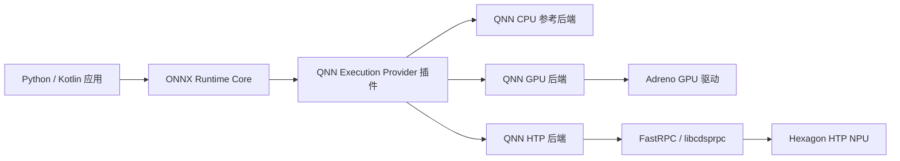
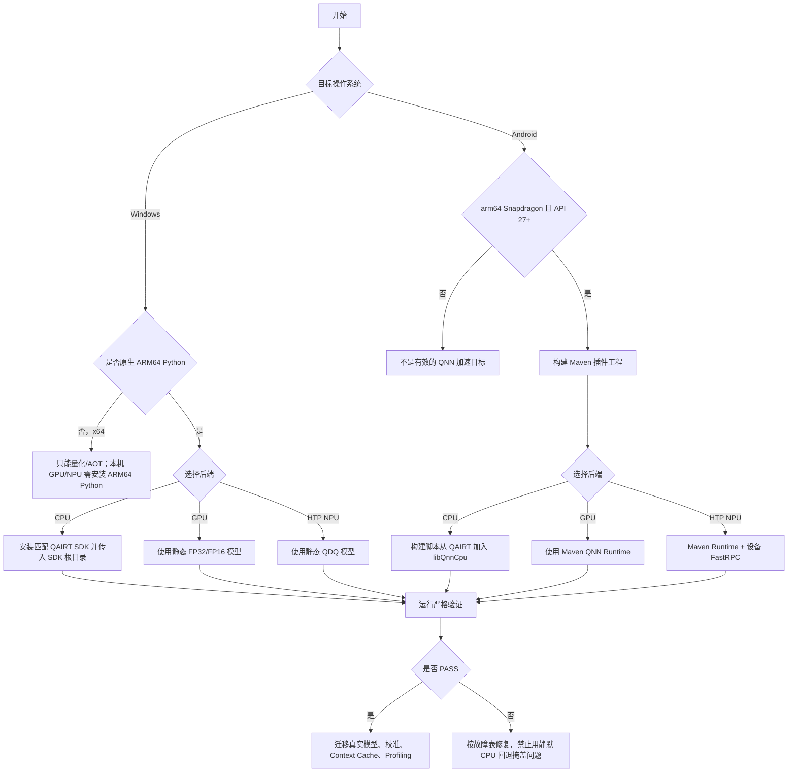
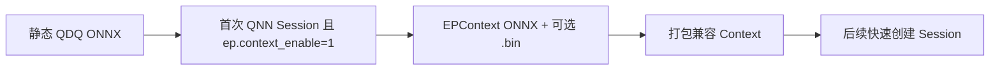

# ONNX Runtime 的 Qualcomm QNN CPU / GPU / HTP-NPU 完整指南

[English](README.md) | [仓库总入口](../README.md) | [Android 演示项目](AndroidDemo/README.md)

> **最后核对：2026-07-16。** 默认基线为 ONNX Runtime Core **1.26.0**、Qualcomm 插件式 QNN EP **2.4.0**（发布于 2026-07-14）和 QAIRT/QNN SDK **2.48.40**。Android 工程使用同一 2.48 系列的公开 `qnn-runtime` **2.48.0** AAR。QNN EP 2.4.0 支持 ORT >= 1.24.1，但本教程固定为其构建与测试所用的版本。
>
> 本仓库已在 Ubuntu 24.04、JDK 21、Gradle 8.9、Android API 35 上验证 Python 模型生成、包元数据、插件 API，并真实构建出 83.4 MiB 的 Android Debug APK。CPU/GPU/NPU 硬件执行必须由读者在自己的 Snapdragon Windows/Android 设备上验证；本仓库不会把“没有相关硬件的主机测试”冒充为真实硬件结果。

## 快速开始

| 从这里开始 | 用途 |
|---|---|
| [一键 Python 演示](one_click.py) | 创建隔离的固定环境，并严格证明本地 QNN Graph 执行 |
| [Android 完整项目](AndroidDemo/README.md) | 包含 CPU/GPU/HTP 按钮和一键构建/安装脚本的 Kotlin 应用 |
| [固定 Python 依赖](requirements.txt) | ORT Core 1.26.0 + QNN Plugin 2.4.0 |

在原生 Windows ARM64 Snapdragon 电脑上：

```powershell
cd Qualcomm
python one_click.py htp
python one_click.py gpu
```

在连接了 Snapdragon Android 真机的开发电脑上：

```bash
python Qualcomm/AndroidDemo/build_demo.py --install --backend htp
```

QNN CPU 是参考后端，QNN 2.4 发布包故意不附带该库。需要验证 CPU Backend 时，请安装匹配的 QAIRT，并传入 `--qnn-sdk PATH`。

## 1. 本指南最终让你完成什么

即使完全不了解 QNN，也可以按顺序完成：

1. 分清 **QNN CPU**、**QNN GPU** 与 **QNN HTP/NPU**。
2. 在本地 Snapdragon Windows 电脑上运行严格的“一键”Python 验证。
3. 在本地 Snapdragon 手机/平板上构建、安装和运行完整 Android 应用。
4. 本地生成静态 FP32 与 QNN 兼容 QDQ 模型。
5. 检测 CPU 回退，不把“列表中出现 Provider 名称”错当成硬件加速。
6. 把自己的模型改造成生产可用模型，再加入 Context Cache 与 Profiling。

演示只使用确定性的合成小网络，不下载第三方模型，也不会上传用户数据。

## 2. 一张图理解 QNN 架构



ONNX Runtime 对 ONNX 图进行优化、分区或编译。QNN EP 把接受的子图转换成 QNN Graph，再由某个 QNN Backend 执行。**QNN 是一个 EP、多个后端；并不存在三个不同名称的 ONNX Runtime QNN EP。**

## 3. CPU、GPU、NPU 不能混为一谈

| 教程中的名称 | QNN 选项 | 执行硬件 | 首选模型 | 用途 | 关键限制 |
|---|---|---|---|---|---|
| QNN CPU | `backend_type=cpu` | Arm/x64 CPU | 静态 FP32 | QNN 集成与参考验证 | 它是参考后端，不是常规优化的 ORT CPU EP；2.4 发布包故意不附带 `QnnCpu` |
| QNN GPU | `backend_type=gpu` | Qualcomm Adreno GPU | 静态 FP16/FP32，也支持部分仅权重量化 | 浮点加速、部分 LLM 工作负载 | 需要受支持的 Adreno 设备与驱动；算子覆盖与 HTP 不同 |
| QNN NPU | `backend_type=htp` | Hexagon HTP | 静态 QDQ，通常 uint8/uint8 或 uint16/uint8 | 对受支持神经网络获得高能效 | 量化与静态形状是最稳妥的生产路线 |
| ORT CPU EP | `CPUExecutionProvider` | 通用 CPU | ORT 支持的数据类型 | 参考结果与回退 | **它不是 QNN CPU** |

生产环境如果要在 CPU 上运行，还应同时测试 ORT CPU EP/XNNPACK。QNN CPU 的主要用途是：没有加速器时也能验证 QNN Graph 转换流程。

## 4. 先选择正确的平台路线

| 主机/设备 | QNN CPU | QNN GPU | QNN HTP/NPU | 正确用途 |
|---|---:|---:|---:|---|
| Snapdragon Windows 11 ARM64 | 需要 SDK 中的 CPU 库 | 本机推理 | 本机推理 | 用原生 ARM64 Python 跑一键演示 |
| Windows x64（包括 WoA 上模拟的 x64 Python） | 可用 SDK 参考后端 | 发布矩阵中不提供本机 Adreno 路线 | 不能本机执行 NPU，只能做 AOT/模型准备 | 在 x64 上量化/准备/离线编译，然后部署到 ARM64 |
| Snapdragon Android ARM64，API 27+ | 可选 SDK CPU 库 | 本机推理 | 本机推理 | 构建并安装本仓库 Android 项目 |
| Android 模拟器或非 Snapdragon 设备 | 不是有效的 QNN 硬件验证目标 | 不可用 | 不可用 | 只能用于与 QNN 无关的 ORT CPU/NNAPI 测试 |
| Qualcomm Linux ARM64 | 插件版本支持 | 取决于平台 | 本机推理 | 上游支持，但不属于本 Windows/Android 教程主体 |

### 必须牢记

电脑里有 Snapdragon 芯片还不够，**进程架构**也必须正确。Windows 本机 QNN GPU/NPU 推理需要 Windows ARM64 包和原生 ARM64 Python/应用程序；x64 Python 仍然是 x64 进程。

## 5. 固定版本与包

| 层级 | 固定版本 | 来源 | 固定原因 |
|---|---:|---|---|
| ONNX Runtime Core | 1.26.0 | PyPI/Maven Central | QNN EP 2.4.0 使用该版本构建和测试 |
| QNN 插件 EP | 2.4.0 | `onnxruntime-qnn` / `com.qualcomm.qti:onnxruntime-android-qnn` | 当前 ABI 兼容插件版本 |
| QAIRT SDK | 2.48.40 | Qualcomm Package Manager | QNN EP 2.4.0 官方构建/测试 SDK |
| Android QNN Runtime | 2.48.0 | `com.qualcomm.qti:qnn-runtime` | Maven Central 公开的 2.48 Runtime |
| Python | 64 位 CPython 3.11–3.14 | python.org | 2.4.0 官方 Wheel 标签范围 |
| Android ABI | `arm64-v8a` | Android 真机 | QNN 插件发布矩阵中的 Android 架构 |
| Android 最低版本 | API 27 | App 配置 | HTP 上游最低要求 |
| 构建工具 | AGP 8.7.3 / Gradle 8.9 / JDK 17–22 | Android/Gradle | 可复现的演示构建组合 |

不要只升级一个 DLL/AAR。Backend API、Stub、Skel、固件、插件与 Context Binary 都存在兼容关系。

## 6. QNN EP 2.x 插件与旧版教程的区别

互联网上存在两代打包方式：

| 特征 | 旧 Provider Bridge | 本教程的 QNN EP 2.x 插件 |
|---|---|---|
| 源代码 | Microsoft ONNX Runtime 主仓库 | Qualcomm 维护的 `onnxruntime/onnxruntime-qnn` 仓库 |
| Python 安装 | `onnxruntime-qnn==1.x` | `onnxruntime` + `onnxruntime-qnn==2.x` |
| 注册方式 | Provider 已经编入该 ORT | 应用显式注册插件动态库 |
| Android | Microsoft 一体式 QNN AAR 或自编译 ORT | ORT Core AAR + Qualcomm Plugin AAR + QNN Runtime AAR |
| 维护方向 | 上游声明 2.0 以下版本将弃用 | 当前推荐路线 |

同一进程中不要安装/组合两代方案。尤其不要同时使用：

- `com.microsoft.onnxruntime:onnxruntime-android-qnn`（旧一体式方案）；
- `com.microsoft.onnxruntime:onnxruntime-android` + `com.qualcomm.qti:onnxruntime-android-qnn`（新插件方案）。

本教程始终使用第二条路线。

## 7. 完整决策流程



---

# A 部分——Windows 从零配置 QNN

## 8. Windows 前置条件

### 8.1 硬件与系统

- 本机 Adreno GPU/HTP NPU 推理需要 Snapdragon Windows 11 ARM64 电脑。
- 完成 Windows Update、OEM 固件和可选驱动更新。
- 为 Python、Wheel 和缓存预留至少 2 GB 空间。
- 首次安装需要联网。

例如 Snapdragon X 系列 Windows 电脑。更早的 Snapdragon Windows 设备是否可用，取决于 OEM 驱动和 QNN 兼容性。

### 8.2 检查电脑与 Python 架构

PowerShell 执行：

```powershell
systeminfo | Select-String "System Type"
python -c "import platform,struct; print(platform.machine(), struct.calcsize('P')*8)"
```

本机 GPU/NPU 推理应看到：

```text
ARM64 64
```

如果 Python 输出 `AMD64`，说明它是模拟的 x64 进程。它可以准备模型，但不能作为本机 QNN GPU/HTP 推理进程。

### 8.3 安装原生 ARM64 Python

1. 从 [python.org Windows 下载页](https://www.python.org/downloads/windows/)下载 **Windows ARM64** 版 CPython 3.12 或 3.13。
2. 安装时勾选 **Add python.exe to PATH**。
3. 关闭并重新打开 PowerShell。
4. 再次运行架构检查。

不要误装 x64 安装包。

### 8.4 先更新 Qualcomm/OEM 驱动

1. 打开 **设置 → Windows 更新**。
2. 安装普通更新与可选 OEM 驱动。
3. 重启。
4. 在设备管理器中检查 Qualcomm NPU/加速器和 Adreno 显示设备。

Python Wheel 提供用户态 QNN 库，但不会替换 OEM 内核与固件。

## 9. Windows 一键严格验证

在仓库根目录执行：

```powershell
cd Qualcomm
python one_click.py htp
```

首次运行会创建 `Qualcomm/.venv-qnn`、安装固定依赖、生成静态 QDQ 模型、显式注册 QNN 插件，并创建禁止 CPU 回退的目标会话。

依次验证三个后端：

```powershell
python one_click.py htp
python one_click.py gpu
python one_click.py cpu --qnn-sdk "C:\Qualcomm\AIStack\QAIRT\2.48.40"
```

`npu` 是 `htp` 的别名：

```powershell
python one_click.py npu
```

常用参数：

| 参数 | 含义 |
|---|---|
| `--runs 100` | 计时推理次数 |
| `--warmups 10` | 计时前预热次数 |
| `--performance-mode sustained_high_performance` | HTP 功耗/性能策略 |
| `--qnn-sdk PATH` | 寻找可选 QNN CPU 后端 |
| `--backend-path FILE` | 明确指定 QnnCpu/QnnGpu/QnnHtp 动态库 |
| `--refresh` | 强制重装固定环境 |
| `--verbose` | 失败时显示完整 Python 回溯 |

### 9.1 为什么 QNN CPU 需要 SDK

QNN EP 2.4.0 发布包故意不附带 `QnnCpu.dll`/`libQnnCpu.so`。如需验证 QNN CPU：

1. 注册 Qualcomm 账号；
2. 安装 [Qualcomm Package Manager](https://qpm.qualcomm.com/)；
3. 安装 Qualcomm AI Runtime/QAIRT 2.48.40；
4. 把根目录传给 `--qnn-sdk`。

正常插件包已经包含 GPU/HTP 库，不要用任意 SDK 版本覆盖它们。

## 10. 桌面 PASS 到底证明了什么

脚本不会因为 Provider 名称存在就判定成功。

| 验证门槛 | 脚本行为 |
|---|---|
| 包一致性 | 在隔离环境固定 ORT、ONNX、QNN Plugin 与 SymPy |
| 正确插件 API | 调用 `register_execution_provider_library()` 并枚举 `OrtEpDevice` |
| 正确设备类别 | 选择与 CPU/GPU/NPU 后端对应的硬件类型 |
| 正确模型 | CPU/GPU 用 FP32，HTP 用 QDQ；全部维度固定 |
| 禁止静默回退 | 设置 `session.disable_cpu_ep_fallback=1` |
| 图执行证据 | 可用时读取 Graph Assignment，同时解析 ORT Profile |
| 数值正确 | 与独立 ORT CPU 会话输出比较 |
| 安全卸载 | 所有 Session 销毁后才注销插件 |

预期最后一行类似：

```text
PASS: QNN HTP executed ... with ORT CPU fallback disabled.
```

小模型只用于证明配置和执行路径，不是有效的性能基准。

## 11. 手工 Python 代码的核心结构

QNN 2.x 的插件生命周期如下：

```python
import onnxruntime as ort
import onnxruntime_qnn as qnn

ort.register_execution_provider_library(
    "QNNExecutionProvider", qnn.get_library_path()
)
qnn_devices = [
    device for device in ort.get_ep_devices()
    if device.ep_name == "QNNExecutionProvider"
]

options = ort.SessionOptions()
options.add_session_config_entry("session.disable_cpu_ep_fallback", "1")
options.add_provider_for_devices(
    qnn_devices,
    {"backend_path": qnn.get_qnn_htp_path()},
)
session = ort.InferenceSession("model.qdq.onnx", sess_options=options)

# 必须先销毁所有依赖插件的会话，再注销插件。
del session
ort.unregister_execution_provider_library("QNNExecutionProvider")
```

本仓库一键脚本还会选择精确硬件类型，并验证 Assignment/Profile。

---

# B 部分——Android 从零配置 QNN

## 12. 旧教程中的做法不要继续使用

旧页面把许多 `/system/lib64` 和 `/vendor/lib64` 文件同时复制到 Assets 与 JNI 目录。现代应用不要这样做。

| 旧做法 | 为什么不正确 | 本项目替代方案 |
|---|---|---|
| 拉取 `libc++.so`、`libbase.so`、`libutils.so`、linker 等 Android 框架库 | 与设备/系统 ABI 强绑定，存在 Linker Namespace、安全、升级和许可问题 | 使用设备系统库，绝不打包这些库 |
| 同一个 `.so` 同时放 Assets 和 `jniLibs` | APK 重复膨胀，加载路径混乱 | Maven AAR 只按 ABI 打包一次 |
| 把 `libcdsprpc.so` 从手机拉进 APK | 它是与设备绑定的 OEM/Vendor 接口 | Manifest 用 `<uses-native-library>` 声明设备库 |
| 手工猜一个 v69/v73/v75 Skel | 容易与 SoC/固件不匹配 | QNN Runtime AAR 打包 v68/v69/v73/v75/v79/v81 支持文件 |
| SDK 2.36 与任意 ORT 混装 | Backend API 可能不兼容 | 固定一套经过测试的版本 |
| 会话创建成功就认为 NPU 成功 | 不支持节点可能已落到 ORT CPU | 目标会话禁用 CPU 回退 |

## 13. Android 前置条件

### 开发电脑

- Windows、Linux 或 macOS，安装 Android Studio。
- Android SDK Platform 35 与 Platform-Tools。
- JDK/JBR 17–22（Android Studio 自带）。
- Python 3.11+，用于生成演示 ONNX Assets。
- Gradle/Maven 缓存约 3 GB 空间。

### 目标设备

- 真实的 `arm64-v8a` Qualcomm Snapdragon Android 设备。
- HTP 需要 Android API 27 或更高。
- 安装最新 OEM 固件。
- 开启开发者选项和 USB 调试。

Android 模拟器不能证明 Adreno/HTP 执行。

## 14. 检查已连接 Android 真机

USB 连接并接受授权后执行：

```bash
adb devices
adb shell getprop ro.product.cpu.abi
adb shell getprop ro.build.version.sdk
adb shell getprop ro.soc.model
adb shell ls -l /vendor/lib64/libcdsprpc.so
```

基本要求：

- 设备状态为 `device`，不能是 `unauthorized`；
- ABI 为 `arm64-v8a`；
- API >= 27；
- 显示 Qualcomm/Snapdragon SoC；
- HTP 固件提供 FastRPC。

不要执行 `adb pull libcdsprpc.so`；只需要它存在于设备上。

## 15. Android 依赖组成

本项目使用当前插件式组合：

| Gradle 依赖/运行项 | 作用 | 所在位置 |
|---|---|---|
| `com.microsoft.onnxruntime:onnxruntime-android:1.26.0` | ORT Java API、JNI、Core Runtime | APK Class/Native Lib |
| `com.qualcomm.qti:onnxruntime-android-qnn:2.4.0` | ABI 兼容 QNN EP 插件及 Kotlin Helper | APK Class/Native Lib |
| `com.qualcomm.qti:qnn-runtime:2.48.0` | QNN GPU/HTP/System/Prepare/Stub/Skel | APK Native Lib |
| 设备 `libcdsprpc.so` | 进入 HTP 的 FastRPC 通道 | OEM `/vendor`，由 Manifest 开放 |
| SDK `libQnnCpu.so`（可选） | QNN CPU 参考后端 | 构建脚本复制到 `jniLibs/arm64-v8a` |

QNN Runtime AAR 同时支持多代 HTP，因此 Debug APK 大约 80–90 MiB 属于正常现象。

## 16. 一键构建、安装 Android 演示

在仓库根目录：

```bash
python Qualcomm/AndroidDemo/build_demo.py
```

脚本会：

1. 创建 `AndroidDemo/.venv-models`；
2. 只安装固定的模型生成依赖；
3. 生成静态 FP32 与 QDQ Assets；
4. 自动寻找 Android SDK 与 JDK；
5. 把 Gradle 8.9 下载到用户缓存并严格校验官方 SHA-256；
6. 解析三个 Maven Artifact；
7. 构建 `arm64-v8a` Debug APK。

构建、安装并自动运行 HTP：

```bash
python Qualcomm/AndroidDemo/build_demo.py --install --backend htp
```

其它后端：

```bash
python Qualcomm/AndroidDemo/build_demo.py --install --backend gpu
python Qualcomm/AndroidDemo/build_demo.py --qnn-sdk /path/to/QAIRT/2.48.40 \
  --install --backend cpu
```

Windows PowerShell 使用同一脚本，只需替换路径格式。

主要参数：

| 参数 | 用途 |
|---|---|
| `--install` | 执行 `adb install -r` 并启动应用 |
| `--backend cpu|gpu|htp` | 启动后自动测试指定后端 |
| `--device SERIAL` | 多设备时指定 ADB Serial |
| `--qnn-sdk PATH` | 打包可选 Android `libQnnCpu.so` |
| `--android-sdk PATH` | 手工指定 Android SDK |
| `--java-home PATH` | 手工指定 JDK/JBR 17–22 |
| `--gradle PATH` | 使用现有 Gradle 8.9 |
| `--offline` | 禁止下载，要求缓存完整 |
| `--clean` | 构建前执行 Clean |

生成 APK：

```text
Qualcomm/AndroidDemo/app/build/outputs/apk/debug/app-debug.apk
```

## 17. 使用 Android Studio

1. 先运行一次 `python build_demo.py`，生成 ONNX Assets。
2. 在 Android Studio 打开 `Qualcomm/AndroidDemo`。
3. 等待 Gradle Sync。
4. 选择真实 Snapdragon 设备。
5. 点击 **Run**。
6. 点击 **Run QNN GPU** 或 **Run QNN NPU / HTP**。
7. 如需 CPU 按钮，先用 `--qnn-sdk` 重建一次。

## 18. Android 项目做对了哪些关键事情

| 要求 | 实现 |
|---|---|
| Android 12 Vendor 库可见性 | Manifest 声明 `libcdsprpc.so`，且 `required=false` |
| HTP 查找库 | ORT 初始化前，把 `ADSP_LIBRARY_PATH` 设置为 `ApplicationInfo.nativeLibraryDir` |
| Native 库按路径存在 | Gradle 使用 Legacy JNI Packaging，使 QNN 可按目录发现库 |
| 插件生命周期 | 注册 `libonnxruntime_providers_qnn.so`，再筛选 `environment.epDevices` |
| 后端选择 | 传入 `backend_type=cpu`、`gpu` 或 `htp` |
| HTP 模型 | 使用自动生成的静态 QDQ Graph |
| GPU/CPU 模型 | 使用自动生成的静态 FP32 Graph |
| 回退保护 | 目标 Session 设置 `session.disable_cpu_ep_fallback=1` |
| 数值验证 | 独立运行 ORT CPU 参考并检查最大绝对误差 |
| 资源释放 | Tensor/Result/Options/Session 使用 Kotlin `use`；工作线程退出后才卸载插件 |

## 19. Android PASS 的含义

应用显示类似：

```text
PASS · QNN HTP / NPU backend
session.disable_cpu_ep_fallback=1
...
max |QNN−CPU|=...
```

由于测试图完整受支持且禁止回退，只要存在一个必须交给 ORT CPU 的节点，Session 创建或执行就会失败。因此该证据强于“API 列表中存在 QNNExecutionProvider”。

查看 Native 日志：

```bash
adb logcat | grep -iE "onnxruntime|qnn|fastrpc|cdsp"
```

Windows PowerShell：

```powershell
adb logcat | Select-String -Pattern "onnxruntime|qnn|fastrpc|cdsp"
```

## 20. HTP 架构提示

应用不会硬编码 `htp_arch`，而是交给 Runtime 检测设备。这比根据营销名称手工选择 Skel 更安全。

| 常见移动平台代际 | 常见 HTP 架构 | Runtime 文件族 |
|---|---:|---|
| Snapdragon 8 Gen 1 | v69 | `libQnnHtpV69*` |
| Snapdragon 8 Gen 2 | v73 | `libQnnHtpV73*` |
| Snapdragon 8 Gen 3 | v75 | `libQnnHtpV75*` |
| 更新平台 | 可能为 v79/v81 | 必须查当前 QAIRT 支持设备表 |

本表只用于快速理解，不代替 Qualcomm 精确 SoC 表。固件与 SDK 兼容性和架构编号同样重要。

---

# C 部分——迁移自己的模型

## 21. 模型准备检查表

| 检查项 | CPU | GPU | HTP/NPU |
|---|---:|---:|---:|
| 所有输入维度固定 | 必须 | 必须 | 必须 |
| 仅使用支持的 ONNX 算子 | 必须 | 必须 | 必须 |
| FP32 模型 | 支持 | 支持 | 通常应量化；浮点支持取决于硬件/算子 |
| FP16 模型 | 取决于后端 | 推荐在精度允许时使用 | 部分平台/算子支持，但不是最通用方案 |
| 标准 QDQ 模型 | 可选 | 部分量化模式 | 推荐的生产路线 |
| 代表性校准数据 | 不适用 | 量化时需要 | 极其重要 |
| `If`、`Loop` 等控制流 | QNN 通常不支持 | 通常不支持 | 通常不支持 |

必须同时查看当前 [QNN 支持算子表](https://github.com/onnxruntime/onnxruntime-qnn/blob/v2.4.0/docs/execution_providers/QNN-ExecutionProvider.md#supported-onnx-operators) 与 QAIRT 算子文档；同一算子的类型支持也会因 Backend 不同而不同。

## 22. 把动态维度固定

QNN EP 不支持动态 Tensor Shape。优先使用 ORT Helper：

```bash
python -m onnxruntime.tools.make_dynamic_shape_fixed \
  --dim_param batch_size --dim_value 1 \
  input.onnx fixed.onnx
```

对每一个符号维度重复处理，或重新导出静态模型。随后用 Netron/ONNX Shape Inference 再检查一次。

## 23. 为 HTP 量化

仓库中的 `smoke_model.py` 展示了标准顺序：

1. `qnn_preprocess_model()`；
2. 实现 `CalibrationDataReader`；
3. 调用 `get_qnn_qdq_config()`；
4. 使用 QNN 配置执行 `quantize()`。

真实模型应遵守：

- 校准样本必须具有代表性，并使用与生产一致的预处理；
- 随机数据只能做管线冒烟测试，不能用于生产校准；
- 可先尝试 uint8 Activation/uint8 Weight；
- 敏感区域可尝试 uint16 Activation；
- 验证任务指标，不要只看 Tensor 误差；
- ONNX 工具在 x64 更方便时，可在 Windows/Linux x64 量化；
- 把最终静态 QDQ 模型部署到 Windows ARM64/Android ARM64。

权威参考：[Microsoft QNN 量化章节](https://onnxruntime.ai/docs/execution-providers/QNN-ExecutionProvider.html#running-a-model-with-qnn-eps-htp-backend-python)与[当前 QNN 插件文档](https://github.com/onnxruntime/onnxruntime-qnn/blob/v2.4.0/docs/execution_providers/QNN-ExecutionProvider.md)。

## 24. 先用 Qualcomm AI Hub 验证目标设备

[Qualcomm AI Hub](https://aihub.qualcomm.com/) 可在托管 Qualcomm 硬件上 Profile、Compile、Test：

- 检查目标 SoC 是否支持该 Graph；
- 比较不同量化方案；
- 测量真机延迟与峰值内存；
- 在支持的流程中生成优化 Artifact。

最终仍需在实际应用中验证。预处理、I/O、温度、固件与线程都会影响端到端结果。

## 25. 常用 QNN Provider/Session 选项

| 选项 | 作用域 | 常见值 | 说明 |
|---|---|---|---|
| `backend_type` | Provider | `cpu`、`gpu`、`htp` | Android 可移植代码优先使用它 |
| `backend_path` | Provider | Helper 返回的 DLL/SO 路径 | 与 `backend_type` 互斥；适合 Python/SDK Override |
| `htp_performance_mode` | Provider | `burst`、`sustained_high_performance`、`balanced` | `burst` 适合短验证，不一定适合持续温控 |
| `htp_graph_finalization_optimization_mode` | Provider | `0`–`3` | 数字越高，准备时间更长、优化机会更多 |
| `offload_graph_io_quantization` | Provider | `0` 或 `1` | 严格演示用 `0`，确保 Q/DQ 留在 QNN Graph 中 |
| `enable_htp_fp16_precision` | Provider | `0` 或 `1` | 在支持的路径上允许 FP32 模型以 FP16 计算 |
| `profiling_level` | Provider | `basic`、`detailed`、`optrace` | HTP Profiling；`optrace` 要求较新 QAIRT |
| `profiling_file_path` | Provider | 可写 CSV 路径 | Android 必须写 App 私有目录 |
| `session.disable_cpu_ep_fallback` | Session | `1` | 资格验证门槛；不允许静默回退 |
| `ep.context_enable` | Session | `1` | 生成 EPContext/Context Cache 模型 |
| `ep.context_file_path` | Session | 可写 `.onnx` 路径 | 不要指向只读 Android Assets |
| `ep.context_embed_mode` | Session | `0` 或 `1` | 内嵌 Context 或使用外部 Binary |

## 26. Context Binary 工作流

QNN Graph 转换和 Finalization 会让第一次建 Session 很慢。Context Binary 用来保存编译后的 QNN Context。



规则：

1. 使用目标 Backend 和正确 Target Compatibility 选项生成；
2. 输出路径必须可写；
3. 记录 QNN EP、QAIRT、SoC/HTP 架构和模型 Hash；
4. 模型、量化、Backend、重要 Runtime 或兼容目标改变后重新生成；
5. 在每个支持的设备系列上测试；
6. 非内嵌模式下，外部 `.bin` 必须与 Wrapper ONNX 保持相对位置。

Context Binary 不是可以任意跨设备部署的通用 ONNX 模型。

## 27. 正确的性能测试方法

- 稳态推理计时不要包含 Session 创建/编译。
- 先预热。
- 至少记录 Median、Tail Latency、功耗、内存和任务精度。
- 固定输入形状与预处理。
- 比较 FP32 GPU、QDQ HTP 和优化 CPU 基线。
- 做持续负载测试；`burst` 可能触发降频。
- 测完整应用延迟，而不只测 `session.run()`。
- 固件/驱动/QNN 更新后重新验证。

---

# D 部分——故障排查

## 28. 常见错误表

| 症状 | 常见原因 | 正确处理 |
|---|---|---|
| `Windows x64 ... AOT only` | 使用 x64 Python/进程 | 安装原生 ARM64 Python，重建隔离环境 |
| 插件加载但 `exposed no devices` | 设备不支持、OEM 驱动旧、进程架构错或插件加载异常 | 更新固件/驱动；确认 Snapdragon 与 ARM64；检查插件路径 |
| 找不到 `QnnCpu` / CPU 按钮不可用 | 发布包故意不附带 CPU 参考后端 | 安装匹配 QAIRT，并使用 `--qnn-sdk` |
| Windows Error 193/不是有效 Win32 应用 | ARM64 与 x64 DLL 混用 | 全部组件使用同一架构 |
| `No module named onnxruntime_qnn` | 环境错误或安装失败 | 直接运行一键脚本，不要手动用 `--worker`；尝试 `--refresh` |
| 多个 ORT 包覆盖同一 Import | 混入 QNN 1.x 或多个 ORT Wheel | 删除虚拟环境，让脚本重装固定 2.x 插件组合 |
| `Only one of backend_type and backend_path` | 同时传入两个选项 | 两者只设置一个 |
| HTP 拒绝 FP32 Graph | 不是 QDQ，或该浮点路径不支持 | 用 QNN QDQ 配置量化 |
| Dynamic Tensor 错误 | 输入/输出仍有符号维度 | 固定全部维度并重新 Shape Inference |
| Unsupported Node/严格 Session 创建失败 | QNN 后端不能完整接管 Graph | 改写/量化算子、换 Backend；只有明确评估后才允许回退 |
| Android `UnsatisfiedLinkError` | AAR 代际混装、缺 Runtime AAR 或 ABI 不兼容 | 只使用项目固定的三个依赖 |
| Android 无法访问 `libcdsprpc.so` | Android 12+ 未声明、非 Snapdragon 或 OEM 限制 | 保留本项目 Manifest；更新 OEM 固件；不要复制系统库 |
| HTP Skel/Stub/FastRPC 错误 | Runtime 与 SoC 固件不兼容 | 使用兼容 QNN Runtime 或更新固件；不要随机挑 Skel |
| `ADSP_LIBRARY_PATH` 错误 | 设置太晚或路径不对 | 在 ORT/插件初始化前设为 `applicationInfo.nativeLibraryDir` |
| Android Duplicate Native/Class | 同时用了 Microsoft 一体式 QNN AAR 和 Qualcomm 插件方案 | 仅保留当前插件式组合 |
| APK 约 83 MiB | Runtime 同时打包多个 HTP 代际 | 演示项目正常；确定目标设备和许可后再裁剪 |
| Gradle Checksum Mismatch | 下载中断或缓存损坏 | 重试；脚本会续传且绝不绕过 SHA-256 |
| 更新后 Context 无法加载 | Context/QNN/SoC 不兼容 | 从原始 ONNX 重新生成 Context |
| 运行中出现 Engine/SSR | HTP Subsystem Restart | 按上游建议销毁并重建 ORT Session |
| Provider 存在但速度像 CPU | 把可用列表当成 Assignment 证据，或测试图太小 | 使用严格 Profile/Assignment；预热后测试真实模型 |
| 量化后精度下降 | 校准数据不代表生产，或敏感 Tensor 精度过低 | 使用真实校准数据和 uint8/uint16 Mixed Precision Override |
| 持续运行越来越慢 | 温度/功耗降频 | 做持续测试并调整 Performance Mode |

## 29. 诊断命令

### Windows

```powershell
python -c "import platform; print(platform.machine())"
python -c "import onnxruntime as o, onnxruntime_qnn as q; print(o.__version__, q.__version__); print(q.get_library_path()); print(q.get_qnn_gpu_path()); print(q.get_qnn_htp_path())"
python one_click.py htp --verbose
```

### Android

```bash
adb shell getprop ro.soc.model
adb shell getprop ro.product.cpu.abi
adb shell dumpsys package io.github.ortqnn.demo | grep -i native
adb logcat -c
adb shell am start -n io.github.ortqnn.demo/.MainActivity --es backend htp
adb logcat | grep -iE "onnxruntime|qnn|fastrpc|cdsp"
```

## 30. 安全、许可与发布规则

- 重新分发前阅读并接受 QAIRT/QNN Runtime 许可证。
- 不要从一台手机提取框架/Vendor 库再打包给另一台手机。
- 不要把 Qualcomm SDK Binary 提交到本仓库。
- 对模型和外部 Context Binary 做完整性校验。
- 模型输入/输出属于应用数据；本演示只做本地推理。
- 发布前审阅对应 QNN/ORT 包的 Telemetry/Privacy 说明。
- 生产 APK 使用正式签名与常规 Android 供应链安全措施。

## 31. 当前博客与实战资料补充了什么

官方 API 文档决定正确性，实战资料帮助理解部署选择。本指南对以下当前资料做了交叉核对，而不是直接照抄：

| 实战来源 | 本指南吸收的经验 | 适用范围提醒 |
|---|---|---|
| [Qualcomm：首个 ONNX Runtime Plugin EP](https://www.qualcomm.com/developer/blog/2026/05/qualcomm-launches-the-first-onnx-runtime-plugin-execution-provider)（2026-05-21） | QNN 2.x 是独立版本的 Shared-Library Plugin；应显式注册，并可独立于 ORT Core 更新 | 解释插件架构，不是完整 App 教程 |
| [Qualcomm：QNN EP GPU Backend](https://www.qualcomm.com/developer/blog/2025/05/unlocking-power-of-qualcomm-qnn-execution-provider-gpu-backend-onnx-runtime)（2025-05-19） | 一个 QNN Session 内后端是互斥选择；禁用 CPU 回退才能证明完整 Adreno 执行；GPU 依赖平台图形/OpenCL 驱动 | 写于 GPU Preview 阶段，算子与版本以当前表为准 |
| [Ultralytics QNN 部署指南](https://docs.ultralytics.com/integrations/qnn/) | 代表性校准、预编译 Context ONNX、预热、端到端计时和温度状态都很重要；HTP 映射已扩展到 v79/v81 | YOLO 便捷工具和 Benchmark 不能泛化到所有模型 |
| [Qualcomm AI Hub 编译示例](https://workbench.aihub.qualcomm.com/docs/hub/compile_examples.html) | QNN Context Binary 对设备特定但跨 OS；Precompiled QNN ONNX 可简化 Android/Linux/Windows 部署；必须保留外部 `.bin` 相对路径 | 云端编译具有独立账号、Artifact 与许可流程 |
| [Edge Impulse Android QNN 加速](https://docs.edgeimpulse.com/tutorials/topics/android/qnn-acceleration) | 真机、INT8、`ADSP_LIBRARY_PATH`、Android Vendor Library 声明、Logcat、持续计时和算子覆盖都是实际必需项 | 这是 **TFLite Delegate**，不是 ORT QNN EP；其手工 SDK 复制方案不能替代本项目 Maven/Plugin 组合 |

因此，本仓库演示使用严格禁止回退、真实生产校准警告、预热、App 私有 Native 路径、真机门槛与版本化插件组合。

## 32. 权威来源与扩展阅读

| 主题 | 来源 |
|---|---|
| Microsoft QNN EP 总览及旧 Provider 选项 | [ONNX Runtime QNN Execution Provider](https://onnxruntime.ai/docs/execution-providers/QNN-ExecutionProvider.html) |
| 用户要求纳入的 Microsoft QNN 实现 | [microsoft/onnxruntime QNN 源码](https://github.com/microsoft/onnxruntime/tree/main/onnxruntime/core/providers/qnn) |
| 当前插件式 QNN EP | [onnxruntime/onnxruntime-qnn](https://github.com/onnxruntime/onnxruntime-qnn) |
| Qualcomm 插件架构博客 | [首个 ONNX Runtime Plugin EP](https://www.qualcomm.com/developer/blog/2026/05/qualcomm-launches-the-first-onnx-runtime-plugin-execution-provider) |
| Qualcomm GPU Backend 实战 | [QNN EP GPU Backend](https://www.qualcomm.com/developer/blog/2025/05/unlocking-power-of-qualcomm-qnn-execution-provider-gpu-backend-onnx-runtime) |
| 2.4.0 准确兼容矩阵 | [QNN EP v2.4.0 Release](https://github.com/onnxruntime/onnxruntime-qnn/releases/tag/v2.4.0) |
| 插件注册与生命周期 | [ONNX Runtime Plugin EP Usage](https://onnxruntime.ai/docs/execution-providers/plugin-ep-libraries/usage.html) |
| QNN EP 构建 | [Plugin Build Guide](https://github.com/onnxruntime/onnxruntime-qnn/blob/v2.4.0/docs/execution_providers/build.md) |
| QAIRT 下载 | [Qualcomm Package Manager](https://qpm.qualcomm.com/) |
| QAIRT 公共文档 | [Qualcomm AI Runtime Docs](https://docs.qualcomm.com/bundle/publicresource/topics/80-63442-10/QNN_general_overview.html) |
| 托管真机 Profiling | [Qualcomm AI Hub](https://aihub.qualcomm.com/) |
| AI Hub 编译与 Precompiled QNN ONNX | [Compiling Models](https://workbench.aihub.qualcomm.com/docs/hub/compile_examples.html) |
| 固定 ONNX 动态维度 | [ORT Fixed-shape Helper](https://onnxruntime.ai/docs/tutorials/mobile/helpers/make-dynamic-shape-fixed.html) |
| 量化基础 | [ONNX Runtime Quantization](https://onnxruntime.ai/docs/performance/model-optimizations/quantization.html) |
| Android Vendor 库开放规则 | [Android `<uses-native-library>`](https://developer.android.com/guide/topics/manifest/uses-native-library-element) |
| Android 12 规则背景 | [Vendor-supplied Native Libraries](https://developer.android.com/about/versions/12/behavior-changes-12#uses-native-library) |
| 已发布 Android QNN 插件 | [Qualcomm QNN Plugin AAR](https://central.sonatype.com/artifact/com.qualcomm.qti/onnxruntime-android-qnn/2.4.0) |
| 已发布 Android QNN Runtime | [Qualcomm QNN Runtime AAR](https://central.sonatype.com/artifact/com.qualcomm.qti/qnn-runtime/2.48.0) |
| 官方 C/C++ 示例 | [ORT QNN MobileNet Example](https://github.com/microsoft/onnxruntime-inference-examples/tree/main/c_cxx/QNN_EP/mobilenetv2_classification) |
| 生产视觉实战示例 | [Ultralytics QNN Guide](https://docs.ultralytics.com/integrations/qnn/) |

如果博客文章与版本化 Release Notes、Provider Source 或设备文档冲突，请以版本化官方来源为准。
