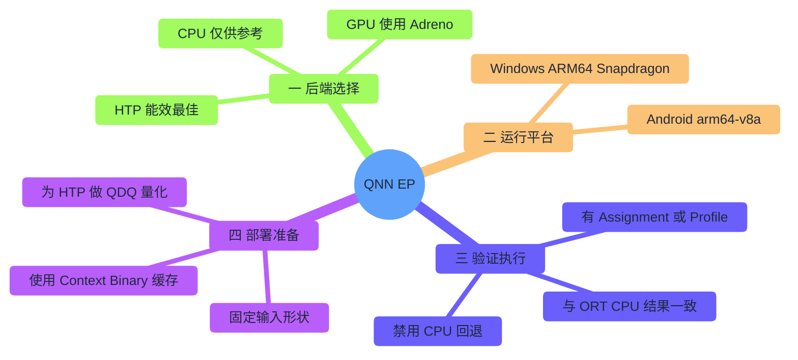
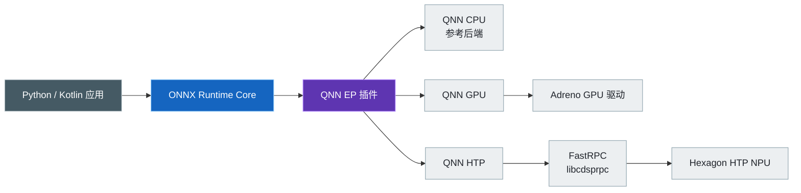
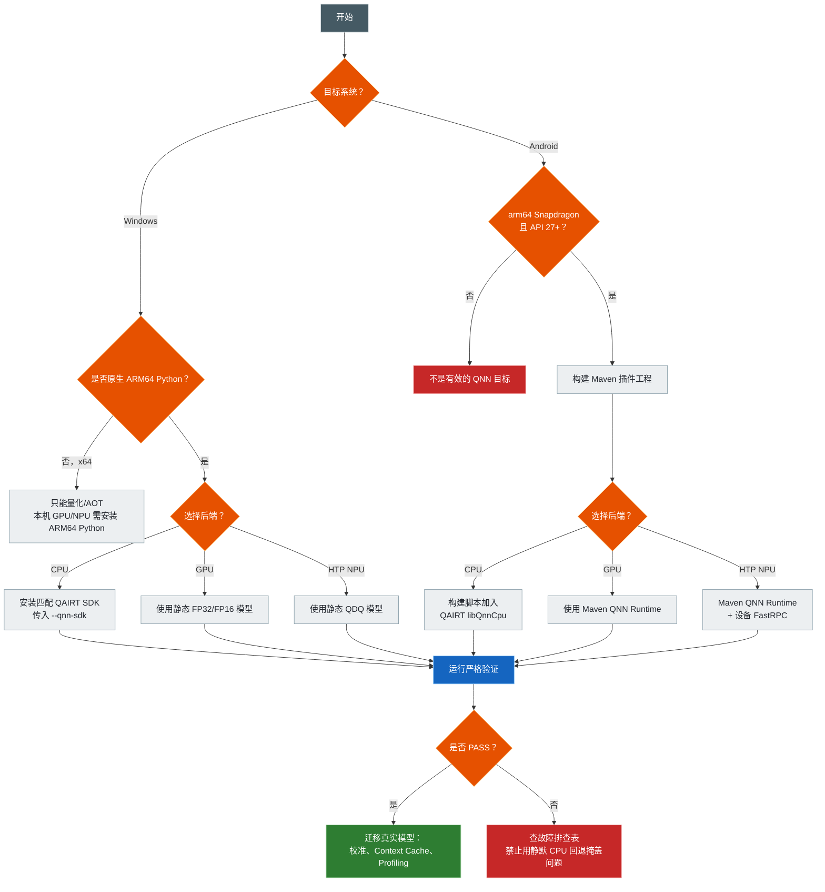
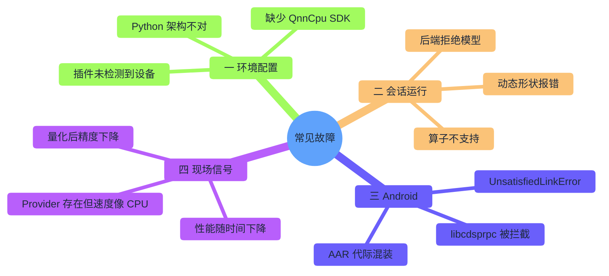

# ONNX Runtime + Qualcomm QNN：CPU、GPU 与 HTP

[English](README.md) · [仓库首页](../README.zh-CN.md) · [Android 演示](AndroidDemo/README.zh-CN.md)

ONNX Runtime 的 **QNN Execution Provider** 能把模型交给 Snapdragon 芯片执行：Hexagon **NPU**、Adreno **GPU**，或 CPU 参考路径。本指南带你从零开始，在真实的 Windows 与 Android 硬件上完成**严格、无回退的验证**——而不只是"Provider 加载成功"这么简单。

| 项目 | 基线 |
|---|---|
| 最近核验 | `2026-07-17` |
| 目标平台 | 原生 Windows ARM64 Snapdragon 电脑与 Android ARM64 Snapdragon 真机 |
| 桌面端版本组合 | ONNX Runtime 1.26.0、QNN 插件 EP 2.4.0、QAIRT/QNN SDK 2.48.40 |
| Android 项目版本组合 | ORT Android 1.26.0、QNN 插件 AAR 2.4.0、QNN Runtime AAR 2.48.0、API 27+、`arm64-v8a` |
| 运行入口 | [`one_click.py`](one_click.py)、[`AndroidDemo/build_demo.py`](AndroidDemo/build_demo.py) |
| 验证范围 | 这组指定版本已通过 Linux x64 HTP Simulator 验证，能够生成经检查的 83.4 MiB APK，并已在 Android SM8550 真机上通过 HTP 测试；Windows 真机和 Android GPU 仍需在目标设备上验证 |

## 目录

> [!TIP]
> **初次阅读？** 先看下面的地图，再按需前往 A 部分（Windows）、B 部分（Android）或 C 部分（使用自己的模型）。

- [指南地图](#指南地图)
- [1. 选择使用方式](#1-选择使用方式)
- [2. 了解软件组成](#2-了解软件组成)
- [3. 选择后端](#3-选择后端)
- [4. 选择平台](#4-选择平台)
- [5. 检查兼容性](#5-检查兼容性)
- [6. 区分两代插件方案](#6-区分两代插件方案)
- [7. 按流程选择方案](#7-按流程选择方案)
- **[A 部分：Windows 从零配置 QNN](#a-部分windows-从零配置-qnn)**
  - [8. Windows 前置条件](#8-windows-前置条件)
  - [9. Windows 一键严格验证](#9-windows-一键严格验证)
  - [10. 桌面端 PASS 表示什么](#10-桌面端-pass-表示什么)
  - [11. Python 代码的基本结构](#11-python-代码的基本结构)
- **[B 部分：Android 从零配置 QNN](#b-部分android-从零配置-qnn)**
  - [12. 不要沿用旧教程的做法](#12-不要沿用旧教程的做法)
  - [13. Android 前置条件](#13-android-前置条件)
  - [14. 检查已连接 Android 真机](#14-检查已连接-android-真机)
  - [15. Android 依赖组成](#15-android-依赖组成)
  - [16. 一键构建、安装 Android 演示](#16-一键构建安装-android-演示)
  - [17. 使用 Android Studio](#17-使用-android-studio)
  - [18. Android 项目的关键实现](#18-android-项目的关键实现)
  - [19. Android PASS 的含义](#19-android-pass-的含义)
  - [20. HTP 架构提示](#20-htp-架构提示)
- **[C 部分：使用自己的模型](#c-部分使用自己的模型)**
  - [21. 模型准备检查表](#21-模型准备检查表)
  - [22. 把动态维度固定](#22-把动态维度固定)
  - [23. HTP 量化流程](#23-htp-量化流程)
  - [24. 先用 Qualcomm AI Hub 验证目标设备](#24-先用-qualcomm-ai-hub-验证目标设备)
  - [25. 常用 QNN Provider/Session 选项](#25-常用-qnn-providersession-选项)
  - [26. Context Binary 工作流](#26-context-binary-工作流)
  - [27. 如何正确测试性能](#27-如何正确测试性能)
- **[D 部分：故障排查](#d-部分故障排查)**
  - [故障排查地图](#故障排查地图)
  - [28. 故障排查](#28-故障排查)
  - [29. 诊断命令](#29-诊断命令)
  - [30. 安全、许可与发布规则](#30-安全许可与发布规则)
  - [31. 博客与实践资料的补充说明](#31-博客与实践资料的补充说明)
  - [32. 参考资料](#32-参考资料)

## 指南地图

QNN 其实是**一个 Execution Provider，对应三种可选 Backend**——不是三个不同的 EP。后面的内容都基于这一点展开。



## 1. 选择使用方式

| 你的情况 | 从这里开始 |
|---|---|
| 刚接触 QNN，想尽快看到验证结果 | [§9 Windows 一键严格验证](#9-windows-一键严格验证) 或 [§16 一键构建 Android](#16-一键构建安装-android-演示) |
| 手边有 Snapdragon Windows 电脑 | A 部分 |
| 手边有 Snapdragon Android 手机/平板 | B 部分 |
| 想接入自己的模型 | C 部分 |
| 遇到问题 | D 部分 |

| 从这里开始 | 用途 |
|---|---|
| [Python 自动化验证](one_click.py) | 创建使用锁定版本的隔离环境，并验证本地 QNN 计算图是否由目标后端执行 |
| [Android 完整项目](AndroidDemo/README.zh-CN.md) | 可自动构建和安装的 Kotlin 应用；HTP 已通过验证，CPU/GPU 可按需检测 |
| [锁定版本的 Python 依赖](requirements.txt) | ORT Core 1.26.0 + QNN Plugin 2.4.0 |

在原生 Windows ARM64 Snapdragon 电脑上：

```powershell
cd Qualcomm
python one_click.py htp
python one_click.py gpu
```

在连接了 Snapdragon Android 真机的开发电脑上：

```bash
python Qualcomm/AndroidDemo/build_demo.py --install --backend htp
```

> [!NOTE]
> QNN CPU 是参考后端，QNN 2.4 发布包有意不附带该库。需要验证时，请安装匹配版本的 QAIRT，并通过 `--qnn-sdk PATH` 指定其路径。

### 如何判断结果

| 结果 | 能证明什么 |
|---|---|
| APK 路径 / Gradle `BUILD SUCCESSFUL` | Android 项目与锁定版本的依赖已成功打包，但加速器尚未运行 |
| Android 应用显示 `READY` | 插件已注册并检测到至少一个 QNN 设备，但模型尚未运行 |
| `PASS: QNN ...` / `PASS · QNN ...` | 所选后端已在禁用 ORT CPU 回退的会话中运行冒烟模型，且输出与 CPU 参考结果一致 |

只有目标真机最终显示 `PASS`，才能确认硬件确实参与了执行；这个小模型只用于验证配置，不能用于性能评估。

读完本指南，你将能区分 QNN CPU、GPU、HTP，在 Windows 和 Android 上完成严格验证，为 HTP 量化自己的模型，并识破静默的 CPU 回退。演示只使用确定性的合成小网络，不下载模型，也不上传数据。

## 2. 了解软件组成



ONNX Runtime 会划分计算图，把支持的部分交给 QNN EP；QNN EP 再将其转换成 QNN Graph，交由一个后端执行。

> [!IMPORTANT]
> QNN 是**一个 Execution Provider，可选择多种后端**——ONNX Runtime 中并不存在三个不同名称的 QNN EP。

## 3. 选择后端

| 教程中的名称 | QNN 选项 | 运行设备 | 首选模型 | 用途 | 主要限制 |
|---|---|---|---|---|---|
| QNN CPU | `backend_type=cpu` | Arm/x64 CPU | 静态 FP32 | QNN 集成与参考验证 | 它是参考后端，不是常规优化的 ORT CPU EP；2.4 发布包故意不附带 `QnnCpu` |
| QNN GPU | `backend_type=gpu` | Qualcomm Adreno GPU | 静态 FP16/FP32，也支持部分仅权重量化模型 | 浮点加速和部分 LLM 工作负载 | 需要受支持的 Adreno 设备与驱动；算子覆盖范围与 HTP 不同 |
| QNN NPU | `backend_type=htp` | Hexagon HTP | 静态 QDQ，通常 uint8/uint8 或 uint16/uint8 | 对受支持神经网络获得高能效 | 量化与静态形状是最稳妥的生产路线 |
| ORT CPU EP | `CPUExecutionProvider` | 通用 CPU | ORT 支持的数据类型 | 参考结果与回退 | **它不是 QNN CPU** |

> [!TIP]
> 生产环境如果要在 CPU 上运行，还应同时测试 ORT CPU EP/XNNPACK。QNN CPU 的主要用途是：没有加速器时也能验证 QNN Graph 转换流程。

## 4. 选择平台

| 主机/设备 | QNN CPU | QNN GPU | QNN HTP/NPU | 正确用途 |
|---|---:|---:|---:|---|
| Snapdragon Windows 11 ARM64 | 需要 SDK 中的 CPU 库 | 本机推理 | 本机推理 | 用原生 ARM64 Python 跑一键演示 |
| Windows x64（包括 WoA 上模拟的 x64 Python） | 可用 SDK 参考后端 | 发布矩阵中不提供本机 Adreno 路线 | 不能本机执行 NPU，只能做 AOT/模型准备 | 在 x64 上量化/准备/离线编译，然后部署到 ARM64 |
| Snapdragon Android ARM64，API 27+ | 可选 SDK CPU 库 | 取决于设备/驱动，不是新手基线 | 本机推理；已在 SM8550 真机验证 | 先跑 HTP；只有设备 QNN GPU 软件栈明确支持时再尝试 GPU |
| Android 模拟器或非 Snapdragon 设备 | 不是有效的 QNN 硬件验证目标 | 不可用 | 不可用 | 只能用于与 QNN 无关的 ORT CPU/NNAPI 测试 |
| Qualcomm Linux ARM64 | 插件版本支持 | 取决于平台 | 本机推理 | 上游支持，但不属于本 Windows/Android 教程主体 |

> [!IMPORTANT]
> 即使电脑搭载 Snapdragon 芯片，**进程架构**也必须匹配。Windows 上的本机 QNN GPU/NPU 推理需要 Windows ARM64 包和原生 ARM64 Python 或应用程序。

## 5. 检查兼容性

| 层级 | 固定版本 | 来源 | 固定原因 |
|---|---:|---|---|
| ONNX 模型工具 | 1.22.0 | PyPI | 提供 Windows ARM64 Wheel；已与 ORT 1.26 QNN 量化器共同验证，并修复 1.21 已报告的畸形模型转换崩溃 |
| ONNX Runtime 桌面 Core | 1.26.0 | PyPI | QNN EP 2.4.0 使用该版本构建和测试 |
| QNN 插件 EP | 2.4.0 | `onnxruntime-qnn` / `com.qualcomm.qti:onnxruntime-android-qnn` | 当前 ABI 兼容插件版本 |
| QAIRT SDK | 2.48.40 | Qualcomm Package Manager | QNN EP 2.4.0 官方构建/测试 SDK |
| Android ORT Core | 1.26.0 | Maven Central | 匹配 Tag 源码构建，并在 SM8550 上通过 HTP 真机执行 |
| Android QNN Runtime | 2.48.0 | Maven Central | 对应源码构建 QAIRT 2.48 版本线的公开包，并在 SM8550 上通过 HTP 真机执行 |
| Python | 64 位 CPython 3.11–3.14 | python.org | PyPI 为这些版本发布 QNN 2.4.0 Wheel |
| Android ABI | `arm64-v8a` | Android 真机 | QNN 插件发布矩阵中的 Android 架构 |
| Android 最低版本 | API 27 | App 配置 | HTP 上游最低要求 |
| 构建工具 | AGP 8.7.3 / Gradle 8.9 / JDK 17–22 | Android/Gradle | 可复现的演示构建组合 |

> [!WARNING]
> 上游**公开发布**的版本表和它自己的**源码构建**并不一致。在同一台 SM8550 上，旧的公开组合虽然能构建 APK，但换成插件 2.4.0 时，HTP 与 GPU 都无法完成 QNN Interface 协商。

| 版本表 | ORT Android | QNN Runtime | SM8550 结果 |
|---|---|---|---|
| 上游公开发布的版本表 | 1.24.3 | 2.45.0 | HTP 与 GPU 均协商失败 |
| 本教程（与源码构建一致） | 1.26.0 | 2.48.0 | HTP 通过严格验证 |

本项目保留已通过测试的 1.26.0/2.48.0 组合；生产环境仍须逐设备系列自行验证，也不要单独升级某一个 DLL 或 AAR——Backend API、Stub/Skel、固件、插件和 Context Binary 之间都有版本兼容要求。

Tag 中的 Provider 页面仍写 Python 3.11.x，但实际 PyPI 发布了 3.11、3.12、3.13 与 3.14 Wheel。全新安装优先选择 CPython 3.12，最不容易踩坑。

## 6. 区分两代插件方案

| 特征 | 旧 Provider Bridge | 本教程的 QNN EP 2.x 插件 |
|---|---|---|
| 源代码 | Microsoft ONNX Runtime 主仓库 | Qualcomm 维护的 `onnxruntime/onnxruntime-qnn` 仓库 |
| Python 安装 | `onnxruntime-qnn==1.x` | `onnxruntime` + `onnxruntime-qnn==2.x` |
| 注册方式 | Provider 已经编入该 ORT | 应用显式注册插件动态库 |
| Android | Microsoft 一体式 QNN AAR 或自编译 ORT | ORT Core AAR + Qualcomm Plugin AAR + QNN Runtime AAR |
| 维护方向 | 上游声明 2.0 以下版本将弃用 | 当前推荐路线 |

> [!WARNING]
> 不要在同一进程中安装或组合这两代方案：不能同时使用 `com.microsoft.onnxruntime:onnxruntime-android-qnn`（旧一体式）和 `com.microsoft.onnxruntime:onnxruntime-android` + `com.qualcomm.qti:onnxruntime-android-qnn`（插件式）。本教程始终使用插件式方案。

## 7. 按流程选择方案



---

## A 部分：Windows 从零配置 QNN

## 8. Windows 前置条件

### 8.1 硬件与系统要求

| 要求 | 说明 |
|---|---|
| 电脑 | Snapdragon Windows 11 ARM64（例如 Snapdragon X 系列电脑） |
| 更新 | 最新 Windows Update + OEM 固件/驱动 |
| 磁盘 | 至少 2 GB 空闲空间用于 Python、依赖包和缓存 |
| 网络 | 首次安装需要联网 |

更早的 Snapdragon Windows 设备是否可用，取决于 OEM 驱动和 QNN 兼容性。

### 8.2 检查电脑与 Python 架构

PowerShell 执行：

```powershell
systeminfo | Select-String "System Type"
python -c "import platform,struct; print(platform.machine(), struct.calcsize('P')*8)"
```

本机 GPU/NPU 推理应看到：

```text
ARM64 64
```

> [!WARNING]
> 如果 Python 输出 `AMD64`，说明它是模拟的 x64 进程。它可以准备模型，但不能作为本机 QNN GPU/HTP 推理进程。

### 8.3 安装原生 ARM64 Python

1. 从 [python.org Windows 下载页](https://www.python.org/downloads/windows/)下载 **Windows ARM64** 版 CPython 3.12 或 3.13。
2. 安装时勾选 **Add python.exe to PATH**。
3. 关闭并重新打开 PowerShell。
4. 再次运行架构检查。

不要误装 x64 安装包。

### 8.4 先更新 Qualcomm/OEM 驱动

1. 打开 **设置 → Windows 更新**。
2. 安装普通更新与可选 OEM 驱动。
3. 重启。
4. 在设备管理器中检查 Qualcomm NPU/加速器和 Adreno 显示设备。

Python Wheel 提供用户态 QNN 库，但不会替换 OEM 内核与固件。

## 9. Windows 一键严格验证

在仓库根目录执行：

```powershell
cd Qualcomm
python one_click.py htp
```

首次运行会创建 `Qualcomm/.venv-qnn`、安装锁定版本的依赖、生成静态 QDQ 模型、显式注册 QNN 插件，并为目标后端创建禁用 CPU 回退的会话。

> [!NOTE]
> ONNX 1.22 已提供原生 Windows ARM64 Wheel，因此这个合成模型可以直接在 ARM64 环境中生成。对于真实模型，如果大型工具链在 x64 更方便，仍应遵循 Qualcomm 文档建议：先在 x64 完成量化，再把静态 QDQ 模型部署到 ARM64。

依次验证三个后端：

```powershell
python one_click.py htp
python one_click.py gpu
python one_click.py cpu --qnn-sdk "C:\Qualcomm\AIStack\QAIRT\2.48.40"
```

`npu` 是 `htp` 的别名：

```powershell
python one_click.py npu
```

| 参数 | 含义 |
|---|---|
| `--runs 100` | 计时推理次数 |
| `--warmups 10` | 计时前预热次数 |
| `--performance-mode sustained_high_performance` | HTP 功耗/性能策略 |
| `--qnn-sdk PATH` | 寻找可选 QNN CPU 后端 |
| `--backend-path FILE` | 明确指定 Backend 动态库 |
| `--refresh` | 强制重装固定环境 |
| `--verbose` | 失败时显示完整 Python 回溯 |

### 9.1 为什么 QNN CPU 需要 SDK

QNN EP 2.4.0 发布包故意不附带 `QnnCpu.dll`/`libQnnCpu.so`。如需验证：

1. 注册 Qualcomm 账号；
2. 安装 [Qualcomm Package Manager](https://qpm.qualcomm.com/)；
3. 安装 Qualcomm AI Runtime/QAIRT 2.48.40；
4. 把根目录传给 `--qnn-sdk`。

正常插件包已经包含 GPU/HTP 库，不要用任意 SDK 版本覆盖它们。

## 10. 桌面端 PASS 表示什么

Provider 出现在列表中并不能证明任何事，脚本会依次检查：

| 验证门槛 | 脚本行为 |
|---|---|
| 依赖一致性 | 在隔离环境中锁定 ORT、ONNX、QNN Plugin 和 SymPy 版本 |
| 插件 API | 调用 `register_execution_provider_library()` 并枚举 `OrtEpDevice` |
| 设备类型 | 选择与 CPU/GPU/NPU 后端对应的硬件类型 |
| 模型匹配 | CPU/GPU 使用 FP32，HTP 使用 QDQ，且所有维度固定 |
| 禁止静默回退 | 设置 `session.disable_cpu_ep_fallback=1` |
| 执行记录 | 可用时读取计算图分配信息，同时解析 ORT 性能分析记录 |
| 数值正确 | 与独立 ORT CPU 会话输出比较 |
| 资源清理 | 销毁所有会话后再注销插件 |

最后应输出：

```text
PASS: QNN HTP executed ... with ORT CPU fallback disabled.
```

小模型只用于验证配置和执行路径，不能作为有效的性能基准。

## 11. Python 代码的基本结构

QNN 2.x 的插件生命周期如下：

```python
import onnxruntime as ort
import onnxruntime_qnn as qnn

ort.register_execution_provider_library(
    "QNNExecutionProvider", qnn.get_library_path()
)
qnn_devices = [
    device for device in ort.get_ep_devices()
    if device.ep_name == "QNNExecutionProvider"
]

options = ort.SessionOptions()
options.add_session_config_entry("session.disable_cpu_ep_fallback", "1")
options.add_provider_for_devices(
    qnn_devices,
    {"backend_path": qnn.get_qnn_htp_path()},
)
session = ort.InferenceSession("model.qdq.onnx", sess_options=options)

# 必须先销毁所有依赖插件的会话，再注销插件。
del session
ort.unregister_execution_provider_library("QNNExecutionProvider")
```

本仓库一键脚本还会选择精确硬件类型，并验证 Assignment/Profile。

> [!TIP]
> [§25](#25-常用-qnn-providersession-选项) 列出了这套 API 接受的每一个 Provider 选项、Session/Run 配置项与 EP 动态选项——直接摘录自上游 QNN EP 实现。

---

## B 部分：Android 从零配置 QNN

## 12. 不要沿用旧教程的做法

旧教程曾建议把许多 `/system/lib64` 和 `/vendor/lib64` 文件同时复制到 Assets 与 JNI 目录。现代 Android 应用不应继续采用这种做法。

| 旧做法 | 为什么不正确 | 本项目替代方案 |
|---|---|---|
| 拉取 `libc++.so`、`libbase.so`、`libutils.so`、linker 等 Android 框架库 | 与设备/系统 ABI 强绑定，存在 Linker Namespace、安全、升级和许可问题 | 使用设备系统库，绝不打包这些库 |
| 同一个 `.so` 同时放 Assets 和 `jniLibs` | APK 重复膨胀，加载路径混乱 | Maven AAR 只按 ABI 打包一次 |
| 从手机提取 `libcdsprpc.so` 并打入 APK | 它是依赖设备的 OEM/Vendor 私有库 | 在 Manifest 中通过 `<uses-native-library>` 声明设备库 |
| 手工猜测并复制某个 HTP Skel | 容易与 SoC、固件和 Runtime 不匹配 | 让固定的 QNN Runtime AAR 提供 Backend/Stub/Skel，并由 QNN 自动识别设备 |
| SDK 2.36 与任意 ORT 混装 | Backend API 可能不兼容 | 固定一套经过测试的版本 |
| 会话创建成功就认为 NPU 成功 | 不支持节点可能已落到 ORT CPU | 目标会话禁用 CPU 回退 |

## 13. Android 前置条件

| 环境 | 要求 |
|---|---|
| 开发电脑 | Windows、Linux 或 macOS，安装 Android Studio |
| 开发电脑 | Android SDK Platform 35 与 Platform-Tools |
| 开发电脑 | JDK/JBR 17–22（Android Studio 自带） |
| 开发电脑 | 64 位 CPython 3.11–3.14，用于生成演示 ONNX Assets |
| 开发电脑 | Gradle/Maven 缓存约需 3 GB 空间 |
| 开发电脑 | 首次运行需要联网；只有全部缓存完成后 `--offline` 才可用 |
| 目标设备 | 真实的 `arm64-v8a` Qualcomm Snapdragon Android 设备 |
| 目标设备 | HTP 需要 Android API 27 或更高 |
| 目标设备 | 安装最新 OEM 固件 |
| 目标设备 | 开启开发者选项和 USB 调试 |

> [!NOTE]
> Android 模拟器不能证明 Adreno/HTP 执行。

## 14. 检查已连接 Android 真机

USB 连接并接受授权后执行：

```bash
adb devices
adb shell getprop ro.product.cpu.abi
adb shell getprop ro.build.version.sdk
adb shell getprop ro.soc.manufacturer
adb shell getprop ro.soc.model
adb shell getprop ro.kernel.qemu
adb shell ls -l /vendor/lib64/libcdsprpc.so  # 仅诊断；OEM 路径可能不同
```

| 检查项 | 期望值 |
|---|---|
| 设备状态 | `device`，不能是 `unauthorized` |
| ABI | `arm64-v8a` |
| API 级别 | `>= 27` |
| `ro.kernel.qemu` | 不是 `1` |
| SoC | 显示 Qualcomm/Snapdragon |
| FastRPC | HTP 固件已提供 |

启动脚本会在安装前检查授权状态、ABI、API 和模拟器状态；部分 OEM 设备属性不会明确显示 Qualcomm，此时只给出警告，最终仍以严格 QNN 会话能否成功运行为准。

> [!WARNING]
> 不要执行 `adb pull libcdsprpc.so`，该库必须由 OEM 在设备上管理。

## 15. Android 依赖组成

| Gradle 依赖/运行项 | 作用 | 所在位置 |
|---|---|---|
| `com.microsoft.onnxruntime:onnxruntime-android:1.26.0` | ORT Java API、JNI、Core Runtime | APK Class/Native Lib |
| `com.qualcomm.qti:onnxruntime-android-qnn:2.4.0` | ABI 兼容 QNN EP 插件及 Kotlin Helper | APK Class/Native Lib |
| `com.qualcomm.qti:qnn-runtime:2.48.0` | QNN GPU/HTP/System/Prepare/Stub/Skel | APK Native Lib |
| 设备 `libcdsprpc.so` | 进入 HTP 的 FastRPC 通道 | OEM `/vendor`，由 Manifest 开放 |
| SDK `libQnnCpu.so`（可选） | QNN CPU 参考后端 | 构建脚本复制到 `jniLibs/arm64-v8a` |

QNN Runtime AAR 同时支持多代 HTP，因此 Debug APK 约 80–90 MiB 属于正常现象。`2026-07-17` 审计生成了 83.4 MiB、仅含 `arm64-v8a` 的 APK：ORT Core/JNI、QNN 插件、QNN GPU/HTP/System/Prepare，以及 HTP v68/v69/v73/v75/v79/v81 Stub/Skel——不含 QNN CPU Backend、`libcdsprpc.so`、Android `libc++` 或 Linker。

> [!IMPORTANT]
> 三个依赖必须显式声明——QNN 插件 AAR 发布的 POM 不会传递引入 ORT Core 或 QNN Runtime。不能漏掉其中之一，也不要加入 Microsoft 旧的一体式 QNN AAR。

## 16. 一键构建、安装 Android 演示

在仓库根目录：

```bash
python Qualcomm/AndroidDemo/build_demo.py
```

脚本会：

1. 创建 `AndroidDemo/.venv-models`；
2. 只安装固定的模型生成依赖；
3. 生成静态 FP32 与 QDQ Assets；
4. 自动寻找 Android SDK 与 JDK；
5. 把 Gradle 8.9 下载到用户缓存并严格校验官方 SHA-256；
6. 解析三个 Maven Artifact；
7. 构建 `arm64-v8a` Debug APK。

首次运行需要下载 Python Wheel、Gradle 和体积较大的原生 AAR，可能耗时较久；后续运行会复用缓存。使用 `--install` 时，脚本会在安装前拒绝模拟器、非 `arm64-v8a` 设备或 API 低于 27 的设备。

构建、安装并自动运行 HTP：

```bash
python Qualcomm/AndroidDemo/build_demo.py --install --backend htp
```

其它后端：

```bash
# 可选探测：并非每台 Android 设备/驱动都支持 QNN GPU。
python Qualcomm/AndroidDemo/build_demo.py --install --backend gpu
python Qualcomm/AndroidDemo/build_demo.py --qnn-sdk /path/to/QAIRT/2.48.40 \
  --install --backend cpu
```

Android 新手应优先验证 HTP。审计设备：Nubia NX711J，Snapdragon 8 Gen 2（`SM8550`、HTP v73），Android API 35。

| 信号 | 结果 |
|---|---|
| HTP 严格运行 | `PASS`，回退已禁用，20 次计时运行，中位延迟 0.18–0.27 ms，与 ORT CPU 相比最大误差 `0.0163526` |
| GPU 探测 | `QNN_COMMON_ERROR_PLATFORM_NOT_SUPPORTED`（旧版 2.45 Runtime 同样协商失败） |

> [!NOTE]
> GPU 探测失败是受支持的结果，不代表要开启 CPU 回退。Qualcomm 公开的 GPU 文章面向 Snapdragon X **Windows**，上游 QNN GPU 单元测试也会跳过 ARM64——APK 中打包了 `libQnnGpu.so` 不代表手机就能执行它。

Windows PowerShell 使用同一脚本，只需替换路径格式。

| 参数 | 用途 |
|---|---|
| `--install` | 执行 `adb install -r` 并启动应用 |
| `--backend cpu|gpu|htp` | 启动后自动测试指定后端 |
| `--device SERIAL` | 多设备时指定 ADB Serial |
| `--qnn-sdk PATH` | 打包可选 Android `libQnnCpu.so` |
| `--android-sdk PATH` | 手工指定 Android SDK |
| `--java-home PATH` | 手工指定 JDK/JBR 17–22 |
| `--gradle PATH` | 使用现有 Gradle 8.9 |
| `--offline` | 禁止下载，要求缓存完整 |
| `--clean` | 构建前执行 Clean |

生成 APK：

```text
Qualcomm/AndroidDemo/app/build/outputs/apk/debug/app-debug.apk
```

## 17. 使用 Android Studio

1. 先运行一次 `python build_demo.py`，生成 ONNX Assets。
2. 在 Android Studio 打开 `Qualcomm/AndroidDemo`。
3. 等待 Gradle Sync。
4. 选择真实 Snapdragon 设备。
5. 点击 **Run**。
6. 先点击 **Run QNN NPU / HTP**；**Try QNN GPU** 只用于探测设备/驱动能力。
7. 如需 CPU 按钮，先用 `--qnn-sdk` 重建一次。

## 18. Android 项目的关键实现

| 要求 | 实现 |
|---|---|
| Android 12 Vendor 库可见性 | Manifest 声明 `libcdsprpc.so`，且 `required=false` |
| HTP 查找库 | ORT 初始化前，把 `ADSP_LIBRARY_PATH` 设置为 `ApplicationInfo.nativeLibraryDir` |
| 原生库保留实际路径 | Gradle 使用 Legacy JNI Packaging，使 QNN 能够按目录查找库 |
| 插件生命周期 | 注册 `libonnxruntime_providers_qnn.so`，再筛选 `environment.epDevices` |
| 后端选择 | 传入 `backend_type=cpu`、`gpu` 或 `htp` |
| HTP 模型 | 使用自动生成的静态 QDQ Graph |
| GPU/CPU 模型 | 使用自动生成的静态 FP32 Graph |
| 回退保护 | 目标 Session 设置 `session.disable_cpu_ep_fallback=1` |
| 数值验证 | 独立运行 ORT CPU 参考并检查最大绝对误差 |
| 资源释放 | Tensor/Result/Options/Session 使用 Kotlin `use`；工作线程退出后才卸载插件 |

> [!NOTE]
> 部分 OEM 系统（包括审计用的 SM8550）会在 `READY` 状态显示 `type=CPU` 的注册设备，这不代表计算图在 CPU 上执行——`backend_type` 才决定实际后端，只有严格 `PASS` 才是执行证据。

## 19. Android PASS 的含义

应用应显示：

```text
PASS · QNN HTP / NPU backend
session.disable_cpu_ep_fallback=1
...
max |QNN−CPU|=...
```

由于 ORT CPU 回退已禁用且整张测试图都受支持，只要有节点必须交给 ORT CPU，会话创建或执行就会失败。结合显式指定的 `backend_type`，这足以证明当前冒烟图确实由目标后端执行，但不能保证其他模型的算子覆盖率或性能。

查看 Native 日志：

```bash
adb logcat | grep -iE "onnxruntime|qnn|fastrpc|cdsp"
```

Windows 没有 `grep` 时使用：

```powershell
adb logcat | Select-String -Pattern "onnxruntime|qnn|fastrpc|cdsp"
```

## 20. HTP 架构提示

应用不会硬编码 `htp_arch`，而是由运行时检测设备——比根据产品名称手工挑选 Skel 更可靠。

| 常见移动平台代际 | 常见 HTP 架构 | Runtime 文件族 |
|---|---:|---|
| Snapdragon 8 Gen 1 | v69 | `libQnnHtpV69*` |
| Snapdragon 8 Gen 2 | v73 | `libQnnHtpV73*` |
| Snapdragon 8 Gen 3 | v75 | `libQnnHtpV75*` |
| Snapdragon 8 Elite（SM8750） | v79 | `libQnnHtpV79*` |
| Snapdragon 8 Elite Gen 5（SM8850） | v81 | `libQnnHtpV81*` |

本表只用于快速理解，不能代替 Qualcomm 精确的 SoC 表——固件与 SDK 兼容性和架构编号同样重要。

---

## C 部分：使用自己的模型

## 21. 模型准备检查表

| 检查项 | CPU | GPU | HTP/NPU |
|---|---:|---:|---:|
| 所有输入维度固定 | 必须 | 必须 | 必须 |
| 仅使用支持的 ONNX 算子 | 必须 | 必须 | 必须 |
| FP32 模型 | 支持 | 支持 | 通常应量化；浮点支持取决于硬件/算子 |
| FP16 模型 | 取决于后端 | 推荐在精度允许时使用 | 部分平台/算子支持，但不是最通用方案 |
| 标准 QDQ 模型 | 可选 | 部分量化模式 | 推荐的生产路线 |
| 代表性校准数据 | 不适用 | 量化时需要 | 极其重要 |
| `If`、`Loop` 等控制流 | QNN 通常不支持 | 通常不支持 | 通常不支持 |

必须同时查看当前 [QNN 支持算子表](https://github.com/onnxruntime/onnxruntime-qnn/blob/v2.4.0/docs/execution_providers/QNN-ExecutionProvider.md#supported-onnx-operators) 与 QAIRT 算子文档；同一算子的类型支持也会因 Backend 不同而不同。

## 22. 把动态维度固定

QNN EP 不支持动态 Tensor Shape。优先使用 ORT Helper：

```bash
python -m onnxruntime.tools.make_dynamic_shape_fixed \
  --dim_param batch_size --dim_value 1 \
  input.onnx fixed.onnx
```

对每一个符号维度重复处理，或重新导出静态模型，随后用 Netron/ONNX Shape Inference 再检查一次。

## 23. HTP 量化流程

仓库中的 `smoke_model.py` 展示了标准流程：

1. `qnn_preprocess_model()`；
2. 实现 `CalibrationDataReader`；
3. 调用 `get_qnn_qdq_config()`；
4. 使用 QNN 配置执行 `quantize()`。

真实模型应遵守：

- 校准样本必须具有代表性，并使用与生产一致的预处理；
- 随机数据只能做管线冒烟测试，不能用于生产校准；
- 可先尝试 uint8 Activation/uint8 Weight；
- 敏感区域可尝试 uint16 Activation；
- 验证任务指标，不要只看 Tensor 误差；
- ONNX 工具在 x64 更方便时，可在 Windows/Linux x64 量化；
- 把最终静态 QDQ 模型部署到 Windows ARM64/Android ARM64。

具体步骤请参阅 [Microsoft QNN 量化章节](https://onnxruntime.ai/docs/execution-providers/QNN-ExecutionProvider.html#running-a-model-with-qnn-eps-htp-backend-python)和[当前 QNN 插件文档](https://github.com/onnxruntime/onnxruntime-qnn/blob/v2.4.0/docs/execution_providers/QNN-ExecutionProvider.md)。

## 24. 先用 Qualcomm AI Hub 验证目标设备

[Qualcomm AI Hub](https://aihub.qualcomm.com/) 可在托管 Qualcomm 硬件上 Profile、Compile、Test：

- 检查目标 SoC 是否支持该 Graph；
- 比较不同量化方案；
- 测量真机延迟与峰值内存；
- 在支持的流程中生成优化 Artifact。

最终仍需在实际应用中验证——预处理、I/O、温度、固件与线程都会影响端到端结果。

## 25. 常用 QNN Provider/Session 选项

QNN 通过**四种不同机制**暴露配置，每种机制都有各自的作用域与调用方式。下表列出了上游 `QNNExecutionProvider` 实现的每一个选项，直接摘录自 Microsoft ONNX Runtime 仓库中的 [`qnn_execution_provider.cc`](https://github.com/microsoft/onnxruntime/blob/main/onnxruntime/core/providers/qnn/qnn_execution_provider.cc) 与 [`qnn_execution_provider.h`](https://github.com/microsoft/onnxruntime/blob/main/onnxruntime/core/providers/qnn/qnn_execution_provider.h)。对于 [§5](#5-检查兼容性) 锁定的具体插件版本，请以版本化的 [QNN EP v2.4.0 文档](https://github.com/onnxruntime/onnxruntime-qnn/blob/v2.4.0/docs/execution_providers/QNN-ExecutionProvider.md) 为准——源码树中的选项可能比某个具体发布包更新。

| 机制 | 设置方式 | 作用域 |
|---|---|---|
| Provider 选项 | 添加 `QNNExecutionProvider` 时传入的字符串映射——可以是 [§11](#11-python-代码的基本结构) 中使用的 `add_provider_for_devices(devices, options)`，也可以是经典写法 `providers=[("QNNExecutionProvider", options)]` | 在该 QNN Backend/Session 的整个生命周期内固定 |
| Session 配置 | `session_options.add_session_config_entry(key, value)` | 在整个 Session 生命周期内固定 |
| Run 配置 | `run_options.add_run_config_entry(key, value)` | 仅对一次 `session.run()` 调用生效，仅限 HTP/DSP 后端 |
| EP 动态选项 | `session.set_ep_dynamic_options({key: value, ...})`（C API：`OrtApi::SessionSetEpDynamicOptions`） | 随时可修改，甚至可以在多次 `run()` 调用之间修改 |

> [!NOTE]
> 无论使用上表中的哪一种注册方式，最终都会落到同一个地方：ORT 会把你的 `provider_options` 字典复制成前缀为 `ep.qnnexecutionprovider.<key>` 的普通 Session 配置项（参见 [`abi_session_options.cc`](https://github.com/microsoft/onnxruntime/blob/main/onnxruntime/core/session/abi_session_options.cc) 中的 `OrtSessionOptions::GetProviderOptionPrefix()`），QNN EP 在构建 Provider 时会用同样的前缀把它们读取回来（参见 [`qnn_provider_factory.cc`](https://github.com/microsoft/onnxruntime/blob/main/onnxruntime/core/providers/qnn/qnn_provider_factory.cc) 中的 `CreateProvider(const OrtSessionOptions&, ...)`）。因此下表中的每一个 Provider 选项，都可以等价地通过在创建 Session 之前调用 `session_options.add_session_config_entry("ep.qnnexecutionprovider.<key>", "<value>")` 来设置——由于配置项优先级更高，它甚至会覆盖字典中的同名值。当你已经在别处构建好了 `provider_options` 字典，只想在创建 `InferenceSession(...)` 前临时调整一个开关时，这种方式很方便。

### 25.1 Provider 选项

| 分类 | 选项 | 取值 | 默认值 | 说明 |
|---|---|---|---|---|
| Backend | `backend_type` | `cpu`、`gpu`、`htp`、`saver`、`ir` | 未设置时 → 回退为 `htp` 并记录警告 | 按名称选择 Backend，并解析为对应的默认库（`QnnCpu`、`QnnGpu`、`QnnHtp`、`QnnSaver`、`QnnIr`）。与 `backend_path` 互斥——两者都设置会抛出异常。本教程 `one_click.py` 额外把 `npu` 作为 `htp` 的命令行友好别名；该别名本身并不是 QNN EP 的取值。 |
| Backend | `backend_path` | Backend 库的文件路径 | 未设置 | 直接加载显式指定的 Backend 库，而不是通过 `backend_type` 解析。适合自行编译或非标准安装路径的场景。 |
| Debug/Serializer | `qnn_saver_path` | QNN Saver 库路径 | 未设置（Saver 关闭） | 包裹每一次 QNN API 调用，以便之后重放/检查。这是 Qualcomm 的调试辅助手段，不用于生产推理。 |
| Debug/Serializer | `dump_qnn_ir_dlc` | `0`、`1` | `0` | 设为 `1` 时，把编译后的 QNN Graph 序列化为 `.dlc` IR 文件，供 Qualcomm 工具离线检查。 |
| Debug/Serializer | `dump_qnn_ir_dlc_dir` | 可写目录 | 空 | `.dlc` 转储的目标目录。除非 `dump_qnn_ir_dlc=1`，否则忽略。 |
| Debug/Serializer | `qnn_ir_backend_path` | 文件路径 | 默认 `QnnIr` 库 | 覆盖执行 `.dlc` 转储所使用的 IR Backend 库。 |
| Profiling | `profiling_level` | `off`、`basic`、`detailed`、`optrace` | `off` | 打开 QNN 内部 Profiler。`optrace` 需要更新版本的 QAIRT，能给出最详细的信息。 |
| Profiling | `profiling_file_path` | 可写文件路径 | 空 | QNN 写入 Profiling 事件日志的位置。Android 上必须使用 App 私有路径。 |
| HTP 性能 | `htp_performance_mode` | `burst`、`balanced`、`default`、`high_performance`、`high_power_saver`、`low_balanced`、`low_power_saver`、`power_saver`、`extreme_power_saver`、`sustained_high_performance` | `default` | 设置整个进程级别的 HTP 功耗/性能策略。`burst` 还会强制拉满 RPC 轮询以获得最低延迟，代价是功耗更高。 |
| HTP 性能 | `rpc_control_latency` | 微秒（整数） | `0`（由驱动决定） | 调节 CPU 与 HTP 之间 FastRPC 唤醒延迟与空闲功耗之间的权衡。 |
| HTP Graph | `htp_graph_finalization_optimization_mode` | `0`–`3` | `0` | 数字越大，Finalize QNN Graph 花费的时间越长，换来可能更快的结果——如果你打算把模型缓存为 Context Binary（[§26](#26-context-binary-工作流)），这个选项很值得调高。 |
| HTP Graph | `vtcm_mb` | 整数 MB | `0`（Backend 默认值） | 为 HTP Graph 请求特定大小的 VTCM（高速暂存内存）。`<= 0` 的值会被忽略。 |
| HTP Graph | `enable_htp_spill_fill_buffer` | `0`、`1` | `0` | 让多个缓存的 QNN Context 通过 Spill-Fill Buffer 共享 HTP 内存。需要 QNN System 库并处于 Context Cache 模式；Windows x86_64 不支持。 |
| HTP Graph | `enable_vtcm_backup_buffer_sharing` | `0`、`1` | `0` | 在共享 EP Context 的多个 Session 之间共享同一个 VTCM Backup Buffer。需要 QNN API 2.26 或更新版本——更旧的 SDK 只会记录警告并忽略该设置。 |
| HTP Graph | `extended_udma` | `0`、`1` | `0` | 开启 HTP 的扩展（64 位）UDMA 传输模式；只有在支持该特性的 HTP 硬件/固件上才有意义。 |
| 精度 | `enable_htp_fp16_precision` | `0`、`1` | **`1`** | 允许 FP32 Graph 在 HTP 上以 FP16 计算（如果该算子支持）。因为它*默认就是开启的*，当你需要在调试精度问题时排除 FP16 舍入影响时，务必显式设为 `0`。 |
| 精度 | `htp_bf16_enable` | `0`、`1` | `0` | 在 HTP 上启用 BF16 执行。要求同时把 `soc_model` 设为 `88` 或更高，否则 QNN EP 会声明零个可处理节点。 |
| 设备定向 | `device_id` | 整数，`0` 或更大 | `0` | 在多设备主机上选择绑定哪个 QNN 可见设备索引。 |
| 设备定向 | `htp_arch` | `0`（自动）、`68`、`69`、`73`、`75`、`79`、`81` | `0` | 强制指定 HTP 架构，而不是让 QNN 自动检测设备的 HTP 版本。除非有明确的兼容性需求（参见 [§20](#20-htp-架构提示)），否则保持 `0`。 |
| 设备定向 | `soc_model` | Qualcomm SoC 型号 ID（整数） | `0`（未知） | 显式声明目标 SoC；部分特性（例如 `htp_bf16_enable`）会依据该值判断是否可用。 |
| 设备定向 | `op_packages` | `OpType:PackagePath:InterfaceSymbolName[:Target]`，多个条目用逗号分隔 | 空 | 注册基于 QNN SDK 手写的自定义 QNN Op Package，供 QNN EP 调用。 |
| 内存与 I/O | `offload_graph_io_quantization` | `0`、`1` | **`1`** | 允许 ORT 把 Graph 边界的 Quantize/Dequantize 节点交给另一个 EP（例如 CPU）执行，而不是留在 QNN Graph 内部。若要做严格的全 QNN 验证，设为 `0`——本仓库的演示始终使用 `0`。一旦你设置了 `session.disable_cpu_ep_fallback=1`，QNN EP 也会自动把它强制改回 `0`（并记录日志），因为这两个选项本身互相冲突。 |
| 内存与 I/O | `enable_htp_shared_memory_allocator` | `0`、`1` | `0` | 让 ORT 直接在 HTP/RPC 共享内存中分配 Tensor，避免额外拷贝。需要设备的 `libcdsprpc`（rpcmem）库可加载。 |
| 内存与 I/O | `disable_file_mapped_weights` | `0`、`1` | `0`（在支持的平台上默认启用文件映射权重） | *关闭*内存映射权重加载。该特性仅存在于 QNN API 2.32 或更新版本的 Windows ARM64 上，并且只要 `ep.context_embed_mode=1` 就会自动禁用。 |
| 诊断 | `dump_json_qnn_graph` | `0`、`1` | `0` | 把编译后的 QNN Graph 结构写入 JSON 文件，便于检查。 |
| 诊断 | `json_qnn_graph_dir` | 可写目录 | 空 | JSON Graph 转储的目标目录；除非 `dump_json_qnn_graph=1`，否则忽略。 |
| Context 优先级 | `qnn_context_priority` | `low`、`normal`、`normal_high`、`high` | `normal` | 该 Context 相对于设备上其他 QNN 客户端的执行优先级。无法识别的取值会静默回退为内部“未定义”优先级——请仔细检查拼写。 |
| 兼容性 | `skip_qnn_version_check` | `0`、`1` | `0` | 跳过 ORT 的 QNN API 接口版本兼容性检查，方便你试用 ORT 未经测试过的 QNN 库版本。高级选项，风险自负。 |

### 25.2 Session 配置项

在创建 Session 之前，使用 `session_options.add_session_config_entry(key, value)` 设置。

| 选项 | 取值 | 默认值 | 说明 |
|---|---|---|---|
| `session.disable_cpu_ep_fallback` | `0`、`1` | `0` | 禁止 ORT 把不支持的节点静默交给 CPU EP——Session 创建/推理会直接失败。本仓库的严格验证始终把它设为 `1`。 |
| `ep.context_enable` | `0`、`1` | `0` | 编译模型一次，并写出一个 EPContext ONNX Wrapper，之后可以快速重新加载创建 Session（[§26](#26-context-binary-工作流)）。 |
| `ep.context_file_path` | 可写的 `.onnx` 路径 | `<原始文件名>_ctx.onnx` | EPContext 模型的写入位置。切勿指向只读的 Android Assets 路径。 |
| `ep.context_embed_mode` | `0`、`1` | `0`（在 EPContext ONNX 旁存放独立文件） | 设为 `1` 会把编译后的 QNN Context Binary 直接内嵌进 EPContext ONNX 文件。 |
| `ep.context_node_name_prefix` | 任意字符串 | 空 | 当你把一个模型拆分成多个部分时（用于规避 QNN Context PD 内存上限），用它区分各部分的 EPContext 节点名，避免生成的节点名冲突。 |
| `ep.share_ep_contexts` | `0`、`1` | `0` | 让同一进程内的多个 Session 复用同一个编译好的 QNN Context/Backend Manager——当模型被拆分成多个 EPContext 片段时，可以节省内存和加载时间。 |
| `ep.stop_share_ep_contexts` | `0`、`1` | `0` | 标记当前 Session 是最后一个允许复用共享 QNN Context 的 Session；之后共享资源会被释放。 |

### 25.3 Run 配置项

使用 `run_options.add_run_config_entry(key, value)` 设置。这些选项只对 HTP/DSP 后端生效，且只对使用该 `RunOptions` 对象的那一次 `session.run()` 调用生效。

| 选项 | 取值 | 默认值 | 说明 |
|---|---|---|---|
| `qnn.htp_perf_mode` | 与 `htp_performance_mode` 相同的取值 | 不变 | 在本次运行**之前**立即切换 HTP 性能模式——例如只为一次延迟敏感的调用切到 `burst`。 |
| `qnn.htp_perf_mode_post_run` | 与 `htp_performance_mode` 相同的取值 | 不变 | 在本次运行**结束后**切换 HTP 性能模式——例如 Burst 调用结束后立刻降回 `power_saver`。 |
| `qnn.rpc_control_latency` | 微秒 | 不变 | 对 `rpc_control_latency` 的单次运行级覆盖。 |
| `qnn.lora_config` | QNN 可识别的路径/字符串 | 未设置 | 为本次运行对 QNN Context 应用一个 LoRA 适配器配置——无需重新编译 Graph 即可在运行时切换适配器。 |

### 25.4 EP 动态选项

使用 `session.set_ep_dynamic_options({...})` 设置（C API：`OrtApi::SessionSetEpDynamicOptions`）。与 Run 配置项不同，这些选项可以在 Session 生命周期内的任意时刻修改，不局限于某次 `run()` 前后。

| 选项 | 取值 | 默认值 | 说明 |
|---|---|---|---|
| `ep.dynamic.workload_type` | `Default`、`Efficient` | `Default` | 告诉操作系统调度器，当前 Session 的工作负载是后台/效率优先型（`Efficient`，QNN Context 优先级更低）还是普通优先级（`Default`）。 |
| `ep.dynamic.qnn_htp_performance_mode` | 与 `htp_performance_mode` 相同的取值 | `default` | 与上面的 Run 选项作用相同的性能模式切换，但调用时机不依赖 `run()`。 |

### 25.5 综合示例

```python
import onnxruntime as ort
import onnxruntime_qnn as qnn

ort.register_execution_provider_library("QNNExecutionProvider", qnn.get_library_path())
qnn_devices = [d for d in ort.get_ep_devices() if d.ep_name == "QNNExecutionProvider"]

# 1) Provider 选项：在这个 QNN Backend 的整个生命周期内固定（参见 §25.1）。
provider_options = {
    "backend_path": qnn.get_qnn_htp_path(),
    "htp_performance_mode": "burst",                   # 本进程运行期间的功耗/性能策略
    "htp_graph_finalization_optimization_mode": "3",   # 多花一些准备时间换取更快的编译结果
    "enable_htp_fp16_precision": "0",                  # QNN EP 默认是 "1"（FP16 计算）；强制 "0" 保持纯 FP32
    "offload_graph_io_quantization": "0",               # QNN EP 默认是 "1"；"0" 让 Q/DQ 完全留在 QNN 内部
    "vtcm_mb": "8",                                     # 申请 8 MB 高速 HTP 暂存内存
}

# 2) Session 配置：在整个 Session 生命周期内固定（参见 §25.2）。
options = ort.SessionOptions()
options.add_session_config_entry("session.disable_cpu_ep_fallback", "1")   # 失败就直接报错，绝不静默回退
options.add_session_config_entry("ep.context_enable", "1")                  # 缓存编译好的 QNN Context……
options.add_session_config_entry("ep.context_file_path", "model.ctx.onnx")  # ……写入这个 EPContext ONNX Wrapper
options.add_provider_for_devices(qnn_devices, provider_options)

session = ort.InferenceSession("model.qdq.onnx", sess_options=options)

# 3) Run 配置：只对一次 session.run() 调用生效，仅限 HTP/DSP（参见 §25.3）。
run_options = ort.RunOptions()
run_options.add_run_config_entry("qnn.htp_perf_mode", "burst")                # 本次调用拉满性能……
run_options.add_run_config_entry("qnn.htp_perf_mode_post_run", "power_saver")  # ……结束后再降回省电模式
outputs = session.run(None, {"input": my_input}, run_options=run_options)

# 4) EP 动态选项：随时可修改，甚至可以在多次调用之间修改（参见 §25.4）。
session.set_ep_dynamic_options({"ep.dynamic.workload_type": "Efficient"})  # 现在变成低优先级的后台负载

# 必须先销毁所有依赖插件的会话，再注销插件。
del session
ort.unregister_execution_provider_library("QNNExecutionProvider")
```

## 26. Context Binary 工作流

QNN Graph 转换和 Finalization 会让第一次建 Session 很慢。Context Binary 用来保存编译后的 QNN Context。


规则：

1. 使用目标 Backend 和正确 Target Compatibility 选项生成；
2. 输出路径必须可写；
3. 记录 QNN EP、QAIRT、SoC/HTP 架构和模型 Hash；
4. 模型、量化、Backend、重要 Runtime 或兼容目标改变后重新生成；
5. 在每个支持的设备系列上测试；
6. 非内嵌模式下，外部 `.bin` 必须与 Wrapper ONNX 保持相对位置。

> [!NOTE]
> Qualcomm AI Hub 明确说明：NPU Context Binary 对 SoC 特定、只用于 NPU，但格式与操作系统无关。兼容 Wrapper 可在同一目标 SoC 的 Android、Linux 与 Windows 间迁移，但它仍不是可任意跨设备部署的通用 ONNX 模型，仍需验证 Runtime 与固件。

## 27. 如何正确测试性能

- 稳态推理计时不要包含 Session 创建/编译。
- 先预热。
- 至少记录 Median、Tail Latency、功耗、内存和任务精度。
- 固定输入形状与预处理。
- 比较 FP32 GPU、QDQ HTP 和优化 CPU 基线。
- 做持续负载测试；`burst` 可能触发降频。
- 测量整个应用的端到端延迟，而不只是 `session.run()` 的耗时。
- 固件/驱动/QNN 更新后重新验证。

---

## D 部分：故障排查

## 故障排查地图



## 28. 故障排查

| 现象 | 可能原因 | 解决方法 |
|---|---|---|
| `Windows x64 ... AOT only` | Python 进程为 x64 架构 | 安装原生 ARM64 Python，并重建隔离环境 |
| 插件加载但 `exposed no devices` | 设备不支持、OEM 驱动旧、进程架构错或插件加载异常 | 更新固件/驱动；确认 Snapdragon 与 ARM64；检查插件路径 |
| 找不到 `QnnCpu` / CPU 按钮不可用 | 发布包故意不附带 CPU 参考后端 | 安装匹配 QAIRT，并使用 `--qnn-sdk` |
| Windows Error 193/不是有效 Win32 应用 | ARM64 与 x64 DLL 混用 | 全部组件使用同一架构 |
| `No module named onnxruntime_qnn` | 环境错误或安装失败 | 直接运行一键脚本，不要手动用 `--worker`；尝试 `--refresh` |
| 多个 ORT 包覆盖同一 Import | 混入 QNN 1.x 或多个 ORT Wheel | 删除虚拟环境，让脚本重装固定 2.x 插件组合 |
| `Only one of backend_type and backend_path` | 同时传入两个选项 | 两者只设置一个 |
| HTP 拒绝 FP32 Graph | 不是 QDQ，或该浮点路径不支持 | 用 QNN QDQ 配置量化 |
| Dynamic Tensor 错误 | 输入/输出仍有符号维度 | 固定全部维度并重新 Shape Inference |
| Unsupported Node/严格 Session 创建失败 | QNN 后端不能完整接管 Graph | 改写/量化算子、换 Backend；只有明确评估后才允许回退 |
| Android `UnsatisfiedLinkError` | AAR 代际混装、缺 Runtime AAR 或 ABI 不兼容 | 只使用项目固定的三个依赖 |
| Android 无法访问 `libcdsprpc.so` | Android 12+ 未声明、非 Snapdragon 或 OEM 限制 | 保留本项目 Manifest；更新 OEM 固件；不要复制系统库 |
| HTP Skel/Stub/FastRPC 错误 | Runtime 与 SoC 固件不兼容 | 使用兼容 QNN Runtime 或更新固件；不要随机挑 Skel |
| `ADSP_LIBRARY_PATH` 错误 | 设置太晚或路径不对 | 在 ORT/插件初始化前设为 `applicationInfo.nativeLibraryDir` |
| Android Duplicate Native/Class | 同时用了 Microsoft 一体式 QNN AAR 和 Qualcomm 插件方案 | 仅保留当前插件式组合 |
| Android `READY` 显示 QNN 注册设备 `type=CPU` | OEM/ORT 硬件发现通过 CPU-Class 注册 Handle 暴露插件 | 这不是 Graph Assignment；检查显式 `backend_type`，并要求目标 Backend 严格 `PASS` |
| Android GPU 报 `QNN_COMMON_ERROR_PLATFORM_NOT_SUPPORTED` | 设备的 GPU 驱动未提供与 QNN 兼容的平台 | 在该设备上使用 HTP；不要为了让 GPU 检测通过而开启 CPU 回退 |
| QNN 报 `Unable to find a valid interface` | Plugin 与 QNN Runtime 库来自不兼容的 API 版本线 | 恢复项目锁定的版本组合；不要把旧 2.45 Maven 表替换进 Plugin 2.4.0 |
| APK 约 80–90 MiB | Runtime 同时打包多个 HTP 代际 | 演示项目正常；检查实际 APK，并在确定目标设备和许可后再裁剪 |
| Gradle Checksum Mismatch | 下载中断或缓存损坏 | 重试；脚本会续传且绝不绕过 SHA-256 |
| 更新后 Context 无法加载 | Context/QNN/SoC 不兼容 | 从原始 ONNX 重新生成 Context |
| 运行中出现 Engine/SSR 错误 | HTP Subsystem Restart | 按上游建议销毁并重建 ORT Session |
| Provider 存在但速度像 CPU | 把可用列表当成 Assignment 证据，或测试图太小 | 使用严格 Profile/Assignment；预热后测试真实模型 |
| 量化后精度下降 | 校准数据不代表生产，或敏感 Tensor 精度过低 | 使用真实校准数据和 uint8/uint16 Mixed Precision Override |
| 持续运行越来越慢 | 温度/功耗降频 | 做持续测试并调整 Performance Mode |

## 29. 诊断命令

### Windows

```powershell
python -c "import platform; print(platform.machine())"
python -c "import onnxruntime as o, onnxruntime_qnn as q; print(o.__version__, q.__version__); print(q.get_library_path()); print(q.get_qnn_gpu_path()); print(q.get_qnn_htp_path())"
python one_click.py htp --verbose
```

### Android

```bash
adb shell getprop ro.soc.model
adb shell getprop ro.product.cpu.abi
adb shell dumpsys package io.github.ortqnn.demo | grep -i native
adb logcat -c
adb shell am start -n io.github.ortqnn.demo/.MainActivity --es backend htp
adb logcat | grep -iE "onnxruntime|qnn|fastrpc|cdsp"
```

## 30. 安全、许可与发布规则

> [!CAUTION]
> 重新分发前阅读并接受所有适用 Qualcomm 条款。公开 `qnn-runtime` 2.48.0 POM 声明 Qualcomm AI Hub Model License；Maven 可下载不等于自动获得再分发授权。

- 不要从一台手机提取框架/Vendor 库再打包给另一台手机。
- 不要把 Qualcomm SDK Binary 提交到本仓库。
- 对模型和外部 Context Binary 做完整性校验。
- 模型输入/输出属于应用数据；本演示只做本地推理。
- 发布前审阅对应 QNN/ORT 包的 Telemetry/Privacy 说明。
- 生产 APK 使用正式签名与常规 Android 供应链安全措施。

## 31. 博客与实践资料的补充说明

资料冲突时的优先级：带版本的发布说明或源码文档 > 软件包元数据 > Android 平台文档 > Qualcomm 工程博客 > 第三方实践指南。

| 实战来源 | 本指南吸收的经验 | 适用范围提醒 |
|---|---|---|
| [Qualcomm：首个 ONNX Runtime Plugin EP](https://www.qualcomm.com/developer/blog/2026/05/qualcomm-launches-the-first-onnx-runtime-plugin-execution-provider)（2026-05-21） | QNN 2.x 是独立版本的 Shared-Library Plugin；应显式注册，并可独立于 ORT Core 更新 | 解释插件架构，不是完整 App 教程 |
| [Qualcomm：QNN EP GPU Backend](https://www.qualcomm.com/developer/blog/2025/05/unlocking-power-of-qualcomm-qnn-execution-provider-gpu-backend-onnx-runtime)（2025-05-19） | 一个 QNN Session 内后端是互斥选择；禁用 CPU 回退才能证明完整 Adreno 执行；GPU 依赖平台图形/OpenCL 驱动 | 面向 Snapdragon X Windows Preview，不能证明 Android 设备支持 QNN GPU |
| [Ultralytics QNN 部署指南](https://docs.ultralytics.com/integrations/qnn/) | 代表性校准、预编译 Context ONNX、预热、端到端计时和温度状态都很重要；HTP 映射已扩展到 v79/v81 | YOLO 便捷工具和 Benchmark 不能泛化到所有模型 |
| [Qualcomm AI Hub 编译示例](https://workbench.aihub.qualcomm.com/docs/hub/compile_examples.html) | QNN Context Binary 对设备特定但跨 OS；Precompiled QNN ONNX 可简化 Android/Linux/Windows 部署；必须保留外部 `.bin` 相对路径 | 云端编译具有独立账号、Artifact 与许可流程 |
| [Edge Impulse Android QNN 加速](https://docs.edgeimpulse.com/tutorials/topics/android/qnn-acceleration) | 真机、INT8、`ADSP_LIBRARY_PATH`、Android Vendor Library 声明、Logcat、持续计时和算子覆盖都是实际必需项 | 这是 **TFLite Delegate**，不是 ORT QNN EP；其手工 SDK 复制方案不能替代本项目 Maven/Plugin 组合 |

因此，本仓库演示使用严格禁止回退、真实生产校准警告、预热、App 私有 Native 路径、真机门槛与版本化插件组合。

## 32. 参考资料

| 主题 | 来源 |
|---|---|
| Microsoft QNN EP 总览及旧 Provider 选项 | [ONNX Runtime QNN Execution Provider](https://onnxruntime.ai/docs/execution-providers/QNN-ExecutionProvider.html) |
| 用户要求纳入的 Microsoft QNN 实现 | [microsoft/onnxruntime QNN 源码](https://github.com/microsoft/onnxruntime/tree/main/onnxruntime/core/providers/qnn) |
| §25 核对过的精确 QNN Provider 选项键 | [`qnn_execution_provider.cc`](https://github.com/microsoft/onnxruntime/blob/main/onnxruntime/core/providers/qnn/qnn_execution_provider.cc) · [`qnn_execution_provider.h`](https://github.com/microsoft/onnxruntime/blob/main/onnxruntime/core/providers/qnn/qnn_execution_provider.h) |
| §25 核对过的 Session/Run/EP 动态选项键名 | [`onnxruntime_session_options_config_keys.h`](https://github.com/microsoft/onnxruntime/blob/main/include/onnxruntime/core/session/onnxruntime_session_options_config_keys.h) · [`onnxruntime_run_options_config_keys.h`](https://github.com/microsoft/onnxruntime/blob/main/include/onnxruntime/core/session/onnxruntime_run_options_config_keys.h) |
| 当前插件式 QNN EP | [onnxruntime/onnxruntime-qnn](https://github.com/onnxruntime/onnxruntime-qnn) |
| Qualcomm 插件架构博客 | [首个 ONNX Runtime Plugin EP](https://www.qualcomm.com/developer/blog/2026/05/qualcomm-launches-the-first-onnx-runtime-plugin-execution-provider) |
| Qualcomm GPU Backend 实战 | [QNN EP GPU Backend](https://www.qualcomm.com/developer/blog/2025/05/unlocking-power-of-qualcomm-qnn-execution-provider-gpu-backend-onnx-runtime) |
| 2.4.0 准确兼容矩阵 | [QNN EP v2.4.0 Release](https://github.com/onnxruntime/onnxruntime-qnn/releases/tag/v2.4.0) |
| 2.4.0 Provider 选项与 Android 验证组合 | [QNN EP v2.4.0 文档](https://github.com/onnxruntime/onnxruntime-qnn/blob/v2.4.0/docs/execution_providers/QNN-ExecutionProvider.md) |
| 插件注册与生命周期 | [ONNX Runtime Plugin EP Usage](https://onnxruntime.ai/docs/execution-providers/plugin-ep-libraries/usage.html) |
| QNN EP 构建 | [Plugin Build Guide](https://github.com/onnxruntime/onnxruntime-qnn/blob/v2.4.0/docs/execution_providers/build.md) |
| QAIRT 下载 | [Qualcomm Package Manager](https://qpm.qualcomm.com/) |
| QAIRT 公共文档 | [Qualcomm AI Runtime Docs](https://docs.qualcomm.com/bundle/publicresource/topics/80-63442-10/QNN_general_overview.html) |
| 托管真机 Profiling | [Qualcomm AI Hub](https://aihub.qualcomm.com/) |
| AI Hub 编译与 Precompiled QNN ONNX | [Compiling Models](https://workbench.aihub.qualcomm.com/docs/hub/compile_examples.html) |
| 固定 ONNX 动态维度 | [ORT Fixed-shape Helper](https://onnxruntime.ai/docs/tutorials/mobile/helpers/make-dynamic-shape-fixed.html) |
| 量化基础 | [ONNX Runtime Quantization](https://onnxruntime.ai/docs/performance/model-optimizations/quantization.html) |
| QNN 2.4.0 Python Wheel 元数据 | [PyPI `onnxruntime-qnn` 2.4.0](https://pypi.org/project/onnxruntime-qnn/2.4.0/) |
| ONNX 1.22.0 模型工具 Wheel | [PyPI `onnx` 1.22.0](https://pypi.org/project/onnx/1.22.0/) |
| Android Vendor 库开放规则 | [Android `<uses-native-library>`](https://developer.android.com/guide/topics/manifest/uses-native-library-element) |
| Android 12 规则背景 | [Vendor-supplied Native Libraries](https://developer.android.com/about/versions/12/behavior-changes-12#uses-native-library) |
| 已发布 Android QNN 插件 | [Qualcomm QNN Plugin AAR](https://central.sonatype.com/artifact/com.qualcomm.qti/onnxruntime-android-qnn/2.4.0) |
| 已发布 Android QNN Runtime | [Qualcomm QNN Runtime AAR](https://central.sonatype.com/artifact/com.qualcomm.qti/qnn-runtime/2.48.0) |
| 官方 C/C++ 示例 | [ORT QNN MobileNet Example](https://github.com/microsoft/onnxruntime-inference-examples/tree/main/c_cxx/QNN_EP/mobilenetv2_classification) |
| 生产视觉实战示例 | [Ultralytics QNN Guide](https://docs.ultralytics.com/integrations/qnn/) |

如果博客文章与版本化 Release Notes、Provider Source 或设备文档冲突，请以版本化官方来源为准。
