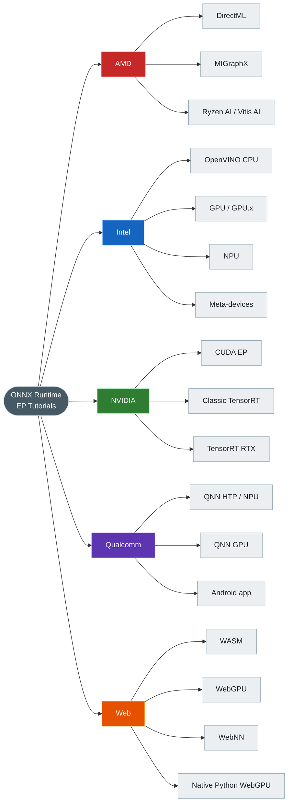
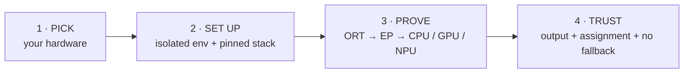
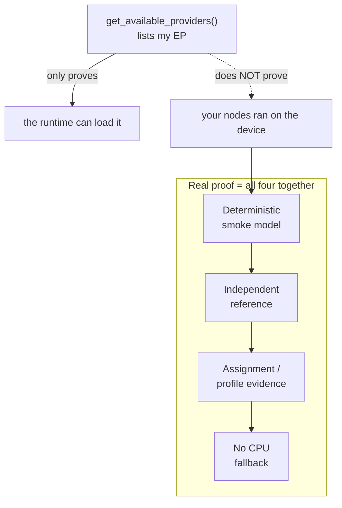
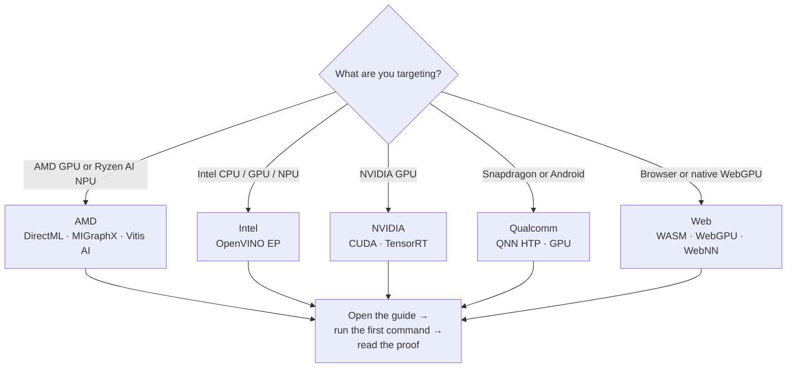
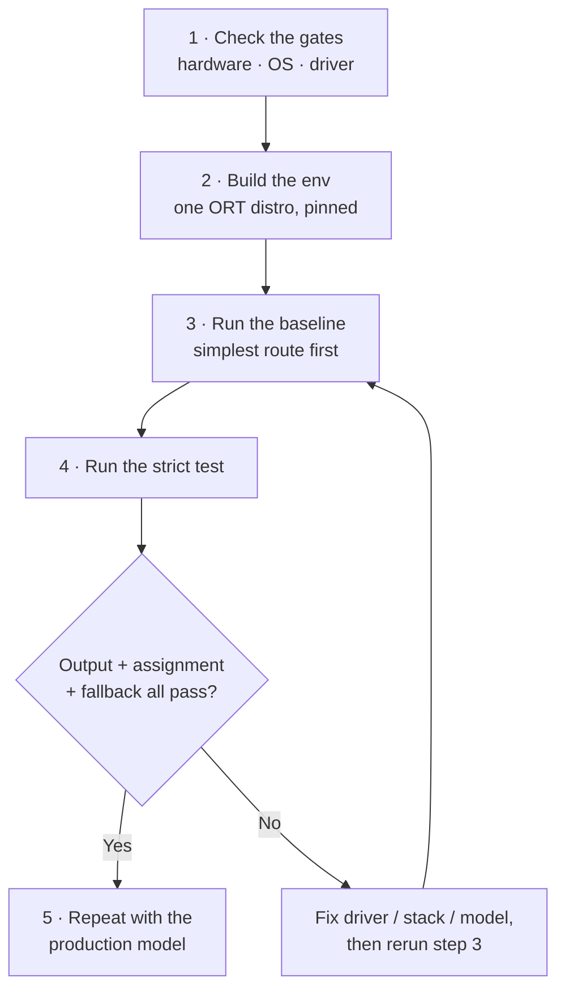
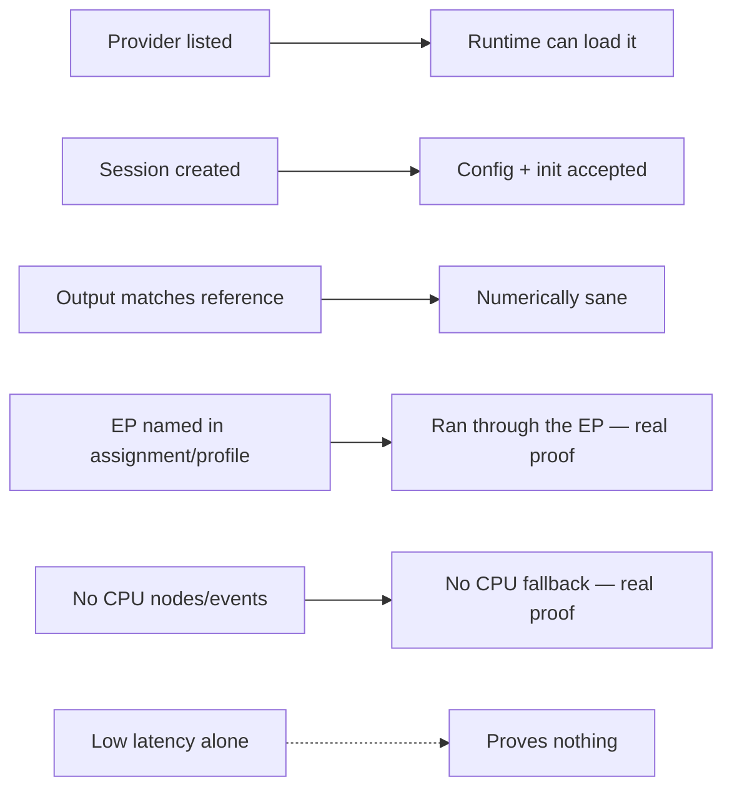

# ONNX Runtime Execution Provider Tutorials

Reproducible setup guides and **strict** smoke tests that prove your ONNX model truly runs on **AMD, Intel, NVIDIA, Qualcomm, and Web** backends — not just that a provider *could* load.

[简体中文](README.zh-CN.md)  ·  **Last verified: 2026-07-17.** Every platform guide pins its own packages, hardware gates, tested environments, and validation limits.

---

## Contents

- [The whole repo in one picture](#the-whole-repo-in-one-picture)
- [Your journey in four moves](#your-journey-in-four-moves)
- [The one idea to remember](#the-one-idea-to-remember)
- [Pick your path](#pick-your-path)
- [The road to a trustworthy pass](#the-road-to-a-trustworthy-pass)
- [How to read your results](#how-to-read-your-results)
- [Repository map](#repository-map)
- [License](#license)

---

## The whole repo in one picture

Five hardware families, one workflow, one promise: **evidence over assumptions**.

---

## Your journey in four moves

Learn this loop once and reuse it on every platform.

| Move | You do | You get |
|---|---|---|
| **1 · Pick** | Match your exact device, OS, and driver to a guide | The right route and its support gates |
| **2 · Set up** | Create a clean venv with the guide's pinned stack | One ONNX Runtime distribution, no conflicts |
| **3 · Prove** | Run the route's strict smoke test | A real inference through the requested EP |
| **4 · Trust** | Read the evidence the test prints | Proof the accelerator — not the CPU — did the work |

---

## The one idea to remember

> [!IMPORTANT]
> A provider appearing in `get_available_providers()` only means the runtime **can load** it. It does **not** mean your model actually **ran** on the GPU or NPU.

That single gap is why so many "it works" demos quietly fall back to CPU. Every test here closes it with four independent checks:

| Check | Confirms | Guards against |
|---|---|---|
| Deterministic smoke model | The same input every run | Flaky, unreproducible results |
| Independent reference | The output is numerically correct | Silently wrong math |
| Assignment / profile evidence | Nodes ran on the target EP | Invisible CPU execution |
| No CPU fallback | The accelerator did the work | Quiet fallback that looks like success |

> [!TIP]
> Use a **separate virtual environment per route**. `onnxruntime`, `onnxruntime-gpu`, `onnxruntime-openvino`, and `onnxruntime-directml` all import as the same `onnxruntime` module and must never be mixed.

---

## Pick your path

Start from the hardware in front of you, open its guide, and run the first command.

| Platform | What you have | Hosts | First command | Guides |
|---|---|---|---|---|
| **AMD** | AMD GPU (DirectML / MIGraphX) or Ryzen AI NPU (Vitis AI) | Windows · Ubuntu | `python AMD/provider_test.py --target dml` swap `dml` → `migraphx` or `npu` for your host | [EN](AMD/README.md) · [中文](AMD/README.zh-CN.md) |
| **Intel** | Intel CPU, integrated/discrete GPU, or NPU via OpenVINO | Windows 11 · Ubuntu x86-64 | `bash Intel/run_demo.sh --device CPU` Windows: `Intel\run_demo.bat --device CPU` | [EN](Intel/README.md) · [中文](Intel/README.zh-CN.md) |
| **NVIDIA** | NVIDIA GPU via CUDA, classic TensorRT, or TensorRT RTX | Windows 10/11 · Ubuntu x86-64 | `python NVIDIA/provider_test.py --provider cuda` | [EN](NVIDIA/README.md) · [中文](NVIDIA/README.zh-CN.md) |
| **Qualcomm** | Snapdragon HTP/NPU or GPU via QNN | Windows ARM64 · Android ARM64 | `python Qualcomm/one_click.py htp` Android: `python Qualcomm/AndroidDemo/build_demo.py --install --backend htp` | [EN](Qualcomm/README.md) · [中文](Qualcomm/README.zh-CN.md) · [App](Qualcomm/AndroidDemo/README.md) |
| **Web** | Browser WASM/WebGPU/WebNN or native Python WebGPU | Browser-dependent; native wheels narrower | `bash WebGPU/onnxruntime-web-demo/run_demo.sh wasm` Windows: `WebGPU\onnxruntime-web-demo\run_demo.bat wasm` | [EN](WebGPU/README.md) · [中文](WebGPU/README.zh-CN.md) · [Demo](WebGPU/onnxruntime-web-demo/README.md) |

---

## The road to a trustworthy pass

Always climb from the simplest route to the strictest. Fix problems where they appear, then continue.

| Step | Do this | Pass condition |
|---:|---|---|
| 1 | Check the hardware, OS, and driver gates in the platform guide | The exact device is in the documented support scope |
| 2 | Create an isolated environment with the pinned stack | Dependency checks pass with one ORT distribution |
| 3 | Run the route's baseline | AMD: exact GPU/NPU stack · Intel: `CPU` · NVIDIA: CUDA · Web: WASM |
| 4 | Run the repository's strict entry point | Output, assignment evidence, and fallback policy all pass |
| 5 | Repeat with the production model and real inputs | Operators, shapes, precision, and app metrics pass |

**Recommended order per platform:**

| Platform | Climb this ladder |
|---|---|
| AMD | Separate GPU from NPU, then choose DirectML, MIGraphX, or Vitis AI for the exact host |
| Intel | `CPU` → explicit `GPU` / `GPU.x` / `NPU` → deployment meta-device |
| NVIDIA | CUDA → classic TensorRT; use a separate environment for the TensorRT RTX plugin |
| Qualcomm | Native Windows ARM64 → static QDQ first for HTP → physical Snapdragon device for Android |
| Web | WASM → WebGPU → WebNN; native Python WebGPU is a separate plugin route |

---

## How to read your results

Not every green checkmark means the accelerator ran. Here is what each signal actually proves.

| Signal | What it proves |
|---|---|
| Provider appears in the available-provider list | The installed runtime exposes or can load that provider |
| Session creation succeeds | The provider accepted the configuration and model initialization |
| Output matches an independent reference | The result is numerically sane within its documented tolerance |
| Graph assignment or profile names the target EP | The current run executed graph work through the requested provider |
| Strict test reports no CPU nodes/events | No CPU graph fallback was observed through that test's evidence channel |
| Low latency alone | **Not proof** of accelerator execution or production performance |

> [!NOTE]
> The included models are **qualification workloads, not benchmarks**. After a strict pass, repeat the checks with your production model, real shapes, representative inputs, warm-up policy, precision mode, and application-level accuracy metrics.

---

## Repository map

| Path | What lives here |
|---|---|
| [AMD](AMD/README.md) | DirectML, Windows ML MIGraphX, ROCm/MIGraphX, and Ryzen AI/Vitis AI setup and verification |
| [Intel](Intel/README.md) | OpenVINO EP setup for Intel CPU, GPU, NPU, and meta-devices |
| [NVIDIA](NVIDIA/README.md) | CUDA, classic TensorRT, and standalone TensorRT RTX setup and strict profiling tests |
| [Qualcomm](Qualcomm/README.md) | QNN 2.x plugin setup for Snapdragon Windows and Android |
| [Qualcomm/AndroidDemo](Qualcomm/AndroidDemo/README.md) | Complete Kotlin CPU/GPU/HTP application and one-click build/install launcher |
| [WebGPU](WebGPU/README.md) | Browser WASM/WebGPU/WebNN and native Python WebGPU guidance |
| [WebGPU/onnxruntime-web-demo](WebGPU/onnxruntime-web-demo/README.md) | Runnable cross-provider browser/native smoke test |

---

## License

This repository is licensed under the [Apache License 2.0](LICENSE).
