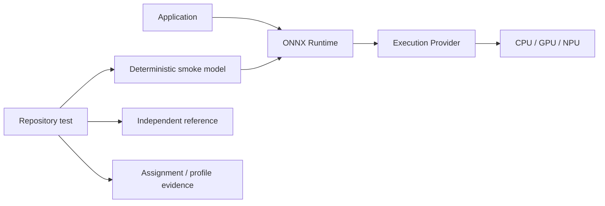
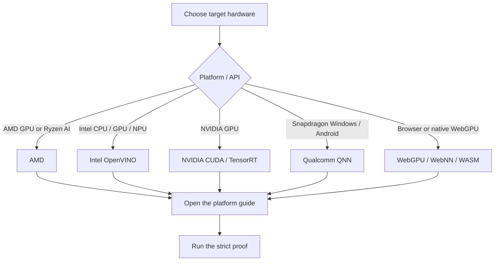

# ONNX Runtime Execution Provider Tutorials

Practical, reproducible setup guides and strict smoke tests for running ONNX models on AMD, Intel, NVIDIA, Qualcomm, WebGPU, WebNN, and WebAssembly backends.

> **Last verified: 2026-07-17.** Each platform guide records its exact package pins, hardware gates, tested environments, and validation limits.

[简体中文](README.zh-CN.md)

---

## 1. What this repository provides

This repository is a platform index plus runnable qualification tests. The maintained demos are designed to do more than confirm that an Execution Provider (EP) can be imported. Where the provider API permits, they:

1. use a pinned, internally compatible software stack;
2. create or include a deterministic local smoke model;
3. compare outputs with an independent CPU or mathematical reference;
4. disable or detect unintended CPU fallback; and
5. inspect current-run graph-assignment or profiling evidence.

> **Important:** `onnxruntime.get_available_providers()` only shows that a provider is exposed by the installed runtime. It does **not** prove that model nodes executed on the requested CPU, GPU, or NPU.
>
> Use a separate virtual environment for each route. Packages such as `onnxruntime`, `onnxruntime-gpu`, `onnxruntime-openvino`, and `onnxruntime-directml` provide the same Python module and must not be mixed casually.

## 2. Choose a provider

| Area | Hardware and execution route | Covered hosts | Complete guides | Proof entry point after prerequisites |
|---|---|---|---|---|
| **AMD** | AMD GPU through DirectML or MIGraphX; Ryzen AI NPU through Vitis AI | Windows and Ubuntu; exact GPU/NPU support gates vary | [English](AMD/README.md) · [简体中文](AMD/README.zh-CN.md) | Use the [`provider_test.py`](AMD/provider_test.py) command matrix and select `dml`, `migraphx`, or `npu` |
| **Intel** | Intel CPU, integrated/discrete GPU, or integrated NPU through OpenVINO EP | Windows 11 and Ubuntu x86-64 | [English](Intel/README.md) · [简体中文](Intel/README.zh-CN.md) | Windows: `Intel\run_demo.bat --device CPU` Linux: `bash Intel/run_demo.sh --device CPU` |
| **NVIDIA** | CUDA EP, classic TensorRT EP, or standalone TensorRT RTX plugin | Windows 10/11 and Ubuntu x86-64 | [English](NVIDIA/README.md) · [简体中文](NVIDIA/README.zh-CN.md) | Start with `python NVIDIA/provider_test.py --provider cuda` |
| **Qualcomm** | QNN GPU or HTP/NPU; optional QNN CPU reference backend | Native Windows ARM64 on Snapdragon and physical Android ARM64 devices | [English](Qualcomm/README.md) · [简体中文](Qualcomm/README.zh-CN.md) · [Android app](Qualcomm/AndroidDemo/README.md) | Windows: `python Qualcomm/one_click.py htp` Android: `python Qualcomm/AndroidDemo/build_demo.py --install --backend htp` |
| **Web and native WebGPU** | Browser WASM, browser WebGPU, browser WebNN, or native Python WebGPU plugin | Browser-dependent Windows/Linux/macOS routes; native wheel support is narrower | [English](WebGPU/README.md) · [简体中文](WebGPU/README.zh-CN.md) · [Demo](WebGPU/onnxruntime-web-demo/README.md) | Windows: `WebGPU\onnxruntime-web-demo\run_demo.bat wasm` Linux/macOS: `bash WebGPU/onnxruntime-web-demo/run_demo.sh wasm` |

## 3. Run the proof in order

| Step | Action | Pass condition |
|---:|---|---|
| 1 | Check the hardware, OS, and driver gates in the platform guide | The exact device is in the documented support scope |
| 2 | Create an isolated environment with the pinned stack | Dependency checks pass with one ORT distribution |
| 3 | Run the route's baseline | AMD: exact GPU/NPU stack; Intel: `CPU`; NVIDIA: CUDA; Web: WASM |
| 4 | Run the repository's strict entry point | Output, assignment evidence, and fallback policy pass |
| 5 | Repeat with the production model and representative inputs | Operators, shapes, precision, and application metrics pass |

| Platform | Recommended order |
|---|---|
| AMD | Separate GPU from NPU, then choose DirectML, MIGraphX, or Vitis AI for the exact host |
| Intel | `CPU` → explicit `GPU` / `GPU.x` / `NPU` → deployment meta-device |
| NVIDIA | CUDA → classic TensorRT; use a separate environment for the TensorRT RTX plugin |
| Qualcomm | Native Windows ARM64; static QDQ first for HTP; physical Snapdragon device for Android |
| Web | WASM → WebGPU → WebNN; native Python WebGPU is a separate plugin route |

## 4. Read the result

| Signal | What it proves |
|---|---|
| Provider appears in the available-provider list | The installed runtime exposes or can load that provider |
| Session creation succeeds | The provider accepted the session configuration and model initialization |
| Output matches an independent reference | The smoke-test result is numerically sane within its documented tolerance |
| Graph assignment or profile names the target EP | The current run executed graph work through the requested provider |
| Strict test reports no CPU nodes/events | No CPU graph fallback was observed through the evidence channel used by that test |
| Low latency alone | **Not proof** of accelerator execution or production performance |

The included models are qualification workloads, not benchmarks. After obtaining a strict pass, repeat the checks with the production model, real shapes, representative inputs, warm-up policy, precision mode, and application-level accuracy metrics.

## 5. Repository map

| Path | Purpose |
|---|---|
| [AMD](AMD/README.md) | DirectML, Windows ML MIGraphX, ROCm/MIGraphX, and Ryzen AI/Vitis AI setup and verification |
| [Intel](Intel/README.md) | OpenVINO EP setup for Intel CPU, GPU, NPU, and meta-devices |
| [NVIDIA](NVIDIA/README.md) | CUDA, classic TensorRT, and standalone TensorRT RTX setup and strict profiling tests |
| [Qualcomm](Qualcomm/README.md) | QNN 2.x plugin setup for Snapdragon Windows and Android |
| [Qualcomm/AndroidDemo](Qualcomm/AndroidDemo/README.md) | Complete Kotlin CPU/GPU/HTP application and one-click build/install launcher |
| [WebGPU](WebGPU/README.md) | Browser WASM/WebGPU/WebNN and native Python WebGPU guidance |
| [WebGPU/onnxruntime-web-demo](WebGPU/onnxruntime-web-demo/README.md) | Runnable cross-provider browser/native smoke test |

## 6. License

This repository is licensed under the [Apache License 2.0](LICENSE).
