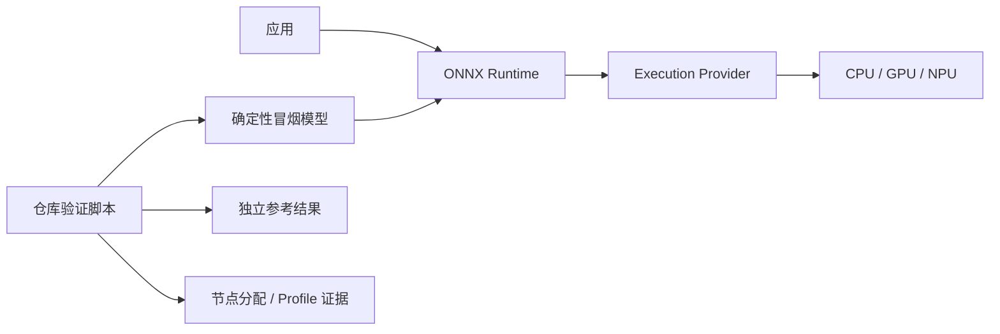
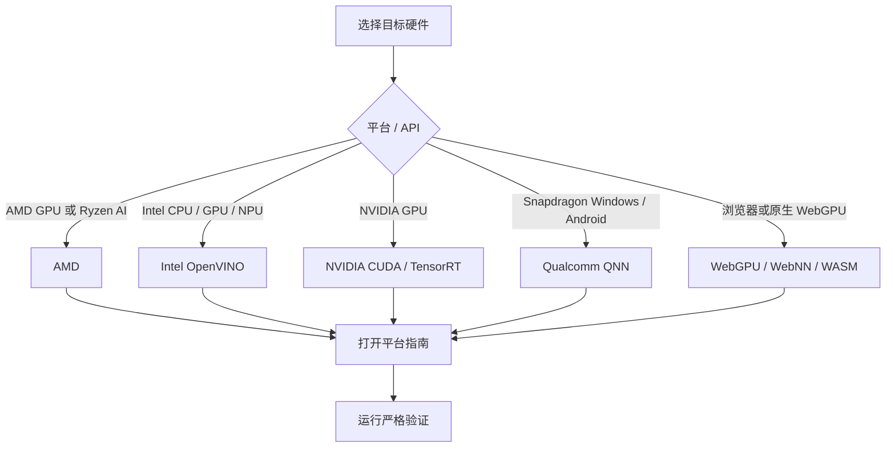

# ONNX Runtime 执行提供程序教程

面向 AMD、Intel、NVIDIA、Qualcomm、WebGPU、WebNN 与 WebAssembly 的可复现配置指南和严格冒烟测试。

> **最后验证：2026-07-17。** 每份平台指南分别记录准确版本、硬件门槛、已测试环境与验证边界。

[English](README.md)

---

## 1. 本仓库提供什么

| 层级 | 验证内容 | 不代表什么 |
|---|---|---|
| 环境 | 使用彼此兼容的固定软件版本 | 目标硬件一定可用 |
| 模型 | 本地生成或附带确定性冒烟模型 | 生产模型一定受支持 |
| 数值 | 与独立 CPU 或数学参考比较 | 已达到生产准确率 |
| 路由 | 禁止或检测意外 CPU 回退 | 已完成性能调优 |
| 证据 | 检查本次运行的节点分配或 Profile | 单凭低延迟即可证明加速 |

> [!IMPORTANT]
> `onnxruntime.get_available_providers()` 只表示当前 Runtime 暴露了某个 Provider，不能证明模型节点已在目标 CPU、GPU 或 NPU 上执行。

每条路线使用独立虚拟环境。`onnxruntime`、`onnxruntime-gpu`、`onnxruntime-openvino`、`onnxruntime-directml` 等包提供同名 Python 模块，不能随意混装。

## 2. 选择 Provider

| 平台 | 硬件与执行路线 | 覆盖系统 | 指南 | 前置配置完成后的验证入口 |
|---|---|---|---|---|
| **AMD** | AMD GPU 使用 DirectML 或 MIGraphX；Ryzen AI NPU 使用 Vitis AI | Windows、Ubuntu | [English](AMD/README.md) · [简体中文](AMD/README.zh-CN.md) | 从 `python AMD/provider_test.py --target dml` 开始；其他目标见平台指南 |
| **Intel** | Intel CPU、集成/独立 GPU、集成 NPU 使用 OpenVINO EP | Windows 11、Ubuntu x86-64 | [English](Intel/README.md) · [简体中文](Intel/README.zh-CN.md) | Windows：`Intel\run_demo.bat --device CPU` Linux：`bash Intel/run_demo.sh --device CPU` |
| **NVIDIA** | CUDA EP、传统 TensorRT EP、TensorRT RTX 独立插件 | Windows 10/11、Ubuntu x86-64 | [English](NVIDIA/README.md) · [简体中文](NVIDIA/README.zh-CN.md) | `python NVIDIA/provider_test.py --provider cuda` |
| **Qualcomm** | QNN GPU、HTP/NPU；可选 QNN CPU 参考后端 | Snapdragon Windows ARM64、Android ARM64 真机 | [English](Qualcomm/README.md) · [简体中文](Qualcomm/README.zh-CN.md) · [Android](Qualcomm/AndroidDemo/README.zh-CN.md) | Windows：`python Qualcomm/one_click.py htp` Android：`python Qualcomm/AndroidDemo/build_demo.py --install --backend htp` |
| **Web 与原生 WebGPU** | 浏览器 WASM、WebGPU、WebNN；原生 Python WebGPU 插件 | 取决于浏览器；原生 wheel 范围更窄 | [English](WebGPU/README.md) · [简体中文](WebGPU/README.zh-CN.md) · [演示](WebGPU/onnxruntime-web-demo/README.zh-CN.md) | Windows：`WebGPU\onnxruntime-web-demo\run_demo.bat wasm` Linux/macOS：`bash WebGPU/onnxruntime-web-demo/run_demo.sh wasm` |

## 3. 按顺序验证

| 步骤 | 操作 | 通过条件 |
|---:|---|---|
| 1 | 在平台指南中确认硬件、系统与驱动门槛 | 目标设备在官方支持范围内 |
| 2 | 为所选路线创建独立环境并使用固定版本 | 依赖检查通过且无冲突 ORT 包 |
| 3 | 先运行最基础路线 | AMD 先选准确 GPU/NPU 栈；Intel 先 `CPU`；NVIDIA 先 CUDA；Web 先 WASM |
| 4 | 运行仓库的严格验证入口 | 输出、节点分配与回退策略全部通过 |
| 5 | 再使用生产模型和真实输入重复验证 | 算子、Shape、精度与应用指标符合要求 |

| 平台 | 推荐顺序 |
|---|---|
| AMD | 先区分 GPU 与 NPU，再按硬件和系统选择 DirectML、MIGraphX 或 Vitis AI |
| Intel | `CPU` → 明确的 `GPU` / `GPU.x` / `NPU` → 部署所需 Meta-device |
| NVIDIA | CUDA → 传统 TensorRT；TensorRT RTX 插件使用独立环境 |
| Qualcomm | Windows 使用原生 ARM64；HTP 先验证静态 QDQ 模型；Android 使用 Snapdragon 真机 |
| Web | WASM → WebGPU → WebNN；原生 Python WebGPU 是独立插件路线 |

## 4. 解读结果

| 信号 | 能证明什么 |
|---|---|
| Provider 出现在可用列表 | Runtime 暴露或能够加载该 Provider |
| Session 创建成功 | Provider 接受配置并完成模型初始化 |
| 输出与独立参考一致 | 冒烟结果在文档容差内数值有效 |
| Graph Assignment 或 Profile 标记目标 EP | 本次运行通过目标 Provider 执行了计算图工作 |
| 严格测试无 CPU 节点/事件 | 在该测试使用的证据通道中未观察到 CPU Graph 回退 |
| 仅延迟较低 | **不能证明**硬件加速或生产性能 |

附带模型用于资格验证，不是 Benchmark。严格验证通过后，还需使用生产模型、真实 Shape、代表性输入、预热策略、精度模式和应用级准确率指标复测。

## 5. 仓库地图

| 路径 | 用途 |
|---|---|
| [AMD](AMD/README.zh-CN.md) | DirectML、Windows ML MIGraphX、ROCm/MIGraphX 与 Ryzen AI/Vitis AI |
| [Intel](Intel/README.zh-CN.md) | Intel CPU、GPU、NPU 与 Meta-device 的 OpenVINO EP |
| [NVIDIA](NVIDIA/README.zh-CN.md) | CUDA、传统 TensorRT 与 TensorRT RTX 插件 |
| [Qualcomm](Qualcomm/README.zh-CN.md) | Snapdragon Windows 与 Android 的 QNN 2.x 插件 |
| [Qualcomm/AndroidDemo](Qualcomm/AndroidDemo/README.zh-CN.md) | Kotlin CPU/GPU/HTP 应用与一键构建/安装脚本 |
| [WebGPU](WebGPU/README.zh-CN.md) | 浏览器 WASM/WebGPU/WebNN 与原生 Python WebGPU |
| [WebGPU/onnxruntime-web-demo](WebGPU/onnxruntime-web-demo/README.zh-CN.md) | 浏览器/原生跨 Provider 冒烟测试 |

## 6. 许可证

本仓库采用 [Apache License 2.0](LICENSE)。
