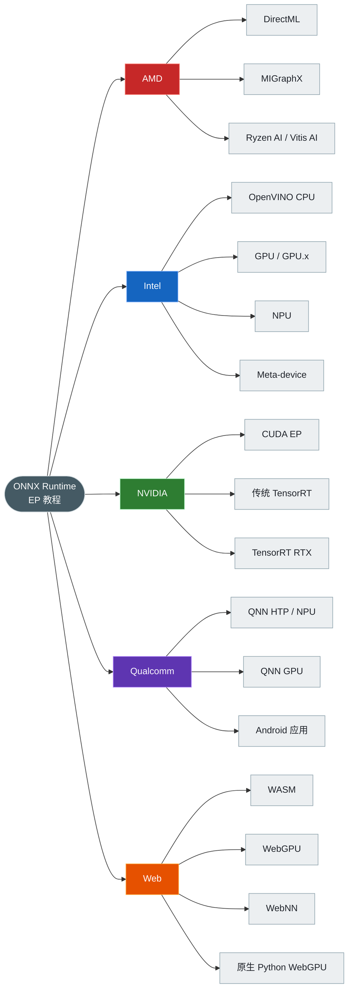
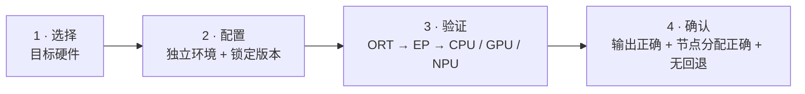
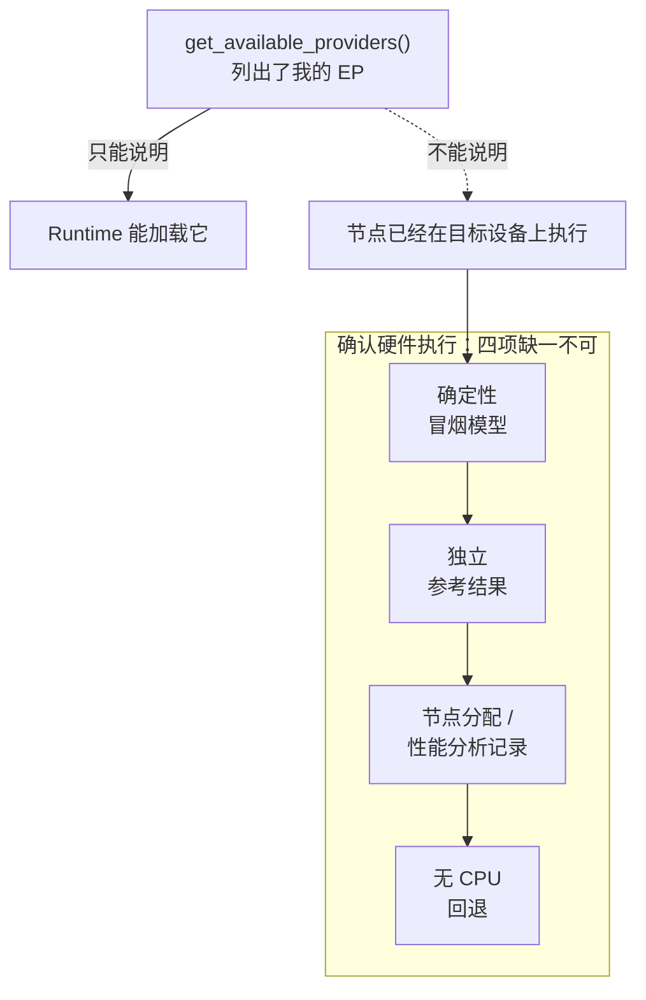
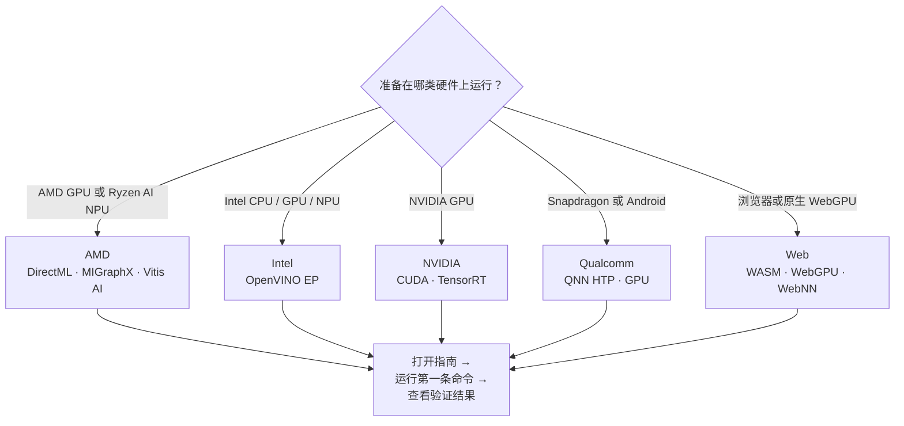
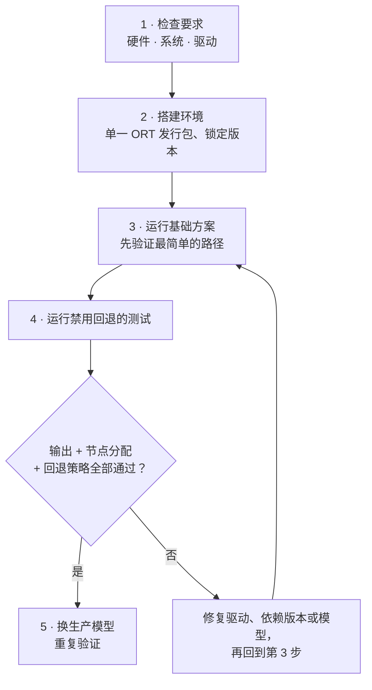
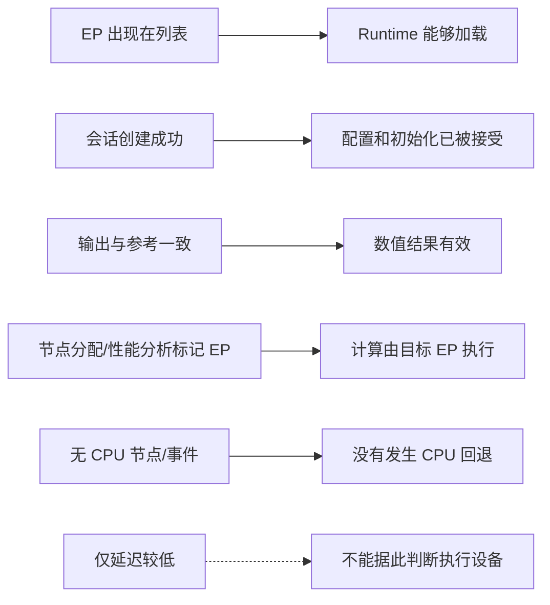

# ONNX Runtime 执行提供程序教程

本仓库提供可复现的配置指南和**严格**的冒烟测试，帮助你确认 ONNX 模型确实运行在 **AMD、Intel、NVIDIA、Qualcomm 或 Web** 后端上，而不只是某个执行提供程序（EP）能够加载。

[English](README.md)  ·  **最近验证：2026-07-17。** 每份平台指南都单独列出锁定的软件版本、硬件要求、已测试环境和验证范围。

---

## 目录

- [一张图看懂本仓库](#一张图看懂本仓库)
- [四步完成验证](#四步完成验证)
- [必须记住的一件事](#必须记住的一件事)
- [选择适合的方案](#选择适合的方案)
- [获得可信结果的步骤](#获得可信结果的步骤)
- [如何解读结果](#如何解读结果)
- [目录说明](#目录说明)
- [许可证](#许可证)

---

## 一张图看懂本仓库

五类硬件平台采用同一套验证流程，并遵循同一个原则：**用证据代替假设**。

---

## 四步完成验证

掌握下面四步后，就可以在不同平台上重复使用同一套方法。

| 步骤 | 你要做 | 你会得到 |
|---|---|---|
| **1 · 选择** | 根据具体设备、系统和驱动找到对应指南 | 适合当前硬件的方案及其最低要求 |
| **2 · 配置** | 按指南锁定的版本创建干净的虚拟环境 | 环境中只有一种 ONNX Runtime 发行包，避免相互冲突 |
| **3 · 验证** | 运行该方案中禁用回退的冒烟测试 | 确认推理确实经过目标 EP |
| **4 · 确认** | 查看测试输出的各项验证信息 | 确认计算由加速器完成，而不是回退到 CPU |

---

## 必须记住的一件事

> [!IMPORTANT]
> 某个 EP 出现在 `get_available_providers()` 中，只能说明 ONNX Runtime **能够加载**它，并不代表模型已经**在 GPU 或 NPU 上执行**。

很多看似“能运行”的示例会在没有明显提示的情况下回退到 CPU。为避免这种误判，本仓库的测试会同时执行以下四项相互独立的检查：

| 检查 | 可以确认 | 可以排除 |
|---|---|---|
| 确定性冒烟模型 | 每次都使用相同输入 | 结果不稳定或无法复现 |
| 独立参考结果 | 输出数值正确 | 运行成功但计算结果有误 |
| 节点分配 / 性能分析记录 | 节点由目标 EP 执行 | 计算实际落在 CPU 却未被发现 |
| 无 CPU 回退 | 计算由加速器完成 | 回退到 CPU 后仍被误判为成功 |

> [!TIP]
> 每种方案都应使用**独立的虚拟环境**。`onnxruntime`、`onnxruntime-gpu`、`onnxruntime-openvino` 和 `onnxruntime-directml` 导入后都叫 `onnxruntime`，不能安装在同一个环境中。

---

## 选择适合的方案

先确认手头的硬件，再打开对应指南并运行其中的第一条命令。

| 平台 | 适用硬件 | 支持的系统 | 起步命令 | 指南 |
|---|---|---|---|---|
| **AMD** | AMD GPU（DirectML / MIGraphX）或 Ryzen AI NPU（Vitis AI） | Windows · Ubuntu | `python AMD/provider_test.py --target dml` 按主机把 `dml` 换成 `migraphx` 或 `npu` | [中文](AMD/README.zh-CN.md) · [EN](AMD/README.md) |
| **Intel** | Intel CPU、集成/独立 GPU 或 NPU（OpenVINO） | Windows 11 · Ubuntu x86-64 | `bash Intel/run_demo.sh --device CPU` Windows：`Intel\run_demo.bat --device CPU` | [中文](Intel/README.zh-CN.md) · [EN](Intel/README.md) |
| **NVIDIA** | NVIDIA GPU（CUDA / 传统 TensorRT / TensorRT RTX） | Windows 10/11 · Ubuntu x86-64 | `python NVIDIA/provider_test.py --provider cuda` | [中文](NVIDIA/README.zh-CN.md) · [EN](NVIDIA/README.md) |
| **Qualcomm** | Snapdragon HTP/NPU 或 GPU（QNN） | Windows ARM64 · Android ARM64 | `python Qualcomm/one_click.py htp` Android：`python Qualcomm/AndroidDemo/build_demo.py --install --backend htp` | [中文](Qualcomm/README.zh-CN.md) · [EN](Qualcomm/README.md) · [应用](Qualcomm/AndroidDemo/README.zh-CN.md) |
| **Web** | 浏览器 WASM/WebGPU/WebNN 或原生 Python WebGPU | 取决于浏览器；原生 wheel 更窄 | `bash WebGPU/onnxruntime-web-demo/run_demo.sh wasm` Windows：`WebGPU\onnxruntime-web-demo\run_demo.bat wasm` | [中文](WebGPU/README.zh-CN.md) · [EN](WebGPU/README.md) · [演示](WebGPU/onnxruntime-web-demo/README.zh-CN.md) |

---

## 获得可信结果的步骤

先从最基础的方案开始，再逐步提高验证要求。如果某一步失败，请先解决当前问题，再继续下一步。

| 步骤 | 操作 | 通过条件 |
|---:|---|---|
| 1 | 对照平台指南检查硬件、系统和驱动要求 | 目标设备在官方支持范围内 |
| 2 | 为所选方案创建独立环境并安装锁定版本 | 依赖检查通过，且没有互相冲突的 ORT 包 |
| 3 | 先运行最基础的方案 | AMD：匹配的 GPU/NPU 环境 · Intel：`CPU` · NVIDIA：CUDA · Web：WASM |
| 4 | 运行仓库中禁用回退的验证程序 | 输出、节点分配和回退检查全部通过 |
| 5 | 使用生产模型和真实输入再次验证 | 算子、形状、精度和应用指标均符合要求 |

**各平台推荐顺序：**

| 平台 | 推荐顺序 |
|---|---|
| AMD | 先区分 GPU 与 NPU，再按硬件和系统选择 DirectML、MIGraphX 或 Vitis AI |
| Intel | `CPU` → 明确的 `GPU` / `GPU.x` / `NPU` → 部署所需 Meta-device |
| NVIDIA | CUDA → 传统 TensorRT；TensorRT RTX 插件需要使用独立环境 |
| Qualcomm | Windows 使用原生 ARM64；HTP 先验证静态 QDQ 模型；Android 使用 Snapdragon 真机 |
| Web | WASM → WebGPU → WebNN；原生 Python WebGPU 是独立插件路线 |

---

## 如何解读结果

看到绿色通过标记，并不一定表示加速器已经执行了计算。下面列出各类结果分别可以确认什么。

| 信号 | 可以确认什么 |
|---|---|
| EP 出现在可用列表 | 当前运行时提供或能够加载该 EP |
| 会话创建成功 | EP 接受了配置并完成模型初始化 |
| 输出与独立参考一致 | 冒烟测试结果在文档给定的误差范围内正确 |
| 计算图分配或性能分析记录标记目标 EP | 本次运行中的计算图工作确实交给了目标 EP |
| 禁用回退的测试中没有 CPU 节点/事件 | 该测试所检查的记录中没有发现计算图回退到 CPU |
| 仅延迟较低 | **不能据此确认**硬件加速，也不能代表生产环境性能 |

> [!NOTE]
> 仓库自带的模型只用于**验证配置和执行路径，不是性能基准**。通过测试后，还需要使用生产模型、真实输入形状、代表性数据、实际预热策略、精度模式和应用级准确率指标重新验证。

---

## 目录说明

| 路径 | 内容 |
|---|---|
| [AMD](AMD/README.zh-CN.md) | DirectML、Windows ML MIGraphX、ROCm/MIGraphX 与 Ryzen AI/Vitis AI |
| [Intel](Intel/README.zh-CN.md) | Intel CPU、GPU、NPU 与 Meta-device 的 OpenVINO EP |
| [NVIDIA](NVIDIA/README.zh-CN.md) | CUDA、传统 TensorRT 与 TensorRT RTX 插件 |
| [Qualcomm](Qualcomm/README.zh-CN.md) | Snapdragon Windows 与 Android 的 QNN 2.x 插件 |
| [Qualcomm/AndroidDemo](Qualcomm/AndroidDemo/README.zh-CN.md) | Kotlin CPU/GPU/HTP 应用与一键构建/安装脚本 |
| [WebGPU](WebGPU/README.zh-CN.md) | 浏览器 WASM/WebGPU/WebNN 与原生 Python WebGPU |
| [WebGPU/onnxruntime-web-demo](WebGPU/onnxruntime-web-demo/README.zh-CN.md) | 浏览器/原生跨 Provider 冒烟测试 |

---

## 许可证

本仓库采用 [Apache License 2.0](LICENSE)。
