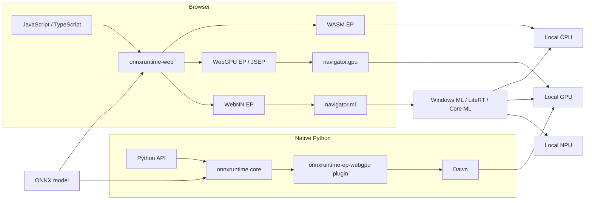
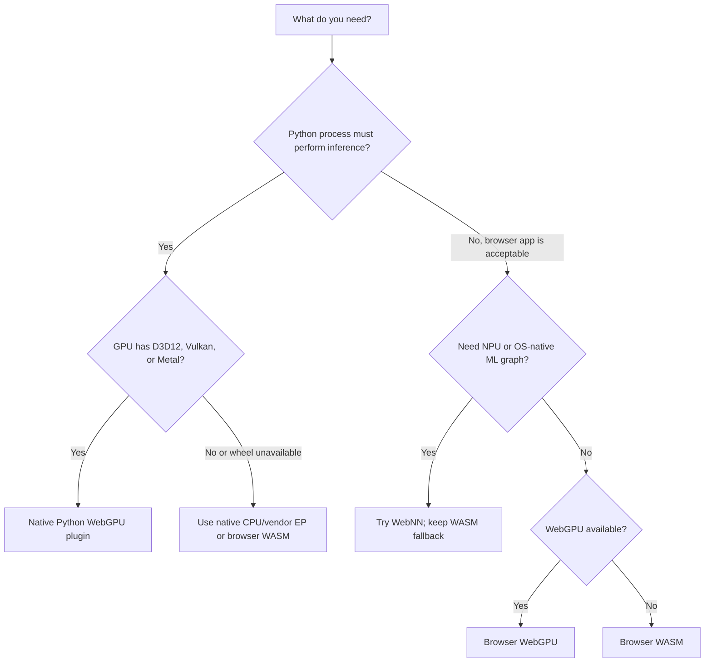
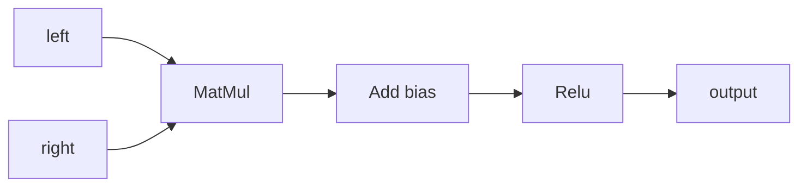
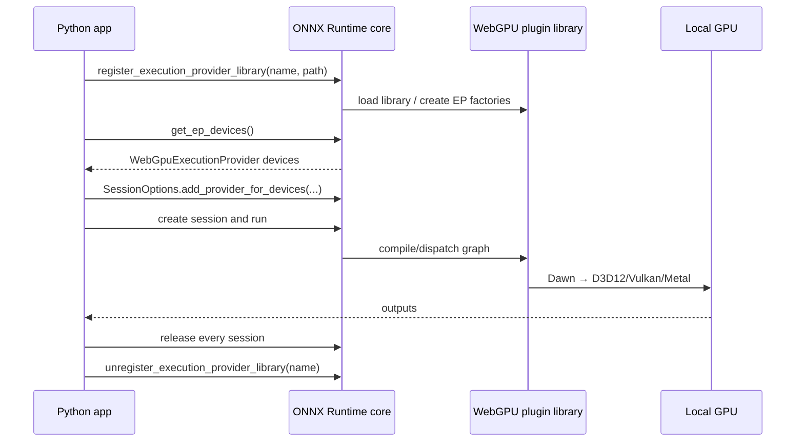
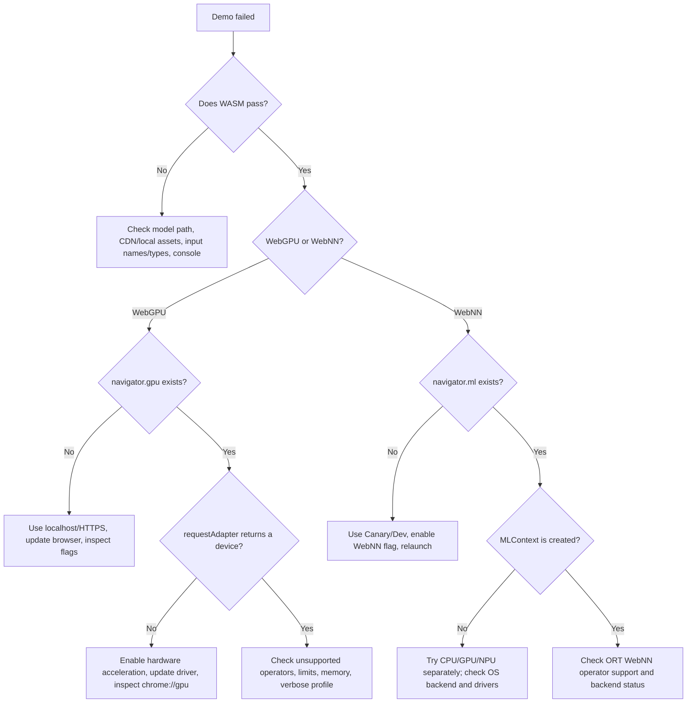

# ONNX Runtime local WebGPU, WebNN, and WASM setup

[简体中文](README.zh-CN.md) | **English** | [Runnable demo](onnxruntime-web-demo)

> Last verified: **2026-07-16**. Reproducible versions in this repository: `onnxruntime-web 1.27.0`, `onnxruntime 1.27.0`, and `onnxruntime-ep-webgpu 0.1.0`.
>
> WebGPU and especially WebNN evolve quickly. Read the support tables and verify the linked live status pages before shipping.

**Evidence policy:** ONNX Runtime documentation, source/operator tables, and npm/PyPI metadata are treated as normative for ORT APIs and packages. Browser implementation tables and browser/OS vendor posts determine platform availability. Independent blogs are used only for practical ideas such as warm-up, local caching, and separating upload/readback cost; their compatibility and benchmark claims are not copied without primary-source confirmation.

This guide starts from zero and ends with local ONNX inference through:

- **WASM EP** — CPU inference in a browser; the compatibility baseline.
- **WebGPU EP in ONNX Runtime Web** — browser JavaScript/TypeScript using the local GPU.
- **WebNN EP in ONNX Runtime Web** — browser JavaScript/TypeScript asking the OS/browser for CPU, GPU, or NPU acceleration.
- **Native WebGPU plugin EP** — Python using the new `onnxruntime-ep-webgpu` plugin and Dawn, without a browser.
- **One-click Python launchers** — one command for each browser route, plus native WebGPU on the hosts supported by the pinned wheels.

## 1. Read this first: four routes with similar names

| Route | Language/API | Runs where | Hardware path | Package | Maturity in this guide |
|---|---|---|---|---|---|
| Browser WASM | JavaScript, hosted by Python | Browser | ORT compiled to WebAssembly → CPU | `onnxruntime-web` | Baseline; broadest compatibility |
| Browser WebGPU | JavaScript, hosted by Python | Browser | ORT Web/JSEP → browser WebGPU → D3D12/Vulkan/Metal | `onnxruntime-web` | Recommended browser GPU route |
| Browser WebNN | JavaScript, hosted by Python | Chromium preview | ORT Web → `navigator.ml` → Windows ML/LiteRT/Core ML → CPU/GPU/NPU | `onnxruntime-web` | Experimental; browser flag often required |
| Native WebGPU | **Python** | Native process | ONNX Runtime plugin API → WebGPU EP → Dawn → D3D12/Vulkan/Metal | `onnxruntime` + `onnxruntime-ep-webgpu` | New beta plugin route |

### Important truth about “Python + WebNN”

There is no published `onnxruntime-ep-webnn` Python package in this setup. WebNN is a **Web browser standard** exposed as `navigator.ml`. Therefore:

- `python launch_demo.py webnn` starts a correct local HTTP server and a WebNN-enabled browser; inference runs in JavaScript inside that browser.
- `python launch_demo.py native-webgpu` runs true native Python inference with the WebGPU plugin.
- Do not install a similarly named unofficial package expecting native WebNN.



No model input is sent to a cloud inference service. The first browser run may download the pinned ORT Web assets from jsDelivr if `npm ci` has not populated the local assets.

## 2. Choose the correct route



For a first test, run **WASM**, then **WebGPU**, then **WebNN**. This separates model errors from accelerator/browser errors.

## 3. Current support snapshot

### 3.1 Practical OS matrix

Legend: ✅ expected; 🧪 preview/validate on the exact machine; ❌ no public route in this tutorial.

| OS | Browser WASM | Browser WebGPU | Browser WebNN | Native Python WebGPU plugin |
|---|---:|---:|---:|---:|
| Windows 10/11 x64 | ✅ | ✅ Chrome/Edge | 🧪 Canary/flag; Windows ML path is best on Windows 11 24H2+ | ✅ `win_amd64` wheel |
| Windows ARM64 | ✅ | 🧪 Chromium WebGPU is behind a flag | 🧪 | ❌ no public ARM64 wheel in plugin 0.1.0 |
| Ubuntu/Linux x86-64 | ✅ | 🧪 supported Chromium/GPU combinations; see below | 🧪 WebNN flag/LiteRT, not in ORT's validated matrix | ✅ manylinux glibc 2.27/2.28 x86-64 wheel |
| Linux ARM64 | ✅ | 🧪 browser/device dependent | 🧪 | ❌ no public aarch64 wheel in plugin 0.1.0 |
| macOS 14+ Apple Silicon | ✅ | ✅ Chrome/Edge; Safari WebGPU exists on macOS 26 but is not in ORT Web's supported matrix | 🧪 Canary/flag/Core ML; not in ORT's validated matrix | ✅ plugin universal2 + ORT core arm64 wheels |
| macOS Intel | ✅ | ✅ on a Chrome/Edge and macOS version still supported by the browser | 🧪 browser/device dependent | ❌ plugin is universal2, but the required ORT 1.27.0 core has no macOS x86-64 wheel |

### 3.2 Why general browser support and ORT support differ

A browser may expose WebGPU/WebNN while ONNX Runtime Web has not yet listed that browser/OS combination as supported. Treat both checks as necessary:

1. **Web API layer:** `navigator.gpu` or `navigator.ml` exists and can create a device/context.
2. **ORT layer:** the model's operators and data types are implemented by that ORT EP on that browser.

The compatibility table shipped in the published `onnxruntime-web 1.27.0` package conservatively lists:

| EP | ORT Web documented browser support |
|---|---|
| WASM | Chrome/Edge, Safari, Firefox, and single-threaded Node.js |
| WebGPU | Chrome/Edge on Windows, Android, and macOS |
| WebNN | Chrome/Edge on Windows with `WebMachineLearningNeuralNetwork` enabled |

The broader implementation status is newer:

- Chromium WebGPU is stable on macOS/Windows x86/x64 and ChromeOS since 113.
- Linux Chromium became enabled for selected Intel Gen12+ systems in 144 and NVIDIA driver 535.183.01+ on Wayland in 147; other Linux combinations may still need flags.
- Safari 26 exposes WebGPU on macOS/iOS/iPadOS/visionOS 26, but this is not the same as an ORT Web support guarantee.
- WebNN remains pre-stable/flagged. WebNN project guidance lists Windows ML, LiteRT, and Core ML backends, while ORT's conservative matrix currently validates Windows Chromium.

### 3.3 Native plugin public wheels, version 0.1.0

| Wheel | Platform requirement | Architecture |
|---|---|---|
| `onnxruntime_ep_webgpu-0.1.0-py3-none-win_amd64.whl` | 64-bit Windows | x86-64 |
| `...manylinux_2_27_x86_64.manylinux_2_28_x86_64.whl` | glibc 2.27/2.28-compatible Linux | x86-64 |
| `...macosx_14_0_universal2.whl` | macOS 14+ | Intel + Apple Silicon |

The plugin metadata requires Python 3.11+ and a separately installed compatible ONNX Runtime (minimum advertised core version 1.24.4). For the exact pair pinned here, the ORT core publishes CPython 3.11–3.14 wheels. Although the plugin's macOS wheel is universal2, the ORT 1.27.0 core wheel is arm64-only; therefore the complete pinned native route supports Apple Silicon, not Intel Macs.

## 4. Zero-to-first-inference quick start

### 4.1 Prerequisites

| Item | Minimum | Recommended |
|---|---|---|
| Python | 3.10+ for browser launcher; 64-bit CPython 3.11–3.14 for the pinned native stack | 64-bit CPython 3.12 |
| Node.js/npm | Not needed when using the pinned CDN; required to prepare local/offline browser assets | Current Node.js LTS, then run `npm ci` |
| Browser | Current Chrome or Edge | Stable for WebGPU; Canary/Dev for WebNN |
| GPU driver | Must expose D3D12, Vulkan, or Metal | Latest stable driver from GPU/OS vendor |
| Network | Needed when local npm assets/package wheels are absent; also for first-time Windows ML/EP provisioning | Run `npm ci` once for local browser assets |
| Model | Valid ONNX model | Start with the included `execution_provider_demo.onnx` |

Do **not** double-click the HTML file. `file://` is not a secure context and cannot use WebGPU/WebNN correctly. The launcher serves `http://127.0.0.1`, which browsers treat as trustworthy.

### 4.2 Open the demo folder

From the repository root:

```bash
cd WebGPU/onnxruntime-web-demo
```

The included model is deliberately small, static, and limited to operators listed by the current WASM, WebGPU, and WebNN tables:

| Value | Kind | Type | Shape |
|---|---|---|---|
| `left` | Input | `float32` | `[1, 4, 128, 128]` |
| `right` | Input | `float32` | `[1, 4, 128, 128]` |
| `output` | Output | `float32` | `[1, 4, 128, 128]` |

The checked-in 418-byte model uses ONNX IR 13 and `ai.onnx` opset 17. Its SHA-256 is `db8b8de41d85f7ea2df7e4ecb4dc62150fb8a6b3a30753f1659e5b3af47b5efd`.



| Demo file | Purpose |
|---|---|
| `execution_provider_demo.onnx` | Checked-in cross-provider demo model |
| `browser-demo.html` + `browser-demo.js` | Browser WASM/WebGPU/WebNN preflight, inference, parity, and timing UI |
| `launch_demo.py` | Local HTTP server, browser discovery/launch, and native-mode dispatcher |
| `native_webgpu_validator.py` | Native Python plugin registration, strict assignment, CPU parity, profiling, and cleanup |
| `run_demo.bat` / `run_demo.sh` | Rookie-friendly Windows and Ubuntu/macOS wrappers |

### 4.3 Windows one-click commands

Open **PowerShell** or **Command Prompt** in the demo directory:

```bat
run_demo.bat wasm
run_demo.bat webgpu
run_demo.bat webnn --device gpu
run_demo.bat native-webgpu --iterations 20
```

Useful WebNN alternatives:

```bat
run_demo.bat webnn --device cpu
run_demo.bat webnn --device npu
```

Use `npu` only after WebNN Report or Chromium histograms confirm that an NPU-capable backend/EP is installed; an NPU request is not portable across all WebNN machines.

The native command creates `.venv-webgpu`, installs the pinned packages, discovers WebGPU devices, disables CPU fallback by default, compares results with the CPU EP, and inspects the ORT profile for actual `WebGpuExecutionProvider` compute events. Use `--allow-cpu-fallback` only with a diagnostic `--model` that retains the included smoke-model input contract; adapting arbitrary model inputs is outside this validator.

### 4.4 Ubuntu/Linux and macOS one-click commands

```bash
bash run_demo.sh wasm
bash run_demo.sh webgpu
bash run_demo.sh webnn --device gpu
bash run_demo.sh native-webgpu --iterations 20
```

The default command is browser WebGPU:

```bash
bash run_demo.sh
```

The native command supports Linux x86-64 and macOS 14+ on Apple Silicon. On an Intel Mac, it now stops with a clear compatibility error before installing because the separately required `onnxruntime 1.27.0` core has no macOS x86-64 wheel. All browser commands remain usable on a browser-supported Intel Mac.

### 4.5 Direct Python launcher

The shell/batch wrappers are easiest, but the same browser routes are available directly:

| Goal | Windows | Ubuntu/macOS |
|---|---|---|
| WASM | `py -3 launch_demo.py wasm` | `python3 launch_demo.py wasm` |
| WebGPU browser | `py -3 launch_demo.py webgpu` | `python3 launch_demo.py webgpu` |
| WebNN browser GPU | `py -3 launch_demo.py webnn --device gpu` | `python3 launch_demo.py webnn --device gpu` |
| Allow unsupported model nodes to use WASM | `py -3 launch_demo.py webgpu --allow-wasm-fallback` | `python3 launch_demo.py webgpu --allow-wasm-fallback` |
| Native WebGPU (auto-creates `.venv-webgpu`) | `py -3.12 launch_demo.py native-webgpu` | `python3.12 launch_demo.py native-webgpu` |

The browser server remains open until `Ctrl+C`. If automatic browser discovery fails, copy the printed URL into a suitable Chrome/Edge window or pass `--browser` with the executable path.

For direct or manual native commands, replace `3.12` with an installed supported minor (`3.11`, `3.13`, or `3.14`) when needed. The shell/batch wrappers detect a supported interpreter automatically.

`--allow-wasm-fallback` is **node-level model fallback** after the requested WebGPU/WebNN API and context have initialized. It intentionally does not turn a machine with no WebGPU adapter or no `navigator.ml` into a passing accelerator test.

For WebNN, the launcher uses an isolated temporary browser profile and enables `WebMachineLearningNeuralNetwork` on the command line. Its default `--webnn-backend auto` policy selects LiteRT on Windows builds older than 26100 and uses Chromium's platform default elsewhere. Use `--webnn-backend litert` to explicitly enable `WebNNLiteRT` and disable higher-priority platform backends, or `--webnn-backend platform` to leave all platform backends at Chromium defaults. The compatibility disable list includes `WebNNDirectML`: Chromium removed that standalone backend in milestone 149 in favor of ORT-backed DirectML, but older builds still recognize the feature name and current builds safely ignore it. With `--no-open`, the launcher prints the feature policy, but you must apply it to the browser opened manually.

### 4.6 What success looks like

Browser success means the independent JavaScript `MatMul → Add → Relu` reference passed; accelerator routes also pass a separate WASM comparison. The page ends with a provider-specific message such as:

```text
PASS: WEBGPU local inference and output validation completed.
```

Native Python success includes numerical parity, non-copy compute nodes in the profile, and no CPU node events in default strict mode:

```text
PASS ... max_abs_diff=...
PASS: ... event(s), including ... unique compute node(s), ran on WebGpuExecutionProvider.
PASS: native WebGPU plugin inference is working.
```

A fast time alone is **not proof** of accelerator use. Use strict mode, profiling, and output comparison.

The native line `Active providers: ['WebGpuExecutionProvider', 'CPUExecutionProvider']` is normal: ORT may register its default CPU provider even when strict fallback is disabled. CPU **profile events** or a strict session-creation failure determine fallback, not presence in that list; the included strict smoke test requires zero CPU node events.

### 4.7 Verification record for this repository revision

| Check executed on 2026-07-16 | Result |
|---|---|
| Local browser WASM, ORT Web 1.27.0, COOP/COEP, 4 threads | PASS; exact runtime version, model contract, and independent math reference completed using local npm assets |
| Direct `launch_demo.py native-webgpu`, Linux x86-64, Python 3.13.14 | PASS; plugin discovered NVIDIA and Intel adapters |
| Native strict runs on the discovered NVIDIA and Intel adapters | PASS on both device indices; `MatMul`, `Add`, and `Relu` profiled on `WebGpuExecutionProvider`, zero CPU node events, CPU parity passed |
| Browser WebGPU in the VS Code integrated browser and a separate local Chrome 150 profile | Preflight correctly reported a null adapter in both; neither result is counted as browser-GPU proof |
| Browser WebNN in current Chrome 150 on Linux | `WebMachineLearningNeuralNetwork` exposed `navigator.ml`; context creation then reported that WebNN was unsupported on this local headless/Linux configuration. Launcher construction, failure diagnostics, Chromium feature policy, and ORT 1.27's required `{deviceType, context}` contract were validated, not a WebNN hardware run |
| Windows and macOS commands | Checked against official package wheel metadata and platform docs; they require execution on target hardware before any production claim |

## 5. OS preparation

### 5.1 Windows

#### Browser WebGPU

1. Install all Windows updates.
2. Install the current Intel, NVIDIA, AMD, or Qualcomm graphics driver.
3. Install/update 64-bit Chrome or Edge.
4. Open `chrome://settings/system` or `edge://settings/system` and enable **Use graphics acceleration when available**; relaunch.
5. Open `chrome://gpu` or `edge://gpu` and look for **WebGPU: Hardware accelerated**.
6. Run `run_demo.bat webgpu`.

On dual-GPU laptops, Chromium may choose the integrated GPU. Use Windows **Settings → System → Display → Graphics**, select the browser, and choose **High performance**. Chrome also has `chrome://flags/#force-high-performance-gpu` on versions that expose it.

Windows ARM64 Chromium WebGPU remains behind `chrome://flags/#enable-unsafe-webgpu` in the live implementation table, so treat it as development-only. The native Python plugin has no Windows ARM64 wheel.

#### Browser WebNN

1. Prefer Windows 11 24H2 (build 26100)+ for the Windows ML/ORT path and vendor NPU EPs.
2. Install the latest Chrome Canary or Edge Canary.
3. Run `run_demo.bat webnn --device gpu` (or `npu`). The launcher supplies the official `--enable-features=WebMachineLearningNeuralNetwork` switch in an isolated temporary profile, so changing the flag in your normal browser profile is not required.
4. On the first Windows 11 24H2+ launch, keep the machine online while Chromium installs the Windows App Runtime and applicable execution providers in the background. If context creation initially fails, wait for installation, relaunch, and inspect the status in the next step.
5. Visit <https://webnnreport.org/> and inspect `chrome://histograms/`, searching for `WebNN`, to identify backend/install state. `WebNN.ORT.WinAppRuntimeInstallState` values `2` (completed) and `9` (already present) are successful states.

If launching the browser yourself instead of using the script, open `chrome://flags` or `edge://flags`, enable **Enables WebNN API**, and relaunch.

On Windows 10 and Windows 11 before 24H2, `--webnn-backend auto` applies WebNN's documented LiteRT recipe by disabling `WebNNOnnxRuntime`, explicitly enabling `WebNNLiteRT`, and also disabling the retired `WebNNDirectML` feature for compatibility with Chromium 148 and older. Current Chromium routes DirectML through its ONNX Runtime backend and no longer has a standalone DirectML backend. To test LiteRT intentionally on any Windows version, pass `--webnn-backend litert`. Do not force LiteRT when testing the Windows ML/ORT path on Windows 11 24H2+.

WebNN may fall back to another requested device class or fail because operator coverage, driver support, and browser backend availability vary. A created `MLContext` proves API availability, not necessarily that every node ran on an NPU.

#### Native Python WebGPU

The public wheel is Windows x64 only. It uses Dawn over D3D12 or Vulkan and does not require the JavaScript browser API. Run the one-click native command. If device discovery returns zero, first update the GPU driver and check that the GPU is available to the current desktop/session (remote or virtual sessions can hide it).

### 5.2 Ubuntu/Linux

#### Driver and Vulkan preflight

For Intel/AMD using distribution Mesa packages, a typical Ubuntu setup is:

```bash
sudo apt update
sudo apt install mesa-vulkan-drivers vulkan-tools pciutils
vulkaninfo --summary
```

For NVIDIA, install the supported proprietary driver from Ubuntu **Software & Updates → Additional Drivers** or NVIDIA's documented repository; do not replace it blindly with Mesa. Confirm the active adapter and driver:

```bash
lspci -k | grep -EA3 'VGA|3D|Display'
vulkaninfo --summary
```

If `vulkaninfo` fails, native WebGPU and Vulkan-backed browser WebGPU are unlikely to work. Containers require explicit GPU device/driver exposure.

#### Browser WebGPU on Linux

Use a current Chrome/Edge build. As of the live WebGPU implementation table:

- Intel Gen12+ is enabled from Chromium 144.
- NVIDIA with driver 535.183.01+ on Wayland is enabled from Chromium 147.
- Other combinations may need a test-only launch with:

```bash
bash run_demo.sh webgpu \
  --browser-arg=--enable-unsafe-webgpu \
  --browser-arg=--ozone-platform=x11 \
  --browser-arg=--use-angle=vulkan \
  --browser-arg=--enable-features=Vulkan,VulkanFromANGLE
```

Flags bypass browser safety decisions and are for development, not production requirements. Always inspect `chrome://gpu`; **Software only** is not a valid acceleration result.

#### WebNN on Linux

WebNN project documentation maps Linux to LiteRT, but the compatibility table shipped with ORT Web 1.27.0 does not list Linux WebNN. The one-click command enables the API in an isolated profile and leaves Chromium's Linux backend at its default; pass `--webnn-backend litert` only when deliberately forcing a build that includes LiteRT. When launching manually, use Canary/Dev and enable **Enables WebNN API**. Treat the result as experimental. Keep explicit WASM node fallback for application prototypes and test every model/operator.

#### Native plugin on Linux

The public wheel is x86-64 and requires a glibc compatible with manylinux 2.27/2.28. It uses Vulkan through Dawn. WSL, minimal containers, aarch64 systems, and old distributions may need a source build or are outside the wheel's support.

### 5.3 macOS

1. Update macOS and the browser. WebGPU maps to Metal; no separate Vulkan package is needed.
2. Chrome/Edge WebGPU is the conservative ORT Web choice.
3. Run `bash run_demo.sh webgpu`.
4. For WebNN, use current Canary/Dev, enable **Enables WebNN API**, and treat Core ML routing as preview because ORT's supported matrix does not yet list macOS WebNN.
5. Native Python requires macOS 14+ on Apple Silicon for this pinned setup. The plugin wheel itself is universal2, but the separately required ORT 1.27.0 core publishes only macOS arm64 wheels; Intel Macs can still use the browser routes.

Safari 26 implements WebGPU generally, but ONNX Runtime Web's documented support matrix currently marks Safari WebGPU unsupported. It may work in a specific build; do not claim production support without your own compatibility suite.

## 6. Browser JavaScript/TypeScript setup

### 6.1 Install and choose the correct bundle

```bash
npm install --save-exact onnxruntime-web@1.27.0
```

| Need | ESM/CommonJS import | Script bundle |
|---|---|---|
| WASM only | `onnxruntime-web/wasm` | `ort.wasm.min.js` |
| WebGPU only | `onnxruntime-web/webgpu` | `ort.webgpu.min.js` |
| One build that can select WASM/WebGPU/WebNN | `onnxruntime-web/all` | `ort.all.min.js` |

Some older ORT pages use `onnxruntime-web/experimental`. The published 1.27.0 package exports `./all`, not `./experimental`; this demo intentionally uses `ort.all.min.js`.

CDN form:

```html
<script src="https://cdn.jsdelivr.net/npm/onnxruntime-web@1.27.0/dist/ort.all.min.js"></script>
```

Set global environment flags **before creating the first session**:

```js
ort.env.logLevel = 'warning';
ort.env.wasm.numThreads = globalThis.crossOriginIsolated ? 4 : 1;
ort.env.wasm.proxy = false; // proxy worker cannot be combined with WebGPU
```

### 6.2 WASM session

```js
const session = await ort.InferenceSession.create('./model.onnx', {
  executionProviders: ['wasm'],
  graphOptimizationLevel: 'all',
});
```

WASM supports the broadest ONNX operator set. Multi-threaded WASM additionally needs cross-origin isolation:

```text
Cross-Origin-Opener-Policy: same-origin
Cross-Origin-Embedder-Policy: require-corp
```

The included Python server sends both headers. Without them, set `ort.env.wasm.numThreads = 1`.

### 6.3 WebGPU session

```js
const adapter = await navigator.gpu.requestAdapter({
  powerPreference: 'high-performance',
});
if (!adapter) throw new Error('No WebGPU adapter');
const device = await adapter.requestDevice();

const session = await ort.InferenceSession.create('./model.onnx', {
  executionProviders: [{name: 'webgpu', device, validationMode: 'basic'}],
  graphOptimizationLevel: 'all',
  preferredOutputLocation: 'cpu',
  extra: {session: {disable_cpu_ep_fallback: '1'}}, // strict proof mode
});
```

The older `ort.env.webgpu.adapter` and `ort.env.webgpu.powerPreference` route still exists in 1.27.0 but is deprecated in its TypeScript API. Passing a `GPUDevice` in the WebGPU EP options is the current explicit-device pattern used here. A custom device must request any limits/features needed by the model; the runnable demo mirrors ORT 1.27's own device descriptor rather than relying on bare defaults.

For explicit unsupported-operator fallback:

```js
executionProviders: [{name: 'webgpu', device, validationMode: 'basic'}, 'wasm']
```

Fallback improves compatibility but can hide expensive GPU↔CPU transfers. Listing only `webgpu` is not, by itself, proof that every node stayed on the GPU; the demo additionally sets `session.disable_cpu_ep_fallback=1` in strict mode and profiles compute kernels. Benchmark only after checking verbose logs/profiling.

### 6.4 WebNN session

Simple provider options:

```js
const session = await ort.InferenceSession.create('./model.onnx', {
  executionProviders: [{
    name: 'webnn',
    deviceType: 'gpu',       // 'cpu' | 'gpu' | 'npu'
    powerPreference: 'high-performance',
  }],
});
```

A pre-created context is required when sharing WebNN `MLTensor` objects. In ORT Web 1.27, `deviceType` remains required in the EP options even with `context`; ORT uses it to choose the preferred channel layout:

```js
if (!navigator.ml) throw new Error('WebNN is unavailable');
const context = await navigator.ml.createContext({
  deviceType: 'gpu',
  powerPreference: 'high-performance',
});
const session = await ort.InferenceSession.create('./model.onnx', {
  executionProviders: [{name: 'webnn', deviceType: 'gpu', context}],
});
```

The demo uses this second form so the preflight and ORT session share one `MLContext`.

### 6.5 Run and clean up

```js
const feeds = {
  input: new ort.Tensor('float32', inputData, [1, 3, 224, 224]),
};
let results;
try {
  results = await session.run(feeds);
  const values = await results.output.getData();
  // Consume values here.
} finally {
  for (const tensor of Object.values(results ?? {})) tensor.dispose?.();
  for (const tensor of Object.values(feeds)) tensor.dispose?.();
  await session.release();
}
```

The snippet uses CPU feeds and ORT-owned outputs. Dispose ORT-owned device outputs and sessions explicitly; for a tensor wrapping a user-owned `GPUBuffer`/`MLTensor`, keep that resource alive through inference and destroy the underlying resource yourself as described in section 9. Long-running pages otherwise leak device memory.

## 7. Native Python WebGPU plugin setup

### 7.1 What a plugin EP changes

Traditional Python examples pass a provider name to `InferenceSession`. A plugin EP must first be dynamically registered, then its `OrtEpDevice` must be selected and attached to `SessionOptions`.



Never unregister the library while a session using it still exists.

### 7.2 Manual isolated installation

Run from the demo folder opened in section 4.2. Use 64-bit CPython 3.11–3.14. The commands below support Windows x64, Linux x86-64 with glibc 2.27+, and macOS 14+ on Apple Silicon. They do not support native Python on an Intel Mac with the pinned ORT core.

Windows PowerShell:

```powershell
py -3.12 -m venv .venv-webgpu
.\.venv-webgpu\Scripts\python.exe -m pip install --upgrade pip
.\.venv-webgpu\Scripts\python.exe -m pip install -r requirements-native-webgpu.txt
.\.venv-webgpu\Scripts\python.exe native_webgpu_validator.py
```

Ubuntu/macOS:

```bash
python3.12 -m venv .venv-webgpu
.venv-webgpu/bin/python -m pip install --upgrade pip
.venv-webgpu/bin/python -m pip install -r requirements-native-webgpu.txt
.venv-webgpu/bin/python native_webgpu_validator.py
```

The Python launcher and both one-click wrappers perform these steps automatically. They reuse the environment after verifying the pinned runtime/plugin versions, so packages are not reinstalled on every run.

### 7.3 Minimal plugin API pattern

```python
import numpy as np
import onnxruntime as ort
import onnxruntime_ep_webgpu as webgpu_ep

registration = "my_webgpu_plugin"
ort.register_execution_provider_library(registration, webgpu_ep.get_library_path())
try:
    devices = [
        d for d in ort.get_ep_devices()
        if d.ep_name == webgpu_ep.get_ep_name()
    ]
    if not devices:
        raise RuntimeError("No WebGPU device was discovered")

    options = ort.SessionOptions()
    options.add_session_config_entry("session.disable_cpu_ep_fallback", "1")
    options.add_provider_for_devices([devices[0]], {
        "preferredLayout": "NCHW",
        "powerPreference": "high-performance",
        "validationMode": "basic",
    })
    shape = (1, 4, 128, 128)
    positions = np.arange(np.prod(shape), dtype=np.float32)
    feeds = {
        "left": (np.sin(positions * 0.01) * 0.25).reshape(shape),
        "right": (np.cos(positions * 0.013) * 0.25).reshape(shape),
    }
    session = ort.InferenceSession("execution_provider_demo.onnx", sess_options=options)
    try:
        outputs = session.run(None, feeds)
        print(outputs[0].dtype, outputs[0].shape)
    finally:
        del session
finally:
    ort.unregister_execution_provider_library(registration)
```

`ort.get_available_providers()` lists providers built into the core package; it is not the correct pre-registration test for this plugin. Register, then inspect `ort.get_ep_devices()`.

### 7.4 Native options used by the demo

| Option | Values/default | Meaning |
|---|---|---|
| `--model` | included `execution_provider_demo.onnx` | Run another model only if it keeps `left`/`right` float32 `[1,4,128,128]` inputs; otherwise adapt the validator |
| `--device-index` | `0` | Select one discovered WebGPU device |
| `--layout` | `NCHW` / `NHWC` | Preferred layout for layout-sensitive kernels |
| `--power-preference` | `high-performance` / `low-power` | Dawn adapter hint |
| `--validation-mode` | `disabled`, `wgpuOnly`, `basic`, `full` | Validation/diagnostic cost |
| `--allow-cpu-fallback` | off by default | Permit unsupported nodes on CPU |
| `--warmup` | `2` | Runs excluded from benchmark |
| `--iterations` | `10` | Measured runs |
| `--keep-profile` | off | Copy ORT JSON profile into demo folder |

Official native provider options also include `enableGraphCapture`, `enableInt64`, `deviceId`, `preserveDevice`, `maxStorageBufferBindingSize`, and four buffer-cache modes. Start with defaults; change one option at a time.

The validator defaults to `validationMode=basic` and always enables the ORT profiler; it favors proof and diagnostics, not peak speed. Establish a correct strict PASS first. `--validation-mode disabled` can isolate validation overhead, but the profiler remains active, so use a separate non-profiling harness for production benchmarks. The reported latency is end-to-end `session.run()` time with NumPy CPU inputs and outputs, so it also includes upload/readback. The profile proves provider assignment; it does not turn this number into GPU-kernel-only latency.

## 8. Model compatibility and fallback

An ONNX file being valid does not mean every EP supports every operator/type/shape.

| Check | WASM | WebGPU | WebNN |
|---|---|---|---|
| Broad ONNX operator coverage | Best | Subset; growing | Subset mapped to WebNN operations |
| Dynamic shapes | Usually supported | Can reduce optimization/graph capture | Prefer `freeDimensionOverrides` |
| `float16` | Often slow on CPU | Browser/device feature dependent | Backend/device dependent |
| `int64` | Supported | Limited/native option dependent | Common source of incompatibility |
| Quantized ops | Broad but model dependent | Check current operator table | Check WebNN and backend tables |
| Device-resident I/O | CPU tensors | `GPUBuffer` / `gpu-buffer` | `MLTensor` / `ml-tensor` |

Recommended model workflow:

1. Validate model metadata and run it with native CPU ORT.
2. Run browser WASM and compare outputs.
3. Run WebGPU/WebNN in strict mode.
4. If strict creation fails, inspect the unsupported node; only then enable WASM/CPU fallback.
5. Compare outputs using task-appropriate `rtol`/`atol`.
6. Profile provider assignment and data copies.
7. Benchmark after warm-up with fixed inputs/shapes.

For dynamic dimensions, for example:

```js
freeDimensionOverrides: {batch: 1, height: 224, width: 224}
```

Each key must exactly match a symbolic dimension name (`dim_param`) stored in that ONNX model; invented axis labels are not applied.

Graph capture is suitable only for stable shapes and graphs fully assigned to WebGPU. In ORT Web 1.27, captured runs also require externally supplied `gpu-buffer` inputs and `gpu-buffer` outputs; simply setting `enableGraphCapture: true` while continuing to feed CPU tensors will fail. The demo therefore leaves it disabled. It can improve CPU submission overhead, but it is not universally compatible.

## 9. I/O binding and performance

By default, browser inputs start in CPU memory and outputs return to CPU memory. End-to-end timing includes upload/readback.

| Goal | WebGPU | WebNN |
|---|---|---|
| Device input | `ort.Tensor.fromGpuBuffer(...)` | `ort.Tensor.fromMLTensor(...)` |
| Keep all outputs on device | `preferredOutputLocation: 'gpu-buffer'` | `preferredOutputLocation: 'ml-tensor'` |
| Preallocate output | GPU storage buffer + ORT tensor | readable `MLTensor` + ORT tensor |
| Read to CPU | `await tensor.getData()` | `await tensor.getData()` or `mlContext.readTensor()` |
| Ownership rule | User destroys a user-owned buffer; dispose ORT-owned outputs | User destroys user-owned `MLTensor`; dispose ORT-owned outputs |

Do not compare a GPU-resident kernel benchmark with this demo's CPU-output end-to-end latency. They answer different questions.

WebGPU browser profiling:

```js
ort.env.webgpu.profiling = {
  mode: 'default',
  ondata: data => console.log(data),
};
ort.env.logLevel = 'verbose';
ort.env.debug = true;
```

Configure profiling before creating the device/session. If supplying a custom `GPUDevice`, request `timestamp-query` (or Chromium's inside-passes timestamp feature) only when the adapter advertises it; otherwise callbacks may be absent. Enable diagnostics only while debugging; validation and verbose logging distort benchmark results.

## 10. Local/offline deployment

The demo loader tries these sources in order:

1. `node_modules/onnxruntime-web/dist/ort.all.min.js`
2. Pinned jsDelivr 1.27.0

To avoid the CDN:

```bash
npm ci
python3 launch_demo.py webgpu
```

`npm ci` uses the committed lockfile and requires Node.js/npm. It is optional when Internet access to the pinned jsDelivr assets is acceptable.

For a production app, copy/serve the required files from the same `onnxruntime-web` version. The safest approach is to deploy the matching `dist` assets together. The `all` bundle used by this demo loads the JSEP WebAssembly artifact (`ort-wasm-simd-threaded.jsep.wasm` plus its matching loader) for every route, including its WASM baseline. A separate WASM-only build imported from `onnxruntime-web/wasm` uses the non-JSEP artifact.

Never mix a JavaScript bundle from one ORT version with a `.wasm`/`.mjs` file from another version. Configure the directory before session creation:

```js
ort.env.wasm.wasmPaths = '/assets/ort-1.27.0/';
```

Production checklist:

- Serve over HTTPS; localhost HTTP is only the development exception.
- Set correct MIME types, especially `application/wasm`.
- Add COOP/COEP when using WASM threads.
- Configure CSP for scripts, workers, WASM, models, and any CDN intentionally used.
- Pin versions and apply an integrity/dependency update process.
- Cache large models deliberately (for example IndexedDB), including model version/checksum.
- Do not enable unsafe browser flags for end users.

## 11. Troubleshooting



| Symptom | Likely cause | Fix |
|---|---|---|
| `ort is undefined` | Local npm assets absent and CDN blocked | Install Node.js, run `npm ci`, and verify the DevTools Network tab |
| `navigator.gpu` undefined | Old browser, insecure `file://`/HTTP origin, unsupported build | Use launcher/HTTPS and update browser |
| `requestAdapter()` returns `null` | Hardware acceleration off, driver/blocklist, unsupported Linux path | Enable graphics acceleration, update driver, inspect `chrome://gpu` |
| `WebGPU: Software only` | Browser is using software rendering | Fix driver/remote-session policy; do not report GPU acceleration |
| `navigator.ml` undefined | WebNN disabled or unavailable build | Use current Canary/Dev, enable **Enables WebNN API**, relaunch |
| WebNN `gpu`/`npu` context fails | Backend/device/driver unavailable | Test `cpu`, visit WebNN Report, inspect `chrome://histograms` |
| Session says unsupported operator | EP coverage gap | Check current operator tables; simplify/export differently or add explicit fallback |
| Browser WASM hangs/threads stay at 1 | No cross-origin isolation | Serve COOP/COEP or force one thread |
| Native `No matching distribution` | Unsupported Python/OS/architecture/glibc | Use 64-bit CPython 3.11–3.14 and the complete plugin + ORT-core matrix above; Intel macOS has no pinned core wheel |
| Native plugin registration incompatibility | Core ORT too old/incompatible | Use pinned requirements or at least the plugin's advertised minimum |
| Native plugin finds zero devices | D3D12/Vulkan/Metal adapter unavailable | Update driver/OS; test outside container/remote session; verify Vulkan on Linux |
| Dawn says a dynamic-buffer limit was “artificially reduced” | Adapter limit is higher than Dawn's internal dynamic-offset allocation cap | Informational for this demo; judge the run by the final PASS/profile unless a later error appears |
| Native profile has zero WebGPU events | Graph did not execute on WebGPU | Keep strict fallback disabled; inspect model/operator assignment |
| Output differences | Precision, unsupported behavior, wrong preprocessing | Compare dtype/shape first, then use justified tolerances; keep a CPU oracle |
| First run is very slow | Download, graph optimization, shader compilation | Separate load/compile, warm-up, and steady-state measurements |

Chrome's official troubleshooting order is useful: browser version → secure context → graphics acceleration → platform support/flags → blocklist → adapter options → `chrome://gpu` → GPU-process stability.

## 12. Source build (advanced, not needed for wheels)

Native WebGPU is built in ONNX Runtime with `--use_webgpu`; `shared_lib` produces the plugin library:

```bash
python tools/ci_build/build.py \
  --build_dir build/webgpu_plugin_ep \
  --config RelWithDebInfo \
  --build_shared_lib \
  --use_webgpu shared_lib
```

| Build flag | Meaning |
|---|---|
| `--use_webgpu static_lib` | Link WebGPU EP into native ORT |
| `--use_webgpu shared_lib` | Build `onnxruntime_providers_webgpu` plugin EP |
| `--use_external_dawn` | Link an externally supplied Dawn |
| `--enable_pix_capture` | Windows PIX support for a compatible build |

A source build requires the full ONNX Runtime toolchain and is not a rookie fallback for a missing wheel. First verify whether the public wheel supports the machine.

## 13. Reference links and evidence

### ONNX Runtime official

- [Native WebGPU Execution Provider](https://onnxruntime.ai/docs/execution-providers/WebGPU-ExecutionProvider.html)
- [Plugin EP overview](https://onnxruntime.ai/docs/execution-providers/plugin-ep-libraries/)
- [Plugin EP usage and lifecycle](https://onnxruntime.ai/docs/execution-providers/plugin-ep-libraries/usage.html)
- [ORT Web WebGPU tutorial](https://onnxruntime.ai/docs/tutorials/web/ep-webgpu.html)
- [ORT Web WebNN tutorial](https://onnxruntime.ai/docs/tutorials/web/ep-webnn.html)
- [ORT Web environment/session options](https://onnxruntime.ai/docs/tutorials/web/env-flags-and-session-options.html)
- [ORT Web deployment](https://onnxruntime.ai/docs/tutorials/web/deploy.html)
- [ORT Web performance diagnosis](https://onnxruntime.ai/docs/tutorials/web/performance-diagnosis.html)
- [WebGPU provider source](https://github.com/microsoft/onnxruntime/tree/main/onnxruntime/core/providers/webgpu)
- [WebNN provider source](https://github.com/microsoft/onnxruntime/tree/main/onnxruntime/core/providers/webnn)
- [WebGPU plugin package source](https://github.com/microsoft/onnxruntime/tree/main/plugin-ep-webgpu)
- [Current WebGPU operator table](https://github.com/microsoft/onnxruntime/blob/main/js/web/docs/webgpu-operators.md)
- [Current WebNN operator table](https://github.com/microsoft/onnxruntime/blob/main/js/web/docs/webnn-operators.md)

### Package records

- [`onnxruntime-web` on npm](https://www.npmjs.com/package/onnxruntime-web)
- [`onnxruntime` on PyPI](https://pypi.org/project/onnxruntime/)
- [`onnxruntime-ep-webgpu` on PyPI](https://pypi.org/project/onnxruntime-ep-webgpu/)

### Browser/Web standards and field guidance

- [WebGPU implementation status](https://webgpu.io/status/)
- [Chrome WebGPU troubleshooting](https://developer.chrome.com/docs/web-platform/webgpu/troubleshooting-tips)
- [Chrome 147–148 WebGPU blog: Linux NVIDIA rollout](https://developer.chrome.com/blog/new-in-webgpu-147-148)
- [Chrome on-device AI acceleration hub: WASM and WebGPU](https://developer.chrome.com/docs/ai/platform)
- [WebNN implementation/operator status](https://webmachinelearning.github.io/webnn-status/)
- [WebNN installation guide](https://webnn.io/en/learn/get-started/installation)
- [WebNN architecture/backend FAQ](https://webnn.io/en/faq/architecture/)
- [Windows ML overview](https://learn.microsoft.com/windows/ai/new-windows-ml/overview)

### Independent field reading (secondary, not normative)

- [WebGPU vs WebNN browser-AI field article](https://sachinsharma.dev/blogs/accelerating-llms-browser-webgpu-webnn) — useful as an example of local-first architecture and why memory residency matters. Its single-machine benchmark, broad browser-support statements, model names, and raw WebNN snippets are **not** used as compatibility evidence here; verify them against the live ORT/operator/browser sources above.

## 14. Final go/no-go checklist

| Question | Go condition |
|---|---|
| Does WASM run the exact model/input? | Yes, outputs match the CPU oracle |
| Is the requested browser API present? | `navigator.gpu`/`navigator.ml` succeeds in a secure context |
| Is hardware acceleration real? | Browser diagnostics or native profile proves hardware/provider use |
| Are unsupported nodes understood? | Strict mode passes, or every fallback and copy is documented |
| Are outputs correct? | Shape/dtype and numerical/task metrics pass |
| Is performance measured fairly? | Warm-up, fixed workload, load vs run separated, I/O policy documented |
| Is deployment supportable? | Version/browser/OS/device matrix and fallback policy are explicit |
| Is the app secure/offline-ready? | HTTPS/CSP/assets/model privacy and update policy reviewed |

If any answer is “unknown,” keep WASM/CPU as a visible fallback and do not advertise the accelerator path as production-ready.
