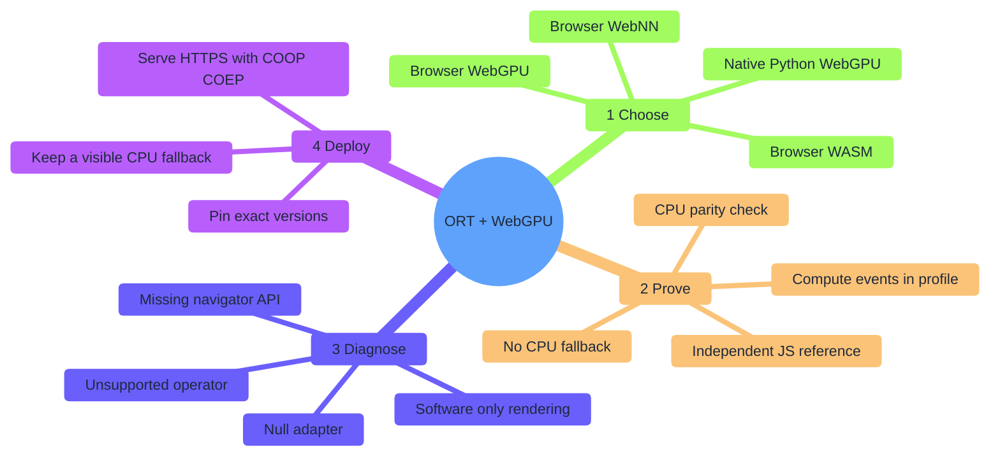
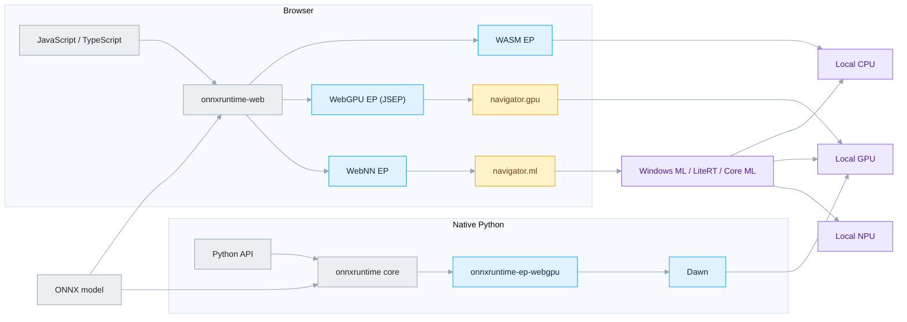
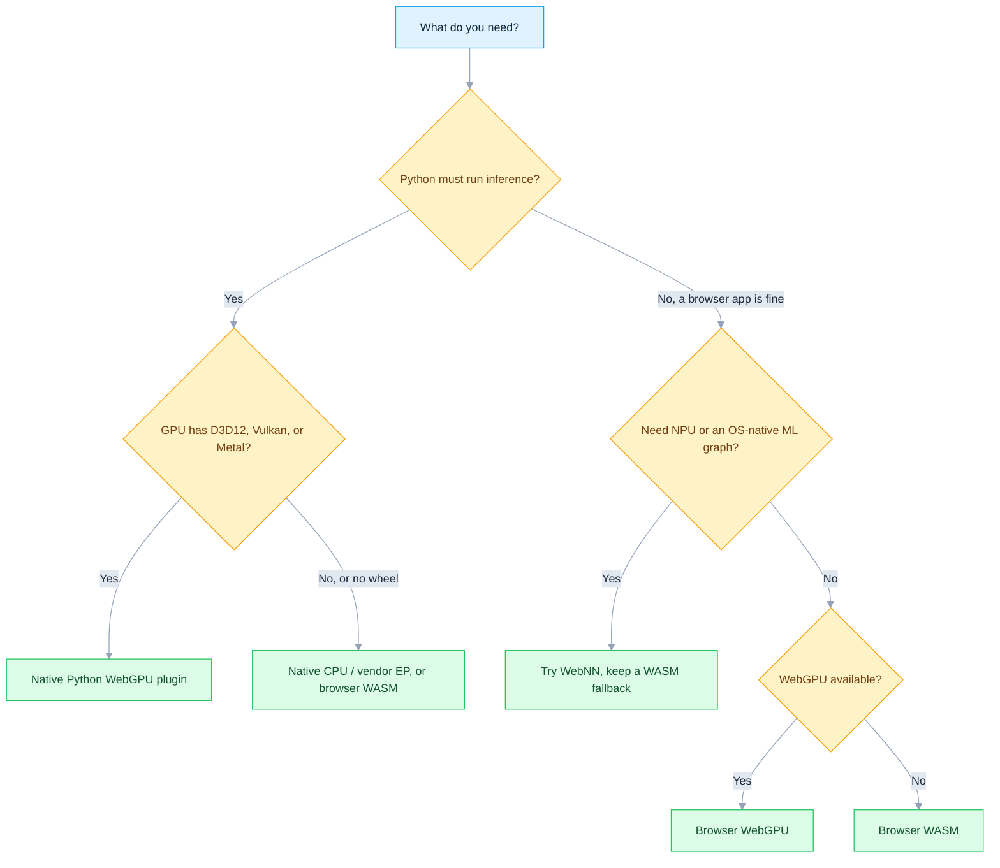
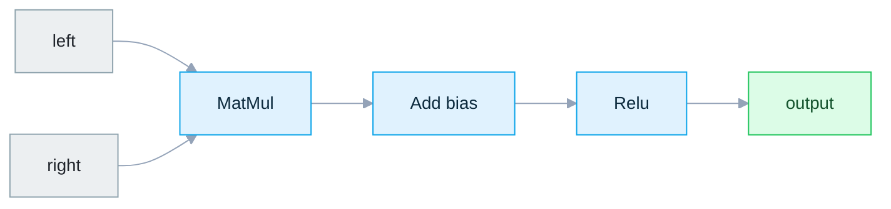
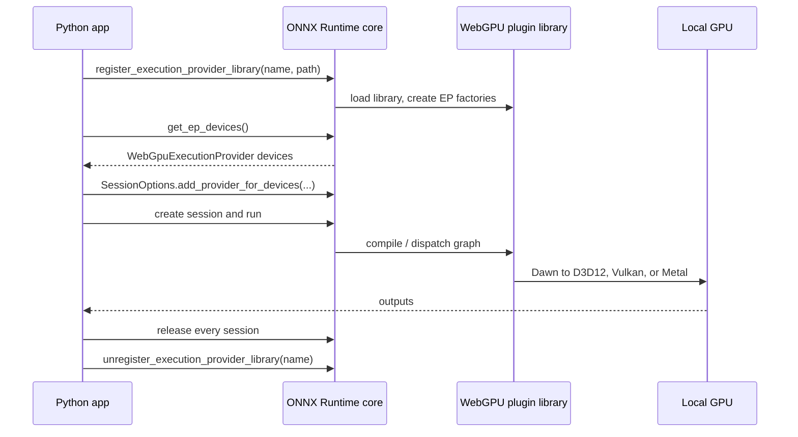
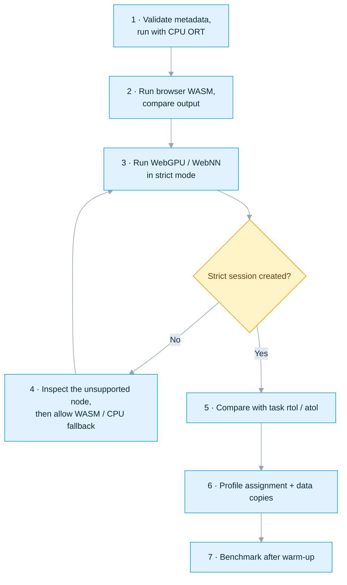
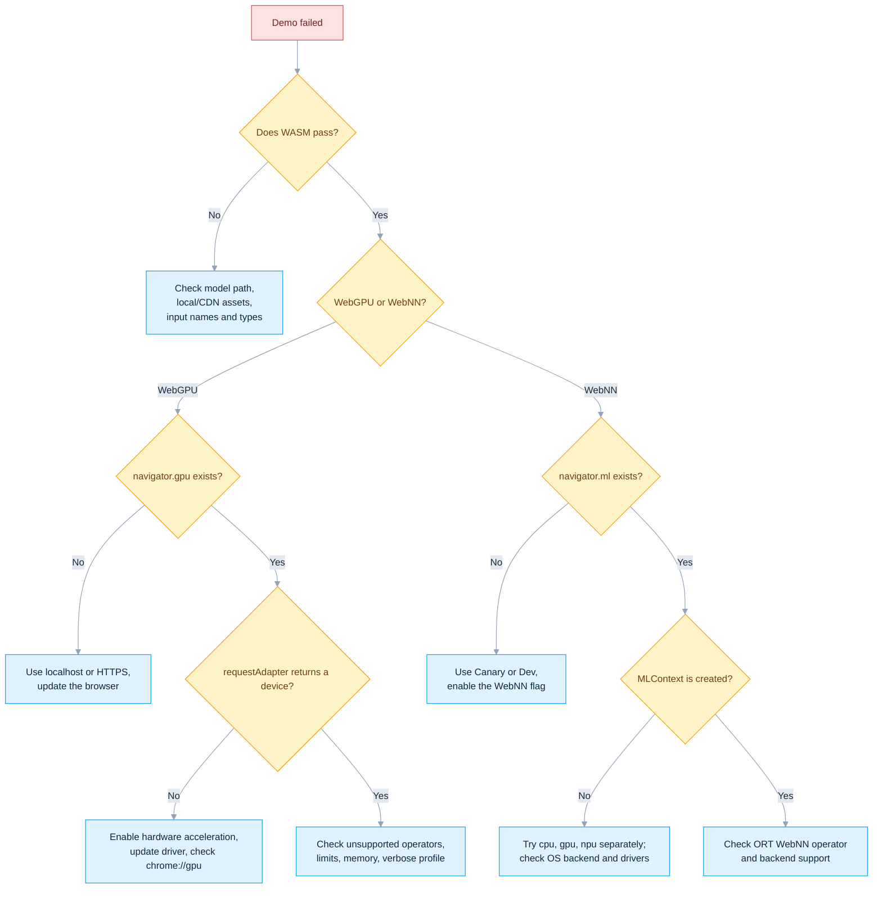

# ONNX Runtime + WebGPU: WASM, WebGPU, WebNN, and Native Python

[简体中文](README.zh-CN.md) · [Repository index](../README.md) · [Runnable demo](onnxruntime-web-demo/README.md)

| Item | Baseline |
|---|---|
| Last verified | `2026-07-17` |
| Hosts | Browser routes follow Windows/Linux/macOS browser support; native plugin support is narrower |
| Routes | Browser WASM, browser WebGPU, browser WebNN, native Python WebGPU |
| Runtime | `onnxruntime-web==1.27.0`, `onnxruntime==1.27.0`, `onnxruntime-ep-webgpu==0.1.0` |
| Entry points | `onnxruntime-web-demo/run_demo.bat` and `run_demo.sh` |
| Proof | Independent math reference, cross-provider parity, strict fallback policy, native profile events |

> [!NOTE]
> APIs and packages are checked directly against ONNX Runtime, npm, and PyPI. Platform availability follows the browser/OS vendors. WebGPU — and especially WebNN — changes fast, so recheck the linked live status pages before shipping.

| You are… | Start here |
|---|---|
| New here, want it running fast | [§4 Run the quick start](#4-run-the-quick-start) |
| Building a browser (JavaScript) app | [§6 Configure the browser route](#6-configure-the-browser-route) |
| Building a native Python app | [§7 Configure the native route](#7-configure-the-native-route) |
| Not sure the GPU is really being used | [§11 Troubleshoot](#11-troubleshoot) |
| Getting ready to ship | [§14 Production checklist](#14-production-checklist) |

### Release-channel snapshot

| Component | Latest installable stable | This guide | Upstream signal |
|---|---:|---:|---|
| ONNX Runtime Web (npm) | `1.27.0` | `1.27.0` | Date-stamped `dev` builds also exist on npm; not used here |
| ONNX Runtime core (PyPI) | `1.27.0` | `1.27.0` | Follow the next tagged release, not an unpaired nightly |
| Native WebGPU plugin (PyPI) | `0.1.0` | `0.1.0` | Source-tree `VERSION_NUMBER` already reads `0.3.0`, but it is not a published PyPI release |

This guide follows the newest **published stable** artifacts, not the highest version string visible in the source tree.

```bash
npm view onnxruntime-web version
python -m pip index versions onnxruntime
python -m pip index versions onnxruntime-ep-webgpu
```

A higher version number alone is not enough to upgrade the pins above — recheck the npm export map, wheel filenames, the plugin's minimum-core requirement, and rerun the strict demo first.

## Contents

- [1. Understand the four routes](#1-understand-the-four-routes)
- [2. Choose your route](#2-choose-your-route)
- [3. Check compatibility](#3-check-compatibility)
- [4. Run the quick start](#4-run-the-quick-start)
- [5. Prepare the host](#5-prepare-the-host)
- [6. Configure the browser route](#6-configure-the-browser-route)
- [7. Configure the native route](#7-configure-the-native-route)
- [8. Understand model fallback](#8-understand-model-fallback)
- [9. Tune I/O and performance](#9-tune-io-and-performance)
- [10. Deploy locally or offline](#10-deploy-locally-or-offline)
- [11. Troubleshoot](#11-troubleshoot)
- [12. Build from source (advanced)](#12-build-from-source-advanced)
- [13. References](#13-references)
- [14. Production checklist](#14-production-checklist)



## 1. Understand the four routes

| Route | Language | Runs where | Hardware path | Package |
|---|---|---|---|---|
| Browser WASM | JavaScript, hosted by Python | Browser | ORT compiled to WebAssembly → CPU | `onnxruntime-web` |
| Browser WebGPU | JavaScript, hosted by Python | Browser | ORT Web/JSEP → browser WebGPU → D3D12/Vulkan/Metal | `onnxruntime-web` |
| Browser WebNN | JavaScript, hosted by Python | Chromium preview | ORT Web → `navigator.ml` → Windows ML/LiteRT/Core ML → CPU/GPU/NPU | `onnxruntime-web` |
| Native WebGPU | **Python** | Native process | ONNX Runtime plugin API → WebGPU EP → Dawn → D3D12/Vulkan/Metal | `onnxruntime` + `onnxruntime-ep-webgpu` |

> [!IMPORTANT]
> **"Python + WebNN" is not native.** There is no published `onnxruntime-ep-webnn` Python package — WebNN is a **browser** standard (`navigator.ml`), not a Python one.
> - `python launch_demo.py webnn` opens a WebNN-enabled **browser**; JavaScript runs the model there.
> - `python launch_demo.py native-webgpu` is the only route that runs inference **inside Python**.
> - Do not install a similarly named unofficial package expecting native WebNN.



No model input ever leaves the machine for a cloud service. The first browser run may fetch the pinned ORT Web assets from jsDelivr unless `npm ci` already populated them locally.

## 2. Choose your route



> [!TIP]
> For a first test, run in this order: **WASM → WebGPU → WebNN**. It separates model bugs from accelerator/browser bugs.

## 3. Check compatibility

### 3.1 Practical OS matrix

Legend: ✅ expected · 🧪 preview, validate on the exact machine · ❌ no public route in this tutorial.

| OS | Browser WASM | Browser WebGPU | Browser WebNN | Native Python WebGPU |
|---|---:|---:|---:|---:|
| Windows 10/11 x64 | ✅ | ✅ Chrome/Edge | 🧪 Canary/flag; best on Windows 11 24H2+ | ✅ `win_amd64` wheel |
| Windows ARM64 | ✅ | 🧪 behind a Chromium flag | 🧪 | ❌ no ARM64 wheel in plugin 0.1.0 |
| Ubuntu/Linux x86-64 | ✅ | 🧪 depends on Chromium/GPU combo (below) | 🧪 not in ORT's validated matrix | ✅ manylinux glibc 2.27/2.28 x86-64 wheel |
| Linux ARM64 | ✅ | 🧪 browser/device dependent | 🧪 | ❌ no aarch64 wheel in plugin 0.1.0 |
| macOS 14+ Apple Silicon | ✅ | ✅ Chrome/Edge; Safari 26 has WebGPU but is not in ORT Web's matrix | 🧪 Canary/flag/Core ML, not validated by ORT | ✅ plugin universal2 + ORT core arm64 |
| macOS Intel | ✅ | ✅ on a still-supported Chrome/Edge + macOS version | 🧪 browser/device dependent | ❌ ORT 1.27.0 core has no macOS x86-64 wheel |

### 3.2 Browser support vs. ORT support

A browser can expose WebGPU/WebNN before ONNX Runtime Web has validated that browser/OS pairing. Both layers must pass:

| Layer | Check |
|---|---|
| Web API | `navigator.gpu` or `navigator.ml` exists and creates a device/context |
| ORT | That EP implements the model's operators and data types on that browser |

`onnxruntime-web 1.27.0`'s own compatibility table is conservative:

| EP | ORT Web documented browser support |
|---|---|
| WASM | Chrome/Edge, Safari, Firefox, single-threaded Node.js |
| WebGPU | Chrome/Edge on Windows, Android, macOS |
| WebNN | Chrome/Edge on Windows with `WebMachineLearningNeuralNetwork` enabled |

Broader real-world status moves faster:

- Chromium WebGPU has been stable on macOS/Windows x86/x64 and ChromeOS since milestone 113.
- Linux Chromium added selected Intel Gen12+ in 144, and NVIDIA driver 535.183.01+ on Wayland in 147; other Linux combos may still need flags.
- Safari 26 exposes WebGPU on macOS/iOS/iPadOS/visionOS 26 — that is not the same as an ORT Web guarantee.
- WebNN stays pre-stable/flagged. Its own docs list Windows ML, LiteRT, and Core ML backends; ORT's conservative matrix only validates Windows Chromium today.

### 3.3 Native plugin wheels (v0.1.0)

| Wheel | Platform | Architecture |
|---|---|---|
| `onnxruntime_ep_webgpu-0.1.0-py3-none-win_amd64.whl` | 64-bit Windows | x86-64 |
| `...manylinux_2_27_x86_64.manylinux_2_28_x86_64.whl` | glibc 2.27/2.28-compatible Linux | x86-64 |
| `...macosx_14_0_universal2.whl` | macOS 14+ | Intel + Apple Silicon |

| Fact | Detail |
|---|---|
| Plugin wheel requires | Python 3.11+; no hard `Requires-Dist` on an ONNX Runtime core package |
| Official minimum core | `onnxruntime` 1.24.4, checked at registration time |
| This guide pins | `onnxruntime==1.27.0` — a tested pair, not just the floor |
| Core wheel coverage | CPython 3.11–3.14; **macOS wheels are arm64-only** |
| Net effect | The full native route supports Apple Silicon, not Intel Mac — even though the plugin wheel itself is universal2 |

## 4. Run the quick start

### 4.1 Prerequisites

| Item | Minimum | Recommended |
|---|---|---|
| Python | 3.10+ for the browser launcher; 64-bit CPython 3.11–3.14 for the native stack | 64-bit CPython 3.12 |
| Node.js/npm | Not needed with the pinned CDN; needed to build local/offline assets | Current LTS, then `npm ci` |
| Browser | Current Chrome or Edge | Stable for WebGPU; Canary/Dev for WebNN |
| GPU driver | Must expose D3D12, Vulkan, or Metal | Latest stable vendor driver |
| Network | Needed if local assets/wheels are missing, or for first-time Windows ML setup | Run `npm ci` once |
| Model | Valid ONNX model | Start with the included `execution_provider_demo.onnx` |

> [!WARNING]
> Do not double-click the HTML file. `file://` is not a secure context and cannot use WebGPU/WebNN correctly. The launcher serves `http://127.0.0.1`, which browsers trust.

### 4.2 Open the demo folder

```bash
cd WebGPU/onnxruntime-web-demo
```

The checked-in model is deliberately tiny and uses only operators every route supports:

| Value | Kind | Type | Shape |
|---|---|---|---|
| `left` | Input | `float32` | `[1, 4, 128, 128]` |
| `right` | Input | `float32` | `[1, 4, 128, 128]` |
| `output` | Output | `float32` | `[1, 4, 128, 128]` |

418 bytes · ONNX IR 13 · opset 17 · SHA-256 `db8b8de41d85f7ea2df7e4ecb4dc62150fb8a6b3a30753f1659e5b3af47b5efd`



| Demo file | Purpose |
|---|---|
| `execution_provider_demo.onnx` | Checked-in cross-provider demo model |
| `browser-demo.html` + `browser-demo.js` | Browser preflight, inference, parity, and timing UI |
| `launch_demo.py` | Local HTTP server, browser discovery/launch, native-mode dispatch |
| `native_webgpu_validator.py` | Native plugin registration, strict assignment, CPU parity, profiling, cleanup |
| `run_demo.bat` / `run_demo.sh` | Windows and Ubuntu/macOS one-click wrappers |

### 4.3 One-click commands

| Route | Windows | Linux / macOS |
|---|---|---|
| WASM | `run_demo.bat wasm` | `bash run_demo.sh wasm` |
| Browser WebGPU | `run_demo.bat webgpu` | `bash run_demo.sh webgpu` |
| Browser WebNN | `run_demo.bat webnn --device gpu` | `bash run_demo.sh webnn --device gpu` |
| Native WebGPU | `run_demo.bat native-webgpu --iterations 20` | `bash run_demo.sh native-webgpu --iterations 20` |

No arguments defaults to browser WebGPU (`bash run_demo.sh`). Other WebNN devices:

| Device | Flag | Note |
|---|---|---|
| GPU | `--device gpu` | Default choice to test first |
| CPU | `--device cpu` | Always-available reference |
| NPU | `--device npu` | Confirm an NPU-capable backend/EP first via WebNN Report or Chromium histograms |

The native command creates `.venv-webgpu`, installs the pinned packages, discovers WebGPU devices, disables CPU fallback by default, compares results against the CPU EP, and inspects the ORT profile for real `WebGpuExecutionProvider` compute events.

> [!NOTE]
> Use `--allow-cpu-fallback` only with a diagnostic `--model` that keeps the included smoke model's input contract; adapting arbitrary models is outside this validator.

### 4.4 Direct Python launcher

| Goal | Windows | Ubuntu/macOS |
|---|---|---|
| WASM | `py -3 launch_demo.py wasm` | `python3 launch_demo.py wasm` |
| WebGPU browser | `py -3 launch_demo.py webgpu` | `python3 launch_demo.py webgpu` |
| WebNN browser GPU | `py -3 launch_demo.py webnn --device gpu` | `python3 launch_demo.py webnn --device gpu` |
| Allow unsupported nodes on WASM | `py -3 launch_demo.py webgpu --allow-wasm-fallback` | `python3 launch_demo.py webgpu --allow-wasm-fallback` |
| Native WebGPU (auto-creates `.venv-webgpu`) | `py -3.12 launch_demo.py native-webgpu` | `python3.12 launch_demo.py native-webgpu` |

The browser server stays open until `Ctrl+C`. If auto-discovery fails, paste the printed URL into Chrome/Edge, or pass `--browser` with an executable path. For native routes, swap `3.12` for any installed `3.11`/`3.13`/`3.14` — the wrappers detect a supported interpreter automatically.

`--allow-wasm-fallback` is **node-level** fallback *after* WebGPU/WebNN already initialized. It does not turn a machine with no adapter/`navigator.ml` into a passing accelerator test.

WebNN uses an isolated temporary browser profile with `WebMachineLearningNeuralNetwork` enabled automatically:

| `--webnn-backend` | Effect |
|---|---|
| `auto` (default) | LiteRT below Windows build 26100; Chromium's platform default elsewhere |
| `litert` | Force `WebNNLiteRT`, disabling higher-priority platform backends |
| `platform` | Keep all platform backends at Chromium defaults |

Chromium removed the standalone `WebNNDirectML` backend in milestone 149 (DirectML now routes through ORT); older builds still recognize the name and current builds safely ignore it. With `--no-open`, apply the printed feature policy to your own browser manually.

### 4.5 What success looks like

Browser success — the independent JavaScript `MatMul → Add → Relu` reference passed, plus a WASM comparison for accelerator routes:

```text
PASS: WEBGPU local inference and output validation completed.
```

Native success — numerical parity, real compute nodes in the profile, zero CPU node events in strict mode:

```text
PASS ... max_abs_diff=...
PASS: ... event(s), including ... unique compute node(s), ran on WebGpuExecutionProvider.
PASS: native WebGPU plugin inference is working.
```

> [!NOTE]
> Fast timing alone is **not** proof. `Active providers: ['WebGpuExecutionProvider', 'CPUExecutionProvider']` is normal — ORT may register its default CPU provider even with fallback disabled. Judge fallback by CPU **profile events** or a strict session-creation failure, not by that list.

### 4.6 Verification record

| Date | Check | Result |
|---|---|---|
| 2026-07-18 | Cross-checked every WebGPU (`webgpu_provider_options.h`, `webgpu_execution_provider.h`, `webgpu_context.h`) and WebNN (`webnn_provider_factory.cc`, `webnn_execution_provider.h`/`.cc`, ORT Web `inference-session.ts`) provider option against the current `main`-branch source | PASS — all 22 native WebGPU keys and every WebNN option shape matched this guide; corrected one note (the native WebNN EP hardcodes `NCHW`, `deviceType` does not select layout) |
| 2026-07-17 | Stable registries, wheel metadata, installed npm package, tagged plugin source | PASS — latest stable stays ORT Web/core 1.27.0 + plugin 0.1.0; newer plugin source versions are not yet on PyPI |
| 2026-07-16 | Local browser WASM, ORT Web 1.27.0, COOP/COEP, 4 threads | PASS using local npm assets |
| 2026-07-16 | `launch_demo.py native-webgpu`, Linux x86-64, Python 3.13.14 | PASS — plugin discovered NVIDIA and Intel adapters |
| 2026-07-16 | Native strict runs on both discovered adapters | PASS on both — `MatMul`/`Add`/`Relu` profiled on `WebGpuExecutionProvider`, zero CPU node events, CPU parity held |
| 2026-07-16 | Browser WebGPU, VS Code integrated browser + local Chrome 150 | Both correctly reported a null adapter — neither counts as browser-GPU proof |
| 2026-07-16 | Browser WebNN, Chrome 150 on Linux | `navigator.ml` was exposed, but context creation reported WebNN unsupported on this headless/Linux config — diagnostics validated, not a hardware pass |
| 2026-07-16 | Windows and macOS commands | Checked against official wheel metadata/docs; still need a run on real target hardware |

## 5. Prepare the host

### 5.1 Windows

**Browser WebGPU**

| Step | Action |
|---|---|
| 1 | Install all Windows updates |
| 2 | Install the current Intel, NVIDIA, AMD, or Qualcomm driver |
| 3 | Install/update 64-bit Chrome or Edge |
| 4 | Enable **Use graphics acceleration when available** in `chrome://settings/system`, then relaunch |
| 5 | Confirm **WebGPU: Hardware accelerated** in `chrome://gpu` |
| 6 | Run `run_demo.bat webgpu` |

> [!NOTE]
> Dual-GPU laptops may default to the integrated GPU. Use **Settings → System → Display → Graphics** to force the browser to **High performance**, or try `chrome://flags/#force-high-performance-gpu`. Windows ARM64 Chromium WebGPU still needs `chrome://flags/#enable-unsafe-webgpu`; the native plugin has no ARM64 wheel.

**Browser WebNN**

| Step | Action |
|---|---|
| 1 | Prefer Windows 11 24H2 (build 26100)+ for Windows ML and vendor NPU EPs |
| 2 | Install the latest Chrome Canary or Edge Canary |
| 3 | Run `run_demo.bat webnn --device gpu` (or `npu`) — an isolated profile already carries the required flag |
| 4 | On first 24H2+ launch, stay online while Chromium installs the Windows App Runtime and EPs; retry after it finishes |
| 5 | Check <https://webnnreport.org/> and `chrome://histograms/` (search `WebNN`) — `WebNN.ORT.WinAppRuntimeInstallState` values `2` or `9` mean success |

Launching manually instead of via script: enable **Enables WebNN API** in `chrome://flags` or `edge://flags`, then relaunch. See [§4.4](#4-run-the-quick-start) for `--webnn-backend` values. A created `MLContext` only proves API availability, not that every node ran on an NPU.

**Native Python WebGPU**

- The public wheel is Windows x64 only, using Dawn over D3D12/Vulkan — no browser API involved.
- Run the one-click native command directly.
- Zero discovered devices → update the GPU driver and confirm the GPU is visible to the current desktop/session (remote/virtual sessions can hide it).

### 5.2 Ubuntu/Linux

**Driver and Vulkan preflight**

```bash
sudo apt update
sudo apt install mesa-vulkan-drivers vulkan-tools pciutils
vulkaninfo --summary
```

NVIDIA: install the supported proprietary driver via **Software & Updates → Additional Drivers** or NVIDIA's own repo — do not replace it with Mesa. Confirm the active adapter:

```bash
lspci -k | grep -EA3 'VGA|3D|Display'
vulkaninfo --summary
```

If `vulkaninfo` fails, native WebGPU and Vulkan-backed browser WebGPU are unlikely to work. Containers need explicit GPU device/driver passthrough.

**Browser WebGPU on Linux**

Intel Gen12+ has worked since Chromium 144; NVIDIA driver 535.183.01+ on Wayland since 147. Other combinations may need a development-only launch:

```bash
bash run_demo.sh webgpu \
  --browser-arg=--enable-unsafe-webgpu \
  --browser-arg=--ozone-platform=x11 \
  --browser-arg=--use-angle=vulkan \
  --browser-arg=--enable-features=Vulkan,VulkanFromANGLE
```

> [!WARNING]
> These flags bypass browser safety checks — development only. Always confirm in `chrome://gpu`; **Software only** is never a valid acceleration result.

**WebNN on Linux** — not in ORT Web 1.27.0's compatibility table, even though WebNN's own docs map Linux to LiteRT. The one-click command enables the API in an isolated profile; pass `--webnn-backend litert` only to deliberately force it. Treat as experimental and keep a WASM fallback.

**Native plugin on Linux** — x86-64 only, needs a glibc compatible with manylinux 2.27/2.28, uses Vulkan through Dawn. WSL, minimal containers, aarch64, and old distros may need a source build.

### 5.3 macOS

| Step | Action |
|---|---|
| 1 | Update macOS and the browser — WebGPU maps to Metal, no separate Vulkan package needed |
| 2 | Chrome/Edge WebGPU is the conservative ORT Web choice |
| 3 | Run `bash run_demo.sh webgpu` |
| 4 | For WebNN, use Canary/Dev and enable **Enables WebNN API**; treat Core ML routing as preview |
| 5 | Native Python needs macOS 14+ Apple Silicon; Intel Macs can still use every browser route |

> [!NOTE]
> Safari 26 implements WebGPU generally, but ONNX Runtime Web's documented matrix still marks Safari WebGPU unsupported. It may work in a specific build — do not claim production support without your own test suite.

## 6. Configure the browser route

### Install and pick a bundle

```bash
npm install --save-exact onnxruntime-web@1.27.0
```

| Need | Import | Script bundle |
|---|---|---|
| WASM only | `onnxruntime-web/wasm` | `ort.wasm.min.js` |
| WebGPU only | `onnxruntime-web/webgpu` | `ort.webgpu.min.js` |
| One build for WASM/WebGPU/WebNN | `onnxruntime-web/all` | `ort.all.min.js` |

The published 1.27.0 export map has `./all`, not `./experimental` (some generic ORT pages still mention the latter) — this demo uses `onnxruntime-web/all` / `ort.all.min.js`.

```html
<script src="https://cdn.jsdelivr.net/npm/onnxruntime-web@1.27.0/dist/ort.all.min.js"></script>
```

Set environment flags **before creating the first session**:

```js
ort.env.logLevel = 'warning';
ort.env.wasm.numThreads = globalThis.crossOriginIsolated ? 4 : 1;
ort.env.wasm.proxy = false; // proxy worker cannot combine with WebGPU
```

### WASM session

```js
const session = await ort.InferenceSession.create('./model.onnx', {
  executionProviders: ['wasm'],
  graphOptimizationLevel: 'all',
});
```

Multi-threaded WASM needs cross-origin isolation:

```text
Cross-Origin-Opener-Policy: same-origin
Cross-Origin-Embedder-Policy: require-corp
```

The included Python server sends both headers. Without them, set `ort.env.wasm.numThreads = 1`.

### WebGPU session

```js
const adapter = await navigator.gpu.requestAdapter({
  powerPreference: 'high-performance',
});
if (!adapter) throw new Error('No WebGPU adapter');
const device = await adapter.requestDevice();

const session = await ort.InferenceSession.create('./model.onnx', {
  executionProviders: [{
    name: 'webgpu',
    device,                                     // reuse the adapter's GPUDevice (optional — ORT creates its own if omitted)
    preferredLayout: 'NCHW',                    // 'NCHW' | 'NHWC', browser default 'NCHW' (native Python default is 'NHWC', see §7)
    forceCpuNodeNames: [],                      // node names that must stay on CPU even while WebGPU EP is active
    validationMode: 'basic',                    // 'disabled' | 'wgpuOnly' | 'basic' (default) | 'full'
    storageBufferCacheMode: 'bucket',           // 'disabled' | 'lazyRelease' | 'simple' | 'bucket' (default)
    uniformBufferCacheMode: 'simple',           // same 4 modes, default 'simple'
    queryResolveBufferCacheMode: 'disabled',    // same 4 modes, default 'disabled' (profiling buffers)
    defaultBufferCacheMode: 'disabled',         // same 4 modes, default 'disabled' (anything else)
  }],
  graphOptimizationLevel: 'all',
  preferredOutputLocation: 'cpu',               // or 'gpu-buffer' to keep outputs device-resident, see §9
  enableGraphCapture: false,                    // capture/replay for static-shape graphs fully on WebGPU, see §8
  extra: {session: {disable_cpu_ep_fallback: '1'}}, // strict proof mode: fail instead of silently falling back to CPU
});
```

Every field above is optional; this lists every key `WebGpuExecutionProviderOption` accepts in ORT Web 1.27.0's [`inference-session.ts`](https://github.com/microsoft/onnxruntime/blob/main/js/common/lib/inference-session.ts) — omit any you don't need to keep its default. `ort.env.webgpu.adapter`/`powerPreference` still work in 1.27.0 but are deprecated; passing a `GPUDevice` in EP options is the current pattern. For explicit unsupported-op fallback:

```js
executionProviders: [{name: 'webgpu', device, validationMode: 'basic'}, 'wasm']
```

> [!NOTE]
> Listing only `webgpu` is not proof every node stayed on the GPU. This demo also sets `disable_cpu_ep_fallback=1` and profiles compute kernels — do that before benchmarking.

### WebNN session

WebNN options come in three mutually exclusive shapes — see the `WebNNExecutionProviderOption` union in [`inference-session.ts`](https://github.com/microsoft/onnxruntime/blob/main/js/common/lib/inference-session.ts):

| Shape | Fields | When to use |
|---|---|---|
| No `MLContext` | `deviceType`, `numThreads`, `powerPreference` | Simplest — let ORT create the `MLContext` for you |
| Pre-created `MLContext` | `context`, `deviceType` (required), `numThreads`, `powerPreference` | Share one `MLContext`/`MLTensor` across a preflight check and the ORT session |
| `MLContext` from a `GPUDevice` | `context`, `gpuDevice` | Interop — the same physical GPU backs both a WebGPU session and a WebNN session |

```js
const session = await ort.InferenceSession.create('./model.onnx', {
  executionProviders: [{
    name: 'webnn',
    deviceType: 'gpu',                    // 'cpu' | 'gpu' | 'npu' — which WebNN device class to target
    numThreads: 4,                        // optional thread-count hint (W3C MLContextOptions)
    powerPreference: 'high-performance',  // 'default' | 'low-power' | 'high-performance'
  }],
});
```

Sharing `MLTensor` needs a pre-created context. ORT Web 1.27's TypeScript declaration still requires `deviceType` even with `context` supplied:

```js
if (!navigator.ml) throw new Error('WebNN is unavailable');
const context = await navigator.ml.createContext({
  deviceType: 'gpu',
  powerPreference: 'high-performance',
});
const session = await ort.InferenceSession.create('./model.onnx', {
  executionProviders: [{name: 'webnn', deviceType: 'gpu', context}],
});
```

This demo uses the second form so the preflight and the ORT session share one `MLContext`. The third shape builds the `MLContext` straight from an existing `GPUDevice` instead of a `deviceType` string — only useful when a WebGPU session already owns that device:

```js
const context = await navigator.ml.createContext(device); // device = a GPUDevice, e.g. from adapter.requestDevice()
const session = await ort.InferenceSession.create('./model.onnx', {
  executionProviders: [{name: 'webnn', context, gpuDevice: device}],
});
```

> [!NOTE]
> These JS-level fields only configure the browser's `navigator.ml.createContext()` call. The compiled WebNN EP itself ([`webnn_provider_factory.cc`](https://github.com/microsoft/onnxruntime/blob/main/onnxruntime/core/providers/webnn/webnn_provider_factory.cc)) receives exactly one native option — `deviceType` — forwarded through `provider_options.at("deviceType")` and read once at provider construction to pick the supported-operator set (`WebnnDeviceType` in [`webnn_execution_provider.cc`](https://github.com/microsoft/onnxruntime/blob/main/onnxruntime/core/providers/webnn/webnn_execution_provider.cc)). Unlike the WebGPU EP's configurable `preferredLayout`, the native WebNN EP always hardcodes `NCHW` as its preferred layout ([`webnn_execution_provider.h`](https://github.com/microsoft/onnxruntime/blob/main/onnxruntime/core/providers/webnn/webnn_execution_provider.h) — `GetPreferredLayout()` unconditionally returns `DataLayout::NCHW`) — no provider option changes that. Everything else stays a browser-side concern.

### Run and clean up

```js
const feeds = {
  input: new ort.Tensor('float32', inputData, [1, 3, 224, 224]),
};
let results;
try {
  results = await session.run(feeds);
  const values = await results.output.getData();
  // Consume values here.
} finally {
  for (const tensor of Object.values(results ?? {})) tensor.dispose?.();
  for (const tensor of Object.values(feeds)) tensor.dispose?.();
  await session.release();
}
```

Dispose ORT-owned outputs and sessions explicitly. For a tensor wrapping a user-owned `GPUBuffer`/`MLTensor`, keep it alive through inference and destroy it yourself (§9) — otherwise long-running pages leak device memory.

## 7. Configure the native route

A plugin EP must be dynamically registered, then its `OrtEpDevice` selected and attached to `SessionOptions` — unlike a built-in provider name string.



> [!WARNING]
> Never unregister the library while a session using it still exists.

### Manual isolated install

64-bit CPython 3.11–3.14. Supports Windows x64, Linux x86-64 (glibc 2.27+), and macOS 14+ Apple Silicon — not native Python on an Intel Mac.

Windows PowerShell:

```powershell
py -3.12 -m venv .venv-webgpu
.\.venv-webgpu\Scripts\python.exe -m pip install --upgrade pip
.\.venv-webgpu\Scripts\python.exe -m pip install -r requirements-native-webgpu.txt
.\.venv-webgpu\Scripts\python.exe native_webgpu_validator.py
```

Ubuntu/macOS:

```bash
python3.12 -m venv .venv-webgpu
.venv-webgpu/bin/python -m pip install --upgrade pip
.venv-webgpu/bin/python -m pip install -r requirements-native-webgpu.txt
.venv-webgpu/bin/python native_webgpu_validator.py
```

The launcher and both one-click wrappers do this automatically and reuse the environment once the pinned versions are verified.

### Minimal plugin API pattern

```python
import numpy as np
import onnxruntime as ort
import onnxruntime_ep_webgpu as webgpu_ep

registration = "my_webgpu_plugin"
ort.register_execution_provider_library(registration, webgpu_ep.get_library_path())
try:
    devices = [
        d for d in ort.get_ep_devices()
        if d.ep_name == webgpu_ep.get_ep_name()
    ]
    if not devices:
        raise RuntimeError("No WebGPU device was discovered")

    options = ort.SessionOptions()
    options.add_session_config_entry("session.disable_cpu_ep_fallback", "1")
    options.add_provider_for_devices([devices[0]], {
        "preferredLayout": "NCHW",
        "powerPreference": "high-performance",
        "validationMode": "basic",
    })
    shape = (1, 4, 128, 128)
    positions = np.arange(np.prod(shape), dtype=np.float32)
    feeds = {
        "left": (np.sin(positions * 0.01) * 0.25).reshape(shape),
        "right": (np.cos(positions * 0.013) * 0.25).reshape(shape),
    }
    session = ort.InferenceSession("execution_provider_demo.onnx", sess_options=options)
    try:
        outputs = session.run(None, feeds)
        print(outputs[0].dtype, outputs[0].shape)
    finally:
        del session
finally:
    ort.unregister_execution_provider_library(registration)
```

`ort.get_available_providers()` lists providers built into the core package — it is not the pre-registration test for this plugin. Register first, then inspect `ort.get_ep_devices()`.

### Native options used by the demo

| Option | Values/default | Meaning |
|---|---|---|
| `--model` | `execution_provider_demo.onnx` | Swap only for a model keeping `left`/`right` float32 `[1,4,128,128]` inputs |
| `--device-index` | `0` | Select one discovered WebGPU device |
| `--layout` | `NCHW` / `NHWC` | Preferred layout for layout-sensitive kernels |
| `--power-preference` | `high-performance` / `low-power` | Dawn adapter hint |
| `--validation-mode` | `disabled`, `wgpuOnly`, `basic`, `full` | Validation/diagnostic cost |
| `--allow-cpu-fallback` | off by default | Permit unsupported nodes on CPU |
| `--warmups` | `2` | Runs excluded from benchmark (`--warmup` is an alias) |
| `--iterations` | `10` | Measured runs |
| `--keep-profile` | off | Copy the ORT JSON profile into the demo folder |

### All native WebGPU provider options (from source)

The demo's CLI flags above cover common cases. The plugin EP itself accepts every key defined in ONNX Runtime's [`webgpu_provider_options.h`](https://github.com/microsoft/onnxruntime/blob/main/onnxruntime/core/providers/webgpu/webgpu_provider_options.h), passed as its short name (no `ep.webgpuexecutionprovider.` prefix) in the dict given to `add_provider_for_devices(devices, {...})`. Defaults below are the native C++ defaults from [`webgpu_execution_provider.h`](https://github.com/microsoft/onnxruntime/blob/main/onnxruntime/core/providers/webgpu/webgpu_execution_provider.h) and [`webgpu_context.h`](https://github.com/microsoft/onnxruntime/blob/main/onnxruntime/core/providers/webgpu/webgpu_context.h) — some differ from the browser JS defaults in §6.

| Key | Default (native) | Accepted values | What it controls |
|---|---|---|---|
| `preferredLayout` | `NHWC` | `NCHW` \| `NHWC` | Layout for layout-sensitive kernels. Browser JS default is `NCHW` — the two routes disagree, check both. |
| `enableInt64` | `"0"` (off) | `"0"` \| `"1"` | Run `int64` ops natively instead of the default emulation/downcast path. |
| `kvCacheQuantizationBits` | `"0"` (off) | `"0"` \| `"4"` | Quantize the KV cache to 4-bit for transformer decode loops. |
| `multiRotaryCacheConcatOffset` | `0` | non-negative integer | Offset for concatenated multi-rotary (RoPE) caches used by some LLM kernels. |
| `deviceId` | `0` | integer | Key used to create/reuse a `WebGpuContext` instance. Not the same as the demo's `--device-index` (which selects among `ort.get_ep_devices()`) — leave this at `0` unless you manage multiple contexts yourself. |
| `powerPreference` | `high-performance` | `high-performance` \| `low-power` | Dawn adapter selection hint. |
| `dawnBackendType` | platform default (Windows: `D3D12` or `Vulkan` depending on the build; other OSes: Dawn auto-selects) | `D3D12` \| `Vulkan` | Force Dawn's graphics backend. macOS always uses Metal internally and has no string value here. |
| `webgpuInstance` | unset | decimal native `WGPUInstance` pointer | Reuse an already-created Dawn instance instead of letting ORT create one. |
| `webgpuDevice` | unset | decimal native `WGPUDevice` pointer | Reuse an already-created Dawn device instead of letting ORT create one. |
| `dawnProcTable` | unset | decimal native `DawnProcTable` pointer | Supply a custom Dawn proc table, e.g. from a host app that already links Dawn. |
| `validationMode` | `full` in debug builds, `basic` in release builds | `disabled` \| `wgpuOnly` \| `basic` \| `full` | Amount of WebGPU/ORT validation performed; `full` costs the most and is for debugging only. |
| `forceCpuNodeNames` | empty | node names separated by `\n` (one per line) | Force specific nodes onto the CPU EP even while WebGPU EP is active — a diagnostic escape hatch, not a comma-separated list. |
| `enablePIXCapture` | `"0"` (off) | `"0"` \| `"1"` | Enable Windows PIX GPU-capture instrumentation (needs a PIX-enabled build). |
| `preserveDevice` | `"0"` (off) | `"0"` \| `"1"` | Keep the GPU device alive across session release instead of tearing it down — useful when a process opens many short-lived sessions on the same device. |
| `enableGraphCapture` | `"0"` (off) | `"0"` \| `"1"` | Capture/replay the compute graph for repeated static-shape runs, see §8. |
| `sessionBufferPoolGenerations` | `1` | non-negative integer, `0` disables | Generations of intermediate buffers retained in a per-session pool for reuse across captured-graph replays. |
| `storageBufferCacheMode` | `bucket` | `disabled` \| `lazyRelease` \| `simple` \| `bucket` | Reuse policy for storage buffers. `simple` can cut GPU memory for static-shape models, see §9. |
| `uniformBufferCacheMode` | `simple` | same 4 modes | Reuse policy for uniform buffers. |
| `queryResolveBufferCacheMode` | `disabled` | same 4 modes | Reuse policy for profiling query-resolve buffers. |
| `defaultBufferCacheMode` | `disabled` | same 4 modes | Reuse policy for any buffer not covered by the three options above. |
| `maxStorageBufferBindingSize` | `0` (use the adapter's own limit) | `0`, or an integer ≥ `134217728` (128 MB) | Override the max storage-buffer binding size requested from the device. |
| `maxNumPendingDispatches` | `16` | integer, `1`–`4096` | GPU dispatches queued before ORT forces a flush/sync; also sizes the profiling query buffer. |

```python
# Every key the native WebGPU plugin EP understands, with its native default and meaning.
# Pass only the keys you want to change to add_provider_for_devices(devices, provider_options) —
# every key left out keeps the default shown here.
provider_options = {
    # --- Layout & precision -----------------------------------------------
    "preferredLayout": "NCHW",                  # NCHW | NHWC (native default: NHWC)
    "enableInt64": "0",                         # "0" | "1" (default off)
    "kvCacheQuantizationBits": "0",             # "0" | "4" (default off)
    "multiRotaryCacheConcatOffset": "0",        # non-negative integer (default 0 = disabled)

    # --- Device & Dawn interop ---------------------------------------------
    "deviceId": "0",                            # WebGpuContext key/index (default 0)
    "powerPreference": "high-performance",      # high-performance | low-power
    "dawnBackendType": "Vulkan",                # D3D12 | Vulkan (omit to let Dawn auto-select, e.g. Metal on macOS)
    "webgpuInstance": "0",                      # decimal WGPUInstance pointer, 0/omit = ORT creates one
    "webgpuDevice": "0",                        # decimal WGPUDevice pointer, 0/omit = ORT creates one
    "dawnProcTable": "0",                       # decimal DawnProcTable pointer, 0/omit = default

    # --- Validation & diagnostics --------------------------------------------
    "validationMode": "basic",                  # disabled | wgpuOnly | basic (release default) | full
    "forceCpuNodeNames": "",                    # node names separated by \n, empty = none forced
    "enablePIXCapture": "0",                    # "0" | "1" (default off, Windows only)
    "preserveDevice": "0",                      # "0" | "1" (default off)

    # --- Graph capture & buffer pooling ---------------------------------------
    "enableGraphCapture": "0",                  # "0" | "1" (default off)
    "sessionBufferPoolGenerations": "1",        # non-negative integer (default 1, 0 disables)

    # --- Buffer cache modes: disabled | lazyRelease | simple | bucket ---------
    "storageBufferCacheMode": "bucket",         # default bucket
    "uniformBufferCacheMode": "simple",         # default simple
    "queryResolveBufferCacheMode": "disabled",  # default disabled
    "defaultBufferCacheMode": "disabled",       # default disabled

    # --- Limits --------------------------------------------------------------
    "maxStorageBufferBindingSize": "0",         # "0" = adapter default, else >= 134217728 (128 MB)
    "maxNumPendingDispatches": "16",            # 1-4096 (default 16)
}
options.add_provider_for_devices([devices[0]], provider_options)
```

> [!NOTE]
> `deviceId` (a `WebGpuContext` cache key) is unrelated to the demo's `--device-index` CLI flag (which selects an entry from `ort.get_ep_devices()`) — do not confuse the two. Change one option at a time so a regression is easy to bisect. `webgpuInstance`/`webgpuDevice`/`dawnProcTable` take decimal native pointers, not browser objects, and only matter when embedding ORT in an app that already owns a Dawn instance/device.

The validator defaults to `validationMode=basic` with profiling always on — it favors proof over peak speed. Get a strict PASS first; use `--validation-mode disabled` only to isolate validation overhead, in a separate non-profiling harness for real benchmarks. Reported latency is end-to-end `session.run()` including upload/readback, not GPU-kernel-only time.

## 8. Understand model fallback

A valid ONNX file does not mean every EP supports every operator/type/shape.

| Check | WASM | WebGPU | WebNN |
|---|---|---|---|
| ONNX operator coverage | Best | Subset, growing | Subset mapped to WebNN ops |
| Dynamic shapes | Usually fine | Can reduce optimization/graph capture | Prefer `freeDimensionOverrides` |
| `float16` | Often slow on CPU | Browser/device dependent | Backend/device dependent |
| `int64` | Supported | Limited/native-option dependent | Common incompatibility source |
| Quantized ops | Broad, model dependent | Check the current operator table | Check WebNN/backend tables |
| Device-resident I/O | CPU tensors | `GPUBuffer` / `gpu-buffer` | `MLTensor` / `ml-tensor` |



For dynamic dimensions:

```js
freeDimensionOverrides: {batch: 1, height: 224, width: 224}
```

Each key must exactly match a `dim_param` stored in the ONNX model — invented axis names are silently ignored.

Graph capture only fits stable shapes fully assigned to WebGPU, and needs externally supplied `gpu-buffer` inputs/outputs — enabling `enableGraphCapture: true` while still feeding CPU tensors fails. This demo leaves it disabled.

## 9. Tune I/O and performance

Inputs/outputs default to CPU memory; end-to-end timing includes upload/readback.

| Goal | WebGPU | WebNN |
|---|---|---|
| Device input | `ort.Tensor.fromGpuBuffer(...)` | `ort.Tensor.fromMLTensor(...)` |
| Keep outputs on device | `preferredOutputLocation: 'gpu-buffer'` | `preferredOutputLocation: 'ml-tensor'` |
| Read to CPU | `await tensor.getData()` | `await tensor.getData()` or `mlContext.readTensor()` |
| Ownership | User destroys a user-owned buffer; dispose ORT-owned outputs | User destroys a user-owned `MLTensor`; dispose ORT-owned outputs |

Do not compare a GPU-resident kernel benchmark against this demo's CPU-output end-to-end latency — they answer different questions.

```js
ort.env.webgpu.profiling = {
  mode: 'default',
  ondata: data => console.log(data),
};
ort.env.logLevel = 'verbose';
ort.env.debug = true;
```

Configure profiling before creating the device/session. Request `timestamp-query` only when the adapter advertises it. Enable diagnostics only while debugging — verbose logging distorts benchmarks.

## 10. Deploy locally or offline

The demo loader tries, in order: (1) `node_modules/onnxruntime-web/dist/ort.all.min.js`, then (2) pinned jsDelivr `1.27.0`.

```bash
npm ci
python3 launch_demo.py webgpu
```

`npm ci` needs the committed lockfile and Node.js/npm; skip it if the pinned CDN is acceptable.

The `all` bundle used here loads the JSEP WebAssembly artifact (`ort-wasm-simd-threaded.jsep.wasm` + loader) for **every** route, including WASM baseline — a separate `onnxruntime-web/wasm` import uses the non-JSEP artifact instead. Never mix a JS bundle from one ORT version with a `.wasm`/`.mjs` from another:

```js
ort.env.wasm.wasmPaths = '/assets/ort-1.27.0/';
```

**Production checklist:**

- Serve over HTTPS; localhost HTTP is a development-only exception.
- Set correct MIME types, especially `application/wasm`.
- Add COOP/COEP when using WASM threads.
- Configure CSP for scripts, workers, WASM, models, and any CDN actually used.
- Pin versions and keep an integrity/update process.
- Cache large models deliberately (e.g. IndexedDB) with a version/checksum.
- Never enable unsafe browser flags for end users.

## 11. Troubleshoot



| Symptom | Likely cause | Fix |
|---|---|---|
| `ort is undefined` | Local assets missing, CDN blocked | Install Node.js, run `npm ci`, check DevTools Network tab |
| `navigator.gpu` undefined | Old browser, insecure origin, unsupported build | Use the launcher/HTTPS, update the browser |
| `requestAdapter()` returns `null` | Acceleration off, driver/blocklist, unsupported Linux path | Enable graphics acceleration, update driver, check `chrome://gpu` |
| `WebGPU: Software only` | Software rendering | Fix driver/remote-session policy — never report this as GPU acceleration |
| `navigator.ml` undefined | WebNN disabled or unavailable build | Use Canary/Dev, enable **Enables WebNN API**, relaunch |
| WebNN `gpu`/`npu` context fails | Backend/device/driver unavailable | Test `cpu`, check WebNN Report and `chrome://histograms` |
| Unsupported operator error | EP coverage gap | Check the current operator tables; simplify/export differently, or add explicit fallback |
| Browser WASM hangs / stuck at 1 thread | No cross-origin isolation | Serve COOP/COEP, or force one thread |
| Native `No matching distribution` | Unsupported Python/OS/arch/glibc | Use 64-bit CPython 3.11–3.14 and the full matrix in §3.3; Intel macOS has no core wheel |
| Native plugin registration incompatibility | Core ORT too old | Use the pinned requirements, or at least the plugin's minimum |
| Native plugin finds zero devices | D3D12/Vulkan/Metal adapter unavailable | Update driver/OS, test outside a container/remote session, verify Vulkan on Linux |
| Dawn: dynamic-buffer limit "artificially reduced" | Adapter limit exceeds Dawn's internal cap | Informational — judge the run by the final PASS/profile |
| Native profile has zero WebGPU events | Graph did not execute on WebGPU | Keep strict fallback disabled; inspect operator assignment |
| Output differences | Precision, unsupported behavior, wrong preprocessing | Compare dtype/shape first, then use justified tolerances, keeping a CPU oracle |
| First run is very slow | Download, graph optimization, shader compilation | Separate load/compile, warm-up, and steady-state measurements |

Chrome's own troubleshooting order: browser version → secure context → graphics acceleration → platform support/flags → blocklist → adapter options → `chrome://gpu` → GPU-process stability.

## 12. Build from source (advanced)

```bash
python tools/ci_build/build.py \
  --build_dir build/webgpu_plugin_ep \
  --config RelWithDebInfo \
  --build_shared_lib \
  --use_webgpu shared_lib
```

| Build flag | Meaning |
|---|---|
| `--use_webgpu static_lib` | Link WebGPU EP into native ORT |
| `--use_webgpu shared_lib` | Build the `onnxruntime_providers_webgpu` plugin EP |
| `--use_external_dawn` | Link an externally supplied Dawn |
| `--enable_pix_capture` | Windows PIX support on a compatible build |

A source build needs the full ONNX Runtime toolchain — first confirm the public wheel truly does not support your machine.

## 13. References

**ONNX Runtime official**

- [Native WebGPU Execution Provider](https://onnxruntime.ai/docs/execution-providers/WebGPU-ExecutionProvider.html)
- [Plugin EP overview](https://onnxruntime.ai/docs/execution-providers/plugin-ep-libraries/)
- [Plugin EP usage and lifecycle](https://onnxruntime.ai/docs/execution-providers/plugin-ep-libraries/usage.html)
- [ORT Web WebGPU tutorial](https://onnxruntime.ai/docs/tutorials/web/ep-webgpu.html)
- [ORT Web WebNN tutorial](https://onnxruntime.ai/docs/tutorials/web/ep-webnn.html)
- [ORT Web environment/session options](https://onnxruntime.ai/docs/tutorials/web/env-flags-and-session-options.html)
- [ORT Web deployment](https://onnxruntime.ai/docs/tutorials/web/deploy.html)
- [ORT Web performance diagnosis](https://onnxruntime.ai/docs/tutorials/web/performance-diagnosis.html)
- [WebGPU provider source](https://github.com/microsoft/onnxruntime/tree/main/onnxruntime/core/providers/webgpu)
- [WebNN provider source](https://github.com/microsoft/onnxruntime/tree/main/onnxruntime/core/providers/webnn)
- [WebGPU plugin package source](https://github.com/microsoft/onnxruntime/tree/main/plugin-ep-webgpu)
- [WebGPU provider options (all keys)](https://github.com/microsoft/onnxruntime/blob/main/onnxruntime/core/providers/webgpu/webgpu_provider_options.h)
- [WebGPU execution provider config + defaults](https://github.com/microsoft/onnxruntime/blob/main/onnxruntime/core/providers/webgpu/webgpu_execution_provider.h)
- [WebGPU context config + defaults](https://github.com/microsoft/onnxruntime/blob/main/onnxruntime/core/providers/webgpu/webgpu_context.h)
- [WebNN execution provider (native, Emscripten)](https://github.com/microsoft/onnxruntime/blob/main/onnxruntime/core/providers/webnn/webnn_execution_provider.cc)
- [ORT Web TypeScript execution-provider option types](https://github.com/microsoft/onnxruntime/blob/main/js/common/lib/inference-session.ts)
- [Current WebGPU operator table](https://github.com/microsoft/onnxruntime/blob/main/js/web/docs/webgpu-operators.md)
- [Current WebNN operator table](https://github.com/microsoft/onnxruntime/blob/main/js/web/docs/webnn-operators.md)

**Package records**

- [`onnxruntime-web` on npm](https://www.npmjs.com/package/onnxruntime-web)
- [`onnxruntime` on PyPI](https://pypi.org/project/onnxruntime/)
- [`onnxruntime-ep-webgpu` on PyPI](https://pypi.org/project/onnxruntime-ep-webgpu/)

**Browser/Web standards and field guidance**

- [WebGPU implementation status](https://webgpu.io/status/)
- [Chrome WebGPU troubleshooting](https://developer.chrome.com/docs/web-platform/webgpu/troubleshooting-tips)
- [Chrome 147–148 WebGPU blog: Linux NVIDIA rollout](https://developer.chrome.com/blog/new-in-webgpu-147-148)
- [Chrome on-device AI acceleration hub](https://developer.chrome.com/docs/ai/platform)
- [WebNN implementation/operator status](https://webmachinelearning.github.io/webnn-status/)
- [WebNN installation guide](https://webnn.io/en/learn/get-started/installation)
- [WebNN architecture/backend FAQ](https://webnn.io/en/faq/architecture/)
- [Windows ML overview](https://learn.microsoft.com/windows/ai/new-windows-ml/overview)

**Independent field reading (secondary, not normative)**

- [WebGPU vs WebNN browser-AI field article](https://sachinsharma.dev/blogs/accelerating-llms-browser-webgpu-webnn) — useful for local-first architecture ideas; its benchmark numbers, browser-support claims, and code snippets are **not** used as compatibility evidence here.

## 14. Production checklist

| Question | Go condition |
|---|---|
| Does WASM run the exact model/input? | Yes, outputs match the CPU oracle |
| Is the requested browser API present? | `navigator.gpu`/`navigator.ml` succeeds in a secure context |
| Is hardware acceleration real? | Browser diagnostics or the native profile proves hardware/provider use |
| Are unsupported nodes understood? | Strict mode passes, or every fallback and copy is documented |
| Are outputs correct? | Shape/dtype and numerical/task metrics pass |
| Is performance measured fairly? | Warm-up, fixed workload, load vs. run separated, I/O policy documented |
| Is deployment supportable? | Version/browser/OS/device matrix and fallback policy are explicit |
| Is the app secure/offline-ready? | HTTPS/CSP/assets/model privacy and update policy reviewed |

If any answer is "unknown," keep WASM/CPU as a visible fallback and do not advertise the accelerator path as production-ready.
