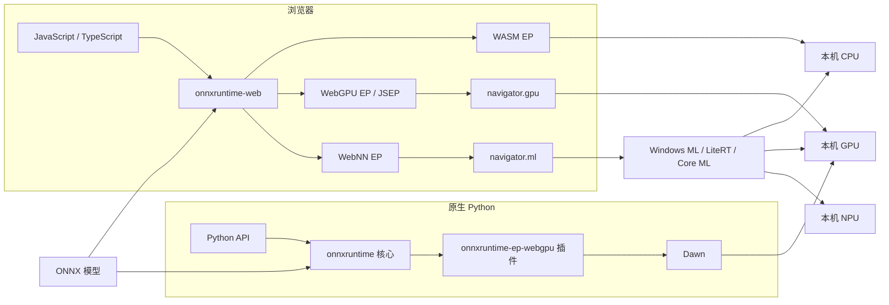
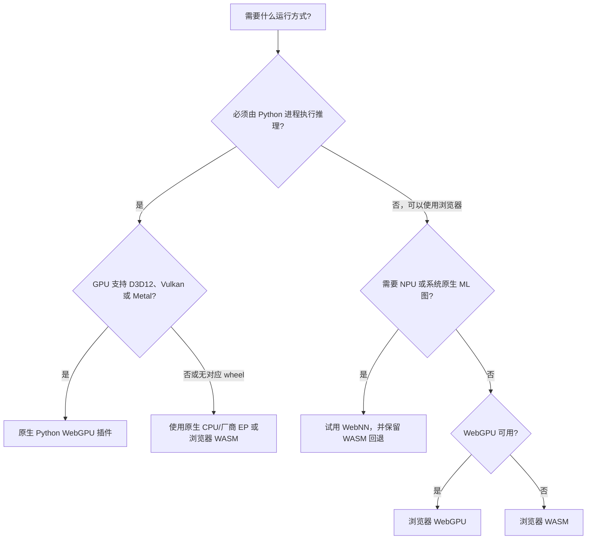
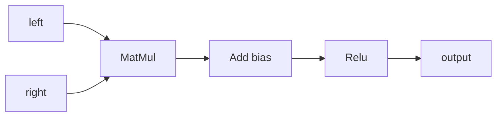
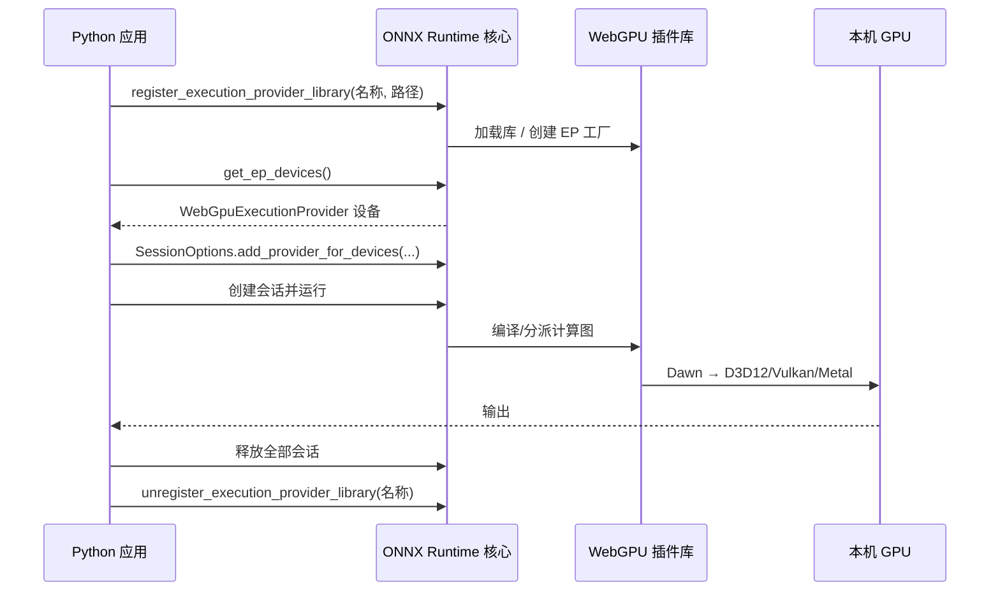
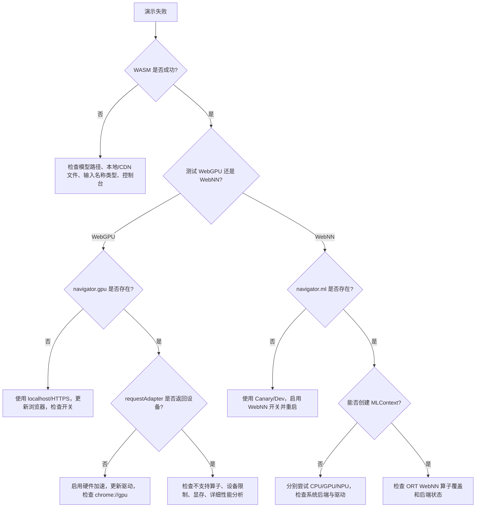

# ONNX Runtime 本地 WebGPU、WebNN 与 WASM 配置教程

**简体中文** | [English](README.md) | [可运行演示](onnxruntime-web-demo)

> 最后核验日期：**2026-07-16**。本仓库为可复现测试固定以下版本：`onnxruntime-web 1.27.0`、`onnxruntime 1.27.0`、`onnxruntime-ep-webgpu 0.1.0`。
>
> WebGPU，特别是 WebNN，仍在快速变化。正式发布产品前，请同时查看本文支持表和文末的实时状态链接。

**证据使用原则：** ORT API 与软件包信息以 ONNX Runtime 官方文档、源码/算子表以及 npm/PyPI 元数据为准；平台可用性以浏览器实现状态表和浏览器/操作系统厂商资料为准。独立博客只用于吸收预热、本地缓存、分开统计上传/回读等实践思路；未经一手资料确认的兼容性和性能数据不会直接写成结论。

本教程从零开始，最终在本地设备上通过以下路径运行 ONNX 推理：

- **WASM EP**：浏览器内的 CPU 推理，也是兼容性基线。
- **ONNX Runtime Web 的 WebGPU EP**：浏览器 JavaScript/TypeScript 使用本机 GPU。
- **ONNX Runtime Web 的 WebNN EP**：浏览器 JavaScript/TypeScript 请求操作系统/浏览器的 CPU、GPU 或 NPU 加速。
- **原生 WebGPU 插件 EP**：Python 使用新的 `onnxruntime-ep-webgpu` 插件和 Dawn，无需浏览器。
- **Python 一键启动器**：每条浏览器路径都只需一条命令；原生 WebGPU 则支持固定 wheel 覆盖的主机。

## 1. 首先看清楚：四条名字相似、实质不同的路径

| 路径 | 语言/API | 运行位置 | 硬件路径 | 软件包 | 本教程中的成熟度 |
|---|---|---|---|---|---|
| 浏览器 WASM | JavaScript，由 Python 提供网页服务 | 浏览器 | 编译为 WebAssembly 的 ORT → CPU | `onnxruntime-web` | 基线，兼容性最广 |
| 浏览器 WebGPU | JavaScript，由 Python 提供网页服务 | 浏览器 | ORT Web/JSEP → 浏览器 WebGPU → D3D12/Vulkan/Metal | `onnxruntime-web` | 推荐的浏览器 GPU 路径 |
| 浏览器 WebNN | JavaScript，由 Python 提供网页服务 | Chromium 预览版 | ORT Web → `navigator.ml` → Windows ML/LiteRT/Core ML → CPU/GPU/NPU | `onnxruntime-web` | 实验性，通常需要浏览器开关 |
| 原生 WebGPU | **Python** | 原生进程 | ONNX Runtime 插件 API → WebGPU EP → Dawn → D3D12/Vulkan/Metal | `onnxruntime` + `onnxruntime-ep-webgpu` | 新的 Beta 插件路径 |

### “Python + WebNN”必须如实说明

本配置中不存在已发布的 `onnxruntime-ep-webnn` Python 包。WebNN 是由浏览器通过 `navigator.ml` 暴露的 **Web 标准**。因此：

- `python launch_demo.py webnn` 会启动正确的本地 HTTP 服务和启用 WebNN 的浏览器；推理由浏览器内 JavaScript 执行。
- `python launch_demo.py native-webgpu` 才是真正的原生 Python WebGPU 插件推理。
- 不要安装名字相似的非官方包，并误以为它能提供原生 WebNN。



模型输入不会发送到云端推理服务。如果尚未执行 `npm ci` 准备本地文件，浏览器第一次运行时可能会从 jsDelivr 下载固定版本的 ORT Web 运行文件。

## 2. 如何选择正确路径



第一次测试应按 **WASM → WebGPU → WebNN** 的顺序。这样能把模型问题与加速器/浏览器问题分开。

## 3. 当前支持情况快照

### 3.1 实用操作系统矩阵

图例：✅ 通常可用；🧪 预览状态，必须在目标机器验证；❌ 本教程没有公开可用路径。

| 操作系统 | 浏览器 WASM | 浏览器 WebGPU | 浏览器 WebNN | 原生 Python WebGPU 插件 |
|---|---:|---:|---:|---:|
| Windows 10/11 x64 | ✅ | ✅ Chrome/Edge | 🧪 Canary/开关；Windows 11 24H2+ 最适合 Windows ML 路径 | ✅ `win_amd64` wheel |
| Windows ARM64 | ✅ | 🧪 Chromium WebGPU 需要开关 | 🧪 | ❌ 插件 0.1.0 无公开 ARM64 wheel |
| Ubuntu/Linux x86-64 | ✅ | 🧪 只对已支持的 Chromium/GPU 组合默认可用 | 🧪 WebNN 开关/LiteRT，不在 ORT 已验证矩阵内 | ✅ manylinux glibc 2.27/2.28 x86-64 wheel |
| Linux ARM64 | ✅ | 🧪 依赖浏览器和设备 | 🧪 | ❌ 插件 0.1.0 无公开 aarch64 wheel |
| macOS 14+ Apple Silicon | ✅ | ✅ Chrome/Edge；Safari 26 有 WebGPU，但不在 ORT Web 支持矩阵中 | 🧪 Canary/开关/Core ML，不在 ORT 已验证矩阵内 | ✅ 插件 universal2 + ORT 核心 arm64 wheel |
| macOS Intel | ✅ | ✅ 取决于浏览器是否仍支持当前 macOS 版本 | 🧪 依赖浏览器与设备 | ❌ 插件虽为 universal2，但所需 ORT 1.27.0 核心没有 macOS x86-64 wheel |

### 3.2 为什么“浏览器支持”与“ORT 支持”不是一回事

浏览器可能已经暴露 WebGPU/WebNN，但 ONNX Runtime Web 尚未把该浏览器/系统组合列为支持项。必须同时满足两层条件：

1. **Web API 层**：`navigator.gpu` 或 `navigator.ml` 存在，并能创建设备/上下文。
2. **ORT 层**：该浏览器上的 ORT EP 实现了模型使用的算子、数据类型和形状。

已发布 `onnxruntime-web 1.27.0` 软件包自带的兼容性表保守列出：

| EP | ORT Web 文档中的浏览器支持 |
|---|---|
| WASM | Chrome/Edge、Safari、Firefox，以及单线程 Node.js |
| WebGPU | Windows、Android、macOS 上的 Chrome/Edge |
| WebNN | Windows Chrome/Edge，并启用 `WebMachineLearningNeuralNetwork` |

更广泛、更新的实现状态如下：

- Chromium WebGPU 从 113 起在 macOS、Windows x86/x64 和 ChromeOS 默认可用。
- Linux Chromium 从 144 起支持部分 Intel Gen12+，从 147 起支持使用 535.183.01+ 驱动和 Wayland 的 NVIDIA；其他组合可能仍需开关。
- Safari 26 在 macOS/iOS/iPadOS/visionOS 26 提供 WebGPU，但这不等于 ORT Web 官方支持保证。
- WebNN 仍处于预稳定/开关阶段。WebNN 项目文档列出了 Windows ML、LiteRT、Core ML 后端，而 ORT 的保守矩阵目前只验证 Windows Chromium。

### 3.3 原生插件 0.1.0 的公开 wheel

| Wheel | 平台要求 | 架构 |
|---|---|---|
| `onnxruntime_ep_webgpu-0.1.0-py3-none-win_amd64.whl` | 64 位 Windows | x86-64 |
| `...manylinux_2_27_x86_64.manylinux_2_28_x86_64.whl` | 与 glibc 2.27/2.28 兼容的 Linux | x86-64 |
| `...macosx_14_0_universal2.whl` | macOS 14+ | Intel + Apple Silicon |

插件元数据要求 Python 3.11+，并且必须单独安装兼容的 ONNX Runtime（软件包声明的最低核心版本为 1.24.4）。本仓库固定组合中的 ORT 核心只发布 CPython 3.11–3.14 wheel。插件的 macOS wheel 虽为 universal2，但 ORT 1.27.0 核心只提供 arm64 wheel；因此完整的固定原生路径支持 Apple Silicon，不支持 Intel Mac。

## 4. 从零到第一次推理

### 4.1 前置条件

| 项目 | 最低要求 | 推荐配置 |
|---|---|---|
| Python | 浏览器启动器 3.10+；固定原生组合要求 64 位 CPython 3.11–3.14 | 64 位 CPython 3.12 |
| Node.js/npm | 使用固定 CDN 时不需要；准备本地/离线浏览器文件时需要 | 当前 Node.js LTS，然后执行 `npm ci` |
| 浏览器 | 当前 Chrome 或 Edge | WebGPU 用 Stable；WebNN 用 Canary/Dev |
| GPU 驱动 | 必须提供 D3D12、Vulkan 或 Metal | GPU/系统厂商最新稳定版驱动 |
| 网络 | 本地 npm 文件/插件 wheel 不存在时需要；Windows ML/EP 首次配置也需要 | 先运行一次 `npm ci`，准备本地浏览器文件 |
| 模型 | 合法 ONNX 模型 | 先使用附带的 `execution_provider_demo.onnx` |

不要双击 HTML 文件。`file://` 不是安全上下文，无法正确使用 WebGPU/WebNN。启动器提供 `http://127.0.0.1`，浏览器会把本机回环地址视为可信来源。

### 4.2 进入演示目录

在仓库根目录执行：

```bash
cd WebGPU/onnxruntime-web-demo
```

附带模型很小、形状固定，并且只使用当前 WASM、WebGPU 与 WebNN 算子表都列出的运算：

| 数值 | 类别 | 类型 | 形状 |
|---|---|---|---|
| `left` | 输入 | `float32` | `[1, 4, 128, 128]` |
| `right` | 输入 | `float32` | `[1, 4, 128, 128]` |
| `output` | 输出 | `float32` | `[1, 4, 128, 128]` |

已提交模型大小为 418 字节，使用 ONNX IR 13 与 `ai.onnx` opset 17。其 SHA-256 为 `db8b8de41d85f7ea2df7e4ecb4dc62150fb8a6b3a30753f1659e5b3af47b5efd`。



| 演示文件 | 用途 |
|---|---|
| `execution_provider_demo.onnx` | 已提交的跨提供程序演示模型 |
| `browser-demo.html` + `browser-demo.js` | 浏览器 WASM/WebGPU/WebNN 预检查、推理、数值对比与计时界面 |
| `launch_demo.py` | 本地 HTTP 服务、浏览器发现/启动和原生模式分发器 |
| `native_webgpu_validator.py` | 原生 Python 插件注册、严格节点分配、CPU 对比、性能分析与清理 |
| `run_demo.bat` / `run_demo.sh` | 面向新手的 Windows 与 Ubuntu/macOS 包装脚本 |

### 4.3 Windows 一键命令

在演示目录打开 **PowerShell** 或 **命令提示符**：

```bat
run_demo.bat wasm
run_demo.bat webgpu
run_demo.bat webnn --device gpu
run_demo.bat native-webgpu --iterations 20
```

其他 WebNN 目标设备：

```bat
run_demo.bat webnn --device cpu
run_demo.bat webnn --device npu
```

只有在 WebNN Report 或 Chromium 直方图确认已安装支持 NPU 的后端/EP 后，才应使用 `npu`；NPU 请求并不能在所有 WebNN 机器上通用。

原生命令会创建 `.venv-webgpu`、安装固定版本软件包、发现 WebGPU 设备、默认禁用 CPU 回退、与 CPU EP 比较结果，并检查 ORT 性能分析中是否真正出现 `WebGpuExecutionProvider` 计算事件。只有在诊断保留附带烟雾模型输入约束的 `--model` 时才应添加 `--allow-cpu-fallback`；任意模型的输入适配不属于此验证器范围。

### 4.4 Ubuntu/Linux 与 macOS 一键命令

```bash
bash run_demo.sh wasm
bash run_demo.sh webgpu
bash run_demo.sh webnn --device gpu
bash run_demo.sh native-webgpu --iterations 20
```

不带参数时默认运行浏览器 WebGPU：

```bash
bash run_demo.sh
```

原生命令支持 Linux x86-64，以及 Apple Silicon 上的 macOS 14+。Intel Mac 会在安装前给出明确的兼容性错误，因为单独所需的 `onnxruntime 1.27.0` 核心没有 macOS x86-64 wheel；浏览器支持该 Intel Mac 时，全部浏览器命令仍可使用。

### 4.5 直接使用 Python 启动器

Shell/批处理脚本最简单，也可以直接执行 Python：

| 目标 | Windows | Ubuntu/macOS |
|---|---|---|
| WASM | `py -3 launch_demo.py wasm` | `python3 launch_demo.py wasm` |
| 浏览器 WebGPU | `py -3 launch_demo.py webgpu` | `python3 launch_demo.py webgpu` |
| 浏览器 WebNN GPU | `py -3 launch_demo.py webnn --device gpu` | `python3 launch_demo.py webnn --device gpu` |
| 允许不支持的模型节点使用 WASM | `py -3 launch_demo.py webgpu --allow-wasm-fallback` | `python3 launch_demo.py webgpu --allow-wasm-fallback` |
| 原生 WebGPU（自动创建 `.venv-webgpu`） | `py -3.12 launch_demo.py native-webgpu` | `python3.12 launch_demo.py native-webgpu` |

浏览器服务器会一直运行，按 `Ctrl+C` 停止。若未自动找到浏览器，请把终端输出的 URL 复制到合适的 Chrome/Edge，或通过 `--browser` 指定浏览器可执行文件。

直接或手动执行原生命令时，如有需要，可把 `3.12` 换成已安装的受支持版本（`3.11`、`3.13` 或 `3.14`）。Shell/批处理包装脚本会自动寻找受支持的解释器。

`--allow-wasm-fallback` 是请求的 WebGPU/WebNN API 与上下文已经初始化之后的**模型节点级回退**。它不会把没有 WebGPU 适配器或没有 `navigator.ml` 的机器伪装成通过加速器测试。

WebNN 启动器使用隔离的临时浏览器配置，并通过命令行启用 `WebMachineLearningNeuralNetwork`。默认 `--webnn-backend auto` 会在 Windows 内部版本低于 26100 时选择 LiteRT，其他系统使用 Chromium 平台默认后端。`--webnn-backend litert` 会显式启用 `WebNNLiteRT` 并禁用优先级更高的平台后端；`--webnn-backend platform` 保留 Chromium 的平台后端默认值。兼容禁用列表仍含 `WebNNDirectML`：Chromium 149 已删除这个独立后端，并改由 ORT 后端使用 DirectML；旧版仍识别该功能名，当前版本则会安全忽略。使用 `--no-open` 时，启动器只会打印功能策略，必须把它手动应用到自行打开的浏览器。

### 4.6 怎样才算成功

浏览器通过意味着独立 JavaScript `MatMul → Add → Relu` 参考检查成功；加速器路径还必须通过单独的 WASM 对比。页面最后会显示类似以下、与提供程序对应的信息：

```text
PASS: WEBGPU local inference and output validation completed.
```

原生 Python 测试会给出数值对比、非复制计算节点性能记录，并在默认严格模式下保证没有 CPU 节点事件：

```text
PASS ... max_abs_diff=...
PASS: ... event(s), including ... unique compute node(s), ran on WebGpuExecutionProvider.
PASS: native WebGPU plugin inference is working.
```

仅仅“速度快”不能证明加速器确实被使用。应使用严格模式、性能分析和输出对比。

原生输出中的 `Active providers: ['WebGpuExecutionProvider', 'CPUExecutionProvider']` 属于正常现象：即使严格禁用回退，ORT 仍可能注册默认 CPU 提供程序。是否发生回退应看 CPU **性能事件**或严格会话创建失败，而不是该列表中是否出现 CPU；附带的严格测试要求 CPU 节点事件为 0。

### 4.7 本仓库当前版本的实际核验记录

| 2026-07-16 执行的检查 | 结果 |
|---|---|
| 本地浏览器 WASM、ORT Web 1.27.0、COOP/COEP、4 线程 | 通过；使用本地 npm 文件完成精确版本、模型约束和独立数学参考检查 |
| Linux x86-64、Python 3.13.14 直接运行 `launch_demo.py native-webgpu` | 通过；插件发现 NVIDIA 与 Intel 适配器 |
| 在发现到的 NVIDIA 与 Intel 适配器上分别运行原生严格模式 | 两个设备索引都通过；`MatMul`、`Add`、`Relu` 在 `WebGpuExecutionProvider` 上出现性能事件，CPU 节点事件为 0，并通过 CPU 数值对比 |
| VS Code 集成浏览器与独立本地 Chrome 150 配置中的 WebGPU | 两者的预检查都正确报告适配器为空；均不作为浏览器 GPU 成功证据 |
| 当前 Linux Chrome 150 中的 WebNN | `WebMachineLearningNeuralNetwork` 已暴露 `navigator.ml`；随后创建上下文时报告当前本地无头/Linux 配置不支持 WebNN。已验证启动路由、失败诊断、Chromium 功能策略，以及 ORT 1.27 必需的 `{deviceType, context}` 约束，但没有宣称完成 WebNN 硬件运行 |
| Windows 与 macOS 命令 | 已对照官方 wheel 元数据与平台文档；正式结论前仍须在目标硬件执行 |

## 5. 各操作系统准备步骤

### 5.1 Windows

#### 浏览器 WebGPU

1. 安装全部 Windows 更新。
2. 安装当前 Intel、NVIDIA、AMD 或 Qualcomm 图形驱动。
3. 安装/更新 64 位 Chrome 或 Edge。
4. 打开 `chrome://settings/system` 或 `edge://settings/system`，启用**可用时使用图形加速**，然后重启浏览器。
5. 打开 `chrome://gpu` 或 `edge://gpu`，确认出现 **WebGPU: Hardware accelerated**。
6. 运行 `run_demo.bat webgpu`。

双 GPU 笔记本上 Chromium 可能选择集成显卡。进入 Windows **设置 → 系统 → 屏幕 → 显示卡**，添加浏览器并选择**高性能**。某些 Chrome 版本还提供 `chrome://flags/#force-high-performance-gpu`。

实时实现表中 Windows ARM64 Chromium WebGPU 仍需 `chrome://flags/#enable-unsafe-webgpu`，因此只能按开发测试处理。原生 Python 插件没有 Windows ARM64 wheel。

#### 浏览器 WebNN

1. 若希望使用 Windows ML/ORT 和厂商 NPU EP，优先选择 Windows 11 24H2（内部版本 26100）或更新版本。
2. 安装最新 Chrome Canary 或 Edge Canary。
3. 运行 `run_demo.bat webnn --device gpu`（或 `npu`）。启动器会在隔离的临时配置中传入官方 `--enable-features=WebMachineLearningNeuralNetwork` 开关，因此不需要修改日常浏览器配置中的开关。
4. Windows 11 24H2+ 第一次启动时，应保持联网，让 Chromium 在后台安装 Windows App Runtime 和适用的执行提供程序。若第一次创建上下文失败，请等待安装完成、重新启动，再按下一步检查状态。
5. 访问 <https://webnnreport.org/>，并打开 `chrome://histograms/` 搜索 `WebNN`，判断实际后端和安装状态。`WebNN.ORT.WinAppRuntimeInstallState` 的 `2`（完成）和 `9`（已存在）均表示成功。

若不使用脚本而是自己启动浏览器，请打开 `chrome://flags` 或 `edge://flags`，启用 **Enables WebNN API**，然后重新启动。

在 Windows 10 和低于 24H2 的 Windows 11 上，`--webnn-backend auto` 会按 WebNN 官方 LiteRT 方法禁用 `WebNNOnnxRuntime`、显式启用 `WebNNLiteRT`，并为兼容 Chromium 148 及更旧版本而同时禁用已退役的 `WebNNDirectML`。当前 Chromium 已通过 ONNX Runtime 后端使用 DirectML，不再有独立 DirectML 后端。要在任意 Windows 版本上有意测试 LiteRT，请传入 `--webnn-backend litert`。测试 Windows 11 24H2+ 的 Windows ML/ORT 路径时不要强制 LiteRT。

由于算子覆盖、驱动和浏览器后端会变化，WebNN 可能改用其他设备类别或失败。成功创建 `MLContext` 只能证明 API 可用，不能单独证明每个节点都在 NPU 上执行。

#### 原生 Python WebGPU

公开 wheel 仅支持 Windows x64。它通过 Dawn 使用 D3D12 或 Vulkan，不依赖浏览器 JavaScript API。执行原生一键命令即可。若发现设备数为 0，先更新 GPU 驱动，并确认当前桌面/会话可以访问 GPU；远程桌面或虚拟化会话可能隐藏设备。

### 5.2 Ubuntu/Linux

#### 驱动和 Vulkan 预检查

Intel/AMD 使用发行版 Mesa 时，典型 Ubuntu 安装方式是：

```bash
sudo apt update
sudo apt install mesa-vulkan-drivers vulkan-tools pciutils
vulkaninfo --summary
```

NVIDIA 应通过 Ubuntu **软件和更新 → 附加驱动**或 NVIDIA 官方仓库安装受支持的专有驱动，不要盲目用 Mesa 替换。检查当前显卡和驱动：

```bash
lspci -k | grep -EA3 'VGA|3D|Display'
vulkaninfo --summary
```

如果 `vulkaninfo` 失败，通过 Vulkan 的原生 WebGPU 和浏览器 WebGPU 通常也无法工作。容器必须显式映射 GPU 设备和宿主驱动。

#### Linux 浏览器 WebGPU

使用当前 Chrome/Edge。根据实时 WebGPU 实现表：

- Chromium 144 起默认支持部分 Intel Gen12+。
- Chromium 147 起默认支持使用 535.183.01+ 驱动和 Wayland 的 NVIDIA。
- 其他组合可在开发测试时尝试：

```bash
bash run_demo.sh webgpu \
  --browser-arg=--enable-unsafe-webgpu \
  --browser-arg=--ozone-platform=x11 \
  --browser-arg=--use-angle=vulkan \
  --browser-arg=--enable-features=Vulkan,VulkanFromANGLE
```

这些开关会绕过浏览器安全判断，只应用于开发，不能作为最终用户的产品要求。必须检查 `chrome://gpu`；**Software only** 不能算硬件加速成功。

#### Linux WebNN

WebNN 项目文档把 Linux 映射到 LiteRT，但 ORT Web 1.27.0 软件包自带的兼容表尚未列出 Linux WebNN。一键命令会在隔离配置中启用 API，并保留 Chromium Linux 的默认后端；只有在有意强制测试包含 LiteRT 的构建时才传入 `--webnn-backend litert`。手动启动时应使用 Canary/Dev 并启用 **Enables WebNN API**。该路径仍属于实验功能。应用原型应保留显式 WASM 节点回退，并逐个验证模型与算子。

#### Linux 原生插件

公开 wheel 仅支持 x86-64，并要求与 manylinux 2.27/2.28 兼容的 glibc。插件通过 Dawn 使用 Vulkan。WSL、精简容器、aarch64 和旧发行版可能需要源码构建，或完全超出 wheel 支持范围。

### 5.3 macOS

1. 更新 macOS 和浏览器。WebGPU 映射到 Metal，不需要单独安装 Vulkan。
2. Chrome/Edge WebGPU 是 ORT Web 的保守选择。
3. 运行 `bash run_demo.sh webgpu`。
4. WebNN 使用当前 Canary/Dev 并启用 **Enables WebNN API**；由于 ORT 支持表尚未列出 macOS WebNN，应把 Core ML 路由视为预览功能。
5. 本固定组合的原生 Python 要求 Apple Silicon 上的 macOS 14+。插件 wheel 本身是 universal2，但单独所需的 ORT 1.27.0 核心只发布 macOS arm64 wheel；Intel Mac 仍可使用浏览器路径。

Safari 26 从 Web 标准角度实现了 WebGPU，但 ONNX Runtime Web 当前文档仍把 Safari WebGPU 标为不支持。特定版本可能能够运行，但在完成自己的兼容性测试前，不应宣称生产支持。

## 6. 浏览器 JavaScript/TypeScript 配置

### 6.1 安装并选择正确 Bundle

```bash
npm install --save-exact onnxruntime-web@1.27.0
```

| 需求 | ESM/CommonJS 导入 | Script 文件 |
|---|---|---|
| 仅 WASM | `onnxruntime-web/wasm` | `ort.wasm.min.js` |
| 仅 WebGPU | `onnxruntime-web/webgpu` | `ort.webgpu.min.js` |
| 同一构建切换 WASM/WebGPU/WebNN | `onnxruntime-web/all` | `ort.all.min.js` |

某些旧 ORT 页面使用 `onnxruntime-web/experimental`。已发布的 1.27.0 包导出 `./all`，不导出 `./experimental`；因此本演示有意使用 `ort.all.min.js`。

CDN 写法：

```html
<script src="https://cdn.jsdelivr.net/npm/onnxruntime-web@1.27.0/dist/ort.all.min.js"></script>
```

必须在创建第一个会话**之前**设置全局环境参数：

```js
ort.env.logLevel = 'warning';
ort.env.wasm.numThreads = globalThis.crossOriginIsolated ? 4 : 1;
ort.env.wasm.proxy = false; // proxy worker 不能与 WebGPU 同时使用
```

### 6.2 WASM 会话

```js
const session = await ort.InferenceSession.create('./model.onnx', {
  executionProviders: ['wasm'],
  graphOptimizationLevel: 'all',
});
```

WASM 的 ONNX 算子覆盖最广。多线程 WASM 还要求跨源隔离：

```text
Cross-Origin-Opener-Policy: same-origin
Cross-Origin-Embedder-Policy: require-corp
```

附带的 Python 服务器会发送这两个响应头。没有这些响应头时，应设置 `ort.env.wasm.numThreads = 1`。

### 6.3 WebGPU 会话

```js
const adapter = await navigator.gpu.requestAdapter({
  powerPreference: 'high-performance',
});
if (!adapter) throw new Error('No WebGPU adapter');
const device = await adapter.requestDevice();

const session = await ort.InferenceSession.create('./model.onnx', {
  executionProviders: [{name: 'webgpu', device, validationMode: 'basic'}],
  graphOptimizationLevel: 'all',
  preferredOutputLocation: 'cpu',
  extra: {session: {disable_cpu_ep_fallback: '1'}}, // 严格证明模式
});
```

旧的 `ort.env.webgpu.adapter` 与 `ort.env.webgpu.powerPreference` 路径在 1.27.0 中仍存在，但其 TypeScript API 已标记为弃用。当前显式设备模式是在 WebGPU EP 选项中传入 `GPUDevice`。自定义设备必须请求模型所需的限制与功能；可运行演示会复刻 ORT 1.27 自己的设备描述符，而不是只依赖默认值。

明确允许不支持算子回退：

```js
executionProviders: [{name: 'webgpu', device, validationMode: 'basic'}, 'wasm']
```

回退可以提升兼容性，但可能隐藏昂贵的 GPU↔CPU 数据传输。仅列出 `webgpu` 本身不能证明每个节点都留在 GPU；本演示的严格模式还会设置 `session.disable_cpu_ep_fallback=1` 并分析计算内核。查看详细日志/性能分析后才能进行有意义的性能比较。

### 6.4 WebNN 会话

直接使用提供程序参数：

```js
const session = await ort.InferenceSession.create('./model.onnx', {
  executionProviders: [{
    name: 'webnn',
    deviceType: 'gpu',       // 'cpu' | 'gpu' | 'npu'
    powerPreference: 'high-performance',
  }],
});
```

跨会话共享 WebNN `MLTensor` 时，必须预先创建上下文。ORT Web 1.27 即使收到 `context`，EP 选项仍必须包含 `deviceType`，因为 ORT 要用它选择首选通道布局：

```js
if (!navigator.ml) throw new Error('WebNN is unavailable');
const context = await navigator.ml.createContext({
  deviceType: 'gpu',
  powerPreference: 'high-performance',
});
const session = await ort.InferenceSession.create('./model.onnx', {
  executionProviders: [{name: 'webnn', deviceType: 'gpu', context}],
});
```

本演示采用第二种方式，让预检查和 ORT 会话共享同一个 `MLContext`。

### 6.5 运行与释放资源

```js
const feeds = {
  input: new ort.Tensor('float32', inputData, [1, 3, 224, 224]),
};
let results;
try {
  results = await session.run(feeds);
  const values = await results.output.getData();
  // 在这里使用 values。
} finally {
  for (const tensor of Object.values(results ?? {})) tensor.dispose?.();
  for (const tensor of Object.values(feeds)) tensor.dispose?.();
  await session.release();
}
```

该示例使用 CPU 输入和 ORT 所有的输出。ORT 所有的设备输出与会话应显式释放；若张量包装的是用户所有的 `GPUBuffer`/`MLTensor`，应让底层资源在推理期间保持有效，并按第 9 节自行销毁底层资源。否则长时间运行的网页会泄漏设备内存。

## 7. 原生 Python WebGPU 插件

### 7.1 插件 EP 与传统 EP 的区别

传统 Python 示例直接把提供程序名称传给 `InferenceSession`。插件 EP 必须先动态注册，再选择其 `OrtEpDevice` 并附加到 `SessionOptions`。



仍有会话使用插件时，绝不能注销插件库。

### 7.2 手动创建隔离环境

请在第 4.2 节进入的演示目录中执行。使用 64 位 CPython 3.11–3.14。以下命令支持 Windows x64、glibc 2.27+ 的 Linux x86-64，以及 Apple Silicon 上的 macOS 14+；固定 ORT 核心不支持 Intel Mac 原生 Python。

Windows PowerShell：

```powershell
py -3.12 -m venv .venv-webgpu
.\.venv-webgpu\Scripts\python.exe -m pip install --upgrade pip
.\.venv-webgpu\Scripts\python.exe -m pip install -r requirements-native-webgpu.txt
.\.venv-webgpu\Scripts\python.exe native_webgpu_validator.py
```

Ubuntu/macOS：

```bash
python3.12 -m venv .venv-webgpu
.venv-webgpu/bin/python -m pip install --upgrade pip
.venv-webgpu/bin/python -m pip install -r requirements-native-webgpu.txt
.venv-webgpu/bin/python native_webgpu_validator.py
```

Python 启动器和两个一键包装脚本都会自动完成以上步骤。启动器会先核对固定的运行时/插件版本并复用已有环境，因此不会每次重复安装软件包。

### 7.3 最小插件 API 模式

```python
import numpy as np
import onnxruntime as ort
import onnxruntime_ep_webgpu as webgpu_ep

registration = "my_webgpu_plugin"
ort.register_execution_provider_library(registration, webgpu_ep.get_library_path())
try:
    devices = [
        d for d in ort.get_ep_devices()
        if d.ep_name == webgpu_ep.get_ep_name()
    ]
    if not devices:
        raise RuntimeError("No WebGPU device was discovered")

    options = ort.SessionOptions()
    options.add_session_config_entry("session.disable_cpu_ep_fallback", "1")
    options.add_provider_for_devices([devices[0]], {
        "preferredLayout": "NCHW",
        "powerPreference": "high-performance",
        "validationMode": "basic",
    })
    shape = (1, 4, 128, 128)
    positions = np.arange(np.prod(shape), dtype=np.float32)
    feeds = {
        "left": (np.sin(positions * 0.01) * 0.25).reshape(shape),
        "right": (np.cos(positions * 0.013) * 0.25).reshape(shape),
    }
    session = ort.InferenceSession("execution_provider_demo.onnx", sess_options=options)
    try:
        outputs = session.run(None, feeds)
        print(outputs[0].dtype, outputs[0].shape)
    finally:
        del session
finally:
    ort.unregister_execution_provider_library(registration)
```

`ort.get_available_providers()` 列出的是核心包内置提供程序，不适合用来判断尚未注册的插件。应先注册，再检查 `ort.get_ep_devices()`。

### 7.4 演示程序的原生参数

| 参数 | 可选值/默认值 | 作用 |
|---|---|---|
| `--model` | 附带的 `execution_provider_demo.onnx` | 仅运行保留 `left`/`right` float32 `[1,4,128,128]` 输入的模型；否则需调整验证器 |
| `--device-index` | `0` | 选择一个发现到的 WebGPU 设备 |
| `--layout` | `NCHW` / `NHWC` | 布局敏感内核的首选布局 |
| `--power-preference` | `high-performance` / `low-power` | Dawn 适配器提示 |
| `--validation-mode` | `disabled`、`wgpuOnly`、`basic`、`full` | 验证强度与诊断开销 |
| `--allow-cpu-fallback` | 默认关闭 | 允许不支持的节点在 CPU 上运行 |
| `--warmup` | `2` | 不计入性能结果的预热次数 |
| `--iterations` | `10` | 正式测量次数 |
| `--keep-profile` | 默认关闭 | 把 ORT JSON 性能文件复制到演示目录 |

官方原生参数还包括 `enableGraphCapture`、`enableInt64`、`deviceId`、`preserveDevice`、`maxStorageBufferBindingSize` 和四种缓冲区缓存模式。初学时使用默认值，每次只修改一个参数。

验证器默认使用 `validationMode=basic`，并始终启用 ORT 性能分析；它优先证明与诊断，而不是峰值速度。应先获得正确的严格 PASS。`--validation-mode disabled` 可用于分离验证开销，但性能分析仍然开启，因此生产基准应使用单独的无分析测试框架。报告值是 NumPy CPU 输入/输出下的端到端 `session.run()` 时间，也包含上传和回读。性能文件用于证明提供程序分配，不能把该数字重新标成纯 GPU 内核延迟。

## 8. 模型兼容性与回退

ONNX 文件合法，并不表示每个 EP 都支持其中所有算子、类型和形状。

| 检查项 | WASM | WebGPU | WebNN |
|---|---|---|---|
| ONNX 算子覆盖 | 最广 | 子集，持续增长 | 映射到 WebNN 操作的子集 |
| 动态形状 | 通常支持 | 会降低优化/图捕获机会 | 推荐 `freeDimensionOverrides` |
| `float16` | CPU 上通常较慢 | 依赖浏览器/设备特性 | 依赖后端/设备 |
| `int64` | 支持 | 受限或依赖原生参数 | 常见兼容性问题来源 |
| 量化算子 | 覆盖较广，但依赖模型 | 查看当前算子表 | 查看 WebNN 和后端算子表 |
| 设备驻留 I/O | CPU 张量 | `GPUBuffer` / `gpu-buffer` | `MLTensor` / `ml-tensor` |

推荐模型验证流程：

1. 验证模型元数据，并用原生 CPU ORT 运行。
2. 运行浏览器 WASM 并比较输出。
3. 用严格模式运行 WebGPU/WebNN。
4. 严格模式失败时先定位不支持节点，然后才启用 WASM/CPU 回退。
5. 使用符合任务需求的 `rtol`/`atol` 比较输出。
6. 分析节点分配和设备间数据复制。
7. 固定输入/形状，预热后再测试性能。

动态维度可这样固定：

```js
freeDimensionOverrides: {batch: 1, height: 224, width: 224}
```

每个键都必须与该 ONNX 模型中保存的符号维度名（`dim_param`）完全一致；自行发明的轴名称不会生效。

图捕获只适合稳定形状、并且全部节点都分配到 WebGPU 的计算图。ORT Web 1.27 的捕获运行还要求外部提供 `gpu-buffer` 输入和 `gpu-buffer` 输出；只把 `enableGraphCapture` 改为 `true`、却继续喂 CPU 张量会失败。因此本演示保持关闭。图捕获可能降低 CPU 提交开销，但不适用于所有模型。

## 9. I/O Binding 与性能

默认情况下，浏览器输入位于 CPU 内存，输出也会复制回 CPU。端到端时间包含上传和回读。

| 目标 | WebGPU | WebNN |
|---|---|---|
| 设备输入 | `ort.Tensor.fromGpuBuffer(...)` | `ort.Tensor.fromMLTensor(...)` |
| 全部输出保留在设备 | `preferredOutputLocation: 'gpu-buffer'` | `preferredOutputLocation: 'ml-tensor'` |
| 预分配输出 | GPU storage buffer + ORT 张量 | readable `MLTensor` + ORT 张量 |
| 读回 CPU | `await tensor.getData()` | `await tensor.getData()` 或 `mlContext.readTensor()` |
| 所有权规则 | 用户创建的 buffer 由用户销毁；ORT 输出要 dispose | 用户创建的 `MLTensor` 由用户销毁；ORT 输出要 dispose |

不要把 GPU 驻留的纯内核测试与本演示的“输出回 CPU”端到端延迟直接比较，它们回答的问题不同。

浏览器 WebGPU 性能分析：

```js
ort.env.webgpu.profiling = {
  mode: 'default',
  ondata: data => console.log(data),
};
ort.env.logLevel = 'verbose';
ort.env.debug = true;
```

应在创建设备/会话前配置性能分析。若传入自定义 `GPUDevice`，只应在适配器明确支持时请求 `timestamp-query`（或 Chromium 的 pass 内时间戳功能），否则可能收不到回调。诊断选项只应在排错时开启；验证和详细日志会扭曲性能结果。

## 10. 本地/离线部署

演示加载器按以下顺序尝试：

1. `node_modules/onnxruntime-web/dist/ort.all.min.js`
2. 固定为 1.27.0 的 jsDelivr 文件

完全不使用 CDN：

```bash
npm ci
python3 launch_demo.py webgpu
```

`npm ci` 使用已提交的锁文件，并要求安装 Node.js/npm。若可以访问固定版本的 jsDelivr 文件，则不必执行此步骤。

生产应用应从同一 `onnxruntime-web` 版本复制并提供所需文件。最稳妥的方式是一起部署匹配的 `dist` 文件。本演示使用的 `all` Bundle 会让每条路径（包括 WASM 基线）加载 JSEP WebAssembly 文件（`ort-wasm-simd-threaded.jsep.wasm` 及其匹配加载器）。单独从 `onnxruntime-web/wasm` 导入的 WASM-only 构建才使用非 JSEP 文件。

绝不能混用不同 ORT 版本的 JavaScript Bundle 与 `.wasm`/`.mjs`。在创建会话前配置目录：

```js
ort.env.wasm.wasmPaths = '/assets/ort-1.27.0/';
```

生产检查项：

- 使用 HTTPS；localhost HTTP 只是开发例外。
- 配置正确 MIME 类型，特别是 `application/wasm`。
- 使用 WASM 多线程时配置 COOP/COEP。
- CSP 应明确允许实际使用的脚本、Worker、WASM、模型和 CDN。
- 固定版本并建立完整性检查与依赖更新流程。
- 对大模型进行有计划的缓存（例如 IndexedDB），同时记录模型版本/校验和。
- 不要要求最终用户启用不安全浏览器开关。

## 11. 故障排查



| 现象 | 常见原因 | 解决办法 |
|---|---|---|
| `ort is undefined` | 本地 npm 文件不存在且 CDN 被阻止 | 安装 Node.js，执行 `npm ci`，并检查 DevTools Network |
| `navigator.gpu` 不存在 | 浏览器过旧、不安全的 `file://`/HTTP、平台不支持 | 使用启动器/HTTPS并更新浏览器 |
| `requestAdapter()` 返回 `null` | 硬件加速关闭、驱动/黑名单、Linux 路径不支持 | 启用图形加速、更新驱动、检查 `chrome://gpu` |
| `WebGPU: Software only` | 浏览器使用软件渲染 | 修复驱动/远程会话策略，不能把它报告为 GPU 加速 |
| `navigator.ml` 不存在 | WebNN 未启用或浏览器构建不支持 | 使用当前 Canary/Dev，启用 **Enables WebNN API** 并重启 |
| WebNN `gpu`/`npu` 上下文失败 | 后端/设备/驱动不可用 | 测试 `cpu`，查看 WebNN Report 和 `chrome://histograms` |
| 会话报告算子不支持 | EP 覆盖缺口 | 查看当前算子表，调整导出/模型，或明确添加回退 |
| WASM 卡住/线程数为 1 | 未跨源隔离 | 配置 COOP/COEP，或强制单线程 |
| 原生安装提示 `No matching distribution` | Python/系统/架构/glibc 不受支持 | 使用 64 位 CPython 3.11–3.14，并同时检查插件与 ORT 核心矩阵；Intel macOS 没有固定核心 wheel |
| 原生插件注册不兼容 | 核心 ORT 过旧或不兼容 | 使用固定依赖，或至少满足插件声明的最低版本 |
| 原生插件发现 0 个设备 | D3D12/Vulkan/Metal 适配器不可用 | 更新驱动/系统；离开容器/远程会话测试；Linux 验证 Vulkan |
| Dawn 提示动态缓冲区限制被 “artificially reduced” | 适配器上报值高于 Dawn 内部动态偏移分配上限 | 对本演示属于提示；若后面没有错误，应以最终 PASS/性能文件为准 |
| 原生性能文件无 WebGPU 事件 | 计算图没有在 WebGPU 执行 | 保持严格模式，不允许 CPU 回退；检查算子分配 |
| 输出不同 | 精度差异、不支持行为、预处理错误 | 先比类型/形状，再使用有依据的误差范围；保留 CPU 基准 |
| 第一次运行很慢 | 下载、图优化、着色器编译 | 分开测量加载/编译、预热和稳定运行时间 |

Chrome 官方建议的排查顺序是：浏览器版本 → 安全上下文 → 图形加速 → 平台支持/开关 → 黑名单 → 适配器参数 → `chrome://gpu` → GPU 进程稳定性。

## 12. 源码构建（高级，不是安装 wheel 的必要步骤）

原生 WebGPU 通过 `--use_webgpu` 构建；`shared_lib` 会生成插件库：

```bash
python tools/ci_build/build.py \
  --build_dir build/webgpu_plugin_ep \
  --config RelWithDebInfo \
  --build_shared_lib \
  --use_webgpu shared_lib
```

| 构建参数 | 含义 |
|---|---|
| `--use_webgpu static_lib` | 把 WebGPU EP 链接到原生 ORT |
| `--use_webgpu shared_lib` | 构建 `onnxruntime_providers_webgpu` 插件 EP |
| `--use_external_dawn` | 链接外部提供的 Dawn |
| `--enable_pix_capture` | 在兼容 Windows 构建中启用 PIX |

源码构建需要完整 ONNX Runtime 工具链，不是“缺少 wheel”时适合新手的替代方案。应先确认公开 wheel 是否支持目标机器。

## 13. 参考资料与核验依据

### ONNX Runtime 官方资料

- [原生 WebGPU Execution Provider](https://onnxruntime.ai/docs/execution-providers/WebGPU-ExecutionProvider.html)
- [插件 EP 概览](https://onnxruntime.ai/docs/execution-providers/plugin-ep-libraries/)
- [插件 EP 用法与生命周期](https://onnxruntime.ai/docs/execution-providers/plugin-ep-libraries/usage.html)
- [ORT Web WebGPU 教程](https://onnxruntime.ai/docs/tutorials/web/ep-webgpu.html)
- [ORT Web WebNN 教程](https://onnxruntime.ai/docs/tutorials/web/ep-webnn.html)
- [ORT Web 环境参数与会话参数](https://onnxruntime.ai/docs/tutorials/web/env-flags-and-session-options.html)
- [ORT Web 部署](https://onnxruntime.ai/docs/tutorials/web/deploy.html)
- [ORT Web 性能诊断](https://onnxruntime.ai/docs/tutorials/web/performance-diagnosis.html)
- [WebGPU 提供程序源码](https://github.com/microsoft/onnxruntime/tree/main/onnxruntime/core/providers/webgpu)
- [WebNN 提供程序源码](https://github.com/microsoft/onnxruntime/tree/main/onnxruntime/core/providers/webnn)
- [WebGPU 插件包源码](https://github.com/microsoft/onnxruntime/tree/main/plugin-ep-webgpu)
- [当前 WebGPU 算子表](https://github.com/microsoft/onnxruntime/blob/main/js/web/docs/webgpu-operators.md)
- [当前 WebNN 算子表](https://github.com/microsoft/onnxruntime/blob/main/js/web/docs/webnn-operators.md)

### 软件包记录

- [npm 上的 `onnxruntime-web`](https://www.npmjs.com/package/onnxruntime-web)
- [PyPI 上的 `onnxruntime`](https://pypi.org/project/onnxruntime/)
- [PyPI 上的 `onnxruntime-ep-webgpu`](https://pypi.org/project/onnxruntime-ep-webgpu/)

### 浏览器/Web 标准与实践资料

- [WebGPU 实现状态](https://webgpu.io/status/)
- [Chrome WebGPU 故障排查](https://developer.chrome.com/docs/web-platform/webgpu/troubleshooting-tips)
- [Chrome 147–148 WebGPU 博客：Linux NVIDIA 支持](https://developer.chrome.com/blog/new-in-webgpu-147-148)
- [Chrome 本地 AI 加速入口：WASM 与 WebGPU](https://developer.chrome.com/docs/ai/platform)
- [WebNN 实现/算子状态](https://webmachinelearning.github.io/webnn-status/)
- [WebNN 安装指南](https://webnn.io/en/learn/get-started/installation)
- [WebNN 架构/后端 FAQ](https://webnn.io/en/faq/architecture/)
- [Windows ML 概览](https://learn.microsoft.com/windows/ai/new-windows-ml/overview)

### 独立实践文章（二手资料，不作为规范依据）

- [WebGPU 与 WebNN 浏览器 AI 实践文章](https://sachinsharma.dev/blogs/accelerating-llms-browser-webgpu-webnn)：可以借鉴本地优先架构和设备内存驻留的思路；但本文**不采用**其中单台机器的基准数据、宽泛的浏览器支持结论、模型名称和原生 WebNN 代码作为兼容性证据，这些内容必须以上面实时 ORT/算子/浏览器一手资料复核。

## 14. 最终上线判断表

| 问题 | 可以继续的条件 |
|---|---|
| WASM 能否运行完全相同的模型/输入？ | 可以，且输出与 CPU 基准一致 |
| 请求的浏览器 API 是否存在？ | 安全上下文内 `navigator.gpu`/`navigator.ml` 成功 |
| 是否真的使用硬件加速？ | 浏览器诊断或原生性能文件证明硬件/提供程序被使用 |
| 不支持的节点是否已知？ | 严格模式成功，或每个回退和数据复制都有记录 |
| 输出是否正确？ | 形状/类型、数值误差和任务指标全部通过 |
| 性能测试是否公平？ | 已预热、工作负载固定、加载与运行分开、I/O 策略明确 |
| 部署是否可维护？ | 明确记录版本、浏览器、系统、设备矩阵和回退策略 |
| 安全/离线是否准备好？ | 已审查 HTTPS、CSP、运行文件、模型隐私和更新策略 |

只要有一项答案是“未知”，就应保留显式 WASM/CPU 回退，并且不要把该加速路径宣传为已达到生产就绪状态。
