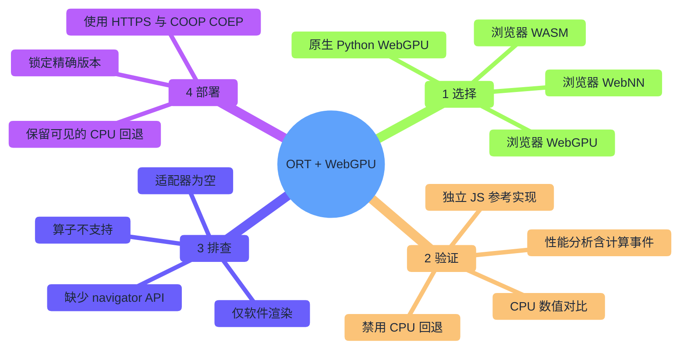
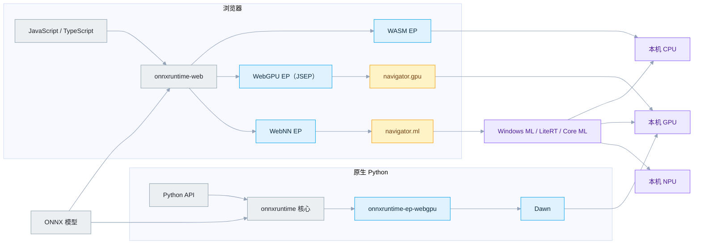
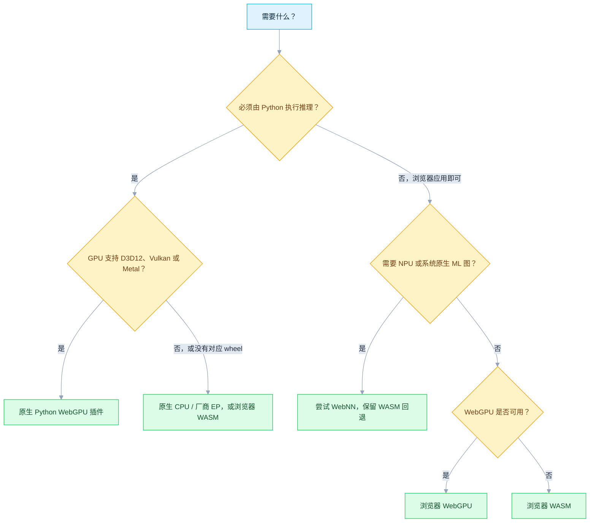
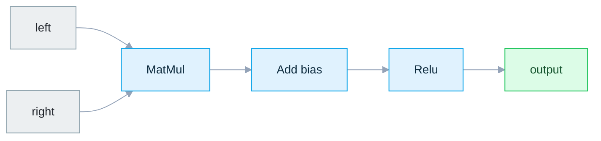
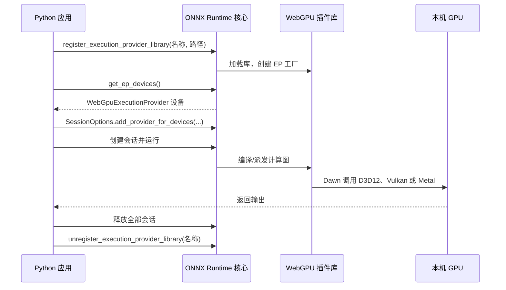
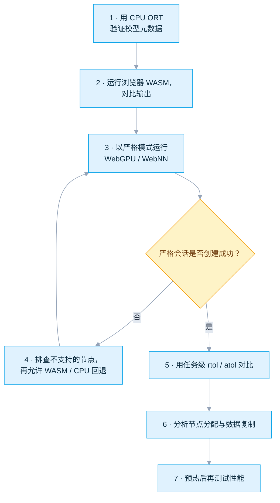
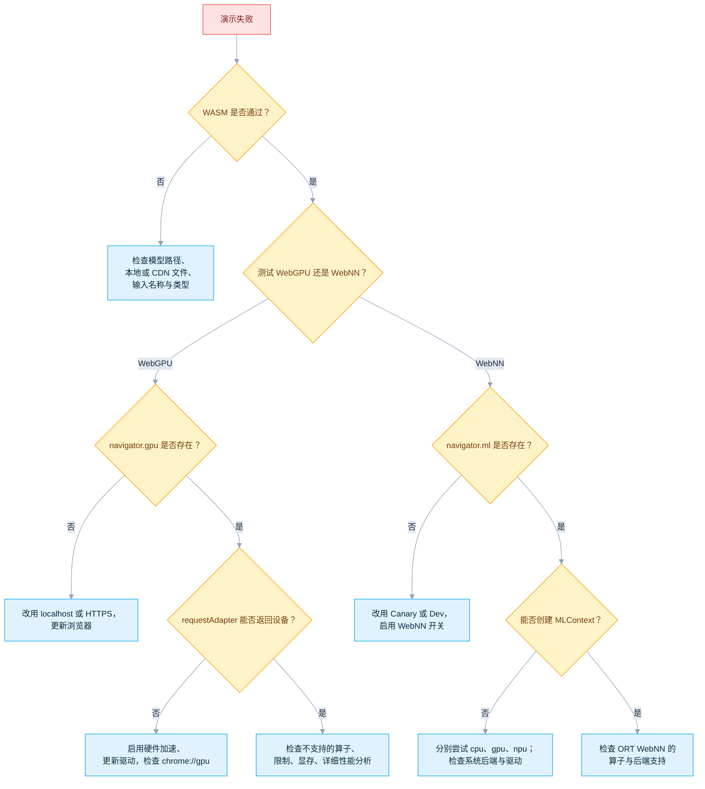

# ONNX Runtime + WebGPU：WASM、WebGPU、WebNN 与原生 Python

[English](README.md) · [仓库首页](../README.md) · [可运行演示](onnxruntime-web-demo/README.md)

| 项目 | 基线 |
|---|---|
| 最近验证 | `2026-07-17` |
| 支持平台 | 浏览器方式取决于 Windows/Linux/macOS 上的浏览器支持；原生插件支持面更窄 |
| 运行方式 | 浏览器 WASM、浏览器 WebGPU、浏览器 WebNN、原生 Python WebGPU |
| 运行时 | `onnxruntime-web==1.27.0`、`onnxruntime==1.27.0`、`onnxruntime-ep-webgpu==0.1.0` |
| 运行入口 | `onnxruntime-web-demo/run_demo.bat`、`run_demo.sh` |
| 验证范围 | 独立数学参考、跨 EP 结果一致性、严格回退策略、原生性能分析事件 |

> [!NOTE]
> 软件包与 API 均直接对照 ONNX Runtime、npm、PyPI 核实；平台可用性以浏览器/系统厂商为准。WebGPU、尤其是 WebNN 变化很快，上线前务必重新检查文末的实时状态页面。

| 你的情况… | 从这里开始 |
|---|---|
| 刚接触本教程，想尽快跑起来 | [§4 快速上手](#4-快速上手) |
| 正在开发浏览器（JavaScript）应用 | [§6 配置浏览器方式](#6-配置浏览器方式) |
| 正在开发原生 Python 应用 | [§7 配置原生 Python 方式](#7-配置原生-python-方式) |
| 不确定 GPU 是否真的在工作 | [§11 故障排查](#11-故障排查) |
| 准备上线 | [§14 生产环境检查表](#14-生产环境检查表) |

### 发布通道快照

| 组件 | 可安装的最新稳定版 | 本教程 | 上游信号 |
|---|---:|---:|---|
| ONNX Runtime Web（npm） | `1.27.0` | `1.27.0` | npm 上还有带日期的 `dev` 构建，本教程不使用 |
| ONNX Runtime 核心（PyPI） | `1.27.0` | `1.27.0` | 应跟随下一个正式标签版本，不要单独搭配 nightly |
| 原生 WebGPU 插件（PyPI） | `0.1.0` | `0.1.0` | 源码树 `VERSION_NUMBER` 已是 `0.3.0`，但尚未发布到 PyPI |

本教程采用最新的**已发布稳定版**，而不是源码树里尚未发布的最高版本号。

```bash
npm view onnxruntime-web version
python -m pip index versions onnxruntime
python -m pip index versions onnxruntime-ep-webgpu
```

版本号更高不等于可以直接升级：升级前务必重新检查 npm 导出映射、wheel 文件名、插件要求的最低核心版本，并重新跑一遍严格演示。

## 目录

- [1. 认识四种运行方式](#1-认识四种运行方式)
- [2. 选择运行方式](#2-选择运行方式)
- [3. 检查兼容性](#3-检查兼容性)
- [4. 快速上手](#4-快速上手)
- [5. 准备主机](#5-准备主机)
- [6. 配置浏览器方式](#6-配置浏览器方式)
- [7. 配置原生 Python 方式](#7-配置原生-python-方式)
- [8. 理解模型回退](#8-理解模型回退)
- [9. 调优 I/O 与性能](#9-调优-io-与性能)
- [10. 本地或离线部署](#10-本地或离线部署)
- [11. 故障排查](#11-故障排查)
- [12. 从源码构建（进阶）](#12-从源码构建进阶)
- [13. 参考资料](#13-参考资料)
- [14. 生产环境检查表](#14-生产环境检查表)



## 1. 认识四种运行方式

| 运行方式 | 语言 | 运行位置 | 调用链 | 软件包 |
|---|---|---|---|---|
| 浏览器 WASM | JavaScript，由 Python 提供网页服务 | 浏览器 | 编译为 WebAssembly 的 ORT → CPU | `onnxruntime-web` |
| 浏览器 WebGPU | JavaScript，由 Python 提供网页服务 | 浏览器 | ORT Web/JSEP → 浏览器 WebGPU → D3D12/Vulkan/Metal | `onnxruntime-web` |
| 浏览器 WebNN | JavaScript，由 Python 提供网页服务 | Chromium 预览版 | ORT Web → `navigator.ml` → Windows ML/LiteRT/Core ML → CPU/GPU/NPU | `onnxruntime-web` |
| 原生 WebGPU | **Python** | 原生进程 | ONNX Runtime 插件 API → WebGPU EP → Dawn → D3D12/Vulkan/Metal | `onnxruntime` + `onnxruntime-ep-webgpu` |

> [!IMPORTANT]
> **“Python + WebNN”并不存在原生版本。** 目前没有公开发布的 `onnxruntime-ep-webnn` Python 包——WebNN 是**浏览器**标准（`navigator.ml`），不是 Python 标准。
> - `python launch_demo.py webnn` 会打开一个启用 WebNN 的**浏览器**，模型由浏览器里的 JavaScript 执行。
> - 只有 `python launch_demo.py native-webgpu` 才会在 Python **进程内部**真正执行推理。
> - 不要安装名字相似的非官方包，并误以为它能提供原生 WebNN。



模型输入不会发送到任何云端服务。如果本地尚未通过 `npm ci` 准备好文件，浏览器首次运行可能会从 jsDelivr 下载锁定版本的 ORT Web 资源。

## 2. 选择运行方式



> [!TIP]
> 首次测试建议按 **WASM → WebGPU → WebNN** 的顺序进行，这样能把模型本身的问题和加速器/浏览器的问题区分开。

## 3. 检查兼容性

### 3.1 实用操作系统矩阵

图例：✅ 通常可用 · 🧪 预览功能，需在目标机器上验证 · ❌ 本教程没有可直接使用的公开方案。

| 操作系统 | 浏览器 WASM | 浏览器 WebGPU | 浏览器 WebNN | 原生 Python WebGPU |
|---|---:|---:|---:|---:|
| Windows 10/11 x64 | ✅ | ✅ Chrome/Edge | 🧪 Canary/开关；Windows 11 24H2+ 效果最好 | ✅ `win_amd64` wheel |
| Windows ARM64 | ✅ | 🧪 需要 Chromium 开关 | 🧪 | ❌ 插件 0.1.0 无 ARM64 wheel |
| Ubuntu/Linux x86-64 | ✅ | 🧪 取决于 Chromium/GPU 组合（见下） | 🧪 不在 ORT 已验证矩阵内 | ✅ manylinux glibc 2.27/2.28 x86-64 wheel |
| Linux ARM64 | ✅ | 🧪 依赖浏览器和设备 | 🧪 | ❌ 插件 0.1.0 无 aarch64 wheel |
| macOS 14+ Apple Silicon | ✅ | ✅ Chrome/Edge；Safari 26 有 WebGPU，但不在 ORT Web 矩阵内 | 🧪 Canary/开关/Core ML，ORT 未验证 | ✅ 插件 universal2 + ORT 核心 arm64 |
| macOS Intel | ✅ | ✅ 取决于浏览器是否仍支持当前 macOS 版本 | 🧪 依赖浏览器与设备 | ❌ ORT 1.27.0 核心无 macOS x86-64 wheel |

### 3.2 浏览器支持与 ORT 支持的区别

浏览器可能已经支持 WebGPU/WebNN，但 ONNX Runtime Web 尚未验证该浏览器与系统的组合。必须同时满足两层条件：

| 层级 | 检查内容 |
|---|---|
| Web API 层 | `navigator.gpu` 或 `navigator.ml` 存在，并能创建设备/上下文 |
| ORT 层 | 该浏览器上的 ORT EP 已实现模型用到的算子和数据类型 |

`onnxruntime-web 1.27.0` 自带的兼容性表相当保守：

| EP | ORT Web 文档中的浏览器支持 |
|---|---|
| WASM | Chrome/Edge、Safari、Firefox，以及单线程 Node.js |
| WebGPU | Windows、Android、macOS 上的 Chrome/Edge |
| WebNN | Windows Chrome/Edge，并启用 `WebMachineLearningNeuralNetwork` |

更广泛的实际支持进展更快：

- Chromium WebGPU 从 113 起在 macOS、Windows x86/x64 和 ChromeOS 上默认可用。
- Linux Chromium 从 144 起支持部分 Intel Gen12+，从 147 起支持搭配 535.183.01+ 驱动、运行在 Wayland 上的 NVIDIA；其他组合可能仍需开关。
- Safari 26 在 macOS/iOS/iPadOS/visionOS 26 上提供 WebGPU，但这不等于 ORT Web 官方保证支持。
- WebNN 仍处于预稳定/开关阶段。其官方文档列出 Windows ML、LiteRT、Core ML 三种后端，而 ORT 目前只验证了 Windows Chromium。

### 3.3 原生插件 wheel（0.1.0 版）

| Wheel | 平台要求 | 架构 |
|---|---|---|
| `onnxruntime_ep_webgpu-0.1.0-py3-none-win_amd64.whl` | 64 位 Windows | x86-64 |
| `...manylinux_2_27_x86_64.manylinux_2_28_x86_64.whl` | 兼容 glibc 2.27/2.28 的 Linux | x86-64 |
| `...macosx_14_0_universal2.whl` | macOS 14+ | Intel + Apple Silicon |

| 事实 | 说明 |
|---|---|
| 插件 wheel 要求 | Python 3.11+；没有通过 `Requires-Dist` 强制依赖某个 ONNX Runtime 核心包 |
| 官方最低核心版本 | `onnxruntime` 1.24.4，在注册时才会检查 |
| 本教程锁定版本 | `onnxruntime==1.27.0`——经过测试的组合，而不只是满足下限 |
| 核心 wheel 覆盖范围 | CPython 3.11–3.14；**macOS wheel 仅支持 arm64** |
| 实际结果 | 完整原生方案只支持 Apple Silicon，不支持 Intel Mac——即使插件 wheel 本身是 universal2 |

## 4. 快速上手

### 4.1 前置条件

| 项目 | 最低要求 | 推荐配置 |
|---|---|---|
| Python | 浏览器启动脚本需要 3.10+；原生方案需要 64 位 CPython 3.11–3.14 | 64 位 CPython 3.12 |
| Node.js/npm | 使用锁定版 CDN 时不需要；准备本地/离线文件时需要 | 当前 LTS，然后执行 `npm ci` |
| 浏览器 | 当前版本 Chrome 或 Edge | WebGPU 用 Stable；WebNN 用 Canary/Dev |
| GPU 驱动 | 必须支持 D3D12、Vulkan 或 Metal | 厂商最新稳定版驱动 |
| 网络 | 本地文件/wheel 缺失时需要；Windows ML 首次配置也需要 | 先执行一次 `npm ci` |
| 模型 | 合法的 ONNX 模型 | 先用附带的 `execution_provider_demo.onnx` |

> [!WARNING]
> 不要双击 HTML 文件。`file://` 不是安全上下文，无法正确使用 WebGPU/WebNN。启动器提供的是 `http://127.0.0.1`，浏览器会将其视为可信来源。

### 4.2 打开演示目录

```bash
cd WebGPU/onnxruntime-web-demo
```

仓库自带的模型体积很小，且只使用每种运行方式都支持的算子：

| 数值 | 类别 | 类型 | 形状 |
|---|---|---|---|
| `left` | 输入 | `float32` | `[1, 4, 128, 128]` |
| `right` | 输入 | `float32` | `[1, 4, 128, 128]` |
| `output` | 输出 | `float32` | `[1, 4, 128, 128]` |

418 字节 · ONNX IR 13 · opset 17 · SHA-256 `db8b8de41d85f7ea2df7e4ecb4dc62150fb8a6b3a30753f1659e5b3af47b5efd`



| 演示文件 | 用途 |
|---|---|
| `execution_provider_demo.onnx` | 仓库自带、可跨 EP 运行的演示模型 |
| `browser-demo.html` + `browser-demo.js` | 浏览器预检查、推理、数值对比与计时界面 |
| `launch_demo.py` | 本地 HTTP 服务、浏览器发现/启动、原生模式调度 |
| `native_webgpu_validator.py` | 原生插件注册、严格分配检查、CPU 数值对比、性能分析、资源清理 |
| `run_demo.bat` / `run_demo.sh` | Windows 和 Ubuntu/macOS 一键脚本 |

### 4.3 一键命令

| 运行方式 | Windows | Linux / macOS |
|---|---|---|
| WASM | `run_demo.bat wasm` | `bash run_demo.sh wasm` |
| 浏览器 WebGPU | `run_demo.bat webgpu` | `bash run_demo.sh webgpu` |
| 浏览器 WebNN | `run_demo.bat webnn --device gpu` | `bash run_demo.sh webnn --device gpu` |
| 原生 WebGPU | `run_demo.bat native-webgpu --iterations 20` | `bash run_demo.sh native-webgpu --iterations 20` |

不带参数默认运行浏览器 WebGPU（`bash run_demo.sh`）。其他 WebNN 设备：

| 设备 | 参数 | 说明 |
|---|---|---|
| GPU | `--device gpu` | 建议优先测试 |
| CPU | `--device cpu` | 始终可用的参考项 |
| NPU | `--device npu` | 先通过 WebNN Report 或 Chromium 直方图确认存在支持 NPU 的后端/EP |

原生命令会创建 `.venv-webgpu`、安装锁定版本的软件包、查找 WebGPU 设备、默认禁用 CPU 回退、与 CPU EP 对比结果，并检查 ORT 性能分析中是否有真实的 `WebGpuExecutionProvider` 计算事件。

> [!NOTE]
> 只有在诊断场景下，且 `--model` 仍保持自带冒烟模型的输入约定时，才使用 `--allow-cpu-fallback`；该验证脚本不负责适配任意模型。

### 4.4 直接使用 Python 启动器

| 目标 | Windows | Ubuntu/macOS |
|---|---|---|
| WASM | `py -3 launch_demo.py wasm` | `python3 launch_demo.py wasm` |
| 浏览器 WebGPU | `py -3 launch_demo.py webgpu` | `python3 launch_demo.py webgpu` |
| 浏览器 WebNN GPU | `py -3 launch_demo.py webnn --device gpu` | `python3 launch_demo.py webnn --device gpu` |
| 允许不支持的节点使用 WASM | `py -3 launch_demo.py webgpu --allow-wasm-fallback` | `python3 launch_demo.py webgpu --allow-wasm-fallback` |
| 原生 WebGPU（自动创建 `.venv-webgpu`） | `py -3.12 launch_demo.py native-webgpu` | `python3.12 launch_demo.py native-webgpu` |

浏览器服务器会持续运行，按 `Ctrl+C` 停止。如果自动发现失败，把终端打印的地址粘贴进 Chrome/Edge，或用 `--browser` 指定可执行文件路径。原生方案可把 `3.12` 换成已安装的 `3.11`/`3.13`/`3.14`——脚本会自动识别受支持的解释器。

`--allow-wasm-fallback` 是 WebGPU/WebNN **已经初始化之后**的**节点级**回退，不会把没有适配器或没有 `navigator.ml` 的机器伪装成通过加速器测试。

WebNN 会使用隔离的临时浏览器配置，并自动启用 `WebMachineLearningNeuralNetwork`：

| `--webnn-backend` | 效果 |
|---|---|
| `auto`（默认） | Windows 内部版本低于 26100 时用 LiteRT，其他情况用 Chromium 平台默认后端 |
| `litert` | 强制启用 `WebNNLiteRT`，并禁用优先级更高的平台后端 |
| `platform` | 保留 Chromium 全部平台后端的默认设置 |

Chromium 149 已移除独立的 `WebNNDirectML` 后端（DirectML 现在通过 ORT 后端提供）；旧版本仍识别该名称，当前版本会安全忽略。使用 `--no-open` 时，需要把打印出的功能策略手动应用到自己打开的浏览器。

### 4.5 怎样才算成功

浏览器测试通过：独立的 JavaScript `MatMul → Add → Relu` 参考检查通过，加速器路线还需通过与 WASM 的结果对比：

```text
PASS: WEBGPU local inference and output validation completed.
```

原生测试通过：数值一致、性能分析中出现真实计算事件、严格模式下 CPU 节点事件为 0：

```text
PASS ... max_abs_diff=...
PASS: ... event(s), including ... unique compute node(s), ran on WebGpuExecutionProvider.
PASS: native WebGPU plugin inference is working.
```

> [!NOTE]
> 仅凭速度快不能证明加速器真的在工作。出现 `Active providers: ['WebGpuExecutionProvider', 'CPUExecutionProvider']` 是正常现象——即使已禁用回退，ORT 仍可能注册默认 CPU 提供程序。应根据 CPU **性能事件**或会话创建是否因严格模式失败来判断，而不是看这份列表。

### 4.6 验证记录

| 日期 | 检查内容 | 结果 |
|---|---|---|| 2026-07-18 | 对照 `main` 分支最新源码逐项核对 WebGPU(`webgpu_provider_options.h`、`webgpu_execution_provider.h`、`webgpu_context.h`)与 WebNN(`webnn_provider_factory.cc`、`webnn_execution_provider.h`/`.cc`、ORT Web `inference-session.ts`)的每一个 provider 选项 | 通过——全部 22 个原生 WebGPU 键及每种 WebNN 选项写法均与本文档一致;修正了一处说明(原生 WebNN EP 固定使用 `NCHW`,`deviceType` 并不影响布局) || 2026-07-17 | 稳定版仓库、wheel 元数据、已安装的 npm 包、带版本标签的插件源码 | 通过——最新稳定版仍是 ORT Web/核心 1.27.0 + 插件 0.1.0；插件源码中更高的版本号尚未发布到 PyPI |
| 2026-07-16 | 本地浏览器 WASM、ORT Web 1.27.0、COOP/COEP、4 线程 | 使用本地 npm 文件测试通过 |
| 2026-07-16 | 直接运行 `launch_demo.py native-webgpu`，Linux x86-64，Python 3.13.14 | 通过——插件成功发现 NVIDIA 和 Intel 适配器 |
| 2026-07-16 | 在两个已发现的适配器上运行原生严格测试 | 两者均通过——`MatMul`/`Add`/`Relu` 均由 `WebGpuExecutionProvider` 完成，CPU 节点事件为 0，CPU 数值对比通过 |
| 2026-07-16 | 浏览器 WebGPU：VS Code 集成浏览器 + 本地 Chrome 150 | 两者都正确报告适配器为空——均不计为浏览器 GPU 验证成功 |
| 2026-07-16 | 浏览器 WebNN：Linux 上的 Chrome 150 | `navigator.ml` 已能创建，但创建上下文时报告当前无头 Linux 配置不支持 WebNN——诊断流程已验证，但不算硬件测试通过 |
| 2026-07-16 | Windows 和 macOS 命令 | 已对照官方 wheel 元数据和平台文档核实，仍需在目标硬件上实际运行确认 |

## 5. 准备主机

### 5.1 Windows

**浏览器 WebGPU**

| 步骤 | 操作 |
|---|---|
| 1 | 安装全部 Windows 更新 |
| 2 | 安装当前版本的 Intel、NVIDIA、AMD 或 Qualcomm 驱动 |
| 3 | 安装/更新 64 位 Chrome 或 Edge |
| 4 | 在 `chrome://settings/system` 启用**可用时使用图形加速**，然后重启浏览器 |
| 5 | 在 `chrome://gpu` 确认出现 **WebGPU: Hardware accelerated** |
| 6 | 运行 `run_demo.bat webgpu` |

> [!NOTE]
> 双 GPU 笔记本可能默认选用集成显卡。可在**设置 → 系统 → 显示 → 图形**中把浏览器设为**高性能**，或尝试 `chrome://flags/#force-high-performance-gpu`。Windows ARM64 上的 Chromium WebGPU 仍需 `chrome://flags/#enable-unsafe-webgpu`；原生插件没有 ARM64 wheel。

**浏览器 WebNN**

| 步骤 | 操作 |
|---|---|
| 1 | 优先使用 Windows 11 24H2（内部版本 26100）及更新版本，以获得 Windows ML 和厂商 NPU EP 支持 |
| 2 | 安装最新的 Chrome Canary 或 Edge Canary |
| 3 | 运行 `run_demo.bat webnn --device gpu`（或 `npu`）——隔离配置中已自动带上所需开关 |
| 4 | 24H2+ 首次启动时保持联网，等待 Chromium 安装 Windows App Runtime 和相应 EP，失败后重试 |
| 5 | 查看 <https://webnnreport.org/> 和 `chrome://histograms/`（搜索 `WebNN`）——`WebNN.ORT.WinAppRuntimeInstallState` 为 `2` 或 `9` 表示成功 |

若不使用脚本而是手动启动：在 `chrome://flags` 或 `edge://flags` 启用 **Enables WebNN API** 后重启。`--webnn-backend` 各取值的含义见 [§4.4](#4-快速上手)。成功创建 `MLContext` 只能说明 API 可用，不能证明每个节点都跑在了 NPU 上。

**原生 Python WebGPU**

- 公开 wheel 仅支持 Windows x64，通过 Dawn 使用 D3D12/Vulkan，不涉及浏览器 API。
- 直接运行原生一键命令即可。
- 若发现设备数为 0，先更新 GPU 驱动，并确认当前桌面/会话能访问该 GPU（远程或虚拟化会话可能会隐藏它）。

### 5.2 Ubuntu/Linux

**驱动与 Vulkan 预检查**

```bash
sudo apt update
sudo apt install mesa-vulkan-drivers vulkan-tools pciutils
vulkaninfo --summary
```

NVIDIA 用户应通过**软件和更新 → 附加驱动**或 NVIDIA 官方仓库安装受支持的专有驱动，不要盲目改用 Mesa。确认当前使用的适配器：

```bash
lspci -k | grep -EA3 'VGA|3D|Display'
vulkaninfo --summary
```

如果 `vulkaninfo` 运行失败，原生 WebGPU 和基于 Vulkan 的浏览器 WebGPU 大概率也无法工作。容器需要显式映射 GPU 设备和驱动。

**Linux 浏览器 WebGPU**

Intel Gen12+ 从 Chromium 144 起可用；搭配 535.183.01+ 驱动、运行在 Wayland 上的 NVIDIA 从 147 起可用。其他组合可尝试仅用于开发测试的启动方式：

```bash
bash run_demo.sh webgpu \
  --browser-arg=--enable-unsafe-webgpu \
  --browser-arg=--ozone-platform=x11 \
  --browser-arg=--use-angle=vulkan \
  --browser-arg=--enable-features=Vulkan,VulkanFromANGLE
```

> [!WARNING]
> 这些开关会绕过浏览器的安全判断，仅适合开发环境。务必检查 `chrome://gpu`；**Software only** 绝不能算作硬件加速成功。

**Linux 上的 WebNN**——ORT Web 1.27.0 自带的兼容表尚未列出 Linux，尽管 WebNN 官方文档把 Linux 映射到了 LiteRT。一键命令会在隔离配置中启用该 API；只有在有意强制测试时才加上 `--webnn-backend litert`。请将其视为实验功能，并保留 WASM 回退。

**Linux 原生插件**——仅支持 x86-64，需要兼容 manylinux 2.27/2.28 的 glibc，通过 Dawn 使用 Vulkan。WSL、精简容器、aarch64 和旧发行版可能需要从源码构建。

### 5.3 macOS

| 步骤 | 操作 |
|---|---|
| 1 | 更新 macOS 和浏览器——WebGPU 映射到 Metal，无需单独安装 Vulkan |
| 2 | Chrome/Edge WebGPU 是 ORT Web 里最保守可靠的选择 |
| 3 | 运行 `bash run_demo.sh webgpu` |
| 4 | WebNN 需使用 Canary/Dev 并启用 **Enables WebNN API**；应把 Core ML 路由视为预览功能 |
| 5 | 原生 Python 需要 macOS 14+ 的 Apple Silicon；Intel Mac 仍可使用全部浏览器方式 |

> [!NOTE]
> Safari 26 在整体上实现了 WebGPU，但 ONNX Runtime Web 目前的兼容表仍把 Safari WebGPU 标为不支持。个别版本可能可用，但在完成自己的测试之前不应宣称已支持生产环境。

## 6. 配置浏览器方式

### 安装并选择合适的构建

```bash
npm install --save-exact onnxruntime-web@1.27.0
```

| 需求 | 导入方式 | Script 文件 |
|---|---|---|
| 仅 WASM | `onnxruntime-web/wasm` | `ort.wasm.min.js` |
| 仅 WebGPU | `onnxruntime-web/webgpu` | `ort.webgpu.min.js` |
| 一个构建同时支持 WASM/WebGPU/WebNN | `onnxruntime-web/all` | `ort.all.min.js` |

已发布的 1.27.0 导出映射只有 `./all`，没有 `./experimental`（部分通用 ORT 文档仍提到后者）——本演示使用 `onnxruntime-web/all` / `ort.all.min.js`。

```html
<script src="https://cdn.jsdelivr.net/npm/onnxruntime-web@1.27.0/dist/ort.all.min.js"></script>
```

必须在创建首个会话**之前**设置环境参数：

```js
ort.env.logLevel = 'warning';
ort.env.wasm.numThreads = globalThis.crossOriginIsolated ? 4 : 1;
ort.env.wasm.proxy = false; // proxy worker 不能与 WebGPU 同时使用
```

### WASM 会话

```js
const session = await ort.InferenceSession.create('./model.onnx', {
  executionProviders: ['wasm'],
  graphOptimizationLevel: 'all',
});
```

多线程 WASM 需要跨源隔离：

```text
Cross-Origin-Opener-Policy: same-origin
Cross-Origin-Embedder-Policy: require-corp
```

附带的 Python 服务器会发送这两个响应头。若没有这两个头，需设置 `ort.env.wasm.numThreads = 1`。

### WebGPU 会话

```js
const adapter = await navigator.gpu.requestAdapter({
  powerPreference: 'high-performance',
});
if (!adapter) throw new Error('No WebGPU adapter');
const device = await adapter.requestDevice();

const session = await ort.InferenceSession.create('./model.onnx', {
  executionProviders: [{
    name: 'webgpu',
    device,                                     // 复用上面创建的 GPUDevice（可选——省略时 ORT 会自己创建一个）
    preferredLayout: 'NCHW',                    // 'NCHW' | 'NHWC'，浏览器默认 'NCHW'（原生 Python 默认是 'NHWC'，见第 7 节）
    forceCpuNodeNames: [],                      // 即使启用了 WebGPU EP，仍需强制留在 CPU 上运行的节点名称
    validationMode: 'basic',                    // 'disabled' | 'wgpuOnly' | 'basic'（默认）| 'full'
    storageBufferCacheMode: 'bucket',           // 'disabled' | 'lazyRelease' | 'simple' | 'bucket'（默认）
    uniformBufferCacheMode: 'simple',           // 同上 4 种模式，默认 'simple'
    queryResolveBufferCacheMode: 'disabled',    // 同上 4 种模式，默认 'disabled'（性能分析用的缓冲区）
    defaultBufferCacheMode: 'disabled',         // 同上 4 种模式，默认 'disabled'（其余未归类的缓冲区）
  }],
  graphOptimizationLevel: 'all',
  preferredOutputLocation: 'cpu',               // 或 'gpu-buffer'，让输出保留在设备上，见第 9 节
  enableGraphCapture: false,                    // 为完全跑在 WebGPU 上的静态形状计算图启用捕获/重放，见第 8 节
  extra: {session: {disable_cpu_ep_fallback: '1'}}, // 严格验证模式：不支持就直接失败，而不是悄悄回退到 CPU
});
```

以上每个字段都是可选的；这里列出了 ORT Web 1.27.0 的 [`inference-session.ts`](https://github.com/microsoft/onnxruntime/blob/main/js/common/lib/inference-session.ts) 中 `WebGpuExecutionProviderOption` 接受的每一个键——不需要的可以省略，会保留其默认值。`ort.env.webgpu.adapter`/`powerPreference` 在 1.27.0 中仍可用，但已被标记为弃用；当前做法是在 EP 选项里直接传入 `GPUDevice`。若要显式允许不支持算子回退：

```js
executionProviders: [{name: 'webgpu', device, validationMode: 'basic'}, 'wasm']
```

> [!NOTE]
> 配置中只列出 `webgpu`，并不能证明每个节点都跑在了 GPU 上。本演示还设置了 `disable_cpu_ep_fallback=1` 并分析计算内核——正式测试性能前应先这样做。

### WebNN 会话

WebNN 的选项有三种互斥的写法——参见 [`inference-session.ts`](https://github.com/microsoft/onnxruntime/blob/main/js/common/lib/inference-session.ts) 中的 `WebNNExecutionProviderOption` 联合类型：

| 写法 | 字段 | 适用场景 |
|---|---|---|
| 不带 `MLContext` | `deviceType`、`numThreads`、`powerPreference` | 最简单——让 ORT 自己创建 `MLContext` |
| 预先创建 `MLContext` | `context`、`deviceType`（必填）、`numThreads`、`powerPreference` | 让预检查和 ORT 会话共享同一个 `MLContext`/`MLTensor` |
| 由 `GPUDevice` 创建的 `MLContext` | `context`、`gpuDevice` | 互操作场景——同一块物理 GPU 同时承载 WebGPU 会话和 WebNN 会话 |

```js
const session = await ort.InferenceSession.create('./model.onnx', {
  executionProviders: [{
    name: 'webnn',
    deviceType: 'gpu',                    // 'cpu' | 'gpu' | 'npu'——目标 WebNN 设备类别
    numThreads: 4,                        // 可选的线程数提示（见 W3C MLContextOptions）
    powerPreference: 'high-performance',  // 'default' | 'low-power' | 'high-performance'
  }],
});
```

跨会话共享 `MLTensor` 需要预先创建上下文。ORT Web 1.27 的 TypeScript 声明规定，即使提供了 `context`，仍必须同时提供 `deviceType`：

```js
if (!navigator.ml) throw new Error('WebNN is unavailable');
const context = await navigator.ml.createContext({
  deviceType: 'gpu',
  powerPreference: 'high-performance',
});
const session = await ort.InferenceSession.create('./model.onnx', {
  executionProviders: [{name: 'webnn', deviceType: 'gpu', context}],
});
```

本演示采用第二种写法，让预检查和 ORT 会话共享同一个 `MLContext`。第三种写法直接用已有的 `GPUDevice` 创建 `MLContext`，而不是传 `deviceType` 字符串——只有当一个 WebGPU 会话已经拥有该设备时才有用：

```js
const context = await navigator.ml.createContext(device); // device 是一个 GPUDevice，例如来自 adapter.requestDevice()
const session = await ort.InferenceSession.create('./model.onnx', {
  executionProviders: [{name: 'webnn', context, gpuDevice: device}],
});
```

> [!NOTE]
> 这些 JS 层字段只用于配置浏览器的 `navigator.ml.createContext()` 调用。编译后的 WebNN EP 本身([`webnn_provider_factory.cc`](https://github.com/microsoft/onnxruntime/blob/main/onnxruntime/core/providers/webnn/webnn_provider_factory.cc))只接收一个原生参数——`deviceType`——通过 `provider_options.at("deviceType")` 传入，并在创建 provider 时读取一次，用来选择受支持的算子集合（[`webnn_execution_provider.cc`](https://github.com/microsoft/onnxruntime/blob/main/onnxruntime/core/providers/webnn/webnn_execution_provider.cc) 中的 `WebnnDeviceType`）。与 WebGPU EP 可配置的 `preferredLayout` 不同，原生 WebNN EP 始终固定使用 `NCHW` 作为首选布局（[`webnn_execution_provider.h`](https://github.com/microsoft/onnxruntime/blob/main/onnxruntime/core/providers/webnn/webnn_execution_provider.h) 中 `GetPreferredLayout()` 无条件返回 `DataLayout::NCHW`）——没有任何 provider 选项可以改变这一点。其余字段都只是浏览器侧的配置。

### 运行与清理资源

```js
const feeds = {
  input: new ort.Tensor('float32', inputData, [1, 3, 224, 224]),
};
let results;
try {
  results = await session.run(feeds);
  const values = await results.output.getData();
  // 在这里使用 values。
} finally {
  for (const tensor of Object.values(results ?? {})) tensor.dispose?.();
  for (const tensor of Object.values(feeds)) tensor.dispose?.();
  await session.release();
}
```

应显式释放 ORT 创建的输出和会话。如果张量包装的是用户自行创建的 `GPUBuffer`/`MLTensor`，必须让它在推理期间保持有效，并由用户自己负责销毁（见第 9 节）——否则长时间运行的页面会逐渐泄漏显存。

## 7. 配置原生 Python 方式

插件 EP 必须先动态注册，再选择其 `OrtEpDevice` 并附加到 `SessionOptions`，这与直接传入提供程序名称字符串的传统方式不同。



> [!WARNING]
> 只要还有会话在使用该插件，就绝不能注销插件库。

### 手动创建隔离环境

需要 64 位 CPython 3.11–3.14。支持 Windows x64、Linux x86-64（glibc 2.27+）以及 Apple Silicon 上的 macOS 14+——不支持 Intel Mac 的原生 Python。

Windows PowerShell：

```powershell
py -3.12 -m venv .venv-webgpu
.\.venv-webgpu\Scripts\python.exe -m pip install --upgrade pip
.\.venv-webgpu\Scripts\python.exe -m pip install -r requirements-native-webgpu.txt
.\.venv-webgpu\Scripts\python.exe native_webgpu_validator.py
```

Ubuntu/macOS：

```bash
python3.12 -m venv .venv-webgpu
.venv-webgpu/bin/python -m pip install --upgrade pip
.venv-webgpu/bin/python -m pip install -r requirements-native-webgpu.txt
.venv-webgpu/bin/python native_webgpu_validator.py
```

启动器和两个一键脚本都会自动完成以上步骤，并在确认锁定版本无误后复用已有环境。

### 最小插件 API 模式

```python
import numpy as np
import onnxruntime as ort
import onnxruntime_ep_webgpu as webgpu_ep

registration = "my_webgpu_plugin"
ort.register_execution_provider_library(registration, webgpu_ep.get_library_path())
try:
    devices = [
        d for d in ort.get_ep_devices()
        if d.ep_name == webgpu_ep.get_ep_name()
    ]
    if not devices:
        raise RuntimeError("No WebGPU device was discovered")

    options = ort.SessionOptions()
    options.add_session_config_entry("session.disable_cpu_ep_fallback", "1")
    options.add_provider_for_devices([devices[0]], {
        "preferredLayout": "NCHW",
        "powerPreference": "high-performance",
        "validationMode": "basic",
    })
    shape = (1, 4, 128, 128)
    positions = np.arange(np.prod(shape), dtype=np.float32)
    feeds = {
        "left": (np.sin(positions * 0.01) * 0.25).reshape(shape),
        "right": (np.cos(positions * 0.013) * 0.25).reshape(shape),
    }
    session = ort.InferenceSession("execution_provider_demo.onnx", sess_options=options)
    try:
        outputs = session.run(None, feeds)
        print(outputs[0].dtype, outputs[0].shape)
    finally:
        del session
finally:
    ort.unregister_execution_provider_library(registration)
```

`ort.get_available_providers()` 只列出核心包内置的提供程序，并不适合作为这个插件注册前的检测手段。应先注册，再检查 `ort.get_ep_devices()`。

### 演示程序使用的原生参数

| 参数 | 可选值/默认值 | 含义 |
|---|---|---|
| `--model` | `execution_provider_demo.onnx` | 仅当替换模型仍保留 `left`/`right` float32 `[1,4,128,128]` 输入时才可更换 |
| `--device-index` | `0` | 选择一个已发现的 WebGPU 设备 |
| `--layout` | `NCHW` / `NHWC` | 布局敏感内核的首选布局 |
| `--power-preference` | `high-performance` / `low-power` | Dawn 适配器提示 |
| `--validation-mode` | `disabled`、`wgpuOnly`、`basic`、`full` | 验证模式与对应的诊断开销 |
| `--allow-cpu-fallback` | 默认关闭 | 允许不支持的节点在 CPU 上运行 |
| `--warmups` | `2` | 不计入性能结果的预热次数（`--warmup` 为兼容别名） |
| `--iterations` | `10` | 正式测量次数 |
| `--keep-profile` | 默认关闭 | 将 ORT JSON 性能分析文件复制到演示目录 |

### 全部原生 WebGPU 提供程序参数（来自源码）

上面演示脚本的命令行参数只覆盖了常见场景。插件 EP 本身接受 ONNX Runtime [`webgpu_provider_options.h`](https://github.com/microsoft/onnxruntime/blob/main/onnxruntime/core/providers/webgpu/webgpu_provider_options.h) 中定义的每一个键，在传给 `add_provider_for_devices(devices, {...})` 的字典里使用其短名称（不带 `ep.webgpuexecutionprovider.` 前缀）。下表默认值取自 [`webgpu_execution_provider.h`](https://github.com/microsoft/onnxruntime/blob/main/onnxruntime/core/providers/webgpu/webgpu_execution_provider.h) 和 [`webgpu_context.h`](https://github.com/microsoft/onnxruntime/blob/main/onnxruntime/core/providers/webgpu/webgpu_context.h) 里的原生 C++ 默认值——部分与第 6 节浏览器 JS 的默认值不同。

| 键 | 默认值（原生） | 可选值 | 作用 |
|---|---|---|---|
| `preferredLayout` | `NHWC` | `NCHW` \| `NHWC` | 布局敏感内核使用的布局。浏览器 JS 默认是 `NCHW`——两条路线默认值不一致，两边都要检查。 |
| `enableInt64` | `"0"`（关闭） | `"0"` \| `"1"` | 让 `int64` 算子原生执行，而不是走默认的模拟/降级路径。 |
| `kvCacheQuantizationBits` | `"0"`（关闭） | `"0"` \| `"4"` | 将 Transformer 解码用的 KV 缓存量化为 4 位。 |
| `multiRotaryCacheConcatOffset` | `0` | 非负整数 | 部分 LLM 内核使用的多重旋转（RoPE）拼接缓存偏移量。 |
| `deviceId` | `0` | 整数 | 用于创建/复用某个 `WebGpuContext` 实例的键。与演示脚本的 `--device-index`（从 `ort.get_ep_devices()` 中选择）不是一回事——除非你自己管理多个 context，否则保持为 `0`。 |
| `powerPreference` | `high-performance` | `high-performance` \| `low-power` | Dawn 适配器选择提示。 |
| `dawnBackendType` | 平台默认值（Windows：取决于构建选项是 `D3D12` 还是 `Vulkan`；其他系统由 Dawn 自动选择） | `D3D12` \| `Vulkan` | 强制指定 Dawn 的图形后端。macOS 内部始终使用 Metal，这个字符串选项里没有对应取值。 |
| `webgpuInstance` | 未设置 | 十进制原生 `WGPUInstance` 指针 | 复用一个已经创建好的 Dawn instance，而不是让 ORT 自己创建。 |
| `webgpuDevice` | 未设置 | 十进制原生 `WGPUDevice` 指针 | 复用一个已经创建好的 Dawn device，而不是让 ORT 自己创建。 |
| `dawnProcTable` | 未设置 | 十进制原生 `DawnProcTable` 指针 | 提供自定义的 Dawn proc table，例如宿主程序本身已经链接了 Dawn。 |
| `validationMode` | 调试构建下为 `full`，发布构建下为 `basic` | `disabled` \| `wgpuOnly` \| `basic` \| `full` | 执行的 WebGPU/ORT 校验强度；`full` 开销最大，仅用于调试。 |
| `forceCpuNodeNames` | 空 | 用 `\n` 分隔的节点名称（每行一个） | 即使启用了 WebGPU EP，也强制指定节点跑在 CPU EP 上——这是一个诊断用的逃生舱，不是逗号分隔列表。 |
| `enablePIXCapture` | `"0"`（关闭） | `"0"` \| `"1"` | 启用 Windows PIX GPU 捕获插桩（需要支持 PIX 的构建）。 |
| `preserveDevice` | `"0"`（关闭） | `"0"` \| `"1"` | 会话释放后仍保留 GPU 设备，而不是完全销毁——适合一个进程里反复创建多个短生命周期会话、复用同一设备的场景。 |
| `enableGraphCapture` | `"0"`（关闭） | `"0"` \| `"1"` | 为反复运行的静态形状计算图启用捕获/重放，见第 8 节。 |
| `sessionBufferPoolGenerations` | `1` | 非负整数，`0` 表示禁用 | 会话级缓冲区池中保留的代数，用于在多次捕获图重放之间复用中间缓冲区。 |
| `storageBufferCacheMode` | `bucket` | `disabled` \| `lazyRelease` \| `simple` \| `bucket` | 存储缓冲区的复用策略。对静态形状模型，`simple` 可以降低显存占用，见第 9 节。 |
| `uniformBufferCacheMode` | `simple` | 同上 4 种模式 | 统一缓冲区（uniform buffer）的复用策略。 |
| `queryResolveBufferCacheMode` | `disabled` | 同上 4 种模式 | 性能分析用的查询解析缓冲区的复用策略。 |
| `defaultBufferCacheMode` | `disabled` | 同上 4 种模式 | 以上三类之外的其他缓冲区的复用策略。 |
| `maxStorageBufferBindingSize` | `0`（使用适配器自身上限） | `0`，或 ≥ `134217728`（128 MB）的整数 | 覆盖向设备申请的存储缓冲区绑定大小上限。 |
| `maxNumPendingDispatches` | `16` | 整数，`1`–`4096` | ORT 强制刷新/同步前累积的 GPU 派发次数；同时决定性能分析查询缓冲区的大小。 |

```python
# 原生 WebGPU 插件 EP 支持的每一个键，附带其原生默认值和含义。
# 只需要把想修改的键传给 add_provider_for_devices(devices, provider_options)——
# 省略的键都会保留下面标注的默认值。
provider_options = {
    # --- 布局与精度 -----------------------------------------------------
    "preferredLayout": "NCHW",                  # NCHW | NHWC（原生默认值：NHWC）
    "enableInt64": "0",                         # "0" | "1"（默认关闭）
    "kvCacheQuantizationBits": "0",              # "0" | "4"（默认关闭）
    "multiRotaryCacheConcatOffset": "0",         # 非负整数（默认 0 = 禁用）

    # --- 设备与 Dawn 互操作 -------------------------------------------------
    "deviceId": "0",                            # WebGpuContext 键/索引（默认 0）
    "powerPreference": "high-performance",      # high-performance | low-power
    "dawnBackendType": "Vulkan",                # D3D12 | Vulkan（省略则由 Dawn 自动选择，例如 macOS 上的 Metal）
    "webgpuInstance": "0",                      # 十进制 WGPUInstance 指针，0/省略 = 由 ORT 自行创建
    "webgpuDevice": "0",                        # 十进制 WGPUDevice 指针，0/省略 = 由 ORT 自行创建
    "dawnProcTable": "0",                       # 十进制 DawnProcTable 指针，0/省略 = 使用默认值

    # --- 验证与诊断 ---------------------------------------------------------
    "validationMode": "basic",                  # disabled | wgpuOnly | basic（发布构建默认）| full
    "forceCpuNodeNames": "",                    # 用 \n 分隔的节点名称，空字符串 = 不强制任何节点
    "enablePIXCapture": "0",                    # "0" | "1"（默认关闭，仅 Windows）
    "preserveDevice": "0",                      # "0" | "1"（默认关闭）

    # --- 图捕获与缓冲区池 -----------------------------------------------------
    "enableGraphCapture": "0",                  # "0" | "1"（默认关闭）
    "sessionBufferPoolGenerations": "1",        # 非负整数（默认 1，0 表示禁用）

    # --- 缓冲区缓存模式：disabled | lazyRelease | simple | bucket -------------
    "storageBufferCacheMode": "bucket",         # 默认 bucket
    "uniformBufferCacheMode": "simple",         # 默认 simple
    "queryResolveBufferCacheMode": "disabled",  # 默认 disabled
    "defaultBufferCacheMode": "disabled",       # 默认 disabled

    # --- 限制 ----------------------------------------------------------------
    "maxStorageBufferBindingSize": "0",         # "0" = 适配器默认值，否则须 >= 134217728（128 MB）
    "maxNumPendingDispatches": "16",            # 1-4096（默认 16）
}
options.add_provider_for_devices([devices[0]], provider_options)
```

> [!NOTE]
> `deviceId`（`WebGpuContext` 的缓存键）和演示脚本的 `--device-index` 命令行参数（从 `ort.get_ep_devices()` 中选择条目）没有关系——不要混淆两者。每次只调整一个参数，方便定位问题。`webgpuInstance`/`webgpuDevice`/`dawnProcTable` 需要十进制原生指针，而不是浏览器对象，只有在把 ORT 嵌入到已经拥有 Dawn instance/device 的宿主程序中时才用得到。

验证脚本默认 `validationMode=basic` 且始终开启性能分析，目标是验证与诊断，而非追求峰值速度。应先获得一次严格模式下的 `PASS`；`--validation-mode disabled` 只用来单独排查验证开销，正式测试性能应使用另一个不开启性能分析的程序。输出的耗时是端到端 `session.run()` 时间（含上传/读取），并非纯 GPU 内核时间。

## 8. 理解模型回退

ONNX 文件合法，不代表每个 EP 都支持其中所有算子、类型和形状。

| 检查项 | WASM | WebGPU | WebNN |
|---|---|---|---|
| ONNX 算子覆盖 | 最广 | 子集，持续增长 | 映射到 WebNN 操作的子集 |
| 动态形状 | 通常没问题 | 可能降低优化/图捕获效果 | 推荐使用 `freeDimensionOverrides` |
| `float16` | CPU 上通常较慢 | 取决于浏览器和设备 | 取决于后端和设备 |
| `int64` | 支持 | 受限，取决于原生选项 | 常见的兼容性问题来源 |
| 量化算子 | 覆盖较广，但因模型而异 | 查看当前算子表 | 查看 WebNN/后端算子表 |
| 设备驻留 I/O | CPU 张量 | `GPUBuffer` / `gpu-buffer` | `MLTensor` / `ml-tensor` |



固定动态维度：

```js
freeDimensionOverrides: {batch: 1, height: 224, width: 224}
```

每个键都必须与 ONNX 模型中保存的 `dim_param` 完全一致，随意起的轴名称会被静默忽略。

图捕获只适合形状稳定、且全部分配给 WebGPU 的计算图，还需要由外部提供 `gpu-buffer` 输入/输出——只把 `enableGraphCapture` 设为 `true` 却仍然传入 CPU 张量会直接失败。本演示因此默认关闭该功能。

## 9. 调优 I/O 与性能

输入输出默认都在 CPU 内存中，端到端计时包含上传和读取的时间。

| 目标 | WebGPU | WebNN |
|---|---|---|
| 设备端输入 | `ort.Tensor.fromGpuBuffer(...)` | `ort.Tensor.fromMLTensor(...)` |
| 输出留在设备上 | `preferredOutputLocation: 'gpu-buffer'` | `preferredOutputLocation: 'ml-tensor'` |
| 读回 CPU | `await tensor.getData()` | `await tensor.getData()` 或 `mlContext.readTensor()` |
| 资源归属 | 用户创建的 buffer 由用户销毁；ORT 输出需显式释放 | 用户创建的 `MLTensor` 由用户销毁；ORT 输出需显式释放 |

不要把纯粹驻留在 GPU 上的内核基准，与本演示这种包含 CPU 输出的端到端延迟直接比较——两者衡量的是不同的问题。

```js
ort.env.webgpu.profiling = {
  mode: 'default',
  ondata: data => console.log(data),
};
ort.env.logLevel = 'verbose';
ort.env.debug = true;
```

应在创建设备/会话之前配置好性能分析。只有在适配器明确支持时才请求 `timestamp-query`。诊断选项只应在排错时开启——详细日志会影响基准测试结果。

## 10. 本地或离线部署

演示加载器依次尝试：（1）`node_modules/onnxruntime-web/dist/ort.all.min.js`，（2）锁定版本 `1.27.0` 的 jsDelivr 资源。

```bash
npm ci
python3 launch_demo.py webgpu
```

`npm ci` 需要仓库中的 lock 文件以及 Node.js/npm；如果可以接受使用锁定版本的 CDN，则可以跳过这一步。

本演示使用的 `all` 构建会让**每条**路径（包括 WASM 基线）都加载 JSEP WebAssembly 文件（`ort-wasm-simd-threaded.jsep.wasm` 及其加载器）——单独从 `onnxruntime-web/wasm` 导入则使用非 JSEP 文件。切勿混用不同 ORT 版本的 JS 构建与 `.wasm`/`.mjs` 文件：

```js
ort.env.wasm.wasmPaths = '/assets/ort-1.27.0/';
```

**生产环境检查项：**

- 使用 HTTPS；localhost HTTP 仅是开发阶段的例外。
- 配置正确的 MIME 类型，尤其是 `application/wasm`。
- 使用 WASM 多线程时配置 COOP/COEP。
- 为实际用到的脚本、Worker、WASM、模型和 CDN 配置 CSP。
- 锁定版本，并建立完整性校验与更新流程。
- 对大模型做有计划的缓存（例如 IndexedDB），并记录版本/校验和。
- 不要要求最终用户开启不安全的浏览器开关。

## 11. 故障排查



| 现象 | 常见原因 | 解决办法 |
|---|---|---|
| `ort is undefined` | 本地文件缺失且 CDN 被屏蔽 | 安装 Node.js，执行 `npm ci`，检查 DevTools 的 Network 面板 |
| `navigator.gpu` 不存在 | 浏览器过旧、不安全的来源、构建不支持 | 使用启动器/HTTPS，更新浏览器 |
| `requestAdapter()` 返回 `null` | 加速关闭、驱动/黑名单、Linux 路径不支持 | 启用图形加速，更新驱动，检查 `chrome://gpu` |
| `WebGPU: Software only` | 使用了软件渲染 | 修复驱动/远程会话策略——绝不能报告为 GPU 加速 |
| `navigator.ml` 不存在 | WebNN 未启用或构建不支持 | 使用 Canary/Dev，启用 **Enables WebNN API** 并重启 |
| WebNN `gpu`/`npu` 上下文创建失败 | 后端/设备/驱动不可用 | 测试 `cpu`，查看 WebNN Report 和 `chrome://histograms` |
| 报告算子不支持 | EP 算子覆盖有缺口 | 查看当前算子表；调整导出方式，或显式添加回退 |
| 浏览器 WASM 卡住/线程数为 1 | 未启用跨源隔离 | 配置 COOP/COEP，或强制使用单线程 |
| 原生提示 `No matching distribution` | Python/系统/架构/glibc 不受支持 | 使用 64 位 CPython 3.11–3.14 并对照 §3.3 的完整矩阵；Intel macOS 没有对应核心 wheel |
| 原生插件注册不兼容 | ORT 核心版本过旧 | 使用锁定版本依赖，或至少满足插件声明的最低版本 |
| 原生插件发现设备数为 0 | D3D12/Vulkan/Metal 适配器不可用 | 更新驱动/系统，脱离容器/远程会话测试，Linux 上验证 Vulkan |
| Dawn 提示动态缓冲区限制被“人为降低” | 适配器上报值高于 Dawn 内部分配上限 | 仅为提示信息——以最终 PASS/性能分析结果为准 |
| 原生性能分析中没有 WebGPU 事件 | 计算图没有在 WebGPU 上执行 | 保持严格回退禁用，检查算子分配情况 |
| 输出结果不同 | 精度差异、不支持的行为、预处理错误 | 先比较类型/形状，再用有依据的误差范围判断，并保留 CPU 基准 |
| 首次运行很慢 | 下载、图优化、着色器编译 | 分别测量加载/编译、预热和稳定运行阶段 |

Chrome 官方的排查顺序：浏览器版本 → 安全上下文 → 图形加速 → 平台支持/开关 → 黑名单 → 适配器参数 → `chrome://gpu` → GPU 进程稳定性。

## 12. 从源码构建（进阶）

```bash
python tools/ci_build/build.py \
  --build_dir build/webgpu_plugin_ep \
  --config RelWithDebInfo \
  --build_shared_lib \
  --use_webgpu shared_lib
```

| 构建参数 | 含义 |
|---|---|
| `--use_webgpu static_lib` | 把 WebGPU EP 链接进原生 ORT |
| `--use_webgpu shared_lib` | 构建 `onnxruntime_providers_webgpu` 插件 EP |
| `--use_external_dawn` | 链接外部提供的 Dawn |
| `--enable_pix_capture` | 在兼容的 Windows 构建上启用 PIX 支持 |

源码构建需要完整的 ONNX Runtime 工具链——应先确认公开 wheel 确实不支持你的机器,再考虑走这条路。

## 13. 参考资料

**ONNX Runtime 官方**

- [原生 WebGPU Execution Provider](https://onnxruntime.ai/docs/execution-providers/WebGPU-ExecutionProvider.html)
- [插件 EP 概览](https://onnxruntime.ai/docs/execution-providers/plugin-ep-libraries/)
- [插件 EP 用法与生命周期](https://onnxruntime.ai/docs/execution-providers/plugin-ep-libraries/usage.html)
- [ORT Web WebGPU 教程](https://onnxruntime.ai/docs/tutorials/web/ep-webgpu.html)
- [ORT Web WebNN 教程](https://onnxruntime.ai/docs/tutorials/web/ep-webnn.html)
- [ORT Web 环境/会话参数](https://onnxruntime.ai/docs/tutorials/web/env-flags-and-session-options.html)
- [ORT Web 部署指南](https://onnxruntime.ai/docs/tutorials/web/deploy.html)
- [ORT Web 性能诊断](https://onnxruntime.ai/docs/tutorials/web/performance-diagnosis.html)
- [WebGPU 提供程序源码](https://github.com/microsoft/onnxruntime/tree/main/onnxruntime/core/providers/webgpu)
- [WebNN 提供程序源码](https://github.com/microsoft/onnxruntime/tree/main/onnxruntime/core/providers/webnn)
- [WebGPU 插件包源码](https://github.com/microsoft/onnxruntime/tree/main/plugin-ep-webgpu)
- [WebGPU 全部提供程序参数键](https://github.com/microsoft/onnxruntime/blob/main/onnxruntime/core/providers/webgpu/webgpu_provider_options.h)
- [WebGPU execution provider 配置与默认值](https://github.com/microsoft/onnxruntime/blob/main/onnxruntime/core/providers/webgpu/webgpu_execution_provider.h)
- [WebGPU context 配置与默认值](https://github.com/microsoft/onnxruntime/blob/main/onnxruntime/core/providers/webgpu/webgpu_context.h)
- [WebNN execution provider（原生，Emscripten）](https://github.com/microsoft/onnxruntime/blob/main/onnxruntime/core/providers/webnn/webnn_execution_provider.cc)
- [ORT Web TypeScript 执行提供程序参数类型](https://github.com/microsoft/onnxruntime/blob/main/js/common/lib/inference-session.ts)
- [当前 WebGPU 算子表](https://github.com/microsoft/onnxruntime/blob/main/js/web/docs/webgpu-operators.md)
- [当前 WebNN 算子表](https://github.com/microsoft/onnxruntime/blob/main/js/web/docs/webnn-operators.md)

**软件包记录**

- [npm 上的 `onnxruntime-web`](https://www.npmjs.com/package/onnxruntime-web)
- [PyPI 上的 `onnxruntime`](https://pypi.org/project/onnxruntime/)
- [PyPI 上的 `onnxruntime-ep-webgpu`](https://pypi.org/project/onnxruntime-ep-webgpu/)

**浏览器/Web 标准与实践资料**

- [WebGPU 实现状态](https://webgpu.io/status/)
- [Chrome WebGPU 故障排查](https://developer.chrome.com/docs/web-platform/webgpu/troubleshooting-tips)
- [Chrome 147–148 WebGPU 博客：Linux NVIDIA 支持](https://developer.chrome.com/blog/new-in-webgpu-147-148)
- [Chrome 端侧 AI 加速入口](https://developer.chrome.com/docs/ai/platform)
- [WebNN 实现/算子状态](https://webmachinelearning.github.io/webnn-status/)
- [WebNN 安装指南](https://webnn.io/en/learn/get-started/installation)
- [WebNN 架构/后端 FAQ](https://webnn.io/en/faq/architecture/)
- [Windows ML 概览](https://learn.microsoft.com/windows/ai/new-windows-ml/overview)

**独立实践文章（二手资料，不作为规范依据）**

- [WebGPU 与 WebNN 浏览器 AI 实践文章](https://sachinsharma.dev/blogs/accelerating-llms-browser-webgpu-webnn)——可以借鉴其中本地优先架构的思路；但文中的基准数据、浏览器支持结论和代码片段**不作为**本文的兼容性依据。

## 14. 生产环境检查表

| 问题 | 可以继续的条件 |
|---|---|
| WASM 能否运行完全相同的模型/输入？ | 可以，且输出与 CPU 基准一致 |
| 请求的浏览器 API 是否存在？ | 安全上下文中 `navigator.gpu`/`navigator.ml` 成功创建 |
| 是否真的使用了硬件加速？ | 浏览器诊断或原生性能分析证明确实用到了硬件/提供程序 |
| 是否清楚哪些节点不受支持？ | 严格模式通过，或每个回退和数据复制都有记录 |
| 输出是否正确？ | 形状/类型以及数值/任务指标均通过 |
| 性能测试是否公平？ | 已预热、工作负载固定、加载与运行分开计时、I/O 策略已明确 |
| 部署是否可维护？ | 版本、浏览器、系统、设备矩阵和回退策略都已写明 |
| 安全/离线是否已就绪？ | 已审查 HTTPS、CSP、资源、模型隐私和更新策略 |

只要有一项答案仍是“不确定”，就应保留可见的 WASM/CPU 回退，不要宣称该加速方案已可用于生产环境。
