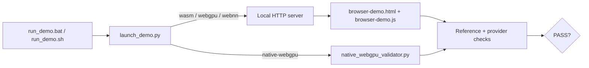

# ONNX Runtime + WebGPU Demo

[简体中文](README.zh-CN.md) · [Repository index](../../README.md) · [Full guide](../README.md)

| Item | Baseline |
|---|---|
| Last verified | `2026-07-17` |
| Routes | Browser WASM, browser WebGPU, browser WebNN, native Python WebGPU |
| Runtime | ORT Web 1.27.0; ONNX Runtime 1.27.0 + WebGPU plugin 0.1.0 |
| Model | `execution_provider_demo.onnx`: static float32 `MatMul → Add → Relu` |
| Entry points | `run_demo.bat` and `run_demo.sh` |

These remain the latest installable stable packages as of the verification date. The upstream plugin source already carries a higher development version, but PyPI still publishes 0.1.0; the wrappers intentionally install the published, tested pair.

## 1. Choose a route

Run from this folder:

| Route | Windows | Linux/macOS |
|---|---|---|
| Browser WASM baseline | `run_demo.bat wasm` | `bash run_demo.sh wasm` |
| Browser WebGPU | `run_demo.bat webgpu` | `bash run_demo.sh webgpu` |
| Browser WebNN GPU request | `run_demo.bat webnn --device gpu` | `bash run_demo.sh webnn --device gpu` |
| Native Python WebGPU | `run_demo.bat native-webgpu` | `bash run_demo.sh native-webgpu` |

| Route | Requirement |
|---|---|
| Browser | Python 3.10+ for the local HTTP server; current Chrome/Edge |
| Local browser assets | Optional Node.js LTS + `npm ci`; otherwise pinned assets load from jsDelivr |
| Native Windows | 64-bit CPython 3.11–3.14, x64 |
| Native Linux | 64-bit CPython 3.11–3.14, x86-64, glibc 2.27+ |
| Native macOS | 64-bit CPython 3.11–3.14, macOS 14+, Apple Silicon |

The pinned native route excludes Intel macOS because ONNX Runtime 1.27.0 has no macOS x86-64 core wheel.

## 2. Run the demo

| Step | Action | Result |
|---:|---|---|
| 1 | Open a terminal in this folder | Scripts resolve local files correctly |
| 2 | Optional: run `npm ci` | Browser assets are available offline |
| 3 | Run one command from the route table | Browser opens or native validation starts |
| 4 | Read the final `PASS` or `FAIL` | The requested route reports explicit evidence |

## 3. Read the result

| Route | A pass proves |
|---|---|
| Every browser route | Exact ORT Web version, model contract, and independent JavaScript math reference passed |
| Browser WebGPU/WebNN | A separate WASM comparison passed and strict mode did not use implicit CPU EP fallback |
| Native WebGPU | CPU ORT parity passed; the profile contains WebGPU compute events and zero CPU node events |

| Option | Meaning |
|---|---|
| `--allow-wasm-fallback` | Allows unsupported model nodes to use WASM only after the requested browser API/context initializes |
| `--webnn-backend auto` | Uses LiteRT before Windows build 26100; otherwise uses Chromium's platform default |
| `--webnn-backend litert` | Enables `WebNNLiteRT`, disables higher-priority platform backends, and disables legacy `WebNNDirectML` for older Chromium compatibility |

Fallback cannot hide a missing WebGPU adapter or unavailable WebNN API.

## 4. File map

| File | Purpose |
|---|---|
| `run_demo.bat` / `run_demo.sh` | Cross-platform entry points |
| `launch_demo.py` | HTTP server, browser launcher, and native dispatcher |
| `browser-demo.html` / `browser-demo.js` | Browser preflight, inference, parity, and timing UI |
| `native_webgpu_validator.py` | Native plugin registration, strict profile proof, and CPU parity |
| `execution_provider_demo.onnx` | Checked-in cross-provider smoke model |
| `package.json` / `package-lock.json` | Pinned local ORT Web assets |
| `requirements-native-webgpu.txt` | Pinned native Python stack |

## 5. Next step

Use the [full guide](../README.md) for platform setup, model compatibility, performance, offline deployment, and troubleshooting. Repeat the strict checks with the production model before deployment.
