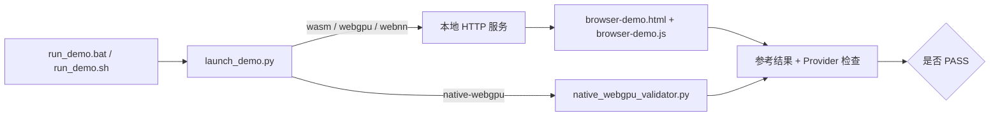

# ONNX Runtime + WebGPU 演示

[English](README.md) · [仓库首页](../../README.zh-CN.md) · [完整指南](../README.zh-CN.md)

| 项目 | 基线 |
|---|---|
| 最后验证 | `2026-07-17` |
| 路线 | 浏览器 WASM、浏览器 WebGPU、浏览器 WebNN、原生 Python WebGPU |
| Runtime | ORT Web 1.27.0；ONNX Runtime 1.27.0 + WebGPU 插件 0.1.0 |
| 模型 | `execution_provider_demo.onnx`：静态 float32 `MatMul → Add → Relu` |
| 验证入口 | `run_demo.bat`、`run_demo.sh` |

截至验证日期，这些仍是可安装的最新稳定包。上游插件源码已使用更高的开发版本号，但 PyPI 仍只发布 0.1.0；启动脚本会有意安装已发布、经过测试的固定组合。

## 1. 选择路线

在本目录运行：

| 路线 | Windows | Linux/macOS |
|---|---|---|
| 浏览器 WASM 基线 | `run_demo.bat wasm` | `bash run_demo.sh wasm` |
| 浏览器 WebGPU | `run_demo.bat webgpu` | `bash run_demo.sh webgpu` |
| 浏览器 WebNN GPU 请求 | `run_demo.bat webnn --device gpu` | `bash run_demo.sh webnn --device gpu` |
| 原生 Python WebGPU | `run_demo.bat native-webgpu` | `bash run_demo.sh native-webgpu` |

| 路线 | 要求 |
|---|---|
| 浏览器 | Python 3.10+ 用于本地 HTTP 服务；当前 Chrome/Edge |
| 本地浏览器文件 | 可选 Node.js LTS + `npm ci`；否则从 jsDelivr 加载固定版本文件 |
| 原生 Windows | 64 位 CPython 3.11–3.14、x64 |
| 原生 Linux | 64 位 CPython 3.11–3.14、x86-64、glibc 2.27+ |
| 原生 macOS | 64 位 CPython 3.11–3.14、macOS 14+、Apple Silicon |

由于 ONNX Runtime 1.27.0 没有 macOS x86-64 Core Wheel，固定原生路线不支持 Intel macOS。

## 2. 运行演示

| 步骤 | 操作 | 结果 |
|---:|---|---|
| 1 | 在本目录打开终端 | 脚本可正确定位本地文件 |
| 2 | 可选：运行 `npm ci` | 浏览器文件可离线使用 |
| 3 | 运行路线表中的一条命令 | 浏览器打开或原生验证启动 |
| 4 | 查看最后的 `PASS` 或 `FAIL` | 所选路线输出明确证据 |

## 3. 解读结果

| 路线 | 通过能证明什么 |
|---|---|
| 所有浏览器路线 | 准确 ORT Web 版本、模型 Contract 与独立 JavaScript 数学参考均通过 |
| 浏览器 WebGPU/WebNN | 独立 WASM 对比通过，严格模式未使用隐式 CPU EP 回退 |
| 原生 WebGPU | CPU ORT 数值一致性通过；Profile 包含 WebGPU 计算事件且 CPU 节点事件为零 |

| 选项 | 含义 |
|---|---|
| `--allow-wasm-fallback` | 仅在所请求浏览器 API/Context 初始化后，允许不支持的模型节点使用 WASM |
| `--webnn-backend auto` | Windows build 26100 之前使用 LiteRT；其他情况使用 Chromium 平台默认值 |
| `--webnn-backend litert` | 启用 `WebNNLiteRT`，禁用更高优先级平台后端，并为旧 Chromium 兼容性禁用旧 `WebNNDirectML` |

回退不能掩盖缺失 WebGPU Adapter 或不可用的 WebNN API。

## 4. 文件地图

| 文件 | 用途 |
|---|---|
| `run_demo.bat` / `run_demo.sh` | 跨平台入口 |
| `launch_demo.py` | HTTP 服务、浏览器启动器与原生分发器 |
| `browser-demo.html` / `browser-demo.js` | 浏览器预检查、推理、数值对比与计时 UI |
| `native_webgpu_validator.py` | 原生插件注册、严格 Profile 证明与 CPU 数值对比 |
| `execution_provider_demo.onnx` | 仓库附带的跨 Provider 冒烟模型 |
| `package.json` / `package-lock.json` | 固定版本的本地 ORT Web 文件 |
| `requirements-native-webgpu.txt` | 固定原生 Python 软件栈 |

## 5. 下一步

平台配置、模型兼容性、性能、离线部署与故障排查见[完整指南](../README.zh-CN.md)。部署前必须使用生产模型重复严格验证。
