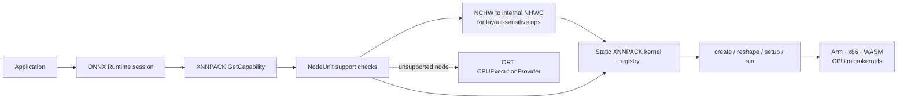
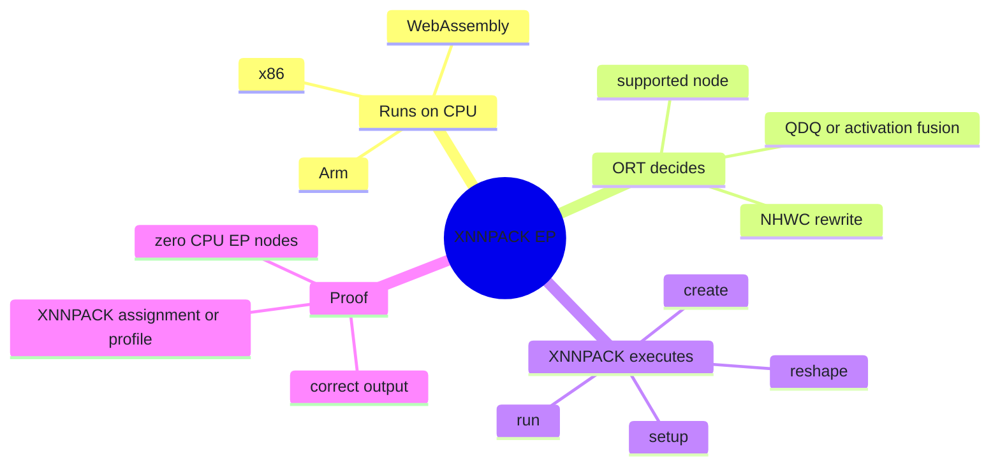
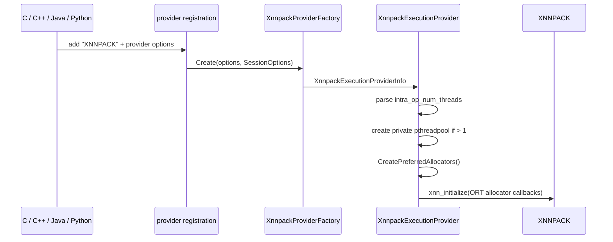
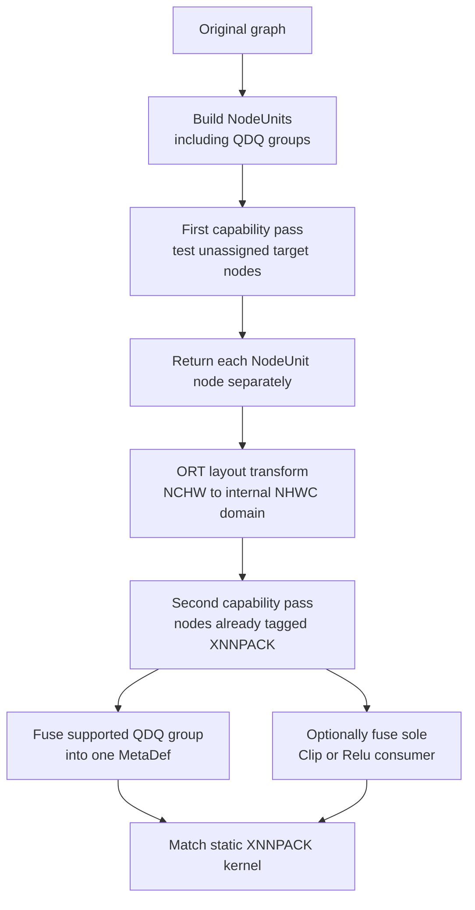
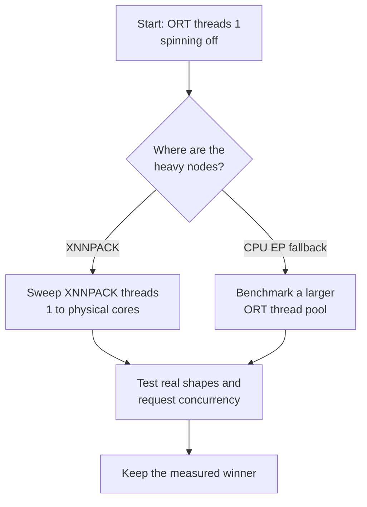
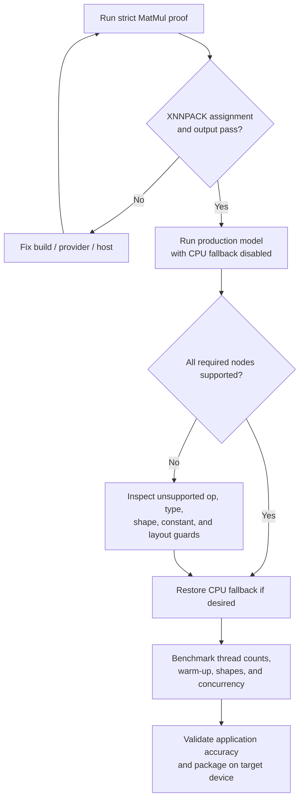

# ONNX Runtime + XNNPACK: cross-platform CPU inference

[简体中文](README.zh-CN.md) · [Repository index](../README.md) · [Official XNNPACK EP documentation](https://onnxruntime.ai/docs/execution-providers/Xnnpack-ExecutionProvider.html) · [Audited source at `bf6aa006`](https://github.com/microsoft/onnxruntime/tree/bf6aa0063d1c178c4a4d33ed6770425834147e2a/onnxruntime/core/providers/xnnpack)

| Item | Baseline |
|---|---|
| Last verified | `2026-07-17` against ONNX Runtime `main` commit [`bf6aa006`](https://github.com/microsoft/onnxruntime/commit/bf6aa0063d1c178c4a4d33ed6770425834147e2a) and stable `v1.27.1` commit [`df2ba1cf`](https://github.com/microsoft/onnxruntime/commit/df2ba1cf8108aa63627cf4cdf8f807880b938616) |
| What it accelerates | CPU inference through architecture-specific XNNPACK microkernels; **not** a GPU or NPU route |
| Official package routes | Android Maven `onnxruntime-android`; iOS CocoaPods `onnxruntime-c` / `onnxruntime-objc` |
| Desktop Python route | Build ONNX Runtime from source with `--use_xnnpack`; the ordinary PyPI wheel is not assumed to include this EP |
| Entry point | [`one_click.py`](one_click.py) |
| Proof | Deterministic `MatMul`, independent NumPy reference, current-session graph assignment and/or profile, with ORT CPU EP fallback disabled |
| Validation boundary | Launcher unit tests pass on Linux; the source build and strict inference require working access to GitHub/codeload and the build dependencies below |

### How to read this audit

| Claim type | Ground truth used here | What it can prove |
|---|---|---|
| Package and public API | [Official XNNPACK page](https://onnxruntime.ai/docs/execution-providers/Xnnpack-ExecutionProvider.html) and [official build guide](https://onnxruntime.ai/docs/build/eps.html#xnnpack) | Supported package routes, API names, and documented options |
| Stable behavior | Immutable ORT [`v1.27.1` source](https://github.com/microsoft/onnxruntime/tree/df2ba1cf8108aa63627cf4cdf8f807880b938616/onnxruntime/core/providers/xnnpack) | The launcher and Section 7 capability rules |
| Newer behavior | Immutable audited `main` [commit `bf6aa006`](https://github.com/microsoft/onnxruntime/tree/bf6aa0063d1c178c4a4d33ed6770425834147e2a/onnxruntime/core/providers/xnnpack) | Post-release fixes and source drift |
| This repository | `one_click.py` unit tests plus strict assignment/profile checks | Launcher behavior on the machine where it is run |
| Performance | Measurements on the target device and production model | Speed, memory, power, and thermals; source inspection cannot prove these |

> [!IMPORTANT]
> XNNPACK runs on the **CPU**. In this guide, “no CPU fallback” means that no graph node was assigned to ONNX Runtime's generic `CPUExecutionProvider`; it does not mean the processor was avoided. The strict test proves the XNNPACK software path, not a separate hardware device.

---

## Contents

- [ONNX Runtime + XNNPACK: cross-platform CPU inference](#onnx-runtime--xnnpack-cross-platform-cpu-inference)
    - [How to read this audit](#how-to-read-this-audit)
  - [Contents](#contents)
  - [1. Understand the route](#1-understand-the-route)
    - [What XNNPACK is and is not](#what-xnnpack-is-and-is-not)
  - [2. Choose a package or build](#2-choose-a-package-or-build)
    - [2.1 Support and packaging matrix](#21-support-and-packaging-matrix)
    - [2.2 Desktop build prerequisites](#22-desktop-build-prerequisites)
  - [3. Run the one-click proof](#3-run-the-one-click-proof)
    - [Why the smoke model is `MatMul`](#why-the-smoke-model-is-matmul)
  - [4. Source architecture](#4-source-architecture)
    - [4.1 File map](#41-file-map)
    - [4.2 Construction call chain](#42-construction-call-chain)
    - [4.3 Static kernels, not compiled subgraphs](#43-static-kernels-not-compiled-subgraphs)
  - [5. Graph partitioning, layout, and fusion](#5-graph-partitioning-layout-and-fusion)
    - [5.1 Why capability runs twice](#51-why-capability-runs-twice)
    - [5.2 Activation fusion](#52-activation-fusion)
  - [6. Threading and concurrency](#6-threading-and-concurrency)
  - [7. Source-audited operator coverage](#7-source-audited-operator-coverage)
    - [Documentation drift found by the source audit](#documentation-drift-found-by-the-source-audit)
    - [Known checker and kernel gaps](#known-checker-and-kernel-gaps)
    - [FP16 gate](#fp16-gate)
    - [Dynamic-shape implications](#dynamic-shape-implications)
  - [8. Kernel and memory lifecycle](#8-kernel-and-memory-lifecycle)
    - [8.1 Common execution pattern](#81-common-execution-pattern)
    - [8.2 Layout and weight prepacking](#82-layout-and-weight-prepacking)
    - [8.3 Allocator and caches](#83-allocator-and-caches)
  - [9. API examples](#9-api-examples)
    - [9.1 Python with a custom wheel](#91-python-with-a-custom-wheel)
    - [9.2 C++](#92-c)
    - [9.3 Android Java](#93-android-java)
  - [10. Move from smoke test to production](#10-move-from-smoke-test-to-production)
    - [10.1 Qualification ladder](#101-qualification-ladder)
    - [10.2 Model checklist](#102-model-checklist)
  - [11. Troubleshooting](#11-troubleshooting)
  - [12. Primary sources](#12-primary-sources)

---

## 1. Understand the route

[XNNPACK](https://github.com/google/XNNPACK) is a library of optimized neural-network operators for Arm, x86, and WebAssembly CPUs. ONNX Runtime's XNNPACK Execution Provider is the adapter that decides which ONNX nodes XNNPACK can execute, rewrites layouts where needed, constructs XNNPACK operators, and invokes their microkernels.



### What XNNPACK is and is not

| Question | Answer |
|---|---|
| Is XNNPACK a CPU backend? | Yes. Inputs, outputs, allocator, and execution stay in CPU memory. |
| Does it require a GPU/NPU driver? | No. It selects CPU microkernels at build/runtime. |
| Is it the same as ORT CPU EP? | No. Both use the CPU, but they have different kernel registries, layout choices, threading, and operator coverage. |
| Is it always faster? | No. Unsupported nodes, layout transposes, small tensors, thread contention, and model shape can erase the gain. Benchmark the production model. |
| Does `get_available_providers()` prove use? | No. It proves only that the binary was built with XNNPACK. Inspect assignment/profile evidence for the current session. |
| Can CPU EP remain as fallback in production? | Yes. That usually improves coverage. The tutorial disables it only to make the proof fail closed. |



---

## 2. Choose a package or build

### 2.1 Support and packaging matrix

| Target | Official distribution | Registration | This repository's scope |
|---|---|---|---|
| Android | Maven [`com.microsoft.onnxruntime:onnxruntime-android`](https://mvnrepository.com/artifact/com.microsoft.onnxruntime/onnxruntime-android) includes XNNPACK | Java `SessionOptions.addXnnpack(...)` | Documented; use the mobile package in an Android app |
| iOS | CocoaPods `onnxruntime-c` and `onnxruntime-objc` include XNNPACK | C/C++ or Objective-C wrapper | Documented; build/package work requires macOS/Xcode |
| Windows | Custom ONNX Runtime build with `--use_xnnpack` | C, C++, or a custom Python wheel | Supported by the one-click launcher |
| Linux | Custom ONNX Runtime build with `--use_xnnpack` | C, C++, or a custom Python wheel | Supported by the one-click launcher |
| WebAssembly | XNNPACK and ORT both have WASM build paths | Build-specific JavaScript/C API integration | Source-discussed only; use the Web folder for browser-first demos |

> [!WARNING]
> `pip install onnxruntime` is not the desktop XNNPACK installation recipe. If `XnnpackExecutionProvider` is absent from `onnxruntime.get_available_providers()`, use a custom `--use_xnnpack` wheel. Do not accept `CPUExecutionProvider` as equivalent proof.

### 2.2 Desktop build prerequisites

The launcher pins ONNX Runtime `v1.27.1` and verifies immutable commit `df2ba1cf8108aa63627cf4cdf8f807880b938616` before building.

| Launcher gate | Required value |
|---|---|
| Host | Linux or Windows; 64-bit process |
| Python | CPython 3.11–3.14 |
| CMake | 3.28 or newer |
| Compiler | Linux `cc` + `c++` (ORT rejects GCC below 11.1); Windows `cl` from Visual Studio 2022 |
| Build tool | Ninja when available; Make is accepted on Linux as the fallback |
| Isolated Python stack | Custom ORT `1.27.1` wheel from the pinned commit plus `onnx==1.22.0`; the launcher installs and rechecks both |

**Ubuntu 24.04 / Debian-family baseline:**

```bash
sudo apt update
sudo apt install -y build-essential git python3-dev python3-venv ninja-build
cmake --version
python3 --version
```

Ubuntu 24.04's packages meet the baseline. On an older distribution, install current CMake and compiler packages from an approved source. `ninja-build` is preferred; the launcher uses Make if Ninja is absent.

**Windows baseline:**

1. Install 64-bit CPython 3.11–3.14.
2. Install Git for Windows.
3. Install CMake 3.28+ and add it to `PATH`.
4. Install Visual Studio 2022 with **Desktop development with C++**, MSVC, and a current Windows SDK.
5. Run from **x64 Native Tools Command Prompt for VS 2022**.

The desktop launcher rejects macOS; use the official iOS package flow on Apple mobile targets.

---

## 3. Run the one-click proof

From the repository root:

```bash
python XNNPACK/one_click.py
```

The first run is a real source build and can take a while. It performs the following steps:

1. Creates `XNNPACK/.venv-xnnpack`.
2. obtains the pinned ONNX Runtime source and verifies the exact commit;
3. builds a Release Python wheel with `--use_xnnpack` and disables unrelated unit-test targets;
4. installs that wheel plus the pinned model-generation dependency, then checks the wheel's embedded ORT build commit;
5. generates a static FP32 `MatMul` with a constant right-hand matrix;
6. explicitly requests only `XnnpackExecutionProvider`, disables Python's retry fallback, and forbids ORT's implicitly registered CPU EP from receiving graph nodes;
7. compares output against an independent NumPy result;
8. requires XNNPACK graph-assignment or profile evidence and rejects any ORT CPU EP node.

Useful variants:

```bash
# Reuse an already-built custom wheel.
python XNNPACK/one_click.py --wheel /path/to/onnxruntime-1.27.1-*.whl

# Recreate generated source/build state.
python XNNPACK/one_click.py --refresh

# Tune source-build jobs and XNNPACK's requested thread count separately.
python XNNPACK/one_click.py --jobs 4 --threads 8

# Fast offline launcher tests; no ONNX Runtime build.
python XNNPACK/one_click.py --unit-tests
```

Expected final evidence resembles:

```text
Assignment evidence : {'XnnpackExecutionProvider': 1}
Profile evidence    : {'XnnpackExecutionProvider': 3}
Max abs error       : ...
[PASS/通过] XNNPACK executed the model with correct output and no CPU fallback.
```

The profile count varies with warm-up and measured runs. The pass condition is not a fixed count; it is at least one current-session XNNPACK assignment/profile event, correct output, and zero `CPUExecutionProvider` graph events.

### Why the smoke model is `MatMul`

`MatMul` is layout-insensitive in this EP and has a direct static XNNPACK kernel. A convolution model exercises more of the layout machinery, but ORT can insert boundary transposes around an internal NHWC region. A single supported `MatMul` makes the strict no-fallback test easier to interpret. Production qualification must still test the operators and layouts in the real model.

---

## 4. Source architecture

### 4.1 File map

| Source | Responsibility |
|---|---|
| [`xnnpack_provider_factory.cc`](https://github.com/microsoft/onnxruntime/blob/bf6aa0063d1c178c4a4d33ed6770425834147e2a/onnxruntime/core/providers/xnnpack/xnnpack_provider_factory.cc) | Captures provider options/session options and creates `XnnpackExecutionProvider` |
| [`xnnpack_execution_provider.h`](https://github.com/microsoft/onnxruntime/blob/bf6aa0063d1c178c4a4d33ed6770425834147e2a/onnxruntime/core/providers/xnnpack/xnnpack_execution_provider.h) | Declares preferred NHWC layout, filtered fusion style, serialized Session runs, allocator, and private pthreadpool |
| [`xnnpack_execution_provider.cc`](https://github.com/microsoft/onnxruntime/blob/bf6aa0063d1c178c4a4d33ed6770425834147e2a/onnxruntime/core/providers/xnnpack/xnnpack_execution_provider.cc) | Registers static kernels, owns the pool, initializes XNNPACK, and implements two-pass `GetCapability` |
| [`detail/node_support_checker.cc`](https://github.com/microsoft/onnxruntime/blob/bf6aa0063d1c178c4a4d33ed6770425834147e2a/onnxruntime/core/providers/xnnpack/detail/node_support_checker.cc) | Dispatches each ONNX/NodeUnit support check and tests `Clip`/`Relu` fusion |
| [`detail/utils.cc`](https://github.com/microsoft/onnxruntime/blob/bf6aa0063d1c178c4a4d33ed6770425834147e2a/onnxruntime/core/providers/xnnpack/detail/utils.cc) | QDQ classification/fusion, activation MetaDefs, quantization parsing, and supported padding modes |
| [`xnnpack_kernel.h`](https://github.com/microsoft/onnxruntime/blob/bf6aa0063d1c178c4a4d33ed6770425834147e2a/onnxruntime/core/providers/xnnpack/xnnpack_kernel.h) | Base kernel that captures the private pool and optional XNNPACK caches |
| [`xnnpack_init.cc`](https://github.com/microsoft/onnxruntime/blob/bf6aa0063d1c178c4a4d33ed6770425834147e2a/onnxruntime/core/providers/xnnpack/xnnpack_init.cc) | Adapts an ORT CPU allocator to XNNPACK's allocation callback table |
| [`nn/`](https://github.com/microsoft/onnxruntime/tree/bf6aa0063d1c178c4a4d33ed6770425834147e2a/onnxruntime/core/providers/xnnpack/nn) | Conv, ConvTranspose, AveragePool, and MaxPool support checks/kernels |
| [`math/`](https://github.com/microsoft/onnxruntime/tree/bf6aa0063d1c178c4a4d33ed6770425834147e2a/onnxruntime/core/providers/xnnpack/math) | Gemm, MatMul, and Softmax support checks/kernels |
| [`tensor/resize.cc`](https://github.com/microsoft/onnxruntime/blob/bf6aa0063d1c178c4a4d33ed6770425834147e2a/onnxruntime/core/providers/xnnpack/tensor/resize.cc) | Bilinear Resize support check and XNNPACK operator lifecycle |
| [`onnxruntime_providers_xnnpack.cmake`](https://github.com/microsoft/onnxruntime/blob/bf6aa0063d1c178c4a4d33ed6770425834147e2a/cmake/onnxruntime_providers_xnnpack.cmake) | Builds this EP as a static library and defines `USE_XNNPACK` |
| [`external/xnnpack.cmake`](https://github.com/microsoft/onnxruntime/blob/bf6aa0063d1c178c4a4d33ed6770425834147e2a/cmake/external/xnnpack.cmake) | Fetches XNNPACK/pthreadpool/fxdiv, selects the target architecture, and adds Arm KleidiAI where applicable |

### 4.2 Construction call chain



The provider is statically linked into the main ONNX Runtime binary, unlike provider-bridge EPs that ship as separate `onnxruntime_providers_*.so/.dll` libraries. `get_available_providers()` includes XNNPACK only when `USE_XNNPACK` was compiled in.

### 4.3 Static kernels, not compiled subgraphs

XNNPACK's current `GetCapability` returns `ComputeCapability` objects that match kernels in its static `KernelRegistry`. It does not implement a subgraph compiler. The source explicitly leaves a future insertion point for compiled kernels; today, graph partitioning ultimately selects registered `OpKernel` classes.

---

## 5. Graph partitioning, layout, and fusion

### 5.1 Why capability runs twice

`XnnpackExecutionProvider::GetPreferredLayout()` returns `NHWC`, while standard ONNX Conv/Pool models are generally NCHW. The provider's capability process therefore cooperates with ORT's layout transformer:



Key details:

- `QDQ::GetAllNodeUnits` treats a quantized operator and its surrounding Quantize/Dequantize nodes as one unit.
- On the first pass, support is decided from the target operator; individual group nodes are requested separately so layout transformation can run.
- On the second pass, the provider collects a supported QDQ group into one fused MetaDef such as `QLinearConv` or dynamic-domain `QLinearSoftmax`.
- Layout-sensitive kernels are registered in ORT's internal NHWC domain. Gemm, MatMul, and Softmax remain in the ONNX domain.
- Unsupported nodes are left for lower-priority EPs. ORT always registers a default CPU EP when the application does not add one. The tutorial explicitly requests only XNNPACK, disables Python's session-creation retry, and enables `session.disable_cpu_ep_fallback=1`; ORT then fails initialization if any graph node is unassigned or lands on the implicit CPU EP.

### 5.2 Activation fusion

A standalone `Relu` or `Clip` is not an XNNPACK kernel in this provider. It can be folded into a preceding internal-NHWC `Conv`, `MaxPool`, or `AveragePool` by storing output min/max in the producer's MetaDef. Quantized QDQ groups are excluded from this activation fusion.

> [!WARNING]
> Stable `v1.27.1` predates commit [`86cbd205`](https://github.com/microsoft/onnxruntime/commit/86cbd2052540c59ad54f5ca135f9b0f58453557a), which rejects fusion when the pre-activation output is also a graph output or has another consumer. In `v1.27.1`, such a branched graph can fail session creation with a dangling input after fusion. The one-click `MatMul` proof is unaffected. For a production model with branched Conv/Pool outputs, use a release containing that fix or backport it and rerun assignment tests.

---

## 6. Threading and concurrency

XNNPACK and ORT have separate intra-op pools. Oversubscribing both can reduce performance substantially.

| Setting | Owner | Source behavior |
|---|---|---|
| `SessionOptions.intra_op_num_threads` | ORT | Controls ORT's intra-op pool |
| `session.intra_op.allow_spinning` | ORT | Spinning workers consume CPU while waiting; disable when XNNPACK owns the compute pool |
| XNNPACK `intra_op_num_threads` | XNNPACK EP | Public contract: value >= `1`, default/effective value `1`. Internally an omitted option is stored as `0`, copies the raw ORT session setting, and creates a private pthreadpool only when the result is greater than `1`. Set it explicitly when tuning. |
| `ConcurrentRunSupported()` | XNNPACK EP | Returns `false`; ORT consequently serializes `Run()` calls on the same Session with a session-wide lock |

Recommended starting point:

```python
import os
import onnxruntime as ort

physical_cores = max(1, (os.cpu_count() or 1) // 2)
options = ort.SessionOptions()
options.execution_mode = ort.ExecutionMode.ORT_SEQUENTIAL
options.intra_op_num_threads = 1
options.add_session_config_entry("session.intra_op.allow_spinning", "0")

session = ort.InferenceSession(
    "model.onnx",
    sess_options=options,
    providers=[
        ("XnnpackExecutionProvider", {"intra_op_num_threads": str(physical_cores)}),
        "CPUExecutionProvider",  # normal production fallback; omit for strict proof
    ],
)
```

Then benchmark realistic request concurrency and model shapes. If compute-heavy unsupported nodes run on ORT CPU EP, a larger ORT pool may help; the official guidance explicitly recommends measuring both arrangements.



> [!NOTE]
> In the audited `v1.27.1` source, the Gemm and MatMul kernels pass `nullptr` to `xnn_run_operator`, although they pass the private pool during reshape. Do not assume that increasing XNNPACK's thread option speeds those kernels in this revision. Conv, pool, Softmax, and Resize pass the private pool to the run path. Treat timings as model- and revision-specific evidence.

---

## 7. Source-audited operator coverage

The public page is a summary. This table gives a conservative production contract from the `v1.27.1` checker, registry, and kernel together. Cases where the checker accepts more than the runtime safely implements are listed immediately below.

| Operator / pattern | Source-backed production-safe contract |
|---|---|
| `Conv` | Capability requires opset >= 11; rank 3 (1D, represented internally as height 1) or rank 4 (2D); known C/spatial dimensions; constant weights and optional bias; FP32/eligible FP16; grouped/depthwise paths; supported auto-pad is `NOTSET`, `VALID`, or `SAME_UPPER` |
| `QLinearConv`, QDQ `Conv` | UINT8 or INT8 with matching input/weight/output types; constant scales, zero points, weights, and optional bias; INT8 per-output-channel weights require zero or omitted weight zero points; no mixed U8/S8 |
| `ConvTranspose`, QDQ/`QLinearConvTranspose` | Shares ConvBase's rank/static/constant checks and deconvolution path; use per-tensor quantization because explicit `QLinearConvTranspose` rejects per-channel INT8 weights |
| `AveragePool` | Opset >= 7; rank 4; known C/H/W; 2D kernel and not 1x1; `ceil_mode=0`; default dilation; FP32/eligible FP16; float path requires `count_include_pad=0` |
| Quantized AveragePool | A `QLinearAveragePool` kernel is registered, but the capability helper currently returns `false` for every quantized AveragePool. Treat it as effectively unsupported in this revision. |
| `MaxPool` | Opset >= 8; rank 4; known C/H/W; no optional indices output; 2D non-1x1 kernel; `ceil_mode=0`; auto-pad `NOTSET`, `VALID`, or `SAME_UPPER`; FP32/eligible FP16/UINT8/INT8 |
| QDQ `MaxPool` | Input and output quantized type must match and be UINT8 or INT8; the pool itself does not consume separate quantization parameters |
| Plain ONNX `Resize` | Opset >= 10; rank 4; FP32, eligible FP16 through opset 18, UINT8, or INT8; constant `scales`/`sizes`; keep N/C unchanged and H/W plus output H/W known; `mode=linear`; no antialias/axes/exclude-outside; stretch aspect policy; zero extrapolation; restricted coordinate modes; downsampling factor checks apply |
| QDQ `Resize` | Classified by the checker, but fusion emits an ONNX-domain `Resize` while the static kernel is registered in the internal NHWC domain. The upstream tests are disabled. Treat this pattern as unsupported in the audited revisions. |
| `Gemm` | FP32/eligible FP16; 2D A/B; `alpha=1`, `beta=1`, `transA=0`; constant B; C absent or a constant 1D output-channel bias; `transB` is handled |
| `MatMul` | FP32/eligible FP16; A rank >= 1; B is a nonempty constant of rank 1 or 2; N-D A outer dimensions are flattened into the runtime batch |
| `Softmax` | FP32/eligible FP16; keep reduced dimensions static; opset >= 13 requires the last axis; opset <= 12 retains flatten-from-axis semantics |
| QDQ `Softmax` | UINT8 only; output scale must be approximately `1/256` and output zero point `0`; fused into a dynamic internal `QLinearSoftmax` schema |
| `Relu` / `Clip` | No standalone kernel; may fuse after supported internal-NHWC Conv/MaxPool/AveragePool with constant Clip bounds. For safe fusion, the producer output must not be a graph output and the activation must be its only consumer. |

### Documentation drift found by the source audit

| Public summary | Audited source ground truth |
|---|---|
| Conv is 2D only | Rank-3 1D Conv/ConvTranspose is accepted by presenting height as 1 |
| MatMul is 2D only | A may be N-D; constant B remains rank 1 or 2 |
| Registered operator means usable | Quantized AveragePool is registered but always rejected by its capability helper |
| Registry contains old Conv versions | `ConvBase::IsOnnxNodeSupported` rejects ONNX Conv/ConvTranspose below opset 11 before layout conversion |
| XNNPACK threads help Gemm/MatMul | In `v1.27.1`, both pass the pool to reshape but pass `nullptr` to `xnn_run_operator` |

### Known checker and kernel gaps

The first six rows remain present at audited `main` commit `bf6aa006`; the activation row is fixed there by `86cbd205`.

| Edge case | What the source does | Safe rule |
|---|---|---|
| Per-channel INT8 Conv weight zero point is nonzero | The loop logs and breaks, but still assigns the per-channel type | Use zero or omit the weight zero point |
| `Gemm transA=1` | Capability accepts it; the kernel passes raw A to fully connected without transposing it | Use `transA=0` |
| General `Gemm` C broadcasting | Capability accepts selected rank-1/rank-2 shapes; XNNPACK receives C only as a bias pointer | Omit C or use a 1D bias of output width N |
| `Resize` changes batch or has dynamic H/W | Checker verifies C but not N; `Compute` forces output N to input N, and operator creation fixes output H/W | Keep N/C unchanged and H/W static |
| FP16 `Resize` at opset 19 | Checker admits FP16, but the opset-19 kernel registration omits FP16 | Use opset 10–18 for FP16, or use FP32/UINT8/INT8 |
| Opset <= 12 `Softmax` has unknown reduced dimensions | An inner-loop `break` does not reject the node; channel count is precomputed during Session creation | Keep dimensions from `axis` onward static |
| `v1.27.1` activation producer has another consumer or graph output | Stable fusion does not reject the branch and can leave a dangling input | Upgrade/backport `86cbd205`, or do not branch the pre-activation output |

### FP16 gate

The provider compiles FP16 support for Arm/Arm64 and for non-mobile x86/x64 targets, then relies on XNNPACK's hardware compatibility. A model type appearing in a kernel declaration does not guarantee that a particular processor can execute it. Start with FP32, confirm assignment, then test FP16 accuracy and device compatibility.

### Dynamic-shape implications

XNNPACK uses create → reshape → setup → run, but create still fixes important model data:

| Operator | Fixed at Session creation | Runtime variation that remains safe |
|---|---|---|
| Conv / pool | C/H/W, attributes, constant weights | Batch N |
| MatMul | Constant rank-1/rank-2 B and reduction width | A's outer batch dimensions |
| Softmax | Dimensions participating in the reduction | Dimensions before the reduced region |
| Resize | Constant scales/sizes and output H/W; unchanged C | Batch N may vary when N itself is not resized |

For mobile deployment, make channels/spatial dimensions static or use ORT free-dimension overrides before assuming XNNPACK assignment.

---

## 8. Kernel and memory lifecycle

### 8.1 Common execution pattern

Most kernels follow the same four-stage XNNPACK API:

1. **Create:** validate attributes and construct an `xnn_operator` once.
2. **Reshape:** provide runtime batch/spatial dimensions and query workspace needs.
3. **Setup:** bind the current input/output pointers.
4. **Run:** execute with the private pthreadpool where the kernel passes it.

`XnnpackOperatorDeleter` calls `xnn_delete_operator` through RAII. Conv and Resize allocate aligned per-run workspace through the ORT-backed XNNPACK allocator.

### 8.2 Layout and weight prepacking

The layout transformer changes activation tensors for Conv/Pool/Resize to internal NHWC. Constant convolution weights are separately prepacked because their transform is not a simple activation transpose:

- Conv: ONNX `M,C/group,kH,kW` → XNNPACK `M,kH,kW,C/group`.
- Grouped ConvTranspose introduces an explicit group dimension and moves input channels to the innermost position.
- Gemm/MatMul use XNNPACK fully-connected operators with constant B.

This is why constant weights are a hard capability requirement: operator creation and packing occur before `Compute`.

### 8.3 Allocator and caches

| Item | Audited behavior |
|---|---|
| Allocator | `CreatePreferredAllocators` lazily creates a CPU allocator labeled `XnnpackExecutionProvider`, installs the callback table, and calls `xnn_initialize`; memory remains on the host CPU |
| Reallocation | A null pointer is treated as allocate; reallocating an existing pointer raises `ORT_NOT_IMPLEMENTED` |
| Weights cache | Conv/Gemm/MatMul request it only under `XNN_CACHE_ENABLE`; neither audited CMake file defines that macro, and the launcher does not add it |
| Code cache | Disabled because create/free is not exposed by public `xnnpack.h` |

---

## 9. API examples

### 9.1 Python with a custom wheel

```python
import onnxruntime as ort

assert "XnnpackExecutionProvider" in ort.get_available_providers()

options = ort.SessionOptions()
options.graph_optimization_level = ort.GraphOptimizationLevel.ORT_ENABLE_ALL
options.execution_mode = ort.ExecutionMode.ORT_SEQUENTIAL
options.intra_op_num_threads = 1
options.add_session_config_entry("session.intra_op.allow_spinning", "0")

session = ort.InferenceSession(
    "model.onnx",
    sess_options=options,
    providers=[
        ("XnnpackExecutionProvider", {"intra_op_num_threads": "4"}),
        "CPUExecutionProvider",
    ],
)
```

For strict qualification, remove `CPUExecutionProvider`, set `session.disable_cpu_ep_fallback` to `1`, enable `session.record_ep_graph_assignment_info`, and inspect the current profile as the supplied launcher does.

### 9.2 C++

```cpp
Ort::Env env{ORT_LOGGING_LEVEL_ERROR, "xnnpack"};
Ort::SessionOptions options;
options.SetExecutionMode(ExecutionMode::ORT_SEQUENTIAL);
options.SetIntraOpNumThreads(1);
options.AddConfigEntry("session.intra_op.allow_spinning", "0");
options.AppendExecutionProvider(
    "XNNPACK", {{"intra_op_num_threads", "4"}});
Ort::Session session{env, model_path, options};
```

The generic registration API accepts both short name `XNNPACK` and canonical name `XnnpackExecutionProvider`.

### 9.3 Android Java

```java
try (OrtSession.SessionOptions options = new OrtSession.SessionOptions()) {
    options.setExecutionMode(OrtSession.SessionOptions.ExecutionMode.SEQUENTIAL);
    options.setIntraOpNumThreads(1);
    options.addConfigEntry("session.intra_op.allow_spinning", "0");
    options.addXnnpack(java.util.Collections.singletonMap("intra_op_num_threads", "4"));

    try (OrtSession session = environment.createSession(modelPath, options)) {
        // Run inference.
    }
}
```

Use the official `onnxruntime-android` Maven artifact so the native library already contains XNNPACK. Keep the `SessionOptions` alive for as long as the session, as required by the Java binding contract.

---

## 10. Move from smoke test to production

### 10.1 Qualification ladder



### 10.2 Model checklist

| Check | Why it matters |
|---|---|
| Use a supported operator/opset combination | XNNPACK's upstream library has broader scope than this ORT EP's registry/checkers |
| Keep Conv/Pool C/H/W static | Capability checking needs them before kernel construction |
| Make Conv/Gemm/MatMul weights initializers | Runtime weight inputs are rejected |
| Inspect NCHW↔NHWC boundaries | Transpose cost can exceed kernel savings on small/fragmented subgraphs |
| Validate QDQ scales, zero points, and tensor types | Mixed or nonconstant quantization parameters are rejected |
| Test FP32 before FP16/INT8 | Separates integration failure from precision/hardware compatibility |
| Benchmark both thread pools deliberately | Default pools can contend or oversubscribe physical cores |
| Test on the actual phone/CPU | Emulator and desktop results do not represent mobile microkernel selection or thermals |
| Warm up before timing | Initial packing, allocation, and cache state affect first-run latency |
| Keep assignment evidence in CI | Package/build changes can remove XNNPACK while inference silently remains valid on CPU EP |

The included model is a qualification workload, not a benchmark. Report end-to-end latency, throughput, memory, thermals/power, and task-level accuracy using representative inputs.

---

## 11. Troubleshooting

| Symptom | Likely cause | Action |
|---|---|---|
| `XnnpackExecutionProvider` absent | Stock wheel or build omitted `--use_xnnpack` | Run the launcher or install a verified custom wheel; on mobile use the official package |
| Source build cannot download | GitHub/codeload or dependency endpoint is blocked | Configure the organization's approved proxy/cache; do not substitute unverified archives |
| CMake rejected | CMake below 3.28 or unsupported toolchain | Install a current CMake and compiler, then rerun `--refresh` |
| Session fails with CPU fallback disabled | At least one node violates an XNNPACK support guard | Inspect verbose logs/assignment with fallback enabled; check the operator table above |
| Conv/Pool stays on CPU EP | Dynamic C/H/W, unsupported padding/attribute, optional output, or nonconstant weight/bias | Freeze dimensions/initializers or retain CPU fallback |
| Quantized model stays on CPU EP | Wrong U8/S8 combination, dynamic quant params, per-channel zero point, or unsupported QDQ pattern | Compare scales/zero points/types against Section 7 |
| `Clip`/`Relu` branch causes invalid graph on `v1.27.1` | Stable branch predates the side-consumer fusion fix | Upgrade/backport commit `86cbd205`, or avoid exposing/branching the pre-activation output |
| More threads are slower | ORT and XNNPACK pools contend, topology detection is imperfect, or workload is too small | ORT intra-op `1`, spinning `0`, sweep XNNPACK threads from 1 to physical cores |
| `--threads` does not speed MatMul/Gemm | Audited kernels run the operator with a null run-time pool | Treat as revision behavior; benchmark another release or supported Conv-heavy workload |
| Correct output but no XNNPACK events | Provider loaded but graph was not assigned, or the evidence API/profile is unavailable | Do not call it a pass; use a full custom build and inspect current-session assignment/profile |
| Android emulator is slow | Emulator architecture/microkernels differ from the target | Validate on a physical Arm device |

---

## 12. Primary sources

- [Official XNNPACK Execution Provider page](https://onnxruntime.ai/docs/execution-providers/Xnnpack-ExecutionProvider.html)
- [Official EP build instructions](https://onnxruntime.ai/docs/build/eps.html#xnnpack)
- [Audited `main` snapshot (`bf6aa006`)](https://github.com/microsoft/onnxruntime/tree/bf6aa0063d1c178c4a4d33ed6770425834147e2a/onnxruntime/core/providers/xnnpack)
- [Live `main` source (may drift)](https://github.com/microsoft/onnxruntime/tree/main/onnxruntime/core/providers/xnnpack)
- [Pinned stable provider source (`v1.27.1`, `df2ba1cf`)](https://github.com/microsoft/onnxruntime/tree/df2ba1cf8108aa63627cf4cdf8f807880b938616/onnxruntime/core/providers/xnnpack)
- [Provider registration at audited `main`](https://github.com/microsoft/onnxruntime/blob/bf6aa0063d1c178c4a4d33ed6770425834147e2a/onnxruntime/core/session/provider_registration.cc)
- [Python provider factory at audited `main`](https://github.com/microsoft/onnxruntime/blob/bf6aa0063d1c178c4a4d33ed6770425834147e2a/onnxruntime/python/onnxruntime_pybind_state.cc)
- [XNNPACK CMake integration at audited `main`](https://github.com/microsoft/onnxruntime/blob/bf6aa0063d1c178c4a4d33ed6770425834147e2a/cmake/external/xnnpack.cmake)
- [XNNPACK upstream project](https://github.com/google/XNNPACK)
- [Post-`v1.27.1` activation side-consumer fix](https://github.com/microsoft/onnxruntime/commit/86cbd2052540c59ad54f5ca135f9b0f58453557a)
