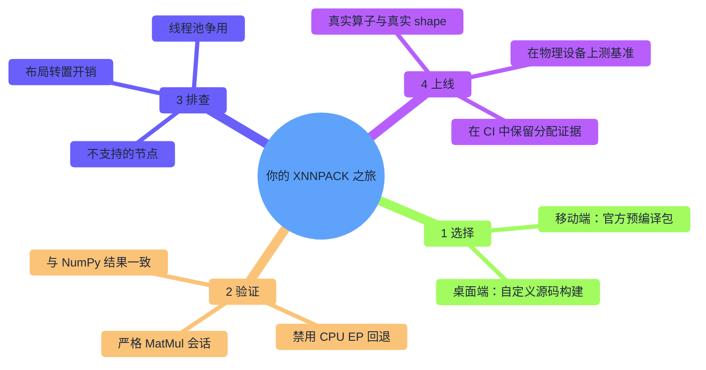
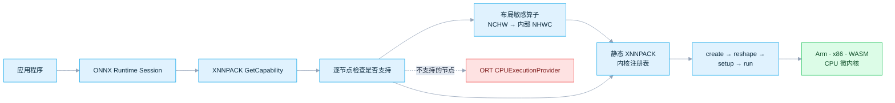
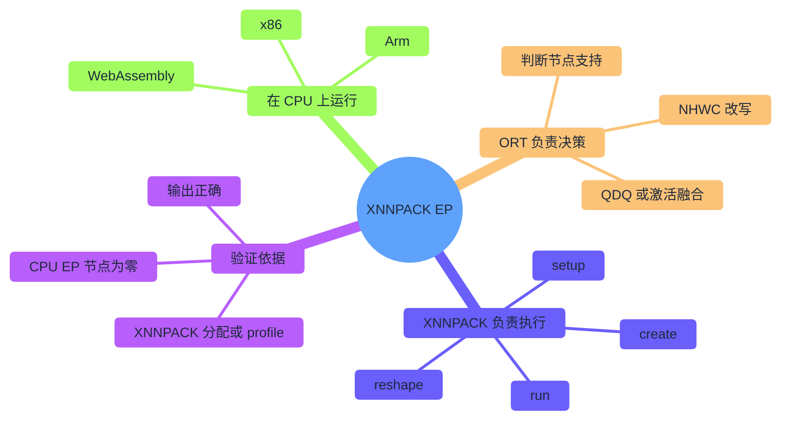
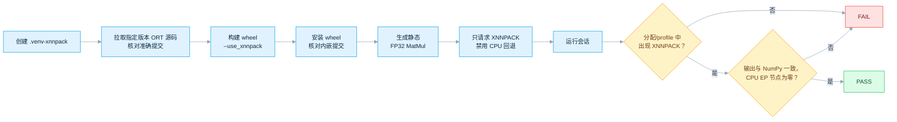
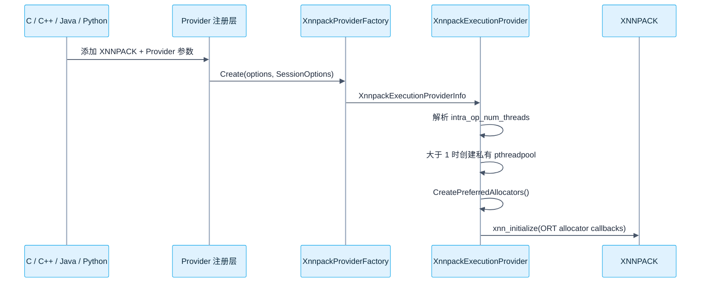
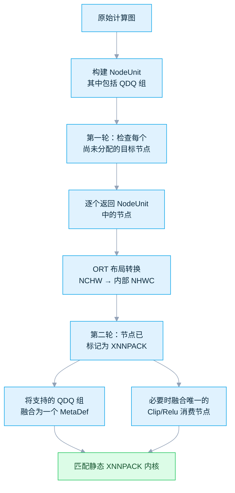
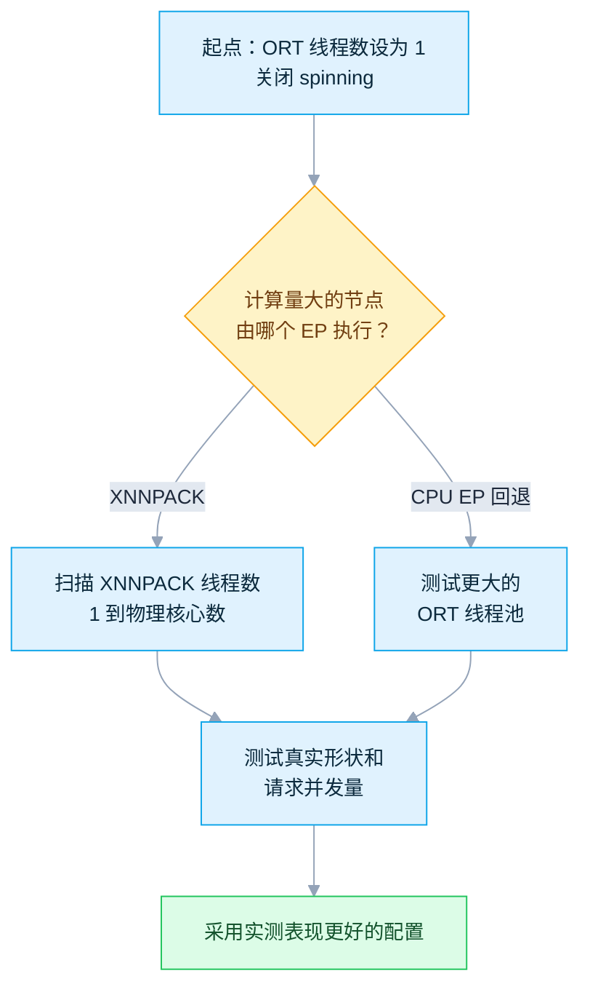
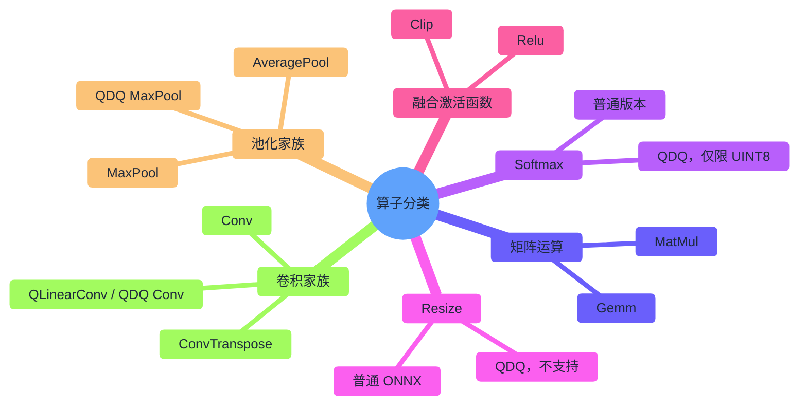
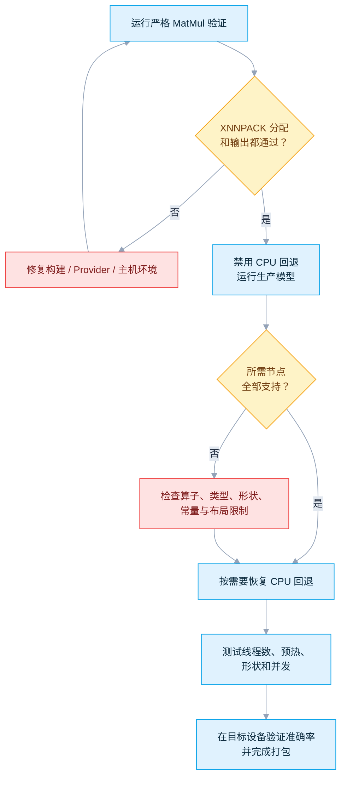
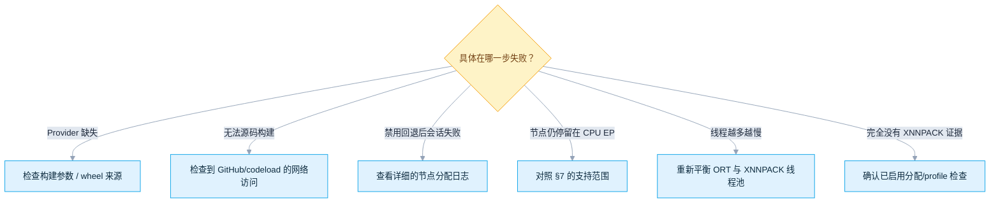

# ONNX Runtime + XNNPACK：跨平台 CPU 推理指南

[English](README.md) · [仓库首页](../README.zh-CN.md) · [XNNPACK EP 官方文档](https://onnxruntime.ai/docs/execution-providers/Xnnpack-ExecutionProvider.html) · [已核验源码 `bf6aa006`](https://github.com/microsoft/onnxruntime/tree/bf6aa0063d1c178c4a4d33ed6770425834147e2a/onnxruntime/core/providers/xnnpack)

**XNNPACK** 是一个为 Arm、x86 和 WebAssembly **CPU** 手工调优的数学核心库。ONNX Runtime 的 **XNNPACK Execution Provider（EP）** 会把能执行的 ONNX 节点交给它处理，让推理在*同一颗* CPU 上跑得更快——不涉及 GPU，也不涉及 NPU。本目录要*证明*的是这次交接真的发生了，而不仅仅是“这个 Provider 能加载”。

```bash
# Linux，在仓库根目录执行 -> 先构建一次 ONNX Runtime，再完成验证
python XNNPACK/one_click.py
```

| 你是… | 从这里开始 |
|---|---|
| 刚接触 Execution Provider | [§1 心智模型](#1-心智模型) |
| 准备运行验证 | [§2 准备工作](#2-选择预编译包或源码构建) → [§3 运行验证](#3-运行一键严格验证) |
| 正在开发 Android / iOS 应用 | [§2.1 支持矩阵](#21-支持与打包矩阵) |
| 想知道“为什么我的节点还在 CPU EP 上” | [§7 算子支持范围](#7-从源码确认算子支持范围) + [§11 故障排查](#11-故障排查) |
| 想调整线程数 | [§6 线程与并发](#6-线程与并发) |

| 项目 | 基线 |
|---|---|
| 最近核验 | `2026-07-17`；对应 ONNX Runtime `main` 的 [`bf6aa006`](https://github.com/microsoft/onnxruntime/commit/bf6aa0063d1c178c4a4d33ed6770425834147e2a) 提交，以及稳定版 `v1.27.1` 的 [`df2ba1cf`](https://github.com/microsoft/onnxruntime/commit/df2ba1cf8108aa63627cf4cdf8f807880b938616) 提交 |
| 已验证范围 | 启动脚本的单元测试已在 Linux 上通过；真正完成源码构建和严格推理，还需要能访问 GitHub/codeload，并具备 [§2](#2-选择预编译包或源码构建) 列出的构建工具 |

### 如何理解本文结论

| 结论类型 | 本文采用的依据 | 可以说明什么 |
|---|---|---|
| 软件包与公开 API | [XNNPACK 官方页面](https://onnxruntime.ai/docs/execution-providers/Xnnpack-ExecutionProvider.html)和[官方构建指南](https://onnxruntime.ai/docs/build/eps.html#xnnpack) | 官方提供哪些软件包、API 名称以及公开配置项 |
| 稳定版行为 | 固定版本的 ORT [`v1.27.1` 源码](https://github.com/microsoft/onnxruntime/tree/df2ba1cf8108aa63627cf4cdf8f807880b938616/onnxruntime/core/providers/xnnpack) | 一键脚本的行为，以及 [§7](#7-从源码确认算子支持范围) 所列的 capability 判断规则 |
| 新版行为 | 已核验的 `main` [提交 `bf6aa006`](https://github.com/microsoft/onnxruntime/tree/bf6aa0063d1c178c4a4d33ed6770425834147e2a/onnxruntime/core/providers/xnnpack) | 稳定版发布后的修复和源码变化 |
| 本仓库中的行为 | `one_click.py` 单元测试，以及严格的节点分配/profile 检查 | 脚本在实际运行环境中的表现 |
| 性能 | 在目标设备上使用生产模型实测 | 速度、内存占用、功耗和温度；这些指标无法仅靠阅读源码得出 |

> [!IMPORTANT]
> XNNPACK 本来就是在 **CPU** 上运行的。这里说的“没有回退到 CPU”，是指没有计算图节点被交给 ONNX Runtime 通用的 `CPUExecutionProvider`——并**不是**说完全没有使用处理器。严格测试验证的是 XNNPACK 这条*软件*执行路径，而不是某个独立的硬件设备。

---

## 目录

- [ONNX Runtime + XNNPACK：跨平台 CPU 推理指南](#onnx-runtime--xnnpack跨平台-cpu-推理指南)
    - [如何理解本文结论](#如何理解本文结论)
  - [目录](#目录)
  - [1. 心智模型](#1-心智模型)
  - [2. 选择预编译包或源码构建](#2-选择预编译包或源码构建)
    - [2.1 支持与打包矩阵](#21-支持与打包矩阵)
    - [2.2 桌面构建依赖](#22-桌面构建依赖)
  - [3. 运行一键严格验证](#3-运行一键严格验证)
  - [4. 源码结构](#4-源码结构)
    - [4.1 文件职责](#41-文件职责)
    - [4.2 创建调用链](#42-创建调用链)
    - [4.3 使用静态内核，而不是编译子图](#43-使用静态内核而不是编译子图)
  - [5. 分图、布局转换与融合](#5-分图布局转换与融合)
    - [5.1 为什么要执行两轮支持检查](#51-为什么要执行两轮支持检查)
    - [5.2 激活函数融合](#52-激活函数融合)
  - [6. 线程与并发](#6-线程与并发)
  - [7. 从源码确认算子支持范围](#7-从源码确认算子支持范围)
    - [源码核验发现的文档差异](#源码核验发现的文档差异)
    - [已知的检查器与内核实现缺口](#已知的检查器与内核实现缺口)
    - [FP16 支持条件](#fp16-支持条件)
    - [动态 shape 的影响](#动态-shape-的影响)
  - [8. 内核与内存生命周期](#8-内核与内存生命周期)
    - [8.1 通用执行模式](#81-通用执行模式)
    - [8.2 布局和权重预打包](#82-布局和权重预打包)
    - [8.3 内存分配器与缓存](#83-内存分配器与缓存)
  - [9. API 示例](#9-api-示例)
    - [9.1 使用自定义 wheel 的 Python](#91-使用自定义-wheel-的-python)
    - [9.2 C++](#92-c)
    - [9.3 Android Java](#93-android-java)
  - [10. 从冒烟测试走向生产](#10-从冒烟测试走向生产)
    - [10.1 分阶段验证](#101-分阶段验证)
    - [10.2 模型检查表](#102-模型检查表)
  - [11. 故障排查](#11-故障排查)
  - [12. 主要参考资料](#12-主要参考资料)

---

## 1. 心智模型



**术语表——后续章节会直接用到这些概念：**

| 术语 | 通俗解释 | 为什么重要 |
|---|---|---|
| Execution Provider（EP） | ONNX Runtime 中可以执行部分计算图的一种后端 | XNNPACK EP 会把受支持的节点交给 XNNPACK 的 CPU 内核，而不是 ORT 自带的 CPU 内核 |
| `GetCapability` | 每个 EP 用来“认领”自己能执行哪些节点的检查逻辑 | XNNPACK 会执行**两轮**该检查，中间插入一次布局转换（见 [§5](#5-分图布局转换与融合)） |
| NodeUnit | 一个节点，或者一个量化算子连同它周围的 Quantize/Dequantize 节点，被当作一个整体 | 让检查器和融合逻辑可以把整个 QDQ 组当作一个单位来处理 |
| MetaDef | 把多个节点打包成一次 XNNPACK 内核调用的融合定义 | QDQ 组之所以能变成一个 `QLinearConv`，`Relu`/`Clip` 之所以能“消失”在前驱算子里，靠的就是它 |
| 布局转换（Layout transform） | ORT 针对布局敏感算子做的 NCHW → 内部 NHWC 改写 | XNNPACK 偏好 NHWC；`Gemm`/`MatMul`/`Softmax` 对布局不敏感，因此跳过这一步 |
| 静态内核（Static kernel） | 从固定注册表中匹配出的预编译内核 | XNNPACK EP **不是** JIT/子图编译器（见 [§4.3](#43-使用静态内核而不是编译子图)） |
| 计算图分配 / profile 证据 | 事后查看“到底是哪个 EP 执行了哪个节点”的记录 | 唯一能证明“确实是 XNNPACK、而不是 CPU EP 执行了模型”的可信证据（见 [§3](#3-运行一键严格验证)） |



**XNNPACK 是什么，不是什么：**

| 问题 | 答案 |
|---|---|
| XNNPACK 是 CPU 后端吗？ | 是。输入、输出和内存分配都在 CPU 内存中完成，计算也由 CPU 执行。 |
| 需要 GPU/NPU 驱动吗？ | 不需要。XNNPACK 会在构建和运行时选择合适的 CPU 微内核。 |
| 它等同于 ORT CPU EP 吗？ | 不等同。两者虽然都使用 CPU，但内核注册表、数据布局、线程模型和算子支持范围均不相同。 |
| 一定更快吗？ | 不一定。不受支持的节点、布局转换、小张量、线程争用和模型 shape 都可能抵消加速收益，必须使用生产模型实测。 |
| `get_available_providers()` 能确认已使用 XNNPACK 吗？ | 不能。它只能说明二进制在构建时包含了 XNNPACK。还需要检查当前会话的节点分配或 profile。 |
| 生产环境可以保留 CPU EP 作为回退吗？ | 可以，而且通常有助于扩大算子覆盖范围。本文在严格验证中禁用它，是为了确保任何回退都会让验证失败。 |



---

## 2. 选择预编译包或源码构建

如果你的目标是移动端，可以直接跳到下面的矩阵——官方预编译包已经包含 XNNPACK。接下来的源码构建步骤，只是为了桌面端 Python 验证。

### 2.1 支持与打包矩阵

| 目标平台 | 官方发行方式 | 启用方式 | 本仓库提供的内容 |
|---|---|---|---|
| Android | Maven [`com.microsoft.onnxruntime:onnxruntime-android`](https://mvnrepository.com/artifact/com.microsoft.onnxruntime/onnxruntime-android) 已含 XNNPACK | Java `SessionOptions.addXnnpack(...)` | 提供配置说明；Android 应用应使用移动端官方包 |
| iOS | CocoaPods `onnxruntime-c` 和 `onnxruntime-objc` 已含 XNNPACK | C/C++ 或 Objective-C 封装接口 | 提供配置说明；构建和打包需要 macOS 与 Xcode |
| Windows | 使用 `--use_xnnpack` 自定义构建 ORT | C、C++ 或自定义 Python wheel | 一键脚本支持 |
| Linux | 使用 `--use_xnnpack` 自定义构建 ORT | C、C++ 或自定义 Python wheel | 一键脚本支持 |
| WebAssembly | XNNPACK 和 ORT 都支持 WASM 构建 | 取决于具体构建所提供的 JavaScript/C API | 本文只介绍源码；浏览器演示请参阅 Web 目录 |

> [!WARNING]
> 在桌面端，不能仅靠 `pip install onnxruntime` 安装 XNNPACK。如果 `onnxruntime.get_available_providers()` 中没有 `XnnpackExecutionProvider`，请改用通过 `--use_xnnpack` 构建的自定义 wheel。看到 `CPUExecutionProvider` 并不代表 XNNPACK 已启用。

### 2.2 桌面构建依赖

一键脚本固定使用 ONNX Runtime `v1.27.1`，并在构建前核对提交 `df2ba1cf8108aa63627cf4cdf8f807880b938616`，确保源码版本没有发生变化。

| 启动脚本检查项 | 要求 |
|---|---|
| 主机 | Linux 或 Windows；64 位进程 |
| Python | CPython 3.11–3.14 |
| CMake | 3.28 或更新版本 |
| 编译器 | Linux `cc` + `c++`（ORT 会拒绝低于 11.1 的 GCC）；Windows 使用 Visual Studio 2022 的 `cl` |
| 构建工具 | 优先使用 Ninja；Linux 没有 Ninja 时可回退到 Make |
| 隔离的 Python 环境 | 使用指定提交构建的 ORT `1.27.1` 自定义 wheel，以及 `onnx==1.22.0`；脚本会自动安装并再次核对版本 |

**Ubuntu 24.04 / Debian 系基线：**

```bash
sudo apt update
sudo apt install -y build-essential git python3-dev python3-venv ninja-build
cmake --version
python3 --version
```

Ubuntu 24.04 自带的软件包已经满足这些要求。较旧的发行版需要从组织认可的来源安装新版 CMake 和编译器；建议安装 `ninja-build`，系统中没有 Ninja 时脚本会自动改用 Make。

**Windows 基线：**

1. 安装 64 位 CPython 3.11–3.14。
2. 安装 Git for Windows。
3. 安装 CMake 3.28+ 并加入 `PATH`。
4. 安装 Visual Studio 2022，勾选 **Desktop development with C++**、MSVC 和当前 Windows SDK。
5. 在 **x64 Native Tools Command Prompt for VS 2022** 中运行。

桌面端启动脚本不支持 macOS；如需部署到 Apple 移动设备，请使用官方 iOS 软件包。

---

## 3. 运行一键严格验证

```bash
python XNNPACK/one_click.py
```

首次运行会从源码完整构建 ONNX Runtime，因此可能需要较长时间：



`MatMul` 模型中的右侧矩阵是计算图里的常量，脚本还关闭了 Python 创建会话时的重试回退，因此一旦有节点未被分配，会话会直接报错，而不是悄悄回退。

**常用参数：**

| 目标 | 命令 |
|---|---|
| 默认严格验证 | `python XNNPACK/one_click.py` |
| 复用已经构建好的 wheel | `python XNNPACK/one_click.py --wheel /path/to/onnxruntime-1.27.1-*.whl` |
| 重新生成源码/构建目录 | `python XNNPACK/one_click.py --refresh` |
| 分别调节构建并行数与 XNNPACK 线程数 | `python XNNPACK/one_click.py --jobs 4 --threads 8` |
| 快速离线测试启动脚本，不构建 ONNX Runtime | `python XNNPACK/one_click.py --unit-tests` |

验证成功时会看到类似以下内容：

```text
Assignment evidence : {'XnnpackExecutionProvider': 1}
Profile evidence    : {'XnnpackExecutionProvider': 3}
Max abs error       : ...
[PASS/通过] XNNPACK executed the model with correct output and no CPU fallback.
```

Profile 事件数会随预热次数和正式运行次数变化，因此通过条件不依赖某个固定数字：脚本只要求当前会话中至少出现一次 XNNPACK 节点分配或 profile 事件、输出结果正确，并且分配给 `CPUExecutionProvider` 的图节点数为零。

**如何正确解读这些证据：**

| 现象 | 能证明什么 | **不能**证明什么 |
|---|---|---|
| 可用 Provider 列表中出现 `XnnpackExecutionProvider` | wheel 构建时包含了 XNNPACK | 有节点真的被分配给了它 |
| 分配信息/profile 中出现 XNNPACK | ORT 确实通过 XNNPACK 执行了某个节点 | 具体是哪个 CPU 微内核在跑、跑得有多快 |
| `CPUExecutionProvider` 的计算图事件为零 | 没有节点回退到通用 CPU 内核 | XNNPACK 在你的模型上一定很快 |
| 输出与 NumPy 一致 | 这张计算图在数值上是正常的 | 你的生产模型足够准确 |

**为什么冒烟模型选择 `MatMul`：**

| 模型选择 | 原因 |
|---|---|
| `MatMul`（本文使用） | 不受数据布局影响，且直接对应一个静态 XNNPACK 内核——严格的“无回退”结果更容易解读 |
| `Conv`（本文未使用） | 能测试更多布局转换逻辑，但 ORT 可能在内部 NHWC 区域边界插入转置，让严格的通过/失败判断变得模糊 |

验证生产模型时，仍需覆盖模型实际使用的算子和布局。

---

## 4. 源码结构

*参考资料——第一次阅读时可以先跳过下表，等需要查找某个具体行为的源码出处时再回来查。*

### 4.1 文件职责

| 源码 | 职责 |
|---|---|
| [`xnnpack_provider_factory.cc`](https://github.com/microsoft/onnxruntime/blob/bf6aa0063d1c178c4a4d33ed6770425834147e2a/onnxruntime/core/providers/xnnpack/xnnpack_provider_factory.cc) | 保存 Provider 和会话参数，并创建 `XnnpackExecutionProvider` |
| [`xnnpack_execution_provider.h`](https://github.com/microsoft/onnxruntime/blob/bf6aa0063d1c178c4a4d33ed6770425834147e2a/onnxruntime/core/providers/xnnpack/xnnpack_execution_provider.h) | 声明首选的 NHWC 布局、选择性融合方式、会话内 `Run()` 串行化、内存分配器和私有线程池 |
| [`xnnpack_execution_provider.cc`](https://github.com/microsoft/onnxruntime/blob/bf6aa0063d1c178c4a4d33ed6770425834147e2a/onnxruntime/core/providers/xnnpack/xnnpack_execution_provider.cc) | 注册静态内核、管理线程池、初始化 XNNPACK，并实现两轮 `GetCapability` 检查 |
| [`detail/node_support_checker.cc`](https://github.com/microsoft/onnxruntime/blob/bf6aa0063d1c178c4a4d33ed6770425834147e2a/onnxruntime/core/providers/xnnpack/detail/node_support_checker.cc) | 调用各 ONNX/NodeUnit 支持检查，并判断 `Clip`/`Relu` 能否融合 |
| [`detail/utils.cc`](https://github.com/microsoft/onnxruntime/blob/bf6aa0063d1c178c4a4d33ed6770425834147e2a/onnxruntime/core/providers/xnnpack/detail/utils.cc) | 处理 QDQ 分类与融合、激活函数 MetaDef、量化参数解析和 padding 模式判断 |
| [`xnnpack_kernel.h`](https://github.com/microsoft/onnxruntime/blob/bf6aa0063d1c178c4a4d33ed6770425834147e2a/onnxruntime/core/providers/xnnpack/xnnpack_kernel.h) | 内核基类，用于保存私有线程池和可选的 XNNPACK 缓存 |
| [`xnnpack_init.cc`](https://github.com/microsoft/onnxruntime/blob/bf6aa0063d1c178c4a4d33ed6770425834147e2a/onnxruntime/core/providers/xnnpack/xnnpack_init.cc) | 将 ORT CPU 内存分配器适配为 XNNPACK 所需的分配回调表 |
| [`nn/`](https://github.com/microsoft/onnxruntime/tree/bf6aa0063d1c178c4a4d33ed6770425834147e2a/onnxruntime/core/providers/xnnpack/nn) | Conv、ConvTranspose、AveragePool 和 MaxPool 的支持检查与内核实现 |
| [`math/`](https://github.com/microsoft/onnxruntime/tree/bf6aa0063d1c178c4a4d33ed6770425834147e2a/onnxruntime/core/providers/xnnpack/math) | Gemm、MatMul 和 Softmax 的支持检查与内核实现 |
| [`tensor/resize.cc`](https://github.com/microsoft/onnxruntime/blob/bf6aa0063d1c178c4a4d33ed6770425834147e2a/onnxruntime/core/providers/xnnpack/tensor/resize.cc) | 双线性 Resize 的支持检查和 XNNPACK operator 生命周期管理 |
| [`onnxruntime_providers_xnnpack.cmake`](https://github.com/microsoft/onnxruntime/blob/bf6aa0063d1c178c4a4d33ed6770425834147e2a/cmake/onnxruntime_providers_xnnpack.cmake) | 把 EP 构建为静态库并定义 `USE_XNNPACK` |
| [`external/xnnpack.cmake`](https://github.com/microsoft/onnxruntime/blob/bf6aa0063d1c178c4a4d33ed6770425834147e2a/cmake/external/xnnpack.cmake) | 获取 XNNPACK/pthreadpool/fxdiv、选择目标架构，并在适用的 Arm 平台加入 KleidiAI |

### 4.2 创建调用链



该 Provider 会静态链接到 ONNX Runtime 主二进制中，不会像采用 provider bridge 的 EP 那样单独发布 `onnxruntime_providers_*.so/.dll`。只有在编译时启用 `USE_XNNPACK`，`get_available_providers()` 才会列出它。

### 4.3 使用静态内核，而不是编译子图

当前的 `GetCapability` 会返回与静态 `KernelRegistry` 对应的 `ComputeCapability`，并不负责把子图交给编译器。源码预留了将来加入编译内核的位置；在现有实现中，分图后最终使用的是已注册的 `OpKernel` 类。

---

## 5. 分图、布局转换与融合

### 5.1 为什么要执行两轮支持检查

`XnnpackExecutionProvider::GetPreferredLayout()` 返回 `NHWC`，而标准 ONNX Conv/Pool 模型通常使用 NCHW，因此 XNNPACK EP 需要与 ORT 的布局转换器配合：



关键点：

- `QDQ::GetAllNodeUnits` 会把量化算子及其周围的 Quantize/Dequantize 节点作为一个整体处理。
- 第一轮根据目标算子判断是否支持，并分别申领组内节点，以便后续进行布局转换。
- 第二轮将支持的 QDQ 组融合成 `QLinearConv`，或动态域中的 `QLinearSoftmax` 等 MetaDef。
- 布局敏感内核注册在 ORT 的内部 NHWC 域；Gemm、MatMul 和 Softmax 仍位于 ONNX 域。
- 不支持的节点会留给优先级较低的 EP。即使应用没有主动添加 CPU EP，ORT 仍会隐式注册默认的 CPU EP。本文的严格验证只请求 XNNPACK，同时关闭 Python 创建会话时的重试回退，并设置 `session.disable_cpu_ep_fallback=1`。只要有节点未分配，或被交给隐式注册的 CPU EP，会话初始化就会失败。
- 想确认这次改写具体插入或优化掉了哪些 `Transpose` 节点，可以设置通用会话配置 `session.debug_layout_transformation` 为 `1`（参见 [§11](#11-故障排查)）；ORT 会在每个阶段结束后保存一份 `post_layout_transform_step_<N>.onnx` 快照。

### 5.2 激活函数融合

该 Provider 没有为独立的 `Relu` 或 `Clip` 注册 XNNPACK 内核，但可以将它们融合到前面的内部 NHWC `Conv`、`MaxPool` 或 `AveragePool` 中。具体做法是在前驱算子的 MetaDef 中记录输出的最小值和最大值。量化 QDQ 组不参与这种激活函数融合。

> [!WARNING]
> 稳定版 `v1.27.1` 早于修复提交 [`86cbd205`](https://github.com/microsoft/onnxruntime/commit/86cbd2052540c59ad54f5ca135f9b0f58453557a)。如果激活函数之前的输出同时也是计算图输出，或还有其他消费节点，该修复会拒绝融合。`v1.27.1` 仍可能融合这类分支图，随后因为输入悬空而无法创建会话。一键 `MatMul` 验证不受影响。如果生产模型的分支还会使用 Conv/Pool 在激活前的输出，请升级到包含该修复的版本，或回移该提交，然后重新检查节点分配。

---

## 6. 线程与并发

XNNPACK 和 ORT 各自维护一套 intra-op 线程池。如果两套线程池申请的线程总数超过硬件承载能力，性能可能明显下降。

| 配置 | 所有者 | 源码行为 |
|---|---|---|
| `SessionOptions.intra_op_num_threads` | ORT | 控制 ORT 的 intra-op 线程池 |
| `session.intra_op.allow_spinning` | ORT | 等待时自旋会占用 CPU；XNNPACK 负责计算线程时应关闭。默认值为 `"1"`（自旋），除非构建时启用了 `ORT_CLIENT_PACKAGE_BUILD`（此时默认值为 `"0"`） |
| XNNPACK `intra_op_num_threads` | XNNPACK EP | 公开接口要求该值 >= `1`，默认值及实际效果均为 `1`。内部用 `0` 表示调用方未提供配置，此时会复制 ORT 会话原先的线程设置；只有最终结果大于 `1` 时才创建私有 pthreadpool。调优时建议显式设置。 |
| `ConcurrentRunSupported()` | XNNPACK EP | 返回 `false`；因此 ORT 会通过会话级锁，让同一会话中的 `Run()` 调用串行执行 |

推荐起点：

```python
import os
import onnxruntime as ort

physical_cores = max(1, (os.cpu_count() or 1) // 2)
options = ort.SessionOptions()
options.execution_mode = ort.ExecutionMode.ORT_SEQUENTIAL
options.intra_op_num_threads = 1
options.add_session_config_entry("session.intra_op.allow_spinning", "0")

session = ort.InferenceSession(
    "model.onnx",
    sess_options=options,
    providers=[
        ("XnnpackExecutionProvider", {"intra_op_num_threads": str(physical_cores)}),
        "CPUExecutionProvider",  # 普通生产回退；严格验证时删除
    ],
)
```

接下来应使用真实的并发量和模型 shape 进行测试。如果计算量较大的不支持节点交给了 ORT CPU EP，增大 ORT 线程池反而可能更快；官方文档也明确建议分别测试这两种配置。



> [!NOTE]
> 在已核验的 `v1.27.1` 中，Gemm 和 MatMul 虽然在 reshape 阶段使用私有线程池，但调用 `xnn_run_operator` 时传入的是 `nullptr`。因此，不能认为增加 XNNPACK 线程数一定会加速这两个内核。Conv、Pool、Softmax 和 Resize 的执行路径则会传入私有线程池。所有性能结论都必须注明所用模型和源码版本。

### 6.1 XNNPACK Provider 选项参考

`XnnpackExecutionProviderInfo`——也就是 C、C++、Python、Java 和 Objective-C 各入口最终填充的那个结构体——在源码中的注释是 `// placeholder for future use. no options currently`（占位，供将来使用，目前没有任何选项）。截至目前，它实际只暴露**一个**从 `ProviderOptions` 字符串映射中解析出来的 Provider 选项：

| Provider 选项键 | 类型 | 可接受的值 | 缺省该键时的默认行为 | 作用 |
|---|---|---|---|---|
| `intra_op_num_threads` | 整数，以字符串形式传入（例如 `"4"`） | 任何 `std::stoi` 能解析的值；公开接口要求 `>= 1` | 内部先存为 `0`，此时会复制 ORT 自身的 `session_options->intra_op_param.thread_pool_size`（除非你设置了 `SessionOptions.intra_op_num_threads`，否则该值本身也是 `1`） | 请求创建一个**私有的 XNNPACK pthreadpool**。只有解析结果大于 `1` 时才会真正创建私有线程池；随后 Conv/Pool/Softmax/Resize 内核会使用它（Gemm/MatMul 不会——见上面的提示）。 |

传入其他任何键都会被静默忽略——ORT 自带的 `xnnpack_basic_test.cc` 特意设置 `options["one"] = "two"`，只是为了证明多余的键不会破坏会话创建。和某些其他 EP 不同（例如 DirectML 的 `ep.dml.*` 会话配置项），XNNPACK 并没有专门的 `xnnpack_..._config_keys.h`，也不会直接读取任何通过 `SessionOptions.add_session_config_entry` 设置的值。

```python
# 这是当前唯一真实存在的 XNNPACK Provider 选项，逐项加了注释。
provider_options = {
    # XNNPACK 私有 pthreadpool 的大小：
    #   - "1"（或者干脆不传这个键）：不会创建私有线程池，XNNPACK 内核会直接
    #     在调用 Run() 的那个线程上执行。
    #   - ">1"：XNNPACK 会创建一个独立于 ORT intra-op 线程池的私有
    #     pthreadpool。Conv/Pool/Softmax/Resize 会使用它；Gemm/MatMul 目前
    #     不会（见上面的提示）。
    "intra_op_num_threads": "4",
}
```

> [!NOTE]
> 如果通过通用 C API（`OrtApi::SessionOptionsAppendExecutionProvider`、C++ 的 `SessionOptions::AppendExecutionProvider("XNNPACK", ...)`，或者 Java 的 `addExecutionProvider`）注册 XNNPACK，ORT 还会把你传入的每个键都复制进会话自身的配置项，键名为 `ep.xnnpack.<key>`（例如 `ep.xnnpack.intra_op_num_threads`）。这是所有通过该路径注册的 EP 共享的通用机制（在 `provider_registration.cc` 中只实现了一次），并不是 XNNPACK 专属的功能。本教程通篇使用的 Python `providers=[("XnnpackExecutionProvider", {...})]` 列表会直接构造 Provider，并不会经过这条路径，因此不会生成 `ep.xnnpack.*` 这份镜像配置。

---

## 7. 从源码确认算子支持范围

官方页面只提供摘要。下表结合 `v1.27.1` 的检查器、内核注册表和内核实现，整理出适合生产环境采用的保守支持范围。对于检查器接受、但实际实现仍存在风险的情况，后文会单独列出。



| 算子 / 模式 | 生产环境中建议采用的支持范围 |
|---|---|
| `Conv` | 支持检查要求 opset >= 11；rank 为 3（1D，内部将高度视为 1）或 4（2D）；C 和空间维度已知；权重及可选 bias 为常量；使用 FP32，或在兼容平台上使用 FP16；支持 group/depthwise；auto-pad 仅限 `NOTSET`、`VALID`、`SAME_UPPER` |
| `QLinearConv`、QDQ `Conv` | UINT8 或 INT8，输入/权重/输出类型需匹配；scale、zero point、权重和可选 bias 为常量；INT8 权重按输出通道量化时，权重 zero point 必须为 0 或省略；不支持 U8/S8 混合 |
| `ConvTranspose`、QDQ/`QLinearConvTranspose` | 沿用 ConvBase 对 rank、静态维度和常量的检查，并使用反卷积执行路径；建议采用按张量量化，因为显式的 `QLinearConvTranspose` 会拒绝 INT8 按通道权重 |
| `AveragePool` | opset >= 7；rank 为 4；C/H/W 已知；使用二维且非 1x1 的内核；`ceil_mode=0`；使用默认 dilation；支持 FP32，或在兼容平台上使用 FP16；浮点路径要求 `count_include_pad=0` |
| 量化 AveragePool | 内核注册表中虽然存在 `QLinearAveragePool`，但兼容性检查会拒绝所有量化 AveragePool，因此该版本实际不支持此模式。 |
| `MaxPool` | opset >= 8；rank 为 4；C/H/W 已知；不能请求可选的 indices 输出；使用二维且非 1x1 的内核；`ceil_mode=0`；auto-pad 仅限 `NOTSET`、`VALID`、`SAME_UPPER`；支持 FP32，以及兼容平台上的 FP16/UINT8/INT8 |
| QDQ `MaxPool` | 输入输出量化类型必须相同，且为 UINT8 或 INT8；Pool 计算本身不使用单独量化参数 |
| 普通 ONNX `Resize` | opset >= 10；rank 4；FP32、opset 10–18 上合格平台的 FP16、UINT8 或 INT8；`scales`/`sizes` 为常量；N/C 不变且 H/W 与输出 H/W 已知；`mode=linear`；禁止 antialias/axes/exclude-outside；aspect policy 为 stretch；extrapolation 为 0；坐标模式受限；降采样需通过因数检查 |
| QDQ `Resize` | 检查器会识别该模式，但融合后生成的是 ONNX 域中的 `Resize`，而对应的静态内核注册在内部 NHWC 域中；上游测试也处于禁用状态。因此，已核验版本不应使用此模式。 |
| `Gemm` | 使用 FP32，或在兼容平台上使用 FP16；A/B 为二维；`alpha=1`、`beta=1`、`transA=0`；B 为常量；C 省略，或使用常量的一维输出通道 bias；支持 `transB` |
| `MatMul` | 使用 FP32，或在兼容平台上使用 FP16；A 的 rank >= 1；B 是 rank 1 或 rank 2 的非空常量；运行时会将 N-D A 的外层维度展平为 batch |
| `Softmax` | 使用 FP32，或在兼容平台上使用 FP16；reduction 维度必须是静态值；opset >= 13 时只支持最后一个 axis；opset <= 12 时保留从 axis 开始展平的语义 |
| QDQ `Softmax` | 只支持 UINT8；输出 scale 必须约为 `1/256`、输出 zero point 为 `0`；融合成动态内部 `QLinearSoftmax` schema |
| `Relu` / `Clip` | 没有独立内核；可以融合到受支持的内部 NHWC Conv/MaxPool/AveragePool 之后，其中 Clip 的边界必须为常量。为了保证融合正确，前驱算子的输出不能同时作为图输出，并且该激活函数必须是唯一的消费节点。 |

### 源码核验发现的文档差异

| 官方简表 | 源码中的实际情况 |
|---|---|
| Conv 只支持 2D | 源码还接受 rank-3 的 1D Conv/ConvTranspose，并把高度视为 1 |
| MatMul 只支持 2D | A 可以是 N-D；常量 B 仍只能是 rank 1 或 rank 2 |
| 注册算子即可使用 | 量化 AveragePool 虽然已经注册，但兼容性检查仍会无条件拒绝它 |
| 内核注册表包含较旧的 Conv 版本 | `ConvBase::IsOnnxNodeSupported` 会在布局转换前拒绝 opset 11 以下的 ONNX Conv/ConvTranspose |
| XNNPACK 线程可加速 Gemm/MatMul | 在 `v1.27.1` 中，两者在 reshape 时会使用线程池，但调用 `xnn_run_operator` 时传入的却是 `nullptr` |

### 已知的检查器与内核实现缺口

前六项问题在已核验的 `main` 提交 `bf6aa006` 中仍然存在；最后一项激活函数融合问题已由 `86cbd205` 修复。

| 特殊情况 | 源码实际行为 | 建议做法 |
|---|---|---|
| INT8 Conv 按通道权重 zero point 非零 | 循环记录日志并 `break`，随后仍把类型设为按通道 INT8 | 权重 zero point 使用 0 或省略 |
| `Gemm transA=1` | 支持检查会接受该配置，但内核不会转置 A，而是直接把原始指针交给 fully connected operator | 使用 `transA=0` |
| 任意 `Gemm` C broadcasting | 支持检查会接受部分 rank-1/rank-2 shape，但 XNNPACK 只把 C 当作 bias 指针 | 省略 C，或使用长度等于输出宽度 N 的一维 bias |
| `Resize` 改变 batch，或 H/W 为动态值 | 检查器会检查 C，却不检查 N；`Compute` 强制输出 N 等于输入 N，而 operator 创建时会固定输出 H/W | 保持 N/C 不变，并固定 H/W |
| opset 19 的 FP16 `Resize` | 检查器接受 FP16，但 opset 19 注册的内核不包含 FP16 | FP16 使用 opset 10–18，或改用 FP32/UINT8/INT8 |
| opset <= 12 的 `Softmax` reduction 维度未知 | 内层循环的 `break` 不会拒绝节点；Session 创建时会预计算 channel 数 | `axis` 起的维度保持静态 |
| `v1.27.1` 中激活函数的前驱算子还有其他消费节点，或其输出同时也是图输出 | 稳定版不会拒绝融合该分支，因而可能留下悬空输入 | 升级到包含 `86cbd205` 的版本、回移该提交，或避免在分支中继续使用激活前的输出 |

### FP16 支持条件

Provider 会为 Arm/Arm64 以及非移动端的 x86/x64 目标编译 FP16 支持，随后再由 XNNPACK 判断当前硬件是否兼容。内核声明支持某种数据类型，并不代表每款处理器都能执行。建议先用 FP32 确认节点分配正确，再测试 FP16 的精度和设备兼容性。

### 动态 shape 的影响

XNNPACK 的执行流程是 create → reshape → setup → run，不过 create 阶段仍会固定一些关键的模型信息：

| 算子 | Session 创建时固定 | 仍可安全变化的运行时维度 |
|---|---|---|
| Conv / Pool | C/H/W、属性、常量权重 | Batch N |
| MatMul | rank-1/rank-2 常量 B 和 reduction 宽度 | A 的外层 batch 维度 |
| Softmax | 参与 reduction 的维度 | reduction 区域之前的维度 |
| Resize | 常量 scales/sizes 和输出 H/W；C 不变 | N 本身不做 resize 时，Batch N 可变化 |

在移动端部署时，应尽量固定 channel 和空间维度；也可以先设置 ORT free-dimension override（自由维度覆盖），再检查节点能否分配给 XNNPACK。

---

## 8. 内核与内存生命周期

### 8.1 通用执行模式

大多数内核都遵循同一套 XNNPACK API 调用流程：


`XnnpackOperatorDeleter` 通过 RAII 自动调用 `xnn_delete_operator`。Conv 和 Resize 使用经 ORT 适配的 XNNPACK 内存分配器，为每次运行分配满足对齐要求的工作空间。

### 8.2 布局和权重预打包

布局转换器会把 Conv/Pool/Resize 的激活张量转换为内部 NHWC 布局。常量卷积权重需要单独预打包，因为这并不是简单地转置激活张量：

| 算子 | 预打包后的布局 |
|---|---|
| `Conv` | ONNX `M,C/group,kH,kW` → XNNPACK `M,kH,kW,C/group` |
| Group `ConvTranspose` | 显式加入 group 维度；输入 channel 移到最内层 |
| `Gemm` / `MatMul` | 使用常量 B 创建 XNNPACK 全连接 operator |

因此，常量权重是支持检查中必须满足的条件：operator 创建和权重打包都发生在 `Compute` 之前。

### 8.3 内存分配器与缓存

| 项目 | 已核验版本的行为 |
|---|---|
| 内存分配器 | `CreatePreferredAllocators` 会延迟创建标记为 `XnnpackExecutionProvider` 的 CPU 内存分配器，安装回调表并调用 `xnn_initialize`；所有内存仍位于主机 CPU |
| 重新分配 | 空指针会按新分配处理；对已有指针执行 reallocate 会触发 `ORT_NOT_IMPLEMENTED` |
| 权重缓存 | Conv/Gemm/MatMul 只有在定义 `XNN_CACHE_ENABLE` 时才会请求权重缓存；已核验的两份 CMake 都没有定义该宏，一键脚本也未额外添加 |
| 代码缓存 | 公开的 `xnnpack.h` 没有提供 create/free API，因此代码缓存处于禁用状态 |

---

## 9. API 示例

### 9.1 使用自定义 wheel 的 Python

```python
import onnxruntime as ort

# get_available_providers() 只能证明这个 wheel 编译时包含了 XNNPACK；并不能
# 证明真的有节点会跑在它上面（见 §1）。必须创建会话后检查分配/profile 证据。
assert "XnnpackExecutionProvider" in ort.get_available_providers()

options = ort.SessionOptions()
# 启用全部优化级别，包括 XNNPACK 的 Conv/Pool/Resize 内核所需要的
# NCHW -> 内部 NHWC 布局改写（见 §5）。
options.graph_optimization_level = ort.GraphOptimizationLevel.ORT_ENABLE_ALL
# XNNPACK 不支持同一个会话并发调用 Run()（ConcurrentRunSupported() 返回
# false），因此串行执行模式与之匹配。
options.execution_mode = ort.ExecutionMode.ORT_SEQUENTIAL
# 让 ORT 自己的 intra-op 线程池保持很小，避免和 XNNPACK 的私有 pthreadpool
# 抢占 CPU 核心（见 §6）。
options.intra_op_num_threads = 1
# 自旋等待会白白消耗 CPU；既然计算线程交给了 XNNPACK，就关闭它（默认值参见
# §6 的线程配置表）。
options.add_session_config_entry("session.intra_op.allow_spinning", "0")

session = ort.InferenceSession(
    "model.onnx",
    sess_options=options,
    providers=[
        # 当前唯一真实存在的 XNNPACK Provider 选项（见 §6.1）：XNNPACK 私有
        # pthreadpool 的大小。只有传入大于 "1" 的值才会真正创建私有线程池。
        ("XnnpackExecutionProvider", {"intra_op_num_threads": "4"}),
        # 普通生产环境的回退，用于 XNNPACK 无法执行的节点（见 §7）。若要做
        # 严格的“无回退”验证，请整体删除这一项，参见下面的示例。
        "CPUExecutionProvider",
    ],
)
```

如果要做严格验证，可以照搬 `XNNPACK/one_click.py` 自动执行的做法：

```python
strict_options = ort.SessionOptions()
strict_options.graph_optimization_level = ort.GraphOptimizationLevel.ORT_ENABLE_ALL
strict_options.execution_mode = ort.ExecutionMode.ORT_SEQUENTIAL
strict_options.intra_op_num_threads = 1
strict_options.add_session_config_entry("session.intra_op.allow_spinning", "0")
# 记录每个计算图节点分配给了哪个 EP，方便在会话创建后查询
# （C/C++ 中对应 Session_GetEpGraphAssignmentInfo）。
strict_options.add_session_config_entry("session.record_ep_graph_assignment_info", "1")
# 一旦有节点无法分配，就让会话创建直接失败，而不是悄悄交给隐式注册的
# 默认 CPU EP。
strict_options.add_session_config_entry("session.disable_cpu_ep_fallback", "1")

strict_session = ort.InferenceSession(
    "model.onnx",
    sess_options=strict_options,
    providers=[
        ("XnnpackExecutionProvider", {"intra_op_num_threads": "4"}),
        # 不加入 CPUExecutionProvider：任何未分配的节点都会在创建会话时直接
        # 报错，而不是悄悄跑在 CPU EP 上。
    ],
)
```

完整的分配/profile 检查代码请参见 `one_click.py`，这份配置正是为了配合那段检查代码。

### 9.2 C++

```cpp
Ort::Env env{ORT_LOGGING_LEVEL_ERROR, "xnnpack"};
Ort::SessionOptions options;
// XNNPACK 不支持同一个会话并发调用 Run()（ConcurrentRunSupported() 返回
// false），因此保持串行执行模式。
options.SetExecutionMode(ExecutionMode::ORT_SEQUENTIAL);
// ORT 自身的 intra-op 线程池；保持为 1，避免和 XNNPACK 的私有 pthreadpool
// 抢占 CPU 核心（见 §6）。
options.SetIntraOpNumThreads(1);
// 计算线程既然交给了 XNNPACK，就关闭 ORT 线程的自旋等待。
options.AddConfigEntry("session.intra_op.allow_spinning", "0");
// 通过通用 EP API 注册 XNNPACK。这条路径还会把每个键镜像写入会话配置项，
// 键名为 "ep.xnnpack.<key>"（见 §6.1）——这一点与 Python 的
// providers=[...] 列表不同，后者不会做这个镜像。
options.AppendExecutionProvider(
    "XNNPACK", {{"intra_op_num_threads", "4"}});  // 唯一的 Provider 选项
Ort::Session session{env, model_path, options};
```

通用注册 API 同时接受短名称 `XNNPACK` 和规范名称 `XnnpackExecutionProvider`。

### 9.3 Android Java

```java
try (OrtSession.SessionOptions options = new OrtSession.SessionOptions()) {
    // XNNPACK 会在内部把 Run() 调用串行化，用顺序执行模式与之匹配。
    options.setExecutionMode(OrtSession.SessionOptions.ExecutionMode.SEQUENTIAL);
    // ORT 自身的 intra-op 线程池大小；比 XNNPACK 的私有线程池保持得小一些。
    options.setIntraOpNumThreads(1);
    // 停止 ORT 工作线程在空闲时自旋等待。
    options.addConfigEntry("session.intra_op.allow_spinning", "0");
    // 唯一的 XNNPACK Provider 选项（见 §6.1）：私有 pthreadpool 的大小。
    options.addXnnpack(java.util.Collections.singletonMap("intra_op_num_threads", "4"));

    try (OrtSession session = environment.createSession(modelPath, options)) {
        // 执行推理。
    }
}
```

请使用官方 `onnxruntime-android` Maven artifact，其中的 native library 已包含 XNNPACK。按照 Java 绑定的要求，`SessionOptions` 必须一直存活到使用它的 Session 被销毁为止。

---

## 10. 从冒烟测试走向生产

### 10.1 分阶段验证



### 10.2 模型检查表

| 检查 | 原因 |
|---|---|
| 使用受支持的算子/opset 组合 | 上游 XNNPACK 库的支持范围大于该 ORT EP 的内核注册表和检查器实现 |
| 固定 Conv/Pool 的 C/H/W | 创建内核前的支持检查需要这些维度 |
| 把 Conv/Gemm/MatMul 权重设为 initializer | 运行时传入权重会被拒绝 |
| 检查 NCHW↔NHWC 边界 | 对于小而分散的子图，转置开销可能超过内核带来的收益 |
| 核对 QDQ scale、zero point 和 tensor type | 混合类型或非常量量化参数会被拒绝 |
| 先验证 FP32，再测 FP16/INT8 | 把集成故障与精度/硬件兼容问题分开 |
| 有意识地测试两套线程池 | 默认配置可能竞争或超额订阅物理核心 |
| 在真实手机/CPU 上测试 | 模拟环境和桌面平台无法代表移动端的微内核选择及温控表现 |
| 计时前预热 | 首次权重打包、内存分配和缓存状态会影响延迟 |
| 在 CI 保留分配证据 | 包或构建变化可能移除 XNNPACK，而 CPU EP 仍让推理“成功” |

仓库自带的模型只用于确认 XNNPACK 执行路径是否正常，不能作为性能基准。生产环境的测试报告应使用有代表性的输入，并覆盖端到端延迟、吞吐量、内存占用、温度、功耗和任务级准确率。

---

## 11. 故障排查



| 现象 | 常见原因 | 处理方法 |
|---|---|---|
| 没有 `XnnpackExecutionProvider` | 使用普通 wheel，或构建未启用 `--use_xnnpack` | 运行一键脚本或安装已核验自定义 wheel；移动端使用官方包 |
| 源码构建无法下载 | GitHub/codeload 或依赖站点被网络策略阻断 | 配置组织认可的代理或缓存；不要改用未经核验的压缩包 |
| CMake 被拒绝 | CMake 低于 3.28 或工具链不支持 | 安装当前 CMake/compiler，然后用 `--refresh` 重试 |
| 禁用 CPU 回退后无法创建 Session | 至少一个节点不满足 XNNPACK 的支持条件 | 临时开启回退，检查详细日志和节点分配，再对照 [§7](#7-从源码确认算子支持范围) 排查 |
| Conv/Pool 仍由 CPU EP 执行 | C/H/W 为动态维度、padding 或其他属性不受支持、请求了可选输出，或者权重/bias 不是常量 | 固定相关维度并使用 initializer，或保留 CPU EP 作为回退 |
| 量化模型仍由 CPU EP 执行 | U8/S8 组合不匹配、量化参数是动态值、按通道 zero point 不合规，或 QDQ 模式不受支持 | 按照 [§7](#7-从源码确认算子支持范围) 核对 scale、zero point 和数据类型 |
| `v1.27.1` 中 `Clip`/`Relu` 分支导致图无效 | 该稳定版早于分支消费节点的融合修复 | 升级到包含 `86cbd205` 的版本、回移该提交，或避免在分支中使用激活前的输出 |
| 增加线程后反而变慢 | ORT 与 XNNPACK 线程池相互争用、拓扑识别不准确，或工作负载太小 | 将 ORT intra-op 设为 `1`、spinning 设为 `0`，再从 1 到物理核心数逐一测试 XNNPACK 线程数 |
| `--threads` 没有加速 MatMul/Gemm | 已核验版本的内核在执行阶段向 `xnn_run_operator` 传入 `nullptr`，而不是线程池 | 这是该版本的已知行为；请实测其他版本，或改用受支持且以 Conv 为主的工作负载 |
| 输出正确，但没有 XNNPACK 事件 | Provider 已加载，但节点没有分配给它；也可能是分配信息 API/profile 不可用 | 不能据此判定通过；请使用完整的自定义构建，并检查当前会话的节点分配和 profile |
| 想确认布局转换具体插入或删除了哪些 `Transpose` 节点 | NCHW -> 内部 NHWC 的改写过程默认是不可见的 | 添加会话配置 `session.debug_layout_transformation=1`；ORT 会在每个改写阶段结束后保存 `post_layout_transform_step_<N>.onnx` 快照 |
| Android 模拟器很慢 | 模拟架构/微内核与目标设备不同 | 在真实 Arm 设备验证 |

---

## 12. 主要参考资料

- [XNNPACK Execution Provider 官方页面](https://onnxruntime.ai/docs/execution-providers/Xnnpack-ExecutionProvider.html)
- [官方 EP 构建说明](https://onnxruntime.ai/docs/build/eps.html#xnnpack)
- [已核验的 `main` 源码快照（`bf6aa006`）](https://github.com/microsoft/onnxruntime/tree/bf6aa0063d1c178c4a4d33ed6770425834147e2a/onnxruntime/core/providers/xnnpack)
- [实时 `main` 源码（可能变化）](https://github.com/microsoft/onnxruntime/tree/main/onnxruntime/core/providers/xnnpack)
- [固定版本的 Provider 源码（`v1.27.1`，`df2ba1cf`）](https://github.com/microsoft/onnxruntime/tree/df2ba1cf8108aa63627cf4cdf8f807880b938616/onnxruntime/core/providers/xnnpack)
- [已核验 `main` 中的 Provider 注册实现](https://github.com/microsoft/onnxruntime/blob/bf6aa0063d1c178c4a4d33ed6770425834147e2a/onnxruntime/core/session/provider_registration.cc)
- [已核验 `main` 中的 Python Provider Factory](https://github.com/microsoft/onnxruntime/blob/bf6aa0063d1c178c4a4d33ed6770425834147e2a/onnxruntime/python/onnxruntime_pybind_state.cc)
- [已核验 `main` 中的 XNNPACK CMake 集成](https://github.com/microsoft/onnxruntime/blob/bf6aa0063d1c178c4a4d33ed6770425834147e2a/cmake/external/xnnpack.cmake)
- [XNNPACK 上游项目](https://github.com/google/XNNPACK)
- [`v1.27.1` 之后的 activation side-consumer 修复](https://github.com/microsoft/onnxruntime/commit/86cbd2052540c59ad54f5ca135f9b0f58453557a)
